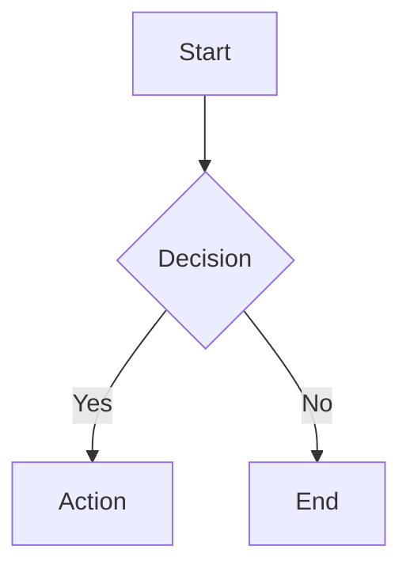

# 📝 Obsidian-Like Digital Garden

Personal knowledge base & digital garden berbasis **MDX** dengan fitur-fitur terinspirasi dari [Obsidian](https://obsidian.md). Dibangun menggunakan React, Vite, dan Tailwind CSS.


---

## ✨ Fitur Utama

### 📄 Konten MDX

- **Writing** — Catatan personal, opini, dan eksplorasi ide
- **Artikel** — Tutorial teknis mendalam dan panduan
- **Read** — Kurasi bacaan menarik dari internet

### 🔮 Obsidian-Like Features

| Fitur | Deskripsi |
|-------|-----------|
| **Callouts** | 14 tipe callout (info, tip, warning, danger, success, note, example, bug, question, abstract, important, caution, dll) |
| **Mermaid Diagrams** | Flowchart, sequence diagram, pie chart — auto-render dengan tema terang/gelap |
| **LaTeX Math (KaTeX)** | Inline (`$...$`) dan block (`$$...$$`) mathematical expressions |
| **Syntax Highlighting** | Multi-bahasa (TypeScript, Python, Bash, dll) dengan tombol copy dan tema `github-dark-dimmed` |
| **WikiLinks** | Internal linking antar artikel dengan format `<WikiLink to="slug" />`, strikethrough untuk link mati |
| **Highlight** | Teks highlight menggunakan komponen `<Highlight>` |
| **YouTube Embed** | Embed video YouTube responsif via `<YouTube url="..." />` |
| **Backlinks** | Auto-deteksi dan tampilkan artikel yang me-referensikan artikel saat ini |
| **Graph View** | Visualisasi interaktif koneksi antar konten (force-directed graph) |
| **Table of Contents** | TOC sticky di desktop, collapsible bottom bar di mobile dengan active section tracking |
| **GFM Support** | Tabel, strikethrough (`~~text~~`), dan task lists (`- [x]`) |
| **Blockquotes** | Styled blockquotes dengan ikon dan border |

### 🎨 UI/UX

- **Dark/Light Mode** — Toggle tema dengan transisi halus, warna yang dioptimasi untuk kedua mode
- **Responsive Design** — Layout adaptif untuk desktop, tablet, dan mobile
- **Lazy Loading** — Semua halaman di-lazy load untuk performa optimal
- **Search Modal** — Pencarian konten cepat dengan keyboard shortcut
- **Filter & Chips** — Filter konten berdasarkan kategori dan tag

---

## 🏗️ Tech Stack

| Teknologi | Kegunaan |
|-----------|----------|
| [React 18](https://react.dev) | UI framework dengan Suspense & lazy loading |
| [TypeScript](https://typescriptlang.org) | Type safety |
| [Vite](https://vitejs.dev) | Build tool & dev server |
| [Tailwind CSS](https://tailwindcss.com) | Utility-first styling dengan design tokens |
| [shadcn/ui](https://ui.shadcn.com) | Komponen UI berbasis Radix primitives |
| [MDX 3](https://mdxjs.com) | Markdown + JSX untuk konten |
| [React Router 6](https://reactrouter.com) | Client-side routing |
| [Mermaid 11](https://mermaid.js.org) | Diagram rendering |
| [KaTeX](https://katex.org) | Rendering rumus matematika |
| [Shiki](https://shiki.style) + rehype-pretty-code | Syntax highlighting |
| [remark-gfm](https://github.com/remarkjs/remark-gfm) | GitHub Flavored Markdown |
| [Framer Motion](https://www.framer.com/motion/) | Animasi UI (via Tailwind animate) |
| [TanStack Query](https://tanstack.com/query) | Server state management |

---

## 📁 Struktur Proyek

```
src/
├── components/           # Komponen UI
│   ├── Backlinks.tsx      # Auto-generated backlinks
│   ├── Callout.tsx        # Obsidian-style callouts
│   ├── CodeBlock.tsx      # Syntax highlighting + copy button
│   ├── FilterChips.tsx    # Kategori & tag filters
│   ├── Footer.tsx         # Site footer
│   ├── GraphView.tsx      # Interactive knowledge graph
│   ├── Highlight.tsx      # Inline text highlight
│   ├── Layout.tsx         # App shell (navbar + outlet)
│   ├── MdxComponents.tsx  # MDX component mapping
│   ├── MermaidDiagram.tsx # Mermaid chart renderer
│   ├── Navbar.tsx         # Navigation bar
│   ├── PostCard.tsx       # Card untuk writing/artikel
│   ├── ReadItemCard.tsx   # Card untuk read items
│   ├── SearchModal.tsx    # Pencarian global
│   ├── TableOfContents.tsx# TOC sticky/collapsible
│   ├── ThemeToggle.tsx    # Dark/light mode toggle
│   ├── WikiLink.tsx       # Internal wiki-style links
│   ├── YouTubeEmbed.tsx   # Responsive YouTube embed
│   └── ui/               # shadcn/ui components
│
├── content/              # Konten MDX
│   ├── articles/          # Tutorial & panduan teknis
│   ├── writing/           # Catatan & opini personal
│   ├── read/              # Kurasi bacaan internet
│   └── index.ts           # Auto-import & content registry
│
├── data/
│   ├── posts.ts           # Static post data
│   └── types.ts           # TypeScript type definitions
│
├── hooks/                # Custom React hooks
│   ├── use-mobile.tsx     # Mobile breakpoint detection
│   └── use-toast.ts       # Toast notifications
│
├── pages/                # Route pages
│   ├── Index.tsx          # Homepage
│   ├── Writing.tsx        # Daftar writing
│   ├── Articles.tsx       # Daftar artikel
│   ├── Read.tsx           # Daftar bacaan
│   ├── ReadDetail.tsx     # Detail bacaan
│   ├── ArticleDetail.tsx  # Detail writing/artikel
│   ├── GraphPage.tsx      # Full-page graph view
│   ├── About.tsx          # Halaman about
│   └── NotFound.tsx       # 404 page
│
├── index.css             # Global styles & design tokens
├── App.tsx               # Root component & routing
└── main.tsx              # Entry point
```

---

## 🚀 Cara Menjalankan

### Prasyarat

- **Node.js** >= 18
- **npm** atau **bun**

### Instalasi

```bash
# Clone repository
git clone <YOUR_GIT_URL>
cd <YOUR_PROJECT_NAME>

# Install dependencies
npm install

# Jalankan development server
npm run dev
```

Aplikasi akan berjalan di `http://localhost:8080`.

### Build untuk Production

```bash
npm run build
npm run preview
```

---

## 📝 Menambahkan Konten Baru

### Writing / Artikel

Buat file `.mdx` baru di `src/content/writing/` atau `src/content/articles/`:

```mdx
---
title: "Judul Artikel"
slug: judul-artikel
summary: "Ringkasan singkat artikel ini."
type: note          # note | essay | article
category: Tech      # Tech | Refleksi | Produktivitas | Linux | Coding | Life
tags: [tag1, tag2]
date: "2026-02-11"
readingTime: 5
featured: false
---

Konten artikel ditulis di sini menggunakan **Markdown** dan komponen JSX.

<Callout type="info" title="Catatan">
Komponen khusus bisa langsung digunakan di MDX!
</Callout>
```

### Bacaan (Read)

Buat file `.mdx` di `src/content/read/`:

```mdx
---
title: "Judul Bacaan"
slug: judul-bacaan
snippet: "Ringkasan singkat dari bacaan."
source: "nama-situs.com"
url: "https://link-asli.com/artikel"
tags: [tag1, tag2]
date: "2026-02-11"
---

Komentar atau catatan tentang bacaan ini (opsional).
```

> **Catatan:** File `.mdx` otomatis terdeteksi — tidak perlu import manual!

---

## 🧩 Komponen MDX yang Tersedia

### Callout

```mdx
<Callout type="info" title="Judul">
Isi callout di sini.
</Callout>
```

Tipe yang tersedia: `info`, `tip`, `warning`, `danger`, `success`, `note`, `example`, `bug`, `question`, `abstract`, `important`, `caution`

### Mermaid Diagram

````mdx

````

Mendukung: `graph`, `sequenceDiagram`, `pie`, `classDiagram`, `stateDiagram`, `erDiagram`, `gantt`, dan lainnya.

### LaTeX Math

```mdx
Inline: $E = mc^2$

Block:
$$
\int_0^\infty e^{-x} dx = 1
$$
```

### WikiLink

```mdx
<WikiLink to="slug-artikel" label="Teks Link" />
```

### Highlight

```mdx
<Highlight>teks yang di-highlight</Highlight>
```

### YouTube Embed

```mdx
<YouTube url="https://youtube.com/watch?v=VIDEO_ID" title="Judul Video" />
```

---

## 🗺️ Routing

| Path | Halaman |
|------|---------|
| `/` | Homepage |
| `/writing` | Daftar writing |
| `/writing/:slug` | Detail writing |
| `/artikel` | Daftar artikel |
| `/artikel/:slug` | Detail artikel |
| `/read` | Daftar bacaan |
| `/read/:slug` | Detail bacaan |
| `/graph` | Interactive graph view |
| `/about` | Halaman about |

---

## 🎨 Tema & Design System

Aplikasi menggunakan design tokens berbasis CSS custom properties (HSL) yang didefinisikan di `src/index.css`:

```css
:root {
  --background: 222 20% 10%;
  --foreground: 210 20% 90%;
  --primary: 199 89% 48%;
  /* ... */
}

.light {
  --background: 210 25% 97%;
  --foreground: 228 15% 32%;
  --primary: 199 89% 40%;
  /* ... */
}
```

Semua warna menggunakan semantic tokens (`bg-background`, `text-foreground`, `text-primary`, dll) untuk konsistensi antar tema.

---

## 📄 Lisensi

MIT License — bebas digunakan dan dimodifikasi.
