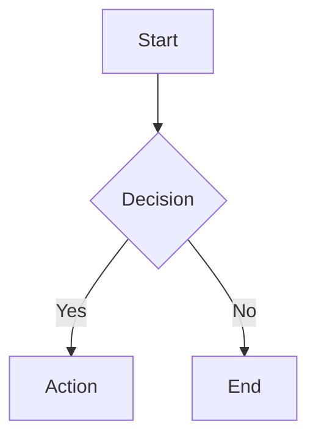

# 🌿 BangunAI — Digital Garden & Knowledge Base

Personal knowledge base & digital garden berbasis **MDX** dengan fitur-fitur terinspirasi dari [Obsidian](https://obsidian.md). Dibangun menggunakan React, Vite, Tailwind CSS, dan TypeScript.


---

## ✨ Fitur Utama

### 📄 Tipe Konten

| Tipe | Deskripsi | Lokasi File |
|------|-----------|-------------|
| **Writing** | Catatan pendek (notes) dan tulisan mendalam (essays) | `src/content/writing/` |
| **Artikel** | Tutorial teknis, panduan, dan opini terstruktur | `src/content/articles/` |
| **Read** | Kurasi bacaan menarik dari internet dengan catatan | `src/content/read/` |
| **Now** | Update aktivitas terkini (inspired by [nownownow.com](https://nownownow.com)) | `src/content/now.mdx` |
| **About** | Halaman tentang, diedit langsung via MDX | `src/content/about.mdx` |

> **Auto-discovery:** File `.mdx` baru otomatis terdeteksi via `import.meta.glob` — tidak perlu import manual!

### 🔮 Obsidian-Like Features

| Fitur | Deskripsi |
|-------|-----------|
| **Callouts** | 14 tipe callout (info, tip, warning, danger, success, note, example, bug, question, abstract, important, caution, dll) |
| **Mermaid Diagrams** | Flowchart, sequence, pie chart — auto-render dengan tema terang/gelap, unique ID per diagram |
| **UML Diagrams** | Class diagram, state diagram, ER diagram, Gantt chart — powered by Mermaid v11 |
| **LaTeX Math (KaTeX)** | Inline (`$...$`) dan block (`$$...$$`) mathematical expressions |
| **Syntax Highlighting** | Multi-bahasa (TypeScript, Python, Bash, dll) dengan tombol copy — powered by Shiki |
| **WikiLinks** | Internal linking antar artikel `<WikiLink to="slug" />`, strikethrough otomatis untuk link mati |
| **Highlight** | Teks highlight menggunakan `<Highlight>` atau `<mark>` |
| **YouTube Embed** | Embed video YouTube responsif via `<YouTube url="..." />` |
| **Backlinks** | Auto-deteksi dan tampilkan artikel yang me-referensikan artikel saat ini |
| **Graph View** | Visualisasi interaktif koneksi antar konten (force-directed graph dengan Canvas) |
| **Table of Contents** | TOC sticky di desktop + collapsible bottom bar di mobile, dengan active heading tracking & progress bar |
| **GFM Support** | Tabel, strikethrough (`~~text~~`), dan task lists (`- [x]`) |
| **Blockquote Callouts** | Mendukung sintaks Obsidian `> [!type] title` di blockquote |

### 🏷️ Sistem Tags

- **Halaman Tags** (`/tags`) — Menampilkan semua tag dengan jumlah konten
- **Clickable Tags** — Setiap tag di artikel/bacaan bisa diklik, langsung filter di halaman tags
- **Tag Cloud** — Visualisasi semua tag dengan filter interaktif
- **Cross-content** — Tags menghubungkan writing, artikel, dan bacaan

### 🕐 Timestamp pada Konten

Setiap konten menampilkan **tanggal dan jam penulisan** secara konsisten di seluruh halaman:
- Detail artikel: `11 Februari 2026, 14:30`
- Card list: `11 Feb · 14:30`
- Compact rows: `11 Feb · 14:30`

### 🎨 UI/UX

- **Dark/Light Mode** — Toggle tema instan dengan warna cream BangunAI yang elegan
- **Branding Cream** — Palette navy gelap (#1A1A2E) + cream (#F5E6D3) yang konsisten
- **Responsive Design** — Layout adaptif untuk desktop, tablet, dan mobile
- **Lazy Loading** — Semua halaman di-lazy load dengan Suspense untuk performa optimal
- **Search Modal** — Pencarian konten cepat dengan shortcut `Cmd+K` / `Ctrl+K`
- **Filter & Chips** — Filter konten berdasarkan kategori, tipe, dan tag
- **Glass Morphism** — Efek kaca transparan pada navbar dan card
- **Reading Progress** — Progress bar di atas halaman saat membaca artikel
- **Performa Optimal** — Transisi tema tanpa delay, scroll halus

---

## 🏗️ Tech Stack

| Teknologi | Kegunaan |
|-----------|----------|
| [React 18](https://react.dev) | UI framework dengan Suspense & lazy loading |
| [TypeScript 5](https://typescriptlang.org) | Type safety di seluruh codebase |
| [Vite](https://vitejs.dev) | Build tool & dev server yang cepat |
| [Tailwind CSS](https://tailwindcss.com) | Utility-first styling dengan semantic design tokens (HSL) |
| [shadcn/ui](https://ui.shadcn.com) | Komponen UI berbasis Radix primitives |
| [MDX 3](https://mdxjs.com) | Markdown + JSX untuk konten yang kaya |
| [React Router 6](https://reactrouter.com) | Client-side routing dengan lazy routes |
| [Mermaid 11](https://mermaid.js.org) | Diagram rendering (flowchart, sequence, pie, class, state, ER, gantt) |
| [KaTeX](https://katex.org) | Rendering rumus matematika cepat |
| [Shiki](https://shiki.style) + rehype-pretty-code | Syntax highlighting berkualitas tinggi |
| [remark-gfm](https://github.com/remarkjs/remark-gfm) | GitHub Flavored Markdown (tabel, checklist, strikethrough) |
| [remark-math](https://github.com/remarkjs/remark-math) + rehype-katex | Math rendering pipeline |
| [TanStack Query](https://tanstack.com/query) | Server state management |
| [Lucide React](https://lucide.dev) | Ikon SVG yang konsisten |

### Font Stack

| Font | Penggunaan |
|------|------------|
| **Space Grotesk** | Heading & navigasi |
| **Source Serif 4** | Body text artikel (serif) |
| **Inter** | UI elements & label |
| **JetBrains Mono** | Code blocks & inline code |

---

## 📁 Struktur Proyek

```
src/
├── components/               # Komponen UI
│   ├── Backlinks.tsx          # Auto-generated backlinks
│   ├── Callout.tsx            # 14 tipe Obsidian-style callouts
│   ├── CodeBlock.tsx          # Syntax highlighting + copy button
│   ├── FilterChips.tsx        # Kategori & tag filter chips
│   ├── Footer.tsx             # Site footer
│   ├── GraphView.tsx          # Interactive force-directed knowledge graph
│   ├── Highlight.tsx          # Inline text highlight
│   ├── Layout.tsx             # App shell (navbar + outlet + footer)
│   ├── MdxComponents.tsx      # MDX → React component mapping
│   ├── MermaidDiagram.tsx     # Mermaid chart renderer (dangerouslySetInnerHTML, theme-aware)
│   ├── Navbar.tsx             # Navigation bar + mobile menu
│   ├── NavLink.tsx            # Active-aware nav link
│   ├── PostCard.tsx           # Card variants (Featured, List, Compact)
│   ├── ReadItemCard.tsx       # Card untuk read items
│   ├── SearchModal.tsx        # Global search (Cmd+K)
│   ├── TableOfContents.tsx    # TOC sticky desktop + bottom bar mobile
│   ├── TagLink.tsx            # Clickable tag dengan link ke /tags
│   ├── ThemeToggle.tsx        # Dark/light mode toggle
│   ├── TypeBadge.tsx          # Badge untuk tipe konten (note/essay/article)
│   ├── WikiLink.tsx           # Internal wiki-style links
│   ├── YouTubeEmbed.tsx       # Responsive YouTube embed
│   └── ui/                   # shadcn/ui components (40+ komponen)
│
├── content/                  # Konten MDX (auto-discovered)
│   ├── articles/              # Tutorial & panduan teknis (.mdx)
│   ├── writing/               # Catatan & opini personal (.mdx)
│   ├── read/                  # Kurasi bacaan internet (.mdx)
│   ├── about.mdx              # Halaman about (editable via MDX)
│   ├── now.mdx                # Halaman now — aktivitas terkini
│   └── index.ts               # Auto-import registry via import.meta.glob
│
├── data/
│   ├── posts.ts               # Helper functions (getLatestPosts, getRelatedPosts, dll)
│   └── types.ts               # TypeScript types (Post, ReadItem, Category, dll)
│
├── hooks/
│   ├── use-mobile.tsx         # Mobile breakpoint detection hook
│   └── use-toast.ts           # Toast notification hook
│
├── lib/
│   ├── date.ts                # Date+time formatting helpers (formatDateTime, formatDateShort, formatDateMedium)
│   └── utils.ts               # Tailwind merge & class utilities
│
├── pages/
│   ├── Index.tsx              # Homepage (3 terbaru + latest posts + now reading)
│   ├── Writing.tsx            # Daftar writing dengan filter tipe & kategori
│   ├── Articles.tsx           # Daftar artikel dikelompokkan per tahun
│   ├── ArticleDetail.tsx      # Detail writing/artikel + TOC + backlinks + graph
│   ├── Read.tsx               # Daftar bacaan dengan filter tag
│   ├── ReadDetail.tsx         # Detail bacaan
│   ├── Tags.tsx               # Halaman semua tags dengan filter
│   ├── Now.tsx                # Halaman now — aktivitas terkini
│   ├── GraphPage.tsx          # Full-page interactive graph view
│   ├── About.tsx              # Halaman about (render dari about.mdx)
│   └── NotFound.tsx           # 404 page
│
├── index.css                 # Global styles, design tokens, prose styles
├── App.tsx                   # Root component & route definitions
└── main.tsx                  # Entry point
```

---

## 🗺️ Routing

| Path | Halaman | Deskripsi |
|------|---------|-----------|
| `/` | Homepage | 3 tulisan terbaru & daftar latest posts |
| `/writing` | Writing | Daftar catatan & essay dengan filter |
| `/writing/:slug` | Detail Writing | Artikel lengkap + TOC + backlinks + graph |
| `/artikel` | Artikel | Daftar artikel dikelompokkan per tahun |
| `/artikel/:slug` | Detail Artikel | Artikel lengkap + TOC + backlinks + graph |
| `/read` | Read | Daftar bacaan kurasi dengan filter tag |
| `/read/:slug` | Detail Read | Detail bacaan dengan catatan |
| `/now` | Now | Aktivitas terkini (inspired by nownownow.com) |
| `/tags` | Tags | Semua tag dengan filter interaktif |
| `/tags?tag=nama` | Tags (filtered) | Konten difilter berdasarkan tag tertentu |
| `/graph` | Graph View | Visualisasi koneksi antar konten |
| `/about` | About | Halaman tentang (dari MDX) |

---

## 🚀 Cara Menjalankan

### Prasyarat

- **Node.js** >= 18
- **npm**, **yarn**, atau **bun**

### Instalasi & Development

```bash
# Clone repository
git clone <YOUR_GIT_URL>
cd <YOUR_PROJECT_NAME>

# Install dependencies
npm install

# Jalankan development server
npm run dev
```

Aplikasi akan berjalan di `http://localhost:8080`.

### Build untuk Production

```bash
# Build
npm run build

# Preview production build
npm run preview
```

### Testing

```bash
# Jalankan unit tests
npm run test
```

---

## 📝 Menambahkan Konten Baru

### Writing / Artikel

Buat file `.mdx` baru di `src/content/writing/` atau `src/content/articles/`:

```mdx
---
title: "Judul Tulisan"
slug: judul-tulisan
summary: "Ringkasan singkat tulisan ini."
type: note              # note | essay | article
category: Tech          # Tech | Refleksi | Produktivitas | Linux | Coding | Life
tags: [react, tutorial]
date: "2026-02-11T14:30:00"
readingTime: 5
---

Konten ditulis di sini menggunakan **Markdown** dan komponen JSX.

## Heading Otomatis Masuk TOC

Heading h2, h3, h4 otomatis muncul di Table of Contents.

<Callout type="tip" title="Tips">
Komponen khusus bisa langsung digunakan di dalam MDX!
</Callout>
```

### Bacaan (Read)

Buat file `.mdx` di `src/content/read/`:

```mdx
---
title: "Judul Bacaan"
slug: judul-bacaan
snippet: "Ringkasan singkat dari bacaan."
source: "nama-situs.com"
url: "https://link-asli.com/artikel"
tags: [programming, career]
date: "2026-02-11T18:00:00"
---

Catatan atau komentar tentang bacaan ini (opsional).
```

### Now Page

Edit langsung file `src/content/now.mdx`:

```mdx
---
title: "Now"
---

## Apa yang Sedang Saya Kerjakan

*Terakhir diperbarui: Februari 2026*

Tulis aktivitas terkini di sini...
```

### About Page

Edit langsung file `src/content/about.mdx`:

```mdx
---
title: "About"
---

Konten halaman About ditulis di sini.
Mendukung semua fitur MDX (callout, highlight, dll).
```

> 💡 **Catatan:** Semua file `.mdx` baru otomatis terdeteksi — tidak perlu mengedit file lain!

---

## 🧩 Komponen MDX yang Tersedia

### Callout

```mdx
<Callout type="info" title="Judul">
Isi callout di sini.
</Callout>
```

**14 tipe tersedia:** `info`, `tip`, `warning`, `danger`, `success`, `note`, `example`, `bug`, `question`, `abstract`, `important`, `caution`, `quote`, `cite`

### Mermaid Diagram

````mdx

````

**Mendukung semua diagram Mermaid v11:**
- `graph` / `flowchart` — Flowchart
- `sequenceDiagram` — Sequence diagram
- `pie` — Pie chart
- `classDiagram` — UML class diagram
- `stateDiagram-v2` — UML state diagram
- `erDiagram` — Entity relationship diagram
- `gantt` — Gantt chart
- Dan lainnya (mindmap, timeline, dll)

### LaTeX Math

```mdx
Inline: $E = mc^2$

Block:
$$
\int_0^\infty e^{-x} dx = 1
$$
```

### WikiLink

```mdx
<WikiLink to="slug-artikel" label="Teks yang Ditampilkan" />
```

Link mati (slug tidak ditemukan) akan otomatis ditampilkan dengan strikethrough.

### Highlight

```mdx
<Highlight>teks yang di-highlight</Highlight>
```

### YouTube Embed

```mdx
<YouTube url="https://youtube.com/watch?v=VIDEO_ID" title="Judul Video" />
```

### Obsidian Blockquote Callout

```mdx
> [!info] Judul Callout
> Isi callout menggunakan sintaks Obsidian.
```

---

## 🎨 Design System & Theming

### Color Palette

Aplikasi menggunakan branding **cream elegan** dengan design tokens berbasis HSL di `src/index.css`:

#### Dark Mode (Default)
| Token | Warna | Deskripsi |
|-------|-------|-----------|
| `--background` | Navy gelap | Latar belakang utama |
| `--foreground` | Cream | Teks utama |
| `--primary` | Gold/amber | Aksen utama, link, tombol aktif |
| `--accent` | Warm gold | Aksen sekunder, hover states |
| `--card` | Navy lebih terang | Background kartu & panel |

#### Light Mode
| Token | Warna | Deskripsi |
|-------|-------|-----------|
| `--background` | Cream hangat | Latar belakang utama |
| `--foreground` | Navy gelap | Teks utama |
| `--primary` | Amber gelap | Aksen utama |
| `--card` | Cream lebih gelap | Background kartu & panel |

### Cara Menggunakan Token

```tsx
// ✅ Benar — gunakan semantic tokens
<div className="bg-background text-foreground">
  <button className="bg-primary text-primary-foreground">
    Klik
  </button>
</div>

// ❌ Salah — jangan hardcode warna
<div className="bg-[#1A1A2E] text-[#F5E6D3]">
```

### Glass Morphism

```tsx
<div className="glass glass-hover rounded-xl p-6">
  Konten dengan efek kaca
</div>
```

---

## ⚡ Performa

- **Lazy loading** semua halaman via `React.lazy()` + `Suspense`
- **Transisi tema instan** — CSS transition hanya pada elemen kunci, bukan `*`
- **Mermaid render** menggunakan `dangerouslySetInnerHTML` via React state (menghindari DOM conflict)
- **TOC** menggunakan `MutationObserver` (bukan setTimeout) untuk deteksi heading
- **Code splitting** otomatis oleh Vite
- **Font display swap** untuk menghindari FOIT
- **Date formatting** terpusat di `src/lib/date.ts` untuk konsistensi

---

## 🔧 Konfigurasi

### Vite (`vite.config.ts`)
- MDX plugin dengan `jsxImportSource: "react"`, remark-gfm, remark-math, remark-frontmatter
- Rehype plugins: rehype-katex, rehype-pretty-code (Shiki, tema `github-dark-dimmed`)
- Path alias `@/` → `src/`

### Tailwind (`tailwind.config.ts`)
- Custom font families (Space Grotesk, Source Serif 4, Inter, JetBrains Mono)
- Semantic color tokens dari CSS variables
- Custom animations (fade-in, glow-pulse, accordion)
- Dark mode via class strategy

### TypeScript
- Strict mode enabled
- Path aliases configured
- MDX type declarations (`src/mdx.d.ts`)

---

## 📦 Scripts

| Script | Deskripsi |
|--------|-----------|
| `npm run dev` | Development server (port 8080) |
| `npm run build` | Production build |
| `npm run preview` | Preview production build |
| `npm run test` | Run unit tests (Vitest) |
| `npm run lint` | Lint codebase (ESLint) |

---

## 📄 Lisensi

MIT License — bebas digunakan dan dimodifikasi.

---

<p align="center">
  Dibuat dengan ❤️ menggunakan <strong>BangunAI</strong> + <a href="https://lovable.dev">Lovable</a>
</p>
