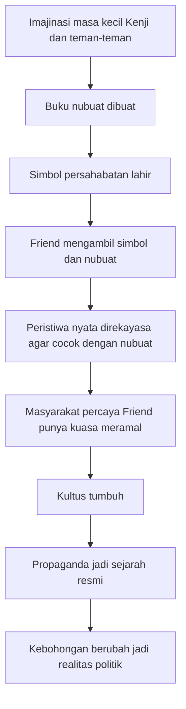
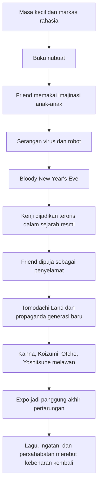

## 🎸 Pendahuluan: Mengapa *20th Century Boys* Terasa Sangat Besar, Sangat Aneh, dan Sangat Menakutkan?

Ada manga thriller yang membuat kita tegang karena pembunuhan. Ada yang membuat kita penasaran karena teka-teki identitas. Ada pula yang memikat karena konspirasi global. Tetapi **20th Century Boys** karya **Naoki Urasawa** terasa berbeda, karena ia mengambil sesuatu yang tampaknya lembut dan akrab—**masa kecil, permainan, nostalgia, lagu, simbol persahabatan, rahasia di markas rahasia bocah-bocah**—lalu mengubah semuanya menjadi mesin teror berskala dunia. 🎸

Inilah yang membuat *20th Century Boys* begitu istimewa. Ia bukan hanya misteri tentang siapa **Friend** sebenarnya. Ia adalah cerita tentang:
- bagaimana ingatan masa kecil bisa dibajak,
- bagaimana imajinasi polos bisa dipakai untuk membangun kediktatoran,
- bagaimana orang biasa bisa dijadikan kambing hitam sejarah,
- dan bagaimana kebohongan yang diulang terus-menerus akhirnya menjadi versi realitas yang dipercaya dunia.

Secara garis besar, manga ini mengikuti **Kenji Endo** dan teman-teman masa kecilnya, yang suatu hari menyadari bahwa berbagai tragedi besar di dunia tampaknya mengikuti skenario dari “buku nubuat” yang mereka buat saat kecil. Masalahnya, ada seseorang bertopeng bernama **Friend** yang sedang mewujudkan semua khayalan itu satu demi satu.

Yang menyeramkan bukan cuma skala ancamannya, tetapi kenyataan bahwa Friend membangun kekuasaan dari hal-hal yang sangat kecil:
- simbol yang dulu hanya coretan bocah,
- kenangan bersama,
- luka sosial kecil yang tak selesai,
- dan kebutuhan manusia untuk percaya pada penyelamat.

Artikel ini akan membedah *20th Century Boys* secara **sangat detail, lengkap, dan mendalam**. Bukan sekadar meringkas plot, melainkan menelusuri bagaimana Urasawa membangun:
- misteri berlapis,
- psikologi tokoh-tokoh kuncinya,
- politik kultus dan propaganda,
- struktur memori dan trauma,
- serta makna filosofis di balik pertarungan Kenji, Kanna, dan Friend.

---

<Callout type="important" title="Catatan spoiler">
Artikel ini membahas spoiler besar hampir seluruh kisah *20th Century Boys* beserta penjelasan identitas Friend, Bloody New Year's Eve, Kanna, Sadakiyo, Fukubei, Katsumata, dan lapisan-lapisan tipu daya di balik semuanya.
</Callout>

---

## 📚 1. Apa Itu *20th Century Boys* dan Mengapa Dianggap Karya Besar?

*20th Century Boys* adalah manga karya **Naoki Urasawa**, terbit antara 1999 sampai 2006 dengan total 249 chapter. Ini adalah karya yang sulit dimasukkan ke satu genre saja. Ia memadukan:

- **mystery** *(misteri)*
- **thriller** *(cerita menegangkan)*
- **science fiction ringan** *(fiksi ilmiah dengan unsur kiamat, virus, robot, dan teknologi manipulatif)*
- **political conspiracy** *(konspirasi politik)*
- **cult psychology** *(psikologi kultus / pola pikir kelompok pemuja pemimpin)*
- **coming-of-age shadow** *(bayangan pertumbuhan / bagaimana masa kecil menghantui masa dewasa)*

Yang membuatnya besar bukan hanya plotnya yang rumit, tetapi juga keberanian Urasawa untuk menghubungkan tiga level sekaligus:

1. **level personal** — luka, rasa bersalah, persahabatan, keluarga, kegagalan hidup,
2. **level sosial** — kultus, propaganda, pemalsuan sejarah, institusi yang disusupi,
3. **level mitologis** — penyelamat palsu, kitab nubuat, kiamat, tokoh bertopeng, dan figur “terpilih”.

Manga ini terasa besar karena setiap masalah global selalu kembali ke sesuatu yang intim. Kiamat dunia ternyata berkaitan dengan permainan bocah-bocah. Diktator dunia lahir dari luka masa kecil. Simbol dunia baru ternyata cuma coretan anak kecil. 

Urasawa sangat ahli pada titik ini: ia membuat sejarah besar terasa berasal dari sudut gang kecil, lapangan kosong, kelas sekolah, dan rasa iri anak-anak. 📚

---

## 🧒 2. 1973, 1969, dan Akar Seluruh Bencana: Masa Kecil yang Tidak Pernah Selesai

Sejak awal, *20th Century Boys* menegaskan bahwa masa kecil bukan fase yang selesai lalu hilang. Ia adalah **mesin bawah sadar sejarah**. 🧒

Kenji dan teman-temannya—Maruo, Yoshitsune, Donkey, Otcho, dan lain-lain—adalah anak-anak biasa yang:
- punya markas rahasia,
- punya simbol persahabatan,
- bermimpi soal kiamat, robot raksasa, senjata laser, virus, dan pahlawan penyelamat,
- mengamati dunia orang dewasa sambil mengolahnya dengan logika anak-anak.

Di sini ada sesuatu yang sangat penting. Imajinasi anak-anak biasanya dianggap tidak berbahaya. Tetapi Urasawa menunjukkan bahwa imajinasi itu bisa menjadi cetak biru bagi bencana, kalau suatu hari diambil alih oleh orang yang salah.

Kenji dan kawan-kawan membuat semacam **Book of Prophecy** *(buku nubuat / buku skenario akhir dunia versi anak-anak)*. Di dalamnya ada:
- virus mematikan,
- serangan pada kota-kota besar,
- robot raksasa,
- dan para pahlawan yang akan menyelamatkan dunia.

Saat dewasa, mereka mengira semua itu sudah lama berlalu. Ternyata tidak. Ada seseorang yang mengambil semua imajinasi itu dan menjadikannya agenda politik dan teror nyata.

Dari sinilah horor manga ini lahir:

> **masa kecil tidak hilang. ia bisa kembali sebagai takdir sejarah.**

---

## 🏪 3. Kenji Endo: Pahlawan yang Tidak Tampak Seperti Pahlawan

Saat pertama kali kita bertemu Kenji di tahun 1997, dia bukan tokoh heroik dalam arti konvensional. Ia tidak sukses besar, tidak menguasai keadaan, tidak hidup glamor. Ia bekerja di minimarket, mengurus bayi peninggalan kakaknya, dan terlihat seperti orang biasa yang hidupnya tidak spektakuler. 🏪

Justru di sinilah kekuatan Kenji sebagai protagonis.

Kenji adalah representasi orang biasa yang:
- pernah punya mimpi besar saat muda,
- gagal menjadi musisi besar,
- terjebak tanggung jawab hidup,
- dan perlahan merasa bahwa hidup telah mengecil.

Tetapi ketika simbol masa kecil itu kembali, justru Kenji yang harus berdiri. Bukan karena dia paling kuat, melainkan karena dialah salah satu sedikit orang yang:
- masih punya hubungan moral dengan masa kecil itu,
- masih punya rasa tanggung jawab,
- dan akhirnya bersedia menanggung beban yang tidak dipilihnya.

Kenji sangat manusiawi karena ia bukan pahlawan sempurna. Ia ragu. Ia takut. Ia marah. Ia sering terlambat memahami sesuatu. Tetapi justru itulah yang membuat perjuangannya terasa berat dan nyata.

Ia bukan penyelamat yang lahir dari langit. Ia adalah orang biasa yang dipaksa sejarah untuk mengingat siapa dirinya dulu.

---

## 🎭 4. Friend: Topeng, Kultus, dan Misteri Sosok yang Mengubah Dunia

Kalau Kenji adalah pusat moral cerita, maka **Friend** adalah pusat horornya. Friend bukan sekadar villain *(antagonis)* biasa. Ia adalah gabungan dari:
- pemimpin kultus,
- manipulator memori,
- arsitek propaganda,
- dan figur mesianik palsu.

Friend selalu menarik karena identitasnya tidak stabil. Topengnya bukan sekadar penutup wajah. Topeng itu adalah alat untuk membuat orang percaya bahwa yang penting bukan siapa dia, tetapi **mitos** yang ia bangun. 🎭

Di mata publik, Friend adalah:
- penyelamat dunia,
- nabi akhir zaman,
- pemimpin yang punya skenario masa depan,
- dan figur yang “selalu benar” karena semua kejadian tampak mengikuti nubuatnya.

Tetapi bagi pembaca, Friend adalah teka-teki yang jauh lebih rumit. Siapa sebenarnya di balik topeng? Apakah hanya satu orang? Mengapa seolah ada lapisan identitas? Mengapa ada kebingungan antara **Fukubei**, **Sadakiyo**, dan kemudian **Katsumata**?

Misteri Friend bekerja bukan hanya di level plot, tetapi juga simbolis. Friend adalah wujud ekstrem dari satu gagasan:

> **ketika masyarakat lebih percaya pada narasi dan simbol daripada kenyataan, maka siapa pun yang bisa mengendalikan narasi akan tampak seperti dewa.**

---

## ☠️ 5. Donkey, Shikishima, Moroboshi, dan Tubuh-Tubuh Awal yang Menandai Konspirasi

Sebelum dunia benar-benar masuk ke fase kiamat, Urasawa meletakkan banyak tanda lewat kematian dan hilangnya orang-orang yang tahu terlalu banyak. ☠️

### Shikishima
Profesor ini penting karena ia dihubungkan dengan robot dan proyek teknis yang akan dipakai Friend. Ia bukan hilang begitu saja; ia adalah contoh bagaimana Friend membajak ilmu pengetahuan dan memaksa para ahli menjadi komponen mesin apokalips.

### Donkey
Donkey adalah salah satu tokoh paling penting secara emosional. Ia guru, orang baik, dan salah satu yang mulai menyadari bahwa simbol masa kecil mereka terhubung dengan sesuatu yang mengerikan. Sebelum mati, Donkey meninggalkan petunjuk pada Kenji. Dalam banyak hal, Donkey adalah “nabi pertama” yang gagal menyelamatkan dunia, tetapi berhasil menyalakan alarm moral.

### Moroboshi
Kematian Moroboshi dan berbagai “bunuh diri” lain menunjukkan pola khas dunia Friend: siapa pun yang terlalu dekat dengan kebenaran akan disingkirkan—sering kali dengan cara yang membuat kematiannya tampak biasa atau tertutup oleh kebisingan sosial.

Semua korban awal ini punya fungsi naratif penting: mereka mengubah cerita dari nostalgia aneh menjadi thriller konspirasi penuh. Kenji tidak lagi bisa menganggap simbol itu hanya lelucon lama. Ia dipaksa menerima bahwa seseorang sedang benar-benar membangun kiamat dari benda-benda masa kecil mereka.

---

## 🧠 6. Simbol Persahabatan: Dari Coretan Bocah Menjadi Lambang Kekuasaan Massal

Salah satu ide paling cerdas di manga ini adalah penggunaan simbol sederhana—lingkaran dengan garis dan tangan—sebagai lambang besar organisasi Friend. Simbol ini awalnya hanyalah bagian dari permainan anak-anak. Tetapi saat dewasa, simbol itu muncul di mana-mana:
- dinding,
- kaus,
- pertemuan kultus,
- markas organisasi,
- struktur kekuasaan.

Itu sangat mengerikan. Mengapa? Karena Urasawa memperlihatkan bahwa totalitarianisme *(kekuasaan total yang menyerap semua aspek hidup)* sering tidak lahir dari sesuatu yang sejak awal tampak jahat. Kadang ia lahir dari simbol yang kosong, sederhana, dan tampak akrab—lalu diberi muatan mitos secara bertahap. 🧠

Maka setiap kali simbol Friend muncul, pembaca merasakan dua lapisan sekaligus:
- kenangan masa kecil yang hangat,
- dan rasa ngeri karena simbol itu kini berarti penyerahan diri massal pada kebohongan.

---

## 📖 7. Book of Prophecy: Nubuat atau Program Politik?

**Book of Prophecy** adalah jantung cerita. Pada level literal, ia adalah catatan imajinasi anak-anak tentang kiamat. Tetapi pada level yang lebih dalam, buku ini bekerja sebagai model bagaimana mitos politik dibangun. 📖

Friend tidak sekadar “meramalkan” masa depan. Ia **membuat** masa depan itu terjadi. Dengan kata lain, nubuat dalam *20th Century Boys* bukan wahyu metafisik, tetapi agenda yang dijalankan oleh orang yang punya:
- sumber daya,
- organisasi,
- infiltrasi institusi,
- dan kemampuan memanipulasi persepsi publik.

Ini sangat penting. Banyak rezim dan kultus dalam sejarah bekerja seperti ini:
1. buat prediksi atau ancaman besar,
2. ciptakan sendiri kondisi agar prediksi itu tampak benar,
3. tawarkan diri sebagai satu-satunya penyelamat,
4. lalu ubah rasa takut massal menjadi legitimasi.

Friend melakukan semua itu. Karena itu ia tampak seperti nabi, padahal sebenarnya ia adalah **sutradara bencana**.

---

---

## 🦠 8. Virus, Robot, dan Horor Kiamat Buatan Manusia

Dalam *20th Century Boys*, ancaman kiamat bukan murni supernatural. Ia sangat duniawi:
- **virus** yang dapat membunuh massal,
- **robot raksasa** sebagai ikon ketakutan visual,
- **bom**, sabotase, dan serangan yang dirancang agar sesuai dengan nubuat.

Yang luar biasa adalah Urasawa mengerti bahwa masyarakat modern lebih mudah dikendalikan jika ketakutan mereka punya bentuk ganda:

### Bentuk biologis
Virus memunculkan panik tak terlihat. Orang takut pada sesuatu yang tak kasat mata, sulit dipahami, dan mudah disebarkan.

### Bentuk visual-spektakuler
Robot raksasa memberikan citra apokalips yang kasar, mudah direkam, mudah disiarkan, dan mudah dipakai sebagai simbol. 🦠🤖

Kombinasi keduanya membuat Friend sangat kuat. Ia bisa menguasai:
- tubuh manusia lewat virus,
- imajinasi massa lewat robot,
- dan sejarah lewat narasi bahwa semua itu sudah “diramalkan.”

Jadi kiamat dalam manga ini bukan takdir dari langit. Ia adalah **produk desain sosial-politik**.

---

## 🩸 9. Bloody New Year’s Eve: Titik Balik Sejarah yang Dipalsukan

Tidak ada peristiwa yang lebih sentral dari **Bloody New Year’s Eve**. Ini adalah momen di mana semua lapisan cerita—masa kecil, propaganda, virus, robot, pengkhianatan, dan penciptaan narasi resmi—bertabrakan. 🩸

Di mata publik, peristiwa ini lalu diceritakan sebagai:
- Friend menyelamatkan dunia,
- Kenji dan kelompoknya adalah teroris,
- Friendship Party adalah penolong umat manusia.

Padahal kenyataannya sangat berbeda. Di sinilah Urasawa menunjukkan bagaimana sejarah resmi dibentuk bukan oleh kebenaran, tetapi oleh siapa yang menguasai panggung setelah debu ledakan turun.

Bloody New Year’s Eve adalah contoh sempurna dari:
- **false flag** *(operasi bendera palsu / serangan yang direkayasa agar pihak lain disalahkan)*,
- **mythmaking** *(penciptaan mitos politik)*,
- dan **historical inversion** *(pembalikan sejarah / pelaku jadi pahlawan, penyelamat jadi penjahat).* 

Peristiwa ini juga penting secara emosional karena di sinilah Kenji kehilangan banyak hal:
- reputasi,
- masa lalu yang sederhana,
- keselamatan,
- dan bagian dari identitas dirinya.

Setelah Bloody New Year’s Eve, dunia tidak hanya rusak—ia juga **salah mengingat** siapa yang merusaknya.

---

## 👶 10. Kanna: Anak yang Ditinggalkan, Pewaris Harapan, dan Titik Balik Generasi Kedua

Kalau Kenji adalah inti moral generasi pertama, maka **Kanna** adalah inti harapan generasi kedua. 👶

Kanna tumbuh di dunia yang sudah dikendalikan oleh kebohongan. Baginya, kenangan tentang Kenji bukan hanya soal keluarga, tetapi soal mencari arah di tengah sejarah yang dipalsukan. Ia bukan pahlawan dari awal. Ia juga keras kepala, marah, sembrono, dan sering frustrasi. Tetapi justru itu yang membuatnya hidup.

Kanna penting karena ia menanggung tiga beban sekaligus:

1. **beban keluarga** — ia adalah anak dari garis konflik itu sendiri;
2. **beban sejarah** — ia mewarisi dunia pasca-Bloody New Year’s Eve;
3. **beban simbolik** — ia diposisikan banyak pihak sebagai figur yang bisa jadi senjata, harapan, atau ancaman.

Kanna juga memiliki unsur kemampuan khusus seperti ESP *(extrasensory perception / kepekaan ekstraindrawi)*, spoon bending *(membengkokkan sendok)*, dan intuisi kuat. Tetapi kekuatan terbesarnya sebenarnya bukan itu. Kekuatan terbesarnya adalah bahwa ia berani bertanya:

> **siapa sebenarnya yang benar, jika semua institusi, buku sejarah, dan simbol publik sudah dibajak?**

Perjalanan Kanna adalah perjalanan anak yang dipaksa menjadi pembaca ulang sejarah.

---

## 👩‍⚕️ 11. Kiriko: Ibu, Dokter, dan “Holy Mother” yang Tragis

**Kiriko**, kakak Kenji dan ibu Kanna, adalah salah satu tokoh paling tragis sekaligus penting. Ia dokter, ia ibu, dan ia juga sosok yang sadar sejak awal bahwa ancaman Friend bukan sandiwara kecil. 👩‍⚕️

Keputusan Kiriko meninggalkan Kanna kepada Kenji mungkin tampak kejam di permukaan. Tetapi justru di situlah tragedinya. Ia tahu bahwa untuk melawan Friend, ia mungkin harus melepaskan hidup normal. Ia bergerak ke ruang yang lebih gelap:
- virus,
- vaksin,
- laboratorium,
- jaringan bawah tanah,
- perang biologis melawan kehancuran massal.

Julukan **Holy Mother** yang muncul kemudian memberi lapisan simbolik menarik. Dalam dunia Friend, figur-figur mesianik palsu terus diproduksi. Tetapi Kiriko adalah kebalikannya:
- ia tidak mencari pengikut,
- tidak membangun kultus,
- tidak mencari panggung,
- melainkan benar-benar menyelamatkan manusia lewat kerja medis dan pengorbanan.

Kalau Friend adalah penyelamat palsu yang hidup dari pertunjukan, maka Kiriko adalah penyelamat nyata yang justru menghilang dari pusat cahaya.

---

## 🧍 12. Otcho / Shogun: Laki-Laki yang Bertahan dalam Neraka Sejarah

**Otcho**, yang juga tampil dalam persona **Shogun** atau figur lain di fase-fase tertentu, adalah salah satu karakter paling ikonik dalam manga ini. Ia membawa kualitas yang berbeda dari Kenji. Kalau Kenji adalah hati moral, Otcho adalah daya tahan keras kepala dari generasi lama. 🧍

Otcho mengalami:
- pengasingan,
- kehilangan,
- kekerasan,
- penjara,
- pelarian,
- penyamaran,
- dan hidup di sisi paling kasar dunia Friend.

Yang menarik adalah bahwa Otcho selalu terasa seperti orang yang hidup terlalu lama bersama reruntuhan. Ia melihat dari dekat:
- sisi bawah tanah rezim Friend,
- perdagangan narkoba dan manipulasi,
- penjara dan laboratorium rahasia,
- serta harga tubuh manusia dalam dunia yang telah kehilangan moralitas.

Tetapi ia tetap bergerak. Bukan karena ia percaya dunia akan mudah diselamatkan, melainkan karena ia tahu ada hal yang tak boleh dibiarkan menang begitu saja.

Otcho memberi manga ini dimensi survival yang sangat kuat. Ia adalah bukti bahwa bahkan dalam dunia yang sudah terlalu rusak, masih ada orang yang tetap menggendong janji lama terhadap persahabatan.

---

## 🕵️ 13. Yoshitsune, Maruo, Yukiji, Chono, dan Orang-Orang yang Menolak Lupa

Salah satu kekuatan *20th Century Boys* adalah tidak membiarkan perjuangan ini jadi milik satu tokoh saja. Ia adalah kisah kolektif dari orang-orang yang, dengan kadar keberanian berbeda-beda, akhirnya menolak lupa. 🕵️

### Yoshitsune
Sering digambarkan sebagai organisator, penghubung, dan orang yang harus hidup dengan rasa bersalah karena ketakutannya di masa lalu. Ia penting karena memperlihatkan bahwa pahlawan tidak selalu yang paling berani dari awal, tetapi bisa juga yang bertahan cukup lama untuk memperbaiki kegagalan lamanya.

### Maruo
Maruo punya kualitas kesetiaan dan keteguhan yang sangat emosional. Ia sering tampak biasa, tetapi justru tokoh seperti inilah yang membuat perlawanan terasa manusiawi.

### Yukiji
Yukiji penting karena ia bukan hanya bagian dari masa lalu Kenji, tetapi juga saksi terhadap kerusakan hidup orang dewasa. Ia membawa unsur luka, cinta yang tak selesai, dan keberanian praktis yang keras.

### Chono
Sebagai polisi, Chono sangat menarik karena mewakili benturan antara institusi dan kebenaran. Ia berada di dalam sistem, tetapi perlahan menyadari bahwa sistem itu sendiri telah dibajak. Chono bukan sekadar side character *(tokoh samping)*; ia adalah simbol bahwa bahkan dari dalam lembaga yang sudah dikorupsi, masih mungkin ada orang yang memilih menjadi benar.

Tokoh-tokoh ini bersama-sama menunjukkan bahwa menyelamatkan dunia bukan kerja satu mesias. Ia adalah kerja jejaring orang-orang yang menolak tunduk pada sejarah palsu.

---

## 🧪 14. Sadakiyo, Fukubei, Katsumata: Misteri Identitas Friend dan Mengapa Urasawa Sengaja Membuatnya Kabur

Inilah bagian yang paling membuat banyak pembaca berdiskusi panjang: siapa sebenarnya Friend? Apakah **Fukubei**? **Sadakiyo**? **Katsumata**? Atau gabungan lapisan persona, pengganti, dan proyeksi? 🧪

Urasawa sengaja membuat identitas Friend tidak bersih dan tunggal. Ini bukan kelemahan, melainkan inti dari temanya.

### Fukubei
Fukubei punya banyak ciri yang cocok dengan Friend awal:
- manipulatif,
- haus pengakuan,
- senang menjadi pusat perhatian,
- punya kebutuhan besar untuk mengontrol narasi,
- dan sangat terobsesi pada bagaimana orang lain melihat dirinya.

### Sadakiyo
Sadakiyo adalah anak bertopeng yang dibully, nyaris tak terlihat, dan sangat ingin diakui sebagai bagian dari kelompok. Ia punya luka psikologis besar dan posisi simbolik penting dalam keseluruhan konstruksi Friend.

### Katsumata
Katsumata sering dibicarakan sebagai sosok yang nyaris tak terlihat tetapi justru mungkin paling menentukan. Ia seperti hantu identitas—figur yang menunjukkan bahwa Friend bukan sekadar satu individu biologis, melainkan struktur kekosongan yang bisa diisi oleh persona, luka, ingatan, dan penggantian.

Menurut saya, poin terpentingnya bukan “siapa secara administratif.” Poin terpentingnya adalah ini:

> **Friend adalah identitas yang lahir dari luka, iri hati, keterhapusan sosial, dan kebutuhan untuk mengganti masa kecil yang gagal dengan kendali total atas dunia.**

Karena itu, Friend harus kabur. Kalau terlalu pasti, ia akan jadi kriminal biasa. Padahal Urasawa ingin menunjukkan sesuatu yang lebih menyeramkan: **seseorang bisa menjadi Friend karena sistem kebohongan dan luka memungkinkan topeng itu diwariskan, dipakai ulang, dan dipercaya massa.**

---

## 📺 15. Propaganda, Tomodachi Land, dan Industri Pemalsuan Sejarah

Salah satu bagian paling menggigilkan dari *20th Century Boys* adalah cara Friend membangun lembaga untuk mencuci otak generasi berikutnya. **Tomodachi Land** bukan sekadar taman hiburan. Ia adalah pabrik ideologi. 📺

Di sana, anak-anak dan remaja diajari:
- bahwa Kenji dan kelompoknya adalah teroris,
- bahwa Friend adalah penyelamat,
- bahwa sejarah resmi adalah kebenaran,
- dan bahwa apa pun yang berbeda dari narasi itu harus dibuang atau “dibanis.”

Urasawa di sini sangat tajam membaca mekanisme propaganda modern. Propaganda paling efektif bukan selalu berupa ceramah kasar. Ia sering dibungkus dalam:
- hiburan,
- simulasi,
- game,
- pendidikan,
- pengalaman interaktif.

Tomodachi Land bekerja seperti mesin produksi realitas alternatif. Anak-anak tidak sekadar diberi tahu apa yang benar. Mereka **dilatih mengalaminya**. Itu jauh lebih kuat.

Maka ketika Koizumi masuk ke ruang-ruang simulasi ini, pembaca melihat betapa rezim Friend tidak hanya menguasai sejarah, tetapi juga **cara generasi muda memori-kan sejarah itu dalam tubuh dan emosi mereka.**

---

## 🎡 16. Expo, Pameran Dunia, dan Masa Depan Palsu

**World Expo** dalam *20th Century Boys* sangat simbolik. Pada level permukaan, Expo adalah panggung kemajuan, modernitas, masa depan, dan kebanggaan nasional. Tetapi dalam manga ini, Expo menjadi **panggung kepalsuan masa depan**. 🎡

Friend memahami bahwa manusia ingin percaya pada masa depan yang besar, rapi, spektakuler. Ia lalu membangun versi palsunya:
- menara,
- monumen,
- pertunjukan massal,
- teknologi sebagai teater kekuasaan,
- dan narasi bahwa umat manusia sedang menuju zaman baru di bawah kepemimpinannya.

Padahal semua itu dibangun di atas:
- teror,
- virus,
- manipulasi,
- pembunuhan,
- dan kebohongan sejarah.

Expo di sini adalah kritik tajam terhadap modernitas yang terlalu terpukau pada spektakel. Urasawa seolah bertanya:

> **berapa banyak masa depan yang tampak megah sebenarnya dibangun di atas penghapusan kebenaran?**

---

## 🎶 17. Musik, 20th Century Boy, dan Kenapa Lagu Menjadi Perlawanan

Musik selalu hadir penting dalam cerita ini. Kenji mungkin gagal menjadi rockstar besar, tetapi justru lagu-lagunya yang sederhana menjadi semacam benang merah emosional yang menahan manusia dari jatuh total ke dalam narasi Friend. 🎶

Ada ironi indah di sini. Friend membangun kekuasaan lewat simbol, panggung, dan pertunjukan besar. Kenji melawannya bukan hanya dengan bom atau rencana, tetapi juga dengan **lagu**.

Mengapa lagu begitu penting?

Karena lagu bekerja di tempat yang lebih dalam dari propaganda resmi. Ia masuk ke:
- ingatan,
- rasa rindu,
- persahabatan,
- ketulusan,
- dan sisa kemanusiaan yang belum dikolonisasi oleh kebohongan.

Saat orang-orang menyanyikan lagu Kenji, mereka tidak hanya menikmati musik. Mereka sedang mengingat bahwa ada dunia lain selain dunia Friend. Dunia yang lahir dari persahabatan sungguhan, bukan persaudaraan palsu berbasis topeng.

Jadi musik dalam *20th Century Boys* adalah bentuk **memori kolektif yang menolak dipalsukan**.

---

---

## 🌍 18. Kiamat dalam *20th Century Boys* Sebenarnya Tentang Apa?

Kalau kita lihat lebih dalam, kiamat di manga ini bukan terutama soal hancurnya planet. Ia tentang hancurnya hal-hal berikut:

### 1. Kebenaran
Begitu sejarah dipalsukan, masyarakat bisa hidup dalam dunia yang sepenuhnya berlawanan dengan kenyataan.

### 2. Ingatan
Anak-anak dibesarkan dalam kebohongan. Orang dewasa dibuat meragukan apa yang pernah benar-benar mereka lihat.

### 3. Persahabatan
Simbol persahabatan dipakai untuk membangun kultus. Kata “teman” berubah dari ikatan hangat menjadi alat kontrol.

### 4. Masa depan
Future *(masa depan)* tidak lagi menjadi ruang harapan, melainkan panggung manipulasi. Expo, robot, Mars, dan narasi dunia baru semua diambil alih oleh kebohongan.

Karena itu, “kiamat” dalam *20th Century Boys* adalah **kiamat sosial-psikologis**. Dunia berakhir bukan hanya ketika gedung runtuh, tetapi ketika masyarakat tidak lagi mampu membedakan penyelamat dari pelaku.

---

## 🪞 19. Kenapa Friend Begitu Berbahaya? Karena Ia Mengerti Kerinduan Manusia

Friend bukan hanya cerdas secara teknis. Ia berbahaya karena memahami kebutuhan emosional manusia. Ia tahu bahwa manusia ingin:
- merasa dipilih,
- menjadi bagian dari sesuatu yang besar,
- percaya ada penyelamat,
- memiliki narasi yang membuat penderitaan mereka terasa masuk akal.

Itulah sebabnya Friend sangat sukses. Ia bukan sekadar menakut-nakuti. Ia juga memberi:
- makna palsu,
- komunitas palsu,
- persahabatan palsu,
- dan masa depan palsu.

Di sinilah manga ini terasa sangat relevan secara sosial-politik. Banyak bentuk populisme, kultus, dan otoritarianisme bekerja bukan hanya dengan menindas. Mereka juga menawarkan identitas, kedekatan, dan kepastian emosional. 🪞

Friend adalah ahli dalam mengubah rasa kesepian dan kebingungan menjadi loyalitas massal.

---

## 🧩 20. Tentang Teori “Fukubei Tidak Pernah Ada” dan Mengapa Ketidakpastian Itu Cocok dengan Tema Cerita

Di akhir transkrip, muncul teori menarik bahwa mungkin **Fukubei** sendiri bisa dibaca sebagai persona dari **Katsumata**, mirip bagaimana alter ego bekerja dalam cerita psikologis seperti *Fight Club*. Apakah ini benar secara final? Komunitas pembaca bisa terus berdebat. 🧩

Menurut saya, yang terpenting bukan jawaban legalistik “ya/tidak,” tetapi fakta bahwa teori semacam itu **masuk akal** di dunia *20th Century Boys*. Mengapa?

Karena manga ini sejak awal memang bercerita tentang:
- orang yang ingin menjadi orang lain,
- anak yang terhapus dari memori sosial,
- persona yang dibangun untuk menutup kekosongan,
- dan topeng yang menjadi lebih nyata daripada wajah.

Jadi ketidakstabilan identitas Friend bukan bug naratif. Itu sangat sesuai dengan tema bahwa:

> **kekuasaan total sering lahir dari pribadi yang tidak punya inti stabil, lalu mencoba menambal kehampaannya dengan menguasai sejarah, orang lain, dan masa depan.**

---

## 🕯️ 21. Kesimpulan: Apa yang Sebenarnya Ingin Dikatakan *20th Century Boys*?

Pada akhirnya, *20th Century Boys* bukan hanya kisah tentang memecahkan identitas Friend. Ia adalah cerita besar tentang:
- masa kecil yang tidak selesai,
- trauma yang tumbuh menjadi ideologi,
- manipulasi sejarah,
- dan kebutuhan mendasar manusia akan persahabatan yang sungguh-sungguh. 🕯️

Naoki Urasawa seolah ingin mengatakan bahwa dunia tidak selalu dihancurkan oleh monster dari luar. Kadang dunia dihancurkan oleh:
- anak kecil yang tidak pernah sembuh dari rasa tak terlihat,
- orang dewasa yang terlalu lapar akan pengakuan,
- masyarakat yang terlalu mudah menyerahkan ingatan mereka,
- dan institusi yang rela memalsukan kebenaran demi stabilitas palsu.

Tetapi manga ini juga memberi satu harapan kuat:

> **kebohongan sebesar apa pun tidak sepenuhnya menang selama masih ada orang yang mau mengingat, mau bernyanyi, mau kembali pada janji lama, dan mau berdiri demi temannya.**

Kenji penting bukan karena dia kuat seperti superhero. Ia penting karena ia mengingat. Kanna penting bukan karena kekuatan anehnya, tetapi karena ia menolak menerima sejarah palsu begitu saja. Otcho, Yukiji, Maruo, Yoshitsune, Koizumi, Chono—mereka semua penting karena masing-masing memegang fragmen kebenaran yang tak mau mereka biarkan mati.

Kalau diringkas dalam satu kalimat, mungkin inti *20th Century Boys* adalah ini:

> **kiamat paling berbahaya bukan ketika dunia dihancurkan robot atau virus, tetapi ketika persahabatan dipalsukan, sejarah dibajak, dan manusia berhenti mengingat siapa yang sesungguhnya berdiri di pihak mereka.**

Dan justru karena itu, simbol persahabatan harus direbut kembali. Bukan untuk membangun kultus baru, tetapi untuk mengembalikan makna paling sederhana dan paling sulit di dunia:

> menjadi teman yang sungguh-sungguh. ✨

---

<Callout type="quote" title="Inti besar 20th Century Boys">
Naoki Urasawa mengubah nostalgia menjadi horor dengan cara yang sangat cerdas: ia menunjukkan bahwa imajinasi masa kecil tidak pernah benar-benar mati, dan di tangan orang yang salah, ia bisa tumbuh menjadi propaganda, kultus, dan kiamat politik berskala dunia.
</Callout>

<Callout type="cite" title="Sumber">
- Video sumber: *20th Century Boys | Complete Story*
- Karya utama: manga *20th Century Boys* karya Naoki Urasawa
- Fokus artikel ini: kisah lengkap Kenji, Friend, Bloody New Year's Eve, Kanna, identitas Friend, propaganda Tomodachi Land, dan makna politik-psikologis dari seluruh seri.
</Callout>
