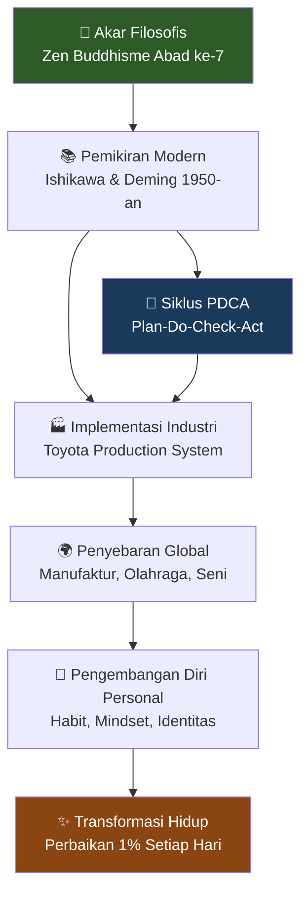
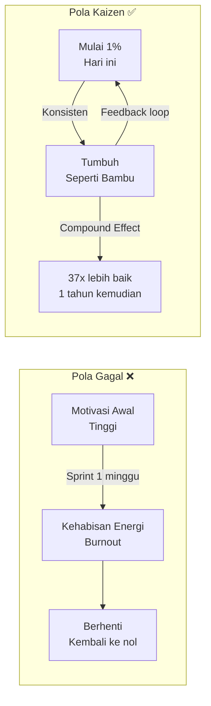
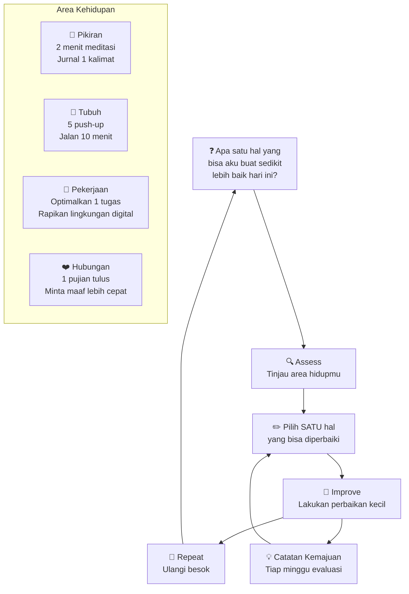
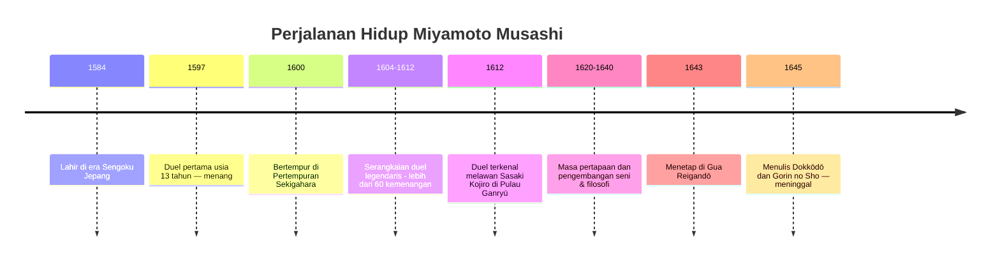
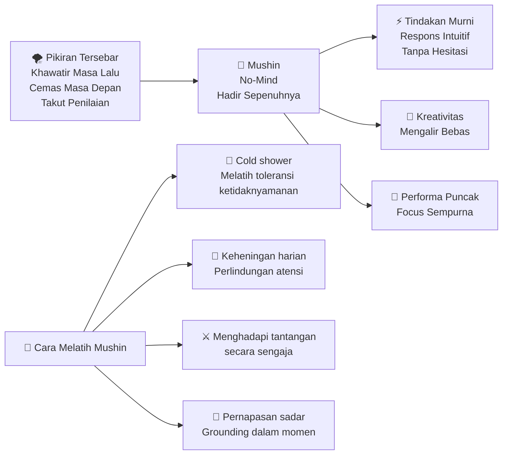
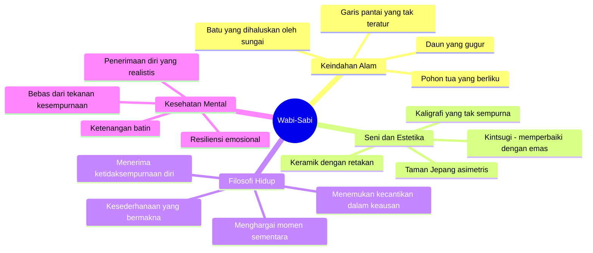
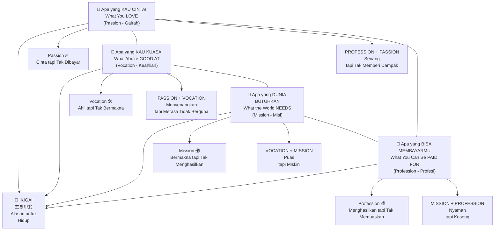
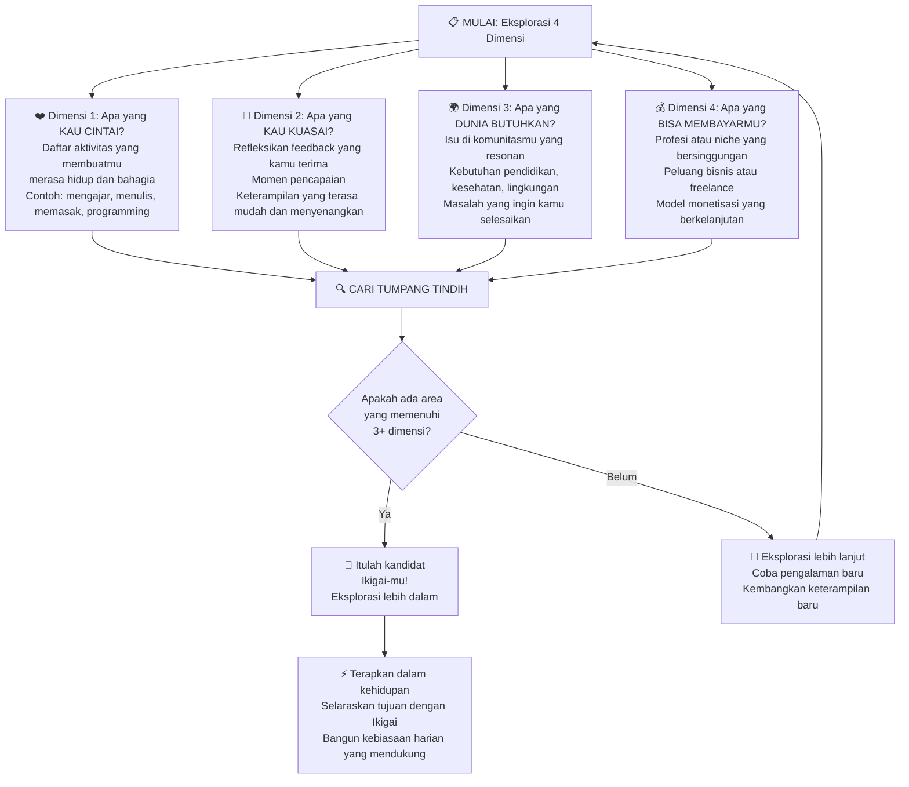
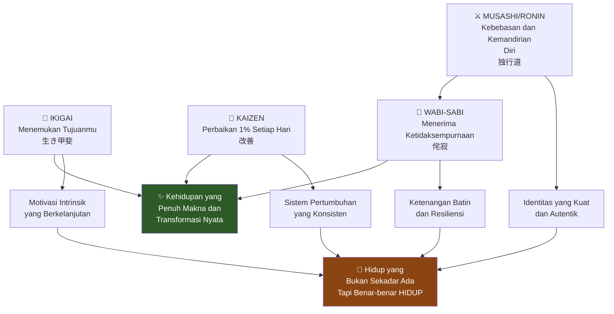

## 🌸 Mengapa Kita Butuh Kearifan Jepang?

Pernah merasa seperti mendorong batu besar ke atas bukit — setiap hari — tanpa kepuasan yang bertahan lama? 😓

Kamu bekerja keras. Kamu berjuang. Kamu mendorong dirimu sendiri untuk mencapai lebih banyak. Tapi esok hari, beban itu terasa lebih berat dari sebelumnya. Kepuasan yang kamu kejar hanya bertahan sejenak, lalu menguap begitu saja.

Masalahnya bukan kamu lemah atau kurang termotivasi. Masalahnya adalah **budaya modern telah mengajarkan kita untuk memandang hidup sebagai perlombaan menuju garis finish** — mengejar kesempurnaan, mencari validasi dari luar, dan mengukur keberhasilan dengan parameter yang bukan milik kita sendiri.

Kita telah melupakan pelajaran mendalam dari tradisi-tradisi tua yang lebih bijak — terutama yang lahir dari tempat di mana kesederhanaan, kehormatan, dan tujuan adalah bintang penuntun.

**Jepang.**

Filosofi Jepang tidak menjanjikan solusi instan atau jawaban mudah. Sebaliknya, ia menawarkan kebijaksanaan yang lembut namun dahsyat untuk mengubah cara kita mendekati hidup itu sendiri. Dan dalam artikel ini, kita akan menyelami empat di antaranya secara mendalam dan tuntas:

1. 🔄 **Kaizen** — *Perbaikan berkelanjutan yang konsisten*
2. ⚔️ **Jalan Musashi / Ronin** — *Kemandirian, keberanian berjalan sendiri*
3. 🌿 **Wabi-Sabi** — *Keindahan dalam ketidaksempurnaan*
4. 🎯 **Ikigai** — *Alasan untuk bangun setiap pagi*

---

## 🔄 KAIZEN: Revolusi yang Sunyi

### Mitos Transformasi Dramatis

Ada jebakan yang hampir semua orang pernah terjatuh ke dalamnya. 🪤

Kita percaya bahwa perubahan besar membutuhkan tindakan besar. Bangun jam 5 pagi. Bangun lima kebiasaan sekaligus. Mulai bisnis. Baca 10 buku. Berhenti dari media sosial. Semua dalam satu waktu.

Tapi cara berpikir seperti itu adalah perangkap. Ia membakar orang-orang sampai habis. Ia membuat perubahan terasa mustahil. Karena ketika kamu percaya bahwa hanya tindakan dramatis yang bisa memperbaiki hidupmu, kamu juga secara tidak sadar percaya bahwa usaha kecilmu sehari-hari itu tidak berguna.

Dan itu sangat jauh dari kebenaran.

<Callout type="info" title="Apa itu Kaizen? (改善)">
Kata **Kaizen** berasal dari dua karakter Jepang: **改** (*kai* = perubahan) dan **善** (*zen* = baik). Bersama-sama membentuk konsep "**perubahan menuju yang lebih baik**" — bukan perubahan demi perubahan, bukan transformasi masif, hanya kemajuan yang stabil, bijaksana, dan bermakna.
</Callout>

### Akar Sejarah Kaizen: Dari Abu Perang Dunia II

Meskipun Kaizen dikenal secara global melalui praktik bisnis Jepang di abad ke-20, akarnya jauh lebih dalam. Pola pikir Kaizen telah menjadi bagian dari filosofi Timur selama berabad-abad.

Dalam **Buddhisme Zen** (*Zen Budhisme* — aliran meditasi Buddhis), ada penekanan pada kehadiran penuh (*presence*), pengulangan (*repetition*), dan penyempurnaan (*refinement*). Upacara minum teh (*chanoyu*), misalnya, bukan sekadar tentang meminum teh. Ini tentang menyempurnakan ritual-ritual kecil di sekitarnya. Hal yang sama berlaku dalam *kaligrafi* (seni menulis indah), *seni bela diri*, bahkan *merangkai bunga* (*ikebana*).

Semua praktik ini didasarkan pada keyakinan bahwa kamu selalu bisa menggali lebih dalam, selalu bisa bergerak lebih dekat ke ideal — satu tindakan yang disengaja pada satu waktu. 🎋

**Namun struktur formal Kaizen seperti yang kita kenal saat ini terbentuk setelah Perang Dunia II.** Jepang hancur. Ekonominya luluh. Industrinya runtuh. Namun dari kehancuran ini lahir salah satu pemulihan ekonomi paling luar biasa dalam sejarah modern — dan Kaizen ada di jantungnya.

Dua tokoh kunci membentuk Kaizen modern:

**Kaoru Ishikawa** — Profesor dan insinyur Jepang yang percaya bahwa pengendalian kualitas tidak boleh terbatas pada eksekutif puncak. Ia mengembangkan *Ishikawa Diagram* (juga dikenal sebagai *fishbone diagram* / diagram tulang ikan) untuk membantu tim mengidentifikasi akar masalah dan memperbaikinya dari sumbernya.

**W. Edwards Deming** — Ahli statistik Amerika yang memperkenalkan siklus **PDCA** (*Plan-Do-Check-Act* / Rencanakan-Lakukan-Periksa-Tindak) — kerangka untuk menguji dan menyempurnakan proses secara bertahap. Deming percaya bahwa 94% masalah dalam bisnis disebabkan oleh sistem yang cacat, bukan manusia yang malas. Artinya, memperbaiki sistem lebih penting daripada menyalahkan pekerja.

Dan di mana semua ini paling subur berkembang? **Toyota.** 🚗

Toyota mengadopsi Kaizen begitu dalam ke dalam budayanya sehingga setiap karyawan — dari CEO hingga petugas kebersihan — diharapkan mencari cara untuk meningkatkan sesuatu. Jika seorang pekerja pabrik melihat masalah di jalur perakitan, mereka bisa menghentikan produksi untuk memperbaikinya. Tidak ada rasa malu dalam kesalahan — hanya peluang untuk belajar.

### Tiga Prinsip Inti Kaizen

Kaizen memiliki tiga prinsip yang menjadikannya begitu kuat: 💪

**1. Perbaikan Berkelanjutan (*Continuous Improvement*)** — Tidak pernah puas. Bukan dalam cara yang membuatmu cemas atau perfeksionis, tapi dalam cara yang membuatmu tetap penasaran. Selalu ada cara yang lebih baik untuk melakukan sesuatu. Cara yang lebih bersih, lebih tenang, lebih baik. Ini bukan berarti segalanya harus berubah sepanjang waktu — ini berarti kamu selalu terbuka terhadap perubahan, bahkan jika hanya sebuah penyesuaian kecil.

**2. Semua Orang Bertanggung Jawab** — Perbaikan bukan hanya untuk para ahli. Kamu tidak butuh gelar atau jabatan kepemimpinan untuk membuat perbedaan. Dalam pola pikir Kaizen, petugas kebersihan bisa memperbaiki alur kerja kantor. Resepsionis bisa memperbaiki cara menyambut tamu. Dan dalam hidupmu sendiri, kamu tidak butuh izin dari siapapun untuk mulai berkembang.

**3. Tidak Ada Tindakan yang Terlalu Kecil** — Dalam budaya kita yang berorientasi hasil, kita sering mengabaikan hal-hal yang tidak memberikan imbalan langsung. Kaizen mengajarkan sebaliknya: **nilai terletak pada momentum**. Langkah kecil bukan hanya dapat diterima — mereka *esensial* (*penting*). Karena langkah kecil adalah satu-satunya jenis yang benar-benar berkelanjutan.

### Kekuatan Matematis: Aturan 1% 📊

Aturan 1% sangat sederhana. Jika kamu bisa menjadi 1% lebih baik setiap hari, perbaikan kecil itu akan *compound* (berganda berlipat-lipat).

Angkanya mengejutkan:

> **1% lebih baik setiap hari × 365 hari = bukan 365% lebih baik. Kamu menjadi 37 KALI lebih baik.**

Seperti bunga majemuk dalam rekening tabungan, usahamu mulai menghasilkan "bunganya" sendiri. Satu perbaikan membangun perbaikan berikutnya.

Bayangkan membaca satu halaman buku setiap hari. Hanya satu halaman. Dalam setahun, kamu sudah membaca lebih dari 350 halaman — sebuah buku penuh. Semua dari satu halaman per hari. 📖

Atau berjalan 10 menit sehari. Itu 3.650 menit setahun — lebih dari 60 jam gerakan. Dari sesuatu yang hampir tidak terasa seperti olahraga.

### Kaizen dan Zen: Koneksi Spiritual yang Dalam 🧘

Untuk benar-benar memahami Kaizen, kamu harus melampaui strategi bisnis dan *productivity hacks* (*trik produktivitas*). Kamu harus melihat lebih dalam ke jiwa budaya yang menciptakannya.

Di intinya, Kaizen bukan hanya metode perbaikan — ini adalah cara bergerak melalui dunia. Dan cara itu terhubung erat dengan **Zen Buddhisme**.

Zen mengajarkan bahwa kepuasan tidak datang dari mengejar hasil. Ia datang dari hadir sepenuhnya dalam apa yang kamu lakukan saat ini. Tidak ada yang namanya tugas kecil — hanya seberapa dalam kamu bisa memasuki tugas itu.

Pola pikir ini ada di jantung Kaizen:
- Bukan tentang bergegas ke garis finish
- Ini tentang hadir sepenuhnya, melakukan pekerjaan dengan cermat
- Mempercayai bahwa perbaikan akan mengikuti
- **Prosesnya adalah hadiahnya**

Ada beberapa konsep Zen yang menyatu sempurna dengan Kaizen:

🍵 **Shokunin Spirit** (*Semangat Pengrajin*) — Seorang *shokunin* bukan sekadar seseorang yang melakukan pekerjaan, melainkan seseorang yang membawa jiwa ke dalam pekerjaannya. Dia tidak terburu-buru. Dia tidak memotong kompas. Dia mendekati kerajinannya dengan kerendahan hati dan fokus — selalu mencari cara kecil untuk berkembang.

🎯 **Ichigo Zanmai** (*Konsentrasi Total pada Satu Tindakan*) — Ide bahwa ketika kamu melakukan sesuatu, apa pun itu, kamu memberikan perhatian penuh. Tidak ada gangguan, tidak ada *multitasking* (mengerjakan banyak hal sekaligus), hanya kamu dan tugasnya. Ketika kamu memasuki ruang itu, kamu tidak lagi terpisah dari apa yang kamu lakukan. Kamu *adalah* perbaikannya.

### Kaizen dalam Kehidupan Sehari-hari: Sistem, Bukan Motivasi

Musuh terbesar perubahan berkelanjutan bukanlah kurangnya motivasi — tetapi *ketergantungan* pada motivasi.

Motivasi datang dan pergi. Hari-hari buruk pasti ada. Kaizen mengajarkan kamu untuk membangun **sistem** daripada mengejar suasana hati.

> *"Kamu tidak naik ke level tujuanmu. Kamu jatuh ke level sistemmu."* — James Clear

Sistem adalah rutinitas kecil yang ditumpuk dan diulang dari waktu ke waktu. Tidak bergantung pada motivasi. Bergantung pada struktur.

### Kaizen dan Identitas: Menjadi Seseorang, Bukan Hanya Melakukan Sesuatu

Salah satu ide paling kuat yang terhubung dengan Kaizen adalah **perubahan berbasis identitas** (*identity-based change*) — yang dipopulerkan oleh James Clear dan BJ Fogg.

Idenya adalah ini: **Alih-alih terobsesi dengan tujuan** (ingin menurunkan 20 kg, ingin menulis buku), kamu fokus pada **menjadi jenis orang yang secara alami melakukan hal-hal itu**.

- Dari *"Aku ingin lari maraton"* → menjadi *"Aku adalah jenis orang yang berlatih setiap hari"*
- Dari *"Aku ingin membaca 50 buku"* → menjadi *"Aku adalah jenis orang yang membaca satu halaman sehari"*

Setiap kali kamu melakukan perbaikan kecil, kamu sedang **memberikan suara untuk jenis orang yang ingin kamu jadikan**. Suara-suara itu bertambah.

<Callout type="tip" title="Metafora Bambu 🎋">
Ketika kamu menanam benih bambu, tidak ada yang terjadi di tahun pertama, kedua, ketiga, bahkan keempat. Hanya ada tanah kosong. Tapi di bawahnya, akar sedang membangun fondasi masif. Kemudian di tahun kelima, sesuatu yang luar biasa terjadi — **bambu tumbuh 27 meter dalam 6 minggu**.

Orang-orang melihat pertumbuhannya dan berpikir itu terjadi dalam semalam. Tapi kebenarannya adalah ia tumbuh sepanjang waktu — hanya saja tidak dengan cara yang bisa kamu lihat.

**Kebiasaanmu bekerja dengan cara yang sama.**
</Callout>

---

## ⚔️ JALAN MUSASHI: Berjalan Tanpa Tuan

### Ronin — Jiwa yang Bebas dan Terarah

Ada jenis manusia tertentu yang dunia tidak tahu harus diapakan. 🗡️

Seseorang yang tidak meminta izin. Seseorang yang mendengarkan suaranya sendiri lebih keras dari suara-suara di sekitarnya. Seseorang yang berjalan menjauh dari jalan yang diharapkan dan tidak menoleh ke belakang.

Orang Jepang menyebut jiwa semacam ini: **Ronin** — samurai tanpa tuan, pejuang yang tidak terikat, bebas dan sendirian dengan cara yang menakutkan dan mengagumkan sekaligus.

Tapi ada kesalahpahaman umum tentang apa artinya menjadi ronin. Mudah untuk meromantisasi serigala kesepian, si pengembara, si orang luar. Namun Ronin sejati bukan sosok yang terpatah dan mengembara tanpa tujuan.

**Ronin sejati adalah sesuatu yang berbeda sepenuhnya.** Dia terarah sendiri, bertujuan, disiplin tanpa perlu dipaksakan. Dia adalah seseorang yang memilih kesendirian bukan karena pahit, tapi karena dia tahu harga kepemilikan palsu.

### Miyamoto Musashi: Legenda yang Nyata

Dan di sinilah kita bertemu **Miyamoto Musashi** — mungkin Ronin terbesar yang pernah hidup. 🥷

Musashi lahir tahun 1584 di era *Sengoku* (periode berdarah penuh perang saudara dan pergolakan di Jepang). Ia melawan lebih dari 60 duel sampai mati. **Dan ia tidak pernah kalah satu kali pun.**

Beberapa fakta luar biasa tentang Musashi:

- Pada usia 13 tahun, ia melawan duel pertamanya melawan samurai dewasa bersenjata sungguhan — dan menang
- Ia menolak jabatan, kekayaan, dan keamanan yang bisa dengan mudah diraihnya
- Ia hidup seperti pertapa — kadang di gua, kadang di gubuk kecil — bukan mencari kesenangan tapi mencari kemurnian
- Ia tidak hanya menguasai pedang, tapi juga melukis, puisi, kaligrafi, patung, dan filsafat
- Beberapa minggu sebelum kematiannya, ia menulis *Gorin no Sho* — **Kitab Lima Lingkaran**

**Apa yang membuat Musashi luar biasa bukan kemenangan-kemenangannya — tapi bagaimana ia memilih untuk hidup.**

Meskipun terkenal, ia terus-menerus menolak kehidupan prestise yang mudah diraihnya. Di era itu, seorang prajurit terampil bisa mengamankan posisi di bawah tuan yang kuat — mendapatkan kekayaan, pelayan, tanah, dan status. Musashi ditawari semua ini. Ia bisa hidup nyaman, dirayakan sebagai master.

Tapi ia menolak semuanya — lagi dan lagi. Ia memilih jalan kesepian.

Ia bukan melarikan diri dari sesuatu. Ia berlari menuju sesuatu: **penguasaan diri**.

### Dokkōdō: 21 Prinsip Berjalan Sendiri

Di akhir hidupnya, Musashi menarik diri ke gua dan mulai menulis. Karyanya yang paling terkenal adalah karya terakhirnya: **Dokkōdō** (*独行道*) — **"Jalan Berjalan Sendiri"**.

21 prinsip singkat. Tanpa komentar, tanpa basa-basi. Hanya kebenaran yang disuling murni:

<Callout type="quote" title="Prinsip-prinsip Dokkōdō">
🗡️ *"Jangan mencari kesenangan demi kesenangan itu sendiri."*

🗡️ *"Terimalah segala sesuatu apa adanya."*

🗡️ *"Jangan takut pada kematian."*

🗡️ *"Hormati Buddha dan para dewa tanpa mengandalkan bantuan mereka."*

🗡️ *"Kebencian dan keluhan tidak pantas baik untuk diri sendiri maupun untuk orang lain."*
</Callout>

Ini bukan perintah dari guru. Ini adalah pengingat yang diukir dari pengalaman langsung hidup yang penuh.

### Mushin: Pikiran Tanpa-Pikiran 🧠

Konsep paling dalam yang membuat Musashi begitu efektif dalam pertempuran — dan begitu relevan untuk kehidupan modern — adalah **Mushin** (*無心*) — secara harfiah "**pikiran tanpa-pikiran**" (*no-mind*).

Pada pandangan pertama, *no-mind* terdengar seperti kekosongan atau ketidakberpikiran. Tapi sebaliknya. Mushin bukanlah ketiadaan pikiran — melainkan ketiadaan kekacauan. Ini adalah apa yang tersisa ketika ketakutan, keraguan, hesitasi, dan ego telah dilucuti.

Dalam Mushin, kamu sepenuhnya sadar, sepenuhnya hadir, tapi tidak terganggu oleh suara di kepalamu yang mempertanyakan setiap langkahmu. Tidak ada skrip, tidak ada rencana yang dilatih. Kamu hanya bertindak — segera, dengan benar, secara intuitif.

Musashi tidak menang dalam 60+ duel karena ia yang tercepat atau terkuat. Ia menang karena **ia tetap diam di dalam**. Musuh-musuhnya mengayunkan pedang, tapi Musashi membaca pikiran. Ia mengantisipasi, menyesuaikan diri, bertindak — tanpa gerakan yang terbuang, tanpa kebisingan, hanya kehadiran.

### Jalan Ronin Modern: Relevansi Hari Ini

Kamu tidak perlu memakai kimono atau membawa pedang untuk berjalan di jalan Ronin. Inti tantangannya tetap sama: **Apakah kamu akan mengikuti skrip yang diberikan kepadamu, atau kamu akan menulis skrip sendiri?**

Di era modern, kita tidak terikat pada tuan feodal. Tapi banyak dari kita masih melayani tuan-tuan yang tak terlihat:

- **Persetujuan sosial** yang mendiktekan cara berpakaian, cara bicara, cara berkarir
- **Media sosial** yang kita periksa sebelum memeriksa diri sendiri
- **Norma budaya** yang berbisik: *"lakukan ini, beli itu, jadilah seperti mereka"*
- **Ketakutan** akan penilaian orang lain
- **Status karir** yang menentukan nilai diri

<Callout type="warning" title="Pertanyaan untuk Ditanyakan pada Diri Sendiri 🤔">
Siapa atau apa yang menjadi "tuan"-mu saat ini?

Apakah itu pekerjaanmu? Citra sosialmu? Ketakutanmu untuk disalahpahami? Kebutuhanmu untuk disukai?

Kekuatan-kekuatan ini halus. Mereka berdandan seperti "normal" tapi mengarahkan pilihanmu setiap hari.
</Callout>

**8 Praktik Jalan Ronin Modern:**

1. **Tolak konformitas buta** — Pertanyakan segalanya: Dari mana definisi "sukses"-mu berasal? Apa yang akan kamu lakukan jika tidak ada yang menonton?
2. **Pilih kesendirian yang bermakna** — Setidaknya satu hari seminggu tanpa gangguan digital, hanya bersama pikiran sendiri
3. **Bangun kode hidupmu** — Tuliskan 3 prinsip yang kamu pegang bahkan saat tidak ada yang menonton
4. **Hidup ringan** — Apa yang membebanimu? Langganan yang tidak pernah digunakan? Kewajiban sosial yang menguras energi?
5. **Tetap adaptif** — Ronin tidak memiliki peran tetap dalam masyarakat. Ia harus tetap tajam, belajar cepat, bergerak ketika situasi menuntut
6. **Belajar dari kesulitan** — Setiap kesulitan adalah cermin. Setiap kegagalan adalah guru
7. **Latih pikiran** — Baca buku nyata. Tulis jurnal. Lindungi atensimu seperti itu adalah harta paling berharga — karena memang begitu
8. **Detoks atensimu** — Kamu tidak bisa hidup seperti Ronin jika pikiranmu milik layarmu

---

## 🌿 WABI-SABI: Indahnya Yang Tidak Sempurna

### Sebuah Keretakan, Sebuah Pintu Masuk Cahaya

Pernahkah kamu melihat vas yang retak atau batu lapuk dan menemukan sesuatu yang tidak bisa kamu jelaskan — indah? 🏺

Ada seluruh filosofi yang didedikasikan untuk menghargai yang tidak sempurna, yang tidak kekal, dan yang tidak lengkap.

Ini adalah **Wabi-Sabi** (*侘寂*) — dan hari ini ia bisa secara dramatis mengubah cara kamu memandang dunia dan dirimu sendiri.

<Callout type="info" title="Definisi Wabi-Sabi">
**Wabi-Sabi** terdiri dari dua kata:
- **Wabi** (*侘*) — keindahan dalam kesederhanaan, ketenangan dalam kesendirian, keeleganan dalam kesahajaan
- **Sabi** (*寂*) — keindahan yang datang dengan usia, keausan, patina (*lapisan permukaan bersejarah*) waktu

Bersama-sama, keduanya membentuk apresiasi atas **keindahan dalam ketidaksempurnaan, ketidakkekalan, dan ketidaklengkapan**.
</Callout>

### Akar Filosofis: Dari Zen Buddhisme

Wabi-Sabi berasal dari pandangan dunia yang berakar dalam Buddhisme Zen, yang menekankan kesederhanaan, keaslian, dan sifat sementara dari segala sesuatu.

Prinsip-prinsip Zen mengajarkan bahwa pencerahan bisa dicapai melalui meditasi, wawasan, dan pemahaman tentang sifat tidak permanen dunia.

Filosofi ini juga secara signifikan memengaruhi **upacara teh tradisional** (*chanoyu* — persiapan dan penyajian teh matcha, bubuk teh hijau). Upacara teh adalah bentuk seni yang memprioritaskan proses daripada hasil, di mana setiap langkah dan setiap alat yang digunakan adalah perwujudan penghargaan atas momen-momen sementara yang mendefinisikan keberadaan kita.

### Kintsugi: Seni Memperbaiki dengan Emas ✨

Filosofi Wabi-Sabi paling vivid digambarkan dalam **Kintsugi** (*金継ぎ* — seni perbaikan dengan emas).

Kintsugi adalah praktik memperbaiki keramik yang pecah dengan lacquer (*pernis*) yang dicampur logam mulia seperti emas atau perak. Alih-alih menyembunyikan kerusakan, Kintsugi **menekankannya** — menciptakan bentuk keindahan baru yang mengakui dan menghormati sejarah objek tersebut.

Setiap retakan disorot, bukan disembunyikan. Apa yang bisa dianggap cacat berubah menjadi fitur mencolok yang menceritakan kisah tentang patahan dan perbaikan, tentang kehidupan dan pemulihan.

<Callout type="important" title="Kintsugi sebagai Metafora Hidup 💛">
Bayangkan retakan-retakan dalam hidupmu sebagai kintsugi. Kegagalan yang mengajarkan kebijaksanaan. Luka yang membangun ketangguhan. Kehilangan yang mendalamkan rasa syukur.

Bukan menyembunyikannya — tapi **menyorotinya dengan emas**.

Luka itu bukan kelemahan. Mereka adalah tanda pengalaman dan pertumbuhan.
</Callout>

### Merangkul Ketidaksempurnaan: Melawan Budaya Perfeksionisme

Kontras antara Wabi-Sabi dan budaya modern tidak bisa lebih tajam. 😤

Budaya kita — terutama era media sosial — membangun tekanan luar biasa untuk menampilkan fasad sempurna. Apakah itu dalam prestasi akademis, profil media sosial, atau penampilan fisik — pengejaran kesempurnaan ini dapat menyebabkan stres signifikan, kecemasan, dan perasaan tidak pernah cukup yang tiada henti.

Wabi-Sabi menawarkan alternatif yang damai:

- **Bekas luka** bukan kekurangan — mereka adalah lencana keberadaan nyata
- **Kegagalan** bukan kebingungan — mereka adalah peluang untuk belajar
- **Ketidaksempurnaan** bukan sesuatu yang perlu diperbaiki — mereka adalah bagian dari keindahan

Pendekatan ini tidak hanya tentang apresiasi estetika, tapi tentang **menumbuhkan kesehatan psikologis**. Ketika kita menerima bahwa segalanya tidak permanen dan tidak sempurna — termasuk diri kita sendiri — kita membebaskan diri dari beban mencoba tampak sempurna.

### Merangkul Ketidakkekalan (*Transience*)

*"Keindahan hidup ada dalam ketidakkekalannya. Rangkullah tarian perubahan."* 🌸

Filosofi ini paling terlihat dalam **bunga sakura** (*cherry blossom*) — yang dirayakan bukan meskipun pendek umurnya, tapi *karena* umurnya yang singkat. Sakura mekar dengan sangat spektakuler justru karena kita tahu ia akan segera gugur.

Ketidakkekalan ini mengajarkan kita dua hal yang saling melengkapi:

1. **Rasa sakit itu tidak permanen** — ketika kamu dalam kesulitan, ingatlah bahwa ini pun akan berlalu
2. **Momen indah itu juga tidak permanen** — hargailah sepenuhnya, karena ia pun akan berlalu

Pemahaman ini menciptakan pendekatan yang lebih seimbang terhadap kehidupan — mengurangi kecemasan tentang masa depan dan penyesalan tentang masa lalu, dan mendorong kita untuk hidup lebih penuh dalam momen saat ini.

### Kekuatan Kesederhanaan 🍃

*"Dalam kesederhanaan ada kebenaran."*

Wabi-Sabi juga merayakan **kesederhanaan** — bukan minimalis dalam arti tren estetika, tapi kesederhanaan sebagai kejernihan, sebagai disiplin, sebagai melepaskan hal-hal yang tidak penting sehingga hanya yang benar-benar penting yang tersisa.

Manfaat membersihkan dan menyederhanakan hidup banyak:

| Dimensi | Sebelum Penyederhanaan | Setelah Penyederhanaan |
|---------|----------------------|----------------------|
| **Ruang fisik** | Kekacauan, beban visual | Ketenangan, kejernihan |
| **Pikiran** | Terisi noise, reaktif | Fokus, responsif |
| **Jadwal** | Penuh komitmen kosong | Hanya yang bermakna |
| **Hubungan** | Dangkal, banyak | Mendalam, bermakna |
| **Digital** | Notifikasi tanpa henti | Atensi terlindungi |

### Wabi-Sabi dalam Praktik Harian

Bagaimana mengintegrasikan filosofi ini ke dalam rutinitas sehari-hari? 🌄

1. **Mulai hari dengan momen apresiasi** — Sebelum terburu-buru, luangkan beberapa menit untuk memperhatikan sesuatu yang sederhana di sekitarmu. Cara cahaya pagi menembus jendelamu. Tekstur sarapanmu. Suara burung di luar.

2. **Jurnal syukur** — Catat hal-hal yang kamu syukuri, terutama detail-detail kecil yang tidak sempurna yang biasanya luput dari perhatian. Sebuah percakapan menyenangkan. Cara kopimu tumpah membentuk pola. Bagaimana rasanya membaca buku.

3. **Sederhanakan lingkungan hidupmu** — Singkirkan lingkunganmu untuk hanya menyimpan benda-benda yang bermakna atau berfungsi. Bukan agar ruangan menjadi kosong, melainkan biarkan setiap benda di sekitarmu memiliki resonansi dengan makna personal.

4. **Terima aliran alami hidup** — Praktikkan melepaskan kebutuhan untuk kontrol. Ketika rencana berubah, ketika proyek tidak berjalan sempurna — kenali bahwa penyimpangan ini adalah bagian dari ketidakkekalan hidup dan bisa mengarah pada kesenangan atau pelajaran yang tidak terduga.

5. **Temukan keindahan dalam detail** — Coba fotografi dengan ponselmu, fokus pada menangkap gambar kehidupan sehari-hari dengan cara yang tidak biasa. Potret cara bayangan bermain di jalanan, senyum teman, makanan sebelum dimakan.

---

## 🎯 IKIGAI: Alasanmu untuk Bangun Pagi

### Permasalahan Kemalasan yang Lebih Dalam

Bayangkan bangun setiap pagi dengan hasrat yang membara, tujuan yang jelas yang mendorongmu keluar dari tempat tidur, menghidupkan setiap bagian harimu. 🌟

Kini kontraskan dengan hari-hari ketika kamu merasa tanpa arah — terjebak dalam kemalasan di mana bahkan tugas paling sederhana terasa berat.

Apa yang membuat perbedaannya?

Jawabannya bukan disiplin yang lebih keras atau tekad yang lebih besar. Sering kali, kemalasan kronis adalah **simtom, bukan penyebab** — tanda dari sesuatu yang lebih dalam: kehidupan yang tidak selaras dengan tujuan sejatimu.

Dari perspektif psikologis, kemalasan bisa menjadi perpaduan rumit dari beberapa faktor:

- **Kurangnya motivasi** — ketika tujuanmu tidak terasa menarik atau bermanfaat, doronganmu secara alami melemah
- **Ketakutan akan kegagalan** — sering kali kita menghindari memulai tugas karena takut tidak berhasil
- **Prokrastinasi** (*penundaan*) — mekanisme koping di mana kita menunda tugas untuk menghindari ketidaknyamanan emosional yang terkait dengannya

Dan di sinilah Ikigai menjadi relevan.

### Apa itu Ikigai? (生き甲斐)

**Ikigai** berasal dari **iki** (*生き* = hidup) dan **gai** (*甲斐* = nilai/manfaat). Bersama-sama: **nilai dari kehidupan** — kegembiraan dan tujuan yang ditemukan seseorang dalam aktivitas kehidupannya.

Konsep ini berasal dari pulau **Okinawa** di Jepang — yang sering disebut "pulau umur panjang" karena penduduknya yang hidup melampaui usia 100 tahun secara tidak proporsional tinggi. Ikigai dianggap sebagai salah satu alasan di balik umur panjang yang luar biasa ini.

Ikigai adalah **persimpangan dari empat elemen utama**:

1. 💛 **Apa yang kamu cintai** (*What You Love*) — aktivitas yang membuatmu merasa hidup, yang kamu selami selama berjam-jam tanpa merasakan berlalunya waktu

2. 💚 **Apa yang kamu kuasai** (*What You're Good At*) — keterampilan dan bakat yang kamu miliki, baik yang dikembangkan maupun bawaan

3. 💙 **Apa yang dunia butuhkan** (*What the World Needs*) — bagaimana hasrat dan keterampilanmu bisa memenuhi kebutuhan orang lain dan membuat perbedaan

4. 🩷 **Apa yang bisa membayarmu** (*What You Can Be Paid For*) — bagaimana kamu bisa menopang dirimu secara finansial sambil melakukan apa yang kamu cintai

**Persimpangan keempat elemen ini adalah di mana Ikigaimu berada.**

### Menemukan Ikigaimu: Proses Eksplorasi Diri

Menemukan Ikigai bukanlah proses semalam. Ini adalah perjalanan eksplorasi diri, uji coba, dan introspeksi. 🔍

**Langkah-langkah praktis:**

**Langkah 1 — Eksplorasi Gairah (Apa yang Kamu Cintai):**
Mulailah dengan mendaftar aktivitas yang membawa kegembiraan dan kepuasan. Kapan kamu merasa paling hidup? Apa yang membuatmu kehilangan jejak waktu? Ini bisa berupa apa saja — dari memasak, melukis, menulis, hingga hal yang lebih abstrak seperti memecahkan masalah atau membantu orang lain.

**Langkah 2 — Penilaian Keterampilan (Apa yang Kamu Kuasai):**
Selanjutnya, fokus pada bakat dan keterampilanmu. Renungkan umpan balik yang kamu terima dari orang lain, momen ketika kamu merasakan pencapaian, tugas yang kamu temukan relatif mudah dan menyenangkan. Keterampilan ini bisa berkisar dari coding, mengajar, atau berbicara di depan umum hingga keterampilan yang lebih umum seperti empati atau kreativitas.

**Langkah 3 — Mengidentifikasi Kebutuhan (Apa yang Dunia Butuhkan):**
Dimensi ini mengharuskan kamu berpikir di luar dirimu sendiri dan mempertimbangkan bagaimana kemampuan dan hasratmu bisa memenuhi kebutuhan orang lain. Isu atau kebutuhan apa di komunitasmu atau dunia yang beresonansi denganmu?

**Langkah 4 — Potensi Penghasilan (Apa yang Bisa Membayarmu):**
Akhirnya, pikirkan bagaimana kamu bisa memonetisasi hasrat dan keterampilanmu. Ini tidak berarti mengubah setiap gairah menjadi karir, tapi menemukan cara untuk menopang dirimu sambil melakukan apa yang kamu cintai.

### Ikigai Melawan Kemalasan: Motivasi Intrinsik vs Ekstrinsik

Kunci untuk mengatasi kemalasan terletak pada menemukan tujuan yang beresonansi secara mendalam dengan diri batinmu. Di sinilah Ikigai bersinar. ✨

Ketika kamu menemukan Ikigaimu, kamu menemukan sumber motivasi yang **intrinsik** (*berasal dari dalam*) dan **self-sustaining** (*mempertahankan diri sendiri*).

Tidak seperti motivator eksternal seperti uang atau pengakuan, motivasi intrinsik datang dari dalam. Ini didorong oleh minat atau kesenangan dalam tugas itu sendiri — dan jauh lebih kuat dalam menginspirasi tindakan dan ketekunan.

Tujuan yang jelas memberimu alasan untuk bangun di pagi hari, arah yang menggembirakan dan memenuhi. Ia mengubah tugas *"aku harus"* menjadi aktivitas *"aku ingin"*.

### Tips Menetapkan Tujuan yang Selaras dengan Ikigai

1. **Renungkan Ikigaimu** — Kunjungi kembali empat dimensi Ikigaimu dan gunakan sebagai kompas untuk menetapkan tujuanmu

2. **Tetapkan tujuan yang spesifik dan bermakna** — Tujuan yang samar cenderung tidak menginspirasi tindakan. Buatlah tujuanmu spesifik, jelas, dan terhubung dengan esensi Ikigaimu

3. **Seimbangkan aspirasi dengan realisme** — Sambil penting untuk menargetkan yang tinggi, pastikan tujuanmu bisa dicapai. Tujuan yang tidak realistis bisa menyebabkan frustrasi dan demotivasi

4. **Gabungkan tujuan jangka pendek dan jangka panjang** — Tujuan jangka pendek memberikan motivasi segera dan rasa pencapaian, sementara tujuan jangka panjang menyelaraskanmu dengan tujuan menyeluruh

5. **Secara teratur tinjau dan sesuaikan tujuanmu** — Seiring kamu tumbuh dan berkembang, Ikigaimu mungkin juga berkembang. Secara teratur renungkan tujuanmu dan sesuaikan sesuai kebutuhan

---

## 🌊 Keempat Filosofi: Bagaimana Mereka Saling Melengkapi

Keempat filosofi ini bukan empat jalan yang terpisah — mereka adalah **empat fasad dari satu berlian yang sama**. 💎

**Bagaimana keempatnya bekerja bersama:**

🔄 **Kaizen** memberikan sistem — cara konkret untuk bergerak maju setiap hari, tanpa mengandalkan motivasi yang tidak bisa diandalkan

🎯 **Ikigai** memberikan arah — *mengapa* kamu bergerak, tujuan yang membuat setiap langkah kecil Kaizen terasa bermakna

⚔️ **Musashi** memberikan kemandirian — keberanian untuk berjalan jalanmu sendiri bahkan ketika tidak ada yang menonton, bahkan ketika jalurnya tidak nyaman

🌿 **Wabi-Sabi** memberikan kedamaian — penerimaan bahwa perjalanan tidak akan sempurna, dan itu bukan masalah — justru itulah keindahannya

Bersama-sama, keempat filosofi ini menawarkan sesuatu yang jarang kamu temukan dalam budaya modern: **sebuah kerangka untuk hidup yang tidak mencari validasi eksternal, tidak mengejar kesempurnaan yang ilusi, dan tidak bergantung pada momentum jangka pendek.**

---

## 🧭 Glosarium Kosakata

| Istilah Asing | Bahasa Jepang | Terjemahan/Arti |
|---|---|---|
| **Kaizen** | 改善 | Perubahan menuju yang lebih baik; perbaikan berkelanjutan |
| **Kai** | 改 | Perubahan |
| **Zen** | 善 | Baik |
| **Ikigai** | 生き甲斐 | Alasan untuk hidup; nilai dari kehidupan |
| **Iki** | 生き | Hidup |
| **Gai** | 甲斐 | Nilai, manfaat |
| **Wabi-Sabi** | 侘寂 | Keindahan dalam ketidaksempurnaan dan ketidakkekalan |
| **Ronin** | 浪人 | Samurai tanpa tuan; pejuang bebas |
| **Mushin** | 無心 | Pikiran tanpa-pikiran; tidak terganggu oleh ego atau keraguan |
| **Dokkōdō** | 独行道 | Jalan berjalan sendiri (karya terakhir Musashi) |
| **Gorin no Sho** | 五輪書 | Kitab Lima Lingkaran (karya utama Musashi) |
| **Shokunin** | 職人 | Pengrajin yang membawa jiwa ke dalam pekerjaannya |
| **Ichigo Zanmai** | 一期三昧 | Konsentrasi total pada satu tindakan |
| **Chanoyu** | 茶の湯 | Upacara minum teh tradisional Jepang |
| **Kintsugi** | 金継ぎ | Seni memperbaiki keramik pecah dengan emas |
| **Ikebana** | 生花 | Seni merangkai bunga Jepang |
| **PDCA** | — | Plan-Do-Check-Act (Rencanakan-Lakukan-Periksa-Tindak) |
| **Compound Effect** | — | Efek berganda; pertumbuhan eksponensial dari tindakan kecil |
| **Identity-based change** | — | Perubahan berbasis identitas; menjadi seseorang daripada sekadar melakukan sesuatu |

---

## 🌟 Kesimpulan: Mulai dari Sini, Mulai Sekarang

Empat filosofi ini bukan teori yang indah untuk dibaca dan dilupakan. Mereka adalah **peta jalan konkret** untuk kehidupan yang berbeda secara fundamental — lebih kaya, lebih bermakna, lebih tenang.

Kamu tidak perlu mengadopsi semuanya sekaligus. Ingat Kaizen: mulailah kecil.

**Pilih satu perubahan kecil hari ini:**

- Tanyakan pada dirimu: *"Apa satu hal yang bisa aku buat 1% lebih baik hari ini?"* — itu Kaizen
- Duduk dalam keheningan 5 menit dan tanyakan: *"Apa yang benar-benar penting bagiku?"* — itu jalan menuju Ikigai
- Lihatlah sesuatu yang tidak sempurna di hidupmu dan temukan keindahan di dalamnya — itu Wabi-Sabi
- Tanyakan: *"Di mana aku masih mengikuti skrip yang bukan milikku?"* — itu awal jalan Musashi

> *"Kamu tidak jauh dari kehidupan yang kamu inginkan. Kamu hanya selangkah kecil. Dan ketika kamu mengambil langkah itu — bukan karena tekanan, tapi karena cinta — perjalanan dimulai."*

Perjalanan tanpa jalan pintas. Perjalanan tanpa terburu-buru. Tapi perjalanan dengan tujuan.

**Dan itu adalah perjalanan yang layak ditempuh.** 🌸

---

*Sumber video: [4 Japanese Philosophies to Radically Change Your Life](https://www.youtube.com/watch?v=IWLd7YFKvoI)*
