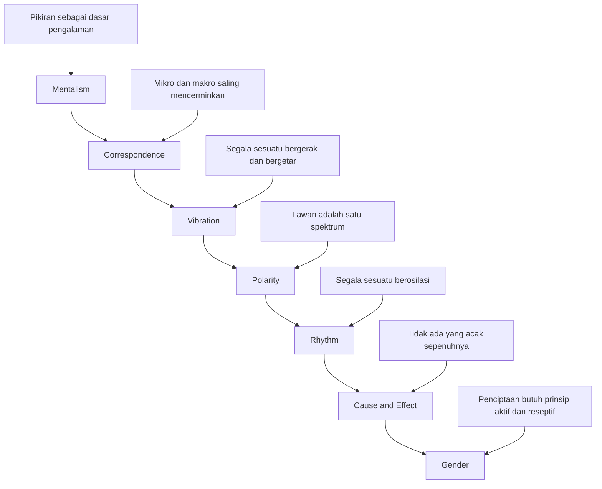
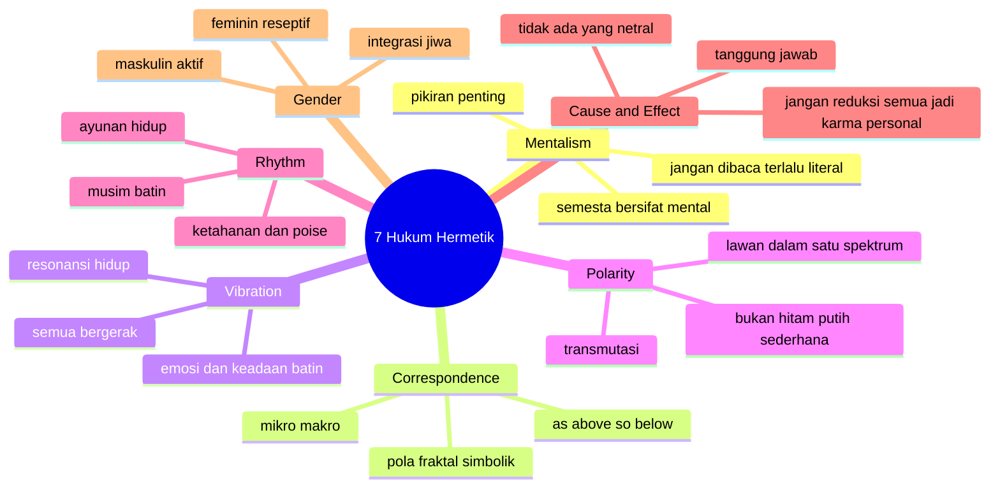

## 🔮 Pendahuluan: Mengapa “7 Hukum Hermetik” Begitu Memikat Banyak Orang?

Ada jenis gagasan yang selalu berhasil bertahan di pinggir sejarah resmi, lalu tiba-tiba kembali hidup di zaman modern dengan wajah baru. Ia tidak selalu diakui sebagai ilmu, tidak selalu diajarkan di kampus, tetapi terus muncul dalam:

- video spiritual di YouTube,
- buku *self-help* dan *manifestation* *(manifestasi / keyakinan bahwa batin dapat ikut membentuk pengalaman hidup)*,
- komunitas esoterik,
- diskusi tentang energi,
- dan pencarian pribadi orang-orang yang merasa kehidupan modern terlalu kering, terlalu mekanis, dan terlalu sempit untuk menjelaskan keseluruhan pengalaman manusia.

Salah satu contoh paling jelas dari jenis gagasan ini adalah apa yang sering disebut sebagai **7 Hermetic Laws** atau **tujuh hukum Hermetik**. 🔮

Bagi para penggemarnya, tujuh hukum ini bukan sekadar teori, melainkan **master key** *(kunci utama)*—semacam peta rahasia untuk memahami:
- cara alam semesta bekerja,
- hubungan antara pikiran dan realitas,
- gerak energi dalam kehidupan,
- hukum sebab-akibat di balik nasib,
- dan bagaimana manusia bisa menjadi “master of reality” *(penguasa atas realitasnya sendiri)*.

Bagi pembaca yang lebih skeptis, bahasa seperti itu tentu terdengar berlebihan. Dan wajar. Sebab banyak narasi seputar Hermetisisme modern memang cenderung memakai gaya grandiose *(agung, besar-besaran, penuh klaim luas)*. Ia sering menjanjikan bahwa jika kita memahami tujuh prinsip ini, maka semua misteri akan terbuka:
- hidup akan lebih jelas,
- nasib bisa diatur,
- getaran bisa dinaikkan,
- dan realitas dapat diarahkan sesuai kehendak sadar.

Di sinilah persoalannya menjadi menarik. Karena tujuh hukum Hermetik berada di wilayah yang sangat khas: di antara filsafat, mistisisme, psikologi populer, spiritualitas esoterik, dan pseudo-scientific language *(bahasa yang terdengar ilmiah tetapi sering tidak memenuhi standar ilmu ketat)*.

Dengan kata lain, membahas Hermetisisme selalu menuntut dua sikap sekaligus:

### Pertama, keterbukaan
Karena di dalam teks-teks esoterik sering ada intuisi yang kaya. Kadang ia berbicara tentang simbol, pola, pengalaman batin, dan keterhubungan realitas dengan cara yang memang menyentuh sesuatu yang mendalam dalam jiwa manusia.

### Kedua, kejernihan kritis
Karena tidak semua yang terdengar dalam, kuno, atau simbolik otomatis benar secara filosofis atau sahih secara ilmiah.

Esai ini karena itu tidak akan jatuh ke dua ekstrem:
- **bukan** tulisan yang sekadar mengulang tujuh hukum ini sebagai kebenaran mutlak,
- tetapi juga **bukan** tulisan yang langsung mengejek atau membuang seluruh warisan Hermetik sebagai takhayul murahan.

Sebaliknya, saya ingin membaca tujuh hukum Hermetik sebagai fenomena intelektual dan spiritual yang serius untuk dibedah. Kita akan melihat:

- apa sebenarnya Hermetisisme itu,
- siapa itu Hermes Trismegistus,
- bagaimana *The Kybalion* membingkai tujuh prinsip ini,
- apa isi masing-masing prinsip,
- apa daya tariknya bagi manusia modern,
- di mana nilai praktisnya,
- dan di mana kita perlu berhati-hati agar tidak terjebak pada klaim-klaim yang terlalu mudah, terlalu total, atau terlalu menyederhanakan hidup.

Sebab pada akhirnya, popularitas tujuh hukum Hermetik tidak terjadi tanpa alasan. Ia memikat karena menawarkan sesuatu yang sangat dicari manusia modern:

> **rasa bahwa hidup tidak sepenuhnya acak, bahwa pikiran dan batin punya bobot ontologis, dan bahwa ada pola tersembunyi yang menghubungkan dunia dalam diri dengan dunia di luar diri.**

Itu janji yang sangat kuat. Dan justru karena kuat, ia harus dibaca secara matang.

Kalau harus dirumuskan dalam satu tesis utama, maka tesis artikel ini adalah:

> **tujuh hukum Hermetik tetap memikat karena mereka menawarkan bahasa simbolik yang kuat untuk membaca hubungan antara kesadaran, pola hidup, dan kosmos; tetapi nilai terdalamnya lebih berguna ketika dibaca sebagai filsafat spiritual dan disiplin reflektif, bukan sebagai sains literal atau mesin ajaib untuk mengendalikan realitas secara instan.**

Jadi artikel ini bukan sekadar “penjelasan 7 hukum Hermetik”. Ini adalah usaha untuk menjawab pertanyaan yang lebih besar:

- mengapa ide-ide seperti ini terus hidup?
- apa yang sesungguhnya mereka coba katakan?
- dan bagaimana orang waras di abad ke-21 bisa mengambil hikmah darinya tanpa kehilangan akal sehat? ✨

---

<Callout type="important" title="Tesis utama artikel ini">
Tujuh hukum Hermetik berguna bila dibaca sebagai peta simbolik tentang kesadaran, pola hidup, relasi antara mikro dan makro, serta disiplin batin. Namun, ia menjadi problematis jika diperlakukan sebagai sains literal atau formula ajaib yang menjelaskan seluruh realitas tanpa sisa.
</Callout>

---

## 📜 1. Hermetisisme Itu Apa, dan Siapa Sebenarnya Hermes Trismegistus?

Sebelum membahas tujuh prinsipnya, kita harus mulai dari akar tradisinya. **Hermetisisme** atau *Hermeticism* adalah arus pemikiran esoterik yang dikaitkan dengan sosok legendaris bernama **Hermes Trismegistus**. 📜

Nama ini sendiri menarik. *Hermes* menggabungkan asosiasi dengan dewa Yunani Hermes dan dewa Mesir Thoth. Sementara *Trismegistus* berarti “yang tiga kali agung” atau “yang teragung tiga kali.” Dalam imajinasi esoterik, ia dianggap sebagai figur kebijaksanaan purba yang menurunkan pengetahuan tentang:

- kosmos,
- akal ilahi,
- relasi manusia dengan dunia spiritual,
- alkimia,
- astrologi,
- dan transformasi jiwa.

Secara historis, para sarjana modern cenderung melihat “Hermes Trismegistus” bukan sebagai satu individu historis tunggal, melainkan figur sinkretik *(gabungan lintas tradisi)* yang lahir dari pertemuan budaya Yunani, Mesir, dan kemudian berbagai tafsir mistik serta esoterik.

Jadi, yang penting di sini bukan apakah Hermes Trismegistus “betulan ada” sebagai tokoh biografis tunggal, melainkan bahwa namanya menjadi simbol otoritas kebijaksanaan rahasia.

Hermetisisme klasik sendiri melahirkan teks-teks seperti:
- *Corpus Hermeticum*,
- *Asclepius*,
- dan berbagai tradisi tafsir yang kemudian memengaruhi mistisisme Renaisans, alkimia, dan esoterisme Barat.

Namun satu hal perlu dicatat dengan jujur: **tujuh hukum Hermetik yang sangat populer hari ini terutama dikenal bukan langsung dari teks Hermetis klasik, melainkan dari buku modern bernama *The Kybalion*.**

Ini penting karena banyak orang mengira tujuh hukum itu adalah warisan literal dan utuh dari “Tablet Zamrud” atau *Emerald Tablets* dalam bentuk persis seperti yang beredar hari ini. Padahal sejarahnya jauh lebih rumit.

---

## 📘 2. The Kybalion: Sumber Modern Paling Populer dari 7 Hukum Hermetik

Kalau hari ini orang bicara tentang:
- *The Principle of Mentalism* *(prinsip mentalisme)*,
- *Correspondence* *(korespondensi)*,
- *Vibration* *(getaran)*,
- *Polarity* *(polaritas)*,
- *Rhythm* *(ritme)*,
- *Cause and Effect* *(sebab dan akibat)*,
- *Gender* *(gender / prinsip maskulin-feminin)*,

kemungkinan besar mereka sedang bicara tentang kerangka yang dipopulerkan oleh **The Kybalion**, sebuah buku yang terbit pada 1908 dan ditandatangani oleh “Three Initiates” *(Tiga Inisiat)*. 📘

Buku ini bukan teks Hermetik kuno dalam arti sejarah murni. Ia adalah interpretasi modern, campuran, dan sangat dipengaruhi oleh:
- esoterisme Barat,
- New Thought,
- idealisme mental,
- spiritualisme modern,
- dan cara berpikir metafisik awal abad ke-20.

Karena itu, kalau kita ingin jujur secara intelektual, kita harus membedakan:

### Hermetisisme klasik
Teks-teks kuno dan tradisi pemikiran yang jauh lebih kompleks, sering teologis, kosmologis, dan mistik.

### Hermetisisme ala The Kybalion
Versi yang lebih sistematis, populer, praktis, dan mudah dipetik menjadi “hukum-hukum hidup”.

Mengapa ini penting?

Karena banyak orang membaca *The Kybalion* seolah itu adalah suara murni dari zaman Mesir kuno, padahal ia sudah merupakan produk modern yang sangat ditafsirkan. Ini tidak otomatis membuatnya buruk. Tetapi ini membuat kita harus lebih hati-hati.

Artinya, tujuh hukum Hermetik lebih tepat dibaca sebagai:
- kerangka metafisik populer,
- sistem esoterik modern yang mengklaim akar kuno,
- dan bahasa simbolik yang mencoba menjelaskan realitas secara menyeluruh.

---

## 🧠 3. Hukum Pertama — Mentalism: “The All Is Mind” dan Daya Tarik Gagasan bahwa Semesta Bersifat Mental

Prinsip pertama berbunyi: **“The All is Mind; the Universe is Mental.”** 🧠

Dalam bahasa Indonesia:

> **“Yang Mahasegalanya adalah pikiran / akal; semesta bersifat mental.”**

Ini adalah hukum yang mungkin paling penting, karena dari sinilah semua prinsip lain mendapatkan fondasinya. Jika semesta pada dasarnya mental, maka realitas lahiriah tidak lagi dipahami sebagai benda mati yang sepenuhnya terpisah dari kesadaran, melainkan sebagai ekspresi dari suatu akal universal.

Dalam banyak video modern, prinsip ini dijelaskan hampir seperti ini:
- alam semesta adalah konstruksi mental,
- kita adalah percikan dari pikiran universal,
- dan pikiran individu ikut berpartisipasi dalam pembentukan realitas.

Ini terdengar sangat kuat. Dan memang secara filosofis, gagasan semacam ini bukan hal baru. Kita bisa menemukan resonansi jauh ke belakang dalam:
- idealisme metafisik,
- neoplatonisme,
- mistisisme Hindu tertentu,
- bahkan sebagian pembacaan terhadap filsafat kesadaran modern.

Ada daya tarik besar di sini. Mengapa?

Karena banyak orang merasa dunia modern terlalu materialistis. Mereka merasakan bahwa:
- pengalaman batin tidak mungkin sekadar produk sampingan materi,
- kesadaran tampak terlalu fundamental untuk direduksi begitu saja,
- dan hidup terasa lebih bermakna jika realitas dianggap punya dimensi kesadaran.

Namun kita perlu hati-hati. Ada perbedaan besar antara:

### Membaca mentalism secara simbolik-filosofis
Bahwa kesadaran adalah unsur sangat mendasar dalam pengalaman realitas dan bahwa kita tak pernah mengakses dunia kecuali melalui kesadaran.

### Membaca mentalism secara naif-magis
Bahwa apa pun yang dipikirkan seseorang langsung menciptakan semesta lahiriah secara instan dan literal.

Yang pertama membuka refleksi filosofis dalam. Yang kedua sering jatuh ke simplifikasi.

---

## ⚛️ 4. Mentalism dan Fisika Kuantum: Mengapa Orang Sering Menghubungkannya, dan Di Mana Kita Harus Waspada?

Banyak penjelasan modern tentang prinsip mentalisme suka mengaitkannya dengan **eksperimen celah ganda** (*double-slit experiment*) dan fisika kuantum. ⚛️

Narasinya biasanya begini:
- partikel berubah perilaku saat diamati,
- jadi kesadaran manusia membentuk realitas,
- maka semesta pada dasarnya mental,
- dan Hermetisisme ternyata sudah tahu ini sejak dulu.

Masalahnya, penjelasan seperti itu sering terlalu cepat melompat.

Benar bahwa fisika kuantum mengguncang intuisi materialis sederhana kita. Benar juga bahwa pengamatan, probabilitas, dan status partikel menimbulkan pertanyaan filosofis yang sangat menarik. Tetapi mengubahnya langsung menjadi pembuktian bahwa “pikiran manusia menciptakan realitas secara bebas” adalah langkah yang jauh lebih besar daripada yang sebenarnya didukung oleh sains.

Jadi, apa posisi yang lebih sehat?

- kita boleh mengatakan bahwa prinsip mentalisme **beresonansi** dengan perdebatan modern tentang peran kesadaran,
- tetapi kita tidak boleh gegabah mengklaim bahwa fisika kuantum **membuktikan** Hermetisisme.

Dengan kata lain:

> **Hermetisisme bisa bersentuhan dengan pertanyaan sains modern, tetapi tidak identik dengannya.**

Kalau tidak hati-hati, bahasa kuantum dalam spiritualitas populer hanya menjadi kosmetik ilmiah bagi klaim metafisik yang sebenarnya berdiri di wilayah lain.

---

## 🪞 5. Hukum Kedua — Correspondence: “As Above, So Below” dan Daya Pikir Fraktal tentang Realitas

Prinsip kedua mungkin paling terkenal dari seluruh tradisi Hermetik: **“As above, so below; as within, so without.”** 🪞

Dalam bahasa sederhana:
- seperti di atas, demikian di bawah,
- seperti di dalam, demikian di luar.

Ini adalah **principle of correspondence** *(prinsip korespondensi)*. Gagasannya adalah bahwa realitas tersusun secara berlapis, dan tiap lapis mencerminkan yang lain. Mikro dan makro, jiwa dan kosmos, tubuh dan semesta, bagian dan keseluruhan—semuanya memiliki pola yang saling berkorespondensi.

Itulah mengapa banyak penafsir Hermetik modern suka memakai contoh:
- atom dan tata surya,
- struktur tubuh dan struktur alam,
- gen dan organisme utuh,
- geometri fraktal,
- spiral cangkang dan galaksi.

Daya tarik prinsip ini luar biasa besar karena ia memberi manusia rasa keterhubungan. Dunia tak lagi tampak sebagai kumpulan benda terpisah, melainkan jaringan pola yang saling memantulkan.

Secara filosofis, prinsip ini mengandung intuisi yang kuat: bahwa bagian-bagian dunia sering memang punya analogi struktural dengan keseluruhan. Dan dalam psikologi pun kita sering merasa bahwa dunia luar beresonansi dengan dunia batin.

Tetapi lagi-lagi, kita harus membedakan:

### Pembacaan simbolik yang subur
Bahwa manusia dapat belajar memahami dunia lewat analogi, relasi pola, dan korespondensi antarlevel realitas.

### Pembacaan literal yang sembrono
Bahwa semua kemiripan pola otomatis membuktikan kesatuan metafisik mutlak dalam arti sempit.

Prinsip korespondensi sangat kaya bila dipakai sebagai cara berpikir analogis dan kontemplatif. Ia menjadi dangkal bila dipakai untuk membuktikan apa saja hanya karena dua bentuk tampak mirip.

---

## 🌌 6. Mikro dan Makro: Mengapa Hukum Korespondensi Begitu Digemari dalam Spiritualitas Modern?

Spiritualitas modern sangat menyukai gagasan bahwa manusia adalah **mikrokosmos** *(semesta kecil)* dan alam adalah **makrokosmos** *(semesta besar)*. 🌌

Mengapa ide ini begitu memikat?

Karena ia menjawab rasa kesepian ontologis manusia modern. Banyak orang hidup dalam dunia yang terasa terpecah:
- tubuh terpisah dari jiwa,
- manusia terpisah dari alam,
- batin terpisah dari kosmos,
- sains terpisah dari makna.

Prinsip korespondensi mencoba menjahit ulang semua itu. Ia berkata:
- lihat ke dalam dirimu, engkau akan membaca dunia;
- lihat dunia, engkau akan belajar sesuatu tentang dirimu.

Di titik ini, prinsip Hermetik punya nilai reflektif yang nyata. Ia mendorong manusia untuk tidak hidup sebagai subjek yang terpisah dari realitas, tetapi sebagai bagian dari pola yang lebih besar.

Ini sangat berharga dalam dunia yang cenderung memecah segala sesuatu menjadi unit-unit terisolasi.

---

## 🌊 7. Hukum Ketiga — Vibration: “Nothing Rests, Everything Moves”

Prinsip ketiga berbunyi: **nothing rests; everything moves; everything vibrates.** 🌊

Ini adalah salah satu hukum Hermetik yang paling populer di zaman sekarang, terutama karena ia sangat mudah dihubungkan ke:
- energi,
- frekuensi,
- suasana batin,
- musik,
- meditasi,
- *law of attraction*,
- dan seluruh bahasa spiritual tentang “menaikkan vibrasi”.

Pada tingkat paling dasar, prinsip ini memang punya sisi intuitif yang masuk akal. Alam semesta bukan dunia diam. Segala sesuatu bergerak:
- atom bergerak,
- planet bergerak,
- tubuh berdetak,
- napas masuk dan keluar,
- suara bergetar,
- bahkan pikiran dan emosi pun datang sebagai perubahan terus-menerus.

Dalam arti ini, hukum getaran adalah pengingat yang bagus bahwa stabilitas yang kita lihat sehari-hari sering hanyalah penampakan dari proses dinamis yang lebih dalam.

Masalah mulai muncul ketika bahasa “vibration” dipakai terlalu bebas. Misalnya:
- orang baik punya vibrasi tinggi,
- orang sakit vibrasinya rendah,
- uang datang kalau vibrasi kita pas,
- semua hubungan adalah soal frekuensi yang cocok,
- dan sebagainya.

Sebagian dari ini bisa dibaca secara metaforis dan psikologis. Tetapi sebagian lain sering meluncur menjadi bahasa kabur yang terasa dalam padahal tidak jelas maknanya.

Karena itu, prinsip vibration sangat berguna bila dipahami sebagai:
- bahasa tentang dinamika realitas,
- kualitas keadaan batin,
- dan pengaruh ritme internal terhadap hidup.

Ia menjadi problematik bila diperlakukan sebagai penjelasan total untuk segala sesuatu tanpa definisi yang jelas.

---

## 🎼 8. Getaran Pikiran dan Emosi: Apa yang Sebenarnya Bisa Kita Ambil secara Praktis?

Meskipun klaim metafisik tentang vibrasi sering dibesar-besarkan, ada bagian praktis yang tetap sangat berguna. 🎼

Kita semua tahu dari pengalaman bahwa pikiran dan emosi memang punya “kualitas medan” tertentu. Orang yang hidup dalam:
- panik terus-menerus,
- sinisme permanen,
- kemarahan berkepanjangan,
- atau kecemasan kronis,

akan memengaruhi:
- tubuhnya,
- relasinya,
- cara ia menafsirkan dunia,
- dan tindakan-tindakannya.

Sebaliknya, orang yang hidup dalam:
- kejernihan,
- rasa syukur,
- cinta kasih,
- dan ketenangan,

sering juga menunjukkan postur hidup yang berbeda.

Dalam bahasa Hermetik, ini dijelaskan sebagai vibrasi. Dalam bahasa psikologi modern, kita bisa bicara tentang:
- regulasi emosi,
- kondisi saraf otonom,
- pola kognitif,
- daya atensi,
- dan efek afektif terhadap perilaku.

Bahasanya berbeda, tetapi intuisi dasarnya bisa saling menyapa.

Jadi, pelajaran praktis dari prinsip vibration bukan harus percaya secara literal bahwa semua realitas eksternal adalah produk frekuensi pribadi, tetapi memahami bahwa:

> **kondisi batin memang memengaruhi cara kita hidup di dunia, dan karena itu melatih kualitas batin bukan pekerjaan sepele.**

---

## ⚔️ 9. Hukum Keempat — Polarity: Mengapa Lawan-Lawan Itu Sering Ternyata Hanya Perbedaan Derajat?

Prinsip keempat adalah **polarity** *(polaritas)*. Ia berkata bahwa segala sesuatu punya pasangan lawan, tetapi lawan-lawan itu sebenarnya satu jenis yang berbeda derajat, bukan hakikat yang sepenuhnya berbeda. ⚔️

Contoh yang sering dipakai:
- panas dan dingin,
- terang dan gelap,
- cinta dan benci,
- tinggi dan rendah,
- keberanian dan ketakutan.

Secara Hermetik, kutub-kutub ini bukan musuh mutlak. Mereka berada pada satu spektrum yang sama. Ini ide yang sangat penting.

Mengapa?

Karena ia memberi kita cara baru memahami konflik. Sesuatu yang tampak bertentangan total mungkin sebenarnya hanya dua ujung dari satu garis. Kalau begitu, transformasi bukan mustahil. Ketakutan bisa ditransmutasi menjadi keberanian. Benci bisa berbalik menjadi cinta atau setidaknya pengenalan akan keterikatan emosional yang dalam. Dingin bisa menjadi hangat.

Di sini Hermetisisme punya kedekatan dengan banyak tradisi lain:
- yin-yang dalam Taoisme,
- dialektika dalam filsafat,
- bahkan psikologi yang melihat emosi tidak selalu terpisah mutlak.

Ada kebijaksanaan besar di sini: bahwa kehidupan bukan terbagi ke dalam blok-blok hitam-putih sederhana, melainkan bergerak di dalam spektrum.

---

---

## 🕰️ 10. Hukum Kelima — Rhythm: Segala Sesuatu Bergerak Naik-Turun, Maju-Mundur, Datang-Pergi

Setelah polaritas, Hermetisisme masuk ke prinsip **rhythm** *(ritme)*. Jika polaritas berbicara tentang dua kutub, ritme berbicara tentang gerak bolak-balik di antara kutub-kutub itu. 🕰️

Segala sesuatu berayun seperti pendulum:
- siang dan malam,
- musim berganti,
- pasang dan surut,
- masa naik dan masa turun,
- gairah dan kelelahan,
- keberhasilan dan kemunduran.

Prinsip ini sangat kuat secara eksistensial. Mengapa?

Karena hidup manusia memang terasa ritmis. Tidak ada keadaan yang terus menanjak tanpa jeda. Tidak ada kesedihan yang abadi tanpa retak. Tidak ada produktivitas tanpa lelah. Tidak ada masa berbunga tanpa masa gugur.

Di sini Hermetisisme menawarkan satu kebijaksanaan penting:

> **jangan terlalu mabuk oleh fase tinggi, dan jangan terlalu hancur oleh fase rendah. Keduanya bergerak dalam ritme.**

Ini sangat dekat dengan kebijaksanaan Stoa, Taoisme, bahkan beberapa bentuk spiritualitas Timur dan Barat. Intinya adalah belajar melihat perubahan bukan sebagai pengkhianatan atas stabilitas, tetapi sebagai struktur dasar hidup itu sendiri.

Prinsip ritme juga membantu kita memahami bahwa kehidupan yang dewasa bukan hidup yang tak pernah turun, melainkan hidup yang tahu bagaimana bertahan, menunggu, dan menyesuaikan diri ketika pendulum bergerak.

---

## 🌗 11. Ritme Emosional dan Psikologis: Mengapa Orang Bijak Tidak Mengidentikkan Diri Sepenuhnya dengan Fase Naik atau Turun?

Salah satu pembacaan paling berguna dari hukum ritme adalah pada level emosi. 🌗

Banyak penderitaan manusia lahir karena dua hal:
- ketika sedang senang, ia ingin senang itu permanen;
- ketika sedang susah, ia mengira kesusahan itu final.

Padahal secara ritmis, hidup tidak bekerja begitu. Emosi datang, naik, memuncak, lalu turun. Keadaan juga demikian.

Kalau ini dipahami secara dewasa, kita mendapatkan satu kebajikan penting: **poise** *(ketenangan terjaga / keseimbangan batin)*.

Artinya:
- tidak terlalu terbang ketika dipuji,
- tidak langsung hancur ketika ditolak,
- tidak menyamakan satu musim hidup dengan keseluruhan hidup,
- dan tahu bahwa perubahan keadaan bukan bukti semesta membenci kita.

Jadi, hukum ritme tidak harus dibaca secara mistik saja. Ia bisa sangat praktis sebagai latihan ketahanan batin.

---

## 🔗 12. Hukum Keenam — Cause and Effect: Tidak Ada yang Terjadi “Begitu Saja”

Prinsip keenam adalah **cause and effect** *(sebab dan akibat)*. Ini mungkin hukum Hermetik yang paling tampak rasional di telinga modern. 🔗

Gagasan dasarnya sederhana:
- setiap sebab menghasilkan akibat,
- setiap akibat punya sebab,
- yang disebut kebetulan hanyalah nama bagi hukum yang belum kita kenali.

Secara umum, ini terdengar sangat masuk akal. Dunia memang penuh keterkaitan. Tindakan membawa konsekuensi. Pilihan membentuk arah hidup. Pola menciptakan hasil. Kebiasaan melahirkan karakter.

Bahkan dalam sains, prinsip sebab-akibat adalah inti dari cara kita memahami dunia, walaupun pada level tertentu—terutama dalam fisika modern—hubungan itu menjadi jauh lebih rumit daripada sekadar model mekanis sederhana.

Namun Hermetisisme membawa prinsip ini lebih jauh. Ia berkata bahwa sebab-akibat tidak hanya bekerja pada:
- tindakan lahiriah,
- tetapi juga pada pikiran, niat, emosi, dan kualitas kesadaran.

Ini mendekatkan hukum ini ke konsep **karma** dalam versi spiritual populer: apa yang kita pancarkan akan kembali; apa yang kita tanam akan memanen bentuk yang selaras.

Sekali lagi, nilai praktisnya nyata. Tetapi kita harus berhati-hati agar tidak menyederhanakan seluruh kehidupan menjadi mekanika moral yang terlalu rapi.

Tidak semua hal buruk yang terjadi pada seseorang adalah balasan sederhana dari kesalahan pribadinya. Namun juga benar bahwa banyak hal dalam hidup memang mengikuti rantai sebab-akibat yang tak bisa kita abaikan.

---

## 🪃 13. Karma, Tanggung Jawab, dan Bahaya Meromantisasi Nasib

Dalam banyak penjelasan modern, hukum sebab-akibat Hermetik sering dikaitkan langsung dengan **karma**. 🪃

Di sini ada dua sisi:

### Sisi yang sehat
Ia menumbuhkan rasa tanggung jawab. Hidup tidak sepenuhnya acak. Kebiasaan, niat, tindakan, dan pola batin kita punya dampak.

### Sisi yang problematik
Ia mudah berubah menjadi moralisme metafisik: semua yang terjadi padamu adalah akibat presisi dari sesuatu yang kamu lakukan atau pikirkan.

Di sinilah kita perlu jernih. Konsep sebab-akibat memang penting. Tetapi dunia juga berisi:
- struktur sosial,
- sejarah,
- kekerasan sistemik,
- tubuh biologis,
- bencana,
- dan keterbatasan nyata.

Kalau semua itu dihapus dan seluruh realitas direduksi ke “engkau menuai vibrasimu sendiri”, kita justru jatuh ke spiritualitas yang tidak berbelas kasih.

Maka cara sehat membaca hukum ini adalah:
- ambil tanggung jawab atas apa yang bisa kita bentuk,
- tetapi jangan menghapus kompleksitas realitas manusia yang lebih besar dari individu semata.

---

## ♀️♂️ 14. Hukum Ketujuh — Gender: Prinsip Maskulin dan Feminin sebagai Dua Energi Penciptaan

Prinsip terakhir adalah **gender**. Ini salah satu hukum yang paling sering disalahpahami. ♀️♂️

Dalam Hermetisisme, *gender* bukan pertama-tama bicara tentang jenis kelamin biologis dalam pengertian modern. Ia bicara tentang dua prinsip kosmik:

- **masculine principle** *(prinsip maskulin / aktif, memproyeksi, memulai, menembus)*
- **feminine principle** *(prinsip feminin / reseptif, mengandung, merawat, melahirkan bentuk)*

Gagasan ini muncul di banyak tradisi lain juga. Dalam Taoisme misalnya ada yin dan yang. Dalam psikologi Jungian ada animus dan anima. Dalam simbolisme alkimia ada perkawinan matahari dan bulan.

Hermetisisme mengatakan bahwa penciptaan terjadi ketika dua prinsip ini bekerja sama. Maskulin memberi arah dan impuls. Feminin memberi wadah, penerimaan, pertumbuhan, dan manifestasi.

Contoh simbolik paling klasik tentu adalah:
- benih dan tanah,
- sinar dan rahim,
- ide dan inkubasi,
- dorongan dan pengolahan.

Kalau dibaca dengan matang, prinsip ini bisa sangat kaya. Ia mengingatkan bahwa kehidupan tidak maju hanya dengan dorongan aktif, tetapi juga butuh:
- kesabaran,
- penerimaan,
- kedalaman,
- kemampuan mengandung sesuatu sampai matang.

Sebaliknya, kehidupan juga tidak cukup hanya dengan reseptivitas tanpa keputusan dan keberanian bertindak.

---

## 🧘 15. Maskulin dan Feminin dalam Jiwa: Mengapa Hermetisisme Mendorong Integrasi, Bukan Dominasi Satu Energi?

Salah satu pembacaan terbaik atas prinsip gender adalah secara psikologis-spiritual. 🧘

Setiap manusia membawa dua kecenderungan besar dalam jiwanya:

### Energi maskulin
- fokus,
- arah,
- tindakan,
- struktur,
- logika,
- penetrasi ke tujuan.

### Energi feminin
- intuisi,
- kedalaman,
- penerimaan,
- kreativitas organik,
- relasi,
- kemampuan mengandung dan menumbuhkan.

Masalah banyak manusia modern adalah ketidakseimbangan:
- terlalu maskulin: hidup jadi kaku, agresif, terus menaklukkan, tidak bisa menerima atau mendengar;
- terlalu feminin dalam bentuk pasif yang lemah: hidup jadi mengambang, tak bertepi, tak terarah, sulit memutuskan.

Pembacaan Hermetik yang baik di sini bukan mengagungkan stereotip gender, tetapi menekankan **integrasi internal**. Kehidupan yang matang membutuhkan:
- keberanian bertindak **dan** kemampuan mendengar,
- struktur **dan** spontanitas,
- logika **dan** intuisi,
- arah **dan** kemampuan merawat proses.

Ini salah satu warisan terbaik prinsip gender bila dibaca secara psikologis, bukan secara sempit biologis atau dogmatis.

---

## 🧩 16. Apakah Urutan Ketujuh Hukum Ini Penting?

Banyak penjelasan modern mengatakan bahwa urutan tujuh hukum Hermetik tidak acak. Dan memang, bila dibaca sebagai sistem, ada logika tertentu di sana. 🧩

Kurang lebih begini:

1. **Mentalism** — dasar ontologis: realitas terkait dengan kesadaran / akal universal.  
2. **Correspondence** — pola hubungan antarlevel realitas.  
3. **Vibration** — segala sesuatu bergerak dan bergetar.  
4. **Polarity** — gerak itu termanifestasi dalam spektrum kutub-kutub.  
5. **Rhythm** — kutub-kutub itu dihubungkan oleh ayunan ritmis.  
6. **Cause and Effect** — semua gerak dan pola punya rangkaian sebab-akibat.  
7. **Gender** — penciptaan konkret terjadi melalui permainan dua prinsip kreatif.

Apakah ini harus dibaca sangat kaku? Tidak juga. Tetapi urutan ini memberi kesan bahwa *The Kybalion* ingin membangun semacam metafisika total—dari pikiran universal sampai praktik hidup dan penciptaan.

Di sinilah kekuatan sekaligus kelemahannya. Kekuatan karena sistem seperti ini terasa utuh dan elegan. Kelemahan karena sistem yang terlalu utuh kadang menggoda pembaca untuk percaya bahwa semua sudah dijelaskan, padahal realitas jauh lebih rumit.

---

## 🧪 17. Nilai Praktis 7 Hukum Hermetik bagi Hidup Modern

Sesudah membaca semuanya, apa yang sebenarnya bisa berguna secara praktis? 🧪

Menurut saya, cukup banyak—asal tidak dibaca secara literal berlebihan.

### Dari Mentalism
Kita belajar bahwa kualitas pikiran dan perhatian bukan hal kecil. Batin bukan penonton pasif hidup.

### Dari Correspondence
Kita belajar bahwa hidup di dalam dan di luar sering saling mencerminkan. Merawat jiwa memengaruhi cara dunia dialami.

### Dari Vibration
Kita belajar bahwa suasana batin, energi hidup, dan kualitas perhatian punya efek nyata pada tindakan, relasi, dan tubuh.

### Dari Polarity
Kita belajar berpikir dalam spektrum, bukan biner sempit. Banyak konflik hidup bisa dibaca sebagai derajat, bukan oposisi mutlak.

### Dari Rhythm
Kita belajar ketahanan. Musim hidup selalu bergerak.

### Dari Cause and Effect
Kita belajar tanggung jawab. Kebiasaan, ucapan, dan tindakan tidak pernah netral.

### Dari Gender
Kita belajar integrasi energi aktif dan reseptif dalam diri.

Kalau dibaca seperti ini, tujuh hukum Hermetik bisa menjadi semacam peta reflektif untuk:
- disiplin batin,
- keseimbangan hidup,
- pemahaman pola,
- dan pengembangan diri yang lebih utuh.

---

## 🚨 18. Risiko Besarnya: Ketika Hermetisisme Diubah Menjadi Formula Instan untuk Menjelaskan Semuanya

Namun kita juga harus sangat jujur tentang risikonya. 🚨

Tujuh hukum Hermetik bisa menjadi sangat bermasalah bila dipakai sebagai penjelasan tunggal atas semua hal.

### Risiko 1: Oversimplification *(penyederhanaan berlebihan)*
Kemiskinan, sakit, trauma, ketidakadilan, dan kekerasan sosial lalu dijelaskan hanya lewat vibrasi, pola pikir, atau sebab-akibat pribadi.

### Risiko 2: Spiritual narcissism *(narsisme spiritual)*
Orang merasa “lebih sadar” daripada orang lain hanya karena memakai bahasa getaran, energi, dan manifestasi.

### Risiko 3: Pseudo-scientific confidence *(kepercayaan berlebihan yang dibungkus bahasa ilmiah palsu)*
Fisika kuantum, fraktal, elektromagnetik, dan sebagainya dipakai untuk membenarkan klaim yang sesungguhnya tidak didukung secara ilmiah.

### Risiko 4: Victim blaming *(menyalahkan korban)*
Orang yang mengalami sakit, gagal, atau tertindas dianggap menarik itu karena pikirannya sendiri.

### Risiko 5: Illusion of control *(ilusi kendali total)*
Manusia menjadi lupa bahwa hidup juga mengandung kontingensi, sejarah, masyarakat, tubuh, dan dunia yang tak sepenuhnya tunduk pada kehendak individual.

Karena itu, Hermetisisme paling sehat bila dibaca sebagai:
- bahasa simbolik,
- filsafat spiritual,
- psikologi reflektif,
- dan latihan kontemplatif.

Bukan sebagai mesin universal yang bisa menjelaskan segala hal tanpa sisa.

---

## 🌿 19. Cara Terbaik Membaca 7 Hukum Hermetik Hari Ini

Kalau Mas Hendra atau pembaca lain ingin mengambil manfaat dari tujuh hukum ini tanpa terjebak sisi gelapnya, saya kira caranya begini: 🌿

### Ambil sebagai peta simbolik
Bukan sebagai hukum fisika literal, tetapi sebagai lensa untuk membaca pengalaman.

### Gunakan untuk membentuk disiplin batin
Perhatikan pikiran, kata-kata, kebiasaan, ritme hidup, kualitas emosi, dan kecenderungan internal.

### Jangan jadikan alasan untuk menolak kenyataan material
Tetap hormati sains, tubuh, sejarah, kerja, terapi, politik, dan struktur sosial.

### Pakai sebagai bahasa refleksi, bukan alat menghakimi
Tujuh hukum ini lebih baik dipakai untuk membaca diri sendiri daripada untuk menyimpulkan orang lain “vibrasinya rendah” atau “dia menuai karmanya sendiri”.

### Ambil integrasinya, bukan bombastisnya
Inti yang berguna adalah keseimbangan, kesadaran, tanggung jawab, dan keselarasan. Bukan jargon besar tentang menjadi “master of reality” dalam arti narsistik.

---

---

## ✨ Kesimpulan: Mengapa Hermetisisme Tetap Hidup di Zaman Modern?

Tujuh hukum Hermetik tetap hidup karena mereka menjawab lapar tertentu dalam diri manusia modern. Kita hidup di zaman yang:
- sangat informasional tetapi sering miskin makna,
- sangat teknis tetapi sering terputus dari simbol,
- sangat material tetapi sering bingung menghadapi kesadaran, makna, dan pengalaman batin.

Hermetisisme datang menawarkan dunia yang kembali terasa hidup, berlapis, dan penuh hubungan. Ia berkata:
- pikiranmu penting,
- batinmu bukan wilayah kosong,
- dunia luar dan dunia dalam saling bercermin,
- hidup bergerak dalam ritme,
- lawan-lawan tidak selalu mutlak,
- tidak ada yang sepenuhnya acak,
- dan penciptaan selalu butuh integrasi dua energi yang saling melengkapi.

Itu semua indah. Bahkan sering menenangkan.

Tetapi keindahan ini baru menjadi benar-benar berguna bila kita membawanya ke tempat yang matang. Artinya:
- kita mengambil disiplin reflektifnya,
- mengambil bahasa simboliknya,
- mengambil kepekaannya terhadap pola,
- tetapi tidak menjadikannya pengganti akal sehat, ilmu, sejarah, dan kenyataan konkret hidup manusia.

Maka saya kira cara terbaik merangkum tujuh hukum Hermetik adalah ini:

> **mereka bukan manual literal untuk mengendalikan semesta, melainkan bahasa kuno-modern untuk mengingatkan manusia bahwa hidup punya pola, bahwa batin ikut membentuk pengalaman, dan bahwa kebijaksanaan terletak pada keselarasan, bukan dominasi.**

Dengan pembacaan seperti itu, Hermetisisme tetap berharga. Ia tidak perlu dibuang. Tetapi ia juga tidak perlu didewakan. Ia cukup ditempatkan sebagai salah satu peta spiritual yang kaya—yang berguna bila dipakai untuk memperdalam kesadaran, bukan untuk menggantikan seluruh realitas dengan jargon-jargon yang terlalu mudah. 🌙

Dan mungkin di situlah kekuatan sejatinya: bukan pada klaim bahwa ia menjelaskan semuanya, melainkan pada kemampuannya membuat kita melihat bahwa hidup ini mungkin memang lebih berpola, lebih berlapis, dan lebih misterius daripada yang biasa kita sadari.

---

<Callout type="quote" title="Kalimat inti artikel ini">
Tujuh hukum Hermetik paling berguna ketika dibaca bukan sebagai mesin ajaib untuk menaklukkan realitas, melainkan sebagai peta simbolik yang membantu manusia memahami keterhubungan antara pikiran, ritme hidup, pola semesta, dan tanggung jawab batin.
</Callout>

<Callout type="warning" title="Catatan penting pembacaan kritis">
Jangan gunakan bahasa Hermetik untuk menolak sains, menyederhanakan penderitaan, atau menyalahkan korban. Nilainya terutama ada pada refleksi simbolik, disiplin kesadaran, dan latihan membaca pola — bukan pada klaim bahwa semua realitas bisa direduksi menjadi vibrasi pribadi atau hukum manifestasi instan.
</Callout>

<Callout type="tip" title="Cara mengambil manfaat dari 7 hukum Hermetik">
Gunakan prinsip-prinsip ini untuk memperhatikan kualitas pikiran, ritme emosi, arah tindakan, pola kebiasaan, dan keseimbangan internal. Ambil hikmahnya sebagai latihan kesadaran. Sisakan ruang untuk sains, sejarah, tubuh, masyarakat, dan kenyataan yang lebih kompleks daripada sekadar jargon esoterik.
</Callout>

<Callout type="cite" title="Sumber pengembangan artikel">
Artikel ini dikembangkan dari transcript penjelasan populer tentang tujuh hukum Hermetik, lalu diperluas menjadi esai tentang Hermetisisme, The Kybalion, filsafat esoterik modern, korespondensinya dengan spiritualitas kontemporer, serta pembacaan kritis atas klaim-klaimnya dari sudut pandang filsafat dan sains.
</Callout>
