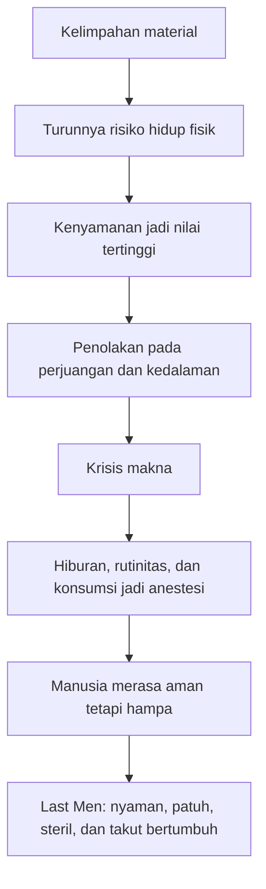
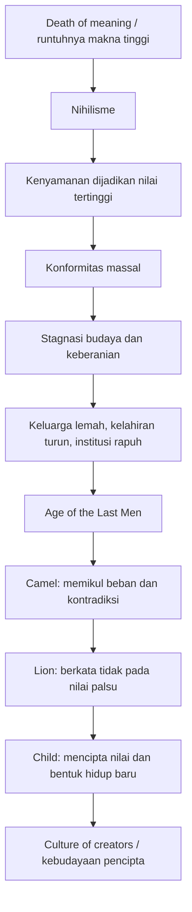
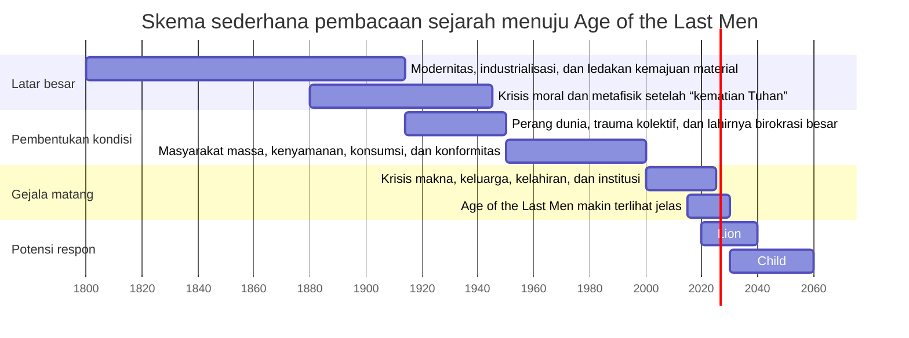

## 🕳️ Pendahuluan: Ketika Manusia Punya Semua Fasilitas, Tetapi Kehilangan Alasan untuk Menjadi Besar

Ada satu paradoks besar dalam dunia modern yang semakin sulit diabaikan. Kita hidup di era dengan:

- makanan lebih mudah didapat,
- informasi lebih melimpah,
- konektivitas lebih tinggi,
- teknologi lebih canggih,
- kenyamanan lebih besar,
- dan pilihan hidup lebih banyak,

namun di saat yang sama, banyak orang justru merasa:

- makin hampa,
- makin cemas,
- makin terasing,
- makin sulit membentuk keluarga,
- makin sulit menemukan makna,
- dan makin tidak percaya pada institusi yang dulu menopang hidup bersama. 🕳️

Ini pertanyaan yang sangat serius. Karena secara naluri, kita akan menduga bahwa semakin aman dan sejahtera suatu masyarakat, seharusnya semakin tinggi pula kualitas jiwanya. Tetapi yang kita lihat justru sering kebalikannya. Kenyamanan tidak otomatis melahirkan kebesaran. Kelimpahan tidak otomatis melahirkan peradaban yang hidup. Bahkan dalam banyak kasus, kelimpahan justru tampak melahirkan suatu jenis manusia yang lelah sebelum bertempur, sinis sebelum berpikir, dan puas sebelum mencapai apa pun.

Di sinilah gagasan **“Age of the Last Men”** *(Zaman Manusia-Manusia Terakhir)* menjadi sangat menarik. Dalam video yang ditranskripkan ini, konsep tersebut dibaca sebagai kerangka untuk memahami dunia modern: dunia yang sangat makmur, sangat terhubung, sangat teradministrasi, tetapi secara ruhani, moral, dan kultural justru menurun ke arah stagnasi. 🌫️

Tentu kita perlu langsung memberi catatan penting. Video ini sendiri membawa banyak klaim filosofis, historis, politis, bahkan ideologis yang sangat kuat, tidak jarang kontroversial, dan dalam beberapa bagian bercampur antara:

- analisis serius,
- pembacaan Nietzsche,
- komentar budaya,
- spekulasi sejarah,
- dan opini politik yang tidak semuanya harus diterima mentah-mentah.

Karena itu, artikel ini tidak akan sekadar menyalin atau membenarkan semua isinya. Saya akan mengambil inti gagasannya yang paling kuat dan relevan, lalu membedahnya secara lebih jernih, lebih runtut, dan lebih berguna untuk pembaca BangunAI Blog.

Kalau disederhanakan, pertanyaan besar yang diajukan oleh tema “last men” adalah ini:

> **Apa yang terjadi pada manusia ketika ia berhasil mengurangi hampir semua kesulitan hidup, tetapi sekaligus kehilangan keberanian, kedalaman, dan orientasi untuk bertumbuh?**

Pertanyaan ini sangat Nietzschean *(bernuansa Nietzsche / sesuai semangat pemikiran Nietzsche).* Dan justru karena itu, ia terasa sangat mengganggu. Sebab ia menolak memberi pujian otomatis kepada dunia modern hanya karena dunia ini nyaman. Ia memaksa kita bertanya apakah kita sungguh sedang berkembang, atau hanya sedang semakin ahli dalam membuat kandang yang empuk untuk jiwa yang mengecil. 🧠

Dalam artikel ini, kita akan membahas secara detail:

- apa itu “last men” menurut Nietzsche,
- mengapa konsep ini terasa relevan untuk abad ke-21,
- hubungan antara kenyamanan dan hilangnya daya hidup,
- nihilisme *(pandangan bahwa hidup kehilangan makna objektif)*,
- konformitas massal *(mass conformity / keseragaman sosial)*,
- krisis institusi dan keluarga,
- lenyapnya kedalaman budaya,
- serta gagasan tandingan berupa manusia pencipta nilai baru.

Kalau harus dirumuskan sebagai tesis utama, maka artikel ini berdiri di atas tesis berikut:

> **Age of the Last Men adalah kritik terhadap dunia modern yang berhasil menaklukkan banyak kesulitan material, tetapi justru gagal memelihara keberanian, makna, dan struktur nilai yang membuat hidup layak dijalani secara agung; hasilnya adalah manusia yang aman, kenyang, dan terhubung—tetapi lelah, steril, sinis, dan takut pada segala bentuk kedalaman serta perjuangan.**

Dan ini bukan cuma teori abstrak. Kita melihat gejalanya di mana-mana:
- rumah mahal, keluarga tertunda,
- pekerjaan ada, tetapi terasa hampa,
- hiburan melimpah, tetapi jiwa tetap kering,
- opini sangat banyak, tetapi hikmah sangat tipis,
- moralitas sangat ribut, tetapi karakter makin rapuh.

Maka artikel ini akan berusaha menjawab bukan hanya “apa itu last men?”, tetapi juga:

> **mengapa dunia yang katanya maju bisa menghasilkan manusia yang makin takut untuk hidup secara penuh?**

---

<Callout type="important" title="Tesis utama artikel ini">
Konsep “last men” menggambarkan manusia yang memilih kenyamanan daripada keberanian, stabilitas dangkal daripada pertumbuhan, dan keseragaman sosial daripada kedalaman jiwa. Ia lahir bukan dari kemiskinan, tetapi justru dari peradaban yang terlalu berhasil menghilangkan risiko sampai manusia lupa untuk menjadi agung.
</Callout>

---

## 🧭 1. Siapa “Last Men” Itu? Membaca Nietzsche Tanpa Menyederhanakannya Jadi Meme

Untuk memahami gagasan ini, kita harus mulai dari Nietzsche. Dalam *Also sprach Zarathustra* (*Thus Spoke Zarathustra* / *Sabda Zarathustra*), Nietzsche memperkenalkan figur **the last men** *(manusia-manusia terakhir)* sebagai lawan dari figur **Übermensch** *(sering diterjemahkan “manusia unggul”, “manusia pelampau”, atau “manusia yang melampaui dirinya sendiri”)*. 🧭

### Apa ciri “last men”?
Mereka bukan monster. Mereka justru kelihatan normal. Bahkan bisa jadi sangat modern. Mereka ingin:
- aman,
- nyaman,
- sehat,
- tidak terlalu terguncang,
- tidak terlalu menderita,
- tidak terlalu berisiko,
- dan tidak terlalu dituntut untuk melampaui diri.

Sekilas, itu terdengar wajar. Siapa yang tidak mau hidup aman? Masalahnya, bagi Nietzsche, ketika keamanan menjadi nilai tertinggi, manusia akan kehilangan dimensi-dimensi agung dari eksistensinya:
- keberanian,
- pengorbanan,
- penciptaan nilai,
- daya juang,
- dan kemampuan mengatakan “ya” kepada kehidupan yang sulit.

### “Last men” bukan orang jahat, tetapi orang yang sudah mengecil
Mereka tidak selalu tiran. Mereka tidak selalu kriminal. Mereka bahkan bisa terlihat baik-baik saja. Tetapi mereka adalah tipe manusia yang:
- alergi terhadap perjuangan,
- curiga pada kedalaman,
- takut pada ambisi besar,
- menertawakan keluhuran,
- dan lebih suka mengecilkan semua hal agar muat dalam ukuran kenyamanan mereka.

Itu sebabnya figur “last men” sangat menakutkan. Ia tidak datang dengan teriakan perang. Ia datang dengan kalimat seperti:
- “yang penting nyaman,”
- “jangan terlalu serius,”
- “semua relatif kok,”
- “hidup santai saja,”
- “kenapa harus susah-susah,”
- “buat apa ngotot punya nilai besar.”

Dan justru karena itu, “last men” bisa menjadi produk akhir dari masyarakat yang terlalu sukses menormalkan mediokritas *(keadaan serba rata-rata dan tidak berani menjadi lebih tinggi).* 😶

---

## 🌍 2. Mengapa Gagasan Ini Terasa Sangat Cocok dengan Dunia Sekarang?

Salah satu argumen paling kuat dalam transcript adalah bahwa kondisi dunia modern tampak sangat sesuai dengan gambaran Nietzsche. Bayangkan: populasi dunia melonjak, pendidikan formal meluas, teknologi luar biasa, internet menghubungkan miliaran orang, dan pasokan barang serta jasa makin efisien. Secara teori, semua ini seharusnya melahirkan ledakan kreativitas dan kemajuan peradaban. 🌍

Tetapi yang justru sering tampak adalah:
- konformitas yang mengejutkan,
- masalah yang sama di banyak negara,
- krisis makna yang bersifat global,
- kelahiran yang turun drastis,
- mahalnya rumah dan keluarga,
- lemahnya iman terhadap lembaga sosial,
- dan rasa nihilistik yang diam-diam menyebar.

### Ini penting sekali
Kita biasa menganggap masalah-masalah modern sebagai hal lokal atau sektoral:
- krisis perumahan di sini,
- krisis kerja di sana,
- krisis keluarga di tempat lain.

Namun transcript ini menyorot sesuatu yang lebih besar: banyak gejala itu kini muncul serempak di banyak masyarakat industrial. Artinya, mungkin problemnya bukan sekadar kebijakan teknis, tetapi **struktur peradaban itu sendiri**.

Ketika negara-negara dengan budaya berbeda mulai menunjukkan pola yang serupa—kesepian, penurunan kelahiran, hilangnya percaya diri sosial, dan kebuntuan makna—kita patut bertanya apakah kita sedang melihat bukan kegagalan insidental, tetapi fase historis yang lebih dalam. 🧩

---

## 💤 3. Kelimpahan Tidak Selalu Melahirkan Vitalitas: Kenyamanan Bisa Menjadi Musuh Tersembunyi Kehidupan

Inilah inti dari kritik “last men”: manusia modern hidup dalam kelimpahan yang justru mematikan daya hidup. 💤

### Nietzsche membaca bahaya ini lebih awal
Ia tampaknya mengerti bahwa jika manusia terlalu lama hidup dalam:
- kenyamanan terjamin,
- risiko yang diperkecil,
- konflik yang dihindari,
- penderitaan yang dianggap harus sepenuhnya dihapus,

maka perlahan ia tidak lagi tahu untuk apa hidup selain mempertahankan kenyamanan itu sendiri.

Dan ketika kenyamanan menjadi tujuan tertinggi, semua hal yang lebih tinggi akan tampak berbahaya atau tidak praktis:
- kebajikan akan terasa terlalu berat,
- keluarga akan terasa terlalu menuntut,
- seni agung akan terasa terlalu sulit,
- disiplin akan terasa terlalu keras,
- agama akan terasa terlalu mengikat,
- kepemimpinan akan terasa terlalu tidak nyaman,
- dan pertumbuhan diri akan terasa seperti ancaman bagi zona aman.

### Maka yang tersisa adalah manusia yang terus menghindar
Bukan dari perang saja. Bukan dari penderitaan ekstrem saja. Tetapi dari semua hal yang membuat jiwa membesar.

Ia akan menghindari:
- komitmen jangka panjang,
- tanggung jawab besar,
- nilai yang tegas,
- perbedaan kualitas,
- dan penilaian yang menuntut.

Karena semua itu mengandung risiko. Semua itu memerlukan kekuatan. Semua itu menuntut kita menjadi lebih dari sekadar konsumen yang nyaman.

> **Last men tidak harus kelaparan untuk hancur; mereka cukup terlalu nyaman sampai lupa bagaimana caranya hidup dengan keberanian.**

---

## 🧱 4. Konformitas Massal: Ketika Semua Orang Punya Pendapat, Tetapi Sedikit yang Benar-Benar Berpikir

Transcript ini berkali-kali menyinggung satu gejala penting: **mass conformity** *(konformitas massal / keseragaman sosial yang kuat).* 🧱

Ini gejala yang sering tersembunyi di balik ilusi kebebasan modern. Di permukaan, kita tampak hidup di dunia penuh pilihan. Orang bisa berpakaian beda, konsumsi media beda, punya selera beda, tinggal di tempat beda. Tetapi jika dilihat lebih dalam, sering justru ada keseragaman yang sangat kuat:

- pola kecemasan yang sama,
- bahasa moral yang sama,
- obsesi status yang sama,
- gaya humor yang sama,
- narasi identitas yang sama,
- dan ketakutan yang sama terhadap pengucilan sosial.

### Inilah paradoks kebebasan modern
Semakin banyak opsi teknis, semakin sedikit keberanian eksistensial. Orang bebas memilih produk, tetapi tidak bebas sungguh-sungguh menjadi dirinya sendiri jika itu melawan ritme herd *(gerombolan sosial / mentalitas kawanan).* 

Nietzsche sangat sensitif terhadap masalah ini. Baginya, masyarakat modern menghasilkan manusia yang tidak lagi ingin berdiri tegak sebagai pribadi pencipta nilai, melainkan lebih suka menjadi makhluk yang:
- aman dalam konsensus,
- nyaman dalam slogan,
- dan hidup dalam keramaian tanpa kedalaman.

### Mengapa ini terjadi?
Karena konformitas memberi beberapa keuntungan besar:
- rasa aman sosial,
- pengurangan konflik,
- validasi dari kelompok,
- dan pelepasan tanggung jawab berpikir mandiri.

Tetapi harganya mahal: kita kehilangan kebebasan batin.

---

## ⚰️ 5. Nihilisme: Ketika Tuhan Mati, tetapi Manusia Belum Menemukan Apa yang Layak Menggantikannya

Salah satu akar penting dari “age of the last men” adalah **nihilisme**. Ini bukan sekadar sikap pesimis atau sedih. Nihilisme dalam konteks Nietzsche berarti situasi ketika nilai-nilai tertinggi yang dulu menopang hidup sudah runtuh, tetapi belum ada nilai baru yang cukup kuat untuk menggantikannya. ⚰️

### “God is dead” sering disalahpahami
Nietzsche tidak sedang sekadar menghina agama. Ia sedang membuat diagnosis historis dan spiritual:

> Dunia modern mulai hidup seolah-olah Tuhan tidak lagi menjadi pusat makna yang aktif.

Artinya, sekalipun bahasa agama masih ada, struktur moral dan imajinasi masyarakat tidak lagi sungguh dihidupi oleh orientasi transenden *(yang melampaui dunia ini).* 

Akibatnya, manusia berada dalam kekosongan nilai:
- ia tidak lagi sungguh percaya pada moral lama,
- tetapi juga belum cukup kuat untuk menciptakan moral baru.

### Dan di sinilah last men lahir
Karena ketika makna tinggi runtuh, manusia punya dua pilihan besar:

1. menghadapi kehampaan itu dengan keberanian lalu mencipta ulang hidup,
2. atau menambalnya dengan kenyamanan, hiburan, dan rutinitas yang membuat kita lupa bahwa kita hampa.

“Last men” memilih jalan kedua.

Mereka tidak menyelesaikan nihilisme. Mereka menidurkannya. Mereka membungkusnya dengan:
- kesehatan,
- hiburan,
- administrasi,
- kepatuhan sosial,
- dan konsumsi yang cukup agar jiwa tidak sempat bertanya terlalu jauh.

Itu sebabnya Nietzsche begitu mengerikan: ia melihat bahwa manusia modern mungkin tidak akan runtuh lewat tragedi besar, tetapi lewat **kehilangan pertanyaan-pertanyaan tertinggi**.

---

## 🏚️ 6. Krisis Keluarga, Kelahiran, dan Rumah: Gejala Material dari Jiwa yang Kehilangan Arah

Salah satu poin kuat dalam transcript adalah bahwa dunia industrial modern di banyak tempat sedang berhadapan dengan gejala yang mirip:
- rumah terlalu mahal,
- kerja stabil makin sulit,
- keluarga makin tertunda,
- kelahiran turun tajam,
- dan relasi sosial memburuk.

Ini bukan kebetulan. 🏚️

### Mengapa semua ini relevan dengan “last men”?
Karena keluarga, rumah, dan anak adalah proyek jangka panjang. Ia menuntut:
- kepercayaan pada masa depan,
- pengorbanan hari ini demi esok,
- stabilitas psikologis,
- keberanian mengambil tanggung jawab,
- dan keyakinan bahwa hidup layak diteruskan.

Kalau sebuah masyarakat kehilangan itu semua, gejalanya akan muncul pada:
- orang makin enggan beranak,
- makin sulit mempercayai komitmen,
- makin memilih kenyamanan personal jangka pendek,
- dan makin sulit membangun institusi menengah seperti keluarga yang sehat.

### Kelahiran yang turun bukan hanya soal ekonomi
Tentu ekonomi penting. Tapi penurunan birth rate *(angka kelahiran)* juga sering menandakan bahwa masyarakat kehilangan keyakinan eksistensial pada masa depan.

Karena punya anak bukan sekadar urusan uang. Ia adalah pernyataan metafisik diam-diam:

> “Saya percaya hidup ini cukup bernilai untuk diteruskan.”

Kalau masyarakat kehilangan alasan untuk mengatakan itu, maka angka kelahiran akan runtuh meski fasilitas ada.

---

## 🪞 7. Last Men dan Krisis Makna: Ketika Hidup Menjadi Sangat Teratur, tetapi Tidak Lagi Terasa Penting

Banyak orang modern tidak hidup dalam horor terbuka. Mereka hidup dalam sesuatu yang mungkin lebih halus, tetapi tidak kalah berbahaya: **meaning crisis** *(krisis makna).* 🪞

### Ciri krisis makna modern
- kita tahu banyak hal, tetapi tidak tahu untuk apa semua itu;
- kita punya akses ke dunia, tetapi tidak tahu apa yang layak diperjuangkan;
- kita bisa bepergian, bekerja, membeli, menonton, belajar, berbagi, tetapi semuanya sering terasa seperti serpihan yang tidak membentuk inti hidup.

Ini sesuai dengan kritik terhadap modernitas yang hanya menghargai hal-hal yang:
- terukur,
- terlihat,
- material,
- dapat dikelola secara birokratis.

Padahal manusia butuh lebih dari itu. Ia butuh apa yang dalam transcript disebut secara tidak langsung sebagai hal-hal yang “tak terlihat” tetapi nyata:
- cinta,
- keberanian,
- kehormatan,
- keadilan,
- makna,
- rasa milik,
- dan pengalaman transendensi.

Kalau masyarakat kehilangan bahasa untuk hal-hal tak terlihat ini, hidup akan menjadi datar. Bukan karena semua orang menderita hebat, tetapi karena semua orang pelan-pelan kehilangan alasan untuk menganggap hidup sebagai panggilan yang tinggi.

### Inilah sebabnya last men “berkedip dan menyebutnya kebahagiaan”
Mereka tidak benar-benar bahagia dalam arti agung. Mereka hanya berhasil menurunkan standar hidup sampai rasa tidak terganggu dianggap cukup sebagai kebahagiaan.

---

---

## 🧬 8. “Mouse Utopia” dan Overabundance: Ketika Kelebihan Kondisi Justru Merusak Kehidupan

Transcript ini juga menarik karena menghubungkan konsep “last men” dengan eksperimen **mouse utopia** *(utopia tikus / eksperimen sosial pada tikus yang hidup dalam kelimpahan tetapi berakhir rusak secara sosial).* 🧬

Gagasan utamanya sederhana tetapi sangat mengganggu:

Jika makhluk hidup diberi:
- ruang cukup,
- makanan cukup,
- ancaman rendah,
- dan tantangan hidup menurun,

maka hasilnya tidak selalu kesehatan sosial. Dalam eksperimen itu, kelimpahan justru berkorelasi dengan:
- gangguan perilaku,
- gangguan relasi,
- kegagalan reproduksi,
- agresi yang aneh,
- dan hilangnya fungsi sosial normal.

### Penting: manusia bukan tikus
Kita tentu harus berhati-hati. Manusia tidak bisa direduksi begitu saja menjadi analogi hewan laboratorium. Tetapi eksperimen ini sering dipakai sebagai simbol untuk menunjukkan bahwa:

> **kehidupan membutuhkan bukan hanya pasokan, tetapi juga struktur makna, tantangan, ritme, dan fungsi.**

Tanpa itu, kelimpahan bisa berubah jadi racun.

### Ini sangat cocok dengan dunia modern
Kita mengira masalah akan selesai jika kebutuhan material dipenuhi. Tapi kalau jiwa kehilangan:
- peran,
- misi,
- komunitas nyata,
- dan horizon nilai,

maka kemakmuran justru dapat mempercepat pembusukan batin.

---

## 🪓 9. Mengapa Kedalaman Menjadi Tabu? Dunia Last Men Tidak Suka Apa Pun yang Terlalu Nyata

Salah satu gagasan paling tajam dalam transcript adalah bahwa masyarakat last men sangat terganggu oleh **depth** *(kedalaman / kesungguhan eksistensial).* 🪓

### Apa maksudnya?
Dunia ini tidak suka hal-hal yang:
- terlalu serius,
- terlalu heroik,
- terlalu setia,
- terlalu berprinsip,
- terlalu berkorban,
- terlalu religius dalam arti hidup sungguh-sungguh,
- atau terlalu mengejar kebenaran meskipun pahit.

Semua yang terlalu nyata akan segera dicurigai sebagai:
- ekstrem,
- toksik,
- tidak fleksibel,
- atau tidak nyaman.

### Mengapa demikian?
Karena kedalaman selalu menuntut perbedaan kualitas. Ia menuntut kita mengakui bahwa:
- ada hal yang lebih tinggi dari hal lain,
- ada hidup yang lebih mulia dari hidup lain,
- ada tindakan yang lebih agung dari tindakan lain,
- ada budaya yang lebih hidup dari budaya lain,
- ada manusia yang benar-benar lebih berani dari manusia lain.

Tetapi dunia last men tidak suka pembedaan seperti itu. Ia ingin semua rata. Semua setara dalam mediokritas yang aman. Semua boleh hidup asal tidak terlalu mengganggu ritme kenyamanan bersama.

### Maka hasilnya adalah budaya yang ironis dan dingin
Bukan budaya yang betul-betul jahat, tetapi budaya yang:
- menertawakan kesungguhan,
- meremehkan ketulusan,
- takut pada otoritas moral yang sehat,
- dan lebih mahir membongkar daripada membangun.

---

## 🏛️ 10. Institusi Tanpa Jiwa: Ketika Birokrasi Mengambil Alih Peran Makna, tetapi Hanya Bisa Mengelola, Bukan Menjiwai

Dalam banyak bagian, transcript ini mengkritik dunia modern sebagai dunia yang sangat diatur oleh **managerial bureaucracy** *(birokrasi manajerial / kelas pengelola administratif).* 🏛️

Terlepas dari nada politis berlebihan di beberapa bagiannya, inti kritik ini sebenarnya penting: birokrasi pandai mengelola, tetapi tidak pandai memberi makna.

### Apa yang bisa dikerjakan birokrasi?
- standarisasi,
- regulasi,
- pengukuran,
- prosedur,
- kontrol,
- distribusi,
- dan stabilisasi.

### Apa yang sulit dikerjakan birokrasi?
- membangkitkan cinta tanah air secara sehat,
- membentuk karakter luhur,
- menumbuhkan keberanian,
- menyusun moralitas yang hidup,
- memelihara rasa sakral,
- menghidupkan tradisi menjadi tenaga jiwa.

Birokrasi bisa memaksa keteraturan, tetapi tidak bisa menggantikan fungsi terdalam dari:
- agama,
- keluarga,
- komunitas,
- seni besar,
- dan teladan moral.

Maka ketika masyarakat menyerahkan terlalu banyak hal pada sistem administratif, hidup bersama menjadi rapi tetapi dingin. Aturan ada, tetapi makna tidak tumbuh. Kepatuhan ada, tetapi jiwa tidak ikut naik.

---

## 🧑‍🎨 11. Siapa Lawan dari Last Men? Bukan Sekadar “Alpha”, tetapi Sang Pencipta Nilai

Salah satu koreksi penting yang harus dilakukan terhadap pembacaan populer Nietzsche adalah: lawan dari “last men” bukan sekadar lelaki macho, bukan sekadar dominator sosial, dan bukan sekadar orang paling keras di ruangan. Lawan dari last men adalah **creator** *(pencipta nilai / manusia yang mampu melampaui dirinya dan membentuk horizon baru).* 🧑‍🎨

### Mengapa “pencipta” penting?
Karena nihilisme tidak bisa diselesaikan hanya dengan kemarahan. Ia juga tidak selesai dengan nostalgia kosong terhadap masa lalu. Kalau nilai lama runtuh, manusia harus berani:
- menilai ulang,
- menyaring yang mati,
- mengambil yang masih hidup,
- lalu mencipta bentuk kehidupan baru yang lebih benar.

Inilah yang dimaksud dengan self-overcoming *(melampaui diri sendiri).* Bukan sekadar menolak dunia, tetapi bertumbuh melampauinya.

### Maka figur tandingan bukan cuma pejuang, tetapi juga pembangun
Ia bisa hadir sebagai:
- pendiri yang mencipta institusi sehat,
- seniman yang menghidupkan kembali kedalaman,
- pemikir yang merumuskan nilai baru dengan keberanian,
- pemimpin yang menata arah,
- atau siapa pun yang memilih bertumbuh daripada sekadar nyaman.

Di sini, greatness *(keagungan / kebesaran)* bukan berarti popularitas. Ia berarti daya untuk mengatakan:

> “Aku tidak akan berhenti pada norma yang membuat jiwa manusia mengecil.”

---

## 🔥 12. Dari Camel ke Lion ke Child: Tiga Tahap Keluar dari Dunia Last Men

Transcript menyinggung tiga tahap terkenal dari Nietzsche: **camel, lion, child** *(unta, singa, anak).* Ini metafora yang sangat kaya. 🔥

### 1. Camel *(unta)*
Ini tahap ketika manusia memikul beban:
- tradisi,
- tuntutan sosial,
- kewajiban,
- tekanan,
- dan warisan nilai lama.

Unta kuat, tetapi ia memikul.

### 2. Lion *(singa)*
Ini tahap pemberontakan. Singa berkata “tidak” pada nilai palsu, kepatuhan kosong, dan struktur yang mematikan jiwa. Ia merobohkan. Ia menolak.

Tetapi singa belum cukup. Karena ia pandai menghancurkan, belum tentu pandai mencipta.

### 3. Child *(anak)*
Inilah tahap paling penting. Anak melambangkan:
- kepolosan kreatif,
- kemampuan memulai ulang,
- spontanitas yang sehat,
- dan daya untuk mencipta nilai baru.

### Mengapa ini penting untuk keluar dari age of the last men?
Karena masyarakat tidak bisa diselamatkan hanya dengan kritik. Ia juga tidak selesai hanya dengan kemarahan terhadap dekadensi. Pada akhirnya, harus ada penciptaan ulang:
- komunitas baru,
- bentuk hidup baru,
- moralitas yang lebih matang,
- struktur yang memberi ruang tumbuh,
- dan kebudayaan yang kembali punya jiwa.

Ini pelajaran besar. Banyak orang hari ini berhenti di tahap lion: marah, membongkar, mengecam, mengejek. Tapi sangat sedikit yang bisa sampai tahap child: membangun sesuatu yang sungguh hidup. 🌱

---

## 🛡️ 13. Passive Evil: Bukan Hanya Kejahatan Aktif yang Menghancurkan, tetapi Juga Kepasifan Kolektif

Salah satu ide paling kuat dari seluruh pembahasan ini adalah bahwa kerusakan masyarakat modern tidak terutama datang dari satu kejahatan aktif yang spektakuler, tetapi dari apa yang bisa disebut **passive evil** *(kejahatan pasif / pembiaran yang menghancurkan).* 🛡️

Ini artinya:
- orang tahu ada yang salah, tetapi diam;
- orang tahu institusi melemah, tetapi tidak menanggung biaya untuk memperbaikinya;
- orang tahu keluarga runtuh, tetapi hanya mengeluh sambil tetap mengikuti arus;
- orang tahu budaya makin cetek, tetapi terus memberi makan yang cetek;
- orang tahu sistem tidak sehat, tetapi terlalu nyaman untuk menolaknya.

### Mengapa ini lebih berbahaya?
Karena kejahatan aktif biasanya mudah dikenali. Ia punya wajah. Ia menakutkan secara eksplisit. Tetapi kejahatan pasif menyebar seperti kabut. Tidak dramatis, tetapi sangat efektif dalam menghancurkan fondasi peradaban.

Ia hidup dalam kalimat seperti:
- “bukan urusan saya,”
- “biarkan saja,”
- “memang zaman sekarang begitu,”
- “yang penting saya aman,”
- “buat apa repot-repot.”

Last men sangat cocok hidup di dalam logika ini.

---

## 🧠 14. Mengapa Dunia Ini Terlihat Pintar, tetapi Sering Tidak Bijak?

Ada satu kritik halus namun penting dalam keseluruhan tema ini: dunia modern sangat kuat dalam hal informasi dan teknik, tetapi tidak otomatis kuat dalam kebijaksanaan. 🧠

### Kita tahu semakin banyak, tetapi memahami semakin sedikit
Kita punya data, statistik, grafik, model, algoritma. Tetapi apakah kita tahu:
- apa yang patut diinginkan?
- hidup baik itu seperti apa?
- apa yang layak diwariskan?
- apa yang membuat manusia berkembang secara utuh?

Sering kali tidak.

### Di sinilah positivism *(positivisme / keyakinan bahwa yang nyata hanyalah yang terukur dan bisa dibuktikan empiris)* menjadi problematik
Kalau suatu masyarakat hanya menghormati hal-hal yang tampak dan terukur, maka hal-hal yang paling dalam dari manusia akan terpinggirkan:
- cinta,
- kehormatan,
- keberanian,
- keindahan,
- kesetiaan,
- rasa sakral,
- dan pertanyaan moral besar.

Padahal justru hal-hal itulah yang sering menjadi inti dari kebudayaan yang hidup.

Maka dunia last men bisa sangat canggih, tetapi tetap terasa bodoh pada level terdalam. Karena ia pandai mengelola permukaan, tetapi tidak tahu bagaimana memberi orientasi pada jiwa.

---

## 🌱 15. Lalu Apa yang Harus Dilakukan? Bukan Sekadar Mengutuk Modernitas, tetapi Menghidupkan Kembali Kekuatan untuk Bertumbuh

Setelah semua kritik ini, pertanyaan paling penting tentu bukan sekadar: “iya, dunia memang rusak.” Itu terlalu mudah. Yang lebih penting adalah: **apa respons yang layak?** 🌱

Kalau membaca semangat Nietzsche secara sehat—bukan vulgar, bukan ideologis, bukan sebagai pembenaran kebrutalan—maka responsnya bisa diringkas menjadi beberapa hal:

### 1. Kembalikan kedalaman ke dalam hidup
Jangan hidup hanya untuk kenyamanan. Pilih sesuatu yang lebih besar dari rasa aman sesaat.

### 2. Terima bahwa pertumbuhan butuh gesekan
Hidup yang sepenuhnya anti-risiko akan membunuh jiwa.

### 3. Bangun struktur nilai, jangan hanya membongkar
Kritik itu perlu. Tapi manusia hidup dari nilai yang dijalankan, bukan sekadar sinisme.

### 4. Pulihkan institusi menengah
Keluarga, komunitas, tradisi, persahabatan yang tebal, agama yang hidup—semuanya penting sebagai lawan dari kesepian administratif modern.

### 5. Belajar mencipta, bukan cuma mengomentari
Last men sangat pandai mengomentari. Creator berbeda: ia membangun.

### 6. Jangan kira kebahagiaan sama dengan tidak terganggu
Kadang hidup yang baik justru penuh perjuangan, tetapi bermakna. Itu lebih tinggi daripada hidup nyaman yang steril.

---

---

## 🔚 Kesimpulan: Bahaya Terbesar Bukan bahwa Dunia Menjadi Sulit, tetapi bahwa Manusia Menjadi Terlalu Kecil untuk Menjawabnya

“Age of the Last Men” pada akhirnya bukan sekadar kritik sosial. Ia adalah cermin yang sangat tidak nyaman. Ia bertanya kepada kita:

- apakah kita masih berani hidup secara serius?
- apakah kita masih percaya ada hal yang lebih tinggi daripada kenyamanan?
- apakah kita masih mampu membesarkan jiwa, bukan hanya mengamankan badan?
- apakah kita masih bisa membentuk institusi yang menuntut kedewasaan, bukan sekadar menyuplai hiburan?
- dan apakah kita masih punya keberanian untuk mencipta nilai, bukan hanya mewarisi slogan? 🔚

Inilah yang membuat konsep last men begitu menakutkan. Ia bukan ancaman dari luar. Ia adalah kemungkinan yang tumbuh dari dalam keberhasilan peradaban itu sendiri. Ketika kenyamanan, keamanan, dan administrasi berkembang tanpa diimbangi oleh kedalaman, makna, dan keberanian, maka manusia tidak dihancurkan oleh bencana—ia dihancurkan oleh penurunan standar hidup jiwanya.

Dan mungkin itulah pelajaran paling keras dari seluruh tema ini:

> **Peradaban tidak mati hanya karena musuh menyerang. Kadang ia mati karena orang-orang di dalamnya tidak lagi merasa ada sesuatu yang layak dipertahankan dengan sungguh-sungguh.**

Jadi, lawan dari age of the last men bukan sekadar kemarahan. Bukan sekadar nostalgia. Bukan sekadar anti-modernitas. Lawannya adalah manusia yang:
- bersedia bertumbuh,
- sanggup menanggung berat hidup,
- berani berkata tidak pada kepalsuan,
- lalu cukup kreatif untuk membangun dunia yang lebih benar.

Itulah mungkin inti paling sehat yang bisa kita ambil dari seluruh pembahasan ini. Bukan menyembah kekerasan. Bukan meromantisasi konflik. Melainkan memulihkan satu kesadaran dasar:

> **bahwa hidup manusia terlalu agung untuk direduksi menjadi proyek kenyamanan yang steril.**

Dan jika dunia modern ingin selamat, mungkin yang dibutuhkan bukan lebih banyak hiburan, lebih banyak manajemen, atau lebih banyak anestesi psikologis—melainkan lebih banyak manusia yang berani kembali hidup dengan kedalaman, tanggung jawab, dan arah. 🔥

---

## Glosarium istilah asing + padanan Indonesia

| Istilah | Padanan / Penjelasan |
|---|---|
| last men | manusia-manusia terakhir; tipe manusia yang nyaman, patuh, dan takut bertumbuh |
| Übermensch / ubermensch | manusia pelampau; manusia yang melampaui dirinya dan mencipta nilai baru |
| nihilism | nihilisme; hilangnya makna dan nilai tertinggi |
| conformity | konformitas; penyesuaian diri berlebihan terhadap norma kelompok |
| managerial bureaucracy | birokrasi manajerial; kelas pengelola administratif modern |
| mass society | masyarakat massal; masyarakat skala besar yang seragam dan terstandar |
| positivity / positivism | positivisme; kecenderungan mengakui hanya hal yang terukur dan empiris |
| transcendence | transendensi; dimensi hidup yang melampaui yang sekadar material |
| stagnation | stagnasi; keadaan mandek, tidak bertumbuh |
| decadence | dekadensi; kemerosotan nilai, energi, dan kualitas jiwa budaya |
| self-overcoming | melampaui diri sendiri; bertumbuh melewati batas dan kelemahan lama |
| creator | pencipta nilai; manusia yang membangun bentuk hidup baru |
| passive evil | kejahatan pasif; pembiaran terhadap kerusakan yang jelas |
| mouse utopia | eksperimen “utopia tikus”; simbol kelimpahan tanpa makna yang berujung rusak |
| fragility | kerapuhan; kondisi yang tampak stabil tetapi mudah runtuh |
| anti-fragile | anti-rapuh; justru menguat saat menghadapi tantangan dan gesekan |
| depth | kedalaman; kesungguhan eksistensial, moral, dan spiritual |
| materialism | materialisme; kecenderungan membatasi realitas pada yang fisik dan terukur |
| archetype | arketipe; pola dasar simbolik dalam pikiran dan budaya |
| ressentiment | dendam-iri yang dipendam; rasa resentif yang menjadi motor moral negatif |

---

---

<Callout type="quote" title="Satu kalimat untuk mengingat seluruh artikel ini">
Age of the Last Men adalah nama bagi peradaban yang terlalu sukses menghapus kesulitan sampai manusia di dalamnya kehilangan alasan untuk menjadi besar.
</Callout>

---

**Sumber:** `https://www.youtube.com/watch?v=R3TFZpJari0`
