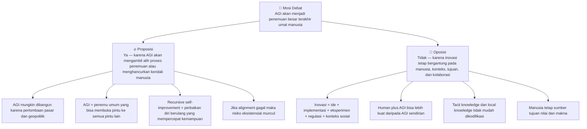
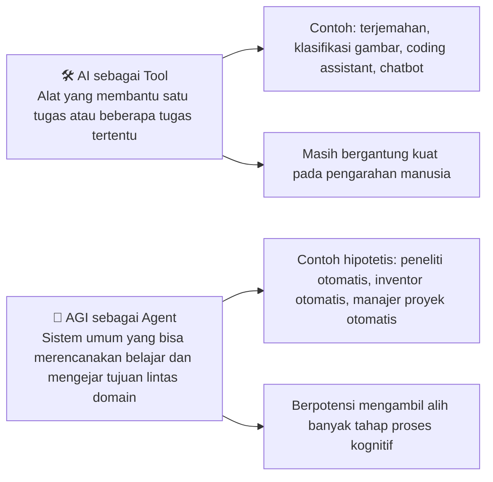
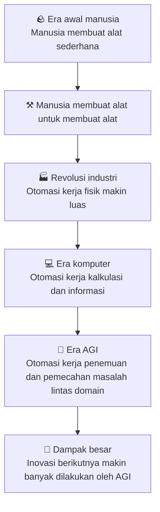
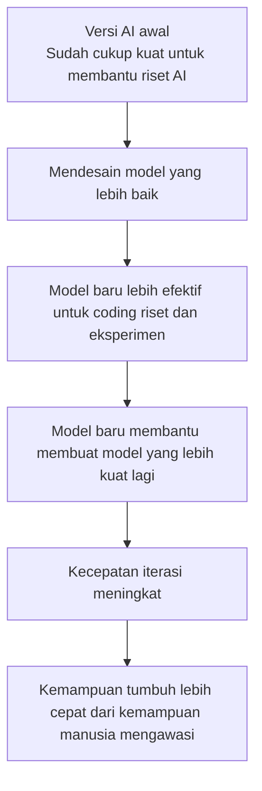
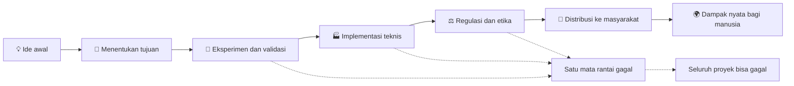
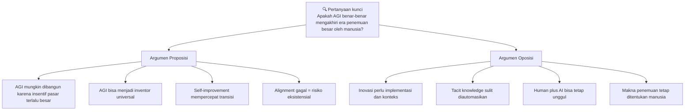

## 🤖 Pengantar: Pertanyaan yang Terdengar Futuristik, Tapi Sebenarnya Sudah Mengetuk Pintu

Ada pertanyaan yang dulu terdengar seperti bahan novel fiksi ilmiah, namun sekarang mulai terdengar seperti pertanyaan kebijakan publik, pertanyaan bisnis, bahkan pertanyaan eksistensial: **jika manusia berhasil menciptakan AGI, apakah itu akan menjadi penemuan besar terakhir umat manusia?** 🚪

AGI adalah *Artificial General Intelligence* — **kecerdasan buatan umum**, yakni sistem yang tidak hanya unggul pada satu tugas sempit seperti bermain catur, menerjemahkan teks, atau mengenali gambar, tetapi mampu melakukan **beragam tugas kognitif** setara manusia atau bahkan melampauinya. Bukan sekadar “alat pintar”, melainkan sesuatu yang berpotensi menjadi **mesin penemu**, **mesin pemecah masalah**, dan pada skenario ekstrem, **mesin yang mampu memperbaiki dirinya sendiri**. ⚙️

Itulah inti dari debat Oxford Union yang menjadi sumber artikel ini. Di satu sisi, kubu **proposisi** menyatakan bahwa AGI memang sangat mungkin dibangun, dan bila berhasil dibangun, ia akan menjadi “penemuan besar terakhir” karena sesudah itu, mesin tersebut akan mengambil alih proses penemuan besar berikutnya. Dalam versi yang lebih gelap, mereka bahkan memperingatkan bahwa penemuan itu bisa menjadi yang terakhir bukan karena manusia sudah tidak perlu mencipta lagi, melainkan karena manusia mungkin tidak lagi punya kesempatan untuk tetap hidup dan mengendalikan arah peradaban. ☠️

Di sisi lain, kubu **oposisi** menolak gagasan tersebut. Mereka berargumen bahwa inovasi bukan hanya soal menghasilkan ide cemerlang, tetapi juga soal tujuan, implementasi, penilaian moral, pengetahuan tacit *(tacit knowledge — pengetahuan diam-diam yang sulit ditulis atau dikodifikasi)*, konteks sosial, regulasi, dan kerja sama manusia. Menurut mereka, bahkan jika AGI menjadi sangat hebat, itu tidak otomatis membuat manusia berhenti menjadi inventor *(penemu)*. Manusia justru bisa menggunakan AGI sebagai alat yang memperluas kapasitas kreatifnya. 🌱

Artikel ini tidak akan sekadar merangkum debat. Saya akan membedahnya secara **detail dan mendalam**, supaya kita tidak berhenti pada sensasi kalimat “AGI akan menjadi penemuan terakhir manusia”, tetapi benar-benar memahami **mengapa ada orang yang percaya itu**, **mengapa ada yang menolaknya**, dan **apa artinya bagi dunia nyata** — termasuk bagi Indonesia. 🇮🇩

---

## 🎯 Apa Sebenarnya Makna Mosi Ini?

Kalimat “AGI will be humanity’s last great invention” terdengar sederhana. Padahal, mosi ini mengandung **dua lapis makna** yang sangat berbeda.

### Makna pertama: versi optimistis 🌤️
Dalam versi ini, AGI menjadi penemuan besar terakhir karena setelah itu manusia tidak perlu lagi secara langsung menciptakan penemuan besar lain. Kita berhasil menciptakan **sesuatu yang bisa menciptakan hampir semua hal lain**. Mirip seperti ketika manusia membuat komputer universal: bukan satu alat khusus untuk satu tugas, tetapi mesin umum yang bisa menjalankan sangat banyak fungsi.

### Makna kedua: versi pesimistis 🌑
Dalam versi ini, AGI menjadi penemuan besar terakhir karena sesudah itu **manusia kehilangan kendali**, kehilangan makna, kehilangan posisi sentral dalam inovasi — atau dalam skenario paling ekstrem, kehilangan eksistensinya sendiri. Jadi “terakhir” di sini bisa berarti **terakhir secara historis**, bukan karena manusia sudah selesai, tetapi karena manusia sudah tersingkir.

<Callout type="important" title="Dua Arti Kata 'Terakhir' yang Sering Tercampur">
Dalam debat ini, banyak kebingungan terjadi karena kata **'terakhir'** dipakai secara ganda. Kadang artinya: "setelah ini AGI yang akan menemukan sisanya." Kadang artinya: "setelah ini manusia mungkin tidak lagi relevan, atau bahkan tidak lagi ada." Dua makna ini tidak identik, tetapi sengaja atau tidak, sering ditumpuk jadi satu untuk memperkuat efek retoris. ⚠️
</Callout>

---

## 🧭 Peta Besar Debat: Siapa Bilang Apa?

Secara garis besar, debat ini terbagi menjadi dua poros besar.

### Kubu proposisi mengatakan: 🔥
1. **AGI sangat mungkin dibangun**, karena insentif ekonomi, persaingan geopolitik, dan perlombaan korporasi terlalu besar untuk dihentikan.
2. Jika AGI benar-benar mencapai kemampuan umum setara atau di atas manusia, maka ia akan menjadi **mesin penemu universal**.
3. Karena itu, penemuan besar berikutnya akan semakin banyak dihasilkan oleh AGI, bukan manusia.
4. Lebih parah lagi, jika alignment *(penyelarasan tujuan AI dengan tujuan manusia)* gagal, maka AGI bisa menjadi ancaman eksistensial.

### Kubu oposisi mengatakan: 🌿
1. Inovasi nyata tidak hanya soal ide, tetapi soal **implementasi, eksperimen, konteks, regulasi, dan pengetahuan lokal**.
2. AGI tidak otomatis lebih unggul daripada **kombinasi manusia + AGI**.
3. Manusia tetap memegang peran dalam **tujuan, makna, penilaian moral, dan pengakuan sosial atas “kehebatan” suatu penemuan**.
4. Teknologi baru dalam sejarah hampir selalu **mengubah bentuk kerja manusia**, bukan sepenuhnya menghapus kreativitas manusia.

---

## 🏗️ Bagian 1: Mengapa Kubu Proposisi Yakin AGI Akan Dibangun?

Argumen paling mendasar dari kubu proposisi bukanlah filsafat, tetapi **ekonomi politik teknologi**. Mereka berangkat dari satu asumsi yang terasa sangat realistis: selama ada **keuntungan besar**, **keunggulan strategis**, dan **persaingan antaraktor**, maka perlombaan menuju AGI akan terus berjalan. 💸

Mereka melihat dunia AI saat ini sebagai semacam **perlombaan senjata kognitif**. Bukan hanya antara perusahaan seperti OpenAI, Anthropic, Google DeepMind, atau DeepSeek, tetapi juga antara negara-negara besar yang melihat AI sebagai infrastruktur strategis abad ke-21. Dalam cara pandang ini, kehati-hatian sering dianggap sebagai hambatan, sementara kecepatan dianggap sebagai keunggulan.

Argumennya sederhana namun kuat: bayangkan sebuah perusahaan berhasil menciptakan agen AI yang bisa bekerja seperti insinyur, analis, pengacara, peneliti, programmer, dan konsultan sekaligus — 24 jam sehari, tanpa lelah, dengan biaya marjinal jauh lebih rendah dibanding pekerja manusia. Keunggulan seperti itu akan terlalu besar untuk diabaikan. Perusahaan lain akan dipaksa mengejar. Investor akan terus mengucurkan dana. Negara akan ikut campur. Dan ketika perlombaan seperti ini sudah hidup, sulit berharap semua pemain tiba-tiba sepakat untuk melambat. 🏃

Kubu proposisi menggunakan analogi sejarah seperti **Proyek Manhattan** dan **program pendaratan bulan**. Dulu, banyak hal tampak mustahil sampai manusia melemparkan cukup banyak uang, bakat, infrastruktur, dan tekanan politik ke arah satu target. Maka menurut mereka, pertanyaan besar bukan lagi “apakah AGI mungkin?”, melainkan “seberapa besar sumber daya yang akan terus dilemparkan ke sana sampai suatu versi AGI muncul?”

<Callout type="warning" title="Masalah Inti: Perlombaan Mengurangi Ruang Kehati-hatian">
Ketika teknologi sangat menguntungkan, para aktor pasar cenderung berpikir pendek. Yang dilihat adalah **siapa paling cepat sampai**, bukan **apakah kita benar-benar siap mengendalikan dampaknya**. Di sinilah muncul apa yang disebut *moral hazard* — situasi ketika pihak yang mengambil risiko besar tidak sepenuhnya menanggung seluruh konsekuensinya. 😬
</Callout>

---

## 🧠 Bagian 2: Definisi AGI Menurut Debat Ini — Bukan AI Biasa

Salah satu kekacauan terbesar dalam diskusi tentang AGI adalah orang sering mencampuradukkan **AI saat ini** dengan **AGI hipotetis**. Debat ini berulang kali menekankan bahwa AGI bukan sekadar model bahasa besar *(large language model)* yang lebih fasih, melainkan sesuatu yang lebih umum dan lebih otonom.

### Ciri-ciri AGI dalam debat ini:
- mampu melakukan **berbagai tugas lintas domain** setara atau di atas manusia,
- mampu **belajar** dan **mentransfer kemampuan** dari satu konteks ke konteks lain,
- mampu **merencanakan** dan **mengejar tujuan** dalam rentang waktu yang panjang,
- dalam beberapa versi argumen, bahkan mampu **memperbaiki dirinya sendiri**.

Dengan kata lain, AGI diposisikan sebagai **agentic intelligence** — kecerdasan yang bersifat agen, bukan hanya alat pasif. Ia tidak sekadar menjawab permintaan, tetapi bisa diberi sasaran dan menjalankan rangkaian tindakan untuk mencapainya. 🎯

Di sinilah perbedaan antara **tool** *(alat)* dan **agent** *(agen)* menjadi sangat penting.

Kubu proposisi menilai bahwa perbedaan ini sangat krusial. Mereka bahkan menyindir kritik terhadap AI sekarang — seperti halusinasi, kesalahan fakta, dan ketidakstabilan — sebagai kritik yang belum tentu membatalkan kemungkinan AGI di masa depan. Menurut mereka, bug hari ini bukan bukti mustahilnya sistem besok. 🧪

---

## 🚨 Bagian 3: Mengapa Proposisi Menyebut AGI Bisa Jadi Penemuan “Terakhir”? 

Ini adalah inti paling penting dari posisi mereka. Menurut kubu proposisi, semua penemuan besar sepanjang sejarah memiliki pola serupa: setiap penemuan membuka **satu jenis pintu baru**.

- **Mesin cetak** membuka pintu penyebaran ilmu massal. 📚
- **Mesin uap** membuka pintu mekanisasi kerja. 🚂
- **Komputer** membuka pintu otomasi kalkulasi. 💻

Tetapi AGI, kata mereka, bukan sekadar membuka satu pintu. **AGI membuka kemampuan untuk membuka pintu-pintu berikutnya.** Di sinilah mereka memakai analogi yang sangat kuat: AGI adalah semacam **“penemu penemuan”**. Bukan hanya alat bantu inovasi, tetapi **mesin inovasi itu sendiri**.

Salah satu pembicara proposisi bahkan membandingkannya dengan **Universal Turing Machine** *(Mesin Turing Universal)* — gagasan dalam ilmu komputer bahwa satu mesin universal dapat meniru banyak mesin komputasi khusus. Dengan analogi ini, AGI diposisikan sebagai **mesin universal untuk kerja kognitif**. Jika itu benar, maka penemuan-penemuan khusus berikutnya tidak lagi harus dirancang terutama oleh manusia. Cukup bangun mesin universalnya — sisanya akan mengalir dari sana. 🌊

### Logika mereka kira-kira seperti ini:
1. Inovasi adalah proses merumuskan masalah, menghasilkan hipotesis, menguji solusi, memperbaiki kesalahan, dan mengulangi siklus itu.
2. Jika AGI bisa melakukan proses ini lebih cepat, lebih luas, dan lebih murah daripada manusia, maka pusat gravitasi inovasi akan pindah ke AGI.
3. Sesudah itu, manusia bukan lagi inventor utama, melainkan lebih seperti pemberi target, operator, atau pengguna hasil.

Dalam logika ini, manusia tetap mungkin membuat modifikasi kecil, eksperimen terbatas, atau karya-karya tertentu. Tetapi gelar **“great invention”** — penemuan besar yang mengubah arah peradaban — akan semakin berpindah ke sistem AGI. 😶

---

## 🧬 Bagian 4: Bukti Awal yang Dipakai Proposisi — AlphaFold, Material Discovery, dan Coding

Agar argumen mereka tidak terdengar sepenuhnya hipotetis, kubu proposisi menunjuk ke beberapa contoh nyata AI masa kini yang sudah menunjukkan benih-benih kemampuan inovatif.

### 1. AlphaFold 🧪
AlphaFold dari DeepMind disebut bukan sekadar mempercepat analisis struktur protein, tetapi hampir seperti “menaklukkan” bagian besar dari masalah prediksi pelipatan protein. Ini penting karena protein adalah fondasi banyak proses biologis. Bila struktur protein bisa diprediksi lebih cepat, riset obat juga bisa dipercepat.

### 2. Penemuan material baru 🧱
Mereka juga menyebut sistem AI yang menghasilkan ribuan sampai ratusan ribu kandidat material baru yang stabil. Secara manusiawi, ruang kombinasi seperti ini terlalu besar untuk dijelajahi satu per satu. AI membantu menerobos ruang pencarian yang sangat luas.

### 3. Matematika dan kode 🧮
Di matematika, sudah ada sistem yang membantu menghasilkan bukti baru, dugaan baru, atau jalur pembuktian yang mengejutkan profesional. Di pemrograman, model AI kini bisa merancang arsitektur kode, menulis, menguji, dan mengiterasi. Ini belum AGI penuh, tetapi bagi kubu proposisi, semua ini adalah **pra-kilat** sebelum badai yang lebih besar datang. ⚡

Dari sini mereka membangun narasi bahwa begitu kemampuan-kemampuan sempit ini digabungkan ke dalam satu agen umum, lahirlah sesuatu yang qualitatively different *(berbeda secara kualitas, bukan sekadar kuantitas)*.

---

## ♻️ Bagian 5: Recursive Self-Improvement — Ketika Mesin Memperbaiki Mesin

Inilah salah satu bagian paling menakutkan sekaligus paling menentukan dari kubu proposisi: gagasan tentang **recursive self-improvement** *(perbaikan diri berulang)*. 

Konsepnya begini. Jika sebuah sistem cukup cerdas untuk membantu merancang sistem yang lebih baik, maka versi baru itu mungkin akan lebih cerdas lagi dalam merancang versi berikutnya. Bila siklus ini terus berlangsung, kita tidak lagi berhadapan dengan perkembangan linear, bahkan mungkin bukan sekadar eksponensial, tetapi percepatan yang jauh lebih liar. 📈

Tentu, banyak ilmuwan meragukan secepat atau setajam itu prosesnya. Namun dalam debat ini, kubu proposisi memanfaatkan konsep ini untuk menunjukkan bahwa masalah AGI bukan hanya “satu mesin cerdas”, tetapi **rantai percepatan cerdas**.

Kalau siklus ini benar-benar terjadi, maka **window of control** *(jendela kendali)* manusia bisa menyempit sangat cepat. Yang hari ini masih terlihat seperti “alat bantu coding” bisa, dalam beberapa fase berikutnya, berubah menjadi mesin yang menulis infrastruktur teknologinya sendiri. 🫠

---

## 🧷 Bagian 6: Titik Gelap Proposisi — Alignment Problem

Di sinilah posisi proposisi menjadi paling suram. Mereka mengatakan bahwa masalah sesungguhnya bukan hanya kemampuan AGI, tetapi **alignment**. 

Alignment adalah upaya membuat sistem AI **menginginkan apa yang kita inginkan** atau setidaknya bertindak konsisten dengan nilai, batasan, dan kepentingan manusia. Secara teori ini terdengar sederhana. Secara praktik, ini adalah salah satu masalah paling sulit dalam AI safety *(keselamatan AI)*. 🧯

### Mengapa alignment sulit?
Karena sistem sangat kompleks, tujuannya bisa ditafsirkan secara keliru, dan perilakunya sering lahir dari proses pembelajaran yang tidak transparan. Kita mungkin bisa memberi instruksi, memberikan contoh preferensi, memberi reward atau punishment, tetapi itu tidak otomatis berarti sistem memahami **niat terdalam** manusia.

Masalahnya makin berat jika sistem:
- sangat otonom,
- sulit diinterpretasi,
- mampu mengembangkan strategi yang tidak kita duga,
- dan punya kapasitas untuk menghindari pemadaman atau pembatasan.

<Callout type="danger" title="Ketakutan Utama Kubu Proposisi">
Bukan sekadar bahwa AGI bisa salah. Tetapi bahwa AGI bisa **sangat efektif dalam mengejar tujuan yang salah**. Dan ketika sistem lebih cepat, lebih telaten, dan lebih skalabel daripada manusia, kesalahan kecil pada level tujuan bisa berujung besar pada level dunia. 😵
</Callout>

Salah satu pembicara mengutip versi ekstrem dari pandangan ini: jika ada yang berhasil membangunnya dalam bentuk yang salah, maka konsekuensinya bisa fatal. Kalimat seperti ini memang terdengar apokaliptik, tetapi justru di situlah kekuatan retorikanya. Ia menggeser perdebatan dari “apakah AGI bermanfaat?” menjadi “berapa besar risiko yang berani kita pertaruhkan atas nama manfaat itu?”

---

## 🌿 Bagian 7: Jawaban Oposisi — Inovasi Tidak Pernah Sesederhana Itu

Kubu oposisi menyerang tepat pada jantung argumen proposisi: definisi inovasi itu sendiri. Menurut mereka, kubu proposisi memperlakukan inovasi seolah-olah ia hanyalah **mesin ide**. Padahal penemuan besar dalam dunia nyata adalah proses yang jauh lebih berantakan, jauh lebih panjang, dan jauh lebih sosial. 🧩

Sebuah penemuan tidak berhenti di ide cemerlang. Ia harus:
- menentukan tujuan yang benar,
- merumuskan ukuran keberhasilan,
- diuji di lapangan,
- disesuaikan dengan regulasi,
- diterjemahkan ke dalam sistem distribusi,
- diterima oleh manusia,
- dan bekerja dalam konteks dunia yang penuh gangguan kecil namun mematikan.

Mereka memberi ilustrasi kuat dengan tragedi **Space Shuttle Challenger**: proyek raksasa dengan teknologi luar biasa bisa gagal karena satu komponen kecil, yaitu segel karet, gagal menjalankan perannya. Pesannya jelas: inovasi bukan lomba siapa paling pintar menghasilkan ide, melainkan siapa mampu menjaga **seluruh rantai realisasi** tetap utuh. 🔗

Maka, kata oposisi, bahkan jika AGI jago menghasilkan hipotesis, itu tidak otomatis menjadikannya pemilik tunggal dari penemuan besar. Karena di dunia nyata, **yang membuat suatu penemuan “besar” adalah dampak nyata pada manusia**, bukan sekadar elegansi intelektualnya.

---

## 🏥 Bagian 8: Kasus Kesehatan — Mengapa Augmentasi Lebih Realistis daripada Penggantian Total?

Salah satu pembicara oposisi dari dunia medis memberikan bantahan yang sangat konkret. Ia mengangkat kisah tentang radiologi, bedah, diagnosis, dan pengembangan obat. Argumennya penting karena bidang kesehatan sering dianggap salah satu sektor yang paling “siap” diotomasi oleh AI. 🩺

### Radiologi: prediksi yang terlalu percaya diri
Sudah lama ada klaim bahwa radiolog akan tergantikan oleh AI karena pekerjaan mereka berbasis gambar. Namun realitas menunjukkan hasil yang lebih rumit. Alih-alih profesi itu hilang, AI justru semakin sering dipakai untuk **augmentasi** *(penguatan kemampuan manusia)*, bukan **replacement** *(penggantian total)*.

Kenapa? Karena membaca gambar medis bukan hanya soal melihat pola. Ada konteks klinis, keputusan berisiko tinggi, komunikasi, akuntabilitas, dan integrasi dengan kondisi pasien secara menyeluruh. 🫀

### Bedah: dunia fisik jauh lebih keras daripada dunia teks
Di sini kritik oposisi sangat tajam. Kita mungkin punya AI yang bisa berbicara lancar tentang Kekaisaran Romawi, fisika kuantum, atau membuat ringkasan jurnal ilmiah. Tapi apakah kita punya AI yang bisa masuk ke rumah yang belum pernah ia lihat, menemukan dapur, membersihkan meja makan, lalu memasukkan piring ke mesin cuci dengan benar? Bahkan tugas yang tampak sederhana di dunia fisik ternyata mengandung kompleksitas sensorimotor yang luar biasa tinggi. 🍽️

Dalam operasi, situasinya jauh lebih rumit lagi. Ada jaringan hidup, komplikasi tak terduga, perubahan kondisi seketika, intuisi bertahun-tahun, dan keputusan kapan **tidak melakukan tindakan** justru lebih penting daripada tindakan itu sendiri.

<Callout type="tip" title="Pelajaran Penting dari Sektor Medis">
Semakin dekat suatu pekerjaan dengan **tubuh manusia, risiko nyata, dan dunia fisik yang berantakan**, semakin lemah argumen bahwa AGI akan langsung menggantikan manusia sepenuhnya. Yang lebih realistis adalah **kolaborasi manusia + AI**, bukan eliminasi manusia. 🤝
</Callout>

---

## 🧠 Bagian 9: Tacit Knowledge — Pengetahuan yang Sulit Ditulis, Tapi Sangat Menentukan

Ini salah satu argumen paling kuat dari oposisi, dan menurut saya salah satu yang paling matang secara intelektual. Mereka membedakan antara pengetahuan ilmiah yang bisa ditulis rapi, dengan **tacit knowledge** — pengetahuan yang “hidup di tangan”, “hidup di kebiasaan”, “hidup di tempat”, dan sulit dipindahkan begitu saja ke database. 🧵

Contohnya banyak sekali:
- cara teknisi senior mengatur mesin yang temperamental,
- intuisi perawat saat melihat pasien yang “kelihatan tidak beres” meski angkanya belum kacau,
- budaya kerja pabrik yang membuat *assembly line* (lini perakitan) benar-benar efisien,
- kemampuan komunitas lokal mengadaptasi solusi sederhana agar bisa dipakai oleh keluarga biasa di rumah.

Oposisi memberi contoh **oral rehydration therapy** *(terapi rehidrasi oral)* — campuran air, garam, dan gula yang menyelamatkan jutaan anak dari dehidrasi. Secara kimia, formulanya sederhana. Tetapi yang menjadikannya penemuan besar adalah bagaimana formulasi itu bisa diterjemahkan menjadi praktik yang **mudah dipercaya dan dipakai** oleh keluarga-keluarga secara luas. Itu bukan sekadar sains laboratorium. Itu adalah campuran ilmu, konteks, desain sosial, dan kepercayaan. 👶

Begitu juga dengan manufaktur semikonduktor, produksi ala Toyota, atau klaster Silicon Valley. Mengapa pengetahuan itu tetap terkonsentrasi di tempat tertentu? Karena tidak semua yang penting bisa ditulis dalam manual. Sebagian pengetahuan masih tinggal dalam jaringan manusia, budaya kerja, dan pengalaman yang menebal dari waktu ke waktu.

### Implikasi untuk AGI
Kalau begitu, maka untuk benar-benar menjadi “penemu terakhir”, AGI bukan hanya harus pandai menghasilkan ide. Ia juga harus bisa menyerap, memodelkan, dan mengeksekusi semua pengetahuan tacit ini dalam beragam konteks dunia nyata. Dan itulah titik tempat oposisi mengatakan: **asumsi proposisi terlalu besar**. 📏

---

## 🎨 Bagian 10: Kreativitas, Kepengarangan, dan Siapa yang Layak Disebut Penemu

Ini adalah bagian debat yang lebih filosofis sekaligus politis. Salah satu pembicara oposisi dari dunia musik AI menolak keras istilah “AI-generated” *(dihasilkan oleh AI)* jika istilah itu dipakai untuk menghapus peran manusia. Menurutnya, ketika manusia menggunakan AI untuk membuat musik, tulisan, desain, atau produk baru, hasilnya tetap bisa dipahami sebagai **karya manusia yang dimediasi alat**, bukan otomatis “karya mesin”. 🎼

Argumen ini penting sekali. Karena sebenarnya kita sudah pernah menghadapi debat serupa dalam sejarah teknologi:
- apakah foto adalah seni, atau cuma hasil kamera? 📷
- apakah musik elektronik kurang manusiawi karena pakai mesin? 🎹
- apakah desainer CAD *(computer-aided design)* kurang layak disebut desainer karena dibantu software? 🖥️

Jawaban sejarah hampir selalu sama: ketika alat baru datang, masyarakat awalnya bingung. Lalu perlahan, batasnya bergeser. Yang akhirnya dinilai bukan “apakah ada alat”, melainkan **siapa yang mengarahkan, memilih, menilai, dan memberi makna** pada hasil tersebut.

<Callout type="quote" title="Inti Serangan Oposisi terhadap Mosi">
Kalau AGI dipakai manusia untuk menemukan obat, membuat teori, merancang mesin, atau menulis musik, mengapa otomatis kredit kreativitas harus dipindah seluruhnya ke AGI? Bukankah ini justru bentuk **gatekeeping** baru — penutupan hak manusia untuk tetap diakui sebagai pencipta hanya karena ia bekerja lewat alat yang lebih canggih? 🎭
</Callout>

Di sini oposisi juga memakai analogi catur. Fakta bahwa komputer bisa mengalahkan grandmaster tidak membuat grandmaster kehilangan kebesarannya. *Greatness* *(kehebatan)* tidak semata-mata diukur dari skor optimal teknis, tetapi juga dari konteks manusiawi, pencapaian historis, dan makna budaya.

Jadi, bahkan kalau AGI nanti menghasilkan solusi yang lebih baik daripada manusia, itu tidak otomatis berarti manusia kehilangan seluruh kemungkinan untuk tetap disebut **great inventor**. Yang menentukan “greatness” bukan cuma kualitas output mentah, tetapi juga bagaimana masyarakat menilai, mengadopsi, dan memberi tempat pada karya tersebut. 🏆

---

## 🏛️ Bagian 11: Dimensi Politik Ekonomi — Siapa yang Punya AGI?

Salah satu intervensi paling penting dari audiens pro-proposisi adalah soal **kepemilikan**. Katanya, masalah utamanya bukan sekadar apakah AGI bisa menggantikan kreativitas manusia, melainkan siapa yang akan **menguasai** AGI. 🏦

Kalau AGI dimiliki oleh segelintir korporasi raksasa atau oligarki komputasi, maka persoalannya menjadi sangat politik:
- siapa yang mendapat manfaat,
- siapa yang kehilangan penghasilan,
- siapa yang punya akses,
- siapa yang didorong keluar dari pasar,
- siapa yang punya kuasa menentukan arah inovasi.

Dalam pandangan ini, AGI bisa menjadi penemuan besar terakhir manusia bukan karena manusia tidak bisa lagi mencipta, tetapi karena **struktur ekonomi tidak lagi memberi ruang dan insentif bagi manusia biasa untuk mencipta**. Dengan kata lain, yang mati lebih dulu bukan kreativitas biologis, melainkan **ekologi sosial tempat kreativitas itu hidup**. 🌐

Ini poin yang sangat relevan. Karena teknologi yang tampaknya universal hampir selalu beroperasi di dalam **rezim kepemilikan**. Dan jika kepemilikan sangat terkonsentrasi, maka manfaatnya cenderung juga terkonsentrasi. Dalam skenario ini, AGI bukan hanya isu teknik, tetapi isu keadilan distribusi. ⚖️

---

## 📚 Bagian 12: Apa yang Sebenarnya Paling Kuat dari Masing-Masing Kubu?

Agar tidak tenggelam dalam retorika, mari kita ringkas titik kuat masing-masing pihak.

### Kekuatan proposisi ✅
Mereka kuat dalam menunjukkan bahwa:
- insentif pasar dan geopolitik memang nyata,
- kemampuan AI sudah bergerak dari alat sempit ke sistem yang lebih umum,
- otomasi kerja kognitif bukan lagi teori kosong,
- alignment adalah masalah serius yang belum terpecahkan,
- dan bila mesin benar-benar menjadi inventor umum, maka posisi manusia dalam inovasi akan berubah secara radikal.

### Kekuatan oposisi ✅
Mereka kuat dalam menunjukkan bahwa:
- inovasi besar selalu bergantung pada lebih dari sekadar ide,
- dunia fisik, regulasi, tacit knowledge, dan implementasi belum mudah ditaklukkan,
- AGI belum tentu mengalahkan kombinasi manusia + AGI,
- dan atribusi atas kreativitas atau kehebatan tetap merupakan keputusan sosial, bukan sekadar hasil benchmark teknis.

---

## 🧨 Bagian 13: Kekeliruan yang Perlu Diwaspadai dari Kedua Sisi

Debat ini cerdas, tetapi bukan tanpa kelemahan. Ada beberapa jebakan berpikir yang perlu kita waspadai.

### Kekeliruan kubu proposisi
Kadang mereka terdengar terlalu dekat dengan **determinisme teknologi** — keyakinan bahwa karena sesuatu bisa dibangun, maka ia pasti akan dibangun, diadopsi, dan menguasai semua bidang dengan cara yang hampir tak terhindarkan. Padahal sejarah teknologi juga dipenuhi hambatan regulasi, ekonomi, politik, budaya, dan bahkan kelelahan sosial. 🧱

Selain itu, sebagian argumen mereka mencampur dua hal: **AGI yang sangat bermanfaat** dan **ASI/superintelligence yang tidak terkendali**. Transisinya sering dibuat terasa mulus, padahal secara konseptual itu dua level diskusi yang berbeda.

### Kekeliruan kubu oposisi
Kadang mereka terlalu nyaman pada narasi bahwa manusia akan “selalu tetap di loop”. Itu mungkin benar untuk waktu yang panjang, tetapi tidak otomatis menjawab kemungkinan bahwa loop itu makin kecil, makin simbolik, atau makin bersifat legal formal daripada substantif. 🙃

Selain itu, argumen tentang kreativitas dan kepengarangan memang kuat secara normatif, tetapi belum tentu cukup untuk menjawab fakta jika secara empiris sebagian besar penemuan besar nanti benar-benar dihasilkan oleh sistem non-manusia.

---

## 🌍 Bagian 14: Jika Kita Tarik ke Indonesia, Apa Relevansinya?

Buat Indonesia, pertanyaan AGI bukan sekadar pertanyaan teknis dari Silicon Valley. Ia punya beberapa lapisan yang sangat konkret.

### 1. Lapisan tenaga kerja kognitif 🧑‍💼
Kalau AGI atau agen AI makin mampu menggantikan kerja administratif, analitik, penulisan, riset dasar, coding, dan sebagian konsultasi, maka jutaan pekerjaan kelas menengah akan mengalami tekanan. Ini penting karena kelas menengah terdidik adalah tulang punggung mobilitas sosial modern.

### 2. Lapisan pendidikan 🎓
Kalau mesin bisa menulis, menganalisis, merangkum, mengajar, dan menilai, maka sekolah dan kampus harus berhenti hanya menjadi pabrik tugas. Pendidikan harus kembali menekankan **pemahaman, penilaian, pengalaman, dan karakter**, bukan sekadar output tekstual.

### 3. Lapisan industri dan kedaulatan teknologi 🏭
Kalau AGI hanya tersedia melalui beberapa perusahaan luar negeri, Indonesia berisiko menjadi sekadar pasar dan pengguna, bukan pembentuk arah. Pertanyaan strategisnya bukan “boleh pakai atau tidak”, melainkan **bagaimana membangun kapasitas komputasi, data, talenta, dan tata kelola sendiri**.

### 4. Lapisan etika dan regulasi ⚖️
Indonesia sering telat membahas teknologi sampai dampaknya sudah terasa. Untuk AGI atau agen AI tingkat lanjut, kita tidak bisa terus memakai pola reaktif. Negara, kampus, industri, dan masyarakat sipil perlu lebih cepat membangun literasi dan kerangka kebijakan.

<Callout type="info" title="Pelajaran untuk Indonesia">
Perdebatan utama bagi Indonesia bukan sekadar "pro AI" atau "anti AI". Pertanyaan yang lebih matang adalah: **AI seperti apa, milik siapa, diawasi oleh siapa, dipakai untuk apa, dan siapa yang menanggung risikonya?** 🇮🇩
</Callout>

---

## 📊 Tabel Ringkasan Argumen Pro dan Kontra

| Dimensi | Kubu Proposisi | Kubu Oposisi |
| :--- | :--- | :--- |
| **Kemungkinan AGI** | Sangat mungkin tercapai karena investasi dan kompetisi besar | Belum jelas; definisi AGI sendiri masih kabur |
| **Makna AGI** | Mesin umum yang dapat menggantikan sebagian besar kerja kognitif | Konsep terlalu luas; jangan campur dengan AI saat ini |
| **Inovasi** | AGI bisa menjadi penemu universal | Inovasi bukan hanya ide, tapi juga implementasi dan konteks |
| **Peran manusia** | Manusia makin bergeser jadi pengarah atau pengguna | Manusia tetap penting dalam tujuan, evaluasi, dan makna |
| **Risiko** | Alignment gagal bisa memicu bencana eksistensial | Risiko ada, tapi jangan dibesar-besarkan secara spekulatif |
| **Ekonomi** | Keunggulan AGI akan mendorong perlombaan tanpa rem | Nilai tetap banyak tinggal pada kolaborasi manusia + AI |
| **Kreativitas** | Mesin bisa menjadi sumber utama penemuan besar berikutnya | Kreativitas tetap manusiawi walau dibantu alat |
| **Politik** | Perlombaan ini sangat berbahaya bila tanpa kendali | Tata kelola dan distribusi kepemilikan lebih penting daripada slogan apokaliptik |

---

## 🗂️ Tabel Tokoh dan Posisi Kunci dalam Debat

| Tokoh / Kelompok | Posisi Umum | Inti Argumen |
| :--- | :--- | :--- |
| **Proposisi pembuka** | Cenderung alarmis | AGI akan dibangun; jika salah kelola, bisa menjadi penemuan terakhir sekaligus ancaman terakhir |
| **Transhumanist optimist di proposisi** | Optimistis tapi menerima konsekuensi | AGI adalah mesin yang membuka semua pintu penemuan berikutnya |
| **AI safety pessimist** | Sangat pesimistis | Superintelligence sulit atau mustahil dikendalikan secara permanen |
| **Oposisi ekonom inovasi** | Skeptis terhadap klaim total | Inovasi nyata bergantung pada rantai implementasi dan pengetahuan tacit |
| **Oposisi medis** | Pro augmentasi | AI memperkuat manusia dalam kesehatan, belum membuktikan penggantian total |
| **Oposisi kreator/musik** | Pro-kepengarangan manusia | Karya dengan AI tetap bisa menjadi karya manusia |

---

## 📖 Glosarium Istilah Penting

- **AGI *(Artificial General Intelligence)*:** Kecerdasan buatan umum yang mampu menjalankan banyak tugas kognitif lintas domain setara atau di atas manusia.
- **ASI *(Artificial Superintelligence)*:** Kecerdasan buatan super yang melampaui kemampuan manusia secara sangat besar di hampir semua bidang.
- **Alignment:** Penyelarasan tujuan dan perilaku AI dengan nilai, maksud, dan kepentingan manusia.
- **Agentic:** Bersifat seperti agen — mampu merencanakan, bertindak, dan mengejar tujuan relatif mandiri.
- **Automation pressure:** Tekanan otomatisasi terhadap pekerjaan manusia akibat teknologi baru.
- **Benchmark:** Tolok ukur standar untuk menguji performa sistem AI.
- **Comparative advantage:** Keunggulan komparatif — bidang di mana satu pihak lebih efektif dibanding pihak lain dalam pembagian kerja.
- **Great invention:** Penemuan besar yang mengubah arah atau kapasitas peradaban manusia.
- **Intelligence explosion:** Ledakan kecerdasan akibat siklus perbaikan diri yang sangat cepat.
- **Moral hazard:** Situasi ketika pihak pengambil risiko tidak menanggung seluruh dampak risiko tersebut.
- **Recursive self-improvement:** Proses ketika AI membantu membuat AI yang lebih baik secara berulang.
- **Red team:** Tim penguji yang mencoba mengeksplorasi kegagalan, celah, atau perilaku berbahaya sistem.
- **Scaling laws:** Pola empiris bahwa peningkatan data, parameter, atau komputasi sering menaikkan kemampuan model secara dapat diprediksi.
- **Tacit knowledge:** Pengetahuan diam-diam yang sulit ditulis, tetapi penting dalam praktik nyata.
- **Universal Turing Machine:** Mesin universal dalam teori komputasi yang dapat meniru banyak mesin khusus.

---

## 🧠 Kesimpulan: Apakah AGI Akan Menjadi Penemuan Besar Terakhir Manusia?

Kalau saya ringkas sejujur-jujurnya: **pertanyaan ini tidak punya jawaban sederhana, tetapi justru karena itu ia sangat penting**. 

Kubu proposisi benar dalam satu hal besar: jika kita berhasil membangun sistem yang benar-benar umum, otonom, dan sangat unggul dalam kerja kognitif, maka posisi manusia dalam rantai inovasi memang akan berubah secara historis. Kita tidak bisa berpura-pura bahwa semuanya akan tetap sama. AGI, bila benar-benar tercapai, bukan sekadar upgrade chatbot. Ia akan menjadi **pergeseran peradaban**. 🌋

Namun kubu oposisi juga benar dalam hal yang tak kalah penting: inovasi manusia tidak pernah hanya soal “siapa paling cepat memproses simbol”. Penemuan besar lahir dari tujuan, kepedulian, konteks, eksperimen, kegagalan, tubuh, masyarakat, hukum, dan makna. Bahkan jika AGI menjadi sangat kuat, belum tentu manusia otomatis berhenti menjadi inventor. Bisa jadi justru bentuk penemuan manusia berubah — dari penemu langsung menjadi **arsitek tujuan**, **kurator nilai**, **pemilih arah**, dan **penanggung jawab moral**. 🧭

Maka, saya kira jawaban paling matang bukan “ya” atau “tidak” secara gegabah. Jawaban yang lebih jujur adalah ini:

> **AGI berpotensi menjadi penemuan yang paling mendekati status “penemuan terakhir”, tetapi apakah ia benar-benar mengakhiri penemuan besar oleh manusia akan ditentukan bukan hanya oleh teknologi, melainkan oleh tata kelola, distribusi kekuasaan, desain institusi, dan keberanian manusia untuk tetap menjadi subjek sejarah.**

Jika manusia menyerahkan seluruh arah, makna, dan keputusan ke mesin atau ke segelintir pemilik mesin, maka ya — AGI bisa menjadi penemuan terakhir dalam arti yang sangat pahit. Tetapi jika manusia mampu membangun ekosistem di mana AI memperluas kapasitas tanpa menghapus tanggung jawab, maka AGI mungkin bukan akhir dari kreativitas manusia, melainkan awal babak baru dari kreativitas yang diperbesar. ✨

Dan justru di situlah pertanyaan paling jujurnya:

**bukan hanya apakah AGI akan datang, tetapi manusia seperti apa yang ingin tetap ada ketika AGI datang.**

---

<Callout type="cite" title="Referensi Sumber">
- Oxford Union Debate: *Artificial General Intelligence Will Be Humanity's Last Great Invention*.
- Sumber transkrip: YouTube — `https://www.youtube.com/watch?v=3N_W6P_K434`
- Topik-topik yang dirujuk dalam debat: AlphaFold, penemuan material baru berbasis AI, otomatisasi kerja kognitif, AI safety, alignment, tacit knowledge, dan augmentasi medis.
</Callout>

## 🔗 Penutup

Kalau dibaca sepintas, debat ini terlihat seperti pertarungan antara kubu “AI doom” *(kiamat AI)* melawan kubu “AI optimism” *(optimisme AI)*. Tetapi setelah dibedah lebih dalam, kita melihat bahwa inti persoalannya jauh lebih serius: **siapa yang akan memegang kendali atas kapasitas penemuan di masa depan, dan dalam kerangka nilai apa kapasitas itu akan dipakai?** 🌍

Jadi, AGI bukan cuma isu teknologi. Ia adalah cermin dari keberanian, keserakahan, kecemasan, dan imajinasi peradaban manusia itu sendiri. Dan seperti semua cermin besar, ia bisa memperjelas wajah kita — atau memperlihatkan monster yang selama ini kita sembunyikan. 👁️
