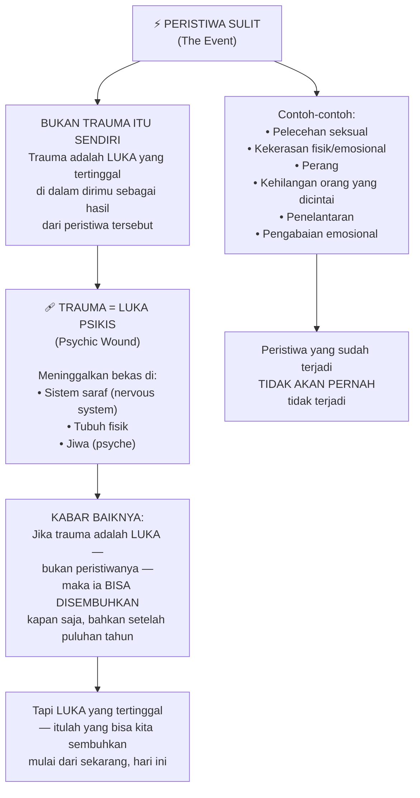
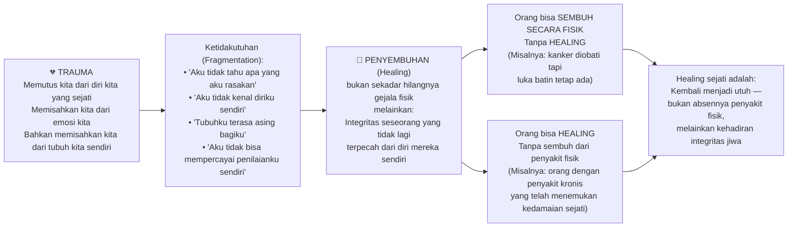
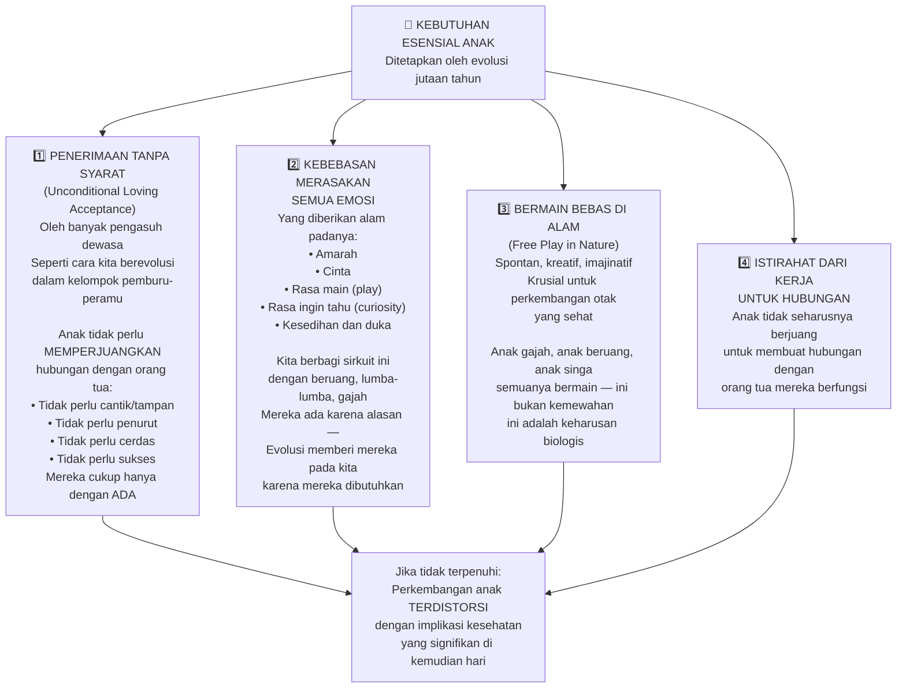
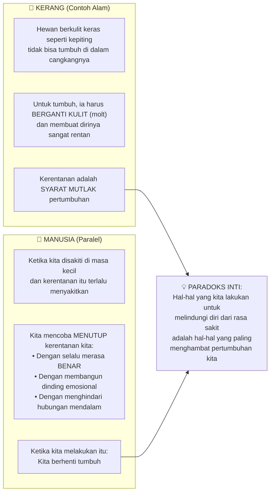
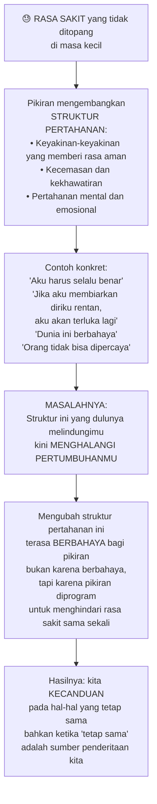
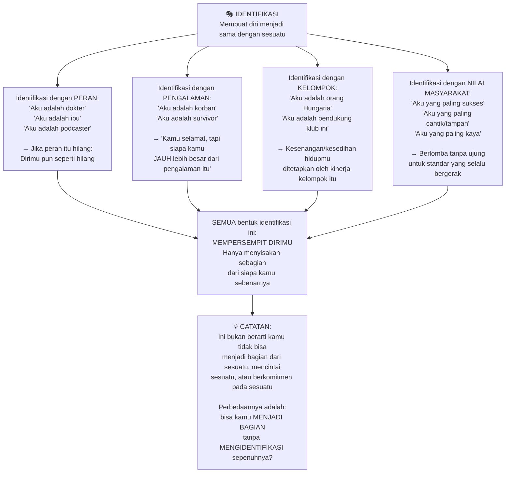
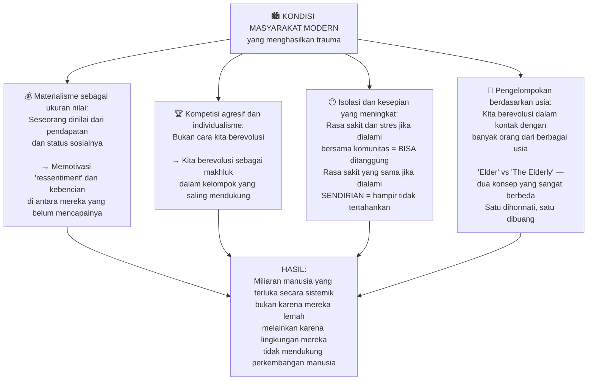
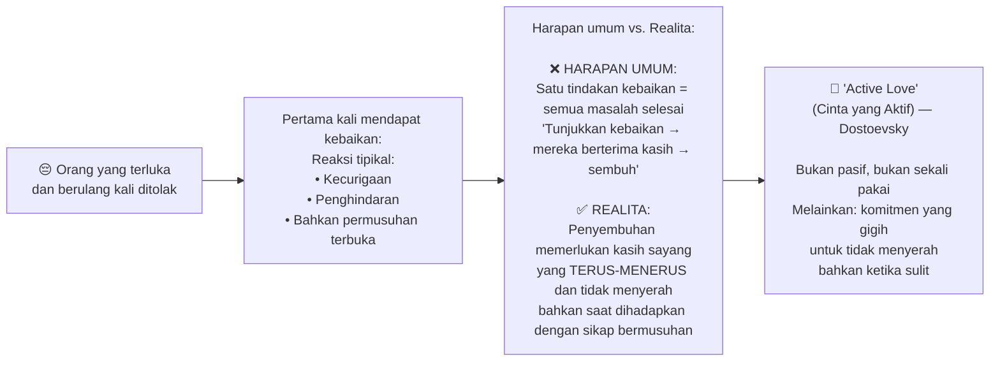
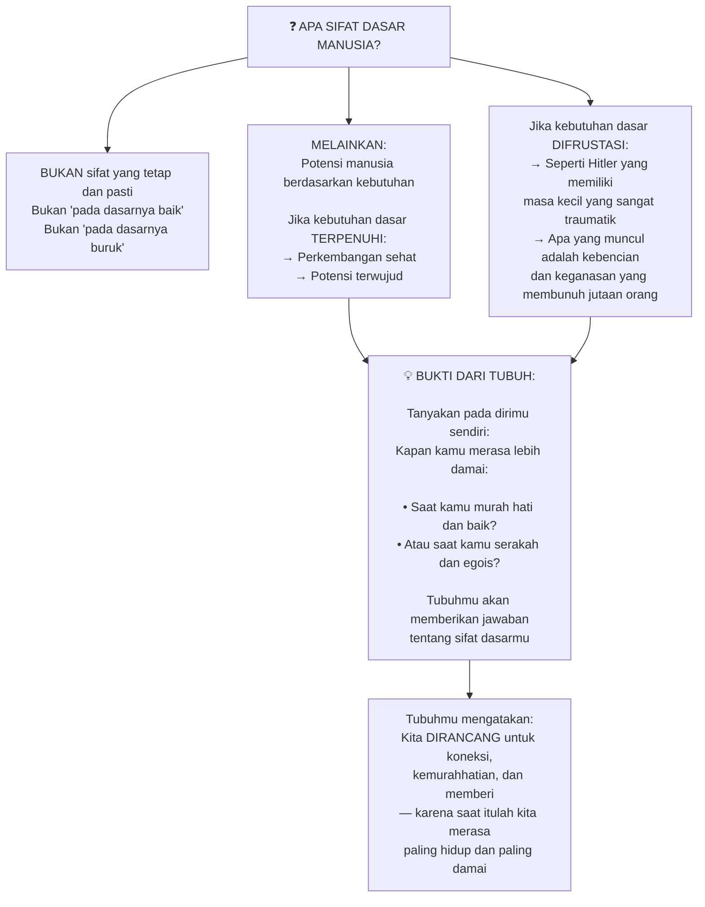
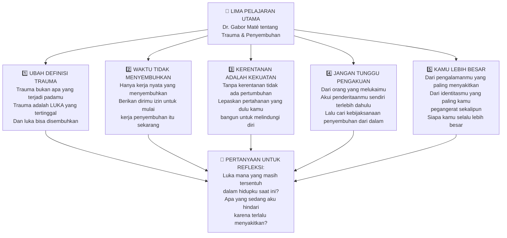

## 🌱 Pembuka: Kamu Tidak Hilang — Kamu Terluka

Ada saat-saat di mana kamu merasa tidak tahu siapa dirimu. Kamu bangun pagi, menatap langit-langit, dan bertanya-tanya: *"Apakah ini hidup yang aku inginkan? Kenapa aku selalu bereaksi berlebihan pada hal-hal kecil? Kenapa aku tidak bisa terhubung dengan orang lain secara tulus?"*

Mungkin ini bukan krisis identitas biasa. Mungkin ini adalah **jejak luka lama yang belum pernah sembuh**.

**Dr. Gabor Maté** — psikiater Kanada kelahiran Hongaria yang selamat dari Holocaust, penulis beberapa buku bestseller dunia, dan salah satu pemikir paling berpengaruh di bidang trauma, adiksi, dan perkembangan anak — memiliki jawaban yang mengejutkan sekaligus membebaskan.

Buku terbarunya, ***The Myth of Normal: Trauma, Illness, and Healing in a Toxic Culture*** (*Mitos tentang Normal: Trauma, Penyakit, dan Penyembuhan dalam Budaya yang Beracun*), adalah sebuah manifesto tentang bagaimana dunia modern kita secara sistematis **menciptakan kondisi yang menyebabkan trauma** — bukan hanya melalui peristiwa besar yang dramatis, tapi melalui cara kita membesarkan anak-anak, cara kita mendefinisikan kesuksesan, dan cara kita membentuk komunitas.

Percakapannya dengan **Jay Shetty** dalam podcast *On Purpose* adalah salah satu eksplorasi paling jujur dan mendalam yang pernah ada tentang topik ini. Mari kita bedah setiap pelajarannya. 🔍

---

## 🩹 Bagian Pertama: Apa Itu Trauma — dan Apa yang Bukan

### Kata yang Terlalu Banyak Digunakan, Terlalu Sedikit Dipahami

Kita hidup di era di mana kata **"trauma"** digunakan hampir di mana-mana. Seseorang bertengkar dengan teman lalu berkata, *"Aku di-trauma-tize."* Seseorang melewatkan promosi dan menyebutnya trauma. Di sisi lain, beberapa orang yang mengalami penyiksaan nyata justru tidak pernah mengakui bahwa apa yang mereka alami adalah traumatik.

Dr. Maté membuat pembedaan yang sangat penting:

> *"Semua trauma adalah stres, tapi tidak semua stres adalah traumatik."*

Banyak orang menggunakan kata trauma untuk merujuk pada **pengalaman sulit** — dan itu bukan hal yang sama dengan menjadi trauma.

### Trauma adalah Luka, Bukan Kejadian 🔑

Ini adalah salah satu wawasan paling revolusioner dari Dr. Maté — dan juga kabar baik yang paling besar:

**Trauma bukan apa yang terjadi padamu. Trauma adalah luka yang kamu alami sebagai hasilnya.**

*"Trauma bukan pelecehan seksual. Trauma adalah luka yang diderita seseorang sebagai akibat dari pelecehan tersebut."*

Ini berita baik karena: jika trauma adalah apa yang terjadi padamu 75 tahun lalu, maka tidak ada yang bisa kamu lakukan — karena itu sudah terjadi dan tidak akan pernah "tidak terjadi." Tapi jika trauma adalah **luka di dalam dirimu sebagai hasilnya**, maka luka itu bisa disembuhkan.

### Dua Wajah Luka: Mentah dan Membatu

Menggunakan analogi yang sangat tepat, Dr. Maté menggambarkan dua kondisi luka:

**Luka yang masih mentah (raw wound):**
Jika seseorang menyentuh bagian yang terluka itu — bahkan bertahun-tahun kemudian — kamu akan bereaksi seolah-olah kamu baru saja dilukai untuk pertama kalinya. Ini terjadi dalam hubungan sepanjang waktu: pasanganmu melakukan sesuatu yang sepele, dan tiba-tiba kamu merespons dengan kemarahan yang jauh tidak proporsional dengan situasinya. Itu bukan soal kejadian kecil itu — itu adalah **luka lama yang tersentuh kembali**.

**Luka yang membatu (scar tissue):**
- Jaringan parut (*scar tissue*) sangat keras dan kaku — tidak fleksibel
- Tidak tumbuh — trauma sering menghentikan pertumbuhan emosional
- Bahkan tidak memiliki sensasi — karena jaringan parut tidak memiliki ujung saraf

*"Waktu mungkin membuat luka itu kurang mudah diingat, tapi jika sesuatu terjadi yang membangkitkannya kembali, dampaknya akan muncul dalam intensitas penuh yang menyakitkan — sampai kamu melakukan kerja nyata untuk menyembuhkannya."*

**Waktu sendiri tidak menyembuhkan.** Waktu hanya mungkin membuat kerak lebih tebal. Tapi begitu kerak itu tersentuh lagi, rasa sakitnya akan sama seperti hari pertama.

---

## 🌿 Bagian Kedua: Apa Itu Penyembuhan Sejati?

### Healing Bukan Sekadar Sembuh dari Penyakit

Kata *healing* (*penyembuhan*) dan *health* (*kesehatan*) dalam bahasa Inggris berasal dari akar kata Anglo-Saxon yang sama: **wholeness** (*keutuhan*).

Dan dalam bahasa Hongaria — bahasa tanah kelahiran Dr. Maté — kata untuk "kesehatan" secara harfiah **dimulai dengan kata untuk keutuhan**.

Ini bukan kebetulan. Bahasa-bahasa di seluruh dunia secara intuitif menangkap esensi penyembuhan: **menjadi utuh kembali**.

Perbedaan antara **healed** (*sembuh secara holistik*) dan **cured** (*sembuh dari penyakit*) ini sangat penting:
- Seseorang bisa *cured* tanpa menjadi *healed* — kondisi fisik teratasi tapi luka batin tetap ada
- Seseorang bisa *healed* tanpa *cured* — masih menanggung kondisi fisik, tapi telah menemukan keutuhan dan kedamaian sejati

---

## 👶 Bagian Ketiga: Bagaimana Luka Terbentuk pada Anak

### Dua Jenis Kondisi yang Melukai Anak

Dr. Maté mengidentifikasi dua kondisi yang dapat melukai anak:

**1. Ketika anak dianiaya** — pelecehan fisik, seksual, emosional; kekerasan dalam keluarga; orang tua dengan adiksi; perceraian yang penuh konflik. Ini jelas dan tidak perlu banyak penjelasan.

**2. Ketika kebutuhan dasar tidak terpenuhi** — dan ini yang lebih tersembunyi, lebih meresap (*insidious*), dan lebih umum daripada yang kita bayangkan.

### Empat Kebutuhan Esensial Anak

Berbeda dari keyakinan lama tentang *tabula rasa* (*papan kosong*) — bahwa anak bisa "diprogram" sesuka hati — ilmu pengetahuan modern menunjukkan bahwa anak lahir **dengan ekspektasi yang sudah terpasang dalam organisme mereka**. Seperti paru-paru yang secara inheren mengharapkan oksigen karena berkembang dalam respons terhadap oksigen, anak-anak memiliki ekspektasi yang dibangun oleh evolusi selama ratusan ribu tahun.

Berikut adalah keempat kebutuhan esensial tersebut:

### Mengapa Kecemasan Anak Meningkat Drastis

Dr. Maté mengutip data yang mengejutkan: pada 2019, lebih dari 50 juta orang Amerika (lebih dari 20% orang dewasa AS) mengalami episode penyakit mental. Jutaan anak dan remaja di Amerika Utara sedang diobati dengan stimulan, antidepresan, bahkan obat antipsikotik — yang efek jangka panjangnya pada otak yang sedang berkembang belum diketahui.

*"Angka-angka ini tidak meningkat karena orang tua tidak mencintai anak-anak mereka. Mereka meningkat karena kondisi di mana pengasuhan berlangsung semakin tidak mendukung perkembangan manusia yang sehat."*

Anak-anak yang dicabut dari bermain bebas karena digantikan dengan gadget; anak-anak yang emosinya secara sistematis ditekan ("jangan menangis", "jangan marah"); anak-anak yang harus "menjadi sempurna" untuk mendapatkan penerimaan — semua ini adalah luka yang tidak terlihat tapi nyata.

---

## 🦀 Bagian Keempat: Kerentanan adalah Kunci Pertumbuhan

### Paradoks Pertumbuhan — Kamu Harus Merasa Tak Aman untuk Tumbuh

Dr. Maté mengungkap sesuatu yang berlawanan dengan intuisi:

*"Pohon tidak tumbuh di mana ia keras dan tebal. Ia tumbuh di mana ia lunak, hijau, dan rentan."*

Kata **"vulnerable"** (*rentan/rapuh*) berasal dari kata Latin *vulnerare* — **untuk dilukai**. Jadi kerentanan secara harfiah adalah **kapasitas kita untuk dilukai**.

Ini terdengar mengancam. Tapi dengarkan:

Pertahanan yang kita bangun sebagai anak-anak untuk melindungi diri dari rasa sakit — seperti selalu harus "benar", tidak pernah mengakui kelemahan, menghindari keintiman — adalah pertahanan yang sama yang terus kita bawa ke kehidupan dewasa dan yang terus **menghalangi kita untuk benar-benar hidup dan tumbuh**.

*"Kita berbicara tentang 'growing pains' (sakit yang menyertai pertumbuhan) karena kerentanan memang diperlukan untuk pertumbuhan. Tanpa kerentanan, tidak ada pertumbuhan."*

### Apa yang Sebenarnya Dimaksud dengan Mollycoddling (*Memanjakan Berlebihan*)

Jay Shetty mengangkat pertanyaan penting: jika penelantaran emosional itu berbahaya, apakah solusinya adalah melindungi anak dari semua rasa sakit?

Dr. Maté dengan tegas menjawab: **tidak — dan ada perbedaan krusial di sini**.

*Mollycoddling* (*memanjakan secara berlebihan*) **tidak ada hubungannya dengan kebutuhan anak**. Ini adalah tentang **kecemasan orang tua sendiri**. Anak yang "diselimuti dengan 24 bantal" bukan anak yang terlalu dicintai — ia adalah anak yang harus **menanggung kecemasan orang tuanya**.

> *"Anak itu akan mengunduh kecemasan orang tuanya. Anak yang dimanjakan berlebihan menjadi sangat cemas dan sangat takut dan sangat tidak kokoh dalam diri mereka sendiri."*

Sebuah studi yang dikutip Dr. Maté membuktikan ini secara empiris: dalam sekelompok besar ibu dan bayi mereka, setelah 30 tahun dipantau:
- Anak-anak yang paling sehat secara emosional di usia dewasa adalah mereka yang menerima **cinta yang paling berlimpah** dari ibunya di masa bayi
- Bukan dari ibu yang "biasa", tapi dari kelompok kecil yang dilihat sebagai **sangat penuh kasih sayang**

*"Kamu tidak bisa mencintai anak terlalu banyak. Yang kamu bisa lakukan adalah memproyeksikan kecemasanmu padanya — dan itu berbeda."*

---

## 🧠 Bagian Kelima: Pikiran Sebagai Struktur Pertahanan

### Mengapa Kita Takut Berubah

Dr. Maté menjelaskan salah satu paradoks paling aneh dalam psikologi manusia: **kita secara naluriah menghindari hal-hal yang paling membutuhkan pertumbuhan kita**.

Seorang terapis pernah mengatakan padanya:

> *"Jika orang tuamu tidak tahu cara menopangmu, kamu mengembangkan pikiran untuk menopang dirimu sendiri."*

Dengan kata lain, **pikiran egoik biasa manusia secara fundamental adalah struktur pertahanan**. Pikiran kita — dalam cara-cara yang signifikan — adalah respons terhadap rasa sakit. Ia dirancang untuk **menjagamu dari rasa sakit**.

Itulah mengapa ketika perubahan dan kerentanan datang, pikiran ingin bertahan melawannya.

*"Keith Richards [gitaris Rolling Stones yang terkenal dengan kecanduan heroinnya] berkata tentang penggunaan heroinnya: 'Usaha-usaha yang kamu lakukan hanya untuk tidak menjadi dirimu sendiri selama beberapa jam.' Mengapa seseorang tidak ingin menjadi dirinya sendiri? Karena pada suatu titik, menjadi dirimu sendiri sangat menyakitkan."*

Itulah mengapa adiksi — dalam berbagai bentuknya, bukan hanya narkoba, tapi juga kerja berlebihan, perfeksionisme, scroll media sosial tanpa henti — adalah cara pikiran **melarikan diri dari rasa sakit menjadi dirimu sendiri**.

### Tirani Masa Lalu

Seorang kolega Dr. Maté, **Peter Levine** (ahli trauma terkemuka), menyebut ini sebagai ***"tyranny of the past"*** (*tirani masa lalu*): di mana masa lalu mendominasi reaksi masa kinimu.

Bukan tentang pergi ke masa lalu dan merenungkan cerita masa kecilmu berkali-kali — itu tidak akan membantu. Yang penting adalah menangani **bagaimana masa lalu menampakkan dirinya di masa kini**.

> *"Bukan tentang masa lalu, tapi tentang masa kini. Apa yang tersedia bagimu sekarang — karena itu yang bisa mengubah segalanya."*

Kita tidak memiliki pilihan di masa lalu karena kita terlalu muda atau terlalu tidak berdaya untuk membuat pilihan. Tapi pilihan yang tersedia sekarang? Itu bisa mengubah segalanya.

---

## 🎭 Bagian Keenam: Identifikasi — Penjara yang Kita Buat Sendiri

### Masalah dengan "Menjadi" Sesuatu

Salah satu konsep paling menarik yang dibahas adalah tentang **identifikasi** (*identification*).

Kata *identification* berasal dari Latin:
- *idem* = **sama**
- *facere* = **membuat**

Jadi identifikasi secara harfiah berarti **"membuat diri menjadi sama dengan sesuatu"**. Dan begitu kamu membuat dirimu sama dengan sesuatu, kamu langsung **membatasi dirimu**.

Dr. Maté memberikan contoh yang sangat relevan dari kehidupannya sendiri: ketika ia meninggalkan praktik dokter keluarga untuk bekerja dengan populasi adiksi di Vancouver, **ada kehilangan identitas sementara yang menyakitkan**. Pasien-pasien yang telah mempercayainya, keluarga yang mengandalkannya — semua itu pergi begitu saja.

*"Jika aku bukan itu, lalu siapa aku? — Itulah yang terjadi ketika kita mengidentifikasi diri dengan peran."*

Jay Shetty berbagi pengalamannya sendiri: ketika melepas jubah biksu setelah bertahun-tahun — bukan hanya meninggalkan praktik spiritual, tapi benar-benar melepas identitas yang menempel pada jubah itu — sangat sulit. Ia harus belajar untuk **mengekstraksi keyakinan batinnya dan meninggalkan pembungkus luarnya**.

### Tidak Ada Identifikasi yang "Sehat"

Pernyataan yang mengejutkan dari Dr. Maté: tidak ada identifikasi yang benar-benar sehat.

Tapi ini tidak berarti kita tidak membutuhkan komunitas atau rasa memiliki. Kebutuhan untuk **belong** (*dimiliki/menjadi bagian*) adalah kebutuhan manusia yang nyata. Pertanyaannya adalah: **bisakah kita menjadi bagian tanpa kehilangan perspektif independen kita?**

*"Bisakah kita autentik — menjadi diri kita sendiri — dan tetap menjadi bagian? Idealnya, keduanya bisa dilakukan bersamaan."*

---

## 🌍 Bagian Ketujuh: Budaya yang Menciptakan Manusia yang Terluka

### Kapitalisme, Kompetisi, dan Isolasi

Dr. Maté tidak hanya berbicara tentang penyembuhan individu. Ia berbicara tentang sebuah **krisis sistemik**: budaya kita secara aktif menciptakan kondisi yang melahirkan trauma.

Bayangkan sebuah eksperimen pikiran: anak-anak dibesarkan dengan cara yang lebih alami — penerimaan tanpa syarat, kebebasan emosional, bermain bebas, koneksi komunitas multi-generasi. Bagaimana mereka akan berfungsi di dunia kapitalisme modern?

> *"Mereka tidak akan otomatis membeli nilai-nilai [kapitalis]. Mereka mungkin perlu mendapatkan pekerjaan, tapi mereka tidak akan mengidentifikasi diri dengan pekerjaan itu. Mereka tidak akan menghakimi diri mereka sendiri berdasarkan nilai-nilai sukses eksternal. Mereka akan masuk ke dunia dengan rasa tujuan."*

Ini bukan berarti mereka tidak akan berjuang — kehidupan tetap penuh tantangan. Tapi mereka tidak akan digerakkan oleh pertanyaan-pertanyaan: *"Apakah aku cukup cantik? Apakah aku sudah mengumpulkan cukup banyak barang untuk merasa baik tentang diriku sendiri?"*

### Elder vs. The Elderly — Kebijaksanaan yang Dibuang

Salah satu poin yang paling membekas: dalam masyarakat modern yang mendefinisikan nilai seseorang dari **produktivitas ekonominya**, orang-orang yang tidak lagi produktif secara ekonomi cenderung *discarded* (*dibuang*).

Kita berbicara tentang **"the elderly"** (*orang tua/jompo*) — kata yang mengandung nuansa beban. Bukan tentang **"Elders"** (*orang bijak*).

Seorang Elder memiliki sesuatu yang tidak ternilai:
- **Kebijaksanaan** dari pengalaman panjang
- **Perspektif** yang hanya bisa didapat melalui waktu
- **Kebebasan dari banyak kelekatan** yang tak terelakkan menguasai masa muda

*"Dalam budaya-budaya yang berfungsi dengan baik, Elders tidak hanya dihormati tapi juga memiliki tujuan — mereka memiliki peran yang bermakna dalam komunitas."*

---

## 🔄 Bagian Kedelapan: Proses Penyembuhan Sejati

### Langkah Pertama: Pengakuan

Apakah untuk individu, keluarga, atau bahkan bangsa — langkah pertama yang **mutlak diperlukan** dalam penyembuhan adalah **pengakuan** (*acknowledgment*): penderitaannya harus didengar dan diakui.

Dr. Maté berbicara tentang pengalamannya bekerja dengan kelompok-kelompok adat (*indigenous*) di Kanada yang menanggung warisan kolonialisasi yang brutal selama lebih dari seabad. Pesannya kepada mereka:

> *"Jangan tunggu pengakuan dari pemerintah atau masyarakat karena itu akan memakan waktu lama. Tapi kamu perlu mengakui penderitaanmu sendiri. Dan kemudian cari kebijaksanaan penyembuhan di dalam tradisimu sendiri — karena ia ada di sana."*

### Bahaya Identifikasi sebagai Korban

Ada perbedaan penting antara **mengakui bahwa sesuatu yang menyakitkan terjadi padamu** dan **mengidentifikasi dirimu sebagai korban**.

*"Mungkin ada orang yang mengidentifikasi diri dengan peran korban: 'Semua ini terjadi padaku dan karena itu aku tidak bisa melakukan ini dan itu, atau aku terluka dan tidak akan pernah pulih.' Itu identifikasi dengan penderitaan dan masa lalu sampai titik di mana mereka berhenti bergerak maju."*

Bahkan identifikasi dengan *"survivor"* (*penyintas*) bisa membatasi:

*"Kamu bertahan, tapi siapa kamu jauh lebih besar dari pengalaman itu. Siapa kamu **selalu** jauh lebih besar dari penderitaanmu."*

### Penyembuhan Melalui Kasih Sayang yang Gigih

Salah satu wawasan paling mendalam dari Dr. Maté adalah tentang **bagaimana cara kasih sayang bekerja dalam konteks penyembuhan**:

Orang-orang yang terluka dan ditolak berulang kali, ketika pertama kali ditunjukkan kebaikan, **sering bereaksi seperti Manusia Bawah Tanah Dostoevsky** — mereka curiga, menghindar, atau bahkan terang-terangan bermusuhan.

*"Orang-orang yang membutuhkan cinta tidak selalu bersyukur, dan bisa sangat sulit. Ini mengapa penyembuhan melalui cinta adalah tugas yang sangat berat dan menuntut."*

Dalam novel-novel Dostoevsky sendiri, tokoh-tokoh seperti **Raskolnikov** dan **Grushenka** — yang memandang diri mereka dengan penghinaan yang sama seperti Manusia Bawah Tanah — hanya melalui kebaikan yang **gigih dan tidak menyerah** dari Sonia dan Alyosha mulai perlahan menemukan kembali kemanusiaan mereka.

### Pemaafan untuk Diri Sendiri — Pelajaran dari Auschwitz

Dr. Maté menceritakan kisah yang mengagumkan tentang **Edith Eger** — psikoterapis yang masuk ke kamp konsentrasi Auschwitz bersama orang tuanya (yang tewas di sana) ketika ia masih muda.

Di usianya yang ke-90-an, Edith kembali ke Berghof — tempat tinggal Hitler di pegunungan Alpen — untuk **memaafkan Hitler**.

Bukan untuk mengatakan bahwa apa yang dilakukan Hitler adalah "oke". Tapi untuk **melepaskan dirinya dari kandang kebencian yang ia simpan di hatinya sendiri** — karena kebencian itu yang membatasi dirinya.

*"Pengampunan itu bukan 'tidak apa-apa yang kamu lakukan.' Pengampunan adalah 'aku tidak akan lagi menyimpan kebencian dan dendam ini di dalam diriku, karena itu yang membatasiku.'"*

Kerja yang sesungguhnya adalah **internal**. Kita tidak bisa menunggu dunia untuk memberikan pengampunan atau pengakuan yang kita butuhkan — meski itu indah ketika terjadi. Karena jika kita bergantung pada orang lain untuk penyembuhan kita, kita menyerahkan kekuasaan atas penyembuhan kita kepada orang-orang yang mungkin tidak pernah memberikannya.

---

## 💚 Bagian Kesembilan: Sifat Dasar Manusia — Bukan Sebuah Takdir yang Ditetapkan

### Buddha dan Hitler — Keduanya Manusia

Salah satu pertanyaan terbesar dalam filsafat: apakah manusia pada dasarnya baik atau buruk?

Dr. Maté memberikan jawaban yang elegan dan memuaskan:

*"Kita tidak bisa mendefinisikan 'sifat dasar manusia' secara tetap. Lihat saja: Buddha adalah manusia. Hitler adalah manusia. Satu penuh kasih sayang dan cinta; yang lain penuh ketamakan, agresi, dan kebencian. Keduanya manusia."*

Jawabannya: **bukan sifat yang tetap, melainkan potensi yang bisa terwujud atau terhalangi**.

Fakta yang menarik yang dikutip pendidik **Alfie Kohn**: ketika seseorang melakukan sesuatu yang egois atau serakah, kita mengatakan *"ah, itulah sifat dasar manusia."* Tapi kita **tidak pernah** mengatakan itu ketika seseorang bersikap baik atau murah hati.

Padahal semua orang yang jujur akan mengakui: saat mereka bersikap murah hati dan memberi dengan tulus — bukan karena rasa kewajiban, tapi karena dorongan dari dalam — **tubuh mereka merasa lebih tenang dan damai** daripada saat mereka serakah dan menggapai.

Itulah yang seharusnya memberi tahu kita tentang sifat dasar kita.

---

## 🌊 Bagian Kesepuluh: Spiritualitas dan Penyembuhan

### Spiritualitas Bukan Tentang Dogma

Dr. Maté mendefinisikan spiritualitas secara sederhana:

> *"Rasa terhubung dengan sesuatu yang lebih besar — sesuatu yang melampaui batas-batas sempit tubuh dan pikiran egoik."*

Ia berbagi pengalaman menghabiskan waktu dalam upacara dengan kelompok adat — dan yang paling mencolok adalah bukan sekadar "koneksi" dengan alam, tapi **Kesatuan** (*Unity*):

*"Mereka merasakan kehadiran di setiap helai rumput, setiap pohon, gunung yang mengawasi upacara kami, bison di padang. Ini bukan tentang kata 'koneksi' — kata itu bahkan terlalu lemah. Ini tentang kesatuan."*

Tradisi adat berbicara tentang **Roda Obat** (*Medicine Wheel*) dengan empat kuadran:
1. 🧠 Pikiran dan emosi
2. 💪 Tubuh fisik
3. 👥 Hubungan sosial
4. 🌟 Diri spiritual

*"Kita harus terpijak di keempat kuadran itu untuk menjadi benar-benar utuh."*

### Bahaya Spiritualitas yang Terkomersialisasi

Ada satu peringatan penting: bahkan tradisi-tradisi kuno yang berfokus pada penyembuhan batin kini sering **dieksternalisasi dan diinstitusionalisasi** — kehilangan kemurnian penyembuhan batin yang diperlukan. Mereka menjadi *commodified* (*dikomersialisasikan*).

Ini adalah sesuatu yang tidak bisa dihindari dalam masyarakat materialistik: segala sesuatu — bahkan spiritualitas — akhirnya menjadi produk untuk dijual.

---

## 💡 Penutup: Lima Pelajaran yang Perlu Dibawa Pulang

Setelah memeluk kompleksitas luar biasa dari percakapan Dr. Maté dan Jay Shetty, berikut adalah intisari yang bisa kamu mulai praktikkan hari ini:

Mungkin kamu tidak mendapatkan apologi yang kamu layak dapatkan. Mungkin orang-orang yang melukaimu tidak pernah mengakui apa yang mereka lakukan. Mungkin sistem yang melukai komunitasmu tidak pernah sungguh-sungguh berubah.

Tapi penyembuhan tidak harus menunggu semua itu.

Seperti yang dikatakan **Dr. Edith Eger** — perempuan yang selamat dari Auschwitz dan memilih untuk memaafkan Hitler demi kebebasannya sendiri — pekerjaan yang sesungguhnya **adalah internal**. Dan tidak ada seorangpun, tidak ada sistem manapun, tidak ada budaya manapun yang bisa mencegah kamu memulainya.

Kamu tidak hilang. Kamu terluka. Dan luka bisa disembuhkan. 🌱

---

## 📚 Glosarium Lengkap

| Istilah | Asal / Penjelasan |
|---|---|
| **Trauma** | Dari bahasa Yunani *trauma*: luka; dalam konteks psikologi: luka psikis yang meninggalkan bekas di sistem saraf, tubuh, dan jiwa |
| **Healing** (*Penyembuhan*) | Dari akar Anglo-Saxon: *wholeness* (keutuhan); bukan sekadar hilangnya penyakit fisik, melainkan kembali menjadi utuh |
| **Wholeness** (*Keutuhan*) | Kondisi di mana seseorang tidak lagi terbelah dari dirinya sendiri; inti dari penyembuhan sejati |
| **Cure** (*Sembuh dari penyakit*) | Hilangnya kondisi fisik/medis; berbeda dari *healing* yang lebih luas |
| **Scar Tissue** (*Jaringan Parut*) | Jaringan keras, kaku, tanpa ujung saraf yang terbentuk menutup luka; analogi untuk luka batin yang "membatu" |
| **Tabula Rasa** (*Papan Kosong*) | Teori lama bahwa anak lahir sebagai slate kosong yang bisa "diisi" sesuka hati; terbukti salah oleh ilmu pengetahuan modern |
| **Inherent Expectation** (*Ekspektasi Inheren*) | Ekspektasi yang sudah terpasang dalam organisme melalui evolusi; seperti paru-paru mengharapkan oksigen |
| **Unconditional Loving Acceptance** (*Penerimaan Cinta Tanpa Syarat*) | Kebutuhan dasar anak: diterima tanpa harus "menjadi" sesuatu terlebih dahulu |
| **Mollycoddling** (*Memanjakan Berlebihan*) | Bukan tentang terlalu banyak cinta, melainkan tentang memproyeksikan kecemasan orang tua kepada anak |
| **Vulnerability** (*Kerentanan*) | Dari Latin *vulnerare*: untuk dilukai; kapasitas kita untuk dilukai; syarat mutlak pertumbuhan |
| **Psychic Wound** (*Luka Psikis*) | Luka yang tertinggal di dalam jiwa, sistem saraf, dan tubuh sebagai hasil dari pengalaman sulit |
| **Rumination** (*Ruminasi*) | Memamah-biak ingatan atau kejadian yang menyakitkan secara berulang; mekanisme maladaptif |
| **Triggered** (*Terpicu*) | Ketika sesuatu di masa kini menyentuh luka lama yang belum sembuh, menyebabkan reaksi yang tidak proporsional |
| **Tyranny of the Past** (*Tirani Masa Lalu*) | Konsep Peter Levine: ketika masa lalu mendominasi reaksi masa kini |
| **Egoic Mind** (*Pikiran Egoik*) | Pikiran biasa manusia sehari-hari; Dr. Maté: dalam banyak hal ini adalah struktur pertahanan terhadap rasa sakit |
| **Identification** (*Identifikasi*) | Dari Latin *idem* (sama) + *facere* (membuat): membuat diri menjadi sama dengan sesuatu; dapat membatasi diri |
| **Ressentiment** (Prancis: *"kebencian tersimpan"*) | Iri yang dipelihara oleh yang tidak berdaya terhadap yang berdaya (konsep Nietzsche yang relevan dalam konteks ini) |
| **Ubuntu** | Filosofi Afrika: "Aku ada karena kamu ada" / "Kamu ada karena aku ada"; prinsip komunalitas dan saling mengakui |
| **Elder** vs. **The Elderly** | Perbedaan penting: Elder = orang bijak dengan tujuan dan kebijaksanaan; The Elderly = orang tua yang didefinisikan hanya oleh usia ekonomis mereka |
| **Medicine Wheel** (*Roda Obat*) | Tradisi adat Amerika: empat kuadran keutuhan manusia (pikiran/emosi, fisik, sosial, spiritual) |
| **Insidious** (*Meresap Diam-diam*) | Berkembang secara perlahan dan tidak terlihat tapi dengan efek yang berbahaya |
| **Ubiquitous** (*Meresap di Mana-mana*) | Hadir di mana-mana; dalam konteks ini: trauma tidak terlihat yang sangat umum tapi jarang dikenali |
| **Adiksi** (*Addiction*) | Dalam pandangan Dr. Maté: selalu merupakan upaya untuk melarikan diri dari rasa sakit; bukan kelemahan moral tapi respons terhadap penderitaan |
| **Sense of Purpose** (*Rasa Tujuan*) | Hanya bisa muncul dari diri sejati (*true self*); orang yang tidak terputus dari diri mereka akan masuk ke dunia dengan ini |
| **True Self** (*Diri Sejati*) | Diri yang tidak terputus oleh trauma; berbeda dari persona atau peran yang kita mainkan |
| **Active Love** (*Cinta Aktif*) | Konsep Dostoevsky: cinta yang gigih, menuntut, tidak menyerah meski dihadapkan dengan sikap bermusuhan |
| **Forgiveness** (*Pengampunan*) | Bukan "tidak apa-apa yang kamu lakukan"; melainkan melepaskan kebencian dari hatimu sendiri demi kebebasanmu sendiri |
| **Colonialism** (*Kolonialisme*) | Sistem penjajahan yang secara sistematis menghancurkan budaya, keluarga, dan kesehatan mental generasi demi generasi |
| **Sensitive** (*Sensitif*) | Dari Latin *sentire*: merasakan; semakin sensitif, semakin banyak merasakan; dalam lingkungan yang sehat ini menjadi kekuatan; dalam lingkungan yang menyakitkan ini berarti lebih banyak menderita |
| **Attachment** (*Kelekatan*) | Dalam konteks Buddhis: kelekatan pada identitas, objek, atau orang yang menjadi sumber penderitaan; berbeda dari cinta |
| **Acknowledgment** (*Pengakuan*) | Langkah pertama yang mutlak dalam penyembuhan; penderitaan harus didengar dan diakui sebelum penyembuhan bisa dimulai |

---

*Sumber video: [The ROOT CAUSE Of Trauma & Why You FEEL LOST In Life | Dr. Gabor Maté & Jay Shetty](https://www.youtube.com/watch?v=OTQJmkXC2EI)*

*Buku Dr. Gabor Maté: **The Myth of Normal: Trauma, Illness, and Healing in a Toxic Culture***
