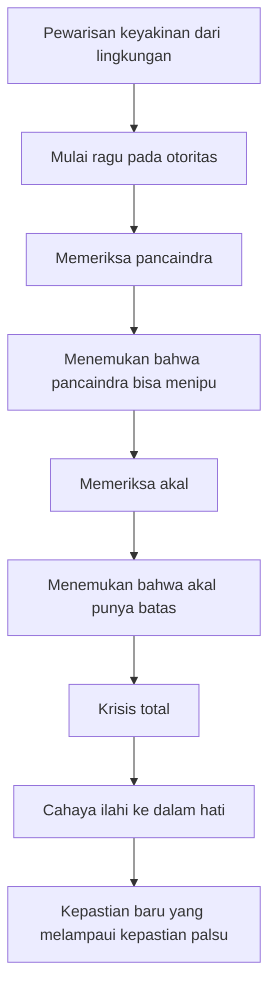
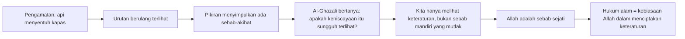
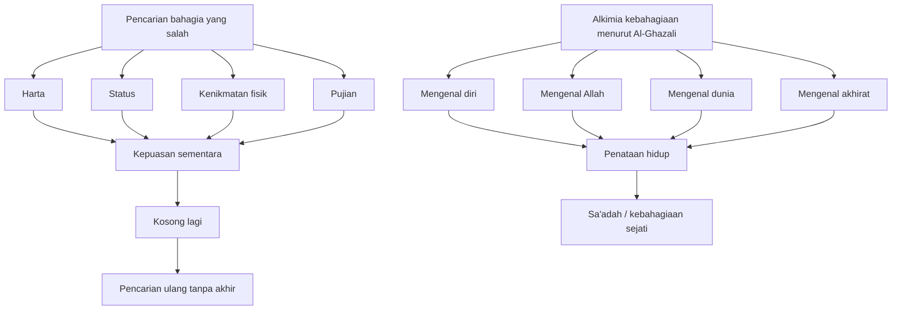
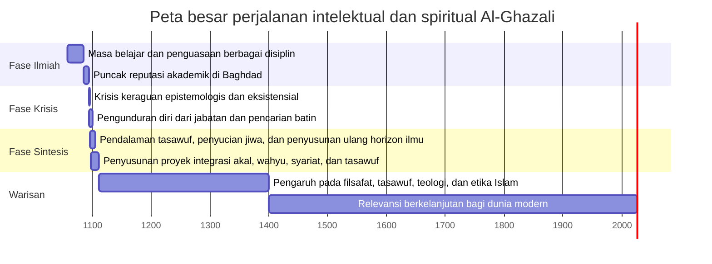

## 🌙 Pendahuluan: Mengapa Al-Ghazali Masih Terasa Sangat Hidup di Zaman Modern?

Ada tokoh-tokoh yang besar karena kecerdasannya. Ada tokoh-tokoh yang besar karena pengaruh sosialnya. Tetapi ada jenis tokoh yang lebih langka: orang yang besar karena ia **berani menaruh seluruh hidupnya di atas meja kebenaran**. Imam **Abu Hamid al-Ghazali** termasuk dalam golongan yang sangat langka itu. 🌙

Ia bukan hanya ulama. Ia bukan hanya ahli fikih. Ia bukan hanya teolog, filsuf, atau sufi. Ia adalah seorang pencari kebenaran yang menolak berhenti pada kemenangan intelektual semata. Pada titik tertentu, ia sudah mencapai apa yang secara duniawi bisa disebut puncak:

- reputasi ilmiah yang sangat tinggi,
- kursi akademik paling bergengsi,
- pengakuan luas,
- dan pengaruh luar biasa.

Tetapi justru di puncak itu, ia mengalami sesuatu yang bagi banyak orang akan terasa mengerikan: **runtuhnya kepastian**.

Al-Ghazali mulai mempertanyakan hal-hal paling dasar:
- apakah pengetahuan yang kita yakini sungguh benar?
- apakah akal cukup untuk mencapai kebenaran tertinggi?
- apakah otoritas yang diwarisi begitu saja dapat dipercaya?
- apakah ibadah hanya rutinitas lahiriah, atau sesungguhnya alat transformasi batin?
- dan yang paling penting: **apa sesungguhnya jalan menuju kebahagiaan sejati?**

Di sinilah Al-Ghazali menjadi sangat relevan bagi manusia modern. Karena kita juga hidup di zaman yang penuh:

- informasi berlimpah tapi makna tipis,
- kecerdasan tinggi tapi jiwa kering,
- kritik tajam tapi hati keruh,
- spiritualitas populer tapi sering dangkal,
- agama yang kadang tinggal formalitas,
- dan nalar yang kadang sombong pada batasnya sendiri. ⚖️

Banyak orang sekarang bisa mengalami sesuatu yang mirip, meski dengan bahasa yang berbeda:
- lelah oleh kebisingan,
- curiga pada klaim-klaim besar,
- ragu pada tradisi,
- kecewa pada institusi,
- dan bingung bagaimana menggabungkan **akal**, **iman**, **pengalaman batin**, dan **kehidupan sosial**.

Al-Ghazali masuk justru di titik retak ini. Ia bukan penulis yang memaksa kita memilih salah satu secara sempit:
- akal *atau* wahyu,
- syariat *atau* tasawuf,
- ibadah *atau* kehidupan dunia,
- filsafat *atau* agama.

Sebaliknya, ia menunjukkan bahwa masalahnya bukan pada adanya banyak jalan pengetahuan, tetapi pada **ketidakmampuan manusia menempatkan masing-masing jalan pada maqam-nya (kedudukannya) yang tepat**. 🚪

Kalau diringkas, tesis besar dari artikel ini adalah:

> **Al-Ghazali menunjukkan bahwa krisis keraguan tidak harus berakhir pada nihilisme (pandangan bahwa tidak ada makna atau nilai yang sungguh mengikat), tetapi bisa menjadi pintu menuju kepastian yang lebih dalam—kepastian yang tidak lahir dari arogansi intelektual, melainkan dari perpaduan akal yang jernih, wahyu yang membimbing, hati yang disucikan, dan hidup yang ditata untuk mendekat kepada Allah.**

Artikel ini akan membedah pemikiran Al-Ghazali secara panjang, detail, dan runtut. Kita akan membahas:

- krisis skeptisnya,
- empat jalan pencarian kebenaran yang ia uji,
- kritiknya terhadap para filsuf,
- teori kausalitasnya,
- konsep hati sebagai pusat pengetahuan,
- psikologi penyucian jiwa,
- makna kebahagiaan menurutnya,
- integrasi akal, wahyu, dan tasawuf,
- sampai relevansinya bagi manusia modern yang sibuk tetapi gelisah.

Kita juga perlu memberi satu catatan penting sejak awal: ketika membahas Al-Ghazali, kita harus berhati-hati agar tidak jatuh ke dua kesalahan sekaligus.

### Kesalahan pertama: menjadikannya simbol anti-akal
Ini keliru. Al-Ghazali sangat rasional, sangat logis, sangat teliti. Ia menguasai logika dan filsafat dengan serius.

### Kesalahan kedua: menjadikannya sekadar pemikir abstrak
Ini juga keliru. Al-Ghazali tidak berhenti di teori. Baginya, pengetahuan yang tidak mengubah jiwa adalah pengetahuan yang belum sampai ke inti. 📚❤️

Maka membaca Al-Ghazali secara utuh berarti menerima bahwa ia adalah:
- ulama syariat,
- arsitek spiritualitas,
- kritikus epistemologi *(teori pengetahuan)*,
- psikolog jiwa sebelum psikologi modern lahir,
- dan pembela ide bahwa manusia tidak cukup hanya menjadi cerdas—ia juga harus **bersih**, **jujur**, dan **ditata oleh tujuan yang benar**.

---

<Callout type="important" title="Tesis utama artikel ini">
Al-Ghazali mengajarkan bahwa kepastian sejati tidak dicapai dengan mematikan akal, tetapi dengan membawa akal sampai ke batasnya, lalu menyucikan hati agar mampu menerima cahaya kebenaran yang tidak bisa ditangkap oleh argumentasi semata.
</Callout>

---

## 🕌 1. Siapa Al-Ghazali? Bukan Sekadar Ulama Besar, tetapi Arsitek Ulang Hubungan Ilmu, Jiwa, dan Kebenaran

Nama lengkapnya adalah **Abu Hamid Muhammad ibn Muhammad al-Ghazali**. Ia lahir di **Tus**, wilayah Persia, dan dalam sejarah Islam dikenal dengan gelar **Hujjatul Islam**—*argumen Islam* atau *bukti Islam*. Gelar ini bukan gelar kecil. Ia menunjukkan bahwa pengaruh intelektual dan spiritual Al-Ghazali dipandang begitu besar sehingga ia dianggap sebagai pembela dan penjelas Islam dengan kekuatan argumentasi yang luar biasa. 🕌

Tetapi kalau kita berhenti pada gelar, kita belum menangkap keistimewaannya.

### Apa yang membuat Al-Ghazali begitu besar?
Bukan hanya karena ia menulis banyak kitab. Bukan hanya karena ia mahir dalam banyak disiplin. Yang membuatnya luar biasa adalah bahwa ia:

- menguasai fikih,
- memahami ilmu kalam *(teologi dialektis)*,
- menelaah filsafat secara serius,
- mendalami logika,
- masuk ke dunia batin tasawuf,
- lalu mencoba mensintesiskan semuanya dalam satu peta besar kehidupan manusia.

Ia adalah salah satu sedikit tokoh yang bukan hanya tahu perdebatan, tetapi **mengalami krisis eksistensial dari dalam perdebatan itu sendiri**.

Dalam sejarah pemikiran Islam, Al-Ghazali berada pada titik simpul. Sebelumnya, banyak bidang ilmu berkembang relatif terpisah:
- fikih punya bahasanya sendiri,
- ahli kalam punya metodenya sendiri,
- filsuf punya kosmos konseptualnya sendiri,
- sufi punya pengalaman dan laku batinnya sendiri.

Al-Ghazali masuk bukan dengan pendekatan “campur semua”, tetapi dengan pertanyaan yang jauh lebih serius:

> Mana yang benar? Mana yang terbatas? Mana yang perlu dikritik? Mana yang harus dipelihara? Dan bagaimana semuanya disusun ulang agar manusia tidak hanya tahu, tetapi juga selamat?

Itulah sebabnya ia tidak bisa dipahami sebagai tokoh satu warna. Ia bukan anti-filsafat secara sederhana. Ia juga bukan pemuja rasio. Ia bukan anti-dunia. Ia juga bukan sekadar mistikus yang mengabaikan syariat.

Ia justru menjadi besar karena ia berani berkata:
- akal itu penting, tapi tidak mutlak,
- wahyu itu membimbing, tapi harus dihidupkan dalam jiwa,
- ibadah itu wajib, tapi harus dipahami hikmah batinnya,
- tasawuf itu tinggi, tapi harus tetap tertambat pada syariat yang sahih.

---

## 🧩 2. Krisis Besar Al-Ghazali: Ketika Seorang Profesor Paling Bergengsi Tiba-Tiba Tidak Lagi Bisa Mengajar

Salah satu bagian paling dramatis dari kisah Al-Ghazali adalah krisis batin dan intelektualnya. Ini bukan detail kecil. Justru di sinilah seluruh proyek intelektualnya menemukan pusat gravitasinya. 🧩

Bayangkan situasinya:
- ia masih relatif muda,
- sudah memegang posisi sangat prestisius,
- muridnya banyak,
- reputasinya tinggi,
- secara lahiriah semuanya tampak berhasil.

Tetapi di dalam, ada badai.

### Krisisnya bukan krisis remeh
Al-Ghazali tidak sedang sekadar bingung memilih spesialisasi keilmuan. Ia mulai mempertanyakan fondasi pengetahuan itu sendiri:

- bagaimana kita tahu sesuatu itu benar?
- apakah kita hanya mewarisi keyakinan dari guru dan masyarakat?
- apakah pancaindra bisa diandalkan?
- apakah akal sungguh cukup?
- apakah ada tingkat pengetahuan yang lebih tinggi daripada argumentasi biasa?

Ini membuat krisisnya bersifat **epistemologis** *(menyangkut dasar pengetahuan)* sekaligus **eksistensial** *(menyangkut hidup itu sendiri)*.

### Dampak fisik dan psikisnya nyata
Menurut riwayatnya sendiri dalam *Al-Munqidz min al-Dhalal* (*Penyelamat dari Kesesatan* / *Deliverance from Error*), krisis itu sedemikian dalam sampai memengaruhi tubuhnya:
- ia sulit berbicara,
- sulit mengajar,
- kehilangan kemampuan untuk menjalankan peran intelektual seperti sebelumnya.

Ini penting. Karena menunjukkan bahwa bagi Al-Ghazali, pertanyaan tentang kebenaran bukan permainan diskusi. Ia bukan skeptis demi terlihat canggih. Ia sungguh merasakan bahwa kalau fondasi pengetahuan runtuh, maka hidup juga ikut goyah.

Dan inilah salah satu alasan kenapa Al-Ghazali terasa sangat modern. Banyak orang hari ini mengalami hal serupa dalam bentuk yang berbeda:
- overthinking tanpa arah,
- kejenuhan spiritual,
- kelelahan dari terlalu banyak teori,
- atau kehilangan rasa yakin dalam hidup yang terus penuh kebisingan.

Al-Ghazali memberi kita satu pelajaran penting: **keraguan tidak selalu tanda keburukan; kadang ia adalah operasi besar untuk membongkar kepastian palsu.**

---

## 🔍 3. Arsitektur Keraguan: Mengapa Al-Ghazali Meragukan Pancaindra dan Akal, tetapi Tidak Berhenti Menjadi Nihilis

Keraguan Al-Ghazali sangat sistematis. Ia bukan orang yang berkata, “Saya ragu, jadi semuanya sama saja.” Tidak. Ia memeriksa sumber-sumber pengetahuan satu per satu. 🔍

### Pertama: pancaindra
Kita biasanya percaya pada penglihatan, pendengaran, sentuhan, dan seterusnya. Tetapi Al-Ghazali tahu bahwa pancaindra bisa menipu:
- tongkat lurus tampak bengkok di air,
- benda jauh tampak kecil,
- mimpi terasa nyata saat kita mengalaminya.

Kalau pancaindra bisa salah pada hal-hal sederhana, bagaimana dengan hal-hal yang lebih besar?

### Kedua: akal
Banyak orang mungkin berhenti setelah meragukan pancaindra lalu memindahkan seluruh kepercayaan pada akal. Tetapi Al-Ghazali melangkah lebih jauh: ia juga menyoal akal.

Bukan karena akal tidak berguna, tetapi karena akal sendiri bekerja dengan prinsip-prinsip yang tidak sepenuhnya bisa ia buktikan dari dirinya sendiri. Akal menggunakan hukum-hukum logika, struktur inferensi *(penarikan kesimpulan)*, dan asumsi keteraturan. Tetapi dari mana semua ini memperoleh legitimasi terakhir?

### Titik pentingnya
Al-Ghazali tidak sedang menghancurkan akal. Ia sedang menunjukkan bahwa:

> **akal punya batas, dan kesalahan terbesar manusia intelektual adalah ketika ia mengira batasnya sendiri sebagai keseluruhan realitas.**

### Lalu apakah ia jatuh ke nihilisme?
Tidak.

Inilah pembeda besar Al-Ghazali dari skeptisisme modern tertentu. Baginya, keraguan adalah:
- terapi bagi kesombongan pengetahuan,
- alat penyaring kepastian palsu,
- jalan menuju pondasi yang lebih kokoh.

Ia sampai pada keyakinan bahwa ada bentuk pengetahuan yang lebih mendasar daripada sekadar konstruksi argumentatif biasa: sebuah **nur** *(cahaya)* yang Allah lemparkan ke dalam hati. Ini bukan anti-akal. Ini adalah pengakuan bahwa akal bekerja di dalam horizon yang pada akhirnya ditopang oleh anugerah dan keterbukaan batin. ✨

---

---

## 🛤️ 4. Empat Jalan yang Diuji Al-Ghazali: Ahli Kalam, Filsuf, Bathiniyyah, dan Sufi

Setelah melewati krisis, Al-Ghazali tidak langsung mengklaim sudah menemukan jawaban. Ia justru menguji empat jalan utama pencarian kebenaran pada zamannya. Ini sangat penting, karena menunjukkan integritas ilmiahnya. Ia tidak menolak sesuatu sebelum memahaminya dari dalam. 🛤️

### 1. Jalan ahli kalam *(teologi dialektis)*
Ahli kalam menggunakan argumentasi rasional untuk membela akidah. Al-Ghazali mengakui manfaat mereka. Mereka bisa melawan penyimpangan, membela iman dari serangan intelektual, dan menjaga batas-batas keyakinan.

Tetapi menurut Al-Ghazali, ilmu kalam punya keterbatasan:
- sering bersifat defensif,
- bekerja dari asumsi yang sudah diambil sebelumnya,
- dan tidak selalu membawa seseorang ke pengalaman batin tentang kebenaran.

Ilmu kalam bisa menjaga benteng. Tapi belum tentu menghidupkan hati.

### 2. Jalan filsuf
Al-Ghazali mempelajari filsafat dengan sangat serius, terutama tradisi Peripatetik *(tradisi Aristotelian / Aristoteles)* seperti al-Farabi dan Ibn Sina. Ia mengagumi ketelitian mereka dalam logika, matematika, dan beberapa bidang natural philosophy *(filsafat alam)*.

Tetapi ia melihat masalah ketika para filsuf melangkah terlalu jauh ke wilayah metafisika *(pembahasan tentang realitas paling dasar)* lalu mengklaim kepastian yang menurutnya tidak betul-betul demonstratif.

### 3. Jalan Bathiniyyah / Ismailiyyah esoterik
Kelompok ini menekankan adanya pengetahuan rahasia yang hanya dimiliki otoritas tertentu. Al-Ghazali menyelidikinya dan menilai bahwa mereka jatuh pada lingkaran otoritas:
- mereka benar karena punya otoritas,
- otoritas mereka benar karena mereka mengklaim punya pengetahuan rahasia.

Bagi Al-Ghazali, ini problematis secara intelektual dan berbahaya secara spiritual.

### 4. Jalan sufi
Di sinilah Al-Ghazali menemukan sesuatu yang paling dalam. Tetapi menariknya, ia tidak menerima tasawuf secara sentimental. Ia menyadari bahwa tasawuf tidak bisa diukur hanya dari buku atau teori. Tasawuf harus **dijalani**.

Dan di sinilah keberanian Al-Ghazali tampak: ia meninggalkan posisi, reputasi, dan kenyamanan untuk menempuh jalan penyucian diri.

> Ini sangat penting: Al-Ghazali tidak berhenti pada “mengetahui tentang jalan.” Ia memilih “berjalan di jalan.” 🚶‍♂️

---

## 🧠 5. Kritik Al-Ghazali terhadap Para Filsuf: Bukan Menolak Akal, tetapi Menolak Klaim Akal yang Melampaui Buktinya

Kitab *Tahafut al-Falasifah* (*Kerancuan Para Filsuf* / *The Incoherence of the Philosophers*) adalah salah satu karya paling terkenal Al-Ghazali. Tetapi karya ini sering disalahpahami. Banyak orang menyederhanakan seolah Al-Ghazali adalah musuh akal dan penyebab kemunduran intelektual. Pembacaan seperti itu terlalu kasar dan sering tidak adil. 🧠

### Apa yang sebenarnya ia lakukan?
Al-Ghazali tidak menyerang matematika, logika, atau metode rasional itu sendiri. Ia justru menguasai logika. Yang ia kritik adalah **klaim metafisis tertentu** dari para filsuf yang menurutnya:
- tidak betul-betul terbukti,
- bertentangan dengan wahyu yang qath'i *(pasti / tegas)*,
- dan dibungkus seolah-olah setara dengan kepastian matematis.

### Tiga posisi yang ia anggap paling berbahaya
Secara klasik, tiga posisi ini sangat dikenal:

1. **Qidam al-'alam** — dunia dianggap azali / tanpa awal waktu.
2. **Allah hanya mengetahui universal, bukan partikular** — seolah Allah tidak mengetahui detail kejadian individual.
3. **Penolakan kebangkitan jasmani** — kebangkitan dianggap hanya spiritual atau alegoris semata.

Bagi Al-Ghazali, tiga posisi ini bukan sekadar beda pendapat teknis. Ini menyentuh jantung cara memahami:
- penciptaan,
- sifat ilmu Allah,
- dan akhirat.

### Inti kritik metodologisnya
Yang sangat penting dari Al-Ghazali adalah ia menunjukkan bahwa para filsuf sering menggunakan standar demonstrasi yang tinggi di logika dan matematika, tetapi ketika masuk ke metafisika mereka diam-diam memakai asumsi yang belum terbukti.

Dengan kata lain:

> **masalahnya bukan bahwa mereka berpikir terlalu rasional, tetapi bahwa mereka mengira spekulasi metafisik mereka setegas bukti matematis.**

Ini pelajaran besar bahkan untuk zaman sekarang. Banyak orang modern juga melakukan hal yang sama:
- mereka punya sedikit data,
- lalu membuat klaim besar tentang realitas, agama, kesadaran, atau moralitas,
- kemudian berbicara seolah semuanya sudah pasti.

Al-Ghazali mengingatkan: **jangan menyebut sesuatu demonstratif kalau sebenarnya ia hanya preferensi metafisik yang dibungkus bahasa tegas.**

---

## 🔥 6. Teori Kausalitas Al-Ghazali: Api Membakar Kapas, tetapi Apakah Api “Penyebab Sejati”?

Salah satu kontribusi paling penting dan paling sering dibahas dari Al-Ghazali adalah pandangannya tentang **kausalitas** *(hubungan sebab-akibat)*. Ini luar biasa menarik karena membuktikan bahwa Al-Ghazali bukan hanya tokoh spiritual, tetapi juga pemikir epistemologi dan metafisika yang tajam. 🔥

### Contoh klasik
Kita melihat api menyentuh kapas lalu kapas terbakar. Kita cenderung berkata:
- api adalah sebab,
- terbakar adalah akibat.

Tetapi Al-Ghazali bertanya: apakah yang kita lihat sungguh “keniscayaan” hubungan itu? Atau kita hanya melihat **urutan yang berulang**?

Yang kita amati sebenarnya adalah:
- api hadir,
- lalu kapas terbakar.

Tetapi “keharusan” bahwa api pasti membakar kapas, menurut Al-Ghazali, tidak terlihat secara langsung. Itu adalah kesimpulan yang ditarik pikiran dari kebiasaan pengamatan.

### Dari sini lahir gagasan yang kemudian dikenal sebagai occasionalism *(okasionalisme)*
Secara sederhana, ini berarti bahwa Allah adalah sebab sejati dari setiap peristiwa. Apa yang kita sebut hukum alam adalah **kebiasaan Allah dalam menciptakan keteraturan**, bukan kekuatan mandiri yang berdiri sendiri terpisah dari-Nya.

### Kenapa ini penting?
Karena Al-Ghazali ingin menjaga dua hal sekaligus:

1. **keteraturan alam** — agar ilmu dan pengamatan tetap mungkin,
2. **kebebasan dan kekuasaan Allah** — agar mukjizat tetap mungkin dan alam tidak berubah menjadi mesin tertutup yang mandiri dari Tuhan.

### Apakah ini anti-sains?
Tidak perlu dibaca begitu dangkal.

Al-Ghazali tidak mengatakan bahwa pengamatan alam sia-sia. Ia hanya menolak mengubah keteraturan empiris menjadi “keniscayaan ontologis” *(keharusan mutlak pada tingkat hakikat keberadaan)*.

Bahasa sederhananya:
- kita boleh meneliti pola,
- kita boleh mengetahui kebiasaan yang Allah tetapkan di alam,
- tetapi kita jangan sombong seolah-olah alam punya otonomi penuh terlepas dari kehendak-Nya.

Ini debat yang sangat besar dan panjang dalam sejarah filsafat. Dan menariknya, beberapa pembaca modern melihat ada kemiripan tertentu antara kritik Al-Ghazali terhadap keniscayaan sebab-akibat dengan kritik David Hume berabad-abad kemudian—meski tentu konteks, horizon, dan kesimpulannya berbeda. 🧪

---

---

## 💡 7. Cahaya, Hati, dan Pengetahuan: Mengapa Bagi Al-Ghazali Kebenaran Tertinggi Tidak Hanya Dipikirkan, tetapi Disinari

Salah satu gagasan paling indah dalam Al-Ghazali adalah metafora **cahaya** (*nur*). Dalam karya seperti *Misykat al-Anwar* (*The Niche of Lights* / *Relung Cahaya*), cahaya menjadi simbol pengetahuan, kesadaran, dan kehadiran ilahi. 💡

### Apa maksudnya?
Sebagaimana mata tidak bisa melihat tanpa cahaya fisik, hati dan akal juga tidak bisa melihat kebenaran tanpa cahaya spiritual.

Tetapi Al-Ghazali tidak berhenti pada simbol puitik. Ia membangun struktur yang serius:

- ada tingkat pengetahuan inderawi,
- ada tingkat pengetahuan rasional,
- ada tingkat pengetahuan spiritual yang lebih tinggi.

### Tiga lapis besar pembacaan
1. **Dunia fisik** — diketahui lewat indera dan akal.
2. **Dunia konsep dan makna** — diketahui lewat nalar, abstraksi, dan refleksi.
3. **Dunia spiritual / hakikat terdalam** — diketahui lewat hati yang disucikan dan diberi cahaya.

### Di sini “hati” bukan sekadar emosi
Ini penting sekali. Dalam Al-Ghazali, *qalb* *(hati)* bukan sekadar organ perasaan romantik. Hati adalah pusat kesadaran spiritual, tempat:
- niat dibentuk,
- kebenaran diterima,
- penyakit batin bersemayam,
- dan cahaya ilahi dipantulkan.

Maka bagi Al-Ghazali, masalah manusia bukan hanya salah logika. Sering kali masalahnya adalah:
- hati berkarat,
- ego menebal,
- niat rusak,
- cinta salah arah,
- dan keinginan duniawi menutupi kejernihan persepsi.

### Ini sangat modern dalam makna tertentu
Kita hidup di era yang sangat menghargai informasi. Tapi Al-Ghazali mengingatkan bahwa informasi bukan identik dengan iluminasi *(pencerahan batin)*. Orang bisa banyak tahu tapi tetap buta secara ruhani.

> **Bukan semua kebutaan itu intelektual; banyak kebutaan justru moral dan spiritual.**

---

## ❤️ 8. Ilmu Hati: Mengapa Al-Ghazali Bisa Disebut Psikolog Jiwa Sebelum Psikologi Modern

Salah satu kekuatan terbesar Al-Ghazali adalah analisisnya tentang jiwa manusia. Ia membahas bukan hanya dosa dan pahala dalam makna normatif, tetapi juga **mekanisme batin** yang membuat manusia:
- sombong,
- iri,
- marah,
- tamak,
- cinta dunia secara berlebihan,
- atau terjebak dalam tipuan ego. ❤️

### Hati seperti cermin
Al-Ghazali menggambarkan hati seperti cermin yang pada asalnya mampu memantulkan cahaya kebenaran. Tetapi cermin ini bisa tertutup oleh:
- *rust* *(karat)*,
- *tarnish* *(noda / kusam)*,
- yakni dosa, kebiasaan buruk, hasad, riya', ujub, cinta dunia, dan kelalaian.

### Maka penyucian bukan kosmetik, melainkan restorasi
Dalam bahasa modern, kita bisa bilang bahwa Al-Ghazali melihat manusia sebagai makhluk yang mengalami distorsi batin. Ia bukan sekadar “kurang tahu”, melainkan juga “salah terarah”.

Ia membedah banyak penyakit hati secara sangat tajam. Misalnya:

#### 1. **Kibr** *(kesombongan / pride)*
Bagi Al-Ghazali, kesombongan berbahaya karena membuat orang tidak lagi mampu menerima kebenaran. Ia bukan hanya dosa moral, tetapi gangguan epistemik *(gangguan terhadap cara mengetahui kebenaran)*.

#### 2. **Hasad** *(dengki / envy)*
Hasad bukan cuma tidak suka melihat orang lain bahagia. Ia adalah kerusakan cara memandang nikmat Allah, seolah kebaikan orang lain mengurangi porsi kita.

#### 3. **Ghadab** *(amarah / anger)*
Marah tidak seluruhnya salah. Ada marah yang benar jika dipakai untuk menegakkan keadilan. Tetapi amarah egoistik merusak kejernihan penilaian.

#### 4. **Hubb al-dunya** *(cinta dunia berlebihan)*
Bukan berarti dunia itu jahat. Masalahnya adalah ketika dunia dijadikan tujuan akhir, bukan alat untuk taat dan berbuat baik.

### Luar biasanya Al-Ghazali
Ia tidak hanya menyebut penyakit, tetapi juga memberi:
- diagnosis,
- gejala,
- mekanisme kemunculan,
- dan obat-obat rohaninya.

Itulah sebabnya banyak pembaca merasa Al-Ghazali seperti dokter jiwa. Ia tahu bahwa masalah manusia sering tidak selesai hanya dengan diberi “nasihat benar”, karena yang perlu diobati adalah **struktur batinnya**.

---

## 🧼 9. Tazkiyatun Nafs: Penyucian Jiwa sebagai Jalan Pengetahuan, Bukan Sekadar Jalan Moralitas

Dalam banyak pembacaan dangkal, penyucian jiwa dianggap semata proyek moral: supaya jadi orang baik. Itu tentu benar, tetapi bagi Al-Ghazali maknanya lebih dalam. **Tazkiyatun nafs** *(penyucian jiwa / purification of the soul)* juga merupakan syarat pengetahuan. 🧼

### Kenapa?
Karena jiwa yang kotor tidak hanya cenderung berbuat buruk; ia juga cenderung **salah melihat**.

Contohnya:
- orang sombong sulit menerima nasihat,
- orang hasad sulit mengakui kelebihan orang lain,
- orang rakus sulit bersikap adil,
- orang yang cinta pujian sulit jujur pada niatnya sendiri.

Maka penyucian jiwa bukan tambahan mewah bagi orang saleh. Ia adalah syarat agar manusia menjadi **lebih benar dalam menilai realitas**.

### Praktik-praktik yang penting menurut Al-Ghazali
- muhasabah *(introspeksi / self-examination)*,
- muraqabah *(kesadaran diawasi Allah / spiritual vigilance)*,
- dzikir *(remembrance / mengingat Allah)*,
- taubat *(repentance / kembali kepada Allah)*,
- menahan syahwat yang berlebihan,
- disiplin ibadah,
- pelayanan kepada orang lain,
- dan mengingat mati.

### Mengingat mati, kenapa penting?
Karena kematian mematahkan ilusi ego. Ia menaruh seluruh ambisi duniawi dalam perspektif. Bagi Al-Ghazali, orang yang sering mengingat mati lebih sulit mabuk oleh status dan tepuk tangan dunia. ⚰️

Ini bukan ajakan menjadi muram. Justru ini cara membebaskan manusia dari kesia-siaan.

---

## 📿 10. Syariat dan Tasawuf: Proyek Besar Al-Ghazali adalah Menyatukan Lahir dan Batin

Salah satu pencapaian terbesar Al-Ghazali adalah menyatukan **syariat** dan **tasawuf**. Sebelum itu, sering ada jarak yang terasa tegang:
- sebagian orang sangat formal pada hukum lahiriah tetapi kering batin,
- sebagian lain sangat berbicara soal batin tetapi longgar pada disiplin syariat.

Al-Ghazali menolak dua ekstrem ini. 📿

### Baginya, syariat tanpa batin menjadi mekanik
Orang bisa shalat, puasa, zakat, tetapi:
- hatinya lalai,
- niatnya rusak,
- ibadahnya tidak mengubah karakter.

### Tetapi tasawuf tanpa syariat juga menyesatkan
Pengalaman batin, ilham *(inspiration / ilham spiritual)*, atau rasa kedekatan tidak boleh dipakai untuk melanggar batas-batas syariat.

### Maka integrasi yang ia bangun adalah:
- syariat memberi bentuk dan batas,
- tasawuf memberi ruh dan rasa,
- akal memberi klarifikasi,
- hati memberi penerimaan yang hidup.

Ini amat penting. Dalam banyak masalah agama modern, kita masih melihat krisis yang sama:
- ada orang sangat legalistik tetapi keras dan kering,
- ada orang sangat “spiritual” tetapi cair tanpa disiplin,
- ada yang rasional tetapi sinis,
- ada yang religius tetapi anti-akal.

Al-Ghazali seakan berkata: **semua elemen ini harus ditata, bukan dipertentangkan secara bodoh.**

---

## 📖 11. Ihya' Ulum al-Din: Bukan Sekadar Kitab Nasihat, tetapi Manual Besar Transformasi Manusia

Karya monumentalnya, **Ihya' Ulum al-Din** (*Menghidupkan Kembali Ilmu-ilmu Agama* / *The Revival of the Religious Sciences*), adalah salah satu kitab paling berpengaruh dalam peradaban Islam. Tetapi untuk memahami kebesarannya, kita tidak cukup menyebutnya “kitab akhlak”. 📖

Ihya' adalah proyek besar untuk menghidupkan kembali agama pada level terdalam. Ia menunjukkan bahwa agama bukan sekadar:
- hafalan hukum,
- pembelaan doktrin,
- atau simbol identitas.

Agama adalah jalan penyusunan ulang manusia secara total.

### Empat bagian besar Ihya'
Secara terkenal, Ihya' dibangun dalam empat rubu' *(bagian besar / quarters)*:

1. **Ibadah**
2. **Adat / kebiasaan hidup sosial**
3. **Muhlikat** *(hal-hal yang membinasakan / destructive traits)*
4. **Munjiyat** *(hal-hal yang menyelamatkan / salvific virtues)*

### Kenapa struktur ini jenius?
Karena Al-Ghazali paham bahwa hidup manusia tidak cukup dibahas dari satu pintu.

- Ada hubungan dengan Allah melalui ibadah.
- Ada kehidupan sehari-hari: makan, menikah, mencari nafkah, bertetangga.
- Ada penyakit batin yang merusak.
- Ada kualitas jiwa yang harus dibangun.

Dengan kata lain, Al-Ghazali tidak memisahkan agama dari hidup. Seluruh hidup menjadi medan tarbiyah *(pendidikan / pembinaan)* jiwa.

### Contoh penting
Ia bisa membahas shalat bukan hanya sebagai kewajiban fiqhiyah *(legal formal)*, tetapi sebagai latihan:
- kerendahan hati,
- hadirnya hati,
- ritme ingatan kepada Allah,
- dan pembentukan kesadaran sepanjang hari.

Ia bisa membahas sedekah bukan hanya soal jumlah, tetapi sebagai terapi terhadap penyakit tamak dan ilusi keamanan palsu pada harta.

Ini sangat besar. Karena berarti Al-Ghazali tidak memandang ibadah sebagai daftar kewajiban yang terpisah-pisah, melainkan **arsitektur pembentukan manusia**.

---

## 🧭 12. Alkimia Kebahagiaan: Apa Itu Bahagia Menurut Al-Ghazali?

Salah satu karya yang sangat terkenal adalah *Kimiya-yi Sa'adat* (*Alchemy of Happiness* / *Alkimia Kebahagiaan*). Judul ini sendiri sangat indah. Mengapa “alkimia”? Karena Al-Ghazali melihat jiwa manusia bisa diubah, seperti logam biasa diolah menjadi sesuatu yang mulia. 🧭

### Pertanyaan dasarnya sederhana tapi dalam
Semua orang ingin bahagia. Tetapi hampir semua orang salah jalan.

Mereka mencari kebahagiaan lewat:
- kenikmatan fisik,
- status sosial,
- harta,
- pujian,
- atau kemenangan intelektual.

Al-Ghazali tidak menyangkal bahwa semua itu bisa memberi kesenangan. Tetapi ia membedakan antara:
- **pleasure** *(kenikmatan sementara)*,
- dan **sa'adah** *(kebahagiaan sejati / flourishing yang mendalam)*.

### Mengapa kenikmatan dunia tidak cukup?
Karena:
- ia sementara,
- mudah hilang,
- bergantung pada kondisi luar,
- dan tidak pernah betul-betul memuaskan inti ruh manusia.

### Maka kebahagiaan sejati menurut Al-Ghazali
terletak pada:
- mengenal diri,
- mengenal Allah,
- mengenal hakikat dunia,
- mengenal akhirat,
- lalu menata hidup sesuai pengetahuan itu.

Ini sangat penting. Al-Ghazali tidak mendefinisikan bahagia sebagai emosi nyaman terus-menerus. Bahagia adalah **selarasnya jiwa dengan tujuan penciptaannya**.

Jadi seseorang bisa saja:
- hidup sederhana,
- penuh perjuangan,
- bahkan kadang sedih,

namun tetap lebih dekat pada kebahagiaan sejati daripada orang yang serba berkecukupan tetapi hatinya tercerai-berai.

### Ini juga membongkar psikologi modern populer yang dangkal
Banyak orang sekarang mengukur bahagia dari:
- mood baik,
- hidup nyaman,
- minim konflik,
- dan terpenuhinya keinginan.

Al-Ghazali akan mengatakan: itu terlalu dangkal. Jiwa manusia diciptakan untuk sesuatu yang lebih tinggi dari sekadar nyaman. 🌿

---

---

## 🪞 13. Mengenal Diri: Mengapa Al-Ghazali Memulai Kebahagiaan dari Pengetahuan tentang Diri Sendiri

Bagi Al-Ghazali, salah satu pintu utama menuju kebahagiaan adalah **ma'rifat al-nafs** *(mengenal diri / self-knowledge)*. Ini bukan self-help murahan. Ini sangat dalam. 🪞

### Apa yang dimaksud mengenal diri?
Bukan sekadar tahu kepribadian kita introvert atau ekstrovert. Bukan sekadar tahu preferensi kerja kita. Al-Ghazali ingin manusia memahami:

- siapa “aku” yang sebenarnya,
- apa hubungan ruh dengan tubuh,
- apa kebutuhan sejati jiwa,
- dan kenapa kita tidak pernah benar-benar puas hanya dengan benda-benda lahiriah.

### Salah satu kesalahan terbesar manusia
adalah mengira bahwa dirinya identik dengan:
- tubuh,
- hawa nafsu,
- status,
- peran sosial,
- atau citra yang dilihat orang lain.

Bagi Al-Ghazali, ini kekeliruan dasar. Diri sejati manusia bukan sekadar tubuh dan peran sosial. Ada dimensi ruhani yang membuat manusia selalu haus akan makna yang lebih tinggi.

Maka ketika manusia mencoba memenuhi kebutuhan ruh dengan benda material semata, hasilnya seperti:

> **orang haus yang minum air asin: makin diminum, makin haus.**

Ini metafora yang sangat tepat untuk kehidupan modern. Banyak orang:
- kerja lebih keras,
- beli lebih banyak,
- tampil lebih bagus,
- diakui lebih luas,

namun tetap merasa kosong. Bukan karena mereka kurang banyak, tetapi karena yang lapar bukan kantong—yang lapar adalah jiwa.

---

## ⚖️ 14. Akal dan Wahyu: Bagaimana Al-Ghazali Menolak Dua Ekstrem Sekaligus

Salah satu kekuatan terbesar Al-Ghazali adalah kemampuannya menjaga keseimbangan antara **'aql** *(akal / reason)* dan **wahyu** *(revelation / petunjuk ilahi)*. ⚖️

### Ekstrem pertama: mengagungkan akal secara mutlak
Ini membuat manusia merasa bahwa seluruh realitas harus tunduk pada apa yang bisa ia demonstrasikan sendiri. Bahayanya, ketika akal menjumpai batas, ia bukannya rendah hati, tetapi justru menolak apa yang lebih tinggi darinya.

### Ekstrem kedua: merendahkan akal
Ini membuat orang curiga pada berpikir, anti-argumen, dan memelihara keberagamaan yang rapuh karena tidak tahan diuji.

### Al-Ghazali menolak keduanya
Baginya:
- akal itu nikmat Allah yang sangat besar,
- akal dibutuhkan untuk memahami banyak hal,
- akal dapat mengantar manusia pada pengakuan tentang Allah, kenabian, dan kebutuhan moral.

Tetapi wahyu tetap diperlukan untuk:
- memberi rincian jalan hidup,
- menjelaskan perkara gaib,
- dan membimbing manusia di wilayah yang tak bisa dijangkau nalar murni.

### Analogi sederhananya
Akal itu seperti mata. Wahyu itu seperti cahaya matahari. Mata penting, tetapi tanpa cahaya ia tidak bisa melihat. Cahaya juga penting, tetapi tanpa mata manusia tidak memanfaatkannya.

Ini rumusan yang sangat elegan. Akal dan wahyu bukan dua musuh. Mereka saling membutuhkan dalam tatanan yang benar. 👁️☀️

---

## 🧬 15. Mekanika Kepastian: Ada Banyak Jenis Kepastian, dan Tidak Semua Soal Harus Dituntut dengan Cara yang Sama

Salah satu kelebihan Al-Ghazali adalah kepekaannya bahwa **kepastian** tidak selalu hadir dalam bentuk yang sama. Ini penting sekali untuk dunia modern, karena banyak orang bingung akibat menyamaratakan semua pengetahuan. 🧬

### Ada yang bersifat demonstratif
Misalnya logika atau matematika, dengan struktur bukti yang sangat ketat.

### Ada yang bersifat empiris
Berdasarkan pengamatan dunia dan keteraturan yang bisa diuji.

### Ada yang bersifat langsung atau spiritual
Muncul melalui pengalaman batin yang sahih setelah hati disiapkan.

### Masalah modern kita
adalah sering memaksa semua hal harus lolos hanya pada satu model verifikasi.

Contoh:
- hal moral disuruh dibuktikan seperti rumus fisika,
- hal spiritual diminta diperlakukan seperti eksperimen laboratorium,
- pengalaman batin dipaksa dibaca hanya sebagai reaksi kimia,
- atau sebaliknya klaim subjektif langsung dianggap mutlak benar tanpa uji akal dan syariat.

Al-Ghazali lebih halus. Ia paham bahwa setiap jenis pengetahuan punya:
- wilayah kerja,
- metode validasi,
- dan keterbatasan.

Ini luar biasa berguna. Karena membuat kita tidak cepat jatuh ke dua jurang:
- **saintisme** *(keyakinan bahwa hanya sains empirik yang sah sebagai pengetahuan)*,
- atau **subjektivisme liar** *(merasa semua pengalaman batin otomatis benar).* 

---

## 🧘 16. Tasawuf Menurut Al-Ghazali: Bukan Pelarian dari Dunia, tetapi Pendalaman Makna Kehidupan Dunia

Salah satu salah paham umum adalah membayangkan tasawuf versi Al-Ghazali sebagai penolakan dunia total. Ini tidak tepat. 🧘

Al-Ghazali memang mengkritik keterikatan berlebihan pada dunia. Tetapi ia tidak sedang menyuruh semua orang jadi rahib yang meninggalkan tanggung jawab sosial. Justru ia menegaskan bahwa kebanyakan manusia:
- tetap hidup berkeluarga,
- bekerja,
- bermuamalah,
- bertetangga,
- dan menjalani kehidupan sosial.

### Lalu apa fungsi tasawuf?
Tasawuf menata **cara hadir** kita di dunia.

Bukan meninggalkan dunia secara fisik, tetapi membebaskan hati dari perbudakan kepada dunia.

Dengan kata lain:
- tangan boleh memegang dunia,
- tetapi hati tidak boleh diperbudak dunia.

### Itulah mengapa Al-Ghazali begitu kuat dalam praktik keseharian
Ia membahas:
- adab makan,
- pernikahan,
- bekerja,
- persahabatan,
- sedekah,
- relasi sosial,

semuanya dari perspektif pembentukan jiwa.

Ini menunjukkan bahwa bagi Al-Ghazali, spiritualitas yang sejati bukan kabur dari hidup, tetapi **mengislamkan hidup sampai ke akar niat dan orientasinya**.

---

## 🕯️ 17. Taubat, Sabar, Syukur, Tawakkal, dan Mahabbah: Jalan-Jalan Besar Penyelamatan Jiwa

Dalam bagian *munjiyat* *(hal-hal yang menyelamatkan)*, Al-Ghazali menunjukkan kualitas-kualitas batin yang harus dibangun. Ini bukan daftar slogan. Masing-masing adalah latihan panjang yang mengubah struktur jiwa. 🕯️

### 1. **Taubat** *(repentance / kembali kepada Allah)*
Taubat bukan hanya menyesal atas dosa tertentu. Pada level yang dalam, taubat adalah perubahan arah jiwa: dari merasa cukup dengan diri sendiri menuju kebutuhan total kepada rahmat Allah.

### 2. **Sabr** *(patience / kesabaran)*
Sabar bukan pasif. Ia adalah ketahanan untuk tetap benar dalam ketaatan, cobaan, dan penundaan hasil.

### 3. **Syukr** *(gratitude / syukur)*
Syukur bukan sekadar ucapan. Ia adalah kesadaran bahwa semua nikmat datang dari Allah, lalu digunakan pada jalan yang diridhai-Nya.

### 4. **Tawakkul** *(trust in God / bersandar kepada Allah)*
Tawakkal bukan anti-ikhtiar. Ia adalah ikhtiar maksimal yang tidak menjadikan sebab-sebab dunia sebagai tuhan kecil.

### 5. **Mahabbah** *(love / cinta kepada Allah)*
Ini sangat penting. Bagi Al-Ghazali, cinta bukan sekadar emosi religius. Cinta adalah bentuk pengetahuan juga. Seseorang mengenal yang dicintainya dengan cara yang lebih dalam daripada sekadar deskripsi konseptual.

Di sini Al-Ghazali sangat halus: cinta kepada Allah harus menghasilkan perubahan karakter. Kalau seseorang mengaku mencintai Allah tetapi:
- tetap keras hati,
- tetap sombong,
- tetap lalai,
- tetap rakus,

maka ada sesuatu yang tidak beres dalam klaim cintanya.

---

## 🧠 18. Hati sebagai Organ Pengetahuan: Mengapa Al-Ghazali Menolak Reduksi Manusia Menjadi Makhluk Logika Saja

Al-Ghazali menawarkan sesuatu yang sangat kuat: hati adalah **organ pengetahuan**. Ini revolusioner bila dipahami serius. 🧠

### Apa maksudnya?
Ia tidak sedang berkata bahwa logika tidak penting. Ia mengatakan bahwa pengetahuan manusia tidak selesai pada operasi rasional abstrak saja. Ada bentuk persepsi spiritual yang hanya mungkin jika hati:
- dibersihkan,
- dilatih,
- dan dilembutkan.

### Ini bukan anti-intelektual
Justru sebaliknya. Al-Ghazali ingin mengoreksi reduksionisme *(penyederhanaan berlebihan)* yang mengira manusia adalah makhluk yang cukup dijelaskan melalui argumentasi saja.

Dalam pengalaman hidup nyata, kita tahu ini benar:
- dua orang sama-sama paham teori akhlak, tetapi satu berhati mulia, yang lain licik;
- dua orang sama-sama tahu dalil, tetapi satu rendah hati, yang lain pongah;
- dua orang sama-sama pintar, tetapi satu menjadi cahaya, yang lain menjadi fitnah.

Apa bedanya? Bukan sekadar data di kepala. Ada keadaan hati yang berbeda.

### Maka ilmu yang sejati menurut Al-Ghazali
harus mengubah:
- persepsi,
- niat,
- akhlak,
- dan arah hidup.

Kalau tidak, ia belum sampai pada inti. 📘➡️❤️

---

## 🏛️ 19. Dimensi Sosial Al-Ghazali: Spiritualitas Tidak Boleh Berhenti pada Diri Sendiri

Salah satu hal yang sering diabaikan adalah bahwa Al-Ghazali juga sangat peka pada dimensi sosial. Spiritualitas baginya tidak sah jika hanya membuat orang sibuk dengan “pengalaman batin pribadi” tetapi lemah dalam:
- amanah,
- keadilan,
- kasih sayang,
- tanggung jawab keluarga,
- dan pelayanan sosial. 🏛️

### Dalam keluarga
Pernikahan bisa menjadi sarana ibadah dan latihan karakter.

### Dalam ekonomi
Harta harus dipandang sebagai amanah dan alat, bukan pusat identitas.

### Dalam masyarakat
Keadilan, belas kasih, dan keseimbangan antara hak dan tanggung jawab harus ditegakkan.

### Mengapa ini penting?
Karena Al-Ghazali tahu satu hal: banyak orang tampak “spiritual” tetapi gagal dalam hubungan konkret. Bagi Al-Ghazali, itu tanda spiritualitas belum matang.

Orang yang semakin dekat pada Allah seharusnya menjadi:
- lebih jujur,
- lebih lembut,
- lebih adil,
- lebih bijaksana,
- dan lebih berguna bagi sesama.

Kalau tidak, mungkin yang tumbuh bukan ruhaniyyah *(spiritualitas sejati)*, melainkan ilusi rohani.

---

## 🧑‍🏫 20. Tentang Guru dan Bimbingan Spiritual: Mengapa Al-Ghazali Menganggap Jalan Jiwa Butuh Pembimbing yang Sahih

Al-Ghazali sangat sadar bahwa jalan batin itu halus dan berbahaya. Orang bisa mudah tertipu oleh dirinya sendiri. Maka ia menekankan pentingnya **mursyid / pembimbing spiritual** yang sahih. 🧑‍🏫

### Kenapa bimbingan penting?
Karena dalam perjalanan spiritual, seseorang bisa keliru menilai dirinya sendiri:
- mengira ilham padahal hanya bisikan ego,
- mengira kemajuan padahal sebenarnya ujub,
- mengira pengalaman emosional sebagai maqam tinggi,
- atau mengira kebebasan batin sebagai izin melanggar syariat.

### Tetapi guru yang sahih juga tidak sembarangan
Menurut logika Al-Ghazali, pembimbing harus:
- punya ilmu yang benar,
- punya pengalaman rohani yang nyata,
- berakhlak baik,
- tidak mempermainkan murid,
- dan tetap tunduk pada wahyu serta syariat.

Ini relevan sekali hari ini. Zaman sekarang banyak orang haus makna lalu mudah tertarik pada figur karismatik. Al-Ghazali akan mengingatkan: **karisma bukan bukti kebenaran**. Ukurannya adalah ilmu, akhlak, dan buah nyata dari bimbingan itu.

---

## 🌍 21. Relevansi Al-Ghazali untuk Dunia Modern: Dari Krisis Informasi ke Krisis Jiwa

Mengapa Al-Ghazali masih penting sekarang? Karena banyak penyakit zaman ini sebenarnya telah ia diagnosa dengan sangat mendalam, hanya bahasanya berbeda. 🌍

### 1. Krisis informasi
Kita hidup di zaman serba tahu. Tetapi tahu belum tentu bijak. Al-Ghazali membedakan antara ilmu yang menyelamatkan dan ilmu yang hanya membesarkan ego.

### 2. Krisis otoritas
Banyak orang curiga pada tradisi dan institusi. Al-Ghazali juga pernah menguji otoritas secara radikal. Tetapi ia tidak berhenti pada pemberontakan tanpa arah. Ia mencari dasar yang lebih kokoh.

### 3. Krisis makna
Banyak orang sukses lahiriah tapi hampa. Ini sangat Al-Ghazali. Ia tahu bahwa kemenangan dunia tidak otomatis berarti kedamaian jiwa.

### 4. Spiritualitas instan
Zaman sekarang suka pengalaman cepat, pencerahan cepat, konten motivasi cepat. Al-Ghazali mengajarkan bahwa transformasi jiwa itu disiplin panjang, bukan sensasi sesaat.

### 5. Reduksi manusia menjadi mesin konsumsi
Al-Ghazali akan mengatakan: manusia bukan diciptakan untuk sekadar makan, punya, tampil, dan menang. Manusia diciptakan untuk mengenal Allah dan menata hidup sesuai tujuan itu.

### 6. Polarisasi akal dan iman
Sebagian orang merasa harus memilih: jadi rasional atau religius. Al-Ghazali menunjukkan bahwa pertanyaan itu sendiri sudah salah susun. Yang benar adalah bagaimana akal ditempatkan dengan benar di bawah bimbingan kebenaran yang lebih tinggi.

---

## 🪜 22. Apa Pelajaran Praktis dari Al-Ghazali untuk Hidup Sehari-hari?

Setelah membaca bagian-bagian yang tampak besar dan abstrak, pertanyaan paling penting adalah: apa yang bisa dipakai besok pagi? 🪜

### 1. Jangan terlalu cepat percaya bahwa keyakinan kita murni hasil pencarian pribadi
Banyak keyakinan hanyalah warisan lingkungan. Itu bukan otomatis salah, tetapi harus diuji dengan jujur.

### 2. Rawat akal, tetapi jangan menyembah akal
Berpikir jernih itu wajib. Tetapi sadar batas akal juga bagian dari kecerdasan.

### 3. Jaga hati dari penyakit yang membuat kita salah melihat
Kesombongan, iri, cinta pujian, dan tamak bukan cuma dosa moral. Itu juga perusak persepsi.

### 4. Jadikan ibadah sebagai latihan jiwa, bukan sekadar rutinitas hukum
Shalat, dzikir, sedekah, puasa—semuanya adalah alat pembentukan batin.

### 5. Muhasabah tiap hari
Tanya diri sendiri:
- kenapa saya melakukan ini?
- apa yang saya cari sebenarnya?
- apakah hati saya makin bersih atau makin penuh diri?

### 6. Belajar pelan-pelan membedakan antara kebutuhan jiwa dan keinginan ego
Tidak semua yang mendesak itu penting. Tidak semua yang menyenangkan itu menyelamatkan.

### 7. Jangan cari spiritualitas yang memanjakan ego
Kalau sebuah “jalan ruhani” membuat kita makin bangga, makin merasa istimewa, makin memandang rendah orang lain—barangkali itu bukan jalan menuju Allah, melainkan jalan memoles nafs.

### 8. Hubungkan ilmu dengan amal
Pengetahuan yang tidak mengubah hidup adalah lampu yang tidak dinyalakan.

---

## 🔚 Kesimpulan: Al-Ghazali Mengajarkan Bahwa Jalan Menuju Kepastian Bukanlah Kesombongan, Melainkan Pembersihan dan Penataan Diri

Kalau kita membaca Al-Ghazali secara utuh, kita akan sampai pada satu kesan besar: ia adalah pemikir yang sangat jujur. Ia tidak puas pada kemenangan debat. Ia tidak puas pada reputasi ilmiah. Ia tidak puas pada agama sebagai formalitas. Ia ingin sesuatu yang lebih mahal dan lebih nyata: **kebenaran yang menyelamatkan jiwa.** 🔚

Itulah sebabnya ia begitu penting.

Ia mengajarkan bahwa:
- keraguan bisa menjadi jalan, jika dijalani dengan kejujuran;
- akal sangat penting, tetapi bukan penguasa mutlak;
- wahyu membimbing, tetapi harus dihidupkan dalam hati;
- ibadah adalah teknologi ruhani pembentukan manusia;
- hati yang kotor membuat pengetahuan juga ikut rusak;
- tasawuf sejati bukan kabur dari syariat, melainkan menghidupkan syariat dari dalam;
- dan kebahagiaan sejati tidak ditemukan dalam akumulasi dunia, tetapi dalam keselarasan jiwa dengan Allah.

Yang paling indah dari Al-Ghazali adalah ia tidak membuat kita memilih antara menjadi pintar atau menjadi saleh. Ia justru menuntut kita menjadi keduanya—tetapi dengan urutan yang benar:

- akal dipakai,
- hati disucikan,
- wahyu dijadikan petunjuk,
- ego direndahkan,
- amal diperbaiki,
- dan seluruh hidup diarahkan kepada ridha Allah.

Di zaman yang penuh kebisingan, Al-Ghazali seperti mengajak kita berhenti sejenak lalu bertanya:

> **Apakah yang kita cari itu benar-benar kebenaran, atau hanya rasa aman bagi ego kita?**

Pertanyaan itu tidak nyaman. Tetapi justru di sanalah pintu pembebasan terbuka.

Karena pada akhirnya, menurut Al-Ghazali, manusia tidak benar-benar hancur karena kurang cerdas. Ia hancur ketika:
- tidak mengenal dirinya,
- tidak membersihkan hatinya,
- tidak menempatkan akalnya dengan rendah hati,
- dan tidak mengarahkan hidupnya kepada Yang Maha Benar.

Dan sebaliknya, manusia benar-benar mulai hidup ketika:
- ia jujur pada keraguannya,
- tekun mencari,
- rela dibersihkan,
- dan akhirnya menyadari bahwa cahaya yang selama ini ia cari di luar, hanya akan menetap jika hati siap menerimanya. ✨

---

## Glosarium istilah asing + padanan Indonesia

| Istilah | Padanan / Penjelasan |
|---|---|
| epistemologi | teori pengetahuan; pembahasan tentang bagaimana manusia mengetahui sesuatu |
| metafisika | pembahasan tentang hakikat realitas paling dasar |
| skeptisisme | sikap meragukan klaim-klaim pengetahuan |
| nihilisme | pandangan bahwa makna atau nilai objektif tidak sungguh ada |
| occasionalism | okasionalisme; pandangan bahwa Allah adalah sebab sejati dari seluruh kejadian |
| demonstratif | terbukti dengan argumen ketat dan sistematis |
| empiris | berdasarkan pengalaman atau pengamatan indrawi |
| illumination | pencerahan / penyinaran batin |
| spiritual perception | persepsi spiritual; kemampuan hati menangkap makna atau kebenaran ruhani |
| self-examination | pemeriksaan diri / muhasabah |
| purification | penyucian |
| flourishing | perkembangan hidup yang utuh / kebahagiaan yang matang |
| sentimental religiosity | keberagamaan yang emosional tetapi dangkal |
| scientism / saintisme | keyakinan bahwa hanya sains empiris yang sah sebagai pengetahuan |
| subjectivism | kecenderungan menjadikan pengalaman subjektif sebagai ukuran mutlak |
| synthesis | sintesis; penyatuan unsur-unsur berbeda dalam tatanan baru |
| spiritual discipline | disiplin spiritual / laku ruhani |
| pride | kesombongan |
| envy | dengki |
| attachment | keterikatan |
| existential | menyangkut hidup manusia secara mendasar |

---

---

<Callout type="quote" title="Satu kalimat untuk mengingat Al-Ghazali">
Al-Ghazali mengajarkan bahwa akal yang jujur akan menemukan batasnya, hati yang disucikan akan menerima cahayanya, dan manusia yang hidup benar akan menemukan bahwa kebahagiaan sejati bukanlah banyaknya dunia yang dimiliki, melainkan dekatnya jiwa kepada Allah.
</Callout>

---

**Sumber:** `https://www.youtube.com/watch?v=oIfF-4YHDWE`
