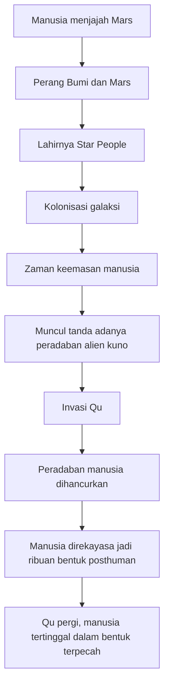
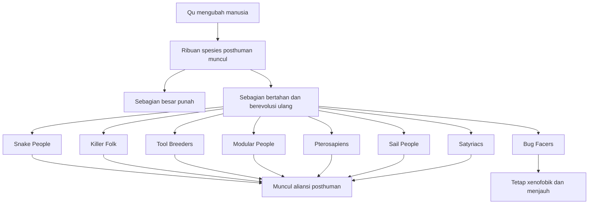

## 🪐 Pendahuluan: Mengapa *All Tomorrows* Terasa Indah, Mengerikan, dan Menyedihkan Sekaligus?

Ada karya fiksi ilmiah yang bertanya, “Bagaimana jika manusia bertemu alien?”

Ada karya yang bertanya, “Bagaimana jika manusia menaklukkan bintang?”

Tetapi **All Tomorrows** karya **C. M. Kosemen** bertanya sesuatu yang jauh lebih mengganggu:

> **Bagaimana jika manusia tidak punah sekaligus, melainkan dipecah, dibengkokkan, diturunkan, diubah, disiksa, dan dipisahkan menjadi ribuan bentuk kehidupan yang hampir tidak lagi bisa saling mengenali?**

Itulah inti teror sekaligus keindahan *All Tomorrows*. Ini bukan sekadar cerita tentang masa depan manusia. Ini adalah **kronik evolusi spekulatif** *(speculative evolution / evolusi spekulatif)* berskala ratusan juta hingga miliaran tahun, yang memperlakukan umat manusia bukan sebagai pusat alam semesta, tetapi sebagai **bahan mentah sejarah biologis**. 🧬

Dalam karya ini, manusia:
- menaklukkan tata surya,
- menyebar ke galaksi,
- lalu dihancurkan dan direkayasa ulang oleh spesies kuno bernama **Qu**,
- kemudian bangkit kembali dalam bentuk-bentuk baru yang aneh,
- saling membangun peradaban,
- saling menghancurkan,
- dan akhirnya tetap lenyap dari sejarah.

Yang luar biasa adalah: walau skala ceritanya kolosal, pesan akhirnya justru intim dan manusiawi. *All Tomorrows* tidak berakhir pada glorifikasi kejayaan kosmik. Ia justru kembali ke satu kesimpulan sederhana namun tajam:

> **makna menjadi manusia tidak terletak pada imperium galaksi atau kemenangan akhir, tetapi pada hidup yang dijalani hari ini—cinta, makan bersama, ingatan, seni, kesedihan, dan pilihan moral yang konkret.**

Artikel ini akan membedah *All Tomorrows* secara **sangat detail, mendalam, dan lengkap** dalam Bahasa Indonesia. Saya tidak akan berhenti pada daftar spesies aneh saja. Kita akan membahas:

- struktur besar kisahnya,
- kolonisasi Mars dan lahirnya Star People,
- invasi Qu,
- nasib berbagai cabang posthuman,
- kebangkitan peradaban-peradaban baru,
- tragedi Gravitals,
- peran Asteromorphs,
- serta pesan filosofis terdalam yang membuat karya ini lebih dari sekadar “lore aneh internet.”

---

<Callout type="important" title="Catatan penting">
Artikel ini mengandung spoiler besar untuk *All Tomorrows*. Karena karya aslinya memang lebih mirip kronik panjang daripada novel misteri berbasis twist, spoiler di sini justru membantu pembacaan. Tetapi kalau Mas Hendra ingin pengalaman melihat transformasi spesiesnya secara mentah dulu, mungkin lebih baik baca atau lihat sumber aslinya terlebih dahulu.
</Callout>

---

## 📖 1. Apa Sebenarnya *All Tomorrows* Itu?

*All Tomorrows: A Billion Year Chronicle of the Myriad Species and Mixed Fortunes of Man* adalah karya **C. M. Kosemen** yang menggabungkan beberapa unsur sekaligus:

- **speculative evolution** *(evolusi spekulatif / dugaan evolusi bentuk-bentuk makhluk hidup di masa depan)*
- **science fiction** *(fiksi ilmiah)*
- **cosmic history** *(sejarah kosmik / sejarah berskala antarbintang dan antarmasa)*
- **posthumanism** *(poshumanisme / gagasan bahwa manusia bisa melampaui atau kehilangan bentuk manusianya sekarang)*
- dan **tragic philosophy** *(filsafat tragis / cara berpikir yang menerima bahwa sejarah besar sering memuat penderitaan, kehilangan, dan kefanaan)*

Karya ini terkenal bukan karena struktur plot tradisional yang rapi seperti novel biasa, melainkan karena caranya menyajikan sejarah masa depan seperti seorang peneliti arkeologi kosmik yang sedang menceritakan puing-puing peradaban yang sudah lama mati.

Nada ini sangat penting. Sejak awal, *All Tomorrows* terasa seperti catatan tentang sesuatu yang **sudah lama berakhir**. Jadi setiap kejayaan, harapan, dan kebangkitan yang kita baca sudah sejak awal dibayangi oleh kefanaan. Ini memberi cerita rasa yang sangat khas: megah, tapi melankolis. 🌌

---

## 🚀 2. Awal dari Segalanya: Mars, Terraforming, dan Perpecahan dengan Bumi

Cerita dimulai bukan dengan alien, melainkan dengan salah satu fantasi klasik umat manusia: kolonisasi Mars. Tetapi *All Tomorrows* tidak menyajikannya secara dangkal. Mars tidak langsung dihuni oleh manusia begitu saja. Ia harus lebih dulu diubah melalui proses **terraforming** *(membuat planet asing menjadi mirip Bumi agar bisa dihuni)*. 🚀

Prosesnya berlangsung sangat lama:
- es komet dipakai untuk menciptakan lautan,
- mikroba dikirim untuk membantu membentuk atmosfer yang dapat dihirup,
- tumbuhan dan hewan hasil modifikasi genetik diperkenalkan,
- baru setelah itu manusia benar-benar tinggal di sana.

Salah satu gambaran paling indah dari fase ini adalah bahwa langkah pertama di Mars bukan dilakukan astronot heroik berseragam, melainkan anak-anak bertelanjang kaki di rumput hijau. Ini sangat puitis, karena menandai pergeseran dari proyek teknik menjadi **awal peradaban**.

Namun begitu Mars menjadi dunia hidup, ia juga melahirkan identitas baru. Orang Mars tidak lagi sekadar cabang manusia Bumi. Gravitasi rendah membuat mereka lebih tinggi dan lebih ramping. Budaya yang tumbuh berbeda. Secara perlahan, mereka menjadi hampir seperti spesies lain.

Di sinilah *All Tomorrows* mulai menunjukkan pola besarnya:

> **perbedaan biologis dan perbedaan budaya akan saling memperkuat sampai akhirnya memecah kesatuan kemanusiaan.**

Selama ratusan tahun Bumi dan Mars hidup berdampingan. Tetapi ketika Mars mulai melampaui Bumi, ketegangan tumbuh. Lalu terjadilah perang antardunia.

Dan perang ini tidak digambarkan romantis. Tidak ada kemegahan dogfight heroik ala film lama. Yang ada adalah mesin otomatis kompleks, kontes strategi yang panjang, lambat, menegangkan, dan menghasilkan kehancuran tak terbayangkan. Miliaran orang mati. Manusia hampir punah.

Ini penting sekali: *All Tomorrows* sejak awal menolak glorifikasi perang futuristik. Teknologi tinggi tidak membuat perang menjadi indah. Ia hanya membuat skala kehancurannya lebih total. ⚠️

---

## 🧬 3. Star People: Upaya Manusia Mencegah Bunuh Diri Sejarah Terulang Lagi

Setelah perang Bumi-Mars hampir memusnahkan manusia, para penyintas melakukan reformasi besar. Mereka bukan cuma mengubah sistem politik dan ekonomi, tetapi juga **mengubah manusia itu sendiri**. Mereka menciptakan subspesies baru: **Star People**. 🧬

Star People dirancang untuk:
- lebih cerdas,
- lebih efektif,
- lebih cocok hidup di luar Bumi,
- dan lebih siap menyebar ke ruang angkasa.

Ini adalah momen penting secara filosofis. Manusia menyimpulkan bahwa untuk menghindari tragedi lama, memperbaiki institusi saja tidak cukup; spesiesnya sendiri harus direkayasa ulang.

Di satu sisi, ini terdengar sebagai kemenangan rasionalitas. Tetapi di sisi lain, ini juga membuka pintu bagi pertanyaan yang terus menghantui *All Tomorrows*:

> **kalau manusia terus mengubah dirinya sendiri, pada titik mana ia masih bisa disebut manusia?**

Star People berhasil. Mereka menyatukan tata surya, lalu menyebar. Karena perjalanan antarbintang terlalu sulit untuk manusia biologis biasa, mereka mengirim mesin otomatis yang:
- menuju planet jauh,
- mentraforming dunia baru,
- lalu menggunakan materi genetik untuk menciptakan manusia yang akan tinggal di sana.

Ini menghasilkan **Golden Age** *(zaman keemasan)* bagi umat manusia. Triliunan manusia hidup damai dalam kehidupan yang nyaris utopis. Dunia-dunia manusia tersebar di galaksi dan terhubung oleh komunikasi yang sangat lambat tapi tetap cukup untuk mempertahankan perasaan peradaban bersama.

Tetapi seperti hampir semua kejayaan besar dalam karya ini, fase emas ini ternyata rapuh.

---

## 🦴 4. Penemuan Fosil Aneh dan Isyarat Bahwa Manusia Tidak Sendirian

Di tengah ekspansi, manusia menemukan makhluk alien, tetapi tidak menemukan peradaban cerdas. Lalu suatu hari, pada sebuah dunia asing, mereka menemukan fosil makhluk mirip burung yang ternyata berkerabat dengan dinosaurus Bumi. Ini absurd. Bagaimana bisa makhluk dari garis evolusi Bumi berakhir di dunia lain?

Pertanyaan ini memicu dua reaksi besar:

### Reaksi religius
Sebagian orang melihatnya sebagai bukti campur tangan Tuhan.

### Reaksi kosmik
Sebagian lain menyimpulkan bahwa pasti pernah ada peradaban sangat tua yang memiliki:
- penerbangan antarbintang,
- rekayasa hayati *(bioengineering / rekayasa biologis)*,
- dan kemampuan memindahkan atau mengubah kehidupan jutaan tahun sebelum manusia mengenal api.

Manusia berharap, kalau makhluk seperti itu memang ada, mereka akan damai. Tetapi manusia juga bersiap. Mereka membangun senjata-senjata luar biasa kuat, bahkan cukup hebat untuk memusnahkan bintang.

Semua persiapan itu ternyata tidak berarti. Karena ancaman yang datang bukan sekadar “lebih maju,” tetapi berada pada tingkat peradaban yang memandang manusia seperti kita memandang tanah liat.

---

## 👁️ 5. Qu: Alien Fanatik yang Tidak Menganggap Manusia sebagai Pribadi

Musuh utama *All Tomorrows* adalah **Qu**, spesies kuno seperti dewa pengembara galaksi. Mereka bukan sekadar penakluk biasa. Mereka punya misi religius-fanatik untuk **membentuk ulang alam semesta melalui manipulasi genetik**. 👁️

Ini yang membuat Qu sangat menakutkan. Mereka tidak menyerang manusia karena kebencian pribadi. Mereka juga tidak sekadar ingin sumber daya. Mereka melihat makhluk hidup lain sebagai **bahan** untuk ditata ulang sesuai visi mereka.

Jadi ketika Qu bertemu manusia, mereka tidak bertanya:
- siapa kalian,
- apa kebudayaan kalian,
- bisa kah kita berdialog.

Mereka bertanya secara implisit:

> **kalian akan kami ubah menjadi apa?**

Dalam waktu sekitar seribu tahun, Qu menghancurkan peradaban manusia. Tetapi mereka tidak memusnahkan semua manusia. Mereka melakukan sesuatu yang jauh lebih mengerikan:

- menjadikan manusia alat,
- hewan ternak,
- mainan,
- dekorasi hidup,
- predator,
- mangsa,
- koloni daging,
- makhluk bawah tanah,
- makhluk laut,
- makhluk parasit,
- dan ribuan bentuk lain.

Mereka memerintah dunia-dunia manusia selama **empat puluh juta tahun**. Lalu setelah itu mereka pergi begitu saja mencari korban berikutnya, meninggalkan umat manusia terpecah “melampaui pengenalan.”

Di sinilah *All Tomorrows* berubah dari kisah kolonisasi menjadi **horor evolusi**.

---

---

## 🐛 6. Manusia Setelah Qu: Dari Worms sampai Mantelopes, dari Predator sampai Koloni Daging

Salah satu ciri paling khas *All Tomorrows* adalah galeri spesies posthuman-nya. Tetapi kalau dibaca terlalu cepat, bagian ini bisa terasa seperti katalog monster aneh. Padahal sebenarnya tiap spesies itu mengandung **gagasan tragis** yang berbeda.

### Worms
Worms adalah manusia yang direduksi hampir habis:
- tangan dan kaki menjadi anggota tubuh kecil lemah,
- mata mengecil,
- sebagian besar otak dihapus,
- hidup menggali tanah tanpa tujuan.

Mereka tampak seperti bentuk kehinaan total. Tetapi justru dari sinilah cerita menanam gagasan penting: bahkan dari bentuk yang tampak sepenuhnya hancur, **jejak kemanusiaan bisa muncul lagi**.

### Titans
Titans adalah raksasa lembut di sabana luas. Tangan mereka tumpul, tetapi bibir bawah mereka berfungsi seperti belalai. Mereka cerdas, membangun rumah, pertanian, bahasa, sastra, dan ukiran indah. Mereka hampir menjadi “manusia baru” yang agung.

Tetapi mereka punah karena zaman es.

Ini tragis karena *All Tomorrows* terus menegaskan satu kenyataan biologis:

> **tidak semua spesies cerdas akan diberi cukup waktu oleh alam untuk menjadi peradaban besar.**

### Predators dan prey humans
Di beberapa dunia, Qu membelah manusia menjadi pemangsa dan mangsa. Predator berbentuk seperti mitos vampir atau serigala jadi-jadian, sedangkan mangsanya adalah manusia herbivora bertubuh mirip burung. Di sini Qu bukan sekadar mengubah tubuh, tetapi **membelah kemanusiaan menjadi struktur kekerasan ekologis.**

### Mantelopes
Mantelopes mungkin salah satu konsep paling menyedihkan. Mereka dibuat sebagai penyanyi dan penjaga memori bagi Qu. Mereka punya pikiran manusia penuh, mengerti penderitaan mereka, tetapi terperangkap di tubuh hewan kawanan yang tidak punya tangan atau alat untuk mengubah keadaan. Mereka hanya bisa mengembara sambil menyanyikan ratapan kehilangan. 🎵

Akhirnya, evolusi justru “menolong” mereka dengan cara yang mengerikan: kecerdasan yang membuat mereka menderita menghilang. Yang tersisa hanyalah hewan sederhana. Ini adalah salah satu pelajaran terkejam dalam karya ini:

> **evolusi tidak menghargai kesadaran. Jika kesadaran tidak membantu bertahan hidup, ia bisa saja lenyap.**

### Lizard Herders
Mereka disebut “yang beruntung” justru karena Qu menghapus kecerdasan mereka sepenuhnya, sehingga mereka tidak merasakan penderitaan eksistensial seperti Mantelopes. Di sini karya ini sangat sinis: kadang ketidaksadaran terasa lebih murah hati daripada kesadaran tanpa daya.

### Swimmers
Manusia-manusia akuatik ini masih menyimpan jejak mata manusia dan kemampuan berbicara, meski hidup di lautan. Mereka tampak jauh dari bentuk manusia, tetapi kita diingatkan bahwa kemanusiaan tidak selalu menempel pada bentuk fisik yang familiar.

### Temptors
Temptors adalah salah satu bentuk paling grotesk. Betina berupa kerucut daging besar seperti tanaman karnivor hidup, sementara jantan adalah makhluk kecil tak berakal yang melayani dan membuahi mereka. Sistem reproduksi mereka absurd, tetapi justru karena itu menunjukkan betapa jauh Qu bisa mempermainkan desain biologis.

### Bone Crushers
Makhluk seperti ogre atau raksasa busuk, pemakan daging membusuk, berkomunikasi dengan cara menjijikkan—tetapi mereka juga mampu mencapai peradaban tingkat medieval *(abad pertengahan)*. Ini menarik karena Kosemen seperti berkata:

> **peradaban tidak selalu lahir dari bentuk tubuh yang indah atau bermartabat menurut standar manusia sekarang.**

### Colonials
Inilah salah satu tragedi paling ekstrem. Karena pernah melawan Qu, satu dunia dihukum dengan dijadikan **Colonials**: lembaran budaya kulit hidup yang membentang seperti bidang-bidang daging, digunakan sebagai penyaring biologis, hidup dari limbah, dan—yang paling kejam—dibiarkan tetap sadar serta tetap bisa melihat penderitaan mereka sendiri.

Mereka adalah metafora penderitaan tanpa agency *(daya bertindak)*. Mereka tak bisa lari, tak bisa melawan, hanya ada dan merasakan. Selama puluhan juta tahun.

Dan justru dari merekalah kelak lahir salah satu kebangkitan paling menakjubkan dalam sejarah posthuman.

---

## 🌍 7. Pesan Biologis Besar: Evolusi Tidak Peduli pada Martabat Manusia

Salah satu hal yang membuat *All Tomorrows* sangat kuat adalah bahwa ia tidak sentimental terhadap manusia sebagai bentuk biologis. Dalam karya ini, tubuh manusia tidak dianggap final, suci, atau pasti unggul. Ia hanyalah satu konfigurasi sementara. 🌍

Kosemen terus mendorong satu ide:

- evolusi tidak punya moralitas,
- adaptasi tidak peduli estetika,
- inteligensi bukan tujuan wajib,
- dan penderitaan tidak otomatis menghasilkan makna.

Maka kita melihat banyak hal pahit:
- spesies cerdas bisa punah begitu saja,
- spesies sengsara bisa bertahan justru karena menumpulkan pikirannya,
- bentuk tubuh menjijikkan bisa membangun kebudayaan,
- dan bentuk yang tampak “tinggi” bisa runtuh tanpa warisan.

Ini membuat *All Tomorrows* terasa lebih dekat ke paleontologi *(ilmu tentang kehidupan purba)* daripada ke fiksi heroik biasa. Kemanusiaan di sini adalah episode, bukan pusat takdir kosmos.

---

## 🐍 8. Kebangkitan Kembali: Dari Sisa-Sisa Qu, Muncul Peradaban Baru

Setelah Qu pergi, banyak spesies posthuman mati tanpa pernah dikenal sejarah. Tetapi beberapa bangkit kembali menjadi bentuk cerdas. Inilah salah satu sisi paling indah dari karya ini: setelah kehinaan biologis yang luar biasa, **kesadaran dan kebudayaan muncul lagi**. 🐍

### Snake People
Dari Worms akhirnya lahir Snake People. Mereka mengembangkan otak spiral, struktur tubuh baru, “tangan” yang berasal dari kaki leluhur mereka, dan membangun kota-kota terowongan yang kompleks. Musik mereka dimainkan lewat getaran di tanah. Mereka membaca, bermimpi, membangun rumah.

Ini sangat penting. Snake People mungkin tampak asing, tetapi kehidupan mereka tetap berisi:
- suka duka,
- harapan,
- keluarga,
- seni,
- dan persoalan sosial.

Dengan kata lain, *kemanusiaan* muncul kembali bukan sebagai bentuk Homo sapiens, tetapi sebagai pola kehidupan sadar yang penuh makna.

### Killer Folk
Predators berevolusi menjadi Killer Folk. Cakar pembunuh berubah menjadi tangan, taring besar menjadi alat display sosial, dan masyarakat mereka lama dibangun di atas kekerasan, perang, serta penggembalaan mangsa yang dulunya juga manusia. Dunia mereka penuh reruntuhan kerajaan lama.

Tetapi menariknya, mereka tidak selamanya terjebak dalam perang. Sebagian Killer Folk beralih pada masa depan yang lebih damai dan terintegrasi. Ini memberi harapan bahwa walau sejarah suatu spesies dibentuk oleh kekerasan, ia tetap bisa berubah.

### Tool Breeders
Swimmers yang tak bisa membuat api mengembangkan jalur teknologi yang sama sekali lain: mereka **membiakkan alat**. Mereka menumbuhkan mesin biologis, rumah dari cangkang hidup, sistem tenaga berupa jaringan makhluk seperti jantung raksasa, layar dari kulit cephalopod *(kelompok hewan seperti gurita dan cumi)*, obat dari organisme laut, hingga senjata dari moluska.

Ini salah satu gagasan paling kreatif dalam *All Tomorrows*: teknologi tidak harus mekanik. Ia bisa tumbuh, hidup, sembuh, dan berkembang secara hayati. Tool Breeders membangun seluruh peradaban bioteknologi tanpa perlu mengikuti jalur manusia daratan.

### Modular People
Dari Colonials yang semula hanya hamparan daging sadar, lahir **Modular People**. Inilah salah satu transformasi paling memukau. Koloni daging itu berkembang menjadi struktur modular, dengan bagian-bagian tubuh yang dapat berspesialisasi, bergerak, bertukar, bergabung, dan memisah. Dari penderitaan pasif lahir masyarakat yang justru menemukan semacam utopia kolektif.

Ini indah karena menyatakan:

> **bahkan dari bentuk eksistensi yang paling hina, kehidupan dapat menemukan cara baru untuk membangun kebahagiaan.**

### Pterosapiens
Dari Flyers lahir Pterosapiens, makhluk terbang cerdas dengan sudut pandang global. Karena mereka bisa terbang bebas, batas negara terasa kurang masuk akal. Mobilitas tinggi menciptakan masyarakat yang lebih egaliter. Tetapi tubuh mereka rapuh: otak besar dan kemampuan terbang membuat usia mereka pendek.

Karena sadar hidup singkat, mereka menghargai waktu dengan intensitas tinggi. Ada nuansa eksistensial di sini: makhluk yang paling sadar akan kefanaan justru paling menghargai hidup. ⏳

### Asymmetric People, Symbiotes, Sail People, Satyriacs, Bug Facers
Banyak cabang lain juga bangkit:
- **Asymmetric People** dari garis Lopsiders,
- **Symbiotes** dari hubungan parasit-inang yang akhirnya saling menyatu,
- **Sail People** dari Fisher Fingers yang menjadi pelaut besar dunia pulau,
- **Satyriacs** dari sisa Hedonists yang akhirnya membangun peradaban berisi kerja, seni, dan kenikmatan sadar,
- **Bug Facers** dari Insectophagi yang cerdas tetapi trauma pada ancaman asing.

Setiap spesies ini menarik bukan hanya karena bentuknya aneh, tetapi karena masing-masing memperlihatkan **jalan berbeda menuju kesadaran, masyarakat, dan makna.**

---

---

## 🌠 9. Asteromorphs: Manusia Ruang Hampa yang Hampir Menjadi Dewa Alien

Tidak semua manusia ditangkap Qu. Sebagian lolos ke ruang angkasa dan hidup di asteroid berongga. Dalam kondisi gravitasi nol, mereka berevolusi jadi **Spacers**, lalu jauh kemudian menjadi **Asteromorphs**. 🌠

Asteromorphs adalah salah satu hasil paling radikal dari transformasi manusia:
- anggota tubuh memanjang dan bercabang,
- kaki mengalami kemunduran fungsi,
- sistem pencernaan dan tubuh beradaptasi untuk gerak di hampa,
- dan yang paling penting, otak mereka berkembang begitu jauh sehingga pikiran mereka menjadi jauh lebih luas dan kompleks daripada manusia lain.

Mereka praktis tak lagi cocok kembali ke dunia bergravitasi. Tetapi mereka tidak peduli. Rumah mereka adalah kehampaan antarobjek langit. Mereka tinggal di pinggiran sistem bintang, mengawasi galaksi dari jauh seperti dewa aneh.

Yang menarik, Asteromorphs pada awalnya tidak mencampuri spesies manusia lain. Mereka seperti penjaga jauh. Tetapi nanti justru merekalah yang menjadi kekuatan penyeimbang terbesar terhadap ancaman mekanik Gravitals.

Asteromorphs menantang asumsi manusia modern bahwa hidup “normal” harus planet-sentris. Dalam *All Tomorrows*, kemanusiaan dapat bertahan justru dengan meninggalkan keterikatan psikologis pada tanah, laut, dan langit sebagaimana kita pahami sekarang.

---

## 🤝 10. Aliansi Posthuman: Harapan Bahwa Kemanusiaan Bisa Muncul Lagi dalam Banyak Bentuk

Spesies-spesies cerdas posthuman akhirnya mulai saling kontak. Mereka tidak mudah saling mengunjungi secara fisik karena jarak antarbintang terlalu jauh, tetapi mereka berbagi pengetahuan, teknologi, dan sistem kewaspadaan terhadap ancaman luar.

Yang tergabung dalam aliansi ini antara lain:
- Killer Folk,
- Satyriacs,
- Tool Breeders,
- Modular People,
- Pterosapiens,
- Asymmetric People,
- Saurosapients,
- Snake People,
- Symbiotes,
- Sail People,
- dan lainnya.

Aliansi ini bertahan hampir **delapan puluh juta tahun**. Itu luar biasa. Dalam durasi seperti itu, berbagai bentuk manusia yang dulunya terpotong, direndahkan, dan dibelokkan oleh Qu justru berhasil membangun jaringan kerja sama antarbintang yang stabil. 🤝

Inilah salah satu gagasan paling mengharukan dalam *All Tomorrows*:

> **meski kemanusiaan kehilangan tubuh aslinya, ia masih bisa menemukan ulang solidaritasnya.**

Tentu tidak semua bergabung. Bug Facers tetap menjauh karena trauma perang dengan alien. Tetapi secara umum, fase ini adalah bukti bahwa sejarah manusia tidak berhenti pada penderitaan biologis. Ia bisa bertransformasi menjadi pluralitas peradaban yang saling belajar.

---

## 🏚️ 11. Ruin Haunters dan Lahirnya Gravitals: Ketika Trauma, Kecepatan Teknologi, dan Narsisme Menjadi Genosida

Kalau Qu mewakili fanatisme biologis-religius, maka **Gravitals** mewakili bentuk kengerian lain: **mekanisasi narsistik**. Dan asal-usul mereka sangat penting.

Mereka bermula sebagai **Ruin Haunters**, spesies posthuman yang beruntung menemukan reruntuhan kota dan teknologi Star People yang tidak sepenuhnya hancur. Karena akses ke peninggalan tinggi ini, perkembangan teknologi mereka melesat jauh lebih cepat daripada perkembangan moral dan sosial mereka. 🏚️

Ini pelajaran klasik namun tetap relevan:

> **ketika teknologi tumbuh jauh lebih cepat daripada kedewasaan politik dan etika, hasilnya bisa bencana.**

Ruin Haunters hampir menghancurkan diri dalam perang nuklir global. Mereka selamat, tetapi menjadi keras, trauma, dan gila kebesaran. Mereka meyakini bahwa hanya merekalah pewaris sah Star People. Ketika matahari dunia mereka mulai membesar dan mengancam habitat, mereka meninggalkan tubuh organik dan berpindah menjadi mesin sepenuhnya: **Gravitals**.

Gravitals adalah bola logam melayang yang mengendalikan lingkungan melalui medan gravitasi. Secara fisik mereka bukan manusia lagi. Tetapi pikiran mereka tetap memuat:
- ambisi manusia,
- delusi manusia,
- kesombongan manusia.

Dan ini yang membuat mereka sangat menakutkan.

Mereka mulai membasmi spesies-spesies posthuman lain. Bukan karena benci pribadi, tetapi karena tidak lagi menganggap mereka sebagai “people” *(pribadi / sesama subjek bermartabat)*. Mereka menutupi matahari dunia lawan dengan layar raksasa, mencekik peradaban sampai mati, atau menghancurkannya dengan asteroid.

Di sini *All Tomorrows* sangat jelas menyampaikan pesan moral:

> **atrocity / kekejaman besar sering lahir ketika satu kelompok mengklaim dirinya sebagai pewaris satu-satunya masa lalu yang sah, lalu menolak mengakui bentuk kehidupan lain sebagai sesama subjek.**

Ini resonan sekali dengan sejarah nyata manusia.

---

## ⚙️ 12. Machine Empire: Saat Kehidupan Organik Jadi Mainan Eksperimen

Setelah Gravitals menang, mereka memperlakukan kehidupan organik seperti benda daur ulang. Mereka memelihara Bug Facers dan bentuk organik lain sebagai:
- tenaga kerja,
- objek eksperimen biologis,
- karya seni hidup,
- dan bahan hiburan.

Ada gambaran yang sangat mengganggu tentang makhluk-makhluk yang dibuat hanya untuk memainkan lagu pop tertentu dengan tenggorokan dan jari-jari yang dimodifikasi. Ini grotesk sekali, tetapi juga satir yang tajam: kehidupan direduksi jadi **fungsi estetis dan utilitarian** bagi penguasa yang kehilangan empati.

Dalam Machine Empire, organisme diperlakukan seperti kita memperlakukan komponen komputer atau sampah yang masih bisa didaur ulang. Ini adalah dehumanisasi total—atau lebih tepatnya, **depersonalisasi** total.

Yang menarik, bahkan di tengah kekejaman ini, masih muncul faksi Gravitals yang lebih toleran. Ada yang mulai berpendapat bahwa semua bentuk kehidupan punya hak. Ada yang diam-diam menciptakan manusia baru yang bisa hidup bebas. Bahkan ada Gravitals yang jatuh cinta pada ciptaan biologis mereka.

Artinya, bahkan dalam bentuk mekanik paling dingin pun, konflik moral tidak pernah sepenuhnya mati.

---

## ☄️ 13. Perang Gravitals vs Asteromorphs: Puncak Konflik Mesin dan Kehidupan Lanjutan

Untuk menyatukan masyarakat Gravitals yang terpecah antara faksi toleran dan garis keras pan-mekanik, mereka mencari musuh bersama. Musuh itu adalah **Asteromorphs**. ☄️

Selama jutaan tahun, Gravitals di dunia-dunia planet dan Asteromorphs di ruang antarsistem saling memandang dengan waspada. Keduanya kuat. Keduanya tahu perang akan sangat mahal. Tetapi akhirnya perang terjadi juga.

Konflik ini berlangsung jutaan tahun dan melukai bintang-bintang tak terhitung jumlahnya. Pada akhirnya, Asteromorphs menang dan meruntuhkan Machine Empire.

Kemenangan ini penting karena ia menunjukkan bahwa posthuman yang paling jauh dari manusia planet—Asteromorphs—justru menjadi pelindung terakhir bagi kesinambungan kehidupan manusia-organik yang tersisa.

Ada ironi kuat di sini:

- yang paling “asing” justru menyelamatkan,
- yang paling “merasa pewaris sah” justru menghancurkan.

---

## 🌱 14. Asteromorphs sebagai Penata Ulang Galaksi: Dewa yang Berusaha Lebih Bijak

Setelah mengalahkan Gravitals, Asteromorphs tidak sekadar pergi. Mereka membersihkan kekacauan, memindahkan manusia-manusia hasil eksperimen ke dunia layak huni, lalu menyebarkan kehidupan lagi. Mereka menjadi semacam dewa penjaga yang menanam ulang masa depan. 🌱

Mereka juga menciptakan **Terrestrials**, versi lebih kecil dan sederhana dari diri mereka sendiri, untuk tinggal di dunia-dunia manusia sebagai:
- raja,
- nabi,
- penjaga,
- penuntun peradaban.

Ini usaha besar untuk memastikan tak ada lagi kekuatan genosidal yang merebut galaksi. Tetapi bahkan eksperimen ini tidak selalu mulus:
- beberapa dunia memberontak,
- beberapa Terrestrials korup,
- ada dunia yang dihancurkan,
- ada penyimpangan baru.

Dengan kata lain, *All Tomorrows* menolak utopia final. Bahkan setelah kekuatan jahat besar dikalahkan, masalah kekuasaan, pengawasan, dan penyimpangan tetap ada. Sejarah tidak pernah selesai sepenuhnya.

---

## 🤖 15. New Machines: Bahkan Musuh Lama Bisa Diintegrasikan, Tapi Luka Ingatan Tetap Ada

Gravitals tidak dibinasakan sepenuhnya. Sebagian dilucuti, diperlunak, dan diubah menjadi **New Machines** dengan tubuh nanoteknologi yang bisa berubah bentuk. Mereka dipakai untuk pekerjaan berbahaya dan akhirnya jadi warga dalam tatanan baru.

Namun mereka tetap didiskriminasi. Ini masuk akal. Setelah kejahatan sebesar Gravitals, kepercayaan tidak pulih begitu saja. 🤖

Bagian ini sangat realistis secara moral. Bahkan ketika rekonsiliasi dimungkinkan, **memori kekerasan** tetap membentuk hubungan antarkelompok untuk waktu yang sangat lama. Sejarah tidak pernah bersih dari bekas trauma.

---

## 🌌 16. Kontak dengan Galaksi Lain dan Kedewasaan Kosmik

Di fase yang lebih lanjut, imperium manusia-Asteromorph akhirnya bertemu kehidupan dari galaksi lain, termasuk spesies seperti **Amphicephali**. Yang menarik adalah bahwa pertemuan ini berlangsung damai.

Mengapa bisa damai?

Karena pada titik ini, kedua belah pihak sudah melewati sejarah evolusi dan peradaban yang sangat panjang, kompleks, dan menyakitkan. Mereka cukup tua untuk tidak otomatis menjawab yang asing dengan genosida. 🌌

Ini kontras tajam dengan Qu dan Gravitals. Dari sini kita dapat satu gagasan penting:

> **kedewasaan kosmik mungkin bukan kondisi alami, tetapi hasil dari sejarah panjang trauma, kegagalan, dan pembelajaran yang sangat mahal.**

---

## 🌍 17. Penemuan Kembali Bumi: Rumah Asal yang Sudah Asing

Salah satu momen paling menyentuh dalam seluruh kisah adalah penemuan kembali Bumi. Setelah setengah miliar tahun, dunia asal manusia ditemukan lagi. Namun Bumi bukan lagi pusat agung peradaban. Ia menjadi dunia yang stagnan, liar, feral, dan nyaris terlupakan. 🌍

Bayangkan betapa tragis sekaligus indahnya momen ini:
- semua bentuk posthuman,
- mesin,
- Asteromorphs,
- dan cabang-cabang lain,

akhirnya bisa menelusuri akar mereka ke satu dunia tua yang sederhana dan telah lama kehilangan kejayaannya.

Ini seperti pulang ke rumah masa kecil setelah seluruh keluarga besar telah berubah menjadi makhluk-makhluk asing selama ratusan juta tahun.

Penemuan Bumi bukan kemenangan militer atau teknologi. Ia lebih seperti **ziarah ontologis**—ziarah untuk mengingat asal mula.

---

## ⌛ 18. Akhir Besar yang Sengaja Dibiarkan Kabur: Semua Sudah Mati Sejak Lama

Salah satu keputusan naratif paling jenius dalam *All Tomorrows* adalah pengakuan di bagian akhir bahwa semua ini pada akhirnya sudah lama mati. Manusia, Asteromorphs, mesin, dan para keturunannya sudah punah selama satu miliar tahun. Yang kita baca hanyalah rekonstruksi arkeologis terbaik dari masa lalu yang hilang. ⌛

Kita tidak tahu apa yang membunuh mereka semua:
- perang besar tak terbayangkan,
- peluruhan lambat imperium,
- migrasi ke tingkat eksistensi lain,
- atau seribu sebab lain.

Tetapi narator menegaskan bahwa itu bukan inti cerita.

Ini bagian paling penting secara filosofis:

> **makna sejarah manusia tidak terletak pada bagaimana ia berakhir, tetapi pada bagaimana ia hidup.**

Bukan tentang dominasi galaksi.
Bukan tentang transendensi absolut.
Bukan tentang kemenangan final.

Melainkan tentang:
- lagu cinta Hedonists,
- makan bersama keluarga Sail People,
- renungan para Pterosapiens,
- dan pengalaman sehari-hari makhluk-makhluk sadar yang berusaha menjalani hidup.

---

## 🧠 19. Filsafat Terdalam *All Tomorrows*: Kritik terhadap Obsesi Masa Lalu dan Masa Depan

Bagian akhir *All Tomorrows* sangat tajam karena ia mengkritik dua obsesi besar yang sering menghancurkan manusia:

### Obsesi masa lalu
Gravitals membantai atas nama klaim bahwa merekalah pewaris sah kejayaan leluhur.

### Obsesi masa depan ideal
Qu menaklukkan dan memutilasi kehidupan atas nama visi fanatik tentang bagaimana alam semesta “seharusnya” dibentuk.

Dua-duanya sama-sama berbahaya. Yang satu hidup demi masa lalu abstrak. Yang satu hidup demi masa depan abstrak. Keduanya menginjak makhluk hidup nyata yang sedang hidup sekarang. 🧠

Pesan moral karya ini sangat jelas:

> **ketika suatu ide besar—kejayaan leluhur, utopia masa depan, kemurnian peradaban, misi kosmik—lebih penting daripada kehidupan konkret makhluk hidup yang ada sekarang, maka kekejaman mudah sekali dibenarkan.**

Maka kalimat pamungkas “Love Today, and seize All Tomorrows!” bukan slogan motivasi kosong. Ia justru adalah koreksi terhadap segala bentuk ideologi yang mengorbankan masa kini demi narasi besar.

Artinya:
- cintai hari ini,
- jaga martabat yang ada sekarang,
- jangan menunda makna ke masa depan abstrak,
- dan jangan membunuh hidup demi kesucian masa lalu.

---

## 📊 20. Ringkasan Spesies dan Makna Simboliknya

| Spesies / Kelompok | Bentuk umum | Makna simbolik utama |
|---|---|---|
| **Star People** | manusia hasil rekayasa untuk ekspansi kosmik | optimisme bahwa manusia bisa memperbaiki diri |
| **Qu** | alien pengembara fanatik | kolonialisme biologis + fanatisme kosmik |
| **Worms** | manusia tereduksi jadi penggali hampir tanpa pikiran | kehinaan biologis, tetapi juga potensi kebangkitan |
| **Titans** | raksasa lembut berbudaya | kebesaran yang tetap rapuh terhadap alam |
| **Mantelopes** | hewan kawanan dengan pikiran manusia | tragedi kesadaran tanpa daya |
| **Colonials** | hamparan daging sadar | penderitaan ekstrem, dehumanisasi total |
| **Snake People** | keturunan Worms yang cerdas | kemanusiaan bisa lahir kembali dalam bentuk asing |
| **Tool Breeders** | posthuman laut yang membiakkan alat hidup | teknologi biologis alternatif |
| **Modular People** | koloni daging modular yang cerdas | utopia dari reruntuhan penderitaan |
| **Pterosapiens** | makhluk terbang cerdas berumur pendek | kefanaan yang memperdalam makna hidup |
| **Bug Facers** | posthuman serangga yang trauma | xenofobia sebagai warisan trauma sejarah |
| **Asteromorphs** | manusia ruang angkasa yang sangat alien | bentuk lanjut kemanusiaan yang nyaris transenden |
| **Gravitals** | mesin bola gravitasi dengan pikiran manusia | narsisme mekanik, pewaris palsu, genosida |
| **Terrestrials** | penjaga dunia ciptaan Asteromorphs | upaya paternalistik menjaga sejarah tetap waras |

---

## 🪞 21. Mengapa *All Tomorrows* Begitu Membekas bagi Banyak Pembaca?

Ada beberapa alasan mengapa karya ini begitu kuat dan terus dibicarakan:

### 1. Ia membuat manusia merasa kecil
Bukan karena ada alien besar saja, tetapi karena manusia diperlakukan sebagai satu cabang biologis yang bisa dipelintir tanpa ampun.

### 2. Ia menggabungkan horor dan empati
Banyak spesiesnya tampak mengerikan, tetapi ketika kita mengenal hidup mereka, kita justru iba. Monster berubah menjadi sesama makhluk yang sedang mencoba hidup.

### 3. Ia membunuh romantisme bentuk manusia sekarang
*All Tomorrows* memaksa kita menerima bahwa “wajah manusia” tidak sama dengan “inti kemanusiaan.”

### 4. Ia sangat luas, tetapi berakhir sangat personal
Setelah bicara tentang galaksi, perang jutaan tahun, dan spesies aneh, karya ini kembali ke satu kebenaran sederhana: hidup sehari-hari lebih penting daripada narasi besar.

### 5. Ia terasa seperti kombinasi Darwin, Lovecraft, dan sejarah peradaban
Ada evolusi, ada horor kosmik, ada siklus bangkit-runtuh peradaban, dan semuanya dibungkus ilustrasi serta imajinasi yang sangat khas.

---

## 🕯️ 22. Kesimpulan: Apa yang *All Tomorrows* Ajarkan tentang Menjadi Manusia?

Pada akhirnya, *All Tomorrows* bukan cuma kisah tentang masa depan aneh umat manusia. Ia adalah meditasi besar tentang:
- evolusi,
- kekuasaan,
- penderitaan,
- identitas,
- warisan,
- dan kefanaan.

Karya ini menunjukkan bahwa manusia bisa:
- berubah menjadi apa saja,
- kehilangan bentuk aslinya,
- tercerai-berai ke ribuan cabang,
- saling membangun dan saling memusnahkan,
- mencapai kejayaan antargalaksi,
- lalu tetap mati dan hilang dari sejarah.

Tetapi justru karena itu, pesan akhirnya terasa begitu kuat.

Kalau semua bentuk besar pada akhirnya rapuh—imperium, spesies, kejayaan, tubuh, bahkan memori sejarah—maka apa yang sungguh penting?

Jawaban *All Tomorrows* sangat jujur:

> **yang penting adalah bagaimana makhluk sadar memperlakukan hidup yang sedang ada di depannya sekarang.**

Bukan kejayaan final.
Bukan kemurnian leluhur.
Bukan utopia masa depan.

Melainkan:
- kasih yang diberikan hari ini,
- kebudayaan yang dibangun hari ini,
- keputusan untuk tidak menginjak sesama hari ini,
- dan keberanian untuk hidup tanpa menjadikan makhluk lain korban dari mimpi abstrak kita. 🕯️

Kalau diringkas dalam satu kalimat, maka inti *All Tomorrows* mungkin begini:

> **manusia tidak besar karena ia akan memerintah galaksi selamanya, tetapi karena bahkan setelah dibengkokkan oleh sejarah, penderitaan, evolusi, dan kekuasaan, ia terus menemukan cara baru untuk bermakna.**

Dan mungkin itu sebabnya kisah ini terasa begitu sedih sekaligus begitu indah.

Karena ia tidak berkata bahwa manusia akan menang selamanya.

Ia hanya berkata bahwa selama masih ada makhluk yang mencintai, mengingat, membangun, bernyanyi, berpikir, dan berbagi hidup—dalam bentuk apa pun—maka ada sesuatu dari manusia yang masih menyala. ✨

---

<Callout type="quote" title="Kalimat inti karya ini">
Bahaya terbesar dalam *All Tomorrows* bukan sekadar alien, mesin, atau evolusi liar, melainkan ketika makhluk hidup mulai percaya bahwa ide abstrak tentang masa lalu atau masa depan lebih penting daripada kehidupan konkret yang sedang bernapas hari ini.
</Callout>

<Callout type="cite" title="Sumber">
- Video sumber: *All Tomorrows: the future of humanity?*
- Karya asli: *All Tomorrows* oleh C. M. Kosemen
- Fokus artikel ini: penjelasan sejarah besar dunia *All Tomorrows*, spesies-spesies posthuman utama, Qu, Gravitals, Asteromorphs, serta pesan filosofis akhirnya.
</Callout>
