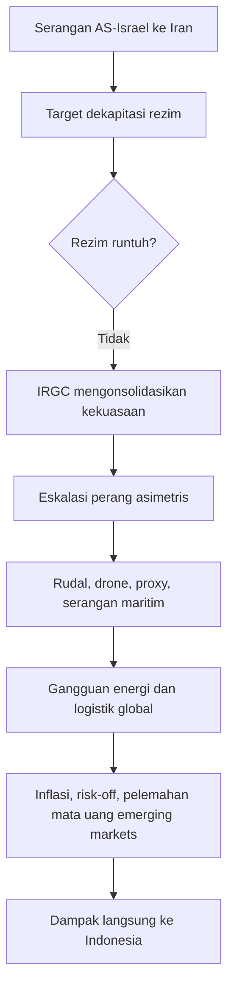
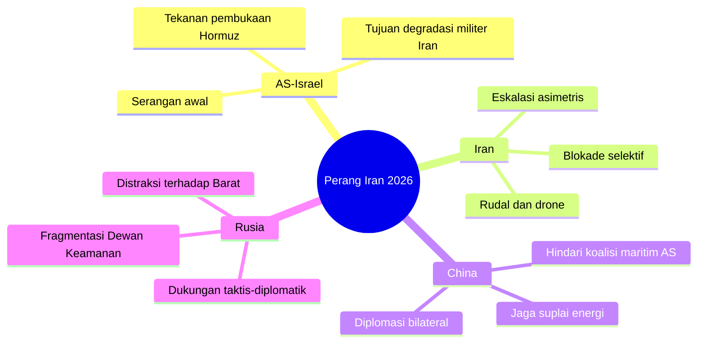
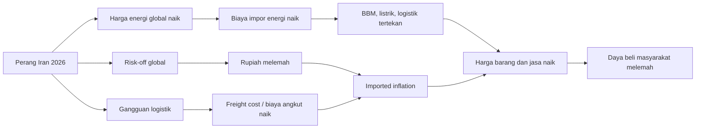
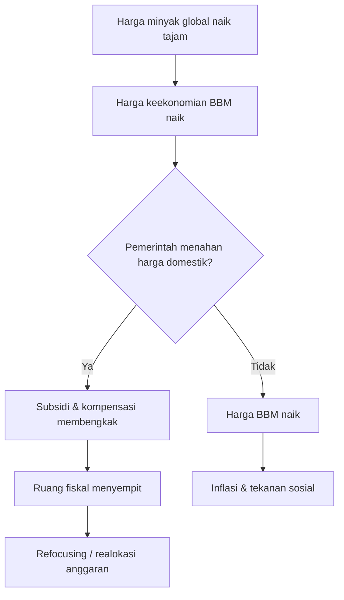
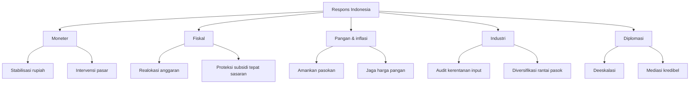

## 🌍 Pendahuluan: Ini Bukan Sekadar Perang Regional, tetapi Ujian Besar bagi Tata Ekonomi Dunia

Perang Iran 2026 tidak bisa dibaca sebagai konflik biasa antara dua atau tiga negara yang sedang saling menyerang. Konflik ini jauh lebih besar daripada itu. Ia menyentuh jantung sistem global: **energi, logistik, keuangan, pangan, dan psikologi pasar**. Ketika kawasan Teluk bergejolak, dampaknya tidak berhenti di Timur Tengah. Getarannya menjalar ke Eropa, Asia, pasar komoditas, kebijakan bank sentral, hingga dapur rumah tangga di Indonesia. ⚠️

Itulah sebabnya, tulisan ini perlu diletakkan dalam kerangka yang lebih serius. Yang sedang kita hadapi bukan hanya berita perang, tetapi **perubahan besar dalam arsitektur risiko global**. Ketika Selat Hormuz terganggu, harga minyak melonjak. Ketika harga minyak melonjak, ongkos logistik naik. Ketika ongkos logistik naik, biaya produksi industri ikut terdorong. Lalu inflasi menekan daya beli, nilai tukar melemah, dan pemerintah dipaksa memilih: melindungi rakyat lewat subsidi atau menjaga disiplin fiskal agar APBN tidak jebol.

Dengan kata lain, **peluru yang ditembakkan di Timur Tengah bisa berubah menjadi tagihan listrik, harga beras, kurs rupiah, dan beban subsidi di Indonesia**. Itulah mengapa analisis atas perang ini harus dilakukan secara mendalam, runtut, dan tanpa menyederhanakan persoalan.

<Callout type="important" title="Tesis utama artikel ini">
Perang Iran 2026 adalah krisis geopolitik yang berpotensi berubah menjadi krisis stagflasi global. Bagi Indonesia, ancaman terbesarnya bukan hanya kenaikan harga minyak, tetapi kombinasi antara pelemahan rupiah, imported inflation (inflasi impor), pembengkakan subsidi energi, gangguan rantai pasok industri, dan tekanan politik untuk tetap menjaga stabilitas sosial.
</Callout>

---

## 🧭 1. Anatomi Pecahnya Konflik: Mengapa Perang Ini Sangat Berbahaya?

Menurut bahan yang menjadi dasar tulisan ini, perang terbuka meletus pada **28 Februari 2026** ketika Amerika Serikat dan Israel meluncurkan operasi militer terhadap Iran. Dari narasi strategis yang beredar, serangan itu dibangun di atas dua klaim besar: pertama, Iran dituduh diam-diam membangun kembali kemampuan senjata nuklir; kedua, Iran disebut mempercepat pengembangan rudal balistik jarak jauh.

Namun inti persoalannya bukan cuma pada klaim itu, melainkan pada **doktrin yang dipakai**. Serangan ini tampaknya tidak hanya bertujuan merusak fasilitas, tetapi juga menjalankan pendekatan *regime decapitation* — **dekapitasi rezim**, yaitu strategi untuk melumpuhkan kepemimpinan tertinggi lawan dalam satu pukulan cepat agar struktur negara menjadi kacau, demoralisasi meluas, lalu rezim runtuh dari dalam. 🎯

Masalahnya, sejarah menunjukkan bahwa strategi seperti ini sangat berisiko gagal. Dalam banyak kasus, pembunuhan elite tidak otomatis menjatuhkan negara. Yang justru sering terjadi adalah kebalikannya: populasi marah, aparat mengeras, dan faksi garis keras mengambil alih penuh.

Di sinilah letak bahaya utama perang Iran 2026. Jika benar kepemimpinan sipil Iran tersingkir dan unsur paling militan dari IRGC (*Islamic Revolutionary Guard Corps* — **Korps Garda Revolusi Islam**) menjadi pusat kekuasaan, maka konflik tidak lagi mengikuti logika diplomasi konvensional. Ia bergeser menjadi **perang asimetris** — perang yang tidak bertumpu pada pertempuran terbuka biasa, melainkan serangan balasan melalui rudal, *drone* (pesawat nirawak), sabotase, proxy war (perang perantara), dan gangguan pada jalur perdagangan dunia. 🔥

### Mengapa ini lebih berbahaya daripada perang biasa?

Karena perang ini tidak membutuhkan kemenangan total untuk membuat dunia kacau. Iran tidak harus menaklukkan lawannya untuk menghasilkan dampak besar. Cukup dengan mengganggu *chokepoint* — **titik sempit strategis** — seperti Selat Hormuz, maka seluruh dunia merasakan akibatnya.

---

## 🚢 2. Selat Hormuz: Mengapa Dunia Sangat Takut pada Blokade Ini?

Kalau ada satu titik di peta yang paling menentukan nasib ekonomi global dalam konflik ini, jawabannya adalah **Selat Hormuz**. Selat ini bukan sekadar jalur laut biasa. Ia adalah katup energi dunia. Sebagian sangat besar ekspor minyak dan gas dari kawasan Teluk harus melewati koridor sempit ini. Ketika Iran mengganggunya — bahkan tanpa menutup total — pasar langsung panik.

Penting dipahami: dalam ekonomi modern, gangguan tidak harus berupa penutupan total agar efeknya besar. Kadang cukup dengan:

- ancaman ranjau laut,
- risiko rudal antikapal,
- ketidakpastian izin lintas,
- lonjakan premi asuransi perang,
- dan keengganan operator pelayaran untuk masuk kawasan.

Artinya, walaupun secara formal ada pernyataan bahwa jalur masih terbuka bagi kapal tertentu, secara **de facto** — **dalam kenyataan praktik** — perdagangan tetap bisa lumpuh. Kapal bisa menunda keberangkatan, perusahaan asuransi menaikkan biaya ekstrem, dan pembeli energi global mulai berebut suplai alternatif. ⛽

<Callout type="info" title="Apa arti de facto?">
*De facto* berarti “dalam praktik nyata”, meskipun belum tentu dinyatakan resmi secara hukum. Jadi, sebuah selat bisa saja secara formal tidak ditutup, tetapi dalam praktiknya tetap tidak berfungsi normal karena terlalu berbahaya untuk dilalui.
</Callout>

### Mengapa dampaknya begitu cepat?

Karena pasar energi bekerja berdasarkan ekspektasi, bukan hanya pasokan riil hari ini. Begitu pelaku pasar yakin risiko pasokan membesar, harga langsung menyesuaikan naik. Dan karena minyak adalah input dasar hampir semua aktivitas ekonomi — transportasi, listrik, industri, pupuk, logistik — maka kenaikannya menjalar ke seluruh sistem.

---

## 🪖 3. Proyeksi Eskalasi 2–4 Minggu: Dari Ultimatum ke Perang Infrastruktur

Pada fase sekarang, konflik tampaknya berada di titik yang sangat rapuh. Ketika ultimatum dikeluarkan agar Selat Hormuz dibuka penuh, yang dipertaruhkan bukan hanya jalur pelayaran, tetapi **credibility** — **kredibilitas atau wibawa strategis** — dari semua pihak.

Jika ultimatum tidak dipatuhi, tekanan bagi AS untuk membalas akan meningkat. Tetapi jika AS menyerang infrastruktur energi atau pembangkit besar di Iran, maka Iran kemungkinan besar tidak akan merespons secara simetris. Ia bisa memilih jalur yang paling menyakitkan: menyerang infrastruktur sipil-energi di kawasan Teluk, jaringan teknologi informasi, fasilitas air, atau memperluas blokade maritim.

Ini yang disebut potensi **war of infrastructure** — **perang terhadap infrastruktur**. Dan bentuk perang ini sangat berbahaya karena targetnya bukan hanya militer, melainkan hal-hal yang menopang hidup sehari-hari: listrik, air bersih, internet, terminal ekspor, pelabuhan, dan jalur distribusi bahan bakar. 🏭

### Skenario yang perlu diawasi

1. **Serangan lanjutan terhadap fasilitas energi Iran**
   
   Jika ini terjadi, pasar akan membaca bahwa konflik bergerak dari fase pembukaan ke fase penghancuran kapasitas ekonomi.

2. **Penebaran ranjau atau serangan maritim yang lebih agresif**
   
   Ini akan membuat pelayaran komersial makin enggan masuk, sekalipun tidak ada deklarasi penutupan resmi.

3. **Perluasan front ke Lebanon, Irak, Suriah, atau Teluk**
   
   Semakin banyak front terbuka, semakin besar probabilitas salah hitung (*miscalculation* — **salah kalkulasi**) yang membuat perang melonjak tak terkendali.

4. **Kebuntuan taktis berkepanjangan**
   
   Ini justru salah satu skenario paling buruk bagi ekonomi dunia. Bukan karena paling dramatis secara militer, tetapi karena ketidakpastian yang panjang adalah racun bagi investasi, perdagangan, dan stabilitas harga.

<Callout type="warning" title="Risiko terbesar bagi ekonomi global">
Bukan hanya “siapa menang”, tetapi “berapa lama ketidakpastian berlangsung”. Pasar masih bisa menoleransi guncangan besar yang singkat. Yang paling merusak adalah konflik menengah-panjang yang tidak selesai, tetapi terus menahan pasokan energi dan menekan kepercayaan dunia usaha.
</Callout>

---

## 🇱🇧 4. Front Lebanon dan Bahaya Perang Atrisi

Salah satu perkembangan paling penting adalah meluasnya konflik ke front utara Israel, khususnya Lebanon. Jika operasi darat Israel semakin dalam dan Hizbullah memberi perlawanan keras, maka kawasan akan masuk ke model **war of attrition** — **perang atrisi / perang pengikisan**. Artinya bukan perang cepat untuk kemenangan spektakuler, melainkan perang panjang yang mengikis logistik, moral, personel, dan anggaran kedua pihak. 🧨

Perang atrisi berbahaya karena efeknya tidak hanya militer. Ia menciptakan:

- pengungsian massal,
- tekanan pada fasilitas sipil,
- beban fiskal negara yang terus membengkak,
- kelelahan pasar,
- dan risiko intervensi aktor lain.

Bila Lebanon terus membara, maka fokus dunia tidak lagi hanya pada Iran. Risiko kawasan berubah dari konflik sentral menjadi **regional conflagration** — **kebakaran regional besar** — yaitu situasi ketika beberapa titik konflik saling menyambung menjadi satu krisis geopolitik yang lebih luas.

---

## 🛰️ 5. China, Rusia, dan Fragmentasi Tatanan Dunia

Setiap perang besar selalu membuka pertanyaan lebih dalam: siapa yang berdiri di belakang layar, siapa yang mengambil keuntungan, dan siapa yang memilih diam tetapi memanen ruang gerak? Dalam kasus ini, Tiongkok dan Rusia tampak tidak berada di garis depan pertempuran, tetapi sama sekali tidak netral dalam arti strategis.

### Tiongkok: pragmatis, berhitung, dan fokus pada aliran energi

Tiongkok sangat berkepentingan memastikan suplai energinya tidak terganggu. Jika Beijing menolak bergabung ke koalisi maritim pimpinan AS, itu mencerminkan pendekatan khasnya: **menjaga kepentingan sendiri tanpa ikut memikul biaya politik dan militer Barat**. China cenderung memilih jalur diplomasi langsung, transaksi kepentingan, dan pengamanan pasokan secara bilateral. 📦

Bagi Beijing, perang ini juga punya dimensi lain: semakin fokus AS tersedot ke Timur Tengah, semakin longgar ruang strategis China di Indo-Pasifik.

### Rusia: memanfaatkan distraksi geopolitik

Bagi Rusia, keterlibatan AS yang lebih dalam di Timur Tengah berarti perhatian dan sumber daya Barat bisa terbagi. Walau kemampuan militernya tersita di front lain, dukungan data, diplomasi, dan posisi politik di forum internasional tetap dapat memberi Iran ruang bernapas.

Konsekuensinya sangat besar: dunia makin terpecah ke dalam blok-blok kepentingan. Ini bukan hanya perang militer, tetapi juga pertarungan narasi, veto diplomatik, dan manuver ekonomi.

---

## 📉 6. Dari Krisis Energi ke Ancaman Stagflasi Global

Di sinilah perang berubah dari berita luar negeri menjadi persoalan ekonomi sehari-hari. Jika harga minyak melonjak tajam dan bertahan, ekonomi global menghadapi risiko **stagflasi** — **stagnasi ekonomi yang terjadi bersamaan dengan inflasi tinggi**. Ini kondisi yang sangat tidak nyaman karena obat untuk satu masalah sering memperparah masalah lain. 😵

Kalau bank sentral menaikkan suku bunga untuk melawan inflasi, pertumbuhan makin melambat. Kalau bank sentral melonggarkan kebijakan demi menolong ekonomi, inflasi bisa makin tinggi. Maka ruang kebijakan menjadi sempit.

### Mengapa perang ini sangat cocok memicu stagflasi?

Karena guncangannya datang dari sisi penawaran (*supply shock* — **guncangan pasokan**), bukan hanya permintaan. Dunia tidak tiba-tiba lebih konsumtif; yang terjadi adalah pasokan energi dan logistik terganggu. Akibatnya:

- harga minyak naik,
- gas ikut terdorong,
- ongkos pelayaran meroket,
- biaya industri membengkak,
- dan inflasi muncul dari biaya, bukan dari ledakan konsumsi.

Ini yang disebut **cost-push inflation** — **inflasi dorongan biaya**. Ketika ini terjadi, rumah tangga menjadi lebih miskin secara riil karena pendapatan nominal mereka tidak naik secepat biaya hidup.

<Callout type="danger" title="Mengapa Eropa sangat rentan?">
Eropa rentan karena banyak industrinya padat energi. Bila gas mahal, listrik naik. Bila listrik naik, baja, kimia, pupuk, dan manufaktur berat langsung terpukul. Dalam jangka lebih lama, ini bisa memicu deindustrialisasi — yaitu industri pindah atau mengecil karena biaya terlalu tinggi.
</Callout>

---

## 🇮🇩 7. Jalur Transmisi ke Indonesia: Bagaimana Krisis Ini Masuk ke Dompet Rakyat?

Indonesia tidak berada di medan perang, tetapi ekonomi Indonesia tetap bisa terkena pukulan keras. Ada tiga jalur transmisi utama yang paling penting dipahami.

### Pertama, jalur pasar keuangan 💱

Begitu sentimen global berubah menjadi *risk-off* — **menghindari risiko** — investor cenderung memindahkan dana dari negara berkembang ke aset yang dianggap aman, terutama dolar AS dan obligasi pemerintah AS. Hasilnya adalah:

- rupiah tertekan,
- arus modal keluar meningkat,
- pasar obligasi domestik ikut gelisah,
- dan bank sentral harus bekerja lebih keras menstabilkan keadaan.

### Kedua, jalur perdagangan dan energi 🚛

Indonesia memang punya komoditas ekspor, tetapi tetap sangat sensitif terhadap harga energi global. Bila minyak impor mahal, biaya transportasi dan energi nasional meningkat. Dan karena banyak barang ekonomi di Indonesia tergantung distribusi darat-laut yang panjang, kenaikan ini cepat terasa.

### Ketiga, jalur imported inflation 🍚

Ini jalur yang paling dekat dengan kehidupan sehari-hari. Ketika rupiah melemah dan komoditas global naik, maka bahan baku impor menjadi lebih mahal dalam rupiah. Gandum, kedelai, gula, pakan ternak, pupuk, bahan kimia industri — semuanya bisa terdorong. Lalu efeknya menjalar ke harga mie, roti, telur, ayam, minyak goreng, hingga ongkos transportasi.

---

## 💸 8. Rupiah, BI-Rate, dan Trilema Bank Indonesia

Salah satu implikasi paling serius dari perang ini bagi Indonesia adalah tekanan terhadap **rupiah**. Ketika dolar menguat secara global dan investor masuk ke mode defensif, mata uang negara berkembang hampir selalu terkena pukulan duluan. Rupiah menjadi salah satu indikator psikologis yang paling cepat dibaca pasar. 📊

Dalam situasi seperti ini, Bank Indonesia menghadapi apa yang sering disebut sebagai **policy trilemma** — **trilema kebijakan**. Secara sederhana, BI tidak bisa sekaligus memaksimalkan tiga hal secara penuh:

1. menjaga nilai tukar tetap stabil,
2. membiarkan arus modal bergerak bebas,
3. dan memakai suku bunga sepenuhnya untuk mendorong pertumbuhan domestik.

Karena itu, ketika perang memanas, prioritas BI cenderung bergeser ke pertahanan stabilitas. Menahan BI-Rate, bahkan membuka opsi kenaikan terbatas, menjadi langkah defensif untuk menjaga kepercayaan pasar dan mencegah imported inflation makin liar.

### Mengapa BI tidak bisa terlalu cepat menurunkan suku bunga?

Karena bila BI tampak terlalu lunak ketika rupiah tertekan, pasar bisa membaca bahwa Indonesia tertinggal dari risiko global. Akibatnya tekanan ke kurs bisa semakin besar. Maka, dalam konteks perang seperti ini, **menjaga stabilitas kadang lebih penting daripada mendorong pertumbuhan jangka pendek**.

Namun itu juga berarti ada biaya. Kredit tidak menjadi lebih murah, dunia usaha tidak mendapat stimulus tambahan, dan rumah tangga berhadapan dengan lingkungan keuangan yang lebih ketat.

<Callout type="cite" title="Istilah penting">
**Triple intervention** berarti intervensi pada beberapa pasar sekaligus — misalnya pasar spot, DNDF (*Domestic Non-Deliverable Forward* / kontrak lindung nilai rupiah non-serah domestik), dan pasar obligasi — untuk menjaga stabilitas nilai tukar dan sentimen pasar.
</Callout>

---

## 🛒 9. Imported Inflation: Dari Kurs ke Harga Pangan

Istilah *imported inflation* sering terdengar teknis, padahal efeknya sangat konkret. Sederhananya, ini adalah inflasi yang “diimpor” dari luar negeri. Penyebabnya bisa dua: harga dunia naik, atau nilai tukar kita melemah. Dalam perang Iran 2026, keduanya bisa terjadi bersamaan. 😖

Bayangkan begini. Jika harga gandum dunia naik dan rupiah juga melemah, maka importir tepung membayar dua kali lebih mahal: lebih mahal dalam dolar, dan lebih mahal lagi saat dikonversi ke rupiah. Produsen makanan kemudian menaikkan harga. Hal yang sama terjadi pada kedelai, jagung pakan, bahan kimia, pupuk, dan komponen industri.

Akibat lanjutannya adalah:

- harga ayam dan telur berpotensi naik karena pakan mahal,
- harga makanan olahan ikut terdorong,
- biaya transportasi menekan harga barang harian,
- dan kelas menengah bawah merasakan tekanan paling awal.

Kenapa kelas menengah bawah paling rentan? Karena proporsi pengeluaran mereka untuk kebutuhan pokok jauh lebih besar. Kenaikan harga 5–10% pada pangan dan transportasi terasa jauh lebih menyakitkan bagi rumah tangga berpendapatan pas-pasan dibanding kelompok atas.

---

## 🏛️ 10. APBN 2026 di Bawah Tekanan: Subsidi Energi Bisa Membengkak

Kalau ada satu medan tempur domestik yang paling menentukan stabilitas politik-ekonomi Indonesia dalam krisis ini, jawabannya adalah **APBN**. Sebab pemerintah harus memutuskan: sampai di mana harga global boleh diteruskan ke rakyat, dan sampai di mana negara harus turun tangan menahan guncangan. 💥

Masalahnya sederhana tapi berat: APBN disusun dengan asumsi tertentu, misalnya harga minyak pada level yang jauh lebih rendah. Ketika realitas geopolitik mengubah harga dunia secara ekstrem, maka seluruh perhitungan fiskal ikut bergeser.

Jika minyak bertahan tinggi, disparitas antara harga keekonomian dengan harga jual domestik makin lebar. Dan bila pemerintah ingin menahan harga BBM bersubsidi, LPG 3 kg, atau tarif listrik agar tidak melonjak, maka yang harus menutup selisih adalah anggaran negara.

### Kenapa ini berbahaya?

Karena subsidi energi yang membengkak punya efek berantai:

- ruang fiskal untuk program lain menyempit,
- defisit berpotensi melebar,
- kebutuhan pembiayaan negara meningkat,
- dan kredibilitas fiskal bisa diuji pasar.

Pada titik tertentu, pemerintah terpaksa memilih antara tiga opsi yang semuanya tidak nyaman:

1. menambah subsidi besar-besaran,
2. menaikkan harga energi domestik,
3. atau memangkas / menunda program belanja lain.

---

## ⛽ 11. Harga BBM, Pertamina, dan Risiko Inflasi Gelombang Kedua

Dalam praktiknya, tidak semua jenis BBM diperlakukan sama. Produk nonsubsidi lebih mudah disesuaikan dengan pasar global. Karena itu, jika harga minyak tinggi bertahan, kemungkinan kenaikan harga pada BBM nonsubsidi menjadi besar. Ini punya dampak langsung ke pengguna kendaraan pribadi, logistik, dan pola konsumsi kelas menengah.

Tetapi bahayanya tidak berhenti pada kenaikan pertama. Yang lebih berbahaya adalah **second-round effect** — **efek putaran kedua**. Ini terjadi ketika kenaikan harga energi awal memicu kenaikan harga-harga lain secara menyebar. 📈

Contohnya:

- ongkos distribusi naik,
- tarif jasa naik,
- biaya produksi pabrik naik,
- pedagang menyesuaikan harga,
- lalu pekerja menuntut kenaikan upah,
- dan inflasi menjadi lebih lengket.

Jadi, yang harus dijaga pemerintah bukan hanya level harga BBM, tetapi juga ekspektasi publik. Kalau masyarakat merasa harga akan terus naik, perilaku ekonomi ikut berubah: pedagang cepat menaikkan harga, pembeli menimbun, dan pasar menjadi lebih sensitif.

---

## 🏭 12. Industri Indonesia: Nikel, Smelter, dan Biaya Input yang Naik

Dampak perang ini juga sangat terasa pada sektor industri, terutama industri yang tergantung pada bahan baku atau jalur logistik global. Salah satu contoh yang sangat menarik adalah **hilirisasi nikel**, khususnya fasilitas HPAL (*High Pressure Acid Leaching* — **pelindian asam bertekanan tinggi**). ⚙️

Teknologi HPAL membutuhkan input kimia yang sangat penting, termasuk sulfur dan turunannya. Jika jalur perdagangan terganggu dan harga sulfur naik, maka biaya produksi smelter ikut terdorong. Dalam industri yang margin-nya sensitif, kenaikan beberapa persen saja bisa berpengaruh besar terhadap kelayakan operasi.

Ini penting karena Indonesia sedang membangun narasi besar hilirisasi sebagai mesin pertumbuhan masa depan. Tapi perang mengingatkan kita pada satu hal: **hilirisasi tanpa ketahanan input belum benar-benar tangguh**.

### Pelajaran strategisnya

Indonesia tidak cukup hanya punya ore (bijih) dan smelter. Indonesia juga harus memikirkan:

- keamanan pasokan input kimia,
- efisiensi energi proses,
- teknologi daur ulang bahan,
- dan diversifikasi rantai pasok.

Kalau tidak, maka proyek hilirisasi akan tetap rentan terhadap konflik ribuan kilometer jauhnya.

---

## 🌾 13. Agroindustri, Pangan, dan Tekanan ke Rumah Tangga

Di luar industri berat, sektor agroindustri juga rentan. Ketika bahan baku, logistik, dan energi naik bersamaan, margin perusahaan pengolahan pangan tertekan. Pada akhirnya perusahaan punya dua pilihan: menyerap biaya dan laba turun, atau meneruskan kenaikan ke konsumen.

Dalam konteks Indonesia, dampak ini bisa muncul pada:

- minyak goreng,
- produk berbasis gandum,
- makanan olahan,
- daging ayam dan telur,
- serta distribusi bahan pokok antarwilayah.

Artinya, perang Iran 2026 bisa masuk ke meja makan masyarakat Indonesia bukan melalui berita internasional, tetapi melalui **kenaikan harga kebutuhan harian**. Dan kalau ini terjadi dalam suasana lebaran, mudik, atau masa konsumsi tinggi, efek psikologisnya bisa berlipat. 🍽️

---

## ✈️ 14. Mudik, Transportasi, dan Biaya Hidup

Krisis energi hampir selalu punya efek cepat pada transportasi. Avtur (*aviation turbine fuel* — **bahan bakar pesawat**) mahal berarti tiket pesawat tertekan naik. Solar mahal berarti logistik truk terdorong. BBM mahal berarti perjalanan harian rumah tangga ikut membesar bebannya. 🚆✈️

Dalam momen seperti mudik, sensitivitas masyarakat terhadap harga transportasi menjadi sangat tinggi. Bagi banyak keluarga, tiket yang naik beberapa ratus ribu rupiah bukan sekadar angka kecil. Itu bisa berarti harus mengurangi belanja lain, mempersingkat perjalanan, atau bahkan membatalkan rencana mudik.

Maka ketika pemerintah bicara soal WFH (*Work From Home* — **bekerja dari rumah**) atau WFA (*Work From Anywhere* — **bekerja dari mana saja**), kebijakan ini bukan semata tren kerja modern. Dalam konteks krisis energi, itu bisa dibaca sebagai **instrumen penghematan konsumsi BBM nasional** sekaligus alat manajemen kepadatan mobilitas.

---

## 🧠 15. Diplomasi Indonesia: Bebas Aktif dalam Dunia yang Makin Tidak Netral

Di ranah diplomasi, Indonesia menghadapi tantangan yang sangat halus. Di satu sisi, Indonesia memiliki tradisi **bebas aktif** — tidak tunduk pada blok mana pun, tetapi aktif mendorong perdamaian. Di sisi lain, dunia sekarang tidak memberi banyak ruang netralitas murni. Setiap posisi diam bisa dibaca sebagai keberpihakan pasif. 🕊️

Dalam konteks perang Iran 2026, Indonesia perlu berjalan di garis tipis:

- mengecam eskalasi dan pelanggaran kedaulatan,
- tetap menjaga saluran komunikasi dengan semua pihak,
- melindungi kepentingan nasional ekonomi,
- dan tetap mempertahankan kredibilitas moral di mata publik domestik dan dunia Islam.

Konsep seperti *struggle from within* — **berjuang dari dalam forum** — bisa dipahami sebagai strategi pragmatis: masuk ke arena agar bisa memengaruhi hasil. Tetapi strategi ini hanya kuat jika hasilnya nyata. Kalau tidak, ia bisa dianggap sebagai legitimasi pasif terhadap struktur yang tidak adil.

Karena itu, diplomasi Indonesia harus sangat jernih: **pragmatis, tetapi tidak kehilangan prinsip**.

<Callout type="success" title="Posisi ideal Indonesia">
Indonesia sebaiknya memosisikan diri sebagai *honest broker* — mediator yang dipercaya karena tidak dilihat sebagai alat satu blok. Tetapi kredibilitas itu hanya bisa dipertahankan bila Indonesia konsisten membela deeskalasi, hukum internasional, dan perlindungan warga sipil.
</Callout>

---

## 🧩 16. Lima Hal yang Harus Dilakukan Indonesia Sekarang

Bila kita tarik seluruh analisis ini ke ranah kebijakan, ada lima prioritas yang menurut saya paling mendesak.

### 1. Stabilitas moneter harus dijaga tanpa ragu
Bank Indonesia perlu tetap defensif, menjaga kredibilitas rupiah, dan siap memperkuat intervensi bila volatilitas meningkat tajam.

### 2. APBN harus direm dan diprioritaskan ulang
Belanja yang tidak mendesak harus ditunda. Fokus utama mesti diarahkan ke perlindungan daya beli, subsidi yang tepat sasaran, dan stabilitas energi.

### 3. Mitigasi imported inflation harus dilakukan dari hulu ke hilir
Pemerintah perlu mengamankan pasokan, memperkuat TPID/TPIP, mempercepat distribusi pangan, dan menjaga ekspektasi harga publik.

### 4. Industri strategis harus dipetakan ulang tingkat kerentanannya
Jangan hanya bicara hilirisasi di atas panggung. Negara perlu tahu input mana yang paling rentan, jalur logistik mana yang paling krusial, dan teknologi substitusi apa yang harus dipercepat.

### 5. Diplomasi harus aktif, bukan simbolik
Indonesia harus konsisten menawarkan deeskalasi, tetapi juga jelas dalam prinsip. Diplomasi tidak boleh berhenti sebagai retorika moral; ia harus menghasilkan ruang negosiasi yang nyata.

---

## 📌 17. Kesimpulan: Yang Dipertaruhkan Bukan Hanya Harga Minyak, tetapi Ketahanan Negara

Kesimpulan terbesar dari seluruh pembahasan ini adalah bahwa perang Iran 2026 bukan hanya soal konflik militer, melainkan **tes ketahanan sistemik**. Ia menguji apakah negara-negara mampu bertahan ketika energi terguncang, logistik tersendat, pasar ketakutan, dan publik mulai merasakan mahalnya hidup.

Bagi Indonesia, kuncinya bukan pada kemampuan “menghindari dampak” sepenuhnya — itu mustahil. Kuncinya ada pada **seberapa cepat negara membaca transmisi krisis, seberapa disiplin kebijakannya, dan seberapa cermat ia menjaga kohesi sosial**. 🛡️

Kalau rupiah terlalu dibiarkan lemah, imported inflation akan memukul rakyat. Kalau subsidi dibiarkan membengkak tanpa disiplin, APBN akan rapuh. Kalau harga energi diteruskan mentah-mentah ke masyarakat, tekanan sosial bisa meningkat. Kalau diplomasi tidak jelas, Indonesia bisa kehilangan wibawa moral sekaligus ruang manuver strategis.

Jadi, inti persoalannya sederhana tetapi dalam: **perang ini mengajarkan bahwa ketahanan nasional bukan slogan**. Ia adalah kombinasi dari bank sentral yang kredibel, fiskal yang disiplin, logistik yang tangguh, industri yang tidak rapuh, dan diplomasi yang cerdas.

Dalam dunia yang makin berisik, kemampuan membaca hubungan antara rudal di Timur Tengah dan harga telur di pasar Indonesia justru menjadi bentuk kecerdasan negara yang paling penting.

---

## 🔖 Catatan Penutup

Tulisan ini disusun dari bahan analisis yang diberikan pengguna dan dirangkai ulang menjadi artikel blog yang lebih terstruktur, mendalam, dan mudah dibaca. Beberapa istilah asing dipertahankan karena penting secara teknis, namun selalu dijelaskan padanannya dalam bahasa Indonesia agar pembaca umum tetap bisa mengikuti alur analisis.

## 📚 Referensi Dasar

Referensi utama mengikuti daftar sumber yang menyertai naskah bahan awal, mencakup laporan media internasional, analisis kebijakan, pemberitaan Indonesia, dan sejumlah rujukan ensiklopedik serta think tank.
