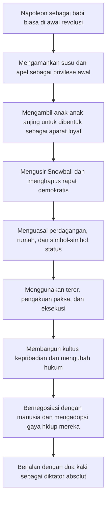
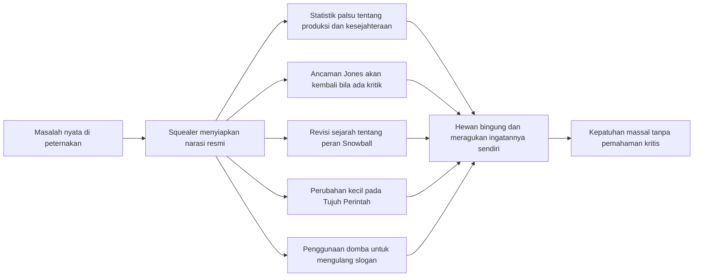
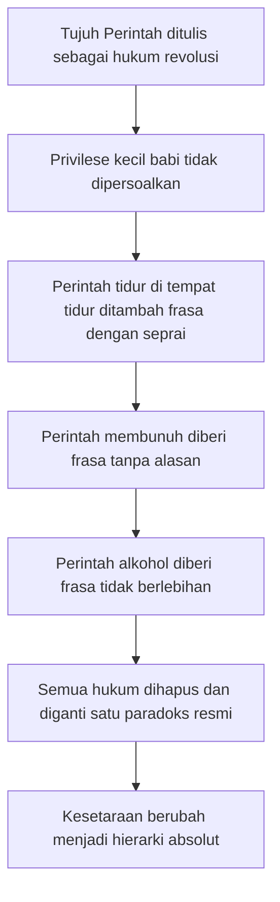
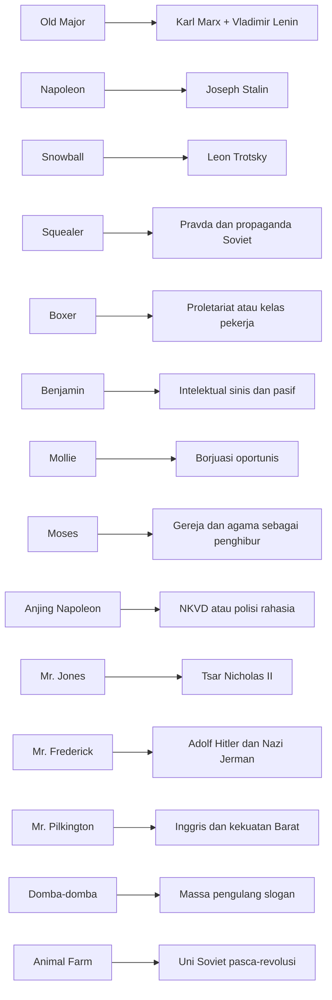
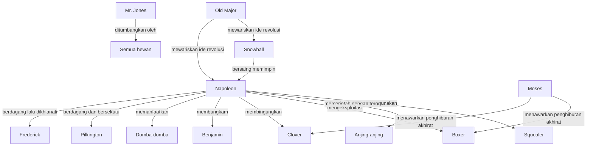

<Callout type="important" title="🐖 Cara Membaca Artikel Ini">
Artikel ini sengaja ditulis sebagai esai ensiklopedis yang panjang, mendalam, dan berlapis. Mas Hendra bisa membacanya dari awal sampai akhir, atau melompat ke bagian yang paling menarik: plot, alegori sejarah, propaganda, tragedi Boxer, atau relevansi modernnya 🙂.
</Callout>

# Animal Farm — Analisis Mendalam: Alegori Politik, Totalitarisme, dan Korupsi Kekuasaan

## Pengantar Singkat

*Animal Farm* (Peternakan Binatang) karya George Orwell adalah salah satu novel pendek paling tajam, paling padat, dan paling mematikan dalam seluruh sejarah sastra politik 😶. Secara permukaan, ia tampak seperti dongeng tentang hewan-hewan ternak yang memberontak terhadap tuannya yang lalim. Namun di balik kesederhanaan bentuk itu, Orwell menyusun sebuah **alegori** (kisah simbolik yang mewakili kenyataan politik, moral, atau sejarah) yang sangat presisi tentang Revolusi Rusia, bangkitnya Stalinisme, mekanisme propaganda negara, korupsi kekuasaan, penghancuran bahasa, dan pengkhianatan terhadap kelas pekerja.

Keagungan *Animal Farm* justru terletak pada ekonominya. Orwell tidak menulis novel tebal beratus-ratus halaman untuk menjelaskan bagaimana sebuah revolusi dirampok dari dalam. Ia hanya membutuhkan peternakan, beberapa babi, seekor kuda pekerja, beberapa domba yang mudah diarahkan, seekor gagak religius, dan sekumpulan anjing penjaga. Dengan alat yang tampak sederhana itu, ia memperlihatkan satu pola sejarah yang berulang terus-menerus: **kekuasaan yang awalnya berjanji membebaskan, pelan-pelan menciptakan bahasa baru untuk menindas**.

Artikel ini akan membedah *Animal Farm* secara sangat lengkap 📚: mulai dari konteks biografis Orwell, ringkasan rinci per bab, peta alegori tokoh, analisis tema-tema besar, pembacaan dramatis atas adegan kunci, paralel sejarah dengan Revolusi Rusia, perbandingan dengan *1984*, hingga relevansinya di era media sosial, disinformasi, dan populisme digital modern. Setiap istilah asing akan diberi penjelasan, dan setiap bagian akan dikembangkan sedalam mungkin agar artikel ini tidak berhenti sebagai rangkuman, melainkan menjadi panduan baca yang utuh.

---

## 1. Pengantar — George Orwell dan Konteks Kelahiran *Animal Farm*

### 1.1 George Orwell: Eric Arthur Blair, Penulis yang Tidak Mau Berdamai dengan Kebohongan

George Orwell adalah nama pena dari **Eric Arthur Blair**, lahir pada 25 Juni 1903 di Motihari, Bihar, India Britania. Ia lahir dalam lingkungan imperial Inggris, tetapi hidupnya justru berkembang menjadi kritik keras terhadap imperium, kelas sosial, kemiskinan, penindasan, dan totalitarianisme (sistem kekuasaan yang berupaya menguasai seluruh ranah hidup warga negara) 😌. Orwell bukan intelektual menara gading yang hanya memproduksi teori. Ia adalah penulis yang tubuhnya sendiri melewati pengalaman kelas, perang, pengasingan, sensor, dan kekecewaan ideologis.

Masa mudanya memperlihatkan lintasan yang menarik. Ia menempuh pendidikan di Eton, institusi elite Inggris, tetapi kemudian bekerja di Burma sebagai polisi kolonial. Pengalaman ini kelak membentuk kritik mendalamnya terhadap kolonialisme. Ia lalu hidup dalam kemiskinan sukarela, bekerja serabutan, mengamati dunia kaum miskin, dan menulis *Down and Out in Paris and London* (Hidup Melarat di Paris dan London), sebuah karya yang memperlihatkan empatinya terhadap kaum tersisih.

Namun pengalaman yang paling menentukan bagi lahirnya *Animal Farm* adalah **Perang Saudara Spanyol** (*Spanish Civil War* — perang saudara di Spanyol pada 1936–1939) 🇪🇸. Orwell pergi ke Spanyol bukan sekadar sebagai wartawan, melainkan sebagai sukarelawan anti-fasis. Ia bergabung dengan milisi POUM (*Partido Obrero de Unificación Marxista* — partai sosialis anti-Stalinis). Di medan inilah ia menyaksikan sesuatu yang mengubah pandangannya untuk selamanya: kaum kiri yang seharusnya bersatu melawan fasisme justru saling menghancurkan, terutama karena campur tangan Soviet Stalinis yang memburu, memfitnah, dan menyingkirkan kelompok-kelompok kiri non-Stalinis.

Orwell terluka oleh tembakan di leher, tetapi yang lebih dalam adalah luka intelektual dan moralnya. Ia melihat bagaimana **propaganda** (upaya sistematis membentuk persepsi dan perilaku massa) bisa membalikkan fakta. Orang yang kemarin sekutu revolusioner hari ini diumumkan sebagai pengkhianat. Koran-koran resmi menyusun realitas alternatif. Kebohongan bukan lagi kecelakaan, melainkan alat administrasi kekuasaan. Dari pengalaman inilah lahir tekad Orwell untuk melawan bukan hanya fasisme, tetapi juga kebusukan Stalinisme.

### 1.2 Orwell sebagai Sosialis Anti-Stalinis

Penting ditekankan: Orwell **bukan** reaksioner anti-sosialis. Ia justru seorang **sosialis demokratik** (sosialis yang memegang kebebasan sipil, anti-diktator, dan menolak teror negara). Kemarahannya kepada Uni Soviet era Stalin muncul karena ia melihat Stalinisme sebagai pengkhianatan terhadap cita-cita sosialisme itu sendiri 😠. Bagi Orwell, sosialisme seharusnya berarti keadilan ekonomi, martabat pekerja, distribusi yang lebih setara, dan berakhirnya eksploitasi manusia atas manusia. Tetapi di bawah Stalin, sosialisme berubah menjadi birokrasi represif, polisi rahasia, kultus pemimpin, pembersihan politik, dan fabrikasi kebenaran.

Di sinilah *Animal Farm* mendapatkan energinya. Novel ini bukan serangan terhadap mimpi masyarakat adil, melainkan ratapan pahit atas bagaimana mimpi itu dibajak oleh elit baru. Old Major tidak salah karena bermimpi tentang dunia tanpa eksploitasi. Yang salah adalah bagaimana impian itu dimonopoli oleh Napoleon dan diubah menjadi alat dominasi.

### 1.3 Mengapa Orwell Menulis *Animal Farm*

Orwell menulis *Animal Farm* sebagai respons atas kemarahan moral yang sangat spesifik: **Stalinisme telah berhasil menipu begitu banyak intelektual Barat**. Pada masa Perang Dunia II, Uni Soviet adalah sekutu Inggris dan Amerika melawan Nazi Jerman. Karena konteks geopolitik ini, banyak kalangan di Barat enggan mengkritik Stalin secara terbuka. Mengkritik Uni Soviet dianggap mengganggu persatuan anti-Hitler. Akibatnya, banyak kekejaman Stalin direlativisasi, dibungkus, atau dibenarkan.

Orwell muak terhadap kompromi semacam itu. Ia ingin menulis buku yang bisa dibaca luas, tidak kaku seperti traktat teori, tetapi sanggup menyingkap struktur kebohongan politik. Ia memilih bentuk **fabel satiris** (cerita simbolik bernada sindiran) karena bentuk itu memungkinkan kritik yang tajam sekaligus mudah diingat 🐴🐷🐑. Dalam fabel, hewan dapat memerankan kelas, ideologi, institusi, dan tokoh sejarah tanpa kehilangan daya dramatiknya.

### 1.4 Proses Penerbitan: Ditolak karena Politik

Salah satu ironi sejarah *Animal Farm* adalah fakta bahwa buku ini sendiri mengalami semacam sensor tidak resmi. Orwell menyelesaikan naskahnya pada 1944, tetapi sejumlah penerbit Inggris menolak menerbitkannya. Alasannya bukan terutama sastra, melainkan politik. Mereka khawatir buku yang menyerang alegori Stalin akan dianggap tidak pantas ketika Uni Soviet masih menjadi sekutu perang 🧨.

Bahkan ada penerbit yang menarik diri setelah konsultasi politis. Salah satu episode paling terkenal adalah penolakan dari Faber & Faber, meskipun T. S. Eliot mengakui kualitas tulisannya. Kekhawatiran utamanya tetap sama: buku itu terlalu sensitif secara geopolitik. Fakta ini sangat penting, sebab ia memperlihatkan bahwa propaganda tidak selalu hadir dalam bentuk polisi yang memukul atau sensor negara yang vulgar. Terkadang ia hadir sebagai **iklim ketakutan intelektual**, saat orang memilih diam demi kepantasan strategis.

### 1.5 Terbit pada 1945 dan Dampak Globalnya

Akhirnya *Animal Farm* terbit pada 17 Agustus 1945, tepat ketika Perang Dunia II berakhir. Momentum ini sangat kuat. Dunia baru saja menyaksikan runtuhnya fasisme, tetapi perlahan memasuki fase baru: Perang Dingin. Dalam konteks ini, *Animal Farm* meledak sebagai teks penting karena ia memberikan bahasa sastra yang ringkas untuk memahami pengkhianatan revolusi dan kebohongan negara.

Sejak terbit, novel ini masuk ke kanon sastra dunia 🌍. Ia dibaca di sekolah, universitas, forum politik, dan diskusi filsafat. Kalimat-kalimatnya menjadi idiom umum, terutama: **“All animals are equal, but some animals are more equal than others.”** Kalimat ini bukan sekadar kutipan terkenal, melainkan formula universal untuk menyebut kemunafikan kekuasaan yang berbicara atas nama kesetaraan sambil memproduksi hierarki baru.

<Callout type="important" title="⚠️ Mengapa *Animal Farm* Dianggap Berbahaya oleh Rezim Komunis?">
Karena novel ini merusak legitimasi simbolik mereka dari dalam. Orwell tidak menyerang dengan propaganda tandingan yang kasar, melainkan dengan cermin. Ia memperlihatkan bahwa rezim yang lahir atas nama rakyat bisa menjadi predator baru. Bagi rezim komunis yang bertumpu pada mitos revolusi suci, buku seperti ini sangat berbahaya: ia mengajarkan rakyat membaca selisih antara slogan dan kenyataan.
</Callout>

<Callout type="tip" title="🧭 Kunci Membaca Orwell">
Jangan baca *Animal Farm* hanya sebagai kisah “komunisme jahat”. Baca ia sebagai studi tentang bagaimana setiap ideologi—kiri, kanan, agama, nasionalisme, bahkan demokrasi—bisa membusuk jika bahasa, sejarah, dan kekuasaan dimonopoli segelintir elit.
</Callout>

---

## 2. Ringkasan Plot Lengkap Per Bab (10 Bab)

### 2.1 Bab 1 — Pidato Old Major, “Beasts of England”, dan Visi Revolusi

Novel dibuka dengan suasana malam di Manor Farm. Mr. Jones, pemilik peternakan, pulang dalam keadaan mabuk. Detail pembuka ini penting karena Orwell langsung menandai rezim lama sebagai rezim yang lalai, mabuk, boros, dan kehilangan legitimasi. Setelah lampu padam, seluruh hewan berkumpul di lumbung besar untuk mendengarkan Old Major, seekor babi tua yang dihormati karena kebijaksanaannya.

Old Major menyampaikan pidato revolusioner yang menjadi fondasi moral seluruh kisah. Ia menjelaskan bahwa hidup hewan adalah hidup yang “miserable, laborious, and short” (menyedihkan, penuh kerja paksa, dan singkat). Penyebabnya bukan alam, melainkan manusia. Manusia adalah makhluk yang “consumes without producing” (mengonsumsi tanpa menghasilkan) 😠. Dengan kata lain, Old Major menamai musuh utama: sistem eksploitasi.

Pidato ini bukan hanya keluhan ekonomi, tetapi perumusan kesadaran kelas. Ia mengajarkan bahwa penderitaan bukan takdir alamiah. Susu sapi, telur ayam, tenaga kuda, dan hidup seluruh hewan dirampas oleh manusia. Maka solusi yang ia tawarkan adalah pemberontakan, meski ia tidak tahu kapan revolusi itu datang. Yang penting, generasi mendatang harus mewarisi semangat perlawanan.

Di akhir pidato, Old Major memperkenalkan lagu **“Beasts of England”** (Binatang Inggris), sebuah lagu yang menggambarkan masa depan utopis ketika cincin di hidung, cambuk, dan rantai sudah lenyap. Lagu ini menjadi momen emosional yang sangat penting. Ia berfungsi seperti himne revolusi: menyatukan hewan bukan hanya lewat argumen, tetapi lewat imajinasi bersama.

<Callout type="quote" title="🐖 Kutipan Kunci Bab 1">
**“Man is the only real enemy we have.”**  
**“Manusia adalah satu-satunya musuh sejati yang kita miliki.”**
</Callout>

Bab pertama menyiapkan struktur besar novel: ada penindasan lama, ada kesadaran revolusioner, ada lagu utopia, dan ada janji persaudaraan. Namun justru karena fondasinya begitu murni, pembusukan yang akan datang terasa jauh lebih tragis.

### 2.2 Bab 2 — Kematian Old Major, Animalisme, Pemberontakan, dan Tujuh Perintah

Tiga malam setelah pidatonya, Old Major mati. Tetapi gagasannya tidak ikut mati. Dua babi muda yang paling cerdas—Snowball dan Napoleon—mengembangkan ajarannya menjadi sistem pemikiran yang disebut **Animalism** (Animalisme, ideologi politik hewan berdasarkan anti-manusia dan persamaan sesama hewan). Mereka menyebarkan doktrin ini ke hewan-hewan lain, meski menghadapi resistensi dari Mollie yang manja dan Moses si gagak yang gemar bercerita tentang Sugarcandy Mountain (Gunung Permen Gula, surga imajiner bagi hewan).

Pemberontakan datang lebih cepat dari perkiraan. Mr. Jones dan para pekerjanya lalai memberi makan hewan. Lapar memicu ledakan. Hewan-hewan menerobos gudang, manusia memukuli mereka, dan di situlah pemberontakan spontan terjadi. Dengan kekuatan kolektif, hewan-hewan mengusir Jones dari peternakan. Kemenangan ini terasa euphoric (penuh euforia) 😊: mereka merusak alat-alat penindasan, membakar perlengkapan kekangan, dan mengganti nama Manor Farm menjadi **Animal Farm**.

Setelah itu, Snowball menuliskan **Tujuh Perintah** Animalisme di dinding lumbung. Perintah-perintah ini menjadi konstitusi moral revolusi:

1. Whatever goes upon two legs is an enemy.  
2. Whatever goes upon four legs, or has wings, is a friend.  
3. No animal shall wear clothes.  
4. No animal shall sleep in a bed.  
5. No animal shall drink alcohol.  
6. No animal shall kill any other animal.  
7. All animals are equal.

Momen ini adalah salah satu titik paling idealistis dalam novel. Revolusi baru dimulai, kesetaraan masih terasa mungkin, dan hukum masih tampak jernih. Tetapi Orwell menanam benih kecurigaan ketika susu sapi yang baru diperah tiba-tiba “menghilang” 🥛. Pada saat itu, hewan lain belum memahami bahwa korupsi besar sering lahir dari pengecualian kecil yang tidak dipersoalkan.

### 2.3 Bab 3 — Panen Pertama, Kesadaran Kelas, Boxer, dan Anak Anjing Napoleon

Bab ketiga memperlihatkan masa madu revolusi. Panen pertama berlangsung lebih efisien daripada era Jones. Hewan merasa bekerja untuk dirinya sendiri, bukan untuk tuan yang mencuri hasil kerja mereka. Ada semangat kolektif, ada martabat baru, dan ada rasa memiliki.

Setiap hewan mengambil peran menurut kemampuannya. Snowball dan Napoleon mengarahkan, babi-babi mengawasi karena dianggap paling cerdas, Boxer bekerja dengan kekuatan yang luar biasa, dan Clover menjadi sosok keibuan yang stabil. Boxer memperkenalkan mottonya yang terkenal: **“I will work harder”** (Aku akan bekerja lebih keras). Pada tahap ini, slogan itu tampak mulia. Namun kelak, justru itulah bentuk kepatuhan tragis yang paling dieksploitasi rezim.

Snowball juga mendorong berbagai komite pendidikan dan program literasi. Ia percaya revolusi harus memperluas kesadaran. Beberapa hewan berhasil belajar membaca, sebagian lain hanya menghafal huruf-huruf dasar. Benjamin, sang keledai, ternyata bisa membaca baik, tetapi nyaris tidak pernah memanfaatkan kemampuannya. Di sini Orwell mulai menanam figur intelektual sinis yang tahu banyak, tetapi enggan bertindak.

Sementara itu, Napoleon melakukan sesuatu yang tampak kecil namun sangat penting: ia mengambil anak-anak anjing Jessie dan Bluebell untuk “dididik” sendiri. Hewan lain nyaris tidak mempertanyakannya. Ini adalah salah satu adegan paling penting secara politis. Diktator jarang merebut kekuasaan sekaligus; mereka biasanya lebih dulu merebut **aparatus kekerasan** (alat koersif negara) secara diam-diam 🐕.

Di akhir bab, kita mengetahui bahwa susu dan apel disediakan khusus untuk babi. Squealer menjelaskan bahwa itu bukan privilese, melainkan kebutuhan ilmiah karena babi bekerja secara intelektual. Ia bahkan menakut-nakuti hewan lain dengan ancaman: jika babi gagal menjaga kepemimpinan, Jones akan kembali. Inilah bentuk awal propaganda—penggunaan rasa takut untuk membenarkan ketimpangan.

### 2.4 Bab 4 — *Battle of the Cowshed* (Pertempuran Kandang Sapi)

Kabar tentang pemberontakan Animal Farm menyebar ke peternakan lain. Jones, didukung beberapa manusia lain, mencoba merebut kembali peternakannya. Snowball menyusun strategi pertahanan dengan membaca buku taktik perang tua Julius Caesar. Ini penting karena Snowball digambarkan sebagai organisator dan pemikir revolusi yang aktif.

Dalam pertempuran yang disebut **Battle of the Cowshed** (Pertempuran Kandang Sapi), hewan-hewan berhasil memukul mundur para penyerang. Snowball bertempur dengan berani dan terluka. Boxer, tanpa sengaja, tampaknya membunuh seorang anak kandang dan sangat terguncang oleh kemungkinan itu. Detail ini menunjukkan bahwa Boxer masih memiliki hati nurani; ia bekerja keras, tetapi bukan makhluk yang haus kekerasan.

Kemenangan ini memperkuat legitimasi rezim baru 🎖️. Snowball dan Boxer diberi penghargaan “Animal Hero, First Class” (Pahlawan Hewan Kelas Satu). Senapan milik Jones ditempatkan sebagai simbol kemenangan dan akan ditembakkan dua kali setahun untuk memperingati pemberontakan dan pertempuran.

Secara alegoris, bab ini meniru fase awal revolusi yang harus mempertahankan diri dari kontra-revolusi. Tetapi Orwell juga menanam hal yang lebih halus: memori perang kelak akan menjadi alat propaganda. Ketika sejarah dikendalikan, siapa yang pernah disebut pahlawan bisa sewaktu-waktu diumumkan sebagai pengkhianat.

### 2.5 Bab 5 — Persaingan Snowball vs Napoleon, Kincir Angin, dan Pengusiran Snowball

Bab kelima adalah titik balik besar novel ⚡. Persaingan antara Snowball dan Napoleon menjadi semakin tajam. Snowball aktif membentuk komite, merancang pendidikan, dan terutama mengusulkan pembangunan **windmill** (kincir angin) untuk menghasilkan listrik dan memodernisasi pertanian. Bagi Snowball, teknologi adalah jalan pembebasan tenaga kerja. Hewan akan bekerja lebih sedikit dan hidup lebih nyaman.

Napoleon menentang rencana itu, bukan karena punya argumen yang lebih baik, tetapi karena ia melihat ancaman terhadap dominasinya. Ketika rapat besar digelar dan Snowball hampir meyakinkan seluruh hewan, Napoleon tiba-tiba mengeluarkan suara aneh. Sembilan anjing besar—anak anjing yang dulu ia ambil—menyerbu lumbung dan mengejar Snowball hingga kabur dari peternakan.

Adegan ini adalah **kudeta diam-diam**. Tidak ada debat lagi, tidak ada pemungutan suara, tidak ada prosedur. Kekuasaan berpindah ke tangan Napoleon melalui monopoli kekerasan. Setelah itu, ia mengumumkan bahwa rapat mingguan dihapuskan. Semua keputusan akan ditentukan oleh komite babi di bawah kepemimpinannya.

Ironi besar terjadi segera: beberapa waktu kemudian Napoleon menyatakan bahwa kincir angin justru akan dibangun. Squealer menjelaskan bahwa ide itu sebenarnya milik Napoleon sejak awal, dan penolakan sebelumnya hanyalah taktik. Di sini Orwell menunjukkan bagaimana totalitarianisme bekerja: **fakta tidak perlu konsisten; yang penting adalah massa dipaksa menerima versi terbaru sejarah** 😵.

<Callout type="important" title="🐕 Momen Penentu: Pengusiran Snowball">
Inilah saat revolusi berhenti menjadi proyek kolektif dan berubah menjadi proyek personal kekuasaan. Setelah Snowball terusir, tidak ada lagi oposisi yang sah. Yang tersisa hanyalah kepatuhan, rasa takut, dan sejarah yang bisa ditulis ulang.
</Callout>

### 2.6 Bab 6 — Pembangunan Kincir Angin, Perdagangan dengan Manusia, Babi Pindah ke Rumah, dan Perintah Dimanipulasi

Hewan-hewan bekerja lebih keras dari sebelumnya untuk membangun kincir angin. Boxer menjadi motor tenaga moral dan fisik proyek ini. Ia bangun lebih pagi, menarik batu besar, dan mengulang mottonya. Namun realitas ekonomi mulai berubah. Animal Farm mulai berdagang dengan manusia, meskipun dahulu hubungan dengan manusia dilarang secara moral.

Napoleon, melalui perantara manusia bernama Mr. Whymper, menjual hasil pertanian dan membeli kebutuhan tertentu. Hewan terkejut, sebab mereka yakin revolusi menolak perdagangan dan uang. Tetapi sekali lagi, Squealer menyatakan bahwa larangan semacam itu “tak pernah ada”. Ini penting: propaganda bukan selalu mengubah dokumen; kadang ia cukup mengaburkan ingatan kolektif.

Puncak kemunduran moral bab ini adalah ketika babi pindah ke rumah pertanian dan tidur di tempat tidur. Clover merasa ada yang salah dan memeriksa Tujuh Perintah. Ternyata perintah keempat kini berbunyi: **“No animal shall sleep in a bed with sheets.”** Tambahan dua kata—*with sheets* (dengan seprai)—mengubah seluruh makna hukum 😑. Di sinilah Orwell menunjukkan bahwa keruntuhan besar kadang terjadi lewat revisi kecil yang tampak sepele.

Ketika badai menghancurkan kincir angin, Napoleon tidak menyalahkan cuaca atau kelemahan konstruksi. Ia menuduh Snowball sebagai sabotir. Maka musuh eksternal dibangun untuk menjelaskan kegagalan internal.

### 2.7 Bab 7 — Kelaparan, Pengakuan Paksa, Eksekusi Massal, dan Larangan “Beasts of England”

Bab ketujuh adalah fase tergelap novel ☠️. Musim dingin keras, persediaan makanan menipis, dan terjadi kelaparan. Untuk menipu dunia luar, Napoleon memerintahkan agar gudang makanan ditata sedemikian rupa sehingga tampak penuh. Ini adalah teater statistik: kenyataan buruk ditutupi oleh citra.

Ayam-ayam memberontak ketika Napoleon memerintahkan telur mereka diserahkan untuk dijual. Mereka menghancurkan telurnya sendiri sebagai bentuk perlawanan. Napoleon menanggapi dengan represif: ransum mereka dipotong, dan beberapa ayam mati. Ini paralel yang jelas dengan kebijakan kolektivisasi paksa dan penghancuran petani.

Snowball terus digunakan sebagai kambing hitam universal. Setiap kesalahan, kehilangan, dan kegagalan disebut hasil sabotasenya. Lalu datang salah satu adegan paling mengerikan dalam novel: serangkaian **pengakuan paksa** (forced confessions) dan **eksekusi massal**. Hewan-hewan mengaku bersekongkol dengan Snowball—entah benar atau tidak—dan anjing-anjing Napoleon langsung merobek tenggorokan mereka.

Adegan ini menghancurkan jiwa revolusi. Setelah pembunuhan massal itu, hewan-hewan berkumpul dalam duka. Clover merasa ada yang sangat salah, meski ia tak bisa merumuskannya secara teoritis. Mereka menyanyikan “Beasts of England”, tetapi lagu itu segera dilarang. Sebagai gantinya, rezim memperkenalkan lagu pujian baru untuk Animal Farm di bawah Napoleon.

Larangan ini sangat penting. Lagu revolusi dihapus tepat setelah teror besar pertama. Maknanya jelas: **rezim tidak ingin rakyat mengingat cita-cita asli yang bisa dipakai untuk menilai pengkhianatan masa kini**.

### 2.8 Bab 8 — Penjualan Kayu, Uang Palsu, *Battle of the Windmill*, dan Kehancuran

Bab kedelapan memperlihatkan rezim Napoleon makin mabuk simbol. Gelarnya diperpanjang, puisi pemujaan ditulis, potret dan slogan dipasang, dan seluruh peternakan hidup dalam atmosfer kultus kepribadian (pemujaan berlebihan terhadap pemimpin). Di dinding, satu perintah lagi berubah: **“No animal shall kill any other animal without cause.”** Frasa *without cause* (tanpa alasan) melegitimasi teror yang sudah terjadi.

Napoleon kemudian bermain diplomasi dengan dua peternak manusia: Pilkington dan Frederick. Akhirnya ia menjual tumpukan kayu kepada Frederick dari Pinchfield. Ternyata uang yang diterima adalah uang palsu 💸. Segera setelah penipuan itu terungkap, Frederick dan anak buahnya menyerang Animal Farm.

Terjadilah **Battle of the Windmill** (Pertempuran Kincir Angin). Hewan-hewan bertarung dengan heroik, tetapi Frederick meledakkan kincir angin dengan bahan peledak. Ini menjadi salah satu puncak emosional novel karena proyek yang dibangun dengan begitu banyak kerja paksa hancur dalam satu ledakan. Kemenangan militer mereka terasa pahit karena harga yang dibayar begitu besar.

Malam harinya, babi mabuk setelah menemukan wiski. Beberapa waktu kemudian, perintah kelima berubah menjadi: **“No animal shall drink alcohol to excess.”** Lagi-lagi hukum tidak dibatalkan, melainkan ditekuk agar pas dengan pelanggaran penguasa.

### 2.9 Bab 9 — Boxer Runtuh, Dijual ke Tukang Jagal, dan Kebohongan Terbesar Squealer

Bab kesembilan adalah tragedi kelas pekerja dalam bentuk paling telanjang 😢. Boxer, yang selama ini menjadi tulang punggung peternakan, jatuh sakit setelah paru-parunya dan tenaganya hancur akibat kerja berlebihan. Ia masih bermimpi pensiun damai di padang kecil, membaca lebih baik, dan menikmati sisa umur. Tapi pembaca sudah merasakan bahwa rezim seperti ini tidak mengenal rasa terima kasih.

Napoleon mengumumkan bahwa Boxer akan dibawa ke rumah sakit hewan. Ketika kendaraan datang, Benjamin—yang biasanya sinis dan pasif—tiba-tiba membaca tulisan pada sisi van. Itu ternyata milik **tukang jagal kuda**. Benjamin berteriak putus asa, hewan-hewan berusaha menyelamatkan Boxer, tetapi terlambat. Boxer terlalu lemah untuk menendang keluar.

Ini adalah salah satu adegan paling memilukan dalam seluruh sastra modern. Kuda yang menghabiskan hidupnya untuk revolusi dijual seperti barang rongsokan. Setelah itu, Squealer menyebarkan kebohongan bahwa van itu dulu milik tukang jagal tetapi sekarang dipakai dokter hewan. Ia mengklaim Boxer mati dengan damai sambil memuji Napoleon.

Dana dari penjualan Boxer lalu dipakai untuk membeli wiski. Tidak ada simbol yang lebih kejam dari ini 🍷: tubuh buruh ditukar menjadi minuman bagi elit.

<Callout type="important" title="💔 Momen Paling Pahit: Boxer Dijual">
Di sinilah Orwell menghancurkan semua romantisme kosong tentang kesetiaan rakyat kepada rezim. Bagi kekuasaan yang korup, loyalitas proletariat hanya berguna selama masih produktif. Begitu tubuh pekerja habis, yang tersisa hanyalah nilai tukarnya.
</Callout>

### 2.10 Bab 10 — Tahun-Tahun Berlalu, Dua Kaki, dan Kesetaraan yang Dibalikkan

Bab terakhir bergerak cepat melintasi waktu. Banyak hewan lama mati, generasi baru lahir, dan nyaris tak ada yang ingat masa sebelum revolusi. Ini penting: kekuasaan totaliter sangat diuntungkan oleh pendeknya memori kolektif. Kalau saksi-saksi mati, kebohongan lebih mudah menjadi sejarah resmi.

Peternakan tampak makmur dalam ukuran tertentu, tetapi kemakmuran itu tidak dibagi rata. Babi dan anjing hidup nyaman, sementara hewan lain tetap bekerja keras dengan jatah terbatas. Lalu datang klimaks simbolis: babi mulai berjalan dengan dua kaki 🚶‍♂️🐷. Domba, yang dulu menghafal “Four legs good, two legs bad”, sekarang dilatih meneriakkan: **“Four legs good, two legs better.”**

Ketika hewan-hewan memeriksa dinding lumbung, Tujuh Perintah telah lenyap. Yang tersisa hanya satu kalimat: **“All animals are equal, but some animals are more equal than others.”** Ini adalah salah satu paradoks politik paling terkenal dalam sejarah sastra. Bahasa dipaksa mengucapkan kontradiksi, dan karena kekuasaan memegang otoritas, kontradiksi itu diperlakukan sebagai kebenaran resmi.

Novel berakhir dengan adegan babi dan manusia duduk bersama bermain kartu, minum, dan berdebat. Hewan-hewan di luar jendela memandang dari babi ke manusia, lalu dari manusia ke babi, dan tak bisa lagi membedakan mana yang mana. Inilah penutup yang sempurna dan mengerikan: revolusi yang bertujuan menghapus penindas berakhir dengan melahirkan penindas baru yang identik dengan yang lama.

<Callout type="quote" title="🐷 Kutipan Penutup yang Abadi">
**“The creatures outside looked from pig to man, and from man to pig, and from pig to man again; but already it was impossible to say which was which**“Makhluk-makhluk di luar memandang dari babi ke manusia, dan dari manusia ke babi, lalu dari babi ke manusia lagi; tetapi kini mustahil mengatakan siapa yang mana.”**
</Callout>

---

## 3. Alegori Politik — Pemetaan Karakter ke Tokoh Sejarah

### 3.1 Mengapa *Animal Farm* Disebut Alegori Politik yang Nyaris Sempurna?

Salah satu kejeniusan Orwell adalah presisi alegorinya. Ia tidak menulis simbolisme kabur yang bisa ditafsirkan seenaknya. Hampir setiap karakter, peristiwa, dan institusi di peternakan memiliki rujukan historis yang cukup jelas 🧠. Namun kekuatan novel ini bukan sekadar “siapa mewakili siapa”, melainkan bagaimana Orwell memperlihatkan mekanisme sejarah dalam bentuk yang mudah dipahami.

### Tabel 1 — Alegori Lengkap *Animal Farm*

| Unsur dalam *Animal Farm* | Representasi Historis / Politik | Penjelasan Singkat |
|---|---|---|
| Manor Farm | Rusia Tsar / tatanan lama feodal-kapitalistik | Dunia lama yang timpang, lalai, dan eksploitatif |
| Animal Farm | Uni Soviet pasca-revolusi | Negara revolusioner yang lahir dari janji kesetaraan |
| Mr. Jones | Tsar Nicholas II | Penguasa lama yang lemah, korup, dan kehilangan legitimasi |
| Old Major | Karl Marx + Vladimir Lenin | Sumber ideologi revolusi dan visi pembebasan |
| Napoleon | Joseph Stalin | Birokrat tiranik, licik, represif, pembangun kultus pribadi |
| Snowball | Leon Trotsky | Intelektual revolusioner, organisator, lalu dibuang |
| Squealer | Pravda / propaganda Soviet | Mesin bahasa yang membenarkan semua kebijakan rezim |
| Boxer | Proletariat / kelas pekerja | Buruh jujur, kuat, loyal, tapi dieksploitasi |
| Clover | Rakyat biasa yang bermoral | Hati nurani kolektif yang merasakan pengkhianatan |
| Benjamin | Intelektual sinis / pasif | Tahu banyak, tetapi tak bergerak sampai terlambat |
| Mollie | Borjuasi / elite lama yang oportunis | Menolak pengorbanan revolusi demi kenyamanan pribadi |
| Moses | Gereja / agama sebagai penghibur | Janji surga yang meredakan penderitaan dunia kini |
| Anjing-anjing Napoleon | NKVD / KGB / polisi rahasia Stalin | Alat teror dan penegak kepatuhan |
| Domba-domba | Massa yang mudah dimobilisasi | Pengulang slogan, bukan pengolah pikiran |
| Mr. Pilkington | Inggris / kelas penguasa Barat | Kekuatan eksternal yang pragmatis |
| Mr. Frederick | Hitler / Nazi Jerman | Mitra oportunis yang akhirnya mengkhianati |
| Battle of the Cowshed | Perang Saudara Rusia / serangan kontra-revolusi | Fase pertahanan awal rezim baru |
| Windmill | Industrialisasi Soviet / program modernisasi | Proyek besar yang dibungkus retorika kemajuan |
| Purges / eksekusi | Great Purge 1936–1938 | Pembersihan politik dan pengakuan paksa |
| Penjualan kayu & uang palsu | Pakta Molotov-Ribbentrop & pengkhianatan Nazi | Diplomasi oportunis yang berujung bencana |

### 3.2 Manor Farm → Rusia Tsar / Tatanan Lama yang Busuk

Manor Farm mula-mula melambangkan Rusia di bawah Tsar Nicholas II, tetapi juga lebih luas: sebuah tatanan lama yang memadukan feodalisme, kapitalisme agraris, dan otoritas paternalistik. Mr. Jones bukan monster yang sangat cerdas. Justru kelemahannya adalah kelalaian, kebiasaan mabuk, dan ketidakmampuan mengelola krisis. Orwell tampaknya ingin menunjukkan bahwa rezim lama sering jatuh bukan hanya karena kejahatannya, tetapi karena **ketidakmampuannya mempertahankan legitimasi**.

### 3.3 Animal Farm → Uni Soviet Pasca-Revolusi

Begitu pemberontakan berhasil, Animal Farm menjadi alegori Uni Soviet setelah Revolusi 1917. Pada awalnya, ada semangat egalitarian (persamaan hak) yang kuat. Properti pribadi manusia dihancurkan, alat represi lama dibakar, dan hukum baru diumumkan. Tetapi struktur negara baru itu perlahan menunjukkan pola yang akrab: elit partai, birokrasi, polisi rahasia, propaganda, pemimpin tunggal, dan rakyat yang terus disuruh berkorban demi masa depan.

### 3.4 Mr. Jones → Tsar Nicholas II

Jones merepresentasikan Tsar Nicholas II: penguasa lama yang gagal membaca krisis, boros, tidak efektif, dan kehilangan hubungan dengan rakyat. Ia bukan tokoh yang kompleks; ia adalah simbol dari orde lama yang layak digulingkan. Orwell sengaja membuat pemberontakan terhadap Jones terasa masuk akal, sehingga pembaca tidak bisa menyederhanakan novel ini menjadi “sebelum revolusi semuanya baik-baik saja.” Tidak. Masalahnya adalah bahwa penggulingan penindas lama tidak otomatis mencegah lahirnya penindas baru.

### 3.5 Old Major → Karl Marx + Vladimir Lenin

Old Major adalah gabungan Marx dan Lenin. Dari Marx, ia mewarisi fungsi sebagai **teoretikus revolusi**: orang yang menjelaskan bahwa penderitaan punya struktur dan musuh objektif. Dari Lenin, ia mewarisi posisi sebagai figur awal revolusi yang wafat sebelum rezim baru sepenuhnya terbentuk.

Pidato Old Major mirip manifesto: ia mengidentifikasi eksploitasi, membangun kesadaran kolektif, dan menyalakan horizon utopis. Tetapi Orwell juga menunjukkan bahwa ide revolusi, sebaik apa pun, tidak memiliki imun terhadap pembusukan ketika pewarisnya merebut monopoli tafsir.

### 3.6 Napoleon → Joseph Stalin

Napoleon adalah poros utama alegori Stalin. Ia tidak menonjol karena oratorinya, melainkan karena kecakapan merebut aparatus kekuasaan. Ia tidak lebih visioner daripada Snowball, tetapi lebih licik, lebih sabar, dan lebih memahami bahwa **kontrol atas kekerasan lebih menentukan daripada kemenangan debat** 🔥.

Sebagaimana Stalin, Napoleon:

- menyingkirkan rival utama dari dalam revolusi,
- menghapus mekanisme deliberasi,
- membangun polisi rahasia,
- memanfaatkan pengakuan paksa,
- menulis ulang sejarah,
- mengkultuskan dirinya,
- mengklaim semua keberhasilan sebagai buah kebijakan pribadinya.

Napoleon sangat penting karena ia memperlihatkan bahwa tiran modern tidak selalu lahir sebagai pahlawan karismatik. Kadang ia lahir sebagai administrator yang dingin, oportunis, dan sangat piawai mengubah institusi menjadi senjata.

### 3.7 Snowball → Leon Trotsky

Snowball merepresentasikan Leon Trotsky, lawan utama Stalin setelah revolusi. Ia digambarkan intelektual, energik, cakap berpidato, dan percaya pada program modernisasi. Gagasannya tentang kincir angin paralel dengan visi industrialisasi dan pembangunan yang lebih terencana. Ia juga merupakan pahlawan perang dalam *Battle of the Cowshed*, sebagaimana Trotsky terkenal dalam pembentukan Tentara Merah.

Tetapi kecerdasan Snowball tidak cukup. Ia kalah bukan karena argumennya lemah, melainkan karena ia kehilangan kontrol atas alat kekerasan. Setelah diusir, seluruh sejarahnya direvisi. Ia dari pahlawan menjadi pengkhianat. Inilah salah satu pelajaran penting Orwell: dalam rezim totaliter, masa lalu bukan sesuatu yang tetap; ia adalah properti penguasa.

### 3.8 Squealer → Pravda / Propaganda Soviet

Squealer bukan sekadar juru bicara. Ia adalah personifikasi propaganda negara. Orwell memperkenalkannya sebagai babi kecil gemuk yang bisa “turn black into white” (membuat hitam tampak putih) 😶. Ini deskripsi yang sangat teliti. Propaganda modern bukan cuma penyebaran bohong kasar, tetapi seni retorika yang mampu mengaburkan batas fakta, emosi, rasa takut, dan kepentingan.

Squealer bekerja dengan beberapa teknik:

- **statistik palsu** untuk menunjukkan bahwa hidup selalu membaik,
- **fear-mongering** (menakut-nakuti) dengan ancaman Jones kembali,
- **revision of history** (revisi sejarah) agar Snowball tampak jahat sejak awal,
- **semantic softening** (pelembutan istilah) agar privilese babi tampak rasional,
- **gaslighting** (membuat massa meragukan ingatan sendiri).

### 3.9 Boxer → Kelas Pekerja / Proletariat

Boxer adalah jantung moral novel 🐴. Ia melambangkan proletariat: tenaga kerja yang jujur, kuat, setia, dan percaya bahwa pengorbanannya akan membangun dunia yang lebih baik. Tragedinya bukan keburukan karakter, melainkan justru kebaikannya. Ia terlalu baik untuk membayangkan bahwa pemimpin yang terus ia bela akan menjualnya.

Motto “I will work harder” dan “Napoleon is always right” adalah dua formula kepatuhan yang berbeda tetapi saling mengunci. Yang satu bersifat etos kerja; yang lain bersifat kultus otoritas. Keduanya membuat Boxer tak berdaya menghadapi manipulasi politik.

### 3.10 Benjamin → Kaum Sinis / Intelektual Pasif

Benjamin si keledai sering dibaca sebagai representasi intelektual skeptis yang memahami kenyataan tetapi menolak terlibat. Ia tidak mudah dibohongi, bisa membaca, dan sejak awal tampak tahu bahwa revolusi tidak otomatis membawa kebahagiaan. Masalahnya: **pengetahuan tanpa tindakan berubah menjadi impotensi moral**.

Ia baru pecah ketika Boxer dibawa pergi. Ledakan emosinya pada saat itu justru menegaskan kesalahan lamanya: kalau ia bersuara lebih awal, mungkinkah sesuatu berbeda? Orwell tampaknya tidak memberi jawaban pasti, tetapi kritiknya jelas.

### 3.11 Mollie → Borjuasi Oportunis

Mollie adalah kuda betina cantik yang mencintai gula dan pita. Ia tidak peduli pada revolusi kecuali sejauh revolusi memengaruhi kenyamanannya. Ketika mendengar bahwa pita dilarang, ia gelisah. Akhirnya ia pergi dan hidup nyaman di tempat lain. Ini alegori kaum borjuasi atau elite yang lebih memilih fasilitas dan simbol status daripada solidaritas sosial.

### 3.12 Moses si Gagak → Gereja / Agama sebagai Penghiburan

Moses bercerita tentang **Sugarcandy Mountain**, tempat hewan akan hidup bahagia setelah mati. Orwell jelas meminjam kritik Marx bahwa agama bisa menjadi “opium rakyat” (penghibur yang menenangkan penderitaan tanpa mengubah struktur penindasan). Tetapi Orwell tidak menggambarkan Moses secara sesederhana karikatur jahat. Justru menarik bahwa babi awalnya membenci Moses, lalu kemudian membiarkannya bercerita karena ia berguna menjaga hewan tetap pasrah.

### 3.13 Anjing-Anjing Napoleon → NKVD / KGB

Anjing-anjing yang dibesarkan Napoleon sejak kecil melambangkan polisi rahasia Soviet: NKVD, lalu simbolik juga KGB. Mereka adalah kekerasan yang dipersonalkan. Tidak ada due process (prosedur hukum yang adil), tidak ada pembelaan, hanya intimidasi, pengejaran, dan pembunuhan. Dalam sejarah politik modern, hampir semua rezim totaliter bertahan bukan hanya lewat ideologi, tetapi lewat aparat yang menakutkan.

### 3.14 Mr. Pilkington dan Mr. Frederick → Dunia Luar yang Pragmatis

Pilkington biasanya dibaca sebagai Inggris atau kekuatan liberal-kapitalis Barat yang cuek tetapi oportunis. Frederick merepresentasikan Hitler dan Nazi Jerman: agresif, licik, brutal, dan tidak dapat dipercaya. Hubungan Napoleon dengan Frederick, terutama penjualan kayu dan uang palsu, jelas meniru Pakta Molotov–Ribbentrop (pakta non-agresi Soviet-Nazi) yang pada akhirnya dikhianati oleh invasi Jerman.

### 3.15 Domba-Domba → Massa yang Mudah Dimobilisasi

Domba-domba mungkin tampak remeh, tetapi fungsi mereka sangat penting. Mereka adalah bentuk paling murni dari massa yang kehilangan kapasitas berpikir mandiri. Mereka tidak berdebat, tidak membaca, tidak menganalisis; mereka **mengulang slogan** 🐑. Dalam masyarakat modern, domba dapat berupa bot media sosial, kerumunan partisan, pasukan buzzer, atau warga yang lebih suka slogan daripada argumen.

<Callout type="info" title="📜 Frederick, Uang Palsu, dan Alegori Hitler–Stalin">
Perjanjian Napoleon dengan Frederick merujuk pada Pakta Molotov–Ribbentrop (1939), yakni kesepakatan non-agresi antara Uni Soviet dan Nazi Jerman. Uang palsu menandakan bahwa kerja sama oportunis antar-rezim otoriter sering berumur pendek dan berakhir dengan pengkhianatan brutal. Serangan Frederick ke Animal Farm adalah bayangan alegoris dari Operasi Barbarossa (1941), invasi Jerman ke Uni Soviet.
</Callout>

---

## 4. Analisis Tematik Mendalam

### 4A. Korupsi Kekuasaan (*Corruption of Power* — Pembusukan Kekuasaan)

Lord Acton menulis kalimat yang sangat terkenal: **“Power tends to corrupt, and absolute power corrupts absolutely.”** (Kekuasaan cenderung merusak, dan kekuasaan absolut merusak secara absolut.) *Animal Farm* adalah dramatiasi sastra yang luar biasa dari tesis ini.

Napoleon tidak langsung berubah menjadi tiran total. Ia bertahap. Pada awalnya, ia hanya menikmati susu dan apel. Lalu ia memonopoli pendidikan anak anjing. Setelah itu ia menghapus rapat. Lalu menguasai perdagangan. Lalu memindahkan pusat kuasa ke rumah manusia. Lalu menulis ulang hukum. Lalu membunuh lawan. Lalu meminum wiski. Lalu berjalan dengan dua kaki. Dalam urutan ini, Orwell menunjukkan bahwa totalitarianisme tidak selalu datang sebagai ledakan tunggal; sering ia datang sebagai **normalisasi bertahap atas pengecualian**.

Di sini, perbandingan dengan Nietzsche dan konsep **Wille zur Macht** (kehendak untuk berkuasa) menarik. Nietzsche sendiri bukan teoritikus diktator, tetapi Orwell memperlihatkan bahwa hasrat akan dominasi dapat menyusup ke dalam proyek yang awalnya egaliter. Napoleon bukan hanya ingin memimpin. Ia ingin menentukan kenyataan. Ia ingin agar masa lalu, hukum, moralitas, dan bahasa tunduk pada kebutuhannya.

Yang sangat cerdas dari Orwell adalah titik awal korupsinya: susu dan apel 🥛🍎. Ini bukan teror massal. Ini privilese kecil yang dibungkus argumen teknokratis. Pesannya jelas: tirani besar sering lahir dari ketimpangan kecil yang dianggap wajar karena “demi efisiensi”, “demi stabilitas”, atau “demi kepentingan umum”.

### Diagram 1 — Arc Kekuasaan Napoleon

### 4B. Manipulasi Bahasa dan Propaganda

Kalau inti *1984* adalah kontrol pikiran lewat bahasa, maka *Animal Farm* adalah laboratorium awal Orwell untuk gagasan itu. Tujuh Perintah terlihat sederhana, tetapi justru karena sederhana ia bisa dihafal, dipatuhi, dan dimanipulasi. Ketika perintah berubah sedikit demi sedikit, hewan-hewan kehilangan pegangan moral. Mereka tahu ada sesuatu yang salah, tetapi tak mampu membuktikan karena teks resmi sudah diubah.

Squealer adalah kunci dari proses ini. Ia menggunakan teknik propaganda klasik:

1. **Statistik palsu** — hidup disebut membaik walau hewan lapar.  
2. **Fear-mongering** (menakut-nakuti) — setiap keraguan disamakan dengan ancaman kembalinya Jones.  
3. **Revision history** (revisi sejarah) — Snowball diubah dari pahlawan menjadi musuh.  
4. **Euphemism** (penghalusan istilah) — privilese tidak disebut privilese, tetapi “kebutuhan administrasi.”  
5. **Slogan simplistik** — “Four legs good, two legs bad” mereduksi realitas menjadi formula refleks.

Perubahan dari **“Four legs good, two legs bad”** menjadi **“Four legs good, two legs better”** memperlihatkan bahwa slogan totaliter tidak perlu logis; ia cukup efektif. Ketika massa terbiasa berpikir dalam formula, kontradiksi bukan masalah lagi.

<Callout type="warning" title="🚨 Bahaya Propaganda bagi Demokrasi">
Propaganda tidak selalu tampak seperti poster diktator. Ia bisa muncul sebagai banjir konten yang mengulang narasi seragam, statistik tanpa verifikasi, penggiringan emosi, pembelahan “kami vs mereka”, dan penghancuran memori publik. Demokrasi runtuh bukan hanya saat tank turun ke jalan, tetapi juga saat warga tak lagi mampu membedakan fakta, slogan, dan teater kekuasaan.
</Callout>

### Diagram 2 — Teknik Propaganda Squealer

### 4C. Pengkhianatan terhadap Revolusi

Old Major bermimpi tentang masyarakat tanpa eksploitasi, tanpa cambuk, tanpa perampasan hasil kerja. Pada awalnya, mimpi itu terasa mungkin. Hewan-hewan merasakan martabat baru, solidaritas baru, dan rasa memiliki atas kerja mereka. Namun seluruh novel bergerak menuju satu ironi besar: **revolusi yang dimaksudkan untuk mengakhiri dominasi malah menciptakan dominasi dengan wajah baru**.

Ini tidak hanya paralel dengan Revolusi Rusia. Orwell juga menyentuh pola umum sejarah revolusi: Revolusi Perancis bergerak dari *Liberty, Equality, Fraternity* (Kebebasan, Persamaan, Persaudaraan) menuju *Terreur* (masa teror). Banyak revolusi memulai diri dari emansipasi, tetapi berakhir pada konsolidasi elit baru. Dalam arti ini, *Animal Farm* adalah studi universal tentang degenerasi revolusi.

### 4D. Nasib Kelas Pekerja: Tragedi Boxer

Boxer adalah salah satu karakter paling memilukan karena ia tidak egois, tidak licik, tidak malas. Ia justru ideal warga yang diharapkan setiap negara: kuat, disiplin, rela berkorban, tidak banyak menuntut, dan percaya pada proyek bersama. Namun dalam rezim otoriter, sifat-sifat mulia seperti ini justru menjadi sumber eksploitasi 😞.

Mottonya—“I will work harder” dan “Napoleon is always right”—memperlihatkan dua bentuk kepatuhan yang sering dipuji dalam retorika kekuasaan: etika kerja total dan ketaatan mutlak. Orwell memperingatkan bahwa tanpa kesadaran politik, etos kerja dapat diperas sampai tubuh hancur, sementara loyalitas dapat dimanfaatkan hingga korban membela algojonya sendiri.

Penjualan Boxer ke tukang jagal adalah puncak pengkhianatan. Ia bukan hanya dibunuh; ia **dikonversi menjadi nilai tukar**. Di sini Orwell menunjukkan bentuk ekstrim dari logika rezim: rakyat dicintai secara retoris, tetapi secara material hanya dihitung dari utilitasnya.

### 4E. Peran Agama: Moses dan Sugarcandy Mountain

Moses si gagak memperkenalkan Sugarcandy Mountain, tempat surgawi yang penuh kenyamanan setelah kematian. Ini jelas merujuk pada kritik Marx tentang agama sebagai “opium rakyat” — bukan semata hinaan terhadap iman, tetapi kritik terhadap bagaimana janji transenden bisa dipakai untuk menenangkan rakyat agar tidak menuntut keadilan dunia ini.

Yang menarik, babi awalnya memusuhi Moses karena ia bersaing dengan ideologi resmi. Namun kemudian mereka mengizinkannya kembali. Mengapa? Karena rezim memahami manfaatnya. Jika rakyat lapar, letih, dan frustrasi, cerita tentang kebahagiaan setelah mati dapat berfungsi sebagai katup pelepas tekanan 😶‍🌫️.

### 4F. Nihilisme dan Pasifisme Intelektual: Benjamin

Benjamin adalah tokoh yang sering kurang diapresiasi. Ia mewakili **nihilisme** (pandangan bahwa tidak ada makna, harapan, atau nilai yang sungguh efektif) dan pasivisme intelektual. Ia paham lebih banyak daripada hewan lain, bisa membaca lebih baik, dan nyaris tidak pernah tertipu oleh propaganda. Namun ia memilih jarak, sinisme, dan diam.

Orwell seolah berkata: bukan hanya penguasa jahat yang memungkinkan tirani, tetapi juga kaum cerdas yang merasa terlalu realistis untuk bergerak. Benjamin adalah kritik terhadap intelektual yang senang benar sendirian, tetapi gagal solidaritas saat sejarah masih bisa diubah.

---

## 5. Analisis Karakter Mendalam

### 5.1 Old Major

**Deskripsi fisik & kepribadian:** babi tua, gemuk, berwibawa, bijaksana, dan dihormati. Meski tubuhnya menua, suaranya tetap memiliki otoritas moral.  
**Simbolisme alegori:** gabungan Karl Marx dan Vladimir Lenin.  
**Arc karakter:** singkat tetapi menentukan. Ia tidak hidup untuk melihat revolusi, namun seluruh konflik novel bergerak dari warisannya.  
**Kutipan kunci:** *“All men are enemies. All animals are comrades.”* (Semua manusia adalah musuh. Semua hewan adalah kawan.)

Old Major penting karena ia menunjukkan bahwa ide revolusi lahir dari diagnosis yang benar: memang ada eksploitasi. Orwell tidak menertawakan penderitaannya. Yang ia kritik adalah nasib ide itu setelah diwariskan kepada pewaris yang salah.

### 5.2 Napoleon

**Deskripsi fisik & kepribadian:** babi Berkshire besar, tidak banyak bicara, tampak berat dan dingin.  
**Simbolisme alegori:** Joseph Stalin.  
**Arc karakter:** dari salah satu pemimpin awal menjadi diktator absolut yang meniru manusia.  
**Kutipan kunci:** Napoleon sendiri jarang berpidato panjang; justru kekuatannya ditunjukkan lewat keputusan, ancaman, dan perantara.

Napoleon adalah studi tentang kekuasaan yang tumbuh lewat kontrol lembaga, bukan lewat pesona retoris. Ia bukan visioner besar, tetapi master dalam **konsolidasi kuasa**.

### 5.3 Snowball

**Deskripsi fisik & kepribadian:** lincah, cerdas, argumentatif, penuh gagasan.  
**Simbolisme alegori:** Leon Trotsky.  
**Arc karakter:** dari pemimpin revolusi dan pahlawan perang menjadi eksil politik dan kambing hitam permanen.  
**Kutipan kunci:** bagian-bagian pidato Snowball tentang kincir angin dan organisasi pertanian.

Snowball memperlihatkan bahwa intelektualitas revolusioner bisa kalah telak jika tidak memiliki proteksi institusional. Orwell tidak mengidealkannya sepenuhnya, tetapi jelas menempatkannya sebagai lawan Napoleon yang lebih kompeten secara intelektual.

### 5.4 Squealer

**Deskripsi fisik & kepribadian:** babi kecil gemuk, lincah, bermata berkilat, mampu meyakinkan siapa pun.  
**Simbolisme alegori:** media negara, juru bicara rezim, mesin propaganda.  
**Arc karakter:** dari penyambung argumen babi menjadi operator utama fabrikasi realitas.  
**Kutipan kunci:** momen ketika ia mengatakan susu dan apel diperlukan bagi kesehatan babi, serta kebohongannya tentang Boxer.

Squealer adalah bukti bahwa rezim tidak cukup hanya dengan polisi; ia butuh narator. Tanpa narator, teror tampak telanjang. Dengan narator, teror bisa disebut perlindungan.

### 5.5 Boxer

**Deskripsi fisik & kepribadian:** kuda penarik besar, sangat kuat, berhati baik, lamban berpikir tetapi sangat setia.  
**Simbolisme alegori:** kelas pekerja / proletariat.  
**Arc karakter:** dari pahlawan revolusi menjadi pekerja yang dihabiskan tenaganya lalu dibuang.  
**Kutipan kunci:** *“I will work harder.”* dan *“Napoleon is always right.”*

Boxer bukan tokoh bodoh dalam arti hina. Ia justru menunjukkan bagaimana sistem dapat menghancurkan orang baik yang tidak memiliki alat kritis untuk membaca pengkhianatan politik.

### 5.6 Clover

**Deskripsi fisik & kepribadian:** kuda betina keibuan, tenang, penuh perhatian.  
**Simbolisme alegori:** rakyat biasa yang bermoral, penjaga nurani sosial.  
**Arc karakter:** dari peserta revolusi penuh harapan menjadi saksi duka atas pembusukan revolusi.  
**Kutipan kunci:** momen saat ia merasa perintah telah berubah, tetapi tidak cukup literat untuk membuktikannya.

Clover penting karena ia tidak secerdas babi atau Benjamin, tetapi secara moral ia lebih jernih. Ia merasakan bahwa sesuatu telah rusak jauh sebelum ia bisa memformulasikannya.

### 5.7 Benjamin

**Deskripsi fisik & kepribadian:** keledai tua, pemarah, sinis, pendiam.  
**Simbolisme alegori:** intelektual skeptis yang pasif.  
**Arc karakter:** nyaris stagnan hingga tragedi Boxer mengguncangnya.  
**Kutipan kunci:** sikapnya yang percaya bahwa “donkeys live a long time” (keledai hidup lama) dan tak ada yang lebih baik.

Benjamin adalah pengingat pahit bahwa kejernihan intelektual tanpa keberanian politik tidak cukup.

### 5.8 Mollie

**Deskripsi fisik & kepribadian:** cantik, manja, suka pita dan gula.  
**Simbolisme alegori:** kelas atas oportunis.  
**Arc karakter:** cepat menghilang dari revolusi karena tidak mau kehilangan simbol kenyamanan.  
**Kutipan kunci:** pertanyaannya tentang gula dan pita.

### 5.9 Moses

**Deskripsi fisik & kepribadian:** gagak jinak, cerewet, suka bercerita.  
**Simbolisme alegori:** institusi agama sebagai penghibur rakyat.  
**Arc karakter:** dari makhluk yang dianggap pengalih perhatian menjadi alat yang ditoleransi rezim.  
**Kutipan kunci:** cerita tentang Sugarcandy Mountain.

### 5.10 Mr. Jones

**Deskripsi fisik & kepribadian:** pemilik peternakan yang mabuk, lalai, dan tidak efektif.  
**Simbolisme alegori:** Tsar Nicholas II / orde lama.  
**Arc karakter:** jatuh cepat, tetapi terus menghantui sebagai ancaman simbolis.  
**Kutipan kunci:** lebih banyak ditunjukkan lewat tindakan, bukan dialog.

### 5.11 Mr. Pilkington dan Mr. Frederick

**Deskripsi fisik & kepribadian:** Pilkington santai dan pragmatis; Frederick agresif, cerdas, dan kejam.  
**Simbolisme alegori:** Inggris/Barat dan Nazi Jerman.  
**Arc karakter:** dari pengamat luar menjadi mitra taktis rezim babi.  
**Kutipan kunci:** interaksi dagang dan diplomasi mereka dengan Napoleon.

Keduanya memperlihatkan bahwa dunia luar tidak selalu memusuhi tirani karena alasan moral. Sering kali negara luar hanya menghitung kepentingan.

---

## 6. Tujuh Perintah — Analisis Evolusi dan Manipulasi

### Tabel 2 — Tujuh Perintah: Asli vs Dimanipulasi

| Perintah Asli | Versi Dimanipulasi | Kapan Diubah | Konteks Perubahan | Alegori |
|---|---|---|---|---|
| No animal shall sleep in a bed. | No animal shall sleep in a bed **with sheets**. | Setelah babi pindah ke rumah | Babi mulai mengadopsi gaya hidup manusia | Elite revolusi mulai menikmati privilese borjuis |
| No animal shall drink alcohol. | No animal shall drink alcohol **to excess**. | Setelah babi mabuk wiski | Pelanggaran elit dilegalkan lewat revisi hukum | Hukum tunduk pada kebiasaan penguasa |
| No animal shall kill any other animal. | No animal shall kill any other animal **without cause**. | Setelah eksekusi massal | Teror negara dibenarkan sebagai kebutuhan politik | Great Purge / kekerasan legal rezim |
| All animals are equal. | All animals are equal, **but some animals are more equal than others**. | Bab terakhir | Ketimpangan total dijadikan doktrin resmi | Hierarki absolut dibungkus retorika kesetaraan |

### 6.1 “No animal shall sleep in a bed” → “…with sheets”

Perubahan ini terlihat kecil, tetapi secara politik sangat besar. Babi tidak menolak hukum secara frontal. Mereka **menambahkan klausa**. Ini strategi klasik rezim: jangan tampak menghancurkan konstitusi; cukup revisi istilahnya sampai maknanya berubah. Dalam praktik politik nyata, ini mirip dengan bagaimana prinsip umum kebebasan atau kesetaraan dipersempit melalui pengecualian administratif.

### 6.2 “No animal shall drink alcohol” → “…to excess”

Tambahan *to excess* (secara berlebihan) mengubah larangan absolut menjadi larangan relatif. Rezim lalu dapat melanggar norma sambil berpura-pura tetap setia padanya. Bentuk kemunafikan semacam ini sangat modern: aturan tidak dicabut, tetapi diinterpretasikan elastis untuk melindungi elite.

### 6.3 “No animal shall kill any other animal” → “…without cause”

Ini yang paling mengerikan. Frasa “without cause” memberi legalitas pada pembunuhan politik. Dalam negara teror, tidak ada pembunuhan “tanpa alasan”; selalu ada alasan resmi, seabsurd apa pun. Musuh negara, pengkhianat, sabotir, kontra-revolusioner—label ini cukup untuk membuat kekerasan tampak sah.

### 6.4 “All animals are equal” → “…but some animals are more equal than others”

Inilah klimaks pembusukan bahasa. Secara logika, kalimat ini absurd. “Lebih setara” adalah kontradiksi. Tetapi justru itulah kejeniusan Orwell: totalitarianisme berhasil ketika ia dapat memaksa warga menerima kontradiksi sebagai norma. Pada titik ini, hukum bukan lagi alat keadilan, melainkan mantra legitimasi.

### Diagram 3 — Evolusi Tujuh Perintah

---

## 7. “Beasts of England” — Lagu Revolusi dan Penghapusannya

“Beasts of England” adalah jantung emosional revolusi. Lagu ini bukan sekadar ornamen sastra, tetapi simbol dari **imajinasi politik**. Dalam liriknya, ada janji tentang dunia tanpa cambuk, tanpa cincin hidung, tanpa tali kekang, tanpa perampasan. Lagu itu membuat hewan-hewan membayangkan masa depan yang melampaui penderitaan kini 🎶.

Mengapa lagu semacam ini kuat? Karena revolusi tidak pernah hidup dari argumen saja. Ia hidup dari ritme, simbol, nyanyian, dan gambar masa depan. Orang tidak mau mati atau berkorban untuk tabel statistik; mereka bergerak karena imajinasi bersama.

Napoleon melarang lagu itu justru setelah eksekusi massal pertama. Alasannya: revolusi telah selesai. Ini dalih yang sangat penting. Bila revolusi dianggap sudah selesai, maka rakyat tidak boleh lagi membandingkan kondisi kini dengan horizon ideal. Rezim ingin memonopoli definisi kemenangan. Lagu itu berbahaya karena ia menyimpan standar moral yang dapat dipakai untuk menilai pengkhianatan.

<Callout type="success" title="🎵 Momen Revolusi yang Masih Murni">
Ketika hewan-hewan pertama kali menyanyikan “Beasts of England”, mereka belum mengetahui bahwa masa depan akan dikhianati. Momen itu tetap penting, karena Orwell tidak menertawakan harapan. Ia justru menunjukkan betapa berharga dan rapuhnya harapan ketika jatuh ke tangan elit yang lapar kuasa.
</Callout>

<Callout type="quote" title="🎼 Kutipan dari Lagu Revolusi">
**“Beasts of England, beasts of Ireland, beasts of every land and clime…”**  
**“Binatang-binatang Inggris, binatang-binatang Irlandia, binatang dari setiap negeri dan iklim…”**
</Callout>

Relevansinya jelas hingga hari ini: rezim otoriter hampir selalu berusaha menghapus lagu, slogan, simbol, atau memori yang mengingatkan rakyat pada janji awal perjuangan.

---

## 8. Adegan-Adegan Kunci dan Analisis Dramatisnya

### 8.1 Pidato Old Major di Lumbung

Secara dramatis, ini adalah adegan pendirian dunia. Ruang lumbung menjadi semacam parlemen purba, tempat hewan-hewan untuk pertama kalinya mendengar bahwa penderitaan mereka punya sebab struktural. Atmosfer malam, lampu gantung, dan kehadiran semua hewan memberi adegan ini rasa liturgis. Orwell sengaja membingkai pidato politik seperti khotbah wahyu.

### 8.2 Pagi Pertama Setelah Revolusi

Ini salah satu momen paling indah dalam novel 😊. Hewan-hewan berlari ke padang, menghirup kebebasan, melihat tanah yang kini mereka anggap milik bersama, dan merasakan euforia yang nyaris religius. Orwell sangat jujur di sini: revolusi memang bisa menghadirkan pengalaman pembebasan yang nyata. Karena itu, pengkhianatannya terasa lebih tajam.

### 8.3 Susu dan Apel Pertama

Secara struktural, inilah korupsi awal. Tidak ada darah, tidak ada teror, hanya pembagian khusus untuk elit. Tetapi justru karena kecil, ia lolos tanpa perlawanan. Orwell menegaskan bahwa sebuah masyarakat bisa kehilangan kesetaraannya jauh sebelum menyadari dirinya telah kehilangan kesetaraan.

### 8.4 Pengusiran Snowball oleh Anjing

Ini adalah adegan kudeta yang sangat sinematik. Debat belum usai, Snowball hampir menang, lalu kekerasan datang menutup ruang argumentasi. Sejak saat itu, politik berhenti menjadi persuasi dan berubah menjadi komando. Dalam sejarah modern, banyak demokrasi dan gerakan revolusioner mati tepat di titik ketika oposisi tidak lagi bisa kalah secara wajar, melainkan harus disingkirkan secara fisik.

### 8.5 Eksekusi Massal di Lapangan

Adegan ini menandai kelahiran rezim teror sepenuhnya. Hewan-hewan mengaku satu demi satu, lalu dibunuh. Ini bukan lagi peternakan pembebasan, melainkan negara paranoia. Secara dramatis, Orwell sangat efektif: ia tidak menulis uraian filsafat panjang, hanya tubuh-tubuh yang rubuh dan keheningan duka sesudahnya. Dampaknya luar biasa.

### 8.6 Boxer Dimasukkan ke Van Tukang Jagal

Kalau ada satu adegan yang merangkum seluruh moral novel, mungkin inilah dia 💔. Benjamin yang akhirnya berteriak, hewan-hewan yang mengejar van, Boxer yang terlalu lemah untuk membebaskan diri—semuanya membentuk tragedi kelas pekerja dalam bentuk paling telanjang. Pengkhianatan ini begitu besar hingga bahkan pembaca yang sudah tahu alegorinya tetap merasakan kejutan emosional.

### 8.7 Adegan Final: Babi dan Manusia Bermain Kartu

Secara visual, ini adegan sempurna. Meja, minuman, kartu, tawa, pertengkaran soal permainan—semua menandakan normalitas kelas penguasa. Di luar jendela, hewan-hewan menyaksikan. Mereka sudah terlalu lelah, terlalu terdidik dalam ketundukan, dan terlalu terputus dari masa lalu untuk memberontak lagi. Gambar akhir itu menutup lingkaran sejarah: penindas lama dan penindas baru ternyata satu spesies politik yang sama.

---

## 9. Konteks Sejarah — Revolusi Rusia dan Paralelnya

### 9.1 Revolusi Rusia 1917: Sebelum, Selama, Sesudah

Untuk memahami *Animal Farm* secara penuh, kita perlu melihat Revolusi Rusia 1917 sebagai latar sejarah utamanya. Kekaisaran Rusia pra-revolusi ditandai oleh ketimpangan kelas, otoritarianisme Tsar, industrialisasi yang tidak merata, kemiskinan petani, represi politik, dan beban Perang Dunia I. Dalam kondisi ini, legitimasi Tsar runtuh.

Revolusi Februari 1917 menjatuhkan Tsar Nicholas II. Namun pemerintahan sementara gagal memulihkan stabilitas. Lalu datang Revolusi Oktober 1917, ketika Bolshevik di bawah Lenin merebut kekuasaan. Pada titik ini, ada harapan besar untuk masyarakat baru. Tetapi setelah Lenin wafat, pertarungan suksesi memunculkan Stalin yang secara bertahap menyingkirkan Trotsky dan lawan-lawan lainnya.

Di bawah Stalin, Uni Soviet bergerak ke arah kolektivisasi paksa, industrialisasi brutal, pembersihan politik, pengadilan sandiwara, kamp kerja paksa, sensor, dan kultus pemimpin. Inilah dunia historis yang diterjemahkan Orwell ke dalam peternakan hewan.

### Tabel 3 — Paralel Kejadian: *Animal Farm* ↔ Sejarah Rusia

| Kejadian di *Animal Farm* | Paralel Sejarah Rusia | Penjelasan |
|---|---|---|
| Pemberontakan terhadap Jones | Revolusi Oktober 1917 | Penggulingan orde lama |
| Battle of the Cowshed | Perang Saudara Rusia | Rezim baru mempertahankan diri dari serangan balik |
| Snowball vs Napoleon | Trotsky vs Stalin | Perebutan arah dan kepemimpinan revolusi |
| Pengusiran Snowball | Pengasingan Trotsky | Rival utama dihapus dari politik resmi |
| Kincir angin | Industrialisasi / Rencana Lima Tahun | Modernisasi besar dengan biaya rakyat |
| Perdagangan dengan manusia | NEP / pragmatisme ekonomi negara | Kompromi terhadap prinsip awal |
| Eksekusi massal | Great Purge 1936–1938 | Pengakuan paksa dan pembasmian lawan |
| Frederick, uang palsu, lalu serangan | Pakta Molotov–Ribbentrop lalu Operasi Barbarossa | Diplomasi oportunis yang berakhir dengan invasi |
| Kultus Napoleon | Kultus Stalin | Pemimpin dipuja sebagai penyelamat tunggal |
| Penghapusan Tujuh Perintah | Pembusukan konstitusi revolusioner | Hukum tunduk pada kepentingan elite |

### Diagram 4 — Timeline *Animal Farm* ↔ Sejarah Rusia

```mermaid
flowchart LR
    A["Jones ditumbangkan"] --> B["Animal Farm berdiri"]
    B --> C["Battle of the Cowshed"]
    C --> D["Konflik Snowball dan Napoleon"]
    D --> E["Snowball diusir"]
    E --> F["Kincir angin dan kerja paksa"]
    F --> G["Kelaparan dan eksekusi massal"]
    G --> H["Kesepakatan dengan Frederick"]
    H --> I["Serangan Frederick dan kincir hancur"]
    I --> J["Boxer dijual"]
    J --> K["Babi berjalan dengan dua kaki"]

    A2["Tsar Nicholas II jatuh"] --> B2["Uni Soviet terbentuk"]
    B2 --> C2["Perang Saudara Rusia"]
    C2 --> D2["Persaingan Stalin dan Trotsky"]
    D2 --> E2["Trotsky diasingkan"]
    E2 --> F2["Industrialisasi dan Rencana Lima Tahun"]
    F2 --> G2["Great Purge"]
    G2 --> H2["Pakta Molotov-Ribbentrop"]
    H2 --> I2["Operasi Barbarossa"]
    I2 --> J2["Eksploitasi proletariat berlanjut"]
    J2 --> K2["Stalinisme mapan sebagai rezim elit"]
```

### 9.2 Revolusi Oktober = Pemberontakan Animal Farm

Kesamaan paling jelas adalah penggulingan rezim lama. Jones jatuh sebagaimana Tsar jatuh. Dalam kedua kasus, ada kombinasi kelaparan, ketidakmampuan penguasa, dan ledakan kolektif dari bawah.

### 9.3 Battle of the Cowshed = Perang Saudara Rusia

Setelah revolusi, kekuatan lama dan aktor luar mencoba menyerang balik. Hewan-hewan yang mempertahankan peternakan paralel dengan Bolshevik yang mempertahankan rezimnya dalam perang saudara dan intervensi asing.

### 9.4 NEP dan Perdagangan dengan Manusia

Meskipun tidak sepenuhnya identik, perdagangan Animal Farm dengan manusia menggambarkan pragmatisme ekonomi rezim yang mulai berkompromi dengan prinsip awal. Dalam sejarah Soviet, NEP (*New Economic Policy* — kebijakan ekonomi baru) membuka ruang pasar terbatas demi stabilitas. Orwell memadatkan berbagai fase kompromi semacam ini ke dalam keputusan berdagang yang dahulu dianggap tabu.

### 9.5 Stalin vs Trotsky = Napoleon vs Snowball

Ini adalah sumbu politik utama novel. Bukan sekadar konflik personal, tetapi konflik tentang siapa yang akan mewarisi revolusi dan dengan metode apa. Orwell jelas berpihak pada kritik terhadap Stalin, meski tidak mengidealkan Trotsky secara mutlak.

### 9.6 Great Purge = Eksekusi Massal

Tahun 1936–1938 di Uni Soviet ditandai oleh **Great Purge** (pembersihan besar), yaitu penangkapan, pengakuan paksa, pengadilan rekayasa, dan pembunuhan terhadap lawan-lawan nyata maupun imajiner Stalin. Bab eksekusi massal di *Animal Farm* adalah miniatur sastra dari fase ini.

### 9.7 Molotov–Ribbentrop = Kesepakatan dengan Frederick

Orwell menyindir betapa cepat rezim dapat beralih dari kebencian ideologis ke pragmatisme sinis ketika ada keuntungan taktis. Frederick jelas alegori Hitler; penipuannya dan serangannya mengingatkan pembaca bahwa persekutuan dengan tiran lain jarang berakhir baik.

---

## 10. Relevansi Modern

Mengapa *Animal Farm* tetap wajib dibaca di abad ke-21? Karena pola yang ia gambarkan tidak mati bersama Stalin. Ia berulang dalam bentuk baru: pemimpin yang mengklaim mewakili rakyat, membangun citra sebagai penyelamat, memusuhi musuh bersama, melemahkan pers independen, menyerang oposisi sebagai pengkhianat, memonopoli narasi, lalu perlahan mengubah aturan agar melayani kelompoknya sendiri 📱.

Yang menakutkan, banyak mekanisme dalam *Animal Farm* kini menjadi lebih cepat karena teknologi. Dulu domba harus berkumpul untuk mengulang slogan. Hari ini slogan bisa diulang ribuan akun otomatis dalam hitungan menit. Dulu Squealer butuh pidato di halaman. Hari ini propaganda bisa datang melalui video pendek, meme, statistik manipulatif, dan algoritma yang memberi hadiah pada kemarahan.

Secara struktural, pola *Animal Farm* muncul ketika:

- pemimpin mengklaim diri satu-satunya wakil rakyat,
- hukum ditafsir ulang demi elite,
- media independen dilemahkan,
- musuh politik didemonisasi,
- data dan statistik dipakai sebagai teater,
- rakyat terus diminta berkorban demi janji masa depan yang tak kunjung datang.

Pelajaran terbesarnya untuk demokrasi adalah pentingnya **literasi media** (kemampuan membaca informasi secara kritis), **kebebasan pers**, dan **checks and balances** (pemisahan dan pengimbangan kekuasaan antar-lembaga). Tanpa itu, masyarakat dapat perlahan masuk ke situasi ketika kontradiksi resmi diterima sebagai kewajaran.

<Callout type="tip" title="🔍 Cara Menghubungkan *Animal Farm* ke Dunia Nyata">
Jangan buru-buru mencari “siapa Napoleon masa kini” secara sempit. Lebih berguna melihat polanya: siapa yang memonopoli bahasa, siapa yang mengubah aturan ketika aturan tak lagi menguntungkan, siapa yang terus butuh musuh, dan siapa yang selalu minta rakyat bekerja lebih keras sambil elite hidup makin nyaman.
</Callout>

---

## 11. Perbandingan dengan Karya Lain Orwell

### Tabel 4 — *Animal Farm* vs *1984*

| Aspek | *Animal Farm* | *1984* |
|---|---|---|
| Bentuk | Fabel satiris politik | Novel distopia totaliter |
| Skala dunia | Satu peternakan sebagai miniatur negara | Negara totaliter penuh |
| Fokus utama | Pengkhianatan revolusi | Kontrol total atas pikiran dan kenyataan |
| Bahasa | Perubahan slogan dan hukum | Newspeak (bahasa yang menyempitkan pikiran) |
| Tokoh pusat tirani | Napoleon | Big Brother / Partai |
| Musuh internal | Snowball | Emmanuel Goldstein dan “thoughtcrime” |
| Efek emosional | Ironi pahit dan tragedi simbolik | Teror eksistensial dan kehancuran individu |

### 11.1 *1984*

Jika *Animal Farm* menunjukkan bagaimana revolusi dibajak, maka *1984* menunjukkan bagaimana rezim totaliter yang sudah mapan bekerja dari hari ke hari. Squealer adalah pendahulu Newspeak (bahasa yang dibuat untuk mempersempit kemungkinan berpikir). Napoleon adalah bentuk awal dari pemimpin yang kemudian menemukan versi penuhnya dalam Big Brother. Kalimat “more equal than others” dan slogan Partai dalam *1984* sama-sama mengandalkan penerimaan kontradiksi.

### 11.2 *Homage to Catalonia*

Buku ini adalah kunci biografis untuk memahami *Animal Farm*. Dalam *Homage to Catalonia* (Penghormatan untuk Catalunya), Orwell menceritakan pengalaman langsungnya di Perang Saudara Spanyol: solidaritas revolusioner, kebingungan internal, fitnah antar-faksi kiri, dan peran propaganda Soviet. Banyak energi moral *Animal Farm* berasal dari luka yang pertama kali dibukukan di sini.

### 11.3 *Down and Out in Paris and London*

Karya awal ini menunjukkan sisi Orwell yang sangat peka pada dunia kelas pekerja dan kaum miskin. Tanpa pengalaman mendalam melihat bagaimana kelas bawah hidup, barangkali Orwell tak akan bisa menulis Boxer dengan kepedihan seakurat itu.

---

## 12. Warisan dan Pengaruh Budaya

*Animal Farm* menjadi bagian dari kurikulum sekolah global karena ia memiliki dua keunggulan langka: singkat tetapi sangat dalam. Ia bisa dibaca remaja sebagai cerita hewan, mahasiswa sebagai alegori sejarah, dan peneliti sebagai teks teori politik yang terselubung.

Adaptasinya pun penting. Film animasi tahun 1954 ternyata didanai CIA 😮, menunjukkan bahwa bahkan karya anti-totaliter dapat dipakai lagi dalam perang propaganda baru. Ada juga adaptasi film televisi 1999, berbagai drama radio, opera, dan panggung. Ini mengingatkan kita bahwa karya Orwell terus hidup karena tema-temanya tidak usang.

Ungkapan **“more equal than others”** telah masuk bahasa sehari-hari untuk menyebut kemunafikan sistem yang mengaku egaliter tetapi sebenarnya diskriminatif. Kata **Orwellian** sendiri kini menjadi istilah umum untuk menggambarkan pengawasan, manipulasi bahasa, dan distorsi kenyataan oleh kekuasaan.

Dalam garis pengaruh sastra distopia, *Animal Farm* berada dalam percakapan besar dengan *We* karya Yevgeny Zamyatin, *Brave New World* karya Aldous Huxley, dan tentu *1984*. Namun kekhasan *Animal Farm* adalah kepadatannya. Ia bukan dunia masa depan penuh teknologi; ia hanyalah peternakan. Justru kesederhanaan itulah yang membuatnya abadi.

---

## 13. Diagram- Diagram Tambahan untuk Membaca Struktur Novel

### Diagram 5 — Peta Alegori Lengkap

### Diagram 6 — Peta Karakter dan Hubungannya

---

## 14. Glosarium — 60+ Istilah Kunci

1. **Allegory / Alegori** — kisah simbolik yang mewakili makna sejarah, politik, atau moral yang lebih luas.  
2. **Animalism / Animalisme** — ideologi revolusi hewan dalam novel.  
3. **Autocracy / Otokrasi** — pemerintahan oleh satu penguasa dengan kekuasaan luas.  
4. **Authoritarianism / Otoritarianisme** — sistem kekuasaan yang membatasi kebebasan politik.  
5. **Bolshevik** — faksi revolusioner Rusia yang dipimpin Lenin.  
6. **Bourgeoisie / Borjuasi** — kelas pemilik modal atau kelas menengah-atas.  
7. **Bureaucracy / Birokrasi** — aparat administrasi negara atau organisasi.  
8. **Capitalism / Kapitalisme** — sistem ekonomi berbasis kepemilikan pribadi dan pasar.  
9. **Censorship / Sensor** — pembatasan atau pelarangan ekspresi dan informasi.  
10. **Class Consciousness / Kesadaran Kelas** — kesadaran akan posisi dan kepentingan kelas sosial.  
11. **Collectivization / Kolektivisasi** — penggabungan kepemilikan atau produksi ke sistem kolektif.  
12. **Communism / Komunisme** — ideologi masyarakat tanpa kelas dan kepemilikan pribadi atas alat produksi.  
13. **Comrade / Kamerad atau Kawan** — sebutan persaudaraan revolusioner.  
14. **Constitution / Konstitusi** — hukum dasar atau aturan dasar pemerintahan.  
15. **Counter-revolution / Kontra-revolusi** — gerakan melawan revolusi.  
16. **Cult of Personality / Kultus Kepribadian** — pemujaan berlebihan terhadap pemimpin.  
17. **Demagogy / Demagogi** — retorika manipulatif untuk memikat massa.  
18. **Dictatorship / Kediktatoran** — pemerintahan yang terpusat pada satu penguasa atau elite kecil.  
19. **Disinformation / Disinformasi** — informasi salah yang disebar dengan sengaja.  
20. **Dissent / Pembangkangan** — perbedaan pendapat terhadap kekuasaan resmi.  
21. **Dystopia / Distopia** — gambaran masyarakat buruk dan represif.  
22. **Egalitarianism / Egalitarianisme** — keyakinan akan persamaan hak dan martabat.  
23. **Elite Capture / Pembajakan Elite** — saat institusi publik dikuasai segelintir elit.  
24. **Exile / Pengasingan** — pemaksaan seseorang keluar dari pusat kekuasaan.  
25. **Fable / Fabel** — cerita pendek simbolik yang sering memakai hewan.  
26. **Fascism / Fasisme** — ideologi ultra-otoriter, nasionalistik, dan anti-demokratik.  
27. **Fear-mongering / Politik Menakut-nakuti** — penggunaan rasa takut untuk mengendalikan massa.  
28. **Forced Confession / Pengakuan Paksa** — pengakuan yang dihasilkan melalui teror atau tekanan.  
29. **Gaslighting** — membuat orang meragukan ingatan atau persepsinya sendiri.  
30. **Great Purge / Pembersihan Besar** — gelombang penangkapan dan pembunuhan politik era Stalin.  
31. **Gulag** — sistem kamp kerja paksa Soviet.  
32. **Hegemony / Hegemoni** — dominasi yang dianggap wajar oleh yang didominasi.  
33. **Ideology / Ideologi** — sistem gagasan yang membentuk cara pandang politik.  
34. **Industrialization / Industrialisasi** — pengembangan produksi melalui mesin dan industri.  
35. **Irony / Ironi** — situasi ketika hasil berlawanan dengan janji atau harapan.  
36. **KGB** — dinas keamanan Soviet pada periode setelah NKVD.  
37. **Leninism / Leninisme** — interpretasi politik Marxis oleh Lenin.  
38. **Leitmotif** — motif berulang yang mengikat makna dalam karya sastra atau musik.  
39. **Marxism / Marxisme** — teori sosial-politik Karl Marx tentang kelas dan kapitalisme.  
40. **Mass Mobilization / Mobilisasi Massa** — pengerahan rakyat dalam jumlah besar untuk tujuan politik.  
41. **Molotov–Ribbentrop Pact / Pakta Molotov–Ribbentrop** — pakta non-agresi Soviet–Nazi tahun 1939.  
42. **Myth of Liberation / Mitos Pembebasan** — narasi bahwa kekuasaan hadir demi membebaskan rakyat.  
43. **Nihilism / Nihilisme** — pandangan bahwa makna atau nilai tak lagi punya landasan.  
44. **NKVD** — polisi rahasia Soviet pada era Stalin.  
45. **Newspeak** — bahasa resmi dalam *1984* yang dirancang menyempitkan pikiran.  
46. **Oligarchy / Oligarki** — kekuasaan yang dikuasai segelintir elite.  
47. **Orwellian** — segala hal yang terkait pengawasan, manipulasi bahasa, atau distorsi fakta ala Orwell.  
48. **Populism / Populisme** — politik yang mengklaim mewakili rakyat melawan elite, kadang secara manipulatif.  
49. **Pravda** — surat kabar resmi Soviet, simbol propaganda negara.  
50. **Proletariat** — kelas pekerja yang menjual tenaga kerja.  
51. **Propaganda** — komunikasi sistematis untuk membentuk opini dan perilaku massa.  
52. **Purge / Pembersihan Politik** — penyingkiran atau pembasmian lawan politik.  
53. **Reactionary / Reaksioner** — pihak yang ingin kembali ke tatanan lama.  
54. **Revisionism / Revisionisme** — penafsiran ulang yang menyimpang demi kepentingan politik.  
55. **Satire / Satir** — sindiran tajam melalui karya sastra atau seni.  
56. **Scapegoat / Kambing Hitam** — pihak yang disalahkan atas berbagai masalah.  
57. **Show Trial / Pengadilan Sandiwara** — pengadilan rekayasa demi legitimasi politik.  
58. **Socialism / Sosialisme** — ideologi yang menekankan kepemilikan sosial dan keadilan ekonomi.  
59. **Stalinism / Stalinisme** — bentuk komunisme otoriter ala Stalin.  
60. **Totalitarianism / Totalitarisme** — sistem yang berusaha menguasai total politik, budaya, dan pikiran warga.  
61. **Trotskyism / Trotskyisme** — tradisi Marxis yang diasosiasikan dengan Leon Trotsky.  
62. **Utopia / Utopia** — gambaran masyarakat ideal.  
63. **Utilitarian Exploitation / Eksploitasi Utilitarian** — perlakuan terhadap manusia hanya berdasarkan kegunaannya.  
64. **Whistleblower / Pengungkap Fakta** — pihak yang membongkar penyimpangan dari dalam sistem.  
65. **Wille zur Macht / Kehendak Berkuasa** — konsep Nietzsche tentang dorongan menuju daya dan kekuasaan.  
66. **Working Class / Kelas Pekerja** — kelompok yang hidup dari tenaga kerja mereka.  
67. **Show of Unity / Pertunjukan Persatuan** — tampilan simbolik kesatuan yang sering menutupi represi.  
68. **Historical Memory / Memori Historis** — ingatan kolektif terhadap masa lalu.  
69. **Doublethink / Pikiran Ganda** — kemampuan menerima dua hal bertentangan sekaligus.  
70. **Checks and Balances / Pemisahan dan Pengimbangan Kekuasaan** — mekanisme agar kekuasaan saling mengawasi.  

---

## 15. Kesimpulan — Mengapa *Animal Farm* Tak Pernah Menjadi Usang

*Animal Farm* tetap hidup karena ia tidak hanya berbicara tentang Soviet, Stalin, atau abad ke-20. Ia berbicara tentang struktur godaan yang selalu mengintai setiap proyek politik: keinginan untuk mengatasnamakan rakyat sambil menggantikan rakyat; godaan mengubah bahasa agar kebohongan tampak resmi; godaan membunuh lawan atas nama keselamatan bersama; godaan memperlakukan pekerja sebagai mesin pengorbanan; dan godaan percaya bahwa sejarah hanya milik pemenang.

Novel ini memaksa kita melihat bahwa penindasan tidak selalu datang dalam bahasa yang terang-terangan jahat. Kadang ia datang sambil berbicara tentang kesetaraan, keamanan, disiplin, efisiensi, pembangunan, atau masa depan. Karena itu, pertanyaan paling penting setelah membaca *Animal Farm* bukanlah “siapa Napoleon sekarang?” melainkan: **di mana pun kita berada, adakah hukum yang sedang diubah agar cocok dengan pelanggaran elite? adakah Squealer yang sedang menata fakta? adakah Boxer yang sedang diperas sambil dipuji? adakah domba yang terus mengulang slogan tanpa berpikir?**

Itulah sebabnya *Animal Farm* wajib dibaca, diajarkan, dan diingat 🐷📚. Bukan untuk menghafal alegori sejarah semata, tetapi untuk merawat kewaspadaan moral. Karena setiap zaman punya peternakannya sendiri, punya babinya sendiri, punya dombanya sendiri, dan sayangnya, sering juga punya Boxer-nya sendiri.

<Callout type="cite" title="📚 Catatan Penutup">
Artikel ini disusun berdasarkan pembacaan novel *Animal Farm*, konteks sejarah Revolusi Rusia dan Stalinisme, pengalaman biografis George Orwell, serta transkrip audiobook sumber yang diberikan. Fokus artikel adalah pembacaan sastra, politik, historis, dan filosofis secara terpadu.
</Callout>
