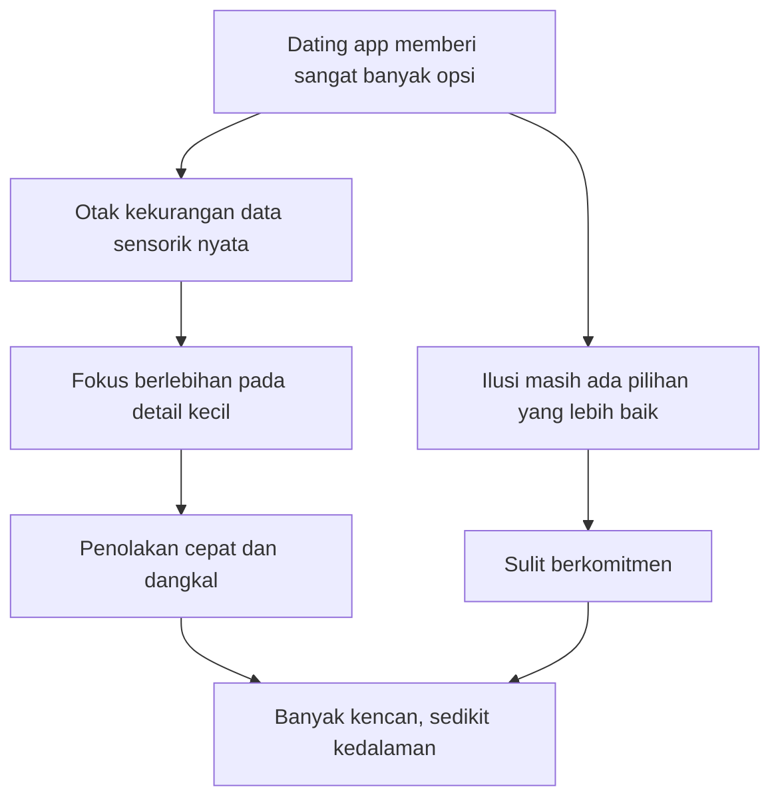

## ❤️ Pendahuluan: Cinta Itu Romantis, Tetapi Juga Biologis, Sosial, Kultural, dan Sering Kali Membingungkan

Ada satu kesalahan besar yang sering kita buat ketika berbicara tentang cinta. Kita memperlakukannya seolah-olah ia hanya satu hal. Kadang ia direduksi jadi perasaan. Kadang jadi chemistry *(kecocokan kimiawi / dorongan biologis)*. Kadang jadi komitmen moral. Kadang jadi drama psikologis. Kadang jadi urusan algoritma dating app. Padahal cinta manusia jauh lebih kompleks dari itu. ❤️

Wawancara dengan **Dr. Anna Machin** menarik justru karena ia berusaha membaca cinta dari banyak lapisan sekaligus:

- lapisan otak,
- lapisan evolusi,
- lapisan hubungan sosial,
- lapisan keluarga,
- lapisan budaya modern,
- dan lapisan perkembangan anak.

Yang membuat pembahasannya tajam adalah ia tidak bicara cinta sebagai puisi, melainkan sebagai bagian dari arsitektur manusia itu sendiri. Dalam pandangannya, hubungan dekat bukan sekadar bonus hidup. Ia adalah sesuatu yang duduk di pusat keberadaan manusia. Setelah kebutuhan dasar seperti makan dan minum, yang kita cari adalah **relasi**. Dan kualitas relasi itu punya dampak langsung pada:

- kesehatan mental,
- kesehatan fisik,
- rasa aman,
- identitas,
- umur panjang,
- dan kemampuan kita untuk bertahan di dunia. 🌍

Tetapi justru di zaman sekarang, ketika teknologi semakin cepat dan manusia semakin sibuk, cinta menjadi semakin paradoksal.

Kita punya:
- lebih banyak pilihan,
- lebih banyak akses,
- lebih banyak aplikasi,
- lebih banyak cara berkomunikasi,

namun tidak otomatis menjadi lebih baik dalam mencintai.

Sebaliknya, banyak gejala yang justru menunjukkan kebingungan besar:
- orang pergi ke ratusan kencan tanpa bertemu kelekatan yang matang,
- wanita semakin mandiri dan tidak lagi melihat pernikahan sebagai satu-satunya jalan aman,
- laki-laki dan perempuan sama-sama bingung membaca ulang peran mereka,
- monogami dipertanyakan,
- polyamory *(relasi multi-cinta / banyak hubungan emosional-romantis secara terbuka)* dibahas lebih terbuka,
- attachment style *(gaya kelekatan)* jadi bahasa populer,
- neurodiversity *(keberagaman cara kerja otak seperti ADHD, autisme, dan lain-lain)* mulai diakui sebagai faktor penting dalam hubungan,
- dan di saat yang sama, anak-anak tumbuh di dunia yang makin kehilangan figur ayah aktif. ⚠️

Itulah mengapa artikel ini penting. Karena transcript ini tidak sedang membahas satu topik, tetapi sebetulnya membongkar satu pertanyaan besar:

> **Apa yang terjadi ketika cinta—yang tadinya dipahami sebagai fondasi manusia—masuk ke dunia modern yang individualistis, serba cepat, dipenuhi pilihan, dan semakin dimediasi teknologi?**

Kalau diringkas sebagai tesis utama, artikel ini berdiri di atas tesis berikut:

> **Sains cinta menurut Anna Machin menunjukkan bahwa manusia tidak bisa memahami hubungan hanya lewat moralitas, romantisme, atau hasrat biologis semata; cinta adalah sistem yang dibentuk oleh evolusi, diproses oleh otak, dipengaruhi attachment dan neurodiversity, dimediasi budaya, dan sangat menentukan kesehatan pribadi serta masa depan keluarga—terutama melalui peran ayah yang selama ini diremehkan.**

Dalam artikel ini, kita akan membedah secara detail:

- bagaimana otak memilih pasangan bahkan sebelum kita sadar,
- kenapa dating apps merusak proses seleksi alami,
- apakah manusia benar-benar spesies monogami,
- apa beda monogami sosial dan seksual,
- bagaimana attachment style bekerja,
- bagaimana ADHD dan autisme bisa memengaruhi cinta,
- kenapa peran ayah sangat penting dalam perkembangan anak,
- dan mengapa masa depan cinta akan diuji oleh AI serta love drugs *(obat cinta / intervensi kimia pada relasi).* 

Agar pembahasannya jujur dan berguna, ada dua hal yang harus kita pegang sejak awal.

### Pertama
Sains bisa membantu menjelaskan pola, tetapi tidak otomatis menjadi izin moral.

Misalnya, kalau sains menunjukkan bahwa manusia tidak otomatis monogami secara biologis, itu tidak berarti semua bentuk pengkhianatan mendadak menjadi baik. Ada jarak antara **deskripsi** dan **preskripsi**:
- deskripsi menjelaskan apa yang sering terjadi,
- preskripsi bicara apa yang seharusnya dilakukan.

### Kedua
Hubungan manusia tidak bisa dipahami hanya dengan angka dan hormon.

Dopamine *(zat kimia motivasi / reward)*, oxytocin *(zat kimia keterikatan)*, testosterone *(hormon yang terkait kompetisi dan karakteristik seksual)*, semua itu penting. Tetapi tetap saja manusia hidup dalam:
- nilai,
- luka masa lalu,
- pilihan etis,
- struktur sosial,
- dan tanggung jawab nyata.

Maka artikel ini akan mencoba menjaga dua sisi sekaligus:
- cukup ilmiah untuk serius,
- cukup manusiawi untuk relevan. 🧠❤️

---

<Callout type="important" title="Tesis besar artikel ini">
Cinta manusia bukan sekadar perasaan spontan atau aturan sosial belaka. Ia adalah hasil interaksi antara otak, tubuh, pengalaman masa kecil, pola kelekatan, budaya, dan pilihan etis—dan justru karena itu, kualitas hubungan kita menentukan kualitas hidup kita jauh lebih dalam daripada yang biasanya kita sadari.
</Callout>

---

## 🧠 1. Otak Sudah Mulai Memilih Sebelum Kita Sempat Menyusun Kalimat Pertama

Salah satu bagian paling menarik dari wawancara ini adalah penjelasan Anna Machin tentang bagaimana ketertarikan romantis dimulai. Ia mengatakan bahwa ada **dua tahap** besar dalam ketertarikan manusia:

1. tahap **tidak sadar / unconscious**,
2. tahap **sadar / conscious**.

Ini penting sekali. Karena sering kali kita mengira bahwa tertarik pada seseorang adalah hasil penilaian sadar: “dia cocok”, “dia menarik”, “dia lucu”, “dia tipe saya.” Padahal, menurut Machin, sebelum semua narasi itu muncul, otak sudah bekerja lebih dulu. 🧠

### Tahap pertama: sistem limbik dan evaluasi bawah sadar
Bagian otak yang lebih tua secara evolusioner—yang terkait emosi, pengasuhan, dan respons dasar—mulai membaca sinyal sensorik:
- rupa wajah,
- bentuk tubuh,
- cara bergerak,
- suara,
- bahkan bau tubuh.

Dalam bahasa sederhana: tubuh dan otak kita sedang menjalankan semacam **algoritma biologis** tanpa meminta izin penuh pada pikiran sadar.

### Tujuan algoritma itu apa?
Dalam kerangka evolusi, pertanyaan dasarnya brutal dan sederhana:

> “Seberapa baik orang ini sebagai calon partner reproduktif dan jangka panjang?”

Bahkan kalau secara sadar kita berkata, “Saya tidak mau punya anak,” mesin evolusioner di bawah sadar tetap membawa warisan lama spesies kita.

Machin menyebut istilah **biological market value** *(nilai pasar biologis)*—yakni seberapa tinggi seseorang dinilai sebagai partner potensial dari sudut pandang keberhasilan reproduksi dan kelangsungan hidup.

Bahasa ini memang terdengar dingin, bahkan agak tidak romantis. Tapi justru itulah poin pentingnya: **biologi tidak bicara puitis**. Ia bicara peluang, kesehatan, kesesuaian, dan risiko.

### Perempuan dan penciuman kompatibilitas genetik
Salah satu klaim paling menarik adalah bahwa perempuan dapat membaca kompatibilitas genetik tertentu melalui bau, khususnya terkait **major histocompatibility complex / MHC** *(kompleks histokompatibilitas mayor / kumpulan gen yang berhubungan dengan sistem imun).* 

Idenya adalah:
- pasangan yang terlalu mirip secara genetik bukan pilihan ideal,
- pasangan yang cukup berbeda memberi peluang sistem imun anak lebih beragam dan lebih kuat.

Ini tidak terjadi secara sadar. Bukan berarti perempuan berpikir, “hmm, MHC-nya menarik.” Tidak. Otak membaca itu seperti latar belakang yang samar tetapi memengaruhi keputusan bawah sadar.

### Laki-laki dan sinyal visual
Sementara itu, Machin menjelaskan bahwa laki-laki lebih banyak membaca sinyal visual seperti **waist-hip ratio** *(rasio pinggang-pinggul)*, yang dalam kajian tertentu diasosiasikan dengan kesehatan reproduktif dan kadar estrogen.

Bagi perempuan, salah satu hal yang banyak dibaca secara bawah sadar adalah **shoulder-waist ratio** *(rasio bahu-pinggang)* pada laki-laki, yang diasosiasikan dengan kekuatan fisik, kebugaran, dan kadar testosteron.

### Penting: semua ini adalah kecenderungan statistik, bukan nasib individu
Ini harus ditekankan. Kita tidak boleh membaca penjelasan Machin secara bodoh seolah hubungan manusia bisa direduksi menjadi:
- pinggang sekian senti,
- bahu sekian ukuran,
- bau tubuh tertentu,
- lalu selesai.

Tidak. Yang ia jelaskan adalah **bias evolusioner dasar**, bukan kepastian penuh tentang siapa yang akan kita cintai.

---

## ⚡ 2. Dopamine, Oxytocin, dan Amigdala: Kenapa Kita Tiba-Tiba Berani Mendekat?

Setelah tahap bawah sadar memberi “lampu hijau”, otak mulai memainkan zat-zat kimia yang membuat ketertarikan terasa hidup. Dua yang sangat penting di sini adalah:

- **dopamine** *(kimia motivasi / semangat mengejar reward)*,
- **oxytocin** *(kimia keterikatan / rasa aman dan kedekatan).* ⚡

### Oxytocin: menurunkan rasa takut
Machin menjelaskan bahwa oxytocin membantu menenangkan **amygdala / amigdala** *(bagian otak yang sangat terkait dengan rasa takut dan ancaman).* 

Itu sebabnya, ketika kita tertarik pada seseorang, kita bisa merasa:
- lebih santai,
- lebih hangat,
- lebih berani memulai interaksi,
- tidak terlalu lumpuh oleh ketakutan sosial.

### Dopamine: mendorong kita bertindak
Kalau hanya oxytocin, mungkin kita jadi tenang tetapi pasif. Maka dopamine datang sebagai pendorong:
- ayo jalan ke orang itu,
- ayo buka percakapan,
- ayo mulai mengejar kemungkinan.

Machin menjelaskan ini dengan sangat bagus: dopamine dan oxytocin bekerja sama.
- oxytocin mengurangi takut,
- dopamine mendorong gerak.

### Ini penting bagi pemahaman modern tentang cinta
Banyak orang mengira keberanian mendekat itu semata hasil kepercayaan diri moral atau sosial. Padahal, sebagian dari itu juga dibantu oleh **neurochemistry** *(kimia saraf / proses kimia di otak).* 

Artinya, saat ketertarikan muncul, kita memang sedang diuntungkan oleh keadaan biologis tertentu yang membuat social approach *(pendekatan sosial)* terasa lebih mungkin.

Tetapi ini juga berarti bahwa cinta awal bisa menipu kalau semua energi hanya bertumpu pada euforia kimia tanpa penilaian sadar yang matang.

---

## 🗣️ 3. Yang Menyelamatkan atau Menghancurkan Ketertarikan Justru Mulut yang Dibuka Setelahnya

Setelah ketertarikan bawah sadar bekerja, manusia masuk ke tahap yang sangat khas: **neocortex / neokorteks** *(bagian otak luar yang terkait fungsi sadar, sosial, reflektif, dan kompleks).* 🗣️

Inilah bagian yang membedakan cinta manusia dari banyak mamalia lain. Manusia tidak berhenti pada insting. Ia menilai secara sadar:
- apakah orang ini lucu atau kasar,
- apakah ia cerdas atau dangkal,
- apakah nilainya cocok atau bertabrakan,
- apakah ia aman atau berbahaya,
- apakah ia baik atau hanya memesona sebentar.

### Otak sadar bisa mengalahkan chemistry awal
Ini sangat penting. Machin menegaskan bahwa seseorang bisa saja secara biologis terasa sangat menarik pada awalnya. Tetapi begitu ia bicara dan menunjukkan:
- kekejaman,
- rasisme,
- homofobia,
- kebencian,
- atau penghinaan pada orang lain,

maka seluruh daya tarik awal bisa runtuh.

### Pelajaran besar di sini
Banyak orang masih terjebak pada ide bahwa chemistry adalah segalanya. Padahal, menurut Machin, chemistry bawah sadar memang penting, tetapi **kualitas kesadaran sosial** jauh lebih menentukan apakah cinta itu akan berlanjut.

Ia bahkan menekankan bahwa salah satu hal paling penting yang dicari orang dalam hubungan jangka panjang adalah:

> **kindness** *(kebaikan hati / keramahan yang tulus).* 

Ini sangat menarik. Karena berarti di balik seluruh pembahasan ilmiah tentang hormon dan otak, kita kembali ke sesuatu yang sangat manusiawi dan klasik:
- orang ingin pasangan yang baik,
- bukan hanya menarik,
- bukan hanya seksi,
- bukan hanya seru.

### Maknanya lebih dalam dari sekadar sopan santun
Kebaikan hati di sini bukan hanya manis pada pasangan, tetapi juga terlihat dari:
- cara memperlakukan pelayan restoran,
- cara bicara tentang orang yang tidak hadir,
- cara memegang nilai moral dasar,
- dan cara memperlakukan orang yang secara sosial tidak “menguntungkan”.

Di titik ini, cinta kembali menjadi cermin karakter. 🌿

---

## 💃 4. Bisakah Kencan “Diretas”? Aktivitas yang Membuat Otak Lebih Cepat Nyambung

Salah satu bagian paling “praktis” dari wawancara ini adalah ketika Machin bicara tentang bagaimana kencan bisa dibuat lebih kondusif untuk menghasilkan koneksi. Ia menyebut aktivitas seperti:
- dancing *(menari berpasangan)*,
- touch *(sentuhan aman dan wajar)*,
- tertawa,
- bergerak bersama,
- dan pengalaman yang sedikit menantang tapi menyenangkan. 💃

### Kenapa ini bekerja?
Karena aktivitas seperti itu merangsang kombinasi zat kimia sosial, termasuk:
- dopamine,
- oxytocin,
- dan **beta-endorphin** *(zat kimia yang terkait rasa nyaman, pengurang nyeri, dan kedekatan sosial).* 

Dalam pandangan Machin, aktivitas fisik bersama, tawa, dan sinkronisasi tubuh membuat orang lebih cepat merasa:
- dekat,
- rileks,
- dan terhubung.

### Ini menjelaskan kenapa beberapa kencan terasa “lebih hidup”
Makan malam formal bisa baik, tetapi kadang terlalu kaku. Sebaliknya, aktivitas yang membuat dua orang:
- bergerak bersama,
- menertawakan kecanggungan,
- atau mengalami sedikit tantangan bersama,

bisa jauh lebih efektif untuk membangun kelekatan awal.

### Tetapi catatan penting
Ini bukan trik manipulatif. Ini bukan “hack” dalam arti licik. Yang lebih tepat adalah: **beberapa konteks lebih biologis mendukung koneksi dibanding konteks lain.**

Jadi, dari transcript ini kita bisa mengambil satu kesimpulan sederhana:

> Kencan yang baik bukan hanya kencan yang logis, tetapi yang membuat dua sistem saraf merasa cukup aman dan cukup hidup untuk saling membuka diri.

---

## 📱 5. Dating Apps: Membantu Bertemu Banyak Orang, tetapi Mengacaukan Cara Otak Sebenarnya Menyeleksi Pasangan

Machin membuat satu poin yang sangat tajam: dating apps sebaiknya tidak dianggap sebagai **dating apps**, tetapi lebih tepat sebagai **introduction apps** *(aplikasi perkenalan, bukan aplikasi “mencintai” secara utuh).* 📱

### Kenapa?
Karena aplikasi memberi sangat sedikit informasi sensorik yang sebenarnya dibutuhkan otak untuk menilai seseorang secara utuh:
- tidak ada bau tubuh nyata,
- tidak ada ritme gerak,
- tidak ada nuansa suara lengkap,
- tidak ada atmosfer kehadiran,
- tidak ada sinkronisasi spontan,
- dan sering kali hanya ada foto + teks pendek + impresi yang terlalu dikurasi.

Artinya, aplikasi membuat otak bekerja dengan data yang sangat miskin.

### Akibatnya apa?
Orang jadi:
- terlalu fokus pada detail remeh,
- terlalu cepat menolak,
- terlalu cepat menilai,
- dan terlalu lama berada di wilayah analisis tanpa pertemuan nyata.

Machin membahas fenomena **ick**—rasa ilfil mendadak karena hal-hal kecil yang viral di media sosial. Dari satu sisi, ini memang kerja prefrontal cortex *(korteks prefrontal / wilayah sadar dan evaluatif)*. Tetapi menurutnya, ini sering kali bukan evaluasi yang matang, melainkan **obsesi terhadap potongan informasi kecil** karena sistem aplikasi memang memberi kita terlalu sedikit konteks.

### Ini sangat masuk akal
Ketika informasi minim, manusia justru cenderung melebih-lebihkan sinyal kecil:
- ada kardus di lemari,
- cara foto agak aneh,
- background kamar kurang menarik,
- penulisan bio kurang keren,

lalu itu dipakai untuk membuat kesimpulan sangat besar tentang karakter seseorang.

Padahal kalau bertemu langsung, sangat mungkin keseluruhan persepsi berubah total.

### Pelajaran pentingnya
Dating apps memperluas pool *(kolam pilihan)*, tetapi tidak secara otomatis memperbaiki kemampuan memilih. Bahkan dalam banyak kasus, ia justru merusak proses seleksi alami yang dulu terjadi lebih kaya secara sensorik dan sosial.

---

## 🍽️ 6. Paradox of Choice: Kenapa Makin Banyak Pilihan Tidak Membuat Kita Makin Dekat ke Pasangan yang Tepat

Machin juga membahas hal yang sangat penting: **paradox of choice** *(paradoks pilihan / terlalu banyak pilihan justru membuat keputusan lebih buruk).* 🍽️

Ini sangat relevan untuk dunia dating app.

Dulu, dalam sejarah manusia yang panjang, pilihan pasangan sangat terbatas:
- orang di desa,
- lingkaran sosial tertentu,
- komunitas sekitar,
- mungkin kota tetangga kalau mobilitasnya cukup.

Sekarang, satu aplikasi bisa memberi akses pada ratusan atau ribuan profil. Secara teori ini tampak bagus. Tetapi otak manusia tidak berevolusi untuk memproses lautan kemungkinan romantis seperti katalog tanpa akhir.

### Dampaknya apa?
- orang sulit berkomitmen pada satu pilihan,
- selalu ada ilusi “mungkin ada yang lebih baik satu swipe lagi,”
- investasi emosional menurun,
- dan hubungan berubah menjadi proses pencarian tanpa ujung.

### Ini menjelaskan fenomena “100 dates, zero depth”
Machin menyinggung orang-orang yang pergi ke sangat banyak kencan tetapi tetap tidak membentuk relasi bermakna. Dalam dunia lama, kencan adalah investasi. Sekarang, karena biayanya rendah dan aksesnya mudah, banyak orang masuk tanpa bobot keseriusan yang sama.

Dan seperti yang sering terjadi dalam hidup:

> **sesuatu yang terlalu murah sering diperlakukan terlalu ringan.**

Bukan berarti semua hubungan dari dating app gagal. Bukan itu. Masalahnya adalah medium ini mengubah psikologi seleksi: dari proses pembacaan manusia nyata menjadi proses browsing kemungkinan yang tidak habis-habis.

---



---

## 💍 7. Monogami: Apakah Benar Ia Sekadar Konstruksi Sosial?

Salah satu bagian paling provokatif dari wawancara ini adalah ketika Machin berkata bahwa manusia **bukan spesies monogam** dalam arti biologis yang ketat, dan bahwa monogami pada banyak level adalah **social construct** *(konstruksi sosial / aturan yang dibentuk budaya dan institusi).* 💍

Pernyataan ini tentu mudah memancing reaksi. Maka kita harus membacanya dengan hati-hati.

### Pertama: Machin membedakan dua jenis monogami

#### 1. **Social monogamy** *(monogami sosial)*
Dua orang hidup bersama, membangun rumah tangga, membesarkan anak, membentuk unit sosial.

#### 2. **Sexual monogamy** *(monogami seksual)*
Eksklusivitas seksual penuh: tidak ada relasi seksual dengan orang lain.

Menurut Machin, manusia jauh lebih dekat ke **monogami sosial** daripada monogami seksual mutlak.

### Argumennya apa?
- banyak budaya membangun rumah tangga berpasangan karena alasan sosial dan pengasuhan,
- tetapi tingkat perselingkuhan cukup tinggi,
- dan dari sudut pandang evolusi, eksklusivitas seksual total tidak selalu dianggap “efisien”.

### Ini berarti apa?
Bukan berarti semua orang diam-diam pasti ingin selingkuh. Yang lebih tepat adalah:

> **dorongan biologis manusia tidak selalu sejalan secara otomatis dengan tuntutan moral dan sosial monogami ketat.**

Dan inilah sumber sebagian besar drama hubungan manusia.

### Mengapa masyarakat tetap mendorong monogami?
Menurut Machin, karena monogami memudahkan:
- prediktabilitas sosial,
- pengaturan warisan,
- kejelasan keluarga,
- stabilitas institusional,
- dan kontrol sosial yang lebih rapi.

Jadi monogami bukan kebohongan kosong. Ia juga punya fungsi peradaban yang nyata. Tetapi Machin menolak romantisasi bahwa monogami seksual absolut adalah “desain biologis alami” manusia.

Ini poin yang perlu dipahami dengan kepala dingin. 🧠

---

## 🔄 8. Polyamory dan Open Relationships: Apakah Mereka Lebih “Jujur” daripada Monogami?

Machin kemudian menjelaskan bahwa ada orang-orang yang menilai **polyamory** *(hubungan romantis-emosional dengan lebih dari satu orang secara terbuka dan dengan persetujuan semua pihak)* atau **open relationship** *(hubungan terbuka, biasanya tidak eksklusif secara seksual)* sebagai bentuk relasi yang lebih jujur. 🔄

### Argumen mereka
Jika seseorang:
- mengaku monogam,
- lalu diam-diam berselingkuh,

maka ia sedang hidup dalam kebohongan.

Sedangkan dalam relasi terbuka atau polyamorous:
- aturan dibicarakan,
- batas dirundingkan,
- ekspektasi dibuat jelas,
- dan kejujuran dijadikan syarat utama.

Dalam logika ini, problem utamanya bukan jumlah pasangan, tetapi **kebohongan**.

### Menariknya, Machin juga mengatakan
bahwa studi-studi yang ada tidak menemukan perbedaan besar dalam **well-being** *(kesejahteraan psikologis)* atau **relationship satisfaction** *(kepuasan hubungan)* antara relasi monogam dan polyamorous, setidaknya pada tingkat rata-rata tertentu.

Ini sangat penting. Karena banyak orang mengira relasi non-monogam otomatis lebih rusak, lebih tidak bahagia, atau lebih dingin. Menurut data yang ia rujuk, itu tidak sesederhana itu.

### Tetapi bukan berarti semuanya mudah
Machin tetap menekankan bahwa polyamory punya tantangan besar, terutama:
- jealousy *(kecemburuan)*,
- koordinasi batas,
- kebutuhan komunikasi yang sangat tinggi,
- dan tekanan stigma sosial.

Dalam transcript, terlihat jelas bahwa salah satu beban utama orang polyamorous justru bukan hanya hubungan internal mereka, tetapi **penghakiman publik**.

### Di titik ini kita perlu hati-hati
Dari sisi deskriptif, Machin sedang menjelaskan bahwa ada lebih dari satu bentuk struktur relasi yang bisa stabil. Tetapi dari sisi normatif dan nilai, masyarakat tetap berhak bergulat dengan pertanyaan moral dan budaya yang lebih dalam:
- bentuk keluarga seperti apa yang paling aman bagi anak?
- bentuk komitmen seperti apa yang paling minim puing emosional?
- apakah kejujuran cukup, atau ada nilai lain yang juga harus dipertahankan?

Transcript ini tidak memberi jawaban final. Tapi ia memaksa kita mengakui bahwa kenyataan relasi manusia jauh lebih beragam daripada slogan-slogan sederhana.

---

## 👨‍👧 9. Salah Satu Bagian Terpenting dari Wawancara Ini Justru Bukan Tentang Pasangan, tetapi Tentang Ayah

Menariknya, sebagian besar kekuatan transcript ini justru datang ketika pembicaraan bergeser ke **fatherhood** *(peran ayah / keayahan).* 👨‍👧

Machin sangat tegas: budaya modern membawa banyak mitos keliru tentang ayah.

### Mitos yang ia lawan
- ayah hanya pencari nafkah,
- ayah itu cadangan,
- ayah baru penting nanti saat anak besar,
- ayah tidak punya ikatan setara dengan ibu,
- ayah biologis adalah satu-satunya ayah yang “nyata”.

Menurut Machin, semua ini terlalu sempit dan dalam banyak kasus salah.

### Definisi “ayah” menurut Machin lebih luas
Ketika ia berbicara tentang father figure *(figur ayah)*, yang dimaksud bukan cuma ayah biologis. Yang penting adalah:
- laki-laki atau para laki-laki yang **hadir**,
- berinteraksi,
- membangun ikatan,
- dan menjalankan fungsi ayah dalam kehidupan anak.

Jadi bisa berupa:
- ayah biologis yang aktif,
- ayah tiri yang benar-benar mengasuh,
- kakek,
- paman,
- guru,
- pelatih,
- atau figur laki-laki lain yang stabil dan membentuk.

### Ini poin yang sangat besar
Karena ia memindahkan pusat pembahasan dari **darah** ke **fungsi**.

Bukan berarti biologi tidak penting sama sekali. Tetapi dalam perkembangan anak, yang sangat menentukan adalah siapa yang benar-benar **melakukan pekerjaan keayahan**, bukan siapa yang sekadar menyumbang gen.

---

## 🧒 10. Peran Ayah yang Spesifik: Bukan Sekadar Menyayangi, tetapi Menyiapkan Anak Masuk ke Dunia

Salah satu gagasan paling penting yang diajukan Machin adalah bahwa ayah punya peran khas dalam perkembangan anak. Bukan karena ibu kurang, tetapi karena peran keduanya **komplementer** *(saling melengkapi, bukan identik).* 🧒

### Rumusan besarnya
Ayah membantu **scaffold the child’s entry into the world beyond the family** *(menopang / menyanggah masuknya anak ke dunia di luar keluarga).* 

Bahasa sederhananya:
- ibu banyak memberi rasa aman, perlindungan, dan regulasi kedekatan,
- ayah banyak membantu anak berani keluar, menghadapi dunia, mengambil tantangan, dan membentuk keterampilan sosial.

### Ini sangat penting untuk dipahami
Machin tidak berkata ibu tidak menstimulasi dan ayah tidak mengasuh. Tentu keduanya bisa melakukan keduanya. Yang ia maksud adalah **pola dominan evolusioner dan relasional** yang sering terlihat.

### Ikatan ayah: nurture and challenge
Kalau ikatan ibu sering digambarkan sangat berbasis nurturance *(pengasuhan, pelukan, perlindungan)*, maka ikatan ayah menurut Machin banyak dibangun lewat kombinasi:
- nurture *(kehangatan / rasa aman)*,
- plus challenge *(tantangan / stimulasi).* 

Ayah memberi pesan bawah sadar seperti:

> “Kamu aman bersamaku. Karena itu, ayo keluar sedikit, coba dunia, ambil risiko yang bisa dipelajari, lalu kembali lagi kalau perlu.”

Ini luar biasa penting untuk:
- resiliensi *(daya lenting / kemampuan bangkit)*,
- regulasi emosi,
- perilaku sosial prososial,
- dan keberanian yang sehat.

---

## 🤼 11. Rough-and-Tumble Play: Kenapa Main Kasar yang Terkelola Bisa Sangat Penting?

Machin menyorot satu perilaku yang sering diasosiasikan dengan ayah: **rough-and-tumble play** *(bermain fisik aktif / gulat-gulatan ringan / kejar-kejaran seru yang tetap aman).* 🤼

Ini sering diremehkan sebagai “ayah cuma bercanda kasar.” Padahal, menurut Machin, permainan seperti ini sangat penting.

### Kenapa penting?
Karena dari permainan fisik yang seru tetapi aman, anak belajar banyak hal:
- reciprocity *(timbal balik)*,
- membaca batas orang lain,
- menilai risiko,
- merasakan tantangan,
- mengelola emosi saat tegang dan senang,
- memahami kapan permainan masih menyenangkan dan kapan sudah terlalu jauh.

### Secara biologis, permainan ini juga membangun ikatan
Karena ada banyak sentuhan, tawa, dan stimulasi, tubuh melepaskan zat-zat sosial yang memperkuat bond *(ikatan).* 

### Jadi “ayah yang bermain” bukan ayah yang iseng
Ia sedang membantu mengajar anak secara embodied *(lewat tubuh dan pengalaman langsung)* tentang:
- dunia sosial,
- batas,
- keberanian,
- koordinasi,
- dan kelekatan yang aman tetapi dinamis.

Ini pelajaran besar. Karena masyarakat modern sering sangat fokus pada pendidikan kognitif, tetapi lupa bahwa banyak kecakapan sosial dan emosional justru ditanam lewat permainan. 🎯

---

## 👶 12. Seribu Hari Pertama: Kenapa Ayah Penting Sejak Awal, Bukan Nanti Saat Anak Sudah Besar

Salah satu mitos yang Machin tentang sangat jelas lawan adalah ide bahwa ayah baru penting setelah anak “cukup besar.” Menurutnya, itu salah. Ayah penting **sejak awal**. 👶

### Kenapa?
Karena otak bayi berkembang sangat cepat, terutama area-area sosial. Lingkungan awal sangat menentukan arsitektur perkembangan.

Manusia lahir dalam kondisi sangat tidak matang dibanding banyak mamalia lain. Bayi manusia benar-benar bergantung pada:
- sentuhan,
- bau,
- suara,
- ritme tubuh pengasuh,
- dan interaksi berulang.

### Maka peran ayah dari awal adalah tentang input
Bukan berarti ayah harus meniru ibu persis. Tetapi ayah perlu hadir karena:
- ia membangun bond *(ikatan)* lewat interaksi,
- ia memberi stimulasi yang khas,
- dan ia membantu membentuk perkembangan sosial anak sejak dini.

### Bagi laki-laki, ini juga penting untuk identitas ayahnya sendiri
Machin menekankan bahwa laki-laki sering membangun ikatan dengan bayi melalui interaction-based bonding *(ikatan berbasis interaksi).* 

Jadi makin cepat dan makin sering ayah terlibat:
- mandi bayi,
- memijat bayi,
- membacakan buku,
- menggendong,
- bermain,

maka makin cepat pula ia tumbuh menjadi ayah yang merasa kompeten dan terikat.

Ini sangat penting secara psikologis. Banyak ayah mundur karena merasa tidak langsung “klik” dengan bayi. Machin menjelaskan bahwa ini bukan berarti mereka buruk, melainkan bahwa bond mereka memang sering tumbuh lewat pengulangan dan interaksi, bukan lewat satu ledakan perasaan instan.

---

## 🧪 13. Otak dan Hormon Ayah Juga Berubah: Menjadi Ayah Itu Bukan Peran Sosial Belaka, tetapi Transformasi Biologis

Salah satu temuan paling menarik dari riset fatherhood adalah bahwa laki-laki juga mengalami perubahan biologis saat menjadi ayah. Ini membantah mitos lama bahwa hanya ibu yang “secara tubuh” berubah. 🧪

Machin menyebut beberapa hal penting:

### 1. **Testosterone turun**
Saat laki-laki masuk hubungan jangka panjang, testosteronnya bisa turun. Ketika menjadi ayah, ia bisa turun lagi, bahkan cukup signifikan.

Machin menjelaskan ini bukan bencana. Ini bagian dari pergeseran adaptif:
- dari mode kompetisi dan pencarian pasangan,
- ke mode fokus pada keluarga dan pengasuhan.

### 2. **Oxytocin naik**
Ini membantu bonding *(keterikatan).* 

### 3. **Vasopressin naik**
Dikaitkan dengan proteksi, kewaspadaan menjaga keluarga, dan keterikatan sosial tertentu.

### 4. **Prolactin meningkat**
Ini juga terkait motivasi mengasuh pada spesies dengan ayah yang berinvestasi pada anak.

### Maknanya besar
Menjadi ayah bukan sekadar “memutuskan mau lebih bertanggung jawab.” Tubuh laki-laki juga menyesuaikan diri untuk mendukung peran itu.

Ini memberi kita pelajaran menarik:

> **peran sosial yang sangat penting dalam spesies manusia sering punya landasan biologis yang nyata.**

Jadi ayah aktif bukan hanya hasil ceramah moral. Ia juga didukung oleh perubahan tubuh dan otak—asal ayah itu benar-benar hadir dan berinteraksi.

---

## 🧍 14. Mengapa Anak Tanpa Figur Ayah Lebih Berisiko Mengalami Banyak Masalah?

Machin sangat tegas bahwa anak yang tumbuh tanpa figur ayah aktif memiliki **risiko lebih tinggi** mengalami banyak hasil negatif. Penting dicatat: ini bicara risiko statistik, bukan vonis nasib. Tidak semua anak tanpa ayah akan gagal. Tetapi risikonya meningkat. 🧍

Ia menyebut beberapa contoh:
- perilaku antisosial,
- kecenderungan kriminalitas,
- masalah adiksi *(ketagihan / kecanduan)*,
- gangguan kesehatan mental,
- kesulitan relasi,
- dan performa hidup yang lebih rapuh.

### Mengapa?
Karena menurut Machin, figur ayah banyak menopang:
- regulasi emosi,
- self-esteem *(harga diri)*,
- perilaku belajar yang sehat,
- orientasi ke dunia luar,
- kemampuan bekerja sama,
- dan rasa penting pada diri anak.

### Satu detail yang sangat indah dari transcript ini
Ketika ditanya bagaimana anak tahu ia penting bagi ibunya dan ayahnya, Machin mengatakan:
- dari ibu, anak sering membaca “ibu melakukan banyak hal untukku,”
- dari ayah, anak sering membaca “ayah meluangkan waktunya untukku.”

Ini sangat menyentuh. Karena artinya, waktu ayah bukan sekadar durasi. Bagi anak, itu adalah **bahasa cinta eksistensial**:

> “Kalau ayah memberikan waktunya, berarti aku berarti.”

---

## 👧 15. Bukan Hanya Anak Laki-Laki: Anak Perempuan Juga Sangat Dipengaruhi Hubungan dengan Ayah

Machin menolak ide bahwa ayah terutama hanya penting bagi anak laki-laki. Ia menegaskan bahwa bagi anak perempuan pun, hubungan dengan ayah sangat berpengaruh. 👧

Menurut penjelasannya, anak perempuan yang punya secure attachment *(kelekatan aman)* dengan ayah cenderung memiliki:
- performa akademik lebih baik,
- kesehatan mental lebih baik,
- relasi dewasa lebih stabil,
- pilihan seksual lebih tidak berisiko,
- dan kesejahteraan umum lebih tinggi.

### Kenapa bisa begitu?
Karena figur ayah bukan cuma laki-laki dewasa di rumah. Ia juga:
- menjadi model relasi laki-laki-perempuan yang aman atau tidak aman,
- membantu pembentukan rasa berharga anak,
- membentuk ekspektasi terhadap perhatian, penghormatan, dan batas,
- serta memengaruhi bagaimana seorang anak perempuan membaca dunia sosial.

Ini poin yang sangat besar dan sering hilang dalam diskusi publik yang terlalu fokus pada “ayah untuk anak laki-laki.”

---

## 🧷 16. Attachment Styles: Empat Pola Dasar Cara Kita Menempel, Takut, Menjauh, atau Bertahan dalam Cinta

Machin lalu masuk ke pembahasan **attachment styles** *(gaya kelekatan / pola dasar relasi emosional).* Ini salah satu bagian paling populer dalam psikologi modern, tetapi dalam wawancara ini dijelaskan dengan cukup jernih. 🧷

Secara sederhana, dua sumbu besarnya adalah:
- seberapa takut kita ditinggalkan,
- dan seberapa nyaman kita dengan kedekatan emosional/fisik.

Dari sini lahirlah empat pola besar:

### 1. **Secure** *(aman)*
- tidak terlalu takut ditinggalkan,
- nyaman dengan kedekatan,
- bisa mencintai tanpa kehilangan diri.

### 2. **Preoccupied** *(cemas-melekat / clingy)*
- sangat takut ditinggalkan,
- sangat butuh kedekatan,
- sering menempel demi merasa aman.

### 3. **Fearful avoidant** *(takut-dekat tapi juga takut jauh)*
- takut ditinggalkan,
- tetapi juga tidak nyaman dengan kedekatan,
- sehingga cenderung bingung, tarik-ulur, masuk-keluar.

### 4. **Dismissing avoidant** *(menghindar / menjauh secara emosional)*
- tidak terlalu takut ditinggalkan,
- tidak terlalu suka kedekatan intens,
- cenderung mandiri berlebihan atau emosional agak dingin.

### Penting
Machin menekankan bahwa tidak ada attachment style yang “jahat” secara moral. Masalahnya muncul ketika gaya itu membuat hidup dan hubungan kita terus berantakan.

### Yang menarik
Ia juga bilang bahwa attachment style bisa berubah.

Bagaimana caranya?
- melalui pasangan yang secure dan konsisten,
- melalui kesadaran diri,
- melalui pola relasi yang memberi bukti baru,
- atau melalui bantuan profesional.

Ini memberikan harapan besar: pola kita bukan takdir yang beku. 🌱

---

## 🧲 17. Mengapa Beberapa Attachment Style Saling Memicu Kekacauan?

Machin menyinggung kombinasi attachment yang lebih sulit daripada yang lain. Misalnya:
- **preoccupied** dengan **dismissing avoidant**.

Yang satu ingin makin dekat demi aman.
Yang satu merasa sesak saat ada tuntutan kedekatan.

Akibatnya:
- makin dikejar, makin menjauh,
- makin menjauh, makin dikejar,
- dan lahirlah roller coaster hubungan yang melelahkan. 🎢

Ini sangat umum terjadi dalam kehidupan nyata. Banyak orang merasa “kami sangat intens,” padahal sebenarnya yang terjadi adalah siklus pemicu luka masing-masing.

### Pelajarannya
Bukan cuma “cari orang yang cocok.” Tetapi juga:
- pahami pola diri sendiri,
- pahami pola pasangan,
- dan sadari kapan suatu dinamika sedang memelihara luka lama, bukan membangun cinta baru.

Machin tampaknya melihat self-awareness *(kesadaran diri)* sebagai salah satu alat paling penting untuk menurunkan kerusakan dalam hubungan.

---

## 🧩 18. Neurodiversity dan Cinta: ADHD, Autisme, dan Kesulitan yang Sering Salah Dibaca Sebagai “Karakter Buruk”

Bagian tentang **neurodiversity** sangat penting, karena banyak masalah relasi modern tidak bisa dipahami hanya dengan bahasa “dia egois”, “dia dingin”, atau “dia terlalu banyak.” Bisa jadi ada cara kerja otak yang berbeda di bawahnya. 🧩

Machin menjelaskan bahwa banyak sistem yang terlibat dalam cinta juga terkait dengan neurodiversity:
- dopamine,
- serotonin,
- oxytocin receptor gene *(gen reseptor oxytocin)*,
- empati,
- pemrosesan sensorik,
- dan fungsi eksekutif *(executive function / kemampuan atensi, inhibisi, working memory, dan pengaturan respons).* 

### ADHD
Orang dengan ADHD sering menghadapi:
- novelty seeking *(mencari kebaruan)*,
- impulsivitas,
- regulasi emosi yang lebih sulit,
- working memory yang kurang stabil,
- dan kecenderungan dopamine-seeking *(mencari hal yang memberi lonjakan dopamine).* 

Dalam konteks cinta, ini bisa berarti:
- sangat menikmati fase awal yang intens dan penuh dopamin,
- cepat tertarik,
- cepat bergerak,
- tetapi kesulitan bertahan saat hubungan masuk ke fase stabil yang kurang “menggetarkan”.

### Autisme
Orang autistik bisa menghadapi:
- processing speed sosial yang berbeda,
- sensory sensitivity *(sensitivitas sensorik tinggi)* atau sebaliknya rendah,
- masking *(menyembunyikan atau menyesuaikan diri secara berat agar terlihat “normal” menurut standar sosial neurotipikal)*,
- dan tantangan dalam bentuk empati yang berbeda, bukan ketiadaan empati.

Machin menekankan bahwa mitos “orang autistik tidak berempati” adalah salah. Yang sering terjadi adalah:
- mereka berempati dengan cara berbeda,
- atau justru terlalu kuat sampai kewalahan,
- atau ada mismatch *(ketidakcocokan)* antara cara membaca emosi neurodiverse dan neurotypical *(neurotipikal / cara kerja otak mayoritas).* 

### Penting sekali
Neurodiversity tidak boleh dipakai untuk langsung menyalahkan satu pihak dalam hubungan. Machin sangat hati-hati soal ini. Ia menolak pola berpikir yang menjadikan orang neurodiverse sebagai “masalah” tunggal.

Sebaliknya, hubungan campuran neurotypical-neurodiverse membutuhkan:
- edukasi timbal balik,
- bahasa bersama,
- penjelasan pola reaksi,
- dan toleransi yang cerdas.

---

## 🔁 19. ADHD dan “The Chase”: Kenapa Ada Orang Sangat Menyukai Fase Pengejaran tetapi Sulit Menikmati Stabilitas?

Salah satu bagian transcript yang sangat resonan dengan banyak pengalaman modern adalah pembahasan tentang orang yang mencintai **the chase** *(fase pengejaran / berburu ketertarikan)*. 🔁

Machin menjelaskan bahwa terutama pada ADHD, fase awal cinta memberi lonjakan dopamin yang sangat besar:
- rasa baru,
- ketidakpastian,
- tantangan,
- validasi,
- potensi erotik,
- dan antisipasi.

Bagi otak yang lebih dopamine-seeking, ini sangat menggiurkan.

### Masalahnya apa?
Hubungan jangka panjang secara alami bergeser:
- dari passionate love *(cinta bergairah / fase intens)*,
- ke companionate love *(cinta pendamping / cinta stabil dan menenangkan).* 

Di fase kedua, chemistry masih ada, tetapi bentuknya berubah. Yang lebih menonjol adalah:
- beta-endorphin,
- rasa aman,
- kebiasaan intim,
- dan kedalaman.

Bagi sebagian orang, ini terasa indah.
Bagi sebagian lain, terutama yang sangat mencari novelty, ini bisa terasa seperti “kehilangan hidup”.

### Maka pelajarannya
Tidak semua orang yang cepat bosan itu tidak bermoral. Kadang ada konfigurasi biologis dan psikologis tertentu yang membuat stabilitas terasa kurang mengaktifkan sistem reward mereka.

Tetapi tentu ini tidak otomatis membebaskan tanggung jawab. Justru di sinilah kerja relasi menjadi lebih sadar:
- mengenali pola otak sendiri,
- mengelola kebaruan secara sehat di dalam relasi,
- atau mengambil keputusan jujur tentang bentuk hubungan yang bisa dan tidak bisa dijalani.

---

## 🧪 20. Love Drugs: Jika Cinta Bisa Dipicu atau Dilembutkan dengan Obat, Apakah Kita Masih Sedang “Mencintai”?

Bagian lain yang sangat menarik adalah soal **love drugs** *(obat cinta / intervensi farmakologis pada relasi).* 🧪

Machin menjelaskan bahwa sains sekarang makin dekat pada kemungkinan memengaruhi aspek-aspek relasi lewat zat tertentu, seperti:
- oxytocin nasal spray *(semprot oxytocin lewat hidung)*,
- MDMA dalam konteks terapi pasangan,
- SSRI untuk mengurangi salience *(daya muat emosional yang kuat)* dari luka cinta tertentu.

### Kedengarannya seperti masa depan yang absurd
Tetapi justru itu masalahnya: masa depan ini tidak lagi sepenuhnya fiksi.

### Oxytocin
Secara teori bisa:
- membuat orang lebih terbuka,
- lebih percaya,
- lebih sosial.

Tetapi Machin memberi peringatan bahwa efeknya tidak selalu seragam. Pada sebagian orang, ia justru bisa memperkuat sikap ingroup-outgroup *(kelompok-kita vs kelompok-mereka)* dan memperburuk bias sosial.

### MDMA
Dalam setting terapi, MDMA sedang diuji untuk membantu pasangan yang sangat buntu secara emosional agar bisa kembali berempati. Ini menarik. Tetapi tetap memunculkan pertanyaan etik yang besar:
- kalau relasi diperbaiki oleh zat, apa yang terjadi saat zat dihentikan?
- apakah cinta itu masih cinta, atau semacam keadaan yang disokong kimia dari luar?
- bagaimana dengan penyalahgunaan dalam relasi yang timpang kuasa?

### Inti keberatan Machin sangat masuk akal
Bukan sekadar “obat itu jahat”, tetapi:

> **hubungan intim adalah wilayah yang terlalu sensitif untuk disentuh tanpa percakapan etik yang serius.**

Ini penting sekali. Karena dalam masyarakat yang sangat komersial, apa pun yang menjanjikan “membuat kamu dicintai” atau “memperbaiki pasanganmu” hampir pasti akan dijual jika memungkinkan.

Maka sebelum teknologinya datang penuh, etika harus lebih dulu matang.

---

## 🤖 21. AI, Chatbot, dan Masa Depan Relasi: Bantuan yang Berguna atau Pengganti Manusia yang Berbahaya?

Machin juga menyentuh persoalan yang makin relevan: **AI dalam hubungan intim**, bukan hanya seks, tetapi relasi emosional. 🤖

Ia tidak menolak semuanya. Malah ia mengakui bahwa chatbot atau AI bisa berguna dalam beberapa konteks, misalnya:
- latihan sosial untuk orang dengan social anxiety *(kecemasan sosial)*,
- latihan interaksi bagi sebagian orang autistik,
- ruang aman tanpa penghakiman untuk mencoba percakapan.

### Tetapi di mana bahayanya?
Machin menekankan bahwa otak manusia tahu perbedaan antara manusia sungguhan dan sistem buatan. Karena itu, relasi dengan AI tidak otomatis memicu seluruh **koktail kimia sosial** yang dibutuhkan manusia untuk kesehatan jangka panjang.

Kita mungkin merasa didengar. Kita mungkin nyaman. Tetapi belum tentu kita mendapatkan:
- synchrony *(sinkronisasi interpersonal)*,
- mutual embodied co-regulation *(pengaturan bersama yang bertubuh, nyata, biologis)*,
- dan manfaat sosial yang sama seperti relasi manusia nyata.

### Ini penting
AI bisa menjadi alat bantu.
Masalah muncul ketika ia menggantikan manusia sepenuhnya.

Karena menurut Machin, hubungan manusia adalah faktor kesehatan nomor satu. Maka kalau AI membuat kita merasa “cukup terhubung” padahal secara biologis kita tetap kesepian, itu bahaya besar.

---

## 🫀 22. Hubungan Adalah Faktor Kesehatan Terbesar dalam Hidup Manusia

Mungkin salah satu kalimat paling penting dari seluruh transcript ini adalah ketika Machin menegaskan bahwa kualitas hubungan kita adalah faktor paling besar bagi:
- kesehatan,
- kebahagiaan,
- well-being *(kesejahteraan menyeluruh)*,
- dan longevity *(umur panjang).* 🫀

Ini bukan opini sembarangan. Ia merujuk pada tubuh riset besar yang menunjukkan bahwa relasi sosial yang sehat mengalahkan banyak faktor gaya hidup lain dalam memengaruhi kualitas hidup jangka panjang.

### Implikasinya sangat besar
Artinya, orang bisa:
- makan bersih,
- olahraga rutin,
- tidur cukup,
- menjaga berat badan,

namun tetap mengalami kualitas hidup yang buruk jika relasinya rusak, kesepian, atau dangkal.

Sebaliknya, hubungan yang baik menjadi semacam sistem penyangga biologis dan psikologis yang luar biasa.

### Ini menuntut koreksi besar pada budaya modern
Kita begitu fokus pada:
- biohacking,
- produktivitas,
- efisiensi,
- optimisasi diri,

sampai lupa bahwa mungkin intervensi kesehatan paling besar justru bukan gadget baru, melainkan:
- sahabat yang hadir,
- pasangan yang aman,
- keluarga yang suportif,
- dan figur ayah/ibu yang terlibat.

Dalam arti itu, transcript ini bukan cuma soal cinta. Ia adalah kritik keras terhadap budaya modern yang menganggap relasi bisa dikerjakan secara “efisien” dan tetap memberi hasil yang sama. Tidak bisa. 🌿

---

## 🔚 Kesimpulan: Cinta Bukan Sekadar Soal Siapa yang Kita Pilih, tetapi Sistem Manusia yang Menentukan Cara Kita Hidup, Mengasuh, dan Bertahan

Kalau seluruh percakapan Anna Machin diringkas, inti besarnya adalah ini: **cinta bukan topik pinggiran.** Cinta ada di pusat manusia. 🔚

Ia memengaruhi:
- siapa yang kita dekati,
- siapa yang kita pilih,
- bagaimana kita melekat,
- bagaimana kita bertahan dalam komitmen,
- bagaimana kita membesarkan anak,
- dan bahkan bagaimana kita sehat atau sakit.

Machin menunjukkan bahwa:
- otak bekerja sebelum kita sadar,
- chemistry awal itu nyata,
- tetapi neokorteks dan nilai-nilai sadar tetap sangat penting,
- dating apps memperluas akses tapi merusak banyak mekanisme seleksi alami,
- monogami tidak sesederhana slogan moral, tetapi juga tidak bisa dibahas hanya secara biologis,
- polyamory dan relasi terbuka menantang asumsi lama tentang kejujuran dan komitmen,
- attachment style memberi bahasa untuk memahami pola luka dan kebutuhan relasi,
- neurodiversity menjelaskan mengapa sebagian orang berjuang lebih keras dalam cinta,
- dan yang sering dilupakan: figur ayah sangat penting untuk membentuk anak yang mampu menghadapi dunia.

Dari semua itu, mungkin pelajaran paling dewasa adalah ini:

> **Cinta bukan cuma soal menemukan orang yang tepat, tetapi juga memahami bagaimana otak, sejarah, luka, tubuh, dan budaya sedang bekerja di dalam diri kita ketika kita mencintai.**

Dan kalau benar hubungan adalah faktor kesehatan terbesar dalam hidup, maka memperbaiki cara kita berelasi bukan urusan mewah. Itu urusan mendasar. Itu urusan masa depan pribadi, keluarga, bahkan masyarakat.

Karena pada akhirnya, manusia tidak benar-benar runtuh hanya karena kurang pilihan. Sering kali ia runtuh karena:
- terlalu banyak pilihan tapi tak tahu cara memilih,
- punya chemistry tapi tak punya karakter,
- punya hasrat tapi tak punya bahasa kejujuran,
- punya teknologi tapi kehilangan manusia,
- dan punya rumah tapi kehilangan figur yang benar-benar hadir di dalamnya.

Anna Machin mengajak kita mengingat kembali sesuatu yang sebenarnya sangat tua sekaligus sangat modern:

> **bahwa dicintai, mencintai, dan membangun hubungan yang aman bukan aksesori hidup, tetapi inti dari menjadi manusia.**

---

## Glosarium istilah asing + padanan Indonesia

| Istilah | Padanan / Penjelasan |
|---|---|
| anthropology / anthropologist | antropologi / ahli antropologi; ilmu yang mempelajari manusia |
| evolutionary anthropology | antropologi evolusioner; kajian manusia dari sudut perkembangan evolusi |
| biological market value | nilai pasar biologis; nilai calon pasangan dari sudut reproduksi dan kelangsungan hidup |
| major histocompatibility complex (MHC) | kompleks histokompatibilitas mayor; kumpulan gen yang penting bagi sistem imun |
| dopamine | zat kimia otak yang terkait motivasi, reward, dan dorongan mengejar sesuatu |
| oxytocin | zat kimia otak yang terkait kedekatan, keterikatan, dan rasa aman sosial |
| beta-endorphin | zat kimia yang terkait rasa nyaman, pengurang nyeri, dan kedekatan sosial |
| amygdala | bagian otak yang sangat terkait rasa takut dan deteksi ancaman |
| prefrontal cortex | area depan otak yang terkait kontrol diri, evaluasi sosial, dan keputusan sadar |
| mentalizing | kemampuan menebak niat, maksud, atau keadaan mental orang lain |
| monogamy | monogami; relasi eksklusif dua orang |
| social monogamy | monogami sosial; hidup berpasangan dalam satu unit sosial/rumah tangga |
| sexual monogamy | monogami seksual; eksklusif secara seksual |
| polyamory | hubungan romantis-emosional dengan lebih dari satu orang secara terbuka |
| consensual non-monogamy | non-monogami konsensual; relasi tidak eksklusif dengan persetujuan semua pihak |
| attachment relationship | hubungan kelekatan; relasi emosional mendalam yang sangat memengaruhi perkembangan |
| secure attachment | kelekatan aman |
| preoccupied attachment | kelekatan cemas-melekat |
| fearful avoidant | kelekatan takut-dekat dan takut-jauh |
| dismissing avoidant | kelekatan menjauh / menghindar secara emosional |
| neurodiversity | keberagaman cara kerja otak seperti ADHD, autisme, dan lainnya |
| executive function | fungsi eksekutif; kemampuan atensi, kontrol impuls, memori kerja, dan pengaturan perilaku |
| masking | menyesuaikan/menyembunyikan diri agar tampak sesuai dengan norma sosial umum |
| social anxiety | kecemasan sosial |
| synchrony | sinkronisasi; penyelarasan ritme tubuh, emosi, atau respons dengan orang lain |
| well-being | kesejahteraan menyeluruh |
| longevity | umur panjang |

---

```mermaid
gantt
title Peta sains cinta menurut Anna Machin

dateFormat  YYYY-MM-DD
axisFormat %H:%M

section Tahap ketertarikan
Pemindaian bawah sadar: visual, bau, suara, gerak :a1, 2026-03-16, 1h
Dopamine dan oxytocin memicu keberanian mendekat :a2, after a1, 1h
Evaluasi sadar oleh prefrontal cortex :a3, after a2, 1h

section Tahap hubungan
Chemistry awal dan passionate love :b1, after a3, 2h
Transisi menuju companionate love :b2, after b1, 2h
Komunikasi, attachment, dan kecocokan nilai menentukan kelanjutan :b3, after b2, 2h

section Tahap keluarga
Kelahiran anak dan perubahan biologis ayah :c1, after b3, 2h
Bonding ayah lewat interaksi dan permainan :c2, after c1, 2h
Peran ayah membentuk kesiapan anak masuk dunia sosial :c3, after c2, 2h

section Tantangan modern
Dating apps dan paradox of choice :d1, after a3, 2h
Neurodiversity dan kesulitan cinta modern :d2, after d1, 2h
AI dan love drugs menguji masa depan relasi manusia :d3, after d2, 2h
```

---

<Callout type="quote" title="Inti artikel ini dalam satu kalimat">
Cinta manusia, menurut Anna Machin, adalah peristiwa biologis yang dibaca otak, pengalaman psikologis yang dibentuk kelekatan, institusi sosial yang diatur budaya, dan fondasi kesehatan hidup—sehingga cara kita berpasangan dan mengasuh anak pada akhirnya menentukan jenis masyarakat seperti apa yang sedang kita bangun.
</Callout>

---

**Sumber:** `https://www.youtube.com/watch?v=hxsnk90VwCo`
