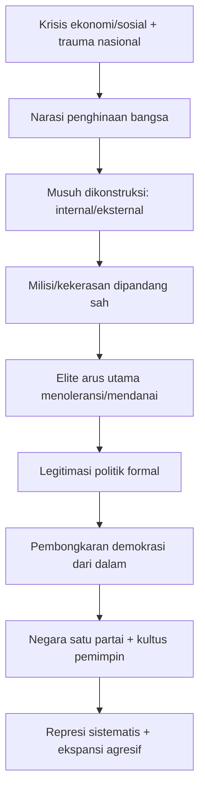
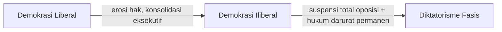
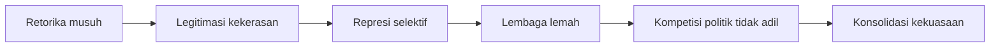

<YouTube url="https://www.youtube.com/watch?v=GV8KGcFqeLc" title="Is Fascism Back?" />

## 🧭 Pengantar: Kata “Fasis” Terlalu Sering Dipakai, Tapi Terlalu Jarang Dipahami

Di ruang publik hari ini, kata **“fasis”** dipakai sangat longgar: kadang untuk kritik serius, kadang untuk umpatan biasa. Akibatnya, dua bahaya terjadi sekaligus:

1. **Overuse** (pemakaian berlebihan) membuat istilah ini tumpul.
2. **Under-recognition** (gagal mengenali) membuat pola otoritarian yang nyata lolos dari perhatian.

Video ini menarik karena tidak berhenti di slogan “ini fasis” atau “ini bukan fasis.” Ia justru kembali ke **source code** (kode sumber) historis: bagaimana Mussolini dan Hitler benar-benar naik, langkah demi langkah, dari kelompok pinggiran jadi mesin negara total.

Dan dari sana, kita diajak pada pertanyaan penting: kalau bentuk abad ke-21 tidak sama persis dengan 1930-an, apakah esensinya bisa tetap sama? 🤔

---

## 🎯 Tesis Utama

Dari transkrip, ada satu kesimpulan kerja yang paling kuat:

> **Fasisme bukan sekadar label ideologi; ia adalah metode perebutan dan penguncian kekuasaan.**

Metodenya cenderung berulang:

- membangun narasi bangsa yang terhina,
- menunjuk musuh internal/eksternal,
- menormalkan kekerasan sebagai “obat keadaan darurat,”
- masuk ke arus utama lewat restu elite,
- lalu membongkar demokrasi dari dalam.

Perdebatan pakar terjadi bukan di “apakah pola itu berbahaya,” melainkan di **kapan tepatnya** kita boleh menyebutnya “fasisme” secara konseptual.

---

## 🧱 Asal-Usul Historis: Mengapa Fasisme Lahir di Eropa Pasca-Perang Dunia I

Untuk memahami fasisme, konteks pasca-Perang Dunia I wajib dipahami:

- ekonomi rusak,
- trauma sosial masif,
- institusi demokrasi rapuh,
- rasa malu nasional,
- ketakutan elite terhadap revolusi komunis.

Kondisi ini menciptakan “pasar politik” untuk proyek yang menjanjikan:

- ketertiban cepat,
- pemulihan kebanggaan nasional,
- musuh yang jelas untuk disalahkan,
- pemimpin tunggal yang “tegas.”

### Italia: dari “kemenangan yang tercabik” ke diktatorisme

Mussolini memulai dari klub kecil veteran perang, lalu:

1. memuliakan kekerasan,
2. membentuk milisi (Blackshirts),
3. menyerang sosialis/komunis,
4. didanai elite bisnis/tanah,
5. dilegitimasi masuk politik formal,
6. diangkat ke pusat kekuasaan,
7. membubarkan kebebasan sipil dan pemilu.

### Jerman: versi yang lebih ekstrem dan rasialis

Hitler mengadopsi banyak teknik yang mirip, tetapi menambahkan dimensi rasial yang jauh lebih sistematis dan genocidal (berujung genosida):

- mitos “ras unggul” (pseudo-science = sains semu),
- kambing hitam total pada Yahudi dan komunis,
- legalisasi kekuasaan darurat,
- pembubaran oposisi,
- ekspansi perang,
- pemusnahan industri skala negara.

---

## 🧬 “DNA Politik” Fasisme: Pola Berulang yang Muncul di Transkrip

Berikut inti pola (bukan checklist absolut), dirumuskan dari narasi sejarah Mussolini–Hitler:

### Elemen kunci yang konsisten

1. **Glorifikasi kekerasan** sebagai tanda ketegasan/kemurnian.
2. **Mitos masa lalu agung** yang katanya dirusak “musuh.”
3. **Pemimpin karismatik tunggal** sebagai inkarnasi bangsa.
4. **Anti-pluralisme** (anti keberagaman politik).
5. **Demokrasi dipakai sebagai kendaraan**, lalu dinonaktifkan.
6. **Propaganda dan fear politics** (politik ketakutan) untuk disiplin massa.

---

## 🧠 Mengapa Elite Arus Utama Sering Jadi Gerbang?

Bagian ini sangat penting dan sering dilupakan: dalam dua kasus besar itu, kelompok radikal tidak menang sendirian dari bawah. Mereka dibantu oleh kalkulasi elite yang merasa bisa “memakai” mereka untuk melawan lawan politik lain.

Biasanya motifnya:

- takut kehilangan harta/kekuasaan,
- takut gerakan kiri/revolusi,
- percaya kelompok radikal bisa “dikendalikan.”

Sejarah menunjukkan ini sering jadi salah hitung fatal. Setelah dapat legitimasi, kekuatan radikal justru mengambil alih penuh.

<Callout type="warning" title="Pelajaran Historis yang Berulang">
Salah satu sinyal bahaya terbesar bukan hanya massa radikal di jalan, tetapi saat elite mapan mulai menganggap mereka “alat yang berguna.”
</Callout>

---

## 📌 Perdebatan Pakar: “Fasisme” atau “Demokrasi Iliberal”?

Video menampilkan spektrum pendapat ahli. Ini justru sehat, karena memaksa ketelitian konsep.

### Posisi A — “Belum fasis penuh, tapi risikonya ada”

Argumen: selama pemilu, parlemen, dan konstitusi formal masih ada (meski cacat), belum bisa disebut fasisme klasik.

### Posisi B — “Istilah yang lebih tepat: illiberal democracy”

> **Illiberal democracy** = demokrasi prosedural (pemilu ada), tetapi hak-hak liberal (kebebasan sipil, perlindungan minoritas, independensi institusi) dikebiri.

Argumen: fokus ke label “fasisme” bisa menutupi kebaruan ancaman hari ini.

### Posisi C — “Fasisme abad 21 tak harus meniru 1933”

Argumen: sejarah tidak berulang secara fotokopi. Kalau menunggu semua kotak 1930-an tercentang dulu, bisa terlambat.

---

## 🔍 Fasisme vs Demokrasi Iliberal: Bedanya di Mana?

Agar tidak campur-aduk, ini peta sederhana:

### Demokrasi Liberal
- Pemilu kompetitif
- Pers relatif bebas
- Peradilan independen
- Hak minoritas dijaga

### Demokrasi Iliberal
- Pemilu masih ada, tapi arena timpang
- Media/oposisi ditekan
- Lembaga hukum dipolitisasi
- Mayoritarianisme ekstrem (suara mayoritas dipakai menekan hak)

### Diktatorisme Fasis
- Oposisi dibubarkan
- Satu partai/pemimpin tunggal
- Kekerasan politik sistemik
- Mobilisasi massal berbasis musuh + mitos bangsa

---

## 🗣️ Politik Mitos: “Bangsa Besar yang Dihina” sebagai Mesin Mobilisasi

Salah satu tema paling konsisten dalam transkrip adalah narasi:

- kita dulu agung,
- lalu dihancurkan pengkhianat/asing,
- pemulihan hanya mungkin lewat pemimpin keras,
- kompromi dianggap kelemahan,
- kekerasan dianggap pemurnian.

Ini disebut sebagian pakar sebagai **mythic politics** (politik mitos): orientasi politik bukan ke program masa depan berbasis data, melainkan ke fantasi restorasi masa lalu.

Bahayanya: setiap perbedaan bisa diperlakukan bukan sebagai kompetisi warga negara setara, tapi sebagai ancaman eksistensial yang “pantas disingkirkan.”

---

## 🧯 Kerangka Deteksi Dini (Early Warning) untuk Warga

Daripada berdebat label tanpa akhir, lebih berguna memantau indikator konkret:

### Indikator 1 — Normalisasi kekerasan politik
- Milisi/vigilante dipuji diam-diam
- Serangan pada lawan politik dianggap wajar

### Indikator 2 — Pelemahan institusi penyeimbang
- Peradilan, media, kampus, dan birokrasi independen diserang sebagai “musuh rakyat”

### Indikator 3 — Emergency politics permanen
- “Keadaan darurat” dijadikan dalih untuk menangguhkan hak dasar

### Indikator 4 — Dehumanisasi kelompok target
- Minoritas, oposisi, imigran, aktivis digambarkan sebagai parasit/pengkhianat

### Indikator 5 — Koalisi elite-radikalis
- Kelompok berkekerasan diberi toleransi karena dianggap “berguna”

---

## 🧩 Mengapa Debat Definisi Tetap Penting (Tapi Tidak Boleh Melumpuhkan Aksi)

Debat konseptual tetap perlu agar kita tidak sembarang menuduh. Namun ada jebakan:

- jika terlalu longgar, kata “fasisme” jadi umpatan kosong;
- jika terlalu ketat, kita baru bereaksi saat semuanya sudah terlambat.

Sikap matang adalah **ketat secara analitis, cepat secara kewaspadaan**.

Artinya:

- hindari label instan,
- tapi jangan menunggu pengulangan tragedi historis skala penuh dulu baru bertindak.

---

## 📚 Glosarium Istilah Asing + Padanan Indonesia

- **Fascism** → fasisme
- **Ultranationalism** → ultranasionalisme
- **Scapegoating** → pengambinghitaman
- **Mythologized past** → masa lalu yang dimitologikan
- **Illiberal democracy** → demokrasi iliberal
- **Liberal democracy** → demokrasi liberal (berbasis kebebasan/hak individual)
- **Mainstream legitimation** → legitimasi arus utama
- **State of emergency** → keadaan darurat negara
- **Rule of law** → supremasi hukum
- **Totalitarian** → totaliter (kontrol hampir total atas masyarakat)
- **Propaganda** → propaganda
- **Vigilante** → kelompok main hakim sendiri

---

## 🛠️ Apa yang Bisa Dilakukan Warga Biasa?

### 1) Rawat literasi sejarah
Pahami pola, bukan sekadar tanggal. Pola memberi kemampuan deteksi dini. 📖

### 2) Bedakan lawan politik vs musuh eksistensial
Begitu bahasa politik berubah jadi bahasa pemusnahan, alarm harus menyala.

### 3) Pertahankan institusi penyeimbang
Dukung pers independen, peradilan independen, dan organisasi sipil.

### 4) Tolak normalisasi kekerasan
Tidak ada “kekerasan kecil demi ketertiban besar.” Sejarah menunjukkan spiralnya.

### 5) Disiplin dalam bahasa
Jangan sembarang menempel label “fasis” pada semua hal; gunakan saat pola struktural benar-benar tampak.

<Callout type="success" title="Prinsip Praktis">
Ukuran kesehatan demokrasi bukan hanya ada tidaknya pemilu, tetapi apakah warga yang berbeda tetap bisa hidup setara, aman, dan bermartabat di bawah hukum yang sama.
</Callout>

---

## 🔚 Penutup: Tujuan Memahami Fasisme Bukan Menang Debat, Tapi Mencegah Kerusakan

Pelajaran paling jernih dari transkrip ini sederhana namun berat: **kebrutalan politik bukan anomali sejarah; ia kemungkinan yang selalu kembali bila kondisi memungkinkan.**

Karena itu, memahami fasisme bukan latihan akademik semata, dan bukan pula senjata retorik untuk menjatuhkan lawan. Ia adalah perangkat kewargaan untuk:

- mengenali pola dominasi,
- menolak politik kebencian,
- menjaga ruang demokrasi sebelum terkunci.

Kita mungkin tidak selalu sepakat pada label akhir—“fasisme”, “proto-fasisme”, atau “demokrasi iliberal.” Tetapi kita bisa sepakat pada satu hal moral yang praktis: ketika kekuasaan bergerak menuju dehumanisasi, kekerasan, dan pembungkaman, **diam bukan netral**. Diam adalah izin. ⚠️

---

## 🔗 Referensi

- Video: *Is Fascism Back?*  
  https://www.youtube.com/watch?v=GV8KGcFqeLc
- Transkrip video yang dilampirkan pengguna
