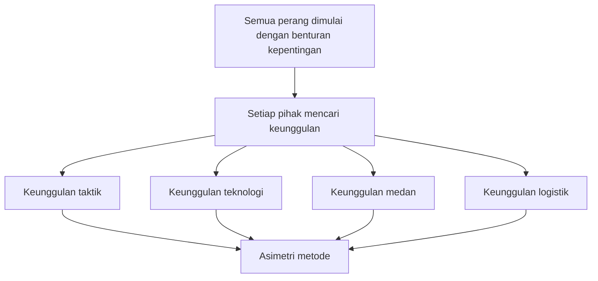
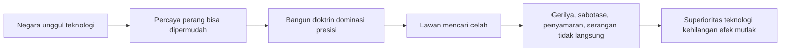
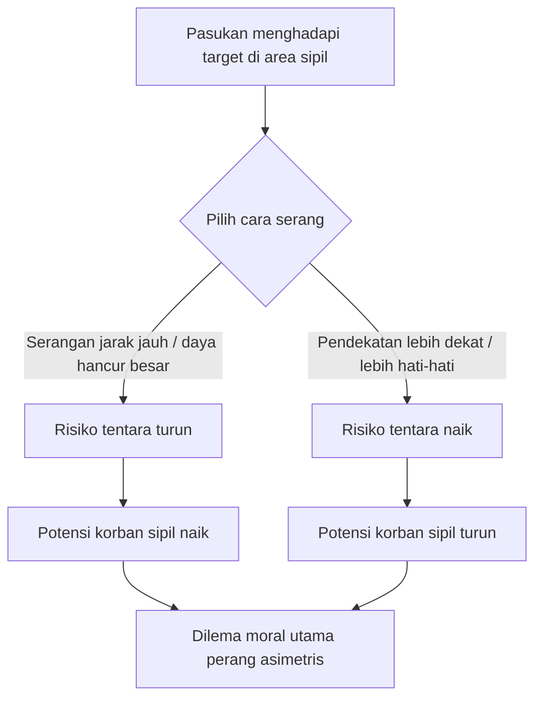

## 🎯 Pendahuluan: Mengapa “Perang Asimetris” Menjadi Salah Satu Konsep Paling Penting Sekaligus Paling Membingungkan?

Istilah **asymmetric warfare** — *perang asimetris* — sering terdengar di media, kajian militer, diskusi geopolitik, bahkan dalam pembenaran kebijakan negara. Tetapi justru karena sering dipakai, istilah ini sering terasa seolah sudah jelas, padahal belum tentu. Apa sebenarnya yang asimetris? Kekuatannya? Metodenya? Legalitasnya? Moralitasnya? Atau narasi yang dipakai untuk membenarkan tindakan masing-masing pihak? 🧠

Panel simposium yang menjadi dasar tulisan ini sangat menarik karena tidak memperlakukan perang asimetris sebagai slogan kosong. Para pembicara justru berangkat dari pertanyaan yang lebih mendasar: apakah konsep ini memang benar-benar membantu kita memahami perang, atau malah menutupi persoalan yang lebih besar?

Ada yang melihat istilah ini sebagai jargon yang kabur. Ada yang menganggapnya penting secara moral karena perang asimetris menciptakan beban etis yang jauh lebih berat pada level prajurit di lapangan. Ada pula yang membawa diskusi ini ke titik ekstrem: senjata nuklir, di mana asimetri bukan lagi sekadar soal siapa lebih kuat, tetapi soal hancurnya kemungkinan *self-preservation* — **mempertahankan diri** — dan *mutual aid* — **saling menolong** — sebagai dasar kemanusiaan itu sendiri. ☢️

Jadi tulisan ini tidak sekadar akan merangkum panel. Saya ingin membedahnya menjadi beberapa lapisan besar:

- apa itu perang asimetris,
- mengapa ia diperdebatkan,
- bagaimana ia mengubah hukum dan etika perang,
- mengapa warga sipil menjadi pusat persoalan,
- dan mengapa dalam bentuk paling ekstremnya, asimetri bisa menjelma menjadi ancaman bagi peradaban itu sendiri.

<Callout type="important" title="Tesis utama artikel ini">
Perang asimetris bukan sekadar perang antara pihak kuat dan pihak lemah. Ia adalah kondisi ketika aturan klasik perang — seperti front yang jelas, seragam yang jelas, target yang jelas, dan batas kombatan-sipil yang lebih tegas — mulai runtuh. Ketika itu terjadi, strategi, hukum, dan etika dipaksa bekerja di medan yang jauh lebih kabur, lebih brutal, dan lebih sulit dipertanggungjawabkan.
</Callout>

---

## 🗺️ 1. Perang Tidak Pernah Benar-Benar Simetris

Salah satu titik paling tajam dari panel ini datang dari gagasan bahwa **tidak ada perang yang benar-benar simetris**. Ini penting sekali. Karena sering kali, ketika kita mendengar istilah perang asimetris, kita membayangkan bahwa perang “normal” atau “klasik” sebelumnya bersifat seimbang, tertata, dan rapi. Padahal sejarah perang justru menunjukkan bahwa semua pihak selalu mencari keunggulan. ⚔️

Dalam Perang Dunia I misalnya, kebuntuan di front Barat memang tampak seperti duel statis antara dua kekuatan besar yang relatif sebanding. Namun kebuntuan itu sendiri justru memicu pencarian asimetri secara terus-menerus:

- Jerman mencari keunggulan lewat inovasi taktis,
- Sekutu mencari keunggulan lewat teknologi,
- Inggris memaksimalkan keunggulan maritim,
- Jerman membalas dengan perang kapal selam.

Artinya, bahkan dalam perang yang tampak paling “simetris” pun, setiap pihak sebenarnya sedang berburu celah asimetri. Mereka mencari titik lemah lawan, medan yang menguntungkan, alat yang belum bisa dijawab, atau cara bertempur yang membuat keseimbangan pecah.

Dari sini kita mendapat satu pelajaran penting: **asimetri bukan penyimpangan dari perang; ia justru melekat pada logika perang itu sendiri**. Yang berubah hanyalah bentuknya.

---

## 🧩 2. Jadi, Apa Itu Asymmetric Warfare?

Meski semua perang memiliki unsur asimetri, panel ini membantu kita melihat bahwa istilah **asymmetric warfare** biasanya dipakai untuk menyebut situasi yang lebih spesifik. Setidaknya ada beberapa arti yang berbeda.

### a. Asimetri kekuatan
Ini pengertian paling umum: satu pihak jauh lebih kuat daripada pihak lain. Negara besar melawan kelompok kecil, militer modern melawan gerilya, atau kekuatan udara canggih melawan aktor non-negara.

### b. Asimetri aktor
Di sini yang berbeda bukan hanya kekuatan, tetapi jenis pelakunya. Misalnya negara melawan organisasi non-negara seperti Al-Qaeda atau Hamas. Ini penting karena hukum perang klasik banyak dibangun dengan asumsi bahwa yang berperang adalah entitas negara yang relatif serupa.

### c. Asimetri bentuk perang
Ini mungkin definisi paling menarik dari panel: perang asimetris adalah perang ketika salah satu pihak berusaha **menghapus dua ciri klasik perang**, yaitu **uniform** — *seragam* — dan **front** — *garis depan / medan tempur yang jelas*. 👥

Dalam perang klasik, kombatan membedakan diri dari sipil dengan seragam, dan pertempuran relatif terkonsentrasi di front tertentu. Dalam perang asimetris, pembedaan itu dikaburkan:

- kombatan bercampur dengan lingkungan sipil,
- medan tempur menyebar,
- ancaman bisa muncul di mana saja,
- dan keputusan moral tidak lagi berada hanya di tingkat jenderal, tetapi turun ke level prajurit biasa.

Definisi ketiga ini sangat kuat karena tidak sekadar berbicara tentang “siapa lebih kuat”, melainkan tentang **kerusakan pada struktur pembeda yang membuat perang masih bisa diatur secara hukum dan etika**.

---

## 🧠 3. Kritik Terhadap Istilah Ini: Jangan-Jangan “Perang Asimetris” Hanya Jargon?

Salah satu pembicara justru memulai dari posisi skeptis: dari sudut pandang praktisi, istilah perang asimetris sering tidak terlalu berguna. Mengapa? Karena ia bisa menjadi jargon yang mengaburkan masalah. Alih-alih menjelaskan, ia malah memberi kesan bahwa kita sedang menghadapi sesuatu yang benar-benar baru, padahal mungkin tidak. 🌀

Argumen ini sangat penting. Kadang negara besar menggunakan istilah seperti ini untuk menghindari pengakuan yang lebih jujur. Misalnya:

- bukan mengakui bahwa strategi mereka gagal menghadapi perlawanan populer,
- atau bahwa okupasi memicu resistensi,
- mereka justru menyebut lawan sebagai “tantangan asimetris” seolah itu adalah fenomena teknis baru.

Dalam kerangka ini, istilah perang asimetris bisa dipakai sebagai selimut bahasa. Ia membuat kegagalan tampak seperti komplikasi intelektual, bukan kesalahan strategis atau politik.

Contoh yang paling jelas adalah invasi AS ke Irak 2003. Fase awal “shock and awe” — *kejut dan gentar* — berhasil menggulingkan rezim Saddam Hussein dengan cepat. Tetapi keberhasilan militer awal itu tidak diterjemahkan menjadi stabilitas politik. Pendudukan memicu perlawanan, negara runtuh ke dalam kekacauan, dan militer yang dibangun untuk dominasi teknologi ternyata tidak sanggup mengelola realitas sosial-politik pasca invasi.

Di titik itulah, istilah “asymmetric warfare” mulai dipakai luas. Kritiknya sederhana: **mungkin masalah utamanya bukan perang yang asimetris, tetapi keyakinan keliru bahwa teknologi superior bisa menyederhanakan perang**.

<Callout type="warning" title="Bahaya jargon strategis">
Kalau sebuah istilah membuat kita lupa pada sebab politik perang, lupa pada efek pendudukan, lupa pada resistensi rakyat, dan lupa pada kesalahan strategi, maka istilah itu tidak membantu. Ia hanya membuat kegagalan terdengar lebih canggih.
</Callout>

---

## 🚀 4. RMA: Mimpi tentang Teknologi yang Akan Menyelesaikan Perang

Diskusi panel ini juga menyentuh sebuah gagasan penting dari era pasca-Perang Dingin: **Revolution in Military Affairs (RMA)** — *Revolusi dalam Urusan Militer*. Gagasan ini sangat berpengaruh pada 1990-an. Intinya adalah keyakinan bahwa teknologi informasi, senjata presisi, komunikasi cepat, *stealth aircraft* (pesawat siluman), drone, dan sistem digital akan mengubah hakikat perang. 📡

Kalau diterjemahkan secara sederhana, RMA menjanjikan ini:

- perang akan lebih cepat,
- lebih presisi,
- lebih efisien,
- lebih sedikit korban di pihak sendiri,
- dan superioritas militer akan menjadi hampir permanen.

Bagi Amerika Serikat, gagasan ini sangat menggoda. Karena jika teknologi bisa menjamin dominasi, maka perang bukan lagi kubangan ketidakpastian yang brutal, melainkan masalah manajemen sistem.

Tetapi panel ini sangat tegas: **RMA adalah ilusi berbahaya jika diperlakukan sebagai formula kemenangan universal**.

Mengapa? Karena perang bukanlah mesin yang patuh pada diagram teknis. Setiap cara berperang akan mengundang lawan untuk mencari *workaround* — **jalan memutar / cara mengakali kelemahan sistem itu**. Kalau satu pihak terlalu bergantung pada satu model, lawan akan beradaptasi.

Jadi pelajaran utamanya begini: **setiap superioritas menciptakan insentif bagi lahirnya kontra-superioritas**. Itulah jantung asimetri.

---

## 👤 5. Ketika Seragam dan Front Menghilang: Beban Moral Turun ke Prajurit Biasa

Di bagian inilah panel menjadi sangat dalam secara etis. Ketika perang tidak lagi punya front yang jelas dan lawan tidak membedakan diri dari lingkungan sipil dengan seragam, maka persoalan moral tidak lagi hanya berada di level kabinet perang atau markas besar. Ia turun ke level terendah: **prajurit di lapangan**. 🪖

Bayangkan situasi ini:

- seseorang berdiri di atap rumah,
- apakah ia sipil yang ketakutan,
- pengintai,
- kurir,
- atau kombatan?

Ia memegang sesuatu di tangan.

- Apakah itu pipa?
- senapan?
- alat komunikasi?

Dalam perang konvensional, banyak keputusan seperti itu tidak dominan. Target lebih mudah dikenali. Kombatan punya seragam. Garis perang lebih jelas. Tetapi dalam perang asimetris, seorang prajurit biasa bisa dipaksa membuat keputusan yang secara moral setara dengan keputusan strategis tingkat tinggi.

Itulah mengapa panel ini menekankan bahwa perang asimetris menciptakan **immense moral burden** — *beban moral yang sangat besar*. Bukan hanya karena risikonya tinggi, tetapi karena kesalahan identifikasi bisa membunuh orang yang tidak bersalah, sementara keterlambatan bertindak bisa membunuh rekan sendiri.

Ini juga berarti bahwa pendidikan moral militer tidak bisa lagi hanya berupa hafalan abstrak tentang:

- proportionality (*proporsionalitas*),
- distinction (*pembedaan kombatan dan sipil*),
- necessity (*keharusan militer*),
- dan responsibility (*tanggung jawab*).

Semua itu harus diubah menjadi *muscle memory* — **ingatan refleks yang dilatih berulang-ulang** — agar prajurit dapat mengambil keputusan di bawah tekanan tanpa lumpuh total.

---

## ⚖️ 6. Prinsip Distinction: Siapa Kombatan, Siapa Sipil?

Salah satu prinsip paling manusiawi dalam hukum perang adalah **distinction** — *pembedaan antara kombatan dan non-kombatan*. Dalam perang klasik, prinsip ini relatif lebih mudah diterapkan. Yang berseragam adalah kombatan. Yang tidak, umumnya sipil.

Tetapi dalam perang asimetris, prinsip ini langsung terguncang. Kalau lawan tidak memakai seragam dan sengaja bercampur dengan lingkungan sipil, maka definisi kombatan tidak bisa lagi bersifat *wholesale* — **pukul rata**. Ia harus menjadi *retail* — **kasus per kasus**. 🧾

Artinya, identifikasi target harus bergantung pada tindakan nyata seseorang:

- apakah ia sedang berpartisipasi langsung dalam ancaman,
- apakah ia bagian dari rantai sebab-akibat yang menghasilkan serangan,
- apakah ia operatif, pengintai, penyimpan senjata, atau hanya warga biasa.

Secara teori ini masuk akal. Secara praktik, ini sangat rumit. Karena perang tidak memberi jeda panjang untuk filsafat. Dan justru di titik itulah tragedi perang asimetris terjadi: hukum menuntut ketelitian tinggi, sementara medan memaksa keputusan cepat.

---

## 💥 7. Collateral Damage dan Principle of Responsibility

Ketika kombatan bercampur dengan sipil, hampir setiap serangan ke target yang dianggap sah berpotensi menciptakan **collateral harm** atau **collateral damage** — *kerugian sampingan / korban sipil yang timbul sebagai efek serangan terhadap target militer*. Ini salah satu jantung persoalan perang asimetris. 🏚️

Panel ini menyoroti sebuah prinsip penting: **principle of responsibility** — *prinsip tanggung jawab*. Intinya, fakta bahwa lawan menempatkan dirinya di tengah warga sipil tidak otomatis membebaskan pihak penyerang dari tanggung jawab moral. Sebaliknya, pihak penyerang tetap harus menunjukkan bahwa ia sudah melakukan segala hal yang mungkin untuk meminimalkan korban sipil.

Itu bisa berarti:

- memilih amunisi yang lebih presisi,
- memilih waktu serangan yang lebih aman,
- memberi peringatan dini,
- menunda serangan,
- mengubah sudut serang,
- atau bahkan membatalkan serangan.

Di sini perang asimetris memaksa kita berpikir lebih jujur. Kadang orang ingin jawaban simpel: “Kalau lawan bersembunyi di antara sipil, salah mereka sendiri.” Tetapi secara etika perang, jawabannya tidak sesederhana itu. Anda tetap bertanggung jawab atas cara Anda menggunakan kekuatan.

---

## 🩸 8. Pertanyaan Tersulit: Bolehkah Prajurit Menanggung Risiko Lebih Besar untuk Melindungi Sipil?

Ini mungkin bagian paling berat secara moral dalam seluruh panel. Pertanyaannya sederhana tetapi kejam:

> Apakah tentara wajib menanggung risiko lebih besar agar warga sipil di pihak lawan tidak terlalu banyak menjadi korban?

Jawaban salah satu panelis sangat tegas: **ya, dalam batas tertentu mereka harus**. Karena kalau logikanya adalah “jangan ambil risiko apa pun untuk diri sendiri”, maka cara paling mudah untuk aman adalah menggunakan daya hancur besar dari jauh. Tapi justru itulah yang akan memperbesar korban sipil. 😔

Contohnya sangat konkret:

- pengeboman dari ketinggian tinggi lebih aman bagi pilot, tetapi kurang presisi;
- dukungan tembakan besar-besaran melindungi pasukan sendiri, tetapi bisa menghancurkan area sipil;
- menyerang rumah dari udara lebih aman bagi tentara, tetapi lebih berbahaya bagi penghuni;
- masuk dengan berjalan kaki lebih berisiko bagi tentara, tetapi bisa mengurangi korban sipil.

Di sini muncul dilema etis yang sangat tajam: **berapa banyak risiko yang layak diambil tentara demi menyelamatkan sipil?**

Panel ini tidak memberi angka pasti — memang mustahil. Tetapi ia menegaskan sebuah arah moral: tentara tidak boleh memperlakukan keselamatan warga sipil lawan sebagai beban yang sepenuhnya bisa diabaikan.

---

## 🧪 9. Risiko, Profesionalisme, dan Brutalitas

Ada argumen yang sangat menarik dalam panel ini: kalau tentara diajari untuk selalu menghindari risiko pribadi secara mutlak, hasilnya bisa justru **kurang profesional dan lebih brutal**. Mengapa? Karena mereka akan terdorong memilih solusi paling aman bagi diri sendiri, bukan solusi paling tepat secara moral atau taktis. 🔍

Dengan kata lain, ada hubungan antara:

- profesionalisme,
- disiplin moral,
- dan kesediaan menanggung risiko terbatas.

Kalau tentara tahu bahwa ia tetap harus mempertimbangkan warga sipil meski itu membuat operasinya lebih rumit, maka ia dipaksa berpikir lebih teliti. Tapi kalau semua diarahkan ke satu prinsip tunggal — “lindungi tubuhmu sendiri apa pun caranya” — maka seluruh horizon moral menyempit.

Ini poin yang sangat dalam, karena ia menunjukkan bahwa problem perang asimetris bukan hanya soal hukum, tetapi juga soal **pembentukan karakter moral dalam institusi kekerasan**.

---

## 🏙️ 10. Dari Hiroshima ke Senjata Nuklir: Bentuk Asimetri yang Paling Ekstrem

Setelah membahas perang asimetris pada level konvensional, panel ini bergerak ke bentuk paling ekstrem: **senjata nuklir**. Dan di sini, diskusi asimetri berubah skala total. Kalau perang konvensional masih bergulat dengan seragam, front, dan korban sipil, perang nuklir mengancam menghancurkan dasar-dasar kehidupan itu sendiri. ☢️🔥

Argumen panelis di sini sangat kuat: senjata nuklir tidak hanya merusak tubuh dan kota. Ia juga merusak **civic stature** — *martabat kewargaan / kapasitas kita sebagai warga yang bisa saling melindungi*. Mengapa? Karena dalam perang nuklir:

- hak mempertahankan diri praktis runtuh,
- kapasitas saling menolong juga runtuh,
- rumah sakit ikut hancur,
- sistem pertolongan darurat lumpuh,
- dan skala kematian melampaui kemampuan empati biasa.

Di sini muncul istilah yang sangat penting: **statistical compassion** — *belas kasih statistik*. Kita relatif mampu berempati pada satu ibu dan satu anak di Hiroshima. Tetapi sangat sulit benar-benar membayangkan jutaan orang terbakar, tersedak radiasi, kehilangan fasilitas kesehatan, lalu mati dalam hitungan jam atau minggu.

Di titik ini, asimetri nuklir berarti satu hal: **segelintir orang dapat membinasakan populasi yang luar biasa besar tanpa memberi ruang pembelaan yang sepadan**.

---

## 🏥 11. Target Militer vs Target Sipil dalam Perang Nuklir: Distingsinya Nyaris Runtuh

Dalam perang konvensional, kita masih bisa membedakan target militer dan target sipil. Tidak sempurna, tetapi secara prinsip masih mungkin. Dalam perang nuklir, panel ini menunjukkan bahwa perbedaan itu mulai runtuh. Karena bahkan serangan ke target yang disebut “militer” tetap akan menewaskan sangat banyak sipil akibat:

- ledakan,
- kebakaran,
- radiasi,
- runtuhnya rumah sakit,
- air yang terkontaminasi,
- dan efek *fallout* (sebaran radioaktif).

Artinya, bahkan bila seorang perencana perang berkata, “Saya hanya menargetkan fasilitas pertahanan,” realitas fisiknya tidak tunduk begitu saja pada bahasa hukum. Senjata nuklir punya radius dan dampak yang begitu besar sehingga kategori hukum klasik menjadi amat goyah. 🏥

Ini penting karena menunjukkan bahwa tidak semua teknologi kekerasan bisa ditundukkan dengan mudah oleh etika perang lama. Ada titik ketika alat yang dipakai begitu destruktif sehingga struktur normatif yang biasa kita gunakan mulai tidak memadai.

---

## 🌍 12. North-South Divide: Ketimpangan Global dalam Kepemilikan Nuklir

Ada dimensi lain yang sangat menarik dari panel ini, yaitu pembacaan bahwa masalah nuklir juga merupakan masalah **North-South divide** — *kesenjangan Utara-Selatan*. Dalam peta global, negara-negara besar di Utara global menguasai sebagian terbesar arsenal nuklir, sementara negara-negara lain justru hidup di bawah bayangannya. 🌐

Ini menimbulkan kontradiksi moral yang serius. Negara-negara pemilik arsenal besar sering tampil sebagai penjaga keteraturan global, tetapi pada saat yang sama memelihara instrumen kehancuran terbesar dalam sejarah manusia. Sementara negara-negara lain diingatkan untuk tidak memiliki senjata yang sama.

Di sini terlihat bahwa asimetri bukan hanya soal perang, tetapi juga soal **siapa yang berhak mengancam dan siapa yang dilarang**. Ini adalah masalah kekuasaan dunia, bukan semata teknologi.

---

## 📜 13. Hukum Internasional: Cukupkah Ia Menghadapi Perang Asimetris?

Panel ini terus-menerus kembali pada satu kegelisahan: hukum internasional dibangun dengan banyak asumsi yang lahir dari perang yang lebih klasik. Ketika perang berubah menjadi lebih cair, lebih terdesentralisasi, lebih bercampur dengan sipil, dan lebih ditentukan oleh aktor non-negara, hukum sering tampak terlalu umum, terlalu permisif, atau terlalu tidak siap. ⚖️

Pada perang konvensional asimetris, problemnya adalah:

- definisi kombatan menjadi kabur,
- proportionality sulit diukur,
- collateral harm hampir tak terhindarkan,
- dan keputusan moral berpindah ke level mikro.

Pada perang nuklir, problemnya lebih ekstrem:

- skala kerusakan melampaui kategori hukum biasa,
- target militer dan sipil tidak lagi bisa dibedakan dengan bersih,
- dan prinsip-prinsip kemanusiaan kehilangan daya operasional praktis.

Dengan kata lain, hukum internasional tetap penting, tetapi panel ini mengingatkan bahwa **hukum tidak boleh diperlakukan sebagai mesin otomatis yang selalu siap untuk segala jenis perang**. Kadang ia harus dibaca ulang, ditafsir ulang, bahkan diperluas secara normatif.

---

## 🏛️ 14. Narasi Juga Medan Perang

Meskipun panel ini sangat kaya pada strategi dan hukum, judulnya juga mencantumkan kata **narrative** — *narasi*. Dan ini sangat penting. Dalam perang asimetris, narasi sering sama pentingnya dengan peluru. 🗣️

Mengapa? Karena setiap pihak ingin menentukan siapa yang terlihat sebagai:

- agresor,
- korban,
- pembela diri,
- pelanggar hukum,
- atau pihak yang “terpaksa” bertindak.

Negara kuat sering membingkai diri sebagai penjaga ketertiban yang sedang menghadapi lawan tak beraturan. Sebaliknya, pihak yang lebih lemah sering membingkai dirinya sebagai perlawanan sah terhadap dominasi yang tidak adil.

Narasi ini bukan hiasan. Ia memengaruhi:

- dukungan internasional,
- legitimasi moral,
- penerimaan publik domestik,
- dan ruang gerak hukum.

Jadi kalau kita ingin memahami perang asimetris secara utuh, kita tidak boleh berhenti pada medan tempur. Kita juga harus melihat **siapa yang berhasil mendefinisikan cerita perang itu sendiri**.

---

## 🇮🇩 15. Relevansinya untuk Pembaca Indonesia

Mengapa diskusi akademik seperti ini penting untuk pembaca Indonesia? Karena Indonesia hidup di dunia yang semakin dipenuhi konflik yang bentuknya tidak lagi klasik. Kita mungkin tidak sedang menjadi pihak utama dalam perang besar, tetapi kita hidup di bawah bayangannya: dari krisis energi, terorisme, perang proksi, konflik urban, sampai tekanan geopolitik di kawasan. 🌏

Memahami perang asimetris penting agar kita tidak terjebak pada dua kesalahan besar:

### Kesalahan pertama: percaya bahwa teknologi otomatis menyelesaikan perang
Sejarah justru menunjukkan teknologi sering hanya memindahkan masalah ke bentuk lain.

### Kesalahan kedua: percaya bahwa pihak lemah otomatis lebih benar secara moral
Tidak semua resistensi sah secara etis. Menyerang warga sipil tetap salah, bahkan bila dilakukan oleh pihak yang lebih lemah.

Bagi Indonesia, pelajaran terbesarnya adalah: **ketahanan tidak cukup hanya militer, tetapi juga hukum, etika, pendidikan, dan kemampuan membaca narasi global**.

---

## 📌 16. Kesimpulan: Perang Asimetris Adalah Krisis Pembeda

Kalau harus dipadatkan ke satu kalimat, perang asimetris adalah **krisis pembeda**. Ia merusak pembeda antara:

- depan dan belakang,
- kombatan dan sipil,
- target dan lingkungan,
- strategi dan kriminalitas,
- teknologi dan moralitas,
- bahkan antara kemenangan militer dan kegagalan politik.

Itulah sebabnya istilah ini penting, meskipun memang berisiko menjadi jargon. Ia penting bukan karena otomatis menjelaskan semuanya, tetapi karena memaksa kita melihat bahwa perang modern semakin sering berlangsung di wilayah abu-abu. ☁️

Panel ini memberi tiga pelajaran besar.

Pertama, perang tidak pernah bebas dari pencarian asimetri. Semua pihak selalu mencari keunggulan.

Kedua, ketika seragam dan front menghilang, beban moral perang menjadi jauh lebih berat, terutama bagi prajurit biasa dan warga sipil.

Ketiga, dalam bentuk paling ekstrem seperti senjata nuklir, asimetri bukan lagi sekadar strategi, melainkan ancaman terhadap syarat paling dasar dari kehidupan bersama: kemampuan manusia untuk mempertahankan diri dan saling menolong.

Jadi, memahami perang asimetris bukan berarti memakluminya. Justru sebaliknya. Itu adalah usaha untuk melihat dengan jernih bagaimana perang modern bekerja, bagaimana ia membenarkan dirinya, dan bagaimana hukum serta etika harus terus berjuang agar tidak hancur di bawah tekanan medan tempur yang makin kabur.

---

## 🔖 Catatan Penutup

Artikel ini disusun dari transkrip panel akademik *Asymmetric Warfare: A Symposium | Panel 1: Strategy, Law, and Narrative* dan diolah ulang menjadi uraian analitis berbahasa Indonesia yang lebih terstruktur untuk pembaca umum dan pembaca BangunAI Blog.

## 📚 Sumber Dasar

- Transkrip panel: *Asymmetric Warfare: A Symposium | Panel 1: Strategy, Law, and Narrative*
- Sumber video: YouTube (`https://www.youtube.com/watch?v=GaiqpVsF4rM`)
