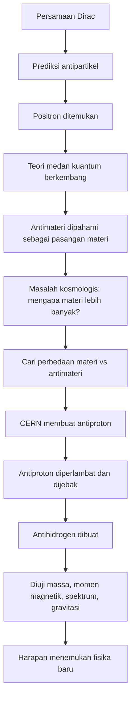
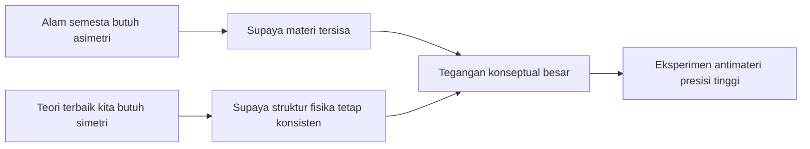
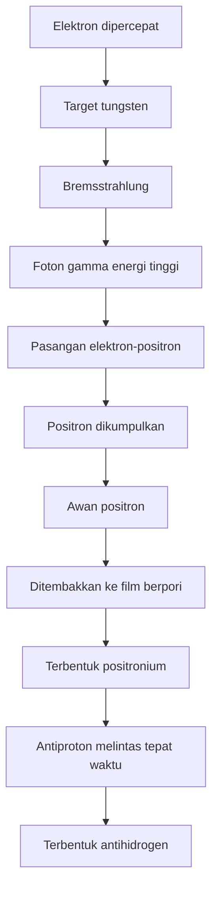

## ⚛️ Pendahuluan: Antimateri Bukan Sekadar Bahan Cerita Fiksi, tetapi Jendela ke Misteri Terdalam Alam Semesta

Kalau mendengar kata **antimateri** (*antimatter* = antimateri), banyak orang langsung membayangkan ledakan dahsyat, senjata super, atau adegan film yang terasa seperti gabungan antara sains dan fiksi ilmiah. Itu tidak aneh. Dalam budaya populer, antimateri hampir selalu digambarkan sebagai sesuatu yang ekstrem, berbahaya, mahal, dan nyaris mistis. Gambaran itu tidak sepenuhnya salah 😮, tetapi juga sering menyesatkan.

Secara fisika, antimateri memang luar biasa. Ketika materi dan antimateri bertemu, keduanya bisa mengalami **anihilasi** (*annihilation* = saling memusnahkan), dan hampir seluruh massa gabungan mereka berubah menjadi energi sesuai persamaan terkenal Einstein:

$$
E = mc^2
$$

Ini membuat antimateri tampak seperti “bahan paling eksplosif” yang diizinkan oleh hukum fisika. Namun justru karena sangat reaktif terhadap materi biasa, antimateri bukan sesuatu yang mudah disimpan, dipindahkan, apalagi diproduksi dalam jumlah besar. Di dunia nyata, antimateri bukan bahan bom praktis 💥, melainkan objek riset yang sangat sulit dibuat, sangat sulit dijaga tetap hidup, dan sangat berharga secara ilmiah.

Video yang Mas Hendra kirim membahas salah satu tempat paling penting di dunia untuk riset antimateri: **CERN Antimatter Factory**. Dari sana kita melihat sesuatu yang sangat menarik. CERN tidak membuat antimateri untuk gaya-gayaan teknologi. Mereka melakukannya karena ada satu pertanyaan besar yang sampai hari ini belum benar-benar terjawab:

**Mengapa alam semesta berisi jauh lebih banyak materi daripada antimateri?**

Pertanyaan ini bukan detail kecil. Ini pertanyaan yang berkaitan langsung dengan alasan mengapa bintang ada, planet ada, lautan ada, tubuh kita ada, dan mengapa kita bisa duduk sambil memikirkan semua ini 🌌. Jika pada awal alam semesta materi dan antimateri diciptakan dalam jumlah persis sama, maka logika sederhananya: keduanya akan saling melenyapkan dan yang tersisa hanyalah radiasi. Tetapi itu jelas bukan dunia yang kita huni sekarang.

Jadi, ketika ilmuwan CERN membuat antiproton, memperlambatnya, menjebaknya dalam perangkap elektromagnetik, lalu menggabungkannya dengan positron untuk membentuk antihidrogen, mereka sebenarnya sedang melakukan sesuatu yang sangat mendasar: **menguji apakah antimateri benar-benar identik dengan materi, kecuali tanda muatannya saja**. Jika ada perbedaan sangat kecil sekalipun, itu bisa menjadi pintu menuju fisika baru 🔓.

Artikel ini akan membedah topik tersebut secara runtut, panjang, dan sedalam mungkin. Saya akan jelaskan bukan hanya *apa* yang dilakukan CERN, tetapi juga *mengapa* mereka melakukannya, *bagaimana* tiap tahap bekerja, dan *apa makna kosmologisnya* bagi pertanyaan besar tentang asal-usul alam semesta. Setiap istilah asing penting akan saya beri padanan Indonesianya juga agar tetap enak diikuti.

<Callout type="important" title="Tesis utama artikel ini">
Riset antimateri di CERN bukan terutama soal membuat zat supermahal atau superberbahaya, melainkan tentang menguji fondasi fisika modern: kesimetrian alam, asal dominasi materi di alam semesta, dan kemungkinan adanya fisika baru di luar *Standard Model* (Model Standar).
</Callout>

---

## 🧭 Peta Besar Pembahasan: Dari Dirac sampai Antiatom Jatuh 20 Sentimeter

Sebelum masuk ke detail teknis, ada baiknya kita lihat dulu alur besar persoalannya. Antimateri bukan topik yang berdiri sendiri. Ia menghubungkan beberapa cabang fisika sekaligus:

1. **Mekanika kuantum** (*quantum mechanics* = teori perilaku dunia mikroskopik)
2. **Relativitas khusus** (*special relativity* = teori ruang-waktu untuk gerak berkecepatan tinggi)
3. **Teori medan kuantum** (*quantum field theory* = kerangka yang memandang partikel sebagai eksitasi medan)
4. **Kosmologi Big Bang** (*Big Bang cosmology* = studi asal-usul dan evolusi alam semesta)
5. **Fisika partikel eksperimental** (*experimental particle physics* = eksperimen partikel energi tinggi)
6. **Gravitasi** (*gravity* = gaya tarik yang hingga kini belum sepenuhnya menyatu dengan teori kuantum)

Urutannya kurang lebih seperti ini:

Kalau disederhanakan, semua eksperimen di CERN itu berada di simpang jalan antara dua dorongan besar. Pertama, dorongan untuk **mengukur sangat presisi** apakah antimateri sama dengan materi. Kedua, dorongan untuk **menemukan retakan** sekecil apa pun pada simetri itu.

Kalau hasilnya sama persis, fisika yang kita punya makin kuat. Kalau ada perbedaan, sekecil apa pun, itu bisa menjadi revolusi. Jadi dari sisi ilmiah, kedua hasil itu sama-sama berharga 📌.

---

## 🧠 1. Dari Mana Gagasan Antimateri Berasal? Jejaknya Dimulai dari Persamaan Dirac

Antimateri tidak lahir pertama-tama dari eksperimen, tetapi dari **teori**. Ini salah satu momen paling indah dalam sejarah sains: matematika mengisyaratkan sesuatu yang belum pernah dilihat, lalu alam membenarkannya.

Pada akhir 1920-an, fisikawan Inggris **Paul Dirac** mencoba melakukan sesuatu yang sangat ambisius: menyatukan mekanika kuantum dengan relativitas khusus. Hasilnya adalah **persamaan Dirac** (*Dirac equation* = persamaan gelombang relativistik untuk elektron). Persamaan ini sangat elegan dan sangat kuat, tetapi membawa satu kejutan besar.

Untuk elektron yang diam, persamaan itu memberi dua kemungkinan energi:

$$
E = +mc^2 \quad dan \quad E = -mc^2
$$

Masalahnya, apa arti energi negatif? Pada pandangan pertama, solusi ini tampak seperti gangguan matematis yang tidak masuk akal. Banyak orang mungkin akan tergoda membuangnya begitu saja. Tetapi Dirac tidak melakukan itu. Ia memilih jalan yang jauh lebih berani: mungkin solusi energi negatif ini menunjukkan keberadaan partikel baru yang belum dikenal fisika saat itu.

Partikel ini harus memiliki:

- massa yang sama dengan elektron,
- spin yang sama,
- tetapi muatan listrik yang berlawanan.

Dengan kata lain, kalau elektron bermuatan negatif, pasangan barunya harus bermuatan positif. Itulah yang kemudian kita sebut **antielektron**, atau **positron** (*positron* = antielektron).

Keajaibannya, tak lama kemudian positron benar-benar ditemukan di alam. Jadi antimateri pada awalnya bukan fantasi, melainkan konsekuensi logis dari teori yang serius. Ini salah satu contoh klasik bahwa dalam fisika, matematika yang benar sering lebih “tahu” duluan daripada intuisi manusia ✨.

<Callout type="info" title="Kosakata penting">
- **Antipartikel** (*antiparticle*) = pasangan dari partikel biasa dengan massa sama dan muatan berlawanan.
- **Positron** = antielektron.
- **Antiproton** = pasangan proton dengan muatan negatif.
- **Antihidrogen** = antiatom hidrogen, terdiri dari satu antiproton dan satu positron.
</Callout>

---

## 🌌 2. Mengapa Antimateri Begitu Penting? Karena Ia Menyentuh Misteri “Kenapa Kita Ada”

Setelah antimateri dipahami dalam kerangka **teori medan kuantum**, fisikawan menyadari sesuatu yang lebih besar. Hampir setiap partikel fundamental tampaknya memiliki pasangan antipartikel. Elektron punya positron. Proton punya antiproton. Dan dalam banyak proses, materi dan antimateri bisa diciptakan atau dimusnahkan berpasangan.

Ketika partikel dan antipartikel bertemu, keduanya bisa saling anihilasi dan energi mereka berpindah ke medan lain—misalnya menjadi foton. Sebaliknya, dua foton berenergi cukup tinggi juga bisa menghasilkan pasangan partikel-antipartikel. Ini disebut **produksi pasangan** (*pair production* = pembentukan pasangan partikel dari energi).

Nah, dalam alam semesta sangat awal, segera setelah Big Bang, suhu dan energi luar biasa tinggi. Pada kondisi seperti itu, produksi pasangan terjadi terus-menerus. Foton bertumbukan dan menghasilkan materi serta antimateri. Materi dan antimateri lalu saling anihilasi lagi. Semua berlangsung dalam “sup kosmik” yang sangat panas dan padat 🔥.

Masalah besarnya adalah ini: jika hukum fisika memperlakukan materi dan antimateri secara hampir sempurna simetris, mestinya jumlah keduanya juga hampir sama. Jika jumlahnya sama, maka ketika alam semesta mendingin, mereka akan saling melenyapkan hampir seluruhnya.

Artinya, secara intuitif, yang tersisa mestinya hanya radiasi. Tidak ada atom stabil. Tidak ada bintang. Tidak ada kimia. Tidak ada biologi. Tidak ada kita.

Tetapi faktanya alam semesta sekarang jelas **didominasi materi**. Itulah yang disebut **asimetri materi-antimateri** (*matter-antimatter asymmetry* = ketidakseimbangan jumlah materi dan antimateri).

Angka yang dijelaskan dalam video sangat memukau. Kira-kira, untuk setiap **satu miliar** pasangan materi-antimateri di alam semesta awal, setelah hampir semuanya saling anihilasi, masih ada **satu partikel materi** yang tersisa. Satu per miliar inilah yang kemudian menjadi seluruh bintang, galaksi, planet, pohon, lautan, dan manusia 🌍.

Jadi, ketika kita bertanya “mengapa antimateri penting?”, jawabannya bukan sekadar karena ia langka. Antimateri penting karena ia berkaitan dengan pertanyaan paling mendasar: **apa yang menyebabkan ketidakseimbangan kecil itu?**

---

## ⚖️ 3. Simetri Alam: C, P, T, dan Mengapa Fisikawan Sangat Peduli

Untuk memahami mengapa misteri ini begitu susah, kita perlu singgah pada konsep **simetri** (*symmetry* = invariansi hukum fisika ketika suatu transformasi diterapkan). Dalam fisika modern, simetri bukan cuma soal keindahan. Ia adalah bahasa yang menjelaskan apa yang boleh dan tidak boleh terjadi.

Tiga simetri penting yang dibahas adalah:

### A. C — Charge Symmetry / Simetri Muatan
Kalau semua muatan positif ditukar menjadi negatif, dan semua muatan negatif menjadi positif, apakah hukum fisikanya tetap sama?

### B. P — Parity Symmetry / Simetri Paritas
Kalau alam semesta dipantulkan seperti cermin kiri-kanan, apakah hukum fisikanya tetap sama?

### C. T — Time Reversal Symmetry / Simetri Pembalikan Waktu
Kalau arah waktu dibalik, apakah hukum fisikanya tetap berlaku sama?

Dulu orang sempat mengira ketiganya selalu dipatuhi. Ternyata tidak. Eksperimen **Chien-Shiung Wu** menunjukkan bahwa gaya nuklir lemah melanggar simetri paritas. Lalu ditemukan pula pelanggaran gabungan **CP** pada partikel tertentu.

Namun secara keseluruhan, ada simetri yang jauh lebih fundamental, yaitu **CPT symmetry**. Dalam banyak teori fisika modern, terutama yang menghormati relativitas khusus dan teori medan kuantum, gabungan C, P, dan T harus tetap terjaga.

Di sinilah letak paradoks yang membuat topik antimateri sangat menggoda. Kita **butuh asimetri** untuk menjelaskan mengapa materi mendominasi alam semesta. Tetapi kita juga tahu bahwa teori terbaik kita sangat bergantung pada struktur simetri yang kuat. Jadi fisikawan mencari bentuk pelanggaran atau perbedaan yang cukup untuk menjelaskan alam semesta, tetapi tidak sampai menghancurkan seluruh bangunan teori 🔍.

---

## 🏭 4. Mengapa CERN Membuat Antimateri? Bukan untuk Ledakan, tetapi untuk Presisi

Banyak orang akan spontan bertanya: “Kalau antimateri begitu mahal dan susah, kenapa repot-repot membuatnya?” Jawaban singkatnya: **karena kita tidak bisa memahami antimateri hanya dari teori; kita harus mengukurnya langsung**.

CERN dikenal luas karena **Large Hadron Collider** (LHC), cincin raksasa 27 kilometer untuk menumbukkan proton berenergi sangat tinggi. Tetapi di sisi lain kompleks CERN, ada fasilitas khusus yang jauh lebih “sunyi” tetapi secara ilmiah sangat penting: **Antimatter Factory**.

Di sinilah antiproton diproduksi, diperlambat, didinginkan, dipisahkan, lalu didistribusikan ke berbagai eksperimen. Tujuannya antara lain:

- membandingkan massa proton dan antiproton,
- membandingkan momen magnetik keduanya,
- mempelajari spektrum antihidrogen,
- menguji bagaimana antimateri merespons gravitasi,
- mencari tanda-tanda kecil bahwa materi dan antimateri tidak sepenuhnya identik.

Jadi pabrik antimateri CERN pada dasarnya adalah **mesin pembuat kondisi eksperimen**. Ia bukan tempat menyimpan stok antimateri dalam jumlah besar, melainkan tempat menghasilkan sedikit antimateri dengan kontrol tinggi agar bisa dipelajari secara presisi 🧪.

---

## 🚀 5. Bagaimana Antiproton Dibuat? Proton Ditembakkan ke Target Iridium

Sekarang kita masuk ke inti proses teknis. Antiproton di CERN dibuat dari tabrakan berenergi tinggi. Proton dari akselerator **Proton Synchrotron** dipercepat hingga sekitar **99,93% kecepatan cahaya** dengan energi sekitar **26 GeV**. Lalu berkas proton ini ditembakkan ke sebuah target kecil dari **iridium**.

Mengapa iridium? Karena iridium adalah salah satu unsur paling rapat di Bumi. Semakin rapat targetnya, semakin besar peluang proton menabrak inti atom di dalamnya. Target ini kecil sekali, tetapi intensitas proses di dalamnya luar biasa tinggi.

Ketika proton energi tinggi menghantam inti iridium, yang terjadi bukan pantulan sederhana seperti bola biliar. Energinya begitu besar sehingga interaksi terjadi pada tingkat subnuklir. Di situ kita harus ingat bahwa proton sendiri bukan partikel fundamental. Proton tersusun dari tiga quark: dua **up quark** dan satu **down quark**.

Dalam tumbukan energi tinggi, energi kinetik tabrakan dapat memunculkan banyak pasangan quark-antiquark baru. Di tengah “hujan” partikel itu, kadang-kadang terbentuk kombinasi **dua anti-up quark dan satu anti-down quark**. Kombinasi inilah yang menjadi **antiproton**.

Proses ini terjadi sangat cepat, pada skala sekitar:

$$
10^{-23} \text{ detik}
$$

Itu angka yang hampir mustahil dibayangkan oleh intuisi manusia 🤯. Namun pada skala partikel, itulah dunia normal.

Hasil tumbukan tidak rapi. Yang keluar adalah semprotan kacau partikel: proton, antiproton, pion, dan banyak partikel lain. Karena itu tahap berikutnya adalah **memilah** partikel-partikel tersebut menggunakan magnet.

---

## 🧲 6. Memilah dan Memperlambat: Tantangan Besar Setelah Antiproton Berhasil Dibuat

Setelah terbentuk, antiproton belum siap dipakai. Mereka masih bergerak sangat cepat, sekitar **96% kecepatan cahaya**. Dalam kondisi seperti itu, sangat sulit melakukan eksperimen presisi. Ibaratnya kita ingin mempelajari bentuk detail seekor burung, tetapi burungnya melesat seperti peluru.

Maka CERN menggunakan rangkaian alat untuk **deceleration** (*deceleration* = perlambatan) dan **cooling** (*cooling* = pendinginan berkas partikel, artinya memperkecil sebaran energi dan gerak acak partikel).

### Tahap pertama: Antiproton Decelerator (AD)
Medan listrik kuat digunakan untuk memperlambat antiproton dari sekitar 96% menjadi sekitar 10% kecepatan cahaya.

### Tahap kedua: ELENA
Kemudian ada cincin tambahan bernama **ELENA** (*Extra Low ENergy Antiproton ring*). Fasilitas ini memperlambat antiproton lebih jauh lagi hingga sekitar **1,5% kecepatan cahaya**.

Secara sehari-hari angka ini masih terdengar sangat besar—jutaan kilometer per jam 😅—tetapi dalam fisika partikel, ini sudah jauh lebih “jinak” dibanding kondisi awal.

Selain diperlambat, berkas antiproton juga harus “dirapikan” fokusnya dengan magnet:

- **Dipole magnet** membelokkan lintasan partikel,
- **Quadrupole magnet** memfokuskan berkas seperti lensa untuk cahaya.

Seluruh proses ini juga harus berlangsung dalam **vakum sangat tinggi**. Kenapa? Karena kalau ada terlalu banyak molekul gas tersisa di jalur berkas, antiproton bisa menabrak materi biasa dan anihilasi sebelum sempat dipakai.

<Callout type="tip" title="Makna 'cooling' dalam fisika akselerator">
Pendinginan berkas partikel tidak selalu berarti “didihkan lalu dinginkan” seperti benda sehari-hari. Yang dimaksud adalah mengurangi penyebaran kecepatan dan arah partikel agar berkas menjadi lebih sempit, lebih teratur, dan lebih mudah dikendalikan.
</Callout>

---

## 📦 7. Bagaimana Menyimpan Antimateri? Solusinya adalah Penning Trap

Masalah terbesar antimateri sangat sederhana untuk diucapkan, tetapi sangat sulit diselesaikan: **bagaimana cara menyimpan sesuatu yang akan musnah begitu menyentuh materi biasa?**

Jawaban elegan yang dikembangkan fisikawan adalah **Penning trap**. Ini adalah perangkap elektromagnetik yang memanfaatkan kombinasi medan magnet dan medan listrik untuk menahan partikel bermuatan dalam ruang vakum.

Prinsipnya begini:

- medan magnet menjaga partikel bermuatan tetap dekat sumbu pusat,
- medan listrik dari elektroda di ujung-ujung tabung mencegah partikel kabur memanjang,
- sistem didinginkan sampai suhu kriogenik, sekitar **4 Kelvin**,
- pada suhu ini, hampir semua gas sisa membeku atau mengembun, sehingga vakumnya menjadi luar biasa baik.

Dengan begitu, antiproton bisa “mengambang” di tengah ruang kosong tanpa menyentuh dinding. Mereka tidak punya lawan untuk dianihilasi, dan tidak punya jalan keluar. Mereka **terjebak**.

Ini salah satu pencapaian paling mengesankan dalam eksperimen antimateri. Secara teknis, manusia berhasil membuat “kotak” yang dapat menahan sesuatu yang secara alami tidak bisa menyentuh apa pun di dunia materi biasa 📦⚛️.

Lewat Penning trap, ilmuwan kemudian membandingkan sifat-sifat proton dan antiproton dengan akurasi sangat tinggi. Hasil awal yang sangat penting:

- rasio muatan terhadap massa antiproton = sama dengan proton hingga presisi luar biasa tinggi,
- momen magnetik antiproton = sama besar dan berlawanan tanda dengan proton, sesuai prediksi.

Sampai sejauh ini, antimateri tampak bermain sangat patuh terhadap teori.

---

## 🌍 8. Apakah Antimateri Jatuh ke Bawah atau Naik ke Atas? Mengapa Gravitasi Menjadi Medan Uji yang Sangat Menarik

Kalau muatan, massa, dan momen magnetik sejauh ini tampak simetris, adakah celah lain? Banyak fisikawan tertarik pada **gravitasi**.

Mengapa gravitasi? Karena gravitasi adalah bagian fisika yang sampai sekarang masih agak “berjarak” dari teori medan kuantum dan Model Standar. Relativitas umum menjelaskan gravitasi pada skala besar dengan sangat baik, tetapi penyatuan gravitasi dengan mekanika kuantum masih menjadi pekerjaan rumah besar.

Secara spekulatif, dulu pernah ada ide **antigravity** (*antigravity* = gagasan bahwa antimateri ditolak oleh gravitasi materi biasa, sehingga “jatuh ke atas”). Gagasan ini memang eksotis, tetapi eksperimen tetap perlu dilakukan. Dalam sains, sesuatu tidak gugur hanya karena terasa aneh; ia gugur kalau diukur dan ternyata salah.

Masalahnya, kita tidak bisa sekadar “menjatuhkan antiproton” begitu saja. Antiproton bermuatan listrik, sedangkan gaya listrik jauh lebih kuat daripada gravitasi. Medan listrik liar sekecil apa pun akan menutupi efek gravitasi.

Karena itu kita butuh sesuatu yang **netral secara listrik**, yaitu **antiatom**. Kandidat paling sederhana adalah **antihidrogen**: satu antiproton yang “diorbiti” satu positron.

Jadi, untuk menguji gravitasi pada antimateri, ilmuwan harus lebih dulu menyelesaikan serangkaian tantangan:

1. buat antiproton,
2. perlambat,
3. simpan,
4. buat positron,
5. gabungkan menjadi antihidrogen,
6. jaga agar antihidrogen tidak langsung anihilasi,
7. lalu ukur geraknya di bawah pengaruh gravitasi.

Kalau dibayangkan sebentar, ini benar-benar pekerjaan yang kelewat rumit hanya untuk menjawab pertanyaan yang tampak sederhana: **antimateri jatuh ke mana?** 😄

---

## 🧪 9. Bagaimana Positron Dibuat untuk Eksperimen Antihidrogen?

Di eksperimen seperti **GBAR**, positron tidak diambil dari udara. Mereka dibuat lewat proses yang juga sangat menarik. Elektron dipercepat hingga sekitar **99,9% kecepatan cahaya**, lalu ditembakkan ke target tungsten.

Ketika elektron energi tinggi mendekati inti tungsten, ia dibelokkan sangat kuat oleh medan listrik inti. Perlambatan ekstrem ini menyebabkan elektron memancarkan foton energi tinggi. Proses ini disebut **Bremsstrahlung** (bahasa Jerman; artinya kira-kira “radiasi pengereman” atau *breaking radiation*).

Sebagian foton gamma yang cukup energik kemudian lewat dekat inti tungsten lain dan berubah menjadi pasangan elektron-positron. Jadi alurnya adalah:

- elektron cepat menghantam tungsten,
- timbul radiasi Bremsstrahlung,
- foton gamma berenergi tinggi terbentuk,
- sebagian foton gamma menghasilkan pasangan elektron-positron.

Tetapi proses ini sangat berantakan. Yang keluar bukan cuma positron, melainkan juga elektron, foton, neutron, dan radiasi lain. Itulah mengapa bunker eksperimental harus dilindungi dinding beton dan besi yang sangat tebal. Video itu menyebut bahwa sumber ini termasuk yang paling keras tingkat radiasinya di CERN ☢️.

Setelah itu positron yang dihasilkan harus diperlambat, difokuskan, dipisahkan dari partikel lain, dan dikumpulkan dalam perangkap hingga membentuk awan positron dalam jumlah sangat besar.

Efisiensinya jelek sekali. Dari seribu positron cepat yang masuk ke medium pelambat berbahan tungsten halus, mungkin hanya sekitar **satu** yang keluar sebagai positron lambat yang berguna. Tetapi dalam eksperimen kelas ini, bahkan efisiensi yang buruk tetap layak dikejar jika tidak ada cara yang lebih baik.

---

## 🫧 10. Positronium: Tahap Antara yang Sangat Aneh dan Sangat Penting

Salah satu bagian paling indah dari eksperimen GBAR adalah penggunaan **positronium**. Positronium adalah sistem terikat antara **satu elektron dan satu positron**. Ia mirip atom mini, tetapi bukan atom biasa. Keduanya adalah pasangan materi-antimateri yang saling mengorbit sebelum akhirnya anihilasi.

Umurnya sangat singkat, hanya pada skala nanodetik. Namun justru karena bisa dibentuk sesaat, positronium menjadi batu loncatan penting untuk membuat antihidrogen.

Di GBAR, awan positron ditembakkan ke film silikon dioksida berpori. Di dalam material ini, sebagian positron menangkap elektron dan membentuk positronium. Sebagian positronium kemudian keluar dari material ke ruang vakum.

Lalu pada momen yang harus diatur sangat presisi ⏱️, berkas antiproton dilewatkan melalui wilayah yang berisi positronium. Dalam kondisi yang tepat, antiproton dapat “mencuri” positron dan membentuk antihidrogen.

Ini proses yang indah sekaligus brutal. Bayangkan seluruh rantai mesin raksasa, radiasi tinggi, akselerator, perangkap, pendinginan, dan sinkronisasi waktu presisi itu pada akhirnya dibuat hanya agar **beberapa** antiatom bisa terbentuk.

Dari jutaan antiproton yang lewat, mungkin hanya satu atau beberapa yang berhasil menjadi antihidrogen. Tetapi di fisika fundamental, bahkan satu keberhasilan seperti itu bisa sangat berharga.

---

## 🧲 11. Kenapa Antihidrogen Sulit Disimpan? Karena Ia Netral

Ironisnya, justru setelah antihidrogen terbentuk, tantangan baru muncul. Antiproton saja lebih mudah dijebak karena ia bermuatan. Positron juga bermuatan. Tetapi antihidrogen **netral secara listrik**. Begitu netral, ia tidak lagi bisa ditahan oleh Penning trap biasa.

Kalau dibiarkan begitu saja, antihidrogen akan melayang sebentar lalu menabrak dinding wadah dan anihilasi. Itulah yang terjadi dalam eksperimen awal antihidrogen pada 1990-an. Antiatom berhasil dibuat, tetapi hanya hidup sekitar puluhan miliar detik sepersekian nanodetik—terlalu singkat untuk dipelajari secara berguna.

Solusinya adalah memanfaatkan **momen magnetik** antihidrogen. Walaupun netral, antihidrogen masih punya struktur magnetik kecil sehingga bisa ditahan dalam perangkap magnetik khusus. Perangkap ini lemah dan tidak efisien; sebagian besar antiatom tetap lolos. Tetapi beberapa bisa dipertahankan cukup lama untuk eksperimen.

Inilah salah satu langkah yang mengubah riset antimateri dari sekadar “membuat lalu kehilangan” menjadi “membuat, menangkap, dan mengukur” 🧲.

---

## ⬇️ 12. ALPHA-g: Eksperimen yang Menunjukkan Antimateri Jatuh ke Bawah

Eksperimen **ALPHA-g** dirancang untuk menguji bagaimana antihidrogen bereaksi terhadap gravitasi Bumi. Konsepnya secara umum begini:

- positron dibuat dan dikumpulkan,
- antiproton dari ELENA dikumpulkan,
- keduanya digabung perlahan hingga terbentuk antihidrogen,
- antihidrogen ditahan dalam perangkap magnetik vertikal,
- medan penahannya kemudian dilemahkan perlahan,
- ilmuwan mengamati lebih banyak antiatom keluar dari bawah atau dari atas.

Kalau antimateri mengalami gravitasi normal, lebih banyak atom akan “bocor” ke bawah. Kalau ada antigravitasi, hasilnya akan berlawanan.

Hasil penting yang dipublikasikan: **antimateri jatuh ke bawah**. Jadi ide antigravitasi ekstrem pada antimateri pada dasarnya tidak didukung. Namun ketelitian pengukuran awal masih terbatas. Angka yang diperoleh masih punya *error bars* besar, sehingga belum bisa mengatakan dengan presisi tinggi bahwa percepatan gravitasinya persis sama dengan materi biasa.

Tetapi tetap saja, ini tonggak penting. Ia menyingkirkan kelas teori eksotis tertentu dan memberi landasan eksperimen yang jauh lebih nyata.

---

## ❄️ 13. GBAR: Mengapa Harus Repot Sekali? Karena Mereka Mengejar Ketelitian yang Jauh Lebih Tinggi

Di sinilah eksperimen **GBAR** menjadi sangat menarik. Banyak orang mungkin akan berkata: “Kalau ALPHA-g sudah menunjukkan antimateri jatuh ke bawah, mengapa masih repot membuat setup yang lebih rumit?” Jawabannya sederhana tetapi penting: **karena dalam fisika fundamental, beda antara 'kita tahu arahnya' dan 'kita tahu nilainya sangat presisi' itu sangat besar.**

GBAR ingin mengukur gravitasi pada antimateri dengan akurasi jauh lebih baik. Untuk itu mereka perlu antihidrogen yang jauh lebih **dingin**—artinya gerak acaknya jauh lebih kecil.

ALPHA-g bisa mencapai sekitar **0,5 Kelvin**. Itu sudah luar biasa dingin. Tetapi GBAR menargetkan suhu di bawah **10 mikro-Kelvin**, sekitar **50.000 kali lebih dingin**. Kenapa harus sedingin itu? Karena kalau antiatom terlalu “gelisah”, sangat sulit membedakan gerak acak termalnya dari efek gravitasi selama jatuh bebas.

Strategi GBAR bahkan lebih rumit lagi. Mereka tidak berhenti pada antihidrogen netral, melainkan ingin membentuk **ion antihidrogen**: satu antiproton dengan **dua positron**. Ion ini bermuatan, sehingga jauh lebih mudah dijebak dan didinginkan menggunakan teknik elektromagnetik.

Setelah itu ion antihidrogen didinginkan lebih lanjut melalui interaksi dengan ion berilium yang telah didinginkan laser. Ketika sudah cukup dingin, salah satu positron dilepas menggunakan pulsa laser sehingga terbentuk antihidrogen netral yang hampir diam. Karena netral, ia tak lagi tertahan dan kemudian dibiarkan jatuh bebas sekitar **20 sentimeter**.

Dari waktu jatuh itulah percepatan gravitasi bisa dihitung.

Secara konseptual, ini luar biasa indah: seluruh sistem raksasa itu dibangun hanya agar satu antiatom dapat dijatuhkan beberapa puluh sentimeter dengan cukup tenang untuk diukur secara presisi 😮‍💨.

<Callout type="success" title="Mengapa GBAR penting">
ALPHA-g menjawab arah dasar gerak antimateri dalam gravitasi. GBAR berusaha menjawab nilainya dengan ketelitian jauh lebih tinggi. Dalam fisika modern, presisi seperti ini sering menjadi tempat munculnya retakan pertama menuju teori baru.
</Callout>

---

## 🧰 14. Eksperimen BASE dan Perangkap Antimateri Portabel: Ketika Antimateri Bisa Dibawa Naik Truk

Salah satu bagian paling mencengangkan dari video itu adalah eksperimen **BASE**. Tujuan awal BASE adalah mengukur momen magnetik antiproton dengan presisi sangat tinggi. Masalah yang mereka hadapi ternyata bukan cuma partikel itu sendiri, tetapi **lingkungan magnetik CERN** yang berfluktuasi halus.

Dalam pengukuran superpresisi, gangguan magnetik yang sangat kecil sekalipun bisa menjadi masalah besar. Maka muncul ide yang sangat cerdik: kalau lingkungannya berisik, mengapa tidak pindahkan partikelnya?

Dari situlah lahir **portable Penning trap**, perangkap antimateri portabel. Sistem ini memiliki:

- catu daya sendiri,
- sistem pendingin sendiri,
- komponen perangkap sendiri,
- dan kemampuan menyimpan antiproton cukup lama untuk dipindahkan.

Rekor penyimpanan antiproton yang disebutkan mencapai **614 hari**. Itu nyaris dua tahun. Bayangkan: sesuatu yang langsung musnah ketika menyentuh materi biasa bisa disimpan hampir dua tahun karena rekayasa vakum, kriogenik, dan elektromagnetik manusia. Itu benar-benar pencapaian teknik yang luar biasa 👏.

Bahkan pada Maret 2026, perangkap seberat sekitar **800 kilogram** ini diangkat dengan crane, diletakkan di atas truk, dan dibawa berputar sekitar CERN sambil berisi **92 antiproton**.

Secara jumlah, 92 antiproton memang sangat kecil—jauh dari angka dramatis film. Tetapi secara simbolik, itu sangat besar. Itu berarti antimateri tidak harus selalu dipelajari tepat di tempat produksinya. Ke depan, sangat mungkin antiproton dikirim ke laboratorium lain untuk eksperimen baru.

---

## 💸 15. Seberapa Mahal Antimateri? Dan Mengapa Angka Populer Sering Menyesatkan

Video itu juga menyinggung pertanyaan populer: berapa harga antimateri? Jawaban singkatnya: **sangat, sangat, sangat mahal**—tetapi angka “harga per gram” sering lebih bersifat ilustrasi daripada nilai praktis.

Mengapa? Karena antimateri tidak diproduksi seperti barang industri. Ia diproduksi dalam jumlah amat kecil dengan infrastruktur raksasa, konsumsi energi besar, sumber daya manusia tingkat tinggi, dan efisiensi yang buruk. Jadi biaya per gramnya melonjak sampai angka yang sulit dibayangkan.

Tetapi lebih penting dari angka harga adalah memahami **skala produksinya**. CERN menghasilkan antiproton dalam jumlah besar menurut standar eksperimen, tetapi masih amat kecil menurut standar benda makroskopik. Jika seluruh produksi bertahun-tahun dijumlahkan, massanya tetap sangat jauh dari seperdelapan gram seperti dalam novel *Angels and Demons*.

Video menjelaskan bahwa untuk mengumpulkan **1/8 gram antimateri**, fasilitas itu harus berjalan jauh lebih lama daripada usia alam semesta. Jadi ketakutan populer tentang “antimateri dalam kotak sebagai bom praktis” untuk saat ini dan masa depan yang jauh masih sangat tidak realistis.

Dengan kata lain:

- **secara prinsip** antimateri punya kepadatan energi yang luar biasa,
- **secara praktik** kita belum punya kemampuan produksi skala makroskopik yang membuat skenario film menjadi realistis.

---

## 🍌 16. Antimateri Ternyata Juga Ada di Sekitar Kita: Pisang, Tubuh Manusia, dan Radioaktivitas Jejak

Bagian penutup video sengaja dibuat ringan, tetapi justru sangat edukatif. Banyak orang takut pada kata antimateri seolah itu zat alien yang sepenuhnya terpisah dari keseharian. Padahal antipartikel kecil, terutama **positron**, juga muncul secara alami dari peluruhan radioaktif tertentu.

Pisang, misalnya, mengandung sedikit **kalium-40**, isotop radioaktif alami. Dalam peluruhan tertentu, isotop ini bisa menghasilkan positron. Tubuh manusia juga mengandung jejak unsur radioaktif dalam jumlah sangat kecil. Jadi dalam arti tertentu, tubuh kita sendiri menghasilkan antimateri dalam laju yang sangat kecil.

Tentu ini bukan berarti tubuh kita menyimpan “bom mini” 😄. Justru sebaliknya, ini menunjukkan bahwa antimateri pada skala mikroskopik adalah bagian wajar dari alam. Yang luar biasa di CERN bukan keberadaan antipartikel itu sendiri, melainkan kemampuan manusia untuk:

- membuatnya secara sengaja,
- menangkapnya,
- menyimpannya,
- menggabungkannya menjadi antiatom,
- lalu mengukurnya dengan presisi sangat tinggi.

---

## 🧩 17. Jadi, Apakah Kita Sudah Menemukan Jawaban Mengapa Materi Mendominasi Alam Semesta?

Jawaban jujurnya: **belum**.

Inilah bagian paling menarik sekaligus paling rendah hati dari seluruh kisah antimateri. Kita sudah punya teori yang sangat berhasil. Kita bisa memprediksi banyak hal dengan akurat. Kita bisa membuat antimateri, menangkapnya, dan mengukur sifatnya dengan luar biasa presisi. Kita bahkan sudah menunjukkan bahwa antihidrogen jatuh ke bawah.

Tetapi semua itu belum cukup untuk menjelaskan sepenuhnya mengapa alam semesta berakhir dengan dominasi materi sebesar yang kita lihat sekarang.

Pelanggaran **CP symmetry** yang sudah diketahui dalam Model Standar memang bergerak ke arah yang benar, tetapi besarnya terlalu kecil untuk menjelaskan seluruh asimetri kosmik. Artinya, kemungkinan besar masih ada sesuatu yang belum kita pahami:

- mungkin partikel baru,
- mungkin interaksi baru,
- mungkin fenomena di era awal alam semesta,
- mungkin hubungan baru antara fisika partikel dan kosmologi,
- atau mungkin kejutan lain yang sekarang belum kita bayangkan.

Riset antimateri penting justru karena ia menekan teori sampai ke batas. Ia bertanya dengan sangat sabar: “Benarkah materi dan antimateri identik? Benarkah gravitasi memperlakukan keduanya sama? Benarkah semua ini tertutup rapi dalam Model Standar?”

Kadang revolusi sains tidak datang dari ledakan besar, tetapi dari selisih kecil pada digit ke-10, digit ke-12, atau digit ke-15 setelah koma.

---

## 🧠 18. Pelajaran Filosofisnya: Mengapa Eksperimen yang Tampak Rumit Sekali Justru Sangat Manusiawi

Kalau kita mundur sejenak dari detail teknisnya, ada satu hal yang menurut saya sangat menyentuh dari seluruh kisah ini. Manusia membangun akselerator, ruang vakum ekstrem, magnet superkonduktor, sistem kriogenik, laser, perangkap elektromagnetik, dan bunker radiasi—semuanya demi memahami sedikit lebih jelas mengapa ada sesuatu, bukan ketiadaan.

Itu luar biasa manusiawi ❤️.

Kita adalah makhluk yang lahir dari “sisa satu per miliar” partikel materi yang lolos dari anihilasi kosmik. Lalu miliaran tahun kemudian, sisa materi itu berevolusi menjadi makhluk yang mampu bertanya balik kepada alam semesta: “Mengapa aku yang tersisa?”

Eksperimen antimateri di CERN bukan sekadar demonstrasi teknologi tinggi. Ia adalah ekspresi dari rasa ingin tahu manusia pada level paling murni. Ia menggabungkan ketelitian matematis, keberanian teoritis, dan kesabaran eksperimental. Dan semua itu diarahkan pada satu luka intelektual yang belum sembuh: **mengapa kenyataan ini tidak simetris sempurna?**

---

## 🧾 Kesimpulan: Dari Antiatom yang Rapuh ke Harapan Menemukan Fisika Baru

Mari kita simpulkan secara utuh.

Antimateri lahir dari konsekuensi dalam persamaan Dirac dan kemudian dikukuhkan eksperimen melalui penemuan positron. Dalam kerangka teori medan kuantum, antimateri bukan keanehan, melainkan pasangan alami bagi banyak partikel. Namun justru karena pasangan ini tampak sangat simetris, muncul persoalan besar dalam kosmologi: jika alam semesta awal menghasilkan materi dan antimateri hampir sama banyak, mengapa sekarang materi mendominasi?

Untuk menjawabnya, fisikawan tidak cukup berdebat di papan tulis. Mereka harus membuat antimateri sungguhan. Di CERN, proton dipercepat dan ditembakkan ke target iridium untuk menghasilkan antiproton. Antiproton itu dipilah, diperlambat lewat AD dan ELENA, lalu dijebak dalam Penning trap. Positron dibuat dengan menembakkan elektron ke tungsten, dipisahkan dari radiasi latar, lalu dikumpulkan. Dengan bantuan positronium, antiproton dan positron digabung menjadi antihidrogen.

Sesudah itu pun pekerjaan belum selesai. Antihidrogen harus ditangkap, didinginkan, dan diukur. Eksperimen seperti ALPHA-g menunjukkan bahwa antimateri jatuh ke bawah, sementara GBAR berusaha mengukur percepatan gravitasinya jauh lebih presisi. Di sisi lain, BASE menunjukkan bahwa antiproton bisa disimpan sangat lama bahkan dibawa dengan kendaraan, membuka peluang distribusi antimateri ke eksperimen lain.

Semua ini mengarah pada satu tujuan besar: **mencari perbedaan sekecil apa pun antara materi dan antimateri yang dapat menjelaskan asimetri kosmik dan membuka jalan menuju fisika baru.**

Jadi kalau ditanya, “bagaimana CERN membuat antimateri?”, jawaban teknisnya adalah: dengan akselerator, target iridium, medan elektromagnetik, vakum ekstrem, pendinginan kriogenik, dan eksperimen presisi yang sangat sabar.

Tetapi kalau ditanya, “untuk apa semua itu?”, jawaban yang lebih dalam adalah: **untuk memahami mengapa alam semesta tidak lenyap menjadi radiasi murni, dan mengapa kita bisa ada di sini untuk menanyakannya.** 🌌⚛️

---

## 🔖 Glosarium Singkat

- **Antimatter / antimateri**: pasangan materi biasa yang memiliki massa sama tetapi muatan berlawanan.
- **Antiproton / antiproton**: antipartikel proton.
- **Positron / positron**: antielektron.
- **Annihilation / anihilasi**: proses ketika partikel dan antipartikel saling memusnahkan dan berubah menjadi energi.
- **Pair production / produksi pasangan**: pembentukan partikel-antipartikel dari energi.
- **Penning trap / perangkap Penning**: perangkat elektromagnetik untuk menjebak partikel bermuatan.
- **Antihydrogen / antihidrogen**: antiatom hidrogen yang terdiri dari antiproton dan positron.
- **Positronium / positronium**: keadaan terikat antara elektron dan positron.
- **CPT symmetry / simetri CPT**: simetri gabungan muatan, paritas, dan pembalikan waktu.
- **CP violation / pelanggaran CP**: ketidakpatuhan sempurna terhadap simetri gabungan muatan dan cermin, penting dalam studi asimetri materi-antimateri.

---

## 📚 Referensi

- Transkrip video: **How We Make Antimatter** — Veritasium  
  Source: https://www.youtube.com/watch?v=jjp3WC8Unj8
- CERN Antimatter Factory
- Eksperimen ALPHA-g, GBAR, dan BASE
- Konsep dasar teori medan kuantum, persamaan Dirac, dan kosmologi Big Bang
