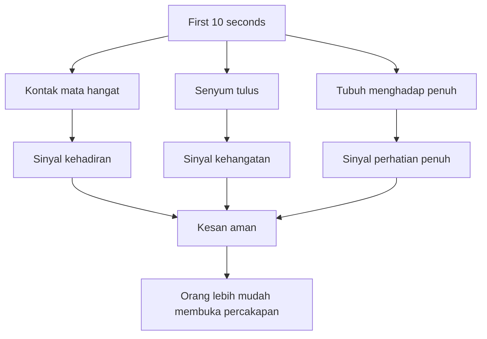

## 🧠 Pendahuluan: Masalahnya Sering Bukan Kita Tidak Menarik, tetapi Tubuh Kita Sedang Mengira Kita Terancam

Ada satu momen sosial yang bagi banyak orang terasa kecil di luar, tetapi sangat besar di dalam. Kita masuk ke sebuah ruangan—pesta, acara kantor, acara networking, ulang tahun teman, gathering, seminar, resepsi, kelas, atau ruang sosial apa pun—lalu dalam beberapa detik muncul sensasi yang terlalu familiar: dada mengencang, tangan canggung, mata mencari tempat aman, dan ponsel tiba-tiba terasa seperti benda penyelamat. Bukan karena ada pesan masuk, tetapi karena memegang ponsel memberi kita sesuatu untuk dilakukan. Ia memberi peran. Ia memberi alasan untuk tidak terlihat seperti orang yang berdiri sendirian dengan tubuh yang bingung harus ke mana. 📱

Pengalaman ini sangat umum. Dan justru karena sangat umum, banyak orang malu mengakuinya. Mereka mengira masalahnya ada pada kepribadian mereka. Mereka mengira mereka terlalu introvert, terlalu aneh, terlalu kurang karismatik, terlalu tidak pandai bersosialisasi, atau terlalu “socially awkward” — *canggung secara sosial*. Padahal menurut materi ini, dan menurut cukup banyak riset psikologi serta neurosains sosial, pengalaman itu sangat sering **bukan cacat karakter**, melainkan respons biologis yang sangat tua.

Ini titik berangkat yang sangat melegakan. Karena kalau masalahnya selalu dianggap moral atau personal—*saya payah, saya tidak bisa, saya memang bukan orang seperti itu*—kita cenderung menyalahkan diri secara total. Tetapi kalau kita mulai melihat bahwa tubuh kita sedang menjalankan program lama yang keliru konteks, tiba-tiba ada ruang untuk bekerja dengan sistem itu, bukan melawannya sambil marah-marah.

Materi ini juga menarik karena ia tidak menawarkan trik murahan. Tidak ada saran kosong seperti “pokoknya percaya diri,” “jadi versi terbaik diri sendiri,” atau “fake it till you make it” dalam arti dangkal. Yang ditawarkan justru tujuh **evidence-based shifts** — *pergeseran berbasis bukti* — yang berangkat dari cara kerja otak, sistem saraf, memori sosial, dan dinamika koneksi manusia. Fokusnya bukan “bagaimana terlihat keren,” tetapi **bagaimana membuat orang merasa aman, tertarik, diperhatikan, dan lebih mudah membuka diri kepada kita**.

Dan inilah inti yang sangat penting: orang lain jauh lebih sering mendekati kita bukan karena kita terlihat paling percaya diri, paling dominan, atau paling memikat secara performatif. Mereka lebih sering mendekati kita ketika tubuh, ekspresi, energi, dan cara kita hadir memberi sinyal: **“kamu aman di dekat saya.”**

Artikel ini akan membedah semua lapisan itu secara runtut, detail, dan mendalam. Kita akan mulai dari amigdala dan rasa terancam di ruang sosial. Lalu masuk ke perbedaan antara **intention** — *niat / arah* dan **expectation** — *ekspektasi / harapan hasil*. Setelah itu kita bahas bagaimana menjadi “sistem saraf paling aman di ruangan,” mengapa follow-up question lebih kuat daripada usaha tampil menarik, bagaimana first impression sebenarnya terbentuk dalam sepersekian detik, apa itu mere exposure effect dan propinquity effect, mengapa memberi orang lain “peran” langsung mencairkan suasana, dan mengapa cara terbaik menutup interaksi sering justru dengan pergi **sebelum** obrolan kehabisan tenaga.

Kalau Mas Hendra pernah merasa kecil saat masuk ruangan penuh orang, artikel ini ingin menyampaikan satu hal dari awal: **Anda mungkin tidak kekurangan kemampuan sosial. Anda mungkin hanya belum diajari bagaimana manusia benar-benar terhubung.** 🌱

<Callout type="important" title="Tesis utama artikel ini">
Agar orang lain lebih mudah mendekati dan mengajak bicara kita, yang paling penting bukan berusaha tampil luar biasa, melainkan memahami cara kerja sistem saraf sosial manusia: niat yang tepat, energi yang aman, perhatian yang tulus, posisi tubuh yang hadir, dan cara membangun koneksi tanpa memaksa.
</Callout>

---

## 🚨 1. Mengapa Masuk ke Ruangan Penuh Orang Asing Bisa Terasa Seperti Ancaman Fisik?

Materi ini memulai dengan satu penjelasan yang sangat penting: ketika kita masuk ke ruangan berisi banyak orang asing dan tiba-tiba tubuh menjadi kaku, itu bukan sekadar drama di kepala. Ada bagian otak yang sedang bekerja sangat cepat, yaitu **amygdala** — *amigdala*, pusat deteksi ancaman di otak.

Amigdala tidak peduli pada logika sosial modern. Ia bukan bagian otak yang duduk tenang lalu berkata, “oh ini cuma acara kantor, santai saja.” Ia jauh lebih purba. Tugasnya sederhana: mendeteksi potensi ancaman dan menyiapkan tubuh untuk bertahan hidup. Dalam sejarah evolusi manusia, masuk ke kelompok orang asing memang bisa berbahaya. Kita tidak tahu niat mereka, struktur hierarkinya, atau apakah kita akan diterima atau ditolak. Maka sistem saraf belajar satu hal: **kelompok asing = kemungkinan ancaman sampai terbukti aman.**

Begitu sinyal ini aktif, tubuh dilepaskan ke mode siaga. Hormon stres seperti **cortisol** dan **adrenaline** mengalir. Detak jantung naik. Otot menegang. Fokus menyempit. Tubuh siap untuk **fight, flight, or freeze** — *melawan, lari, atau membeku*.

Dan yang sangat menarik sekaligus menyedihkan: dalam konteks sosial modern, banyak dari kita tidak lari secara harfiah dan tidak melawan. Kita justru mengalami mode **freeze** — *membeku*. Itulah mengapa mendadak kepala kosong. Kata-kata yang biasanya gampang keluar malah hilang. Kita jadi tidak tahu mau berdiri di mana, melihat ke mana, membuka percakapan bagaimana. Ini bukan karena kita bodoh. Ini karena bagian otak yang membantu kreativitas, bahasa, humor, dan keluwesan sosial—**prefrontal cortex** atau korteks prefrontal—sebagian fungsinya menurun saat alarm ancaman menyala.

Jadi ironi besarnya begini: **pada saat kita paling butuh keterampilan sosial, sistem saraf kita justru mematikan sebagian fungsi yang menopang keterampilan itu.** 🚨

---

## 🩹 2. Penolakan Sosial Diproses Otak Mirip Luka Fisik: Mengapa Berdiri Sendirian di Acara Bisa Terasa Sangat Menyakitkan

Materi ini lalu masuk ke riset yang sangat penting dari Naomi Eisenberger di UCLA tentang **social exclusion** — *pengucilan sosial*. Dalam eksperimen terkenal, orang yang dikeluarkan dari permainan sosial ternyata menunjukkan aktivitas pada area otak yang juga aktif ketika manusia mengalami nyeri fisik.

Ini bukan metafora puitis. Ini pengukuran. Artinya, ketika kita merasa tidak diajak masuk, tidak dilihat, tidak dianggap, atau takut ditolak oleh kelompok, otak memperlakukan ancaman itu sebagai sesuatu yang sangat serius. Dan kalau dipikir-pikir, ini masuk akal secara evolusi. Pada masa manusia purba, dikeluarkan dari kelompok bukan sekadar “malu sosial.” Itu bisa berarti **mati**. Sendirian di luar kelompok artinya lebih rentan terhadap predator, kelaparan, dan ketiadaan perlindungan.

Maka wajar kalau tubuh bereaksi keras terhadap kemungkinan ditolak. Yang bikin pelik adalah, di dunia modern, respons ini sering muncul dalam situasi yang tidak benar-benar mengancam hidup. Sebuah pesta atau acara networking tidak akan membunuh kita. Tapi sistem saraf purba tidak memprosesnya dengan sesantai itu. Ia hanya mengenali pola: **“kelompok asing, risiko ditolak, ancaman.”** 🩹

Pemahaman ini sangat melegakan karena ia memindahkan fokus dari “saya rusak” ke “sistem saraf saya sedang menembakkan alarm yang terlalu tua untuk konteks ini.” Dan kalau masalahnya adalah sistem yang terlalu waspada, maka solusinya bukan memarahi diri. Solusinya adalah belajar **mengatur ulang kondisi tubuh dan interaksi sosial** agar sistem itu menerima sinyal aman.

---

## 🧭 3. Datanglah dengan Intention, Bukan Expectation: Niat Memberi Arah, Ekspektasi Sering Menyiapkan Luka

Salah satu pergeseran paling kuat dalam materi ini adalah pembedaan antara **intention** — *niat / arah batin* dan **expectation** — *ekspektasi / target hasil*. Sekilas dua kata ini tampak mirip, tetapi efeknya ke sistem saraf dan pengalaman sosial sangat berbeda.

Banyak orang datang ke acara sosial dengan ekspektasi seperti:
- malam ini harus seru,
- saya harus kenal orang keren,
- saya harus terlihat percaya diri,
- saya harus nyambung dengan banyak orang,
- saya tidak boleh canggung.

Masalah dengan ekspektasi seperti ini adalah: ia mudah runtuh begitu realitas tidak patuh. Kita masuk ruangan, tak ada yang langsung menyapa, percakapan pertama datar, orang yang kita kenal belum datang, atau energi kita sendiri belum stabil. Lalu otak membaca jarak antara harapan dan kenyataan itu sebagai kegagalan. Dalam bahasa neurosains, ini berkaitan dengan **negative prediction error** — *kesalahan prediksi negatif*, yaitu saat realitas lebih buruk daripada yang diharapkan, dan sistem dopamin kita turun di bawah baseline. Hasilnya: kita bukan cuma netral, tapi merasa **lebih buruk**.

Sebaliknya, **intention** bekerja berbeda. Niat bukan target hasil. Niat adalah arah perilaku. Misalnya:
- malam ini saya ingin membuat satu orang merasa diperhatikan,
- saya ingin sungguh penasaran pada satu orang baru,
- saya ingin punya satu percakapan yang terasa nyata,
- saya ingin hadir penuh di satu momen, bukan menang di semua momen.

Intention tidak terlalu bisa “gagal” dengan cara yang sama. Karena ia hidup di tindakan kita, bukan di respons orang lain. Kita tetap bisa menjalankan niat itu bahkan kalau acara biasa-biasa saja. Dan ini mengubah pengalaman sosial secara besar. Kita tidak lagi datang untuk lulus ujian, tetapi untuk membawa arah.

Kalimat yang paling kuat dari bagian ini adalah: **datanglah dengan direction, not destination** — *arah, bukan garis finis*. 🧭

---

## 🛟 4. Orang Magnetis Bukan Selalu yang Paling Percaya Diri, tetapi yang Membuat Sistem Saraf Orang Lain Turun Tegangannya

Ini salah satu bagian paling kuat dari seluruh materi. Pembicara mengatakan: orang yang magnetis di ruang sosial sering kali bukan yang paling karismatik dalam pengertian glamor, bukan yang paling tinggi statusnya, bahkan bukan yang paling menarik secara visual. Yang membuat mereka terasa enak didekati sering justru satu hal: **safety** — *rasa aman*.

Penjelasannya masuk lewat teori **polyvagal** dari Stephen Porges dan konsep **neuroception** — *penilaian saraf bawah sadar terhadap keamanan atau ancaman*. Sebelum kita sempat bicara, sistem saraf orang lain sudah “membaca” kita. Ia menilai: aman atau tidak aman? Dan penilaian itu terjadi bukan terutama lewat isi kata, tetapi lewat fisiologi kita.

Apa saja sinyal keamanan itu?
- **genuine eye contact** — kontak mata hangat, bukan melotot,
- **authentic smile** — senyum yang benar-benar mengubah area mata,
- **open body language** — bahasa tubuh terbuka, bahu rileks, tangan tidak menyilang defensif,
- **regulated breathing** — napas yang tenang,
- dan secara umum, sistem saraf yang tidak sedang menyiarkan panik.

Manusia melakukan **co-regulation** — *pengaturan saraf bersama*. Artinya, sistem saraf kita menular. Kalau kita datang tegang, dangkal napasnya, matanya gelisah, energinya mencari validasi, orang lain akan merasakan ketidaknyamanan tanpa tahu kenapa. Tetapi kalau kita datang cukup tenang, cukup hadir, cukup terbuka, sistem saraf mereka juga cenderung ikut turun tegangannya.

Jadi pembicara menolak nasihat dangkal seperti “be confident.” Menurutnya, lebih tepat begini: **jadilah sistem saraf paling aman di ruangan.** Itulah yang membuat orang ingin mendekat. 🛟

---

## 🌬️ 5. Regulasi Saraf Lebih Penting daripada Pura-Pura Percaya Diri

Kalau keamanan sosial lahir dari sistem saraf yang teratur, maka kita perlu alat untuk benar-benar mengaturnya. Materi ini memberi saran yang sangat sederhana tetapi ilmiahnya kuat: sebelum masuk ke situasi sosial, luangkan sekitar 90 detik untuk mengatur napas. Tarik napas 4 hitungan, buang napas 6 hitungan. Exhale yang lebih panjang membantu mengaktifkan **vagus nerve** — *saraf vagus*, yang terlibat dalam sistem relaksasi dan koneksi sosial parasimpatik.

Ini penting sekali. Karena banyak orang mencoba “percaya diri” lewat afirmasi kognitif atau gestur palsu, padahal tubuh mereka masih dalam mode alarm. Hasilnya terasa janggal. Kita bicara tentang tenang, tetapi bahu tegang. Kita tersenyum, tetapi mata belum hadir. Kita mencoba terlihat santai, tetapi napas masih sempit.

Tubuh tidak gampang dibohongi. Dan lebih penting lagi, tubuh orang lain juga tidak gampang dibohongi. Maka dibanding memaksa persona, jauh lebih efektif melakukan intervensi fisiologis sederhana agar sistem saraf kita benar-benar sedikit lebih stabil.

Percaya diri yang dicari bukan “topeng percaya diri.” Yang kita cari adalah **presence** — *kehadiran*. Hadir penuh, tidak memburu, tidak menembak ke mana-mana, tidak memindai ruangan sambil terus mencari siapa yang lebih menarik untuk diajak bicara. Orang tertarik pada orang yang hadir. 🌬️

---

## 👂 6. Berhenti Berusaha Menjadi Menarik, Mulailah Benar-Benar Tertarik

Ini mungkin nasihat paling membebaskan dari seluruh materi: **stop trying to be interesting; be interested.** Berhenti mencoba menjadi orang paling menarik. Mulailah sungguh tertarik pada orang lain.

Mengapa ini begitu kuat? Karena sebagian besar kecemasan sosial lahir dari spotlight internal. Kita sibuk memikirkan:
- saya kelihatan aneh nggak?
- saya harus jawab apa ya?
- saya terdengar membosankan nggak?
- saya cukup lucu nggak?
- saya cukup keren nggak?

Selama fokus seperti ini aktif, kita terjebak dalam **self-monitoring** — *mengawasi diri secara berlebihan*. Dan saat itu, obrolan terasa seperti performa. Padahal riset dari Harvard Business School yang disebut di materi ini menunjukkan bahwa prediktor paling kuat untuk disukai dalam percakapan pertama bukan seberapa lucu atau impresif seseorang, melainkan **berapa banyak follow-up questions** — *pertanyaan lanjutan* — yang ia ajukan.

Bukan sekadar bertanya. Tapi bertanya lanjutan yang membuktikan kita benar-benar mendengarkan.

Kalau seseorang berkata, “Saya baru pindah ke kota ini,” lalu kita menanggapi, “Oh ya? Dari mana? Bagian apa yang paling aneh sejauh ini?” itu berbeda sekali dari sekadar “oh, keren.” Follow-up question memberi sinyal: **saya memperhatikan, saya menangkap detailmu, dan saya ingin masuk lebih dalam ke pengalamanmu.** 👂

Dan secara neurokimia, ini menyenangkan bagi orang lain. Berbicara tentang diri sendiri dengan didengarkan sungguh-sungguh mengaktifkan area otak yang berhubungan dengan reward. Maka orang merasa enak dengan kita bukan karena kita tampil spektakuler, tetapi karena di dekat kita mereka merasa **lebih hidup sebagai diri mereka sendiri.**

---

## 💡 7. Orang Tidak Selalu Mengingat Siapa yang Paling Pintar di Ruangan, Tapi Mereka Selalu Ingat Siapa yang Membuat Mereka Terasa Didengar

Ada satu kesalahan sosial yang sangat umum: kita mengira orang akan mengingat kita karena cerita terbaik kita, opini paling cemerlang kita, atau performa verbal kita yang memukau. Terkadang iya, tetapi lebih sering tidak. Yang jauh lebih melekat justru adalah **rasa** yang kita tinggalkan.

Kalau dalam percakapan kita membuat orang merasa:
- dilihat,
- didengar,
- tidak dihakimi,
- tidak diperlakukan seperti transaksi,
- dan cukup aman untuk jadi diri sendiri,

maka mereka akan mengingat kita dengan sangat kuat. Bukan karena kita “show off,” tetapi karena kita memberi pengalaman langka. Banyak orang jarang sekali sungguh-sungguh didengarkan. Mereka sering hanya menunggu giliran bicara dalam percakapan. Maka ketika ada seseorang yang benar-benar menaruh perhatian, itu terasa istimewa.

Ini membalik logika umum. Magnetisme sosial bukan terutama soal *memasukkan diri kita ke kepala orang lain*. Ia lebih sering soal **membantu orang lain merasa lebih hadir di hadapan kita.** Dan itu justru membuat mereka ingin kembali. 💡

---

## ⚡ 8. Kesan Pertama Terbentuk Sangat Cepat—Tapi Kabar Baiknya, Ia Lebih Ditentukan oleh Energi Tubuh daripada Kalimat Hebat

Materi ini lalu menyinggung riset yang cukup terkenal dari Janine Willis dan Alexander Todorov di Princeton tentang **first impressions** — *kesan pertama*. Temuannya sangat liar: manusia bisa membentuk kesan awal dalam sepersepuluh detik. Ya, secepat itu. Dan kesan yang dibentuk sangat cepat itu ternyata sering tidak jauh berbeda dari kesan setelah interaksi lebih lama.

Sekilas ini terdengar menyeramkan. Seolah semuanya sudah diputuskan sebelum kita sempat bicara. Tapi pembicara justru menggunakannya secara membebaskan. Karena kalau kesan pertama terbentuk secepat itu, berarti ia **bukan** bergantung pada kalimat canggih yang kita siapkan di kepala. Yang dinilai duluan justru:

1. **ekspresi wajah**,  
2. **orientasi tubuh**,  
3. **energi keseluruhan**.  

Artinya, kita tidak perlu membuka interaksi dengan kalimat paling kreatif di dunia. Kita jauh lebih diuntungkan kalau dalam 10 detik pertama kita bisa membawa:
- kontak mata hangat,
- senyum yang tulus,
- tubuh yang menghadap penuh,
- dan aura bahwa kita hadir, bukan setengah kabur.

Pembicara menekankan bahwa orientasi tubuh yang sepenuhnya menghadap lawan bicara mengirim sinyal sangat kuat: **“Anda punya perhatian saya. Saya tidak sedang mencari orang yang lebih penting di belakang Anda.”** Ini terdengar sepele, tetapi efeknya besar. Kita semua tahu rasanya bicara dengan orang yang matanya mondar-mandir dan tubuhnya separuh pergi. Tidak enak. Sebaliknya, orang yang menghadap penuh terasa langsung lebih manusiawi.

---

## 👀 9. Eye Contact Bukan Formalitas Sosial, tetapi Mekanisme Bonding

Riset yang dirujuk dalam materi ini dari Arthur Aron menunjukkan bahwa **mutual eye contact** — *kontak mata timbal balik* — dapat meningkatkan rasa kedekatan bahkan tanpa banyak percakapan. Tentu bukan tatapan menyeramkan, tetapi kontak mata yang hangat, hidup, dan tidak tergesa-gesa.

Mengapa ini penting? Karena mata adalah salah satu medium paling cepat untuk menandakan **“kamu ada untukku saat ini.”** Dan di dunia yang penuh distraksi, banyak orang lapar akan pengalaman sesederhana itu. Mereka terbiasa dihadapi orang yang setengah hadir. Maka ketika bertemu seseorang yang benar-benar melihat, mereka merasakan perbedaan besar.

Kontak mata yang sehat memicu proses kedekatan, membantu pelepasan oxytocin — *hormon keterikatan*, dan membuat interaksi terasa lebih manusiawi. Ini sebabnya banyak orang yang secara objektif mungkin tidak paling cantik atau tampan bisa tetap terasa sangat menarik: mereka **hadir lewat mata dan perhatian**.

---

## 🚶 10. Proximity Effect: Mengapa Kadang Cara Terbaik Agar Orang Menyapa Kita Duluan adalah Cukup Sering Terlihat

Bagian ini sangat menarik karena sangat praktis. Pembicara merujuk penelitian lama tapi kuat dari Leon Festinger, Stanley Schachter, dan Kurt Back tentang **propinquity effect** — *efek kedekatan fisik*. Dalam studi mereka, orang yang tinggal lebih dekat secara fisik jauh lebih mungkin menjadi teman. Bahkan dua pintu rumah bisa membuat perbedaan besar.

Lalu ditambah riset tentang **mere exposure effect** — *efek paparan berulang*. Intinya sederhana: sesuatu yang sering kita lihat cenderung terasa lebih familiar, dan yang familiar terasa lebih aman. Bahkan jika seseorang tidak pernah bicara kepada kita, hanya kehadirannya yang konsisten bisa membuat kita terasa “kenal.”

Pelajaran praktisnya sangat besar. Kalau ingin lebih mudah diajak bicara:
- jangan bersembunyi di sudut ruangan,
- jangan menempatkan diri di titik mati,
- berdirilah di jalur lalu-lalang alami,
- dekat pintu masuk, dekat minuman, dekat area orang melintas,
- dan kalau ada tempat yang rutin kita datangi (gym, kafe, coworking, kelas), **hadirlah konsisten**.

Tujuannya bukan stalking sosial. Tujuannya adalah membiarkan otak orang lain terbiasa dengan kehadiran kita. Familiaritas sering lebih kuat daripada usaha jadi mencolok. Orang jauh lebih mudah menyapa seseorang yang wajahnya “kayaknya pernah lihat” daripada seseorang yang tiba-tiba muncul sepenuhnya asing.

Jadi salah satu strategi paling santai agar orang menyapa duluan adalah: **jadilah cukup terlihat, cukup konsisten, dan cukup aman untuk dikenali.** 🚶

---

## 🎭 11. Give People a Role: Kenapa Orang Lebih Cepat Nyaman Kalau Kita Memberi Mereka Fungsi di Percakapan

Ini salah satu ide paling bagus dan jarang dibahas. Dalam situasi sosial, banyak orang sebenarnya tidak tahu harus ngapain. Mereka juga merasakan ambiguitas. Mereka juga canggung. Mereka juga bingung fungsi mereka di ruangan itu apa. Dan secara psikologis, manusia tidak suka ambiguitas. Otak ingin tahu: **saya berdiri di mana? saya berperan sebagai apa?**

Maka salah satu cara paling ampuh mencairkan percakapan adalah **memberi orang peran**. Misalnya, bukan bertanya generik “kamu kenal host dari mana?”, tapi:
- “Saya baru datang dan agak bingung, kamu kelihatan sudah ngerti tempat ini, saya harus mulai dari mana?”
- “Kamu pernah ke acara seperti ini sebelumnya? Bantu saya dong, biasanya bagian yang paling seru yang mana?”
- “Saya belum tahu minuman yang enak di sini, kamu kelihatannya lebih tahu dari saya.”

Tiba-tiba orang itu punya peran: pemandu, insider, penolong, pengarah. Dan ini memberi mereka kelegaan. Ambiguitas berkurang. Mereka tidak lagi sekadar orang asing yang canggung, tetapi seseorang yang **berguna** dalam interaksi ini.

Materi ini bahkan mengaitkannya dengan riset Adam Grant tentang *helper’s high* — **rasa senang ketika bisa membantu**. Banyak orang merasa lebih baik ketika mereka bisa memberi sesuatu. Jadi dengan memberi peran kecil, kita bukan sedang terlihat needy. Kita justru sedang menciptakan jembatan yang sangat manusiawi. 🎭

---

## 🧵 12. Jangan Terlalu Lama Tinggal: Peak-End Rule dan Seni Mengakhiri Percakapan saat Masih Hangat

Ini mungkin bagian paling kontraintuitif dari semua shift, tapi justru sangat kuat: **leave before you’re done** — *pergilah sebelum benar-benar habis*. Banyak orang bertahan terlalu lama dalam percakapan bukan karena percakapannya hebat, tetapi karena mereka tidak tahu cara pergi tanpa canggung. Hasilnya, interaksi yang tadinya hangat perlahan-lahan mati pelan. Dan memori yang tertinggal justru bukan momen bagus di awal, tetapi rasa seret di akhir.

Pembicara mengaitkan ini dengan **peak-end rule** dari Daniel Kahneman: orang cenderung mengingat pengalaman berdasarkan dua hal—puncak emosinya dan bagaimana ia berakhir. Jadi percakapan 5 menit yang berakhir hangat bisa meninggalkan kesan jauh lebih baik daripada percakapan 20 menit yang memudar tanpa arah.

Pelajaran praktisnya sederhana namun elegan. Saat obrolan mencapai titik bagus—tertawa besar, insight menarik, rasa klik yang nyata—itu justru momen yang baik untuk berkata:
- “Saya senang banget ngobrol sama kamu, saya mau keliling sebentar, tapi semoga nanti kita lanjut ya.”
- “Saya pengin say hi ke beberapa orang dulu, tapi saya suka percakapan ini.”

Dengan begitu, kita:
1. mengakhiri di titik tinggi,
2. membuat orang merasa dihargai,
3. meninggalkan **open loop** — *lingkaran yang belum ditutup*, yang membuat otak mereka masih memikirkan kita.

Ini bukan permainan manipulatif. Ini penghormatan terhadap ritme interaksi. Hubungan yang sehat sering tumbuh dari kemampuan merasakan **kapan cukup untuk saat ini.** 🧵

---

## 🫶 13. Semua Tujuh Pergeseran Ini Sebenarnya Satu Prinsip Besar: Berhenti Datang untuk Mengambil, Mulailah Datang untuk Memberi

Di bagian penutup, pembicara merangkum semua shift ini ke dalam satu prinsip yang sangat indah: **orang yang mengubah suasana ruangan bukan orang yang datang untuk mengambil sesuatu dari ruangan itu, melainkan orang yang datang untuk memberi sesuatu padanya.**

Ini prinsip yang sangat besar. Karena banyak kecemasan sosial lahir dari mode “mengambil”:
- saya harus dapat perhatian,
- saya harus dapat koneksi,
- saya harus terlihat bagus,
- saya harus dapat validasi,
- saya harus disukai.

Begitu kita datang dengan mode itu, tubuh kita tegang. Kita memonitor hasil. Kita menghitung-hitung. Kita takut gagal. Sebaliknya, ketika datang untuk memberi—memberi arah, memberi keamanan, memberi rasa didengar, memberi peran, memberi perhatian, memberi akhir percakapan yang manis—interaksi berubah total. Kita tidak lagi menjadi pengemis perhatian. Kita menjadi **pembawa kualitas tertentu ke ruangan.**

Dan justru dari sanalah perhatian sering datang dengan sendirinya. Karena orang tertarik pada mereka yang membuat suasana jadi lebih baik, bukan pada mereka yang diam-diam menuntut suasana membaik untuk dirinya. 🫶

---

## 🌌 Kesimpulan: Tujuan Sosial Bukan Agar Semua Orang Menyukai Kita, tetapi Agar Kehadiran Kita Membuat Orang Lain Lebih Mudah Menjadi Manusia

Kalau seluruh artikel ini diringkas menjadi satu pesan yang paling esensial, mungkin pesannya adalah ini: **orang lain lebih mudah ingin bicara dengan kita ketika kehadiran kita membuat hidup sosial terasa lebih ringan, lebih aman, dan lebih manusiawi.**

Bukan karena kita paling lucu. Bukan karena kita paling cerdas. Bukan karena kita paling percaya diri. Dan bahkan bukan karena kita paling pandai bicara. Melainkan karena kita membawa kualitas yang sangat langka di ruang sosial modern: arah tanpa tekanan, perhatian tanpa transaksi, ketenangan tanpa topeng, rasa ingin tahu tanpa pencitraan, dan penutupan interaksi yang elegan tanpa menggantung canggung.

Materi ini menunjukkan bahwa apa yang sering kita sebut “social anxiety” kadang sesungguhnya adalah sistem saraf yang sedang terlalu waspada. Ia menunjukkan bahwa rasa canggung di keramaian tidak otomatis berarti kita buruk dalam berhubungan. Ia menunjukkan bahwa cara agar orang lain lebih mudah mendekat bukan dengan lebih keras memasarkan diri, tetapi dengan lebih cerdas memahami **bagaimana koneksi manusia benar-benar terbentuk**.

Datanglah dengan niat, bukan ekspektasi. Tenangkan tubuh dulu sebelum menenangkan percakapan. Tatap orang sungguh-sungguh. Tersenyumlah dengan mata, bukan sekadar bibir. Berdirilah di tempat di mana hidup mengalir. Tanyalah pertanyaan yang membuat orang merasa dilihat. Beri mereka peran. Dan ketika obrolan sedang enak, beranilah menutupnya dengan hangat sebelum ia kehilangan tenaga.

Itu semua bukan teknik manipulasi. Itu adalah bentuk kedewasaan sosial. Bentuk pemahaman bahwa manusia tidak pertama-tama haus pada performa, tetapi pada **pengalaman aman untuk hadir**. Dan mungkin inilah alasan mengapa sebagian orang tampak begitu magnetis: bukan karena mereka minta dilihat, tetapi karena di dekat mereka, kita merasa **lebih mudah bernapas sebagai diri sendiri.** 🌌

Kalau Mas Hendra membawa satu kalimat saja dari artikel ini, saya ingin kalimat itu ini: **tujuan utama Anda di ruang sosial bukan agar semua orang memperhatikan Anda, tetapi agar siapa pun yang kebetulan bertemu Anda merasa sedikit lebih tenang, sedikit lebih terlihat, dan sedikit lebih nyaman untuk menjadi manusia.** Dari situ, percakapan akan jauh lebih mudah tumbuh. Dan sering kali, orang akan menyapa Anda duluan—bukan karena Anda memohon perhatian, tetapi karena tubuh mereka membaca bahwa mendekati Anda terasa aman.

<Callout type="cite" title="Sumber utama artikel">
Artikel ini disusun berdasarkan materi *How to Get Anyone to Talk to You First (Without Begging for Attention)* yang membahas sistem saraf sosial, amigdala, rasa aman, follow-up questions, first impression, mere exposure effect, helper's high, peak-end rule, dan prinsip-prinsip koneksi manusia yang lebih sehat.
</Callout>
