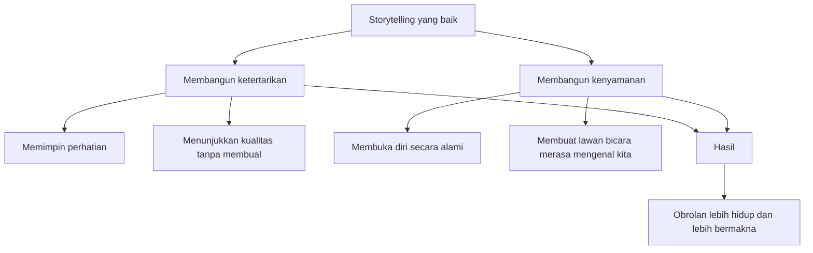
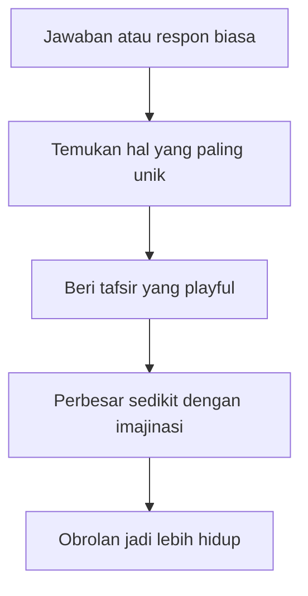

## 🗣️ Pendahuluan: Orang yang Selalu Punya Bahan Obrolan Bukan Selalu yang Paling Pintar, tetapi yang Paling Mau Menghidupkan Percakapan

Salah satu ketakutan sosial yang paling umum—dan paling jarang diakui dengan jujur—adalah momen ketika obrolan tiba-tiba mati. Kita sedang berbicara dengan seseorang, mungkin orang baru, mungkin orang yang kita sukai, mungkin calon teman, calon pasangan, calon klien, atau bahkan rekan kerja penting, lalu tiba-tiba muncul kehampaan. Setelah satu-dua kalimat, kita mulai panik di dalam kepala: *habis ini ngomong apa lagi?* 😅

Ketakutan ini begitu universal sampai banyak orang mengira ada dua jenis manusia di dunia: yang memang “berbakat ngobrol” dan yang selamanya canggung. Yang pertama katanya karismatik sejak lahir. Yang kedua katanya ya nasibnya begitu. Padahal, kalau kita bedah lebih teliti, orang yang tampak tidak pernah kehabisan bahan obrolan biasanya bukan makhluk ajaib dengan gudang topik tak terbatas. Mereka lebih sering adalah orang yang punya **sikap mental tertentu terhadap komunikasi**. Mereka tidak menunggu percakapan terjadi dengan sendirinya. Mereka **mengambil tanggung jawab untuk menghidupkannya**.

Itulah inti besar dari materi ini. Judul videonya memang terdengar sangat “praktis”: *How To Never Run Out Of Things To Say*. Ada nuansa *verbal game*, *storytelling*, dan *flirting* — permainan verbal, seni bercerita, dan seni menggoda. Tetapi kalau dibaca lebih dalam, pembahasannya sebenarnya melampaui sekadar cara bikin lawan bicara tertarik. Ini menyentuh sesuatu yang jauh lebih mendasar: **bagaimana mencintai bahasa, bagaimana bermain dengan kata, bagaimana membaca lapisan-lapisan makna, dan bagaimana membuat obrolan jadi hidup karena kita sendiri sungguh hadir di dalamnya.**

Pembicara dalam materi ini menekankan bahwa karisma dan komunikasi bukan pertama-tama lahir dari teknik. Teknik itu penting, tentu saja. Ada format humor. Ada prinsip cerita. Ada pola godaan. Ada cara membangun frame atau bingkai interaksi. Tetapi sebelum semua itu, ada sesuatu yang lebih dulu dibutuhkan: **hasrat untuk berkomunikasi dengan menarik, keinginan untuk menghidupkan momen, dan kesediaan mengambil beban obrolan ketika orang lain belum siap ikut mengangkatnya.**

Jadi artikel ini bukan sekadar daftar “kalimat pembuka” atau “cara jadi lucu.” Saya ingin membedah lebih dalam apa sebenarnya yang membuat seseorang **tidak pernah benar-benar kehabisan topik**. Karena jawabannya bukan: ia punya seribu fakta di kepala. Jawabannya lebih dekat ke ini: ia tahu bagaimana melihat percakapan sebagai bahan mentah yang hidup, bukan sekadar bertukar informasi. Ia tahu bahwa dalam satu jawaban biasa, ada intonasi, jeda, rasa malu, kebanggaan, keraguan, asosiasi, ambiguitas, dan peluang bermain. Ia tahu bahwa satu cerita bisa dipendekkan atau diperpanjang. Ia tahu bahwa satu kata punya banyak lapisan. Dan yang paling penting, ia tahu bahwa obrolan itu bukan ruang ujian, melainkan **ruang permainan**.

Dalam artikel ini kita akan bahas secara runtut: mengapa percakapan harus dibawa, bukan ditunggu; apa itu “assuming the burden” atau mengambil beban obrolan; mengapa *outcome independence* tidak sesederhana yang sering diajarkan; bagaimana storytelling bisa membangun ketertarikan sekaligus kenyamanan; kenapa detail atau spesifik itu membuat cerita hidup; bagaimana humor lahir dari permainan makna; mengapa flirting itu lebih banyak soal attitude daripada line; apa itu frame dan mengapa bingkai interaksi menentukan segalanya; serta bagaimana berlatih semua ini tanpa terdengar seperti robot yang sedang mempraktikkan teknik. 🎯

Kalau nanti di tengah artikel ini Mas Hendra merasa bahwa topik ini bukan sekadar soal *pick up* atau ngobrol dengan lawan jenis, itu memang benar. Karena pada level terdalam, kemampuan untuk tidak kehabisan bahan obrolan adalah kemampuan untuk **melihat lebih banyak kehidupan di dalam bahasa**. Dan itu berguna di mana-mana: dalam berteman, mengajar, memimpin, negosiasi, bisnis, keluarga, dan tentu saja cinta.

<Callout type="important" title="Tesis utama artikel ini">
Orang yang tidak pernah kehabisan bahan obrolan bukan orang yang selalu punya topik baru, melainkan orang yang bisa menghidupkan topik apa pun karena ia memahami tanggung jawab percakapan, kekuatan cerita, permainan makna, dan bingkai interaksi.
</Callout>

---

## 🔥 1. Percakapan yang Baik Selalu Dimulai dari Sikap, Bukan dari Kalimat Ajaib

Banyak orang ingin langsung diberi kalimat sakti. “Ngomong apa supaya obrolan jalan?” “Opener terbaik apa?” “Line yang paling ampuh apa?” Pertanyaan seperti ini sangat manusiawi, tetapi ada jebakan besar di dalamnya: seolah-olah kualitas komunikasi bisa dipecahkan oleh satu formula verbal. Padahal pembicara dalam materi ini justru membuka dengan penekanan sebaliknya: **karisma dan komunikasi dimulai dari attitude** — *sikap batin / orientasi mental*.

Maksudnya apa? Maksudnya, sebelum kita belajar teknik bercerita, bercanda, atau menggoda, kita harus lebih dulu punya keinginan sungguh-sungguh untuk **menghubungkan diri** dengan orang lain secara hidup. Tanpa itu, semua teknik akan terdengar seperti trik kosong. Kita mungkin bisa menghafal pola-pola, tetapi tidak akan memancarkan daya tarik yang nyata. Karena lawan bicara selalu bisa merasakan perbedaan antara orang yang sungguh ingin berinteraksi dan orang yang sekadar menembakkan teknik.

Ini poin yang sangat penting. Banyak komunikasi buruk bukan karena orangnya tidak cerdas, tetapi karena ia datang ke percakapan dengan energi yang setengah-setengah. Ia berharap lawan bicara yang menghidupkan situasi. Ia berharap chemistry turun dari langit. Ia berharap momen menjadi menarik tanpa dirinya harus menjadi sumber energi itu. Dan biasanya harapan itu berakhir pada kesunyian yang canggung.

Sikap yang dibutuhkan justru kebalikannya: **aku datang ke sini untuk membuat percakapan ini hidup.** Bahkan kalau awalnya sedikit kaku, aku akan bantu menyalakannya. Bahkan kalau lawan bicara belum hangat, aku bersedia memegang ruang itu beberapa saat. Ini bukan berarti memaksa atau mendominasi terus. Ini berarti sadar bahwa komunikasi butuh inisiatif. Dan inisiatif selalu lahir dari sikap, bukan dari hafalan kalimat. 🔥

---

## 🏋️ 2. Assuming the Burden: Mengapa yang Memulai Obrolan Harus Siap Membawa Bebannya

Konsep paling sentral dari keseluruhan materi ini adalah **assuming the burden** — *mengambil beban percakapan*. Gagasan ini sederhana tetapi sangat revolusioner kalau sungguh dipahami. Intinya begini: **kalau kita yang memulai percakapan, maka setidaknya untuk beberapa saat, kita juga yang bertanggung jawab menghidupkannya.**

Ini penting karena banyak orang memulai obrolan dengan asumsi yang salah. Mereka menyapa, lalu diam-diam berharap lawan bicara langsung mengambil alih, memberi energi, menyambung, membuat semuanya nyaman. Ketika itu tidak terjadi, mereka langsung menganggap interaksi gagal. Padahal mungkin lawan bicara hanya belum cukup hangat, belum siap, belum menemukan ritme, atau juga sama gugupnya.

Pembicara dalam materi ini memberi metafora yang sangat kuat: **menyalakan mesin pemotong rumput**. Mesin tua tidak selalu langsung hidup di tarikan pertama. Kadang perlu ditarik beberapa kali. Begitu juga percakapan. Sapaan pertama belum tentu membuat mesin langsung menyala. Kadang perlu satu-dua usaha tambahan, sedikit variasi, sedikit dorongan lagi, sedikit improvisasi. Dan kalau kita menyerah terlalu cepat, percakapan mati bukan karena mustahil hidup, tetapi karena kita berhenti menarik talinya terlalu dini.

Di sinilah banyak orang salah paham. Mereka menganggap kalau sapaan awal tidak langsung memicu aliran obrolan, berarti chemistry tidak ada. Padahal belum tentu. Kadang percakapan butuh **warming up** — pemanasan. Dan tugas orang yang punya keberanian memulai adalah menanggung fase itu tanpa langsung merasa dipermalukan oleh keheningan sesaat.

Kalimat paling berguna dari bagian ini mungkin begini: **kalau interaksi terasa canggung, jangan langsung mundur—beri lagi 20 detik.** Dua puluh detik tambahan itu kecil, tetapi bisa jadi pembeda antara momen yang mati sebelum lahir dan momen yang perlahan menemukan ritmenya. 🏋️

---

## ⏳ 3. Dalam Jangka Pendek yang Menolong adalah Energi, Dalam Jangka Panjang yang Menolong adalah Gudang Keterampilan

Setelah menekankan soal sikap, materi ini tidak jatuh ke romantisme kosong. Ia tetap mengakui bahwa komunikasi yang baik juga perlu **skill** — *keterampilan*. Dalam jangka pendek, saat kita benar-benar ada di lapangan, yang paling menolong adalah energi, niat, dan kemauan untuk terus membawa obrolan. Tetapi dalam jangka panjang, kita harus membangun **arsenal**: gudang bahan, format, pengalaman, dan sensitivitas.

Ini mirip dengan olahraga. Ada pemain yang selalu semangat saat pertandingan. Itu bagus. Tetapi pemain hebat bukan cuma datang di hari pertandingan. Ia juga datang di hari latihan. Ia mengasah gerak, mengulang pola, memperkaya respon, dan membiasakan tubuhnya. Begitu juga percakapan. Kalau kita ingin terlihat spontan, ironisnya kita justru perlu banyak latihan.

Latihan ini bukan berarti menghafal satu skrip untuk semua situasi. Latihan berarti:

- belajar format cerita,
- mengumpulkan frase atau kutipan yang kita suka,
- memahami jenis humor yang cocok dengan diri kita,
- mengamati orang yang pandai bicara,
- mengembangkan sensitivitas terhadap intonasi dan jeda,
- dan menguji berbagai cara berbicara sampai kita tahu mana yang terasa paling otentik.

Jadi, spontanitas yang memikat biasanya bukan spontanitas murni tanpa persiapan. Ia adalah **persiapan yang sudah mendarah daging sehingga tampak alami.**

---

## 🎯 4. Mengapa “Outcome Independence” Sering Disalahpahami dan Mengapa Obrolan Butuh Arah

Dalam banyak ajaran komunikasi sosial atau game, ada istilah **outcome independence** — *tidak bergantung pada hasil*. Maksud sehat dari konsep ini sebenarnya bagus: jangan terlalu melekat secara emosional pada hasil akhir sampai membuat diri kaku, needy, atau penuh tekanan. Namun pembicara di materi ini mengkritik istilah itu kalau dipahami terlalu harfiah.

Ia bilang, kalau kita benar-benar tidak peduli hasil, kita bahkan tidak akan memulai percakapan. Jadi jelas bahwa setiap interaksi selalu punya semacam tujuan, sekecil apa pun. Kita bicara karena ingin terhubung, ingin tertawa, ingin mengenal seseorang, ingin membuat momen jadi hidup, ingin membangun ketertarikan, atau ingin menjual sesuatu kalau konteksnya bisnis.

Masalahnya bukan punya tujuan. Masalahnya adalah **punya tujuan yang buruk atau menyembunyikan tujuan sampai obrolan menjadi tak punya arah.**

Ia memberi contoh yang tajam: banyak laki-laki ngobrol dengan perempuan selama sangat lama, tapi tidak pernah sampai pada inti ketertarikan. Mereka bicara ini-itu tanpa arah, setengah jam berlalu, tetapi suasananya tidak berkembang. Dalam bahasa pembicaranya yang cukup kasar tetapi lucu: *“Apakah dia bahkan tahu kamu punya penis?”* Maksudnya, apakah percakapan itu sudah punya arah romantis/ketertarikan, atau masih sekadar bergerak acak tanpa keberanian menyatakan bingkai interaksi?

Ini bukan hanya soal flirting. Secara umum, percakapan yang tak punya arah sering membosankan. Orang merasa waktunya dihabiskan tanpa alasan jelas. Maka yang dibutuhkan bukan outcome independence dalam arti kosong, melainkan **outcome awareness** — sadar kita sedang menuju ke mana, sambil tetap santai dalam cara membawanya.

---

## 📚 5. Bangun Gudang Bahasa: Mengapa Orang Karismatik Biasanya Punya “Bahan” yang Ia Kumpulkan Bertahun-tahun

Salah satu kebiasaan paling cerdas yang diceritakan dalam materi ini adalah kebiasaan membuat **wit journal** — *jurnal kecerdasan verbal / jurnal bahan-bahan menarik*. Pembicara bercerita bahwa dulu ia punya notebook kecil. Setiap kali menemukan frase, kutipan, lelucon, atau cara mengungkapkan sesuatu yang terasa menarik, ia menuliskannya.

Kebiasaan ini terlihat sederhana, tetapi efeknya besar. Karena banyak orang ingin bicara menarik tanpa pernah **mengumpulkan bahan menarik**. Mereka berharap spontanitas lahir dari ruang hampa. Padahal spontanitas verbal yang kaya biasanya datang dari paparan panjang terhadap bahasa yang hidup.

Yang dikumpulkan pun tidak harus berupa “line” genit atau lelucon sempurna. Bisa saja kutipan Mark Twain, cara menyusun metafora, satu kalimat lucu dari film, satu bentuk kalimat yang terdengar segar, atau bahkan cara seseorang memelintir logika secara elegan. Lama-lama semua itu masuk ke dalam repertoar pribadi.

Ini sangat penting untuk dipahami: membangun verbal game bukan berarti menjadi tukang kutip. Tujuannya bukan mencomot kata orang mentah-mentah. Tujuannya adalah **melatih telinga dan rasa bahasa**. Kalau kita terbiasa mengoleksi bentuk ekspresi yang indah, tajam, lucu, atau berani, kita mulai belajar secara halus bagaimana bahasa bisa dibengkokkan menjadi lebih hidup. 📓

---

## 🎤 6. Belajar dari Stand-up Comedy: Bukan untuk Menjadi Komedian, tetapi untuk Mengerti Cara Kerja Bahasa

Pembicara juga menceritakan bagaimana dulu ia sangat rajin menonton **stand-up comedy**. Alasannya sederhana: komedi adalah laboratorium bahasa yang luar biasa. Di sana kita bisa melihat bagaimana satu set-up dibangun, bagaimana ekspektasi dibuat, bagaimana kejutan ditempatkan, dan bagaimana satu kata yang tepat bisa jauh lebih kuat daripada sepuluh kata yang biasa.

Komedi mengajarkan bahwa bahasa tidak hanya menyampaikan informasi. Bahasa menciptakan **ritme**, **arah perhatian**, **kejutan**, dan **twist**. Seorang komedian yang baik sangat sadar akan timing, struktur, dan kata tertentu yang bisa mengubah efek seluruh kalimat.

Bagi orang yang ingin lebih karismatik, mempelajari komedi berguna bukan agar setiap saat kita bercanda, tetapi agar kita mulai peka terhadap:

- cara membangun ketegangan lalu melepaskannya,
- cara menyusun tiga elemen lalu mematahkan pola di elemen ketiga,
- cara menggunakan ambiguitas,
- cara membuat pengalihan yang mengejutkan,
- dan cara mengatakan sesuatu dengan bahasa yang lebih hidup daripada versi literalnya.

Jadi, belajar komedi sebenarnya adalah belajar **arsitektur kejutan dan energi dalam kalimat.**

---

## 📖 7. Mengapa Storytelling adalah Senjata Sosial yang Sangat Kuat: Ia Membangun Ketertarikan Sekaligus Kenyamanan

Dalam banyak model komunikasi sosial, terutama yang berkaitan dengan ketertarikan romantis, sering dibicarakan dua hal: **value** — *nilai / daya tarik* dan **comfort** — *kenyamanan / rasa aman*. Banyak teknik hanya bagus untuk salah satunya. Ada hal-hal yang membuat kita tampak menarik, tetapi belum tentu membuat orang merasa nyaman. Ada juga hal-hal yang membuat orang nyaman, tetapi tidak membangun daya tarik.

Di sinilah **storytelling** menjadi sangat kuat. Cerita yang baik melakukan dua hal sekaligus.

### Mengapa cerita membangun value?
Karena saat bercerita, kita memimpin perhatian. Kita menunjukkan pengalaman, perspektif, rasa humor, cara melihat dunia, keberanian, kreativitas, atau kualitas tertentu tanpa harus terang-terangan membual.

### Mengapa cerita membangun comfort?
Karena lewat cerita, orang merasa mulai mengenal kita. Ia melihat serpihan kehidupan kita, bukan hanya mendengar opini kosong. Cerita juga memakan waktu. Dan waktu yang dihabiskan bersama dalam bentuk yang hidup cenderung membangun kenyamanan.

Karena itu, storytelling adalah salah satu alat sosial paling ampuh. Orang yang bisa bercerita dengan baik bukan cuma terdengar menarik. Ia terasa **punya dunia**. Dan orang suka masuk ke dunia yang terasa nyata. 🌍

---

## 🧩 8. Cerita yang Baik Selalu Punya Tiga Unsur: Situasi, Gangguan, dan Perubahan

Salah satu bagian paling bernilai dari materi ini adalah definisi sederhana tentang cerita. Banyak orang mengira cerita adalah segala sesuatu yang diceritakan. Padahal tidak semua rangkaian kejadian layak disebut cerita. **“Aku bangun, lalu mandi, lalu macet, lalu sampai kantor”** bukan cerita. Itu sekadar urutan aktivitas.

Menurut pembicara, cerita yang layak punya setidaknya tiga unsur:

1. **Situation** — *situasi awal*, ada keadaan tertentu.
2. **Interruption** — *gangguan / interupsi*, ada sesuatu yang memecah keadaan itu.
3. **Change** — *perubahan*, ada seseorang atau sesuatu yang berubah sebagai akibatnya.

Tanpa interupsi, cerita hanya datar. Tanpa perubahan, orang akan bertanya, “jadi terus kenapa?” Inilah alasan banyak orang merasa ceritanya tidak menarik. Mereka hanya menceritakan kronologi tanpa benturan, atau benturan tanpa perubahan makna.

Jadi, kalau ingin lebih pandai bercerita, kita harus belajar melihat hidup dalam struktur ini. Tidak semua hal perlu dibesar-besarkan. Tetapi saat memilih apa yang akan diceritakan, tanyakan:

- apa situasi awalnya?
- apa yang merusaknya atau mengubahnya?
- apa yang jadi berbeda setelah itu?

Begitu tiga unsur ini ada, bahkan kejadian sederhana bisa jadi hidup. 🧩

---

## 🎬 9. Cerita yang Baik Bisa Diperluas atau Dipadatkan, Selama Tulang Utamanya Jelas

Pembicara memberi contoh cerita tentang dua laki-laki yang bertemu dua perempuan cantik di jalan, lalu karena saling melirik dan tergoda, salah satu perempuan sampai terlalu fokus dan menabrak mobil di depannya. Contoh ini bukan penting karena isi literalnya, tetapi karena ia menunjukkan bagaimana **cerita punya bullet points** — *titik-titik tulang utama*.

Kalau tulang ceritanya jelas, cerita bisa:

- diceritakan dalam tiga menit,
- dipadatkan dalam 30 detik,
- atau dikembangkan dengan tambahan detail, jeda, humor, dan cabang kecil.

Ini pelajaran yang sangat berguna. Banyak orang gagal bercerita bukan karena ceritanya jelek, tetapi karena mereka **tak tahu mana inti dan mana aksesori**. Akibatnya, semua detail ditumpuk sama pentingnya. Cerita jadi melebar tanpa bentuk.

Padahal, penutur yang baik tahu mana titik utama, lalu ia bisa menyesuaikan panjang cerita dengan situasi. Kalau lawan bicara sedang sangat tertarik, cerita bisa diperpanjang. Kalau ritme obrolan cepat, cerita bisa dipadatkan. Fleksibilitas ini sangat penting, dan hanya mungkin kalau kita tahu tulang ceritanya.

---

## 🔬 10. Spesifik adalah Rahasia Besar Karisma Verbal

Kalau ada satu rahasia verbal paling penting dalam materi ini, mungkin itu adalah: **specifics** — *hal-hal spesifik / detail konkrit*. Pembicara menjelaskan bahwa perbedaan antara kalimat biasa dan kalimat yang hidup sering kali terletak pada seberapa spesifik kita membawanya.

Kalimat “kemarin saya makan burger” tidak terlalu hidup. Tetapi ketika ditambah detail sensorik—berminyak, panggangannya gosong, jus dagingnya menetes, bun-nya lembut, baunya berat—tiba-tiba kalimat itu punya tubuh. Bahkan kalau pembaca atau pendengar tidak suka burger, mereka **merasakan** sesuatu.

Detail bekerja karena ia mengubah bahasa dari fungsi pelaporan menjadi fungsi penghadiran. Bukan lagi sekadar memberi tahu apa yang terjadi, tetapi **membuat orang ikut hadir di dalam kejadian itu**.

Ini pelajaran yang sangat luas. Dalam bisnis, pendidikan, flirting, bahkan kepemimpinan, orang yang spesifik hampir selalu terdengar lebih meyakinkan dan lebih karismatik daripada orang yang kabur. Karena spesifik berarti kita sungguh melihat. Dan orang tertarik pada orang yang sungguh melihat. 🔬

---

## 🧠 11. Zen and the Art of Motorcycle Maintenance: Mengapa Fokus yang Lebih Sempit Justru Bisa Melahirkan Ekspresi yang Lebih Kaya

Ada satu kisah menarik yang diambil dari **Zen and the Art of Motorcycle Maintenance**. Seorang dosen memberi tugas menulis dua halaman tentang apa saja. Ternyata mahasiswa banyak yang bingung dan frustrasi. Ruang pilihan terlalu luas. Lalu dosen itu mempersempit tugas: tulis tentang kota ini. Masih agak membaik, tapi belum bagus. Dipersempit lagi: tulis tentang jalan yang tampak dari jendela. Dipersempit lagi: mulai dari batu bata kiri atas di gedung seberang. Dan justru saat fokusnya makin sempit, hasil tulisan menjadi jauh lebih baik.

Ini tampak paradoksal, tetapi sangat benar dalam komunikasi. Banyak orang mengira makin luas topik, makin mudah berbicara. Padahal justru sebaliknya. Topik yang terlalu luas membuat pembicaraan cepat jatuh ke klise dan generalisasi. Sebaliknya, ketika kita masuk ke detail yang sempit, kaya, dan nyata, obrolan justru menjadi hidup.

Jadi, kalau merasa kehabisan bahan, jangan buru-buru ganti topik. Kadang solusinya justru **masuk lebih dalam ke topik yang sedang ada.** Dari “aku capek kerja,” masuk ke “capeknya karena apa?” Dari “akhir pekan seru,” masuk ke “bagian paling absurdnya apa?” Dari “aku suka tempat itu,” masuk ke “yang paling nempel dari tempat itu apa?”

Lebar itu memberi pilihan. **Kedalaman memberi kehidupan.**

---

## 🎭 12. Jangan Sekadar Mengabarkan Cerita—Hidupilah Kembali Saat Menceritakannya

Salah satu saran terbaik dalam materi ini adalah: saat bercerita, **letakkan diri kita kembali di dalam adegan itu.** Jangan cuma mengingat kronologinya. Ingat juga panas atau dinginnya hari, cahaya matahari, kaus yang dipakai, rasa gugup, tekstur ruangan, atau hal-hal kecil lain.

Kita mungkin tidak akan menyebut semua detail itu. Tetapi ketika kita **mengalami ulang** cerita dalam tubuh saat menceritakannya, nada suara kita berubah, pilihan kata kita lebih hidup, dan detail yang muncul terasa lebih organik. Cerita menjadi tidak datar.

Ini sangat penting. Banyak cerita terdengar hambar karena penuturnya sendiri tidak lagi “hadir” di dalamnya. Ia hanya membacakan catatan mental. Padahal pendengar butuh lebih dari itu. Mereka butuh merasa bahwa yang diceritakan itu **masih hidup sedikit di tubuh penuturnya.** 🎭

---

## 😂 13. Humor Selalu Datang dari Melihat Lebih dari yang Literal

Pembicara memperkenalkan satu prinsip dari buku *Making People Talk*: **penetrate the ostensible** — *menembus yang tampak / tidak berhenti pada arti permukaan*. Dalam percakapan, hampir selalu ada lebih dari makna literal. Ada intonasi. Ada jeda. Ada kata yang punya dua arti. Ada asosiasi budaya. Ada konteks. Ada ekspresi wajah. Ada unsur yang bisa dibelokkan.

Humor sering lahir persis di situ. Bukan dari kata-kata literalnya, tetapi dari kemampuan menangkap lapisan kedua atau ketiga. Misalnya seseorang menjawab dengan ragu-ragu, atau memberi tekanan suara yang aneh, atau memakai kata yang membuka celah ambiguitas. Orang yang peka terhadap bahasa akan menangkap peluang bermain di sana.

Ini alasan mengapa orang yang lucu sering bukan orang yang hafal banyak lelucon, tetapi orang yang bisa **membaca lapisan-lapisan non-literal dalam momen.** Ia tidak berhenti pada “apa yang dikatakan,” tetapi juga memperhatikan “bagaimana dikatakan,” “apa yang tersirat,” dan “ke mana ini bisa dibelokkan.”

Jadi kalau ingin lebih verbal dan lebih lucu, kita perlu melatih diri melihat bahwa bahasa tidak pernah satu lapis. 🪄

---

## 🧰 14. Format Humor: Setup-Punch, Rule of Three, Callback, Impression, dan Mengapa Struktur Membantu Spontanitas

Meski humor tampak spontan, banyak bentuknya sebenarnya punya pola. Pembicara menyebut beberapa di antaranya.

### a. Setup-Punch
Kita membawa orang ke satu ekspektasi, lalu membelokkannya. Inilah logika banyak lelucon. Orang mengira akhir kalimatnya ke arah A, ternyata justru ke arah B.

### b. Rule of Three
Kita membangun pola dua kali, lalu mematahkan atau memuaskannya di elemen ketiga. Tiga adalah angka ritmis yang sangat kuat dalam humor dan storytelling.

### c. Callback
Kita mengambil elemen yang muncul lebih awal, lalu memunculkannya lagi belakangan dengan konteks baru. Ini memberi rasa kepaduan dan kecerdikan.

### d. Impression
Meniru suara, gaya, atau energi seseorang dapat menambah warna, asalkan dilakukan dengan rasa yang tepat.

Pelajaran pentingnya adalah: memahami struktur humor **tidak membunuh spontanitas**. Justru ia memberi kerangka yang membuat spontanitas lebih tajam. Orang yang tahu format akan lebih mudah menangkap peluang lucu di momen nyata. 🧰

---

## 😎 15. Dalam Interaksi Sosial, Jangan Jadi Badut Murahan: Lucu Itu Penting, tetapi Frame Harus Tetap Menunjukkan Nilai

Ada bagian sangat penting ketika pembicara menyinggung humor yang salah arah. Dalam konteks interaksi sosial atau ketertarikan, tidak semua humor membantu. Ada humor yang membuat kita menarik. Ada juga humor yang justru membuat kita tampak seperti badut yang menghibur sambil merendahkan diri.

Ia mengingatkan agar berhati-hati dengan **self-deprecating humor** — *humor merendahkan diri*. Dipakai sedikit dan dalam konteks yang tepat, humor ini bisa jadi manis atau ringan. Tetapi kalau jadi pola dominan, ia akan membangun citra bahwa kita benar-benar tidak percaya diri atau sedang minta validasi. Dalam konteks ketertarikan, itu berbahaya.

Jadi tujuan humor bukan sekadar mendapat tawa. Tujuan humor adalah **menciptakan pengalaman menyenangkan sambil tetap menjaga frame bahwa kita bernilai.** Ini penting sekali. Banyak orang rela terlihat kecil asal lucu. Padahal jauh lebih baik sedikit lebih halus tetapi tetap kuat, dibanding sangat lucu tapi mengorbankan daya tarik atau wibawa diri.

---

## 💘 16. Flirting Itu Bukan Kalimat Sakti, tetapi Cara Bermain

Mungkin bagian paling sering disalahpahami dari topik ini adalah flirting. Banyak orang mengira flirting itu kumpulan line. Seolah ada daftar kalimat tertentu yang kalau diucapkan otomatis menghasilkan chemistry. Pembicara justru menolak pandangan ini mentah-mentah. Baginya, **flirting is attitude first, technique second** — *menggoda itu sikap dulu, teknik belakangan*.

Ini sangat penting. Kalimat yang sama bisa terdengar menggoda, lucu, canggung, menyeramkan, atau bodoh tergantung **nada, senyum, timing, energi, dan konteksnya.** Jadi bukan line-nya yang ajaib. Yang bekerja adalah **playfulness** — *sikap bermain*. Ada kesan ringan, tidak memaksa, ada jarak yang cukup untuk membuat semuanya terasa seperti permainan yang aman dan hidup.

Definisi flirting yang dipakai di materi ini juga menarik: **to court triflingly or act amorously without serious intention** — *mendekati secara main-main atau bersikap romantis tanpa keseriusan kaku*. Kata kuncinya adalah **play**. Bermain. Bukan berarti tidak sungguh-sungguh tertarik, tetapi pendekatannya tidak berat, tidak menginterogasi, tidak terlalu lurus dan tegang.

Jadi, flirting yang baik adalah mengajak orang masuk ke suasana “kita sedang bermain dengan ketertarikan ini,” bukan “saya akan menyatakan semua niat saya secara frontal dan sekarang Anda harus merespons.” 💘

---

## ↔️ 17. Push-Pull: Mengapa Sedikit Tarik-Ulur Membuat Interaksi Terasa Hidup

Salah satu pola flirting klasik yang dibahas adalah **push-pull** — *tarik-ulur*. Secara sederhana ini berarti kita memberi dorongan lalu sedikit penarikan, atau sebaliknya. Misalnya mengamati sesuatu yang positif lalu memelintirnya jadi sedikit tease, atau mengamati sesuatu yang agak negatif lalu mengimbanginya dengan apresiasi.

Contohnya sederhana:
- “Kamu keliatan rapi banget… jelas lagi berusaha keras nih.”
- “Kamu keliatan agak tegang… tapi itu lucu sih, berarti kamu benar-benar memperhatikan.”
- “Kamu bahaya juga ya… tapi saya suka.”

Mengapa ini bekerja? Karena interaksi jadi tidak datar. Kalau kita hanya memuji, percakapan bisa jadi membosankan atau terasa mencari muka. Kalau kita hanya menggoda tanpa apresiasi, bisa terasa antagonistik. Push-pull menciptakan ritme. Ada dinamika. Ada rasa “aku dibaca, tapi tidak secara datar.”

Tentu ini harus dilakukan dengan rasa yang sehat. Push-pull bukan untuk merendahkan atau memanipulasi. Ia berguna ketika digunakan sebagai **seni menciptakan ketegangan ringan yang menyenangkan.**

---

## 🎲 18. Improvisation: Temukan Hal Aneh Pertama, Benarkan, Lalu Besarkan

Bagian improvisasi dalam materi ini sangat berguna bahkan di luar flirting. Prinsipnya diambil dari improvisational comedy: dalam sebuah interaksi, carilah **first unusual thing** — *hal pertama yang sedikit aneh / khas / menonjol*. Bisa intonasi, jeda, jawaban yang terlalu yakin, jawaban yang terlalu ragu, senyum yang terlalu lebar, cara berjabat tangan, pilihan kata, atau apa saja.

Setelah menemukannya, lakukan tiga langkah:

1. **Notice it** — sadari hal itu.  
2. **Justify it** — beri tafsir lucu atau menarik.  
3. **Exaggerate it** — besarkan sedikit secara imajinatif.  

Misalnya seseorang menjawab pertanyaan dengan sangat santai. Kita bisa bilang, “wah, santai banget jawabnya, tipe orang yang kalau konser rock malah cek email ya?” Itu bukan kebenaran literal. Itu permainan. Dan permainan itulah yang membuat obrolan hidup.

Prinsip ini sangat penting karena ia mengajarkan bahwa obrolan menarik tidak selalu harus datang dari topik besar. Sering kali, **yang dibutuhkan cuma kepekaan terhadap detail kecil yang unik di depan mata.** 🎲

---

## 🌶️ 19. Sexual Misinterpretation: Mengapa Banyak Hal Bisa Dibuat Menggoda Tanpa Harus Jadi Vulgar

Pembicara lalu masuk ke bentuk latihan yang lebih berani, yaitu **sexual misinterpretation** — *membelokkan sesuatu yang biasa menjadi bernuansa seksual dengan cara yang playful*. Ia memberi format latihan “sex with me is like…” yang pada dasarnya bertujuan melatih otak agar terbiasa melihat **lapisan makna kedua**.

Intinya bukan pada kalimat spesifiknya, melainkan pada otot mental yang dilatih: kemampuan untuk melihat bahwa hampir semua objek, situasi, atau kata bisa dipelintir ke arah lain kalau kita bermain cukup luwes dengan asosiasi. Ini berguna dalam flirting karena menambah **tension** — *ketegangan romantis/seksual* — tanpa harus terlalu berat atau frontal.

Tentu ini wilayah yang harus dipakai dengan sangat sensitif. Tidak semua konteks cocok. Tidak semua orang nyaman. Tetapi secara prinsip, latihan seperti ini memperkuat kapasitas verbal kita untuk:

- membaca ambiguitas,
- merespons cepat,
- bermain dengan makna,
- dan memperkenalkan nuansa godaan tanpa kehilangan kelincahan.

Kalau dipakai mentah tanpa rasa, ia jadi norak atau murahan. Tetapi kalau dipakai dengan sikap ringan dan timing yang tepat, ia bisa menjadi salah satu bentuk verbal play yang sangat hidup. 🌶️

---

## 🖼️ 20. Frame adalah Raja: Bingkai Interaksi Menentukan Arti dari Semua Kalimat di Dalamnya

Mungkin konsep paling penting setelah assuming the burden adalah **frame** — *bingkai / sudut makna yang mengatur cara interaksi dibaca*. Frame menentukan apakah kalimat tertentu terbaca sebagai lucu, agresif, menarik, aneh, atau putus asa.

Misalnya, kalau frame-nya adalah “saya sedang mencoba keras membuat Anda suka saya,” maka banyak kalimat akan terdengar try-hard. Tetapi kalau frame-nya adalah “saya datang membawa energi bermain, dan kita lihat apakah kamu cukup menarik untuk masuk ke dalamnya,” maka kalimat yang sama bisa terasa jauh lebih kuat.

Frame juga berkaitan dengan **presupposition** — *praduga / asumsi dasar*. Saat kita masuk ke interaksi, apa yang kita asumsikan benar?

- Apakah kita mengasumsikan harus meminta izin untuk menarik?  
- Apakah kita mengasumsikan lawan bicara pasti dingin?  
- Apakah kita mengasumsikan ia juga punya sisi playful?  
- Apakah kita mengasumsikan kita bernilai?  

Asumsi ini akan sangat memengaruhi cara kita bicara. Karena itu pembicara mendorong agar kita tidak memulai dengan posisi memohon. Lebih baik masuk dengan frame yang memberi ruang permainan, daya tarik, atau drama ringan. Ini bukan tentang memanipulasi realitas, tetapi tentang **tidak membiarkan bingkai paling membosankan otomatis menguasai interaksi.** 🖼️

---

## 🎞️ 21. Plot Lines dalam Interaksi: Mengapa Ketertarikan Sering Lebih Menarik Jika Dibingkai Sebagai Cerita Kecil

Salah satu aplikasi frame yang lebih maju adalah **plot line** — *garis cerita kecil yang membungkus interaksi*. Misalnya:

- “Kita pasti enggak bakal akur… eh tapi kamu mulai menarik juga.”
- “Aku lagi berusaha menjauhi perempuan, tapi kamu kok ganggu ya.”
- “Kamu ini kelihatannya trouble, tapi saya penasaran.”

Mengapa ini menarik? Karena interaksi tidak lagi terasa seperti pertukaran informasi datar. Ia punya **mini-drama**. Ada arah. Ada ketegangan. Ada evolusi kecil. Dan manusia sangat responsif terhadap pola cerita. Kita lebih mudah tertarik pada percakapan yang terasa seperti sedang bergerak ke suatu bentuk daripada percakapan yang hanya datar dari A ke B.

Tentu plot line tidak harus diumumkan terus-menerus. Kadang cukup jadi energi yang menuntun pilihan kata kita. Yang penting, obrolan tidak terasa seperti wawancara administrasi. 🎞️

---

## 🧪 22. Yesterday’s Epiphany Is Tomorrow’s Crutch: Mengapa Kalimat yang Dulu Ampuh Bisa Jadi Kruk yang Mematikan Daya Hidup

Ada satu kalimat penting dalam materi ini: **“yesterday’s epiphany is tomorrow’s crutch”** — *pencerahan hari ini bisa jadi tongkat penyangga yang justru melemahkan besok*. Maksudnya, satu line, satu cerita, atau satu pola yang dulu terasa hidup dan bekerja bisa berubah jadi jelek kalau kita memakainya bukan lagi karena masih bernyawa untuk kita, tetapi hanya karena dulu ia pernah berhasil.

Ini kritik penting terhadap penggunaan skrip secara membabi buta. Pada awalnya, materi, line, atau cerita tertentu sangat membantu karena kita sedang belajar. Tetapi kalau terlalu lama dipakai tanpa roh, ia menjadi rutinitas kosong. Lawan bicara bisa merasakan bahwa kita tidak lagi sungguh tertarik dengan apa yang kita katakan sendiri.

Jadi, materi verbal memang perlu. Cerita juga perlu. Format juga perlu. Tetapi semuanya harus tetap punya **soul** — *jiwa / keterlibatan batin*. Kalau tidak, ia berubah dari alat menjadi beban. Dari penolong menjadi kruk. 🩼

---

## 🌍 23. Bahasa yang Kaya Membuat Hidup Lebih Kaya

Pada akhir materi, pembicara menyelipkan semacam misi pribadi: ia ingin semua orang **sedikit lebih mencintai bahasa** setelah mendengar pembahasannya. Saya kira ini justru inti paling dalam dari semuanya. Karena orang yang mencintai bahasa tidak akan mudah kehabisan bahan obrolan. Bukan karena ia cerewet, tetapi karena ia melihat lebih banyak kehidupan dalam kata-kata.

Ia mendengar intonasi. Ia menikmati frase yang pas. Ia sadar bahwa satu kata bisa punya dua makna. Ia tahu bahwa detail kecil bisa menghidupkan cerita. Ia paham bahwa kalimat bisa dibuat lebih segar. Ia melihat bahwa obrolan bukan sekadar alat transfer informasi, tetapi tempat bermain, membangun ketegangan, membuka diri, menciptakan tawa, dan merangkai pengalaman bersama.

Mencintai bahasa berarti mencintai **kemungkinan**. Dan selama kita masih bisa melihat kemungkinan dalam satu kalimat, satu respon, satu detail, kita tidak akan benar-benar kehabisan bahan. Karena bahan obrolan sesungguhnya bukan topik di luar sana. Bahan obrolan adalah **cara kita memandang apa pun yang ada di depan kita.** 🌍

---

## 🧭 Kesimpulan: Rahasia Besarnya Bukan Punya Topik Tanpa Batas, tetapi Punya Energi untuk Menghidupkan Apa Pun yang Ada

Setelah membedah semua ini, kita bisa melihat bahwa rahasia “tidak pernah kehabisan bahan obrolan” ternyata jauh lebih dalam daripada sekadar hafal topik. Ia bukan terutama soal memiliki gudang fakta, daftar pertanyaan, atau line pembuka yang ajaib. Yang paling penting justru adalah kombinasi dari beberapa hal yang saling menopang.

Pertama, **sikap**: keberanian mengambil beban obrolan dan tidak menyerah di keheningan pertama. Kedua, **arah**: sadar percakapan butuh tujuan atau setidaknya bingkai yang memberi bentuk. Ketiga, **cerita**: tahu bagaimana melihat pengalaman dalam struktur situasi–gangguan–perubahan. Keempat, **spesifik**: berani masuk ke detail yang membuat sesuatu terasa nyata. Kelima, **permainan makna**: memahami humor, ambiguitas, intonasi, dan lapisan bahasa. Keenam, **playfulness**: kemampuan menjaga interaksi terasa hidup, tidak terlalu berat, tidak terlalu literal. Ketujuh, **latihan**: membangun repertoar, belajar dari komedi, mengumpulkan frase, dan mengasah rasa bahasa terus-menerus.

Pada akhirnya, orang yang paling menarik untuk diajak bicara bukanlah orang yang selalu punya jawaban paling pintar. Sering justru ia adalah orang yang **berani hadir sepenuhnya dalam percakapan**, yang menangkap detail kecil, yang tahu bagaimana membuat sesuatu jadi lebih hidup, dan yang melihat bahasa bukan sekadar alat, tetapi permainan yang indah.

Jadi kalau ada satu prinsip yang paling layak dibawa pulang, mungkin itu ini: **jangan terlalu sibuk mencari topik baru—belajarlah menghidupkan topik yang sudah ada.** Lihat lebih banyak. Dengar lebih tajam. Mainkan makna sedikit lebih berani. Ceritakan sesuatu dengan tubuh, bukan hanya dengan kepala. Dan ketika obrolan terasa hampir mati, jangan langsung lari. Tarik sekali lagi talinya. Siapa tahu mesinnya baru mau menyala. 🚀

Karena dalam banyak kasus, orang yang tampak tak pernah kehabisan bahan obrolan sebenarnya bukan sedang menemukan sesuatu yang baru setiap saat. Ia hanya sangat terampil **melihat kehidupan di tempat yang orang lain anggap biasa.** Dan itu, pada akhirnya, bukan cuma membuat kita lebih menarik. Itu membuat hidup sendiri terasa lebih kaya.

<Callout type="cite" title="Sumber utama artikel">
Artikel ini disusun berdasarkan materi *How To Never Run Out Of Things To Say - Verbal Game, Storytelling And Flirting* yang membahas komunikasi, storytelling, humor, frame, verbal charisma, improvisation, dan flirting sebagai permainan bahasa yang hidup.
</Callout>
