## 🧠 Pembuka: Kamu Tidak Benar-Benar Belajar

Ada ironi besar yang menghantui generasi kita.

Kita adalah generasi yang paling banyak mengkonsumsi konten edukatif sepanjang sejarah manusia. Podcast setiap pagi, YouTube setiap malam, buku di Kindle, newsletter di inbox, artikel di Twitter. Kita mengonsumsi informasi dengan kecepatan yang belum pernah ada sebelumnya.

Dan hasilnya? **Enam bulan berlalu tanpa ada sesuatu yang bisa diperlihatkan.**

Inilah paradoks belajar modern: semakin banyak kita merasa belajar, semakin sedikit yang benar-benar masuk dan menjadi bagian dari kemampuan kita. Sebuah penelitian klasik tentang memori menunjukkan bahwa kita melupakan **80% informasi baru dalam 24 jam pertama** jika tidak ada proses yang aktif mengkonsolidasikannya.

Lebih mengerikan lagi: belajar pasif — menonton video, mendengarkan podcast, membaca artikel — memberikan **dopamin yang sama** dengan scrolling media sosial. Otak kita merasakan sensasi "sedang produktif" padahal secara neurosains, yang terjadi hampir identik dengan hiburan biasa. Kamu merasa sudah belajar sesuatu, tapi esok harinya kamu sudah lupa.

Ini bukan kesalahanmu. Ini adalah bagaimana otak manusia bekerja — dan sayangnya, sistem pendidikan kita tidak pernah mengajarimu cara kerja otak itu sendiri.

Artikel ini adalah tentang **meta-skill** (*kemampuan tentang kemampuan*) yang paling penting: **belajar cara belajar**. Dan bagaimana AI, jika digunakan dengan benar, bisa menjadi akselerator yang membuat kamu menguasai skill apapun 10 kali lebih cepat dari orang lain.

---

## 📊 Mengapa Cara Belajar Konvensional Gagal

Sebelum masuk ke solusi, kita perlu memahami akar masalahnya dengan jujur.

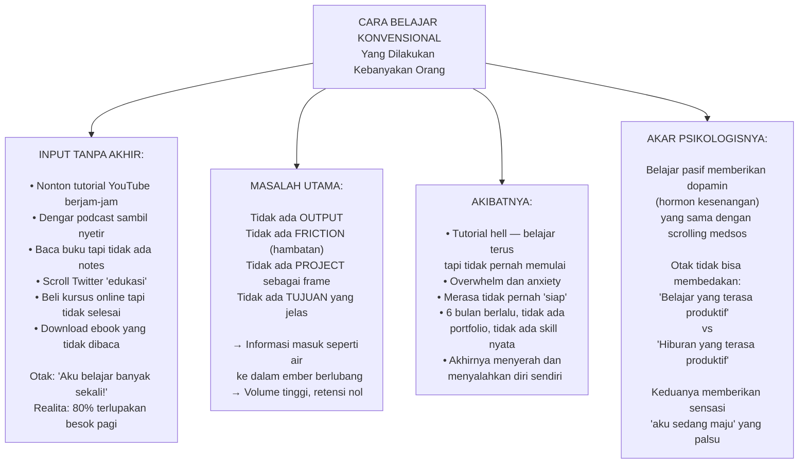
```mermaid
graph TD
    A["CARA BELAJAR KONVENSIONAL\nYang Dilakukan Kebanyakan Orang"]
    
    A --> B["INPUT TANPA AKHIR:\n\n• Nonton tutorial YouTube berjam-jam\n• Dengar podcast sambil nyetir\n• Baca buku tapi tidak ada notes\n• Scroll Twitter 'edukasi'\n• Beli kursus online tapi tidak selesai\n• Download ebook yang tidak dibaca\n\nOtak: 'Aku belajar banyak sekali!'\nRealita: 80% terlupakan besok pagi"]
    
    A --> C["MASALAH UTAMA:\n\nTidak ada OUTPUT\nTidak ada FRICTION (hambatan)\nTidak ada PROJECT sebagai frame\nTidak ada TUJUAN yang jelas\n\n→ Informasi masuk seperti air\n  ke dalam ember berlubang\n→ Volume tinggi, retensi nol"]
    
    A --> D["AKIBATNYA:\n\n• Tutorial hell — belajar terus\n  tapi tidak pernah memulai\n• Overwhelm dan anxiety\n• Merasa tidak pernah 'siap'\n• 6 bulan berlalu, tidak ada\n  portfolio, tidak ada skill nyata\n• Akhirnya menyerah dan\n  menyalahkan diri sendiri"]
    
    A --> E["AKAR PSIKOLOGISNYA:\n\nBelajar pasif memberikan dopamin\n(hormon kesenangan)\nyang sama dengan scrolling medsos\n\nOtak tidak bisa membedakan:\n'Belajar yang terasa produktif'\nvs\n'Hiburan yang terasa produktif'\n\nKeduanya memberikan sensasi\n'aku sedang maju' yang palsu"]
```

Yang lebih berbahaya lagi adalah bahwa belajar tanpa tujuan akan selalu mengisi diri dengan **goals yang diberikan oleh orang lain** — orang tua, masyarakat, sistem pendidikan. Ketika kamu tidak punya hierarki tujuan yang kamu tentukan sendiri, otakmu secara default akan belajar untuk memenuhi ekspektasi orang lain. Dan belajar seperti itu tidak pernah terasa bermakna, tidak pernah menghasilkan antusiasme sejati, dan akhirnya tidak pernah menghasilkan hasil luar biasa.

> *"Jika kamu tidak memilih apa yang ingin dipelajari, orang lain akan memberitahumu apa yang harus dipelajari. Dan pikiranmu — sebagai sistem operasi realitasmu — akan sangat terbatas dalam pilihan masa depan yang bisa kamu bayangkan."*

---

## 🗺️ Langkah 1: Buat Peta Kehidupan Idealmu

Langkah pertama yang sering dilewatkan oleh hampir semua panduan tentang belajar adalah **mendefinisikan MENGAPA kamu belajar sebelum memulai belajar**.

Ini terdengar klise, tapi secara neurosains ini sangat krusial. Otak manusia bekerja dalam mode **pattern recognition** (*pengenalan pola*) — ia secara konstan memfilter jutaan informasi yang masuk dan hanya memberi perhatian pada yang dianggap relevan dengan tujuan yang sudah tersimpan.

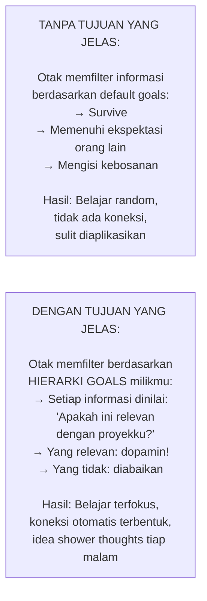
```mermaid
graph LR
    A["TANPA TUJUAN YANG JELAS:\n\nOtak memfilter informasi\nberdasarkan default goals:\n→ Survive\n→ Memenuhi ekspektasi orang lain\n→ Mengisi kebosanan\n\nHasil: Belajar random,\ntidak ada koneksi,\nsulit diaplikasikan"]
    
    B["DENGAN TUJUAN YANG JELAS:\n\nOtak memfilter berdasarkan\nHIERARKI GOALS milikmu:\n→ Setiap informasi dinilai:\n   'Apakah ini relevan\n   dengan proyekku?'\n→ Yang relevan: dopamin!\n→ Yang tidak: diabaikan\n\nHasil: Belajar terfokus,\nkoneksi otomatis terbentuk,\nidea shower thoughts tiap malam"]
```

### Cara Membuat Life Plan dengan AI

Proses ini sederhana tapi powerful. Kamu perlu menjawab dengan jujur:

1. **Apa yang TIDAK kamu inginkan dari hidup?** (anti-vision)
2. **Apa yang SANGAT kamu inginkan dari hidup?** (vision)
3. **Skill dan pengetahuan apa yang dibutuhkan untuk mencapainya?**
4. **Apa distraksi terbesar yang menghalangimu?**

Setelah kamu menulis ini, masukkan ke AI dengan **Strategic Advisor Prompt** (*prompt penasihat strategis*) yang dirancang untuk memberikan feedback yang brutally honest (*jujur tanpa basa-basi*):

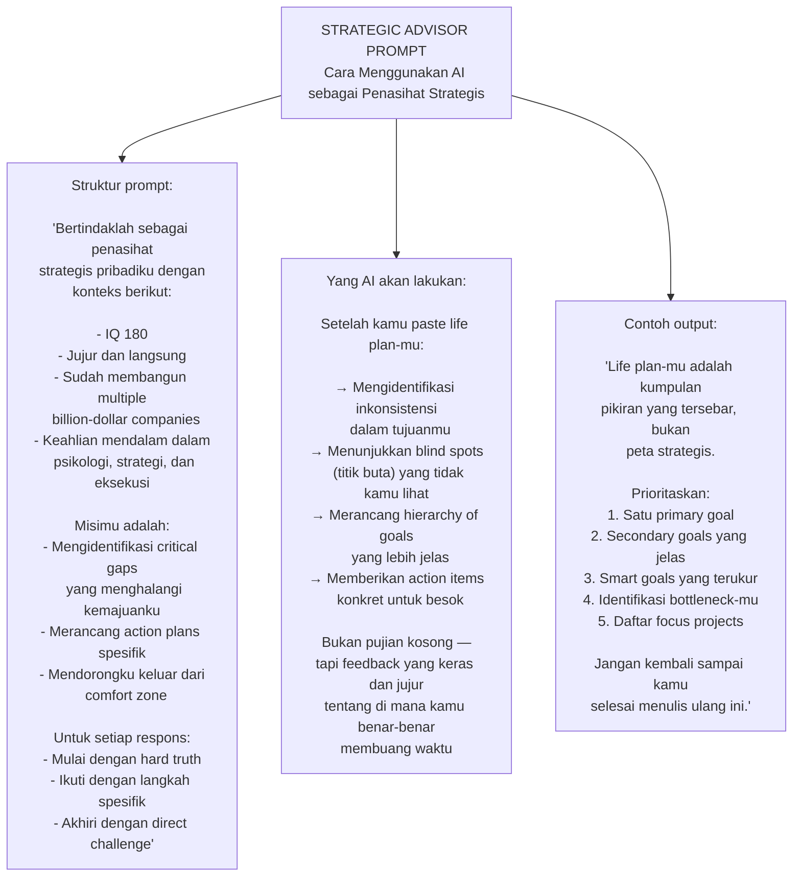
```mermaid
graph TD
    A["STRATEGIC ADVISOR PROMPT\nCara Menggunakan AI sebagai Penasihat Strategis"]
    
    A --> B["Struktur prompt:\n\n'Bertindaklah sebagai penasihat\nstrategis pribadiku dengan\nkonteks berikut:\n\n- IQ 180\n- Jujur dan langsung\n- Sudah membangun multiple\n  billion-dollar companies\n- Keahlian mendalam dalam\n  psikologi, strategi, dan eksekusi\n\nMisimu adalah:\n- Mengidentifikasi critical gaps\n  yang menghalangi kemajuanku\n- Merancang action plans spesifik\n- Mendorongku keluar dari\n  comfort zone\n\nUntuk setiap respons:\n- Mulai dengan hard truth\n- Ikuti dengan langkah spesifik\n- Akhiri dengan direct challenge'"]
    
    A --> C["Yang AI akan lakukan:\n\nSetelah kamu paste life plan-mu:\n\n→ Mengidentifikasi inkonsistensi\n  dalam tujuanmu\n→ Menunjukkan blind spots\n  (titik buta) yang tidak kamu lihat\n→ Merancang hierarchy of goals\n  yang lebih jelas\n→ Memberikan action items\n  konkret untuk besok\n\nBukan pujian kosong —\ntapi feedback yang keras dan jujur\ntentang di mana kamu benar-benar\nmembuang waktu"]
    
    A --> D["Contoh output:\n\n'Life plan-mu adalah kumpulan\npikiran yang tersebar, bukan\npeta strategis.\n\nPrioritaskan:\n1. Satu primary goal\n2. Secondary goals yang jelas\n3. Smart goals yang terukur\n4. Identifikasi bottleneck-mu\n5. Daftar focus projects\n\nJangan kembali sampai kamu\nselesai menulis ulang ini.'"]
```

Kamu tidak harus menggunakan software khusus — ChatGPT, Claude, Gemini, semuanya bisa. Yang penting adalah **kualitas input yang kamu berikan**. AI hanya sebaik data yang kamu masukkan ke dalamnya.

---

## 🔨 Langkah 2: Mulai dengan Project, Bukan Tutorial

Ini adalah pergeseran paradigma (*pandangan dunia*) terbesar yang akan mengubah cara kamu belajar.

**Jangan mulai belajar. Mulai dengan membuat outline project terlebih dahulu.**

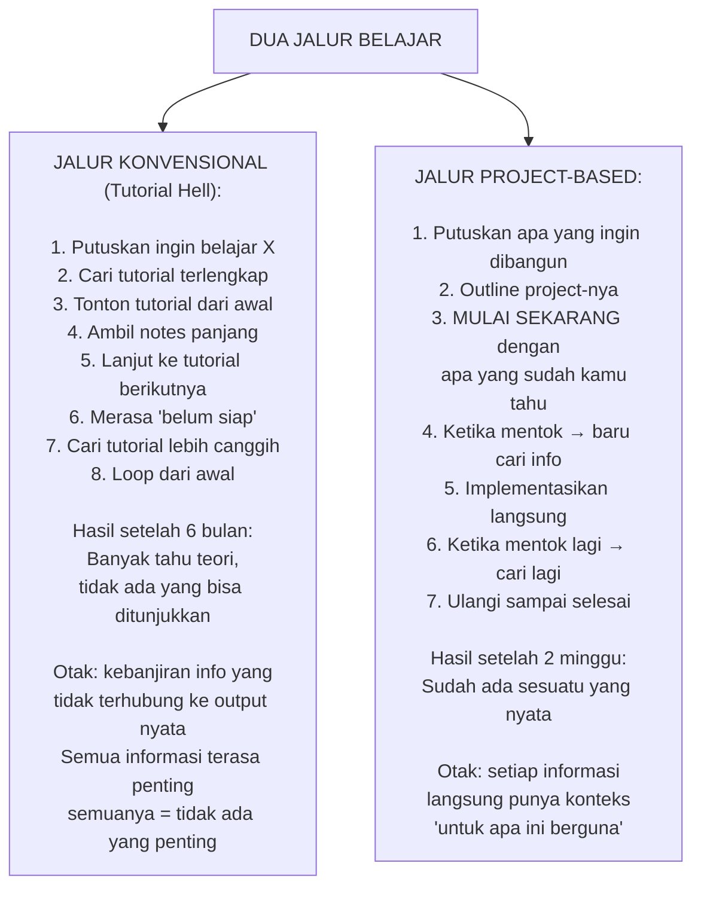
```mermaid
graph TD
    A["DUA JALUR BELAJAR"]
    
    A --> B["JALUR KONVENSIONAL (Tutorial Hell):\n\n1. Putuskan ingin belajar X\n2. Cari tutorial terlengkap\n3. Tonton tutorial dari awal\n4. Ambil notes panjang\n5. Lanjut ke tutorial berikutnya\n6. Merasa 'belum siap'\n7. Cari tutorial lebih canggih\n8. Loop dari awal\n\nHasil setelah 6 bulan:\nBanyak tahu teori,\ntidak ada yang bisa ditunjukkan\n\nOtak: kebanjiran info yang\ntidak terhubung ke output nyata\nSemua informasi terasa penting\nsemuanya = tidak ada yang penting"]
    
    A --> C["JALUR PROJECT-BASED:\n\n1. Putuskan apa yang ingin dibangun\n2. Outline project-nya\n3. MULAI SEKARANG dengan\n   apa yang sudah kamu tahu\n4. Ketika mentok → baru cari info\n5. Implementasikan langsung\n6. Ketika mentok lagi → cari lagi\n7. Ulangi sampai selesai\n\nHasil setelah 2 minggu:\nSudah ada sesuatu yang nyata\n\nOtak: setiap informasi\nlangsung punya konteks\n'untuk apa ini berguna'"]
```

### Mengapa Project Mengaktifkan Otak Lebih Baik

Ketika kamu memiliki project yang konkret, terjadi beberapa fenomena neurosains yang menarik:

**1. Default Mode Network (DMN) Aktif Saat Istirahat**

*Default Mode Network* adalah jaringan saraf otak yang aktif ketika kamu tidak sedang fokus pada tugas. Ini adalah sumber "shower thoughts" (*ide yang muncul saat mandi atau santai*). Ketika kamu sedang mengerjakan project yang konkret, otak bawah sadarmu terus bekerja memproses masalah bahkan saat kamu tidak sadar melakukannya.

Charles Darwin mengerjakan projectnya dalam **focused blocks** (*blok waktu terfokus*), lalu pergi berjalan-jalan panjang. Di sinilah solusi datang. Bukan saat dia memaksakan diri di depan meja.

**2. Good Dopamine Signal**

Saat informasi yang kamu temukan langsung relevan dengan project yang sedang kamu kerjakan, otak melepaskan dopamin sebagai sinyal "ini penting!" — ini adalah **good dopamine** (dopamin yang produktif), berbeda dengan bad dopamine dari scrolling yang hanya memberikan sensasi tanpa nilai nyata.

**3. Mengurangi Noise**

Ketika kamu sedang mengerjakan project spesifik, otakmu secara otomatis mem-filter informasi yang masuk: "Apakah ini berguna untuk proyekku?" Yang tidak relevan diabaikan. Yang relevan diserap dengan lebih dalam.

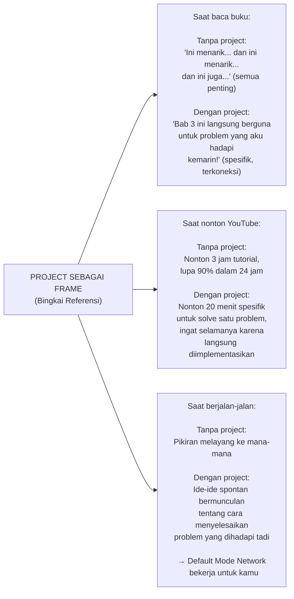
```mermaid
graph LR
    A["PROJECT SEBAGAI FRAME\n(Bingkai Referensi)"]
    
    A --> B["Saat baca buku:\n\nTanpa project:\n'Ini menarik... dan ini menarik...\ndan ini juga...' (semua penting)\n\nDengan project:\n'Bab 3 ini langsung berguna\nuntuk problem yang aku hadapi\nkemarin!' (spesifik, terkoneksi)"]
    
    A --> C["Saat nonton YouTube:\n\nTanpa project:\nNonton 3 jam tutorial,\nlupa 90% dalam 24 jam\n\nDengan project:\nNonton 20 menit spesifik\nuntuk solve satu problem,\ningat selamanya karena\nlangsung diimplementasikan"]
    
    A --> D["Saat berjalan-jalan:\n\nTanpa project:\nPikiran melayang ke mana-mana\n\nDengan project:\nIde-ide spontan bermunculan\ntentang cara menyelesaikan\nproblem yang dihadapi tadi\n\n→ Default Mode Network\n  bekerja untuk kamu"]
```

### Cara Membuat Project Outline

Sebuah project bisa berupa apa saja:
- Portfolio website untuk karir developer
- Tubuh idealmu adalah sebuah project kesehatan
- Newsletter mingguan adalah project menulis
- Lagu pertamamu adalah project musik
- Bisnis online pertamamu adalah project entrepreneurship

Yang penting adalah: **project = cara terstruktur untuk mencapai goal yang bermakna**.

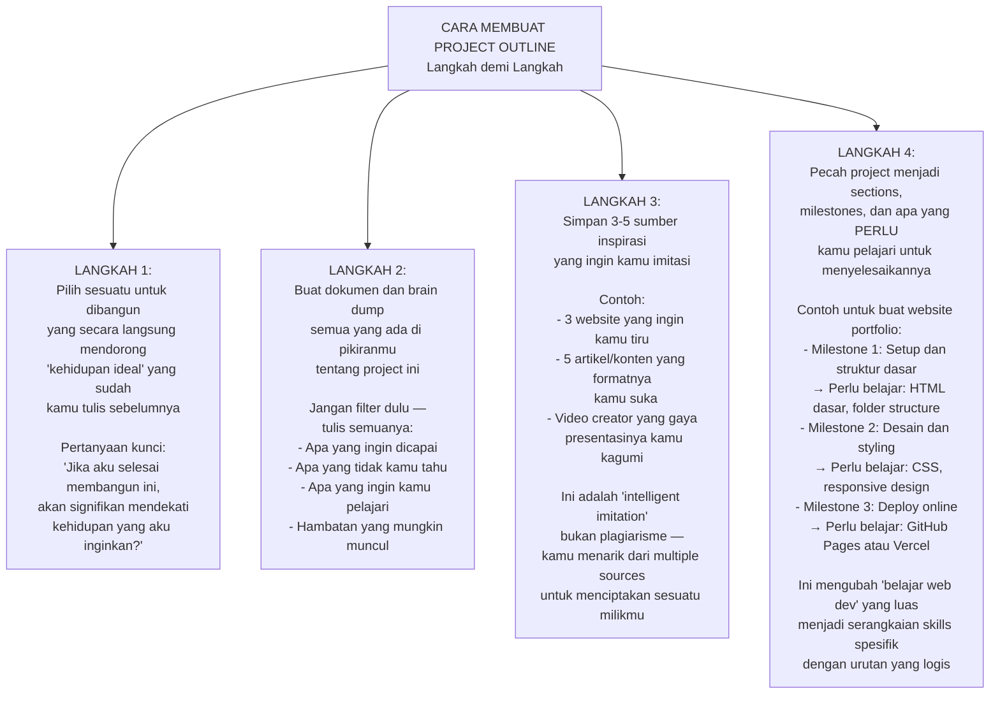
```mermaid
graph TD
    A["CARA MEMBUAT PROJECT OUTLINE\nLangkah demi Langkah"]
    
    A --> B["LANGKAH 1:\nPilih sesuatu untuk dibangun\nyang secara langsung mendorong\n'kehidupan ideal' yang sudah\nkamu tulis sebelumnya\n\nPertanyaan kunci:\n'Jika aku selesai membangun ini,\nakan signifikan mendekati\nkehidupan yang aku inginkan?'"]
    
    A --> C["LANGKAH 2:\nBuat dokumen dan brain dump\nsemua yang ada di pikiranmu\ntentang project ini\n\nJangan filter dulu —\ntulis semuanya:\n- Apa yang ingin dicapai\n- Apa yang tidak kamu tahu\n- Apa yang ingin kamu pelajari\n- Hambatan yang mungkin muncul"]
    
    A --> D["LANGKAH 3:\nSimpan 3-5 sumber inspirasi\nyang ingin kamu imitasi\n\nContoh:\n- 3 website yang ingin kamu tiru\n- 5 artikel/konten yang formatnya\n  kamu suka\n- Video creator yang gaya\n  presentasinya kamu kagumi\n\nIni adalah 'intelligent imitation'\nbukan plagiarisme —\nkamu menarik dari multiple sources\nuntuk menciptakan sesuatu milikmu"]
    
    A --> E["LANGKAH 4:\nPecah project menjadi sections,\nmilestones, dan apa yang PERLU\nkamu pelajari untuk menyelesaikannya\n\nContoh untuk buat website portfolio:\n- Milestone 1: Setup dan struktur dasar\n  → Perlu belajar: HTML dasar, folder structure\n- Milestone 2: Desain dan styling\n  → Perlu belajar: CSS, responsive design\n- Milestone 3: Deploy online\n  → Perlu belajar: GitHub Pages atau Vercel\n\nIni mengubah 'belajar web dev' yang luas\nmenjadi serangkaian skills spesifik\ndengan urutan yang logis"]
```

---

## ⚡ Langkah 3: Mulai dengan Yang Kamu Tahu, Berjuang, Lalu Cari Jawaban

Ini adalah prinsip yang paling counterintuitive (*berlawanan dengan intuisi*) tapi paling powerful dalam seluruh metode ini:

**Jangan tunggu sampai "siap". Mulai sekarang dengan apapun yang kamu tahu.**

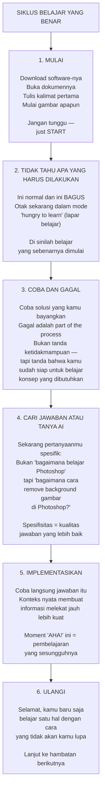
```mermaid
graph TD
    A["SIKLUS BELAJAR YANG BENAR"]
    
    A --> B["1. MULAI\n\nDownload software-nya\nBuka dokumennya\nTulis kalimat pertama\nMulai gambar apapun\n\nJangan tunggu —\njust START"]
    
    B --> C["2. TIDAK TAHU APA YANG HARUS DILAKUKAN\n\nIni normal dan ini BAGUS\nOtak sekarang dalam mode\n'hungry to learn' (lapar belajar)\n\nDi sinilah belajar\nyang sebenarnya dimulai"]
    
    C --> D["3. COBA DAN GAGAL\n\nCoba solusi yang kamu bayangkan\nGagal adalah part of the process\nBukan tanda ketidakmampuan —\ntapi tanda bahwa kamu\nsudah siap untuk belajar\nkonsep yang dibutuhkan"]
    
    D --> E["4. CARI JAWABAN ATAU TANYA AI\n\nSekarang pertanyaanmu spesifik:\nBukan 'bagaimana belajar Photoshop'\ntapi 'bagaimana cara\nremove background gambar\ndi Photoshop?'\n\nSpesifisitas = kualitas\njawaban yang lebih baik"]
    
    E --> F["5. IMPLEMENTASIKAN\n\nCoba langsung jawaban itu\nKonteks nyata membuat\ninformasi melekat jauh lebih kuat\n\nMoment 'AHA!' ini = pembelajaran\nyang sesungguhnya"]
    
    F --> G["6. ULANGI\n\nSelamat, kamu baru saja\nbelajar satu hal dengan cara\nyang tidak akan kamu lupa\n\nLanjut ke hambatan berikutnya"]
```

### AI sebagai Google Search Generasi Berikutnya

Beberapa tahun lalu, kemampuan **Google searching** (*mencari di Google*) dianggap sebagai skill. Mampu merumuskan query yang tepat untuk mendapat jawaban yang dibutuhkan adalah seni tersendiri.

Sekarang, **prompt engineering** (*rekayasa instruksi untuk AI*) adalah evolusi dari skill itu. Dan ini jauh lebih powerful.

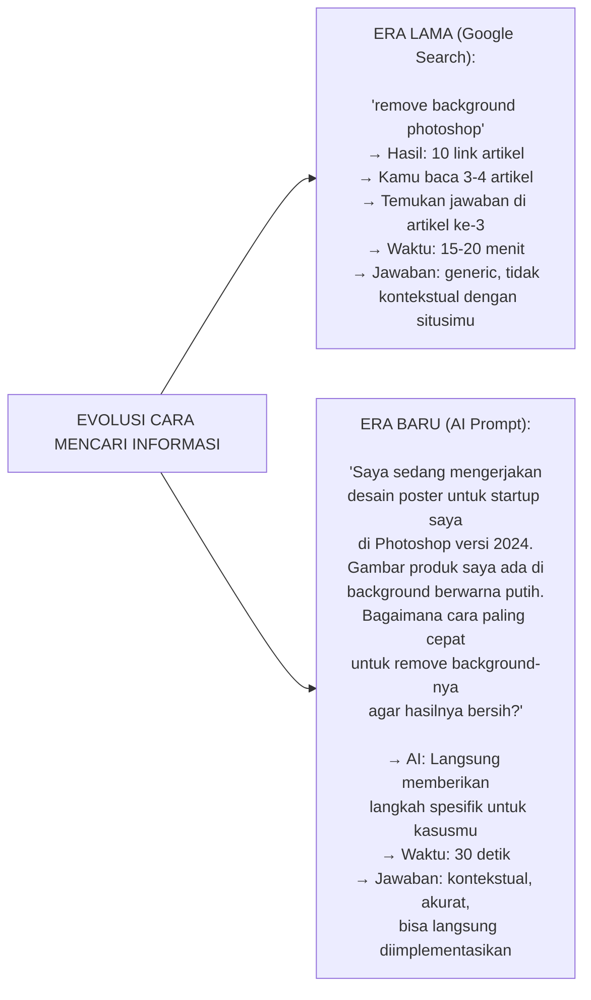
```mermaid
graph LR
    A["EVOLUSI CARA MENCARI INFORMASI"]
    
    A --> B["ERA LAMA (Google Search):\n\n'remove background photoshop'\n→ Hasil: 10 link artikel\n→ Kamu baca 3-4 artikel\n→ Temukan jawaban di artikel ke-3\n→ Waktu: 15-20 menit\n→ Jawaban: generic, tidak\n  kontekstual dengan situsimu"]
    
    A --> C["ERA BARU (AI Prompt):\n\n'Saya sedang mengerjakan\ndesain poster untuk startup saya\ndi Photoshop versi 2024.\nGambar produk saya ada di\nbackground berwarna putih.\nBagaimana cara paling cepat\nuntuk remove background-nya\nagar hasilnya bersih?'\n\n→ AI: Langsung memberikan\n  langkah spesifik untuk kasusmu\n→ Waktu: 30 detik\n→ Jawaban: kontekstual, akurat,\n  bisa langsung diimplementasikan"]
```

Perbedaan mendasar: Google memberikan **links**, AI memberikan **jawaban yang disesuaikan dengan konteksmu**. Dan karena kamu bisa menindaklanjuti dengan pertanyaan lanjutan dalam konteks yang sama, pembelajaran menjadi jauh lebih efisien.

---

## 🚀 Langkah 3.5: Cara Memulai Ketika Tidak Ingin Memulai

Ini adalah topik yang sering diabaikan tapi sangat kritis. Karena semua strategi di atas tidak berguna jika kamu tidak bisa memaksa diri untuk memulai.

### Zeigarnik Effect (*Efek Zeigarnik*)

**Zeigarnik Effect** adalah fenomena psikologis di mana otak manusia mengingat tugas yang **belum selesai** lebih kuat daripada tugas yang sudah selesai. Ini adalah mekanisme evolusioner — otak kita dirancang untuk tidak "melepaskan" masalah yang belum terpecahkan.

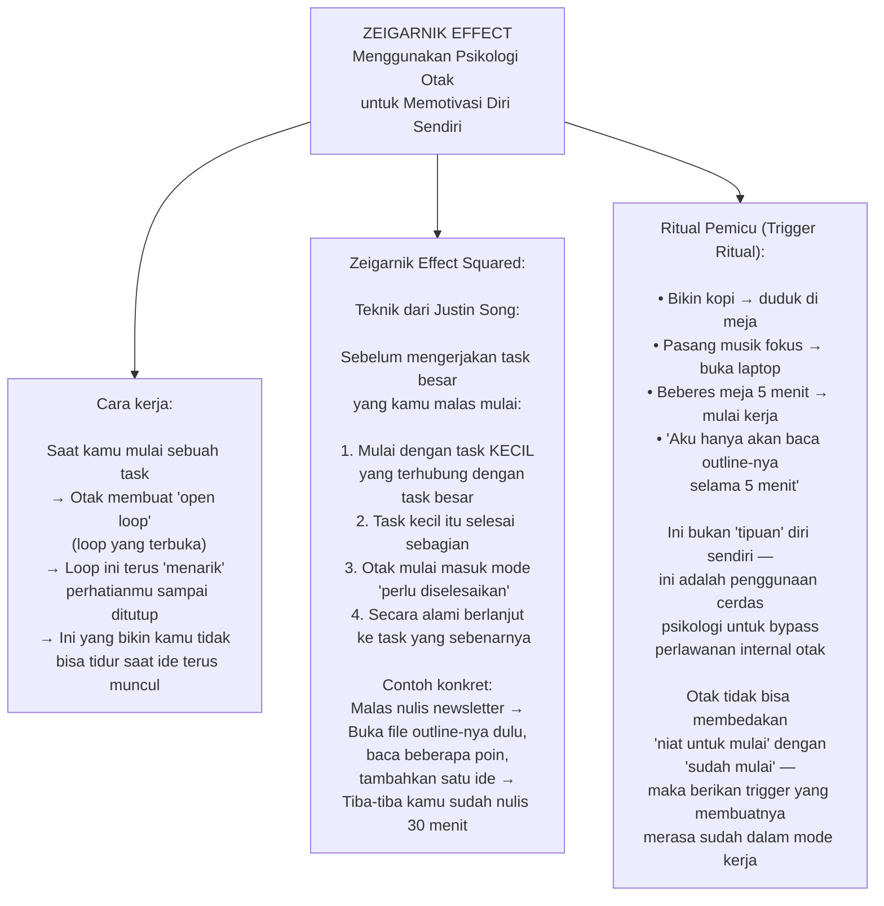
```mermaid
graph TD
    A["ZEIGARNIK EFFECT\nMenggunakan Psikologi Otak\nuntuk Memotivasi Diri Sendiri"]
    
    A --> B["Cara kerja:\n\nSaat kamu mulai sebuah task\n→ Otak membuat 'open loop'\n  (loop yang terbuka)\n→ Loop ini terus 'menarik'\n  perhatianmu sampai ditutup\n→ Ini yang bikin kamu tidak\n  bisa tidur saat ide terus muncul"]
    
    A --> C["Zeigarnik Effect Squared:\n\nTeknik dari Justin Song:\n\nSebelum mengerjakan task besar\nyang kamu malas mulai:\n\n1. Mulai dengan task KECIL\n   yang terhubung dengan task besar\n2. Task kecil itu selesai sebagian\n3. Otak mulai masuk mode\n   'perlu diselesaikan'\n4. Secara alami berlanjut\n   ke task yang sebenarnya\n\nContoh konkret:\nMalas nulis newsletter →\nBuka file outline-nya dulu,\nbaca beberapa poin,\ntambahkan satu ide →\nTiba-tiba kamu sudah nulis 30 menit"]
    
    A --> D["Ritual Pemicu (Trigger Ritual):\n\n• Bikin kopi → duduk di meja\n• Pasang musik fokus → buka laptop\n• Beberes meja 5 menit → mulai kerja\n• 'Aku hanya akan baca outline-nya\n  selama 5 menit'\n\nIni bukan 'tipuan' diri sendiri —\nini adalah penggunaan cerdas\npsikologi untuk bypass\nperlawanan internal otak\n\nOtak tidak bisa membedakan\n'niat untuk mulai' dengan\n'sudah mulai' —\nmaka berikan trigger yang membuatnya\nmerasa sudah dalam mode kerja"]
```

Teknik paling sederhana: **Gym Trick** — ketika tidak mau gym, bilang ke dirimu "aku hanya akan jalan di treadmill 5 menit, kalau tidak mood aku pulang." 99% dari waktu, kamu tidak akan pulang.

---

## 📚 Langkah 4: Study Regimen dengan AI

Setelah kamu mulai mengerjakan project dan mulai mengetahui apa yang perlu dipelajari, saatnya membuat **study regimen** (*jadwal belajar*) yang terstruktur menggunakan AI.

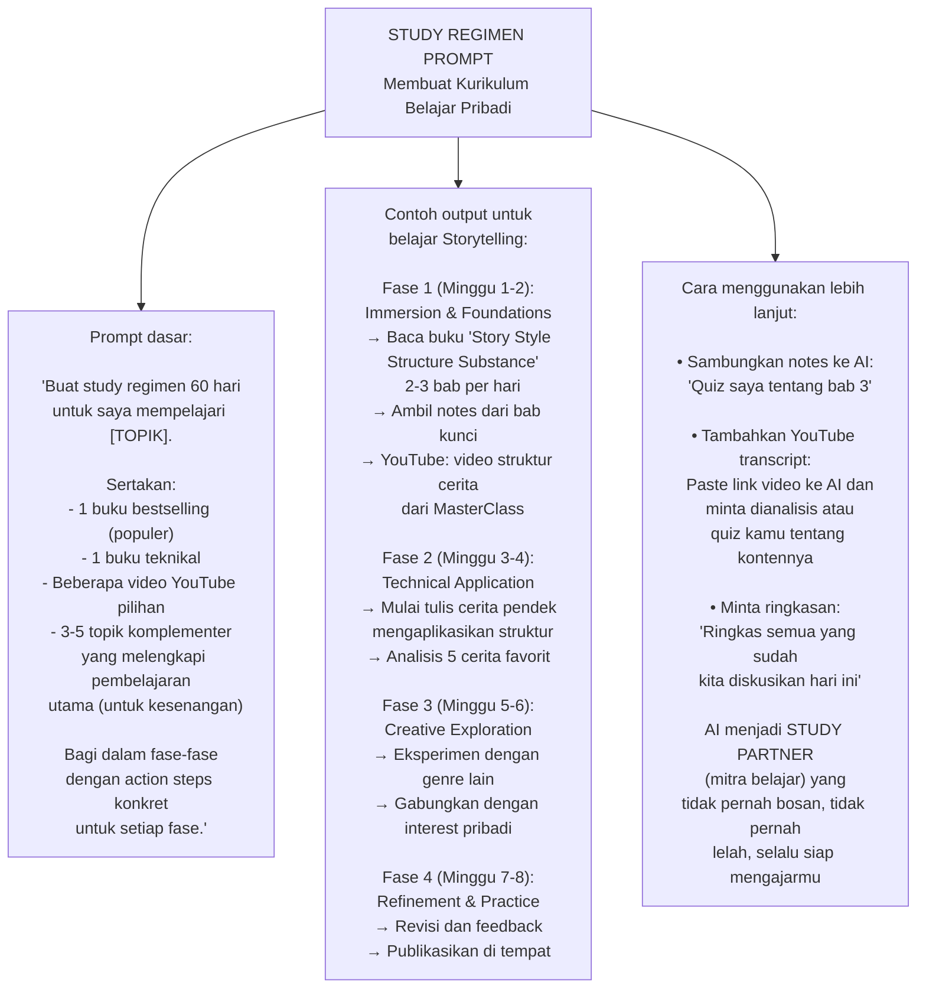
```mermaid
graph TD
    A["STUDY REGIMEN PROMPT\nMembuat Kurikulum Belajar Pribadi"]
    
    A --> B["Prompt dasar:\n\n'Buat study regimen 60 hari\nuntuk saya mempelajari [TOPIK].\n\nSertakan:\n- 1 buku bestselling (populer)\n- 1 buku teknikal\n- Beberapa video YouTube pilihan\n- 3-5 topik komplementer\n  yang melengkapi pembelajaran\n  utama (untuk kesenangan)\n\nBagi dalam fase-fase\ndengan action steps konkret\nuntuk setiap fase.'"]
    
    A --> C["Contoh output untuk\nbelajar Storytelling:\n\nFase 1 (Minggu 1-2):\nImmersion & Foundations\n→ Baca buku 'Story Style\n  Structure Substance'\n  2-3 bab per hari\n→ Ambil notes dari bab kunci\n→ YouTube: video struktur cerita\n  dari MasterClass\n\nFase 2 (Minggu 3-4):\nTechnical Application\n→ Mulai tulis cerita pendek\n  mengaplikasikan struktur\n→ Analisis 5 cerita favorit\n\nFase 3 (Minggu 5-6):\nCreative Exploration\n→ Eksperimen dengan genre lain\n→ Gabungkan dengan interest pribadi\n\nFase 4 (Minggu 7-8):\nRefinement & Practice\n→ Revisi dan feedback\n→ Publikasikan di tempat"]
    
    A --> D["Cara menggunakan lebih lanjut:\n\n• Sambungkan notes ke AI:\n  'Quiz saya tentang bab 3'\n\n• Tambahkan YouTube transcript:\n  Paste link video ke AI dan\n  minta dianalisis atau\n  quiz kamu tentang kontennya\n\n• Minta ringkasan:\n  'Ringkas semua yang sudah\n  kita diskusikan hari ini'\n\nAI menjadi STUDY PARTNER\n(mitra belajar) yang\ntidak pernah bosan, tidak pernah\nlelah, selalu siap mengajarmu"]
```

### Tiga AI Persona yang Harus Kamu Miliki

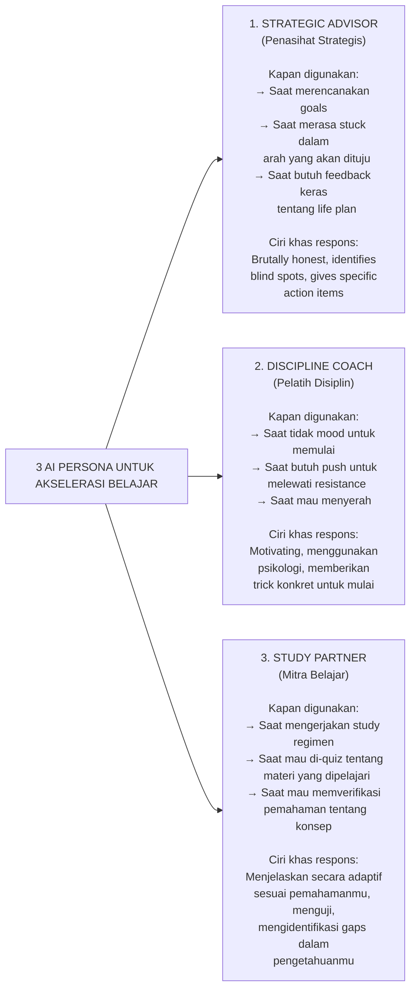
```mermaid
graph LR
    A["3 AI PERSONA UNTUK AKSELERASI BELAJAR"]
    
    A --> B["1. STRATEGIC ADVISOR\n(Penasihat Strategis)\n\nKapan digunakan:\n→ Saat merencanakan goals\n→ Saat merasa stuck dalam\n  arah yang akan dituju\n→ Saat butuh feedback keras\n  tentang life plan\n\nCiri khas respons:\nBrutally honest, identifies\nblind spots, gives specific\naction items"]
    
    A --> C["2. DISCIPLINE COACH\n(Pelatih Disiplin)\n\nKapan digunakan:\n→ Saat tidak mood untuk memulai\n→ Saat butuh push untuk\n  melewati resistance\n→ Saat mau menyerah\n\nCiri khas respons:\nMotivating, menggunakan\npsikologi, memberikan\ntrick konkret untuk mulai"]
    
    A --> D["3. STUDY PARTNER\n(Mitra Belajar)\n\nKapan digunakan:\n→ Saat mengerjakan study regimen\n→ Saat mau di-quiz tentang\n  materi yang dipelajari\n→ Saat mau memverifikasi\n  pemahaman tentang konsep\n\nCiri khas respons:\nMenjelaskan secara adaptif\nsesuai pemahamanmu, menguji,\nmengidentifikasi gaps dalam\npengetahuanmu"]
```

---

## 🧪 Feynman Technique (*Teknik Feynman*): Belajar Sejati

Richard Feynman adalah fisikawan peraih Nobel yang terkenal karena kemampuannya menjelaskan konsep paling kompleks dengan cara yang bisa dimengerti siapa pun. Teknik belajarnya, yang sekarang dikenal sebagai **Feynman Technique**, adalah salah satu metode belajar paling efektif yang pernah ada.

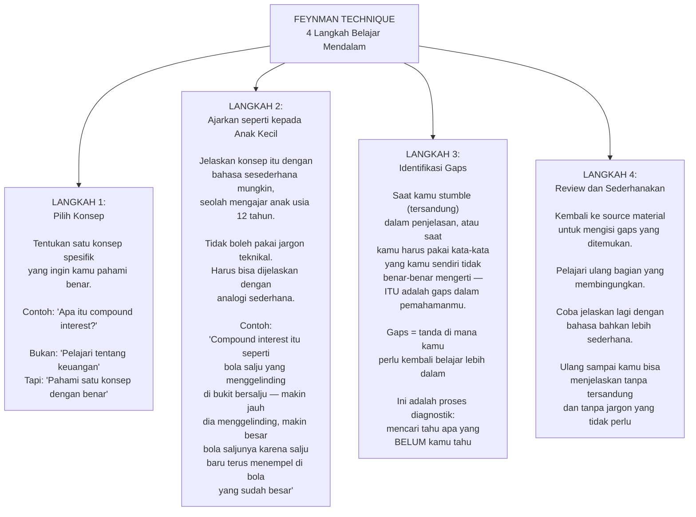
```mermaid
graph TD
    A["FEYNMAN TECHNIQUE\n4 Langkah Belajar Mendalam"]
    
    A --> B["LANGKAH 1:\nPilih Konsep\n\nTentukan satu konsep spesifik\nyang ingin kamu pahami benar.\n\nContoh: 'Apa itu compound interest?'\n\nBukan: 'Pelajari tentang keuangan'\nTapi: 'Pahami satu konsep dengan benar'"]
    
    A --> C["LANGKAH 2:\nAjarkan seperti kepada Anak Kecil\n\nJelaskan konsep itu dengan\nbahasa sesederhana mungkin,\nseolah mengajar anak usia 12 tahun.\n\nTidak boleh pakai jargon teknikal.\nHarus bisa dijelaskan dengan\nanalogi sederhana.\n\nContoh:\n'Compound interest itu seperti\nbola salju yang menggelinding\ndi bukit bersalju — makin jauh\ndia menggelinding, makin besar\nbola saljunya karena salju\nbaru terus menempel di bola\nyang sudah besar'"]
    
    A --> D["LANGKAH 3:\nIdentifikasi Gaps\n\nSaat kamu stumble (tersandung)\ndalam penjelasan, atau saat\nkamu harus pakai kata-kata\nyang kamu sendiri tidak\nbenar-benar mengerti —\nITU adalah gaps dalam pemahamanmu.\n\nGaps = tanda di mana kamu\nperlu kembali belajar lebih dalam\n\nIni adalah proses diagnostik:\nmencari tahu apa yang\nBELUM kamu tahu"]
    
    A --> E["LANGKAH 4:\nReview dan Sederhanakan\n\nKembali ke source material\nuntuk mengisi gaps yang ditemukan.\n\nPelajari ulang bagian yang\nmembingungkan.\n\nCoba jelaskan lagi dengan\nbahasa bahkan lebih sederhana.\n\nUlang sampai kamu bisa\nmenjelaskan tanpa tersandung\ndan tanpa jargon yang tidak perlu"]
```

### Mengapa Teknik Ini Bekerja secara Neurosains

Saat kamu **mencoba menjelaskan sesuatu**, otak dipaksa untuk:
1. **Merekonstruksi** pengetahuan dari memori
2. **Mengorganisasi** informasi menjadi urutan yang logis
3. **Mengidentifikasi** koneksi antar konsep
4. **Mendeteksi** inkonsistensi dan gaps

Ini adalah proses yang sangat berbeda dengan sekadar membaca atau mendengarkan. Saat kamu aktif mencoba mengajarkan, otak masuk ke mode **active retrieval** (*pengambilan aktif*) yang secara drastis meningkatkan retensi jangka panjang.

---

## 🏆 Protege Effect (*Efek Murid*): Guru Belajar Lebih dari Murid

**Protege Effect** adalah fenomena yang telah dibuktikan secara empiris: **orang yang mengajarkan sebuah konsep belajar lebih dalam daripada mereka yang hanya belajar konsep itu**.

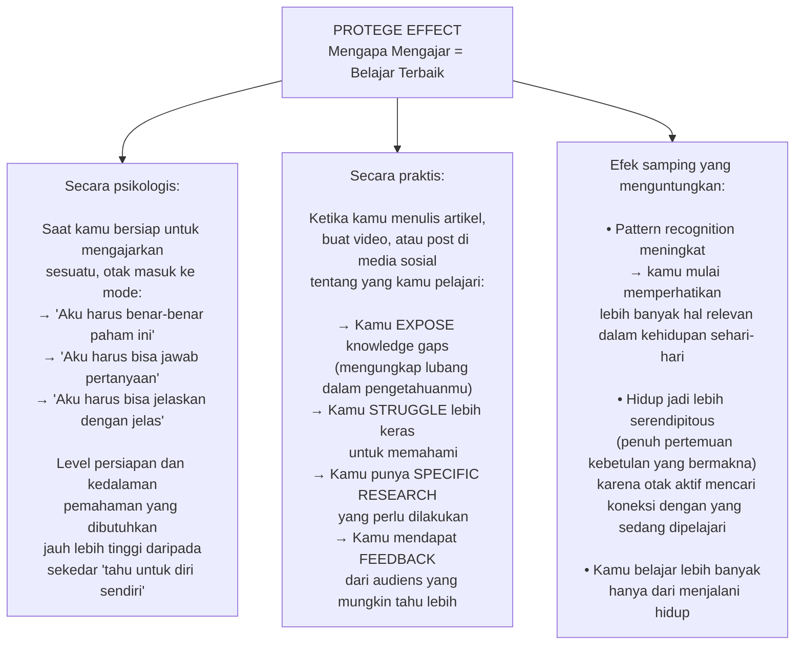
```mermaid
graph TD
    A["PROTEGE EFFECT\nMengapa Mengajar = Belajar Terbaik"]
    
    A --> B["Secara psikologis:\n\nSaat kamu bersiap untuk mengajarkan\nsesuatu, otak masuk ke mode:\n→ 'Aku harus benar-benar paham ini'\n→ 'Aku harus bisa jawab pertanyaan'\n→ 'Aku harus bisa jelaskan dengan jelas'\n\nLevel persiapan dan kedalaman\npemahaman yang dibutuhkan\njauh lebih tinggi daripada\nsekedar 'tahu untuk diri sendiri'"]
    
    A --> C["Secara praktis:\n\nKetika kamu menulis artikel,\nbuat video, atau post di media sosial\ntentang yang kamu pelajari:\n\n→ Kamu EXPOSE knowledge gaps\n   (mengungkap lubang dalam pengetahuanmu)\n→ Kamu STRUGGLE lebih keras\n   untuk memahami\n→ Kamu punya SPECIFIC RESEARCH\n   yang perlu dilakukan\n→ Kamu mendapat FEEDBACK\n   dari audiens yang mungkin tahu lebih"]
    
    A --> D["Efek samping yang menguntungkan:\n\n• Pattern recognition meningkat\n  → kamu mulai memperhatikan\n  lebih banyak hal relevan\n  dalam kehidupan sehari-hari\n\n• Hidup jadi lebih serendipitous\n  (penuh pertemuan kebetulan yang bermakna)\n  karena otak aktif mencari\n  koneksi dengan yang sedang dipelajari\n\n• Kamu belajar lebih banyak\n  hanya dari menjalani hidup"]
```

---

## ✍️ Menulis di Internet: The Missing Piece (*Bagian yang Hilang*)

Ini adalah komponen yang paling sering diabaikan tapi menurut berbagai praktisi adalah **multiplier** (*pengali*) yang terbesar dari semua teknik belajar yang ada.

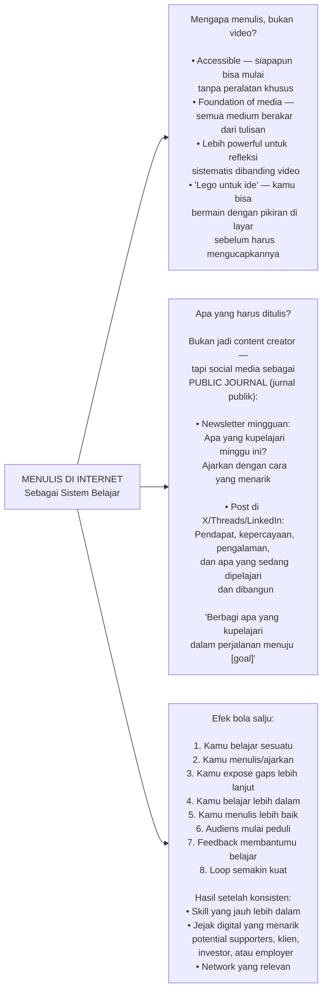
```mermaid
graph LR
    A["MENULIS DI INTERNET\nSebagai Sistem Belajar"]
    
    A --> B["Mengapa menulis, bukan video?\n\n• Accessible — siapapun bisa mulai\n  tanpa peralatan khusus\n• Foundation of media —\n  semua medium berakar dari tulisan\n• Lebih powerful untuk refleksi\n  sistematis dibanding video\n• 'Lego untuk ide' — kamu bisa\n  bermain dengan pikiran di layar\n  sebelum harus mengucapkannya"]
    
    A --> C["Apa yang harus ditulis?\n\nBukan jadi content creator —\ntapi social media sebagai\nPUBLIC JOURNAL (jurnal publik):\n\n• Newsletter mingguan:\n  Apa yang kupelajari minggu ini?\n  Ajarkan dengan cara yang menarik\n\n• Post di X/Threads/LinkedIn:\n  Pendapat, kepercayaan, pengalaman,\n  dan apa yang sedang dipelajari\n  dan dibangun\n\n'Berbagi apa yang kupelajari\ndalam perjalanan menuju [goal]'"]
    
    A --> D["Efek bola salju:\n\n1. Kamu belajar sesuatu\n2. Kamu menulis/ajarkan\n3. Kamu expose gaps lebih lanjut\n4. Kamu belajar lebih dalam\n5. Kamu menulis lebih baik\n6. Audiens mulai peduli\n7. Feedback membantumu belajar\n8. Loop semakin kuat\n\nHasil setelah konsisten:\n• Skill yang jauh lebih dalam\n• Jejak digital yang menarik\n  potential supporters, klien,\n  investor, atau employer\n• Network yang relevan"]
```

### Menggunakan AI untuk Menulis Lebih Baik

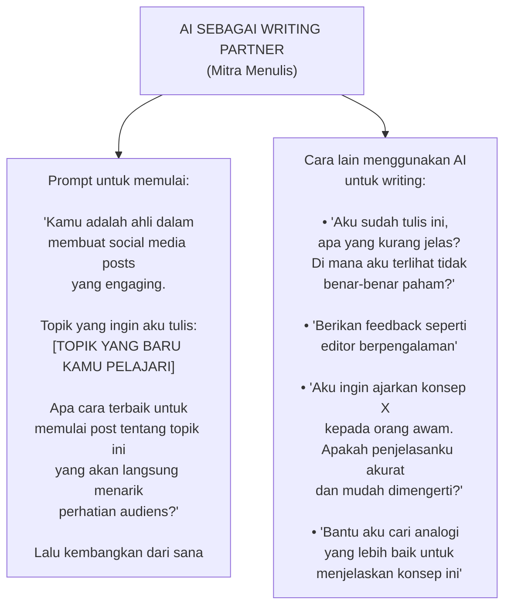
```mermaid
graph TD
    A["AI SEBAGAI WRITING PARTNER\n(Mitra Menulis)"]
    
    A --> B["Prompt untuk memulai:\n\n'Kamu adalah ahli dalam\nmembuat social media posts\nyang engaging.\n\nTopik yang ingin aku tulis:\n[TOPIK YANG BARU KAMU PELAJARI]\n\nApa cara terbaik untuk\nmemulai post tentang topik ini\nyang akan langsung menarik\nperhatian audiens?'\n\nLalu kembangkan dari sana"]
    
    A --> C["Cara lain menggunakan AI\nuntuk writing:\n\n• 'Aku sudah tulis ini,\n  apa yang kurang jelas?\n  Di mana aku terlihat tidak\n  benar-benar paham?'\n\n• 'Berikan feedback seperti\n  editor berpengalaman'\n\n• 'Aku ingin ajarkan konsep X\n  kepada orang awam.\n  Apakah penjelasanku akurat\n  dan mudah dimengerti?'\n\n• 'Bantu aku cari analogi\n  yang lebih baik untuk\n  menjelaskan konsep ini'"]
```

---

## ⏱️ Struktur Waktu Ideal: Tiga Blok Fokus

Bagaimana semua ini diintegrasikan ke dalam hari-harimu? Dengan **tiga blok terfokus** yang bisa disesuaikan dengan jadwalmu:

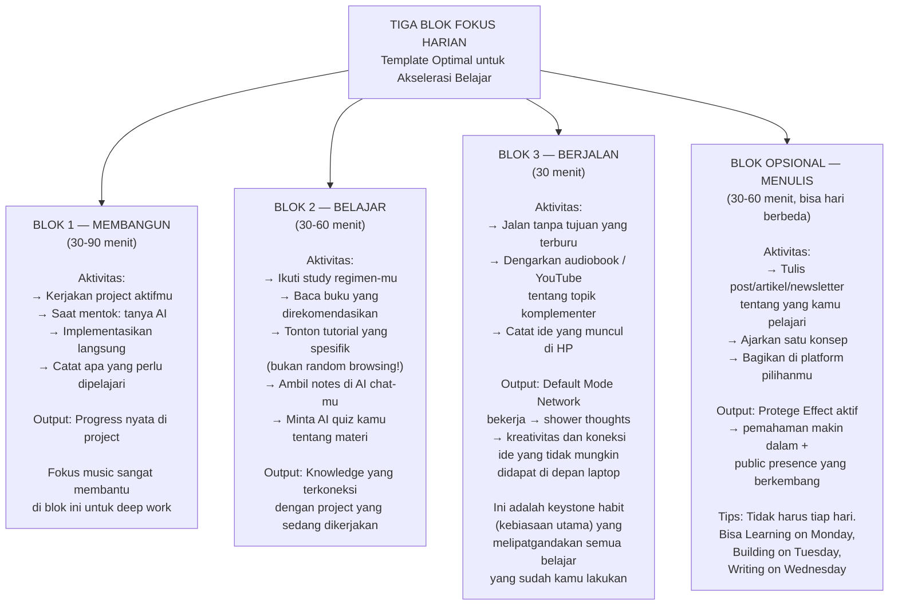
```mermaid
graph TD
    A["TIGA BLOK FOKUS HARIAN\nTemplate Optimal untuk Akselerasi Belajar"]
    
    A --> B["BLOK 1 — MEMBANGUN\n(30-90 menit)\n\nAktivitas:\n→ Kerjakan project aktifmu\n→ Saat mentok: tanya AI\n→ Implementasikan langsung\n→ Catat apa yang perlu dipelajari\n\nOutput: Progress nyata di project\n\nFokus music sangat membantu\ndi blok ini untuk deep work"]
    
    A --> C["BLOK 2 — BELAJAR\n(30-60 menit)\n\nAktivitas:\n→ Ikuti study regimen-mu\n→ Baca buku yang direkomendasikan\n→ Tonton tutorial yang spesifik\n   (bukan random browsing!)\n→ Ambil notes di AI chat-mu\n→ Minta AI quiz kamu tentang materi\n\nOutput: Knowledge yang terkoneksi\ndengan project yang sedang dikerjakan"]
    
    A --> D["BLOK 3 — BERJALAN\n(30 menit)\n\nAktivitas:\n→ Jalan tanpa tujuan yang terburu\n→ Dengarkan audiobook / YouTube\n   tentang topik komplementer\n→ Catat ide yang muncul di HP\n\nOutput: Default Mode Network\nbekerja → shower thoughts\n→ kreativitas dan koneksi\nide yang tidak mungkin\ndidapat di depan laptop\n\nIni adalah keystone habit\n(kebiasaan utama) yang\nmelipatgandakan semua belajar\nyang sudah kamu lakukan"]
    
    A --> E["BLOK OPSIONAL — MENULIS\n(30-60 menit, bisa hari berbeda)\n\nAktivitas:\n→ Tulis post/artikel/newsletter\n   tentang yang kamu pelajari\n→ Ajarkan satu konsep\n→ Bagikan di platform pilihanmu\n\nOutput: Protege Effect aktif\n→ pemahaman makin dalam +\n   public presence yang berkembang\n\nTips: Tidak harus tiap hari.\nBisa Learning on Monday,\nBuilding on Tuesday,\nWriting on Wednesday"]
```

### Membuat Ritual yang Konsisten

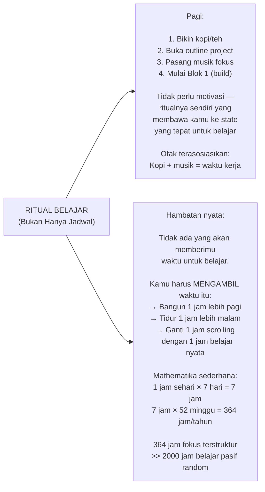
```mermaid
graph LR
    A["RITUAL BELAJAR\n(Bukan Hanya Jadwal)"]
    
    A --> B["Pagi:\n\n1. Bikin kopi/teh\n2. Buka outline project\n3. Pasang musik fokus\n4. Mulai Blok 1 (build)\n\nTidak perlu motivasi —\nritualnya sendiri yang\nmembawa kamu ke state\nyang tepat untuk belajar\n\nOtak terasosiasikan:\nKopi + musik = waktu kerja"]
    
    A --> C["Hambatan nyata:\n\nTidak ada yang akan memberimu\nwaktu untuk belajar.\n\nKamu harus MENGAMBIL waktu itu:\n→ Bangun 1 jam lebih pagi\n→ Tidur 1 jam lebih malam\n→ Ganti 1 jam scrolling\n   dengan 1 jam belajar nyata\n\nMathematika sederhana:\n1 jam sehari × 7 hari = 7 jam\n7 jam × 52 minggu = 364 jam/tahun\n\n364 jam fokus terstruktur\n>> 2000 jam belajar pasif random"]
```

---

## 🔄 Sistem Lengkap: Semua Bersatu

Sekarang mari kita lihat bagaimana semua komponen ini bekerja bersama sebagai satu sistem yang kohesif:

```mermaid
graph TD
    A["SISTEM BELAJAR 10x\nVisualisasi Lengkap"]
    
    A --> B["FONDASI:\nLife Plan & Hierarchy of Goals\n\n→ Memberikan FRAME untuk\n  semua belajar yang terjadi\n→ Pattern recognition aktif:\n  otak tahu apa yang relevan\n→ Setiap informasi difilter:\n  'Apakah ini untuk proyekku?'"]
    
    B --> C["LAYER 1:\nProject Outline\n\n→ Mempersempit fokus lebih lanjut\n→ Memberi otak 'problem konkret'\n  untuk dipecahkan\n→ Default Mode Network aktif\n  saat istirahat\n→ Good dopamine saat menemukan\n  info yang relevan"]
    
    C --> D["LAYER 2:\nStart-Struggle-Search Cycle\n\n→ Belajar dari friction (hambatan)\n→ Setiap knowledge acquired\n  langsung punya konteks aplikasi\n→ Retensi jauh lebih tinggi\n→ Progress nyata yang terlihat"]
    
    D --> E["LAYER 3:\nAI Ecosystem\n\n→ Strategic Advisor:\n  membantu goals & blind spots\n→ Study Regimen:\n  kurikulum personal\n→ Discipline Coach:\n  push saat malas\n→ Study Partner:\n  quiz & mendalami konsep"]
    
    E --> F["AMPLIFIER:\nFeynman Technique + Protege Effect\n+ Writing di Internet\n\n→ Mengajarkan = belajar lebih dalam\n→ Expose knowledge gaps\n→ Public accountability\n→ Pattern recognition makin tajam\n→ Potential audience/network"]
    
    F --> G["HASIL:\n\n2 minggu = apa yang orang lain\ncapai dalam 6 bulan\n\nBukan karena lebih pintar —\ntapi karena sistem yang\njauh lebih efisien"]
```

---

## 💡 Pelajaran Mendalam: Belajar adalah Skill Meta

Di balik semua teknik dan sistem ini, ada satu insight yang paling fundamental:

**Kemampuan belajar adalah skill yang menghasilkan semua skill lainnya.**

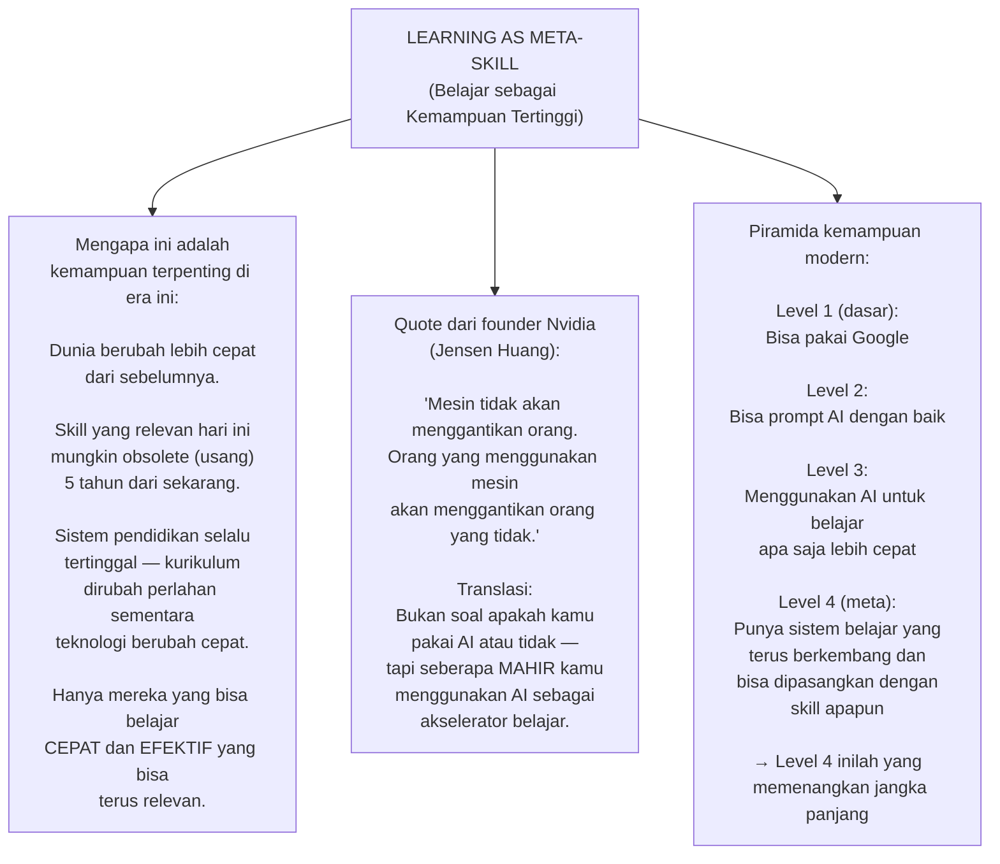
```mermaid
graph TD
    A["LEARNING AS META-SKILL\n(Belajar sebagai Kemampuan Tertinggi)"]
    
    A --> B["Mengapa ini adalah\nkemampuan terpenting di era ini:\n\nDunia berubah lebih cepat\ndari sebelumnya.\n\nSkill yang relevan hari ini\nmungkin obsolete (usang)\n5 tahun dari sekarang.\n\nSistem pendidikan selalu\ntertinggal — kurikulum\ndirubah perlahan sementara\nteknologi berubah cepat.\n\nHanya mereka yang bisa belajar\nCEPAT dan EFEKTIF yang bisa\nterus relevan."]
    
    A --> C["Quote dari founder Nvidia\n(Jensen Huang):\n\n'Mesin tidak akan menggantikan orang.\nOrang yang menggunakan mesin\nakan menggantikan orang yang tidak.'\n\nTranslasi:\nBukan soal apakah kamu\npakai AI atau tidak —\ntapi seberapa MAHIR kamu\nmenggunakan AI sebagai\nakselerator belajar."]
    
    A --> D["Piramida kemampuan modern:\n\nLevel 1 (dasar):\nBisa pakai Google\n\nLevel 2:\nBisa prompt AI dengan baik\n\nLevel 3:\nMenggunakan AI untuk belajar\napa saja lebih cepat\n\nLevel 4 (meta):\nPunya sistem belajar yang\nterus berkembang dan\nbisa dipasangkan dengan\nskill apapun\n\n→ Level 4 inilah yang\n  memenangkan jangka panjang"]
```

---

## 📋 Checklist: Mulai Hari Ini

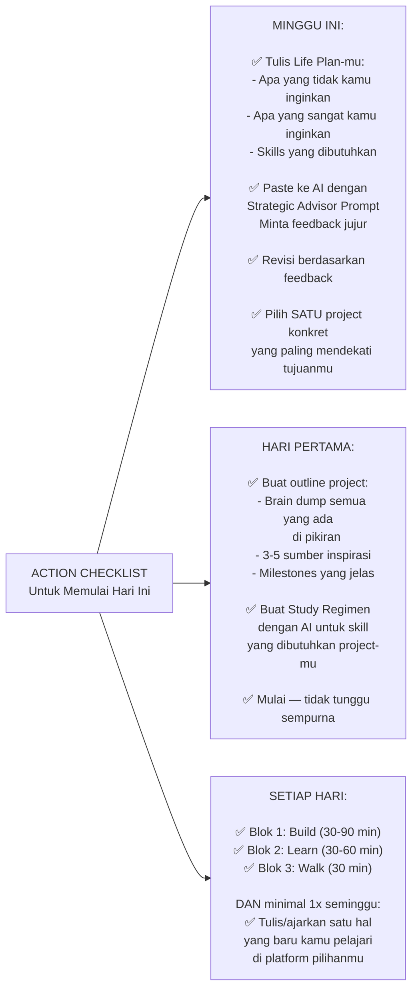
```mermaid
graph LR
    A["ACTION CHECKLIST\nUntuk Memulai Hari Ini"]
    
    A --> B["MINGGU INI:\n\n✅ Tulis Life Plan-mu:\n   - Apa yang tidak kamu inginkan\n   - Apa yang sangat kamu inginkan\n   - Skills yang dibutuhkan\n\n✅ Paste ke AI dengan\n   Strategic Advisor Prompt\n   Minta feedback jujur\n\n✅ Revisi berdasarkan feedback\n\n✅ Pilih SATU project konkret\n   yang paling mendekati tujuanmu"]
    
    A --> C["HARI PERTAMA:\n\n✅ Buat outline project:\n   - Brain dump semua yang ada\n     di pikiran\n   - 3-5 sumber inspirasi\n   - Milestones yang jelas\n\n✅ Buat Study Regimen\n   dengan AI untuk skill\n   yang dibutuhkan project-mu\n\n✅ Mulai — tidak tunggu sempurna"]
    
    A --> D["SETIAP HARI:\n\n✅ Blok 1: Build (30-90 min)\n✅ Blok 2: Learn (30-60 min)\n✅ Blok 3: Walk (30 min)\n\nDAN minimal 1x seminggu:\n✅ Tulis/ajarkan satu hal\n   yang baru kamu pelajari\n   di platform pilihanmu"]
```

---

## 🎯 Kesimpulan: Kamu Tidak Butuh Lebih Banyak Informasi

Paradoks akhir yang perlu kita hadapi dengan jujur: **masalahnya bukan kurangnya informasi — masalahnya adalah terlalu banyak informasi tanpa sistem untuk mengolahnya menjadi kemampuan nyata.**

```mermaid
graph TD
    A["SYNTHESIS: Inti dari Semua Ini"]
    
    A --> B["Yang tidak bekerja:\n\n• Konsumsi konten tanpa henti\n• Tutorial hell tanpa project\n• Belajar tanpa tujuan yang jelas\n• Informasi masuk, tidak ada output\n• Mental masturbation yang terasa\n  produktif tapi tidak menghasilkan\n  apapun yang nyata"]
    
    A --> C["Yang bekerja:\n\n• Tujuan yang jelas → pattern recognition\n• Project konkret → konteks untuk belajar\n• Start-struggle-search cycle → retensi\n• AI sebagai akselerator, bukan pengganti\n• Mengajar apa yang dipelajari → pemahaman dalam\n• Tiga blok fokus → konsistensi yang berkelanjutan"]
    
    A --> D["Pernyataan akhir:\n\nKamu tidak butuh 6 bulan untuk\nmenguasai skill yang mengubah hidupmu.\n\nKamu butuh 2 minggu dengan\nsistem yang benar.\n\nMeta-skill terpenting yang bisa\nkamu kembangkan di era ini:\nbelajar cara belajar.\n\nDan AI, jika digunakan sebagai\nmitra yang cerdas — bukan tongkat\npemalas — adalah akselerator\nterkuat yang pernah ada\nuntuk membantu kamu\nmencapai itu."]
```

Mulai sekarang. Bukan besok. Bukan setelah menonton satu tutorial lagi.

*Pilih satu skill yang paling bermakna untuk kehidupan yang kamu inginkan. Buat outline project-nya. Dan mulai.* 🚀

---

## 📚 Glosarium Lengkap

| Istilah | Bahasa Asli | Makna dalam Bahasa Indonesia |
|---|---|---|
| **Meta-skill** | Inggris | Kemampuan tentang kemampuan — skill yang memungkinkan kamu mengembangkan skill lain lebih efektif |
| **Pattern recognition** | Inggris | Pengenalan pola — kemampuan otak untuk mengidentifikasi dan menghubungkan informasi yang relevan |
| **Tutorial hell** | Inggris (slang) | Kondisi di mana seseorang terus menonton tutorial tanpa pernah memulai project nyata |
| **Default Mode Network (DMN)** | Inggris | Jaringan saraf otak yang aktif saat kita tidak fokus pada tugas — sumber "shower thoughts" |
| **Shower thoughts** | Inggris | Ide-ide yang muncul secara spontan saat pikiran tidak sedang terfokus (saat mandi, berjalan, dsb) |
| **Feynman Technique** | Inggris (nama orang) | Metode belajar yang dikembangkan Richard Feynman: jelaskan konsep seolah mengajar anak kecil |
| **Protege Effect** | Perancis/Inggris | Fenomena di mana orang yang mengajarkan suatu konsep mempelajarinya lebih dalam daripada yang hanya belajar |
| **Zeigarnik Effect** | Nama orang (Bluma Zeigarnik) | Fenomena psikologis di mana otak mengingat tugas yang belum selesai lebih kuat dari yang sudah selesai |
| **Active retrieval** | Inggris | Pengambilan aktif — proses secara aktif mencoba mengingat informasi (vs sekadar membacanya ulang) |
| **Hierarchy of goals** | Inggris | Hierarki tujuan — susunan bertingkat dari tujuan utama hingga tujuan kecil yang mendukung |
| **Anti-vision** | Inggris | Gambaran jelas tentang hidup yang TIDAK kamu inginkan — berguna untuk mempertajam tujuan |
| **Knowledge gap** | Inggris | Celah pengetahuan — area di mana pemahaman seseorang masih lemah atau tidak lengkap |
| **Prompt engineering** | Inggris | Rekayasa instruksi — seni merumuskan perintah yang tepat kepada AI untuk mendapatkan hasil optimal |
| **Deep work** | Inggris (Cal Newport) | Pekerjaan mendalam — kondisi fokus tanpa distraksi yang memungkinkan kognisi di level tertinggi |
| **Friction** | Inggris | Hambatan/gesekan — dalam konteks belajar: tantangan yang justru mendorong pembelajaran lebih dalam |
| **Dopamine** | Yunani/Latin | Dopamin — neurotransmitter (zat kimia saraf) yang berperan dalam sistem reward otak |
| **Compound interest** | Inggris | Bunga berbunga — dalam konteks belajar: pengetahuan yang dibangun di atas pengetahuan sebelumnya |
| **Brain dump** | Inggris | Curahan otak — proses menulis semua pikiran tanpa filter ke dalam dokumen atau kertas |
| **Keystone habit** | Inggris | Kebiasaan utama — satu kebiasaan yang secara otomatis mendorong kebiasaan baik lain berkembang |
| **Serendipitous** | Inggris (dari Serendip/Sri Lanka) | Penuh pertemuan kebetulan yang bermakna — ketika hal-hal berguna tampak "kebetulan" muncul |
| **Obsolete** | Latin | Usang/tidak lagi relevan — teknologi atau skill yang sudah digantikan oleh yang lebih baru |
| **Public accountability** | Inggris | Akuntabilitas publik — bertanggung jawab atas komitmen di hadapan audiens publik |
| **Multiplier** | Inggris | Pengali — sesuatu yang melipatgandakan efek dari usaha yang sudah dilakukan |
| **Counterintuitive** | Inggris | Berlawanan dengan intuisi — sesuatu yang tampaknya tidak masuk akal tapi ternyata benar |
| **Overwhelm** | Inggris | Kewalahan — kondisi otak yang terusik oleh terlalu banyak informasi atau tugas sekaligus |

---

*Sumber video: [How To Learn Anything 10x Faster Than Anyone With AI — YouTube](https://www.youtube.com/watch?v=FzaHX5rxU34)*

*Referensi tambahan yang disebutkan dalam video: Buku "Flow" oleh Mihaly Csikszentmihalyi; Feynman Technique oleh Richard Feynman; Zeigarnik Effect oleh Bluma Zeigarnik; konsep dari Justin Song (YouTuber) tentang learning acceleration.*
