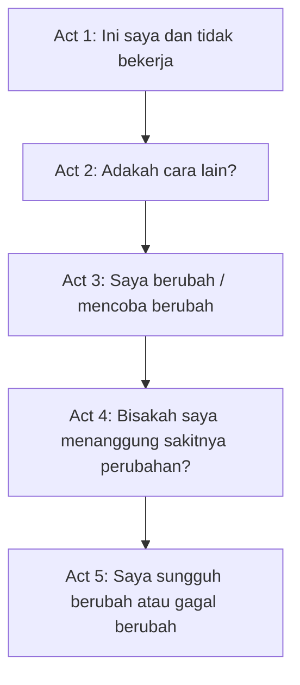

## 📚 Pendahuluan: Kita Tidak Sekadar Menikmati Cerita—Kita Hidup di Dalamnya

Banyak orang mengira storytelling atau seni bercerita adalah keterampilan tambahan. Seolah ia hanya berguna bagi novelis, penulis skenario, copywriter, pembicara publik, filmmaker, atau content creator. Padahal, kalau kita mengikuti gagasan Will Storr dengan serius, storytelling bukan aksesori. Ia adalah **cara kerja pikiran manusia itu sendiri**. Kita memahami dunia melalui cerita, mengingat hidup melalui cerita, menafsirkan masa lalu melalui cerita, merancang masa depan melalui cerita, dan bahkan menilai siapa diri kita juga melalui cerita. 🧠

Itulah yang membuat pembahasan Will Storr sangat menarik. Ia berbeda dari banyak guru storytelling lain yang terlalu terobsesi pada **plot recipe** — *resep alur* — seperti *hero’s journey* atau formula-formula struktural yang memetakan urutan kejadian. Storr tidak menolak plot, tetapi ia mendorong kita melihat sesuatu yang lebih mendasar: **karakter**. Menurutnya, kisah-kisah yang benar-benar membekas bukan terutama karena rangkaian peristiwanya, melainkan karena kita bertemu seseorang dengan pandangan tertentu tentang dunia, lalu menyaksikan bagaimana pandangan itu diuji, diguncang, dipatahkan, atau justru membuatnya hancur.

Dengan kata lain, cerita bukan sekadar “lalu ini terjadi, lalu itu terjadi.” Cerita yang hidup adalah eksperimen psikologis. Ia bertanya: **orang seperti ini, dengan keyakinan seperti ini, kalau dilempar ke dunia seperti itu, apa yang akan terjadi?** Dari pertanyaan itulah kedalaman lahir. Dari situ pula konflik, suspense, perubahan, dan makna menjadi mungkin.

Dalam materi yang Mas Hendra kirim, Will Storr membedah storytelling bukan dari sisi magis atau romantis, tetapi hampir seperti ilmuwan perilaku yang sedang memeriksa mesin batin manusia. Ia bicara tentang **character**, *theory of control*, perubahan, sebab-akibat, survival, connection, status, pacing, origin damage, outline, hingga hubungan storytelling dengan bisnis, kepemimpinan, politik, dan kesehatan mental.

Artikel ini akan membahas semuanya secara detail, mendalam, dan runtut dalam bahasa Indonesia. Saya juga akan menerjemahkan istilah-istilah penting agar lebih gampang ditangkap. Kita akan melihat mengapa manusia menyederhanakan realitas melalui narasi, mengapa karakter lebih penting daripada plot, apa itu *theory of control* atau **teori kendali**, mengapa semua cerita hebat adalah kisah perubahan, dari mana suspense muncul, bagaimana tiga motif besar manusia—**survival, connection, status** atau *bertahan hidup, koneksi, status*—menjadi fondasi semua kisah, dan mengapa struktur cerita pada akhirnya berkaitan langsung dengan cara manusia bekerja sama sebagai spesies.

Kalau diringkas dalam satu kalimat, inti besar dari pemikiran Will Storr adalah ini: **cerita yang kuat selalu lahir ketika kita memahami manusia sebagai makhluk yang hidup dengan model tertentu tentang dunia, lalu mempertemukannya dengan realitas yang memaksa model itu diuji.** 📚

<Callout type="important" title="Tesis utama artikel ini">
Menurut Will Storr, kekuatan storytelling tidak terutama terletak pada plot yang spektakuler, melainkan pada karakter yang memiliki teori tertentu tentang cara mengendalikan dunia, lalu dipaksa menghadapi kenyataan yang membuktikan bahwa teori itu cacat, tidak cukup, atau harus berubah. Dari benturan itulah lahir drama, makna, suspense, dan transformasi.
</Callout>

---

## 🌍 1. Mengapa Manusia Membutuhkan Cerita? Karena Realitas Terlalu Rumit untuk Diproses Mentah-Mentah

Will Storr memulai dari landasan yang sangat penting: kita memproses realitas sebagai cerita karena realitas sendiri terlalu kompleks, terlalu kacau, terlalu padat, dan terlalu liar untuk dihadapi dalam bentuk mentahnya. Cerita memberi kita **simplification** — *penyederhanaan*. Ia tidak memalsukan dunia sepenuhnya, tetapi ia memadatkan dunia ke dalam bentuk yang bisa ditangani otak manusia.

Bayangkan saja kehidupan sehari-hari. Dalam satu hari, ribuan hal terjadi: cuaca, ekspresi wajah orang, memori lama, kekhawatiran masa depan, kalimat-kalimat kecil, rasa lapar, status sosial, notifikasi, kecemasan, tujuan pekerjaan, konflik kecil, nostalgia, rasa malu, rasa bangga, dan seterusnya. Kalau semua itu harus diproses setara satu per satu, kita akan tenggelam. Maka otak membuat pola naratif. Otak berkata: *ini yang penting, ini sebabnya, ini tujuannya, ini ancamannya, ini yang harus dilakukan berikutnya.*

Di sinilah cerita menjadi alat bertahan hidup. Ia merapikan kekacauan menjadi garis yang lebih bisa diikuti. Ia memberi rasa arah dalam dunia yang sebenarnya tidak selalu lurus. Dan bukan cuma itu. Menurut Storr, kemampuan bercerita juga membuat manusia menjadi makhluk yang sangat unik. Kita bisa membayangkan masa depan, memendam ambisi, menyesali masa lalu, memikirkan hidup yang belum ada, dan merencanakan sesuatu yang belum pernah terjadi. Hewan lain bisa bereaksi. Manusia bisa **menarasikan**.

Jadi storytelling bukan cuma soal seni. Ia adalah salah satu **superpower** manusia. Karena dengan bercerita, kita bisa menghubungkan masa lalu, masa kini, dan masa depan ke dalam satu bentuk pemahaman. 🌍

---

## 🎭 2. Yang Paling Sering Disalahpahami Orang: Storytelling Bukan Pertama-tama Soal Plot, tetapi Soal Karakter

Selama berabad-abad, dari Aristoteles sampai formula modern seperti *hero’s journey*, *Save the Cat*, atau berbagai template naskah Hollywood, orang cenderung memecahkan cerita lewat urutan kejadian. Apa yang terjadi dulu, apa lalu konflik, apa midpoint, apa klimaks, apa resolusi. Itu semua berguna. Tetapi Storr menunjukkan kelemahan pendekatan yang terlalu plot-sentris: ia sering membuat orang lupa bahwa yang membuat cerita membekas bukan terutama rangkaian peristiwa, melainkan **siapa yang kita ikuti di dalamnya**.

Kita jarang jatuh cinta pada cerita hanya karena urutan plotnya rapi. Kita jatuh cinta karena ada karakter yang terasa hidup, aneh, rapuh, lucu, salah, tragis, atau sangat manusiawi. Kita mengingat Scrooge, Don Draper, Fleabag, Michael Corleone, Hamlet, Stevens dalam *The Remains of the Day*, bukan hanya karena apa yang terjadi pada mereka, tetapi karena mereka memandang dunia dengan cara tertentu dan pandangan itu terasa kaya.

Maka menurut Storr, karakter bukan pelengkap plot. Karakter justru adalah **mesin yang menggerakkan plot**. Kalau kita tidak tahu siapa karakter ini, bagaimana ia menafsirkan dunia, apa yang ia kira benar, dan apa yang ia butuhkan untuk merasa aman atau berharga, maka plot akan terasa artifisial. Ia jadi seperti kejadian-kejadian yang ditempel, bukan kehidupan yang sungguh bergerak dari dalam. 🎭

Ini poin yang sangat penting bagi siapa pun yang menulis, bercerita, atau bahkan menyusun presentasi dan brand narrative. Sering kali masalah kita bukan kekurangan ide kejadian, tetapi kita belum tahu **orang macam apa** yang sedang dibicarakan dan apa model realitas yang mereka bawa.

---

## 🧠 3. Theory of Control: Karakter yang Baik Selalu Punya “Teori Kendali” tentang Dunia

Inilah konsep paling penting dari seluruh pembahasan Will Storr: **theory of control** — *teori kendali*. Gagasan dasarnya sederhana tapi sangat kuat. Setiap manusia hidup dengan semacam model internal tentang bagaimana dunia bekerja dan bagaimana dirinya harus bertindak agar aman, berhasil, dicintai, atau bernilai.

Dengan kata lain, setiap orang punya jawaban implisit terhadap pertanyaan seperti:
- bagaimana cara saya mengendalikan dunia?  
- apa yang harus saya lakukan supaya aman?  
- apa yang harus saya kejar supaya saya berarti?  
- apa yang harus saya hindari supaya tidak terluka?  

Itulah yang disebut Storr sebagai teori kendali.

Misalnya:
- Scrooge: **saya hanya aman jika saya menyimpan uang dan menutup hati**.
- Fleabag: **nilai saya hanya ada pada daya seksual saya**.
- Harry dalam *When Harry Met Sally*: **laki-laki dan perempuan tidak bisa sungguh-sungguh berteman karena seks akan mengacaukannya**.
- Michael Corleone di awal *The Godfather*: **saya akan aman kalau saya tidak masuk dunia gangster**.

Perhatikan: satu kalimat seperti ini tampak sederhana, tetapi justru dari kesederhanaan itulah kedalaman karakter tumbuh. Karena seluruh tingkah laku, pilihan, konflik, pertahanan diri, dan kebutaan moral seseorang bisa mengalir dari teori itu. 🧠

Inilah mengapa Storr suka memulai desain karakter dengan satu ide inti yang sangat sederhana. Bukan untuk mereduksi manusia menjadi kartun, tetapi untuk menemukan **inti orientasi batin** yang bisa melahirkan kompleksitas nyata.

---

## 🪞 4. Karakter yang Hebat Bukan yang Punya Teori Kendali, tetapi yang Punya Teori Kendali yang Salah atau Tidak Lengkap

Ini bagian yang sangat penting. Kalau karakter hanya punya teori tentang dunia dan teori itu benar sepenuhnya, cerita akan cepat mati. Mengapa? Karena tidak ada benturan. Tidak ada kebutuhan untuk berubah. Tidak ada ironi. Tidak ada drama.

Maka dalam storytelling, teori kendali yang menarik hampir selalu **flawed** — *cacat / keliru / tidak memadai*. Bukan selalu salah secara moral, tetapi salah dalam arti tidak sepenuhnya cocok dengan kenyataan. Karakter hidup dengan keyakinan tertentu, dan selama hidup tampak tenang, keyakinan itu terasa bekerja. Namun kemudian dunia berubah, atau ada peristiwa yang mengoyaknya, dan muncullah celah antara “cerita di kepala karakter” dan “cara dunia sebenarnya bekerja.”

Dari celah itulah cerita dimulai.

Storr memberi contoh yang sangat jelas: Michael Corleone percaya dirinya bukan gangster dan tidak akan hidup di dunia itu. Tapi upaya pembunuhan terhadap ayahnya menyeretnya masuk. Di situlah teorinya retak. Atau Jaws: karakter utamanya hidup dengan teori “saya aman kalau jauh dari laut,” tetapi justru tanggung jawabnya memaksa dia masuk ke lautan untuk menghadapi hiu. Jadi cerita sebenarnya adalah proses di mana teori lama diuji oleh realitas baru.

Artinya, cerita bukan hanya tentang kejadian luar. Cerita adalah **bentrokan antara model batin dan kenyataan**. 🪞

---

## 💥 5. Kapan Cerita Sebenarnya Dimulai? Saat Dunia Membuktikan Bahwa Cara Lama Sang Karakter Tidak Lagi Bekerja

Banyak orang mengira cerita dimulai saat ada ledakan, kejutan, pembunuhan, atau insiden besar. Padahal menurut kerangka Storr, cerita sejati dimulai ketika karakter mengalami satu kesadaran penting: **cara saya selama ini hidup sudah tidak bekerja lagi.**

Inilah momen ketika “this is me and it’s not working” — *ini saya, dan cara ini sudah tidak bekerja*. Pada tahap ini, kita diperlihatkan siapa karakter itu, bagaimana ia hidup, apa teori kendalinya, dan mengapa teori itu mulai gagal. Mungkin dunianya berubah. Mungkin relasinya berubah. Mungkin konteks sosial berubah. Mungkin trauma lama naik lagi. Apa pun bentuknya, yang penting adalah ada ketidakselarasan antara keyakinan karakter dan realitas yang kini dihadapinya.

Dari situ muncul babak kedua: **is there another way?** — *adakah cara lain?* Karakter mulai meraba model baru. Lalu pada titik tengah atau *midpoint*, ia sering membuat keputusan besar untuk berubah. Namun keputusan itu belum final, karena setelah itu ia harus menghadapi **pain of change** — *rasa sakit dari perubahan*. Dan di ujung cerita, kalau ia benar-benar bertumbuh, kita melihat bahwa ia telah menjadi orang baru. Kalau tidak, kita masuk wilayah tragedi, di mana karakter justru menggandakan kesalahannya.

Jadi inti struktur cerita versi Storr bukanlah daftar peristiwa, tetapi **kurva perubahan karakter**. 💥

---

## 🔄 6. Semua Cerita Hebat Adalah Simfoni Perubahan

Storr menggunakan satu ide yang sangat indah: cerita yang baik adalah **symphony of change** — *simfoni perubahan*. Artinya, bukan hanya satu hal yang berubah. Dalam cerita yang hidup, perubahan terjadi di berbagai level sekaligus:

- dunia luar berubah,  
- tujuan berubah,  
- posisi sosial berubah,  
- pemahaman karakter terhadap orang lain berubah,  
- teori kendalinya berubah,  
- dan hubungan sebab-akibat mendorong perubahan berikutnya.

Inilah yang membuat cerita terasa bergerak. Kalau tidak ada perubahan, tidak ada tegangan. Kalau tidak ada tegangan, tidak ada alasan otak untuk terus mengikuti. Karena otak manusia secara alami tertarik pada peralihan: dari aman ke terancam, dari yakin ke ragu, dari tertutup ke terbuka, dari kuat ke lemah, dari ilusi ke kesadaran.

Maka bukan kebetulan kalau momen paling memikat dalam film sering berupa *close-up* wajah saat seseorang menyadari sesuatu, ketika ekspresinya berubah karena dunia batinnya bergeser. Bukan ledakan itu sendiri yang paling menarik, tetapi **perubahan dalam diri manusia sebagai akibat ledakan itu**. 🔄

---

## ⛓️ 7. Causality: Cerita yang Baik Harus Bersifat Sebab-Akibat, Bukan Sekadar Deretan Kejadian

Salah satu penjelasan paling penting dari Storr adalah tentang **causality** — *sebab-akibat*. Menurutnya, manusia adalah mesin pencari pola kausal. Kita suka menghubungkan titik-titik. Bahkan ketika disuguhi titik-titik bergerak acak di layar, manusia akan spontan membuat cerita: yang satu mengejar, yang satu bersembunyi, yang ini marah, yang itu takut. Kita tidak tahan pada raw chaos. Kita ingin struktur.

Karena itu, cerita yang baik tidak boleh terasa seperti:
- lalu ini terjadi,
- lalu itu terjadi,
- lalu ini terjadi lagi.

Cerita yang kuat harus terasa seperti:
- karena ini terjadi, maka itu terjadi,
- karena itu terjadi, maka karakter melakukan ini,
- karena dia melakukan ini, maka konsekuensinya muncul,
- dan konsekuensi itu memicu perubahan berikutnya.

Inilah mengapa Storr menyebut cerita yang baik seperti efek domino. Satu perubahan menimbulkan perubahan lain. Satu keputusan membuka masalah berikutnya. Satu luka menuntun ke tindakan yang lalu menciptakan luka baru. ⛓️

Ini bukan cuma teknik menulis. Ini selaras dengan cara otak memahami dunia. Sebab-akibat adalah salah satu bahasa alami pikiran manusia. Dan ketika cerita tidak memberi hubungan itu, penonton atau pembaca merasa ada yang aneh. Mereka menyebutnya “berat,” “membingungkan,” atau “hard work” — *kerja keras mental* — karena otak dipaksa menyusun sendiri sambungan yang seharusnya dirancang oleh cerita.

---

## 🎯 8. Suspense Muncul dari Threat of Change: Bukan dari Ledakan, tetapi dari Ancaman bahwa Sesuatu Akan Berubah

Salah satu bagian paling menarik dalam wawancara ini adalah soal suspense. Mengapa kita tegang ketika menonton film horor, thriller, atau drama yang sangat baik? Menurut Storr, jawabannya sederhana tetapi dalam: suspense lahir dari **threat of change** — *ancaman perubahan*.

Ini sangat penting. Sering kali yang paling menakutkan atau paling memikat bukan kejadian itu sendiri, melainkan antisipasi akan datangnya kejadian. Alfred Hitchcock sudah mengatakan sesuatu yang mirip: tidak ada teror pada ledakan itu sendiri, teror ada pada penantiannya.

Kita tegang karena kita merasakan bahwa sesuatu akan berubah, dan perubahan itu bisa menghancurkan teori kendali karakter, membalik situasi, merusak stabilitas, atau membuka bahaya baru. Film horor bekerja dengan sangat baik karena memainkan ancaman perubahan ini: suara kecil, musik, lorong gelap, keheningan yang terlalu panjang, kamera yang belum menunjukkan monster—semuanya menyusun suasana bahwa **sesuatu akan berubah secara buruk**.

Dalam bahasa yang lebih luas, suspense adalah bentuk emosional dari pertanyaan: *apa yang akan terjadi pada cara karakter memahami dan menjalani dunianya sekarang?* 🎯

---

## 🐟 9. Jaws Bukan Tentang Hiu, tetapi Tentang Orang yang Takut Air: Mengapa Plot yang Hebat Sebenarnya Menguji Ketakutan Karakter

Contoh Jaws yang dipakai Storr sangat penting. Banyak orang berkata film itu tentang hiu. Tapi Storr berkata: tidak, film itu sebenarnya tentang seorang pria yang takut laut. Hiu hanyalah alat pengujinya.

Ini penjelasan yang sangat cerdas, karena ia menunjukkan bahwa peristiwa eksternal paling baik dipahami sebagai **alat untuk menguji teori kendali karakter**. Kalau karakter percaya dirinya aman selama menjauh dari laut, maka ancaman terbaik adalah sesuatu yang memaksanya masuk laut demi menjalankan tanggung jawabnya.

Dari sini kita mendapat satu prinsip besar: **plot terbaik selalu merupakan ujian paling tepat untuk karakter tertentu.** Bukan sekadar kejadian besar, tetapi kejadian yang secara khusus menabrak titik lemah psikologis si karakter.

Maka ketika Storr berkata kita harus mencari “the perfect person for the perfect problem” — *orang yang paling tepat untuk masalah yang paling tepat* — ia sedang memberi prinsip desain cerita yang sangat kuat. Kalau kita ingin bicara dunia overpopulasi, mungkin karakter paling menarik justru misantrop ekstrem yang benci manusia. Kalau kita ingin bicara superioritas budaya lama, maka Stevens dalam *The Remains of the Day* sangat tepat karena ia hidup dari keyakinan itu tepat saat dunia yang menopangnya runtuh. 🐟

---

## 🧱 10. Survival, Connection, Status: Tiga Dorongan Besar yang Menjadi Fondasi Semua Cerita Manusia

Salah satu bagian paling berguna dari seluruh materi ini adalah peta tiga motivasi besar manusia:

1. **Survival** — *bertahan hidup*  
2. **Connection** — *koneksi / keterikatan sosial*  
3. **Status** — *nilai, posisi, dan keberhargaan di mata kelompok*  

Menurut Storr, tiga hal ini adalah fondasi utama kehidupan sosial manusia, dan karena cerita adalah alat manusia untuk belajar hidup, maka hampir semua cerita pada dasarnya akan berkisar pada salah satu atau kombinasi dari tiga hal ini.

### Survival
Ini yang paling biologis: makanan, tempat tinggal, keamanan, kesehatan, keselamatan keturunan, keberlangsungan hidup.

### Connection
Manusia adalah makhluk tribal. Kita butuh pasangan, keluarga, teman, kelompok, rasa memiliki. Kita takut dikucilkan, ditolak, dibuang.

### Status
Kita tidak hanya ingin diterima dalam kelompok. Kita juga ingin **bernilai** bagi kelompok. Status di sini bukan cuma jabatan atau kekayaan. Ia bisa berarti dihormati, berguna, diakui, dipandang kompeten, atau merasa posisi kita aman di mata orang lain.

Storr bahkan mengatakan bahwa tiga kategori ini bisa menjadi alat diagnosis untuk kehidupan psikologis kita sendiri. Kalau kita cemas atau sedih, coba lihat: masalahnya ada di survival, connection, atau status? Dan sering kali memang ada di salah satu ember itu. Kalau sedang sangat buruk, bisa jadi dua atau tiga ember bocor sekaligus. 🧱

Ini menarik karena menunjukkan bahwa storytelling bukan sekadar kerajinan seni, tetapi peta yang bisa dipakai membaca kehidupan nyata.

---

## ❤️ 11. Cerita Mengajari Kita Cara Menjadi Manusia Karena Ia Mengajari Kita Cara Mendapatkan Survival, Connection, dan Status

Storr melangkah lebih jauh: cerita-cerita yang bertahan lintas zaman bertahan karena mereka membantu kita memahami cara menavigasi tiga kebutuhan tadi. Itulah mengapa cerita terasa relevan bahkan ketika setting, pakaian, teknologi, atau budaya berubah.

Film seperti *Alien* atau *The Revenant* jelas berkaitan dengan survival. Film seperti *Stand By Me* atau *Brokeback Mountain* menyentuh connection. Film seperti *Whiplash* dan *Barbie* banyak bermain di medan status. Sementara kisah-kisah besar seperti *Romeo and Juliet*, *The Godfather*, atau *Star Wars* menggabungkan ketiganya dalam proporsi berbeda.

Kita tertarik pada cerita karena secara bawah sadar kita membaca:  
- bagaimana orang ini akan bertahan?  
- dengan siapa ia akan terhubung?  
- apakah ia akan kehilangan atau mendapatkan nilai di mata kelompok?  

Dan dari situ kita belajar. Bahkan saat tidak sadar, kita sedang menyerap simulasi kehidupan. Cerita menjadi **laboratorium emosi dan keputusan**. ❤️

---

## 🕰️ 12. Slow Bits Fast, Fast Bits Slow: Aturan Pacing yang Sangat Penting tapi Sering Diabaikan

Bagian pacing dalam wawancara ini luar biasa praktis. Storr mengatakan: **the slow bits of life should be told fast, and the fast bits of life should be told slow** — *bagian hidup yang lambat harus diceritakan cepat, dan bagian hidup yang cepat harus diceritakan lambat*.

Ini nyambung dengan pengalaman manusia dalam momen intens seperti kecelakaan. Saat sesuatu yang penting dan mengancam terjadi, waktu seolah melambat. Kita ingat detail secara padat. Informasi menjadi lebih rapat. Momen itu terasa hidup sekali. Dalam storytelling, prinsip yang sama berlaku.

Kalau ada momen perubahan penting—pengkhianatan, pengakuan cinta, keputusan besar, trauma, tabrakan batin, perpisahan, kesadaran moral, titik balik hidup—maka penulis harus **membuatnya jadi moment**. Artinya:
- hadirkan detail sensorik,
- perlambat waktu,
- perlihatkan apa yang dikenakan,
- cuaca seperti apa,
- bau ruangan bagaimana,
- ekspresi wajah seperti apa,
- apa yang dikatakan dan tidak dikatakan.

Sebaliknya, hal-hal yang tidak mengandung perubahan besar tidak perlu diperlambat berlebihan. Di sinilah banyak tulisan gagal: mereka lambat di bagian yang tak penting, tetapi justru tergesa-gesa di bagian yang seharusnya penuh densitas emosional. 🕰️

---

## 🧬 13. Origin Damage: Dari Mana Teori Kendali Karakter Itu Berasal?

Storr juga membahas konsep yang sangat berguna: **origin damage** — *luka asal / kerusakan asal*. Ini merujuk pada pengalaman masa lalu yang kemungkinan membentuk teori kendali karakter. Misalnya:
- seseorang jadi terobsesi pada uang karena masa kecilnya miskin dan dipermalukan,
- seseorang jadi hanya percaya pada daya seksual karena pengalaman cinta yang rusak,
- seseorang jadi takut hubungan dekat karena pernah ditinggalkan,
- seseorang jadi terobsesi pada status karena sejak kecil hanya dihargai saat berprestasi.

Ini penting karena teori kendali tidak jatuh dari langit. Ia biasanya lahir dari sejarah batin. Namun Storr memberi peringatan menarik: **penulis tidak selalu harus menjelaskan origin damage ini secara eksplisit di cerita.** Kadang cukup penulis yang tahu. Justru dengan tidak menjelaskannya terlalu telanjang, karakter bisa terasa lebih hidup dan misterius, seperti manusia nyata yang tidak datang bersama catatan kaki tentang trauma masa lalunya.

Ini sangat penting. Banyak penulis pemula merasa semua motivasi harus diterangkan. Padahal kehidupan nyata tidak bekerja begitu. Kita sering melihat perilaku orang dulu, baru menebak-nebak mengapa ia seperti itu. Cerita yang baik bisa memberi ruang bagi pembaca untuk berpartisipasi dalam penafsiran. 🧬

Shakespeare, kata Storr, bahkan sering menjadi pionir dalam hal ini: ia mengambil sumber cerita yang memberi banyak penjelasan latar, lalu justru menghapus sebagian penjelasan itu sehingga karakter terasa lebih misterius dan dalam.

---

## 🪜 14. Kenapa Banyak Penulis Menderita? Karena Mereka Menganggap Belajar Craft Itu Merendahkan Kemurnian Seni

Salah satu bagian paling “pedas” dari Will Storr adalah kritiknya terhadap penulis yang menolak craft atau kerajinan teknis. Menurutnya, di banyak seni lain orang menerima bahwa keterampilan dasar harus dipelajari. Penari belajar teknik. Pelukis belajar anatomi, perspektif, cahaya. Musisi belajar tangga nada dan harmoni. Tapi di dunia storytelling, terutama sastra tertentu, masih ada sikap seolah-olah “seniman sejati” harus mulai dari halaman kosong dan membiarkan ilham memimpin.

Storr jelas tidak setuju. Ia justru sangat pro-outline, pro-struktur, pro-perencanaan. Bukan karena ia anti-kreativitas, tetapi karena ia percaya bahwa memahami bentuk justru membebaskan penulis dari penderitaan yang tidak perlu. Tanpa struktur, orang sering menulis banyak halaman, lalu tersesat, lalu membuang, lalu menulis ulang, lalu frustrasi.

Ia berasal dari keluarga engineer, dan pendekatannya sangat terasa: rancang dulu bagaimana mesinnya bekerja. Tahu dulu karakter ini siapa. Tahu dulu teori kendalinya apa. Tahu dulu titik baliknya di mana. Tahu dulu apa perubahan utamanya. Baru menulis. 🪜

Yang menarik, ini sebenarnya tidak menghilangkan orisinalitas. Sama seperti pelukis besar yang pernah belajar teknik klasik sebelum menemukan gayanya sendiri, penulis juga justru bisa menjadi lebih unik setelah paham craft. Orisinalitas yang matang hampir selalu lahir dari **penguasaan + penyimpangan sadar**, bukan dari ketidaktahuan.

---

## 🏗️ 15. Struktur Lima Babak ala Will Storr: Kerangka yang Luas tapi Sangat Berguna

Storr menawarkan struktur lima babak yang menurutnya lebih selaras dengan perubahan karakter. Secara ringkas:

### Act 1 — This is me and it’s not working
Ini saya, dan cara saya selama ini hidup sudah tidak bekerja.

### Act 2 — Is there another way?
Adakah cara lain? Karakter mulai meraba perubahan.

### Act 3 — I have transformed
Saya berubah. Biasanya ada keputusan penting, terutama di midpoint.

### Act 4 — But can I face the pain of change?
Bisakah saya menanggung rasa sakit akibat perubahan ini? Dunia menguji keputusan tersebut.

### Act 5 — Is this forever?
Apakah perubahan ini sungguh jadi identitas baru saya? Di sinilah resolusi hadir—baik transformasi berhasil atau gagal.

Yang sangat menarik adalah kerangka ini bukan penjara kaku. Ia justru cukup luas untuk menampung berbagai jenis cerita. Bahkan Storr mengatakan sastra yang lebih “literary” sering hanya berjalan di Act 1 dan Act 2, lalu memberi sedikit petunjuk perubahan di akhir, karena realisme hidup memang jarang memberi transformasi total se-Hollywood itu. 🏗️

Ini poin bagus: struktur bukan berarti semua cerita harus berakhir seperti Jaws, di mana karakter benar-benar berbalik 180 derajat. Struktur bisa lentur. Tapi tetap ada prinsip besar yang sama: **cerita tentang perubahan, atau setidaknya kemungkinan perubahan.**

---

## 🎬 16. Komersial vs Literary: Mengapa Cerita Populer Sering Menunjukkan Transformasi Penuh, Sedangkan Sastra Sering Hanya Menunjukkan Retakan Kesadaran

Ini nuansa yang sangat penting. Dalam cerita komersial, penonton biasanya menginginkan transformasi yang terasa utuh. Tokoh yang takut air akhirnya berenang. Tokoh yang menolak dunia gangster akhirnya menjadi kepala mafia. Tokoh yang kikir jadi dermawan. Tokoh yang egois jadi peduli.

Tetapi dalam karya sastra yang lebih realistis, perubahan sering tidak selesai. Yang muncul justru momen pengenalan, keretakan, atau kemungkinan bahwa hidup sebenarnya bisa dilihat secara berbeda. Dalam *The Remains of the Day*, misalnya, Stevens tidak tiba-tiba menjadi orang baru secara penuh. Yang kita lihat lebih halus: ada retakan pada keyakinannya, ada kemungkinan ia mulai melihat bahwa hidupnya selama ini dibangun di atas ilusi tertentu.

Ini penting karena membantu kita memahami bahwa teori Storr bukan formula Hollywood semata. Ia juga bisa menjelaskan sastra yang lebih halus. Bedanya hanya pada seberapa jauh transformasi itu dibawa ke permukaan. 🎬

---

## 🧲 17. Obstacles and Goals: Cerita Selalu Tentang Seseorang yang Menginginkan Sesuatu dan Ada Sesuatu yang Menghalanginya

Di bagian akhir wawancara, Storr menekankan sesuatu yang tampak sederhana tetapi sangat fundamental: cerita selalu tentang **goals and obstacles** — *tujuan dan rintangan*. Ini berlaku di level besar maupun kecil.

Seorang tokoh ingin sesuatu. Ada sesuatu yang menghalanginya. Dan itulah bahan bakar cerita.

Misalnya:
- dalam *Nomadland*, tokoh utama harus bertahan hidup setelah kehilangan suami dan kestabilan hidup,
- dalam cerita cinta, seseorang ingin koneksi tapi terhalang trauma, status, kelas sosial, atau ketakutan,
- dalam cerita status, seseorang ingin diakui tetapi karakternya sendiri menjadi penghalang.

Yang sangat penting di sini: rintangan tidak selalu eksternal. Dalam cerita yang paling dalam, rintangan paling besar sering justru **kepribadian tokoh itu sendiri**. Luka, kesalahan pandangan, pertahanan diri, teori kendali yang cacat—itulah yang membuat ia tak bisa memperoleh hal yang ia inginkan. 🧲

Jadi konflik yang bagus tidak pernah hanya “dunia jahat menghalangi saya.” Konflik yang bagus juga memuat unsur: **ada sesuatu di dalam diri saya yang ikut membuat saya gagal.** Dan itulah yang membuat cerita berubah dari sekadar petualangan menjadi refleksi manusia.

---

## 🏢 18. Storytelling dalam Bisnis, Politik, dan Kepemimpinan: Kelompok Manusia Disatukan oleh Cerita yang Sama

Storr tidak berhenti pada seni. Ia membawa gagasan storytelling ke wilayah bisnis, politik, organisasi, dan kepemimpinan. Dan di sini idenya sangat besar: manusia adalah makhluk kooperatif. Kita menyelesaikan masalah bukan sendirian, melainkan lewat kelompok. Tapi agar kelompok bisa berpikir dan bergerak bersama, mereka perlu **shared story** — *cerita bersama*.

Sebuah perusahaan punya cerita tentang:
- siapa kami,
- apa yang kami perjuangkan,
- apa masalah dunia,
- bagaimana kami memecahkannya,
- seperti apa orang baik dalam organisasi ini,
- dan apa tujuan jangka panjang kami.

Begitu juga partai politik, agama, komunitas, negara, bahkan tim olahraga. Semua hidup dari cerita bersama. Cerita menyinkronkan otak banyak orang sehingga mereka merasa menjadi bagian dari “kami” yang bergerak menuju sesuatu.

Inilah sebabnya fakta dan angka saja sering tidak cukup memengaruhi orang. Orang lebih mudah bergerak jika diberi **narasi yang koheren**. Bukan karena manusia irasional sepenuhnya, tetapi karena cara berpikir kita memang naratif. Kita perlu tahu bukan cuma “berapa persen return-nya,” tetapi “mengapa ini bisa terus berjalan.” Kita perlu tahu bukan cuma “apa kebijakannya,” tetapi “cerita dunia macam apa yang dijelaskan kebijakan itu.” 🏢

---

## 🪄 19. Mengapa Story yang Jelas Sering Lebih Meyakinkan daripada Hasil yang Lebih Besar tapi Tak Punya Narasi?

Ada contoh sangat menarik dalam wawancara ini: di dunia investasi, kadang hasil 15% per tahun yang konsisten dan bisa dijelaskan dengan cerita yang jelas terasa lebih meyakinkan dibanding hasil 20% yang tidak bisa dijelaskan. Ini sangat mengungkap cara manusia bekerja.

Kita bukan hanya mencari hasil. Kita mencari **model dunia yang bisa dipercaya**. Kita ingin tahu mengapa sesuatu bekerja. Cerita memberi rasa prediktabilitas. Ia menjahit fakta-fakta menjadi pola. Dan ketika ada pola yang terasa masuk akal, orang menjadi lebih tenang.

Jadi storytelling bukan kebohongan pembungkus. Dalam bentuk terbaiknya, ia adalah **struktur makna** yang membantu manusia menaruh kepercayaan pada rangkaian tindakan dan keputusan. 🪄

---

## 🧑‍⚕️ 20. Storytelling sebagai Alat Membaca Diri Sendiri: Survival, Connection, Status dalam Kesehatan Mental

Salah satu bagian paling praktis dari seluruh wawancara justru datang saat Storr mengatakan bahwa kerangka survival, connection, dan status membantunya membaca kesehatan mental dirinya sendiri. Saat ia merasa cemas atau depresi, ia bertanya: masalah saya ada di ember mana?

Ini sangat berguna. Karena sering kali kecemasan terasa abstrak, seolah datang dari kabut. Tapi kalau dipetakan, sering ternyata:
- saya takut soal kesehatan atau keamanan → survival,
- saya sedang konflik dengan pasangan atau merasa sendirian → connection,
- saya merasa gagal, ditolak, dipermalukan, atau kehilangan tempat → status.

Dan saat hidup terasa sangat gelap, biasanya bukan cuma satu ember yang bocor, tapi dua atau tiga sekaligus. Ini luar biasa berguna bukan hanya untuk penulis, tetapi untuk siapa pun yang ingin lebih jujur membaca hidupnya sendiri. 🧑‍⚕️

Karena ternyata, memahami cerita bukan cuma membuat kita lebih baik dalam bercerita. Ia juga bisa membuat kita lebih baik dalam **mendiagnosis narasi batin** yang sedang merusak atau membentuk kita.

---

## 🌌 21. Pada Akhirnya, Cerita yang Kuat Selalu Mengajarkan Cara Hidup

Kalau semua gagasan Storr disatukan, kita akan melihat satu gambaran besar: manusia membutuhkan cerita karena cerita membantu kita memahami bagaimana menjalani kehidupan yang rumit. Cerita mengajarkan kita:

- apa yang perlu dikejar,
- apa yang perlu diwaspadai,
- bagaimana manusia salah paham tentang dirinya,
- bagaimana dunia mematahkan ilusi itu,
- dan seperti apa harga dari perubahan.

Kita mungkin menonton film atau membaca novel untuk hiburan. Tetapi di bawah permukaan, kita sedang menyaksikan simulasi moral dan psikologis tentang bagaimana hidup bekerja. Kita sedang belajar, meski sering tak sadar, bahwa:
- uang saja tidak selalu menyelamatkan,
- koneksi tanpa kejujuran bisa rusak,
- status tanpa jiwa bisa hampa,
- trauma bisa menyamar sebagai ambisi,
- dan perubahan yang sungguh-sungguh selalu membawa rasa sakit.

Itulah mengapa cerita besar terasa begitu kuat. Ia bukan cuma menghibur. Ia membantu kita **merevisi teori kendali kita sendiri**. 🌌

---

## 🧭 Kesimpulan: Rahasia Storytelling yang Dalam Bukan Membuat Banyak Hal Terjadi, tetapi Menemukan Manusia yang Tepat untuk Benturan yang Tepat

Setelah mengikuti seluruh pembahasan Will Storr, kita bisa melihat bahwa inti storytelling yang hebat ternyata tidak sesederhana “buat plot seru” atau “ikuti formula hero’s journey.” Yang jauh lebih penting adalah menemukan manusia dengan keyakinan tertentu tentang dunia, lalu mempertemukannya dengan situasi yang paling tepat untuk menguji keyakinan itu.

Dari situlah semua elemen besar lahir secara alami. Plot muncul karena karakter harus merespons tekanan. Konflik muncul karena dunia tidak lagi patuh pada teori lamanya. Suspense muncul karena kita merasakan ancaman bahwa perubahan akan datang. Emosi muncul karena perubahan itu menyentuh survival, connection, atau status. Makna muncul karena di ujung perjalanan, kita melihat apakah karakter itu benar-benar belajar, atau justru tenggelam dalam kesalahan lamanya.

Maka kalau ada satu pelajaran paling penting dari Will Storr, mungkin itu ini: **jangan mulai dari kejadian, mulailah dari manusia.** Jangan terlalu cepat bertanya “lalu habis itu apa yang terjadi?”, tetapi tanyakan dulu:
- siapa orang ini?
- teori kendalinya apa?
- apa yang ia yakini tentang dunia?
- dari mana keyakinan itu berasal?
- di mana cacatnya?
- peristiwa seperti apa yang paling sempurna untuk mengujinya?

Begitu pertanyaan-pertanyaan itu terjawab, cerita biasanya mulai hidup dengan sendirinya. Karena pada akhirnya, cerita yang paling kuat bukan yang paling ribut, paling penuh ledakan, atau paling rumit plotnya. Cerita paling kuat adalah yang membuat kita berkata: **“saya mengenali manusia ini, saya mengerti kesalahannya, saya takut pada benturan yang akan datang, dan saya ingin tahu apakah ia akan berubah.”** 🧭

Dan mungkin itulah alasan mengapa karakter lebih penting daripada plot. Plot memberi gerak. Tetapi karakter memberi jiwa. Plot bisa membuat kita penasaran. Karakter membuat kita peduli. Dan ketika kepedulian bertemu perubahan, barulah lahir storytelling yang benar-benar hidup.

<Callout type="cite" title="Sumber utama artikel">
Artikel ini disusun berdasarkan materi *Learn Storytelling in 72 Minutes — Will Storr* yang membahas fungsi cerita dalam pikiran manusia, pentingnya karakter dibanding plot, konsep *theory of control*, perubahan sebagai inti drama, suspense sebagai ancaman perubahan, tiga kebutuhan dasar manusia (survival, connection, status), serta implikasinya bagi seni, bisnis, politik, dan kehidupan psikologis.
</Callout>
