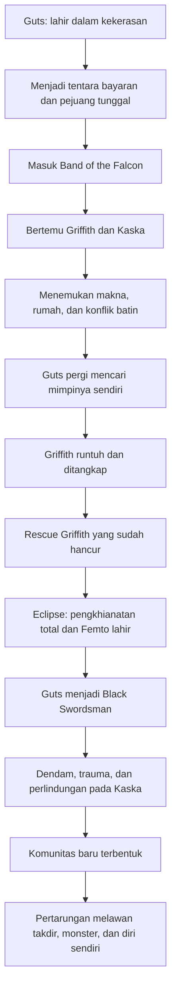

## ⚔️ Pendahuluan: Berserk Bukan Sekadar Cerita Gelap, tetapi Tragedi tentang Manusia yang Retak

Ada karya-karya fiksi yang membuat kita terhibur. Ada karya-karya yang membuat kita berpikir. Lalu ada karya seperti **Berserk**, yang terasa seperti menyeret pembacanya ke jurang, memaksa kita melihat sisi manusia yang paling rapuh, paling ambisius, paling brutal, dan paling menyedihkan. ⚔️

Sekilas, *Berserk* bisa tampak seperti kisah dark fantasy *(fantasi gelap)* biasa: pedang raksasa, iblis, kerajaan, perang, dan pahlawan yang diliputi dendam. Tetapi siapa pun yang benar-benar masuk ke dalam ceritanya tahu bahwa *Berserk* jauh lebih dalam daripada itu. Ia bukan semata kisah pertarungan. Ia adalah kisah tentang:
- seorang anak yang lahir dari kekerasan dan dibesarkan oleh dunia yang tidak punya belas kasihan,
- seorang pemimpin karismatik yang begitu mempesona sampai tampak seperti malaikat, tetapi justru membawa kehancuran paling keji,
- seorang perempuan pejuang yang dipaksa menanggung luka di tengah perebutan ambisi laki-laki,
- dan dunia yang terus menguji apakah manusia masih bisa mempertahankan kemanusiaannya saat semuanya tampak sudah hancur. 🩸

Karya ini pertama kali lahir sebagai manga karya **Kentaro Miura** pada 1988. Sejak saat itu, *Berserk* tumbuh menjadi salah satu karya paling ikonik, paling brutal, dan paling dihormati dalam sejarah manga. Ia punya reputasi sebagai cerita yang kelam tanpa kompromi, tetapi juga sebagai karya yang sangat serius dalam membangun tema:
- trauma,
- kehendak bebas,
- ambisi,
- persahabatan,
- pengkhianatan,
- kekuasaan,
- agama,
- dan perjuangan untuk tidak larut sepenuhnya menjadi monster. 🕯️

Artikel ini akan membedah kisah *Berserk* secara **detail, mendalam, dan lengkap**, tetapi tidak hanya dalam bentuk ringkasan alur. Saya juga akan menguraikan:
- bagaimana perjalanan **Guts** dibentuk oleh kekerasan sejak lahir,
- mengapa hubungan **Guts, Griffith, dan Kaska** menjadi salah satu segitiga paling tragis dalam fiksi,
- apa makna **Eclipse** sebagai titik kehancuran besar,
- bagaimana *Berserk* memotret agama, kekuasaan, dan massa,
- serta mengapa kisah ini tetap terasa begitu kuat bahkan ketika adaptasi animenya sering dianggap tidak mampu menyamai manga aslinya. 📚

Kalau harus disederhanakan dalam satu kalimat, saya kira *Berserk* adalah kisah tentang manusia yang terus berdiri, meski dunia berkali-kali mencoba mengubahnya menjadi binatang. 

---

## 🧭 Tesis Utama: Berserk Adalah Perang antara Kehendak, Trauma, dan Takdir

Tesis utama yang paling masuk akal untuk membaca *Berserk* adalah ini:

> **Berserk bukan sekadar kisah balas dendam, tetapi tragedi besar tentang benturan antara kehendak bebas manusia, trauma yang membentuknya, dan takdir kosmik yang terus berusaha menelan semuanya.**

Di satu sisi, Guts adalah manusia yang terus menolak ditentukan oleh dunia. Ia menolak tunduk, menolak diam, menolak menjadi korban pasif. Di sisi lain, dunia *Berserk* sangat kejam karena ia berkali-kali menunjukkan bahwa manusia bisa didorong ke batas di mana kehendaknya sendiri nyaris hancur. 

Griffith adalah ekstrem sebaliknya. Ia punya kehendak yang hampir mutlak, tetapi kehendak itu tumbuh menjadi obsesi, dan obsesi itu akhirnya menelan semua nilai lain. Di tengah mereka, Kaska menjadi saksi, korban, pejuang, dan pusat emosional dari salah satu kehancuran paling brutal dalam fiksi modern. 🌑

Maka *Berserk* selalu terasa besar bukan karena monstelnya saja, tetapi karena ia bertanya:
- apa yang tersisa dari manusia ketika seluruh rasa aman dirampas?
- apakah ambisi besar selalu menuntut korban darah?
- bisakah cinta, persahabatan, dan loyalitas bertahan di dunia yang dibangun di atas kekerasan?
- dan apakah seseorang masih bisa mempertahankan jiwa ketika hidupnya didorong menjadi mesin pembantaian? 🧠

---

## 🩸 Bagian 1: Kelahiran Guts — Dari Awal, Dunia Sudah Menyambutnya dengan Kekerasan

Sebelum menjadi Black Swordsman, sebelum Dragon Slayer, sebelum Eclipse, Guts sudah lahir dari situasi yang nyaris seperti kutukan. Ia tidak datang ke dunia melalui ruang aman, melainkan di tengah medan perang, dekat mayat ibunya. Bahkan namanya sendiri berasal dari konteks darah dan isi perut yang terburai. Ini penting sekali. Karena dari awal, *Berserk* tidak pernah memberi ilusi bahwa hidup Guts akan normal. 🩸

Ia dibesarkan oleh tentara bayaran bernama **Gambino**. Tetapi kata “dibesarkan” di sini bukan berarti dicintai secara sehat. Yang ia terima adalah dunia keras, militeristik, dingin, dan sering brutal. Ia tidak belajar masa kecil seperti anak biasa. Ia belajar bertahan. 

Di titik ini, *Berserk* melakukan sesuatu yang sangat penting secara psikologis: ia menunjukkan bahwa Guts dibentuk oleh lingkungan yang hampir tidak memberi ruang bagi kelembutan. Jadi ketika kemudian ia tumbuh menjadi pribadi yang keras, sulit percaya pada orang lain, dan bereaksi terhadap dunia dengan kekuatan kasar, itu bukan sekadar gaya karakter. Itu adalah **mekanisme bertahan hidup**. 🛡️

Luka masa kecil Guts sangat penting karena menjadi dasar seluruh sifatnya di masa depan:
- ia sulit menerima kasih sayang,
- ia terbiasa hidup sendiri,
- ia melihat dunia sebagai tempat di mana kelemahan dihabisi,
- dan ia lebih mudah percaya pada pedang daripada pada orang.

Artinya, Guts sejak awal bukan pahlawan romantis yang “jatuh” ke dalam dunia gelap. Ia justru anak gelap yang berusaha keras menemukan secercah kemanusiaan dalam dunia yang dari awal menolaknya. 🌘

---

## ⚔️ Bagian 2: Guts Sang Pengembara — Pedang sebagai Identitas dan Perlindungan

Saat kita pertama kali bertemu Guts dalam fase Black Swordsman, kita melihat seseorang yang hampir tampak lebih dekat ke iblis daripada manusia biasa: berpakaian hitam, penuh luka, bermata satu, bertangan prostetik, memanggul pedang yang nyaris absurd ukurannya, dan bergerak seperti hidupnya memang hanya terdiri dari membunuh dan bergerak maju. ⚔️

Tetapi di balik tampilan ekstrem itu ada satu hal penting: pedang bagi Guts bukan cuma senjata. Pedang adalah:
- identitas,
- perisai,
- alat bertahan,
- cara berbicara,
- dan mungkin satu-satunya hal yang secara konsisten tidak mengkhianatinya.

Ketika karakter lain berbicara melalui politik, pesona, iman, atau sihir, Guts berbicara melalui tindakan fisik yang langsung. Ia adalah tubuh yang terus melawan. Dan justru di situlah kekuatan simboliknya. Guts mewakili manusia yang tidak punya privilese lahiriah, tidak punya garis keturunan, tidak punya nasib istimewa, tetapi terus memaksa dunia mengakuinya lewat ketahanan yang nyaris tidak masuk akal. 💥

---

## 🦅 Bagian 3: Griffith — Cahaya yang Sejak Awal Sudah Mengandung Bencana

Lalu muncullah **Griffith**. Dan inilah salah satu alasan *Berserk* begitu kuat: ia memberi kita antagonis yang bukan sekadar jahat, tetapi sangat memikat. Griffith adalah tipe karakter yang membuat semua orang — baik tokoh di dalam cerita maupun pembaca — mengerti mengapa orang bisa rela mengikutinya. 🦅

Ia tampan, tenang, cerdas, kharismatik, sangat terampil, dan punya visi yang jauh lebih besar daripada orang di sekelilingnya. Ia tampak seperti seseorang yang betul-betul dilahirkan untuk naik. Bahkan aura fisiknya pun berbeda: rambut putih, wajah nyaris anggun, gerak halus, tutur lembut, tetapi sekaligus memancarkan otoritas yang sangat kuat. 

Band of the Falcon *(Pasukan Elang / Band of the Hawk)* tidak sekadar dipimpin olehnya; mereka hidup dari gravitasi pribadinya. Banyak orang bergabung karena mereka melihat dalam Griffith sesuatu yang lebih besar dari sekadar komandan perang. Mereka melihat **mimpi**. ✨

Dan justru di sinilah tragedi dimulai. Karena Griffith adalah tokoh yang dari awal sudah memperlihatkan satu bahaya besar: ia benar-benar percaya pada mimpinya. Bukan “suka”, bukan “tertarik”, bukan “ingin” secara biasa. Ia percaya pada mimpinya dengan intensitas yang membuat semua hal lain bisa berubah menjadi alat. 

Inilah perbedaan penting antara pemimpin besar dan pemimpin berbahaya: 
ketika orang lain mulai tampak bukan sebagai sahabat, melainkan sebagai batu loncatan. 

---

## 🏹 Bagian 4: Band of the Falcon — Keluarga Palsu, Keluarga Nyata, atau Keduanya?

Salah satu lapisan emosional paling kuat dari *Berserk* adalah **Band of the Falcon**. Pada permukaan, ini adalah kelompok tentara bayaran yang sangat efektif. Tetapi secara emosional, bagi banyak anggotanya, terutama Guts, kelompok ini perlahan menjadi sesuatu yang lebih menyerupai keluarga. 🏹

Di dalam Falcon, Guts untuk pertama kalinya mengalami sesuatu yang sangat jarang ia punya:
- pengakuan,
- teman seperjuangan,
- struktur sosial yang tidak semata-mata didasarkan pada kebencian,
- dan rasa bahwa dirinya mungkin punya tempat di antara orang lain. 

Tokoh-tokoh seperti:
- **Judeau** yang peka dan stabil,
- **Pippin** yang pendiam tetapi kokoh,
- **Rickert** yang lebih muda dan polos,
- bahkan **Corkus** yang menyebalkan,

semuanya membentuk suasana bahwa Falcon adalah komunitas hidup. 

Ini sangat penting. Karena tanpa periode Falcon, tragedi besar *Berserk* tidak akan punya kekuatan emosional yang sama. Kita harus melihat bahwa Guts sempat punya rumah, walau rapuh. Dan rumah itu tidak hancur oleh musuh dari luar, tetapi oleh inti terdalam dari orang yang menjadi pusatnya sendiri. 🏚️

---

## 🔥 Bagian 5: Kaska — Pejuang, Penyintas, dan Jantung Emosional Cerita

Kalau Guts adalah tubuh luka dan Griffith adalah ambisi berwujud manusia, maka **Kaska** adalah salah satu pusat emosional paling penting dalam *Berserk*. Ia bukan karakter tempelan. Ia bukan sekadar objek cinta. Ia adalah pejuang yang punya sejarah sendiri, loyalitas sendiri, luka sendiri, dan pandangan sendiri terhadap Griffith maupun Guts. 🔥

Kaska bergabung dengan Griffith bukan karena kebetulan, tetapi karena ia pernah diselamatkan oleh Griffith dari situasi yang sangat mengerikan. Dalam hidup yang keras dan patriarkal, Griffith memberinya pedang dan ruang untuk menjadi lebih dari sekadar korban. Tidak mengherankan jika kemudian Kaska mengembangkan loyalitas dan perasaan yang sangat dalam pada Griffith. 

Namun kehadiran Guts mengguncang semua ini. Karena Guts bukan hanya anggota baru. Ia adalah seseorang yang perlahan mengambil tempat emosional yang sebelumnya tidak pernah tergantikan. Awalnya hubungan Guts dan Kaska sangat tegang. Mereka saling bertabrakan dalam ego, nilai, dan cara bertahan hidup. Tetapi justru dari benturan itu, kedekatan mereka terasa lebih nyata. ❤️‍🩹

Kaska penting karena melalui dirinya, kita melihat:
- bagaimana Griffith dipuja,
- bagaimana Guts dipahami dari sisi yang lebih manusiawi,
- dan bagaimana tragedi *Berserk* bukan hanya tentang perang atau ambisi, tetapi juga tentang hancurnya kemungkinan cinta dan kehidupan yang lebih normal.

---

## 🌒 Bagian 6: Guts vs Griffith — Persahabatan, Kekaguman, Kepemilikan, dan Retak yang Tak Terhindarkan

Hubungan antara Guts dan Griffith adalah inti utama *Berserk*. Ini bukan hubungan sederhana antara pahlawan dan penjahat. Pada awalnya, hubungan mereka lebih dekat ke campuran antara:
- kekaguman,
- ketertarikan eksistensial,
- kebutuhan emosional,
- persaingan,
- dan dorongan kepemilikan. 🌒

Griffith tertarik pada Guts karena Guts tidak seperti orang lain. Ia kuat, liar, keras kepala, dan sulit dimiliki. Dan justru karena itulah Griffith ingin memilikinya. Kalimat-kalimat Griffith tentang Guts tidak pernah terdengar seperti relasi setara yang sehat. Selalu ada nuansa bahwa Guts adalah sesuatu yang ingin ia kuasai. 

Sementara Guts melihat Griffith sebagai sosok yang luar biasa. Untuk seseorang seperti Guts, yang seumur hidup nyaris tidak pernah melihat model kepemimpinan yang benar-benar menginspirasi, Griffith tampak seperti bintang. Ia adalah orang pertama yang tidak sekadar memakai Guts, tetapi juga “melihat” potensinya. 

Masalahnya, hubungan ini retak justru ketika Guts mulai memahami sesuatu yang sangat mendalam: **ia tidak bisa selamanya hidup hanya sebagai alat dari mimpi orang lain**. 🧠

Momen ketika Guts mendengar Griffith berbicara bahwa ia hanya bisa menyebut seseorang sebagai sahabat sejati jika orang itu punya mimpi sendiri adalah momen penting. Di situlah Guts sadar bahwa, bagi Griffith, dirinya belum dianggap setara. Ia hanya prajurit terbaik, bukan sahabat sejati. Dan dari titik itu, keputusan Guts untuk pergi menjadi bukan pengkhianatan, melainkan langkah eksistensial. 

Ia ingin menemukan diri.
Ia ingin menemukan tujuan.
Ia ingin berdiri bukan hanya sebagai pedang orang lain. 

Dan justru langkah ini menghancurkan Griffith dari dalam. 

---

## 🩶 Bagian 7: Mengapa Kepergian Guts Menghancurkan Griffith?

Ini salah satu aspek psikologis paling penting dalam *Berserk*. Secara rasional, Griffith sudah punya segalanya yang mendukung mimpinya:
- pasukan loyal,
- reputasi besar,
- akses ke istana,
- perhatian putri kerajaan,
- kemenangan perang,
- dan jalur politik yang semakin terbuka. 

Tetapi ketika Guts pergi, semua itu tidak cukup mencegah Griffith runtuh. Kenapa? 🩶

Karena Guts ternyata bukan sekadar prajurit elit. Ia adalah satu-satunya orang yang keberadaannya benar-benar menembus struktur batin Griffith. Selama ini Griffith tampak sangat terkendali, sangat rasional, sangat terarah. Tetapi kepergian Guts menunjukkan bahwa di balik semua itu ada sesuatu yang lebih rapuh: **ketergantungan emosional yang tidak pernah ia akui.** 

Begitu Guts menang duel dan pergi, Griffith kehilangan pusat keseimbangannya. Ia tidak lagi bertindak sebagai strategist dingin, tetapi sebagai orang yang terluka, impulsif, dan kehilangan kontrol. Hubungannya dengan Charlotte tepat setelah kepergian Guts bukan sekadar langkah politik; itu juga tampak seperti tindakan kompulsif, pelarian, dan pembuktian diri. Dan justru di situ ia jatuh. 

Ini salah satu ironi terbesar *Berserk*: 
orang yang tampak paling menguasai hidupnya justru dihancurkan oleh satu kehilangan yang tidak bisa ia akomodasi secara emosional. 

---

## ⛓️ Bagian 8: Penyiksaan Griffith — Tubuh Hancur, Ambisi Tidak Mati

Setelah ditangkap dan disiksa, Griffith berubah dari figur nyaris sempurna menjadi tubuh yang remuk, lidah terpotong, dan nyaris tidak lagi memiliki bentuk manusia yang ia banggakan. Ini penting sekali dalam struktur tragedi *Berserk*. ⛓️

Kenapa? Karena Griffith selama ini sangat bergantung pada:
- kecantikan fisik,
- kharisma,
- kontrol diri,
- kemampuan bertarung,
- dan aura superioritas.

Penyiksaan menghancurkan semuanya sekaligus. Ia dibuat menjadi tubuh tanpa masa depan. Dan di sinilah *Berserk* memperlihatkan satu kengerian psikologis terdalam: bagi seseorang yang seluruh hidupnya digerakkan oleh impian besar, **dipaksa hidup sebagai reruntuhan adalah penderitaan yang hampir tak tertahankan.**

Saat Falcon berhasil menyelamatkannya, mereka sebenarnya tidak mendapatkan kembali Griffith yang lama. Yang mereka bawa keluar hanyalah tubuh rapuh dengan kehendak yang sudah terjebak di titik putus. Dan dari sinilah jalan menuju Eclipse terbuka. 

---

## 🌑 Bagian 9: Eclipse — Salah Satu Titik Kehancuran Paling Besar dalam Fiksi

Sulit melebih-lebihkan betapa besar dan brutalnya **Eclipse** dalam sejarah manga-anime. Ini bukan cuma twist, bukan sekadar tragedi, dan bukan hanya massacre. Eclipse adalah **penghancuran total terhadap seluruh struktur makna yang sempat dibangun cerita sebelumnya**. 🌑

Band of the Falcon yang selama ini terasa seperti keluarga, komunitas, rumah, dan mesin mimpi bersama tiba-tiba diubah menjadi persembahan darah. Griffith, yang selama ini memimpin mereka menuju kejayaan, memilih mereka sebagai tumbal demi menjadi sesuatu yang lebih tinggi: **Femto**, anggota God Hand. 

Secara naratif, Eclipse berfungsi sebagai:
- klimaks pengkhianatan,
- titik pemisah total antara masa lalu dan masa depan Guts,
- kehancuran terakhir dari ilusi bahwa ambisi Griffith masih punya batas moral,
- dan pemutusan kejam atas kemungkinan hidup normal bagi Guts dan Kaska. 🩸

Secara filosofis, Eclipse adalah pertanyaan yang sangat gelap: 

**berapa banyak manusia yang rela dikorbankan demi satu impian besar?**

Dan *Berserk* menjawabnya tanpa tedeng aling-aling: jika impian itu berubah menjadi absolut, maka tidak ada yang aman. 

---

## 💔 Bagian 10: Femto dan Pengkhianatan Total Griffith

Banyak antagonis besar dalam fiksi “jatuh” sedikit demi sedikit. Griffith berbeda. Ia memang sudah punya sisi gelap sejak lama, tetapi Eclipse adalah momen ketika seluruh ambiguïtas itu runtuh. Setelah ia menerima pengorbanan itu, ia bukan lagi sekadar manusia ambisius yang tersesat. Ia menjadi **pengkhianat total terhadap semua yang pernah mengangkatnya**. 💔

Yang membuatnya lebih menyakitkan adalah karena penonton dan pembaca mengerti mengapa orang-orang di Falcon mencintainya. Jadi ketika ia mengorbankan mereka, rasa ngeri itu bukan hanya datang dari kekerasannya, tetapi dari fakta bahwa korban-korban itu sungguh loyal. Mereka bukan musuh. Mereka adalah orang-orang yang telah memberi tubuh, darah, dan hidup untuk mimpinya. 

Dan justru karena itu, Femto sangat menakutkan. Ia bukan monster asing dari luar. Ia adalah bentuk final dari manusia yang membiarkan ambisinya melampaui semua ikatan moral. 👁️

---

## 🧠 Bagian 11: Guts Setelah Eclipse — Dari Korban Menjadi Black Swordsman

Setelah Eclipse, Guts tidak sekadar kehilangan teman. Ia kehilangan:
- komunitas,
- kepercayaan,
- cinta yang aman,
- tubuh yang utuh,
- dan masa depan yang mungkin. 🧠

Ia menjadi **Black Swordsman**, figur yang kita lihat di awal: hidup dalam amarah, dihantui setan, diburu oleh roh karena Brand of Sacrifice, dan bergerak nyaris hanya oleh satu bahan bakar: dendam. 

Tetapi yang membuat Guts begitu kuat sebagai karakter bukan karena ia hanya marah. Yang membuatnya kuat adalah bahwa bahkan dalam kehancuran seperti itu, ia tidak sepenuhnya menjadi monster. Ia masih punya garis batas tertentu. Ia masih bisa melindungi, masih bisa peduli, masih bisa ditarik kembali oleh ikatan dengan orang lain. 

Inilah yang membuat *Berserk* lebih dari sekadar kisah rage machine. Guts adalah figur yang terus berada di ambang menjadi binatang penuh, tetapi tidak pernah sepenuhnya menyerah. Dan justru perjuangan itulah yang heroik. 🔥

---

## 👶 Bagian 12: Kaska Setelah Eclipse — Trauma sebagai Luka yang Menghapus Diri

Salah satu keputusan paling brutal sekaligus paling jujur dalam *Berserk* adalah bagaimana cerita memperlakukan trauma Kaska. Banyak karya menggunakan kekerasan terhadap perempuan sebagai pemicu motivasi tokoh laki-laki, lalu melupakannya. *Berserk* memang sangat problematis dan menyakitkan di banyak titik, tetapi setidaknya ia tidak berpura-pura bahwa kekerasan sebesar itu bisa “dilewati” begitu saja. 👶

Kaska kehilangan hampir seluruh fungsi dirinya. Ia kembali ke kondisi mental yang sangat rapuh, nyaris seperti anak kecil, tidak mampu memproses dunia sebagaimana sebelumnya. Ini membuat perjalanan Guts berubah bentuk. Dendam tetap ada, tetapi kini ia juga memikul tanggung jawab perawatan. 

Dan ini penting. Karena dari sini cerita mulai bergeser pelan-pelan dari “aku akan membunuh orang yang menghancurkanku” menjadi “aku harus menjaga orang yang tersisa.” Itu perubahan moral yang besar. 

Kaska menjadi pusat yang mengingatkan bahwa trauma bukan hanya luka emosional abstrak. Ia bisa merusak identitas, memutus kontinuitas diri, dan membuat seseorang nyaris tidak lagi menjadi orang yang sama. 🕯️

---

## 👁️ Bagian 13: Dunia Pasca-Eclipse — Monster, Agama, dan Kekacauan yang Makin Nyata

Setelah fase Golden Age yang tragis, *Berserk* makin bergerak ke wilayah dark fantasy dan horor kosmik yang lebih terbuka. Dunia tidak lagi terasa sekadar brutal secara manusiawi; ia mulai menampakkan wajah supranaturalnya. Roh jahat, apostle, God Hand, troll, ritual, dan deformasi tubuh menjadi bagian permanen dari realitas. 👁️

Tetapi semua elemen monster itu bukan sekadar hiasan seram. Mereka sering berfungsi sebagai eksternalisasi dari:
- nafsu manusia,
- ketakutan kolektif,
- kekuasaan yang korup,
- dan kehancuran spiritual masyarakat.

Misalnya, para apostle bukan hanya monster. Mereka adalah manusia yang pada titik putus tertentu memilih mengorbankan sesuatu yang paling berharga demi kekuatan. Itu artinya banyak monster dalam *Berserk* sebenarnya adalah manusia yang membuat satu keputusan moral absolut dan kemudian berubah selamanya. 

Ini mengerikan karena membuat garis antara manusia dan monster menjadi sangat tipis. 😨

---

## ⛪ Bagian 14: Agama, Inkuisisi, dan Kritik terhadap Iman yang Menjadi Mesin Kekerasan

Arc Conviction membawa *Berserk* ke salah satu kritik sosial dan spiritualnya yang paling tajam. Melalui tokoh seperti **Mozgus** dan struktur Gereja Holy See, cerita menunjukkan bagaimana agama yang kehilangan belas kasih bisa berubah menjadi alat kekerasan, histeria massa, dan pembenaran penyiksaan. ⛪

Mozgus sangat menarik karena ia bukan sekadar munafik biasa. Ia tampaknya benar-benar percaya pada apa yang ia lakukan. Dan justru itu yang membuatnya lebih menyeramkan. Ia tidak merasa sedang jahat. Ia merasa sedang menjalankan kehendak ilahi. 

Inilah bahaya besar yang diperlihatkan *Berserk*: kekerasan paling mengerikan sering tidak dilakukan oleh orang yang berpikir dirinya monster, tetapi oleh orang yang yakin dirinya sedang menyelamatkan moralitas. 

Farnese juga penting di sini. Ia awalnya begitu tenggelam dalam struktur religius dan kekerasan institusional, tetapi perlahan mulai retak ketika ia melihat langsung kenyataan yang tidak bisa lagi ditutupi dengan doktrin. Karakternya menjadi salah satu bukti bahwa *Berserk* tidak hanya pandai menciptakan kerusakan, tetapi juga proses dekonstruksi kepercayaan yang sangat personal. 🪨

---

## 🧙 Bagian 15: Farnese, Serpico, Isidro, Schierke — Dari Cerita Dendam ke Cerita Komunitas Baru

Salah satu hal menarik dari perkembangan *Berserk* setelah fase Black Swordsman murni adalah bahwa cerita perlahan membangun **komunitas baru** di sekitar Guts. 🧙

Tokoh-tokoh seperti:
- **Farnese**, yang bergerak dari fanatisme rapuh menuju pembelajaran diri,
- **Serpico**, yang sinis tetapi sangat cerdas dan penuh loyalitas rumit,
- **Isidro**, anak liar yang jelas melihat Guts sebagai model kejantanan tempur,
- **Schierke**, penyihir muda yang membawa kecerdasan spiritual dan jangkar emosional penting,

semuanya membantu mengubah *Berserk* dari kisah solo tentang dendam menjadi kisah yang lebih luas tentang **bagaimana orang yang hancur bisa perlahan membentuk keluarga baru**. 🫶

Ini sangat penting. Karena tanpa kelompok ini, Guts mungkin akan benar-benar larut menjadi mesin pembantai. Mereka tidak “menyembuhkan” dia secara sederhana, tetapi mereka memberi resistensi terhadap kehancuran total. 

Schierke khususnya penting karena ia menjadi figur yang bisa menarik Guts kembali dari jurang ketika **Berserker Armor** mulai mengambil alih akal sehatnya. Secara simbolik, Schierke adalah kecerdasan, kesadaran, dan mediasi. Ia adalah pengingat bahwa amarah besar butuh orang lain untuk tidak berubah menjadi kebutaan total. 🔮

---

## 🐺 Bagian 16: Berserker Armor — Kekuasaan yang Menolong Sekaligus Menghancurkan

Salah satu simbol terbaik dalam *Berserk* adalah **Berserker Armor**. Pada level permukaan, armor ini keren: membuat Guts sangat kuat, menekan rasa sakit, dan memungkinkan tubuhnya terus bertarung bahkan ketika semestinya sudah runtuh. 🐺

Tetapi pada level makna, armor ini adalah personifikasi sempurna dari cara trauma dan amarah bekerja. 

Ia memberi kekuatan, ya.
Tetapi dengan harga:
- tubuh makin rusak,
- batas realitas dan kegilaan menipis,
- kemanusiaan mulai terkikis,
- dan Guts terus digoda untuk menyerahkan kendali pada amarahnya. 

Jadi armor ini seperti metafora untuk banyak hal:
- trauma yang dijadikan mesin kekuatan,
- dendam yang menjaga kita tetap bergerak tetapi pelan-pelan memakan jiwa,
- atau coping mechanism ekstrem yang efektif dalam jangka pendek tetapi menghancurkan dalam jangka panjang. 

Inilah alasan mengapa setiap kali Guts memakai armor itu, kita sebagai pembaca/penonton tidak pernah bisa sekadar bersorak tanpa cemas. Karena kita tahu: setiap kemenangan datang dengan harga yang semakin dekat ke kehilangan diri. ⚠️

---

## 🌘 Bagian 17: Griffith Kembali — Mengapa Kembalinya Dia Justru Lebih Mengerikan?

Ketika Griffith kembali ke dunia fisik, ada sesuatu yang sangat mengganggu: ia tampak begitu indah, tenang, teratur, dan bahkan membawa keselamatan di beberapa situasi. Ia seperti mesias palsu. Dan justru inilah yang membuatnya jauh lebih berbahaya. 🌘

Kalau ia kembali sebagai monster murni, orang akan mudah membencinya. Tetapi *Berserk* memilih jalan yang lebih cerdas: Griffith hadir sebagai figur yang lagi-lagi bisa dipuja. Ia bisa menyelamatkan orang, memimpin pasukan, menciptakan stabilitas, dan tampak seperti jawaban atas kekacauan dunia. 

Ini membuat pertanyaan moral *Berserk* makin rumit:
- bagaimana menilai figur yang membawa ketertiban publik, tetapi dibangun di atas pengkhianatan tak termaafkan?
- apakah hasil besar bisa menghapus dosa besar?
- apakah manusia akan tetap mengikuti pemimpin yang jahat jika pemimpin itu memberi rasa aman?

Jawaban *Berserk* terasa getir: **ya, sangat mungkin.** Dan itu membuat Griffith lebih realistis sebagai figur kekuasaan. 

---

## 🧩 Bagian 18: Mengapa Berserk Sangat Kuat Secara Tematik?

Kekuatan *Berserk* tidak datang hanya dari kekejaman. Banyak karya bisa brutal. Yang membedakan *Berserk* adalah bahwa kekerasannya hampir selalu terhubung dengan tema yang serius. 🧩

### Tema besar Berserk antara lain:

#### 1. Ambisi dan harga moralnya
Griffith adalah studi tentang ambisi yang menelan seluruh etika.

#### 2. Trauma dan dampak jangka panjangnya
Guts dan Kaska menunjukkan bahwa luka bukan sesuatu yang selesai hanya karena waktu berjalan.

#### 3. Persahabatan dan ketidaksetaraan
Hubungan Guts–Griffith memperlihatkan bahwa kekaguman yang tidak seimbang bisa meledak menjadi kehancuran.

#### 4. Tubuh sebagai medan penderitaan
Di *Berserk*, tubuh selalu penting: dilukai, disiksa, dikhianati, dipakai, dan dipaksa bertahan.

#### 5. Agama dan kekuasaan
Cerita menunjukkan bagaimana struktur religius bisa menjadi alat pembenaran kekerasan massal.

#### 6. Takdir vs kehendak bebas
Apakah manusia bisa melawan jalur yang tampaknya telah ditetapkan kosmos? Ini salah satu pertanyaan sentral *Berserk*.

#### 7. Komunitas sebagai kemungkinan penyelamatan
Meskipun sangat gelap, *Berserk* tidak nihilistik total. Ia tetap menyisakan harapan dalam ikatan manusia yang rapuh tetapi nyata. 🌱

---

## 🎨 Bagian 19: Manga vs Anime — Mengapa Fans Berserk Selalu Membela Manga?

Hampir semua pembaca lama *Berserk* akan mengatakan hal yang sama: **manganya jauh lebih superior dibanding adaptasi animenya**. Dan jujur saja, klaim ini punya dasar kuat. 🎨

Kentaro Miura dikenal bukan hanya karena kemampuan bercerita, tetapi juga karena detail visual yang luar biasa. Panel-panelnya sering begitu padat, atmosferiknya kuat, dan mampu menahan momen hening maupun horor dengan presisi tinggi. Adaptasi anime, terutama versi 2016, sering dikritik karena CGI yang kaku, pacing yang aneh, dan banyak penghilangan konteks penting. 

Tetapi meski begitu, anime tetap punya fungsi: ia membuka pintu bagi banyak orang untuk masuk ke dunia *Berserk*. Lalu setelah itu, hampir semua orang serius akan diarahkan kembali ke manga. Dan mungkin memang itu nasib adaptasi *Berserk*: menjadi bayangan dari sesuatu yang jauh lebih megah di sumber aslinya. 📖

---

## 🕯️ Bagian 20: Kentaro Miura dan Warisan Berserk

Tidak mungkin membicarakan *Berserk* tanpa membicarakan **Kentaro Miura**. Kematian beliau pada 2021 meninggalkan luka besar bagi dunia manga. Karena *Berserk* bukan hanya seri populer. Ia adalah proyek hidup seorang seniman yang membangun dunia sangat detail, sangat personal, dan sangat konsisten selama puluhan tahun. 🕯️

Warisan Miura terasa besar karena *Berserk* memengaruhi sangat banyak karya setelahnya:
- desain karakter dan dunia dalam dark fantasy modern,
- video game seperti *Dark Souls* dan *Elden Ring*,
- manga dan anime lain yang mengusung tema kekerasan, trauma, dan dunia suram,
- bahkan cara orang membayangkan “swordsman yang menolak mati”.

Tetapi pengaruh visual bukan inti terbesar warisannya. Yang lebih penting adalah bahwa Miura membuktikan bahwa manga bisa menjadi ruang untuk tragedi yang serius, filosofis, brutal, dan sangat manusiawi sekaligus. 

---

---

## 📊 Ringkasan Tokoh dan Peran Besarnya

| Tokoh | Peran Inti | Makna Tematik |
| :--- | :--- | :--- |
| **Guts** | Protagonis, petarung, penyintas | Kehendak hidup, trauma, perlawanan terhadap takdir |
| **Griffith / Femto** | Pemimpin Falcon, lalu pengkhianat total | Ambisi absolut, pesona kekuasaan, harga impian |
| **Kaska** | Komandan, pejuang, pusat emosional | Loyalitas, cinta, luka, dan kehancuran diri akibat trauma |
| **Judeau** | Rekan Falcon yang peka | Kewarasan emosional dalam dunia brutal |
| **Rickert** | Anggota muda Falcon yang selamat | Sisa kepolosan dan memori komunitas lama |
| **Farnese** | Bangsawan religius yang retak | Fanatisme, represi, dan kemungkinan transformasi diri |
| **Serpico** | Pelindung Farnese yang cerdas dan kompleks | Loyalitas ambigu, rasionalitas, dan sinisme halus |
| **Isidro** | Anak muda yang mengidolakan Guts | Aspirasi, keberanian, dan energi generasi baru |
| **Schierke** | Penyihir muda | Pengetahuan, mediasi, dan jangkar kesadaran |
| **Skull Knight** | Penolong misterius anti-God Hand | Resistensi terhadap tatanan jahat yang lebih besar |
| **Mozgus** | Inkuisitor fanatik | Kritik terhadap agama yang menjadi alat kekerasan |
| **Zodd** | Monster pejuang abadi | Kekaguman terhadap kekuatan dan logika dunia apostle |

---

## 🧾 Glosarium Istilah Penting dalam Berserk

- **Apostle:** Manusia yang mengorbankan sesuatu yang sangat berharga lewat Beherit untuk memperoleh kekuatan iblis.
- **Band of the Falcon / Band of the Hawk:** Pasukan tentara bayaran elite yang dipimpin Griffith.
- **Beherit / Bayit / Beherit:** Artefak iblis yang menjadi kunci pengorbanan dan kontak dengan God Hand.
- **Black Swordsman:** Julukan Guts setelah Eclipse, saat ia hidup dalam jalur dendam dan diburu roh.
- **Dark fantasy:** Genre fantasi gelap yang menonjolkan dunia keras, moral abu-abu, horor, dan tragedi.
- **Eclipse:** Ritual pengorbanan besar saat Griffith mengorbankan Falcon demi menjadi Femto.
- **Femto:** Wujud Griffith setelah rebirth sebagai anggota God Hand.
- **God Hand:** Sekelompok entitas iblis tingkat tinggi yang bekerja di balik banyak tragedi kosmik dalam dunia Berserk.
- **Brand of Sacrifice:** Tanda pada tubuh korban pengorbanan yang membuat mereka terus diburu roh jahat.
- **Berserker Armor:** Armor terkutuk yang meningkatkan kemampuan tempur Guts secara ekstrem dengan biaya besar pada tubuh dan jiwanya.

---

## 🌟 Kesimpulan: Mengapa Berserk Tetap Sulit Dilupakan?

*Berserk* sulit dilupakan bukan hanya karena ia kejam. Banyak karya juga kejam. *Berserk* sulit dilupakan karena ia membuat kekejaman itu punya bobot eksistensial. Ia membuat luka terasa menetap. Ia membuat kemenangan terasa mahal. Ia membuat persahabatan, cinta, dan ambisi semuanya tampak mulia sekaligus berbahaya. 🌟

Pada akhirnya, *Berserk* adalah kisah tentang manusia yang terus bergerak bahkan setelah alasan untuk hidup tampak hancur. Guts bukan pahlawan bersih. Ia membunuh, ia penuh amarah, ia sering brutal, dan ia tidak selalu benar. Tetapi justru karena itulah ia terasa manusia. Ia bukan lambang kesucian; ia lambang **ketahanan**. 

Sementara itu, Griffith adalah pengingat yang jauh lebih menyeramkan: bahwa kejatuhan terbesar manusia kadang tidak datang dari kelemahan, tetapi dari kekuatan yang dilepaskan tanpa batas moral. Ia bukan gagal karena kurang ambisi. Ia gagal justru karena ambisinya menjadi begitu total sampai semua hal lain kehilangan nilai. 👁️

Dan di tengah keduanya, Kaska menjadi saksi paling menyakitkan bahwa perang terbesar sering tidak hanya menghancurkan tubuh, tetapi juga memutus kontinuitas jiwa seseorang.

Kalau saya harus mengatakan satu hal paling penting tentang *Berserk*, mungkin ini:

> **Berserk adalah karya yang percaya bahwa dunia bisa sangat jahat, tetapi selama seseorang masih memilih untuk melindungi yang lain, kemanusiaan belum sepenuhnya kalah.**

Itulah mengapa, sebrutal apa pun kisah ini, kita tetap terus mengikuti Guts. Bukan karena ia sempurna. Tetapi karena di dunia yang nyaris seluruhnya rusak, ia tetap mencoba berdiri. Dan kadang, dalam karya sebesar *Berserk*, berdiri saja sudah merupakan bentuk kepahlawanan paling murni. 🕯️

---

<Callout type="cite" title="Referensi Sumber">
- Video: *The ENTIRE Story Of Berserk In 110 Minutes*
- Sumber transkrip: [YouTube — The ENTIRE Story Of Berserk In 110 Minutes](https://www.youtube.com/watch?v=kz1Wpiib9uU)
- Basis naratif utama: adaptasi anime Berserk 1997 dan 2016, dengan konteks penting dari manga karya Kentaro Miura.
</Callout>
