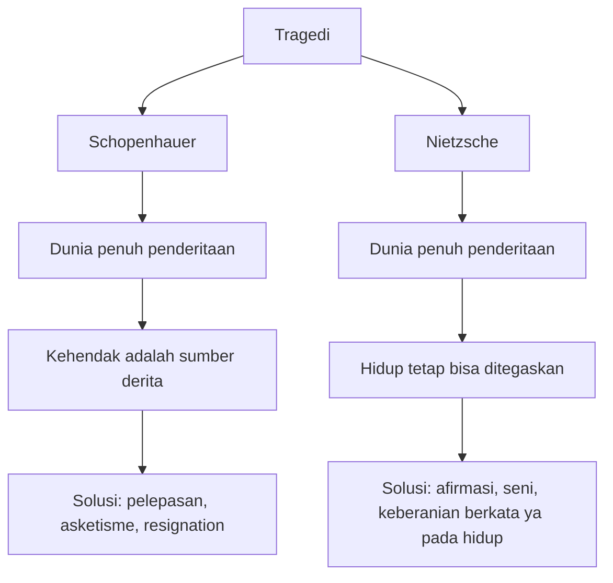
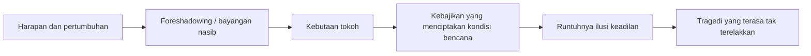
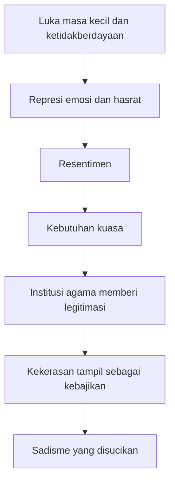
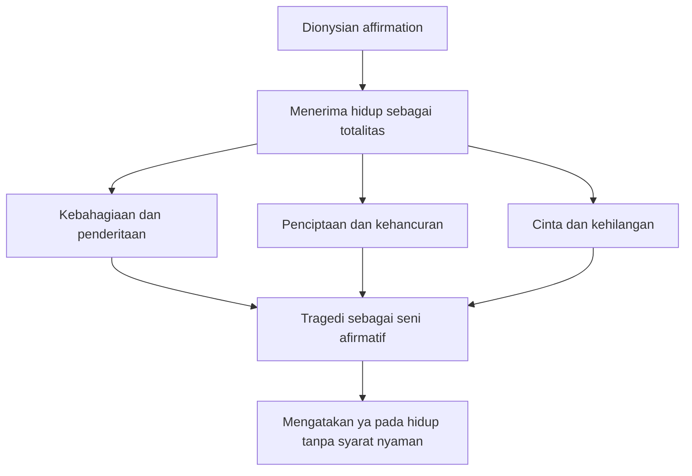
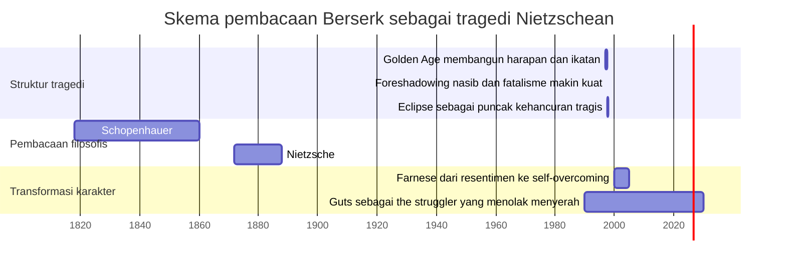

## ⚔️ Pendahuluan: Mengapa Kita Bisa Mencintai Kisah yang Menghancurkan Hati Kita?

Ada sesuatu yang aneh tetapi sangat manusiawi ketika kita berhadapan dengan karya tragis yang luar biasa. Kita tahu kisah itu menyakitkan. Kita tahu ia akan membawa kita ke tempat yang gelap. Kita tahu bahwa di dalamnya ada pengkhianatan, penderitaan, ketidakadilan, kehilangan, dan luka yang tidak bisa benar-benar dipulihkan. Namun justru karena itulah kita tidak bisa melepaskan diri. Kita kembali membacanya, menontonnya, memikirkannya, bahkan membawanya bertahun-tahun di dalam kepala. ⚔️

Itulah salah satu cara terbaik untuk memahami **Berserk**. Karya Kentaro Miura ini bukan sekadar *dark fantasy* *(fantasi gelap)* yang brutal, bukan sekadar manga dengan gambar yang mengagumkan, dan bukan sekadar cerita balas dendam dengan dunia yang suram. Berserk adalah karya yang mengandung kekuatan tragis yang sangat langka: ia membuat pembacanya hancur, tetapi justru melalui kehancuran itu ia memunculkan sesuatu yang lebih tinggi daripada hiburan. Ia memunculkan pertanyaan tentang **nilai hidup itu sendiri**. 🩸

Video yang menjadi sumber tulisan ini mengajukan satu pembacaan yang menurut saya sangat kuat: bahwa Berserk dapat dipahami sebagai **tragedi Nietzschean** *(tragedi yang dibaca melalui filsafat Nietzsche)*. Artinya, Berserk bukan hanya tragis karena berakhir dengan bencana atau menampilkan penderitaan ekstrem, tetapi karena ia menyentuh pertanyaan yang juga menjadi pusat refleksi Nietzsche: **bagaimana mungkin manusia mengatakan “ya” kepada hidup, padahal hidup penuh rasa sakit, kehilangan, absurditas, dan kehancuran?** 🧠

Ini pertanyaan yang lebih dalam daripada sekadar “kenapa cerita ini sedih?” atau “siapa tokoh paling tragis?” Yang dipertaruhkan di sini bukan hanya nasib Guts, Griffith, Casca, atau Farnese, melainkan bagaimana seni tragis bekerja atas jiwa manusia. Mengapa karya yang menunjukkan horor kehidupan justru bisa terasa agung? Mengapa kisah yang tidak memberi keadilan sederhana, tidak memberi penutupan emosional, bahkan kadang tidak memberi harapan yang nyaman, justru tampak lebih jujur dan lebih besar daripada kisah-kisah yang rapi dan manis? 🔥

Di sinilah tulisan ini akan bergerak. Kita akan memakai Berserk sebagai pintu masuk untuk membahas:

- **paradox of tragedy** *(paradoks tragedi / mengapa kita menikmati atau tertarik pada yang tragis)*,
- perbedaan besar antara **Schopenhauer** dan **Nietzsche**,
- kritik terhadap moralitas berbasis rasa bersalah,
- bagaimana karakter **Farnese** merepresentasikan problem moralitas resentimen,
- bagaimana **Guts** muncul sebagai figur *the struggler* *(sang pejuang / sang pengemban perjuangan)*,
- serta mengapa Berserk bisa dipahami bukan sebagai ajakan menyerah, melainkan justru sebagai **afirmasi kehidupan** di tengah dunia yang kejam.

Kalau harus dirumuskan sebagai tesis utama, maka artikel ini berdiri di atas tesis berikut:

> **Berserk adalah tragedi Nietzschean karena ia menatap langsung horor, ketidakadilan, dan takdir yang kejam, tetapi tidak berakhir pada penolakan hidup; sebaliknya, melalui seni, perjuangan, dan transformasi karakter, ia menyingkap kemungkinan untuk tetap mengafirmasi hidup bahkan ketika hidup tidak memberi jaminan keadilan, makna, ataupun akhir yang bahagia.**

Dan justru karena itu, Berserk terasa lebih besar daripada sekadar manga kelam. Ia menjadi semacam ujian eksistensial: apakah kita hanya sanggup mencintai hidup ketika hidup baik pada kita, atau bisakah kita mengiyakan hidup bahkan ketika hidup menunjukkan wajah paling mengerikannya? 😶

---

<Callout type="important" title="Tesis utama artikel ini">
Berserk bukan tragedi dalam arti pesimisme pasif. Ia adalah tragedi Nietzschean karena memperlihatkan bahwa penderitaan, kehilangan, konflik, dan nasib yang brutal bukan alasan final untuk menolak hidup. Justru melalui bentuk artistiknya, Berserk menunjukkan bagaimana hidup dapat tetap dikatakan “ya”, bahkan tanpa janji penyelesaian yang manis.
</Callout>

---

## 🎭 1. Paradox of Tragedy: Mengapa Kisah Paling Menyakitkan Justru Menjadi Karya yang Paling Kita Hargai?

Salah satu pertanyaan awal yang paling penting adalah ini: **mengapa manusia tertarik pada tragedi?** 🎭

Kalau kita memakai logika sehari-hari, seharusnya kita hanya menyukai hal yang menyenangkan. Kita menikmati makanan enak karena ia memberi kenikmatan inderawi. Kita menikmati pujian karena ia menyenangkan ego. Kita menikmati kenyamanan karena ia menurunkan ketegangan. Tetapi tragedi bekerja sebaliknya. Ia menampilkan:

- penderitaan yang tidak layak,
- kebrutalan yang mengerikan,
- ketidakadilan yang tidak terselesaikan,
- dan sering kali kehancuran tanpa kompensasi moral.

Dalam bahasa filsafat estetika, ini disebut **paradox of tragedy** *(paradoks tragedi)*: bagaimana mungkin kita tertarik, bahkan secara mendalam tersentuh, oleh representasi hal-hal yang sebenarnya tidak ingin kita alami dalam hidup nyata?

Berserk memberi contoh yang sangat ekstrem. Banyak karya tragis tetap menyediakan ruang aman: ada pelajaran moral jelas, ada penjahat yang akhirnya kalah, ada semacam keseimbangan. Berserk sering tidak memberi kemewahan itu. *Golden Age Arc* *(Busur Zaman Keemasan)*, misalnya, bukan sekadar berakhir buruk. Ia memukul pembaca dengan kekuatan emosional yang justru dibangun perlahan melalui persahabatan, loyalitas, mimpi, dan pertumbuhan karakter. Lalu ketika semua ikatan itu sudah terbentuk, tragedinya datang bukan sebagai kejutan murah, tetapi sebagai penghancuran total atas dunia yang sempat terasa hidup. 💔

Dan justru setelah semua itu, banyak orang merasa bahwa Berserk adalah salah satu karya terbesar yang pernah mereka baca. Mengapa? Karena tragedi bukan hanya soal rasa sakit. Tragedi adalah bentuk seni yang membuat kita berhadapan dengan kenyataan hidup yang paling mengerikan tanpa menipu kita dengan kosmetik optimisme palsu.

---

## 📖 2. Schopenhauer: Tragedi sebagai Kebenaran Gelap tentang Dunia dan Alasan untuk Melepaskan Diri darinya

Untuk memahami Nietzsche, kita harus melewati Schopenhauer terlebih dahulu. 📖

**Arthur Schopenhauer** adalah filsuf Jerman yang terkenal dengan pesimismenya. Bagi Schopenhauer, dunia pada dasarnya digerakkan oleh **will** *(kehendak / dorongan buta untuk hidup, menginginkan, mengejar, dan mempertahankan diri)*. Masalahnya, kehendak ini tidak pernah benar-benar puas. Setiap pemenuhan hanya melahirkan keinginan baru. Akibatnya, hidup dipenuhi oleh:

- konflik,
- frustrasi,
- kekurangan,
- ketakutan,
- persaingan,
- dan penderitaan yang terus berulang.

Dalam konteks ini, Schopenhauer sangat menghargai tragedi karena tragedi baginya adalah bentuk seni yang paling jujur. Ia tidak membohongi kita dengan ilusi bahwa dunia adil. Ia tidak memberi akhir bahagia palsu. Ia tidak berpura-pura bahwa kebajikan selalu menang. Tragedi justru menunjukkan:

- kemenangan kebetulan yang kejam,
- penderitaan orang yang tidak layak menderita,
- jatuhnya yang baik,
- dan ketiadaan resolusi moral yang nyaman.

Bagi Schopenhauer, tragedi besar mengajarkan satu pelajaran: **jangan terlalu melekat pada hidup**, jangan terlalu percaya pada dunia, jangan terlalu berharap pada pemenuhan keinginan. Dalam pengalaman estetis, manusia bisa sesaat keluar dari penjara kehendaknya, melihat dunia dari perspektif yang lebih universal, dan merasakan pelepasan dari dorongan individualnya. Dari sini muncul kecenderungan pada **resignation** *(pengunduran diri / pelepasan keterikatan)* dan pada bentuk hidup yang lebih asketik *(asketis / menahan diri, mematikan keinginan)*.

Kalau diterapkan ke Berserk, pembacaan Schopenhauerian akan cenderung mengatakan: semua keterikatan Guts, semua hasrat, semua cinta, semua ambisi, pada akhirnya hanya membuka jalan menuju penderitaan yang lebih besar. Maka pelajaran tragisnya adalah: keterikatan itu sendiri adalah jebakan.

Masalahnya, seperti dijelaskan dalam video, Berserk tidak terasa bekerja seperti itu. Ia tidak membuat kita ingin lari dari hidup. Ia justru membuat kita ingin menggenggam hidup lebih keras. 💥

---

## 🔥 3. Nietzsche Melawan Schopenhauer: Tragedi Bukan Jalan Menuju Penyangkalan Hidup, tetapi Jalan Menuju Afirmasi Hidup

Di sinilah Nietzsche masuk. 🔥

Nietzsche setuju dengan Schopenhauer dalam satu hal besar: hidup memang keras, menyakitkan, penuh konflik, dan jauh dari tertata secara moral. Tetapi ia menolak kesimpulan Schopenhauer. Menurut Nietzsche, mengakui kekerasan hidup bukan berarti kita harus menolaknya. Sebaliknya, tugas besar manusia adalah:

> **melihat hidup sebagaimana adanya—keras, tragis, tidak aman, sering kejam—dan tetap mengatakan “ya” padanya.**

Inilah yang membuat tragedi Yunani begitu penting bagi Nietzsche. Ia melihat dalam tragedi Yunani bukan semangat menyerah, tetapi semangat **Dionysian** *(Dionisian / semangat yang mengafirmasi hidup dalam totalitasnya, termasuk kegilaan, penderitaan, perubahan, dan kehancuran)*.

Bagi Nietzsche, tragedi besar tidak membuat kita muak terhadap hidup. Ia justru memperlihatkan bahwa:

- penderitaan tidak membatalkan nilai hidup,
- kehancuran tidak membatalkan keindahan,
- kematian tidak membatalkan kekuatan kehidupan,
- dan konflik bukan alasan untuk menginginkan dunia steril tanpa intensitas.

Dengan kata lain, tragedi adalah seni yang menunjukkan bahwa **hidup layak ditegaskan bukan karena ia aman, tetapi justru karena ia penuh risiko, perubahan, dan ketegangan.**

Ini adalah pergeseran besar sekali. Kalau Schopenhauer membaca tragedi sebagai alasan untuk melepaskan diri dari kehendak hidup, Nietzsche membaca tragedi sebagai bentuk seni tertinggi yang memungkinkan manusia **mengafirmasi hidup meski tanpa ilusi moral dan tanpa kepastian bahagia.** 🌋

---

## 🩸 4. Golden Age Arc sebagai Struktur Tragedi: Keamanan yang Runtuh, Kebutaan, Kebajikan yang Berbalik Menjadi Bencana, dan Takdir yang Tak Terhindarkan

Salah satu alasan video ini meyakinkan adalah karena ia tidak asal menempelkan Nietzsche pada Berserk. Ia menunjukkan bahwa *Golden Age Arc* memang dibangun seperti tragedi klasik. 🩸

Di situ kita menemukan beberapa tema tragis yang sangat kuat:

### 4.1 Radical insecurity *(ketidakamanan radikal)*
Dalam tragedi, manusia tidak pernah sungguh aman. Dunia bisa runtuh tiba-tiba. Berserk memperlihatkan ini dengan brutal: karakter-karakter yang sedang bertumbuh, bermimpi, membangun relasi, justru berada di atas jurang yang belum mereka sadari.

### 4.2 Blindness *(kebutaan)*
Tokoh tragis sering gagal membaca tanda-tanda bencana yang sebenarnya sudah ada. Penonton melihat sesuatu yang tokoh tidak lihat. Dalam Berserk, ironi ini diperkuat bahkan dari struktur naratifnya: kita sudah tahu dari awal bahwa Guts di masa depan adalah sosok yang hancur, kehilangan lengan, kehilangan mata, diburu oleh kutukan. Jadi seluruh *Golden Age Arc* dibaca di bawah bayang-bayang nasib yang sudah “bocor” kepada pembaca. 😶

### 4.3 The curse of virtue *(kutuk kebajikan)*
Ini poin yang sangat penting. Kadang bencana tidak lahir dari niat jahat, tetapi dari upaya seseorang mengejar hal yang justru dianggap mulia. Guts mengejar:

- kemerdekaan,
- persahabatan sejati,
- harga diri,
- dan identitas yang tidak semata menjadi alat orang lain.

Justru karena ia mengejar hal-hal itu, kondisi menuju bencana tercipta. Ini sangat tragis, karena artinya tragedi tidak selalu lahir dari keburukan moral. Kadang ia lahir dari kebajikan yang berjalan di dunia yang retak. ⚔️

### 4.4 Questions of justice *(pertanyaan tentang keadilan)*
Berserk menunjukkan dunia yang tidak menjamin keadilan. Ini bukan dunia di mana yang baik otomatis selamat. Dunia Berserk kadang tampak **amoral** *(tidak tunduk pada tatanan moral manusia)*, bahkan di beberapa momen terasa seperti dunia yang dibangun untuk menghancurkan ilusi kita tentang keadilan.

### 4.5 Inevitability of tragedy *(tak terhindarkannya tragedi)*
Fatalisme menjadi tema besar. Berserk berulang kali memainkan gagasan bahwa ada hukum kausalitas, takdir, atau struktur nasib yang sudah bekerja sebelum tokohnya sadar. Ini membuat perjuangan Guts semakin heroik dan semakin menyakitkan: ia berjuang bukan dalam ruang kosong, tetapi di bawah beban kemungkinan bahwa semuanya memang sudah mengarah ke kehancuran. ⛓️

---

## 🕳️ 5. Fatalisme dalam Berserk: Jika Takdir Sudah Ditulis, Mengapa Masih Harus Berjuang?

Ini salah satu pertanyaan terdalam dalam seluruh karya Berserk: kalau takdir, kausalitas, atau nasib sudah bekerja di atas kepala kita, maka apa arti perjuangan? 🕳️

Dalam banyak karya lain, fatalisme biasanya membuat tokoh pasrah. Tetapi Guts tidak bergerak ke sana. Bahkan ketika segala sesuatu tampak sudah ditentukan, justru identitas Guts semakin terkristal sebagai **the struggler** *(sang pejuang)*. Ia adalah figur yang tidak menunggu kepastian menang untuk bergerak. Ia juga tidak menunggu dunia menjadi adil agar tetap berdiri.

Di sini kita mulai melihat mengapa Berserk lebih dekat ke Nietzsche daripada ke Schopenhauer. Dalam Schopenhauer, pengakuan atas penderitaan dunia mendorong pelepasan. Dalam Berserk, pengakuan atas penderitaan dunia malah memunculkan intensifikasi kehendak untuk tetap bergerak.

Itu bukan optimisme murahan. Itu juga bukan kebutaan terhadap realitas. Itu adalah jenis afirmasi yang jauh lebih keras: **aku tahu dunia ini kejam, tetapi aku tetap tidak akan membiarkan kekejamannya menentukan seluruh makna keberadaanku.**

Dan justru karena itu, Guts menjadi figur tragis yang agung. Bukan karena ia menang terus, tetapi karena ia menolak menyerah bahkan ketika kemenangan tampak semakin mustahil. 💀

---

## 🪓 6. Idea of Evil dan Nietzsche: Mengapa Manusia Menciptakan Makna bagi Penderitaan?

Video ini lalu bergerak ke salah satu bagian paling filosofis: **Idea of Evil** *(Ide tentang Kejahatan / entitas metafisik yang dalam chapter tertentu muncul sebagai hasil dari hasrat manusia terhadap makna atas penderitaan)*. 🪓

Menurut pembacaan video, Idea of Evil lahir karena manusia menginginkan **reasons** *(alasan / penjelasan)*:

- alasan mengapa mereka menderita,
- alasan mengapa hidup begitu kejam,
- alasan mengapa kematian absurd,
- alasan mengapa nasib tampak tidak masuk akal.

Ini sangat Nietzschean. Nietzsche mengatakan bahwa yang paling tidak tahan bagi manusia bukanlah penderitaan itu sendiri, melainkan **penderitaan tanpa makna**. Manusia lebih rela menderita asalkan penderitaannya bisa dijelaskan, dibanding hidup dalam luka yang sama sekali tidak memiliki narasi.

Di titik ini, Berserk dan Nietzsche bertemu dengan sangat tajam. “Kejahatan” bukan dipahami sebagai fakta metafisik yang berdiri sejak awal, tetapi sebagai hasil dari kebutuhan manusia untuk memberi bentuk, alasan, dan struktur pada chaos penderitaan.

Ini penting sekali, karena artinya kategori “evil” *(jahat / kejahatan)* tidak sepenuhnya netral. Ia juga dapat menjadi hasil konstruksi psikologis, budaya, dan moral manusia sendiri. Dengan kata lain, **“kejahatan” bisa menjadi jawaban manusia terhadap absurditas hidup, bukan hanya ciri objektif dunia.**

---

## ⛓️ 7. Dari Makna ke Moralitas Budak: Nietzsche, Resentimen, dan Lahirnya Dunia Baik vs Jahat

Salah satu kontribusi terbesar Nietzsche adalah analisisnya tentang **slave morality** *(moralitas budak)*, yang dalam video ini dipakai untuk membaca beberapa tokoh dan struktur moral dalam Berserk. ⛓️

Secara ringkas, Nietzsche berargumen bahwa moralitas tertentu lahir bukan dari kekuatan yang sehat, tetapi dari:

- ketidakberdayaan,
- luka yang tidak terbalas,
- iri yang dipendam,
- kebencian yang tidak bisa dikeluarkan,
- dan keinginan membalas yang terlalu lemah untuk dieksekusi secara langsung.

Hasrat balas dendam yang tidak bisa diwujudkan itu lalu menjadi **resentment / ressentiment** *(resentimen / dengki-dendam yang dipendam)*. Dari situ muncul pembalikan nilai:

- yang kuat dianggap jahat,
- yang lemah dianggap baik,
- ketidakmampuan dijadikan kebajikan,
- larangan atas kenikmatan dijadikan kesucian,
- dan fantasi penghukuman abadi pada musuh menjadi pengganti balas dendam nyata.

Dalam skema ini, dunia “baik vs jahat” bukan semata cermin objektif realitas, tetapi hasil psikologis dari jiwa yang tidak sanggup menanggung posisinya dan lalu membangun sistem nilai untuk menjustifikasi dirinya.

Ini bukan berarti Nietzsche menyangkal adanya kekejaman nyata. Yang ia persoalkan adalah cara manusia membungkus hasrat, luka, dan agresinya di dalam bahasa moral seolah semuanya suci, murni, dan tanpa kepentingan batin. 😶

---

## 🔥 8. Farnese sebagai Contoh Brilian Moralitas Resentimen: Dari Represi ke Sadisme yang Disucikan

Salah satu bagian paling kuat dalam video adalah analisis terhadap **Farnese**. Dan saya setuju: sangat sulit melihat pembacaan ini sebagai kebetulan belaka. 🔥

Ketika pertama kali hadir, Farnese tampak seperti figur yang mudah dibenci:

- fanatik religius,
- sadistik,
- suka menghukum,
- terpesona oleh pembakaran “sesat”,
- dan menggunakan otoritas agama untuk memberi legitimasi pada kekerasannya.

Tetapi Berserk tidak berhenti pada permukaan itu. Miura memberi kita akses ke latar psikologisnya:

- masa kecil yang kosong secara emosional,
- keluarga yang dingin,
- rasa tak berdaya,
- represi hasrat,
- dan kebutuhan besar untuk mendapatkan bentuk kuasa.

Dalam pembacaan Nietzschean, Farnese adalah contoh sempurna dari jiwa yang:

1. tidak mampu menanggung ketidakberdayaannya,
2. mengembangkan dorongan agresif dan sadistik,
3. lalu menemukan institusi moral-religius yang memungkinkan semua dorongan itu tampil sebagai kebajikan.

Inilah yang membuatnya begitu menarik. Ia tidak sekadar “jahat”. Ia adalah manusia yang menemukan **coping mechanism** *(mekanisme bertahan / mekanisme mengatasi luka)* yang sangat destruktif:

- kekerasan diberi nama kesalehan,
- sadisme diberi nama tugas suci,
- dominasi diberi nama pelayanan pada Tuhan,
- dan represi hasrat justru membuat hasrat itu hidup dalam bentuk vampirik—istilah yang juga dipakai Nietzsche untuk menggambarkan sensualitas yang ditekan lalu kembali dalam bentuk menyimpang. 🧛

---

## 🕯️ 9. Farnese Tidak Dihukum secara Moralistik, tetapi Diarahkan ke Self-Overcoming

Inilah bedanya Berserk dari banyak karya pop culture yang lebih dangkal. Tokoh seperti Farnese biasanya akan dipakai sebagai *villain* *(penjahat)* lalu dihukum setimpal. Tetapi Miura memilih jalan yang lebih sulit dan lebih besar secara artistik. 🕯️

Ia tidak menempelkan label “evil” dan selesai. Ia justru menunjukkan bagaimana Farnese berubah. Dan perubahan ini sangat Nietzschean karena tidak terjadi lewat:

- pengakuan dosa konvensional,
- hukuman ilahi,
- atau moralitas pertobatan yang sederhana.

Perubahannya terjadi lewat **self-overcoming** *(pelampauan diri / proses melampaui kelemahan, ilusi, dan kebiasaan lama)*.

Guts menjadi katalis penting di sini. Ketika Farnese dalam ketakutan berdoa, Guts justru menegaskan bahwa doa dalam momen itu membuatnya tidak mampu bertindak. Secara simbolik, ini sangat kuat: coping mechanism lama yang membuatnya pasif harus dilepas. Tangan yang terkatup dalam pasrah harus berubah menjadi tangan yang memegang alat, bertindak, melawan, dan belajar berdiri sendiri.

Dari sini, Farnese bergerak:

- dari penyangkalan menuju kejujuran,
- dari pasivitas menuju aktivitas,
- dari sadisme menuju pengakuan atas luka sendiri,
- dari kepalsuan identitas menuju pertumbuhan nyata.

Dalam bahasa Nietzsche, ketika seseorang menjadi lebih kuat dan lebih jujur, ia tidak lagi membutuhkan kebencian sebagai sumber kuasa. Dengan begitu, penguatan diri berkaitan erat dengan pengurangan resentimen. Dan itulah salah satu ide terindah dalam arc Farnese. 🌱

---

## 🌑 10. Innocence of Becoming: Mengapa Miura Menolak Moralitas Dangkal “Orang Ini Jahat, Orang Itu Baik”?

Salah satu istilah Nietzsche yang sangat relevan di sini adalah **innocence of becoming** *(kepolosan / ketidakbersalahan dari proses menjadi)*. 🌑

Maksudnya, hidup tidak bergerak menurut skema moral sederhana di mana segala sesuatu bisa dipisah rapi menjadi:

- orang baik murni,
- orang jahat murni,
- orang suci mutlak,
- orang najis mutlak.

Manusia menjadi seperti dirinya melalui:

- luka,
- sejarah,
- dorongan batin,
- kondisi sosial,
- ketidaktahuan,
- dan kebutuhan bertahan.

Ini bukan relativisme murahan, dan juga bukan pembelaan terhadap segala hal. Tetapi ini adalah penolakan terhadap moralitas yang terlalu cepat menghukum tanpa berusaha mengerti bagaimana bentuk jiwa tertentu lahir.

Miura memberi ruang bagi itu. Karena itu Berserk terasa begitu besar. Ia tidak menyederhanakan manusia. Bahkan ketika ada kekejaman, ia tidak otomatis memiskinkan pelaku menjadi simbol moral kartun. Ia membuka struktur batin di balik tindakan.

Itulah yang membuat Berserk dekat dengan Nietzsche: **ia lebih tertarik pada proses menjadi daripada vonis moral instan.**

---

## 🍷 11. Dionysian: Mengapa Tragedi Justru Menjadi Bentuk Tertinggi dari “Ya” kepada Hidup?

Sekarang kita sampai pada jantung pembacaan Nietzschean: **yang tragis bukan lawan dari afirmasi hidup. Justru yang tragis adalah bentuk tertinggi afirmasi hidup.** 🍷

Ini terdengar paradoks, tetapi justru di situlah kekuatannya.

Nietzsche mengaitkan tragedi dengan **Dionysus** *(Dionysos / dewa Yunani yang diasosiasikan dengan ekstase, mabuk hidup, kegilaan, penderitaan, kematian, dan kelahiran kembali)*. Dionysus mewakili hidup dalam totalitasnya:

- suka cita dan horor,
- pesta dan kehancuran,
- cinta dan kegilaan,
- kematian dan kelahiran kembali.

Dionysian affirmation berarti berkata “ya” bukan hanya pada sisi hidup yang indah, tetapi juga pada sisi hidup yang merobek, mengguncang, dan menyakitkan. Bukan karena rasa sakit itu menyenangkan, tetapi karena hidup sebagai keseluruhan tidak bisa dipisahkan dari ketegangan, perubahan, luka, dan konflik.

Tragedi, dalam pengertian ini, menjadi seni tertinggi karena ia membuat kita melihat bahwa:

- penderitaan bukan bukti bahwa hidup tidak bernilai,
- keindahan bisa muncul justru bersama horor,
- dan eksistensi tidak perlu diberi akhir bahagia untuk layak dicintai.

Ini sangat cocok untuk Berserk. Berserk bukan kisah yang membuat orang ingin kabur dari hidup. Ia justru memperlihatkan betapa mengerikannya hidup, lalu tetap memaksa kita mengakui keagungan dari perjuangan di dalamnya. 🌋

---

## ⚔️ 12. Guts sebagai Tokoh Dionysian-Tragic: Sang Struggler yang Tetap Bergerak di Tengah Kausalitas yang Memusuhi

Guts adalah pusat paling jelas dari energi ini. Ia bukan tokoh suci. Ia bukan orang yang lembut, rapi, atau moralistis. Ia membawa:

- kebencian,
- kemarahan,
- trauma,
- cinta yang rusak,
- dan dorongan destruktif yang nyata.

Tetapi justru di dalam campuran itu ia menjadi besar. Karena Guts tidak direduksi menjadi korban pasif. Ia adalah figur yang terus bergerak bahkan ketika:

- takdir tampak sudah diputuskan,
- hukum sebab-akibat tampak memusuhinya,
- para dewa atau entitas transenden tampak lebih besar dari dirinya,
- dan kemenangan tampak seperti lelucon kejam. ⚔️

Dalam dunia Schopenhauerian, semua ini akan cukup untuk membuat kita menarik diri. Dalam dunia Berserk yang dibaca secara Nietzschean, semua ini justru membuat perjuangan semakin bermakna.

Guts bukan afirmasi hidup karena hidupnya nyaman. Ia menjadi afirmasi hidup karena bahkan setelah semua kehancuran itu, ia tidak mengubah seluruh eksistensinya menjadi penolakan total terhadap dunia. Ia terus bertindak. Ia terus memikul luka sambil tetap bergerak.

Karena itu julukan **the struggler** bukan sekadar label keren. Ia adalah kategori filosofis. Guts mewakili manusia yang tidak bisa lagi hidup dalam ilusi, tetapi juga menolak hidup dalam capitulasi *(penyerahan total)*. 🩶

---

## 🌅 13. Afirmasi Hidup Tidak Harus Berarti Bahagia: Kadang Ia Hanya Berarti Berani Memandang Matahari Terbenam Tanpa Takut pada Malam

Salah satu wawasan yang paling indah dari video ini adalah bahwa afirmasi hidup kadang muncul bukan dalam pidato besar, tetapi dalam momen-momen kecil. 🌅

Contohnya sederhana: Guts memandang matahari terbenam tanpa takut pada datangnya malam. Itu bukan adegan spektakuler. Tetapi justru di situlah terlihat makna filsafat tragis Nietzschean. Afirmasi hidup tidak selalu berarti:

- menang,
- sembuh total,
- bahagia stabil,
- atau mencapai akhir yang nyaman.

Kadang afirmasi hidup berarti:

- sanggup tinggal bersama luka,
- sanggup menerima malam tanpa ilusi palsu,
- dan tetap merasakan bahwa keberadaan itu sendiri masih memiliki bobot, nilai, dan cahaya.

Itulah yang membedakan tragedi besar dari nihilisme murahan. Nihilisme berkata: “dunia buruk, jadi semuanya sia-sia.” Tragedi Nietzschean berkata: “dunia keras, tetapi justru karena itu keberanian untuk tetap hidup menjadi agung.”

---

## 🧨 14. Berserk Tidak Mengajarkan Resignasi, tetapi Intensifikasi Kehendak

Kalau ada satu kalimat yang bisa merangkum semua ini, mungkin ini: **Berserk tidak meredam kehendak hidup, melainkan memperkerasnya.** 🧨

Itu sebabnya video menolak pembacaan Schopenhauerian yang penuh resignation *(penyerahan / pelepasan kehendak)*. Berserk memang brutal. Ia memang bisa membuat pembaca remuk. Tetapi ia tidak terasa seperti ajakan untuk berkata:

- jangan mencinta,
- jangan berharap,
- jangan berjuang,
- jangan melekat pada apa pun.

Sebaliknya, setelah membaca Berserk, banyak orang justru merasa:

- harus lebih jujur menghadapi hidup,
- harus lebih berani menghadapi rasa sakit,
- harus lebih kuat menghadapi absurditas,
- dan tidak boleh terlalu cepat menyerah hanya karena dunia tidak memberi keadilan otomatis.

Ini adalah efek yang sangat Nietzschean. Bukan pelarian dari dunia, tetapi keberanian untuk hidup di dalam dunia tanpa minta dunia menjadi steril agar kita sanggup menerimanya.

---

## 🎨 15. Mengapa Hanya Seni yang Bisa Melakukan Ini? Nietzsche, Estetika, dan Pembenaran Dunia

Nietzsche punya satu klaim radikal: **“only as an aesthetic phenomenon is existence and the world eternally justified.”** Artinya, *hanya sebagai fenomena estetis eksistensi dan dunia ini dapat dibenarkan secara kekal*. 🎨

Maksudnya bukan bahwa seni adalah dekorasi. Maksudnya justru sangat besar: moralitas sering gagal membenarkan dunia, karena dunia terlalu kejam untuk standar moral kita. Pengetahuan murni juga gagal, karena pengetahuan sering hanya mengungkap betapa gelap dan tak stabil dunia ini. Tetapi seni bisa melakukan sesuatu yang lain:

- ia tidak menyangkal horor,
- ia tidak memalsukan kenyataan,
- namun ia mentransformasikan kenyataan ke dalam bentuk yang membuat kita mampu melihat nilainya.

Tragedi adalah contoh tertinggi dari kekuatan ini. Ia membuat:

- kesengsaraan tampak bernilai,
- kehancuran tampak agung,
- dan kehidupan tampak layak ditegaskan bahkan ketika penuh luka.

Itulah sebabnya Berserk begitu penting sebagai karya seni. Ia tidak membuat dunia lebih manis. Ia membuat dunia yang pahit menjadi terlihat dalam bentuk yang justru menguatkan kehidupan. Dan itu, secara Nietzschean, adalah salah satu prestasi artistik tertinggi. 🖤

---

## 🕯️ 16. Kematian Miura dan Tragedi Dunia Nyata: Ketika Berserk Sendiri Menjadi Bukti bahwa Hidup Tidak Menjanjikan Penutupan yang Rapi

Ada satu lapisan tragis tambahan yang tidak bisa diabaikan: wafatnya **Kentaro Miura** sendiri. 🕯️

Berserk mungkin tidak pernah memperoleh penutupan yang sepenuhnya dirancang langsung oleh penciptanya. Dan justru di situ, hidup seakan meniru logika tragedi yang dibahas karya itu sendiri:

- hidup itu tidak adil,
- tidak selalu memberi akhir yang lengkap,
- tidak bertanya apakah kita sudah siap,
- dan tidak menjamin bahwa keindahan akan diakhiri dengan kerapian.

Tetapi anehnya, para pembaca sejati Berserk tidak serta-merta menyimpulkan bahwa semua perjalanan itu sia-sia. Mereka tidak berkata, “kalau tidak ada akhir bahagia atau akhir final, berarti karya ini tak bernilai.” Sebaliknya, justru perjalanan itu sendiri—semua penderitaan, keindahan, pertumbuhan, dan intensitasnya—sudah cukup untuk membuatnya berarti.

Ini sangat Nietzschean. Nilai hidup tidak bergantung pada apakah hidup memberi resolusi yang rapi. Nilai hidup bisa terletak pada cara ia dijalani, ditanggung, dihadapi, dan diungkapkan dalam bentuk seni yang agung. 🌑

---

## 🔚 Kesimpulan: Tragedi Sejati Tidak Mengajari Kita Kabur dari Hidup, tetapi Mencintai Hidup tanpa Menuntutnya Menjadi Lembut

Kalau seluruh pembahasan ini diperas sampai intinya, hasilnya adalah ini: **Berserk adalah tragedi Nietzschean karena ia menolak dua ilusi sekaligus—ilusi bahwa hidup itu adil, dan ilusi bahwa karena hidup tidak adil maka hidup tidak layak ditegaskan.** 🔚

Di satu sisi, Berserk sangat jujur. Ia tidak menutupi:

- kebrutalan,
- takdir yang kejam,
- jiwa yang rusak,
- moralitas yang munafik,
- dan penderitaan yang tampak tak punya kompensasi.

Tetapi di sisi lain, Berserk tidak berakhir pada kebencian metafisik terhadap hidup. Ia justru menampilkan perjuangan, pertumbuhan, dan seni sebagai cara untuk tetap berkata “ya” kepada eksistensi.

Farnese menunjukkan bahwa manusia bisa melampaui resentimen. Guts menunjukkan bahwa manusia bisa terus berjuang bahkan ketika semua alasan untuk menyerah tampak sah. Tragedi menunjukkan bahwa keindahan tidak dibatalkan oleh rasa sakit. Dan seni menunjukkan bahwa hidup tidak membutuhkan akhir bahagia agar layak dicintai.

Karena itu, mungkin kalimat paling tepat untuk mengingat artikel ini adalah:

> **Berserk tidak meminta kita percaya bahwa hidup itu baik; ia meminta kita menjadi cukup kuat untuk tetap mencintai hidup bahkan ketika hidup menunjukkan wajahnya yang paling mengerikan.**

Dan justru di situlah tragedi mencapai bentuk tertingginya: bukan sebagai ratapan, bukan sebagai penghiburan murah, tetapi sebagai keberanian untuk memandang jurang dan tetap berdiri. 🔥

---

## Glosarium istilah asing + padanan Indonesia

| Istilah | Padanan / Penjelasan |
|---|---|
| paradox of tragedy | paradoks tragedi; pertanyaan mengapa manusia tertarik pada kisah yang menyakitkan |
| tragedy | tragedi; bentuk seni yang menampilkan penderitaan, kehancuran, dan konflik tanpa resolusi mudah |
| will | kehendak; dorongan dasar untuk menginginkan, mengejar, dan mempertahankan hidup |
| resignation | resignasi / penyerahan; melepaskan keterikatan pada hidup dan keinginan |
| affirmation of life | afirmasi hidup; mengatakan “ya” kepada kehidupan meski penuh penderitaan |
| slave morality | moralitas budak; sistem nilai yang lahir dari ketidakberdayaan dan resentimen |
| ressentiment | resentimen; kebencian, iri, dan dendam yang dipendam lalu membentuk nilai |
| self-overcoming | pelampauan diri; proses mengatasi kelemahan, ilusi, dan bentuk diri lama |
| innocence of becoming | kepolosan proses menjadi; hidup tidak inheren bersalah, manusialah yang memberi label bersalah |
| Dionysian | Dionisian; semangat afirmasi hidup dalam totalitasnya, termasuk horor dan kegembiraan |
| asceticism | asketisme; penyangkalan diri dan penekanan kehendak/desire |
| fatalism | fatalisme; pandangan bahwa hasil akhir sudah ditentukan atau tak terhindarkan |
| poetic justice | keadilan puitik; pola naratif di mana yang baik selalu diberi ganjaran dan yang jahat selalu dihukum |
| dark fantasy | fantasi gelap; genre fantasi yang menekankan horor, kekerasan, dan suasana suram |
| struggler | sang pejuang; figur yang terus melawan walau peluangnya kecil atau nyaris nihil |

---

---

<Callout type="quote" title="Satu kalimat untuk mengingat seluruh artikel ini">
Berserk adalah tragedi Nietzschean karena ia menunjukkan bahwa hidup tidak perlu dibersihkan dari horor untuk layak dicintai; justru dengan menatap horor itu tanpa ilusi, manusia bisa mencapai afirmasi yang lebih jujur dan lebih agung.
</Callout>

---

<YouTube url="https://www.youtube.com/watch?v=zxTwYdYzw8c" title="Berserk as a Nietzschean Tragedy — Art, Morality, Affirmation" />

---

<Callout type="cite" title="Referensi">
Sumber utama: transkrip video *Berserk as a Nietzschean Tragedy — Art, Morality, Affirmation* dari YouTube.
</Callout>
