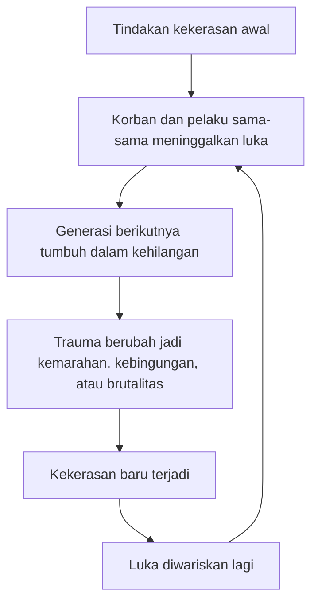

## 🔥 Pendahuluan: Mengapa *Blood Meridian* Sering Disebut Buku Paling Mengerikan yang Pernah Ditulis?

Ada novel yang membuat pembacanya ngeri karena adegan-adegannya kejam. Ada novel yang mengejutkan karena tokoh-tokohnya brutal. Tetapi **Blood Meridian** karya **Cormac McCarthy** berdiri di tingkat yang lain. Ia memang kejam, memang brutal, memang dipenuhi pemandangan pembantaian yang sukar dilupakan. Namun kengeriannya tidak berhenti di sana. Justru di situlah ia mulai. 🔥

Yang membuat *Blood Meridian* benar-benar menghantui adalah bahwa kekerasan dalam novel ini **bukan hiasan**, bukan sekadar sensasi, bukan juga “shock value” *(nilai kejut murahan)*. Kekerasannya justru adalah pintu masuk menuju pertanyaan yang jauh lebih dalam:

- apa hakikat kekerasan itu sendiri?
- apakah kekerasan hanya tindakan manusia, atau justru tertanam dalam struktur dunia?
- apakah moralitas sungguh punya daya di dunia nyata, atau hanya dongeng yang kalah oleh kekuatan mentah?
- dan jika manusia memang punya secercah kebaikan, mengapa secercah itu begitu mudah kalah, terlambat, atau mandek di tengah jalan?

Novel ini sering dibaca sebagai western *(kisah perbatasan Amerika / koboi dan gurun)* yang sangat gelap. Tetapi sesungguhnya *Blood Meridian* lebih mirip:
- kitab anti-mitos Amerika,
- tragedi metafisik tentang kekerasan,
- meditasi tentang manusia dan dunia yang sama-sama buas,
- serta duel filosofis antara kemungkinan kecil kebaikan melawan daya tarik abadi kebrutalan.

Dalam artikel ini saya akan membahas *Blood Meridian* secara **sangat detail, mendalam, dan lengkap** dalam Bahasa Indonesia. Kita akan membedah:

- garis besar plotnya,
- bahasa McCarthy yang unik,
- perpaduan antara naturalisme dan mitos,
- unsur **gnostisisme** *(pandangan religius-filosofis yang memandang dunia material sebagai dunia yang rusak atau jatuh)*,
- filsafat **Judge Holden**,
- posisi **the Kid**,
- siklus kekerasan antar-generasi,
- dan secercah harapan kecil yang mungkin—atau mungkin tidak—masih tersisa.

---

<Callout type="important" title="Catatan penting">
Artikel ini mengandung spoiler besar untuk *Blood Meridian*. Namun novel ini memang lebih kuat dibaca sebagai pengalaman sastra-filosofis daripada sekadar kumpulan plot twist, jadi spoiler di sini tidak otomatis mengurangi kedalamannya.
</Callout>

---

## 📖 1. Plot Dasar *Blood Meridian*: Sebuah Pengembaraan ke Jantung Kekerasan

Novel ini dibuka dengan kalimat yang kini sudah legendaris: kita diperkenalkan pada seorang anak laki-laki tanpa nama, hanya disebut **the kid**. Ia lahir dari ibu yang meninggal dan ayah yang dingin serta lalai. Di usia sangat muda, ia meninggalkan rumah dan mulai mengembara melintasi wilayah perbatasan Amerika lama. 📖

Yang menarik, McCarthy tidak memberi motivasi heroik yang jelas. Kid tidak diberi narasi besar tentang takdir, misi, atau cita-cita. Ia hanya bergerak, bertahan, berkelahi, dan terlempar dari satu kekacauan ke kekacauan lain. Dari awal kita diberi kesan bahwa ia memang punya **taste for mindless violence** *(selera terhadap kekerasan tanpa arah)*. Jadi ia bukan pahlawan suci. Ia adalah bahan mentah manusia yang belum selesai.

Di awal pengembaraan, ia bertemu beberapa tokoh penting:

### Toadvine
Toadvine adalah salah satu sedikit figur yang punya kesinambungan relasional dengan Kid. Ia bukan “teman baik” dalam arti sentimental, tetapi kehadirannya memberi sedikit jangkar kemanusiaan di tengah dunia yang sangat liar.

### Judge Holden
Inilah pusat gravitasi novel. Judge Holden pertama kali muncul ketika seorang pendeta sedang berkhotbah di sebuah tenda. Judge masuk, lalu menuduh sang pendeta melakukan kejahatan seksual terhadap anak-anak. Massa langsung marah, pendeta ditembak oleh jemaatnya sendiri, dan belakangan Judge dengan santai mengaku bahwa ia bahkan tidak pernah mengenal pendeta itu sebelumnya. Ia mengarang semuanya di tempat.

Adegan ini sangat penting, karena dari awal McCarthy sudah memperlihatkan kekuatan khas sang Judge:
- ia tidak perlu senjata untuk menciptakan kematian,
- ia cukup perlu kata-kata.

Kid kemudian masuk ke dalam milisi seadanya yang mau bertarung melawan Meksiko, tetapi pasukan ini cepat hancur. Ia lalu ditangkap tentara Meksiko, dipenjara, dan di sanalah ia kembali bertemu Toadvine.

Lalu datanglah **Glanton gang**—geng pemburu kulit kepala yang dipimpin **John Joel Glanton**, dengan Judge Holden berada di sisinya. Mereka merekrut Kid keluar dari penjara, dan sejak titik inilah novel masuk ke inti sesungguhnya: pengembaraan pembantaian yang menjadikan gurun, kamp, kota, gereja, dan feri sebagai panggung bagi kekerasan nyaris tanpa batas. 

Glanton gang mengumpulkan bounty *(imbalan uang)* untuk kulit kepala, mula-mula dengan dalih memburu musuh dan penjahat. Tetapi hampir segera jelas bahwa dalih itu hanyalah tipis sekali. Mereka membunuh siapa saja:
- laki-laki,
- perempuan,
- anak-anak,
- orang tak bersalah,
- suku asli,
- siapa pun yang tubuhnya bisa diubah menjadi bukti pembayaran.

Mereka disambut sebagai pahlawan oleh sebagian masyarakat, lalu merusak kota yang menyambut mereka. Mereka menumpuk uang, senjata, emas, gigi, dan kekacauan. Akhirnya mereka sendiri mulai hancur oleh arogansi, kelelahan, dan balasan dari dunia yang telah mereka koyak. 

Setelah geng ini runtuh, Kid tetap hidup lebih lama daripada kebanyakan anggota lain. Ia bertahan, dipisahkan dari kelompok, mengejar sisa hidup yang tampak lebih tenang, tetapi bayang-bayang Judge Holden tidak pernah sungguh hilang. Di akhir novel, ketika Kid sudah menjadi pria dewasa, Judge kembali muncul—seolah waktu tidak mengubahnya sedikit pun—dan penutupan mereka menjadi salah satu ending paling mengerikan dan paling ambigu dalam sastra modern.

---

## 🌌 2. Ini Bukan Cuma Plot: *Blood Meridian* Disatukan oleh Tema, Bukan Alur Rapi

Banyak pembaca pertama kali merasa *Blood Meridian* sulit karena alurnya tidak tersusun seperti novel tiga babak modern yang rapi. Tidak ada struktur “mulai-naik-klimaks-selesai” yang nyaman. Adegan-adegannya kadang terasa episodik: geng berpindah dari satu tempat ke tempat lain, membunuh, beristirahat, berbicara, lalu bergerak lagi. 🌌

Tetapi justru di situlah kekuatannya. Novel ini bukan terutama dibangun untuk memuaskan rasa ingin tahu “apa yang terjadi selanjutnya?” Novel ini dibangun untuk menanamkan satu atmosfer dan satu medan tema yang makin lama makin menebal.

Jadi, *Blood Meridian* lebih tepat dipahami sebagai:

> **novel yang bergerak seperti litani kekerasan, ritual, dan pengujian jiwa, bukan seperti thriller plot-driven biasa.**

Setiap adegan bukan hanya peristiwa, tetapi variasi atas pertanyaan yang sama:
- apa yang terjadi ketika manusia hidup di dunia yang tampak tidak dipimpin moralitas?
- apa yang terjadi ketika kekerasan jadi bahasa paling efektif?
- apa yang tersisa dari manusia kalau perang menjadi ukuran tertinggi segala sesuatu?

---

## ✒️ 3. Bahasa McCarthy: Di Antara Bedah Anatomi dan Kitab Mitos

Salah satu hal pertama yang membuat *Blood Meridian* sulit tetapi menakjubkan adalah bahasanya. McCarthy menulis dengan dua gaya yang tampaknya bertentangan tetapi justru saling menguatkan. ✒️

### A. Gaya naturalistik, dingin, nyaris klinis
McCarthy sering mendeskripsikan tubuh, luka, tulang, darah, sinyu, gigi, rahang, dan benda-benda dengan ketelitian hampir seperti ahli bedah. Ia nyaris tidak memberi kita akses ke dunia batin tokoh-tokohnya. Kita jarang tahu isi pikiran Kid secara eksplisit. Kita melihat tindakan, bukan pengakuan batin.

Ini membuat kekerasan terasa tidak diberi bantalan emosional. Tidak ada romantisasi. Tidak ada efek dramatis yang terlalu manis. Ketika mayat dijelaskan, ia dijelaskan sebagai benda biologis yang rusak. Justru karena itu, pembaca tidak bisa melarikan diri ke estetika yang nyaman. 

### B. Gaya mitis, skriptural, hampir alkitabiah
Di saat bersamaan, McCarthy juga menulis seperti nabi gurun, penyair kitab suci, atau pembuat legenda. Gunung dibandingkan dengan punggung binatang laut purba. Gurun menjadi altar. Angin menjadi roh. Manusia menjadi peziarah, akolit, iblis, jin, atau penunggang dari dunia purba.

Jadi kita punya tegangan yang sangat menarik:
- satu sisi sangat material, sangat tubuh, sangat tanah, sangat darah;
- sisi lain sangat mitis, sangat kosmis, sangat sakral atau anti-sakral.

Inilah salah satu kunci novel ini. McCarthy membuat dunia tampak sekaligus:
- brutal secara fisik,
- dan penuh makna simbolik yang menyeramkan.

Ia membuat pembaca merasa bahwa pembantaian yang kita lihat bukan hanya peristiwa sejarah lokal, tetapi juga semacam **mitos gelap tentang manusia itu sendiri.**

---

## 🏜️ 4. Bahasa Material dan Bahasa Mitos: Mengapa Ketegangan Ini Penting?

Kalau McCarthy hanya menulis dengan bahasa mitis, *Blood Meridian* mungkin akan terasa terlalu alegoris, terlalu jauh, terlalu mudah dirasionalisasi sebagai dongeng. Sebaliknya, kalau ia hanya menulis dengan bahasa naturalistik, novel ini mungkin hanya terasa seperti kronik kebrutalan sejarah. 🏜️

Tetapi dengan menggabungkan keduanya, ia mendapatkan dua efek sekaligus:

### Efek pertama: grounding *(membumikan)*
Naturalismenya membuat kita sadar bahwa kekerasan ini mungkin fiktif secara detail, tetapi sangat dekat dengan kenyataan sejarah. Ini bukan kekerasan fantasi. Ini kekerasan yang bisa benar-benar terjadi.

### Efek kedua: universalizing *(menggeneralisasi secara filosofis)*
Bahasa mitisnya mengangkat kejadian-kejadian ini dari sekadar “perbatasan Amerika abad ke-19” menjadi sesuatu yang mewakili pola lebih besar dalam sejarah manusia.

Karena itu Kid dibiarkan tanpa nama jelas. Ia tidak sepenuhnya jadi individu spesifik dengan psikologi rinci. Ini membuatnya terasa seperti:
- seorang anak tertentu,
- tetapi juga siapa saja,
- atau bahkan “manusia” dalam bentuk paling muda dan paling mentah.

Dengan cara ini, *Blood Meridian* menjadi sekaligus kisah sejarah dan mitos filsafat.

---

## ⛓️ 5. Dunia yang Bermusuhan: Membaca *Blood Meridian* lewat Kacamata Gnostik

Salah satu pembacaan paling subur terhadap novel ini adalah lewat lensa **gnostisisme** *(gnosticism / aliran-aliran keagamaan-filosofis awal yang sering memandang dunia material sebagai ciptaan yang cacat, jatuh, atau dikuasai kekuatan lebih rendah daripada Tuhan tertinggi)*. ⛓️

Gambaran sederhananya begini:
- dalam banyak bentuk Kristen arus utama, dunia diciptakan baik tetapi rusak karena dosa;
- dalam banyak bentuk gnostik, dunia material sejak awal memang bermasalah, bahkan mungkin dibuat oleh kekuatan lebih rendah dan bukan Tuhan tertinggi yang sungguh baik.

Kalau dibaca lewat kacamata ini, *Blood Meridian* terasa seperti novel tentang dunia yang memang **secara mendasar tidak ramah**. Bukan hanya manusia yang jahat; gurun, badai, panas, kelaparan, arah, ruang, dan waktu semuanya tampak memusuhi manusia.

McCarthy berkali-kali menggambarkan fenomena alam bukan sebagai kejadian netral, tetapi hampir seperti tindakan sadar yang jahat atau setidaknya kejam. Tornado digambarkan seperti jin mabuk. Bentang alam seperti punggung monster laut. Matahari bukan sumber kehangatan ilahi, tetapi warna urin dan darah. 

Ini penting. Dalam banyak karya besar, alam menjadi penyeimbang terhadap korupsi manusia. Dalam *Blood Meridian*, itu tidak terjadi. Alam tidak menyelamatkan. Alam tidak memurnikan. Alam justru sering tampak sejalan dengan penghancuran.

Jadi, manusia dalam novel ini tidak berdiri melawan alam baik yang ternoda. Ia hidup **di dalam dunia yang sendiri tampak terkutuk.**

---

## 🌞 6. Korupsi Simbol Matahari dan Dunia: Tidak Ada Kosmos yang Menghibur

Banyak tradisi filsafat dan agama memandang matahari sebagai simbol:
- kebenaran,
- kehidupan,
- pencerahan,
- kebaikan,
- atau keteraturan.

McCarthy justru membalik semuanya. Ia menyelimuti dunia dengan warna senja darah, langit kuning busuk, cahaya yang terasa menghukum, dan panas yang mengeringkan hidup. Bahkan judul **Blood Meridian** sendiri sudah menyatukan dua hal:
- cakrawala / matahari / arah dunia,
- dan darah. 🌞

Dengan kata lain, dunia di novel ini bukan panggung netral tempat kekerasan manusia terjadi. Dunia sendiri terasa seperti altar besar tempat darah sudah lama menjadi hukum tersembunyi.

Ini membuat novel ini jauh lebih mengerikan, karena tak ada pelarian mudah ke romantisisme alam. Gurun bukan ruang penyembuhan. Ia adalah saksi, kendaraan, dan kadang kaki tangan dari kekerasan.

---

## ⚔️ 7. Judge Holden: Bukan Sekadar Tokoh Jahat, tetapi Filsafat yang Menjadi Daging

Kalau ada satu alasan mengapa *Blood Meridian* terus dibicarakan, itu adalah **Judge Holden**. Ia salah satu figur paling menakutkan dalam sastra bukan hanya karena apa yang ia lakukan, tetapi karena apa yang ia **wakili**. ⚔️

Secara fisik ia sudah mengganggu:
- besar sekali,
- botak dan tanpa rambut tubuh,
- hampir tak berubah dimakan usia,
- cerdas luar biasa,
- multibahasa,
- karismatik,
- dan terasa seperti tidak sepenuhnya manusia.

Tetapi daya seram sejatinya terletak pada kombinasi unik ini:

1. **ia bisa membunuh dengan kata-kata sebelum membunuh dengan tangan**;
2. **ia memikat dan membentuk nilai orang lain**;
3. **ia tampak nyaman total di tengah kekacauan**;
4. **ia selalu tampil seperti personifikasi suatu prinsip, bukan sekadar orang.**

Judge adalah figur yang membuat pembaca ragu-ragu:
- apakah ia manusia biasa?
- iblis?
- archon gnostik?
- demiurge palsu?
- simbol perang?
- atau sekadar manusia yang begitu total menjadi dirinya hingga tampak metafisik?

Menurut saya, pembacaan simbolik paling kuat adalah ini:

> **Judge Holden adalah penjelmaan dari nilai-nilai yang ia khotbahkan: perang, dominasi, penaklukan, dan kekuasaan yang memutuskan makna dunia lewat force.**

---

## 🗣️ 8. Filsafat Judge Holden: “War Is God”

Di sekitar api unggun, Judge menyampaikan salah satu khotbah paling penting dalam novel. Di sinilah ia mengatakan hal yang kini sangat terkenal:

> **War is God.**

Kalimat ini sering dipahami terlalu cepat sebagai nihilisme sederhana—seolah Judge hanya berkata bahwa semua hal sia-sia, jadi bunuh-membunuh saja. Padahal posisinya lebih spesifik dan lebih berbahaya. 🗣️

Judge tidak sekadar bilang bahwa tidak ada nilai. Ia justru bilang ada satu nilai tertinggi: **war** *(perang / benturan kehendak / dominasi mutlak).* 

Tetapi “war” baginya lebih luas daripada perang antarnegara. War adalah:
- benturan kehendak,
- perebutan dominasi,
- proses seleksi nilai lewat kekuatan,
- cara dunia memutuskan siapa yang berhak menentukan realitas.

Dalam kerangka Judge:
- moralitas hanyalah cerita lemah,
- kebaikan tanpa kekuatan tidak punya daya kausal,
- nilai yang sungguh nyata adalah nilai yang bisa menaklukkan,
- dan perang adalah bentuk paling jujur dari metafisika dunia.

Jadi ketika Judge berkata “war is god,” ia bukan sedang bercanda gelap. Ia sedang menyusun teologi tandingan. Dalam teologi ini, yang ilahi bukan kasih, bukan kebenaran, bukan keadilan, tetapi **penentuan melalui kekuatan.**

Itu sebabnya ia begitu tenang. Karena apa pun yang terjadi—selama konflik terus berjalan—dunianya tetap benar.

---

## 🪙 9. Nilai Palsu dan Pembuat Uang Palsu: Judge sebagai Pemalsu Moralitas

Salah satu simbol paling kaya dalam novel adalah mimpi Kid tentang pembuat uang palsu. Dalam mimpi itu, ada seseorang yang mencetak mata uang palsu agar bisa beredar di pasar manusia. McCarthy lalu memberi petunjuk bahwa ini berkaitan dengan Judge. 🪙

Maknanya menurut saya sangat penting:

> Judge adalah pemalsu nilai.

Ia menawarkan jawaban yang tampak kuat terhadap pertanyaan “bagaimana seharusnya manusia hidup?” Ia memberi jawaban yang:
- gemerlap,
- memikat,
- terasa realistis,
- dan didukung fakta bahwa kekerasan memang sering menang secara kasat mata.

Tetapi pada akhirnya nilai-nilai itu palsu karena:
- menghancurkan pemiliknya sendiri,
- menyedot jiwa orang yang mengikutinya,
- dan tidak bisa memberi bentuk hidup yang benar-benar utuh selain dominasi dan kematian.

Itulah sebabnya Judge sejak awal memperlihatkan kekuatan berbahasa. Ia tidak selalu memerintah dengan pukulan. Ia menaklukkan lewat interpretasi. Ia mengajari orang lain untuk melihat dunia menurut ukuran-ukurannya.

Ini membuatnya lebih berbahaya daripada sekadar pembunuh. Ia adalah **arsitek evaluasi moral**.

---

## 🐎 10. Glanton Gang: Dari Pemburu Bayaran Menjadi Acolytes Kekerasan

Pada awalnya, Glanton gang masih bisa dibaca secara “rasional”: mereka tentara bayaran yang memburu kulit kepala demi uang. Itu sudah mengerikan, tetapi setidaknya masih punya bentuk alat-tujuan. Mereka membunuh untuk upah. 🐎

Namun seiring waktu, mereka berubah. Mereka menumpuk kekayaan sangat besar, tetapi Glanton sendiri tampak makin tidak peduli pada uang. Mereka mulai membunuh hanya karena bisa, mulai mencari konflik yang tak perlu, mulai memuja sensasi dominasi itu sendiri.

Di sinilah kita melihat efek penuh dari nilai Judge. Mereka tidak lagi sekadar memakai kekerasan sebagai sarana. Mereka telah menjadi **penyembah kekerasan sebagai cara hidup**.

Bahkan ketika beberapa anggota mencoba mengutip kitab suci atau menggerutu pada ucapan Judge, sang Judge tidak terganggu. Mengapa? Karena ia tahu tindakan mereka sudah lebih jujur daripada kata-kata mereka. Mereka sudah hidup menurut metriknya. Mereka mungkin masih punya sisa keberatan verbal, tetapi kehendak mereka sudah diarahkan ulang.

Ini penting sekali. Judge tidak perlu semua orang sepakat secara teori. Ia hanya butuh mereka hidup menurut logikanya. Dan mereka melakukannya.

---

## 🧑 11. The Kid: Bukan Orang Baik, Tapi Tidak Sepenuhnya Milik Judge

Kid adalah tokoh yang sangat sulit, dan justru karena itu ia sangat menarik. Ia bukan orang suci. Dari awal ia sudah punya afinitas terhadap kekerasan. Ia bergabung dengan geng. Ia ikut serta dalam banyak hal buruk. Ia bukan oposisi moral murni terhadap Judge. 🧑

Tetapi ia punya sesuatu yang oleh Judge sendiri diakui: **some corner of clemency** *(sudut kecil belas kasih)*.

Kid tidak pernah total. Ia tidak pernah benar-benar menyatu dengan nilai Judge. Ini terlihat dalam momen-momen kecil:
- ia membantu Brown mencabut panah, walau berbahaya bagi dirinya;
- ia gagal menembak rekan yang terluka saat anggota lain membunuh yang lemah agar tak merepotkan;
- ia beberapa kali tampak lebih pasif daripada antusias dalam kekejaman geng;
- dan saat punya kesempatan membunuh Judge, ia justru menahan diri.

Ini membuat Kid sangat penting secara simbolik. Ia adalah manusia yang:
- tidak sepenuhnya jahat,
- tetapi juga tidak cukup baik;
- tidak menyerahkan diri total pada kekerasan,
- tetapi juga tidak punya komitmen penuh pada kebaikan.

Jadi ia menjadi semacam figur ambang. Di dalam dirinya ada kemungkinan untuk lepas dari Judge, tetapi kemungkinan itu tidak pernah benar-benar menjadi api besar. Ia tetap hanya spark *(percik)*.

---

## 🌳 12. Pohon Menyala: Momen Musa, Potensi, dan Panggilan yang Tidak Tuntas

Ada satu adegan penting ketika Kid melihat pohon terbakar di gurun, yang jelas mengingatkan pada kisah Musa dan semak terbakar. Ini sangat simbolik. 🌳

Pembacaan saya: ini adalah momen di mana novel menandai Kid sebagai figur **potensi**. Ia mungkin tidak suci, tetapi ia punya kemungkinan untuk menjadi seseorang yang menolak nilai Judge. Ia mungkin bisa memutus rantai itu, atau minimal tidak mewariskannya sepenuhnya.

Tetapi potensi bukan aktualisasi. Dan inilah tragedi Kid. Ia tidak sepenuhnya jatuh seperti anggota geng lain, tetapi juga tidak pernah benar-benar bangkit menjadi penolak aktif kekerasan.

Jadi, kalau kita membaca *Blood Meridian* sebagai tragedi gnostik atau tragedi moral, Kid bukan pahlawan yang jatuh dari kesempurnaan. Ia adalah **kemungkinan baik yang gagal menjadi bentuk hidup utuh.**

---

## 🩸 13. Akhir Kid: Apakah Judge Menang Total?

Akhir *Blood Meridian* sengaja kabur. Setelah bertahun-tahun, Kid yang kini dewasa bertemu lagi dengan Judge di sebuah saloon. Judge mengundangnya kembali ke “the dance” *(tarian / permainan / takdir konflik dan kekerasan)*. Kid lalu berhubungan dengan seorang pelacur, keluar, dan masuk ke outhouse tempat Judge menunggunya telanjang. Setelah itu, kita tidak diberi deskripsi langsung. Hanya orang-orang yang kemudian melihat isi ruangan itu menjadi ngeri. 🩸

Ada beberapa pembacaan besar di sini:

### Pembacaan literal
Judge membunuh Kid secara fisik dengan cara yang mengerikan.

### Pembacaan simbolik ekstrem
Judge tidak hanya membunuh tubuhnya, tetapi menelan atau menyerapnya ke dalam prinsipnya sendiri.

### Pembacaan lain yang lebih gelap
Bahkan mungkin Kid sendiri telah jatuh lebih jauh dari yang kita sadari, misalnya terkait gadis kecil yang hilang, sehingga kemenangan Judge adalah total bukan hanya secara fisik tetapi moral.

Menurut saya, kekuatan ending ini justru terletak pada ambiguitasnya. Kita dipaksa menilai sendiri: 

- apakah Kid berhasil menyelamatkan inti dirinya namun kalah di tubuh?
- atau ia gagal total?
- apakah penolakannya pada Judge cukup berarti meski terlambat?
- atau justru sikap setengah-setengah itulah sumber kejatuhannya?

Yang pasti, McCarthy tidak memberi kita katarsis. Judge menari di akhir dan berkata ia tak akan pernah mati. Itu bukan kemenangan plot biasa. Itu pernyataan bahwa nilai yang ia wakili akan terus muncul dalam sejarah manusia.

---

## 🔁 14. Siklus Kekerasan: Darah Tidak Pernah Berhenti di Satu Generasi

Salah satu tema paling mengerikan dalam novel ini adalah **cycle of violence** *(siklus kekerasan)*. McCarthy tidak hanya menunjukkan pembalasan langsung, tetapi juga bagaimana satu tindakan brutal menanam luka ke generasi berikutnya. 🔁

Kisah Judge tentang pembuat harness dan musafir yang dibunuh di hutan sangat penting. Dari sana, kita melihat:
- pembunuh melahirkan generasi rusak,
- korban juga melahirkan generasi rusak,
- dan kedua garis keturunan akhirnya sama-sama bergerak ke arah kekerasan.

Tidak ada satu pihak yang benar-benar “bersih” sesudah trauma itu lewat cukup lama. Semua terhisap ke dalam lingkaran.

Kid sendiri, saat dewasa, menembak seorang remaja di dekat api unggun. Remaja itu punya adik kecil yang kini yatim. Dengan satu tindakan, Kid mewariskan kembali luka yang sama ke generasi baru. 

Inilah salah satu bagian paling menyedihkan dari novel ini:

> **kekerasan tidak hanya menghancurkan yang hadir sekarang. Ia mengatur watak orang-orang yang bahkan belum cukup hidup untuk memahami apa yang sedang diwariskan kepada mereka.**

---

---

## 🪵 15. Hermit di Gurun: Manusia sebagai Mesin Kejahatan yang Berjalan Sendiri

Kid bertemu seorang pertapa di gurun yang berkata kira-kira bahwa hati manusia lebih baik tidak dilihat terlalu dekat. Manusia adalah makhluk yang bisa membuat mesin dan mesin untuk membuat mesin—suatu kejahatan yang bisa berjalan sendiri seribu tahun tanpa harus dirawat. 🪵

Ini salah satu gagasan paling tajam dalam novel. Kejahatan manusia bukan hanya tindakan impulsif sesaat. Ia bisa menjadi:
- sistem,
- kebiasaan,
- institusi,
- warisan budaya,
- dan teknologi reproduksi sosial.

Dengan kata lain, kekerasan bisa menjadi otomatis. Ia bisa menjadi kebiasaan sejarah. Dan inilah yang membuat dunia Judge begitu menakutkan: ia tidak perlu hadir di setiap tempat secara fisik. Cukup sekali nilai-nilainya menjadi sistem, maka mesin itu akan berjalan sendiri.

---

## ✨ 16. Apakah *Blood Meridian* Nihilistik? Tidak Sepenuhnya

Banyak orang menyebut novel ini nihilistik, dan saya mengerti mengapa. Dunia terasa rusak. Moralitas tampak tak berdaya. Institusi agama gagal melindungi tubuh dan jiwa. Kebaikan sering kecil, terlambat, dan tenggelam oleh kebiadaban. ✨

Tetapi menurut saya, novel ini berhenti sedikit sebelum nihilisme total. Mengapa?

Karena selalu ada petunjuk bahwa:
- secercah belas kasih itu ada,
- manusia tidak sepenuhnya menyatu dengan kebiadabannya,
- dan walau kecil, ada kemungkinan untuk mengetahui hati sendiri dan memutus siklus.

Masalahnya, kemungkinan itu hampir selalu gagal diwujudkan sepenuhnya. Di sinilah novel ini menjadi lebih tragis daripada nihilistik. Nihilisme berkata: tidak ada yang berarti. 

*Blood Meridian* tampaknya berkata:

> **ada sesuatu yang berarti, tetapi manusia hampir selalu terlalu lemah, terlalu lambat, terlalu setengah hati untuk hidup sesuai dengannya.**

Ini jauh lebih menyakitkan.

---

## 🔥 17. Epilog: Lubang-Lubang di Tanah, Api dari Batu, dan Percik yang Masih Ada

Epilog *Blood Meridian* terkenal sangat misterius. Kita melihat sosok yang membuat lubang-lubang bundar sempurna di tanah, menyalakan api di dalamnya, dan bergerak terus, sementara yang lain menyaksikan dari kejauhan. 🔥

Banyak pembacaan mungkin, tetapi secara simbolik saya melihat epilog ini menegaskan dua hal sekaligus:

### 1. Urutan, pengulangan, siklus
Setiap lubang mengikuti lubang sebelumnya. Ada kontinuitas. Ada sequence and causality *(urutan dan sebab-akibat)*. Seolah sejarah memang bergerak dalam pola-pola tertentu.

### 2. Api dari batu
Di dalam tanah yang sunyi dan dunia yang keras, masih ada percikan yang bisa dinyalakan. Ini sangat cocok dengan pembacaan gnostik tentang **divine spark** *(percik ilahi)*.

Jadi, meski novel ini begitu kelam, epilognya tidak sepenuhnya menutup kemungkinan bahwa percik itu masih ada. Bukan sebagai jaminan kemenangan, tetapi sebagai kemungkinan yang belum punah.

---

## 🛣️ 18. Mengapa *The Road* Membantu Membaca *Blood Meridian*

Dalam transkrip, ada hubungan menarik dengan novel McCarthy lain, **The Road**. Saya kira ini penting. Di *The Road*, dunia bahkan lebih hancur secara kasat mata. Tetapi di sana, sang boy justru berhasil menjaga api belas kasih dengan jauh lebih utuh daripada Kid di *Blood Meridian*. 🛣️

Kalau Kid adalah potensi yang goyah, maka boy dalam *The Road* adalah potensi yang berhasil bertahan. Dengan membandingkan keduanya, kita bisa melihat bahwa McCarthy tidak selalu percaya manusia pasti kalah. Ia lebih tampak percaya bahwa:

- sering kali manusia kalah,
- sering kali siklus kekerasan menang,
- tetapi tetap ada kemungkinan kecil bahwa “the fire” *(api batin / kebaikan)* dibawa terus oleh seseorang.

Maka *Blood Meridian* bisa dibaca bukan sebagai penutupan harapan, tetapi sebagai taraf gelap dari pertanyaan yang kelak dijawab agak lebih terang di *The Road*.

---

## 📚 19. Mengapa Kita Harus Membaca *Blood Meridian*, Bukan Hanya Mendengarnya Dirangkum?

Novel ini hampir mustahil benar-benar “dipindahkan” ke video atau ringkasan. Sebab pengaruhnya tidak hanya terletak pada apa yang terjadi, tetapi **bagaimana McCarthy memaksa kita merasakan** jarak pendek antara:
- tubuh dan metafisika,
- sejarah dan mitos,
- kekejaman dan bahasa,
- harapan dan kebusukan. 📚

Kita semua tahu secara abstrak bahwa dunia mengandung penderitaan. Tetapi *Blood Meridian* tidak membiarkan pengetahuan itu tetap abstrak. Ia menyeret pembaca ke titik di mana pertanyaan lama menjadi mendesak kembali:

- apa yang harus dilakukan terhadap kekejaman?
- bagaimana menafsirkan dunia yang tampak tak memihak kebaikan?
- apa arti belas kasih kalau dunia terus memuliakan kekuatan?
- apakah cukup hanya tidak ikut jahat, atau manusia dituntut untuk secara aktif memilih yang baik?

Buku ini penting bukan karena memberi jawaban final. Justru karena ia membuat pertanyaan-pertanyaan itu mustahil dihindari.

---

## 🕯️ 20. Kesimpulan: Apa Inti Terdalam *Blood Meridian*?

Pada akhirnya, *Blood Meridian* adalah novel tentang kekerasan, tetapi bukan hanya tentang adegan kekerasan. Ia adalah novel tentang:
- daya tarik metafisik dari dominasi,
- dunia yang tampak tidak melindungi kebaikan,
- manusia yang lahir dengan benih kebrutalan,
- dan kemungkinan kecil bahwa sesuatu yang lebih tinggi dari semua itu masih menyala sebagai percik. 🕯️

Judge Holden adalah perwujudan suara yang berkata:
- kekuatan adalah hukum,
- perang adalah kebenaran,
- moralitas tidak punya daya,
- dan manusia paling jujur ketika menaklukkan.

Kid adalah jawaban yang tidak selesai terhadap suara itu:
- ia tidak sepenuhnya percaya,
- tetapi juga tidak cukup kuat menolak.

Karena itu tragedinya begitu kuat. Ia bukan orang jahat murni, tetapi juga bukan penebus. Ia adalah cermin manusia yang sering tahu sesuatu salah, tetapi terlalu setengah hati untuk benar-benar meninggalkannya.

Kalau harus diringkas dalam satu kalimat, mungkin inti *Blood Meridian* adalah ini:

> **dunia bisa tampak berdiri di pihak kekerasan, dan manusia bisa sangat mudah menjadi muridnya, tetapi selama masih ada satu percik kecil yang menolak total menjadi milik kebiadaban, maka kisah manusia belum sepenuhnya ditutup.**

Itulah sebabnya novel ini begitu menakutkan dan begitu agung sekaligus. Ia memaksa kita menatap keburukan dunia dan diri sendiri tanpa ilusi—namun tetap menyisakan kemungkinan kecil, hampir menyakitkan, bahwa percik itu belum mati. ✨

---

<Callout type="quote" title="Inti besar Blood Meridian">
Kengerian terbesar Blood Meridian bukan bahwa manusia bisa sangat kejam, melainkan bahwa dunia itu sendiri tampak begitu sering memberi ruang, bahasa, dan kemenangan kepada kekejaman itu—sementara kebaikan hanya hadir sebagai percik kecil yang nyaris selalu terlambat.
</Callout>

<Callout type="cite" title="Sumber">
- Video sumber: *The Most Terrifying Book Ever Written | Blood Meridian*
- Karya utama: *Blood Meridian* karya Cormac McCarthy
- Fokus artikel ini: plot dasar, bahasa McCarthy, pembacaan gnostik, filsafat Judge Holden, perjalanan the Kid, siklus kekerasan, dan makna filosofis novel.
</Callout>
