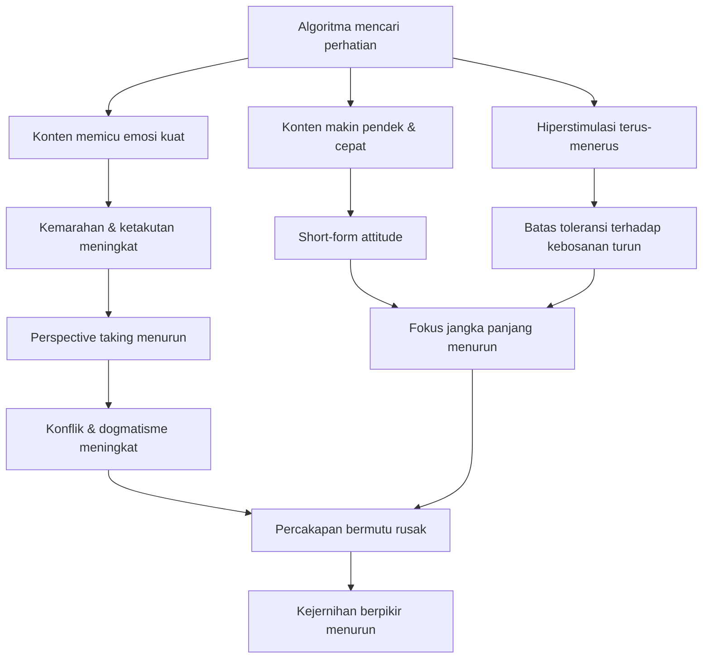
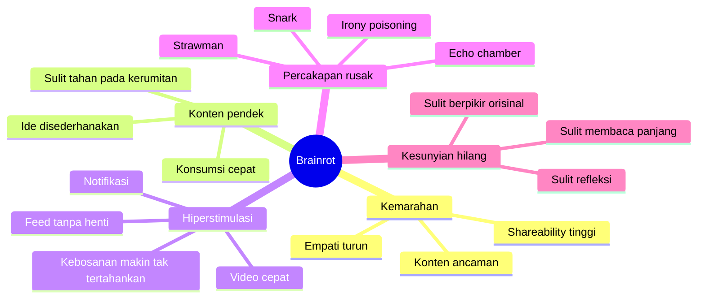

## 🧠 Pendahuluan: Mengapa Internet yang Memberi Kita Lebih Banyak Informasi Justru Bisa Membuat Kita Berpikir Lebih Buruk?

Kita hidup di zaman yang secara teknis luar biasa. Dalam hitungan detik, kita bisa:
- membaca jurnal,
- menonton kuliah dari universitas top dunia,
- mencari arsip sejarah,
- berdiskusi dengan orang dari negara lain,
- dan mengakses lebih banyak pengetahuan daripada yang bisa dibayangkan nenek moyang kita. 🧠

Tetapi justru di tengah kelimpahan ini, banyak orang merasakan sesuatu yang aneh:

> **Mengapa rasanya internet tidak membuat kita lebih jernih, tetapi malah lebih kabur, lebih reaktif, lebih lelah, lebih dangkal, dan kadang lebih bodoh?**

Di titik inilah istilah **brainrot** *(secara harfiah: “otak busuk” / secara kultural: kondisi ketika kualitas perhatian, selera, fokus, dan kejernihan mental memburuk akibat konsumsi digital yang terus-menerus)* terasa relevan. Istilah ini memang lahir dari budaya internet dan sering dipakai secara bercanda. Tetapi di balik humornya, ada intuisi yang sangat serius: ada sesuatu pada cara internet modern bekerja yang **benar-benar mengganggu cara kita berpikir**.

Tentu, kita harus hati-hati. Dampak internet pada kognisi manusia sangat kompleks. Ia tidak seragam buruk. Ia tidak otomatis membuat semua orang rusak. Internet juga membawa manfaat yang luar biasa besar. Tetapi itu justru membuat diskusi ini penting: kita harus bisa membedakan **potensi besar** dari **mekanisme sehari-hari** yang diam-diam melemahkan kita.

Dalam artikel ini saya akan berargumen bahwa *brainrot* bukan cuma soal kebiasaan menonton meme aneh atau scroll konten absurd sampai malam. Yang lebih dalam, ia adalah hasil dari beberapa kekuatan yang saling mengikat:

- internet yang memberi insentif pada **kemarahan**,
- kebiasaan berpikir dengan **short-form attitude** *(sikap konten pendek / kebiasaan mengonsumsi ide secepat mungkin tanpa tinggal cukup lama di dalamnya)*,
- dunia digital yang **hiperstimulatif**,
- rusaknya kualitas **percakapan**, 
- dan hilangnya ruang **kesunyian mental** tempat pikiran yang baik biasanya tumbuh.

Dengan kata lain, *brainrot* bukan fenomena tunggal. Ia adalah simpul dari banyak hal yang bersama-sama mengikis:
- fokus,
- empati,
- ketahanan mental terhadap kebosanan,
- kemampuan membaca panjang,
- kemampuan berdialog jujur,
- dan kemampuan berpikir dengan jernih di tengah dunia yang berisik.

Kalau harus diringkas dalam satu kalimat, tesis artikel ini adalah:

> **brainrot adalah nama populer untuk kerusakan bertahap pada ekologi perhatian kita—kerusakan yang membuat kita makin sulit berpikir tenang, mendalam, dan utuh di bawah tekanan algoritma, kemarahan, kecepatan, dan hiperstimulasi internet modern.**

---

<Callout type="important" title="Tesis utama artikel ini">
Brainrot bukan sekadar lelucon internet, tetapi gejala nyata dari cara ekosistem digital modern membentuk pikiran: memancing kemarahan, memecah perhatian, menormalisasi konsumsi ide secara singkat dan dangkal, serta merusak keseimbangan antara kesunyian berpikir dan percakapan yang bermutu.
</Callout>

---

## 🔥 1. Buah dari Kemarahan: Mengapa Internet Sangat Suka Membuat Kita Marah?

Mari mulai dari satu fakta yang pahit tetapi sangat penting: **kemarahan itu laku**. 🔥

Di internet, ukuran sukses hampir selalu berkaitan dengan **perhatian**. Di YouTube, perhatian diukur lewat *watch time* *(lama tonton)*. Di media sosial, ia bisa muncul sebagai klik, view, like, share, komentar, retweet, atau bentuk keterlibatan lain. Apa pun metriknya, prasyaratnya sama:

> **sesuatu harus menangkap dan menahan perhatian kita.**

Lalu, apa cara tercepat menangkap perhatian manusia?

Jawabannya sering bukan kebenaran, bukan nuansa, bukan kebijaksanaan, melainkan **emosi yang intens**. Dan dari semua emosi itu, dua yang paling mudah menguasai perhatian adalah:
- **takut**,
- dan **marah**.

Kenapa begitu? Karena otak manusia sangat peka pada ancaman. Dari sudut pandang evolusi, ini sangat masuk akal. Kalau ada bahaya di semak-semak, kita tidak ingin tenang-terlalu-lama menimbang. Kita ingin fokus, waspada, siap bertindak. Jadi emosi negatif yang berkaitan dengan ancaman punya “hak istimewa” dalam sistem perhatian kita.

Masalahnya, internet modern memanfaatkan mekanisme itu secara besar-besaran. Algoritma dan produsen konten sama-sama didorong untuk menciptakan “harimau paling besar” di padang perhatian. Karena kalau konten saya tidak cukup mengganggu, cukup menjengkelkan, cukup mengejutkan, cukup memicu kemarahan atau kecemasan, maka ia akan kalah oleh konten lain yang lebih keras.

Jadi, bukan berarti semua orang di internet ingin membuat kita marah karena mereka jahat. Kadang struktur insentifnya saja yang membuat kemarahan menjadi strategi paling efisien.

---

## 🐅 2. “Harimau” Digital: Algoritma Membuat Ancaman Terasa Ada di Mana-Mana

Video sumber memakai analogi yang sangat kuat: bagi otak hewani kita, internet tampak seperti hamparan penuh *saber-tooth tiger* *(harimau bergigi pedang / ancaman purba)* yang semuanya berebut perhatian. 🐅

Setiap judul yang berteriak:
- “Kamu dibohongi!”
- “Orang-orang ini menghancurkan dunia!”
- “Kenapa generasi sekarang rusak!”
- “Fakta gila yang tidak ingin kamu tahu!”
- “Inilah alasan mereka takut kamu tahu ini!”

semua itu adalah versi digital dari isyarat ancaman. Dan otak kita bereaksi terhadap ancaman lebih cepat daripada terhadap pemikiran yang tenang.

Lebih parah lagi, sistem algoritmik tidak bekerja berdasarkan kebijaksanaan. Ia bekerja berdasarkan reaksi massa. Kalau banyak orang memberi perhatian pada konten marah, menakutkan, atau memecah belah, maka sistem akan menawarkannya kepada lebih banyak orang. Artinya, bahkan jika secara pribadi Anda cukup tenang dan tidak mudah terpancing, lingkungan pilihan yang disajikan pada Anda bisa tetap didominasi oleh hal-hal yang sudah lolos seleksi algoritmik sebagai “pemicu emosi paling efektif.”

Akibatnya, kita tidak hanya sesekali marah. Kita hidup dalam **ekologi perhatian yang tersusun dari stimulus-stimulus bermuatan kemarahan**.

---

## 😡 3. Mengapa Kemarahan Sangat Merusak Kejernihan Berpikir?

Di level pengalaman, kita semua tahu ini. Sulit berpikir jernih ketika sedang kesal. Sulit menilai adil ketika sedang marah. Sulit memahami orang lain ketika kita merasa mereka ancaman. 😡

Tetapi masalah ini tidak berhenti di intuisi. Penelitian juga mendukung bahwa kemarahan dapat menurunkan kemampuan **perspective taking** *(mengambil perspektif orang lain / mencoba melihat dunia dari sudut pandang lain)*.

Ini sangat penting, karena salah satu inti berpikir kritis justru kemampuan untuk bertanya:

- bagaimana mungkin orang yang masuk akal bisa tidak setuju dengan saya?
- apa struktur pengalaman dan alasan yang membuat posisi lawan tampak masuk akal dari tempat mereka berdiri?
- bagian mana dari argumen saya yang mungkin tidak saya lihat karena saya terlalu terikat pada sudut pandang sendiri?

Kemarahan merusak semua ini.

Saat marah, orang cenderung:
- menyederhanakan lawan,
- memperkeras batas “kami vs mereka,”
- kehilangan rasa ingin tahu,
- dan memperlakukan sudut pandang lain bukan sebagai sesuatu yang perlu dipahami, tetapi sebagai ancaman yang harus dikalahkan.

Secara evolusioner, ini mungkin berguna saat menghadapi predator. Kita tidak perlu berempati dengan harimau. Tapi dalam ruang publik, politik, moralitas, pendidikan, dan perdebatan gagasan, ini jadi bencana.

Maka jika internet terus menempatkan kita dalam mode marah, yang dirusak bukan cuma mood kita. Yang dirusak adalah **infrastruktur kognitif untuk berpikir adil**.

---

## 🔁 4. Spiral Setan: Marah Membuat Kita Kurang Paham, Kurang Paham Membuat Kita Makin Marah

Masalah kemarahan di internet bukan cuma efek satu arah. Ia sering bekerja sebagai **spiral**. 🔁

Urutannya kira-kira begini:

1. konten memancing kemarahan,
2. kemarahan menurunkan kemampuan memahami perspektif lain,
3. karena kurang paham, kita makin mudah menafsirkan orang lain secara buruk,
4. konflik meningkat,
5. kemarahan bertambah,
6. algoritma melihat interaksi tinggi,
7. konten serupa didorong lagi.

Akhirnya, dunia online menjadi semacam mesin produksi interpretasi bermusuhan.

Orang yang mungkin sebenarnya berbeda tipis dari kita jadi tampak seperti musuh eksistensial. Kritik kecil terasa seperti serangan identitas. Perbedaan tafsir berubah jadi perang moral. Dan semua itu berlangsung dengan rasa mendesak yang tidak sebanding dengan realitas konkret hidup sehari-hari.

Akibat akhirnya sangat buruk:
- kita jadi lebih dogmatis,
- lebih mudah *strawman* *(mengkarikaturkan posisi lawan menjadi lemah)*,
- lebih sedikit punya niat baik,
- dan makin jarang sungguh-sungguh belajar dari perbedaan.

---

## 📱 5. Masalah Kedua: *Short-Form Attitude*—Bukan Cuma Konten Pendek, Tapi Cara Pandang Pendek terhadap Ide

Sekarang masuk ke lapisan kedua: **konten pendek**. Tapi kita perlu hati-hati. Masalahnya bukan hanya TikTok, Shorts, Reels, atau potongan-potongan video cepat. Masalah yang lebih dalam adalah apa yang disebut video sebagai **short-form attitude** *(sikap konten pendek / mentalitas konsumsi ide serba cepat)*. 📱

Ini adalah kebiasaan batin yang menganggap bahwa:
- ide harus cepat dipahami,
- nilai suatu gagasan bergantung pada seberapa singkat ia bisa dikonsumsi,
- sesuatu yang butuh waktu terlalu lama terasa tidak layak,
- dan kesulitan adalah tanda kelemahan konten, bukan kedalaman materi.

Ini sangat berbahaya.

Karena banyak hal paling penting dalam hidup memang tidak bisa diperas menjadi bentuk sangat singkat tanpa kehilangan jiwanya. Misalnya:
- filsafat yang serius,
- sastra besar,
- teori ilmiah kompleks,
- sejarah yang tidak simplistik,
- konflik moral yang ambigu,
- atau pemahaman diri yang jujur.

Semua itu menuntut **durasi perhatian**. Mereka butuh kita tinggal di dalamnya, bukan sekadar lewat.

Ketika *short-form attitude* menjadi mode default, kita mulai membawa kebiasaan scroll ke semua bidang. Buku terasa lambat. Esai terasa “kebanyakan kata.” Film dua jam terasa seperti prestasi fokus. Bahkan percakapan manusia nyata terasa terlalu panjang jika tidak penuh stimulus.

Di sinilah brainrot menjadi serius: bukan hanya karena kita menonton konten pendek, tapi karena kita mulai menganggap **semua hal harus tunduk pada ritme konten pendek.**

---

## 📚 6. Fokus Bukan Sekadar Soal Produktivitas—Ia adalah Syarat Dasar untuk Berpikir, Mengingat, dan Menikmati Hidup

Salah satu kritik penting dalam video adalah bahwa kita terlalu sering membahas fokus hanya sebagai alat produktivitas. Seolah fokus penting hanya supaya kita kerja lebih banyak, belajar lebih cepat, atau menyelesaikan lebih banyak tugas. Padahal fokus jauh lebih mendasar daripada itu. 📚

Tanpa fokus yang stabil, kita kesulitan:
- mengikuti argumen panjang,
- mengingat apa yang baru saja dipelajari,
- membangun hubungan antar ide,
- merasakan kenikmatan dari proses berpikir itu sendiri,
- dan memasuki keadaan *flow* *(kondisi tenggelam secara penuh dalam aktivitas bermakna dan menantang)*.

Banyak pemikir besar bukan hebat semata karena IQ. Mereka hebat juga karena mampu:
- tinggal lama dalam satu masalah,
- menahan kebingungan cukup lama,
- membiarkan ide berkembang tanpa terus diganggu,
- dan menemukan kenikmatan dalam perhatian yang mendalam.

Ketika fokus hancur, bukan hanya kualitas pikir yang turun. **rasa hidup juga ikut mengecil**. Banyak kegiatan bermakna—membaca, menulis, berpikir, belajar, berdiskusi, berdoa, bermusik, berkarya—menjadi terasa kurang nikmat jika perhatian kita selalu pecah.

Jadi, brainrot bukan cuma masalah “kurang produktif.” Ia masalah **kehilangan akses ke bentuk pengalaman yang paling bernilai.**

---

## ⚡ 7. Dunia Hiperstimulatif: Ketika Kenormalan Mulai Terasa Terlalu Sepi, Terlalu Lambat, dan Terlalu Membosankan

Lapisan berikutnya adalah **hyperstimulation** *(hiperstimulasi / paparan rangsangan tinggi yang terus-menerus)*. ⚡

Internet tidak hanya marah. Ia juga terang, bergerak, cepat, dipotong-potong, diberi musik, diberi teks, diberi efek, diberi kejutan, diberi notifikasi, diberi ancaman sosial halus, diberi janji *reward* kecil setiap beberapa detik.

Jika ini terjadi terus-menerus, ada risiko besar: sistem perhatian kita mulai **terkalibrasi ulang**.

Artinya, hal-hal yang secara normal tenang dan berharga mulai terasa:
- kurang seru,
- kurang kuat,
- kurang cukup,
- atau “garing”.

Misalnya:
- membaca buku terasa datar dibanding video cepat yang terus berubah,
- percakapan santai terasa kalah dibanding stimulasi tanpa henti dari feed,
- jalan kaki tanpa ponsel terasa sepi secara menyiksa,
- bahkan menonton film utuh bisa terasa seperti latihan fokus yang berat.

Ini bahaya besar. Karena begitu kita terbiasa pada level stimulasi tinggi, kehidupan biasa bisa tampak “kurang hidup”, padahal justru di wilayah-wilayah tenang itulah biasanya kejernihan, kedalaman, dan refleksi tumbuh.

---

## 🧬 8. *Limbic Capitalism*: Internet Tidak Berdiri Sendiri, Ia Didukung Sistem Ekonomi yang Diuntungkan oleh Kecanduan Perhatian

Satu konsep penting yang dibahas video adalah **limbic capitalism** *(kapitalisme limbik / sistem ekonomi yang mencari untung dengan mengeksploitasi sistem dorongan, emosi, dan impuls otak manusia)*. 🧬

Gagasannya sederhana tetapi sangat kuat: banyak sektor ekonomi modern tidak sekadar menjual produk, tetapi menjual **penguasaan atas dorongan manusia**. Ini terjadi pada:
- makanan ultra-proses,
- judi,
- pornografi,
- narkotika,
- media,
- dan tentu saja platform digital.

Internet, terutama yang berbasis aplikasi dan algoritma, sangat cocok dengan model ini. Ia tidak perlu membuat kita overdosis seperti narkoba agar berbahaya. Ia bisa menjadi **racun lambat**.

Dampaknya bukan selalu akut, tetapi kumulatif:
- perhatian terpecah,
- tidur terganggu,
- refleksi menurun,
- relasi intim terganggu,
- kemampuan belajar memudar,
- kapasitas untuk tenggelam dalam aktivitas bermakna melemah.

Dan justru karena ia tidak selalu meledak secara spektakuler, banyak orang meremehkannya. Kita sering baru sadar ada masalah ketika:
- tidak bisa membaca lama lagi,
- tidak sanggup duduk dengan pikiran sendiri,
- percakapan nyata jadi terasa hambar,
- atau hidup mulai terasa hampa kalau tidak dibumbui stimulus digital.

---

## 🪓 9. Masalahnya Bukan Satu Teknologi Saja, Tapi Akumulasi Seluruh Stimulus yang Menyerbu Kita Setiap Hari

Salah satu poin sangat cerdas dari video ini adalah bahwa kita sering menilai teknologi secara terpisah. Kita bertanya:
- apakah TikTok buruk?
- apakah Instagram buruk?
- apakah YouTube buruk?
- apakah notifikasi buruk?

Padahal mungkin pertanyaan yang lebih tepat adalah:

> **apa yang terjadi ketika semua stimulus itu dikumpulkan sekaligus ke dalam satu hari hidup manusia?** 🪓

Karena kenyataannya hidup digital modern bukan terdiri dari satu aplikasi tunggal. Ia adalah tumpukan berlapis:
- notifikasi pesan,
- media sosial,
- email,
- video,
- musik,
- berita,
- iklan,
- feed yang tak habis,
- obrolan grup,
- rekomendasi algoritmik,
- konten kerja,
- dan konten hiburan.

Satu-satu mungkin tampak ringan. Tetapi secara total, mereka membentuk lanskap pengalaman yang **terpotong-potong**, *choppy* *(bergelombang patah / tersendat-sendat)*, dan sulit memberi ruang pada kontinuitas batin.

Akhirnya, pengalaman hidup kita tidak lagi terasa mengalir. Ia terasa seperti fragmen-fragmen pendek yang saling menyela. Dan pikiran yang baik sangat sulit tumbuh di dalam pengalaman yang selalu terpotong.

---

---

## 🗣️ 10. Percakapan Rusak: Mengapa Internet Membuat Kita Sulit Berdialog dengan Baik?

Video ini sangat tepat ketika menekankan bahwa internet mestinya menjadi tempat emas untuk percakapan lintas perspektif, tetapi dalam praktiknya sering justru menjadi mesin penghasil percakapan buruk. 🗣️

Secara teoritis, internet memungkinkan hal luar biasa:
- kita bisa bicara dengan orang jauh,
- bertanya ke pakar,
- menguji ide secara cepat,
- dan mengenal perspektif yang tak tersedia di lingkungan fisik kita.

Tetapi ada beberapa hal yang merusaknya:

### A. Kurangnya konteks manusiawi
Kita kehilangan ekspresi wajah, nada penuh nuansa, ritme tubuh, dan banyak isyarat yang dalam tatap muka menolong kita membaca niat orang.

### B. Anonimitas dan jarak membuat kekasaran lebih mudah
Orang jauh lebih berani merendahkan jika tidak harus melihat wajah lawan bicaranya.

### C. Insentif virality mendorong sinisme dan penghinaan
Kalimat pendek yang sarkastik lebih mudah viral daripada tanggapan panjang yang jujur dan telaten.

### D. Irony poisoning
Orang makin sulit bicara tulus karena ketulusan membuat mereka rentan ditertawakan. Maka mereka berlindung di balik ironi, meta-ironi, dan setengah-bercanda.

### E. Budaya “destroying with facts and logic”
Percakapan diperlakukan seperti arena tontonan, bukan ruang eksplorasi bersama.

Akhirnya, diskusi online sering terasa bukan seperti *Socratic symposium* *(perjamuan pemikiran Socratic / percakapan mendalam antar pikiran)*, tetapi seperti teater keras di mana semua orang ingin tepuk tangan dari kubunya sendiri.

Dalam situasi seperti itu, berpikir makin buruk karena tujuan diskusi bergeser: bukan lagi **mencari kebenaran**, melainkan **memenangi impresi**.

---

## 🧱 11. Echo Chamber Bukan Cuma Dibuat Algoritma—Sering Juga Kita Bangun Sendiri

Menariknya, video menekankan bahwa masalah *echo chamber* *(ruang gema / lingkungan yang terus mengulang keyakinan yang sama)* tidak selalu datang hanya dari algoritma. Sering kali manusianya sendiri yang membangunnya. 🧱

Alasannya sederhana: berbeda pendapat itu tidak enak. Apalagi kalau bentuknya kasar, sarkastik, dan memalukan seperti yang sering terjadi online. Maka wajar kalau kita mencari:
- orang yang sepakat,
- komunitas yang affirming *(menguatkan / membenarkan)*,
- dan ruang yang membuat kita merasa pintar dan aman.

Masalahnya, kalau terus terjadi, kita tidak lagi mendapat gesekan sehat dengan perspektif lain. Yang kita punya hanyalah:
- penguatan diri,
- tepuk tangan internal,
- dan lawan yang sudah dikecilkan menjadi karikatur.

Secara psikologis ini nyaman. Secara kognitif ini berbahaya.

Karena banyak ide kita sendiri baru tampak cacat ketika bertemu lawan bicara yang kuat, adil, dan tidak mudah disederhanakan. Tanpa itu, pikiran kita tumbuh dalam rumah kaca—hangat, aman, tapi rapuh.

---

## 🌲 12. Masalah Besar Lainnya: Internet Merusak Percakapan, tetapi Juga Merampas Kesunyian yang Diperlukan untuk Berpikir Sendiri

Ini salah satu bagian paling tajam dari video: internet merampas dua hal sekaligus, yaitu:
1. percakapan yang baik,
2. kesendirian yang subur untuk berpikir. 🌲

Padahal sejarah intelektual manusia selalu bergerak di antara dua kutub itu:
- dialog yang hidup dengan orang lain,
- dan solitude *(kesendirian yang tenang)* untuk mengolah pikiran sendiri.

Para pemikir besar sering butuh keduanya. Mereka perlu:
- diskusi yang menggugah,
- tetapi juga jalan sunyi,
- kamar hening,
- gunung,
- biara,
- perpustakaan,
- atau setidaknya blok waktu tanpa gangguan.

Internet modern membuat kita anehnya kehilangan keduanya. Kita tidak mendapat dialog bermutu penuh, tetapi kita juga jarang benar-benar sendiri. Bahkan saat sendirian, pikiran kita masih setengah hidup di ruang publik digital:
- “kalau ini saya posting gimana ya?”
- “orang bakal setuju nggak?”
- “ini bisa jadi konten nggak?”
- “ada notif baru nggak?”

Artinya, kita tidak betul-betul ditemani. Tetapi juga tidak betul-betul hening.

Dan itu kombinasi yang buruk sekali untuk tumbuhnya pikiran asli.

---

## 🕯️ 13. Kesendirian yang Hilang: Mengapa Kita Makin Sulit Betul-Betul Bersama Pikiran Kita Sendiri?

Ada perbedaan besar antara:
- tidak ada orang di sekitar kita,
- dan benar-benar merasa privat dalam pikiran kita. 🕯️

Banyak orang secara fisik sendirian, tetapi secara mental tetap hidup di bawah tatapan orang lain. Mereka membayangkan audiens, komentar, reaksi, penilaian. Ini membuat ruang batin sulit tenang.

Akibatnya, kita jadi sulit:
- membaca buku secara tenggelam,
- menulis tanpa membayangkan respons publik,
- berpikir tanpa tergesa-gesa mengubah ide menjadi konten,
- atau merasakan sesuatu tanpa langsung mengemasnya secara performatif.

Padahal pikiran yang orisinal sering butuh fase yang belum rapi, belum siap tayang, belum lucu, belum menjual, dan belum “brandable”. Kalau semua ide terlalu cepat masuk ke logika publikasi, ia belum sempat matang.

Jadi *brainrot* juga bisa dibaca sebagai rusaknya **infrastruktur privat dari berpikir**.

---

## 🪢 14. Ini Masalah “Knotty”: Semua Faktor Ini Saling Mengikat dan Memperparah Satu Sama Lain

Video menutup dengan ide yang sangat penting: semua masalah ini bukan berdiri sendiri. Mereka seperti simpul kusut yang saling menarik. 🪢

- Kemarahan membuat kita susah fokus dan susah memahami orang lain.
- Hiperstimulasi membuat kita makin sulit tahan pada hal-hal lambat.
- Konten pendek membentuk sikap pendek terhadap ide.
- Sikap pendek membuat percakapan panjang terasa melelahkan.
- Percakapan yang rusak mendorong konflik dan marah.
- Konflik yang marah makin menguntungkan algoritma.
- Dan semua itu mengurangi ruang hening untuk memulihkan diri.

Jadi, *brainrot* bukan satu gejala linear. Ia adalah **sistem yang saling memperkuat**.

Ini memang membuat masalah lebih besar. Tetapi sekaligus memberi sedikit harapan: kalau kita berhasil memperbaiki satu sisi—misalnya mengurangi marah, memulihkan fokus, atau menciptakan percakapan yang lebih baik—efeknya bisa merembet ke sisi lain.

---

---

## ⚖️ 15. Penting: Masalah Ini Bukan Semata “Karena Internet Jahat”, tetapi Juga Karena Internet Sangat Cocok dengan Kerentanan Psikologis Kita

Di bagian akhir, video membuat poin yang sangat penting dan sangat jujur: akar masalah ini bukan hanya ada “di luar”, pada internet dan platform. Sebagian akar juga ada **di dalam kita**. ⚖️

Mengapa internet begitu efektif memengaruhi kita?
Karena ia menumpang pada kecenderungan manusia yang sebenarnya wajar dan bahkan sering berguna:
- kita tertarik pada ancaman,
- kita mudah terpancing emosi kuat,
- kita suka hal cepat,
- kita suka *reward* kecil,
- kita suka validasi sosial,
- kita cenderung menghindari ketidaknyamanan intelektual,
- kita mudah mencari kelompok yang membenarkan diri kita.

Internet modern tidak menciptakan semua kecenderungan itu dari nol. Ia **mengeksploitasi** dan **menguatkannya**.

Itulah sebabnya masalah ini begitu sulit. Kita tidak sedang melawan musuh asing sepenuhnya. Kita sedang berhadapan dengan mesin yang sangat cerdas dalam memanfaatkan bagian diri kita yang paling mudah digerakkan.

Karena itu, solusi moralistik seperti “ya tinggal jangan malas aja” terlalu dangkal. Yang kita hadapi adalah pertempuran antara:
- kapasitas luhur kita untuk belajar dan berpikir,
- dan arsitektur teknologi yang dioptimalkan untuk memancing sisi paling impulsif dari psikologi kita.

---

## 🛠️ 16. Lalu, Apa yang Bisa Kita Lakukan?

Video ini memang bukan panduan langkah demi langkah yang terlalu teknis, tetapi dari seluruh argumennya kita bisa menarik beberapa arah praktis. 🛠️

### 1. Waspadai kemarahan sebagai format default internet
Kalau sesuatu membuat kita sangat marah, justru di situlah kita perlu pelan sedikit.

### 2. Latih kembali toleransi terhadap hal lambat
Baca panjang. Tonton tanpa sambil scroll. Jalan tanpa audio sesekali. Duduk tanpa input.

### 3. Lindungi ruang fokus
Jangan serahkan seluruh waktu hening kepada notifikasi dan feed.

### 4. Jaga percakapan nyata
Cari lawan bicara yang tulus, bukan cuma panggung debat.

### 5. Bangun momen kesendirian yang benar-benar privat
Bukan cuma sendirian secara fisik, tetapi mentalnya juga tidak sedang tampil ke publik digital.

### 6. Kurasi lingkungan digital
Tidak semua platform, akun, dan format punya dampak sama. Pilihan kecil tetap penting.

### 7. Jangan terlalu menyalahkan diri sendiri, tapi jangan menyerah juga
Mesin ini memang dirancang oleh orang-orang cerdas untuk menangkap perhatian kita. Jadi kalau kadang kalah, itu tidak aneh. Tetapi kalah sesekali tidak harus menjadi gaya hidup permanen.

---

## 🌿 17. Kesimpulan: Brainrot Adalah Nama Lucu untuk Masalah yang Sangat Serius

Istilah *brainrot* mungkin terdengar seperti slang iseng internet. Tetapi justru karena ia populer, ia menangkap sesuatu yang banyak orang rasakan tetapi sulit dijelaskan. 🌿

Kita merasa:
- lebih susah fokus,
- lebih cepat marah,
- lebih mudah lelah,
- lebih sulit membaca panjang,
- lebih gampang sinis,
- lebih susah tenang bersama diri sendiri,
- dan lebih sering hidup dalam mode reaktif.

Semua itu bukan imajinasi semata. Ada struktur nyata yang mendorongnya.

Internet adalah alat paling luar biasa yang pernah kita bangun untuk distribusi pengetahuan. Tetapi dalam bentuk ekonominya yang sekarang, ia juga bisa menjadi alat paling efektif untuk merusak kondisi batin yang dibutuhkan agar pengetahuan sungguh diolah dengan baik.

Itulah paradoksnya.

Kita memegang akses ke perpustakaan terbesar dalam sejarah manusia, tetapi juga hidup di bawah sistem yang terus berusaha memastikan kita tidak punya cukup ketenangan untuk benar-benar membacanya.

Kalau harus ditutup dengan satu inti, maka inti itu adalah ini:

> **brainrot terjadi ketika internet bukan lagi sekadar alat yang kita pakai, melainkan lingkungan yang secara perlahan mengatur emosi, perhatian, ritme pikir, dan cara kita berhubungan dengan dunia sampai kita makin sulit menjadi subjek yang jernih di dalamnya.**

Maka perlawanan terhadap brainrot bukan cuma soal “kurangi layar”, tetapi soal merebut kembali:
- fokus,
- ritme lambat,
- percakapan yang jujur,
- kesunyian yang subur,
- dan keberanian untuk tidak terus hidup di bawah tekanan stimulus yang tak berhenti.

Itu memang tidak mudah. Tetapi justru karena sulit, ia layak diperjuangkan. ✨

---

<Callout type="quote" title="Kalimat inti artikel ini">
Brainrot bukan sekadar terlalu banyak konten aneh di internet, tetapi kondisi ketika ekosistem digital membuat kita makin sulit marah secara sehat, fokus secara lama, berbicara dengan jujur, dan tinggal cukup tenang bersama pikiran kita sendiri untuk menghasilkan kejernihan.
</Callout>

<Callout type="cite" title="Sumber dan fokus pembahasan">
Artikel ini dikembangkan dari transcript video *Brainrot is real, and it's worse than you think* dan diperluas menjadi esai psikologis-filosofis tentang kemarahan, fokus, konten pendek, hiperstimulasi, percakapan, kesunyian, dan kerusakan ekologi perhatian di era internet modern.
</Callout>
