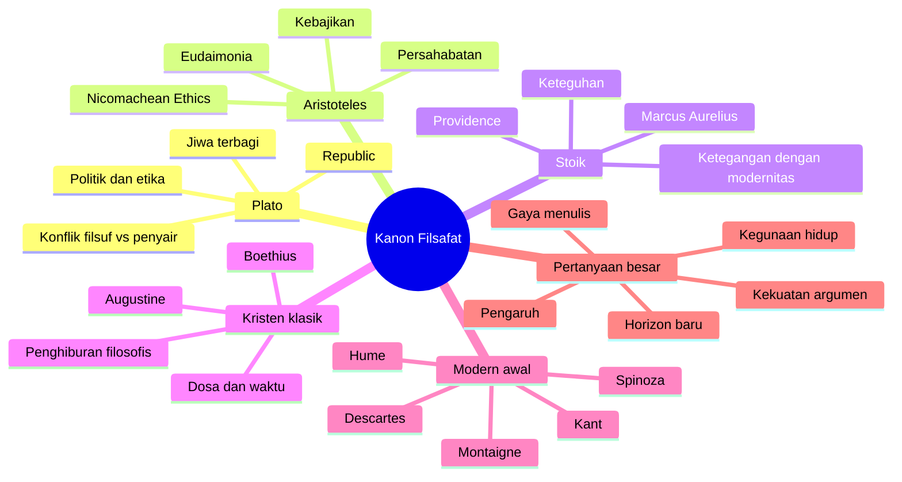

## 📚 Pendahuluan: Bisakah Buku Filsafat Benar-Benar Diranking?

Ada sesuatu yang lucu sekaligus serius ketika orang mencoba membuat *tier list* buku-buku filsafat klasik. Lucu, karena filsafat biasanya ingin tampil agung, ketat, dan rasional, sedangkan *tier list* terdengar seperti budaya internet yang santai, *vibes-based* *(berbasis rasa dan kesan)*, dan hampir sengaja tidak ilmiah. Tetapi serius juga, karena di balik permainan peringkat itu sebenarnya tersembunyi pertanyaan yang sangat penting:

> **apa yang membuat sebuah buku filsafat menjadi besar?** 📚

Apakah karena:
- pengaruh sejarahnya?
- kualitas argumennya?
- kegunaannya bagi kehidupan?
- keindahan tulisannya?
- kedalaman psikologisnya?
- keberanian intelektualnya?
- atau justru karena ia mengubah cara seluruh generasi sesudahnya berpikir?

Masalahnya, tidak ada satu kriteria tunggal yang benar-benar aman. Kalau kita menilai berdasarkan **pengaruh historis**, maka karya-karya paling tua hampir selalu unggul. Kalau menilai dari **ketelitian argumen**, karya-karya yang sangat sistematis mungkin menang, tetapi kita berisiko meremehkan buku yang longgar secara bentuk namun revolusioner secara intuisi. Kalau menilai dari **manfaat hidup**, maka teks seperti Marcus Aurelius atau Aristoteles akan terasa lebih dekat daripada metafisika yang sangat abstrak. Kalau menilai dari **keindahan dan pengalaman membaca**, Montaigne atau Augustine bisa mengalahkan karya yang secara teknis lebih “penting.”

Jadi pada akhirnya, setiap upaya meranking filsafat selalu akan sedikit arbitrer, sedikit personal, dan sedikit bergantung pada *vibes*. Namun justru itu yang membuat diskusi semacam ini menarik. Ia memaksa kita keluar dari kebiasaan memperlakukan “kanon” sebagai daftar suci yang tak boleh disentuh, dan mulai bertanya dengan jujur:

- buku mana yang sungguh hidup?
- buku mana yang hanya dihormati karena warisan?
- buku mana yang tetap kuat jika dibaca hari ini?
- dan buku mana yang sebenarnya lebih sering dikutip daripada sungguh-sungguh dipahami?

Esai ini berangkat dari percakapan tentang meranking 30 karya klasik filsafat, tetapi saya akan mengembangkannya menjadi sesuatu yang lebih besar. Bukan sekadar “S-tier vs C-tier”, melainkan refleksi tentang:

- bagaimana seharusnya kita membaca buku filsafat klasik,
- mengapa beberapa karya seperti *Republic*, *Nicomachean Ethics*, *Treatise of Human Nature*, *Critique of Pure Reason*, dan *Ethics* karya Spinoza terus menjadi pusat gravitasi intelektual,
- mengapa beberapa buku lebih menghibur, lebih menenangkan, atau lebih mengguncang daripada yang lain,
- dan mengapa perdebatan tentang kanon itu sendiri pada akhirnya adalah perdebatan tentang **apa yang kita cari dari filsafat**.

Kalau harus dirumuskan dalam satu tesis besar, maka tesis artikel ini adalah:

> **buku filsafat klasik menjadi besar bukan hanya karena ia “benar”, tetapi karena ia berhasil membuka medan berpikir baru—medan yang memaksa generasi sesudahnya untuk terus menanggapi, menyetujui, menolak, merevisi, atau hidup di bawah bayangannya.**

Karena itu, pertanyaan “buku mana yang terbaik?” tidak pernah bisa dijawab hanya dengan angka atau huruf peringkat. Tetapi justru lewat upaya yang tampak remeh seperti *tier list*, kita bisa melihat sesuatu yang sangat serius: bahwa kanon filsafat pada dasarnya adalah sejarah dari buku-buku yang **tidak pernah benar-benar selesai kita baca**. ✨

---

<Callout type="important" title="Tesis utama artikel ini">
Karya filsafat klasik layak disebut besar bukan hanya karena pengaruh sejarah atau ketajaman argumennya, tetapi karena ia membuka horizon baru bagi berpikir. Buku-buku terbaik adalah yang terus memaksa pembaca sesudahnya untuk kembali, merespons, dan hidup di bawah pertanyaannya.
</Callout>

---

## 🧭 1. Masalah Dasarnya: Tidak Ada Kriteria Netral untuk Meranking Filsafat

Salah satu pengakuan paling jujur dalam percakapan tentang ranking buku filsafat adalah ini: **tidak ada kriteria lintas-filsafat yang benar-benar netral**. 🧭

Bagaimana kita mau membandingkan:
- Plato dengan Wittgenstein,
- Kant dengan Nietzsche,
- Spinoza dengan Marcus Aurelius,
- Augustine dengan Montaigne?

Mereka menulis dalam:
- zaman berbeda,
- genre berbeda,
- konteks religius dan politik berbeda,
- dan bahkan memaknai “filsafat” secara berbeda.

Sebagian buku adalah:
- dialog,
- sebagian catatan pribadi,
- sebagian sistem aksiomatis,
- sebagian autobiografi spiritual,
- sebagian esai yang longgar dan reflektif,
- sebagian traktat yang nyaris seperti mesin argumen.

Karena itu, setiap upaya menilai buku filsafat selalu harus memilih apa yang dianggap penting. Dan pilihan itu sendiri sudah filosofis.

Mari lihat beberapa kemungkinan kriteria:

### A. Pengaruh sejarah
Ini kriteria yang sangat kuat. Tetapi kalau dipakai secara kaku, hasilnya akan sangat berat ke karya-karya awal seperti Plato, Aristoteles, atau teks-teks religius besar. Masalahnya, ini membuat waktu menjadi faktor dominan.

### B. Kekuatan argumen
Tampak objektif, tetapi juga rumit. Sebab ada buku yang argumennya sangat ketat namun ruang lingkupnya sempit, dan ada buku yang tidak seluruh argumennya berhasil tetapi dampak intelektualnya luar biasa.

### C. Kegunaan eksistensial
Beberapa buku seperti *Nicomachean Ethics* atau *Meditations* terasa sangat langsung berguna bagi kehidupan. Tetapi apakah kegunaan praktis harus menjadi ukuran tertinggi bagi filsafat?

### D. Keindahan literer
Ini sering diremehkan, padahal penting. Buku yang enak dibaca, indah, dan hidup secara retoris kadang jauh lebih kuat membentuk jiwa pembaca daripada buku yang sekadar benar secara sempit.

### E. Kemampuan membuka horizon baru
Ini mungkin salah satu kriteria terbaik. Buku besar adalah buku yang bukan cuma menjawab pertanyaan, tetapi mengubah bentuk pertanyaan itu sendiri.

Karena tidak ada kriteria tunggal yang cukup, maka diskusi tentang ranking filsafat akan selalu setengah serius, setengah personal. Dan menurut saya itu tidak masalah. Justru dari sana terlihat bahwa membaca kanon bukan pekerjaan mekanis, melainkan pekerjaan *judgment* *(pertimbangan)*.

---

## 🏛️ 2. Mengapa Plato’s Republic Hampir Selalu Naik ke Puncak?

Kalau ada satu buku yang hampir pasti langsung masuk wilayah teratas dalam kanon filsafat Barat, itu adalah **Plato’s Republic**. 🏛️

Alasannya bukan hanya karena ia tua atau terkenal, tetapi karena skala dan jangkauannya hampir tak masuk akal. Buku ini membahas:
- keadilan,
- jiwa,
- pendidikan,
- bentuk negara,
- seni,
- pengetahuan,
- metafisika,
- kematian,
- dan kehidupan baik.

Dan anehnya, semua itu tidak terasa sekadar ditumpuk, tetapi saling menjahit.

Yang membuat *Republic* begitu istimewa adalah ia terus menggoda pembaca dengan pertanyaan tentang apa sebenarnya buku itu. Apakah ia:
- karya filsafat politik?
- karya etika?
- teori pendidikan?
- alegori metafisis?
- atau justru semuanya sekaligus?

Ada hal menarik di sini. Banyak orang diajar untuk membaca *Republic* terutama sebagai buku tentang negara ideal. Tetapi pembacaan yang lebih teliti menunjukkan bahwa ia dibingkai dari awal dan akhir sebagai pertanyaan tentang **jiwa individu**. Kita mulai dari pertanyaan tentang keadilan dalam hidup manusia, lalu negara muncul sebagai pembesaran analogis dari jiwa.

Dengan kata lain, politik di sini mungkin bukan tujuan akhir, melainkan alat untuk melihat moralitas dan struktur batin dengan lebih jelas.

Ini salah satu alasan mengapa *Republic* nyaris tak habis dibaca. Setiap kali kita pikir sudah menemukan “inti”-nya, ada lapisan lain yang terbuka.

---

## 🧠 3. Plato dan Jiwa yang Terbagi: Mengapa Republic Tetap Terasa Modern?

Salah satu bagian paling revolusioner dari *Republic* adalah gambaran Plato tentang **jiwa yang terbagi**—*tripartite soul* *(jiwa bertiga-bagian / jiwa yang terdiri dari unsur akal, semangat, dan hasrat)*. 🧠

Secara garis besar, Plato membagi jiwa menjadi:
- **reason** *(akal)*,
- **spirit** *(thumos / semangat, keberanian, kehormatan, dorongan emosional tinggi)*,
- **appetite** *(nafsu/hasrat)*.

Kenapa ini penting?

Karena model ini terasa sangat modern dalam beberapa hal. Ia mengakui bahwa manusia bukan makhluk tunggal yang selalu sepenuhnya konsisten. Kita bisa:
- tahu apa yang benar, tetapi gagal melakukannya,
- merasakan dorongan luhur yang berbeda dari nafsu rendah,
- dan hidup dalam konflik batin yang nyata.

Dalam tradisi modern, gagasan tentang pikiran atau jiwa yang terbelah kemudian muncul lagi dalam banyak bentuk:
- psikoanalisis,
- psikologi keinginan dan keyakinan,
- teori konflik internal,
- bahkan cara sehari-hari kita bicara tentang “bagian diri” yang berbeda.

Jadi, *Republic* tetap terasa hidup bukan hanya karena pengaruh sejarahnya, tetapi karena ia berhasil menangkap sesuatu yang secara fenomenologis nyata: bahwa manusia bukan makhluk yang sederhana bagi dirinya sendiri.

---

## 🎭 4. Plato vs Para Penyair: Salah Satu Konflik Tertua dalam Sejarah Pikiran

Ada sisi lain dari *Republic* yang juga sangat penting: konflik antara **filsuf** dan **penyair**. 🎭

Plato sangat curiga pada puisi, terutama puisi epik seperti Homeros. Mengapa? Karena menurutnya, para penyair:
- meniru realitas daripada menangkap kebenarannya secara murni,
- membangkitkan emosi secara kuat,
- dan bisa menyesatkan jiwa politik maupun moral.

Ini luar biasa berani, karena bagi orang Yunani saat itu, mengkritik Homeros hampir seperti menyerang fondasi budaya mereka sendiri.

Apa arti semua ini bagi kanon filsafat?

Bahwa salah satu buku terbesar dalam sejarah filsafat sejak awal sudah sadar bahwa filsafat tidak lahir di ruang kosong. Ia lahir dalam pertarungan dengan:
- sastra,
- mitos,
- retorika,
- pendidikan publik,
- dan pembentukan emosi.

Dan secara ironis, Plato sendiri menyampaikan semuanya lewat bentuk dialog yang sangat dramatis dan puitis. Artinya, bahkan ketika ia memusuhi penyair, ia juga menunjukkan bahwa filsafat murni yang bebas dari gaya dan drama mungkin tidak pernah benar-benar ada.

---

## ⚖️ 5. Mengapa Nicomachean Ethics Karya Aristoteles Begitu Dicintai?

Kalau *Republic* sering dihormati sebagai karya puncak karena keluasan dan pengaruhnya, maka **Nicomachean Ethics** karya Aristoteles sering dicintai karena terasa **dekat, berguna, dan sangat manusiawi**. ⚖️

Banyak pembaca filsafat masuk ke dunia ini karena pertanyaan-pertanyaan seperti:
- bagaimana hidup yang baik?
- bagaimana menjadi orang baik?
- apa itu kebajikan?
- bagaimana kita membentuk karakter?

Dan *Nicomachean Ethics* langsung mulai dari sana.

Buku ini tidak dimulai dari keraguan radikal tentang dunia luar, juga tidak dari permainan metafisika yang membingungkan. Ia dimulai dari premis yang sederhana tetapi kuat:

> **setiap tindakan dan penyelidikan mengarah pada suatu kebaikan.**

Lalu Aristoteles bertanya: kalau begitu, apa kebaikan tertinggi bagi manusia?

Jawabannya bukan kesenangan sesaat, bukan kehormatan kosong, bukan kekayaan, melainkan **eudaimonia** *(kebahagiaan dalam arti mendalam / flourishing / hidup yang bertumbuh dan terpenuhi secara manusiawi)*.

Ini sangat penting. Karena Aristoteles tidak memisahkan etika dari pertanyaan tentang hidup yang baik. Bagi dia, menjadi baik bukan proyek pengorbanan diri yang absurd, melainkan bagian dari hidup yang benar-benar tumbuh dengan baik.

---

## 🌱 6. Eudaimonia dan Mengapa Aristoteles Terasa Lebih Waras daripada Banyak Sistem Etika Lain

Salah satu alasan *Nicomachean Ethics* terasa sangat sehat adalah karena Aristoteles menolak memisahkan secara tajam antara:
- moralitas,
- psikologi,
- kebiasaan,
- dan kesejahteraan manusia. 🌱

Banyak sistem etika modern cenderung bertanya: “apa tindakan yang benar?” lalu berhenti di sana. Aristoteles melakukan sesuatu yang berbeda. Ia bertanya:

- manusia seperti apa yang hidup dengan baik?
- kebiasaan seperti apa yang membentuk karakter baik?
- dalam konteks apa kebajikan itu tumbuh?
- bagaimana peran persahabatan, kota, pendidikan, dan pembiasaan?

Karena itu etika Aristotelian terasa lebih lengkap. Ia tidak memberi kita satu algoritma moral. Ia memberi kita **gambaran kehidupan manusia yang utuh**.

Salah satu kekuatan besar Aristoteles adalah bahwa ia tidak terlalu cepat memaksakan neat solution *(solusi yang terlalu rapi)*. Ia tahu bahwa hidup penuh nuansa. Kebajikan bukan rumus. Ia adalah kemampuan menilai, memilih, dan membentuk diri dalam konteks yang konkret.

Dan itulah sebabnya banyak orang merasa Aristoteles lebih “berguna” daripada sistem-sistem yang terlalu abstrak. Ia mengerti bahwa manusia:
- hidup dalam komunitas,
- dibentuk oleh kebiasaan,
- butuh sahabat,
- butuh keadaan lahiriah yang cukup baik,
- dan tidak hidup hanya sebagai agen moral abstrak.

---

## 🤝 7. Aristoteles, Persahabatan, dan Kehidupan yang Tidak Bisa Dijalani Sendirian

Salah satu bagian paling indah dari *Nicomachean Ethics* adalah pembahasannya tentang **persahabatan**. 🤝

Bagi Aristoteles, hidup baik tidak bisa dipahami hanya sebagai proyek individu yang tertutup. Manusia adalah makhluk sosial. Kita membutuhkan:
- sahabat,
- komunitas,
- kota,
- relasi timbal balik,
- dan pengakuan yang tidak dangkal.

Ini menarik karena di sini Aristoteles tidak jatuh ke ekstrem individualisme maupun kolektivisme. Ia tidak bilang bahwa nilai individu hilang dalam polis *(kota/komunitas politik)*, tetapi juga tidak membayangkan bahwa seseorang bisa mencapai *eudaimonia* sepenuhnya sendirian.

Dalam konteks modern, ini terasa sangat segar. Banyak orang hari ini membayangkan hidup baik semata sebagai proyek optimasi diri:
- produktif,
- sehat,
- kaya,
- cerdas,
- tenang.

Aristoteles akan berkata: semua itu belum cukup kalau Anda tidak punya struktur relasi yang baik.

Dan di sinilah ia terasa sangat hidup. Ia tahu bahwa karakter bukan dibentuk dalam kekosongan. Kita tumbuh melalui pergaulan, pendidikan, dan polis. Karena itu, buku ini tetap terasa relevan—bukan sebagai self-help kuno, tetapi sebagai filsafat kehidupan yang jauh lebih luas daripada sekadar pengelolaan emosi.

---

## 🏺 8. Marcus Aurelius dan Meditations: Mengapa Buku Ini Sangat Populer, Tetapi Tetap Kontroversial Secara Filsafati?

Kalau kita pindah ke **Marcus Aurelius, Meditations**, kita masuk ke kasus yang menarik sekali. Ini mungkin salah satu buku filsafat paling populer dalam 20 tahun terakhir, terutama di dunia populer dan internet. 🏺

Mengapa buku ini laku?

Ada beberapa alasan kuat:

### A. Bentuknya ringkas dan mudah dicerna
Isinya berupa catatan-catatan singkat, bukan sistem panjang yang mengintimidasi.

### B. Penulisnya seorang kaisar Romawi
Ada aura khusus ketika kita membaca jurnal pribadi seorang penguasa besar yang berusaha menenangkan dirinya sendiri.

### C. Isinya terasa memotivasi
Stoisisme modern sangat suka mengutip Marcus Aurelius karena ia berkali-kali berkata, pada dasarnya:
- lakukan yang baik,
- terima yang tidak bisa dikendalikan,
- berdiri tegak,
- jangan terlalu terganggu oleh orang lain.

### D. Nada bukunya sangat pribadi
Ia bukan traktat sistematis. Ia seperti seseorang yang sedang mengingatkan dirinya sendiri agar tidak jatuh ke kelemahan biasa.

Tetapi justru di sinilah problemnya secara filosofis.

*Meditations* sangat berpengaruh secara psikologis, tetapi argumennya sering tidak terlalu kuat atau lengkap. Buku ini bukan latihan **stoic logic** *(logika stoa yang ketat)*. Ia lebih seperti buku catatan batin. Maka ada ketegangan antara:
- daya inspirasinya yang besar,
- dan ketelitian filsafatinya yang terbatas.

Karena itu, buku ini sering sangat dicintai, tetapi jika dibandingkan dengan karya-karya puncak seperti Plato, Aristoteles, Hume, atau Kant, ia mungkin tetap berada di tingkat bawah secara ketat filosofis meskipun tinggi secara eksistensial.

---

## 🌌 9. Stoisisme, Providence, dan Masalah Besar yang Sulit Diselamatkan Secara Modern

Salah satu perdebatan penting dalam pembacaan stoisisme modern adalah soal **providence** *(penyelenggaraan kosmos / keyakinan bahwa alam semesta rasional dan pada akhirnya tertata menuju kebaikan)*. 🌌

Dalam kerangka stoik klasik, alam semesta bukan kekacauan buta. Ia adalah tatanan yang rasional. Dari sini muncul gagasan bahwa:
- apa yang terjadi secara keseluruhan baik,
- kematian adalah bagian dari tatanan,
- dan tugas kita adalah menyesuaikan diri dengan logos *(rasio kosmik / akal semesta)*.

Masalahnya, banyak pembaca modern suka mengambil etika stoik sambil membuang metafisika stoiknya. Mereka ingin:
- keteguhan hati,
- kontrol diri,
- sikap tahan banting,
- tetapi tanpa kosmos providensial.

Di sinilah muncul pertanyaan besar:

> **apa yang tersisa dari stoisisme jika metafisika stoiknya dibuang?**

Jawabannya: beberapa hal masih tersisa, tetapi tidak semuanya.

Misalnya, kita masih bisa berkata bahwa ada banyak hal di luar kontrol kita. Tetapi kalau kita tidak lagi percaya bahwa alam semesta bekerja menuju kebaikan, maka kita sulit berkata bahwa kematian atau penderitaan harus disambut sebagai sesuatu yang secara objektif baik.

Di titik ini, stoisisme modern sering cenderung bergerak ke salah satu dari dua arah:
- menjadi lebih **Aristotelian**, dengan mengakui bahwa beberapa hal eksternal memang sungguh baik atau buruk bagi hidup manusia,
- atau menjadi lebih **Nietzschean**, dengan menekankan afirmasi terhadap hidup apa adanya, bukan karena kosmos baik, tetapi karena kehendak yang kuat memilih berkata “ya” pada nasib.

---

## 🙏 10. Augustine’s Confessions: Ketika Filsafat Menjadi Otobiografi Jiwa

Kalau Marcus Aurelius memberi kita jurnal kekaisaran batin, maka **Augustine’s Confessions** memberi kita sesuatu yang lebih dahsyat lagi: **otobiografi spiritual-filosofis**. 🙏

Buku ini luar biasa karena ia bukan hanya:
- pengakuan dosa,
- kisah pertobatan,
- atau traktat teologi.

Ia juga adalah penyelidikan yang sangat tajam tentang:
- ingatan,
- waktu,
- keinginan,
- dosa,
- bahasa,
- dan jiwa.

Yang membuat *Confessions* begitu kuat adalah perpaduan yang langka antara:
- kejujuran pribadi,
- kecanggihan intelektual,
- dan keindahan retoris.

Augustine bisa sangat puitis, tetapi juga sangat tajam secara konseptual. Ia bisa bercerita tentang hidupnya sendiri, lalu tiba-tiba masuk ke refleksi mendalam tentang:
- mengapa manusia mencuri bukan karena butuh, tetapi karena ingin melanggar,
- bagaimana waktu bekerja melalui memori,
- atau bagaimana mungkin Tuhan “berfirman” sebelum ada waktu.

Ini salah satu buku langka yang bisa dibaca:
- oleh pembaca religius sebagai karya devosi dan intelektual,
- oleh pembaca sekuler sebagai studi kesadaran yang mendahului banyak psikologi modern.

---

## 🍐 11. Pir-Pir Augustine dan Mengapa Kadang Kita Memang Melakukan yang Salah Karena Itu Salah

Salah satu adegan paling terkenal dalam *Confessions* adalah kisah **pir yang dicuri**. 🍐

Sekilas, ini tampak sepele. Augustine bercerita bahwa saat muda, ia dan teman-temannya mencuri pir dari kebun. Yang membuatnya penting bukan aksinya, tetapi pertanyaan yang ia ajukan sesudahnya:

> **mengapa saya melakukan itu?**

Bukan karena lapar.
Bukan karena pirnya enak.
Bukan karena saya membutuhkannya.

Ia sampai pada satu jawaban yang mengganggu: ia melakukannya **karena itu terlarang**.

Ini sangat penting dalam sejarah filsafat moral. Sebelumnya, banyak pemikiran Yunani cenderung melihat kesalahan sebagai hasil kebodohan atau kesalahan penilaian. Augustine melihat sesuatu yang lebih gelap:

- manusia kadang tertarik pada pelanggaran itu sendiri,
- transgresi punya daya pikat,
- dan kehendak tidak selalu tunduk pada rasio yang sehat.

Dalam bahasa modern, ini terasa dekat sekali dengan:
- psikoanalisis,
- teori represi,
- atau pemahaman bahwa larangan itu sendiri bisa membangkitkan hasrat.

Dengan kata lain, Augustine menangkap sesuatu yang sangat modern: bahwa manusia tidak selalu salah karena tidak tahu yang baik. Kadang ia salah justru karena tertarik pada bentuk kebebasan palsu yang terasa dalam melanggar.

---

## 🕰️ 12. Waktu, Ingatan, dan Mengapa Augustine Jauh Lebih Besar daripada Sekadar Penulis Teologi

Bagian akhir *Confessions* bergerak ke wilayah yang sangat filosofis, terutama soal **waktu**. 🕰️

Augustine bertanya:
- apa itu waktu?
- kalau masa lalu sudah tidak ada dan masa depan belum ada, apa yang sebenarnya ada?
- bagaimana mungkin kita bicara tentang durasi?
- bagaimana mungkin Tuhan mencipta dunia “pada awal” kalau awal sendiri tampaknya sudah melibatkan waktu?

Ini luar biasa canggih. Banyak pembaca bahkan merasa bagian ini adalah salah satu refleksi paling brilian tentang waktu sebelum filsafat modern.

Apa yang membuat Augustine besar di sini adalah ia menunjukkan bahwa teologi serius tidak harus menjadi musuh filsafat. Justru kadang sebuah persoalan religius—seperti penciptaan—mendorong kita ke pertanyaan metafisis paling dalam.

Karena itu, *Confessions* sering layak ditempatkan sangat tinggi dalam kanon. Ia mungkin tidak sesistematis Kant atau Spinoza, tetapi kekuatan intelektualnya sangat nyata, dan jangkauannya ke psikologi batin juga luar biasa.

---

## 🏰 13. Boethius dan The Consolation of Philosophy: Buku Penghiburan yang Bekerja bahkan bagi Mereka yang Tidak Sepenuhnya Setuju

**Boethius, The Consolation of Philosophy** menempati posisi menarik. Buku ini sering tidak sefame Plato, Aristoteles, atau Augustine, tetapi daya hidupnya aneh: banyak pembaca tetap merasa sungguh “dihibur” olehnya walau tidak sepenuhnya menerima argumennya. 🏰

Premis dasarnya sederhana dan kuat:
- seorang tokoh politik jatuh, hancur, dan dipenjara,
- lalu **Lady Philosophy** *(Sang Filsafat yang dipersonifikasikan sebagai perempuan penghibur)* datang menghiburnya.

Ini langsung memberi buku itu struktur dramatis yang kuat. Filsafat di sini bukan abstraksi dingin. Ia hadir sebagai obat, pengingat, dan pemulihan perspektif.

Yang indah dari Boethius adalah perpaduan antara:
- puisi,
- renungan eksistensial,
- dan metafisika.

Ia tidak selalu berhasil secara argumentatif untuk semua pembaca modern—terutama soal providence dan kebebasan—tetapi ia sangat kuat dalam satu hal: membuat kita merasa bahwa penggunaan akal untuk menghadapi penderitaan adalah tindakan mulia.

Dan itu sendiri sudah sangat berharga.

---

## 🪞 14. Montaigne dan Essays: Kerendahan Hati sebagai Bentuk Kecerdasan Tinggi

Jika Plato dan Aristoteles mewakili filsafat sistematik awal, maka **Montaigne** mewakili sesuatu yang lain: filsafat sebagai **eksplorasi diri yang jujur dan rendah hati**. 🪞

*Montaigne’s Essays* luar biasa karena ia hampir seperti menemukan bentuk *personal essay* modern. Ia menulis tentang:
- kematian,
- kesendirian,
- kebiasaan,
- pendidikan,
- emosi,
- membaca,
- kebohongan,
- agama,
- tubuh,
- politik,
- dan nyaris apa saja.

Tetapi yang paling kuat dari Montaigne bukan hanya topiknya, melainkan sikapnya. Ia sangat cerdas, tetapi tidak berlagak memegang kebenaran final. Ia berpikir sambil berjalan. Ia mencoba gagasan, lalu mengoreksi diri. Ia mengutip orang lain jika mereka mengatakannya lebih baik.

Kerendahan hati ini bukan kelemahan. Justru itu bentuk kekuatan intelektual yang langka.

Montaigne mengajarkan sesuatu yang sangat penting: bahwa filsafat tidak selalu harus tampil sebagai sistem yang menguasai dunia. Kadang ia lebih baik tampil sebagai percakapan jujur dengan diri sendiri dan tradisi.

Dan justru karena itu, banyak pembaca merasa Montaigne sangat hidup. Ia seperti teman bicara yang sangat cerdas dan sangat waras.

---

---

## 🧩 15. Descartes: Penting Sekali, Tetapi Tidak Selalu Menyenangkan Dibaca

**Descartes, Meditations on First Philosophy** adalah contoh buku yang mungkin jauh lebih penting secara historis daripada menyenangkan secara total sebagai pengalaman membaca. 🧩

Mengapa penting?

Karena Descartes memaksa filsafat modern menghadapi skeptisisme secara radikal. Ia berkata, pada dasarnya:
- mari ragu pada semua yang bisa diragukan,
- lalu lihat apa yang bisa bertahan.

Dari sini lahir:
- *cogito* *(“aku berpikir, maka aku ada”)*,
- problem pikiran dan tubuh,
- pertanyaan tentang kepastian,
- dan proyek membangun ulang pengetahuan dari dasar.

Masalahnya, banyak pembaca—dan banyak filsuf sesudahnya—merasa bahwa Descartes jauh lebih kuat dalam **menghancurkan kepastian lama** daripada dalam **membangun sistem baru yang benar-benar meyakinkan**.

Misalnya:
- skeptisismenya sangat kuat,
- tetapi argumen tentang Tuhan tidak selalu memuaskan,
- dualismenya menghasilkan problem interaksi mind-body yang besar,
- dan solusi-solusinya sering terasa seperti titik rawan, bukan kemenangan penuh.

Karena itu, Descartes penting sekali. Tetapi tidak semua pembaca mencintainya. Banyak orang menghormatinya lebih daripada menikmatinya.

---

## 🌿 16. Spinoza: Ketika Filsafat Kembali Berani Membangun Sistem Besar

Kalau Descartes membuka filsafat modern, maka **Spinoza** adalah salah satu tokoh yang paling berani mengambil konsekuensinya sampai jauh. 🌿

*Karya Ethics* milik Spinoza sering terasa seperti tindakan intelektual yang nyaris gila dalam keberaniannya. Ia mencoba menyusun seluruh sistem metafisika dan etika secara geometris:
- definisi,
- aksioma,
- proposisi,
- pembuktian,
- korolari,
- skolium.

Ini bukan buku yang setengah hati. Spinoza benar-benar berkata, secara implisit:

> saya akan memberi Anda gambaran menyeluruh tentang realitas.

Dan ini luar biasa, terutama dalam budaya filsafat modern yang sering lebih nyaman menyelesaikan masalah kecil dengan presisi tinggi daripada membangun sistem besar yang berisiko.

Yang paling terkenal tentu adalah monismenya: gagasan bahwa hanya ada **satu substansi**. Dari sini lahir bentuk pantheism *(panteisme / Tuhan dan alam dipahami dalam kesatuan tertentu)* yang sangat berpengaruh.

Banyak pembaca mungkin tidak setuju dengan semua langkah argumentasinya. Tetapi sulit menolak kedahsyatan intelektualnya.

Spinoza penting bukan hanya karena isinya, tetapi karena ia menunjukkan bahwa filsafat bisa tetap:
- sangat sistematis,
- sangat terbuka untuk dikritik,
- dan sangat berani dalam skala ambisinya.

Itulah mengapa banyak pembaca menaruhnya sangat tinggi dalam kanon: karena ia tidak sekadar menjawab beberapa pertanyaan; ia mencoba menyusun ulang seluruh peta kenyataan.

---

## 🧪 17. Hume: Skeptisisme yang Tidak Mandek, tetapi Menjadi Konstruktif

Kalau Spinoza mewakili keberanian sistem, maka **David Hume** mewakili keberanian skeptisisme yang sangat konsisten. 🧪

*A Treatise of Human Nature* adalah buku yang mengagumkan karena Hume tidak hanya berkata “mari skeptis.” Ia benar-benar bertanya:
- kalau kita serius dengan empirisme, apa yang tersisa?
- apa itu diri?
- apa itu sebab-akibat?
- dari mana datangnya keyakinan kita?

Dan jawaban-jawabannya mengguncang.

Hume menunjukkan bahwa:
- diri tidak muncul sebagai substansi tetap yang kita temukan langsung,
- sebab-akibat tidak hadir sebagai kekuatan metafisis yang kita amati, melainkan sebagai kebiasaan pikiran terhadap regularitas,
- dan banyak hal yang kita anggap kokoh ternyata bergantung pada cara kerja pengalaman dan asosiasi.

Namun yang hebat, Hume tidak berhenti di nihilisme. Ia menjadi semacam **post-skeptic** *(sesudah skeptisisme)*. Ia tahu kita tidak bisa mendapatkan dasar metafisis absolut seperti yang diinginkan rasionalisme, tetapi ia juga tahu manusia tetap hidup, bertindak, percaya, dan menyelidiki.

Karena itu Hume sangat penting. Ia tidak membatalkan filsafat. Ia membuat filsafat menjadi lebih jujur tentang kondisi manusia.

---

## 🧱 18. Kant: Mengapa Setelah Critique of Pure Reason, Sulit Kembali Menjadi “Naive Realist”

Kalau ada satu buku yang berfungsi sebagai titik balik raksasa dalam filsafat modern, itu adalah **Immanuel Kant, Critique of Pure Reason**. 🧱

Buku ini memang sulit. Bukan sulit dalam arti “bahasanya sedikit rumit.” Sulit dalam arti ia menata ulang cara seluruh proyek pengetahuan dipahami.

Secara kasar, Kant bertanya:
- bagaimana pengetahuan mungkin?
- apa syarat-syarat yang membuat pengalaman bisa dipahami sebagai pengalaman?
- apa kontribusi subjek dalam membentuk dunia yang dialami?

Dari sini muncul:
- pembedaan *phenomena* *(fenomena / dunia sebagaimana tampak bagi kita)* dan *noumena* *(noumena / benda pada dirinya sendiri, di luar jangkauan langsung pengetahuan kita)*,
- kategori-kategori pemahaman,
- sintetik *a priori*,
- dan seluruh proyek kritik akal murni.

Mengapa ini begitu besar?

Karena setelah Kant, sulit kembali begitu saja ke realisme naïf seolah pikiran hanya memantulkan dunia apa adanya tanpa struktur aktif dari subjek.

Kant bukan hanya memberi jawaban baru. Ia menggeser masalah. Sesudah dia, hampir semua filsafat besar modern entah:
- menerima,
- merevisi,
- menolak,
- atau mencoba melampaui Kant.

Itu tanda buku besar.

Ia mungkin tidak selalu dicintai dengan hangat seperti Montaigne atau Aristoteles. Tetapi sebagai titik fulkrum sejarah filsafat, ia hampir tak tergantikan.

---

## 🏗️ 19. Buku Besar Itu Tidak Harus Sempurna; Ia Harus Generatif

Salah satu pelajaran paling penting dari seluruh diskusi tentang ranking buku filsafat adalah ini:

> **buku besar tidak harus sempurna. Ia harus generatif.** 🏗️

Apa artinya generatif?

Artinya, buku itu:
- membuka perdebatan baru,
- memaksa tanggapan dari generasi sesudahnya,
- menjadi sumber inspirasi maupun penolakan,
- dan membentuk tradisi baru.

Lihat contoh-contohnya:
- *Republic* membuka begitu banyak pertanyaan sehingga kita masih memperdebatkan jenis buku apa itu sebenarnya.
- *Nicomachean Ethics* terus hidup karena model etika kebajikannya masih terasa segar.
- *Meditations* mungkin tidak sangat kokoh secara argumen, tetapi punya daya psikologis yang besar.
- *Confessions* menghubungkan spiritualitas dan introspeksi secara revolusioner.
- *Essays* karya Montaigne hampir menciptakan bentuk baru filsafat reflektif.
- *Ethics* karya Spinoza memberi sistem alternatif yang tak bisa diabaikan.
- *Treatise* karya Hume mengguncang empirisme dari dalam.
- *Critique of Pure Reason* karya Kant membangun ulang seluruh medan pengetahuan.

Jadi, buku terbaik bukan selalu yang kita setujui secara penuh. Kadang justru buku terbaik adalah buku yang:
- membuat kita tidak nyaman,
- membuat kita merasa tertinggal,
- atau memaksa kita menata ulang seluruh orientasi berpikir.

---

## 🌟 20. Jadi, Buku Mana yang Pantas di Puncak?

Kalau harus ditarik ke bentuk ranking kasar, saya kira karya-karya seperti ini memang sangat wajar berada di puncak atau mendekatinya:

### Wilayah puncak / S-tier secara masuk akal
- **Plato – Republic**
- **Aristotle – Nicomachean Ethics**
- **David Hume – A Treatise of Human Nature**
- **Immanuel Kant – Critique of Pure Reason**
- **Baruch Spinoza – Ethics**
- dan bagi banyak pembaca, **Montaigne – Essays** juga layak sekali masuk ke sini

### Wilayah sangat tinggi / A-tier secara kuat
- **Augustine – Confessions**
- **Thomas Aquinas – Summa Theologica** atau bagian-bagiannya, terutama jika dilihat dari pengaruh dan ambisi sistemik
- **Boethius – The Consolation of Philosophy**

### Wilayah penting tetapi lebih problematik / lebih rendah dalam ranking murni filosofis
- **Marcus Aurelius – Meditations**
- **Descartes – Meditations on First Philosophy**

Ini tentu tetap bergantung pada apa yang kita hargai. Tetapi pola umumnya jelas:
- karya yang paling tinggi biasanya adalah karya yang punya **jangkauan besar**, **dampak historis besar**, dan **kemampuan mengubah cara berpikir generasi setelahnya**.
- karya yang sedikit lebih rendah sering kali tetap indah, berguna, dan penting, tetapi mungkin kurang kuat secara sistemik atau argumentatif.

---

## ✨ Kesimpulan: Kanon Filsafat adalah Sejarah Buku-Buku yang Tidak Pernah Selesai Kita Balas

Pada akhirnya, pertanyaan “buku filsafat klasik terbaik itu apa?” tidak akan pernah punya jawaban final yang sepenuhnya objektif. Tetapi itu bukan kelemahan. Justru di situlah kehidupan filsafat berada. ✨

Kita menilai buku-buku besar bukan seperti juri memberi angka di kompetisi, melainkan seperti orang yang sadar bahwa beberapa karya telah:
- mengubah bahasa pertanyaan kita,
- memperluas cakrawala pemikiran kita,
- dan menciptakan medan baru tempat semua orang sesudahnya harus berbicara.

Itulah mengapa buku seperti:
- *Republic*,
- *Nicomachean Ethics*,
- *Treatise*,
- *Critique of Pure Reason*,
- *Ethics*,
- *Confessions*,
- *Essays*,

terus kembali dalam setiap diskusi serius tentang filsafat. Bukan karena semua orang setuju, melainkan karena tidak ada yang benar-benar bisa lolos dari mereka.

Dan mungkin itulah definisi terbaik dari buku filsafat klasik:

> **buku yang sesudah dibaca tidak pernah benar-benar selesai, karena ia tetap tinggal di dalam pikiran kita sebagai pertanyaan, struktur, suara, atau lawan bicara.**

Jadi ya, kita boleh saja membuat *tier list*. Boleh juga bercanda tentang *S-tier vibes* atau *C-tier stoicism*. Tetapi di balik permainan itu, tetap ada pelajaran yang serius:

filsafat hidup melalui buku-buku yang terus memaksa kita kembali—bukan hanya untuk mengaguminya, tetapi untuk berpikir lagi. 🌿

---

<Callout type="quote" title="Kalimat inti artikel ini">
Buku filsafat klasik menjadi besar bukan karena ia selesai menjawab semua pertanyaan, melainkan karena ia membuka horizon baru yang memaksa generasi sesudahnya terus menjawab balik.
</Callout>

<Callout type="tip" title="Cara membaca kanon filsafat">
Jangan membaca buku klasik hanya untuk “punya opini”. Bacalah untuk mencari jenis kekuatan yang berbeda-beda: ada buku yang kuat sebagai sistem, ada yang kuat sebagai penghiburan, ada yang kuat sebagai autobiografi jiwa, ada yang kuat sebagai ledakan pertanyaan. Kanon justru hidup ketika perbedaan itu terasa.
</Callout>

<Callout type="cite" title="Sumber dan basis pembahasan">
Artikel ini dikembangkan dari transcript video *Ranking Classic Philosophy Books (with Joe Folley)* dan diperluas menjadi esai tentang kriteria menilai buku filsafat klasik, posisi karya-karya utama dalam kanon Barat, dan mengapa beberapa teks tetap menjadi pusat gravitasi dalam sejarah filsafat.
</Callout>
