## 🎙️ Pembuka: Saat Kamu Tahu Lebih dari yang Bisa Kamu Ucapkan

Ada momen yang sangat tidak nyaman yang pasti pernah kamu rasakan.

Kamu sedang dalam meeting, presentasi, atau percakapan penting. Seseorang mengajukan pertanyaan yang kamu *tahu* jawabannya — kamu sudah memikirkan topik ini berbulan-bulan, kamu sudah baca buku tentangnya, kamu sudah renungkan berkali-kali. Tapi ketika kamu membuka mulut...

Kata-katanya tidak datang. Atau datang tapi dalam urutan yang kacau. Kamu stumble (*tersandung*), kamu mengatakan "um" dan "eh" terlalu banyak, kamu kehilangan benang merah di tengah kalimat, dan pada akhirnya pendengar tidak benar-benar menangkap inti dari apa yang ingin kamu sampaikan.

Ini bukan masalah kecerdasan. Ini masalah **artikulasi** (*kemampuan mengungkapkan pikiran dengan jelas*).

Dan perbedaan antara orang yang terlihat cerdas dan orang yang benar-benar cerdas tapi tidak terlihat demikian, sering kali hanya terletak pada satu hal: kemampuan untuk mengemas dan menyampaikan ide dengan cara yang membuat orang lain mau mendengarkan.

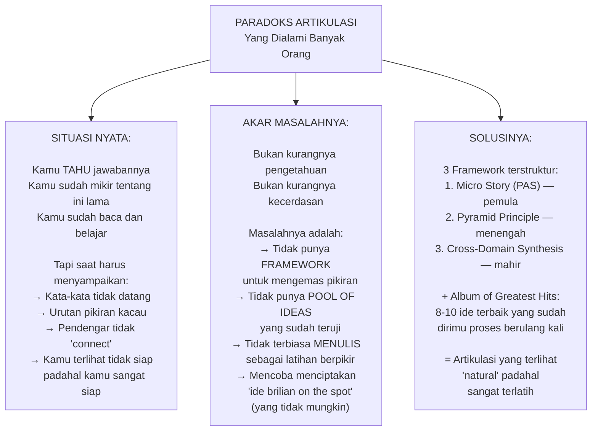
```mermaid
graph TD
    A["PARADOKS ARTIKULASI\nYang Dialami Banyak Orang"]
    
    A --> B["SITUASI NYATA:\n\nKamu TAHU jawabannya\nKamu sudah mikir tentang ini lama\nKamu sudah baca dan belajar\n\nTapi saat harus menyampaikan:\n→ Kata-kata tidak datang\n→ Urutan pikiran kacau\n→ Pendengar tidak 'connect'\n→ Kamu terlihat tidak siap\n   padahal kamu sangat siap"]
    
    A --> C["AKAR MASALAHNYA:\n\nBukan kurangnya pengetahuan\nBukan kurangnya kecerdasan\n\nMasalahnya adalah:\n→ Tidak punya FRAMEWORK\n   untuk mengemas pikiran\n→ Tidak punya POOL OF IDEAS\n   yang sudah teruji\n→ Tidak terbiasa MENULIS\n   sebagai latihan berpikir\n→ Mencoba menciptakan\n   'ide brilian on the spot'\n   (yang tidak mungkin)"]
    
    A --> D["SOLUSINYA:\n\n3 Framework terstruktur:\n1. Micro Story (PAS) — pemula\n2. Pyramid Principle — menengah\n3. Cross-Domain Synthesis — mahir\n\n+ Album of Greatest Hits:\n8-10 ide terbaik yang sudah\ndirimu proses berulang kali\n\n= Artikulasi yang terlihat\n'natural' padahal\nsangat terlatih"]
```

---

## 🎸 Fondasi Utama: Bangun "Album of Greatest Hits"-mu

Sebelum kita membahas framework apapun, ada satu hal yang lebih fundamental yang perlu dipahami.

Ketika kamu menyaksikan seseorang — Jordan Peterson, Alex Hormozi, atau siapapun yang terkenal karena artikulasinya yang kuat — berbicara di podcast tanpa naskah dengan kefasihan yang memukau, kamu mungkin berpikir: "Mereka memang berbakat" atau "Mereka pasti hafal ribuan hal."

Bukan. Yang terjadi jauh lebih sederhana dari itu.

**Mereka tidak mencoba menciptakan ide baru di tempat. Mereka menyampaikan ide terbaik mereka yang sudah diproses ratusan kali — dengan cara yang paling pas untuk konteks saat itu.**

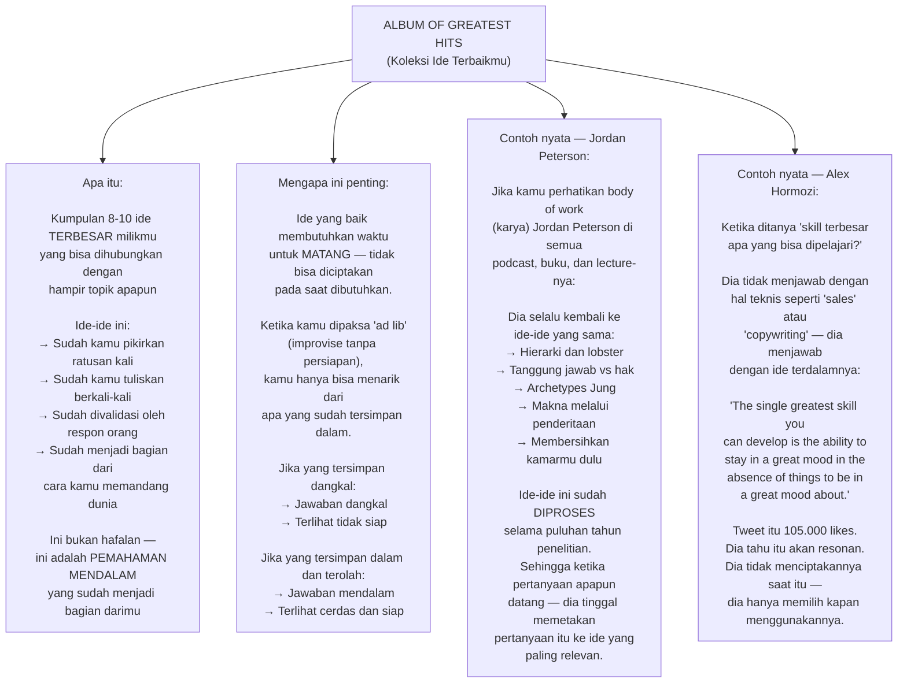
```mermaid
graph TD
    A["ALBUM OF GREATEST HITS\n(Koleksi Ide Terbaikmu)"]
    
    A --> B["Apa itu:\n\nKumpulan 8-10 ide TERBESAR milikmu\nyang bisa dihubungkan dengan\nhampir topik apapun\n\nIde-ide ini:\n→ Sudah kamu pikirkan ratusan kali\n→ Sudah kamu tuliskan berkali-kali\n→ Sudah divalidasi oleh respon orang\n→ Sudah menjadi bagian dari\n   cara kamu memandang dunia\n\nIni bukan hafalan —\nini adalah PEMAHAMAN MENDALAM\nyang sudah menjadi bagian darimu"]
    
    A --> C["Mengapa ini penting:\n\nIde yang baik membutuhkan waktu\nuntuk MATANG — tidak bisa diciptakan\npada saat dibutuhkan.\n\nKetika kamu dipaksa 'ad lib'\n(improvise tanpa persiapan),\nkamu hanya bisa menarik dari\napa yang sudah tersimpan dalam.\n\nJika yang tersimpan dangkal:\n→ Jawaban dangkal\n→ Terlihat tidak siap\n\nJika yang tersimpan dalam dan terolah:\n→ Jawaban mendalam\n→ Terlihat cerdas dan siap"]
    
    A --> D["Contoh nyata — Jordan Peterson:\n\nJika kamu perhatikan body of work\n(karya) Jordan Peterson di semua\npodcast, buku, dan lecture-nya:\n\nDia selalu kembali ke\nide-ide yang sama:\n→ Hierarki dan lobster\n→ Tanggung jawab vs hak\n→ Archetypes Jung\n→ Makna melalui penderitaan\n→ Membersihkan kamarmu dulu\n\nIde-ide ini sudah DIPROSES\nselama puluhan tahun penelitian.\nSehingga ketika pertanyaan apapun\ndatang — dia tinggal memetakan\npertanyaan itu ke ide yang\npaling relevan."]
    
    A --> E["Contoh nyata — Alex Hormozi:\n\nKetika ditanya 'skill terbesar\napa yang bisa dipelajari?'\n\nDia tidak menjawab dengan\nhal teknis seperti 'sales' atau\n'copywriting' — dia menjawab\ndengan ide terdalamnya:\n\n'The single greatest skill you\ncan develop is the ability to\nstay in a great mood in the\nabsence of things to be in\na great mood about.'\n\nTweet itu 105.000 likes.\nDia tahu itu akan resonan.\nDia tidak menciptakannya saat itu —\ndia hanya memilih kapan menggunakannya."]
```

### Cara Membangun Album of Greatest Hits-mu

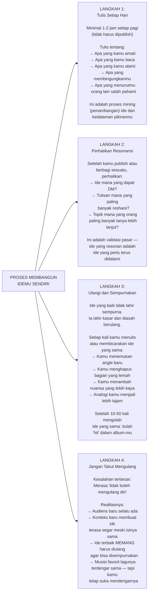
```mermaid
graph LR
    A["PROSES MEMBANGUN\nIDEMU SENDIRI"]
    
    A --> B["LANGKAH 1:\nTulis Setiap Hari\n\nMinimal 1-2 jam setiap pagi\n(tidak harus dipublish)\n\nTulis tentang:\n→ Apa yang kamu amati\n→ Apa yang kamu baca\n→ Apa yang kamu alami\n→ Apa yang membingungkanmu\n→ Apa yang menurutmu\n  orang lain salah pahami\n\nIni adalah proses mining\n(penambangan) ide dari\nkedalaman pikiranmu"]
    
    A --> C["LANGKAH 2:\nPerhatikan Resonansi\n\nSetelah kamu publish atau\nberbagi sesuatu, perhatikan:\n→ Ide mana yang dapat DM?\n→ Tulisan mana yang paling\n  banyak reshare?\n→ Topik mana yang orang\n  paling banyak tanya lebih lanjut?\n\nIni adalah validasi pasar —\nide yang resonan adalah\nide yang perlu terus didalami"]
    
    A --> D["LANGKAH 3:\nUlangi dan Sempurnakan\n\nIde yang baik tidak lahir sempurna.\nIa lahir kasar dan diasah berulang.\n\nSetiap kali kamu menulis\natau membicarakan ide yang sama:\n→ Kamu menemukan angle baru\n→ Kamu menghapus bagian yang lemah\n→ Kamu menambah nuansa yang lebih kaya\n→ Analogi kamu menjadi lebih tajam\n\nSetelah 10-50 kali mengolah\nide yang sama: itulah\n'hit' dalam album-mu"]
    
    A --> E["LANGKAH 4:\nJangan Takut Mengulang\n\nKesalahan terbesar:\nMerasa 'tidak boleh mengulang diri'\n\nRealitasnya:\n→ Audiens baru selalu ada\n→ Konteks baru membuat ide\n  terasa segar meski isinya sama\n→ Ide terbaik MEMANG harus diulang\n   agar bisa disempurnakan\n→ Musisi favorit lagunya\n  terdengar sama — tapi kamu\n  tetap suka mendengarnya"]
```

---

## 🔰 Framework 1 (Pemula): Micro Story — PAS Framework

Framework pertama dan paling mendasar adalah yang disebut **Micro Story** (*cerita mini*), yang strukturnya persis sama dengan framework klasik dalam **copywriting** (*penulisan persuasif*) yang dikenal sebagai **PAS: Problem — Amplify — Solution**.

Alasan framework ini begitu powerful berakar pada neurosains: **otak manusia adalah mesin cerita**. Kita tidak bisa tidak memperhatikan sebuah cerita, terutama jika singkat dan berdampak. Struktur masalah-solusi adalah pola yang paling mendasar dari semua narasi yang pernah ada.

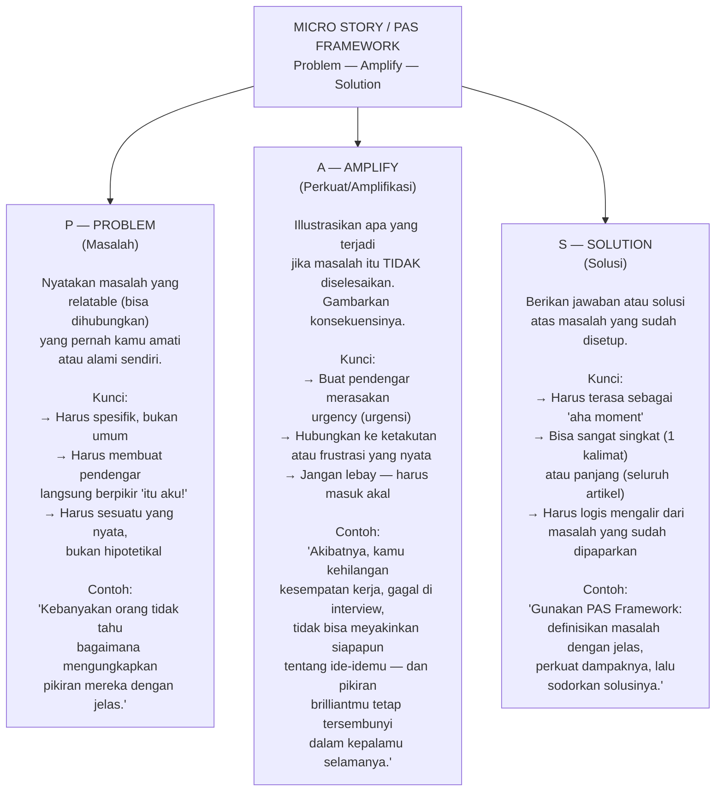
```mermaid
graph TD
    A["MICRO STORY / PAS FRAMEWORK\nProblem — Amplify — Solution"]
    
    A --> B["P — PROBLEM\n(Masalah)\n\nNyatakan masalah yang\nrelatable (bisa dihubungkan)\nyang pernah kamu amati\natau alami sendiri.\n\nKunci:\n→ Harus spesifik, bukan umum\n→ Harus membuat pendengar\n  langsung berpikir 'itu aku!'\n→ Harus sesuatu yang nyata,\n  bukan hipotetikal\n\nContoh:\n'Kebanyakan orang tidak tahu\nbagaimana mengungkapkan\npikiran mereka dengan jelas.'"]
    
    A --> C["A — AMPLIFY\n(Perkuat/Amplifikasi)\n\nIllustrasikan apa yang terjadi\njika masalah itu TIDAK diselesaikan.\nGambarkan konsekuensinya.\n\nKunci:\n→ Buat pendengar merasakan\n  urgency (urgensi)\n→ Hubungkan ke ketakutan\n  atau frustrasi yang nyata\n→ Jangan lebay — harus masuk akal\n\nContoh:\n'Akibatnya, kamu kehilangan\nkesempatan kerja, gagal di interview,\ntidak bisa meyakinkan siapapun\ntentang ide-idemu — dan pikiran\nbrilliantmu tetap tersembunyi\ndalam kepalamu selamanya.'"]
    
    A --> D["S — SOLUTION\n(Solusi)\n\nBerikan jawaban atau solusi\natas masalah yang sudah disetup.\n\nKunci:\n→ Harus terasa sebagai 'aha moment'\n→ Bisa sangat singkat (1 kalimat)\n  atau panjang (seluruh artikel)\n→ Harus logis mengalir dari\n  masalah yang sudah dipaparkan\n\nContoh:\n'Gunakan PAS Framework:\ndefinisikan masalah dengan jelas,\nperkuat dampaknya, lalu\nsodorkan solusinya.'"]
```

### PAS dalam Berbagai Konteks

Yang membuat framework ini luar biasa adalah skalabilitasnya — ia bekerja di semua format komunikasi:

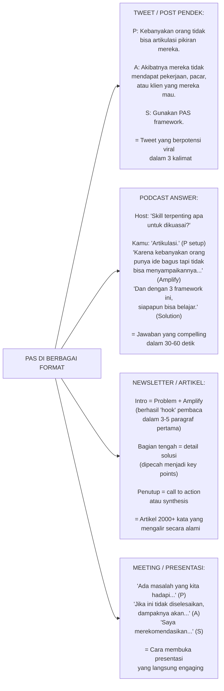
```mermaid
graph LR
    A["PAS DI BERBAGAI FORMAT"]
    
    A --> B["TWEET / POST PENDEK:\n\nP: Kebanyakan orang tidak\nbisa artikulasi pikiran mereka.\n\nA: Akibatnya mereka tidak\nmendapat pekerjaan, pacar,\natau klien yang mereka mau.\n\nS: Gunakan PAS framework.\n\n= Tweet yang berpotensi viral\n  dalam 3 kalimat"]
    
    A --> C["PODCAST ANSWER:\n\nHost: 'Skill terpenting apa\nuntuk dikuasai?'\n\nKamu: 'Artikulasi.' (P setup)\n'Karena kebanyakan orang\npunya ide bagus tapi tidak\nbisa menyampaikannya...' (Amplify)\n'Dan dengan 3 framework ini,\nsiapapun bisa belajar.' (Solution)\n\n= Jawaban yang compelling\n  dalam 30-60 detik"]
    
    A --> D["NEWSLETTER / ARTIKEL:\n\nIntro = Problem + Amplify\n(berhasil 'hook' pembaca\ndalam 3-5 paragraf pertama)\n\nBagian tengah = detail solusi\n(dipecah menjadi key points)\n\nPenutup = call to action\natau synthesis\n\n= Artikel 2000+ kata yang\n  mengalir secara alami"]
    
    A --> E["MEETING / PRESENTASI:\n\n'Ada masalah yang kita hadapi...' (P)\n'Jika ini tidak diselesaikan,\ndampaknya akan...' (A)\n'Saya merekomendasikan...' (S)\n\n= Cara membuka presentasi\n  yang langsung engaging"]
```

### Cara Menemukan Ide untuk PAS

Tidak semua orang langsung punya ide yang siap digunakan. Inilah cara **berburu ide** (*idea hunting*):

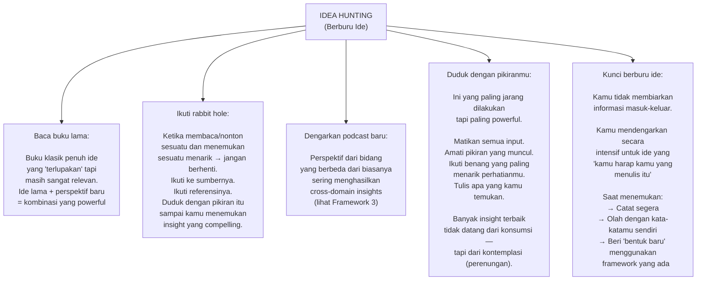
```mermaid
graph TD
    A["IDEA HUNTING\n(Berburu Ide)"]
    
    A --> B["Baca buku lama:\n\nBuku klasik penuh ide\nyang 'terlupakan' tapi\nmasih sangat relevan.\nIde lama + perspektif baru\n= kombinasi yang powerful"]
    
    A --> C["Ikuti rabbit hole:\n\nKetika membaca/nonton\nsesuatu dan menemukan\nsesuatu menarik → jangan berhenti.\nIkuti ke sumbernya.\nIkuti referensinya.\nDuduk dengan pikiran itu\nsampai kamu menemukan\ninsight yang compelling."]
    
    A --> D["Dengarkan podcast baru:\n\nPerspektif dari bidang\nyang berbeda dari biasanya\nsering menghasilkan\ncross-domain insights\n(lihat Framework 3)"]
    
    A --> E["Duduk dengan pikiranmu:\n\nIni yang paling jarang dilakukan\ntapi paling powerful.\n\nMatikan semua input.\nAmati pikiran yang muncul.\nIkuti benang yang paling\nmenarik perhatianmu.\nTulis apa yang kamu temukan.\n\nBanyak insight terbaik\ntidak datang dari konsumsi —\ntapi dari kontemplasi (perenungan)."]
    
    A --> F["Kunci berburu ide:\n\nKamu tidak membiarkan\ninformasi masuk-keluar.\n\nKamu mendengarkan secara\nintensif untuk ide yang\n'kamu harap kamu yang\nmenulis itu'\n\nSaat menemukan:\n→ Catat segera\n→ Olah dengan kata-katamu sendiri\n→ Beri 'bentuk baru' menggunakan\n   framework yang ada"]
```

---

## 🔺 Framework 2 (Menengah): Pyramid Principle (*Prinsip Piramida*)

Framework kedua berasal dari dunia konsultansi bisnis kelas atas, dipopulerkan oleh Barbara Minto dari McKinsey & Company — dan ini adalah cara berpikir yang digunakan para eksekutif top, konsultan, dan komunikator terbaik dunia.

**Pyramid Principle** berkebalikan dengan cara bercerita konvensional. Kebanyakan konten modern "menyimpan jawaban di akhir" untuk membangun suspense. Pyramid Principle melakukan sebaliknya: **mulai dengan jawaban/kesimpulan, baru dukung dengan argumen dan data.**

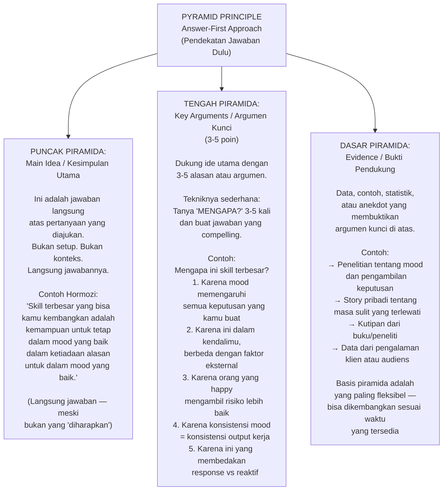
```mermaid
graph TD
    A["PYRAMID PRINCIPLE\nAnswer-First Approach\n(Pendekatan Jawaban Dulu)"]
    
    A --> B["PUNCAK PIRAMIDA:\nMain Idea / Kesimpulan Utama\n\nIni adalah jawaban langsung\natas pertanyaan yang diajukan.\nBukan setup. Bukan konteks.\nLangsung jawabannya.\n\nContoh Hormozi:\n'Skill terbesar yang bisa\nkamu kembangkan adalah\nkemampuan untuk tetap\ndalam mood yang baik\ndalam ketiadaan alasan\nuntuk dalam mood yang baik.'\n\n(Langsung jawaban — meski\nbukan yang 'diharapkan')"]
    
    A --> C["TENGAH PIRAMIDA:\nKey Arguments / Argumen Kunci\n(3-5 poin)\n\nDukung ide utama dengan\n3-5 alasan atau argumen.\n\nTekniknya sederhana:\nTanya 'MENGAPA?' 3-5 kali\ndan buat jawaban yang compelling.\n\nContoh:\nMengapa ini skill terbesar?\n1. Karena mood memengaruhi\n   semua keputusan yang kamu buat\n2. Karena ini dalam kendalimu,\n   berbeda dengan faktor eksternal\n3. Karena orang yang happy\n   mengambil risiko lebih baik\n4. Karena konsistensi mood\n   = konsistensi output kerja\n5. Karena ini yang membedakan\n   response vs reaktif"]
    
    A --> D["DASAR PIRAMIDA:\nEvidence / Bukti Pendukung\n\nData, contoh, statistik,\natau anekdot yang membuktikan\nargumen kunci di atas.\n\nContoh:\n→ Penelitian tentang mood\n  dan pengambilan keputusan\n→ Story pribadi tentang\n  masa sulit yang terlewati\n→ Kutipan dari buku/peneliti\n→ Data dari pengalaman\n  klien atau audiens\n\nBasis piramida adalah\nyang paling fleksibel —\nbisa dikembangkan sesuai waktu\nyang tersedia"]
```

### Pyramid vs. PAS: Kapan Menggunakan Mana?

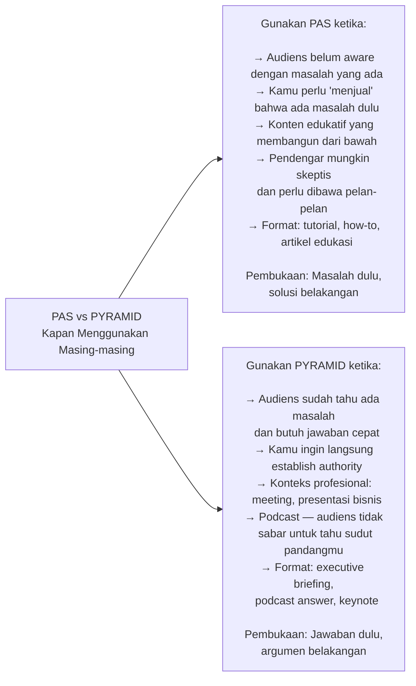
```mermaid
graph LR
    A["PAS vs PYRAMID\nKapan Menggunakan Masing-masing"]
    
    A --> B["Gunakan PAS ketika:\n\n→ Audiens belum aware\n  dengan masalah yang ada\n→ Kamu perlu 'menjual'\n  bahwa ada masalah dulu\n→ Konten edukatif yang\n  membangun dari bawah\n→ Pendengar mungkin skeptis\n  dan perlu dibawa pelan-pelan\n→ Format: tutorial, how-to,\n  artikel edukasi\n\nPembukaan: Masalah dulu,\nsolusi belakangan"]
    
    A --> C["Gunakan PYRAMID ketika:\n\n→ Audiens sudah tahu ada masalah\n  dan butuh jawaban cepat\n→ Kamu ingin langsung\n  establish authority\n→ Konteks profesional:\n  meeting, presentasi bisnis\n→ Podcast — audiens tidak\n  sabar untuk tahu sudut pandangmu\n→ Format: executive briefing,\n  podcast answer, keynote\n\nPembukaan: Jawaban dulu,\nargumen belakangan"]
```

### Pyramid Principle di Podcast

Inilah yang membedakan pembicara yang baik di podcast dari yang biasa-biasa saja. Perhatikan pola ini:

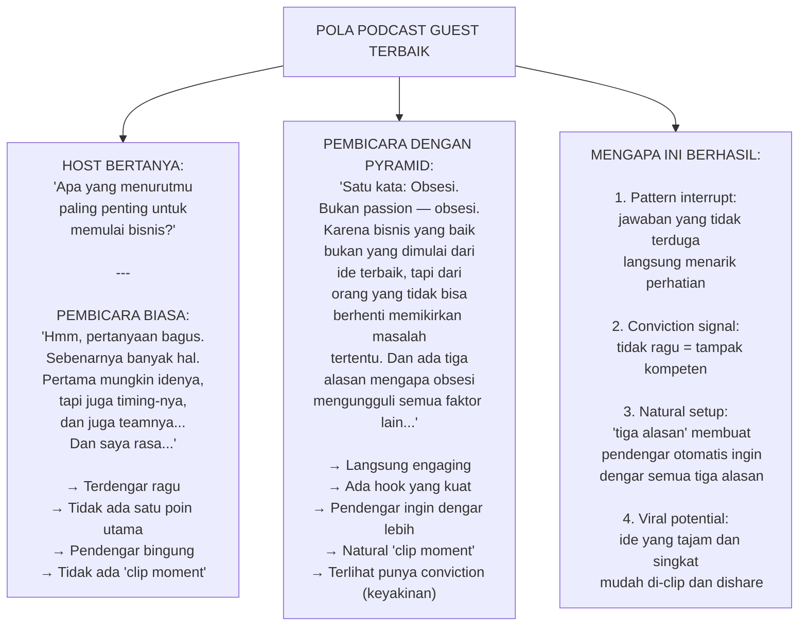
```mermaid
graph TD
    A["POLA PODCAST GUEST TERBAIK"]
    
    A --> B["HOST BERTANYA:\n'Apa yang menurutmu\npaling penting untuk\nmemulai bisnis?'\n\n---\n\nPEMBICARA BIASA:\n'Hmm, pertanyaan bagus.\nSebenarnya banyak hal.\nPertama mungkin idenya,\ntapi juga timing-nya,\ndan juga teamnya...\nDan saya rasa...'\n\n→ Terdengar ragu\n→ Tidak ada satu poin utama\n→ Pendengar bingung\n→ Tidak ada 'clip moment'"]
    
    A --> C["PEMBICARA DENGAN PYRAMID:\n'Satu kata: Obsesi.\nBukan passion — obsesi.\nKarena bisnis yang baik\nbukan yang dimulai dari\nide terbaik, tapi dari\norang yang tidak bisa\nberhenti memikirkan masalah\ntertentu. Dan ada tiga\nalasan mengapa obsesi\nmengungguli semua faktor lain...'\n\n→ Langsung engaging\n→ Ada hook yang kuat\n→ Pendengar ingin dengar lebih\n→ Natural 'clip moment'\n→ Terlihat punya conviction (keyakinan)"]
    
    A --> D["MENGAPA INI BERHASIL:\n\n1. Pattern interrupt:\n   jawaban yang tidak terduga\n   langsung menarik perhatian\n\n2. Conviction signal:\n   tidak ragu = tampak kompeten\n\n3. Natural setup:\n   'tiga alasan' membuat\n   pendengar otomatis ingin\n   dengar semua tiga alasan\n\n4. Viral potential:\n   ide yang tajam dan singkat\n   mudah di-clip dan dishare"]
```

---

## 🌐 Framework 3 (Mahir): Cross-Domain Synthesis (*Sintesis Lintas Bidang*)

Ini adalah framework favorit dan paling advanced — dan juga yang paling membedakan komunikator yang *bagus* dari komunikator yang *luar biasa*.

**Cross-Domain Synthesis** (*sintesis lintas bidang*) adalah kemampuan untuk mengambil pola atau konsep dari satu bidang keilmuan dan menggunakannya untuk menjelaskan fenomena di bidang yang sama sekali berbeda.

Ketika ini dilakukan dengan baik, pendengar mendapatkan dua hal sekaligus: pemahaman tentang topik utama, dan cara baru memandang dunia. Ini adalah definisi "insight yang mengubah perspektif."

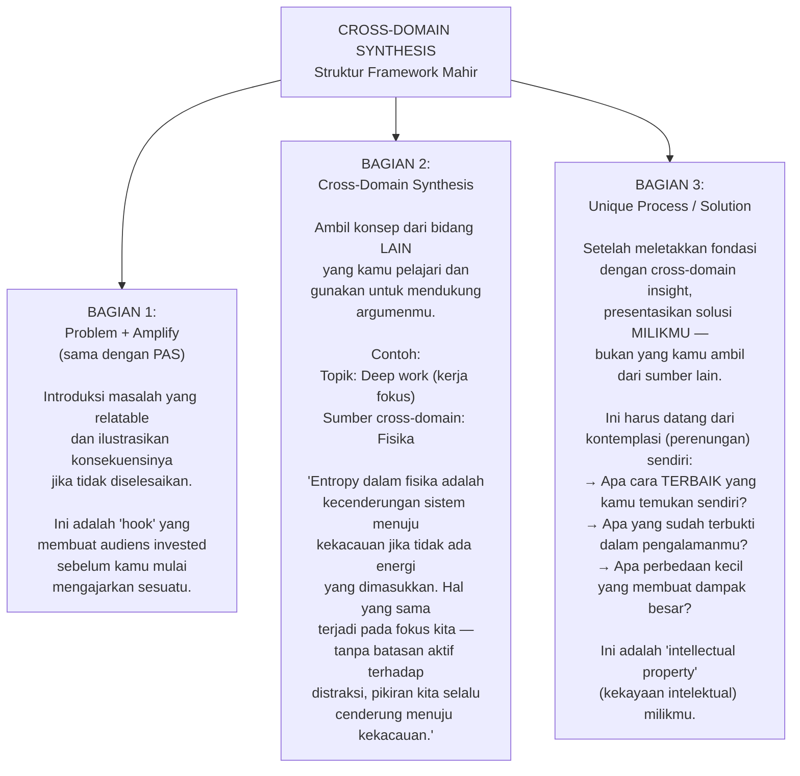
```mermaid
graph TD
    A["CROSS-DOMAIN SYNTHESIS\nStruktur Framework Mahir"]
    
    A --> B["BAGIAN 1:\nProblem + Amplify\n(sama dengan PAS)\n\nIntroduksi masalah yang relatable\ndan ilustrasikan konsekuensinya\njika tidak diselesaikan.\n\nIni adalah 'hook' yang\nmembuat audiens invested\nsebelum kamu mulai\nmengajarkan sesuatu."]
    
    A --> C["BAGIAN 2:\nCross-Domain Synthesis\n\nAmbil konsep dari bidang LAIN\nyang kamu pelajari dan\ngunakan untuk mendukung\nargumenmu.\n\nContoh:\nTopik: Deep work (kerja fokus)\nSumber cross-domain: Fisika\n\n'Entropy dalam fisika adalah\nkecenderungan sistem menuju\nkekacauan jika tidak ada energi\nyang dimasukkan. Hal yang sama\nterjadi pada fokus kita —\ntanpa batasan aktif terhadap\ndistraksi, pikiran kita selalu\ncenderung menuju kekacauan.'"]
    
    A --> D["BAGIAN 3:\nUnique Process / Solution\n\nSetelah meletakkan fondasi\ndengan cross-domain insight,\npresentasikan solusi MILIKMU —\nbukan yang kamu ambil\ndari sumber lain.\n\nIni harus datang dari\nkontemplasi (perenungan) sendiri:\n→ Apa cara TERBAIK yang\n  kamu temukan sendiri?\n→ Apa yang sudah terbukti\n  dalam pengalamanmu?\n→ Apa perbedaan kecil\n  yang membuat dampak besar?\n\nIni adalah 'intellectual property'\n(kekayaan intelektual) milikmu."]
```

### Contoh Konkret Cross-Domain Synthesis

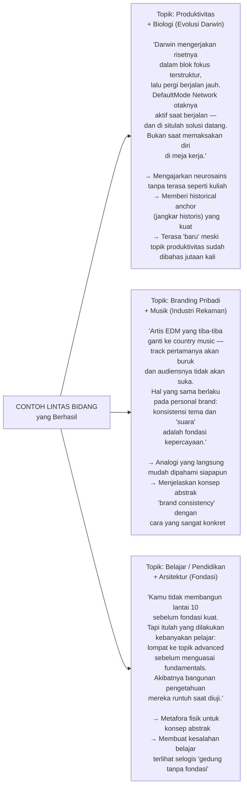
```mermaid
graph LR
    A["CONTOH LINTAS BIDANG\nyang Berhasil"]
    
    A --> B["Topik: Produktivitas\n+ Biologi (Evolusi Darwin)\n\n'Darwin mengerjakan risetnya\ndalam blok fokus terstruktur,\nlalu pergi berjalan jauh.\nDefaultMode Network otaknya\naktif saat berjalan —\ndan di situlah solusi datang.\nBukan saat memaksakan diri\ndi meja kerja.'\n\n→ Mengajarkan neurosains\n  tanpa terasa seperti kuliah\n→ Memberi historical anchor\n  (jangkar historis) yang kuat\n→ Terasa 'baru' meski\n  topik produktivitas sudah\n  dibahas jutaan kali"]
    
    A --> C["Topik: Branding Pribadi\n+ Musik (Industri Rekaman)\n\n'Artis EDM yang tiba-tiba\nganti ke country music —\ntrack pertamanya akan buruk\ndan audiensnya tidak akan suka.\nHal yang sama berlaku\npada personal brand:\nkonsistensi tema dan 'suara'\nadalah fondasi kepercayaan.'\n\n→ Analogi yang langsung\n  mudah dipahami siapapun\n→ Menjelaskan konsep abstrak\n  'brand consistency' dengan\n  cara yang sangat konkret"]
    
    A --> D["Topik: Belajar / Pendidikan\n+ Arsitektur (Fondasi)\n\n'Kamu tidak membangun lantai 10\nsebelum fondasi kuat.\nTapi itulah yang dilakukan\nkebanyakan pelajar:\nlompat ke topik advanced\nsebelum menguasai fundamentals.\nAkibatnya bangunan pengetahuan\nmereka runtuh saat diuji.'\n\n→ Metafora fisik untuk\n  konsep abstrak\n→ Membuat kesalahan belajar\n  terlihat selogis 'gedung\n  tanpa fondasi'"]
```

### "Lego untuk Ide": Blok Pembangun Paragraf

Ketika kamu tahu strukturnya tapi tidak tahu *apa* yang harus ditulis berikutnya, ada **tujuh jenis blok** yang bisa kamu gunakan untuk mengisi setiap bagian dari tulisan atau pembicaraanmu:

```mermaid
graph TD
    A["7 LEGO BLOK UNTUK IDE\nBahan Bangunan Artikulasi"]
    
    A --> B["1. PAIN POINT\n(Titik Nyeri)\n\nMulai seksi baru dengan\nfrustasi atau masalah\nyang relevan dengan topik.\n\nContoh:\n'Satu hal yang paling\nmembuat frustrasi para penulis\npemula adalah...'"]
    
    A --> C["2. CONTOH\n(Example)\n\nGrounding — menjadikan\nhal abstrak menjadi konkret.\nBisa dimasukkan di mana saja\ndalam teks.\n\nContoh:\n'Misalnya, ketika seseorang\nberkata X, yang sebenarnya\nmereka maksud adalah Y...'"]
    
    A --> D["3. PERSONAL STORY\n(Kisah Pribadi)\n\nCerita dari pengalaman sendiri\nyang relevan dengan topik.\nMenambah authenticity dan\nmembuat koneksi emosional.\n\nContoh:\n'Saat pertama kali saya\nmencoba berbicara di depan\nkamera, saya...'"]
    
    A --> E["4. STATISTIK\n(Data/Fakta)\n\nData atau fakta yang\nmemperkuat autoritas argumenmu.\nHarus akurat dan dari\nsumber yang dapat dipercaya.\n\nContoh:\n'Penelitian dari Stanford\nmenunjukkan bahwa 93%\nkomunikasi adalah non-verbal...'"]
    
    A --> F["5. METAFORA\n(Perumpamaan)\n\nJelaskan ide kompleks\nseolah berbicara kepada anak.\nAlan Watts adalah master\ndalam teknik ini.\n\nContoh:\n'Fokus itu seperti sinar matahari.\nTanpa lensa pemfokus, sinarnya\nhanya hangat. Dengan lensa,\nia bisa membakar.'"]
    
    A --> G["6. KUTIPAN\n(Quote)\n\nKutipan dari orang yang\ndipercaya untuk memperkuat\npoinmu. Hampir selalu berhasil\nkarena kutipan bagus\nadalah ide bagus yang\nsudah terformulasikan dengan\nbagus.\n\nContoh:\n'Seperti yang dikatakan Feynman:\n\"Jika kamu tidak bisa\nmenjelaskannya dengan sederhana,\nkamu belum benar-benar mengerti.\"'"]
    
    A --> H["7. REFRAME\n(Pergeseran Perspektif)\n\nBerikan sudut pandang\nberbeda atas poin yang\nbaru saja dibahas.\nIni adalah momen 'AHA'\nbagi pembaca.\n\nContoh:\n'Tapi coba lihat dari\nsudut yang berbeda:\nbukan masalahnya yang sulit —\ntapi cara kamu mendefinisikan\nmasalahnya yang perlu diubah.'"]
```

### Teknik Cycling (*Rotasi*) saat Tersandung

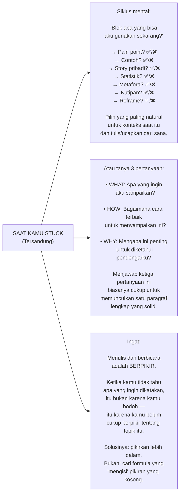
```mermaid
graph LR
    A["SAAT KAMU STUCK\n(Tersandung)"]
    
    A --> B["Siklus mental:\n\n'Blok apa yang bisa\naku gunakan sekarang?'\n\n→ Pain point? ✅/❌\n→ Contoh? ✅/❌\n→ Story pribadi? ✅/❌\n→ Statistik? ✅/❌\n→ Metafora? ✅/❌\n→ Kutipan? ✅/❌\n→ Reframe? ✅/❌\n\nPilih yang paling natural\nuntuk konteks saat itu\ndan tulis/ucapkan dari sana."]
    
    A --> C["Atau tanya 3 pertanyaan:\n\n• WHAT: Apa yang ingin\n  aku sampaikan?\n\n• HOW: Bagaimana cara terbaik\n  untuk menyampaikan ini?\n\n• WHY: Mengapa ini penting\n  untuk diketahui pendengarku?\n\nMenjawab ketiga pertanyaan ini\nbiasanya cukup untuk\nmemunculkan satu paragraf\nlengkap yang solid."]
    
    A --> D["Ingat:\n\nMenulis dan berbicara\nadalah BERPIKIR.\n\nKetika kamu tidak tahu\napa yang ingin dikatakan,\nitu bukan karena kamu bodoh —\nitu karena kamu belum\ncukup berpikir tentang topik itu.\n\nSolusinya: pikirkan lebih dalam.\nBukan: cari formula yang\n'mengisi' pikiran yang kosong."]
```

---

## ✍️ Menulis sebagai Latihan Artikulasi

Ada satu praktik yang menjadi fondasi dari semua framework di atas: **menulis setiap hari**.

Bukan menulis untuk dipublikasikan. Bukan menulis untuk audiens. Menulis sebagai **proses berpikir** itu sendiri.

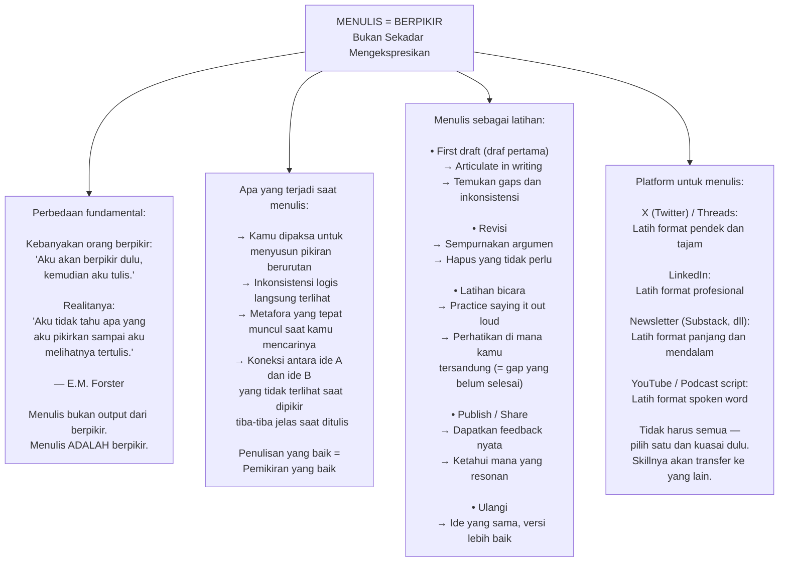
```mermaid
graph TD
    A["MENULIS = BERPIKIR\nBukan Sekadar Mengekspresikan"]
    
    A --> B["Perbedaan fundamental:\n\nKebanyakan orang berpikir:\n'Aku akan berpikir dulu,\nkemudian aku tulis.'\n\nRealitanya:\n'Aku tidak tahu apa yang\naku pikirkan sampai aku\nmelihatnya tertulis.'\n\n— E.M. Forster\n\nMenulis bukan output dari berpikir.\nMenulis ADALAH berpikir."]
    
    A --> C["Apa yang terjadi saat menulis:\n\n→ Kamu dipaksa untuk\n  menyusun pikiran berurutan\n→ Inkonsistensi logis\n  langsung terlihat\n→ Metafora yang tepat\n  muncul saat kamu mencarinya\n→ Koneksi antara ide A dan ide B\n  yang tidak terlihat saat dipikir\n  tiba-tiba jelas saat ditulis\n\nPenulisan yang baik =\nPemikiran yang baik"]
    
    A --> D["Menulis sebagai latihan:\n\n• First draft (draf pertama)\n  → Articulate in writing\n  → Temukan gaps dan inkonsistensi\n\n• Revisi\n  → Sempurnakan argumen\n  → Hapus yang tidak perlu\n\n• Latihan bicara\n  → Practice saying it out loud\n  → Perhatikan di mana kamu\n    tersandung (= gap yang belum selesai)\n\n• Publish / Share\n  → Dapatkan feedback nyata\n  → Ketahui mana yang resonan\n\n• Ulangi\n  → Ide yang sama, versi lebih baik"]
    
    A --> E["Platform untuk menulis:\n\nX (Twitter) / Threads:\nLatih format pendek dan tajam\n\nLinkedIn:\nLatih format profesional\n\nNewsletter (Substack, dll):\nLatih format panjang dan mendalam\n\nYouTube / Podcast script:\nLatih format spoken word\n\nTidak harus semua —\npilih satu dan kuasai dulu.\nSkillnya akan transfer ke yang lain."]
```

---

## 🔄 Sistem Lengkap: Dari Ide ke Artikulasi

Sekarang mari satukan semua komponen ini menjadi satu sistem yang kohesif:

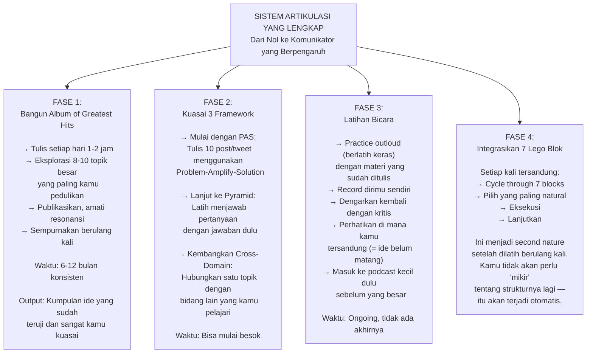
```mermaid
graph TD
    A["SISTEM ARTIKULASI YANG LENGKAP\nDari Nol ke Komunikator yang Berpengaruh"]
    
    A --> B["FASE 1:\nBangun Album of Greatest Hits\n\n→ Tulis setiap hari 1-2 jam\n→ Eksplorasi 8-10 topik besar\n  yang paling kamu pedulikan\n→ Publikasikan, amati resonansi\n→ Sempurnakan berulang kali\n\nWaktu: 6-12 bulan konsisten\n\nOutput: Kumpulan ide yang sudah\nteruji dan sangat kamu kuasai"]
    
    A --> C["FASE 2:\nKuasai 3 Framework\n\n→ Mulai dengan PAS:\n  Tulis 10 post/tweet menggunakan\n  Problem-Amplify-Solution\n\n→ Lanjut ke Pyramid:\n  Latih menjawab pertanyaan\n  dengan jawaban dulu\n\n→ Kembangkan Cross-Domain:\n  Hubungkan satu topik dengan\n  bidang lain yang kamu pelajari\n\nWaktu: Bisa mulai besok"]
    
    A --> D["FASE 3:\nLatihan Bicara\n\n→ Practice outloud (berlatih keras)\n  dengan materi yang sudah ditulis\n→ Record dirimu sendiri\n→ Dengarkan kembali dengan kritis\n→ Perhatikan di mana kamu\n  tersandung (= ide belum matang)\n→ Masuk ke podcast kecil dulu\n  sebelum yang besar\n\nWaktu: Ongoing, tidak ada akhirnya"]
    
    A --> E["FASE 4:\nIntegrasikan 7 Lego Blok\n\nSetiap kali tersandung:\n→ Cycle through 7 blocks\n→ Pilih yang paling natural\n→ Eksekusi\n→ Lanjutkan\n\nIni menjadi second nature\nsetelah dilatih berulang kali.\nKamu tidak akan perlu 'mikir'\ntentang strukturnya lagi —\nitu akan terjadi otomatis."]
```

---

## 💡 Insight Mendalam: Artikulasi adalah Cermin Pemikiran

Di balik semua teknik dan framework ini, ada satu kebenaran fundamental yang perlu dipahami:

**Kemampuan artikulasi bukan hanya tentang cara menyampaikan — ini tentang kedalaman pemikiran itu sendiri.**

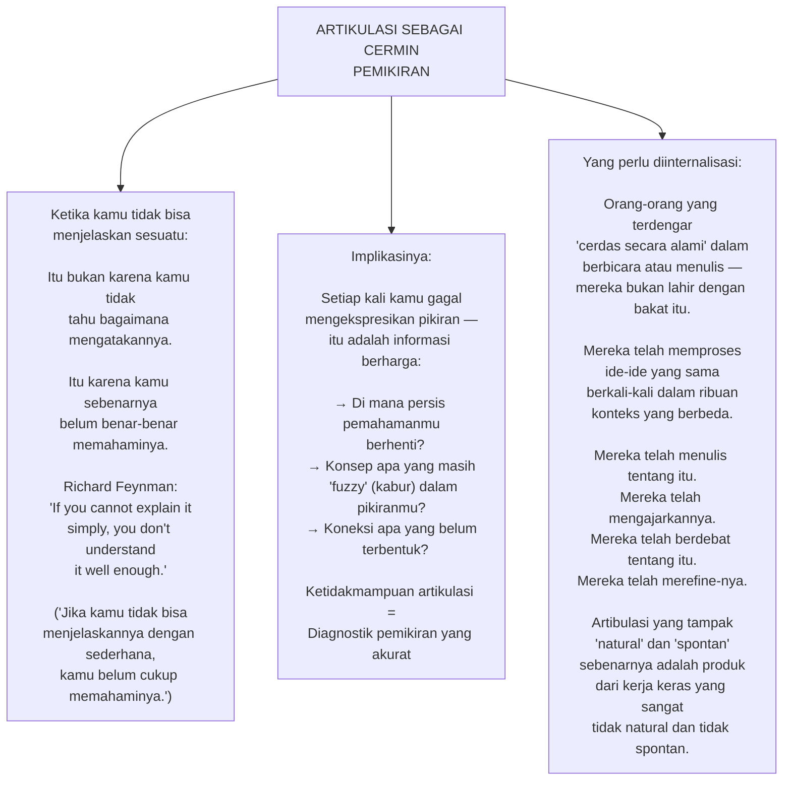
```mermaid
graph TD
    A["ARTIKULASI SEBAGAI CERMIN\nPEMIKIRAN"]
    
    A --> B["Ketika kamu tidak bisa\nmenjelaskan sesuatu:\n\nItu bukan karena kamu tidak\ntahu bagaimana mengatakannya.\n\nItu karena kamu sebenarnya\nbelum benar-benar memahaminya.\n\nRichard Feynman:\n'If you cannot explain it\nsimply, you don't understand\nit well enough.'\n\n('Jika kamu tidak bisa\nmenjelaskannya dengan sederhana,\nkamu belum cukup memahaminya.')"]
    
    A --> C["Implikasinya:\n\nSetiap kali kamu gagal\nmengekspresikan pikiran —\nitu adalah informasi berharga:\n\n→ Di mana persis pemahamanmu\n  berhenti?\n→ Konsep apa yang masih\n  'fuzzy' (kabur) dalam pikiranmu?\n→ Koneksi apa yang belum\n  terbentuk?\n\nKetidakmampuan artikulasi =\nDiagnostik pemikiran yang akurat"]
    
    A --> D["Yang perlu diinternalisasi:\n\nOrang-orang yang terdengar\n'cerdas secara alami' dalam\nberbicara atau menulis —\nmereka bukan lahir dengan bakat itu.\n\nMereka telah memproses\nide-ide yang sama\nberkali-kali dalam ribuan\nkonteks yang berbeda.\n\nMereka telah menulis tentang itu.\nMereka telah mengajarkannya.\nMereka telah berdebat tentang itu.\nMereka telah merefine-nya.\n\nArtibulasi yang tampak\n'natural' dan 'spontan'\nsebenarnya adalah produk\ndari kerja keras yang sangat\ntidak natural dan tidak spontan."]
```

---

## 📋 Action Plan: Mulai Hari Ini

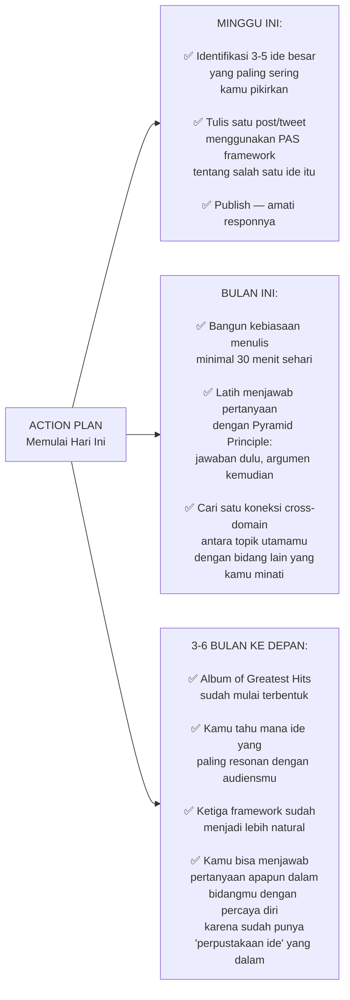
```mermaid
graph LR
    A["ACTION PLAN\nMemulai Hari Ini"]
    
    A --> B["MINGGU INI:\n\n✅ Identifikasi 3-5 ide besar\n   yang paling sering\n   kamu pikirkan\n\n✅ Tulis satu post/tweet\n   menggunakan PAS framework\n   tentang salah satu ide itu\n\n✅ Publish — amati responnya"]
    
    A --> C["BULAN INI:\n\n✅ Bangun kebiasaan menulis\n   minimal 30 menit sehari\n\n✅ Latih menjawab pertanyaan\n   dengan Pyramid Principle:\n   jawaban dulu, argumen kemudian\n\n✅ Cari satu koneksi cross-domain\n   antara topik utamamu\n   dengan bidang lain yang\n   kamu minati"]
    
    A --> D["3-6 BULAN KE DEPAN:\n\n✅ Album of Greatest Hits\n   sudah mulai terbentuk\n\n✅ Kamu tahu mana ide yang\n   paling resonan dengan audiensmu\n\n✅ Ketiga framework sudah\n   menjadi lebih natural\n\n✅ Kamu bisa menjawab\n   pertanyaan apapun dalam\n   bidangmu dengan percaya diri\n   karena sudah punya\n   'perpustakaan ide' yang dalam"]
```

---

## 🎯 Kesimpulan: Artikulasi adalah Skill, Bukan Bakat

Kemampuan berbicara dan menulis dengan cerdas bukan sesuatu yang kamu miliki sejak lahir atau tidak. Ini adalah skill — dan seperti semua skill, ia bisa dilatih, dikembangkan, dan diasah menjadi tajam.

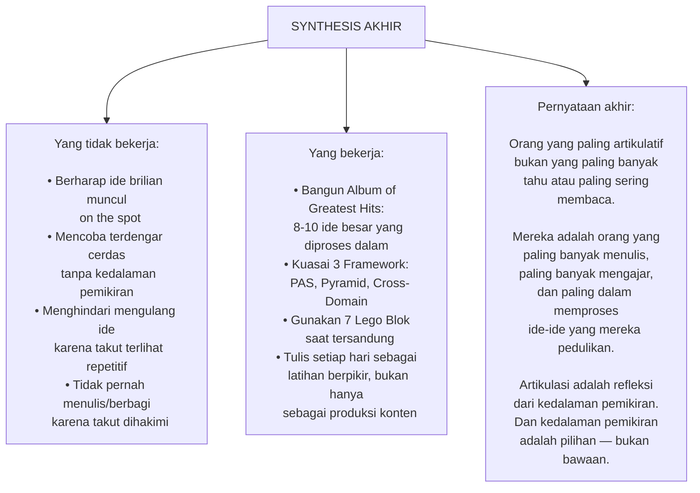
```mermaid
graph TD
    A["SYNTHESIS AKHIR"]
    
    A --> B["Yang tidak bekerja:\n\n• Berharap ide brilian muncul\n  on the spot\n• Mencoba terdengar cerdas\n  tanpa kedalaman pemikiran\n• Menghindari mengulang ide\n  karena takut terlihat repetitif\n• Tidak pernah menulis/berbagi\n  karena takut dihakimi"]
    
    A --> C["Yang bekerja:\n\n• Bangun Album of Greatest Hits:\n  8-10 ide besar yang diproses dalam\n• Kuasai 3 Framework:\n  PAS, Pyramid, Cross-Domain\n• Gunakan 7 Lego Blok\n  saat tersandung\n• Tulis setiap hari sebagai\n  latihan berpikir, bukan hanya\n  sebagai produksi konten"]
    
    A --> D["Pernyataan akhir:\n\nOrang yang paling artikulatif\nbukan yang paling banyak\ntahu atau paling sering\nmembaca.\n\nMereka adalah orang yang\npaling banyak menulis,\npaling banyak mengajar,\ndan paling dalam memproses\nide-ide yang mereka pedulikan.\n\nArtikulasi adalah refleksi\ndari kedalaman pemikiran.\nDan kedalaman pemikiran\nadalah pilihan — bukan bawaan."]
```

Mulai hari ini: tulis satu ide yang paling kamu pedulikan. Gunakan PAS framework. Publish. Amati. Perbaiki. Ulangi.

*Itulah jalannya.* 🚀

---

## 📚 Glosarium Lengkap

| Istilah | Bahasa Asli | Makna dalam Bahasa Indonesia |
|---|---|---|
| **Artikulasi** | Latin (*articulare*) | Kemampuan mengungkapkan pikiran dengan jelas dan terstruktur |
| **PAS Framework** | Inggris (akronim) | Problem-Amplify-Solution — kerangka komunikasi yang dimulai dari masalah |
| **Copywriting** | Inggris | Penulisan persuasif untuk tujuan pemasaran atau komunikasi |
| **Pyramid Principle** | Inggris | Prinsip Piramida — struktur komunikasi yang dimulai dari kesimpulan |
| **Answer-first approach** | Inggris | Pendekatan jawaban dulu — berkebalikan dengan suspensi klasik |
| **Cross-domain synthesis** | Inggris | Sintesis lintas bidang — menghubungkan pola dari berbagai disiplin ilmu |
| **Hook** | Inggris | Kait — pembuka yang menarik perhatian langsung |
| **Body of work** | Inggris | Karya — seluruh portofolio karya seseorang dalam suatu bidang |
| **Pattern interrupt** | Inggris | Interupsi pola — sesuatu yang memotong ekspektasi audiens |
| **Clip moment** | Inggris (media) | Momen yang sangat 'clippable' — bisa dipotong dan disebarluaskan |
| **Viral** | Inggris | Menyebar cepat secara organik di media sosial |
| **Resonan** | Latin (*resonare*) | Beresonansi — terkoneksi secara emosional dengan audiens |
| **Ad lib** | Latin (*ad libitum*) | Improvisasi tanpa naskah atau persiapan |
| **Conviction** | Latin | Keyakinan yang kuat — terlihat dari cara berbicara dengan penuh kepercayaan |
| **Intellectual property** | Inggris | Kekayaan intelektual — ide atau ciptaan original milik seseorang |
| **Default Mode Network** | Inggris (neurosains) | Jaringan saraf otak aktif saat pikiran tidak terfokus (untuk shower thoughts) |
| **Entropy** | Yunani | Dalam fisika: kecenderungan sistem menuju kekacauan; dalam konteks ini: digunakan sebagai metafora distraksi |
| **Authenticity** | Yunani | Keaslian — kualitas yang membuat konten atau komunikasi terasa genuine dan jujur |
| **Historical anchor** | Inggris | Jangkar historis — referensi historis yang memberi konteks dan bobot pada argumen |
| **Executive briefing** | Inggris | Briefing eksekutif — format presentasi singkat dan padat untuk pengambil keputusan |
| **Pain point** | Inggris (marketing) | Titik nyeri — masalah atau frustrasi yang dirasakan oleh target audiens |
| **Grounding** | Inggris | Penjangkaran — teknik membuat konsep abstrak menjadi konkret |
| **Insight** | Inggris | Wawasan mendalam — pemahaman yang menembus permukaan ke inti permasalahan |
| **Contemplation** | Latin | Kontemplasi/perenungan — proses berpikir mendalam tanpa distraksi |
| **Fuzzy** | Inggris | Kabur/samar — pemahaman yang belum jelas dan terformulasikan dengan baik |

---

*Sumber video: [How To Articulate Your Thoughts Intelligently (Talk Like This) — YouTube](https://www.youtube.com/watch?v=DKT6m_8vCkA)*

*Referensi yang disebutkan dalam video: Alan Watts (filsuf); Jordan Peterson (psikolog klinis); Alex Hormozi (pengusaha); Barbara Minto — Pyramid Principle; Richard Feynman — teknik penjelasan sederhana.*
