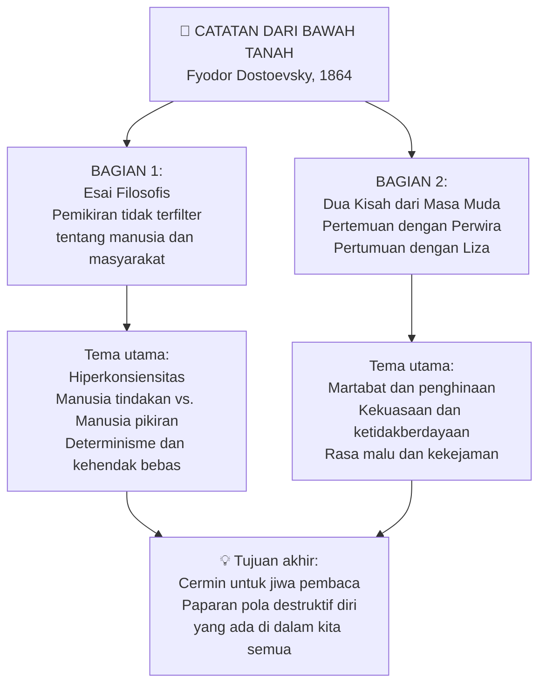
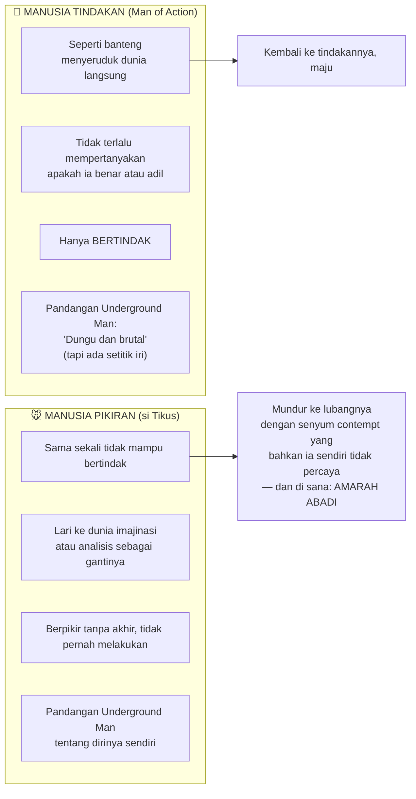
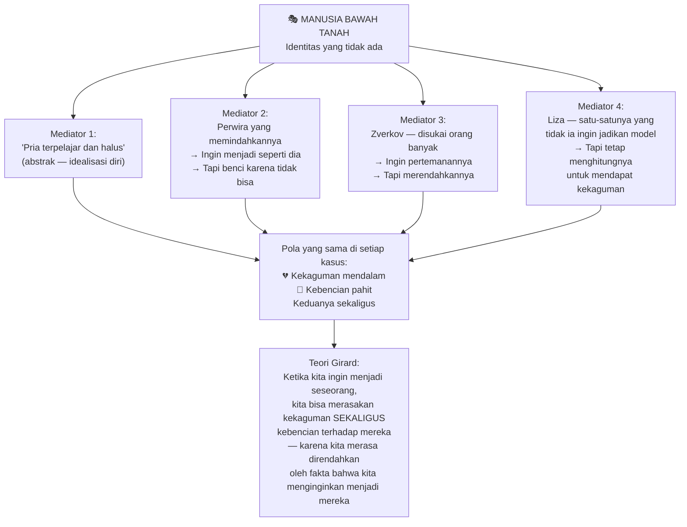
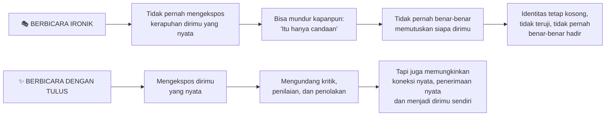
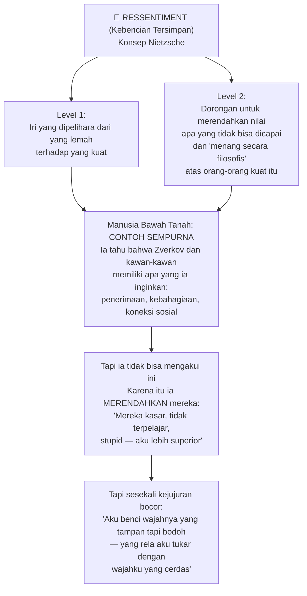
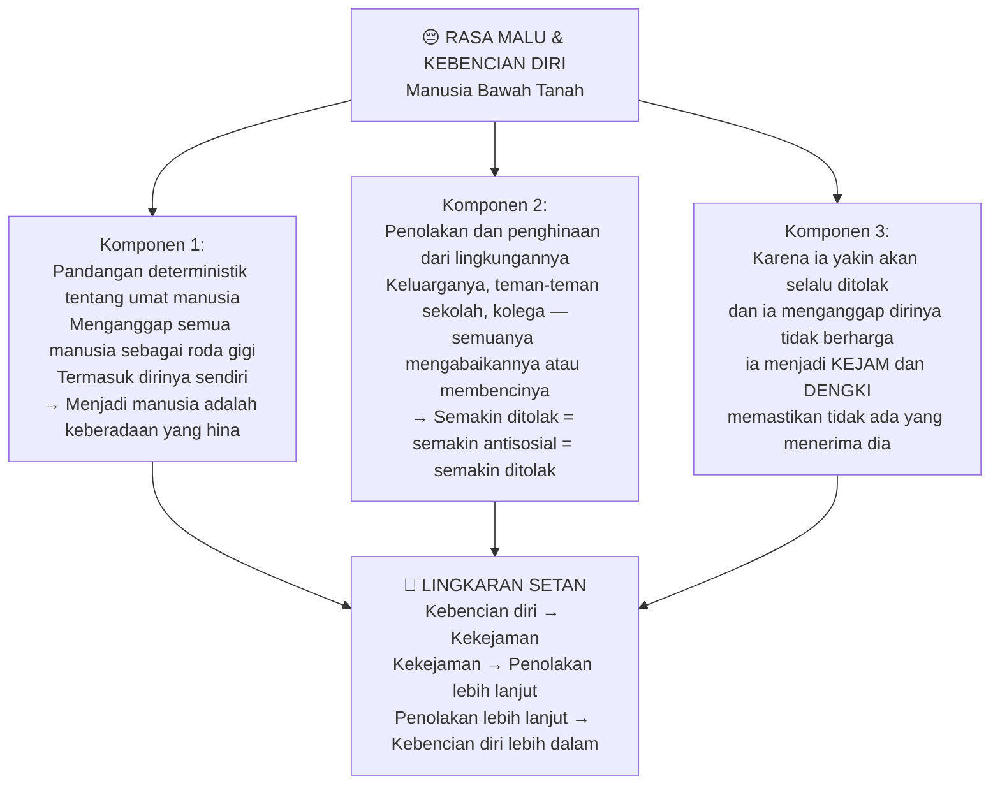
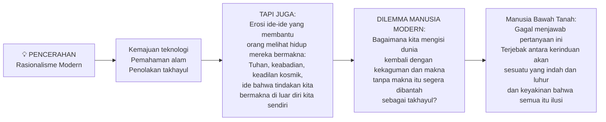
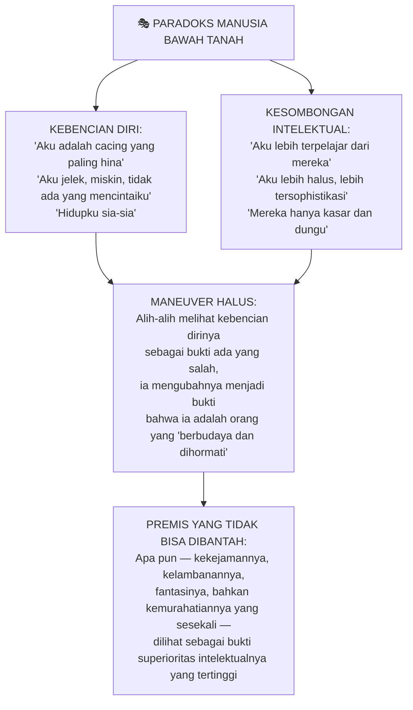
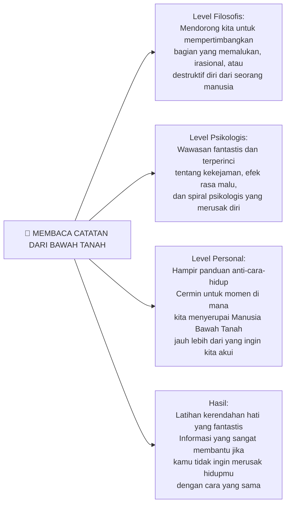

## 🕳️ Pembuka: Buku yang Mengubah Segalanya

Ada buku-buku yang menghibur, ada yang mendidik, dan ada yang mengubah cara kamu memandang dirimu sendiri selamanya.

*Catatan dari Bawah Tanah* (*Notes from Underground*, 1864) karya **Fyodor Mikhailovich Dostoevsky** adalah yang terakhir — dan mungkin yang paling menyakitkan.

Ini adalah buku yang **paling penting** yang pernah dibaca oleh banyak pembaca filsafat. Bukan karena menyenangkan. Tidak. Buku ini tidak menyenangkan sama sekali. Ini adalah pengalaman yang melelahkan, kadang menjijikkan, dan setelah membacanya kamu akan merasa tidak enak — bukan karena ceritanya jelek, tapi karena ceritanya terlalu bagus, terlalu jujur tentang hal-hal yang tidak ingin kamu akui tentang dirimu sendiri.

**Walter Kaufmann** — filsuf dan penerjemah yang mendedikasikan hidupnya untuk memperkenalkan Nietzsche dan eksistensialisme ke dunia berbahasa Inggris — menyebut *Catatan dari Bawah Tanah* sebagai *"the best overture for existentialist philosophy ever written"* (prolog terbaik untuk filsafat eksistensialis yang pernah ditulis).

**Friedrich Nietzsche** sendiri, filsuf yang terkenal sangat jarang memuji siapapun, mengatakan bahwa Dostoevsky adalah satu-satunya psikolog yang memiliki sesuatu untuk diajarkan padanya.

Ini adalah kisah tentang manusia paling menjijikkan, paling jahat, dan paling membenci dalam sastra. Dan ini juga kisah tentang **kita** — mengekspos aspek tergelap dari jiwa manusia yang sering kita berpura-pura tidak ada.

Mari kita bedah genius ini satu per satu. 🔍

---

## 📖 Bagian Pertama: Sinopsis — Siapa Manusia Bawah Tanah?

### Dua Bagian, Satu Kegelapan

*Catatan dari Bawah Tanah* dibagi menjadi dua bagian:

**Bagian 1: "Underground" (Bawah Tanah)**
Sebuah esai terpilin di mana protagonis kita — yang tidak pernah disebutkan namanya, kita hanya mengenalnya sebagai **"Manusia Bawah Tanah"** (*The Underground Man*) — menguraikan filsafatnya tentang umat manusia, pendidikan, egoisme, dan alam semesta. Ini adalah pikiran tanpa filter dari seseorang yang telah menyerah pada kehidupan sosial dan mengunci dirinya di apartemen kecil di St. Petersburg.

Beberapa fakta yang kita ketahui tentangnya:
- 🎂 Usianya **40 tahun**
- 📝 Tidak tahu siapa yang ia tulis atau untuk tujuan apa
- 🧠 Menganggap dirinya sendiri **sangat cerdas**, mampu merenungkan "semua hal yang indah dan luhur"
- 💼 Bekas pegawai sipil (*civil servant*) yang menemukan kepuasan dalam menyiksa orang dan menolak permintaan mereka — sebelum akhirnya berhenti dan mengunci diri di apartemennya

**Bagian 2: "Apropos of the Wet Snow" (Tentang Salju Basah)**
Dua kisah absurd dari masa mudanya ketika ia berusia 20-an, yang ingatannya terus menghantui dia hingga hari ini.

### Kisah Perwira — Dua Tahun Demi Sebuah Senggolan

Suatu hari di sebuah kedai, seorang perwira militer yang berdiri di samping Manusia Bawah Tanah — alih-alih memintanya untuk minggir — **memindahkannya secara fisik tanpa menoleh padanya sama sekali**, seolah-olah ia adalah sebuah meja atau kursi yang kebetulan ada di jalan.

Bukan memukul. Bukan menghina. Hanya... mengabaikan.

Dan itulah yang membakar Manusia Bawah Tanah selama **dua tahun penuh**.

*"Aku mungkin bisa menanggung bahkan pukulan. Tapi tindakan ini, yang membawa pesan implisit bahwa aku bahkan tidak layak untuk diajak bicara, tidak layak untuk dipertimbangkan — itulah yang menghanguskanku dari dalam."*

Dua tahun kemudian, ia menyusun rencana balas dendam yang luar biasa aneh: ia akan berjalan di jalan yang biasa dilalui perwira itu dan **menolak memberi jalan padanya** — berjalan langsung bertabrakan. Ia berlatih berkali-kali, tapi terus mundur di detik terakhir. Akhirnya, setelah berhutang untuk membeli pakaian bagus agar "sepadan" secara status, ia berhasil — **menabrak bahu perwira itu**.

Perwira itu bahkan tidak menoleh.

Tapi Manusia Bawah Tanah pulang ke rumahnya dan **tidur dalam kegembiraan luar biasa**. Ia merasa telah mempertahankan martabatnya. Ia membuktikan dirinya setara.

Dan 14 tahun kemudian, ia masih memikirkan peristiwa itu.

### Kisah Liza — Kebaikan yang Dihancurkan

Kisah kedua jauh lebih gelap. Setelah malam yang memalukan bersama orang-orang yang ia tidak disukai, Manusia Bawah Tanah pergi ke rumah bordil (*brothel*) dan bertemu **Liza** — seorang perempuan muda berusia 20 tahun yang menjadi pelacur karena keputusasaan.

Ia mengolok-olok Liza dengan penuh sadisme psikologis: *"Meski kamu masih muda dan cantik sekarang, segera kamu akan habis terbakar dan mati karena penyakit mengerikan. Tidak ada yang akan menangisi kamu."*

Anehnya, alih-alih membenci dia, Liza menghormati kejujuran brutalnya. Dan Manusia Bawah Tanah, sejenak merasa seperti pahlawan, memberikan alamatnya.

Ketika Liza datang mengunjunginya — dan menyaksikan kemiskinan dan kesengsaraan nyatanya — Manusia Bawah Tanah **akhirnya jujur untuk pertama kalinya** dalam hidupnya. Ia menangis dan mengakui bahwa ia adalah manusia paling hina, paling ridicul, dan paling bodoh dari semua cacing di bumi.

Liza — meski baru saja dihina dan diolok — **memeluknya**.

Ini adalah momen yang dalam hampir semua cerita lain akan menjadi titik balik. Koneksi antarmanusia yang nyata setelah lautan kesepian.

Tapi ini bukan cerita lain.

Manusia Bawah Tanah, yang tidak tahu bagaimana bereaksi terhadap kebaikan sejati, memberikan Liza **uang lima rubel** yang terlipat — menegaskan bahwa ini bukan pertemuan dua manusia, melainkan ia hanya membayar jasanya. Liza melempar uang itu dan lari.

Ia mengejar. Lalu berbalik dan kembali ke gua bawah tanahnya.

*"Bahkan bertahun-tahun kemudian, ini adalah salah satu kenangan paling menyakitkan yang kumiliki."*

---

## 🧠 Bagian Kedua: Hiperkonsiensitas — Penyakit yang Mengutuk Orang Cerdas

*"Saya meyakinkan kamu, tuan-tuan, bahwa menjadi terlalu sadar diri adalah sebuah penyakit. Penyakit nyata yang sesungguhnya."*

Jika kamu mengklik video tentang Dostoevsky, kemungkinan besar kamu adalah tipe orang yang senang berpikir dan merenung. Ini bukan hal yang buruk sama sekali. Kemampuan untuk menguji hidupmu sendiri adalah langkah awal untuk mengubahnya.

Tapi sikap Manusia Bawah Tanah adalah sesuatu yang berbeda. Ia bukan sekadar *self-conscious* (*sadar diri*) — ia adalah **hyperconscious** (*hipersadar*): tidak mampu hidup tanpa pemikiran yang sangat panjang, terutama tentang dirinya sendiri.

### Manusia Tindakan vs. Manusia Pikiran — Si Banteng dan Si Tikus

Manusia Bawah Tanah membuat pembedaan yang sangat jelas antara dua tipe manusia:

Manusia Bawah Tanah memandang tipe pertama dengan **kebencian sekaligus iri yang tersembunyi**. Ia merasa bahwa kemampuan untuk bertindak langsung hanya mungkin dicapai oleh orang yang jauh lebih bodoh darinya — sebuah pembenaran elegan untuk ketidakmampuannya sendiri.

Akibatnya, ia menjadi seperti seseorang yang terus **menggaruk keraknya sendiri sambil mengeluhkan rasa sakitnya**. Ia merenungkan penghinaan dari perwira itu bukan selama satu hari atau seminggu, tapi **dua tahun penuh** — dan masih memikirkannya 14 tahun kemudian.

### Rumination — Ketika Pikiran Menjadi Penyiksa Diri Sendiri

**Judith Herman**, spesialis trauma terkemuka, mendokumentasikan pola ini secara mendalam. Orang-orang yang mengalami trauma sering mengalami *rumination* (*ruminasi*: memamah-biak ingatan) — membayangkan berulang kali semua yang bisa mereka lakukan secara berbeda.

Mekanisme ini mungkin awalnya memiliki tujuan yang berguna: mengekstraksi pelajaran dari situasi berbahaya. Tapi bagi Manusia Bawah Tanah — dan bagi banyak orang di luar konteks trauma sekalipun — ia menjadi **sumber penderitaan yang tak berujung**.

Kita semua pernah merasakannya:

> Seseorang menghinamu dan kamu tidak mampu berbuat apa-apa saat itu. Kamu ingin menemukan jawaban cerdas, tapi lidahmu kelu. Akibatnya kamu tidak bisa melepaskannya — kamu melatihnya berulang kali di pikiranmu, setiap kali membuka luka yang sedang sembuh. Kadang kamu baru menyadari kata-kata yang seharusnya kamu ucapkan **tiga hari kemudian di kamar mandi**.

Ini relatif tidak berbahaya. Tapi dalam versi ekstremnya — versi yang dialami Manusia Bawah Tanah — ia menjadi obsesi yang melumpuhkan.

Akibatnya, Manusia Bawah Tanah **sama sekali tidak mampu bertindak**. Bukan karena takut kekerasan fisik — tapi karena ia tidak pernah bisa mengerahkan gairah yang cukup untuk melakukan sesuatu. Bahkan kebenciannya, seperti yang ia akui sendiri, adalah *"jenis yang kecil dan miskin"* — membatasi dirinya pada penghinaan kecil dan kekejaman-kekejaman sepele di Petersburg.

*"Kekejaman yang berasal dari kepala, bukan dari hati."*

---

## 🪞 Bagian Ketiga: Autentisitas dan Ego yang Hancur

*"Aku bahkan tidak pernah berhasil menjadi apapun. Bukan dengki, bukan baik. Bukan bajingan, bukan orang jujur. Bukan pahlawan, bukan serangga."*

### Identitas yang Dimediasi Orang Lain

**Renée Girard** — filsuf Prancis terkenal dengan teori *mimetic desire* (*hasrat mimetis*: keinginan yang ditiru dari orang lain) — memberikan salah satu analisis paling tajam tentang *Catatan dari Bawah Tanah*.

Menurutnya, Manusia Bawah Tanah tidak memiliki identitas sendiri yang koheren. **Semua keinginannya dimediasi oleh orang-orang di sekitarnya** — ia tidak tahu apa yang ia inginkan sebagai individu, tapi hasratnya selalu mengikuti model eksternal.

Girard menyebut orang-orang ini sebagai **mediators** (*mediator*: perantara): model-model eksternal yang membentuk apa yang diinginkan Manusia Bawah Tanah.

Salah satu momen yang paling mengharukan: Manusia Bawah Tanah, yang menghabiskan dua tahun membenci perwira itu, juga **membayangkan memenangkan persahabatan perwira itu** — mengirimkan surat yang begitu indah dan elegan sehingga perwira itu langsung mencarinya untuk berteman.

Ini sangat membingungkan — sampai kamu memahami dinamika Girard: ketika kita menginginkan menjadi seseorang, kita bisa merasakan kekaguman mendalam DAN kebencian yang aneh terhadap mereka secara bersamaan.

### Ironi sebagai Mekanisme Pertahanan

Tapi sumber utama ketidakautentikan Manusia Bawah Tanah adalah **ironi** yang digunakan sebagai perisai.

Apa artinya berbicara secara ironik? Sederhananya: **kamu tidak pernah mengekspos dirimu yang sebenarnya**.

Jika aku memberikan pendapatku yang jujur — misalnya, bahwa *Saudara Karamazov* adalah novel favoritku — ini membuka diriku terhadap berbagai kritik. Kamu bisa mengatakan itu adalah pilihan yang tidak orisinal. Kamu bisa menunjukkan kebutaan tertentu dalam pemahamanku tentang sastra.

Untuk mengungkapkan pendapat yang jujur tentang subjek apapun, betapapun sepelenya, adalah **mengundang dunia untuk mengkritikmu**. Hal yang sama berlaku untuk perasaan yang tulus, persahabatan yang sungguh-sungguh, atau keyakinan yang teguh.

Setiap kali kamu mengatakan sesuatu dengan tulus, kamu sedang berkata: *"Inilah sesuatu tentang aku yang aku anggap serius. Silakan tembak."*

Ironi tidak memiliki risiko itu. Berbicara secara ironik adalah berbicara seolah-olah kamu adalah orang lain. Kamu secara halus **mengingkari hal yang kamu katakan** dan tidak pernah terlalu jelas apakah itu benar-benar keyakinanmu atau hanya sesuatu yang kamu angkat untuk diperiksa.

**Bahayanya** muncul ketika ironi menjadi satu-satunya cara kamu berbicara kepada orang lain — bahkan kepada dirimu sendiri. Dengan tidak pernah berkomitmen pada apapun, kamu secara efektif **tidak pernah memutuskan siapa kamu ingin menjadi**.

Seperti yang dikatakan **Nietzsche**: ini adalah kegagalan menjadi dirimu sendiri.

Seperti yang dikatakan **Kierkegaard**: ini adalah hidup yang hanya menggerus permukaan estetis, tidak pernah sungguh-sungguh berkomitmen pada versi apapun dari dirimu untuk waktu apapun.

Manusia Bawah Tanah melompat-lompat antara mengatakan ia bercanda dan kemudian tidak. Ia mengatakan ia pengecut, lalu menyangkal. Ia mengklaim membenci Liza, namun membayangkan menikahinya. Ini bukan kebohongan — seorang pembohong setidaknya masih peduli dengan kebenaran. Seperti yang ditulis **Harry Frankfurt** dalam esainya tentang *bullshit* (*omong kosong*), Manusia Bawah Tanah adalah **sang pembual**: seseorang yang berbicara tanpa perhatian apapun terhadap apa yang benar atau salah, hanya dengan faktor lain — dalam kasusnya, mungkin menjadi cerdas, atau sementara menyelamatkan martabatnya.

*"Dalam setiap ingatan manusia, ada hal-hal yang tidak akan ia ungkapkan kepada siapapun kecuali kepada temannya. Dan ada hal-hal yang tidak akan ia ungkapkan bahkan kepada temannya, hanya kepada dirinya sendiri. Dan bahkan itu, di bawah selubung kerahasiaan. Tapi akhirnya, ada hal-hal yang bahkan ia takut untuk mengungkapkannya kepada dirinya sendiri."*

---

## ⚔️ Bagian Keempat: Ketidakberdayaan, Kekuasaan, dan Dominasi

*"Aku ingin menunjukkan kekuasaanku. Begitulah ceritanya."*

### Kehendak untuk Berkuasa ala Nietzsche dan Manusia Bawah Tanah

Salah satu tesis paling kontroversial Nietzsche adalah ***Will to Power*** (*kehendak untuk berkuasa*). Dalam tulisan awalnya, ini adalah ide bahwa mengatasi resistensi adalah bagian kunci dari apa yang memberi kepuasan kepada manusia. Kemudian berkembang menjadi klaim bahwa kehendak untuk berkuasa ada di balik hampir semua tindakan manusia.

Yang kebanyakan orang tidak ketahui: **ide-ide Nietzsche tentang kekuasaan sebagian dipengaruhi oleh membaca Dostoevsky** — termasuk *Catatan dari Bawah Tanah* yang ia baca dalam bahasa Prancis. Khususnya, ini membantu membentuk apa yang Nietzsche pikir terjadi ketika seseorang merasa sepenuhnya tidak berdaya.

Nietzsche juga memperkenalkan konsep ***Ressentiment*** (*kebencian tersimpan*) — sebuah kata Prancis yang menggambarkan perasaan tersembunyi dari orang-orang yang tidak berdaya terhadap yang berkuasa:

**Paradoks inti**: Manusia Bawah Tanah mencoba merendahkan semua yang ia benar-benar inginkan, tapi tidak pernah benar-benar berhasil. Jadi ia terjebak dalam kebencian yang mendidih — **membenci dan mengagumi orang lain dalam ukuran yang sama** — dan berpura-pura memiliki kepedulian yang lebih tinggi ketika pada kenyataannya ia hanya ingin apa yang semua orang lain inginkan, tapi terlalu takut untuk mengakui bahwa ia telah gagal mendapatkannya.

### Dunia Tanpa Persahabatan

Akibat tragis dari ketidakberdayaan total adalah: ketika Manusia Bawah Tanah memiliki kekuasaan atas seseorang, ia menjadi **tiran**.

Ia mengakui ini dengan bebas: ia yakin tidak pernah bisa berhubungan dengan seseorang kecuali sebagai pertukaran kekuasaan. Ia tidak memahami konsep mencintai seseorang demi kepentingan mereka sendiri, atau mengorbankan dirinya untuk orang lain. Baginya hanya ada satu pertanyaan yang relevan di hampir setiap situasi: **siapa yang lebih berkuasa — dirinya atau orang lain?**

Hasilnya adalah dunia tanpa persahabatan sejati. Setiap hubungan adalah permainan dominasi. Dan satu-satunya orang yang tidak memandang hubungan dengan cara ini — **Liza** — justru dihancurkan olehnya.

Dostoevsky tidak mengagumi Zverkov dengan kesuksesannya yang material. Sebaliknya, ia mengkritik keseluruhan sistem nilai yang mengukur martabat seseorang dari pendapatan dan status sosial. Karena sistem itu tidak hanya menyakiti Manusia Bawah Tanah — ia **menciptakan** Manusia Bawah Tanah.

*Ketika kamu merendahkan nilai seseorang, kamu membuat semakin besar kemungkinan bahwa ia akan tersesat di lubang kebenciannya.*

---

## 😳 Bagian Kelima: Rasa Malu dan Kekejaman — Hubungan yang Tidak Kita Akui

*"Debauchery-ku bersifat soliter, nokturnal, bersembunyi, pengecut, dan kotor, dan selalu disertai dengan rasa malu yang tidak pernah meninggalkanku bahkan di momen-momen paling bejat."*

### Bahasa Rasa Malu di Dalam Buku

Ini adalah statistik yang mengejutkan: dalam satu terjemahan *Catatan dari Bawah Tanah*, kata **"malu"** atau "dipermalukan" atau "tidak tahu malu" muncul **43 kali** — sekitar sekali setiap tiga halaman.

Jika kamu menambahkan sinonim seperti "penghinaan", angkanya melompat ke **60** — sekali setiap dua halaman.

Ini jauh lebih sering daripada kata-kata yang lebih umum dikaitkan dengan Manusia Bawah Tanah seperti "benci", "dengki", atau "kejam". **Frame (*bingkai*) dominan dari pikiran makhluk ini bukan permusuhan — melainkan kemaluan**. Dan bukan sekadar rasa malu sosial karena berkata salah di depan umum, tapi kemaluan yang lebih dalam yang berbatasan dengan **kebencian diri**.

### Segitiga Destruktif

Dostoevsky mengidentifikasi tiga komponen rasa malu dan kebencian diri Manusia Bawah Tanah:

Dostoevsky meyakini bahwa **banyak kekejaman manusia berasal dari rasa malu pribadi yang kemudian dieksternalisasi ke orang lain**.

Ini adalah bagian dari argumennya untuk pengampunan Kristiani. Ia berpikir bahwa kecuali orang-orang memiliki jalan kembali ke kelompok manusia yang umum, mereka tidak akan pernah bertobat dari kesalahan yang telah mereka lakukan dan berpotensi mengubah cara mereka. Hanya menghukum tidak cukup. Kita juga harus mengampuni — dan melalui pengampunan itu, berpotensi mengubah seseorang.

Inilah yang sebenarnya bisa dilakukan Liza untuk Manusia Bawah Tanah. Ketika ia mengakui semua kekejamannya, semua kebusukannya bahkan terhadap Liza, Liza mengampuninya tetap saja. Itulah yang membuat momen di mana ia melempar uang itu begitu tragis.

**Rasa malu Manusia Bawah Tanah begitu dalam sehingga bahkan jika Liza bisa mengampuninya, ia tidak pernah bisa mengampuni dirinya sendiri.**

Dostoevsky terinspirasi oleh kisah yang dilihatnya di jalan menuju St. Petersburg: seorang laki-laki dengan pangkat lebih tinggi memukuli kusirnya untuk membuat kereta berjalan lebih cepat. Si kusir, pada gilirannya, memukuli kudanya dan meneruskan brutalitas itu. **Kekejaman yang diterima menjadi kekejaman yang diteruskan** — siklusnya abadi kecuali seseorang memutuskan untuk berhenti.

---

## 🌑 Bagian Keenam: Nihilisme dan Kehilangan Pesona Dunia

*"Adalah dalam keputusasaan di mana kamu menemukan kesenangan paling intens, terutama ketika kamu sangat sadar akan keputusasaan situasimu."*

### Disenchantment — Dunia yang Kehilangan Keajaibannya

**Max Weber** — sosiolog besar Jerman — memperkenalkan konsep *Entzauberung* (dalam bahasa Jerman, artinya *"penghilangan pesona"*) atau **disenchantment** dalam bahasa Inggris: penurunan misteri dan kekaguman di dunia ketika kita mulai memahami proses alam dalam detail ilmiah-rasional yang lebih besar.

Manusia Bawah Tanah mengalami ini dalam bentuk paling akut. Ia tidak hanya kehilangan kepercayaan pada Tuhan atau metafisika — ia kehilangan kemampuan untuk **menemukan makna dalam apapun sama sekali**.

Ia berulang kali menggambarkan segala sesuatu sebagai *"sama saja"* baginya — frasa yang terus muncul di bab-bab pertama: *"all the same... all the same... all the same."*

Ini adalah kontradiksi inti Manusia Bawah Tanah: Ia mengatakan bahwa segalanya sama saja baginya dan bertindak seolah tidak ada yang benar-benar penting — tapi ia juga mengakui bahwa ia **lapar akan keindahan dan keluhuran**. Ada konflik internal yang signifikan antara apa yang ia yakini benar dan kebutuhan eksistensial yang ia rasakan sebagai manusia.

Inilah sebabnya ia melihat hiperkonsiensinya sebagai kutukan: jika ia tidak begitu sadar, ia tidak akan pernah menemukan bahwa hidup itu sia-sia dan semuanya pada level dasarnya sama. Ia bisa hidup dalam ketidaktahuan yang membahagiakan.

*Tapi sekarang ia telah memandang Gorgon dan harus menghadapi konsekuensinya.*

### Dostoevsky, Rasionalitas, dan Kebermaknaan

Dostoevsky menulis sesuatu yang sangat kontroversial: *"Jika kebenaran melawan Kristus, aku tetap akan berpihak kepada Kristus."*

Bagi Dostoevsky, ini bukan tentang bukti. Ia merasakan Tuhan melalui pengalaman cinta yang luar biasa dan damai yang melampaui dunia biasa — bukan melalui argumen rasional.

Ini membantu kita memahami struktur eksistensial yang sedang ia bangun: bahwa memperlakukan masalah-masalah eksistensial sebagai masalah rasional atau filosofis semata adalah mendekatinya dengan kacamata kuda. Seperti Manusia Bawah Tanah yang bisa menggunakan determinismenya untuk merasionalisasi bahwa ia tidak seharusnya dendam pada seseorang yang salah padanya — tapi rasa sakit itu tetap ada.

**Kamu tidak bisa menyuapkan makna dengan logika. Sebagaimana kamu tidak bisa menyuapkan kelaparanmu dengan argumen rasional — kamu butuh makanan yang nyata.**

Hal-hal yang benar-benar bisa memuaskan Manusia Bawah Tanah — hal-hal seperti cinta, pengampunan, kemurahan hati, kesabaran — bukan hal-hal yang bisa kita rasionalisasi ke dalam diri kita. Langkah pertama memerlukan gerakan emosional, komitmen yang sedikit irasional terhadap cinta yang bergantung pada pernyataan sederhana bahwa *cinta itu indah* atau *aku ingin mencintai*. Dan premis awal tidak bisa dicapai hanya dengan logika semata.

---

## 👑 Bagian Ketujuh: Superioritas dan Kesombongan — Cermin yang Menyakitkan

*"Aku tidak tahan ejekan-ejekan itu. Aku menciptakan kebencian segera kepada mereka dan berlindung dalam kesombonganku yang pengecut, terluka, tapi berlebihan."*

### Paradoks: Membenci Diri Sendiri sambil Merasa Superior

Ini adalah paradoks inti Manusia Bawah Tanah yang paling mengejutkan: Untuk seseorang yang begitu membenci dirinya sendiri, ia memiliki **ego yang sangat besar**.

Sementara ia merendahkan dirinya sebagai tikus dan secara diam-diam iri pada orang-orang di sekitarnya, ia juga menganggap dirinya sendiri **tak terbatas lebih superior dari mereka** — setidaknya secara intelektual.

Ironisnya, kebencian diri dan kesombongan intelektual ini adalah **dua sisi dari koin yang sama**:

Manusia Bawah Tanah bergerak di antara penghukuman diri yang ekstrem dan superioritas yang ekstrem — tapi pada akhirnya mengambil penghukuman dirinya sebagai **bukti langsung dari superioritas utamanya**.

Pertanyaannya adalah: *"Mana yang lebih baik — kebahagiaan yang murah atau penderitaan yang luhur?"*

Dan jawabannya, meski tidak pernah ia katakan secara eksplisit, sangat jelas dari tindakannya: ketika itu adalah kebahagiaannya yang murah (seperti menabrak perwira), kebahagian itu jauh lebih baik. Dan ketika itu adalah penderitaannya yang luhur (seperti dipermalukan oleh Zverkov), penderitaan itu juga jauh lebih baik dari pada menjadi salah satu dari mereka.

### Kesombongan yang Menghalangi Perubahan

Ironisnya, **kerendahan hati intelektual** adalah persis apa yang mungkin dibutuhkan Manusia Bawah Tanah. Sebagian alasan ia begitu terjebak dalam caranya adalah karena kesombongannya tidak akan membiarkannya mengakui bahwa pendekatannya mungkin salah.

Manusia Bawah Tanah telah menginvestasikan **biaya yang sangat besar** ke dalam pendekatan ini. Ia menggambarkan dirinya sebagai sudah 40 tahun tinggal "di bawah tanah" — setidaknya secara filosofis — yang berarti ini telah menjadi cara hidupnya selama yang bisa ia ingat. Ia tidak tahu cara lain untuk ada.

Jadi ia lebih memilih kenyamanan kebiasaan yang destruktif daripada ketidakpastian yang tak tertahankan dari menemukan cara hidup yang lain.

*"Yang lebih buruk dari jatuh total adalah tidak pernah jatuh sepenuhnya — dan malah menggantung pada kesombonganmu saat ia semakin terbakar di tanganmu, menonton dirimu sendiri melayang ke arah kesengsaraan yang terus meningkat sementara hal-hal tidak pernah berubah cukup cepat untuk memaksamu mengevaluasi ulang pandangan duniamu."*

---

## 💡 Bagian Kedelapan: Apa Artinya Semua Ini untuk Kita?

*"Yang sungguh ingin aku uji adalah: dapatkah seseorang benar-benar jujur dengan dirinya sendiri dan tidak takut pada seluruh kebenaran?"*

### Buku Ini adalah Cermin

Nilai paling berharga dari membaca *Catatan dari Bawah Tanah* bukan dalam memahami teori-teori filosofis abstraknya — meski itu pun luar biasa. Nilai sesungguhnya adalah **melihat aspek-aspek dari protagonis anti-heroik ini di dalam dirimu sendiri**.

Kita semua tahu secara kognitif bahwa kesombongan bisa bekerja melawan kita dan bahwa membenci kemanusiaan akan merusak diri. Tapi sekadar mengetahui ini secara kognitif sering kali tidak cukup untuk mencegah kita jatuh ke dalam pola-pola ini. Sebab kita tidak cenderung melihat reaksi-reaksi kesal kita sebagai *ressentiment* — kita biasanya melihatnya sebagai **kemarahan yang benar** atau **ketersinggungan yang mulia**. Kita tidak memandang diri kita sebagai sombong atau arogan, tapi sebagai seseorang yang percaya diri dan sekadar mengabaikan mereka yang memang layak diabaikan.

Seringkali hanya ketika kita melihat sifat-sifat ini dari kejauhan — seperti dalam kasus Manusia Bawah Tanah — barulah kita bisa mengenalinya sebagaimana adanya.

Dostoevsky menutup novelnya dengan kata pengantar yang ia tulis untuk manuskrip:

> *"Penulis catatan-catatan ini dan catatan-catatan itu sendiri tentu saja fiktif. Namun, orang-orang seperti penulis catatan-catatan ini tidak hanya bisa tetapi bahkan harus ada di masyarakat kita, mempertimbangkan keadaan-keadaan di mana masyarakat kita terbentuk."*

Ini meninggalkan kita dengan tiga pertanyaan kunci yang mungkin termasuk yang terpenting yang akan pernah kita tanyakan:

**1. Sejauh mana kita adalah salah satu Manusia Bawah Tanah ini?**

**2. Apa yang menyebabkan terbentuknya Manusia Bawah Tanah?**

**3. Apa yang bisa kita lakukan — secara individual dan sebagai masyarakat — untuk menghentikan ini?**

---

## 🌱 Penutup: Tidak Pernah Terlambat untuk Naik Kembali

Dostoevsky percaya dengan teguh bahwa tidak pernah terlambat untuk ditebus dan untuk kembali ke dunia cinta. Tapi untuk melakukan ini, kita pertama-tama harus mengenali di mana kita telah menyimpang jauh dari jalur yang benar — dan di mana kita menyerupai Manusia Bawah Tanah jauh lebih dari yang ingin kita akui.

Novel ini adalah kejam dalam kejujurannya. Dan justru karena itu ia tidak ternilai harganya.

Karena pada akhirnya, pola-pola yang membunuh Manusia Bawah Tanah — hiperkonsiensitas yang melumpuhkan, identitas yang dimediasi oleh orang lain, ironi sebagai perisai dari kehidupan nyata, *ressentiment* (*kebencian tersimpan*) yang menghanguskan, rasa malu yang menghasilkan kekejaman, nihilisme yang mencekik harapan, kesombongan yang menghalangi pertumbuhan — ini bukan hal-hal yang hanya ada dalam fiksi.

**Ini adalah penyakit jiwa yang nyata. Dan novel ini adalah salah satu diagnosis paling jujur yang pernah ditulis.**

Pertanyaannya bukan: *"Apakah saya memiliki sesuatu yang mirip dengan Manusia Bawah Tanah di dalam diri saya?"*

Jawabannya hampir pasti **ya**.

Pertanyaan yang lebih penting adalah: *"Apa yang akan saya lakukan dengan pengenalan itu?"* 🌱

---

## 📚 Glosarium Lengkap

| Istilah | Asal / Penjelasan |
|---|---|
| **Hiperkonsiensitas** (*Hyperconsciousness*) | Kondisi tidak mampu hidup tanpa pemikiran yang sangat panjang dan terpanjang tentang diri sendiri |
| **Manusia Tindakan** (*Man of Action*) | Tipe orang yang tidak terlalu banyak mempertanyakan dan langsung bertindak; lawan dari Manusia Bawah Tanah |
| **Ruminasi** (*Rumination*) | Proses memamah-biak kenangan atau kejadian yang menyakitkan secara berulang dalam pikiran |
| **Ressentiment** (Prancis: *"kebencian tersimpan"*) | Konsep Nietzsche: iri yang dipelihara oleh yang tidak berdaya terhadap yang berdaya, serta dorongan untuk merendahkan apa yang tidak bisa dicapai |
| **Mediator** (Girard) | Model eksternal yang membentuk keinginan seseorang; orang yang kita ingin jadikan contoh karena ingin menjadi seperti mereka |
| **Hasrat Mimetis** (*Mimetic Desire*) | Teori René Girard: kita tidak menginginkan sesuatu secara asli; kita menginginkannya karena orang lain menginginkannya |
| **Ironi sebagai Mekanisme Pertahanan** | Penggunaan bahasa ironik untuk menghindari eksposur kerapuhan nyata diri |
| **Bullshit** (Frankfurt) | Berbicara tanpa memperhatikan kebenaran atau kepalsuan, hanya memperhatikan efek yang ingin dicapai |
| **Nihilisme** (*Nihilism*) | Pandangan bahwa hidup tidak memiliki makna intrinsik; dalam konteks Rusia abad ke-19, juga gerakan politik reformis |
| **Disenchantment** (Weber) | Berkurangnya misteri dan kekaguman di dunia akibat penjelasan ilmiah-rasional terhadap fenomena alam |
| **Deterministik** (*Deterministic*) | Pandangan bahwa semua pilihan kita sudah ditentukan sebelumnya oleh rantai kausal alam semesta |
| **Egoisme Rasional** (*Rational Egoism*) | Teori bahwa manusia akan bertindak sesuai dengan akal sehat murni jika cukup dididik dan diberitahu tentang kepentingan terbaik mereka |
| **Autentisitas** (*Authenticity*) | Kondisi hidup sesuai dengan diri yang sebenarnya — kombinasi dari sifat bawaan dan pilihan yang diendorse |
| **Cresolve** (*Civil Servant*) | Pegawai negeri; posisi yang dipegang Manusia Bawah Tanah sebelum mengasingkan diri |
| **St. Petersburg** | Kota di Rusia; setting novel; simbol modernisasi Rusia yang artifisial dan status-obsesif |
| **Redemption** (*Penebusan*) | Proses kembali dari kekelaman moral dan psikologis; tema sentral Dostoevsky |
| ***The Brothers Karamazov*** (*Saudara-saudara Karamazov*) | Novel besar Dostoevsky lainnya; Elder Zosima yang dikutip berasal dari novel ini |
| **Elder Zosima** | Tokoh biksu bijak dalam *Saudara-saudara Karamazov* yang pandangan-pandangannya mencerminkan nilai-nilai Dostoevsky |
| **Kierkegaard** | Filsuf Denmark; melihat ironi sebagai cara "menggerus permukaan estetis kehidupan" tanpa komitmen nyata |
| **Will to Power** (*Kehendak untuk Berkuasa*) | Konsep Nietzsche tentang dorongan manusia untuk mengatasi resistensi dan mencapai ekspresi diri penuh |
| **Self-Overcoming** (*Mengatasi Diri Sendiri*) | Konsep Nietzsche tentang kekuasaan sebagai perjuangan melawan batasan diri sendiri, bukan mendominasi orang lain |
| **Priestly Class** (*Kelas Pendeta*) | Dalam analisis Nietzsche: kelas yang memenangkan kekuasaan melalui mekanisme *ressentiment*, bukan kekuatan langsung |
| **Liza** | Karakter wanita muda dalam novel; satu-satunya yang tidak melihat hubungan sebagai permainan kekuasaan |
| **Sonia** | Karakter dalam *Crime and Punishment*; mewakili cinta yang persisten dan transformatif |
| **Raskolnikov** | Protagonis *Crime and Punishment*; paralel dengan Manusia Bawah Tanah dalam pandangan superioritas |
| **Psikologi Trauma** | Bidang studi tentang dampak psikologis pengalaman traumatik; relevan dengan pola ruminasi Manusia Bawah Tanah |
| **Eksistensialisme** (*Existentialism*) | Aliran filsafat yang berfokus pada kebebasan individu, tanggung jawab, dan pencarian makna; Dostoevsky dianggap sebagai salah satu prekursornya |
| **Nihilisme** | Di Rusia abad ke-19: gerakan politik dan sosial; dalam filsafat: keyakinan bahwa hidup tidak memiliki makna objektif |
| **Camus** | Albert Camus; filsuf Prancis yang membahas "the absurd" — ketegangan antara kerinduan manusia akan makna dan keheningan alam semesta |

---

*Sumber video: [You're Wasting Your Life (and you don't even know it) | Dostoevsky's Notes from Underground](https://www.youtube.com/watch?v=CoyN710gRv4)*
