# 🧠 Chase Hughes: Manipulation Expert — Mengendalikan Percakapan & Membaca Pikiran

> *"So many people view the world as like Harry Potter — they think there's some magic script out there. But this is as close as it gets right here: understanding precise human needs."*
> — Chase Hughes

---

**Chase Hughes** adalah salah satu pakar perilaku manusia paling terkemuka di dunia. Mantan anggota **US Navy selama 20 tahun**, ia telah melatih agen Secret Service, perwira militer, dan agen FBI dalam *behavior profiling* (pembuatan profil perilaku), interogasi, dan *psychological warfare* (perang psikologis). Kini ia mendidik jutaan orang secara online dan bekerja langsung dengan CEO serta agen intelijen untuk memahami ilmu pengaruh.

Video ini adalah eksplorasi mendalam yang menggabungkan **neurosains, psikologi perilaku, teknik interogasi militer, dan hipnosis** — semuanya dalam satu percakapan yang mengubah cara kita melihat interaksi manusia.

<Callout type="warning" title="⚠️ Gunakan dengan Bijak">
Pengetahuan ini bersifat *dual-use* — bisa untuk melindungi diri, membangun hubungan lebih baik, dan berkomunikasi lebih efektif. Namun bisa juga disalahgunakan. Chase Hughes sendiri menekankan bahwa **integritas adalah fondasi** — semua teknik ini hanya boleh digunakan untuk kebaikan dan kebenaran.
</Callout>

---

## 🗺️ Peta Besar: Apa yang Akan Kita Pelajari

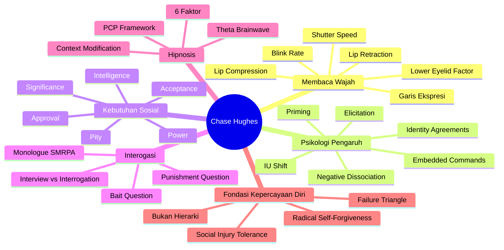

---

## 🧬 Bagian 1: Membaca Wajah — Buku Sejarah yang Terukir di Kulit

Wajah manusia adalah **arsip hidup** dari emosi yang paling sering dirasakan seseorang sepanjang hidupnya. Garis-garis yang terukir bukan sekadar tanda usia — melainkan rekam jejak ekspresi yang berulang.

### 📖 Garis Ekspresi: Membaca Sejarah Seseorang

Sejak usia 18–19 tahun, ekspresi yang berulang mulai **mengukir pola permanen** di wajah:

| Tanda di Wajah | Artinya |
|---|---|
| 🙂 *Crow's feet* (garis di ujung mata) | Sering tersenyum — orang yang bahagia dan positif |
| 😠 Dua otot menarik ke tengah di *glabella* (area antara alis) | Sering marah atau frustrasi |
| 🤔 Banyak garis di dahi | Orang yang sangat sosial — dahi adalah *"social billboard"* (papan reklame sosial) kita |
| 😒 Kulit kelopak bawah berkerut | Sering skeptis — terbiasa merasa ditipu atau diragukan |

<Callout type="info" title="📋 Dahi sebagai Social Billboard">
Dahi adalah media komunikasi sosial utama kita. Saat kita mengangkat alis, kita berkata: *"Saya senang melihatmu, selamat pagi!"* Orang yang menutupi dahinya (misalnya dengan poni) secara tidak sadar mengurangi sinyal kepercayaan yang mereka pancarkan. Sebanyak 90% orang akan **membalas gerakan alis** tanpa sadar saat kita mengangkat alis saat menyapa.
</Callout>

### 👁️ Lower Eyelid Factor (LEF) — Indikator Sugestibilitas

Ini adalah salah satu penemuan Chase yang paling mengejutkan. Berdasarkan observasi ribuan subjek bersama *comedy hypnotists* (hipnotis komedi panggung):

> **Semakin halus kulit kelopak mata bawah seseorang → semakin mudah mereka dihipnosis (highly suggestible)**

Orang yang sepanjang hidupnya sering membuat ekspresi skeptis akan memiliki kerutan halus di kelopak bawah. Sebaliknya, orang yang tidak banyak skeptis cenderung memiliki kelopak bawah yang sangat halus.

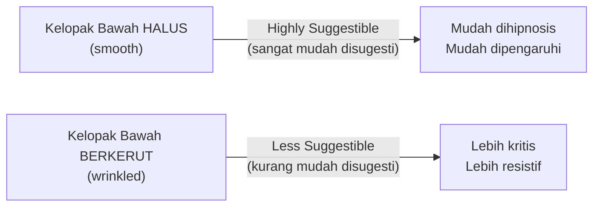

<Callout type="note" title="📌 Catatan Metodologis">
Chase menjelaskan ini masih bersifat *anecdotal* — belum ada penelitian ilmiah formal yang dipublikasikan. Namun setelah 5.000–10.000 pengujian oleh hipnotis profesional, akurasinya diklaim antara 90–100%. Chase sendiri memiliki kelopak bawah yang sangat halus — ia sangat mudah dihipnosis.
</Callout>

---

## 👀 Bagian 2: Blink Rate — Superpower yang Bisa Kamu Miliki Hari Ini

*Blink rate* (laju kedipan mata) adalah salah satu sinyal non-verbal paling powerful dan paling susah dipalsukan. Hampir tidak ada orang yang sadar seberapa sering mereka berkedip, sehingga ini berada **di luar kendali sadar** kita hampir sepenuhnya.

### 📊 Skala Blink Rate

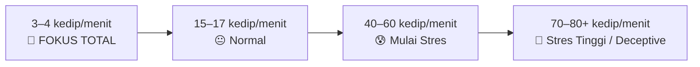

| Laju Kedipan | Arti | Contoh Situasi |
|---|---|---|
| 3–4/menit | Fokus mendalam, sangat tertarik | Menonton film yang luar biasa |
| 15–17/menit | Percakapan normal, netral | Obrolan santai |
| 40–60/menit | Stres ringan hingga sedang | Presentasi kerja |
| 70–80+/menit | Stres tinggi, tekanan, mungkin kebohongan | Ujian matematika, pertanyaan sensitif |

<Callout type="important" title="🎯 Kunci: Perhatikan PERUBAHAN, Bukan Angka Mutlak">
Chase sangat menekankan ini: **jangan hanya lihat apakah blink rate-nya tinggi atau rendah.** Yang jauh lebih penting adalah **kapan ia berubah**. Jika seseorang sedang bercakap-cakap dengan santai dan tiba-tiba blink rate-nya melonjak saat topik tertentu muncul — itulah *hot spot* (titik panas). Ada sesuatu di sana.
</Callout>

### 🎤 Aplikasi: Chase sebagai Public Speaker

Chase menggunakan blink rate saat berbicara di atas panggung. Ia membuat kontak mata dengan audiens sambil **mengukur rata-rata blink rate di seluruh ruangan**:

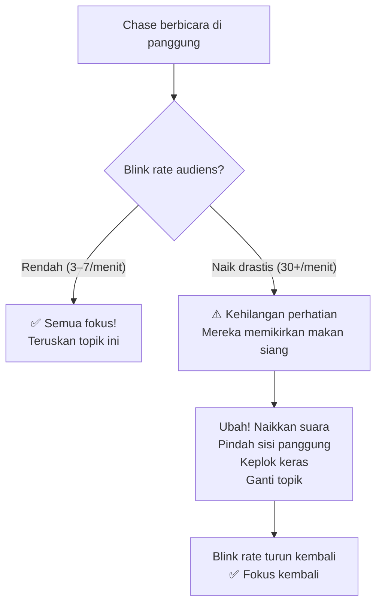

### 👁️‍🗨️ Shutter Speed — Kecepatan Kelopak Mata

Selain *blink rate*, perhatikan juga **kecepatan membuka-menutupnya kelopak mata** (*shutter speed*):

| Shutter Speed | Arti |
|---|---|
| ⚡ Cepat (penutupan kilat) | **Ketakutan** atau kewaspadaan tinggi |
| 🐢 Lambat (gerakan malas) | **Nyaman**, santai, merasa aman |

Kombinasi blink rate tinggi + shutter speed cepat = orang sedang sangat tidak nyaman atau ketakutan dengan topik yang sedang dibahas.

---

## 👄 Bagian 3: Lip Compression & Lip Retraction — Bahasa Bibir

### 🔒 Lip Compression (Kompresi Bibir)

*Lip compression* adalah saat seseorang **menekan kedua bibir rapat-rapat** — bibir terlihat "menghilang" sejenak.

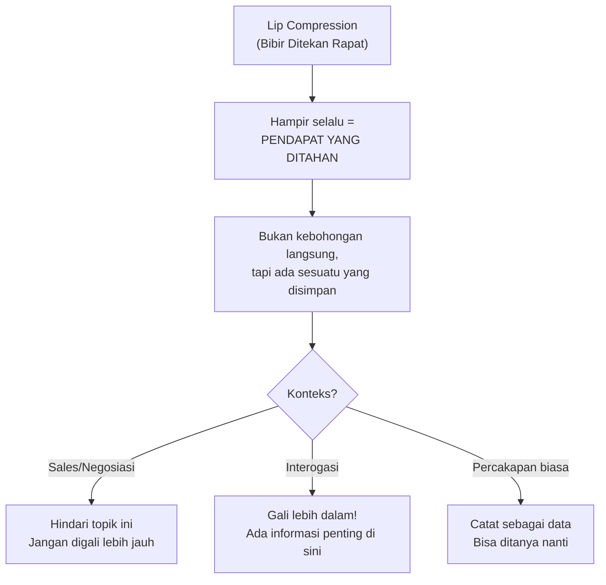

**Contoh praktis:** Anda sedang mempresentasikan produk ke klien. Saat Anda menyebut soal harga, klien melakukan *lip compression*. Itu sinyal — ada keberatan yang belum diungkapkan. Dalam konteks sales, **hindari** menggali terlalu keras; dalam konteks negosiasi, ini bisa berarti ada ruang untuk kompromi.

### 🫦 Lip Retraction (Bibir Masuk ke Dalam)

*Lip retraction* terjadi saat **bibir (atau benda seperti jari/pulpen) masuk melewati batas gigi**.

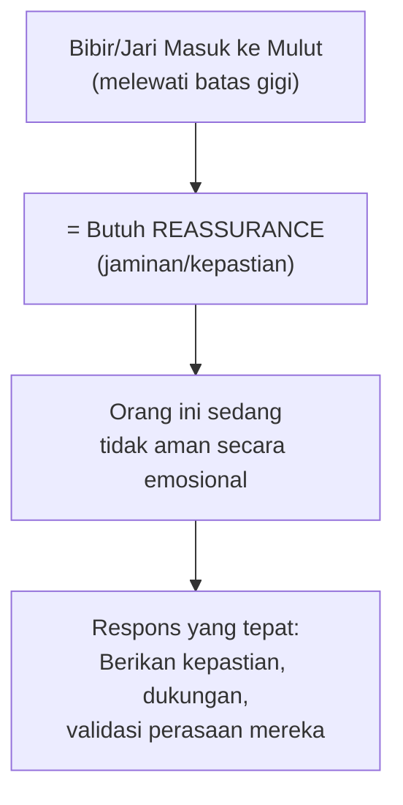

Chase melihat ini saat memanggil orang ke atas panggung — ada yang langsung menggigit bibir atau menyentuh mulut. Itu sinyal: *"Saya butuh diyakinkan bahwa ini aman."*

---

## 🆔 Bagian 4: Identity Agreements — Senjata Pengaruh Paling Kuat

Ini adalah inti dari sistem **NCI (Neurocognitive Intelligence)** yang Chase ajarkan ke pemerintah dan organisasi di seluruh dunia.

### 🧠 Mengapa Identitas Lebih Kuat dari Ide?

Otak kita memiliki **pertahanan aktif** terhadap ide-ide baru yang mencurigakan. Tapi kita hampir tidak punya pertahanan terhadap **pernyataan tentang diri kita sendiri**.

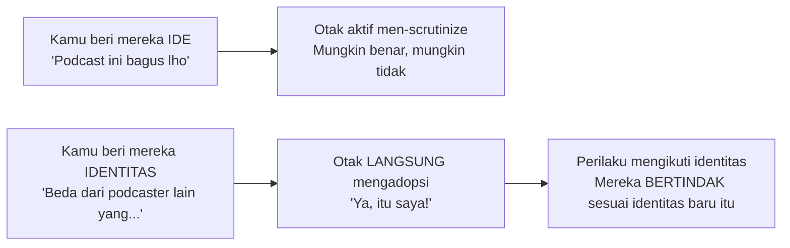

> *"Saya tidak membuat Anda setuju pada sebuah ide. Saya membuat Anda setuju bahwa Anda adalah jenis orang tertentu."*

### 🔧 Cara Kerja Identity Agreement

**Teknik 1: Negative Dissociation (Disosiasi Negatif)**

Alih-alih memuji seseorang secara langsung (yang langsung terasa manipulatif), Chase **berbicara negatif tentang kelompok yang TIDAK ingin Anda asosiasikan dengan lawan bicara**:

> *"Begitu banyak podcaster di luar sana yang sangat terikat dengan struktur kaku mereka dan itu melelahkan untuk ditonton. Saya senang hari ini berbicara denganmu."*

Anda tidak berkata "kamu tidak seperti itu." Tapi otak mereka berkata: **"Ya, itu bukan aku."** Dan sekarang mereka akan **berperilaku konsisten** dengan identitas "tidak seperti itu" sepanjang percakapan.

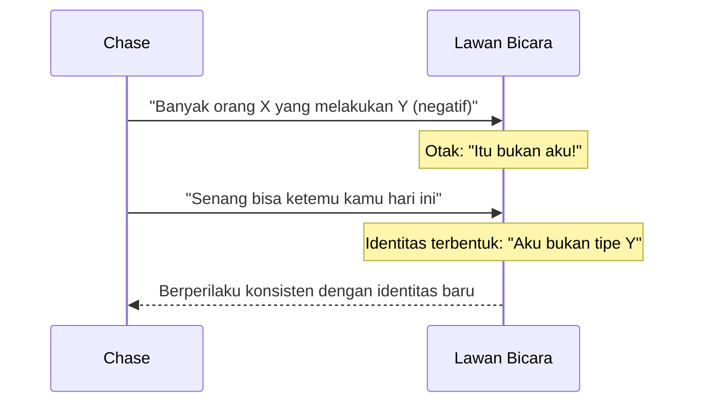

**Teknik 2: Verbal Identity Agreement**

Ajukan pertanyaan yang memaksa lawan bicara **mengucapkan identitas secara verbal**:

> *"Bagaimana kamu bisa seopen ini dengan orang lain? Apakah ini memang sifatmu atau sesuatu yang kamu pelajari?"*

Saat mereka menjawab pertanyaan itu, mereka **secara verbal mengonfirmasi identitas** — dan identitas verbal jauh lebih kuat dari identitas implisit.

<Callout type="tip" title="💡 Aplikasi Praktis">
Sebelum bertemu klien penting, pikirkan: **"Identitas apa yang ingin saya tanamkan?"** Misalnya, ingin mereka berperilaku sebagai "pengambil keputusan yang tegas dan berani". Lalu gunakan negative dissociation — *"Banyak pemimpin yang terlalu lama menunda keputusan dan akhirnya kehilangan momentum..."* — diikuti apresiasi implisit tentang karakter mereka.
</Callout>

---

## 🌱 Bagian 5: Priming — Menanam Benih di Otak Tanpa Disadari

*Priming* adalah teknik menyiapkan otak seseorang untuk **menerima atau melakukan sesuatu** dengan cara memaparkan mereka pada konsep-konsep yang terkait sebelumnya.

### 🧪 Eksperimen Klasik: Word-Search & Jalan Lambat

Dalam sebuah studi, peserta mengerjakan *word-search puzzle* yang mengandung kata-kata terkait usia tua: *Florida*, *keriput*, *sakit*, *pensiun*, *lambat*, dll. Hasilnya mengejutkan:

> **Kecepatan berjalan mereka setelah mengerjakan puzzle berkurang 30–40% dibandingkan kelompok kontrol.**

Mereka tidak sadar bahwa paparan singkat terhadap kata-kata itu telah **memengaruhi perilaku fisik** mereka.

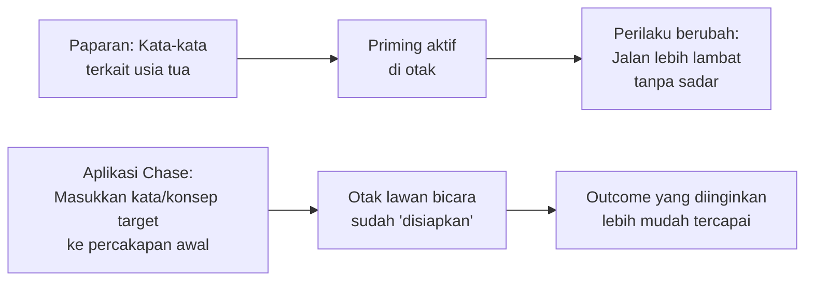

**Contoh nyata dari Chase:** Ingin seseorang memperpanjang waktu bersama Anda? Mulai percakapan dengan cerita tentang seseorang yang dengan mudah mengubah jadwal penerbangan dan betapa *tidak berpengaruhnya* itu. Otak mereka sudah ter-*prime* untuk merasa "fleksibilitas waktu itu mudah."

---

## 💬 Bagian 6: Embedded Commands — Perintah Tersembunyi dalam Bahasa

*Embedded commands* (perintah terbenam) adalah teknik menyembunyikan **kalimat perintah di dalam kalimat yang lebih panjang**, sehingga otak bawah sadar memproses perintah itu tanpa resistensi sadar.

### 📏 Aturan Embedded Commands

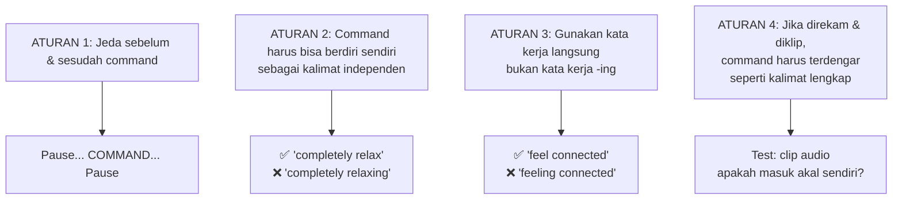

### 🎯 Contoh Langsung

Chase ingin menanamkan perasaan "feel completely connected" ke lawan bicara:

> *"...Dan saya ingat menonton dokumenter tentang pembuat kopi ini, betapa luar biasanya mereka saling merawat satu sama lain — momen langka ketika seseorang bisa... **feel completely connected**... dengan orang lain di sekitarnya..."*

Saat mengucapkan "feel completely connected", tangannya bergerak **bolak-balik antara dirinya dan lawan bicara** — menambahkan layer non-verbal pada perintah verbal.

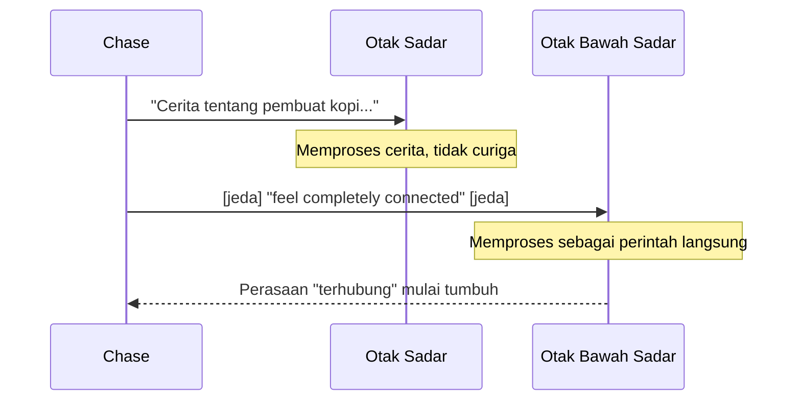

<Callout type="warning" title="⚠️ Batasan Penting">
Teknik ini bukan *magic spell*. Chase menekankan berkali-kali: **embedded commands hanya efektif jika dikombinasikan dengan otoritas, kepercayaan diri, dan koneksi yang sudah terbangun.** Tanpa fondasi itu, efeknya hampir nol. Ini bukan trik, ini *finishing touch* dari fondasi yang kokoh.
</Callout>

---

## 🔄 Bagian 7: IU Shift — Dari "Saya" ke "Kamu"

*IU Shift* (atau *Shift of Referential Index* dalam bahasa teknis NLP) adalah teknik memulai cerita dengan "Saya" lalu perlahan-lahan menggeser referensi ke "Kamu" — sehingga pengalaman yang Anda ceritakan **ditransfer ke pengalaman lawan bicara** tanpa resistensi.

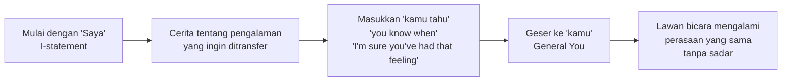

**Contoh:**
> *"Saya tadi malam di kamar hotel, dan saya baru menyadari betapa tegangnya bahu saya... dan kamu tahu saat tubuhmu mulai menegang dan menegang dan kamu tidak tahu mengapa semuanya menjadi kaku seperti armor..."*

Chase menggunakan "kamu" sebagai *general you* — bukan menyebutmu secara langsung, tapi otak secara otomatis menginternalisasi itu sebagai pengalamannya sendiri.

---

## 🔍 Bagian 8: Elicitation — Senjata Intelijen Soviet yang Kamu Bisa Pakai

*Elicitation* (elisitasi) adalah teknik mendapatkan informasi dari seseorang **tanpa mengajukan pertanyaan langsung**. Teknik ini dikembangkan oleh **John Nolan** (buku *Confidential*) dan digunakan Uni Soviet sepanjang Perang Dingin untuk mengekstrak rahasia dari personel militer AS.

### 🎯 Mengapa Statement Lebih Baik dari Pertanyaan?

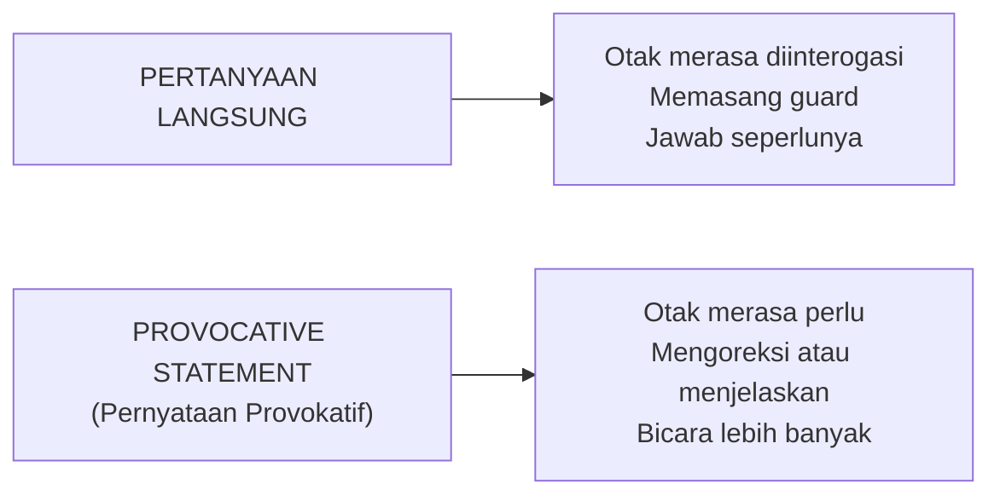

### 🛠️ Teknik Elicitation Utama

**1. Triggering the Need to Correct the Record (Memicu Kebutuhan Meluruskan)**

Buat pernyataan yang *sedikit salah* tentang topik yang mereka kuasai:

> *"Kayaknya penelitian itu melibatkan sekitar 1.000–5.000 orang ya?"*
> Respons: *"Tidak tidak, jauh lebih banyak dari itu! Mereka..."*

Dan mereka terus berbicara. Anda tidak pernah bertanya.

**2. Bracketing (Pemberian Rentang)**

Berikan rentang angka yang kemungkinan besar salah — otak mereka akan otomatis mengoreksi:

> *"Pasti antara 1.000 sampai 5.000 orang yang terlibat..."*
> *"Bukan, jauh lebih besar dari itu — ini studi nasional dengan..."*

**3. Statement of Disbelief (Pernyataan Ketidakpercayaan)**

> *"Tidak mungkin itu benar-benar terjadi seefektif itu..."*
> *"Justru iya! Lihat saja data ini..."*

**4. Word Repetition (Pengulangan Kata)**

Saat mereka menyebut kata atau konsep menarik, **ulangi satu atau dua kata terakhir** dengan nada penasaran. Ini memicu mereka melanjutkan dan mendalami:

> *"...dan itu terbukti dalam operasi kapal selam."*
> *"Kapal selam?"*
> *"Ya! Ukuran baling-baling, kedalaman menyelam, kemampuan siluman..."*

<Callout type="cite" title="📚 Sumber Historis">
Teknik ini didokumentasikan dalam buku **John Nolan** berjudul *Confidential* — sebuah buku yang bahkan di eBay sudah sangat sulit ditemukan. Teknik elicitation Soviet digunakan untuk mendapatkan informasi tentang **ukuran baling-baling kapal selam nuklir AS, kecepatan maksimal, dan jarak peluncuran rudal** — informasi yang tidak akan pernah diberikan jika ditanya langsung.
</Callout>

### 📐 Rasio Optimal: 90% Statement, 10% Pertanyaan

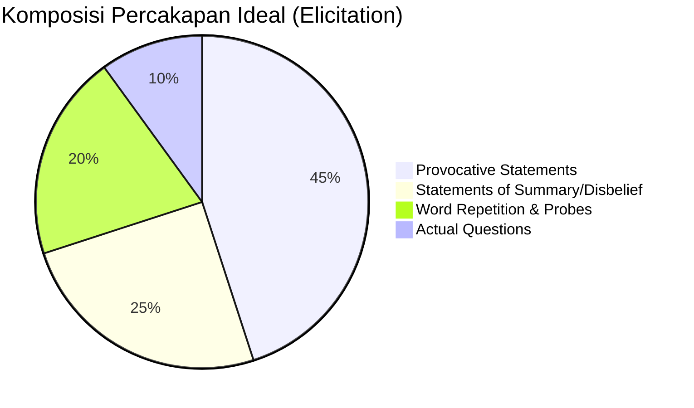

---

## 🏛️ Bagian 9: Kebutuhan Sosial — 6 Valuta Emosional Manusia

Chase mengajarkan bahwa **manusia tidak mencari kata-kata — mereka mencari neuropeptida**. Kata-kata hanyalah kendaraan untuk mengantarkan **bahan kimia kepuasan** ke otak mereka. Pahami apa yang mereka butuhkan, dan Anda tahu cara menggerakkan mereka.

### 🧪 Enam Kebutuhan Sosial

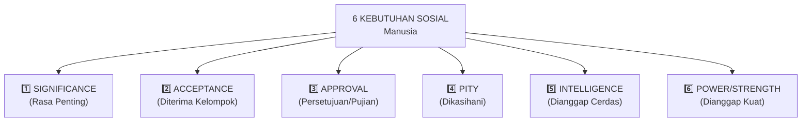

### 🔍 Cara Mengidentifikasi Kebutuhan Dominan Seseorang

| Kebutuhan | Tanda-Tanda di Percakapan | Cara Memenuhinya |
|---|---|---|
| **Significance** | Sering menyebut pencapaian, jabatan, angka sukses | *"Kamu membuat perbedaan besar di sini, semua orang memandangmu..."* |
| **Acceptance** | Banyak menggunakan pronomi "kita/kami", sering bicara tentang kelompok/komunitas | Libatkan dalam kelompok, gunakan *"kita"* |
| **Approval** | Sering merendahkan diri sendiri sambil menunggu dipuji (*fishing for compliments*) | Berikan pujian spesifik dan tulus sebelum mereka minta |
| **Pity** | Cerita penuh kesulitan, narasi sebagai korban | Tunjukkan empati mendalam, validasi kesulitan mereka |
| **Intelligence** | Sering mengutip data, riset, teori; senang terlihat *smart* | Minta pendapat mereka tentang masalah kompleks |
| **Power/Strength** | Banyak posturing, cerita konfrontasi, fisik | Akui dominasi mereka tanpa berkompetisi |

<Callout type="tip" title="💡 Teknik untuk Ego Tinggi yang Tidak Mau Dipuji">
Beberapa orang hypersukses memiliki ego yang aneh — mereka tidak mau dipuji secara langsung, tapi tetap butuh validasi. **Triknya:** Gunakan pencapaian mereka sebagai alasan meminta nasihat.

> *"Dengan IQ 180 yang kamu miliki, kamu pasti melihat percakapan dalam lapisan berbeda dari orang kebanyakan — saya sedang struggling dengan sesuatu, boleh saya minta perspektifmu?"*

Saat mereka memberi nasihat, mereka secara implisit **setuju bahwa mereka bukan tipe orang yang egois** — karena orang bijak membantu orang lain.
</Callout>

---

## 🚔 Bagian 10: Interogasi — Seni Mendapatkan Kebenaran

### 🎯 Filosofi Dasar: Kebaikan Lebih Efektif dari Penyiksaan

Ini bukan opini — ini **fakta yang telah terbukti berulang kali** sejak Perang Dunia II.

**Hans Scharff**, interogator Jerman yang menjadi legenda, adalah orang pertama yang berkata: *"Bagaimana jika kita tidak jadi bajingan untuk para tahanan ini?"* Hasilnya? Ia mendapatkan **lebih banyak intelijen dari semua interogator lain digabungkan**.

Penjelasan ilmiahnya ada di **Hierarki Kebutuhan Maslow**:

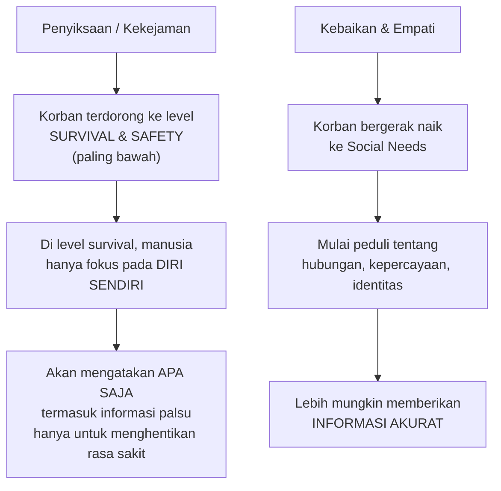

### ❓ Pertanyaan Interogasi Paling Kuat

**1. The Bait Question (Pertanyaan Umpan)**

Alih-alih: *"Apakah kamu ada di sana?"* — yang mudah dijawab "tidak"

Gunakan: **"Apakah ada alasan apa pun bahwa kamera CCTV di sana mungkin merekammu?"**

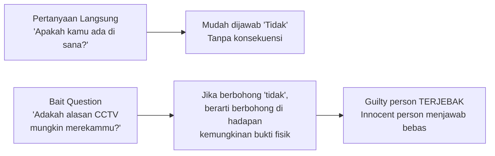

Kuncinya: **Anda tidak berbohong**. Anda tidak mengklaim ada kamera. Anda hanya bertanya tentang kemungkinan.

**2. The Punishment Question (Pertanyaan Hukuman)**

> *"Menurut kamu, apa yang seharusnya terjadi pada orang yang melakukan ini?"*

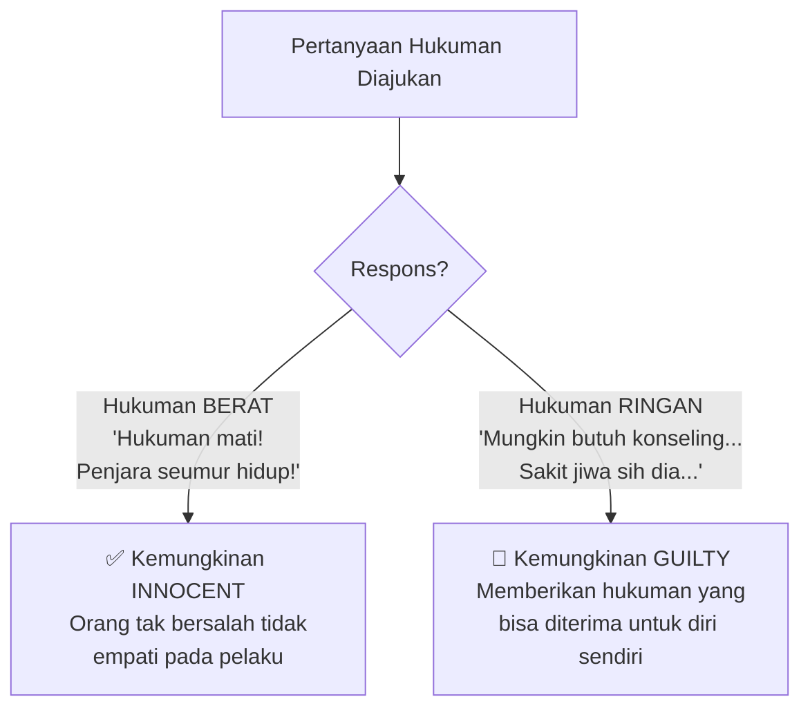

Chase menggunakan ini bahkan pada anaknya yang masih kecil. Saat ada susu tumpah, ia bertanya ke masing-masing anak: *"Menurut kamu apa yang seharusnya terjadi pada orang yang melakukan ini?"* Anak yang bersalah otomatis memberikan hukuman yang lebih ringan.

### 📜 Monologue Interogasi: SMRPA

Ini adalah *monologue* (pidato panjang satu pihak) yang dirancang untuk **menurunkan pertahanan psikologis seseorang** dan membuka jalan menuju pengakuan. Berlaku untuk interogasi **dan** untuk negosiasi/sales.

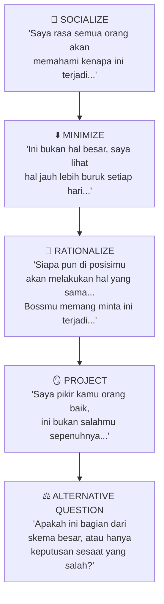

<Callout type="info" title="📋 Cara Kerja Alternative Question">
Pertanyaan alternatif di akhir monologue menyajikan **dua pilihan** — satu terdengar jauh lebih buruk dari yang lain. Orang yang bersalah secara otomatis akan memilih versi yang *lebih ringan* — dan dengan memilihnya, mereka **mengakui keterlibatan**.

*"Apakah ini bagian dari sindikat perdagangan manusia, atau kamu hanya mencoba membantu biaya kemoterapi tanteму?"*

Orang bersalah dalam pikiran mereka mendengar: **"Jika saya bilang yang kedua, saya bisa pergi."**
</Callout>

---

## 🧠 Bagian 11: Hipnosis — Ilmu di Balik "Sulap" Mental

### 🌊 Theta Brainwave: Gerbang ke Bawah Sadar

Otak manusia beroperasi pada berbagai **frekuensi gelombang** tergantung kondisi:

| Gelombang | Kondisi | Hz |
|---|---|---|
| **Beta** | Aktif berpikir, sadar penuh | 13–30 Hz |
| **Alpha** | Relaks, meditasi ringan | 8–12 Hz |
| **Theta** | Meditasi dalam, hampir tidur, **hipnosis** | 4–7 Hz |
| **Delta** | Tidur nyenyak | 0.5–3 Hz |

Tujuh tahun pertama kehidupan manusia, otak kita menghabiskan sebagian besar waktu dalam **Theta** — itulah mengapa anak kecil belajar bahasa, berjalan, dan menyerap nilai-nilai dengan kecepatan luar biasa. Hipnosis adalah **cara kembali ke Theta** secara sengaja.

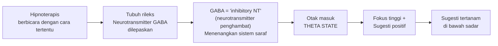

**GABA** (*Gamma-Aminobutyric Acid*) adalah neurotransmiter utama yang membuat kita rileks dan aman. Ini adalah "bahan kimia keamanan" otak. Hipnotis yang baik tahu cara **memicu pelepasan GABA** melalui cara bicara, intonasi, dan ritme.

### 6️⃣ Enam Faktor Keberhasilan Hipnosis

```mermaid
graph TD
    A["6 FAKTOR HIPNOSIS"] --> B["1. FOCUS\n(Fokus)"]
    A --> C["2. OPENNESS\n(Keterbukaan)"]
    A --> D["3. CONNECTION\n(Koneksi/Kepercayaan)"]
    A --> E["4. SUGGESTIBILITY\n(Sugestibilitas)"]
    A --> F["5. COMPLIANCE\n(Kepatuhan)"]
    A --> G["6. EXPECTANCY\n(Ekspektasi Positif)"]
    
    H["Milgram Experiment\n(tanpa hipnosis!)"] -->|"Hanya 3 faktor:\nFocus + Suggestibility\n+ Compliance"| I["Membuat orang 'membunuh'\norang lain dalam 1 jam"]
    
    J["Semua 6 faktor"] -->|"Skenario kontrol penuh"| K["Tidak ada batasan\napa yang bisa dilakukan"]
```

<Callout type="danger" title="🚨 Mitos yang Berbahaya: 'Kamu Tidak Bisa Dihipnosis untuk Melakukan Hal Buruk'">
Ini adalah mitos yang disebarluaskan oleh hipnotis konvensional. **Chase dengan tegas membantahnya.** Jika konteks bisa dimodifikasi, perilaku apa pun bisa dipicu. Contoh kasus nyata di Washington State: seorang pengacara menghipnosis kliennya dan melakukan pelecehan seksual karena **memodifikasi konteks** — bukan melanggar "kehendak bebas" secara frontal, melainkan mengubah persepsi tentang situasi yang terjadi.
</Callout>

### 🔄 Dua Cara Modifikasi Konteks untuk Hipnosis

1. **Skenario Hidup-Mati:** *"Ini situasi darurat, nyawamu dalam bahaya, kamu harus bertindak sekarang..."*
2. **Reframing Objek/Situasi:** *"Pistol itu sebenarnya adalah pistol air..."* (mengubah persepsi tentang objek berbahaya menjadi tidak berbahaya)

---

## 🔺 Bagian 12: PCP Framework — Kunci Semua Manipulasi

Ini adalah **framework paling fundamental** yang Chase bagikan. Semua manipulasi, semua pengaruh sosial, semua perubahan perilaku — bekerja melalui tiga lapisan ini:

```mermaid
flowchart TD
    P["P — PERCEPTION\n(Persepsi)\nBagaimana orang melihat realitas"] --> C
    C["C — CONTEXT\n(Konteks)\nDalam situasi apa mereka berada"] --> Pe
    Pe["P — PERMISSION\n(Izin)\nApa yang mereka rasa boleh dilakukan"]
    
    A["Ubah PERSEPSI seseorang"] --> B["Persepsi baru\nMenciptakan KONTEKS baru"]
    B --> D["Konteks baru memberikan\nIZIN baru untuk bertindak"]
    D --> E["Perilaku yang sebelumnya\n'tidak mungkin' menjadi mungkin"]
```

**Contoh aplikasi:**
- Seseorang tidak akan membakar toko — **persepsi**: tindak kriminal
- Ubah persepsi → **"ini perlawanan terhadap penindasan"** → konteks berubah → **"membakar toko" menjadi diizinkan** dalam pikiran mereka

> *"Selalu waspada terhadap bagaimana persepsimu sedang dimodifikasi, karena hal berikutnya yang akan diubah adalah konteks — dan konteks menentukan apa yang kamu izinkan terjadi pada dirimu dan olehmu."*

---

## 💪 Bagian 13: Kepercayaan Diri — Bukan Apa yang Kamu Pikir

### ❌ Miskonsepsi Terbesar tentang Kepercayaan Diri

```mermaid
graph LR
    A["MISKONSEPSI:\nKepercayaan diri = berada\ndi atas orang lain"] --> B["Ini adalah HIERARKI\nbukan kepercayaan diri"]
    C["MISKONSEPSI:\nKepercayaan diri = kompetensi\n'Saya percaya diri karena saya ahli'"] --> D["Frank Abagnale (Catch Me If You Can)\nZero kompetensi, maksimal kepercayaan diri"]
    E["REALITA:\nKepercayaan diri = internal\nTidak bergantung pada siapa pun\natau kondisi apa pun"] --> F["Sama di hadapan miliarder\nmaupun sopir Uber"]
```

### 🏗️ Tiga Pilar Kepercayaan Diri Sejati

**Pilar 1: Social Injury Tolerance (Toleransi Cedera Sosial)**

*Social injury* = penghakiman orang lain. Kepercayaan diri sejati berarti:

> *"Saya nyaman dengan kemungkinan dihakimi. Saya bisa salah bicara, dianggap bodoh, atau ditolak — dan itu bukan bencana."*

```mermaid
graph TD
    A["Takut dihakimi"] --> B["Kepercayaan diri\nbersumber dari LUAR\n(lingkungan, reaksi orang)"]
    B --> C["Kepercayaan diri\nFRAGIL — mudah hancur"]
    D["Toleran terhadap penghakiman"] --> E["Kepercayaan diri\nbersumber dari DALAM"]
    E --> F["Kepercayaan diri\nSTABIL — tidak terguncang"]
```

**Pilar 2: Worldview Shift (Pergeseran Pandangan Dunia)**

Bukan afirmasi di cermin kamar mandi. Ini adalah **keyakinan internal yang dibangun secara bertahap**:

> *"Hal-hal pada umumnya akan berjalan baik. Saya akan baik-baik saja apa pun yang terjadi."*

**Pilar 3: Radical Self-Forgiveness (Pengampunan Diri yang Radikal)**

> *"Saya sangat memaafkan diri sendiri sehingga dari sudut pandang orang lain, saya mungkin terlihat delusional. Tidak ada rasa malu tentang apa pun yang pernah saya lakukan."*

Ini bukan tentang membenarkan kesalahan. Ini tentang **menghapus rasa malu** — karena rasa malu adalah yang paling sering menghambat kepercayaan diri.

```mermaid
flowchart TD
    A["RASA MALU\n(Shame)"] --> B["Menyembunyikan diri\nTakut diekspos\nTakut dihakimi"]
    B --> C["Kepercayaan diri terkikis\nsetiap kali ada yang mendekati\ntopik yang memalukan"]
    D["RADICAL SELF-FORGIVENESS"] --> E["Semua masa lalu dimaafkan\nTidak ada yang perlu disembunyikan"]
    E --> F["Tidak ada titik lemah\nyang bisa dieksploitasi orang lain"]
    F --> G["Kepercayaan diri\nMENJADI MENULAR"]
```

<Callout type="success" title="✨ Kepercayaan Diri yang Menular">
Kepercayaan diri **palsu** (berbasis ego dan hierarki) membuat orang lain merasa kecil. Kepercayaan diri **sejati** adalah yang cukup besar sehingga bisa **ditransfer ke orang lain** — bahkan orang dengan kecemasan sosial akan merasa lebih percaya diri di dekat Anda.
</Callout>

---

## 🔺 Bagian 14: Failure Triangle — Diagnosa Setiap Kegagalan Sosial

Chase menyebut ini sebagai alat diagnostik universal untuk setiap situasi yang melibatkan manusia:

```mermaid
graph TD
    A["FAILURE TRIANGLE\n(Segitiga Kegagalan)"] --> B["1️⃣ OBSERVATION\n(Observasi)\nGagal membaca situasi,\norang, atau kebutuhannya"]
    A --> C["2️⃣ COMMUNICATION\n(Komunikasi)\nGagal menyampaikan pesan\ndengan cara yang tepat"]
    A --> D["3️⃣ SELF-MASTERY\n(Penguasaan Diri)\nGagal mengendalikan diri,\nada kesenjangan antara\ntampilan luar & kenyataan dalam"]
    
    B -->|"Perbaikan"| E["Pelajari behavior profiling\nelicitation, baca kebutuhan sosial"]
    C -->|"Perbaikan"| F["Pelajari linguistics,\nembedded commands, elicitation"]
    D -->|"Perbaikan"| G["Bangun kepercayaan diri sejati,\nbereskan 'rumah' dalam dirimu\nsebelum pergi 'berdandan' keluar"]
```

**Insight paling penting:**

> *"Saya bisa memberimu checklist penerbangan terbaik yang pernah ada — itu tidak membuatmu jadi pilot."*

Self-mastery adalah fondasi segalanya. Seseorang yang terlihat sempurna di luar tapi rumahnya penuh tumpukan cucian — otak mamalia orang lain akan **merasakannya**. Ada yang terasa tidak beres, meski mereka tidak bisa menjelaskan apa.

---

## 🌙 Bagian 15: MK Ultra & Eksperimen CIA — Sejarah Gelap yang Nyata

Chase berbagi dua eksperimen paling mengejutkan yang pernah dilakukan:

### 🏥 Psychic Driving — Kanada

Orang-orang yang datang untuk masalah ringan seperti **postpartum depression** atau **kecemasan** diberikan:
- Dosis LSD besar dan berkepanjangan
- Mata ditahan terbuka (seperti *A Clockwork Orange*)
- Video diputar terus-menerus di depan wajah mereka

Hasilnya bukan *reprogramming* seperti yang diharapkan CIA. Sebaliknya:
- Banyak yang harus **belajar berjalan lagi**
- Kehilangan kontrol kandung kemih
- Kehilangan **30–40 tahun kenangan hidup**

Pemerintah Kanada akhirnya mengakui dan **membayar kompensasi** kepada keluarga korban.

### 🌃 Project Midnight Climax

CIA mendirikan *brothel* (rumah prostitusi) dan:
1. Klien tidak curiga diberikan dosis LSD tinggi
2. Di balik cermin satu arah — **ilmuwan mengamati efeknya**

Tujuannya: menguji *interrogative suggestibility* — seberapa jauh seseorang bisa diekstrak informasinya dalam kondisi dipengaruhi zat psikedelik.

<Callout type="quote" title="💭 Konteks Historis">
Semua ini lahir dari **kepanikan Perang Korea** — video-video tentara Amerika yang tampaknya "dicuci otak" oleh Korea Utara. CIA mengira ada teknologi ajaib di baliknya dan memulai perlombaan psikologis. Ironisnya, teknik yang membuat tentara Amerika tampak "dibrainwash" ternyata adalah **metode yang sangat sederhana** — bukan senjata rahasia sama sekali.
</Callout>

---

## 🔬 Bagian 16: Mirroring — Lebih Sedikit dari yang Kamu Kira

Chase membongkar salah satu miskonsepsi terbesar dalam literatur psikologi populer:

### 🪞 Mirroring adalah Gejala, Bukan Penyebab

```mermaid
graph LR
    A["Orang SALING MENYUKAI"] --> B["Mereka mulai\nMIRRORING satu sama lain\n(gejala/symptom)"]
    C["Kamu MELAKUKAN MIRRORING\nke seseorang"] -->|"Apakah ini\nbuat mereka suka kamu?"| D["Hampir tidak ada efeknya\ntanpa fondasi lain"]
    
    E["Obsesi Nasional:\nSymptom-focused, Cause-blind"] --> F["Artikel: '25 cara\nbody language percaya diri'"] --> G["Semua itu adalah\nGEJALA kepercayaan diri,\nbukan PENYEBABNYA"]
```

> *"Mirroring terjadi SETELAH ketertarikan, bukan SEBELUMNYA."*

**Apa yang lebih penting dari physical mirroring?**

**Emotional mirroring** — mencocokkan **state emosional** lawan bicara:
- Jika mereka rileks → kamu rileks
- Jika mereka antusias → kamu antusias (tanpa dibuat-buat)
- Jika mereka serius → kamu tidak bercanda

Ini jauh lebih berdampak dari menyilangkan kaki mengikuti mereka.

---

## 🎯 Bagian 17: Prediksi 3 Insekuritas dalam 15 Menit

Di awal podcast, Chase menulis **3 prediksi tentang insekuritas terbesar host** hanya dari 15 menit interaksi. Di akhir podcast, prediksi dibuka — dan semua tepat:

1. **"Sangat khawatir tentang bagaimana ia dipersepsikan, sampai mengganggu kehidupan sehari-harinya"**
2. **"Sering merenungkan apa yang seharusnya dikatakan atau dikomunikasikan secara berbeda"**
3. **"Menggunakan paparan konstan terhadap suara/video/musik saat sendirian untuk menghindari pikiran-pikiran yang lebih dalam yang mengganggu konsep diri"**

Ini bukan sihir. Ini adalah hasil dari **membaca cluster of signals** — blink rate, shutter speed, lip compression, cara menjawab, intonasi, kecepatan berbicara, pilihan kata — dan mengintegrasikan semua data itu.

<Callout type="abstract" title="📊 Prinsip Cluster Analysis">
Chase berpikir seperti **meteorolog** — bukan *"ini berarti itu secara pasti"*, melainkan *"kumpulan data ini menunjukkan kemungkinan besar X"*. Tidak ada satu sinyal pun yang berdiri sendiri. Kepercayaan meningkat seiring bertambahnya data yang konsisten.
</Callout>

---

## 💡 Bagian 18: Nasihat Terbaik — dari Semua Kitab Suci

Di penghujung percakapan, Chase ditanya tentang nasihat terbaik yang pernah ia terima. Jawabannya mengejutkan:

> *"Jika kamu membaca semua teks kuno — Al-Quran, Torah, Bhagavad Gita, Perjanjian Lama, Perjanjian Baru, bahkan kitab-kitab yang dilarang seperti Injil Thomas dan Injil Yudas — frasa yang paling sering diulang di semua teks itu adalah: **Jangan takut.**"*

> *"Versi King James dari Alkitab menyebut 'jangan takut' tepat **365 kali** — satu untuk setiap hari dalam setahun."*

```mermaid
graph LR
    A["KETAKUTAN"] <-->|"Kebalikan"| B["CINTA"]
    C["Hampir semua ajaran spiritual\nmengajarkan: kita hanya punya\n2 emosi dasar"] --> A
    C --> B
    D["Hidup yang baik"] --> E["Keluar dari zona KETAKUTAN\nmasuk ke zona CINTA"]
    E --> F["Open-hearted\nTidak defensif\nTidak perlu melindungi ego"]
```

---

## 📚 Glosarium: Kosakata Kunci Chase Hughes

| Istilah (Inggris) | Terjemahan | Definisi |
|---|---|---|
| **Blink Rate** | Laju Kedipan | Jumlah kedipan mata per menit; indikator fokus/stres |
| **Shutter Speed** | Kecepatan Kelopak | Kecepatan kelopak mata membuka-menutup; tanda kenyamanan/ketakutan |
| **Lower Eyelid Factor (LEF)** | Faktor Kelopak Bawah | Kelancaran kulit kelopak mata bawah; indikator sugestibilitas hipnosis |
| **Lip Compression** | Kompresi Bibir | Bibir ditekan rapat; tanda pendapat yang ditahan |
| **Lip Retraction** | Retraksi Bibir | Bibir masuk ke dalam mulut; tanda butuh reassurance |
| **Identity Agreement** | Kesepakatan Identitas | Teknik membuat seseorang mengadopsi identitas yang kamu inginkan |
| **Negative Dissociation** | Disosiasi Negatif | Berbicara negatif tentang kelompok yang tidak ingin diasosiasikan dengan target |
| **Priming** | Priming | Memaparkan konsep terkait sebelumnya untuk mempersiapkan respons tertentu |
| **Embedded Commands** | Perintah Terbenam | Kalimat perintah yang disembunyikan dalam kalimat yang lebih panjang |
| **Elicitation** | Elisitasi | Teknik mendapatkan informasi menggunakan pernyataan bukan pertanyaan |
| **Bracketing** | Pemberian Rentang | Menyebut rentang angka yang salah untuk memicu koreksi dengan informasi akurat |
| **NCI** | NCI (Neurocognitive Intelligence) | Sistem pengaruh Chase Hughes yang diajarkan ke pemerintah dan korporasi |
| **Bait Question** | Pertanyaan Umpan | Pertanyaan tidak langsung yang mengimplikasikan bukti tanpa mengklaimnya |
| **Punishment Question** | Pertanyaan Hukuman | Pertanyaan tentang hukuman yang pantas; orang bersalah cenderung meringankan |
| **SMRPA Monologue** | Monolog SMRPA | Socialize-Minimize-Rationalize-Project-Alternative: struktur interogasi/persuasi |
| **Theta Brainwave** | Gelombang Theta | Gelombang otak 4-7 Hz; kondisi meditasi dalam dan hipnosis |
| **GABA** | GABA | Gamma-Aminobutyric Acid; neurotransmiter penghambat yang menenangkan otak |
| **PCP Framework** | Kerangka PCP | Perception-Context-Permission: tiga lapisan semua manipulasi |
| **Ventral Orientation** | Orientasi Ventral | Arah tubuh menghadap seseorang; tatap muka langsung memicu respons adversarial |
| **Proxemics** | Proksemik | Ilmu tentang jarak sosial; di bawah 66 cm (26 inci) dalam 5 menit pertama bisa tidak nyaman |
| **Social Injury** | Cedera Sosial | Penghakiman dari lingkungan sosial; toleransi terhadapnya = fondasi kepercayaan diri |
| **Failure Triangle** | Segitiga Kegagalan | Tiga sebab kegagalan: observasi/komunikasi/self-mastery |
| **Mammalian Brain** | Otak Mamalia | Bagian otak primitif (*limbic system*) yang membuat keputusan emosional tanpa bahasa |
| **Psychic Driving** | Psychic Driving | Eksperimen MK Ultra: paparan LSD + video berulang; mengakibatkan kerusakan memori permanen |
| **Interrogative Suggestibility** | Sugestibilitas Interogatif | Seberapa mudah seseorang bisa dimanipulasi untuk mengakui atau mempercayai sesuatu |

---

## 🔗 Referensi & Sumber

- 📹 **Video Sumber:** [Manipulation Expert: How to Control Any Conversation and Read Their Mind Instantly!](https://www.youtube.com/watch?v=5GEoaC_g-Wk) — Jack Neil Podcast
- 📚 **Sistem Chase Hughes:** [NCI University](https://nciuniversity.com) — Platform pelatihan resmi
- 📺 **YouTube Chase Hughes:** Behavior Panel — True Crime body language analysis
- 📖 **John Nolan** — *Confidential* (buku langka tentang elicitation Soviet)
- 🧪 **Milgram Experiment (1961)** — Eksperimen kepatuhan dan otoritas yang mengubah psikologi sosial
- 📰 **MK Ultra** — Program CIA (1953–1973); didokumentasikan setelah *Freedom of Information Act*
- 🐬 **Project MK Ultra: Dolphin LSD Experiment (1960s)** — Dihentikan setelah insiden kontroversial
- 🎬 **Catch Me If You Can (2002)** — Film Steven Spielberg tentang Frank Abagnale; bukti kepercayaan diri tanpa kompetensi
- 📖 **George Estabrooks, Colgate University** — Dokumen *Superspy*; surat-surat korespondensi dengan J. Edgar Hoover tentang hipnosis militer

---

<Callout type="success" title="🌟 Takeaway Utama">
Semua yang Chase ajarkan bermuara pada satu hal: **manusia adalah makhluk mamalia yang menggunakan bahasa, bukan makhluk bahasa yang memiliki sifat mamalia.** Otak purba kita membuat sebagian besar keputusan nyata — dan otak itu tidak berbicara bahasa. Ia berbicara melalui kepercayaan diri, otoritas, emosi, dan koneksi. Kuasai itu, dan kata-katamu baru akan memiliki kekuatan.
</Callout>
