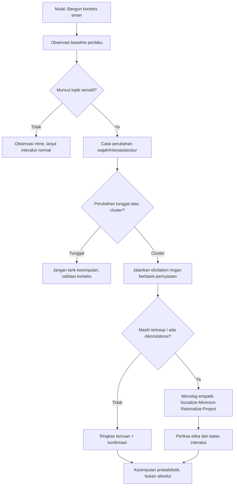
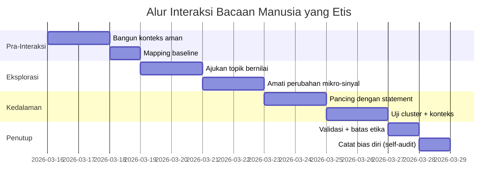

## Pengantar: Artikel ini sengaja **lebih keras** di bagian verifikasi

Pada transkrip `A44MGp-In4w`, Chase Hughes menampilkan kerangka membaca manusia yang terlihat “praktis”, tetapi inti ajarannya justru **bukan trik instan**, melainkan disiplin observasi berlapis.

Jika artikel sebelumnya lebih “ringkas”, versi ini saya sempurnakan untuk kebutuhan kamu agar:

1. **Tidak terjebak satu indikator** (karena manusia itu multi-dimensi).
2. **Bisa dipakai di dunia nyata**: bisnis, relasi intim, dan ruang digital.
3. **Memiliki pagar etika** supaya tidak berubah jadi manipulasi.
4. **Membedakan intuisi yang kuat vs klaim yang melampaui bukti**.

Saya akan menulis ini seolah-olah kamu sedang membangun *sistem bacaan manusia* yang bisa dipakai bertahun-tahun, bukan cuma satu “alat deteksi penipu.”

---

## 1) Satu pertanyaan inti yang jadi jangkar

Hughes memulai dari pertanyaan yang sangat praktis:

> **"Apa yang orang ini ingin saya rasakan tentang dirinya?"**

Dan biasanya dilanjutkan dengan:

> **"Apa yang dia ingin saya lihat (atau tidak lihat) dari dia?"**

Ini adalah inti dari analisis narasi personal:

- Jika seseorang sangat kuat mengarahkan cerita ke arah aman, sering terukur, dan selalu “rapi”, kita lihat pola **mengontrol persepsi**.
- Jika seseorang konsisten “mengundang” kamu masuk sebagai manusia, dengan kejujuran tentang batas dan keraguannya, biasanya mereka lebih “nyata”.

**Prinsip praktis:**

- Mulai dari **motif** (tujuan narasi), bukan dari tuduhan.
- Catat: apakah perilakunya menyesuaikan diri dengan konteks, atau justru performatif.
- Uji melalui waktu, bukan satu pertemuan.

---

## 2) Psikopati, narsisme, dan jebakan label cepat

Hughes menyebutkan: “sangat sulit menandai psikopat sebelum dia melakukan tindakan nyata.” Ini penting karena banyak orang keliru karena:

- ingin merasa aman cepat,
- ingin menertibkan realitas sosial,
- atau ingin merasa punya kontrol moral.

### Yang paling berbahaya

- **Stigma berlebihan**: menyematkan label psikologis di awal membuat observasi jadi bias.
- **False positive** (positif palsu): perilaku defensif dipakai sebagai “bukti,” padahal bisa datang dari trauma, kelelahan, neurodiversity, budaya, atau kepribadian introvert.

### Cara meminimalkan salah baca

1. Jangan menggunakan diagnosis klinis populer (psychopath, narsis, dll.) sebagai stempel akhir.
2. Berikan bobot pada **konsistensi perilaku lintas waktu**.
3. Pisahkan: `sinyal risiko` vs `kesimpulan pasti`.

---

## 3) Lingkungan modern dan “psikopati sosial” dalam kerangka Hughes

Transkrip masuk ke isu **bystander effect** di kota besar: banyaknya orang di sekitar membuat tanggung jawab kolektif menurun. Di sini Hughes mengaitkan gejala seperti empati yang memudar saat interaksi jadi impersonal.

Ini bukan teori “semua orang kota adalah psikopat”, melainkan kerangka lingkungan:

- volume manusia makin besar,
- relasi antarindividu makin tipis,
- reputasi jangka panjang berkurang.

Jika konteks sosial membuat seseorang makin sulit membaca manusia sebagai figur personal, maka ekspresi sosial jadi **permukaan**, bukan substansi.

---

## 4) Kerangka operasional: Base Line → Trigger → Change → Cluster → Konteks → Probabilitas

Ini yang jadi tulang punggung metode yang lebih sehat:

### A. Baseline (kondisi normal)

Sebelum menilai “aneh”-nya, lihat dulu baseline:

- ritme bicara normal,
- ekspresi facial dasar,
- postur saat bicara santai.

Tanpa baseline, semua orang yang gugup bisa dibaca salah.

### B. Trigger (pemicu)

Perhatikan bagian ketika muncul topik sensitif (uang, hubungan, rasa bersalah, reputasi, seksualitas, legalitas, dll).

### C. Change (perubahan)

Apakah ada perubahan mencolok?

- jeda respons tiba-tiba,
- nada suara berubah,
- mata/kelopak/ritme berkedip berubah,
- postur menguat/menutup.

### D. Cluster (kelompok indikator)

Satu indikator sendiri tidak memadai. Hughes menekankan `cluster`: gabungan beberapa sinyal pada waktu dekat yang koheren. Ini jauh lebih valid daripada “satu gejala = vonis”.

### E. Konteks

Sama-sama kunci besar: apakah perubahan itu masuk akal di konteks budaya, kesehatan, kelelahan, usia, trauma, dan situasi sosialnya?

### F. Probabilitas, bukan kepastian absolut

Setiap hasil akhir = **kemungkinan**, bukan final verdict. Ini menjaga dari kesalahan fatal karena overconfidence.

---

## 5) Kategori indikator yang sering dibahas (dan bagaimana memakainya)

### 5.1. **Mirror reaction** dan *affect* yang tidak sinkron

Jika orang kamu lihat bereaksi dengan pola yang cenderung tidak *nyambung* terhadap emosi konteksmu, ini jadi catatan.

Contoh:

- kamu bicara hal sedih → respons wajah datar,
- kamu bahas hal penting → respons terlalu teatrikal,

Tapi ingat: bisa juga jadi hasil latihan sosial, trauma, atau habit.

### 5.2. **Blink rate** (frekuensi berkedip)

Hughes menyebut rata-rata normal lebih rendah dari saat stres tinggi. Dalam praktik:

- bukan “alat diagnosis,”
- pakai sebagai indikator tambahan,
- naiknya denyut kedipan biasanya muncul saat beban kognitif/emosi meningkat.

### 5.3. **Pupil dilation / pupils melebarkan**

Ini sering dibahas sebagai reaksi sistem saraf otonom ketika terpapar tekanan/ketidakpastian. Lagi-lagi tidak wajib → lihat bersama indikator lain.

### 5.4. **Suara dan jeda (latency)**

Banyak bicara “kata-kata” padahal suara memberi sinyal lain:

- jeda terlalu panjang saat pertanyaan tertentu,
- suara menurun volumenya secara mendadak,
- ada “switching” ke kalimat defensif.

### 5.5. **Pronoun drop**

Pada contoh kasus FaceTime, Hughes menyoroti hilangnya pronoun (kata “aku/kita”) ketika berhadapan dengan pertanyaan sulit. Ini bisa jadi indikator distansi internal terhadap tindakan yang dibahas.

---

## 6) Model Mask: Chihuahua, Porcupine, Puppy/Baby, dan implikasi relasinya

Metafora mask yang kamu sebut memang kuat karena memindahkan pembicaraan dari “siapa itu penjahat?” menjadi “strategi proteksi apa yang ia pakai?”

- **Chihuahua / barking/challenging mask**: tegas, dominan, jarak sosial dibangun lewat performa kontrol.
- **Porcupine mask**: menjaga jarak, tidak mau terlalu dekat.
- **Puppy/Baby mask**: tampak “aman-ramah”, defensif secara pasif, menghindari benturan.

### Kegunaan praktis

1. Kalau kamu tahu mask, kamu membaca **perilaku yang dipelajari**, bukan “hakikat moral” langsung.
2. Fokus di pertanyaan berikut: masker ini melindungi apa? (penolakan, rasa malu, kebutuhan kontrol, takut ditinggalkan, takut dilihat lemah).

---

## 7) Elicitation: teknik peroleh informasi lewat statement, bukan pancingan agresif

Teknik yang paling dikenal Hughes adalah **elicitation**, mirip “interrogasi bertahap” untuk membuat orang bicara alami.

### Contoh pola

- **Statement daripada question**: kamu memberi kerangka, lalu lawan bicara isi sendiri.
- **Quotes/facts**: beri data/pengamatan kecil yang membuat dia butuh mengoreksi.
- **Disbelief framing**: kalimat yang terasa logis lalu memancing elaborasi.

Tujuan teknik ini:

- membuat lawan bicara merasa dia menjawab kebutuhan keabsahan dirinya,
- bukan sekadar melawan pertanyaan ya/tidak.

Tetap ingat batasannya: di ruang personal, gunakan untuk kejelasan, **bukan ekstraksi**.

---

## 8) Dari elicitation ke monolog: Socialize–Minimize–Rationalize–Project

Ketika ada indikasi penyembunyian, Hughes menyarankan model `golden bridge` lewat monolog empatik. Versi sederhananya:

1. **Socialize**: buka rasa aman.
2. **Minimize**: jangan mem-epik kejanggalan (biar orang tidak langsung defensif total).
3. **Rationalize**: bantu ia jelaskan “kenapa bisa terjadi”.
4. **Project**: beri ruang bahwa penyebabnya bukan “kamu jelek total”.

Ini bukan membenarkan perilaku salah, melainkan menurunkan eskalasi agar data lebih lengkap muncul.

---

## 9) Aplikasi per konteks: Bisnis, pasangan, teman dekat

### 9.1. Bisnis

Untuk partner/klien, Hughes memberi kriteria:

- adakah **ketulusan humanic** (humanity), bukan sekadar transaksional?
- ada follow-up pasca pertemuan atau hanya orientasi closing?
- apakah ia berbicara dengan manusia atau sekadar angka?

Jika terlalu transaksional, risiko manipulasi nilai jangka panjang tinggi.

### 9.2. Relasi romantis

Sinyal yang dinilai di contoh:

- apakah dia nyaman memberi jawaban reflektif,
- bisa bicara kekeliruan tanpa melebih-lebihkan diri,
- fokusnya ke pertumbuhan bersama, bukan performa dominasi.

Hughes menilai pertanyaan seperti “apa yang kamu pelajari dari hubungan sebelumnya” bisa jadi indikator keaslian emosional.

### 9.3. Pertemanan dan kolaborasi

Konsistensi perilaku sering lebih penting daripada “romantisme kata-kata”. Perhatikan bagaimana seseorang:

- bereaksi pada kritik,
- tetap menghormati boundary,
- dan konsisten antara cerita dan aksi.

---

## 10) Bagian yang sering terlewat dari transkrip dan perlu dipertegas

Beberapa potongan yang kerap luput dalam rangkuman singkat:

- **Urbanization hypothesis**: lingkungan yang makin anonim menurunkan reputasi sosial mikro, sehingga beberapa perilaku “mengeras” menjadi normal.
- **Childhood development lens**: banyak pola conflict-response berakar dari “cara aman bertahan usia dini” (8–9 tahun jadi contoh kasar). Ini penting biar kita tidak menilai moralitas anak—yang kita nilai sekarang adalah pola adaptasi.
- **Dopamine map / sumber motivasi**: Hughes menekankan pemetaan sumber motivasi agar kita sadar kapan orang mencari dopamin lewat validasi, bukan hubungan sehat.
- **Batas kesehatan digital**: semakin banyak simulasi/kurasi online dapat meningkatkan perbedaan wajah publik—pribadi menimbun masker.

---

## 11) Bagian kritis: klaim kesehatan (methylene blue, melatonin dosis tinggi, dll)

Di bagian akhir wawancara, Hughes bercerita soal pengalaman pribadinya menangani kondisi neurologis dan penggunaan zat tertentu.

### Cara membaca secara sehat

- Ini adalah **anecdotal experience** (pengalaman personal), bukan standar medis universal.
- Ada klaim yang belum bisa digeneralisasi.
- Untuk kesehatan, selalu **konsultasi dokter** sebelum mencoba intervensi apa pun.
- Jangan jadikan video wawancara sebagai resep.

Prinsip saya: manfaatkan wawasan sebagai hipotesis, lalu verifikasi dengan evidensi klinis/akademik dan pengawasan profesional.

---

## 12) Kesalahan umum ketika mempraktikkan teknik membaca manusia

1. **Overfokus ke facial cue**: padahal sinyal paling aman sering dari konsistensi konteks.
2. **Mengambil satu indikasi lalu menyimpulkan karakter**.
3. **Mendorong orang sampai defensif ekstrem** agar “memberi pengakuan”.
4. **Mengabaikan kultur dan latar psikososial**.
5. **Menyalahgunakan untuk kontrol sosial**.

### Batas etika minimum yang wajib

- Jangan memaksa pengakuan.
- Jangan menyebarkan tuduhan tanpa bukti kuat.
- Jangan menghakimi niat dari satu kali observasi.
- Hindari teknik yang meniadakan martabat manusia.

---

## 13) Framework praktik 14 hari (uji sendiri tanpa jadi sinis)

### Hari 1–3: Baseline

- Amati pola bicara/gestur orang-orang biasa (kolega, keluarga, orang asing di tempat ramai).

### Hari 4–6: Trigger Mapping

- Catat reaksi saat topik sensitif muncul.
- Jangan langsung konfirmasi “dia bohong”, cukup catat perubahan.

### Hari 7–10: Cluster Exercise

- Identifikasi minimal 2 indikator yang berubah bersama.
- Uji satu hari lalu ulangi dua hari berikutnya.

### Hari 11–12: Elicitation ringkas

- Coba teknik statement dalam percakapan netral.
- Bandingkan respons spontan vs respons dipaksa.

### Hari 13–14: Etika audit

- Tinjau mana interaksi yang membuatmu manipulatif.
- Koreksi niat: ingin memahami atau ingin menang?

Tujuan akhir: kemampuan membaca manusia **dengan empati terkalibrasi**, bukan paranoia.

---

## Diagram 1: Alur Observasi yang Aman

---

## Diagram 2: Timeline Interaksi Etis (contoh praktis)

---

## Catatan leksikal (istilah asing + padanan Indonesia)

| Istilah Inggris | Padanan / Penjelasan |
|---|---|
| body language | bahasa tubuh |
| affect | ekspresi emosi yang tampak |
| mask | topeng sosial / persona |
| self-control | kendali diri |
| elicitation | teknik memancing keterbukaan |
| change & cluster | perubahan + gugus indikator |
| blink rate | frekuensi berkedip |
| pronoun drop | hilangnya kata ganti diri dalam jawaban |
| monologue | pernyataan terstruktur untuk meredakan defensif |
| social engineering | rekayasa sosial |
| dopamine map | peta sumber pemicu motivasi |
| bystander effect | efek penonton pasif |
| narcissism | narsisme |

---

## Kesimpulan: manfaat terbesar justru ada pada kontrol diri pengamat

Nilai paling penting dari wawasan Hughes bukan kemampuan “membaca semua orang,” melainkan **membaca diri sendiri saat membaca orang**.

- kalau niatmu untuk menang, semua akan jadi sinyal konflik;
- jika niatmu untuk memahami, kamu akan melihat pola lebih jernih;
- jika niatmu etis, kamu tidak akan memanipulasi—hanya mengklarifikasi.

Keadaan terbaik dari kerangka ini adalah ketika kamu mampu:

1. melihat pola tanpa menghakimi cepat,
2. menilai probabilitas tanpa memberi label permanen,
3. dan tetap menjaga martabat lawan bicara, apapun kesimpulannya.

**Jadi, versi “lebih baik” dari artikel ini adalah versi yang lebih bertanggung jawab: lebih detail, lebih hati-hati, dan lebih manusiawi.**

---

**Referensi sumber:** `https://www.youtube.com/watch?v=A44MGp-In4w`
