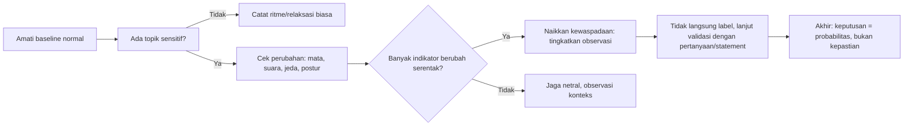
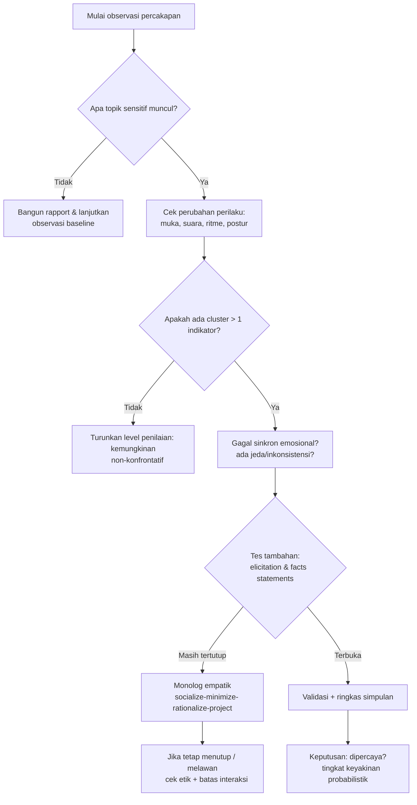
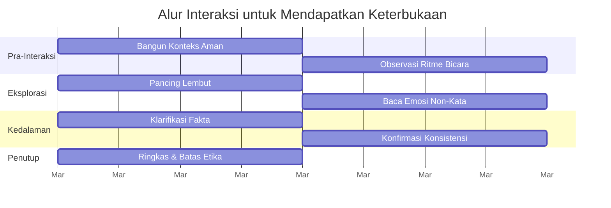

## 🧭 Pengantar: Mengapa Wacana “membaca manusia” Selalu Gampang Diikuti, tapi Sulit Diimplementasi?

Episode panjang dengan **Chase Hughes** dalam transkrip ini menyingkap satu hal yang penting: manusia selalu ingin memiliki *cara instan* untuk mengetahui siapa yang “asli” dan siapa yang “pura-pura”. Dari kasus-kasus ekstrem seperti kekerasan sampai keputusan sederhana di bisnis, kita ingin formula yang cepat dan pasti. Hughes memulainya dengan kalimat yang populer:

> **“The fastest way to read a human being…”**

Namun ia juga mengingatkan, banyak indikator perilaku memang *spektrum*—bukan sakramat, bukan “buku deteksi” yang bisa dipasang jadi checklist kaku. Dalam esensinya, ia mengusulkan kerangka kerja: mulai dari **apa yang orang itu inginkan kamu rasakan**, lalu lanjut ke **pola wajah, emosi, konteks, dan perubahan perilaku**, lalu ke **strategi komunikasi** yang memancing keterbukaan. 

Kalau dipadatkan, ini bukan sekadar trik psikologi pop. Intinya lebih ke:

1. **Pahami motif sosial** (apa topeng yang dipakai),
2. **Deteksi perubahan perilaku**, bukan gejala tunggal,
3. **Validasi dengan konteks**,
4. **Bertanya/menyatakan dengan struktur** agar interaksi bergerak ke keterbukaan,
5. **Jaga etika** agar tidak berubah jadi manipulasi yang rusak. 

Kita akan bedah semuanya secara detail, termasuk bagian kontroversial: klaim klinis, penggambaran “psikopati”, sampai penggunaan zat/metode seperti *methylene blue* dan *psikedelik* yang disinggung di akhir. 

> **Fokus utama artikel ini**: memetik manfaat praktisnya, **tanpa berubah jadi overconfidence**. Karena membaca manusia adalah seni yang tinggi, tapi pasti akan selalu punya peluang salah. 

---

## 🗣️ Satu pertanyaan kunci: “Apa yang dia mau saya rasakan?”

Menurut Hughes, fondasi tercepat membaca seseorang adalah dua pertanyaan:

- **Apa yang dia mau saya rasakan tentang dirinya?**
- **Apa yang dia ingin saya perhatikan, dan apa yang dia ingin saya abaikan?**

Konsep ini masuk ke ranah *persona* atau topeng sosial (*mask*), istilah yang ia gunakan untuk menunjuk bagian diri yang dibentuk untuk melindungi rasa malu, kerentanan, dan ketakutan. 

### Interpretasi praktis

Bayangkan kamu bertemu klien baru. Sebelum menganalisis mikro-ekspresi, tanyakan dulu:

- Apakah dia terlalu ingin terlihat “pahlawan”?
- Apakah dia cenderung menggeser topik ke pencitraan diri?
- Apakah dia banyak menolak topik rapuh (kegagalan, kritik, rasa takut)?

Jika jawabannya “iya” dalam banyak bentuk, berarti ada **keinginan untuk mengendalikan narasi**, bukan sekadar berkomunikasi. Dan di sinilah Hughes menautkan semua indikator berikutnya. 

---

## 👤 Psikopati, narsisme, dan bahaya “pasti tahu orang”

Hughes tegas: **“Kamu tidak bisa mengenali seorang psikopat sampai dia melakukan sesuatu.”** Angka yang ia sebutkan pun provokatif—jika memakai pendekatan statistik klasik, banyak profiler pun masih sering meleset.

### Implikasi praktis

- Jangan cari “indikator tunggal”.
- Jangan label orang terlalu dini.
- Gunakan **pola + konteks + perubahan**.

Ia mencontohkan mengamati narasi yang terlihat *calm* tapi kosong empati. Cerita seperti perempuan muda yang menceritakan pembunuhan keluarga dengan nada datar dianggap contoh ekstrem “kemungkinan topeng kejanggalan”. Ini kasus ekstrem, dan tidak bisa menjadi kaidah untuk menilai semua orang.

> **Peringatan etis**: label klinis (*psikopat*, *narsis*) di ruang publik sangat berisiko salah sasaran. Jangan jadikan bahan stigma. 

Yang lebih berguna adalah mengenali **tanda risiko perilaku**:

- tidak ada reaksi empatik di situasi emosional,
- respons yang konsisten kaku/menyimpang,
- perubahan pola mendadak saat topik sensitif,
- perilaku yang lebih mengejar kontrol daripada kejelasan hubungan.

---

## 🧠 Model “Mask”: Chihuahua, Chihuahua yang berteriak, Porcupine, Baby/Puppy, dan Lainnya

Salah satu bagian paling kaya dari wawancara ini adalah metafora mask berbasis kebutuhan masa kecil dan rasa malu.

### Mask sebagai bentuk perlindungan

Menurutnya, hampir semua orang memakai mask. Bukan berarti hipokrit, melainkan mekanisme manusia untuk:

- menyembunyikan rasa tidak aman,
- menjaga hubungan,
- menghindari rasa dipermalukan,
- menunda sakit hati,
- dan mengontrol penilaian sosial.

### Contoh jenis mask yang disebut

- **Chihuahua mask**: mepet, menegangkan dada, seolah-olah “keras” agar aman.
- **Porcupine mask**: defensif, menjaga jarak, “jangan datang terlalu dekat”.
- **Puppy/Baby mask**: terlihat terlalu manis, menurunkan konflik, menghindari konfrontasi.

Intinya, ini bukan diagnosis. Ini lensa memetakan *cara orang menjaga diri*. Bila sadar akan mask, kamu lebih mudah menilai apakah interaksi kamu realistis atau dipengaruhi skenario yang dipertontonkan.

---

## 👁️ Membaca wajah: cermin sosial, micro-react, dan keterbatasannya

Hughes mengatakan untuk membedakan reaksi spontan dan reaksi buatan, lihat **mirroring** (pemantulan emosi):

- Saat kamu senang bercerita, apakah ia ikut ekspresi senang?
- Saat kamu bicara hal sedih, apakah wajahnya ikut turun?

Jika tidak ada afek sama sekali, bisa jadi dia gagal membaca konteks emosi atau sengaja mengendalikan ekspresi. 

### Istilah asing yang sering muncul (dengan arti Indonesia)

- **mirror reaction**: respons cerminan emosi.
- **affect**: ekspresi emosi yang tampak di wajah.
- **eyebrow flash**: kilatan alis spontan ketika menerima informasi.
- **cluster**: kumpulan indikator yang terjadi bersamaan.
- **lull/latency in response**: jeda respons yang tak biasa, bisa jadi sinyal pikiran berat/tekanan.

### Keterbatasan penting

Tidak ada indikator tunggal yang “pasti”. Hughes juga menguatkan ini berkali-kali:

- ekspresi bisa dipelajari,
- budaya mempengaruhi cara menampilkan emosi,
- kelelahan/obat/trauma mengubah ekspresi.

Sehingga yang dipakai adalah **pola perubahan**, bukan label instan. 

---

## ⏱️ Blink rate, pupil, dan perubahan emosi saat topik sensitif

Ia menyebut *blink rate* (frekuensi berkedip) sebagai indikator tekanan. Secara kasar:

- rata-rata normal: **15–18 kali/menit**,
- kondisi stress tinggi: bisa jauh meningkat,
- fokus sangat tinggi: bisa menurun (karena perhatian sangat fokus).

Bagian ini harus dibaca hati-hati: bukan hukum alam yang pasti, tetapi sinyal tambahan.

### Dalam kasus contoh (FaceTime)

Hughes mendeskripsikan kenaikan blink rate, pupil dilation, ekspresi wajah, dan jeda bicara saat pertanyaan menyinggung dugaan ketidakjujuran.

Yang ia tekankan:

1. **Perubahan** harus terjadi bersamaan,
2. **Bersifat bertahap atau cluster**,
3. **Konteks topik penting** (misalnya topik finansial, kesehatan, relasi seksual, kriminalitas).

---

## 🔁 Prinsip “perubahan” dan “klaster” — bukan indikator tunggal

Dua kata kunci dari metode bacaannya:

- **Change** (perubahan): pergeseran ekspresi dari baseline ketika ditanya hal sensitif.
- **Cluster**: beberapa indikator muncul bersama-sama.

### Pseudocode penilaian

Ini kunci metodologis yang sangat penting: keputusan manusia harus tetap **probabilistik**, bukan absolut. 

---

## 💬 Teknik elicitation: “statement” lebih kuat dari “pertanyaan” di momen tertentu

Hughes menyoroti teknik yang diajarkan di dunia intelijen: memakai **statement** agar lawan bicara cenderung memberi cerita lebih panjang.

### Alasan utamanya

Saat ditanya langsung, otak pendengar membangun “gerbang perlindungan” (*security guard*). Saat diberi pernyataan, mereka sering “auto” melanjutkan cerita.

Contoh sederhana:

- Bukan: “Kamu kena masalah di kemarin?”
- Tapi: “Saya kemarin lihat kejadian ini, dan teman saya bilang…”

### Teknik turunan

1. **Quotes + Facts**: sengaja menyebut data/statistik/pengamatan yang memancing koreksi.
2. **Provocative Statement**: pernyataan yang mengundang respons emosional sehat (“Wah, itu pasti berat banget…”).
3. **Disbelief framing**: “Tidak mungkin bisa begitu ya? Aku coba percaya, ceritakan lebih detail.”

Semua ini bukan berarti menekan orang untuk membohongi; melainkan memancing keterbukaan dengan cara yang tidak konfrontatif.

> Di tahap awal, teknik ini bisa membantu di networking, wawancara kerja, negosiasi, atau pendalaman wawasan klien.

---

## 🧩 Dari Elicitation ke Konfrontasi Bertahap (monolog) dalam Interrogasi

Di titik lanjutan, ketika seseorang terlihat menyembunyikan informasi dan kamu butuh kejelasan tinggi (tanpa kekerasan), Hughes menyarankan **monolog terstruktur**:

- **Socialize**: buat rasa aman.
- **Minimize**: tidak melebihkan pelanggaran.
- **Rationalize**: beri alasan manusiawi sehingga orang bisa jelaskan.
- **Project**: alihkan rasa defensif “ini tidak murni salahmu”.

Dengan kerangka itu, dia menyebutnya seperti membangun “jembatan emas” (*golden bridge*) agar orang punya jalan mundur yang aman untuk jujur. 

### Kenapa ini efektif?

Saat rasa takut terhadap identitas/hukuman mereda, orang lebih mungkin memberi detail. 

Tapi sekali lagi: konteks legal/etis menentukan. Dalam hubungan personal, bentuk ini mudah berubah jadi manipulatif jika disalahgunakan. 

---

## 🧨 Bait Question / Mind Virus (pertanyaan jebakan yang aman)

Bagian ini sensitif: Hughes menyebut contoh pertanyaan semacam:

> “Apa ada kemungkinan orang lain bilang melihatmu di tempat itu?”

Tujuannya bukan membuat orang panik, tapi membobol denial dengan pertanyaan yang menguji kesiapan mental menghadapi kemungkinan bukti. Kalau orang benar-benar innocent, biasanya responsnya bisa stabil dan kurang reaktif. Kalau ada beban informasi, sering terjadi stress response.

### Risiko serius

Teknik ini harus dipakai dengan: 
- konteks yang jelas,
- tidak menghakimi,
- dan tidak untuk memproduksi “pengakuan palsu”.

Di luar sistem hukum/keamanan, gunakan dengan versi ringan: komunikasi empatik, bukan interogasi. 

---

## 💼 Aplikasi praktis: Bisnis & relasi intim

Hughes memisahkan tiga konteks:

1. **Bisnis**: cari orang yang melihat manusia, bukan hanya angka.
   - tidak terlalu transactional,
   - peduli follow-up setelah pertemuan,
   - konsisten, bukan performatif.
2. **Teman dekat/partner**:
   - cek “derajat keaslian”,
   - respon terhadap pertanyaan reflektif (mis. apa yang paling dipelajari dari hubungan sebelumnya),
   - konsistensi antara kata dan tindakan.
3. **Komunitas/pengaruh**:
   - cari orang dengan karakter dan konsistensi,
   - waspada kalau hanya mengukur validasi eksternal.

### Sinyal penting untuk hubungan dekat

- Pertanyaan yang membuka diri,
- kemampuan menahan ketidaknyamanan,
- tidak mementingkan diri di setiap pembicaraan,
- tidak transactional.

---

## 🌿 Hubungan dengan budaya media sosial: simulasi, kecanduan validasi, dan “penghematan emosi”

Bagian paling filosofis di penghujung wawancara adalah analogi “simulasi” dan “masuknya diri ke realitas sosial yang makin artifisial”. Bukan berarti semua media sosial itu buruk, melainkan ia menyoroti fenomena:

- orang hidup untuk **validasi**,
- lebih berorientasi “terlihat” daripada “jadi”,
- topik publik mematikan spontanitas,
- kepercayaan diri tergantikan performa.

Dia menilai masyarakat urban bisa menekan empati karena terlalu banyak interaksi anonim/berjarak (mirip *bystander effect*).

### Catatan kritis

Analogi simulasi ini berguna untuk introspeksi, tapi jangan menjadikannya paranoia digital. Solusi praktisnya:

- audit digital (aplikasi, waktu konsumsi, pola scroll),
- bedakan kebutuhan nyata vs kebutuhan “dilihat”,
- latih “zona off-screen” secara teratur.

---

## 🧪 Bagian kontroversial: methylene blue, melatonin dosis tinggi, dan psikedelik

Di akhir wawancara, topik bergeser ke pengalaman pribadi Hughes soal kesehatan otak dan pemulihan kejang temporal lobe.

### Isi klaim utama yang ia sampaikan

- menderita *temporal lobe epilepsy* dengan memori terfragmentasi,
- memakai **methylene blue** dan **high-dose melatonin**,
- menganggap pendekatan itu sangat membantu/perbaikan fisik dan mental,
- menyebut red-light therapy sebagai pendukung,
- menyinggung peran psikedelik sebagai pembuka ego dan pemetaan diri.

### Cara membaca klaim ini secara sehat

- Ini adalah **pengalaman subyektif** + interpretasi pribadi,
- bukan rekomendasi medis umum,
- bukti klinis yang relevan harus diverifikasi oleh dokter,
- konteks anti-slang: “cocok untuk saya, belum tentu cocok untuk Anda.”

Di artikel ini, bagian itu harus tetap dicatat karena penting untuk kelengkapan, tetapi kita tidak boleh menjadikan opini audio/video menjadi resep kesehatan.

---

## 🧱 Mermaid Diagram: Kerangka Penilaian Relasi Interpersonal

---

## 🧩 Mermaid Timeline: Alur Wawancara yang Direkomendasikan (versi etis)

---

## ⚖️ Keseimbangan Etika: Kapan teknik ini menjadi tidak sehat?

Ini bagian yang paling penting untuk pembaca modern, karena skill membaca orang sering tergelincir ke manipulasi.

### Praktik sehat

- **Meningkatkan proteksi diri** tanpa mendiskreditkan orang.
- **Membangun kejelasan hubungan** (bisnis, keluarga, komunitas).
- **Tidak menyebarkan label stigma**.

### Praktik tidak sehat

- Mengekstrak emosi orang lalu memanfaatkannya.
- Menjustifikasi pelecehan atau kontrol.
- Menempelkan diagnosis mental tanpa basis profesional.
- Memaksa pengakuan demi ego ego.

Hughes menyentuh etika ini secara implisit lewat ide “golden bridge”: beri ruang aman. Namun di ruang publik, kita perlu melanjutkan dengan prinsip hukum: **saling setuju, transparan, non-eksploitatif**.

---

## ✅ Bagaimana memakai wawasan ini tanpa jadi sosok sinis?

Jika dipadatkan menjadi pedoman praktis:

### 1) Awal interaksi: cari pola, bukan orangnya
Lihat perilaku dalam konteks. Jangan mengunci satu gejala.

### 2) Di bisnis: nilai karakter, bukan sekadar performa
Pertanyaan follow-up bukan “cek trik”, tapi indikator hubungan jangka panjang.

### 3) Di hubungan romantis: minta jawaban reflektif
Contoh pertanyaan yang bagus: “apa yang kamu pelajari dari hubungan sebelumnya?”

### 4) Di konflik: jaga emosi dulu, tanya setelah aman
Jika kamu panik, kamu akan membaca terlalu banyak noise.

### 5) Di dunia digital: kurangi penyeragaman validasi
Nilai apakah seseorang konsisten offline maupun online.

---

## 🧠 Keterbatasan yang Tidak boleh dilupakan

- **Data manusia sangat heterogen**: budaya, trauma, kesehatan, kelelahan, dan kepribadian bisa menipu indikator visual.
- **Tidak ada tes definitif non-invasif** untuk “jujur/salah”.
- **Probabilitas bukan kebenaran absolut**.
- **Kesadaran etika melebihi teknik**—kalau etika rusak, analisis menjadi senjata.

Jadi, formula yang paling sehat: *“baca dengan hati-hati, verifikasi bertahap, putuskan dengan rendah ego.”*

---

## 🔚 Kesimpulan: dari rasa ingin tahu jadi kebijaksanaan

Episode ini membuka mata bahwa membaca manusia itu lebih seperti **latihan literasi sosial** daripada ilmu hitam. Pada level paling dalam, Hughes bukan sekadar menulis daftar “tanda penipu”, tetapi menawarkan kerangka agar kamu tidak jadi korban manipulasi, dan juga tidak menjadi manipulator.

Pelajarannya adalah:

- jangan tersipu untuk percaya satu indikator,
- bangun pemahaman pada **konstelasi perilaku + konteks + kejelasan diri**,
- gunakan teknik komunikasi untuk menurunkan defensif,
- dan selalu evaluasi niatmu sendiri: apakah ini untuk kebaikan hubungan, atau untuk menang.

Jika kamu ingin praktiknya bertahan lama, fokusnya bukan “mengintai” orang, melainkan **mengasah integritas membaca dan memimpin percakapan**.

---

## Catatan Leksikal (Istilah Asing + Padanan Bahasa Indonesia)

| Istilah Asing | Padanan / Penjelasan Ringkas |
|---|---|
| body language | bahasa tubuh |
| nonverbal cues | isyarat non-verbal |
| mask | topeng sosial / persona |
| self-control | kontrol diri |
| elicitation | teknik memancing keterbukaan |
| provocative statement | pernyataan pemicu jawaban |
| cluster | kelompok indikator bersamaan |
| blink rate | frekuensi berkedip |
| dopamine map | peta sumber rangsangan reward |
| bystander effect | efek penonton pasif |
| narcissism | narsisme | 

---

**Referensi materi sumber:** `https://www.youtube.com/watch?v=A44MGp-In4w`

