## Siapa Chase Hughes? 🎖️

> *"Saya melakukannya untuk orang-orang yang pernah melewati masa dalam hidupnya — menyadari bahwa ada keunggulan tak kasat mata yang dimiliki orang lain, dan menunjukkan bahwa ini adalah salah satu tuas terbesar yang bisa kamu tarik dalam hidupmu."*
> — Chase Hughes

**Chase Hughes** bukan psikolog ruang kuliah. Ia adalah mantan veteran militer AS selama 20 tahun yang membangun karirnya di unit-unit paling berpengaruh di dunia:

- **Secret Service** (*Dinas Rahasia*)
- **Navy SEAL leaders** (*Pemimpin Pasukan Khusus Angkatan Laut*)
- **Psychological Operations Department, US Army Special Operations Command** (*Departemen Operasi Psikologis, Komando Operasi Khusus Angkatan Darat AS*)
- **Intelligence agencies** (*Agen intelijen*) — melatih cara mengenali perilaku manusia dan interrogasi (*interogasi*)
- Ribuan **CEO, eksekutif, dan sipil**

Bukunya ***The Behavior Ops Manual*** — mungkin buku teks perilaku paling komprehensif yang pernah ditulis — mengumpulkan 30.000–40.000 jam riset, setiap teknik interrogasi, persuasi, dan analisis perilaku ke dalam satu volume.

Pesan intinya: **Semua yang terjadi di dunia ini — dari gejolak ekonomi, inovasi AI, hingga konflik perang — pada akhirnya bermuara pada faktor manusia.** Siapa yang bisa membaca, memahami, dan mempengaruhi manusia akan selalu berada di atas.

<Callout type="info" title="📖 Sumber">
Artikel ini berdasarkan percakapan mendalam Chase Hughes di podcast **The Diary of a CEO** dengan Steven Bartlett.

Sumber: [YouTube — The Behaviour Expert: Instantly Read Any Room](https://www.youtube.com/watch?v=RvjR9GM2kX8)
</Callout>

---

## Tiga Faktor Penentu Sukses atau Gagal 🔺

Chase Hughes memiliki model sederhana yang menurutnya menjelaskan **mengapa seseorang berhasil atau gagal** dalam situasi apapun:

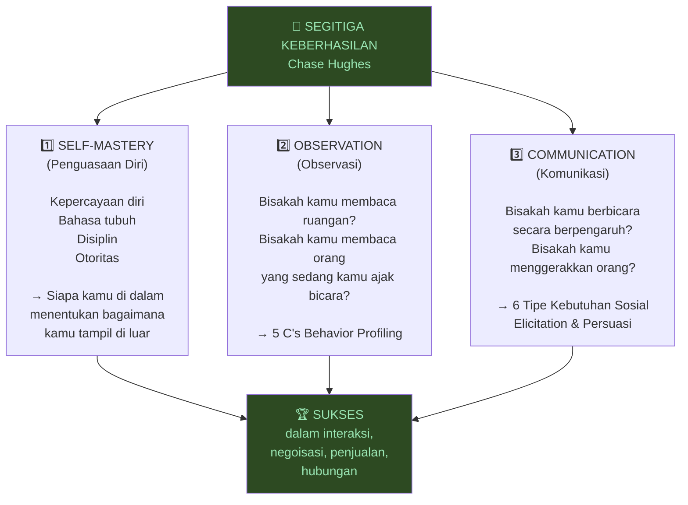

---

## BAGIAN I: SELF-MASTERY — Penguasaan Diri 💪

### Model ACSS: Apa yang Benar-Benar Dibutuhkan Orang

Sebagian besar klien Hughes datang dengan permintaan yang sama: *"Ajarkan saya tekniknya. Beri saya script-nya."*

Tapi Hughes menemukan sesuatu yang mengejutkan:

> *"90% orang bilang mereka butuh lebih banyak skill. Tapi yang mereka butuhkan sebenarnya adalah Authority atau Comfort."*

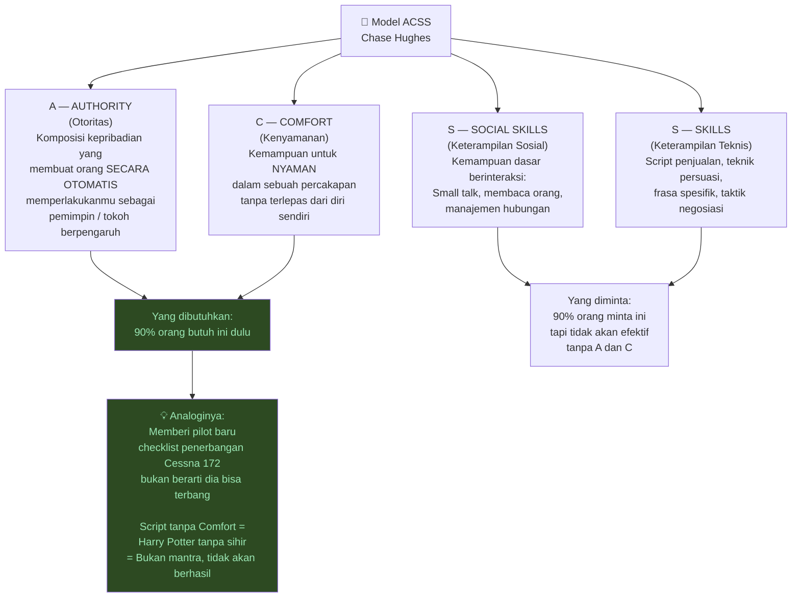

---

### Comfort: Satu Hal yang Mengubah Segalanya 🌊

**Comfort** (*kenyamanan*) adalah keunggulan kompetitif yang paling diremehkan dalam interaksi manusia.

Hughes memberikan satu tantangan sederhana kepada klien baru:

> *"Satu hal yang ingin kamu fokuskan minggu ini: Bisakah kamu bergerak lebih lambat dari semua orang di ruangan?"*

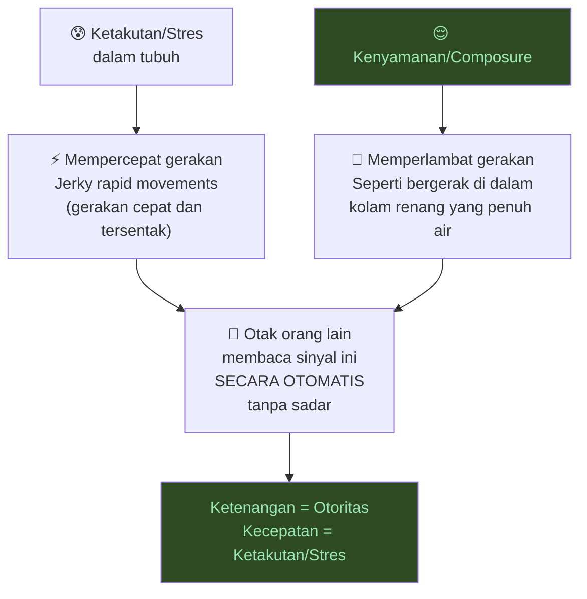

**Spektrum Composure (*Ketenangan*):**

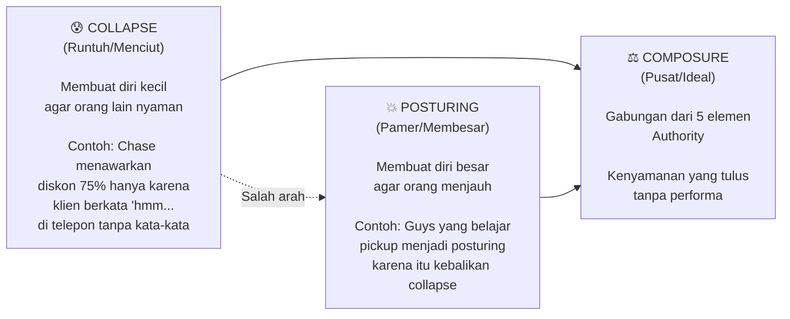

<Callout type="warning" title="⚠️ Jebakan Posturing">
Banyak orang yang hidup dalam *collapse* (*menciut*) berpikir solusinya adalah *posturing* (*pamer*) — karena itu adalah kebalikannya.

**Tapi posturing bukan tengah-tengah. Tengah-tengah adalah composure.**

Ini mengapa banyak orang yang belajar "teknik kepercayaan diri" justru menjadi lebih artificial dan kurang dipercaya.
</Callout>

---

### Authority: Lima Elemen Otoritas Sejati 👑

**Authority** (*otoritas*) bukan tentang jabatan atau hierarki. Ini adalah kualitas batin yang menghasilkan rasa otomatis dalam diri orang lain: *"Orang ini adalah pemimpin."*

Hughes mendefinisikan Authority sebagai kombinasi **5 elemen**:

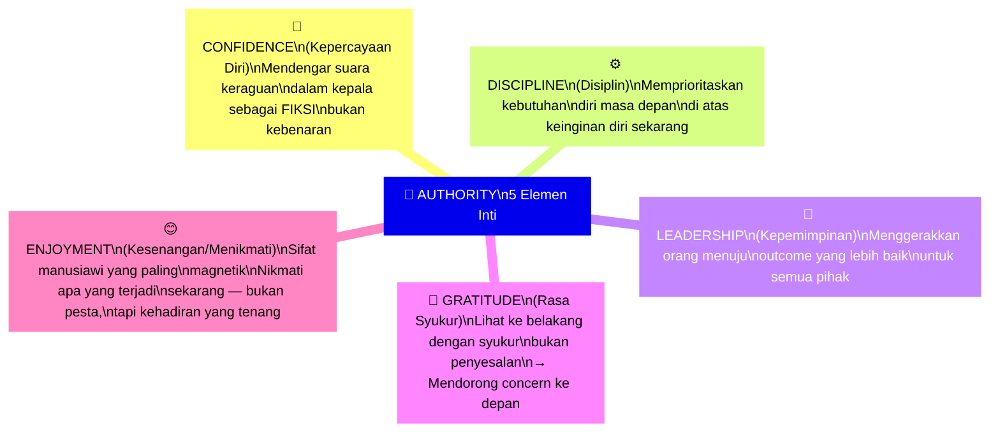

**Mengapa Enjoyment (*Kesenangan*) masuk daftar ini?**

> *"Saya melalui setiap orang yang pernah saya latih — dan semua pemimpin alami yang punya otoritas, mereka dengan tenang menikmati apa yang sedang terjadi. Ini adalah sifat manusiawi yang paling magnetik."*

---

### Perbedaan Gejala vs Penyebab Otoritas 🩺

Ini adalah insight paling penting Hughes tentang mengapa artikel *"19 cara tampil lebih percaya diri"* tidak pernah benar-benar bekerja:

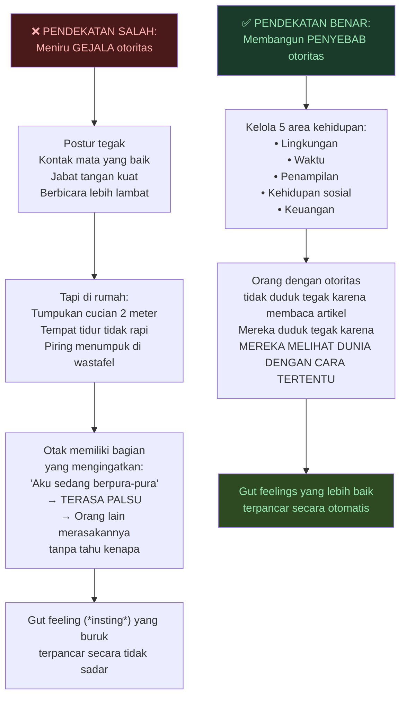

**5 Area Kehidupan yang Menentukan Gut Feeling Orang Lain:**

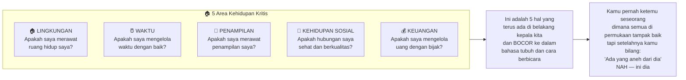

---

### Percaya Diri: Fiksi vs Kebenaran 🎭

Hughes menggunakan analogi sederhana yang mengubah cara pandang tentang kepercayaan diri:

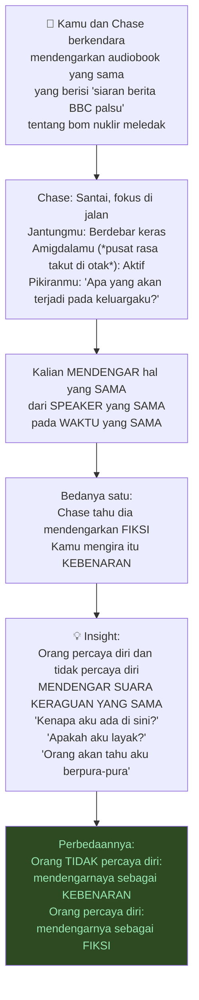

---

### Aplikasi Masa Kecil: "Apps" yang Berjalan Tanpa Sadar 📱

> *"Suara itu, 9 dari 10 kali, berkembang ketika kamu berusia 8 atau 9 tahun."*

Hughes menjelaskan bahwa cara kita berinteraksi sebagai anak kecil membentuk "aplikasi" yang berjalan di latar belakang kehidupan dewasa kita:

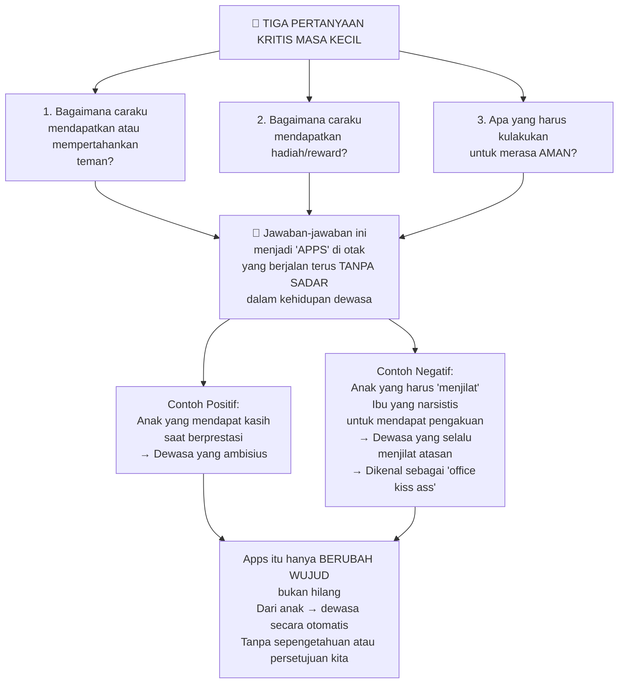

---

## Eksperimen Milgram: Kekuatan Otoritas yang Mengerikan ⚡

Hughes menggunakan *Milgram Experiment* (*Eksperimen Milgram*) dari Yale University (1962) untuk mendemonstrasikan betapa kuat otoritas mempengaruhi perilaku manusia.

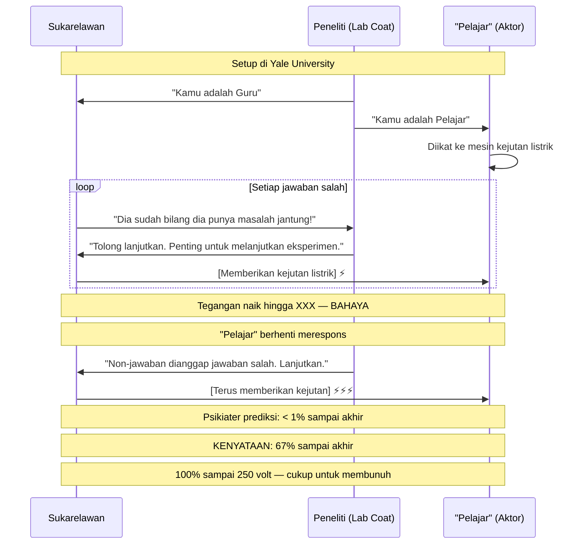

**Apa yang benar-benar terjadi di Milgram?**

Hughes punya interpretasi yang berbeda dari kebanyakan analisis:

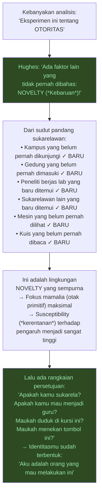

---

## BAGIAN II: OBSERVATION — Membaca Ruangan 👁️

### Tanda Kepercayaan Diri Nomor Satu: Kecepatan Gerak 🐢

> *"Orang paling lambat bergerak di dalam ruangan adalah orang yang paling percaya diri."*

Ketika Hughes memasuki ruang publik, **hal pertama yang dicarinya** adalah siapa yang bergerak paling lambat — itulah orang yang paling berkuasa di ruangan itu.

---

### Blink Rate (*Frekuensi Kedipan Mata*): Alat Baca yang Paling Reliabel 👀

Hughes menyebut *blink rate* sebagai alat membaca orang **paling andal** yang ada — lebih dari bahasa tubuh apapun.

**Mengapa blink rate begitu reliable?**
- **Tidak sadar** — kita tidak mengontrolnya secara manual
- **Sangat sensitif** — berubah secara otomatis mengikuti kondisi mental
- **Tidak bisa dipalsukan** dengan mudah

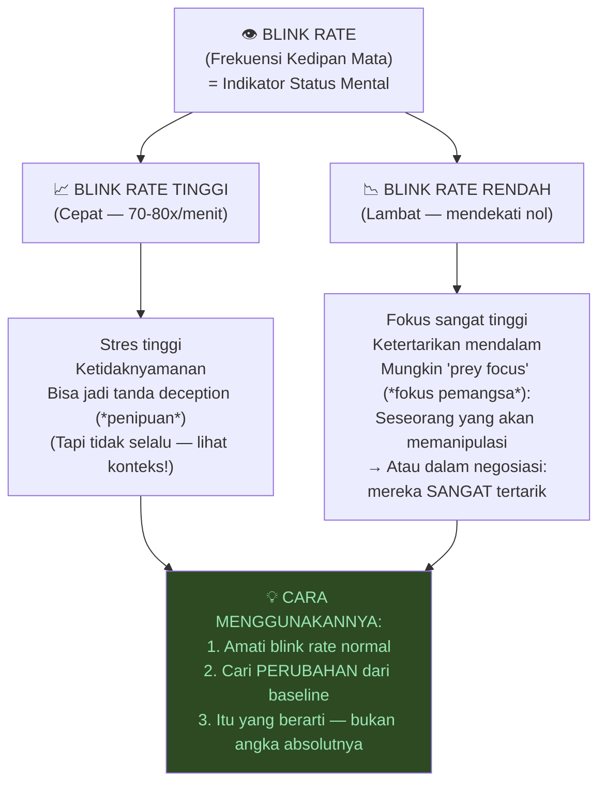

**Contoh Praktis:**
- Di *Shark Tank* (*Dragon's Den*) — amati siapa yang blink rate-nya paling rendah saat startup pitch → Investor itu yang pertama membuat penawaran (paling tertarik)
- Di presentasi: jika blink rate audiens meningkat serentak → **Segera ganti topik**

---

### 5 C's: Sistem Profiling Perilaku 🔬

Ini adalah kerangka berpikir untuk menganalisis perilaku — mencegah kamu terjebak oleh satu sinyal yang menyesatkan:

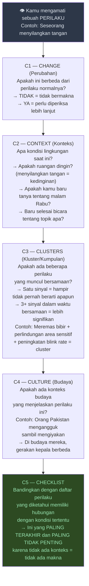

<Callout type="warning" title="⚠️ Bahaya Analisis Tubuh yang Setengah-Setengah">
Banyak orang menjadi "ahli bahasa tubuh amatir" karena artikel internet. Ini berbahaya:

> *"Dia menggaruk hidung tiga kali saat bicara tentang itu... Aku tidak akan pernah berbisnis dengan orang itu!"*

Padahal: Dia baru saja keluar musim semi, hidungnya merah saat masuk, dan sudah menggaruknya 30 menit sebelum pertemuan.

**Itu bukan PERUBAHAN — itu perilaku yang berulang.**

Jika kamu tidak melihat *change* (*perubahan*), kamu tidak melihat apapun yang bermakna.
</Callout>

---

## BAGIAN III: COMMUNICATION — Berkomunikasi secara Berpengaruh 🗣️

### Enam Tipe Kebutuhan Sosial Manusia 🧬

Setiap manusia, dalam setiap percakapan, secara tidak sadar mengungkapkan **apa yang mereka butuhkan dari orang lain**. Hughes mengidentifikasi 6 kategori:

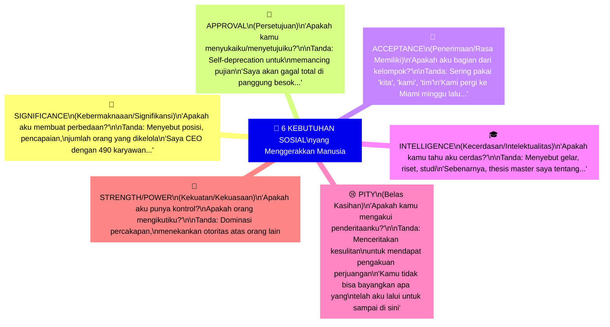

**Cara Membaca Tipe Seseorang:**

Tanyakan pertanyaan sederhana: *"Ceritakan tentang dirimu"* atau *"Bagaimana liburanmu?"*

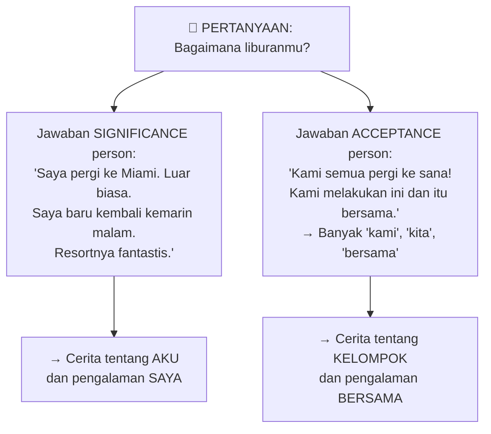

---

### Menggunakan Tipe Kebutuhan dalam Percakapan 🎯

Setelah mengidentifikasi tipe seseorang, sesuaikan cara berkomunikasimu:

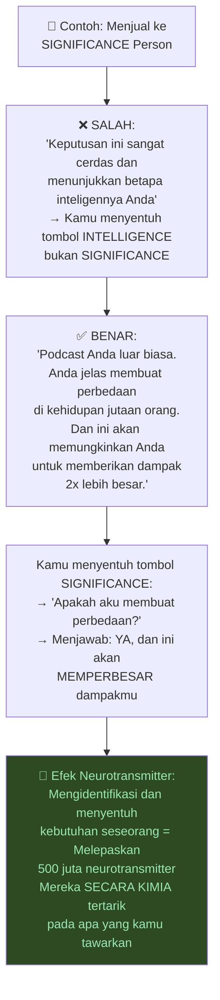

> *"Kita semua adalah drug addicts (*pecandu*). Kita hanya perlu mengidentifikasi obat yang membuat orang kecanduan itu."*

---

### Elicitation: Teknik CIA untuk Menggali Informasi 🕵️

**Elicitation** (*elisitasi* — teknik menggali informasi melalui pernyataan, bukan pertanyaan*) adalah teknik yang dikembangkan oleh CIA dan pernah digunakan Soviet untuk mendapatkan informasi dari pelaut AS muda selama Perang Dingin.

**Prinsipnya:** Makin sensitif informasinya, makin sedikit pertanyaan langsung yang harus kamu ajukan.

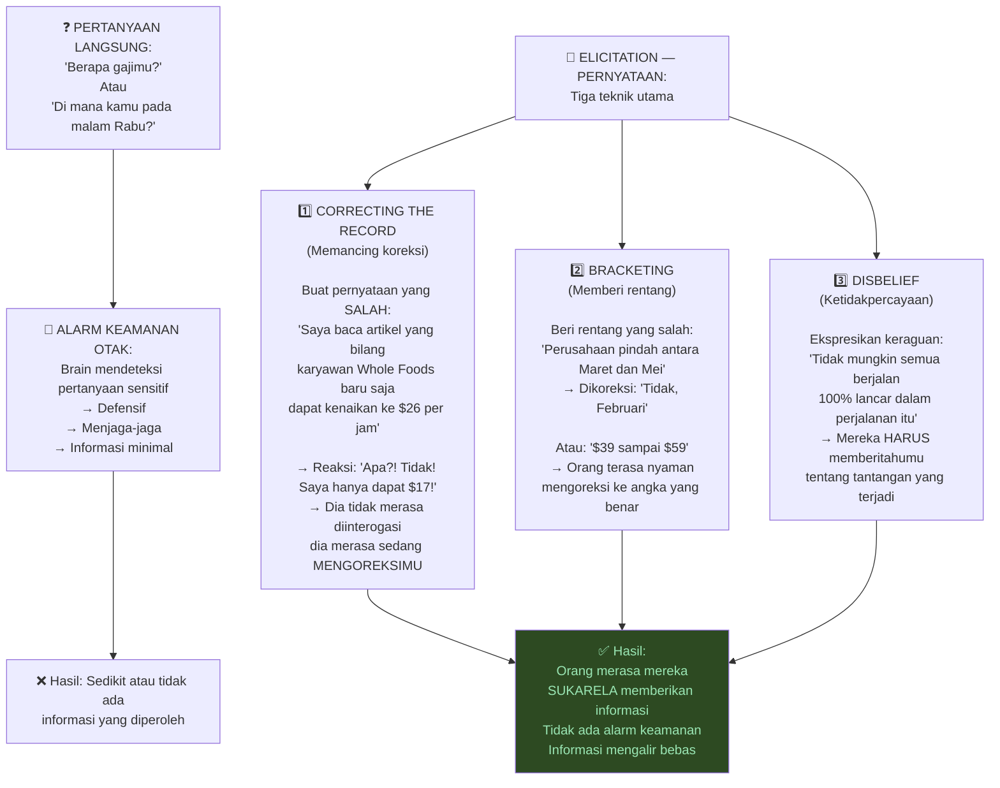

**Contoh Sejarah — Perang Dingin:**

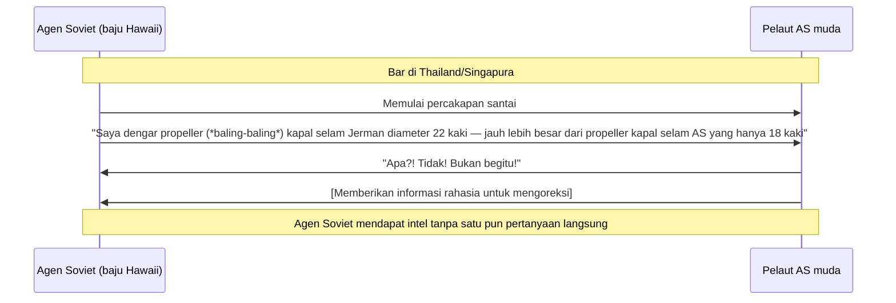

**Cara Melanjutkan Percakapan dengan Elicitation:**

Gunakan kata-kata ajaib ini:
- ***"So..."*** + ringkasan situasi mereka
- ***"I bet..."*** (*"Saya yakin..."*) + pernyataan yang bisa dikonfirmasi atau dikoreksi
- ***"That sounds like there were no challenges at all"*** (*"Kedengarannya tidak ada tantangan sama sekali"*) → Akan langsung dikoreksi!

---

### Model PCP: Dari Persepsi ke Tindakan 🎯

**PCP** (*Perception → Context → Permission*) adalah model tiga langkah yang menjelaskan bagaimana seseorang bisa dipengaruhi untuk melakukan sesuatu yang normalnya tidak akan dilakukan — dari bergabung dengan kultus hingga membeli produk.

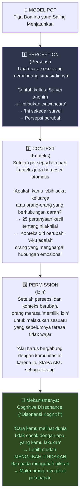

---

### Identitas vs Ide: Cara Paling Kuat Mengubah Perilaku 🪪

Hughes dan Robert Cialdini (*penulis "Influence and Persuasion"*) sama-sama menemukan bahwa mengubah **identitas** seseorang jauh lebih powerful dari mengubah **ide** mereka.

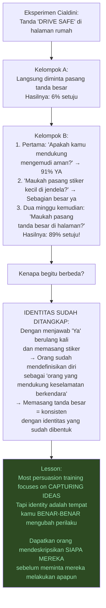

---

### Model FATE: Empat Cara Mempengaruhi Mamalia 🐾

> *"Cara mempengaruhi mamalia — manusia, anjing, apapun — ada empat. Ini mengeja kata FATE."*

```mermaid
mindmap
  root["🎯 FATE MODEL\nEmpat Lever Pengaruh Mamalia"]
    ["🔍 F — FOCUS\n(Fokus)\nArahkan perhatian mamalia\nke sesuatu yang BARU (*Novelty*)\n\nOtak mamalia langsung\nfokus pada hal baru\n= Ciptakan novelty terlebih dahulu"]
    ["👑 A — AUTHORITY\n(Otoritas)\nTampilkan tanda-tanda kepemimpinan\nyang bisa dikenali otak primitif\n\nContoh: Lab coat di Milgram\nCelebrity dalam iklan\nBrand recognition"]
    ["👥 T — TRIBE\n(Suku/Kelompok)\nTunjukkan bahwa orang-orang\nDALAM KELOMPOKNYA sudah melakukan ini\n\n'Semua orang yang sepertimu\nsudah melakukan X'\n= Insting mengikuti suku"]
    ["❤️ E — EMOTION\n(Emosi)\nCiptakan perasaan yang kuat\nyang bisa dimengerti otak mamalia\n\nGambar visual, bukan kata-kata\nOtak mamalia tidak berbahasa — ia merasa"]
```

**FATE dalam Infomercial (Iklan Belanja):**

```mermaid
graph LR
    A["📺 Infomercial"] --> B["F: Tangkap fokus\ndengan visual menarik"] --> C["A: '1 juta orang\nmembelinya, 5 bintang'"] --> D["T: 'Semua tetanggamu\ndi seluruh AS menggunakannya'"] --> E["E: Gambar visual\norang bahagia, sukses,\nmencapai impian"] --> F["🛒 BELI!"]
```

---

### Novelty: Kekuatan yang Diabaikan 🆕

> *"Nomor satu hal yang menghasilkan fokus di otak mamalia adalah NOVELTY — kebaruan."*

**Novelty** (*kebaruan, hal baru*) adalah sesuatu yang tidak sesuai dengan "script" (*naskah*) yang sudah dibentuk otak.

```mermaid
graph TD
    A["🦁 Leluhur kita berjalan\nmelewati semak setiap hari"] --> B

    B["Satu hari, ranting patah\ndi belakang semak itu\n→ NOVELTY!\n→ Tidak sesuai script"] --> C

    C["Otak langsung:\nFOKUS PENUH\nAdrenalin naik\nSemua indera waspada"] --> D

    D["Itulah alasan biologis:\nMakhluk yang tidak memperhatikan\nhal baru... dimakan predator\ndan tidak mewariskan gen"] --> E

    E["💡 Implikasinya untuk komunikasi:\nJika kamu terdengar seperti SEMUA\npanggilan sales yang pernah diterima orang\n→ Otak mereka langsung MENGECUALIKANMU\nbahkan sebelum sadar melakukannya\n\nJika kamu menciptakan NOVELTY\n→ Otak wajib memperhatikanmu"]

    style E fill:#2d4a22,color:#9ae6b4
```

**Contoh Nyata Novelty dalam Sales:**

Tim sales yang dilatih Hughes melakukan ini:
> *Ketika klien menjawab telepon, agen berpura-pura anjingnya baru menumpahkan minuman ke komputer. "Oh astaga, tunggu sebentar..." [suara membersihkan] "Maaf banget, anjing baru saya baru menumpahkan kopi ke laptop saya..."*

**Hasil: Klien bertahan 70% lebih lama di telepon** — karena otak mereka tidak memiliki "script" untuk situasi ini.

---

### Habituation Filter: Mengapa Otak Mengabaikan Hal Familiar 🔇

**Habituation filter** (*filter habituasi*) adalah mekanisme otak untuk menghemat energi kognitif dengan mengabaikan hal-hal yang familiar.

```mermaid
graph TD
    A["🧠 Otak menyimpan 'SCRIPTS'\nuntuk situasi yang familiar"] --> B

    B["Contoh: 'Halo, ini adalah\npanggilan penjualan'\n→ Otak: SCRIPT DIAKTIFKAN\n→ 'Abaikan / Tutup segera'"] --> C

    C["Konsekuensi:\nBahkan jika kamu punya produk TERBAIK di dunia\njika kemasannya familiar\notak akan mengabaikannya\nSEBELUM disadari"] --> D

    D["Cara mengalahkan habituation filter:\n1. Buka tanpa script konvensional\n2. Masukkan novelty sedini mungkin\n3. Jangan mulai seperti yang biasanya orang mulai"] --> E

    E["Contoh email rekrutmen yang berhasil:\nTidak mulai dengan 'Halo, nama saya...\nSaya tertarik dengan posisi...'"]

    E --> F["Mulai langsung dengan insight mendalam\ntentang pekerjaan atau nilai perusahaan\n→ Tidak ada habituation filter\n→ Dibaca lebih dalam"]

    style D fill:#2d4a22,color:#9ae6b4
```

---

### Cara Memenangkan Argumen dengan Tepat ⚖️

> *"Kesalahan terbesar dalam argumen: langsung menyerang poin-poin yang salah."*

Hughes memiliki sistem yang terinspirasi dari teknik interogasi dan negosiasi:

```mermaid
flowchart TD
    A["😡 Argumen dimulai\nSeseorang mengatakan sesuatu\nyang menurutmu salah"] --> B

    B["STEP 1: TUNGGU\nBiarkan mereka selesai bicara\nJangan interupsi untuk membetulkan\nBiarkan mereka 'diffuse' (*mereda*)"] --> C

    C["STEP 2: TEMUKAN COMMON GROUND\nSegera cari:\n'Apakah kita menginginkan hal yang sama\ndari diskusi ini?'\n→ Jarang ada orang yang mau bilang tidak\n→ Memindahkan dari konfrontasi\nke kolaborasi"] --> D

    D["STEP 3: FOKUS PADA OUTCOME, BUKAN MENANG\nBukan: 'Saya harus BENAR'\nTapi: 'Outcome ideal untuk kita berdua apa?'\n\n'Menang argumen tidak berarti kamu benar sebelumnya\natau benar sesudahnya'\n→ Apa yang kita cari?"] --> E

    E["STEP 4: DENGARKAN YANG TIDAK DIKATAKAN\n\nContoh:\nIstri: 'Kamu tidak pernah menelepon\nsaat kamu dalam perjalanan bisnis'\n\nPria membuat kesalahan:\n'Tunggu, lihat missed calls di ponselku!'\n\nBenar: 'Dia tidak khawatir\nteleponnya tidak berdering.\nDia khawatir tidak merasa dicintai'"] --> F

    F["STEP 5: IDENTIFIKASI DAN TANGANI EMOSI\nbukan faktanya\n\nTanyakan:\nApakah ini kemarahan?\nApakah ini kesepian?\nApakah ini merasa tidak dihargai?\n→ Tangani emosi itu, bukan pernyataannya"]

    style E fill:#2d4a22,color:#9ae6b4
    style F fill:#2d4a22,color:#9ae6b4
```

**Model FOG: Mengenali Taktik Manipulasi dalam Argumen 🌫️**

> *"FOG = Fear, Obligation, Guilt — Ketakutan, Kewajiban, Rasa Bersalah"*

```mermaid
graph TD
    A["🌫️ FOG MODEL\nTaktik Manipulasi dalam Argumen"] --> B & C & D

    B["😨 FEAR (Ketakutan)\n'Kalau kamu tidak melakukan ini...\nAku tidak tahu apa yang akan terjadi'\n→ Menggunakan ketakutan\nuntuk memaksa tindakan"]

    C["😰 OBLIGATION (Kewajiban)\n'Setelah semua yang sudah aku lakukan\nuntuk kamu...'\n→ Menciptakan rasa hutang\nyang harus 'dibayar'"]

    D["😔 GUILT (Rasa Bersalah)\n'Gara-gara kamu,\naku harus lembur 19 jam minggu depan'\n→ Mengalihkan tanggung jawab\natas situasi ke kamu"]

    B & C & D --> E["Cara merespons dengan GOLDEN BRIDGE\n(Jembatan Emas dari Sun Tzu):\n\n'Mungkin aku salah menangkap,\ntapi kedengarannya seperti\nkamu ingin aku merasa [bersalah/takut/wajib]\ntentang [situasi].\nAku tahu kamu orang baik\ndan mungkin bukan itu maksudmu.'"] --> F

    F["Dua elemen penting Golden Bridge:\n1. 'Mungkin aku salah menangkap'\n→ Memberi JALAN KELUAR\nagar mereka tidak terperangkap\n2. Tetap sebut FOG yang terdeteksi\n→ Transparansi tanpa konfrontasi"]

    style E fill:#2d4a22,color:#9ae6b4
```

---

## BAGIAN IV: DISIPLIN — Meretas Otak untuk Kebiasaan Baru 🧠

### Definisi Disiplin yang Mengubah Segalanya 🔑

> *"Disiplin adalah kemampuanmu untuk memprioritaskan kebutuhan dirimu di masa depan di atas keinginan dirimu saat ini."*

**Bukan tentang kekuatan kemauan. Bukan tentang motivasi. Ini tentang hubungan dengan diri masa depanmu.**

```mermaid
graph TD
    A["📖 MISKONSEPSI TENTANG DISIPLIN"] --> B

    B["Ketika kamu melihat seseorang\npergi ke gym setiap hari\ndan makan sehat\n→ Kamu pikir: 'WOW, betapa disiplin orang itu!'"] --> C

    C["KENYATAAN:\nMereka tidak sedang MENGGUNAKAN DISIPLIN\nMereka sudah membentuk KEBIASAAN\n\nDisiplin hanya dibutuhkan\nSATU SENDOK TEH\ndi AWAL pembentukan kebiasaan"] --> D

    D["Setelah kebiasaan terbentuk:\nPergi ke gym = seperti gosok gigi\nTidak butuh disiplin\nHanya butuh MEMULAI KEBIASAAN"]

    D --> E["Implikasi:\nJangan coba langsung disiplin besar\nMulai dengan MICRO-HABITS\n(*Kebiasaan mikro*):\nHal terkecil yang bisa dimulai hari ini\ntanpa membutuhkan banyak kemauan"]

    style D fill:#2d4a22,color:#9ae6b4
```

---

### Hubungan dengan Diri Masa Depan: Teknik Visualisasi Mamalia 🔮

> *"Bagaimana aku menunjukkan tujuanku kepada seekor anjing?"*

Hughes menggunakan pertanyaan ini untuk memastikan teknik pembentukan kebiasaan bisa menembus **otak mamalia** (*mammalian brain*) — bagian otak primitif yang tidak berbahasa.

```mermaid
graph TD
    A["🧠 DUA BAGIAN OTAK YANG RELEVAN"] --> B & C

    B["🦎 MAMMALIAN/REPTILIAN BRAIN\n(Otak Mamalia/Reptil)\nBagian primitif\nBahasa: GAMBAR, EMOSI, SENSASI\nMengontrol: Kebiasaan, insting,\nreaksi otomatis"] --> B1["Afirmasi dan quotes tidak menembus ini\n'Bacaan kalimat di PowerPoint tidak\nmengubah perilaku fundamental'"]

    C["🧑 NEOCORTEX\n(Otak Rasional)\nBahasa: Kata-kata, logika\nMengontrol: Keputusan sadar"] --> C1["Tapi otak rasional bukan\nyang menjalankan kebiasaan"]

    B1 & C1 --> D["SOLUSI:\nKomunikasikan tujuan dalam bahasa\nyang dimengerti otak mamalia:\n→ GAMBAR VISUAL\n→ IDENTIFIKASI dengan diri masa depan"]

    D --> E["Teknik: Foto dirimu sendiri\ndi usia tua (pakai app FaceAge)\nPasang di mana-mana\n→ Otak mamalia mulai MENGENALI\norang tua itu sebagai DI KAMU\n→ Keputusan mulai berubah:\nmakan, tidur, olahraga, pengeluaran"]

    style D fill:#2d4a22,color:#9ae6b4
```

---

### Peta Dopamin: Di Mana Kamu Mendapatkan Kesenangan? 🗺️

> *"Setiap orang sukses yang pernah kutemui memiliki peta dopamin yang bagus."*

**Dopamine map** (*peta dopamin*) adalah gambaran dari mana sumber-sumber kesenangan (*dopamine*) kamu berasal:

```mermaid
graph TD
    A["🗺️ BUAT PETA DOPAMINMU"] --> B

    B["Pertanyaan kritis:\nDari mana sumber-sumber dopaminku?\n\n• Alkohol? 🍺\n• Sosial media berlebihan? 📱\n• Pornografi? 🔴\n• Makanan tidak sehat? 🍕\n• Gosip? 💬\n• Judi? 🎰"] --> C

    C["Jika lebih dari 50% dopaminmu\nberasal dari sumber yang\nTIDAK INGIN kamu pertahankan\n= Saatnya jujur pada diri sendiri"] --> D

    D["Orang sukses mendapat dopamin dari:\n• Olahraga 💪\n• Kreativitas 🎨\n• Hubungan bermakna ❤️\n• Kemajuan dan belajar 📚\n• Melayani orang lain 🤝"] --> E

    E["Disiplin bukan tentang\nMEMPERKUAT kehendak\ntapi tentang\nMEMINDAHKAN sumber dopamin\nke hal-hal yang membangun masa depan"]

    style E fill:#2d4a22,color:#9ae6b4
```

---

### Formula FEAR: Cuci Otak Dirimu Sendiri 🧪

> *"Ikuti formula brainwashing — gunakan untuk dirimu sendiri."*

**FEAR** (*Fokus, Emosi, Agitasi, Repetisi*) adalah formula yang sama digunakan untuk cuci otak — tapi Hughes mengajarkannya untuk dipakai pada diri sendiri untuk tujuan positif:

```mermaid
graph TD
    A["🧪 FORMULA FEAR\nSelf-Brainwashing untuk Kebiasaan Baru"] --> B & C & D & E

    B["F — FOCUS (Fokus)\nArahkan fokus ke tujuan\nsecara konsisten dan sering\n\nVision board yang ditonton\nsepanjang waktu\nFoto diri masa depan\ndi mana-mana"] --> B1["CONTOH EKSTRIM:\n70-inch TV dengan tablet\ndi belakangnya menampilkan\n900 slide vision board\n24 jam sehari, 7 hari seminggu"]

    C["E — EMOTION (Emosi)\nBuat tujuan terasa EMOSIONAL\nbukan hanya intelektual\n\nVisualisasikan dengan perasaan:\nBagaimana rasanya saat sudah capai?\nBagaimana jika tidak pernah capai?"] --> C1["Emosi berulang, bukan hanya\ndi awal saja"]

    D["A — AGITATION (Agitasi)\nGanggu pola lingkunganmu\nsehingga otak tidak bisa\nkembali ke 'script lama'\n\n→ Cat ulang rumah\n→ Susun ulang furnitur\n→ Ganti lemari\n→ Potong rambut berbeda"] --> D1["Otak yang terbiasa lingkungan lama\nakan menjalankan kebiasaan lama otomatis\nGanggu lingkungan = ganggu kebiasaan lama"]

    E["R — REPETITION (Repetisi)\nPaparkan diri ke stimulus\nyang sama berulang kali\n\nVision board yang berjalan terus\nRitual harian yang mengingatkan tujuan\nUlangi, ulangi, ulangi"] --> E1["Repetisi mengubah\nkoneksi neural (*saraf*)\nde dari kemungkinan\nmenjadi otomatis"]

    B1 & C1 & D1 & E1 --> F["🧠 Hasilnya:\nOtak mamalia sudah\n'terprogram ulang'\nuntuk mengejar tujuan baru\nbukan lagi menjalankan kebiasaan lama"]

    style F fill:#2d4a22,color:#9ae6b4
```

---

### Menjadi Butler untuk Diri Masa Depan 🫅

> *"Atur hidupmu seolah kamu adalah butler untuk dirimu di masa depan."*

Teknik konkret Hughes:

```mermaid
mindmap
  root["🫅 BUTLER UNTUK\nDIRI MASA DEPAN\n(Contoh Nyata Chase Hughes)"]
    ["☕ Malam hari sebelum tidur\nSiapkan Keurig/kopi\nLetakkan cangkir di bawah mesin\nSehingga pagi = satu tombol\n→ Meminimalkan friction (*gesekan*)\npagi hari"]
    ["👔 Siapkan pakaian esok hari\nSebelum tidur\n→ Satu keputusan kurang\npagi hari yang penuh distraksi"]
    ["📋 Daftar tugas harian\nSudah disiapkan malam sebelumnya\nBukan pagi hari saat energi sudah terpakai"]
    ["💵 Uang tersembunyi untuk masa depan\nSisipkan uang dalam saku jaket\nyang tidak dipakai sampai musim dingin\n→ Past me memberikan hadiah\nuntuk present me\n→ Gratitude mundur"]
    ["📝 Post-it untuk masa depan\nTulis note untuk diri sendiri\nSisipkan di sepatu yang jarang dipakai\nAtau di buku yang belum dibaca\n→ Saat ditemukan = kegembiraan\ndari past self untuk present self"]
```

---

### Gratitude Mundur — Cara Disiplin Menghasilkan Dopamin 🔄

```mermaid
graph TD
    A["🔄 ARAH GRATITUDE\ndan KEKHAWATIRAN"] --> B

    B["KEBANYAKAN ORANG:\n← Lihat ke BELAKANG dengan PENYESALAN\n→ Lihat ke DEPAN dengan KETAKUTAN\n\nHasilnya: Terperangkap di masa lalu\ndan ketakutan masa depan"] --> C

    C["ORANG DISIPLIN:\n← Lihat ke BELAKANG dengan SYUKUR\n→ Lihat ke DEPAN dengan KEPEDULIAN\n\nHasilnya: Masa lalu membebaskan\nMasa depan termotivasi"] --> D

    D["Ketika past-me melakukan sesuatu\nyang baik untuk present-me\n→ Present-me merasa SYUKUR\n→ Present-me termotivasi\nmelakukan hal baik untuk future-me\n→ Siklus virtuous (*positif*) dimulai"]

    style C fill:#2d4a22,color:#9ae6b4
    style D fill:#2d4a22,color:#9ae6b4
```

---

### Kebiasaan vs Tujuan: Kesalahan Fatal dalam Resolusi Tahunan 🎯

> *"Hanya 9% dari semua resolusi tahun baru yang bertahan. Karena kita fokus pada TUJUAN, bukan KEBIASAAN."*

```mermaid
graph TD
    A["❌ PENDEKATAN BERBASIS TUJUAN:\n'Tahun ini aku mau turun 20 kg'"] --> B

    B["Masalah:\n• Tujuan adalah titik akhir\n• Tidak ada panduan tentang\napa yang harus dilakukan sehari-hari\n• Mudah menyerah karena tujuan\nterasa jauh"] --> C

    C["✅ PENDEKATAN BERBASIS KEBIASAAN:\n'Kebiasaan apa yang perlu aku bangun\nagar 20 kg lebih ringan\nmenjadi byproduct (*hasil sampingan*)?'"] --> D

    D["Tanya:\n'Apa byproduct yang aku inginkan?\n→ Kemudian: Kebiasaan apa yang\nmenghasilkan byproduct itu?'\n\nBukan goals (tujuan)\ntapi byproducts dari habits (kebiasaan)"] --> E

    E["Contoh:\nBukan: 'Saya mau punya tubuh ideal'\nTapi: 'Saya mau tidur 7-8 jam,\nmakan protein setiap makan,\nberjalan 30 menit sehari'\n→ Tubuh ideal = byproduct otomatis"]

    style C fill:#2d4a22,color:#9ae6b4
    style E fill:#2d4a22,color:#9ae6b4
```

---

## BAGIAN V: PERINGATAN — Media Sosial dan Epidemi Kesepian 📱

### Bahaya Produk yang Tidak Bisa Menjelaskan Masalahnya 🚨

Hughes memberikan tes sederhana untuk mendeteksi produk yang merugikan:

```mermaid
graph TD
    A["🧪 TES HUGHES:\n'Masalah apa yang diselesaikan produk ini?'"] --> B & C

    B["✅ PRODUK YANG AMAN:\nBisa menjawab dengan jelas\n\nDoorDash: 'Makanan dikirim cepat\ntanpa harus meninggalkan rumah'\nAmazon: 'Semua yang kamu butuhkan\ndikirim ke pintumu'\nMicrosoft Word: 'Menulis dokumen\nlebih mudah dan efisien'"] --> D

    C["🚨 PRODUK YANG PERLU DIWASPADAI:\nTIDAK bisa menjelaskan\nmasalah yang diselesaikan\n\nMeta VR Goggles: ???\nApple Vision Pro: ???\nTikTok: ???"] --> E

    D --> F["Masalah jelas = Produk\nuntuk kebutuhan nyata"]

    E --> G["Masalah tersembunyi = Biasanya:\n• LONELINESS (*Kesepian*)\n• BOREDOM (*Kebosanan*)\n• ANESTESIA dari kehidupan nyata\n\n'Kita sedang dalam epidemi kesepian\ndi tengah era paling terhubung\ndalam sejarah'"]

    style G fill:#4a1a1a,color:#feb2b2
```

### Teknik Fractionation: Cara TikTok Memanipulasi Otak 📲

> *"Aku ahli brainwashing, dan aku pribadi SANGAT TAKUT terhadap media sosial short-form. Dan aku tidak kebal."*

```mermaid
graph TD
    A["📱 Teknik FRACTIONATION\ndi Media Sosial"] --> B

    B["Video 1: Kakek menggendong\ncucunya → HAMPIR MENANGIS 😢"] --> C

    C["Video 2-3: Konten netral"] --> D

    D["Video 4-5: Seseorang merampok toko\nMobil berbalik dengan kecepatan tinggi\nPesawat hampir jatuh → ADRENALIN 😱"] --> E

    E["Siklus terus: TURUN → NAIK → TURUN → NAIK"] --> F

    F["📈 Suggestibility (*Kerentanan*) meningkat 10x\nBerdasarkan penelitian Dr. Milton Erikson (1960s)\nSemakin banyak siklus = Semakin rentan"] --> G

    G["🎯 Lalu: IKLAN MUNCUL\n→ Kamu membeli hal yang\nnormalnya tidak akan dibeli"] --> H

    H["Chase menyadari:\nIstrinya bertanya kenapa dia\nbelanja dari iklan Instagram\nseminggu sekali\nPadahal dia AHLI brainwashing\nDan masih terpengaruh!"]

    style H fill:#4a1a1a,color:#feb2b2
```

### Bystander Effect dan Ukuran Suku yang Ideal 🏙️

> *"Otak kita dirancang untuk suku kecil — beberapa ratus orang. Saat suku meluas terlalu besar, empati menghilang."*

```mermaid
graph TD
    A["🏘️ SUKU KECIL (2.200 orang)\nSeperti kota tempat tinggal Chase"] --> B

    B["Jika kamu terjatuh dan luka:\n4 mobil berhenti\nOrang keluar untuk membantu\nEmosi: PEDULI, EMPATI"] --> C

    C["Kenapa?\nOtak bisa memproses semua orang\ndi suku itu sebagai bagian dari 'kelompok'\n→ Reputasi di antara mereka penting\n→ Empati aktif"]

    A2["🏙️ SUKU BESAR (kota besar seperti NYC)"] --> B2

    B2["Jika kamu terjatuh dan luka:\nRatusan orang berjalan melewatimu\nMungkin ada yang melewatimu\n→ Liverpool Street Station:\n395 orang berjalan melewati wanita yang pingsan\nKitty Genovese: Ditusuk di depan 55+ saksi\ntanpa ada yang menelepon polisi"] --> C2

    C2["Kenapa?\nOtak tidak bisa peduli pada\nsemua orang yang dilihat\nReputasi di antara mereka tidak relevan\n→ Empati mati secara biologis"]

    C & C2 --> D["🧠 Aplikasi Media Sosial:\nMembuat otak berpikir 'suku'-mu\nberjumlah jutaan orang\n→ Empati terhadap individu menurun\n→ Kita menjadi lebih seperti kota besar\nbahkan di desa kecil"]

    style D fill:#4a1a1a,color:#feb2b2
```

---

## Penutup: Satu Nasihat untuk Kehidupan 🌟

Hughes menutup dengan dua pesan kuat:

**Tentang kepercayaan diri dan kehadiran:**

> *"Jadilah begitu memaafkan diri sendiri sehingga hampir terasa delusioanl. Setiap kali kamu melihat ke belakang dengan rasa syukur atas segalanya — kemampuanmu untuk tetap ada di momen saat ini akan berlipat ganda dalam semalam."*

```mermaid
graph TD
    A["🌱 SELF-FORGIVENESS\n(Pemaafan Diri) yang Delusional"] --> B

    B["Bukan tentang tidak bertanggung jawab\nTapi tentang tidak TERJEBAK\ndi masa lalu yang tidak bisa diubah"] --> C

    C["Semakin besar kapasitas\nmemaafkan diri sendiri\n→ Semakin mudah tinggal di SEKARANG\n→ Semakin mudah menikmati SEKARANG\n→ Semakin mudah peduli pada MASA DEPAN"] --> D

    D["Ini adalah pondasi mindfulness\ntapi lebih praktis:\nBukan 'kosongkan pikiran'\ntapi 'ampuni masa lalumu\nsehingga pikiranmu tidak perlu\nkembali ke sana'"]

    style D fill:#2d4a22,color:#9ae6b4
```

**Semakin jauh kita dari alam, semakin banyak penyakit.**
- Penyakit fisik karena makanan yang tidak dikenali sel leluhur kita
- Penyakit mental karena lingkungan sosial yang tidak dikenali otak mamalia kita

Kembali ke apa yang sederhana, alamiah, dan bermakna — dan perhatian, hubungan, serta kesehatan akan mengikuti.

---

## Ringkasan: Semua Framework Chase Hughes 🗂️

```mermaid
mindmap
  root["🎯 CHASE HUGHES\nFrameworks Lengkap"]
    ["SELF-MASTERY"]
      ["ACSS: Authority, Comfort, Social, Skills"]
      ["5 Elemen Authority:\nConfidence, Discipline, Leadership,\nGratitude, Enjoyment"]
      ["5 Area Kehidupan:\nLingkungan, Waktu, Penampilan,\nSosial, Finansial"]
    ["OBSERVATION"]
      ["5 C's: Change, Context, Clusters,\nCulture, Checklist"]
      ["Blink Rate: Perubahan = Informasi"]
      ["Kecepatan Gerak = Indikator Kepercayaan Diri"]
    ["COMMUNICATION"]
      ["6 Kebutuhan Sosial:\nSignificance, Acceptance, Approval,\nIntelligence, Pity, Strength"]
      ["Elicitation: Correcting Record,\nBracketing, Disbelief"]
      ["Model PCP:\nPerception, Context, Permission"]
      ["Model FATE:\nFocus, Authority, Tribe, Emotion"]
    ["DISIPLIN"]
      ["Definisi: Prioritaskan Future Self"]
      ["Formula FEAR:\nFocus, Emotion, Agitation, Repetition"]
      ["Butler untuk Future Self"]
      ["Gratitude Mundur"]
      ["Habits, bukan Goals"]
```

---

## Glosarium 📚

<Callout type="abstract" title="🗂️ Semua Istilah Penting">

| Istilah | Bahasa Indonesia | Penjelasan |
|---|---|---|
| **Behavioral Analysis** | Analisis Perilaku | Ilmu membaca dan menginterpretasi perilaku manusia |
| **Authority** | Otoritas/Wewenang | Kualitas yang membuat orang diperlakukan sebagai pemimpin |
| **Composure** | Ketenangan/Keteguhan | Kondisi tengah antara menciut (*collapse*) dan pamer (*posturing*) |
| **Elicitation** | Elisitasi | Teknik CIA untuk mendapat informasi melalui pernyataan, bukan pertanyaan |
| **Novelty** | Kebaruan | Hal yang tidak sesuai dengan "script" yang sudah ada di otak |
| **Habituation Filter** | Filter Habituasi | Mekanisme otak mengabaikan hal-hal yang terlalu familiar |
| **Blink Rate** | Frekuensi Kedipan | Jumlah kedipan per unit waktu — indikator kondisi mental |
| **Social Needs** | Kebutuhan Sosial | Apa yang dicari seseorang dari interaksi dengan orang lain |
| **Significance** | Kebermaknaaan | Kebutuhan untuk merasa membuat perbedaan |
| **Cognitive Dissonance** | Disonansi Kognitif | Ketidaknyamanan dari konflik antara keyakinan dan tindakan |
| **Fractionation** | Fraksinasi | Teknik hipnosis/manipulasi dengan siklus naik-turun emosi |
| **Mammalian Brain** | Otak Mamalia | Bagian primitif otak yang berbahasa gambar dan emosi, bukan kata-kata |
| **FOG** | Kabut | Fear (*takut*), Obligation (*wajib*), Guilt (*bersalah*) — taktik manipulasi |
| **FATE** | Takdir | Focus, Authority, Tribe, Emotion — 4 cara mempengaruhi mamalia |
| **FEAR** | Ketakutan | Focus, Emotion, Agitation, Repetition — formula self-brainwashing positif |
| **Dopamine Map** | Peta Dopamin | Gambaran dari mana sumber-sumber kesenangan/reward kamu berasal |
| **Byproduct** | Hasil Sampingan | Hasil yang muncul secara otomatis dari kebiasaan yang benar |
| **Bystander Effect** | Efek Penonton | Fenomena di mana orang tidak membantu saat ada banyak saksi |
| **Collapse** | Menciut | Membuat diri kecil agar orang lain nyaman — tidak sehat |
| **Posturing** | Pamer/Menggertak | Membuat diri besar untuk menakuti — juga tidak sehat |
| **Golden Bridge** | Jembatan Emas | Teknik dari Sun Tzu: selalu beri lawan jalan keluar, jangan pojokkan |
| **PCP Model** | Model PCP | Perception (*Persepsi*) → Context (*Konteks*) → Permission (*Izin*) |
| **ACSS Model** | Model ACSS | Authority, Comfort, Social Skills, Skills — hierarki kebutuhan komunikasi |
| **Prey Focus** | Fokus Predator | Blink rate nyaris nol — seseorang fokus pada "mangsa"/target |
</Callout>

---

## Referensi & Sumber 🔖

<Callout type="cite" title="📖 Sumber dan Bacaan Lanjut">

**Video Sumber:**
- **"The Behaviour Expert: Instantly Read Any Room & How To Hack Your Discipline!"** — [YouTube](https://www.youtube.com/watch?v=RvjR9GM2kX8)
- Host: Steven Bartlett (*The Diary of a CEO*)

**Buku Chase Hughes:**
- ***The Behavior Ops Manual*** — Ensiklopedia teknik perilaku paling komprehensif
- ***Phase Seven*** — Novel fiksi tentang mind control dan brainwashing

**Penelitian yang Direferensikan:**
- **Milgram Experiment** (Yale, 1962) — Eksperimen ketaatan terhadap otoritas
- **Robert Cialdini** — *Influence and Persuasion* — Ilmu persuasi dan identitas
- **Dr. Milton Erikson** — Fractionation dan suggestibility
- **Bystander Effect** — Dr. Phillips & Bardo, Liverpool Street Station

**Website:**
- [NCI University](https://nci.university) — Tempat belajar behavioral analysis bersama Chase Hughes

</Callout>

---

*Semua yang ada di hidupmu — tujuan, impian, tantangan, hubungan, karir — pada akhirnya bermuara pada satu hal: manusia. Belajar memahami manusia adalah keterampilan tunggal yang membuka semua pintu lainnya.*
