## Pembukaan: Ketika Negosiator FBI Berbicara 🎙️

> *"Negosiasi yang bagus itu tidak menarik (*exciting*). Ia mengagumkan (*astonishing*). Tiba-tiba Anda mendapati diri Anda di sebuah titik dan bertanya-tanya: bagaimana ini bisa terjadi?"*
> — Chris Voss

Bayangkan Anda berada di bandara yang penuh sesak, koper hilang, antrean panjang, dan petugas bagasi terlihat kelelahan menghadapi puluhan penumpang yang marah. Apa yang Anda lakukan?

**Chris Voss** — mantan agen FBI selama lebih dari dua dekade, kepala negosiator penyanderaan, anggota *Joint Terrorist Task Force*, dan penulis buku *bestseller* **Never Split the Difference** — melakukan sesuatu yang tidak terduga: ia tersenyum, berada dalam suasana hati yang baik, dan berkata kepada petugas muda itu:

> *"Saya perlu Anda melambaikan tongkat ajaib."*

Petugas itu tertawa — dan kemudian melakukan hal yang belum pernah Voss lihat sebelumnya: berjalan langsung ke area kargo, masuk ke dalam area tertutup, dan tidak lama kemudian koper itu muncul di *conveyor belt*. Padahal normalnya mereka hanya memberikan nomor tiket dan meminta Anda menunggu 24 jam.

Ini bukan sihir. Ini negosiasi.

Dalam percakapan panjang dengan **Andrew Huberman** (neurosaintis Stanford, host Huberman Lab Podcast), Chris Voss membuka seluruh arsenal ilmu negosiasi yang ia kembangkan selama berkarir di FBI — dari membebaskan sandera di Filipina hingga berhadapan dengan Al-Qaeda, hingga cara terbaik memutuskan hubungan kerja, cara menangani orang yang suka curhat, dan cara membangun empati bahkan dengan orang yang Anda benci.

Artikel ini adalah eksplorasi mendalam percakapan itu.

<Callout type="info" title="📖 Sumber Asli">
Percakapan ini diambil dari episode Huberman Lab Podcast berjudul **"How to Succeed at Hard Conversations | Chris Voss"**.

Sumber: [YouTube — Chris Voss on Huberman Lab](https://www.youtube.com/watch?v=q8CHXefn7B4)

Buku wajib baca: **Never Split the Difference** oleh Chris Voss
</Callout>

---

## Peta Besar: Semua yang Akan Kita Bahas 🗺️

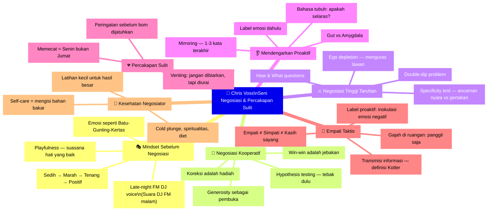

---

## Bagian 1: Mindset Sebelum Memasuki Negosiasi 🧘

### Diagnosis Pertama: Ada Kesepakatan atau Tidak?

Sebelum berpikir tentang *bagaimana* bernegosiasi, Voss selalu bertanya lebih dahulu: **apakah memang ada kesepakatan yang bisa dicapai?**

> *"Tidak ada dosa dalam tidak mendapatkan kesepakatan. Yang berdosa adalah menghabiskan waktu lama untuk tidak mendapatkan kesepakatan, atau menghabiskan waktu lama untuk mendapatkan kesepakatan yang buruk."*

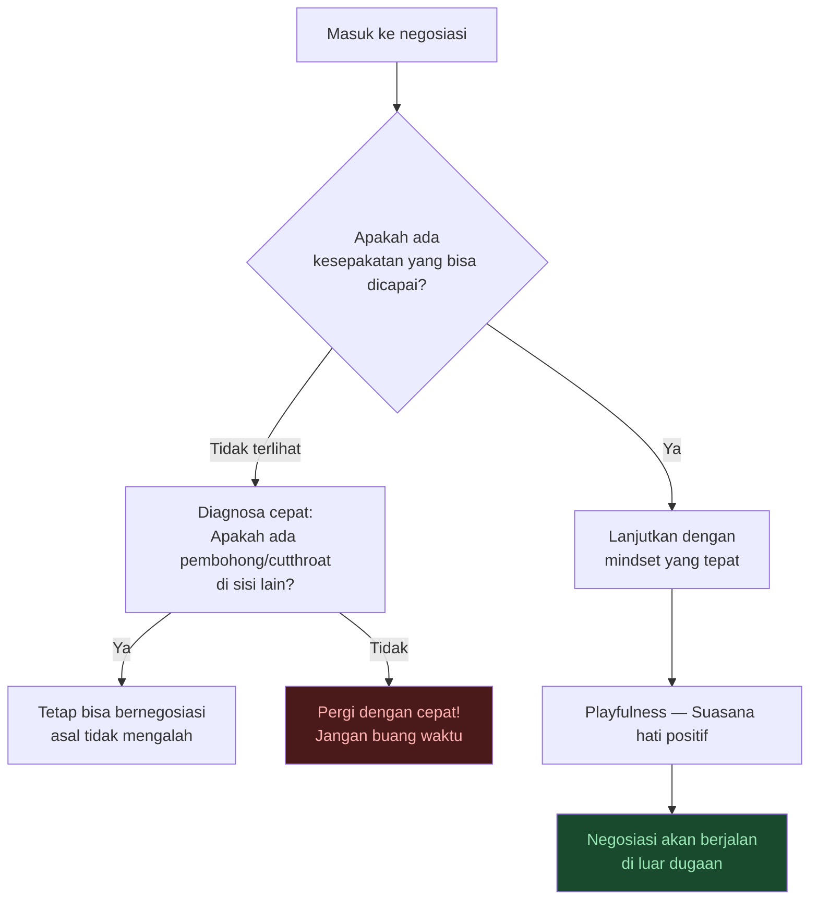

### Playfulness — Senjata Tersembunyi yang Paling Kuat 🎭

Kisah koper hilang bukan kebetulan. Voss menjelaskan bahwa beberapa kemenangan negosiasi terbesar yang pernah ia alami terjadi ketika ia *berada dalam suasana hati yang sangat baik dan playful*.

Ini bukan tentang pura-pura bahagia. Ini tentang:
- **Keaslian emosional** — ketika Anda benar-benar rileks, sinyal yang Anda kirimkan kepada lawan bicara berubah secara fundamental
- **Kreativitas meningkat** — pikiran yang rileks melihat lebih banyak peluang
- **Humor yang organik** — kata-kata yang muncul secara alami ("tongkat ajaib") memiliki dampak yang berbeda dari kata-kata yang direncanakan

<Callout type="tip" title="💡 Kutipan Kunci Voss">
*"Negosiasi yang hebat itu tidak menarik. Ia mengagumkan. Anda tiba di sebuah titik dan bertanya: bagaimana ini bisa terjadi?"*

Exciting = drama, konflik, ketegangan → biasanya hasil buruk.
Astonishing = hasil yang tidak terduga karena Anda memanfaatkan psikologi dengan benar.
</Callout>

### Suara DJ FM Malam — Ada Neurosains di Baliknya 🎵

Voss terkenal dengan apa yang ia sebut *"late-night FM DJ voice"* — suara yang dalam, lambat, dan menenangkan. Ia menggunakannya secara sadar ketika suasana percakapan mulai memanas.

**Mengapa ini berhasil?** Huberman menjelaskan neurosains di baliknya:

Sistem auditori kita memiliki neuron-neuron yang merespons frekuensi suara berbeda. Ketika seseorang berbicara dengan suara berfrekuensi rendah (dalam dan tenang), otak pendengar secara **tidak sadar** mengikuti frekuensi tersebut — sebuah fenomena yang disebut *neural entrainment* (penyelarasan neural):

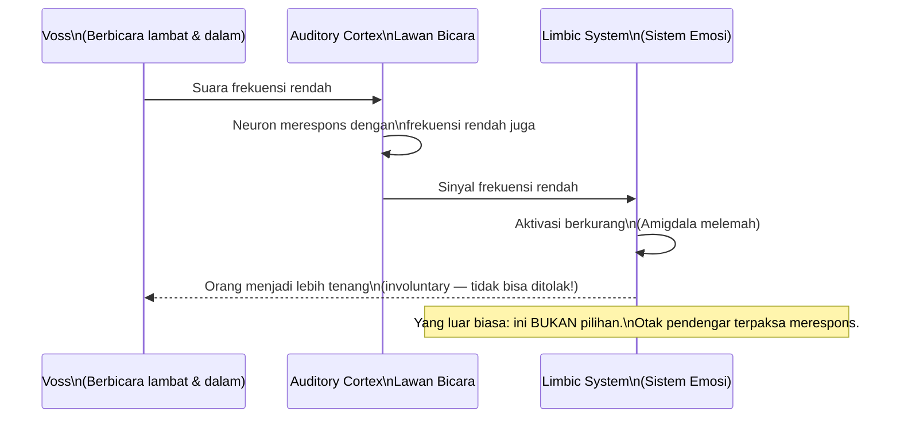

> *"Ini bukan pilihan yang dibuat otak pendengar. Ini reaksi involunter (*involuntary*). Otak mereka terpengaruh bahkan tanpa mereka sadari."*

Dan yang lebih menarik: suara ini **juga menenangkan diri Voss sendiri** yang menggunakannya. Dengan sengaja beralih ke suara tersebut, ia meredam emosinya sendiri — mencegah emosi negatif yang menurutnya "membuat saya menjadi lebih bodoh di saat itu."

### Emosi seperti Batu-Gunting-Kertas 🪨✂️📄

Voss memiliki teori menarik tentang bagaimana emosi bekerja secara berurutan:

> *"Saya tidak yakin Anda bisa langsung dari kesedihan ke kegembiraan. Ada sesuatu tentang kemarahan yang bisa menarik Anda keluar dari kesedihan. Dan jika Anda marah, Anda harus pergi ke tenang dulu."*

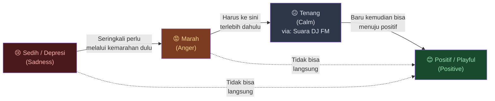

*Implikasi praktis:* Ketika Anda tahu ada negosiasi sulit di depan, dan Anda sedang dalam keadaan marah — jangan paksa diri langsung menjadi positif. Mulailah dengan menenangkan diri. Baru dari sana Anda bisa menuju mindset yang lebih baik.

---

## Bagian 2: Jebakan "Win-Win" dan Negosiasi Kooperatif 🤝

### Hati-Hati dengan Orang yang Bilang "Win-Win"

Ini mungkin salah satu poin yang paling mengejutkan dari percakapan Voss:

> *"Jika seseorang membuka negosiasi dengan saya dan langsung berkata 'saya ingin melakukan deal win-win', itu sangat berkorelasi dengan orang yang sedang mencoba mengambil keuntungan dari saya."*

Ini bukan berarti konsep *win-win* itu buruk. Voss justru setuju bahwa kedua belah pihak seharusnya merasa puas dengan hasilnya. Tapi ada perbedaan penting:

| Apa yang Anda Inginkan | Apa yang Salah dengan Frase "Win-Win" |
|------------------------|----------------------------------------|
| Kedua pihak merasa puas | Orang yang menggunakan frasa ini sering mencoba membuat Anda menurunkan pertahanan |
| Hasil yang genuinely menguntungkan bersama | *"Win-win"* diucapkan di menit pertama → sinyal kuat bahwa mereka akan mengambil lebih banyak dari Anda |
| Kolaborasi sejati | Jika Anda sendiri punya mindset win-win yang kuat → Anda rentan dimanipulasi oleh orang yang hanya pura-pura |

<Callout type="warning" title="⚠️ Sinyal Bahaya Lainnya">
Selain frasa "win-win", ini adalah tanda-tanda merah lainnya:

- *"Ini kesempatan bagus UNTUK ANDA"* → artinya: untuk mereka
- *"Anda akan bertemu dengan banyak orang kaya, dan ada banyak peluang"* → diikuti dengan: *"tapi kami tidak punya anggaran"*
- Permintaan yang sangat mendesak (*urgent*) tanpa penjelasan yang masuk akal
</Callout>

### Hypothesis Testing — Tebak Perspektif Lawan Terlebih Dahulu 🔬

Cara paling efektif untuk membuka negosiasi yang kooperatif menurut Voss bukan dengan bertanya *"apa yang Anda inginkan?"*, melainkan dengan **menebak perspektif lawan terlebih dahulu**:

> *"Saya akan mulai dengan mendeskripsikan — bukan memberitahu, tapi mendeskripsikan — apa yang menurut terbaik saya adalah perspektif Anda."*

**Mengapa ini berhasil?**

Ketika Anda membuat tebakan tentang posisi lawan, dua hal terjadi:
1. **Mereka pasti akan merespons** — entah untuk mengonfirmasi atau mengoreksi
2. **Koreksi adalah tindakan yang memuaskan** — orang senang ketika bisa mengoreksi orang lain, dan mereka akan lebih terbuka serta jujur saat melakukannya

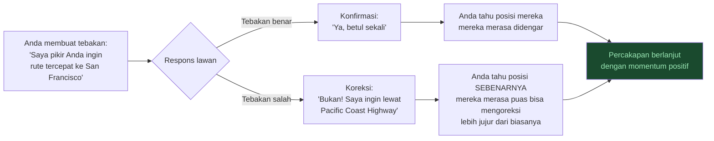

**Contoh nyata Voss:**

> *"Baiklah, tebakan saya adalah kamu ingin mengambil rute paling langsung karena kamu benci membuang waktu."*
>
> Respons: *"Bukan! Saya ingin lewat Pacific Coast Highway. Saya tahu itu lebih lama, tapi pemandangannya luar biasa."*

Voss: *"Oh iya, saya bahkan lupa betapa indahnya perjalanan di sepanjang pantai itu. Ayo kita lewat sana."*

Hasil: **Kolaborasi untuk outcome yang lebih baik dari yang masing-masing bayangkan sebelumnya.**

Huberman menyebut ini sebagai *hypothesis testing* — persis seperti yang dilakukan ilmuwan: ajukan hipotesis, uji, perbaiki.

### Generosity sebagai Pembuka — Bukan Permintaan 🎁

Voss mengamati bahwa orang-orang yang paling mudah ia ajak bernegosiasi adalah mereka yang **memulai dengan memberi, bukan dengan meminta**:

> *"Mereka menemukan sesuatu yang mereka tahu bernilai bagi saya, dan mereka melakukannya. Mereka menawarkannya begitu saja. Tanpa syarat apapun. Mereka tidak mendatangi saya dengan tangan terbuka [meminta]. Mereka datang dengan kemurahhatian."*

Contoh yang diberikan: Joe Polish, pendiri *Genius Network*, melakukan banyak hal untuk Voss sebelum Voss pernah bergabung sebagai anggota. Promosi buku, undangan berbicara, semua tanpa diminta imbalan. Akibatnya:

> *"Tidak banyak yang bisa Joe minta dari saya saat ini yang tidak akan saya jawab dengan 'ya' langsung. Berapa pun biayanya. Karena ia sudah sangat dermawan."*

**Prinsip Robert Cialdini tentang Reciprocity (*timbal balik*)** bekerja di sini, tapi lebih dalam dari sekadar ekonomi transaksional. Ini tentang membangun *goodwill* (*niat baik*) yang autentik.

---

## Bagian 3: Negosiasi Tinggi Taruhan — Penculikan, Terorisme, dan Krisis 🚨

### Kasus Filipina — Pelajaran Pahit tentang Kolaborasi

Voss menceritakan dua kasus di Filipina yang membentuk pandangannya secara fundamental:

**Kasus pertama** (Jeff Schilling): Berhasil. Sandera dibebaskan karena tim berhasil "memperlambat waktu" dan menunggu sesuatu yang baik terjadi dengan sendirinya.

**Kasus kedua** (Burnham-Sobero): Tragedi. Tiga belas bulan kemudian, dua dari tiga sandera tersisa tewas tertembak — dua di antaranya oleh tembakan ramah (*friendly fire*), seorang Amerika dieksekusi lebih awal.

**Pelajaran terpenting:** Bahkan ketika tim negosiasi melakukan semua yang benar, hasil bisa tetap buruk karena **kekacauan di dalam kubu sendiri**:

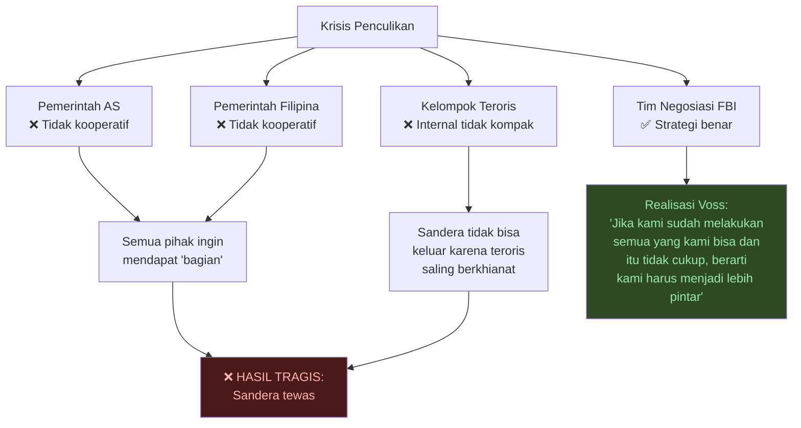

> *"Ini membawa saya ke kolaborasi dengan Harvard, karena reaksi saya adalah: jika kami melakukan semua yang kami tahu dan itu tidak cukup, berarti kami tidak cukup pintar. Kami harus menjadi lebih baik."*

### Specificity Test — Membedakan Ancaman Nyata dari Gertakan 🎯

Ini adalah salah satu *tools* paling praktis dari arsenal Voss: **amati seberapa spesifik ancaman yang diberikan**.

Voss menceritakan kasus penculikan di Filipina lainnya di mana teroris berkata:

> *"Jika kami tidak mendapat uang tebusan, katakan pada ayahnya bahwa ia akan kehilangan sebuah telur."*

(Eufemisme untuk kehilangan seorang anak)

Respons tim: **panik, merasa harus segera membayar.**

Respons Voss: **Tunggu dulu.**

> *"Mereka tidak mengatakan KAPAN itu akan terjadi. Mereka tidak mengatakan BAGAIMANA itu akan terjadi. Mereka tidak mengatakan SIAPA yang akan melakukannya. Tidak ada yang, apa, kapan, dan di mana. Mereka meninggalkan jalan keluar untuk diri mereka sendiri. Mereka hanya mencoba menakut-nakuti Anda."*

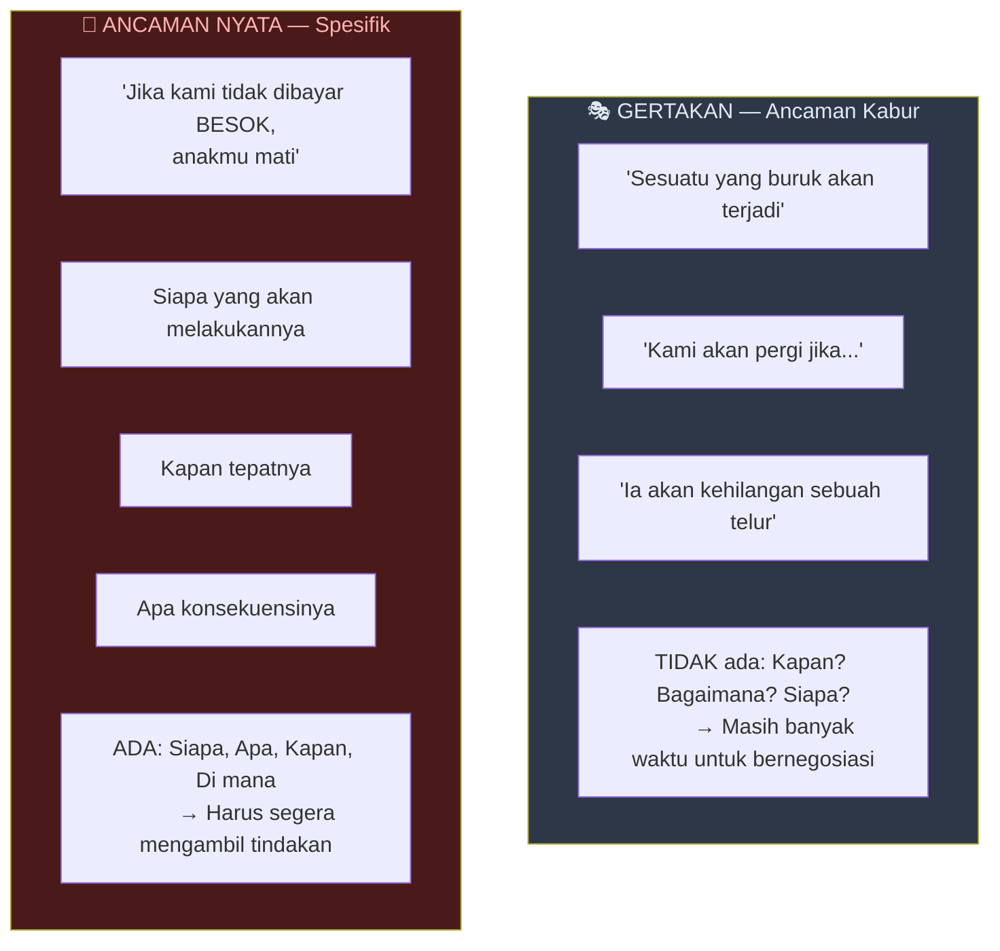

Benar saja: beberapa bulan kemudian dalam kasus yang sama, setelah pembayaran tebusan gagal karena kesalahan teknis, teroris kembali dengan pesan yang berbeda:

> *"Jika kami tidak dibayar BESOK, putramu mati."*

Voss: *"Baik. SEKARANG itu spesifik. Dan orang-orang ini terdengar serius. Kami harus memastikan ini terjadi besok."*

**Implikasi untuk kehidupan sehari-hari:** Ketika seseorang mengancam Anda dalam konteks bisnis atau pribadi — tanyakan pada diri sendiri: **seberapa spesifik ancaman ini?** Semakin kabur, semakin besar kemungkinan itu gertak sambal.

### Double-Dip Problem — Waspadai Permintaan Kedua 💰

*Double-dip* terjadi ketika pihak yang mengancam mengambil apa yang mereka minta, tapi kemudian kembali meminta lebih:

> *"Itu bukan tebusan. Itu hanya uang muka."*

Cara mendeteksinya: tanyakan pertanyaan tentang **implementasi**. Jika mereka tidak bisa (atau tidak mau) menjelaskan apa yang akan terjadi setelah Anda memenuhi tuntutan, itu adalah tanda merah.

**Prinsip utama:** *"Visi mendorong keputusan (vision drives decision)."* Jika seseorang memang berniat memenuhi sisi janjinya, mereka sudah memikirkannya. Mereka bisa menjelaskan seperti apa jadinya.

---

## Bagian 4: How & What Questions — Senjata Rahasia 🔧

### Menguras Lawan dengan Pertanyaan Cerdas

Voss menemukan bahwa pertanyaan **"bagaimana" (*how*)** dan **"apa" (*what*)** adalah alat paling efektif untuk:
1. Memaksa lawan berpikir mendalam (*slow thinking*)
2. Menguras energi lawan yang agresif
3. Mendapatkan informasi tentang siapa sebenarnya lawan Anda

> *"Pertanyaan bagaimana dan apa menghasilkan apa yang disebut Daniel Kahneman 'berpikir lambat'. Berpikir mendalam. Tanyakan pertanyaan how atau what untuk membuat lawan berpikir terlebih dahulu, dan amati bagaimana mereka bereaksi — bukan hanya jawabannya."*

**Contoh:** *"Berapa banyak uang yang menurut Anda pantas Anda dapatkan?"*

Ini bukan tentang jawabannya, tapi tentang **reaksi mereka**:

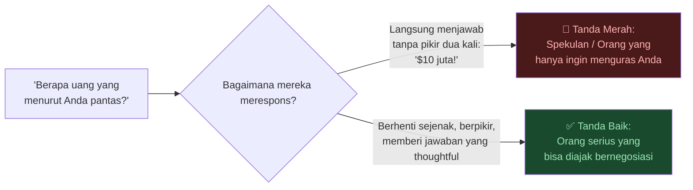

### Passive Aggression sebagai Taktik terhadap Aggressor

Ketika berhadapan dengan lawan yang sangat agresif, Voss tidak membalas dengan agresivitas. Ia melakukan sebaliknya — **pasif-agresif dengan pertanyaan how & what**:

> *"Jika saya memiliki seseorang yang benar-benar agresif di sisi lain, saya akan meneror mereka dengan pertanyaan how dan what, karena bahkan untuk memikirkan jawabannya saja sudah melelahkan mereka."*

Inspirasi datang dari **Gianni Domenico Picco** — negosiator legendaris yang berhasil membebaskan semua sandera Barat dari Beirut di pertengahan 80-an dengan bernegosiasi langsung, tatap muka, dengan Hezbollah:

> *"Salah satu rahasia besar negosiasi adalah belajar bagaimana menguras lawan (*exhaust the other side*)."*

### Ego Depletion — Menguras Semangat Mempertahankan Posisi 🔋

**Ego depletion** adalah konsep psikologi yang relevan: ketika seseorang harus terus-menerus mempertahankan posisinya untuk waktu yang lama, kapasitasnya untuk melakukannya secara bertahap berkurang. Ini tampaknya dimediasi oleh dopamin.

Namun Voss memberikan peringatan penting:

> *"Ego depletion adalah hal nyata, tapi ini cara yang buruk untuk mendapatkan kesepakatan bisnis yang akan bertahan."*

Mengapa? Karena orang yang menyerah karena kelelahan akan **memulihkan energinya** setelah istirahat — dan kemudian *merevisi* komitmennya:

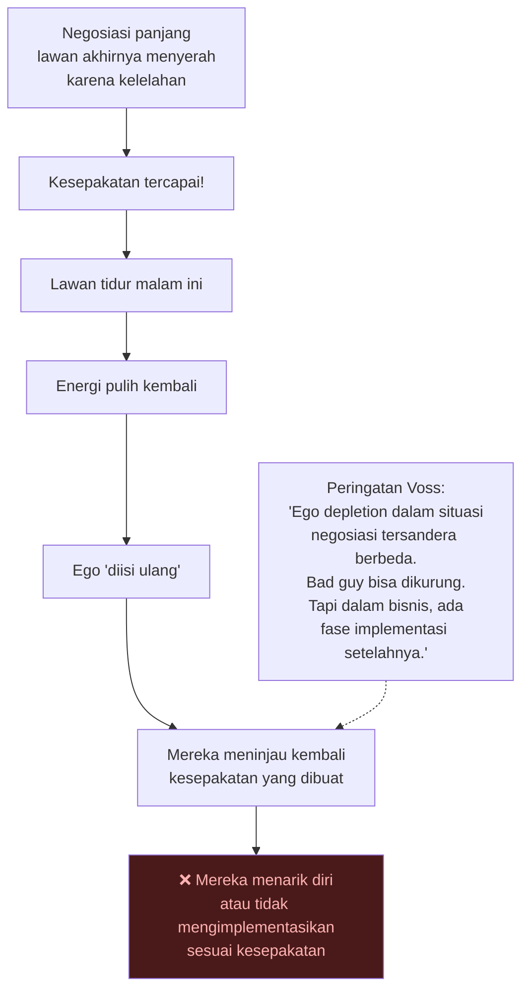

**Perbedaan kunci:** Dalam situasi sandera yang *contained* (terkendali, lokasi diketahui), Anda bisa menguras fisik dan mental penyandera karena setelah menyerah, mereka akan dibelenggu dan tidak bisa merevisi. Tapi dalam bisnis — selalu ada fase implementasi. Anda butuh kesepakatan yang **lahir dari kehendak**, bukan kelelahan.

---

## Bagian 5: Membaca Bahasa Tubuh dengan Benar 👁️

### Bukan Tentang Alis Terangkat

Banyak buku bahasa tubuh mengajari Anda untuk mencari sinyal spesifik: alis terangkat = berbohong, mata ke kiri atas = membuat cerita, dll.

Voss menolak pendekatan ini:

> *"Saya tidak akan melihat — kapan Anda menaikkan alis, atau kapan Anda melihat ke kiri atas. Saya hanya akan mencoba merasakan apakah hal-hal ini selaras (*in alignment*), atau apakah mereka tidak selaras (*out of alignment*)."*

**Yang benar-benar penting:** Apakah kata-kata, nada suara, dan bahasa tubuh **konsisten satu sama lain**?

Ratio kasar yang sering dikutip: 7% kata-kata, 38% cara penyampaian, 55% bahasa tubuh. Voss tidak terlalu peduli dengan angka tepatnya, tapi ia setuju dengan prinsip: **keselarasan adalah yang paling penting**.

### Pelajaran Salah Baca Bahasa Tubuh

Voss menceritakan kesalahan yang ia lakukan sendiri:

> *"Saya mengajukan angka kepada seseorang, dan saya melihatnya seolah melihat ke samping sebelum menerima tawaran saya. Dan saya membuat kesalahan dengan tidak berkata pada saat itu: 'Sepertinya ada sesuatu yang baru saja melintas di pikiran Anda.'"*

Voss salah membaca sinyal itu sebagai "*mereka punya lebih banyak uang*". Belakangan ia tahu: mereka sedang tersangkut pada batas maksimum anggaran mereka.

**Aturan yang benar:**

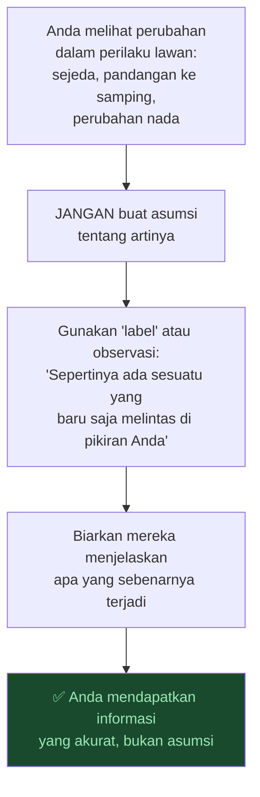

**Ingat:** Di dalam negosiasi tatap muka, Anda mendapatkan lebih banyak informasi daripada yang bisa Anda proses. Itu sebabnya teknik-teknik seperti *mirroring* dan *labeling* berfungsi untuk membantu Anda mendapatkan informasi itu kembali tanpa membuat lawan merasa diinterogasi.

---

## Bagian 6: Negosiasi via Teks dan Online 📱

### Prinsip Catur: Satu Langkah per Teks

> *"Jika Anda bermain catur via teks, apakah Anda akan memasukkan tujuh langkah dalam satu teks? Tidak. Anda hanya akan memasukkan satu langkah. Begitu juga dalam teks atau email: hanya coba menyampaikan satu poin."*

Contoh nyata yang Voss bagikan:

Ia perlu menyampaikan kabar buruk kepada pembuat film Nick Nanton tentang dokumenter yang baru selesai. Ia memilih untuk mengirim dua baris teks di hari Minggu:

> *"Apakah ini waktu yang buruk untuk bicara?*
> *Saya punya sesuatu yang tidak ingin Anda dengar."*

Hasilnya: Nick merespons bahwa ia sedang dalam panggilan Zoom, akan menghubungi dalam setengah jam. Nick sudah dalam mode *problem-solving* bahkan sebelum percakapan dimulai. Seluruh masalah diselesaikan dalam kurang dari 10 menit.

**Bandingkan dengan pendekatan normal:**

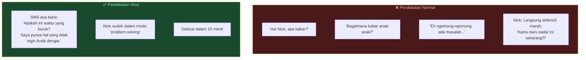

**Tips untuk teks dan email:**
- Satu poin per pesan
- Jangan menjelaskan panjang lebar via teks
- Teks yang terlalu panjang terasa dingin dan impersonal
- Luangkan waktu untuk melembutkan nada (tapi tetap singkat)

---

## Bagian 7: Memutuskan Hubungan — Cara yang Manusiawi 💔

### Kebenaran yang Tidak Nyaman

Ketika Voss ditanya tentang cara terbaik memecat seseorang atau mengakhiri hubungan romantis, ia memberikan jawaban yang mengejutkan:

> *"Saya hampir ingin berkata: tidak ada cara yang manusiawi untuk melakukan itu. Tapi pertama-tama — siapa yang sebenarnya sedang Anda coba selamatkan? Anda sedang mencoba menyelamatkan diri Anda sendiri, bukan orang lain."*

**Tiga aturan Voss untuk mengakhiri hubungan atau memecat seseorang:**

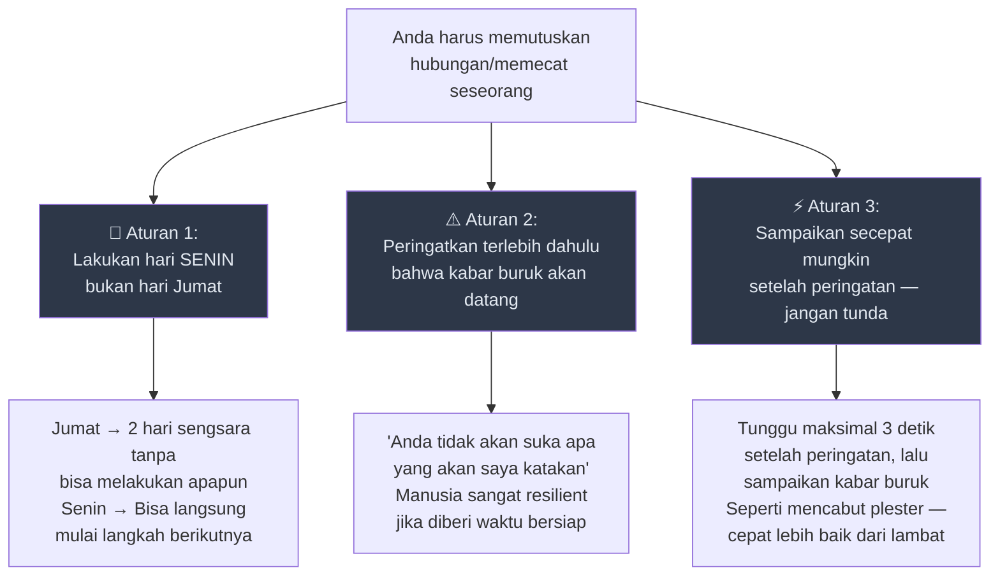

**Inspirasi dari seorang pendeta:**

Ketika Voss ragu tentang cara memecat seseorang dengan baik, ia meminta saran dari Arthur Caliandro — protege Norman Vincent Peale, salah satu manusia terbaik yang pernah ia temui. Jawaban Caliandro:

> *"Tidak ada cara yang lembut untuk memenggal kepala seseorang."*

Dan kalimat itu langsung menyelesaikan kebimbangan Voss. Yang paling manusiawi adalah **menyelesaikannya secepat mungkin** sehingga orang itu bisa mulai bergerak maju.

<Callout type="important" title="🚨 Tentang 'Jangan Tidur dalam Keadaan Marah'">
Voss juga mengomentari nasihat populer "jangan pernah tidur dalam keadaan marah" — ia tidak setuju:

*"Tidur, bangun, dan kemudian revisit masalahnya jika situasinya memungkinkan. Mencoba menyelesaikan sesuatu sampai jam 3 pagi itu berlawanan dengan biologi."*

Dan bahaya dari ego depletion berlaku di sini: jika Anda 'menyelesaikan' argumen dengan pasangan di jam 3 pagi, keduanya sudah kelelahan. Esok paginya, dengan energi penuh, mereka bisa merasa sangat berbeda tentang 'resolusi' semalam.
</Callout>

---

## Bagian 8: Gut vs Amygdala — Mendengarkan yang Benar 🧬

### Voss Percaya pada Intuisi (*Gut*)

Huberman menceritakan pengalamannya selama bertahun-tahun merasa ada sesuatu yang *off* dari seseorang — tidak bisa menjelaskan secara ilmiah — dan akhirnya terbukti lima tahun kemudian bahwa orang itu memang berbohong berkali-kali.

Voss merespons:

> *"Pelajari perbedaan antara gut Anda dan pusat ketakutan Anda (*amygdala*). Keduanya berbeda. Dan dengarkan gut Anda. Gut Anda sangat akurat."*

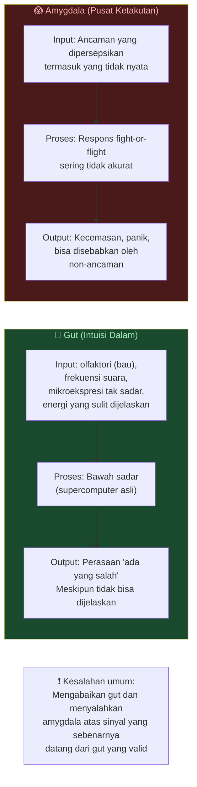

Huberman juga berbagi temuan ilmiah yang mendukung:
- Penelitian tentang **magnetoreception pada manusia** — beberapa manusia bisa mendeteksi medan magnet, terbukti lebih baik dari kemungkinan acak
- Penelitian yang menunjukkan bahwa orang yang mendengarkan cerita yang sama secara terpisah memiliki **pola jarak antara detak jantung yang identik** — otak kita terhubung melalui narasi bahkan di ruangan terpisah

> Dr. Paul Conti (psikiater ternama) kepada Huberman: *"Semua orang berpikir forebrain adalah superkomputer. Bukan. Bawah sadar adalah superkomputer. Di situlah pemrosesan pengetahuan yang sesungguhnya terjadi. Forebrain hanya perangkat implementasi."*

---

## Bagian 9: Menangani Orang yang Suka Curhat (*Venting*) 😤

### Jangan Biarkan Mereka Curhat Tanpa Kendali

Melawan intuisi kebanyakan orang, Voss **tidak** merekomendasikan hanya membiarkan orang curhat:

> *"Saya sangat ragu-ragu membiarkan orang curhat karena itu sering kali menjadi spiral yang tidak terkendali. Kenapa seseorang curhat? Mereka tidak merasa didengar. Mereka diabaikan. Mereka merasa percuma berbicara. Mereka frustrasi."*

**Pendekatan Voss:**

Alih-alih membiarkan curhat mengalir, segera **identifikasi dan beri nama pada emosi yang mendorong curhat tersebut**:

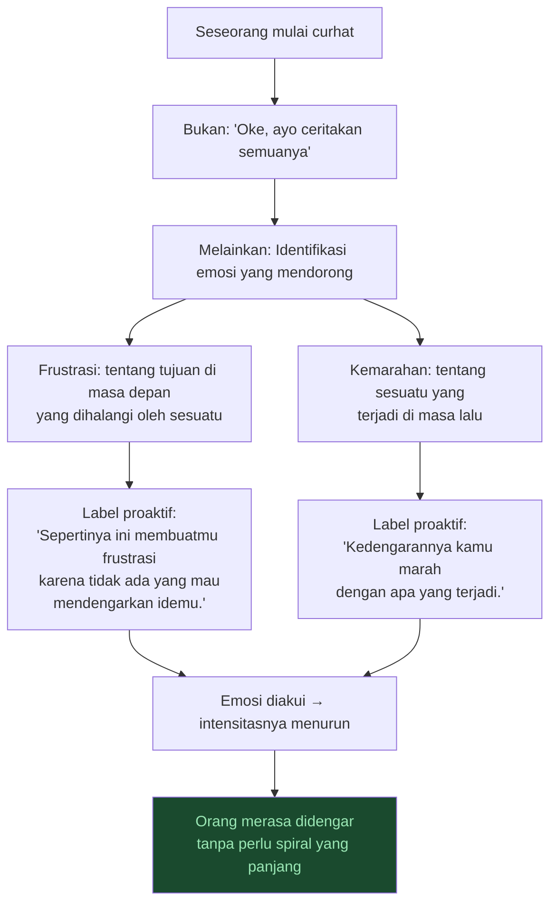

**Mengapa penting membedakan frustrasi dari kemarahan?**

| | Frustrasi | Kemarahan |
|---|---|---|
| Fokus waktu | Masa depan | Masa lalu |
| Sumber | Tujuan yang terhalang | Sesuatu yang sudah terjadi |
| Pendekatan | Bantu mereka melihat jalan ke depan | Bantu mereka memproses apa yang sudah terjadi |

<Callout type="warning" title="⚠️ Emosi Negatif = Racun">
Voss percaya bahwa emosi negatif yang dibiarkan terlalu lama benar-benar **memasukkan racun ke dalam sistem** seseorang. Tujuan kita bukan hanya menyelesaikan konflik — tapi mencegah orang tersebut menyakiti dirinya sendiri dengan spiral negatif yang tidak perlu.
</Callout>

---

## Bagian 10: Empati Taktis — Definisi yang Mengubah Segalanya 🤲

### Empati Bukan Simpati, Bukan Kasih Sayang

Ini adalah salah satu kontribusi intelektual terpenting Voss. Ia mengutip dua sumber:

**Steven Kotler:**
> *"Empati adalah tentang transmisi informasi. Kasih sayang adalah reaksi terhadap transmisi itu."*

**Harvard (Bob Mnookin, "Beyond Winnings"):**
> *"Empati bukan tentang menyukai, menyetujui, atau bahkan tidak menyetujui pihak lain. Ini hanya menunjukkan bahwa Anda memahami perspektif mereka."*

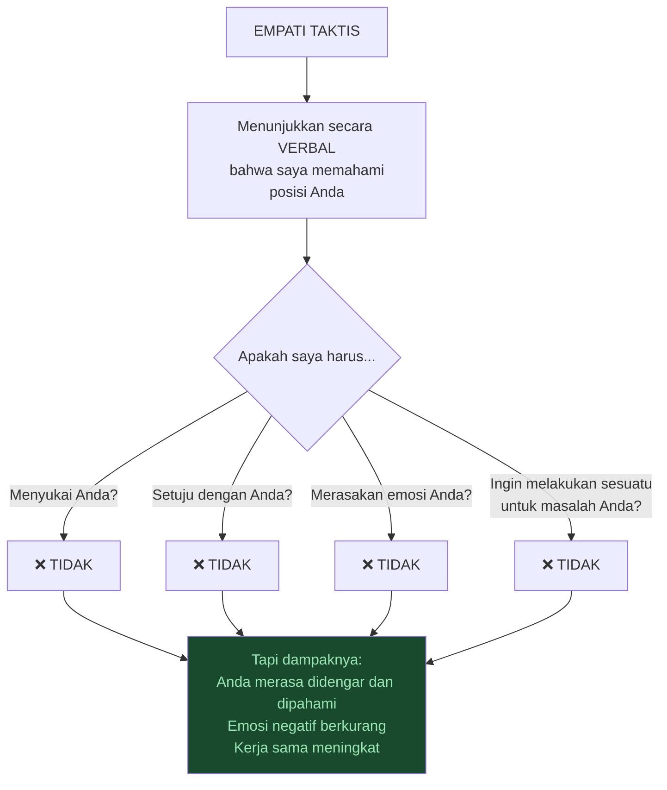

**Contoh yang Voss berikan:**

Ketika bekerja pada kasus terorisme, ia perlu mendapatkan kesaksian dari Muslim Arab di pengadilan sipil melawan ulama Muslim yang juga kriminal. Ia duduk bersama mereka dan langsung berkata:

> *"Anda percaya bahwa ada serangkaian pemerintah Amerika selama 200 tahun terakhir yang bersifat anti-Islam."*

Mereka menatapnya dan berkata: *"Ya."*

> *"Saya tidak pernah mengatakan itu benar. Saya tidak pernah mengatakan saya setuju. Saya tidak pernah mengatakan saya tidak setuju. Hanya dengan mengartikulasikan perspektif mereka, mereka sangat terkejut. Dan mereka sering bertanya: 'Apakah Anda Muslim?'"*

### Panggil Gajah di Ruangan — Jangan Abaikan 🐘

Prinsip proaktif paling kuat dalam empati taktis: **panggil emosi negatif sebelum ia tumbuh lebih besar**.

> *"Jangan coba memperkuat hal positif terlebih dahulu. Langkah yang lebih cerdas adalah terlebih dahulu menonaktifkan hal negatif dengan menyebutnya."*

**Contoh:** Jika Anda tahu permintaan Anda akan terkesan tamak (*greedy*), jangan berkata:

> ❌ *"Saya tidak ingin Anda pikir saya tamak..."*

Melainkan:

> ✅ *"Ini mungkin akan terkesan tamak..."*

Perbedaannya halus tapi krusial. Negatif diakui → kekuatannya hilang.

**Kisah konferensi:** Voss pernah harus menjawab pertanyaan yang sangat buruk dari peserta di sebuah kuliah. Ia tidak bisa menemukan satu pun aspek positif dari pertanyaan itu. Ia berkata:

> *"Ini akan terdengar keras..."*

Lalu menjawab dengan jujur. Peserta itu berkata sesudahnya: *"Itu tidak sekeras yang saya kira."*

Jika Voss tidak memberi peringatan terlebih dahulu? Jawaban itu pasti akan mempermalukan peserta tersebut — dan peserta itu akan membenci Voss selamanya.

**Ini yang disebut inokulasi emosional:** Memanggil emosi negatif sebelum ia tiba tidak *menanam* emosi itu, malah *mencegahnya* menempel.

---

## Bagian 11: Mirroring — Alat Paling Sederhana, Paling Kuat 🪞

### Apa Itu Mirroring?

*Mirroring* adalah salah satu teknik paling sederhana sekaligus paling efektif dalam negosiasi:

> **Ulangi 1-3 kata terakhir yang diucapkan lawan bicara Anda, dengan nada yang sedikit menanyakan ke atas (*upward inflection*).**

Penting untuk dicatat: ini **bukan** mirroring bahasa tubuh (meniru gerakan fisik seseorang). Ini hanya pengulangan verbal beberapa kata.

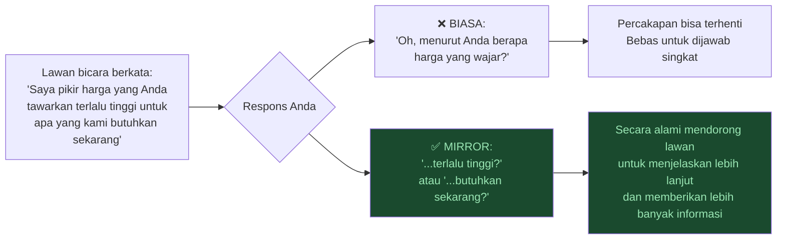

**Mengapa ini berhasil?**

Huberman memberikan penjelasan neurosains yang menarik: otak kita secara aktif **menekan** pendengaran kita terhadap suara kita sendiri. Kita tidak benar-benar mendengar diri kita sendiri saat berbicara — sistem auditori memfilternya.

Ketika seseorang mengulangi kata-kata Anda kembali kepada Anda, **Anda bisa benar-benar mendengar apa yang baru saja Anda katakan** — dan sering kali menyadari bahwa Anda perlu menjelaskan lebih lanjut atau bahwa apa yang Anda katakan tidak sepenuhnya akurat.

> *"Terkadang seseorang hanya butuh papan suara (*sounding board*) agar bisa mendengar dirinya sendiri diulang kembali — dan kemudian berkata: 'Tunggu, apakah saya baru saja berkata itu?'"*

**Kapan menggunakan mirroring:**
- Ketika Anda tidak mengerti apa yang dimaksud
- Ketika Anda ingin mereka menjelaskan lebih lanjut
- Ketika pikiran mereka tampak terputus di tengah jalan
- Ketika Anda ingin mereka mendengar kata-kata mereka sendiri

---

## Bagian 12: Proaktif Mendengarkan vs Aktif Mendengarkan 👂

### Masalah dengan "Active Listening"

*Active listening* (*mendengarkan aktif*) adalah konsep yang sudah sangat sering digunakan sehingga kehilangan maknanya — dan banyak yang mengajarkannya dengan cara yang keliru.

Voss lebih suka istilah **proactive listening** (*mendengarkan proaktif*) atau *interactive listening*:

> *"Sebagai negosiator sandera, otak 'survival' kita sekitar 75% negatif. Reaksi Anda akan bersifat negatif. Jadi jadilah proaktif — label emosi negatif yang kemungkinan besar ada bahkan sebelum ia muncul."*

**Proses Proactive Listening:**

```mermaid
flowchart TD
    A["Masuk ke percakapan"] --> B["Kenali: Manusia 75%\ndigerakkan oleh emosi negatif"]
    B --> C["Identifikasi emosi negatif\nyang MUNGKIN hadir berdasarkan konteks"]
    C --> D["Label secara proaktif SEBELUM\nEmosi itu muncul atau semakin besar"]
    D --> E["'Ini mungkin akan terdengar...'"]
    D --> F["'Saya tahu ini kemungkinan membuat frustrasi...'"]
    D --> G["'Kedengarannya seperti Anda sudah\nlama berjuang dengan ini...'"]
    E --> H["Emosi negatif diakui dan\ndikurangi sebelum berkembang"]
    F --> H
    G --> H
    H --> I["Percakapan bisa berlanjut\ndengan lebih produktif"]

    style I fill:#1a4a2e,color:#9ae6b4
```

**Contoh nyata neurosains:**

Penelitian yang Voss pelajari dari buku *"The Upward Spiral"*: ketika orang mengalami emosi negatif (ditunjukkan gambar yang memicu respons negatif) dan kemudian diminta untuk **menyebut nama emosi yang mereka rasakan**, emosi tersebut menurun intensitasnya. Hampir selalu.

Labeling — menyebut nama emosi — secara konsisten mengurangi kekuatan emosi tersebut.

---

## Bagian 13: Humanisasi — Kunci Bertahan dalam Situasi Berbahaya 👤

### "Saya Chris" — Dua Kata yang Bisa Menyelamatkan Nyawa

Voss memberikan saran yang tampak sederhana tapi memiliki implikasi mendalam — untuk siapapun yang berada dalam situasi berbahaya sebagai sandera:

> *"Apapun yang bisa Anda lakukan untuk memanusiakan diri Anda sendiri sambil tetap mematuhi perintah meningkatkan peluang bertahan hidup Anda."*

**Cara paling sederhana:** Sebutkan nama Anda.

> *"Saya akan melakukan apapun yang Anda katakan. Nama saya Chris."*

Dalam otak kita, nama mengubah seseorang dari *objek* menjadi *manusia* — dari sesuatu yang bisa diperlakukan tanpa rasa bersalah menjadi seseorang yang memiliki identitas dan hubungan.

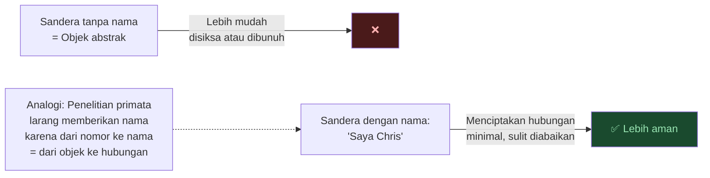

Paralel dengan penelitian: dalam eksperimen hewan primata, peneliti sangat dilarang memberikan nama pada subjek penelitian. Alasannya: **nama mengubah hubungan**, dari objek penelitian menjadi sesuatu yang lebih seperti makhluk yang kita punya tanggung jawab moral.

---

## Bagian 14: Praktik Kecil untuk Hasil Besar 🏋️

### Latihan Negosiasi di Kehidupan Sehari-hari

Voss tidak menunggu negosiasi besar untuk mempertajam keterampilannya. Ia berlatih setiap hari dalam interaksi kecil:

- Supir Lyft / Grab
- Petugas TSA di bandara
- Kasir di toko
- Barista Starbucks
- Staf hotel

> *"Satu-satunya cara saya bisa terbaik dalam negosiasi adalah dengan terus menjaga otot-otot negosiasi saya tetap lentur dengan berinteraksi dengan orang-orang sepanjang hari dan idealnya meninggalkan mereka lebih baik dari saat saya menemukan mereka."*

**Pertanyaan ajaib yang Voss gunakan:**

Bukan: *"Bagaimana hari Anda?"* (terlalu generik)

Melainkan: **"Apa yang Anda sukai dari pekerjaan Anda?"**

Perbedaan antara *like* dan *love*:
- *"Apa yang Anda SUKAI (*like*)..."* → jawaban biasa
- *"Apa yang Anda CINTAI (*love*)..."* → langsung memicu *state change* (perubahan kondisi mental)

Seseorang yang sedang dalam suasana buruk, ketika ditanya *"apa yang Anda cintai dari..."*, akan terdorong untuk fokus pada hal-hal positif secara instingtif — dan memberikan jawaban yang jauh lebih jujur dan mendalam tentang siapa mereka sebenarnya.

**Contoh mengungkap karakter:** Voss bertanya kepada seorang CEO perusahaan air bersih:

> *"Apa yang Anda cintai dari pekerjaan Anda?"*

Jawaban CEO langsung tanpa berpikir:
> *"Saya suka memimpin tim. Saya suka memberikan return yang baik kepada pemegang saham... oh ya, dan kami mengantarkan air bersih."*

Voss: *"Orang ini bisa saja menjual tisu toilet. Ia tidak peduli dengan misi perusahaan sama sekali. Ia adalah CEO korporat yang luar biasa, tapi bukan CEO kewirausahaan yang luar biasa. Nilai-nilai inti kami tidak sejalan."*

Semua itu terungkap dari satu pertanyaan *"apa yang Anda cintai"*.

---

## Bagian 15: Kesehatan Fisik dan Mental Negosiator 💪

### Self-Care Bukan Narsisme

Voss menegaskan bahwa hampir semua orang yang sangat baik dalam pekerjaannya merawat diri dengan baik. Bukan karena egois — tapi karena:

> *"Self-care adalah tentang mengisi ulang tangki bahan bakar sehingga Anda bisa lebih siap untuk semua orang lain. Lebih banyak energi, lebih banyak kapasitas, lebih banyak ketahanan untuk percakapan sulit."*

**Rutinitas Voss:**

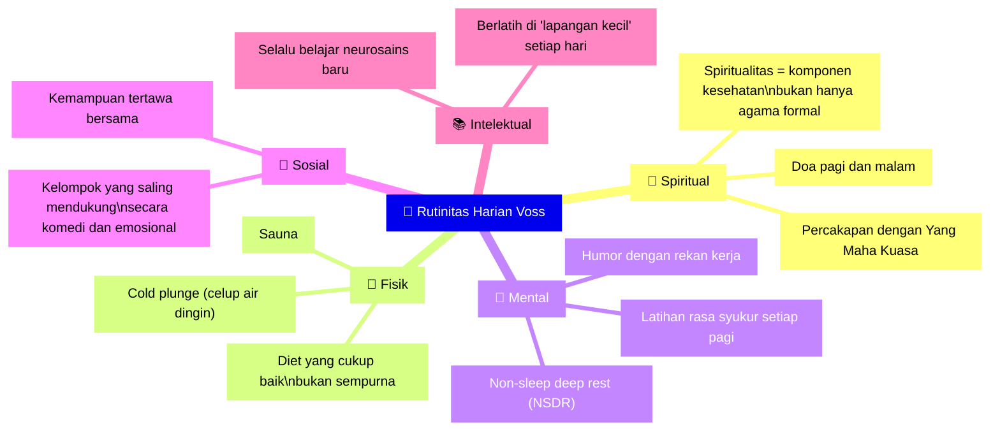

**Tentang cold plunge:**
> *"Orang lupa bahwa bukan bagaimana perasaan Anda KETIKA di dalamnya yang penting. Anda bisa bangga dengan cara Anda menavigasi bagian itu. Tapi poinnya adalah bagaimana perasaan Anda SETELAHNYA."*

---

## Bagian 16: Tentang Keluarga Sandera dan Luka Tersembunyi 👨‍👩‍👧

### Keluarga sebagai Alat — Tapi Berhati-hatilah

Apakah keluarga sandera bisa digunakan sebagai alat negosiasi? Ya — tapi dengan sangat hati-hati.

Voss menceritakan kasus Dwight Watson — seorang pria yang memarkir traktornya di tengah Washington D.C. dan mengklaim memiliki empat bom (palsu). Keluarganya datang ke lokasi kejadian. Saudara-saudaranya berkata kepada negosiator:

> *"Saudara kami hanya sedang sakit hati. Banyak hal buruk yang terjadi pada seluruh keluarga kami, dan ia hanya sakit hati. Jangan bunuh dia hanya karena itu."*

Respons Voss: **rekam ucapan itu persis seperti itu, dan perdengarkan kepada Watson.**

Mengapa tidak biarkan mereka berbicara langsung? Karena:

> *"Anggota keluarga telah saling menyakiti selama bertahun-tahun dengan cara yang bahkan tidak mereka sadari. Begitu mereka berbicara langsung, luka lama kemungkinan besar akan muncul kembali — dan itu bisa memperburuk situasi."*

**Pelajaran mendalam tentang sistem keluarga:** Tidak ada satu pun jiwa manusia yang bisa dipahami sepenuhnya tanpa melihat sistem keluarga tempat ia tumbuh. Hampir selalu ada luka yang tersembunyi bahkan dari orang-orang yang paling dekat sekalipun.

---

## Ringkasan: Semua Tool dalam Satu Pandangan 📋

```mermaid
graph TD
    A["🎯 TUJUAN UTAMA\nNegosiasi yang Berhasil"] --> B & C & D & E

    B["🧘 Sebelum Negosiasi"]
    B --> B1["Suara FM DJ malam\n→ Menenangkan diri & lawan"]
    B --> B2["Playfulness\n→ Kreativitas & peluang"]
    B --> B3["Diagnosis cepat:\nAda kesepakatan?\nAda pembohong?"]
    
    C["💬 Selama Negosiasi"]
    C --> C1["Hypothesis testing\n→ Tebak perspektif lawan"]
    C --> C2["Mirroring (1-3 kata)\n→ Dorong elaborasi"]
    C --> C3["Label emosi\n→ Kurangi intensitas negatif"]
    C --> C4["How & What questions\n→ Berpikir mendalam / kuras lawan"]
    C --> C5["Label proaktif\n→ Inokulasi emosi negatif"]
    
    D["🚨 Situasi Berbahaya"]
    D --> D1["Specificity test\n→ Ancaman nyata vs gertakan"]
    D --> D2["Vision drives decision\n→ Tanyakan implementasinya"]
    D --> D3["Humanisasi\n→ Sebut nama Anda"]
    
    E["💔 Percakapan Sulit"]
    E --> E1["Senin bukan Jumat\n(memecat/memutuskan)"]
    E --> E2["Peringatan terlebih dahulu\n→ Resiliensi manusia luar biasa"]
    E --> E3["Cabut seperti plester\n→ Cepat lebih baik"]
    
    style A fill:#2d4a22,color:#9ae6b4
```

---

## Glosarium Istilah Kunci 📚

<Callout type="abstract" title="🗂️ Istilah-istilah Penting dari Chris Voss">

| Istilah (Inggris) | Bahasa Indonesia | Penjelasan |
|---|---|---|
| **Late-night FM DJ voice** | Suara DJ FM Malam | Suara dalam, lambat, menenangkan — menurunkan ketegangan secara neurologis |
| **Hypothesis testing** | Pengujian hipotesis | Menebak perspektif lawan terlebih dahulu, bukan bertanya langsung |
| **Tactical empathy** | Empati taktis | Mendemonstrasikan secara verbal bahwa Anda memahami posisi lawan — tanpa harus menyetujuinya |
| **Mirroring** | Pencerminan | Mengulangi 1-3 kata terakhir lawan bicara untuk mendorong elaborasi |
| **Labeling** | Pelabelan | Menyebut nama emosi yang dirasakan lawan: "Sepertinya ini membuatmu frustrasi..." |
| **Proactive labeling** | Pelabelan proaktif | Menyebut emosi negatif sebelum ia muncul untuk mengganjalnya (*inokulasi emosional*) |
| **Double-dip** | Penggandaan tuntutan | Ketika pihak yang mengancam mengambil apa yang diminta, lalu kembali meminta lebih |
| **Specificity test** | Uji kekhususan | Ancaman yang spesifik (siapa, apa, kapan) lebih serius dari yang kabur |
| **Ego depletion** | Pengurasan ego | Kapasitas mempertahankan posisi menurun seiring waktu — tapi solusi yang lahir dari ini tidak tahan lama |
| **Vision drives decision** | Visi menggerakkan keputusan | Tanyakan seperti apa implementasinya — jika tidak bisa menjawab, mereka tidak serius |
| **Gut vs amygdala** | Intuisi vs pusat ketakutan | Gut akurat dan berbasis data bawah sadar; amygdala sering bereaksi berlebihan |
| **Contained vs uncontained** | Terkendali vs tidak terkendali | Penyanderaan terkendali = lokasi diketahui; tidak terkendali = penculikan, lokasi tidak diketahui |
| **Cutthroat** | Pemangsa | Negosiator yang bertujuan mengambil semua tanpa memberi apapun |
| **State change** | Perubahan kondisi mental | Perubahan mendadak dalam suasana emosional seseorang |
| **Win-win** | Menang-menang | Konsepnya bagus, tapi waspadai orang yang mengucapkannya di 5 menit pertama negosiasi |
</Callout>

---

## Penutup: Mengapa Ilmu Negosiasi adalah Ilmu Hidup 🌟

Percakapan Chris Voss dan Andrew Huberman berakhir dengan sebuah visi sederhana tapi kuat:

> *"Bayangkan betapa luar biasanya jika anak-anak belajar sejak dini untuk berbicara dari perspektif 'sounds like...' (sepertinya...). Karena itu secara alami mengorientasikan mereka untuk mendengarkan."*

Negosiasi bukan hanya tentang mendapatkan apa yang Anda inginkan. Ia tentang:

- **Benar-benar memahami** apa yang diinginkan orang lain
- **Membuat orang merasa didengar** (bukan hanya disetujui)
- **Mengakui emosi** — milik Anda dan milik orang lain — sebagai data, bukan gangguan
- **Berbicara dengan jujur** tapi dengan cara yang "mendarat dengan lembut"

Voss menyebutnya sebagai perbedaan antara *blunt* (terus terang tanpa pikir) dan *straight shooter* (jujur tapi tetap mempertimbangkan bagaimana cara itu mendarat):

> *"Seorang straight shooter memberitahu Anda kebenaran. Mereka hanya menyampaikannya dengan cara yang mendarat dengan lembut."*

---

## Referensi dan Sumber Lanjut 🔖

<Callout type="cite" title="📖 Bacaan & Tontonan yang Disebut">

**Buku:**
- **Never Split the Difference** — Chris Voss & Tahl Raz *(wajib baca)*
- **Beyond Winnings** — Bob Mnookin (Harvard, tentang empati dan asertivitas)
- **Man Without a Gun** — Gianni Domenico Picco (negosiasi dengan Hezbollah)
- **Thinking Fast and Slow** — Daniel Kahneman (slow vs fast thinking)
- **The Upward Spiral** — Alex Korb (neurosains pelabelan emosi)

**Tokoh yang Disebut:**
- **Chris Voss** — Mantan negosiator sandera FBI, pendiri Black Swan Group
- **Andrew Huberman** — Neurosaintis Stanford, host Huberman Lab Podcast
- **Steven Kotler** — Penulis, *"Empathy is about transmission of information"*
- **Gianni Domenico Picco** — Negosiator legendaris yang membebaskan sandera Barat dari Beirut
- **Daniel Kahneman** — Psikolog behavioral economics, *Thinking Fast and Slow*
- **David Veness** — Negosiator Inggris legendaris (kasus Prince's Gate Siege, London)
- **Arthur Caliandro** — Pendeta, protege Norman Vincent Peale

**Media:**
- Podcast Huberman Lab: [How to Succeed at Hard Conversations | Chris Voss](https://www.youtube.com/watch?v=q8CHXefn7B4)
- Dokumenter: *Tactical Empathy* (sutradara Nick Nanton, 22-23 Emmy awards)
- Buku real estate: *Negotiating Real Estate* (Chris Voss & Steve Scholl)
</Callout>

---

*Negosiasi terbaik bukan yang paling dramatis. Yang paling mengagumkan. Yang meninggalkan semua pihak — bahkan yang "kalah" — merasa dihormati dan didengar. Itulah seni sesungguhnya dari semua percakapan yang sulit.*
