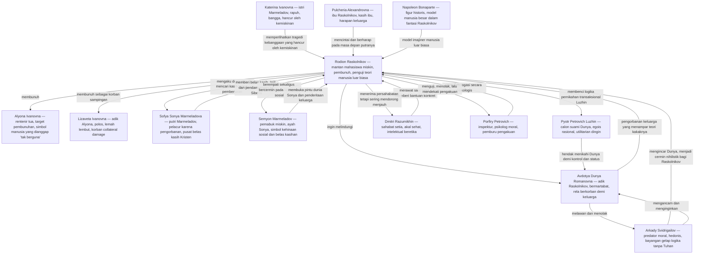
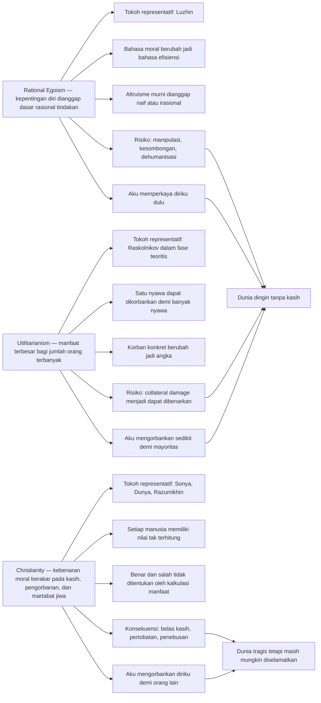
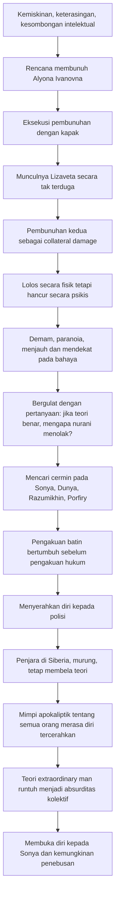
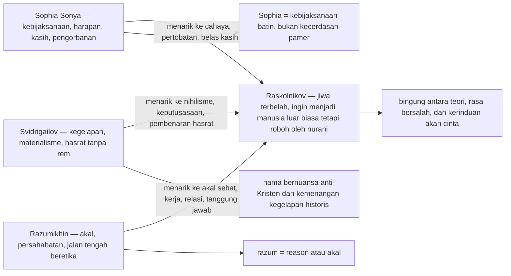
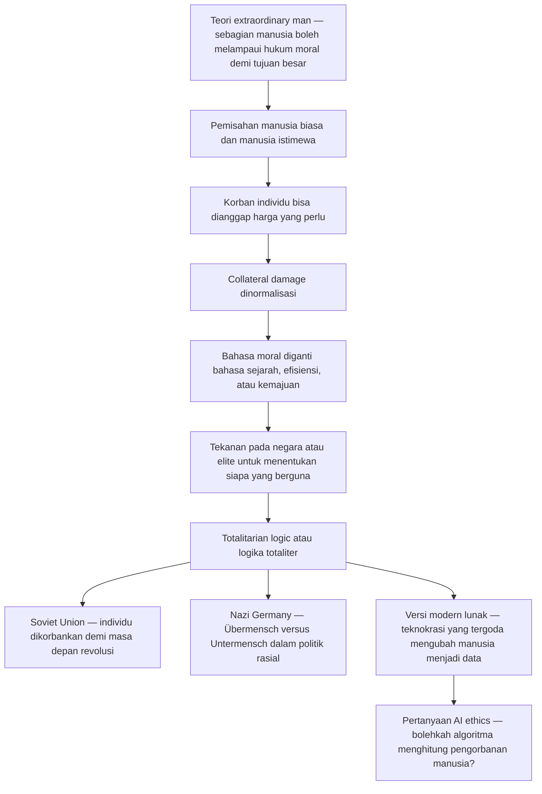

## Pengantar — Novel Kriminal yang Sebenarnya Sedang Mengadili Sebuah Peradaban 🔥

*Crime and Punishment* (*Prestuplenie i Nakazanie* = *Kejahatan dan Hukuman* / *Преступление и наказание* = judul Rusia aslinya) adalah salah satu karya paling intens, paling menyesakkan, sekaligus paling cemerlang yang pernah ditulis Fyodor Mikhailovich Dostoevsky 😊. Banyak novel hebat terasa luas; novel ini terasa padat. Banyak novel besar memberi kita dunia; novel ini memberi kita ruang interogasi batin. Dengan panjang sekitar 460 halaman, ia bekerja seperti saus *michelin-rated* (kelas sangat tinggi, terkonsentrasi, kaya rasa) — kental, pekat, dan hampir tidak ada halaman yang terasa mubazir. Setiap percakapan, demam, kebetulan, mimpi, tatapan, dan pengakuan seperti sedang menambah tekanan pada tungku batin pembacanya.

Yang membuat novel ini begitu bertahan lintas zaman bukan semata-mata plot pembunuhan atau permainan detektifnya. Bahkan, bila seseorang membacanya hanya sebagai kisah kriminal, ia justru akan kehilangan pusat gravitasinya. *Crime and Punishment* bukan terutama tentang “siapa membunuh siapa”, melainkan tentang apa yang terjadi ketika seorang intelektual muda mencoba menguji sebuah teori moral dengan darah manusia 😶. Ia adalah eksperimen filosofis dalam bentuk novel. Ia adalah laboratorium tempat ide-ide modern diuji sampai ke titik ekstrem: egoisme rasional (*rational egoism* = pandangan bahwa tindakan rasional selalu berorientasi pada kepentingan diri), utilitarianisme (*utilitarianism* = etika yang menilai tindakan dari manfaat terbesar bagi jumlah orang terbanyak), materialisme (*materialism* = pandangan bahwa realitas terutama bersifat materi), hingga klaim bahwa “manusia besar” boleh melangkahi moral biasa demi tujuan sejarah.

Novel ini terbit pada 1866, dalam konteks St. Petersburg abad ke-19 — kota yang pada diri Dostoevsky selalu terasa seperti campuran antara ibu kota kekaisaran, kubangan kemiskinan, teater ideologi, dan mesin psikologis 😵‍💫. Di jalan-jalannya, kita melihat mahasiswa miskin, pejabat kecil, pemabuk, pelacur, rentenir, polisi, oportunis, dan orang-orang yang hidup di ambang kehancuran. Namun Dostoevsky tidak sedang melakukan realisme sosial biasa. Ia menaruh semua itu dalam ketel tekanan metafisik (*metaphysical* = berkaitan dengan hakikat terdalam realitas, bukan hanya gejala lahiriah), lalu bertanya: **apa yang tersisa dari manusia ketika ia melepaskan standar moral mutlak dan menggantinya dengan kalkulasi rasional?**

<Callout type="important" title="Tesis Besar Novel Ini">
*Crime and Punishment* adalah pengadilan sastra terhadap ide bahwa manusia bisa menentukan sendiri siapa yang boleh hidup, siapa yang boleh mati, dan batas moral mana yang boleh dilampaui demi masa depan yang dianggap lebih baik 😮.
</Callout>

## Konteks Historis — Mengapa Dostoevsky Menulis Novel Seperti Ini? 🕯️

Dostoevsky menulis pada masa ketika Rusia dan Eropa sedang demam ide. Kaum intelektual muda terpikat oleh saintisme (*scientism* = keyakinan bahwa metode sains adalah satu-satunya jalan sah menuju kebenaran), sosialisme awal, utilitarianisme Inggris, ateisme radikal, dan berbagai bentuk rasionalisme politik. Banyak orang sungguh percaya bahwa masyarakat bisa “direkayasa” menjadi lebih baik bila manusia berhenti mendengarkan tradisi, agama, atau hati nurani lama, lalu menggantinya dengan sistem rasional yang efisien.

Dostoevsky memahami daya tarik gagasan-gagasan itu. Ia tidak bodoh, tidak anti-intelektual, dan tidak anti-argumen. Justru sebaliknya: ia tahu daya pikat teori yang rapi 😌. Ia tahu mengapa pemuda miskin dan terluka seperti Rodion Raskolnikov bisa terpikat oleh ide bahwa sebagian manusia mempunyai lisensi moral untuk menembus hukum demi kebaikan lebih besar. Maka yang ia lakukan bukan mengolok-olok teori itu dari jauh. Ia memberinya argumen terbaik, perumus terbaik, dan kondisi psikologis terbaik — lalu menunjukkan kehancuran yang muncul ketika teori itu diterapkan pada kehidupan nyata.

Karena itu, novel ini harus dibaca sebagai sesuatu yang lebih dari fiksi realistis. Ia adalah perdebatan filsafat yang dipersonifikasikan. Tokoh-tokohnya bukan alegori datar; mereka hidup sebagai manusia sungguhan, tetapi masing-masing juga membawa nada metafisik tertentu. Sonya membawa kebijaksanaan dan pengorbanan. Luzhin membawa egoisme yang dibungkus akal sehat ekonomi. Svidrigailov membawa materialisme tanpa rem moral. Razumikhin membawa akal sehat yang tidak terputus dari belas kasih. Porfiry membawa kecerdasan psikologis yang menembus logika defensif. Raskolnikov sendiri adalah medan perang tempat semua itu saling beradu 💥.

## Ringkasan Plot — Dari Kapak, Demam, ke Pengakuan 🪓

Pusat novel ini adalah **Rodion Romanovich Raskolnikov**, mantan mahasiswa hukum di St. Petersburg yang terpaksa putus kuliah karena kemiskinan. Ia hidup di kamar sewaan yang begitu sempit, rendah, dan pengap sehingga berkali-kali digambarkan seperti peti mati (*coffin* = peti jenazah) 😵. Detail ini penting. Dostoevsky tidak sekadar memberi dekorasi ruang; ia sedang menaruh tokohnya di sebuah simbol. Sebelum melakukan pembunuhan pun, Raskolnikov sudah hidup seperti dikubur dalam pikirannya sendiri.

Raskolnikov mulai merumuskan sebuah rencana: membunuh seorang rentenir tua bernama **Alyona Ivanovna**, seorang *pawnbroker* (rentenir/lintah darat yang memberi pinjaman kecil dengan jaminan barang) yang ia pandang sebagai parasit sosial. Dalam logika Raskolnikov, perempuan tua ini bukan hanya menjijikkan secara pribadi, tetapi juga “tidak berguna” secara moral. Ia memeras orang miskin, menumpuk uang, dan tampak tidak memberikan kebaikan apa pun kepada dunia. Maka muncul pertanyaan mengerikan: bila satu nyawa busuk dapat ditukar dengan banyak kebaikan, apakah pembunuhan itu bisa dibenarkan? 🤔

Rencana itu terdengar utilitarian: membunuh satu orang buruk, mengambil uangnya, lalu memakai uang itu untuk menyelesaikan studi, memperbaiki hidup, membantu keluarga, dan mungkin berbuat baik kepada banyak orang. Tetapi di bawah permukaan, motif Raskolnikov lebih dalam dan lebih gelap. Ia tidak hanya ingin uang. Ia ingin menguji dirinya sendiri. Ia ingin tahu apakah ia termasuk “manusia biasa” yang tunduk pada hukum, atau “manusia luar biasa” yang berhak melampaui batas.

Momen pembunuhan menjadi salah satu bagian paling brutal dalam sejarah sastra modern. Raskolnikov datang ke apartemen Alyona Ivanovna dengan dalih biasa, lalu membunuhnya dengan kapak. Namun dunia nyata tidak pernah tunduk rapi pada desain teori. Saat ia sedang panik di lokasi pembunuhan, adik perempuan Alyona, yaitu **Lizaveta Ivanovna**, pulang secara tak terduga 😨. Lizaveta bukan monster kecil kejam seperti kakaknya. Ia polos, lembut, pasif, dan pada banyak level justru tragis. Di sinilah teori Raskolnikov bertemu realitas yang tak bisa dikalkulasi: untuk menyelamatkan dirinya, ia membunuh Lizaveta juga. Pembunuhan kedua inilah yang merobek semua justifikasi teoritis. *Collateral damage* (korban sampingan/tak disengaja) yang semula mungkin tampak abstrak dalam logika ideologis tiba-tiba menjadi wajah manusia konkret.

Pelarian Raskolnikov berjalan nyaris absurd karena campuran panik, keberuntungan, dan kekacauan. Ia hampir tertangkap, harus bersembunyi di ruangan tempat para pekerja cat, dan lolos bukan karena cerdas secara sempurna, tetapi karena kebetulan-kebetulan yang menambah rasa mual pembaca 😵‍💫. Di titik ini, novel tidak berkembang menjadi kisah detektif prosedural biasa. Yang kita ikuti setelah itu adalah pembusukan psikologis seorang pembunuh yang berusaha tetap percaya pada teorinya.

Setelah kejahatan itu, Raskolnikov jatuh ke dalam demam, paranoia, delusi, dan keadaan hampir separuh sadar. Ia kadang merasa jijik pada dirinya sendiri, kadang merasa superior, kadang ingin lari, kadang ingin mendekati orang-orang yang bisa membongkar dirinya. Ia tidak mencuri uang dengan efektif. Ia bahkan gagal menggunakan hasil pembunuhan itu secara rasional. Ini sangat penting: secara praktis, kejahatan yang ia lakukan tidak menghasilkan utilitas (*utility* = manfaat) sebagaimana yang dibayangkannya. Kejahatan itu justru memperlihatkan bahwa manusia bukan mesin kalkulasi dingin.

Di tengah krisisnya, Dostoevsky memperluas dunia novel melalui keluarga **Marmeladov**. Marmeladov adalah pegawai kecil pemabuk yang hidup dalam kehinaan, menikah dengan Katerina Ivanovna yang rapuh secara mental dan emosional, serta membiarkan keluarganya runtuh ke dalam kelaparan 😔. Dari keluarga ini kita mengenal **Sofya Semyonovna Marmeladova**, atau **Sonya**, putri Marmeladov yang terpaksa masuk prostitusi demi memberi makan adik-adiknya. Sonya tidak digambarkan glamor, licik, atau sinis. Ia justru rapuh, pemalu, dan penuh rasa malu, tetapi sekaligus menyimpan pusat spiritual yang tidak bisa dipatahkan.

Sementara itu, persoalan keluarga Raskolnikov sendiri menambah tekanan moral. Ibunya berharap pada masa depannya. Adik perempuannya, **Avdotya Romanovna** atau **Dunya**, bersiap menikahi **Pyotr Petrovich Luzhin**, seorang pria mapan yang kaya, dingin, dan manipulatif. Dunya tidak mencintai Luzhin; ia hampir pasti sedang melakukan pengorbanan strategis demi menolong keluarga dan kakaknya. Raskolnikov segera membaca struktur moral situasi itu: bila Sonya “menjual” tubuhnya demi keluarga, maka Dunya sedang mempertimbangkan bentuk prostitusi yang lebih terhormat secara sosial tetapi mirip secara logika 😠. Di sinilah kemuakan Raskolnikov terhadap dunia menjadi makin kompleks. Ia membenci pengorbanan perempuan-perempuan yang mencintainya, tetapi ia sendiri baru saja membunuh dua perempuan.

Seiring berkembangnya cerita, permainan psikologis antara Raskolnikov dan **Inspector Porfiry Petrovich** menjadi semakin sentral. Porfiry bukan detektif dingin ala mesin logika. Ia hangat, berputar-putar, kadang tampak jenaka, kadang tampak remeh, tetapi sesungguhnya ia sangat tajam. Ia mengetahui makalah akademis Raskolnikov tentang teori “manusia luar biasa” dan menggunakannya sebagai alat tekanan intelektual. Ia tidak sekadar mencari bukti forensik; ia menggiring Raskolnikov ke sudut di mana jiwanya sendiri akan menuntut pengakuan 😮.

Pengakuan dalam novel ini tidak datang sebagai ledakan tunggal, melainkan proses bertahap. Raskolnikov berkali-kali bergerak mendekati pengakuan lalu mundur. Ia menguji Sonya, memancing Porfiry, membantu keluarga Marmeladov, memusuhi orang lain, dan terus hidup dalam dualitas. Sonya akhirnya menjadi satu-satunya figur yang bisa menerima kebenaran tentang dirinya tanpa menormalisasi kejahatannya. Ia tidak membenarkan dosa Raskolnikov, tetapi juga tidak meninggalkannya. Pada akhirnya, setelah pergulatan panjang, Raskolnikov menyerahkan diri kepada polisi.

Lalu datanglah epilog yang sangat diperdebatkan. Banyak pembaca dan kritikus merasa novel seharusnya berakhir lebih cepat, tepat setelah pengakuan atau hukuman 😅. Tetapi Dostoevsky menambahkan fase penjara di Siberia, keterasingan Raskolnikov di antara para tahanan lain, dan sebuah mimpi apokaliptik yang menghancurkan sisa-sisa teorinya. Barulah sesudah itu, sedikit demi sedikit, ia mulai kembali kepada Sonya — bukan sekadar sebagai perempuan yang setia, tetapi sebagai jalan menuju kemungkinan kebangkitan spiritual.

<Callout type="info" title="Mengapa Ringkasan Plot Tidak Pernah Cukup?">
Pada permukaan, plot novel ini sederhana: seorang mahasiswa miskin membunuh rentenir, mengalami krisis batin, lalu mengaku. Tetapi kekuatan novel bukan berada pada “apa yang terjadi”, melainkan pada **bagaimana ide, rasa bersalah, kebanggaan, cinta, iman, dan kehinaan saling berkelindan di dalam jiwa Raskolnikov**.
</Callout>

## Peta Karakter & Hubungan — Semua Orbit Mengitari Krisis Raskolnikov 🗺️

Diagram ini penting karena memperlihatkan bahwa Raskolnikov tidak pernah berdiri sendirian. Ia selalu dikelilingi oleh cermin-cermin moral. Sonya adalah kemungkinan penebusan. Svidrigailov adalah kemungkinan kehancuran. Razumikhin adalah kemungkinan akal sehat. Luzhin adalah karikatur dingin egoisme rasional. Dunya adalah pengorbanan bermartabat. Porfiry adalah suara hukum yang memahami jiwa 😌.

## Hipotesis Besar Dostoevsky — Dua Filsafat Sedang Berduel ⚖️

Di jantung *Crime and Punishment* terdapat pertarungan antara dua visi manusia yang sangat berbeda. Dostoevsky tidak menulis risalah akademik; ia menulis konflik hidup. Karena itu, filsafat dalam novel ini tidak hadir sebagai definisi kamus, tetapi sebagai karakter, nasib, dan temperatur jiwa. Namun kalau dipadatkan, kita bisa melihat dua kutub besar: di satu sisi **Rational Egoism (Egoisme Rasional)** dan **Utilitarianism (Utilitarianisme)**; di sisi lain **Christianity (Kekristenan)** sebagai visi moral absolut yang berakar pada pengorbanan dan kasih.

### A. Rational Egoism dan Utilitarianism — Ketika Moralitas Dijadikan Kalkulasi 📐

**Rational egoism** (*egoisme rasional* = pandangan bahwa tindakan yang masuk akal pada dasarnya adalah tindakan yang memaksimalkan kepentingan diri) berangkat dari asumsi sederhana tetapi menggoda: manusia bertindak demi dirinya, maka sistem moral dan sosial yang paling realistis adalah sistem yang mengakui hal itu. Dalam versi ekstremnya, berkorban secara murni untuk orang lain dianggap tidak rasional; bahkan altruisme total bisa diperlakukan seperti gangguan terhadap naluri kepentingan diri 😬. Ini terdengar kejam, tetapi juga memiliki logika tertentu: jika tiap orang mengurus dirinya dengan cerdas, mungkin keseluruhan masyarakat ikut membaik.

Tokoh yang paling jelas mewakili nalar ini adalah **Luzhin**. Ia bukan filsuf besar, tetapi justru itu membuatnya berbahaya. Ia adalah versi sehari-hari dari ideologi dingin. Gagasannya kira-kira begini: bila ada satu kemeja dan satu pengemis, jangan potong kemeja itu menjadi dua agar semua orang sama-sama setengah telanjang. Lebih baik kita memperkaya diri dulu, mengumpulkan banyak kemeja, dan pada akhirnya masyarakat secara keseluruhan akan ikut sejahtera. Sepintas, ini tampak seperti akal sehat ekonomi 😏. Namun Dostoevsky menunjukkan bahwa di tangan Luzhin, logika ini berubah menjadi pembenaran bagi kesombongan, manipulasi, dan ketidakmampuan mencintai.

**Utilitarianisme** (*utilitarianism* = etika yang mengukur benar-salah berdasarkan apakah tindakan itu memaksimalkan kesenangan atau manfaat dan meminimalkan penderitaan bagi jumlah orang terbanyak) bergerak sedikit berbeda. Fokusnya bukan kepentingan diri semata, melainkan hasil kolektif. Bila satu tindakan buruk menghasilkan kebaikan lebih besar bagi mayoritas, mungkinkah tindakan itu dibenarkan? Raskolnikov jelas menyerap logika ini. Alyona Ivanovna hanyalah satu perempuan tua tamak. Uangnya bisa dipakai untuk banyak hal baik. Maka, dalam pikiran rasionalistik, pembunuhan itu bisa tampak seperti operasi moral yang dingin tetapi efisien 🧊.

Di sinilah kata Rusia *prestuplenie* menjadi sangat penting. Kata ini tidak sekadar berarti “crime” (kejahatan hukum), tetapi secara etimologis membawa makna “melangkahi”, “melewati”, atau “melampaui batas” 🚧. Jadi, kejahatan Raskolnikov bukan hanya pelanggaran pidana. Ia adalah *transgression* (pelampauan batas) terhadap tatanan moral itu sendiri. Ia sedang mencoba menempatkan dirinya sebagai penentu batas, bukan lagi sebagai pihak yang dibatasi.

Raskolnikov mewakili jenis intelektual yang percaya bahwa benar dan salah dapat ditetapkan secara ilmiah, rasional, dan impersonal. Ia ingin menjadi ahli bedah moral. Masalahnya, manusia bukan objek laboratorium. Begitu darah nyata mengalir, teori mulai retak.

### B. Christianity — Ketika Kebenaran Tidak Bisa Direduksi menjadi Manfaat ✝️

Di sisi seberang, Dostoevsky menaruh visi Kristen Ortodoks tentang manusia. Dalam kerangka ini, kebaikan sejati tidak lahir dari kalkulasi manfaat, melainkan dari partisipasi dalam kasih dan pengorbanan. Altruisme bukan kegilaan; ia justru puncak kebenaran moral, karena Kristus sendiri mati bagi orang lain 🙏. Nilai manusia tidak ditentukan oleh kegunaannya. Yang lemah, yang hina, yang jatuh, tetap memiliki martabat yang tidak boleh dihitung-hitung seperti angka.

Dalam pandangan ini, ada standar benar dan salah yang tidak tunduk pada neraca *pleasure/pain* (senang/sakit) semata. Beberapa tindakan salah bukan karena hasilnya kurang efisien, tetapi karena tindakannya sendiri menyalahi hukum moral yang lebih tinggi. Membunuh orang tak bersalah tidak bisa menjadi baik hanya karena konsekuensinya kelak tampak berguna.

Visi ini terutama diwakili oleh **Sonya**, **Dunya**, dan **Razumikhin**. Sonya memikul pengorbanan yang tampak najis secara sosial, tetapi justru menjaga inti moral yang jernih. Dunya memperlihatkan pengorbanan diri yang bermartabat namun tetap memiliki batas dan harga diri. Razumikhin menunjukkan bahwa intelektualitas tidak harus berujung pada sinisme; akal bisa tetap bersatu dengan kemurahan hati 😊.

Dostoevsky jelas tidak menutup mata terhadap kekacauan hidup religius. Sonya memang pelacur. Marmeladov pemabuk. Orang-orang saleh dalam novelnya juga rapuh. Tetapi justru di situlah poinnya: keselamatan moral tidak datang dari kemurnian sosial yang steril, melainkan dari orientasi jiwa terhadap kebenaran yang lebih tinggi daripada ego.

## Tabel Perbandingan Filsafat — Tiga Jalan Moral yang Saling Bertabrakan 📚

| Filsafat | Definisi Ringkas | Tokoh Representatif | Kelebihan | Kelemahan Menurut Dostoevsky |
|---|---|---|---|---|
| Rational Egoism (Egoisme Rasional) | Tindakan rasional dipandang sebagai tindakan yang memaksimalkan kepentingan diri | Luzhin | Terlihat realistis, efisien, kompatibel dengan kepentingan sosial ekonomi | Mengerdilkan cinta, membenarkan manipulasi, menjadikan sesama alat |
| Utilitarianism (Utilitarianisme) | Tindakan dinilai dari manfaat terbesar bagi jumlah orang terbanyak | Raskolnikov dalam teorinya, sebagian logika modern teknokratis | Tampak objektif, mengutamakan hasil, berguna untuk kebijakan publik tertentu | Rentan mengorbankan individu konkret, membuka jalan bagi kekerasan yang dianggap perlu |
| Christianity (Kekristenan) | Moralitas berakar pada kasih, pengorbanan, martabat jiwa, dan standar benar-salah mutlak | Sonya, Dunya, Razumikhin | Menjaga martabat manusia, membuka ruang pertobatan, menolak reduksi manusia menjadi angka | Dari sudut pandang modern tampak tidak efisien, tidak selalu memberi solusi teknis cepat |

## Teori Raskolnikov — Extraordinary Man dan Bayangan Übermensch 👑

Salah satu bagian paling terkenal dalam novel ini adalah teori Raskolnikov tentang **extraordinary man** (*manusia luar biasa* = individu istimewa yang menurut teori ini berhak melampaui hukum umum demi tujuan lebih besar). Menurutnya, umat manusia terbagi menjadi dua kelompok besar: manusia biasa yang hidup untuk mematuhi, dan manusia luar biasa yang berhak melanggar karena mereka membawa sesuatu yang baru bagi sejarah.

Ini bukan sekadar keangkuhan remaja. Ini adalah struktur etika revolusioner yang sangat berbahaya 😬. Bila seseorang sungguh percaya bahwa ada manusia tertentu yang boleh “melangkahi” larangan moral demi masa depan, maka pembunuhan, penipuan, perang, hingga pengorbanan massal bisa berubah dari dosa menjadi strategi sejarah.

Figur yang menjadi referensi eksplisit Raskolnikov adalah **Napoleon Bonaparte**. Dalam imajinasinya, Napoleon adalah contoh manusia besar yang menumpahkan darah, meninggalkan mayat, dan tetap dipuji sebagai pembangun kejayaan bangsa. Maka pertanyaan yang menghantui Raskolnikov adalah: **bila Napoleon, pada titik awal kariernya, harus membunuh seorang rentenir tua untuk membuka jalan menuju kebesaran, apakah ia akan melakukannya?** Pertanyaan ini terdengar hipotetis, tetapi sesungguhnya adalah alat uji untuk diri Raskolnikov sendiri. Ia tidak sekadar bertanya tentang Napoleon. Ia bertanya: *apakah aku seperti dia?*

Di sinilah hubungan dengan **Übermensch** (*manusia unggul/superman*) ala Nietzsche sering dibicarakan. Secara historis, Dostoevsky mendahului Nietzsche, jadi bukan berarti ia sedang menjawab konsep Nietzsche yang sudah matang. Namun resonansinya nyata. Keduanya sama-sama berurusan dengan krisis moral pasca runtuhnya otoritas tradisional. Bedanya penting sekali 😌. Pada Raskolnikov, klaim “manusia luar biasa” masih tampil sebagai pembenaran psikologis yang rapuh, penuh kecemasan, dan akhirnya runtuh. Dostoevsky tidak merayakannya; ia menguliti dan menghukumnya.

Lebih jauh lagi, teori ini memberi kita jembatan ke sejarah modern. Dalam bentuk yang lebih politis, logika bahwa sebagian manusia lebih tinggi dan boleh menentukan nasib yang lain akan muncul dalam **Nazi Germany** (*Jerman Nazi*) dengan oposisi *Übermensch* versus *Untermensch* (manusia unggul versus manusia rendah), dan dalam **Soviet Union** (*Uni Soviet*) dengan logika bahwa individu boleh disingkirkan demi masa depan kolektif revolusi ⚠️. Dostoevsky seperti sedang menulis nubuat sebelum bencana itu benar-benar mekar.

Kasus **Lizaveta** menjadi ujian paling telanjang dari teori ini. Ia tidak bersalah. Ia tidak jahat. Ia tidak berada dalam rencana awal. Namun begitu ia muncul, teori “manusia luar biasa” secara logis menuntut eliminasi cepat. Inilah wajah konkret dari *collateral damage* (korban sampingan): orang tak bersalah dibunuh bukan karena salah, tetapi karena keberadaannya mengganggu desain sang pelaksana sejarah 😔.

Porfiry Petrovich memahami ini dengan sangat baik karena ia telah membaca artikel Raskolnikov. Ia tahu bahwa kejahatan ini bukan sekadar akibat kemiskinan. Ada ide di balik kapak itu. Ada makalah di balik darah itu.

<Callout type="warning" title="Mengapa Teori Ini Begitu Berbahaya?">
Masalah teori manusia luar biasa bukan hanya karena ia memberi lisensi pada kekerasan. Yang lebih berbahaya, teori itu membuat pelakunya percaya bahwa kekerasan tersebut adalah tanda keunggulan moral atau historis 😶.
</Callout>

## Psikologi Raskolnikov — Bukan Sekadar Takut Tertangkap, Tapi Takut Dirinya Sendiri 🧠

Bila novel ini hanya berbicara tentang rasa takut tertangkap, ia tidak akan menjadi mahakarya. Yang membuat Raskolnikov luar biasa sebagai karakter adalah bahwa konflik utamanya bukan: “apakah polisi akan menangkapku?” Melainkan: **“mengapa aku merasa hancur padahal teoriku seharusnya benar?”**

Di titik ini, Dostoevsky memberi sesuatu yang hampir melampaui psikologi abad ke-19. Raskolnikov hidup dalam pecah diri (*split self* = diri yang terbelah) 😵. Satu bagian dirinya ingin menjadi Napoleon kecil yang berdiri di atas hukum. Bagian lain dari dirinya justru terus mengalir ke arah belas kasih, penderitaan orang lain, dan kebutuhan akan pengakuan. Ia membantu keluarga Marmeladov. Ia terguncang oleh penderitaan Dunya. Ia tertarik pada Sonya. Ia mendatangi lokasi-lokasi yang bisa membongkar dirinya. Semua ini menunjukkan bahwa jiwa manusia tidak bisa dipaksa tunduk sepenuhnya pada satu teori.

Yang sangat menarik, sebagaimana sering dicatat pembaca tajam novel ini, Raskolnikov tampaknya **tidak terutama dilumpuhkan oleh kematian Lizaveta sebagai sebuah kesalahan tak terencana**. Dalam beberapa momen, ia justru memperlakukan pembunuhan Lizaveta sebagai konsekuensi internal dari tindakannya — semacam harga yang secara teori “perlu” dibayar. Ini membuat kengerian novel semakin dalam 😨. Yang menghancurkannya bukan semata fakta ada dua mayat, tetapi fakta bahwa setelah benar-benar membunuh, ia tetap tidak menjadi manusia luar biasa yang ia bayangkan.

Ia sakit, demam, paranoid, dan iritabel bukan hanya karena takut hukum. Ia menderita karena eksperimennya gagal membuktikan superioritas dirinya. Ia melangkahi batas, tetapi bukan menjadi Napoleon. Ia justru tersungkur sebagai manusia yang sangat biasa, sangat rapuh, dan sangat bergantung pada belas kasih orang lain.

Kontrasnya dengan Sonya sangat indah sekaligus menyayat. **Sonya**, yang secara sosial “jatuh” sebagai pelacur, justru memiliki harapan. Ia berdosa, tetapi tidak putus asa. Ia terluka, tetapi tidak membangun teori untuk membenarkan lukanya. Sebaliknya, **Raskolnikov**, yang membayangkan dirinya melakukan tindakan “benar” demi masa depan, justru tenggelam dalam keputusasaan 😔. Di sini Dostoevsky sedang mengatakan sesuatu yang mendalam: dosa yang diakui masih memiliki jalan pulang; kejahatan yang dibenarkan secara teoritis cenderung membatu.

Salah satu momen paling penting datang ketika Raskolnikov bertanya kepada Sonya, *“will you always love me?”* (*akankah kau selalu mencintaiku?*). Narasi menekankan bahwa kata-kata itu keluar **without weighing his words** (*tanpa menimbang kata-katanya terlebih dahulu*) 💔. Detail kecil ini luar biasa. Sepanjang novel, Raskolnikov adalah manusia kalkulasi, pengukuran, pembuktian, dan teori. Tetapi pada momen ini, sesuatu yang lebih dalam daripada kalkulasi muncul. Ada dorongan spontan menuju kasih. Ada retakan di benteng rasionalisasinya.

Di penjara pun pertobatan Raskolnikov tidak instan. Ia tetap murung, tidak disukai, kaku, dan pada fase awal masih mempertahankan teorinya. Ini membuat epilog justru realistis. Dostoevsky tidak memberi pertobatan sinetron yang tiba-tiba manis. Ia menunjukkan betapa sulitnya melepaskan sebuah ide yang telah menjadi identitas diri.

## Simbolisme Nama-Nama Tokoh — Dostoevsky Menyembunyikan Peta Metafisik dalam Nama 📛

Salah satu kejeniusan Dostoevsky yang sering luput dari pembaca kasual adalah cara ia menanamkan makna ke dalam nama tokoh. Pada novel ini, nama bukan kebetulan. Nama adalah medan resonansi. Nama memberi petunjuk ke arah spiritual, filosofis, dan simbolik tokoh. Dalam *Crime and Punishment*, tiga nama sangat penting: **Sophia/Sonya**, **Svidrigailov**, dan **Razumikhin**.

### Sophia / Sonya — Kebijaksanaan yang Menangis, Bukan Kebijaksanaan yang Berkhotbah ❤️

Nama **Sophia** berasal dari bahasa Yunani *sophia* (kebijaksanaan/wisdom). Tetapi Sonya bukan “bijak” dalam arti intelektual, retoris, atau akademik. Ia bukan perempuan yang menang debat. Ia bukan teoretikus moral. Kebijaksanaannya bersifat eksistensial, emosional, dan instingtual 🌹. Ia tahu apa yang benar bahkan ketika hidup memaksanya melakukan sesuatu yang hina. Ia mungkin jatuh secara sosial, tetapi pusat moralnya tidak ikut runtuh.

Dalam logika novel, Sonya mewakili standar moral Kristen: pengorbanan diri, belas kasih, dan keberanian untuk tetap memandang dosa sebagai dosa tanpa kehilangan harapan. Ini penting sekali. Sonya tidak menamai kegelapan sebagai terang. Ia tahu hidupnya tragis. Namun tragedi itu tidak menghapus orientasinya kepada kebaikan.

Tradisi Gereja Ortodoks Timur juga memberi lapisan simbolisme tambahan. **Santa Sophia** sering dikaitkan dengan ibu dari Iman, Harapan, dan Kasih, dan dalam ikonografi tertentu hadir bersama nuansa merah atau kemerahan. Maka detail bahwa ketika Raskolnikov pertama kali benar-benar memperhatikan Sonya, ia mengenakan **bulu merah** di rambutnya, menjadi sangat kaya makna 🔴. Merah di sini bukan sekadar aksesori. Ia bisa dibaca sebagai tanda penderitaan, cinta, pengorbanan, bahkan martir batin.

Paradoks Sonya adalah ini: ia melakukan sesuatu yang salah secara moral — prostitusi — tetapi melakukannya dalam kerangka pengorbanan, dan ia tetap memiliki **harapan**. Sementara itu, Raskolnikov melakukan sesuatu yang menurut teorinya benar atau setidaknya dapat dibenarkan, tetapi ia hidup dalam **keputusasaan**. Dostoevsky sengaja membalik ekspektasi pembaca modern. Masalah manusia bukan sekadar apakah tindakannya tampak masuk akal, tetapi apa orientasi jiwanya.

### Svidrigailov — Ketika Materialisme Menjadi Aroma Kematian 🕳️

**Arkady Ivanovich Svidrigailov** adalah salah satu tokoh paling mengganggu, paling licin, dan paling filosofis dalam novel ini. Nama keluarganya sering dibaca sebagai gema historis dari medan konflik lama antara kekuatan pagan atau anti-Kristen melawan pasukan Kristen. Entah pembaca mengikuti semua rincian etimologisnya atau tidak, satu hal jelas: Svidrigailov membawa aura anti-Kristen, anti-transendensi, dan anti-batas 😶‍🌫️.

Ia adalah logika materialisme dan hedonisme (*hedonism* = pandangan bahwa kesenangan adalah tujuan tertinggi) yang dibawa hingga ke konsekuensi alaminya. Svidrigailov tidak repot lagi bersembunyi di balik idealisme sosial seperti Raskolnikov. Ia lebih jujur dalam kebusukannya. Ia menginginkan, mengambil, mengintai, dan memanipulasi. Ia adalah manusia yang, dalam banyak hal, telah menerima dunia tanpa Tuhan dan tanpa hukum moral mutlak.

Tetapi justru di situlah kekuatan argumen Dostoevsky. Ia tidak membuat Svidrigailov menjadi orang bodoh. Ia menulisnya sebagai tantangan nyata. Bila kesenangan diri adalah tujuan tertinggi, bila moral hanyalah konstruksi, bila manusia boleh hidup menurut impulsnya selama cukup kuat untuk menanggung akibat, **mengapa Svidrigailov salah?** 😬 Pertanyaan ini menghantui seluruh novel.

Klimaks keterkaitannya dengan Dunya sangat menentukan. Svidrigailov nyaris memperkosa atau setidaknya memaksa Dunya ke dalam situasi yang sangat berbahaya. Dunya mengangkat pistol dan menembaknya, tetapi meleset. Pada akhirnya Svidrigailov melepaskannya. Ada momen aneh di sini: seolah kebusukannya bertemu dinding terakhir yang tak bisa ia hancurkan.

Sebelum bunuh diri, Svidrigailov meninggalkan uang bagi anak-anak Marmeladov. Tindakan ini memunculkan kalimat atau nuansa bahwa memberi bisa lebih menyenangkan daripada mengambil. Inilah momen penebusan yang sangat tipis tetapi penting 😔. Dostoevsky tidak memutihkan dosanya. Namun ia memberi celah kecil: bahkan manusia sedegelap ini masih dapat disentuh oleh sisa gerak moral sebelum jatuh ke kehampaan total.

### Razumikhin — Akal yang Tidak Putus dari Etika 🤝

Nama **Razumikhin** beresonansi dengan kata Rusia *razum* (akal/reason). Ini jelas disengaja. Ia adalah tokoh “reason” (akal) dalam novel — tetapi bukan reason yang dingin, sinis, atau terlepas dari belas kasih. Di sinilah Dostoevsky menunjukkan bahwa masalahnya bukan akal itu sendiri. Yang ditolak bukan rasio, melainkan rasio yang memutlakkan diri dan menutup diri dari moralitas yang lebih tinggi 😊.

Razumikhin adalah teman Raskolnikov yang energik, setia, murah hati, dan praktis. Ia memahami kesulitan sosial. Ia bukan orang religius sentimentil yang menutup mata terhadap ketidakadilan. Ia tahu reformasi diperlukan, bahwa kemiskinan itu nyata, bahwa struktur sosial memang bisa kejam. Namun ia tidak rela menyelamatkan masyarakat dengan cara menghancurkan prinsip dasar kemanusiaan.

Kedermawanannya kepada Raskolnikov menjadi kontras langsung dengan Luzhin. Keduanya sama-sama “rasional” dalam arti tertentu, tetapi moralitas mereka berlawanan. Razumikhin memakai akal untuk melayani dan menopang. Luzhin memakai akal untuk mengontrol dan meninggikan diri.

## Tabel Karakter Utama — Siapa Mereka dan Apa Fungsi Filosofisnya? 🧾

| Nama | Peran dalam Cerita | Simbolisme Filosofis | Nasib Akhir |
|---|---|---|---|
| Rodion Raskolnikov | Protagonis, pembunuh Alyona dan Lizaveta | Intelektual modern yang mencoba melampaui moral | Mengaku, dipenjara di Siberia, mulai terbuka pada penebusan |
| Sonya Marmeladova | Putri Marmeladov, pelacur demi keluarga, pendamping Raskolnikov | Kebijaksanaan Kristen, pengorbanan diri, harapan | Menemani Raskolnikov ke Siberia, menjadi jalan kasih baginya |
| Alyona Ivanovna | Rentenir tua, target pembunuhan | Manusia yang dianggap “tak berguna” oleh logika utilitarian | Dibunuh Raskolnikov |
| Lizaveta Ivanovna | Adik Alyona, polos dan baik hati | Korban konkret dari teori yang menghalalkan collateral damage | Dibunuh Raskolnikov |
| Dunya | Adik Raskolnikov | Martabat, pengorbanan keluarga, batas moral | Lepas dari Luzhin dan Svidrigailov, menuju masa depan dengan Razumikhin |
| Luzhin | Calon suami Dunya | Egoisme rasional, utilitas dingin, cinta sebagai transaksi | Dipermalukan dan tersingkir |
| Razumikhin | Sahabat Raskolnikov | Akal sehat yang tetap etis dan dermawan | Menjadi pasangan Dunya dan harapan stabilitas keluarga |
| Svidrigailov | Tuan tanah, predator moral | Hedonisme, nihilisme, materialisme ekstrem | Bunuh diri setelah kebuntuan batin |
| Porfiry Petrovich | Inspektur penyelidik | Psikologi moral, hukum yang memahami jiwa | Berhasil mendorong pengakuan tanpa sensasionalisme |
| Marmeladov | Ayah Sonya, pemabuk | Kehinaan sosial, rasa bersalah, kebutuhan akan belas kasih | Meninggal tragis |
| Katerina Ivanovna | Istri Marmeladov | Kebanggaan yang hancur oleh kemiskinan | Mati dalam kondisi tragis |
| Pulcheria Alexandrovna | Ibu Raskolnikov | Kasih ibu dan ilusi harapan | Hancur oleh tekanan emosional, wafat |

## Impian Apokaliptik dalam Epilog — Reductio ad Absurdum dari Sebuah Teori ☄️

Epilog *Crime and Punishment* sering menjadi bagian yang paling diperdebatkan. Banyak kritikus modern merasa novel seharusnya selesai sebelum itu, seolah semua yang penting sudah selesai dengan pengakuan dan hukuman. Namun Dostoevsky tampaknya tahu persis mengapa ia menambahkan epilog. Tanpa epilog, tragedi psikologis Raskolnikov memang lengkap. Tetapi **argumen filosofis novel belum sepenuhnya ditutup**.

Di penjara, Raskolnikov masih belum sungguh bertobat. Ia lebih merasa gagal secara teknis dan sosial daripada salah secara moral. Ia masih menyimpan keyakinan bahwa teorinya pada dasarnya benar, hanya penerapannya saja yang buruk. Maka Dostoevsky memberinya sebuah mimpi apokaliptik 😨.

Dalam mimpi itu, wabah aneh menyebar ke seluruh dunia. Orang-orang menjadi terjangkit semacam keyakinan bahwa mereka masing-masing telah menerima pencerahan ilmiah dan filosofis yang tak terbantahkan. Semua orang merasa dirinya paling benar, paling tercerahkan, paling layak menentukan arah hidup dan kebenaran. Hasilnya bukan dunia rasional yang harmonis, melainkan **pandemonium** (kekacauan total, hiruk-pikuk apokaliptik). Masyarakat pecah, saling bunuh, saling benci, dan kehilangan bahasa bersama.

Ini adalah contoh indah dari **reductio ad absurdum** (pembawaan sebuah ide ke titik konsekuensi absurdnya untuk menunjukkan cacat ide tersebut). Jika semua orang menjadi “manusia luar biasa” yang merasa berhak melampaui norma karena dirinya tercerahkan, maka bukan keagungan yang lahir, tetapi perang semua melawan semua 😵‍💫. Dengan kata lain, teori Raskolnikov gagal bukan hanya secara pribadi, tetapi juga secara universal.

Barulah setelah mimpi ini, sesuatu di dalam dirinya mulai runtuh secara lebih mendasar. Ia mulai bisa melepaskan teori itu, bukan sekadar mengakui kekalahan praktis. Dan di ruang retak itulah Sonya masuk kembali — bukan sebagai argumen, tetapi sebagai kehadiran kasih.

<Callout type="quote" title="Mengapa Epilog Penting?">
Tanpa epilog, *Crime and Punishment* bisa dibaca sebagai kisah rasa bersalah personal. Dengan epilog, novel ini menjadi kritik penuh terhadap ideologi modern yang memberi manusia lisensi untuk merasa lebih tercerahkan daripada moralitas itu sendiri.
</Callout>

## Kritik terhadap Scientocracy — Ketika Kaum Terdidik Mengklaim Hak atas Moralitas 🧪

Salah satu sisi paling visioner dari novel ini adalah kritiknya terhadap apa yang sekarang bisa kita sebut **scientocracy** (*ilmuokrasi* = keyakinan bahwa kaum ilmiah atau teknokratik paling berhak menentukan arah etika dan kehidupan sosial) atau setidaknya embrio **technocracy** (*teknokrasi* = pemerintahan oleh para ahli teknis) 🤖. Dostoevsky tidak menyerang ilmu pengetahuan sebagai pengetahuan. Ia menyerang mentalitas yang mengira bahwa karena seseorang cerdas, terdidik, dan punya teori, maka ia otomatis memiliki wewenang untuk mendefinisikan kebaikan dan kejahatan bagi orang lain.

Raskolnikov adalah prototipe yang menakutkan: *educated idealist* (idealis terdidik) yang memakai argumen rasional untuk membenarkan tindakan tidak manusiawi. Ia bukan sadis murni. Ia bukan penjahat jalanan. Justru karena ia punya motif yang tampak mulia, ia menjadi semakin relevan dengan dunia modern 😶. Banyak kekejaman paling besar dalam sejarah tidak dilakukan oleh orang yang mengaku jahat, tetapi oleh orang yang merasa dirinya sedang melayani masa depan, sejarah, ilmu, ras, kelas, atau efisiensi.

Kelebihan Dostoevsky adalah ia tidak membangun *strawman* (versi karikatural dan lemah dari lawan argumen agar mudah dikalahkan). Ia memberi ruang bagi argumen lawannya untuk terdengar meyakinkan. Ia paham bahwa ada sesuatu yang memang menggoda dalam pertanyaan: bukankah manusia besar harus memulai dari keberanian orisinal? Bukankah kemajuan menuntut pelanggaran terhadap kebiasaan lama? Porfiry sendiri memainkan jalur ini ketika menyinggung: **apakah ada sarjana atau ilmuwan yang tidak memulai dari sebuah orisinalitas?** 😏

Pertanyaan itu tajam. Ya, banyak kemajuan lahir dari orang yang berani menembus konsensus. Tetapi Dostoevsky lalu menuntut pembedaan yang vital: ada bedanya antara melampaui kebiasaan intelektual dan melampaui larangan membunuh. Tidak setiap orisinalitas adalah kebesaran. Tidak setiap pelanggaran atas batas lama adalah kemajuan. Sebagian “terobosan” justru merupakan kemunduran moral yang dibungkus bahasa baru.

## Relevansi Modern — Dari Totalitarianisme sampai Algoritma Moral 🌍

Sulit membaca *Crime and Punishment* hari ini tanpa merasakan gema menakutkan ke abad ke-20 dan ke-21. Dostoevsky seolah menangkap pola dasar yang kemudian tampil dalam skala sejarah raksasa.

Di **Soviet Union** (*Uni Soviet*), jutaan orang dapat dipandang sebagai penghambat proyek sejarah, elemen tidak produktif, atau pengorbanan yang layak demi masa depan komunis yang lebih adil. Logikanya sangat dekat dengan Raskolnikov terhadap Alyona: bila seseorang tidak berguna bagi proyek besar, mengapa tidak disingkirkan? 😶

Di **Nazi Germany** (*Jerman Nazi*), ide tentang manusia unggul dan manusia rendah mendapatkan bentuk biologis, rasial, dan birokratis yang mengerikan. Jika suatu kelompok dianggap lebih tinggi, maka kelompok lain dapat diperlakukan sebagai bahan bakar sejarah. Dalam bentuk yang lebih vulgar, ini adalah Raskolnikovisme kolektif.

Tetapi relevansi novel ini tidak berhenti di totalitarianisme klasik. Hari ini kita juga hidup di zaman **AI** (*artificial intelligence* = kecerdasan buatan), algoritma, *predictive systems* (sistem prediktif), dan tata kelola berbasis data. Pertanyaan Dostoevsky kembali menjadi hidup: **dapatkah algoritma menentukan right and wrong (benar dan salah)?** 🤖 Jika sebuah sistem dapat menghitung manfaat sosial secara lebih cepat daripada manusia, apakah ia juga berhak menentukan pengorbanan siapa yang layak? Di titik ini, *Crime and Punishment* menjadi bacaan wajib bagi era komputasi moral.

Kita juga melihat gema novel ini dalam perdebatan publik modern: *cancel culture* (budaya pengucilan publik), identitas politik, perang narasi, dan kebiasaan membangun *strawman* dari argumen lawan. Salah satu pelajaran besar dari Dostoevsky justru adalah bahwa argumen lawan harus dipahami dalam versi terkuatnya. Ia tidak menyepelekan sisi rasional dari lawan ideologisnya. Ia bertarung secara adil, lalu menang secara lebih mendalam 👏.

<Callout type="danger" title="Pertanyaan Modern yang Sangat Dostoevskian">
Siapa yang berhak menentukan apa yang “baik untuk masyarakat”? Negara? Teknokrat? Ilmuwan? Partai? Korporasi? Algoritma? Atau adakah batas moral tertentu yang tidak boleh dilanggar bahkan atas nama masa depan yang paling cemerlang sekalipun?
</Callout>

## Legacy dan Pengaruh — Mengapa Novel Ini Terus Hidup? 📚

Warisan *Crime and Punishment* hampir mustahil dilebih-lebihkan. Ia adalah salah satu novel paling berpengaruh dalam sejarah sastra dunia. Banyak pembaca yang baru pertama kali selesai membacanya langsung merasa bahwa buku ini otomatis masuk daftar 10 besar terbaik yang pernah mereka temui 😄. Itu bukan hiperbola kosong. Novel ini memang punya daya ledak semacam itu.

Secara psikologis, Dostoevsky mendahului **Freud** dalam memetakan konflik bawah sadar, rasionalisasi, dan diri yang terbelah. Secara filosofis, ia mendahului banyak unsur **Nietzsche**, khususnya seputar manusia unggul dan krisis nilai, meskipun kesimpulan mereka sangat berbeda. Secara eksistensial, ia menjadi pendahulu bagi **Sartre**, **Camus**, bahkan resonan dengan **Kierkegaard**, karena semua tokoh ini bergulat dengan kebebasan, absurditas, kecemasan, dan pilihan 😌.

Tetapi mungkin warisan terbesarnya bukan sekadar pengaruh intelektual. Warisan terbesarnya adalah metode. Dostoevsky menunjukkan bahwa sastra dapat menjadi tempat perdebatan filsafat yang jauh lebih jujur daripada banyak sistem formal, justru karena ia memaksa ide turun ke daging, rasa malu, kemiskinan, cinta, dan darah. Ia tidak membiarkan konsep hidup nyaman di udara tipis. Ia menuntut setiap konsep membayar harga manusiawinya.

## Pertarungan Dua Filsafat dalam Satu Bidikan — Ringkasan Visual yang Lebih Tajam 🥊

```mermaid
graph TD
    A["Dunia Modern yang Diuji Dostoevsky"] --> B["Rational Egoism dan Utilitarianism"]
    A --> C["Christianity atau Kekristenan"]

    B --> B1["Luzhin — kaya diri dulu, nanti masyarakat ikut sejahtera"]
    B --> B2["Raskolnikov teoritis — bunuh satu, selamatkan banyak"]
    B --> B3["Svidrigailov — bila hasrat diri tertinggi, mengapa dibatasi?"]
    B --> B4["Konsekuensi: dingin, manipulatif, korban jadi angka"]

    C --> C1["Sonya — kasih, harapan, pertobatan"]
    C --> C2["Dunya — pengorbanan bermartabat dan batas moral"]
    C --> C3["Razumikhin — akal sehat yang etis"]
    C --> C4["Konsekuensi: penderitaan tetap ada, tetapi jiwa tidak dikorbankan"]

    B4 --> D["Keputusasaan, dehumanisasi, justifikasi kejahatan"]
    C4 --> E["Belas kasih, pengakuan, penebusan"]
```

## Membaca Raskolnikov Sebagai Cermin Modern 🪞

Salah satu alasan novel ini terasa sangat hidup adalah karena Raskolnikov bukan monster asing. Ia adalah versi ekstrem dari kecenderungan yang ada pada banyak manusia modern: merasa cukup cerdas untuk membangun pembenaran moral sendiri, merasa tersiksa oleh dunia yang tidak adil, lalu tergoda menukar kerendahan hati dengan superioritas intelektual 😔.

Ia juga sangat modern dalam bentuk keterasingannya. Ia miskin, malu, terlalu sadar diri, terobsesi dengan martabat, ingin menjadi luar biasa, tetapi hidupnya sangat tidak tertata. Banyak manusia hari ini mungkin tidak akan membunuh rentenir dengan kapak, tentu saja. Namun banyak yang tetap hidup dalam logika serupa pada skala lebih halus: menjustifikasi tindakan buruk karena tujuan dianggap baik, mengorbankan individu demi proyek, memanusiakan diri sendiri sambil mereduksi orang lain menjadi fungsi.

Dostoevsky menolak semua bentuk penyederhanaan itu. Ia tidak berkata bahwa struktur sosial tak penting. Ia juga tidak berkata bahwa teori rasional selalu jahat. Yang ia katakan lebih tajam: **manusia tidak bisa diselamatkan hanya dengan teori yang mengabaikan jiwa**.

## Glosarium — 30+ Istilah Penting untuk Membaca *Crime and Punishment* 📖

1. **Prestuplenie** — kata Rusia untuk “crime”, dengan nuansa melangkahi atau melampaui batas moral.
2. **Nakazanie** — hukuman atau pemidanaan.
3. **Rodion** — nama depan Raskolnikov; bagian dari identitas personalnya sebagai individu, bukan sekadar simbol.
4. **Raskol** — perpecahan atau skisma; sering dipakai untuk membaca nama Raskolnikov sebagai “yang terbelah”.
5. **Raskolnikov** — tokoh utama; melambangkan jiwa yang pecah antara teori dan nurani.
6. **Sophia** — kebijaksanaan dalam bahasa Yunani.
7. **Sonya** — bentuk akrab dari Sofya/Sophia.
8. **Razum** — akal atau reason dalam bahasa Rusia.
9. **Razumikhin** — tokoh yang namanya beresonansi dengan akal yang sehat.
10. **Übermensch** — manusia unggul/superman dalam tradisi filsafat Jerman.
11. **Extraordinary man** — manusia luar biasa yang menurut teori Raskolnikov boleh melampaui hukum.
12. **Rational Egoism** — egoisme rasional; tindakan dianggap rasional bila menguntungkan diri.
13. **Utilitarianism** — utilitarianisme; manfaat terbesar bagi jumlah orang terbanyak.
14. **Materialism** — materialisme; pandangan bahwa realitas terutama bersifat materi.
15. **Nihilism** — nihilisme; penolakan adanya makna atau nilai objektif.
16. **Hedonism** — hedonisme; kesenangan sebagai tujuan tertinggi.
17. **Collateral damage** — korban sampingan yang dianggap “perlu” dalam suatu aksi.
18. **Pawnbroker** — rentenir atau lintah darat berbasis gadai.
19. **Conscience** — hati nurani.
20. **Guilt** — rasa bersalah.
21. **Paranoia** — ketakutan berlebihan bahwa ancaman atau penangkapan mendekat.
22. **Confession** — pengakuan dosa atau pengakuan kejahatan.
23. **Redemption** — penebusan atau pemulihan moral-spiritual.
24. **Repentance** — pertobatan.
25. **Scientocracy** — ilmuokrasi; klaim bahwa otoritas ilmiah cukup untuk menetapkan moralitas.
26. **Technocracy** — teknokrasi; tata kelola oleh para ahli teknis.
27. **Strawman** — karikatur lemah dari argumen lawan agar mudah diserang.
28. **Reductio ad absurdum** — menunjukkan salahnya sebuah ide dengan membawa ide itu ke konsekuensi absurd.
29. **Pandemonium** — kekacauan total yang nyaris apokaliptik.
30. **Orthodoxy** — Ortodoksi; tradisi Kristen Timur yang sangat berpengaruh pada Dostoevsky.
31. **Martyrdom** — kemartiran atau penderitaan yang diterima demi kebenaran.
32. **Transgression** — pelanggaran/pelampauan batas.
33. **Moral absolute** — standar moral mutlak yang tidak tunduk pada kalkulasi manfaat.
34. **Existentialism** — eksistensialisme; filsafat tentang kebebasan, kecemasan, dan tanggung jawab individu.
35. **Alienation** — keterasingan dari sesama, diri, atau makna.
36. **Grace** — rahmat; pemberian kasih yang tidak sepenuhnya bisa dihitung oleh hukum jasa.
37. **Apocalypse** — wahyu kehancuran atau akhir tatanan lama; dalam epilog hadir sebagai mimpi sosial.
38. **Dehumanization** — dehumanisasi; menjadikan manusia seperti objek, angka, atau alat.
39. **Moral calculus** — kalkulus moral; penimbangan etika sebagai rumus manfaat-rugi.
40. **Penitence** — laku tobat atau sikap menanggung konsekuensi sebagai bentuk pertobatan.

## Penutup — Mengapa Novel Ini Begitu Menikam dan Begitu Menyelamatkan 🌌

Pada akhirnya, *Crime and Punishment* adalah novel tentang apa yang terjadi ketika manusia mencoba menjadi hakim tertinggi atas hidup manusia lain. Tetapi ia juga lebih dari itu. Ia adalah novel tentang kebanggaan yang pecah, teori yang runtuh, kasih yang bertahan, dan kemungkinan bahwa jiwa yang paling kusut sekalipun masih bisa disentuh oleh penebusan 💙.

Dostoevsky tidak menawarkan optimisme murah. Dunia novelnya penuh kemiskinan, kehinaan, penyakit, hasrat kotor, dan kekacauan sosial. Namun ia juga menolak sinisme. Ia tidak percaya manusia bisa diselamatkan oleh sistem yang mengorbankan jiwa. Ia percaya bahwa ketika manusia berhenti memandang sesamanya sebagai angka, ketika ia berhenti ingin menjadi Napoleon kecil dalam hidup sehari-hari, ketika ia berani mengaku salah tanpa membenarkan diri, di situlah pintu kehidupan baru mulai terbuka.

Itulah sebabnya novel ini terasa begitu berat tetapi juga begitu hidup 😊. Ia membuat kita takut pada ide-ide besar yang tak mau membayar harga manusiawi. Ia membuat kita curiga pada diri sendiri. Ia mengajari kita bahwa yang paling berbahaya bukan selalu kebencian telanjang, melainkan kebencian yang menyamar sebagai teori mulia. Dan di tengah semua itu, ia tetap menyisakan sesuatu yang langka: harapan.

<Callout type="success" title="Inti Akhir Novel Ini">
Raskolnikov tidak diselamatkan oleh kecerdasan yang lebih hebat, argumen yang lebih rapi, atau strategi hukum yang lebih licin. Ia mulai diselamatkan ketika teori tentang manusia runtuh, lalu ia berjumpa kembali dengan **manusia konkret** — terutama Sonya — sebagai wajah kasih, penderitaan, dan harapan ✨.
</Callout>
