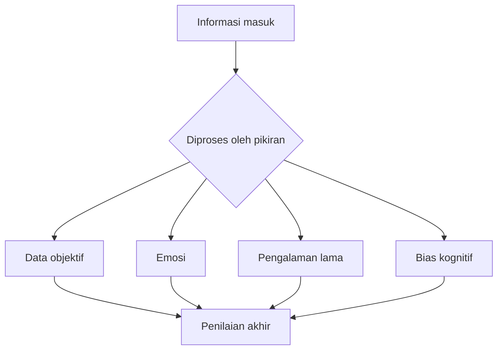
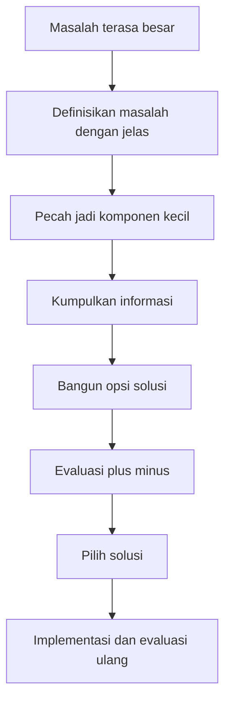
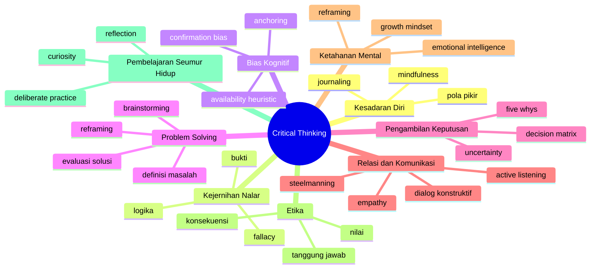

## 🧠 Pendahuluan: Mengapa Berpikir Kritis Menjadi Keterampilan Paling Penting di Zaman Sekarang?

Kita hidup di zaman yang aneh. Informasi melimpah, tetapi kejernihan justru langka. Setiap hari kita dibanjiri berita, opini, konten motivasi, potongan video, *thread*, iklan, narasi politik, saran kesehatan, petuah finansial, dan pendapat orang-orang yang terdengar meyakinkan. Namun semakin banyak informasi tidak otomatis membuat manusia semakin bijak. Sering kali yang terjadi justru sebaliknya: kita menjadi lebih reaktif, lebih mudah percaya, lebih cepat marah, lebih cepat menghakimi, dan lebih mudah lelah secara mental. 📱🌪️

Di sinilah **critical thinking** atau *berpikir kritis* menjadi sangat penting. Bukan sekadar sebagai keterampilan akademik, bukan pula sebagai gaya bicara sok intelektual, melainkan sebagai fondasi untuk hidup yang lebih jernih. Berpikir kritis adalah kemampuan untuk:

- menganalisis informasi dengan tenang,
- memeriksa asumsi,
- mengenali bias,
- menimbang bukti,
- melihat berbagai sudut pandang,
- lalu mengambil keputusan yang lebih masuk akal.

Audiobook *Critical Thinking Mastery: Transform Your Mindset for Ultimate Personal Growth* mencoba menjadikan berpikir kritis bukan hanya alat logika, tetapi juga jalan pertumbuhan pribadi. Itu pendekatan yang menarik. Sebab dalam kehidupan nyata, masalah kita jarang murni intelektual. Banyak keputusan buruk lahir bukan karena kita kurang data, tetapi karena kita terlalu dikuasai emosi, terlalu nyaman dengan keyakinan lama, terlalu malas memeriksa asumsi, atau terlalu cepat menyimpulkan.

Artikel ini akan mengolah isi audiobook tersebut menjadi uraian yang lebih runtut, mendalam, dan relevan untuk pembaca Indonesia. Fokusnya bukan sekadar merangkum isi bab demi bab, tetapi membangun satu tesis besar:

> **berpikir kritis adalah seni menjaga kejernihan akal di tengah kebisingan dunia.**

Dan kejernihan itu bukan bakat bawaan. Ia bisa dilatih. Ia bisa dipertajam. Ia bisa menjadi disiplin hidup. ✨

<Callout type="important" title="Gagasan utama artikel ini">
Berpikir kritis bukan berarti suka membantah, bukan berarti dingin tanpa empati, dan bukan berarti merasa paling rasional. Berpikir kritis justru berarti mampu menahan reaksi spontan, memeriksa dasar pikiran sendiri, dan memilih respons yang lebih jujur, lebih cermat, dan lebih bertanggung jawab.
</Callout>

---

## 🌱 1. Critical Thinking Bukan Bakat Lahir, tetapi Otot Mental yang Dilatih

Salah satu kesalahpahaman paling umum adalah anggapan bahwa orang yang kritis itu “memang dari sananya pintar”. Seolah-olah berpikir tajam adalah bakat bawaan yang hanya dimiliki sebagian orang. Audiobook ini membantah gagasan itu dengan tepat. **Critical thinking adalah skill** — *keterampilan* — bukan anugerah eksklusif. 🌱

Ini penting, karena cara kita memandang sebuah kemampuan akan menentukan apakah kita mau melatihnya atau tidak. Kalau kita menganggap berpikir kritis sebagai bakat, kita cenderung pasif:

- “Saya memang orangnya tidak analitis.”
- “Saya memang gampang bingung.”
- “Itu mah buat orang pintar.”

Tetapi kalau kita melihatnya sebagai keterampilan, maka seluruh percakapan berubah. Kita mulai bertanya:

- bagaimana cara melatihnya?
- latihan apa yang efektif?
- kebiasaan mental apa yang perlu dibangun?
- jebakan berpikir apa yang harus dihindari?

Di titik ini, berpikir kritis menjadi seperti otot. Semakin sering dipakai dengan benar, semakin kuat. Semakin jarang dilatih, semakin lemah. Dan seperti otot lain, pertumbuhannya tidak nyaman. Ada rasa capek. Ada rasa malu ketika sadar selama ini kita bias. Ada rasa tidak enak saat harus mengakui bahwa keyakinan lama ternyata rapuh. Namun justru di situlah pertumbuhannya terjadi. 💪

---

## 🪞 2. Langkah Pertama Berpikir Kritis adalah Mengenali Pola Pikiran Sendiri

Audiobook ini sangat tepat ketika memulai dari **self-awareness** atau *kesadaran diri*. Sebelum kita mengkritisi argumen orang lain, kita perlu memahami cara kerja kepala kita sendiri. Ini sering dilupakan. Banyak orang ingin menjadi pemikir kritis, tetapi seluruh energinya habis untuk membedah kelemahan pendapat orang lain, sementara ia tidak pernah menyelidiki kebiasaan berpikirnya sendiri. 🪞

Padahal pikiran manusia tidak netral. Ia punya kebiasaan. Ia punya pola. Ia punya jalur-jalur otomatis yang terbentuk dari pengalaman, ketakutan, luka, pendidikan, kebiasaan keluarga, lingkungan sosial, dan sistem kepercayaan yang lama kita pegang.

Kesadaran diri di sini berarti kemampuan untuk mengamati:

- pikiran kita sendiri,
- emosi yang muncul,
- reaksi spontan,
- pola keputusan,
- dan narasi batin yang terus berulang.

Banyak orang baru menyadari setelah refleksi yang jujur bahwa mereka punya pola seperti ini:

- terlalu cepat menyimpulkan,
- terlalu mudah merasa terancam oleh kritik,
- terlalu sering membayangkan skenario terburuk,
- terlalu suka mencari pembenaran atas keyakinan lama,
- atau terlalu mudah percaya pada informasi yang sesuai selera emosionalnya.

Mengenali pola ini bukan tindakan kecil. Ini fondasi. Karena kita tidak bisa memperbaiki pola pikir yang bahkan tidak kita sadari keberadaannya.

---

## 🧘 3. Mindfulness dan Journaling: Dua Alat Sederhana untuk Membaca Isi Kepala

Audiobook ini menyebut dua alat penting untuk membangun kesadaran diri:

- **mindfulness** — *kesadaran penuh / hadir utuh pada momen sekarang*
- **reflective journaling** — *menulis reflektif / jurnal refleksi*

Keduanya terdengar sederhana, tetapi dampaknya besar. 🧘✍️

### Mindfulness
Mindfulness bukan sekadar duduk tenang dengan musik lembut. Intinya adalah belajar memperhatikan pikiran dan perasaan tanpa langsung larut di dalamnya. Saat kita melatih mindfulness, kita mulai melihat bahwa pikiran bukan fakta. Ia adalah peristiwa mental yang datang dan pergi.

Misalnya, ketika muncul pikiran:

- “Saya pasti gagal.”
- “Dia pasti meremehkan saya.”
- “Situasi ini pasti akan hancur.”

mindfulness membantu kita berhenti sejenak dan bertanya:

- apakah ini fakta atau dugaan?
- apakah saya sedang bereaksi atau sedang menilai dengan jernih?
- emosi apa yang sedang mengendalikan penilaian saya?

### Reflective Journaling
Sementara itu, journaling memberi bentuk yang lebih konkret. Saat pikiran ditulis, ia menjadi objek yang bisa diperiksa. Kita tidak lagi tenggelam di dalamnya; kita mulai melihat polanya dari luar.

Dengan jurnal reflektif, orang sering menemukan hal-hal seperti:

- mereka mengulang kecemasan yang sama,
- mereka memandang kritik sebagai ancaman pribadi,
- mereka punya kecenderungan membesar-besarkan masalah kecil,
- atau mereka selalu mengambil keputusan tergesa-gesa ketika sedang lelah atau merasa tidak aman.

Dalam konteks berpikir kritis, dua alat ini sangat kuat karena membantu kita membangun **jarak psikologis** dari pikiran sendiri. Dan tanpa jarak itu, kita mudah tertipu oleh isi kepala kita sendiri.

---

## ⚠️ 4. Bias Kognitif: Musuh Halus yang Jarang Terlihat tetapi Sangat Berpengaruh

Salah satu bagian terpenting dari audiobook ini adalah pembahasan tentang **cognitive biases** atau *bias kognitif*. Ini adalah pola kesalahan berpikir yang sistematis. Bukan karena kita bodoh, melainkan karena otak manusia memang suka jalan pintas. ⚠️

Otak dirancang untuk efisien, bukan selalu akurat. Dalam banyak situasi, jalan pintas mental ini membantu. Tetapi dalam situasi kompleks, ia bisa menyesatkan.

Beberapa bias yang dibahas sangat penting:

### Confirmation Bias — bias konfirmasi
Kita cenderung mencari, mengingat, dan menerima informasi yang menguatkan keyakinan lama, sambil meremehkan informasi yang bertentangan.

Ini sebabnya orang bisa sangat aktif membagikan artikel yang mendukung opininya, tetapi nyaris tidak pernah membaca dengan jujur artikel yang menantangnya.

### Availability Heuristic — heuristik ketersediaan
Kita cenderung melebihkan kemungkinan sesuatu jika contohnya mudah diingat. Misalnya, orang merasa kecelakaan pesawat lebih menakutkan daripada kecelakaan mobil karena pesawat lebih dramatis dan lebih sering muncul di berita, padahal secara statistik bisa jadi tidak demikian.

### Anchoring Effect — efek jangkar
Kita terlalu dipengaruhi oleh informasi pertama yang muncul. Harga awal dalam negosiasi, angka pertama dalam diskusi, atau framing pertama dalam berita bisa menjadi “jangkar” yang menggeser penilaian kita.

Bias-bias ini sangat berbahaya bukan karena mereka selalu kasar, tetapi karena mereka bekerja diam-diam. Kita merasa sedang berpikir rasional, padahal sebenarnya sedang digerakkan oleh pola otomatis.

Diagram ini mengingatkan bahwa keputusan manusia jarang lahir dari data murni saja. Selalu ada campuran antara fakta, emosi, pengalaman, dan bias.

---

## 🔄 5. Mengatasi Bias Tidak Cukup dengan “Sadar Saja”

Banyak orang setelah belajar bias kognitif merasa cukup hanya dengan mengenal istilahnya. Padahal pengenalan tidak otomatis berarti pengurangan pengaruh. Audiobook ini benar ketika menekankan bahwa **kesadaran saja tidak cukup**. Kita butuh strategi aktif. 🔄

Beberapa strategi penting yang bisa ditarik dari isi buku ini:

### a. Cari informasi yang menantang keyakinan kita
Bukan hanya membaca yang kita sukai, tetapi sengaja mencari argumen lawan yang paling kuat.

### b. Latih fleksibilitas mental
Saat merasa sudah tahu jawabannya, paksa diri bertanya:
- kemungkinan lain apa yang belum saya pertimbangkan?
- apakah ada penjelasan alternatif?

### c. Minta umpan balik jujur
Orang lain kadang melihat pola kita lebih jelas daripada kita sendiri.

### d. Rawat kerendahan hati intelektual
Mengakui “saya bisa salah” adalah fondasi berpikir yang sehat.

Ini semua menunjukkan satu hal besar: berpikir kritis tidak lahir dari ego yang merasa sudah benar, melainkan dari mentalitas yang cukup kuat untuk mengakui kemungkinan salah.

---

## 🧱 6. Fondasi Berpikir Kritis: Logika, Bukti, dan Kerendahan Hati

Audiobook ini menekankan tiga fondasi penting:

- **logical reasoning** — *penalaran logis*
- **evidence-based thinking** — *berpikir berbasis bukti*
- **intellectual humility** — *kerendahan hati intelektual*

Tiga hal ini saling terkait. 🧱

### Penalaran logis
Ini adalah kemampuan melihat apakah suatu kesimpulan sungguh mengikuti premisnya. Apakah hubungan antara alasan dan kesimpulan itu sah?

### Berpikir berbasis bukti
Ini menuntut kita mendasarkan keyakinan bukan pada rasa suka, rasa tidak suka, atau cerita yang menyentuh emosi, tetapi pada bukti yang dapat diperiksa.

### Kerendahan hati intelektual
Ini mungkin yang paling sulit. Bukan rendah diri, tetapi sadar bahwa pengetahuan kita terbatas. Bahwa kita bisa salah. Bahwa lawan bicara bisa saja membawa potongan realitas yang belum kita lihat.

Tanpa logika, kita mudah tersesat. Tanpa bukti, kita mudah tertipu. Tanpa kerendahan hati, kita berhenti belajar.

---

## 🪤 7. Logical Fallacies: Ketika Argumen Terdengar Meyakinkan tetapi Sebenarnya Rapuh

Bagian lain yang penting adalah pembahasan tentang **logical fallacies** atau *sesat pikir / kekeliruan logika*. Ini adalah pola penalaran yang tampak kuat di permukaan, tetapi sebenarnya cacat. 🪤

Beberapa yang dibahas dalam audiobook:

### Ad Hominem
Menyerang pribadi orangnya, bukan substansi argumennya.

### False Dichotomy
Menyajikan seolah hanya ada dua pilihan, padahal pilihan lain sebenarnya ada.

### Slippery Slope
Menganggap satu langkah kecil pasti akan menimbulkan rantai akibat ekstrem tanpa bukti yang memadai.

### Correlation vs Causation
Mengira dua hal yang muncul bersama berarti salah satunya menyebabkan yang lain.

Ini penting karena dunia modern penuh persuasi yang sengaja memainkan sesat pikir. Iklan, pidato politik, debat publik, bahkan konten motivasi sering memanfaatkan struktur logika yang lemah tetapi emosionalnya kuat.

Maka orang yang berpikir kritis perlu belajar bertanya:

- apa klaim utamanya?
- apa premisnya?
- apa kesimpulannya?
- apakah hubungan antarbagian itu valid?
- apa yang diasumsikan tetapi tidak diucapkan?

Itu membuat kita tidak mudah terhipnotis oleh retorika.

---

## 🧩 8. Problem Solving yang Efektif Dimulai dari Mendefinisikan Masalah dengan Benar

Audiobook ini juga sangat kuat ketika membahas **problem solving** atau *pemecahan masalah*. Banyak orang gagal menyelesaikan masalah bukan karena kurang pintar, tetapi karena sejak awal salah mendefinisikan masalahnya. 🧩

Ini sering terjadi. Sesuatu yang tampak seperti satu masalah ternyata adalah kumpulan beberapa masalah yang saling terkait. Maka langkah pertama bukan buru-buru memberi solusi, tetapi:

- mendefinisikan masalah secara jernih,
- memecahnya menjadi bagian yang lebih kecil,
- mencari akar persoalan,
- dan baru setelah itu merancang opsi solusi.

Ini sangat penting dalam hidup pribadi maupun kerja. Misalnya, “saya tidak produktif” mungkin bukan masalah tunggal. Bisa jadi itu gabungan dari:

- kurang tidur,
- target yang kabur,
- kecemasan,
- terlalu banyak distraksi,
- dan sistem kerja yang buruk.

Kalau masalah yang kompleks diberi nama terlalu sederhana, solusi yang dihasilkan juga cenderung dangkal.

---

## 💡 9. Brainstorming, Evaluasi, dan Reframing: Tiga Tahap yang Sering Dilompati

Audiobook ini menekankan bahwa setelah masalah dipahami, kita perlu:

1. menghasilkan banyak kemungkinan solusi,
2. menilai tiap solusi dengan cermat,
3. dan kadang **reframe** — *membingkai ulang* — masalahnya.

Ini penting sekali. Banyak orang terlalu cepat jatuh cinta pada solusi pertama yang terlihat masuk akal. Padahal solusi pertama sering bukan yang terbaik, hanya yang paling cepat muncul. 💡

### Brainstorming
Tahap ini menuntut penundaan penilaian. Biarkan ide liar muncul dulu.

### Evaluasi
Setelah itu baru kita timbang:
- kelebihan,
- kekurangan,
- kelayakan,
- dampak samping,
- dan konsekuensi tak terduga.

### Reframing
Kadang masalah tidak selesai karena pertanyaannya salah. Saat bingkai masalah diubah, solusi baru muncul.

Misalnya, dari:
- “bagaimana saya bisa bekerja lebih keras?”

menjadi:
- “bagaimana saya bisa membuang pekerjaan yang sebenarnya tidak penting?”

Perubahan kecil pada framing bisa mengubah keseluruhan jalur keputusan.

---

## 🌍 10. Berpikir Kritis Menuntut Keberanian untuk Mendengar Perspektif yang Berbeda

Salah satu kekuatan audiobook ini adalah penekanannya pada **diverse perspectives** atau *beragam perspektif*. Ini sangat penting, karena orang tidak pernah berpikir di ruang hampa. Kita dibentuk oleh lingkungan yang sering homogen. Akibatnya, kita mudah mengira pandangan kita itu netral, padahal sering kali cuma kebiasaan lingkungan kita sendiri. 🌍

Berinteraksi dengan perspektif berbeda bukan sekadar sopan santun intelektual. Itu kebutuhan epistemik — kebutuhan agar pengetahuan kita tidak sempit.

Namun ada syaratnya: perspektif berbeda tidak cukup hanya didengar. Ia harus dipahami dengan niat yang adil. Di sini audiobook memperkenalkan konsep **steelmanning** — *membangun versi terkuat dari argumen lawan*, kebalikan dari *strawman* yang justru menyerang versi lemah atau karikatural.

Ini latihan yang sangat matang. Kalau kita bisa menjelaskan argumen lawan dengan jujur dan kuat, barulah kita sungguh memahami apa yang kita kritik.

---

## 🤝 11. Empati dan Active Listening Bukan Musuh Logika, tetapi Penopangnya

Ada orang yang mengira semakin logis seseorang, semakin ia tidak perlu empati. Itu keliru. Audiobook ini dengan tepat menunjukkan bahwa **active listening** — *mendengar aktif* — dan empati justru penting untuk berpikir kritis. 🤝

Mengapa? Karena tanpa empati, kita sering salah memahami posisi orang lain. Kita mendengar hanya untuk membalas, bukan untuk memahami. Akibatnya, kita tidak benar-benar berhadapan dengan argumen lawan, melainkan dengan versi yang kita karang sendiri.

Mendengar aktif berarti:

- fokus pada isi dan alasan lawan bicara,
- mendengar nada, konteks, dan kekhawatirannya,
- memastikan pemahaman sebelum membantah,
- dan menahan dorongan untuk langsung menilai.

Empati di sini bukan berarti setuju. Empati berarti mampu melihat bagaimana dunia tampak dari posisi orang lain. Dan itu sangat penting untuk keputusan yang matang, baik dalam hubungan pribadi, kerja tim, maupun kepemimpinan.

---

## 🧭 12. Decision Making: Memilih Jalan Saat Informasi Tidak Pernah Lengkap

Audiobook ini juga menekankan bahwa **decision-making** atau *pengambilan keputusan* bukan peristiwa sesaat, melainkan proses. Ini penting karena banyak orang membayangkan keputusan sebagai momen heroik: pilih A atau B. Padahal keputusan yang baik lahir dari tahapan yang lebih panjang. 🧭

Tahap-tahap itu antara lain:

- mendefinisikan keputusan yang sebenarnya sedang dibuat,
- mengumpulkan informasi yang relevan,
- mengidentifikasi opsi,
- menimbang risiko dan manfaat,
- mempertimbangkan nilai dan tujuan,
- lalu memutuskan sambil sadar bahwa ketidakpastian tidak akan pernah hilang total.

Ini poin yang sangat penting: **keputusan terbaik tidak selalu lahir dari kepastian penuh**, karena kepastian penuh sering tidak tersedia. Yang lebih realistis adalah keputusan yang cukup terinformasi, cukup matang, dan cukup konsisten dengan nilai yang kita pegang.

---

## 📊 13. Decision Matrix, Five Whys, dan Eisenhower Matrix: Alat Bantu yang Membumi

Audiobook ini menyebut beberapa alat yang sangat praktis:

### Decision Matrix — matriks keputusan
Membandingkan opsi berdasarkan kriteria yang penting.

### Five Whys — lima kali “mengapa”
Bertanya “kenapa?” berulang kali untuk menemukan akar masalah.

### Eisenhower Matrix — matriks penting-mendesak
Memilah tugas berdasarkan penting atau mendesaknya.

Semua alat ini berguna bukan karena ajaib, tetapi karena membantu pikiran kita menjadi lebih terstruktur. 📊

Banyak keputusan buruk lahir dari pikiran yang kabur. Alat-alat semacam ini memaksa kita mengurai keruwetan menjadi elemen yang bisa diperiksa.

---

## 🧱 14. Analysis Paralysis dan Groupthink: Dua Jebakan Besar dalam Pengambilan Keputusan

Audiobook ini juga menyentuh dua jebakan penting:

### Analysis Paralysis — kelumpuhan karena terlalu banyak analisis
Orang terus mengumpulkan informasi, terus menimbang, terus memikirkan opsi, tetapi tidak pernah benar-benar memutuskan.

### Groupthink — pemikiran kelompok yang terlalu konformis
Keinginan menjaga harmoni membuat kelompok malas menguji asumsi dan akhirnya mengambil keputusan buruk.

Kedua jebakan ini sangat umum. Yang satu terlalu lama tidak bergerak. Yang satu bergerak terlalu cepat tanpa kritik internal. 🧱

Berpikir kritis yang sehat harus bisa menghindari keduanya:

- cukup analitis untuk tidak gegabah,
- cukup tegas untuk tidak lumpuh,
- cukup terbuka untuk menerima kritik,
- cukup berani untuk tidak ikut arus tanpa berpikir.

---

## 🌳 15. Mental Resilience: Berpikir Jernih Butuh Ketahanan Mental, Bukan Hanya IQ

Audiobook ini melakukan satu langkah yang sangat penting: menghubungkan berpikir kritis dengan **mental resilience** atau *ketahanan mental*. Ini sangat benar. Sebab dalam praktiknya, banyak orang sebenarnya tahu apa yang benar, tetapi tidak cukup kuat secara mental untuk menjalaninya. 🌳

Ketahanan mental di sini bukan berarti menekan emosi atau pura-pura kuat. Justru sebaliknya, ia berarti mampu:

- mengenali emosi,
- menahan diri agar tidak dikuasai emosi,
- pulih dari kegagalan,
- melihat tantangan sebagai bahan belajar,
- dan tetap waras di tengah tekanan.

Tanpa ketahanan mental, berpikir kritis mudah kalah oleh:

- rasa takut,
- rasa malu,
- kebutuhan untuk selalu terlihat benar,
- atau kepanikan saat hasil tidak sesuai harapan.

Maka benar sekali ketika audiobook menghubungkan berpikir kritis dengan:

- emotional intelligence,
- growth mindset,
- mindfulness,
- coping strategy,
- dan reframing.

Pikiran jernih butuh wadah psikologis yang stabil.

---

## 🔁 16. Growth Mindset: Kata “Belum” Bisa Mengubah Seluruh Arah Hidup

Salah satu bagian paling berguna adalah pembahasan tentang **growth mindset** — *pola pikir bertumbuh*. Gagasan ini sederhana tetapi kuat: kemampuan bukan sesuatu yang statis. Ia bisa berkembang lewat usaha, latihan, dan pembelajaran. 🔁

Perbedaan kecil seperti ini sangat menentukan:

- “Saya tidak bisa.”
- “Saya belum bisa.”

Kata **belum** membuka masa depan. Ia mengubah identitas tetap menjadi proses berkembang. Dan dalam berpikir kritis, ini sangat penting, karena orang yang merasa identitas intelektualnya harus selalu tampak benar akan sulit belajar. Ia defensif. Ia takut revisi. Ia alergi koreksi.

Sebaliknya, orang dengan growth mindset bisa berkata:

- saya salah, tapi saya bisa belajar,
- saya bias, tapi saya bisa memperbaiki,
- saya lemah di area ini, tapi saya bisa melatihnya.

Itu fondasi yang sangat sehat.

---

## 🗣️ 17. Komunikasi Efektif: Berpikir Kritis Harus Bisa Menjadi Jembatan, Bukan Menara Gading

Audiobook ini juga menutup lingkaran dengan pembahasan **effective communication** atau *komunikasi efektif*. Ini sangat penting, karena berpikir kritis yang tidak bisa dikomunikasikan dengan baik sering berubah menjadi kesombongan, sinisme, atau keterasingan. 🗣️

Komunikasi yang baik membutuhkan dua hal sekaligus:

- kejernihan berpikir,
- dan kemampuan membangun pemahaman bersama.

Itu berarti:

- menyusun argumen dengan jelas,
- menyesuaikan bahasa dengan audiens,
- mendengar aktif,
- menggunakan pertanyaan Socratic,
- mengelola konflik tanpa meledak,
- dan sadar bahwa bahasa tubuh serta nada bicara juga ikut berbicara.

Orang yang benar-benar berpikir kritis tidak sekadar mampu mematahkan argumen. Ia mampu membangun percakapan yang membuat orang lain juga berpikir lebih baik.

---

## ⚖️ 18. Etika: Berpikir Kritis Tanpa Kompas Moral Bisa Menjadi Alat yang Dingin

Bagian etika dalam audiobook ini sangat penting. Ia mengingatkan bahwa berpikir kritis tidak cukup hanya akurat secara logis. Ia juga perlu dituntun oleh **ethical reasoning** atau *penalaran etis*. ⚖️

Sebab seseorang bisa saja sangat tajam secara analitis, tetapi memakai ketajamannya untuk manipulasi, rasionalisasi keburukan, atau pembenaran ego. Di sinilah etika masuk.

Audiobook ini membahas beberapa kerangka seperti:

- utilitarianism — *utilitarianisme / memaksimalkan kebaikan terbesar*
- deontological ethics — *etika deontologis / kewajiban moral*
- virtue ethics — *etika kebajikan / karakter yang baik*
- care ethics — *etika kepedulian / relasi dan kebutuhan manusia*

Yang penting bukan menghafal istilahnya, tetapi memahami bahwa keputusan etis sering tidak sesederhana “suka atau tidak suka”. Kita perlu menimbang:

- dampak,
- prinsip,
- karakter,
- relasi,
- dan tanggung jawab.

Berpikir kritis yang matang selalu sadar bahwa keputusan tidak hanya punya konsekuensi logis, tetapi juga konsekuensi moral.

---

## 🏠 19. Critical Thinking in Everyday Life: Ini Bukan Hanya untuk Debat atau Kantor

Salah satu kekuatan audiobook ini adalah ia membawa critical thinking turun ke kehidupan sehari-hari. Ini penting, karena kalau berpikir kritis hanya hidup di ruang seminar, ia belum benar-benar menjadi kebiasaan. 🏠

Dalam hubungan pribadi, berpikir kritis bisa membantu kita menyadari bahwa konflik sering bukan soal topik permukaan, tetapi soal kebutuhan emosional yang tak terucap.

Dalam pekerjaan, ia membantu kita mencari akar masalah, bukan menambal gejala.

Sebagai konsumen, ia membantu kita memeriksa iklan, klaim produk, dan godaan diskon dengan kepala yang lebih dingin.

Sebagai warga, ia membantu kita membaca berita dan propaganda dengan lebih waspada.

Sebagai individu, ia membantu kita mengatur waktu, memilih prioritas, dan menghindari hidup yang hanya reaktif terhadap hal paling mendesak.

Ini penting: berpikir kritis tidak berarti membesar-besarkan semua hal. Ia bukan undangan untuk overthinking. Justru tujuannya adalah membuat hidup **lebih terarah, bukan lebih kusut**.

---

## 📚 20. Lifelong Learning: Berpikir Kritis Tidak Pernah Selesai Dipelajari

Audiobook ini ditutup dengan tema **lifelong learning** atau *belajar sepanjang hayat*. Dan memang begitu seharusnya. Berpikir kritis bukan proyek yang selesai dalam satu buku, satu pelatihan, atau satu fase hidup. Ia adalah praktik seumur hidup. 📚

Karena dunia berubah. Tantangan berubah. Teknologi berubah. Narasi berubah. Dan kita sendiri juga berubah. Maka kejernihan berpikir harus terus dipelihara.

Beberapa gagasan penting dari bagian ini:

- rawat rasa ingin tahu,
- sengaja belajar di luar zona nyaman,
- lakukan *deliberate practice* atau latihan sengaja,
- bangun kebiasaan refleksi,
- perlakukan kesalahan sebagai bahan belajar,
- dan kelilingi diri dengan orang-orang yang juga serius berpikir.

Ini sangat bagus, terutama di era AI dan banjir informasi. Justru ketika jawaban makin cepat dihasilkan mesin, kualitas pertanyaan manusia menjadi makin penting. Dan kualitas pertanyaan itu lahir dari critical thinking yang hidup.

---

## ✨ 21. Kesimpulan: Berpikir Kritis adalah Disiplin untuk Menjadi Manusia yang Lebih Utuh

Kalau seluruh isi audiobook ini disaring ke inti paling dalam, saya kira pesannya bukan sekadar “jadilah lebih pintar”. Pesannya lebih kaya dari itu: **jadilah lebih utuh sebagai manusia**. ✨

Karena berpikir kritis yang sejati bukan hanya soal analisis. Ia juga soal:

- kejujuran terhadap diri sendiri,
- keberanian menghadapi bias,
- ketenangan menghadapi ketidakpastian,
- kedewasaan mendengar orang lain,
- keteguhan moral dalam mengambil keputusan,
- dan kerendahan hati untuk terus belajar.

Dalam arti ini, berpikir kritis bukan cuma alat akademik, tetapi etos hidup. Ia membantu kita:

- tidak mudah dimanipulasi,
- tidak cepat hanyut oleh emosi massa,
- tidak gegabah dalam keputusan besar,
- tidak fanatik buta pada keyakinan sendiri,
- dan tidak berhenti berkembang hanya karena sudah merasa tahu.

Di dunia yang semakin gaduh, orang yang mampu menjaga kejernihan pikirannya adalah orang yang sangat berharga. Bukan karena ia selalu benar, tetapi karena ia lebih sulit dipermainkan oleh impuls, oleh propaganda, oleh bias, dan oleh ego.

Dan mungkin di situlah arti terdalam dari *critical thinking mastery*: bukan menjadi manusia yang selalu menang debat, tetapi menjadi manusia yang lebih jernih, lebih matang, lebih adil, dan lebih bertanggung jawab dalam cara ia melihat dunia. 🌤️

---

## 🔖 Catatan Penutup

Artikel ini diolah dari transkrip audiobook *Critical Thinking Mastery: Transform Your Mindset for Ultimate Personal Growth* dan disusun ulang menjadi artikel reflektif-analitis untuk pembaca Indonesia yang ingin membangun kejernihan berpikir di era informasi berlimpah.

## 📚 Sumber Dasar

- Transkrip audiobook: *Critical Thinking Mastery: Transform Your Mindset for Ultimate Personal Growth*
- Sumber video: YouTube (`https://www.youtube.com/watch?v=XFLcHOA-Q0g`)
