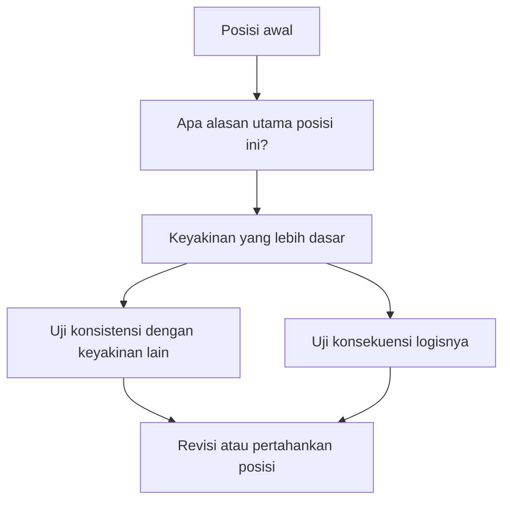
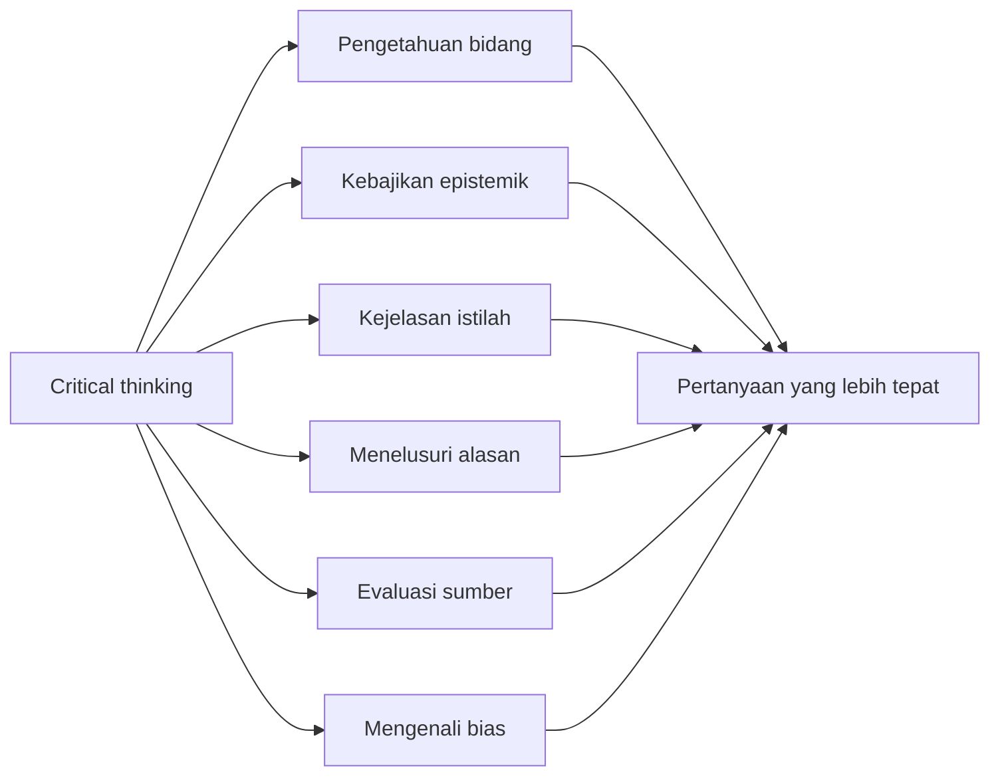

## 🧠 Pendahuluan: Benarkah *Critical Thinking* Sedang Mati?

Beberapa tahun terakhir, istilah **critical thinking** *(berpikir kritis)* berubah menjadi semacam kata sakti. Semua orang menggunakannya. Sekolah mengklaim mengajarkannya. Media sosial memujinya. Perdebatan publik menuntutnya. Dan ironisnya, justru karena terlalu sering dipakai, istilah ini mulai kehilangan ketajamannya. 🧠

Kita hidup di masa ketika orang bisa sangat cepat:
- bereaksi tanpa memahami konteks,
- menyimpulkan tanpa memperjelas istilah,
- menyerang posisi lawan tanpa benar-benar menelusuri alasan lawan,
- dan merasa telah “berpikir kritis” hanya karena berhasil terdengar sinis atau skeptis.

Padahal berpikir kritis bukan sama dengan:
- nyinyir,
- suka debat,
- membongkar kelemahan orang lain,
- atau sekadar tidak percaya pada apa pun.

Justru sering kali masalah terbesar kita hari ini bukan kurang skeptis, melainkan **kurang jernih**, **kurang sabar**, dan **kurang rendah hati secara intelektual**.

Inilah inti yang ingin dibela artikel ini: mungkin *critical thinking* memang terasa menurun, tetapi bukan semata karena orang mendadak jadi bodoh. Bisa jadi kita mendekati topik ini dengan cara yang salah. Kita membayangkannya seolah itu satu kemampuan tunggal—semacam tombol on/off—padahal kenyataannya tidak sesederhana itu.

Berpikir kritis bukan satu skill ajaib. Ia lebih mirip kumpulan kemampuan dan sikap batin yang saling menopang:
- kemampuan mencari **kejelasan**,
- kebiasaan melacak **struktur alasan**,
- kesadaran atas **bias**,
- kecakapan menilai **sumber**,
- dan yang paling penting, pengembangan **kebajikan epistemik** *(epistemic virtues / kualitas-kualitas batin yang menolong kita mengetahui dengan baik)* seperti integritas intelektual dan kerendahan hati epistemik.

Artikel ini akan membedah semua itu secara **sangat detail, mendalam, dan lengkap** dalam bahasa Indonesia. Kita tidak hanya akan bertanya “apa itu berpikir kritis?”, tetapi juga:

- mengapa banyak pertengkaran sebenarnya hanya soal istilah yang kabur,
- bagaimana menelusuri alasan terdalam di balik suatu posisi,
- mengapa bias bukan sekadar cacat melainkan juga alat yang bisa jadi liar,
- bagaimana mengevaluasi sumber secara lebih cerdas,
- dan mengapa rasa ingin terlihat pintar justru sering menjadi musuh terbesar kejernihan berpikir.

Kalau harus diringkas dalam satu kalimat sejak awal, maka tesis artikel ini adalah:

> **berpikir kritis bukan seni tampak cerdas, melainkan latihan panjang untuk makin jujur terhadap apa yang kita tahu, apa yang kita tidak tahu, dan bagaimana kita sampai pada suatu keyakinan.**

---

<Callout type="important" title="Tesis utama artikel ini">
*Critical thinking* tidak mati karena manusia kehilangan kecerdasan, tetapi karena kita terlalu sering mengira bahwa berpikir kritis berarti cepat menyerang, cepat curiga, dan cepat merasa benar. Padahal fondasinya justru kejelasan, kesabaran, dan kerendahan hati intelektual.
</Callout>

---

## 🔎 1. Langkah Pertama yang Sering Diremehkan: Mencari Kejelasan

Bagian pertama ini mungkin terdengar tidak seksi, tetapi justru sangat mendasar: **clarity** *(kejelasan)*. 🔎

Banyak konflik intelektual yang terlihat dalam sebenarnya lahir dari hal sederhana: orang memakai kata yang sama dengan arti yang berbeda.

Contohnya sangat mudah ditemukan. Kata-kata seperti:
- konservatif,
- progresif,
- kapitalis,
- sosialis,
- ilmiah,
- pseudoilmiah,
- rasional,
- wajar,
- kreatif,
- pengetahuan,
- baik,
- buruk,
- kejahatan,
- bahkan “Tuhan” dan “agama”

sering dipakai dengan makna yang tidak identik antara satu orang dan orang lain.

Akibatnya, yang terlihat seperti debat substansial kadang sebenarnya hanyalah **tabrakan definisi**.

Video sumber memberi contoh indah: seorang liberal Inggris menyebut dirinya *Republican* karena menolak monarki dan mendukung republik. Seorang liberal Amerika mendengar kata itu sebagai dukungan pada Partai Republik AS. Perdebatan memanas, padahal mereka bukan sedang berbeda pandangan politik secara mendasar. Mereka hanya mengisi kata yang sama dengan referensi politik yang berbeda.

Kelihatannya sepele. Tapi justru hal seperti ini terjadi terus-menerus di ruang publik, hanya dalam bentuk yang lebih halus dan lebih sulit dideteksi.

Misalnya dalam debat agama:
- apakah yang dibahas “Tuhan” sebagai konsep filsafat minimal—mahakuasa, mahatahu, maha baik?
- atau “Tuhan” sebagaimana dipahami dalam tradisi Kristen tertentu?
- atau Islam?
- atau teisme umum?

Jika ini tidak diperjelas sejak awal, debat akan cepat kacau karena dua pertanyaan berbeda diperlakukan seolah sama.

Jadi, salah satu bentuk paling dasar dari berpikir kritis adalah bertanya:

- *Apa tepatnya yang dimaksud dengan istilah ini?*
- *Ketika Anda berkata X, X yang mana?*
- *Apakah kita sedang membahas hal yang sama?*

Tanpa ini, diskusi produktif hampir mustahil.

---

## 🗣️ 2. Mengapa Bahasa Sehari-hari Selalu Menyisakan Ambiguitas?

Penting untuk ditekankan: ketidakjelasan bahasa sehari-hari bukanlah bug murni. Sebagian ia justru **fitur**. Bahasa manusia fleksibel karena tidak terlalu kaku. Kata-kata bisa menyesuaikan konteks, nuansa, budaya, dan situasi. 🗣️

Kalau setiap kata hanya boleh punya satu arti presisi selamanya, bahasa akan jadi sangat kaku dan hampir mustahil dipakai secara hidup.

Tetapi keluwesan ini juga punya harga. Dalam diskusi serius, terutama yang menyangkut isu moral, politik, agama, atau sains, kita sering perlu “mengencangkan” makna kata. Kita perlu bergerak dari keluwesan komunikatif ke ketelitian konseptual.

Karena itu, berpikir kritis tidak menuntut kita membenci bahasa biasa. Ia hanya menuntut kita **sadar kapan bahasa biasa tidak cukup presisi**.

Banyak orang gagal di titik ini karena mereka merasa kalau sudah tahu sebuah kata, berarti sudah tahu konsepnya. Padahal belum tentu. Kita sering hidup dengan istilah besar yang kabur tetapi terasa akrab. Dan keakraban sering menyamar sebagai pemahaman.

Padahal sangat mungkin seseorang nyaman memakai kata “ilmiah” selama bertahun-tahun tanpa pernah benar-benar menjelaskan apa yang ia maksud dengan itu.

---

## 🪤 3. Pertanyaan Klarifikasi: Alat Pencari Kebenaran, Bukan Jebakan Retoris

Ada pertanyaan yang sangat sederhana tetapi sangat kuat:

> **“Maksud Anda apa?”**

Atau versi yang lebih halus:
- “Saat Anda pakai istilah itu, definisi Anda apa?”
- “Kalau saya pahami posisi Anda seperti ini, apakah itu akurat?”
- “Apakah Anda membedakan X dari Y di sini?”

Ini kelihatannya dasar. Tapi sering justru inilah pembeda antara diskusi yang mencari kebenaran dan diskusi yang cuma ingin menang. 🪤

Sebab pertanyaan klarifikasi bisa dipakai dengan dua cara:

### A. Sebagai alat memahami
Kita benar-benar ingin tahu apa yang dimaksud lawan bicara.

### B. Sebagai jebakan terselubung
Nada kita sudah lebih dulu memberi isyarat bahwa lawan bicara pasti bodoh, kontradiktif, atau jahat.

Misalnya kalimat “Maksudmu apa sih?” bisa terdengar sebagai ajakan jernih—atau sebagai penghinaan yang dibungkus sopan.

Ini penting. Berpikir kritis tidak sama dengan **polemical critique** *(kritik polemis / serangan retoris terhadap lawan)*. Kritik polemis bisa sangat menghibur. Bisa juga berguna dalam konteks tertentu. Tetapi ia berbeda dari usaha jujur memahami suatu posisi sebelum menilainya.

Kalau pertanyaan klarifikasi kita ajukan dengan niat menjebak, kita memang mungkin berhasil menang secara retoris. Tetapi kita sering gagal secara epistemik *(dalam hal mengetahui dengan benar)*.

---

## 🏛️ 4. Kadang Klarifikasi Saja Sudah Melahirkan Kritik

Hal menariknya, pertanyaan klarifikasi yang tulus justru sering dengan sendirinya menghasilkan kritik. Bukan karena kita sengaja menyerang, tetapi karena saat posisi dipaksa menjadi jelas, kadang kelemahannya muncul sendiri. 🏛️

Contoh klasik yang dibahas dalam video adalah awal **Plato’s Republic**. **Thrasymachus** mendefinisikan keadilan sebagai apa yang menguntungkan pihak paling kuat. **Socrates** tidak langsung menyerang besar-besaran. Ia hanya memperjelas:

- “menguntungkan menurut siapa?”
- “menurut penguasa sendiri?”
- atau “secara objektif sungguh menguntungkan bagi mereka?”

Ternyata dua arti itu bisa bentrok. Maka dari klarifikasi saja, posisi awal terlihat ambigu atau bahkan kontradiktif.

Ini pelajaran penting sekali:

> **berpikir kritis tidak selalu berarti punya serangan hebat. Kadang cukup bertanya dengan sabar sampai posisi yang kabur dipaksa menunjukkan bentuknya.**

Dan bentuk itu mungkin ternyata rapuh.

---

## 🔁 5. Lakukan Klarifikasi Juga pada Diri Sendiri, Tanpa Belas Kasihan

Ini bagian yang paling sulit: kita biasanya senang meminta kejelasan dari orang lain, tetapi malas meminta kejelasan dari diri sendiri. Padahal justru di situlah banyak pekerjaan penting terjadi. 🔁

Tanyakan pada diri:
- ketika saya bilang “ini rasional,” rasional menurut definisi apa?
- ketika saya bilang “ini tidak ilmiah,” apakah saya sungguh tahu batasan istilah itu?
- ketika saya bilang “hidup harus bermakna,” apa arti “bermakna” di sini?
- ketika saya yakin terhadap suatu posisi moral, alasan utama saya yang mana sebenarnya?

Kita sering menyimpan istilah kabur di kepala dan membangunnya menjadi keyakinan besar. Dari luar tampak kokoh. Dari dalam, pondasinya kabut.

Salah satu kebiasaan bagus adalah membayangkan bahwa ada orang yang tidak setuju dengan posisi kita, lalu ia bertanya dengan jujur dan tajam. Kita paksa diri kita menjawabnya sebaik mungkin. Ini latihan yang sangat sehat.

---

## 🕸️ 6. Keyakinan Tidak Berdiri Sendiri: Memahami *Web of Beliefs*

Setelah kejelasan istilah, langkah penting berikutnya adalah memahami bahwa keyakinan manusia tidak hidup terpisah-pisah. Di sinilah berguna gagasan **Quine** tentang **web of beliefs** *(jaring keyakinan)*. 🕸️

Bayangkan seluruh keyakinan kita sebagai jaring besar yang saling terhubung. Ada keyakinan yang sangat sentral—dekat pusat—dan ada yang lebih pinggir.

### Keyakinan pusat
Ini keyakinan yang sangat kita andalkan untuk menjustifikasi banyak keyakinan lain. Misalnya:
- kepercayaan bahwa kontradiksi tidak mungkin benar sekaligus,
- kepercayaan terhadap persepsi dasar tertentu,
- kepercayaan terhadap validitas nalar tertentu,
- atau prinsip moral yang sangat fundamental.

### Keyakinan pinggiran
Ini keyakinan yang lebih mudah direvisi dan tidak menopang terlalu banyak yang lain.

Mengapa ini penting?

Karena jika kita ingin memahami mengapa seseorang percaya X, kita tidak cukup hanya melihat X. Kita perlu bertanya:

- keyakinan mana yang menopang X?
- apa alasan yang lebih kuat menurut orang itu?
- apakah sumber perbedaannya sebenarnya ada satu atau dua tingkat di atas topik yang sedang dibahas?

Banyak debat gagal karena orang hanya menyerang kesimpulan, padahal akar keyakinannya ada di tempat lain.

---

## 🧱 7. Menelusuri Alasan: Jangan Serang Posisi, Cari Mesin yang Menggerakkannya

Misalnya ada orang berkata, “Saya tidak percaya pada Tuhan.” Kita mungkin cepat berasumsi alasannya adalah problem of evil *(masalah kejahatan)*, trauma agama, atau kebencian pada institusi. Tetapi bisa jadi alasan sebenarnya berbeda total: ia mungkin merasa bahwa alam semesta tidak memerlukan hipotesis theistik untuk dijelaskan.

Kalau kita menyerang alasan yang salah, kita seperti menembak bayangan. Tidak akan mengenai titik yang sesungguhnya. 🧱

Maka, berpikir kritis menuntut kita bertanya:
- “Apa alasan utama Anda percaya ini?”
- “Apa keyakinan yang menurut Anda menopang posisi tersebut?”
- “Kalau posisi ini dibongkar, yang mana yang paling membuat Anda keberatan?”

Ini juga berlaku untuk diri sendiri. Saat Anda punya keyakinan kuat, cobalah telusuri:
- saya percaya ini karena apa?
- alasan itu sendiri saya pegang karena apa?
- apakah di ujungnya ada prinsip dasar yang memang saya anggap hampir tak tergoyahkan?

Pertanyaan-pertanyaan ini membantu kita melihat struktur keyakinan secara lebih jujur.

---

## 📌 8. Dua Cara Menguji Alasan: Inkonistensi dan Konsekuensi yang Tidak Bisa Diterima

Setelah alasan terpetakan, ada dua strategi besar untuk mengujinya. 📌

### A. Menunjukkan inkonsistensi
Kita perlihatkan bahwa alasan tersebut bentrok dengan keyakinan lain yang dipegang sama kuat oleh orang itu.

### B. Menunjukkan konsekuensi yang tidak bisa ia terima
Kita bawa alasan itu ke implikasi logisnya, lalu lihat apakah orang tersebut siap menerima implikasi itu.

Contoh dari video soal **euthanasia** *(eutanasia / tindakan mengakhiri hidup secara sengaja dalam konteks tertentu)* sangat bagus.

Seseorang berkata euthanasia boleh karena kita berhak menentukan hidup kita sendiri. Orang lain berkata tidak, karena kita punya kewajiban pada orang-orang yang bergantung pada kita. Dari sini, diskusi lalu bergerak ke dasar perbedaan: seberapa jauh hak atas hidup sendiri berlaku? Apakah kewajiban pada orang lain membatasi hak itu? Apakah kewajiban pada diri sendiri juga relevan?

Ini jauh lebih produktif daripada sekadar berteriak “pro-life” atau “pro-choice” tanpa menyentuh mesin alasan di belakang posisi.

---

---

## 🎭 9. Bahaya Besar dalam Diskusi: *Argument from Storytelling*

Salah satu konsep paling berguna dari video ini adalah apa yang disebut sebagai **argument from storytelling** *(argumen dari penceritaan / dari kisah asumtif)*. 🎭

Ini terjadi ketika kita menciptakan cerita yang terdengar masuk akal tentang **mengapa** orang lain memegang suatu keyakinan, lalu kita memperlakukan cerita itu seolah-olah memang alasan sebenarnya.

Misalnya:
- “Dia bilang begitu cuma karena belum baca cukup.”
- “Dia berpikir begitu karena benci kelompok tertentu.”
- “Dia mendukung ini karena ingin terlihat modern.”
- “Dia menolak itu karena trauma masa lalu.”

Kadang cerita itu bisa benar. Tetapi kalau kita tidak menanyakan langsung alasan sebenarnya, kita hanya mengganti posisi lawan dengan narasi yang nyaman bagi kita.

Masalahnya besar sekali. Karena begitu kita melakukan ini, kita tertutup dari kemungkinan belajar sesuatu. Kita tidak lagi menghadapi alasan riil, melainkan versi cerita yang sudah kita edit agar mudah dibantah.

Ini bentuk *strawmanning* *(membuat orang-orangan jerami / karikatur lemah dari posisi lawan)* yang sangat umum dan sering tak disadari.

Dan jujur saja, semua orang cenderung melakukannya—terutama saat merasa yakin dirinya benar.

---

## 🧪 10. Bias: Tidak Selalu Jahat, Tapi Bisa Jadi Liar kalau Tidak Diawasi

Sekarang masuk ke tema yang hampir selalu muncul dalam diskusi critical thinking: **bias** *(prasangka / kecenderungan sistematis dalam menilai)*. 🧪

Penting untuk diingat: bias tidak selalu jahat. Kita semua butuh heuristik *(jalan pintas kognitif)* agar bisa berpikir cepat. Misalnya kita cenderung lebih mudah menerima informasi yang cocok dengan keyakinan kita. Dalam kadar tertentu, ini masuk akal, karena dari sudut pandang kita, keyakinan itu memang sudah kita anggap benar.

Masalahnya muncul ketika bias itu berubah menjadi **dogmatisme**:
- semua informasi yang cocok langsung diterima tanpa cek,
- semua informasi yang bertentangan langsung dibuang,
- standar bukti jadi ganda,
- dan kita tak lagi sungguh terbuka pada revisi.

Contoh datar-bulat bumi yang diberikan video cukup jelas. Wajar jika orang tidak langsung mengganti seluruh pandangan hanya karena satu bukti baru. Tetapi jika bukti yang sangat kuat menumpuk dan ia tetap menolak merevisi keyakinan, itu bukan lagi kehati-hatian—itu dogmatisme.

Jadi, isu utamanya bukan “punya bias atau tidak”. Isu utamanya adalah:

> **apakah bias kita masih berada dalam kontrol rasional, atau sudah berubah menjadi mesin pertahanan ego?**

---

## 🧭 11. Cara Menilai Sumber: Berpikirlah seperti Sejarawan, Bukan seperti Pemburu “Grifter” Saja

Salah satu bagian paling berguna dari video ini adalah anjuran untuk menilai sumber sebagaimana seorang sejarawan menilai dokumen. Ini pendekatan yang sangat sehat. 🧭

Alih-alih langsung membagi dunia jadi dua:
- sumber baik vs sumber jahat,
- orang jujur vs orang *grifter* *(penjual omong kosong demi keuntungan)*,

lebih baik kita bertanya beberapa hal dasar:

### 1. Informasi apa yang sebenarnya dimiliki orang ini?
Apakah ia memang punya akses pada data, pengalaman, atau bahan yang relevan?

### 2. Apakah ia punya kemampuan mengevaluasi informasi itu?
Akses saja tidak cukup. Orang bisa dekat dengan topik tetapi tidak cukup terlatih menilainya.

### 3. Apa kepentingannya dalam mempercayai atau menyebarkan hal tertentu?
Ini bukan berarti ia pasti bohong. Tetapi insentif sangat memengaruhi arah keyakinan.

### 4. Dalam konteks apa ia berbicara?
Apakah ia menulis diary pribadi, paper akademik, pidato kampanye, video promosi, thread debat, atau opini spontan? Konteks memengaruhi cara kita menimbang reliabilitasnya.

### 5. Bagaimana posisi ini dibanding sumber lain yang lebih andal?
Apakah sejalan? Bertentangan? Jika bertentangan, siapa yang lebih layak dipercaya dalam domain itu?

Pendekatan ini jauh lebih berguna daripada obsesif memburu niat jahat personal. Karena banyak kesalahan tidak datang dari kebohongan sadar. Bisa jadi datang dari:
- keterbatasan kompetensi,
- insentif tak sadar,
- loyalitas kelompok,
- atau kebiasaan berpikir yang tak pernah diuji.

---

## 🧠 12. Expertise Itu Spesifik: Pintar di Satu Bidang Tidak Otomatis Andal di Bidang Lain

Ini pelajaran yang sangat penting dan sering dilupakan internet: **kepakaran bersifat lokal**. 🧠

Seseorang bisa sangat jenius di satu bidang, tetapi tidak otomatis andal di bidang dekat lainnya. Video memberi contoh **Stephen Hawking**—jenius besar dalam fisika—tetapi itu tidak otomatis membuat komentarnya tentang logika matematika menjadi otoritatif.

Ini berlaku di mana-mana:
- ilmuwan hebat belum tentu bagus di etika,
- filsuf tajam belum tentu bagus membaca data medis,
- dokter hebat belum tentu paham historiografi,
- ekonom cemerlang belum tentu bisa menilai seni politik atau teologi dengan baik.

Karena itu, bagian dari berpikir kritis adalah belajar bertanya:
- **di domain apa tepatnya orang ini layak dipercaya?**
- **apakah klaim yang ia buat masih berada dalam wilayah kompetensinya?**
- **atau ia sedang melompat terlalu jauh dari bidang aslinya?**

Ini butuh pengetahuan topik. Dan di sinilah mitos bahwa critical thinking bisa dipelajari sepenuhnya secara abstrak mulai runtuh.

---

## ⚖️ 13. *Epistemic Virtues*: Berpikir Kritis Bukan Cuma Skill, Tapi Juga Karakter

Sekarang kita sampai ke bagian yang paling penting secara filosofis: **epistemic virtues** *(kebajikan epistemik / sifat karakter yang membuat seseorang menjadi pencari pengetahuan yang baik)*. ⚖️

Ini ide yang sangat kuat: berpikir kritis bukan sekadar teknik. Ia juga soal **karakter intelektual**.

Seperti Aristoteles bicara soal kebajikan moral—keberanian, kemurahan hati, pengendalian diri—maka teori kebajikan epistemik bicara soal kualitas-kualitas yang membuat kita tahu dengan lebih baik.

Beberapa yang penting sekali:

### A. Motivasi yang baik
Apakah kita sungguh ingin tahu yang benar, atau hanya ingin membuktikan diri benar?

### B. Fokus
Sulit berpikir baik kalau tidak sanggup memberi perhatian cukup lama pada satu masalah.

### C. Fleksibilitas mental
Mampu memikirkan sudut pandang alternatif tanpa langsung panik atau defensif.

### D. Konsistensi
Bukan hanya tidak percaya kontradiksi, tetapi juga menerapkan standar bukti secara adil.

### E. Integritas intelektual
Menahan godaan untuk bermain curang secara retoris demi kemenangan cepat.

### F. Kerendahan hati epistemik
Tahu batas diri, tahu luasnya ketidaktahuan, dan tidak membangun ego di atas ilusi kepastian.

Ini sangat penting. Karena banyak orang teknik berpikirnya lumayan, tetapi karakternya membuat teknik itu dipakai untuk membela ego, bukan mencari kebenaran.

---

## 🔥 14. Konsistensi: Bukan Cuma Soal Logika, Tapi Soal Standar Ganda

Ketika orang mendengar konsistensi, biasanya yang dibayangkan adalah larangan terhadap kontradiksi formal. Itu benar, tetapi belum cukup. 🔥

Ada bentuk inkonsistensi yang lebih halus dan sangat umum hari ini, yaitu **menerapkan standar berbeda terhadap informasi yang kita suka dan yang kita benci**.

Misalnya:
- kalau informasi mendukung pandangan kita, kita langsung percaya;
- kalau informasi menantang pandangan kita, tiba-tiba kita jadi skeptis ultra-ketat yang menuntut kepastian absolut.

Ini inkonsistensi epistemik. Dan sangat umum terjadi di media sosial, diskusi politik, bahkan di lingkungan akademik dan aktivisme.

Berpikir kritis menuntut kita untuk relatif konsisten dalam menilai bukti:
- tidak menelan mentah informasi karena cocok dengan worldview,
- dan tidak mempersulit bukti lawan secara tidak adil hanya karena tidak nyaman.

Tentu nuansanya ada. Kita memang menilai bukti baru dengan latar keyakinan lama. Itu tak terhindarkan. Tapi tetap ada perbedaan besar antara:
- **berhati-hati**, dan
- **secara sistematis memalsukan permainan agar keyakinan lama selalu menang**.

---

## 🙏 15. Kerendahan Hati Epistemik: Kebajikan Paling Langka di Internet Modern

Kalau saya harus memilih satu kualitas yang paling diremehkan hari ini, saya akan memilih **epistemic humility** *(kerendahan hati epistemik / kesadaran jujur atas batas pengetahuan sendiri)*. 🙏

Mengapa ia begitu penting?

Karena dua tujuan besar dalam berpikir adalah:
1. menambah keyakinan benar,
2. mengurangi keyakinan salah.

Kerendahan hati epistemik membantu keduanya.

### Ia membantu menambah keyakinan benar
Karena orang yang rendah hati lebih terbuka belajar.

### Ia membantu mengurangi keyakinan salah
Karena orang yang rendah hati tidak terlalu menyatu secara ego dengan posisinya.

Masalahnya, kebajikan ini bertabrakan langsung dengan banyak godaan manusia modern:
- ingin terlihat pintar,
- ingin menang cepat,
- ingin punya jawaban untuk semua,
- ingin identitasnya tampak kokoh,
- dan ingin diakui sebagai pihak “yang paham”.

Internet membuat godaan ini makin besar. Kita hidup di ruang yang memberi insentif pada:
- hot take,
- kepercayaan diri berlebihan,
- sindiran tajam,
- dan performa intelektual.

Di ruang seperti ini, mengakui “saya belum tahu” terasa kalah. Padahal secara epistemik, sering justru itu titik paling sehat.

---

## 🧘 16. Latihan Praktis: Berpuralah Anda Tahu 20% Lebih Sedikit dari yang Anda Kira

Video memberi satu latihan yang menurut saya sangat bagus: selama seminggu, anggap saja Anda tahu **20% lebih sedikit** tentang topik apa pun daripada yang Anda kira. 🧘

Ini terdengar sederhana, tetapi efeknya besar.

Kalau kita biasanya ingin terlihat paham, latihan ini memaksa kita:
- bertanya lebih banyak,
- mengakui ketidakpastian,
- tidak buru-buru menyimpulkan,
- dan memberi ruang pada orang lain menjelaskan lebih jauh.

Yang menarik, sering tidak ada kerugian nyata dari sikap ini. Orang lain tidak otomatis menganggap kita bodoh. Bahkan sering mereka lebih terbuka menjelaskan, dan kita justru belajar lebih banyak.

Latihan ini juga memukul ego dengan cara sehat. Ia mengingatkan bahwa “terlihat pintar” jauh kurang penting daripada “pelan-pelan menjadi lebih benar”.

---

## 🧩 17. Mitos Besar: *Critical Thinking* Bukan Tombol On/Off

Sekarang kita masuk ke kritik paling mendasar: **berpikir kritis bukan kemampuan tunggal yang seseorang “punya” atau “tidak punya.”** 🧩

Ini mitos yang sangat merusak.

Kalau kita membayangkan critical thinking sebagai kemampuan on/off, maka kita akan cenderung membagi orang jadi dua:
- “orang kritis”,
- dan “orang tidak kritis”.

Padahal kenyataannya jauh lebih rumit. Seseorang bisa:
- sangat bagus meminta klarifikasi, tetapi buruk mengenali bias diri;
- sangat tajam secara logis, tetapi buruk dalam integritas intelektual;
- sangat rendah hati, tetapi kurang punya pengetahuan material pada topik tertentu;
- sangat tahu bidangnya, tetapi lemah dalam fleksibilitas mental.

Jadi lebih tepat memahami critical thinking sebagai **gabungan skill + sikap + pengetahuan domain** yang bisa berkembang bertahap.

Itu kabar baik sekaligus kabar buruk.

### Kabar baik:
Ia bisa dilatih.

### Kabar buruk:
Ia tidak bisa dibeli sebagai identitas.

Tidak ada titik di mana kita lulus lalu selesai. Kita hanya bisa terus memperbaiki titik lemah tertentu.

---

## 📚 18. Mengapa Pengetahuan Materi Tetap Penting: Skeptisisme terhadap “Critical Thinking” yang Terlalu Abstrak

Salah satu poin paling kuat dari video adalah skeptisisme terhadap konsep berpikir kritis yang dipisahkan terlalu jauh dari **pengetahuan materi** *(material knowledge / pengetahuan substantif tentang bidang tertentu)*. 📚

Ini sangat penting.

Orang sering membayangkan ada skill abstrak bernama critical thinking yang bisa dipindahkan mentah-mentah ke semua bidang. Sebagian benar, tetapi hanya sebagian.

Memang ada tema umum seperti:
- cari kejelasan,
- hindari strawman,
- sadar bias,
- telusuri alasan,
- jaga integritas.

Tetapi untuk benar-benar berpikir baik tentang sesuatu, kita butuh tahu sesuatu tentang bidang itu.

Misalnya:
- bertanya baik dalam filsafat moral berbeda dari bertanya baik dalam kimia;
- menilai studi psikologi berbeda dari menilai argumen metafisika;
- mengevaluasi sumber sejarah berbeda dari menilai data epidemiologi.

Tanpa pengetahuan materi, kita rawan tertipu oleh hal-hal yang tampak cerdas dari jauh.

Maka, critical thinking tidak boleh dipahami sebagai pengganti belajar. Ia justru adalah **cara belajar yang lebih jujur dan lebih disiplin.**

---

---

## 🌱 19. Jadi, Bagaimana Cara Menghidupkan Berpikir Kritis Lagi?

Kalau critical thinking terasa “mati”, bagaimana menghidupkannya lagi? Saya kira jawabannya bukan dengan slogan tambahan, tetapi dengan latihan konkret berikut. 🌱

### 1. Perjelas istilah sebelum menyerang posisi
Jangan buru-buru debat kalau definisinya belum jelas.

### 2. Telusuri alasan yang menopang suatu keyakinan
Jangan hanya serang kesimpulan. Cari akar keyakinannya.

### 3. Waspadai cerita yang Anda buat tentang lawan
Jangan ganti alasan riil mereka dengan narasi buatan Anda.

### 4. Nilai sumber seperti sejarawan
Lihat akses informasi, kompetensi, konteks, insentif, dan pembanding.

### 5. Terapkan standar yang seimbang
Jangan terlalu lunak pada bukti yang mendukung Anda dan terlalu keras pada yang menantang Anda.

### 6. Bangun kebajikan epistemik
Latih fokus, fleksibilitas mental, integritas, dan rasa ingin tahu.

### 7. Latih kerendahan hati intelektual
Beri ruang untuk berkata, “Saya belum tahu,” “Saya perlu cek lagi,” atau “Mungkin saya salah.”

### 8. Belajar bidangnya, bukan cuma retorikanya
Kritik yang bagus lahir dari pemahaman nyata, bukan dari performa skeptis kosong.

Kalau dilakukan terus-menerus, semua ini tidak akan membuat kita selalu benar. Tetapi ia membuat kita lebih mungkin mendekati kebenaran dan lebih cepat sadar saat salah.

---

## 🕯️ 20. Kesimpulan: Berpikir Kritis Bukan Soal Menang, Tapi Soal Menjadi Lebih Jujur pada Kebenaran

Pada akhirnya, *critical thinking* bukan seperangkat trik debat. Bukan pula identitas keren yang bisa dipamerkan. Ia adalah disiplin batin dan intelektual untuk:
- memperjelas kabut,
- mencari alasan yang sebenarnya,
- menahan ego,
- memeriksa diri sendiri,
- dan memberi dunia kenyataan kesempatan untuk mengoreksi kita. 🕯️

Kita tidak akan pernah bebas total dari bias. Kita tidak akan pernah sepenuhnya tahu diri sendiri. Kita tidak akan pernah menguasai semua bidang. Tetapi justru karena itu, berpikir kritis tetap penting. Ia bukan janji kesempurnaan. Ia adalah upaya untuk sedikit lebih jernih hari ini daripada kemarin.

Kalau artikel ini harus ditutup dengan satu pelajaran praktis, maka pelajaran itu adalah ini:

> **jika ragu, pilih rasa ingin tahu dan kerendahan hati intelektual dibanding kebutuhan untuk segera tampak benar.**

Sikap itu mungkin tidak membuat kita terlihat paling cemerlang di ruangan. Tetapi hampir selalu membuat kita lebih mungkin belajar sesuatu yang benar. Dan dalam jangka panjang, itu jauh lebih berharga daripada sekadar tampak pintar. ✨

---

<Callout type="quote" title="Kalimat inti artikel ini">
Berpikir kritis bukan kemampuan untuk cepat membantah, melainkan kemampuan untuk memperjelas, menelusuri, menimbang, dan meragukan diri sendiri secukupnya agar kita tidak diperbudak oleh ego, kabut bahasa, dan keyakinan yang tak pernah diuji.
</Callout>

<Callout type="cite" title="Sumber dan fokus pembahasan">
Artikel ini dikembangkan dari transcript video *Critical Thinking is Dead. Here's how we get it back* dan diperluas menjadi esai reflektif-filosofis tentang kejelasan istilah, struktur alasan, bias, evaluasi sumber, kebajikan epistemik, dan kerendahan hati intelektual sebagai fondasi berpikir jernih.
</Callout>
