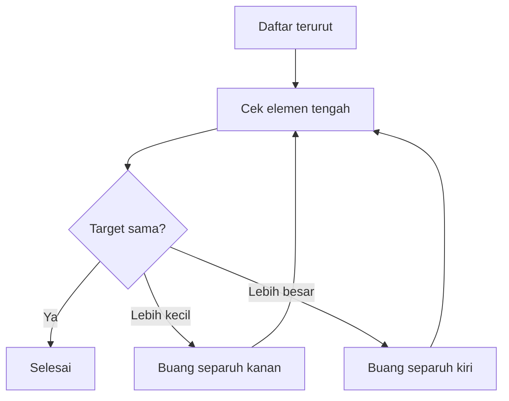
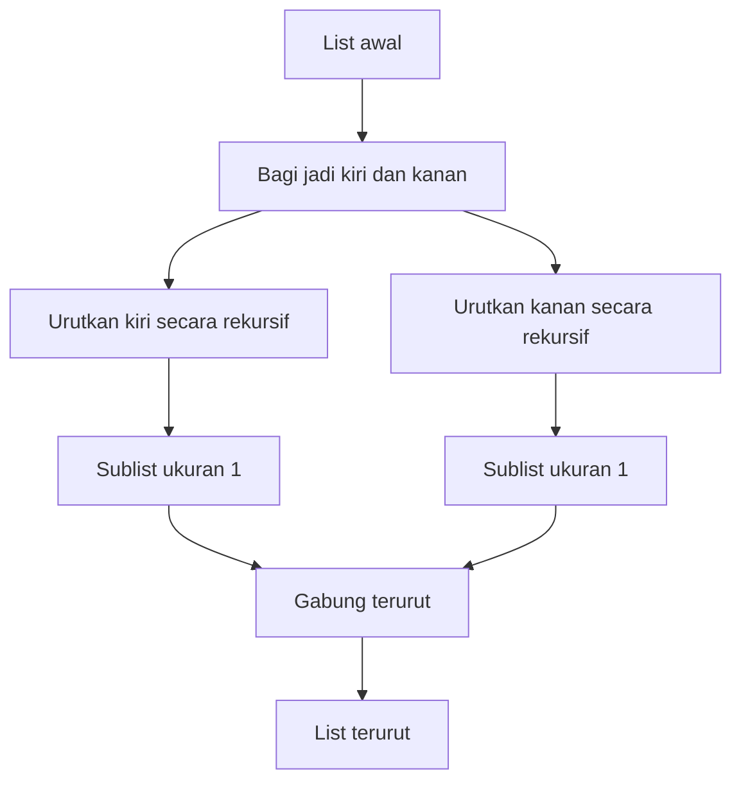

## 🚀 Pendahuluan: Mengapa Analisis Algoritma Penting untuk Dunia Bisnis?

Bagi banyak orang, kata **algorithm** atau *algoritma* terdengar seperti istilah teknis yang hanya relevan bagi programmer. Padahal dalam arti yang paling mendasar, algoritma hanyalah **serangkaian langkah yang dirancang untuk menyelesaikan suatu tugas**. Dalam kehidupan sehari-hari, kita sebenarnya terus memakai algoritma, hanya saja tidak selalu menyebutnya dengan nama itu. Rutinitas pagi, resep memasak, alur kerja administrasi, SOP operasional, sampai cara tim sales memproses prospek — semuanya adalah algoritma. ☕📋

Kuliah *CS50 for Business - Lecture 1: Analyzing Algorithms* menarik karena membawa pembahasan algoritma keluar dari ruang kelas pemrograman dan menempatkannya di konteks yang lebih luas: **bagaimana cara menilai efisiensi sebuah proses**. Bukan hanya “apakah proses ini benar?”, tetapi juga “apakah proses ini masuk akal ketika skala data membesar?”.

Dan di sinilah nilai bisnisnya sangat besar. Dalam perusahaan, sering kali bukan algoritma yang salah, tetapi algoritma yang dipakai terlalu boros untuk skala masalah yang dihadapi. Sesuatu yang bekerja baik untuk 100 data belum tentu layak untuk 1 juta data. Sesuatu yang tampak cepat di laptop developer belum tentu efisien saat dipakai ribuan pelanggan bersamaan di server produksi. 🏢

Karena itu, memahami analisis algoritma bukan berarti semua orang harus bisa menulis kode kompleks. Yang lebih penting adalah memahami pertanyaan-pertanyaan seperti ini:

- Seberapa banyak langkah yang dibutuhkan sebuah proses?
- Apa yang terjadi ketika ukuran data membesar?
- Apakah kita menukar waktu dengan memori?
- Apakah kita sedang memakai metode yang “cukup baik” atau justru metode yang buruk tapi belum terasa buruk karena skalanya masih kecil?

Artikel ini akan mengurai kuliah tersebut dengan bahasa Indonesia yang mendalam dan praktis. Fokusnya bukan sekadar mendefinisikan istilah, tetapi membangun cara berpikir yang relevan untuk bisnis, manajemen produk, pengambilan keputusan teknologi, dan komunikasi dengan tim teknis.

<Callout type="important" title="Inti besar dari kuliah ini">
Analisis algoritma mengajarkan bahwa solusi yang benar belum tentu solusi yang efisien. Dalam dunia bisnis dan teknologi, kemenangan sering kali bukan milik proses yang sekadar bekerja, tetapi milik proses yang tetap masuk akal ketika data, pelanggan, dan kompleksitas tumbuh besar. ⚡
</Callout>

---

## 🧠 1. Apa Itu Algoritma? Bukan Misteri, Melainkan Proses yang Jelas

Dalam kuliah ini, algoritma dijelaskan dengan cara yang sangat membumi: algoritma adalah **proses yang dirancang untuk menyelesaikan tugas tertentu**. Dalam istilah sehari-hari, algoritma bisa dibayangkan sebagai:

- resep,
- rutinitas,
- prosedur,
- langkah kerja,
- atau instruksi berurutan.

Misalnya, untuk membuat telur orak-arik (*scrambled eggs* / telur orak-arik), kita tidak bisa asal melempar telur ke wajan tanpa urutan. Kita harus:

1. pecahkan telur,
2. masukkan ke wadah,
3. beri bumbu,
4. panaskan wajan,
5. lalu masak.

Kalau urutannya salah, hasilnya rusak. Bisa jadi wajan masih dingin, atau kulit telur ikut masuk. Maka algoritma harus punya beberapa sifat penting:

- **jelas**,
- **terurut**,
- **tidak ambigu**,
- memiliki **input** dan **output**,
- dan terdiri dari **langkah-langkah terbatas**, walau bisa saja dieksekusi berulang.

Ini poin penting. Sebuah algoritma bisa saja punya pengulangan tanpa akhir secara praktik, tetapi tetap terdiri dari struktur langkah yang terbatas. Contohnya, algoritma menghitung naik 1, 2, 3, 4, dan seterusnya bisa terus berjalan, tetapi aturan langkahnya sederhana dan terbatas:

- tambah 1,
- ucapkan hasilnya,
- ulangi.

Jadi, yang terbatas bukan selalu durasi jalannya, melainkan **definisi prosedurnya**.

---

## 📏 2. Analisis Algoritma: Kita Tidak Hanya Peduli Benar atau Salah

Setelah memahami apa itu algoritma, kuliah ini bergerak ke pertanyaan yang lebih penting: **bagaimana cara menilai sebuah algoritma?** 📏

Dalam ilmu komputer, ada dua dimensi besar yang biasa dipakai:

1. **time** — waktu / jumlah langkah yang dibutuhkan,
2. **space** — ruang memori yang dibutuhkan.

Ini sangat relevan dalam dunia nyata. Ada algoritma yang sangat cepat, tetapi boros memori. Ada yang hemat memori, tetapi lambat. Kadang-kadang perusahaan harus memilih salah satunya tergantung konteks.

Misalnya:

- kalau server mahal dan memori terbatas, kita mungkin memilih pendekatan hemat ruang,
- kalau aplikasi harus real-time dan responsif, kita mungkin rela pakai memori lebih banyak untuk menghemat waktu proses.

Jadi sejak awal kuliah ini sudah mengajarkan sesuatu yang sangat bisnis-minded: **efisiensi selalu terkait trade-off** — *pertukaran kepentingan*.

---

## ⏱️ 3. Mengapa Kita Tidak Mengukur Algoritma dengan Detik Biasa?

Pertanyaan yang sangat penting muncul di sini: kalau kita bicara waktu, mengapa tidak langsung pakai detik, menit, atau jam? Bukankah itu lebih intuitif?

Jawabannya: karena komputer berbeda-beda. Laptop tahun 1990-an, server cloud modern, ponsel murah, dan workstation mahal akan mengeksekusi proses yang sama dengan kecepatan fisik berbeda. Maka kalau kita hanya mengukur “2 detik” atau “0,4 detik”, ukuran itu terlalu tergantung pada mesin tertentu. ⏱️

Karena itu, ilmu komputer lebih suka mengukur **jumlah langkah relatif terhadap ukuran data**. Fokusnya adalah:

- jika ukuran data membesar,
- bagaimana kecenderungan jumlah langkahnya?

Dengan begitu kita menilai bentuk pertumbuhannya, bukan durasi literal di satu mesin spesifik.

Dalam kuliah ini, ukuran data dilambangkan dengan huruf **N**. N berarti jumlah elemen atau ukuran masalah yang sedang kita hadapi. Begitu N membesar, kita bisa mulai membedakan algoritma yang sekadar tampak baik dari algoritma yang benar-benar skalabel.

---

## 📚 4. Best Case, Worst Case, dan Mengapa Kondisi Data Sangat Penting

Algoritma tidak selalu berjalan dengan jumlah langkah yang sama. Banyak algoritma sangat dipengaruhi oleh kondisi data awal. Karena itu, analisis algoritma sering membedakan:

- **best case** — kondisi terbaik,
- **worst case** — kondisi terburuk.

Kadang ada juga pembahasan *average case* — kondisi rata-rata — tetapi kuliah ini lebih menekankan yang terbaik dan terburuk. 📚

Mengapa ini penting? Karena dalam bisnis, data jarang ideal. Bisa saja data pelanggan rapi, tetapi bisa juga kacau. Bisa saja daftar produk sudah terurut, tetapi bisa juga acak. Bisa saja target pencarian ada di posisi awal, tetapi bisa juga tidak ada sama sekali.

Maka pertanyaan manajerial yang matang bukan hanya:

- “Dalam kondisi normal apakah cepat?”

Tetapi juga:

- “Dalam kondisi terburuk, apakah masih bisa diterima?”

Itulah pola pikir yang membedakan optimisme teknis dari desain sistem yang benar-benar andal.

---

## 🔍 5. Mengapa Kita Peduli pada Kecenderungan, Bukan Detail Kecil?

Kuliah ini memberikan contoh beberapa rumus yang pada awalnya tampak berbeda:

- \(N^3\)
- \(N^3 + N^2\)
- ekspresi lain yang rumit tetapi tetap didominasi oleh \(N^3\)

Untuk ukuran data kecil, hasil ketiganya bisa berbeda jauh. Tetapi saat N membesar sekali, semua perbedaan kecil itu menjadi tidak terlalu berarti. Yang paling menentukan adalah **term dominan** — suku pertumbuhan yang paling besar. 🔍

Inilah logika di balik mengapa analisis algoritma sering mengabaikan:

- konstanta,
- suku orde lebih rendah,
- detail kecil yang tidak dominan pada skala besar.

Bagi pebisnis, ini pelajaran yang sangat penting: jangan terlalu terpesona pada optimasi kecil jika struktur dasarnya memang buruk. Kalau fondasi proses Anda tumbuh terlalu cepat terhadap ukuran data, maka sekecil apa pun optimasi kosmetik tidak akan menyelamatkannya pada skala besar.

---

## 🧮 6. Big O dan Omega: Bahasa Ringkas untuk Membahas Batas Performa

Kuliah ini memperkenalkan dua simbol penting:

- **Big O** — *batas atas / upper bound* pada kondisi terburuk
- **Omega** — *batas bawah / lower bound* pada kondisi terbaik

Secara sederhana:

- **O(...)** dipakai untuk membicarakan seberapa buruk sebuah algoritma bisa berjalan,
- **Ω(...)** dipakai untuk membicarakan seberapa baik sebuah algoritma bisa berjalan.

Ini memang penyederhanaan dari formalismenya, tetapi cukup untuk fondasi awal. 🧮

Misalnya:

- jika suatu pencarian dalam kondisi terburuk harus memeriksa semua elemen, maka ia bisa disebut **O(N)**,
- jika dalam kondisi terbaik ia langsung ketemu di awal, maka ia bisa disebut **Ω(1)**.

Bahasa ini penting bukan untuk gaya-gayaan teknis, tetapi untuk komunikasi. Begitu tim produk, manajer, dan engineer punya bahasa bersama tentang performa, percakapan menjadi lebih jernih.

---

## 📈 7. Kelas-Kelas Runtime: Dari yang Sangat Baik sampai yang Mengerikan

Kuliah ini lalu merangkum beberapa kategori umum runtime, dari yang ringan sampai yang mengerikan. Ini penting untuk membangun intuisi. 📈

### O(1) — Constant Time / waktu konstan
Jumlah langkah tetap, tidak tergantung ukuran data.

Contoh:
- ambil elemen pertama dari daftar,
- jumlahkan dua angka,
- lakukan tindakan tetap yang tidak peduli besar data.

### O(log N) — Logarithmic Time / waktu logaritmik
Masalah dipotong menjadi setengah terus-menerus.

Contoh:
- binary search pada data yang sudah terurut.

### O(N) — Linear Time / waktu linear
Jumlah langkah bertumbuh sebanding dengan jumlah data.

Contoh:
- memeriksa elemen satu per satu.

### O(N log N) — Log-Linear Time
Lebih berat dari linear, tetapi jauh lebih baik daripada kuadratik untuk data besar.

Contoh:
- merge sort.

### O(N²) — Quadratic Time / waktu kuadratik
Biasanya muncul ketika untuk setiap elemen kita harus membandingkan banyak elemen lain.

Contoh:
- selection sort,
- bubble sort,
- insertion sort pada worst case.

### O(c^N) — Exponential Time / waktu eksponensial
Sangat cepat meledak ketika N bertambah.

### O(N!) — Factorial Time / waktu faktorial
Lebih mengerikan lagi. Hampir selalu tidak praktis untuk N besar.

### Unbounded / tak berbatas
Bisa saja tidak pernah selesai pada worst case.

Contoh ekstrem yang dibahas: **bogosort**.

```mermaid
flowchart TD
    A[O(1)] --> B[O(log N)]
    B --> C[O(N)]
    C --> D[O(N log N)]
    D --> E[O(N²)]
    E --> F[O(c^N)]
    F --> G[O(N!)]
    G --> H[Unbounded]
```

Pelajaran pentingnya: perbedaan kecil di kiri menjadi jurang besar ketika N besar. Itu sebabnya arsitektur proses jauh lebih penting daripada optimasi kecil-kecilan.

---

## 🔎 8. Searching: Masalah Sederhana yang Sebenarnya Sangat Fundamental

Setelah fondasi teori dibangun, kuliah ini masuk ke topik pertama: **searching** — *pencarian*. Mencari nilai tertentu dalam data adalah salah satu tugas paling dasar dalam komputasi dan bisnis. 🔎

Contohnya sangat nyata:

- mencari pelanggan di CRM,
- mencari SKU di daftar produk,
- mencari invoice,
- mencari transaksi,
- mencari nama dalam kontak,
- mencari error log tertentu.

Pertanyaannya sederhana, tetapi cara kita melakukannya menentukan efisiensi sistem secara keseluruhan.

Kuliah ini membahas dua metode dasar:

1. **linear search**
2. **binary search**

Keduanya benar. Tetapi syarat dan efisiensinya berbeda besar.

---

## 🪜 9. Linear Search: Sederhana, Universal, tapi Mahal pada Skala Besar

**Linear search** atau *pencarian linear* adalah pendekatan paling langsung. Kita periksa elemen satu per satu sampai:

- menemukan target, atau
- mencapai akhir daftar.

Ini mudah dipahami dan bisa dipakai pada daftar apa pun, bahkan kalau daftar itu acak. 🪜

Secara logika:

1. mulai dari elemen pertama,
2. cek apakah ini target,
3. jika ya, selesai,
4. jika tidak, lanjut ke elemen berikutnya,
5. ulangi sampai habis.

Keunggulannya:
- sangat sederhana,
- tidak butuh data terurut,
- tidak perlu persiapan khusus.

Kelemahannya:
- pada worst case harus melihat semua elemen.

Kalau target ada di posisi terakhir atau tidak ada sama sekali, kita harus memeriksa seluruh daftar. Maka:

- **worst case** = **O(N)**
- **best case** = **Ω(1)**

Ini masuk akal. Kalau target kebetulan ada di awal, cukup satu langkah. Tetapi kalau tidak, biaya bisa naik proporsional dengan ukuran data.

---

## 🏠 10. Indeks Dimulai dari Nol: Kenapa dalam Komputer Tidak Dimulai dari 1?

Kuliah ini juga menyinggung hal yang sering membingungkan pemula: mengapa elemen daftar biasanya dinomori mulai dari **0**, bukan 1? 🏠

Dalam komputer, posisi elemen biasanya disebut **index** — *indeks / posisi elemen*. Jadi daftar 15 elemen biasanya punya indeks:

- 0 sampai 14

Bukan 1 sampai 15.

Secara praktis, ini adalah konvensi yang sangat umum dalam ilmu komputer dan banyak bahasa pemrograman. Bagi pembaca non-teknis, yang penting dipahami adalah ini bukan “kesalahan hitung”, melainkan kebiasaan representasi posisi.

Dari sudut pandang bisnis, ini penting karena banyak bug kecil, query data, atau integrasi sistem bisa kacau hanya karena miskomunikasi soal indeks dan jumlah elemen.

---

## ✅ 11. “Pencarian Gagal” Tidak Berarti Algoritmanya Salah

Ini poin yang sangat penting dari kuliah tersebut. Ketika linear search tidak menemukan nilai yang dicari, itu **bukan berarti algoritmanya salah**. Itu hanya berarti hasil pencariannya adalah “nilai tersebut tidak ada dalam data”. ✅

Ini tampak sederhana, tetapi secara manajerial sangat penting. Dalam banyak konteks bisnis, hasil negatif bukanlah kegagalan proses. Contoh:

- pencarian pelanggan tidak menemukan duplikasi,
- pengecekan fraud tidak menemukan anomali,
- validasi sistem tidak menemukan pelanggaran,
- audit tidak menemukan error tertentu.

Hasil “tidak ditemukan” bisa jadi justru output yang benar. Jadi kita harus membedakan:

- **unsuccessful search** — target tidak ditemukan,
- **incorrect algorithm** — algoritma salah.

Kedua hal itu tidak sama.

---

## ⚡ 12. Binary Search: Cepat, Elegan, tapi Butuh Data yang Sudah Terurut

Kalau linear search universal tetapi lambat, maka **binary search** atau *pencarian biner* adalah kebalikannya: jauh lebih efisien, tetapi hanya berlaku jika data sudah **sorted** — *terurut*. ⚡

Ide dasarnya sederhana:

1. lihat elemen tengah,
2. jika itu target, selesai,
3. jika target lebih kecil, buang separuh kanan,
4. jika target lebih besar, buang separuh kiri,
5. ulangi pada bagian yang tersisa.

Ini seperti analogi buku telepon atau kamus: kita tidak membuka dari halaman pertama lalu membalik satu-satu. Kita buka kira-kira di tengah, lalu putuskan targetnya di kiri atau kanan.

Karena setiap langkah membuang setengah ruang pencarian, jumlah langkahnya tumbuh sangat lambat. Maka:

- **worst case** = **O(log N)**
- **best case** = **Ω(1)**

Itulah alasan binary search sangat menarik. Ketika data besar, memotong separuh masalah berulang kali jauh lebih kuat daripada memeriksa satu per satu.



---

## 📦 13. Kenapa Binary Search Tidak Bisa Dipakai Sembarangan?

Keindahan binary search datang dengan syarat yang sangat keras: data harus terurut. Kalau tidak, keputusan membuang separuh data menjadi tidak sah. 📦

Misalnya, kalau daftar acak dan kita melihat elemen tengah bernilai 15, kita tidak bisa menyimpulkan bahwa semua angka lebih kecil ada di kiri dan semua angka lebih besar ada di kanan. Maka separuh data tidak boleh dibuang.

Ini punya pelajaran bisnis yang sangat menarik: **efisiensi sering membutuhkan prasyarat**.

Banyak manajer ingin “algoritma cepat”, tetapi lupa bahwa kecepatan itu kadang hanya mungkin jika:

- data rapi,
- struktur database benar,
- indeks tersedia,
- kategori konsisten,
- atau proses input dijaga kualitasnya.

Jadi kadang-kadang, untuk menikmati pencarian cepat, organisasi harus berinvestasi lebih dulu pada kerapian datanya.

---

## 💡 14. Trade-off Besar: Mencari Cepat Kadang Butuh Persiapan Mahal

Dari sini muncul wawasan penting: binary search memang lebih cepat daripada linear search **saat mencari**, tetapi ada pertanyaan lanjutan:

> kalau data belum terurut, biaya mengurutkannya bagaimana?

Nah, inilah yang membuat dunia nyata lebih menarik daripada teori murni. Kalau Anda hanya sekali mencari di daftar acak kecil, mungkin linear search lebih hemat. Tetapi kalau Anda akan mencari berkali-kali di dataset besar, mungkin layak mengurutkan sekali lalu menikmati pencarian yang jauh lebih cepat sesudahnya. 💡

Jadi keputusan algoritmik tidak pernah lepas dari konteks penggunaan.

---

## 🗂️ 15. Sorting: Mengapa Mengurutkan Data Adalah Investasi, Bukan Sekadar Rapikan Tampilan

Masuk ke topik kedua: **sorting** atau *pengurutan*. Mengurutkan data bukan hanya soal estetika atau kenyamanan visual. Dalam banyak sistem, sorting adalah investasi struktural agar operasi lain menjadi lebih efisien. 🗂️

Kalau data terurut:

- pencarian bisa lebih cepat,
- analisis lebih mudah,
- duplikasi lebih gampang terlihat,
- anomali lebih gampang terdeteksi,
- dan integrasi sistem lebih rapi.

Kuliah ini membahas lima pendekatan sorting:

1. selection sort,
2. bubble sort,
3. insertion sort,
4. merge sort,
5. bogosort.

Masing-masing menyelesaikan masalah yang sama, tetapi lewat logika yang berbeda. Ini poin yang sangat penting: **ada banyak cara yang benar untuk mencapai hasil sama, tetapi biayanya bisa sangat berbeda**.

---

## 🎯 16. Selection Sort: Mencari yang Terkecil, Menaruhnya di Depan, Ulangi

**Selection sort** atau *sortir seleksi* bekerja dengan pola berikut:

1. cari elemen terkecil dari bagian yang belum terurut,
2. tukar ke posisi paling depan dari bagian itu,
3. anggap posisi tersebut sudah beres,
4. ulangi untuk sisa daftar.

Logikanya sangat intuitif. Setiap putaran menghasilkan satu elemen yang dipastikan benar tempatnya. 🎯

Namun masalahnya: untuk setiap posisi, kita harus menelusuri sisa daftar mencari yang terkecil. Artinya kita berulang kali melakukan semacam pencarian linear atas bagian yang tersisa.

Akibatnya:

- **worst case** = **O(N²)**
- **best case** = **Ω(N²)**

Mengapa best case-nya juga tetap buruk? Karena bahkan jika daftar ternyata sudah rapi, selection sort tetap tidak punya mekanisme untuk “menyadari” bahwa semuanya sudah beres. Ia tetap harus memeriksa untuk memastikan.

Jadi selection sort benar, sederhana, tetapi tidak cerdas dalam memanfaatkan kondisi baik data.

---

## 🫧 17. Bubble Sort: Yang Besar Didorong ke Ujung, Satu Putaran Demi Satu Putaran

**Bubble sort** atau *sortir gelembung* bekerja dengan cara membandingkan pasangan elemen yang berdekatan. Jika dua elemen itu salah urut, keduanya ditukar. Akibatnya, elemen yang lebih besar “mengambang” atau *bubble up* ke arah kanan / akhir daftar. 🫧

Setelah satu putaran penuh, elemen terbesar akan sampai di posisi akhirnya. Lalu proses diulang untuk sisa bagian yang belum pasti terurut.

Menariknya, kuliah ini menunjukkan satu optimasi penting: kita menghitung berapa kali swap terjadi. Kalau dalam satu putaran tidak ada swap sama sekali, berarti daftar sudah rapi dan kita bisa berhenti lebih awal.

Akibatnya:

- **worst case** = **O(N²)**
- **best case** = **Ω(N)**

Ini lebih baik daripada selection sort dalam kondisi terbaik, karena bubble sort bisa “menyadari” ketika data sudah rapi.

---

## 🧩 18. Insertion Sort: Masukkan Elemen Baru ke Tempat yang Benar

**Insertion sort** atau *sortir sisip* bekerja dengan cara membangun bagian terurut sedikit demi sedikit. Kita anggap elemen pertama sudah terurut. Lalu kita ambil elemen berikutnya dan menyisipkannya ke posisi yang tepat dalam bagian yang sudah terurut tadi. Ulangi terus. 🧩

Ini mirip cara manusia menyusun kartu di tangan:

- lihat kartu baru,
- cari slot yang tepat,
- geser seperlunya,
- sisipkan.

Secara intuitif, insertion sort sering terasa lebih “manusiawi” daripada bubble sort. Namun dari sisi analisis:

- **worst case** = **O(N²)**
- **best case** = **Ω(N)**

Kalau daftar sudah hampir terurut, insertion sort bisa sangat masuk akal. Tetapi kalau urutannya terbalik, setiap elemen baru harus mendorong banyak elemen lain, dan biaya jadi kuadratik.

---

## 🔄 19. Bubble Sort vs Insertion Sort: Sama di Notasi, Berbeda di Cara Berpikir

Salah satu pelajaran terbaik dari kuliah ini adalah bahwa dua algoritma bisa punya klasifikasi runtime yang sama, tetapi perilaku internalnya berbeda besar. Bubble sort dan insertion sort sama-sama:

- worst case: **O(N²)**
- best case: **Ω(N)**

Tetapi cara kerjanya tidak sama.

- Bubble sort mendorong elemen besar ke kanan lewat pertukaran berdekatan.
- Insertion sort mengambil satu elemen dan menyisipkannya ke posisi yang tepat dalam bagian yang sudah terurut.

Ini analog dengan bisnis: dua strategi bisa punya biaya agregat yang mirip, tetapi profil operasionalnya berbeda. Satu mungkin lebih cocok untuk data yang hampir rapi, satu lagi lebih cocok untuk konteks lain. Jadi notasi runtime penting, tetapi tidak cukup. Kita juga perlu memahami **mekanisme di baliknya**.

---

## 🌀 20. Iteration vs Recursion: Dua Cara Mengulang, Dua Gaya Berpikir

Kuliah ini lalu memperkenalkan pembedaan yang sangat penting antara **iteration** dan **recursion**. 🌀

### Iteration — iterasi / pengulangan biasa
Kita mengulang langkah yang sama melalui loop:
- mulai,
- cek kondisi,
- kerjakan,
- lanjut,
- ulangi.

### Recursion — rekursi / pemanggilan diri sendiri
Kita menyelesaikan masalah dengan memecahnya menjadi versi yang lebih kecil dari masalah yang sama, lalu membiarkan proses “memanggil dirinya sendiri” sampai mencapai kasus paling sederhana.

Ini bukan hanya teknik pemrograman. Ini dua gaya berpikir berbeda:

- iterasi cocok ketika kita ingin maju langkah demi langkah,
- rekursi cocok ketika masalah bisa dipecah menjadi bagian-bagian serupa yang lebih kecil.

---

## ☎️ 21. Rekursi Dijelaskan lewat Faktorial: Permainan Telepon ke Versi yang Lebih Kecil

Kuliah ini memakai contoh **factorial** atau *faktorial* untuk menjelaskan rekursi.

Misalnya:

\[
4! = 4 \times 3 \times 2 \times 1 = 24
\]

Secara iteratif, kita bisa menghitungnya dengan loop. Tetapi secara rekursif, kita bisa berpikir begini:

\[
4! = 4 \times 3!
\]

lalu:

\[
3! = 3 \times 2!
\]

lalu:

\[
2! = 2 \times 1!
\]

lalu:

\[
1! = 1
\]

Setelah kasus paling sederhana diketahui, jawaban mengalir balik ke atas. Kuliah ini menganalogikannya seperti permainan telepon: kita “menitipkan” pertanyaan ke versi masalah yang lebih kecil sampai ada yang bisa menjawab pasti. ☎️

Pelajaran pentingnya: rekursi bukan sihir. Ia hanya strategi untuk mengurangi masalah sampai mencapai **base case** — *kasus dasar* — yang jelas solusinya.

---

## 🧱 22. Merge Sort: Pecah Dulu, Urutkan Potongan Kecil, Lalu Gabungkan Lagi

Sekarang kita masuk ke algoritma paling menarik dalam kuliah ini: **merge sort**. Ini adalah contoh klasik algoritma yang secara konsep mungkin terasa lebih rumit, tetapi jauh lebih elegan pada skala besar. 🧱

Intinya sederhana:

1. bagi daftar menjadi dua,
2. urutkan sisi kiri,
3. urutkan sisi kanan,
4. gabungkan keduanya secara terurut.

Masalahnya: “urutkan sisi kiri” dan “urutkan sisi kanan” sendiri masih masalah. Maka merge sort menyelesaikannya dengan rekursi. Kita pecah lagi, pecah lagi, pecah lagi, sampai setiap sub-daftar tinggal satu elemen. Daftar berukuran satu otomatis terurut. Setelah itu kita gabungkan kembali sambil menjaga urutan.

Inilah mengapa merge sort terasa seperti:

- membongkar masalah menjadi bagian kecil,
- lalu menyusun ulang secara sistematis.



---

## 🧠 23. Mengapa Merge Sort Lebih Cepat pada Skala Besar?

Kuliah ini menegaskan bahwa merge sort punya:

- **worst case** = **O(N log N)**
- **best case** = **Ω(N log N)**

Ini menarik. Berbeda dengan bubble sort atau insertion sort, merge sort tidak mendapat bonus besar saat data sudah terurut. Ia tetap harus membelah dan menggabungkan. Jadi best case-nya tidak sebaik insertion sort yang bisa mendekati linear pada data yang sudah hampir rapi.

Namun, pada skala besar, **N log N** biasanya jauh lebih baik daripada **N²**. Inilah alasan merge sort sering jauh lebih menarik untuk dataset besar. 🧠

Intuisinya seperti ini:

- daftar dibagi berulang kali → itu memberi faktor **log N**,
- elemen-elemen tetap harus digabungkan → itu memberi faktor **N**,
- totalnya menjadi **N log N**.

---

## 💽 24. Merge Sort Menang dengan Harga: Ia Butuh Memori Tambahan

Tidak ada makan siang gratis dalam algoritma. Merge sort lebih cepat dalam banyak situasi, tetapi kuliah ini menekankan bahwa ia membayar kemenangan itu dengan **space** — *ruang memori tambahan*. 💽

Berbeda dengan selection sort, bubble sort, dan insertion sort yang banyak bekerja “di tempat” (*in place* / langsung di array asli), merge sort perlu ruang tambahan untuk menyimpan pecahan-pecahan daftar saat proses penggabungan.

Maka lahirlah trade-off klasik:

- **lebih cepat, tapi lebih boros memori**
- **lebih hemat memori, tapi bisa lebih lambat**

Dari perspektif bisnis, ini sangat realistis. Sering kali organisasi harus memilih:

- apakah ingin mempercepat proses dengan menambah infrastruktur,
- atau ingin hemat resource dengan menerima proses yang lebih lambat.

Jadi algoritma bukan hanya isu engineering, tetapi juga isu alokasi anggaran.

---

## 🎲 25. Bogosort: Contoh Sempurna tentang Apa yang Terjadi Jika Algoritma Tidak Serius

Kuliah ini menutup sesi sorting dengan contoh satir tetapi sangat berguna: **bogosort**. Nama ini singkatan dari *bogus sort* — *sortir abal-abal / palsu / konyol*. 🎲

Cara kerjanya:

1. acak daftar,
2. cek apakah sudah terurut,
3. kalau belum, acak lagi,
4. ulangi terus.

Secara teoretis, kalau diberi waktu tak terbatas, ia akhirnya bisa menghasilkan urutan yang benar. Tetapi secara praktis ini algoritma yang sangat buruk.

Yang menarik, bogosort menunjukkan bahwa algoritma yang kelihatan sederhana bisa menjadi monster jika strukturnya buruk. Bahkan runtime worst case-nya dianggap **unbounded** — *tak berbatas*, karena secara teori bisa terus gagal dan terus mengacak tanpa akhir.

Ini memberi pelajaran yang dalam untuk bisnis digital:

- proses yang tampak simpel belum tentu waras,
- “coba-coba terus sampai berhasil” bukan strategi sistem yang baik,
- dan randomness tanpa kontrol bisa sangat mahal.

---

## 🏭 26. Apa Pelajaran Bisnis dari Semua Ini?

Kalau seluruh kuliah ini ditarik ke dunia bisnis, ada beberapa pelajaran yang sangat kuat. 🏭

### Pertama, skala mengubah segalanya
Solusi yang baik untuk 100 pelanggan bisa menjadi bencana untuk 1 juta pelanggan.

### Kedua, struktur data menentukan efisiensi
Kalau data tidak rapi, algoritma cepat mungkin tidak bisa dipakai.

### Ketiga, trade-off itu nyata
Lebih cepat kadang berarti lebih boros memori. Lebih hemat resource kadang berarti lebih lambat.

### Keempat, hasil yang sama tidak berarti biaya yang sama
Lima sorting algorithm bisa sama-sama mengurutkan data, tetapi biaya waktunya sangat berbeda.

### Kelima, keputusan teknis adalah keputusan bisnis juga
Kalau satu pendekatan butuh lebih banyak server tetapi menghemat banyak waktu pelanggan, itu bukan semata isu coding. Itu isu strategi.

---

## 🗣️ 27. Mengapa Manajer dan Founder Perlu Tahu Bahasa Ini?

Di akhir kuliah, ditegaskan bahwa kebanyakan orang mungkin tidak akan menulis sendiri algoritma-algoritma ini. Tetapi mereka bisa saja menjadi **decision maker** — *pengambil keputusan* — yang harus menentukan:

- prioritas engineering,
- kapasitas server,
- biaya infrastruktur,
- trade-off performa,
- dan arah optimasi produk.

Karena itu, memahami kosa kata seperti:

- linear,
- logarithmic,
- quadratic,
- sorting,
- searching,
- recursion,
- space vs time trade-off,

memberi nilai besar dalam percakapan dengan tim teknis. 🗣️

Tanpa bahasa itu, keputusan bisnis tentang teknologi sering jatuh ke dua ekstrem:

1. terlalu menyerahkan semua ke engineer tanpa pemahaman, atau  
2. memaksa keputusan yang tampak hemat jangka pendek tetapi mahal jangka panjang.

---

## 📌 28. Kesimpulan: Algoritma adalah Cara Berpikir tentang Efisiensi, Bukan Sekadar Kode

Kuliah *Analyzing Algorithms* sebenarnya mengajarkan sesuatu yang jauh lebih besar daripada sekadar Big O. Ia mengajarkan **cara berpikir tentang efisiensi**. 📌

Kita belajar bahwa:

- algoritma adalah urutan langkah untuk mencapai tujuan,
- analisis algoritma bertanya bukan hanya “benar atau salah”, tetapi “seberapa efisien saat data tumbuh?”,
- linear search sederhana tetapi mahal pada skala besar,
- binary search cepat tetapi butuh data terurut,
- sorting bisa dilakukan dengan banyak cara,
- selection sort, bubble sort, insertion sort, merge sort, dan bogosort menunjukkan bahwa hasil sama bisa dicapai lewat biaya yang sangat berbeda,
- recursion membuka cara berpikir baru: pecah masalah menjadi versi kecil dari dirinya sendiri,
- dan trade-off waktu vs memori adalah realitas yang tidak bisa dihindari.

Bagi dunia bisnis, inti terbesarnya adalah ini:

> **ketika perusahaan bertumbuh, efisiensi proses bukan lagi bonus — ia menjadi penentu apakah sistem tetap layak atau mulai runtuh.**

Maka memahami algoritma bukan berarti semua orang harus menjadi software engineer. Tetapi siapa pun yang membuat keputusan tentang sistem, data, produk, dan operasi digital sebaiknya memahami minimal prinsip-prinsip dasarnya. Karena di balik layar setiap aplikasi yang tampak mulus, selalu ada pertanyaan klasik yang menentukan nasibnya:

- langkah-langkahnya apa,
- berapa banyak langkah itu,
- dan apa yang terjadi ketika data menjadi sangat besar?

Kalau tiga pertanyaan itu bisa dijawab dengan baik, organisasi tidak hanya lebih teknis. Ia juga lebih matang secara strategis. ✨

---

## 🔖 Catatan Penutup

Artikel ini diolah dari transkrip kuliah *CS50 for Business - Lecture 1 - Analyzing Algorithms* dan disusun ulang agar relevan untuk pembaca Indonesia, khususnya pebisnis, founder, manajer produk, dan profesional non-teknis yang ingin memahami cara menilai efisiensi proses digital dengan lebih cerdas.

## 📚 Sumber Dasar

- Transkrip kuliah: *CS50 for Business - Lecture 1 - Analyzing Algorithms*
- Sumber video: YouTube (`https://www.youtube.com/watch?v=fFzWME39Mag`)
