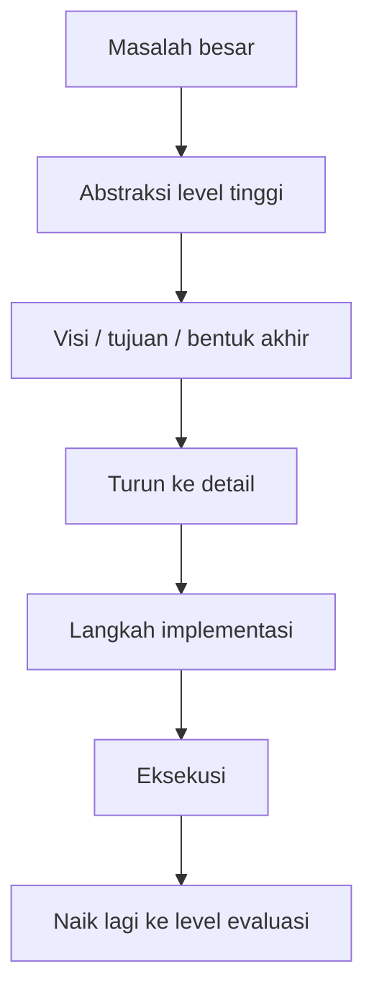
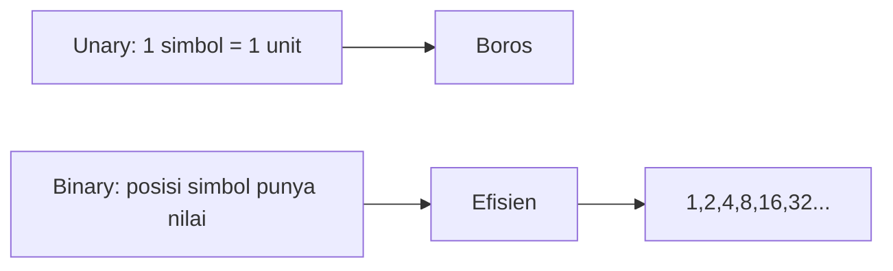
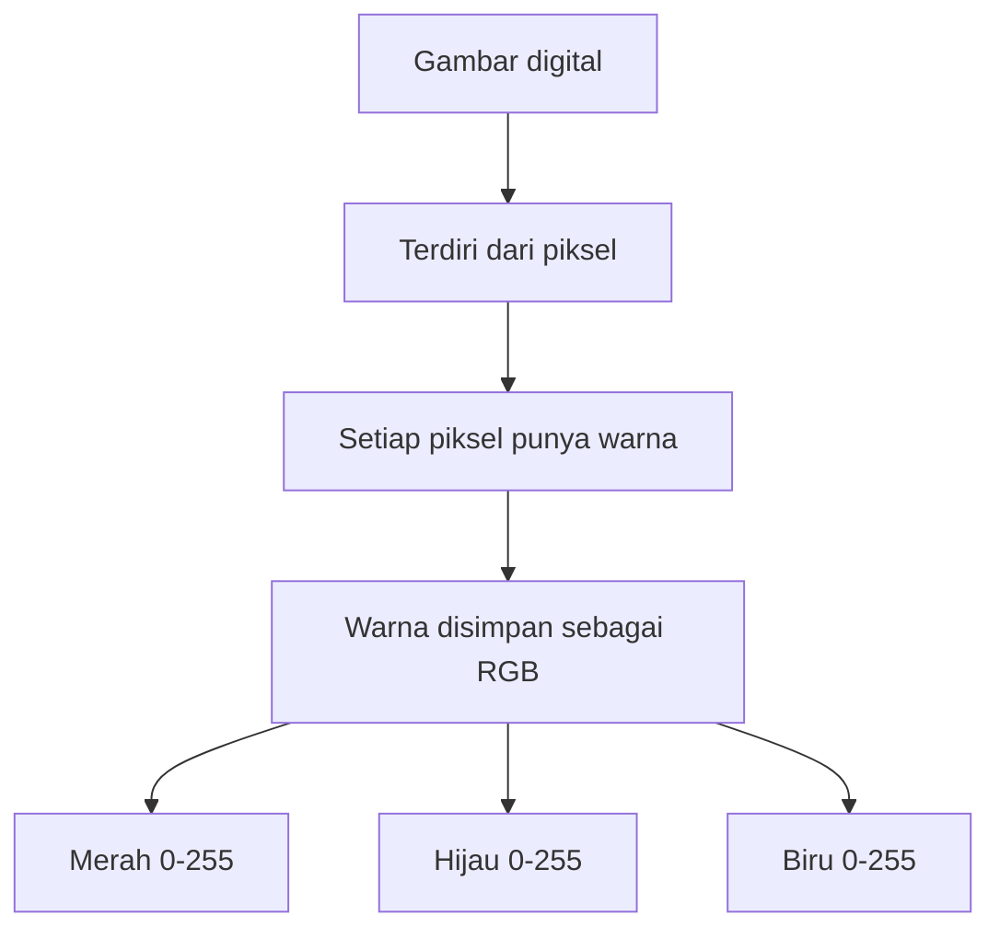
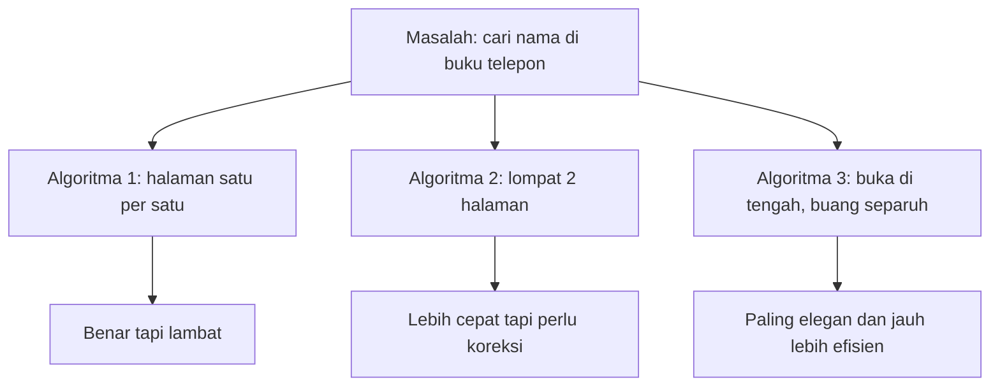

## 🎯 Pendahuluan: Ilmu Komputer Bukan Sekadar Ngoding, tetapi Cara Berpikir

Banyak orang mengira **computer science** atau *ilmu komputer* itu identik dengan ngoding, aplikasi, bahasa pemrograman, atau layar terminal yang penuh teks misterius. Kesan itu tidak sepenuhnya salah, tetapi terlalu sempit. Inti ilmu komputer justru jauh lebih mendasar: **bagaimana informasi direpresentasikan, diproses, dan diubah menjadi keputusan atau solusi**. 🧠

Dan justru di situlah kuliah pembuka *CS50 for Business* ini sangat menarik. Ia tidak dimulai dari sintaks bahasa pemrograman, tidak dimulai dari cara membuat aplikasi, dan tidak juga memaksa pembaca langsung masuk ke dunia teknis yang menakutkan. Ia memulai dari pertanyaan yang lebih fundamental dan lebih relevan untuk dunia nyata:

- bagaimana komputer membaca informasi,
- bagaimana manusia seharusnya menafsirkan informasi itu,
- dan bagaimana cara berpikir komputasional membantu kita membuat keputusan yang lebih baik dalam bisnis, hukum, kedokteran, dan pekerjaan profesional lainnya.

Ini penting, terutama di zaman sekarang. Kita hidup dalam dunia yang teknologinya makin kompleks, tetapi para pengambil keputusan tidak selalu programmer. Seorang CEO, pengacara, dokter, manajer produk, analis, konsultan, bahkan penulis pun tidak harus menjadi software engineer untuk bisa bekerja cerdas dengan teknologi. Tetapi mereka **harus memahami prinsip-prinsip dasarnya**, agar tidak menjadi sekadar pengguna pasif dari sistem yang tidak mereka mengerti. 💡

Maka artikel ini akan membedah isi kuliah tersebut dengan bahasa Indonesia yang runtut, dalam, dan praktis. Fokusnya bukan pada hafalan istilah, tetapi pada *mental model* — **kerangka berpikir** — yang bisa membantu Mas Hendra atau pembaca BangunAI Blog memahami teknologi secara lebih jernih.

<Callout type="important" title="Tesis utama artikel ini">
Ilmu komputer yang paling berguna untuk dunia nyata bukanlah sekadar kemampuan menulis kode, melainkan kemampuan untuk memahami bagaimana informasi bekerja, bagaimana masalah dipecah, bagaimana sistem dibuat lebih presisi, dan bagaimana keputusan teknologi seharusnya diambil dengan logika yang lebih baik.
</Callout>

---

## 🌍 1. Mengapa Profesional Non-Teknis Perlu Memahami Ilmu Komputer?

David Malan membuka kuliah ini dengan sebuah posisi yang sangat penting: kursus ini bukan hanya untuk ilmuwan komputer. Ia untuk orang bisnis, hukum, kedokteran, dan siapa pun yang hidup di dunia yang makin ditenagai teknologi. Itu poin yang sangat besar. Karena selama ini ada kesalahpahaman seolah-olah teknologi adalah wilayah eksklusif para engineer, sementara para profesional lain cukup menjadi pengguna. 📱

Padahal kenyataannya tidak sesederhana itu. Dalam dunia bisnis misalnya, keputusan penting sering justru dibuat oleh orang yang tidak menulis kode:

- apakah sistem ini aman?
- apakah vendor ini masuk akal?
- apakah AI yang ditawarkan realistis atau cuma marketing?
- apakah sebuah bug itu remeh atau gejala arsitektur yang buruk?
- apakah sebuah otomatisasi benar-benar menghemat biaya atau hanya memindahkan masalah?

Kalau seorang pemimpin tidak memahami dasar-dasar cara komputer merepresentasikan dan memproses informasi, ia akan mudah terjebak pada dua kesalahan:

1. **terlalu percaya pada jargon teknis**, atau  
2. **terlalu takut pada teknologi sehingga semua keputusan diserahkan bulat-bulat ke pihak lain**.

Keduanya berbahaya. Maka yang dibutuhkan bukan semua orang harus jadi programmer, tetapi semua orang perlu punya **literasi komputasional** — *kemampuan memahami logika dasar sistem digital*.

---

## 🧱 2. Ilmu Komputer Adalah Tentang Informasi

Pernyataan paling penting di awal kuliah ini sangat sederhana: **computer science is about information**. Ilmu komputer pada dasarnya adalah studi tentang informasi. Bagaimana informasi itu:

- direpresentasikan,
- diproses,
- disimpan,
- ditransmisikan,
- dan diubah menjadi output yang berguna.

Ini adalah penyederhanaan yang sangat elegan. Karena begitu kita menerima kerangka ini, komputer tidak lagi terlihat seperti benda ajaib. Ia mulai terlihat sebagai mesin yang bekerja pada simbol-simbol informasi. 🔢

Dengan kata lain, komputer bukan “cerdas” dalam arti manusiawi. Ia hanya sangat disiplin dan sangat cepat dalam memproses representasi informasi yang sudah didefinisikan secara tepat.

Di sinilah pelajaran penting pertama untuk dunia bisnis: **kalau input Anda kabur, sistem akan menghasilkan output yang kabur juga**. Banyak masalah digital bukan karena teknologi gagal, tetapi karena manusia memberi definisi yang buruk, spesifikasi yang ambigu, atau ekspektasi yang tidak jelas.

---

## 🪜 3. Abstraksi: Keterampilan Paling Penting yang Jarang Disadari

Salah satu ide utama dari kuliah ini adalah **abstraction** — *abstraksi*. Ini mungkin konsep paling penting dalam ilmu komputer dan juga paling berguna dalam dunia manajemen, strategi, dan pemecahan masalah. 🧩

Abstraksi berarti kemampuan untuk berpikir pada level yang tepat. Kadang kita perlu berbicara di level tinggi, gambaran besar. Kadang kita perlu turun ke detail teknis. Tantangannya adalah tahu **kapan** harus berada di level mana.

Contoh yang dipakai dalam kuliah sangat bagus. Dosen meminta peserta menggambar bentuk-bentuk tertentu dengan instruksi sederhana:

- gambar lingkaran,
- di bawahnya persegi,
- lalu segitiga.

Masalahnya, instruksi tingkat tinggi seperti itu penuh ambiguitas. “Di bawah” itu seberapa jauh? Menempel atau tidak? Ujung segitiga di atas atau di bawah? Posisi di kertas mulai dari mana?

Lalu pada eksperimen berikutnya, instruksi diberikan sangat detail, sangat rendah levelnya:

- letakkan pensil di bagian tertentu,
- tarik garis diagonal ke barat daya,
- lalu garis lurus ke selatan,
- dan seterusnya.

Secara teknis, itu lebih presisi. Tetapi menjadi sangat melelahkan dan membuat kita kehilangan gambaran besar. Di akhir baru kita sadar: “oh, ternyata saya diminta menggambar kubus.”

Itulah abstraksi. Di level tinggi, kita cepat paham maksudnya tetapi rawan salah tafsir. Di level rendah, kita presisi tetapi mudah tenggelam di detail. Profesional yang hebat bukan yang selalu bicara tinggi atau selalu bicara teknis, melainkan yang bisa **naik turun tangga abstraksi** dengan tepat. 🪜

---

## ✍️ 4. Pelajaran Besar dari Kubus: Ambiguitas adalah Musuh Sistem

Latihan menggambar kubus dalam kuliah ini sebenarnya sangat filosofis. Ia menunjukkan sesuatu yang sangat sering terjadi dalam organisasi modern: orang merasa sudah memberi instruksi yang jelas, padahal belum. 📐

Dalam bisnis, ini terjadi terus-menerus:

- “Bikin dashboard yang user-friendly.”
- “Tolong sistem ini dibuat lebih cepat.”
- “Tolong tambahkan AI di produk kita.”
- “Buat aplikasinya intuitif.”

Semua kalimat itu terdengar masuk akal. Tetapi untuk komputer, engineer, atau tim produk, kalimat itu masih terlalu abstrak. Apa itu *user-friendly*? Cepat dalam ukuran apa? AI untuk apa? Intuitif bagi siapa?

Kuliah ini mengajarkan bahwa instruksi yang baik harus menyeimbangkan:

- **kejelasan tujuan**, dan
- **ketepatan langkah**.

Kalau hanya tujuan, tim bingung menerjemahkan. Kalau hanya langkah detail tanpa visi, tim bekerja seperti robot tanpa memahami apa yang sebenarnya dibangun. Maka manajemen produk yang baik, brief kerja yang baik, bahkan komunikasi antar-tim yang baik sebenarnya adalah praktik abstraksi yang sehat.

---

## 5. Input → Process → Output: Model Mental yang Bisa Dipakai untuk Hampir Semua Hal 🔄

Kuliah ini kemudian menawarkan model yang sangat sederhana tetapi sangat kuat:

**Input → Process → Output**

Ini adalah salah satu model mental terbaik dalam ilmu komputer, dan menurut saya juga salah satu model mental terbaik untuk berpikir tentang bisnis. Setiap sistem pada dasarnya bisa dilihat seperti ini:

- ada **input** — masukan,
- ada **process** — proses / transformasi,
- ada **output** — hasil.

Contoh sederhananya:

- input: data pelanggan,
- process: analisis perilaku,
- output: rekomendasi produk.

Atau:

- input: keluhan pengguna,
- process: klasifikasi dan prioritisasi,
- output: tiket perbaikan.

Atau bahkan dalam diri manusia:

- input: informasi pasar,
- process: analisis dan pertimbangan,
- output: keputusan bisnis.

Keunggulan model ini adalah ia memaksa kita bertanya:

- apakah input kita benar?
- apakah prosesnya efisien?
- apakah output yang dihasilkan sesuai tujuan?

Banyak organisasi terlalu cepat menyalahkan output, padahal masalahnya ada di input atau proses. Jadi model ini bukan hanya teknis. Ini alat diagnosis yang sangat kuat. 🛠️

---

## 🔢 6. Mengapa Komputer “Hanya” Mengerti 0 dan 1?

Setelah membangun fondasi berpikir, kuliah ini masuk ke pertanyaan klasik: kenapa komputer identik dengan **binary** atau *biner* — 0 dan 1? 🔌

Jawabannya sebenarnya sangat fisik, bukan magis. Komputer bekerja dengan listrik. Maka cara paling sederhana untuk merepresentasikan informasi adalah:

- **tidak ada arus / off** = 0
- **ada arus / on** = 1

Itulah sebabnya biner sangat masuk akal. Bukan karena manusia cinta angka 0 dan 1, tetapi karena dunia elektronik suka pada kondisi yang jelas: hidup atau mati, on atau off, ada sinyal atau tidak ada sinyal.

Kuliah ini menggunakan analogi lampu:

- lampu mati mewakili 0,
- lampu hidup mewakili 1.

Kalau kita punya beberapa lampu, kita bisa menyusun pola 0 dan 1 untuk mewakili angka. Dari sini peserta diajak memahami bahwa komputer pada dasarnya menyimpan pola-pola keadaan listrik.

Ini penting untuk profesional non-teknis karena ia membongkar ilusi. File, foto, video, spreadsheet, chat, musik — semuanya pada level paling dasar hanyalah **pola 0 dan 1** yang ditafsirkan dengan aturan tertentu.

---

## 7. Dari Unary ke Binary: Efisiensi Itu Segalanya 📚

Kuliah ini juga menjelaskan perbedaan antara **unary** dan **binary**.

### Unary
Unary itu seperti menghitung dengan satu jenis simbol saja. Misalnya satu jari = satu unit. Kalau mau menunjukkan lima, angkat lima jari. Kalau mau menunjukkan seratus, ya butuh seratus simbol. Sangat boros.

### Binary
Binary lebih efisien karena posisi simbol punya arti. Sama seperti sistem desimal (basis 10) yang kita pakai sehari-hari:

- kolom satuan,
- puluhan,
- ratusan,
- ribuan.

Dalam binary, kolomnya bukan 1, 10, 100, 1000, tetapi:

- 1,
- 2,
- 4,
- 8,
- 16,
- 32,
- dst.

Jadi tiga bit saja sudah bisa menyatakan:

- 000 = 0
- 001 = 1
- 010 = 2
- 011 = 3
- 100 = 4
- 101 = 5
- 110 = 6
- 111 = 7

Inilah keindahan sistem representasi. Komputer tidak menghitung seperti manusia yang menumpuk simbol, tetapi seperti sistem posisi yang sangat efisien.

---

## 💾 8. Bit, Byte, dan Kenapa Angka 255 Sering Muncul

Kuliah ini kemudian memperkenalkan dua istilah penting:

- **bit** = *binary digit* = satu 0 atau 1
- **byte** = kumpulan 8 bit

Kalau 1 byte terdiri dari 8 bit, maka jumlah kombinasi yang mungkin adalah:

\[
2^8 = 256
\]

Kalau mulai hitung dari 0, maka rentang nilainya adalah:

- 0 sampai 255

Inilah sebabnya angka **255** sangat sering muncul dalam dunia digital, terutama pada warna, ukuran tertentu, protokol, dan struktur data lama. Nilai 255 itu bukan angka mistis. Ia hanya konsekuensi dari 8 bit. 💾

Memahami ini sangat membantu saat membaca dunia digital. Misalnya, kalau suatu sistem bilang sebuah nilai warnanya 0–255, kita jadi tahu itu karena di bawahnya ada satu byte per komponen warna.

---

## 🔤 9. Huruf Ternyata Juga Hanya Angka yang Disepakati

Salah satu momen paling penting dalam kuliah ini adalah penjelasan bahwa huruf sebenarnya juga hanya **angka yang disepakati**. Ini kunci untuk memahami komputer. Karena komputer tidak “paham huruf” seperti manusia. Ia hanya melihat angka, lalu melalui sistem pemetaan, angka itu ditampilkan sebagai huruf. 🔤

Di sinilah diperkenalkan **ASCII** — *American Standard Code for Information Interchange*. Dalam sistem ini:

- A = 65
- B = 66
- C = 67
- dan seterusnya

Maka teks seperti “HI!” sebenarnya bisa dilihat komputer sebagai tiga angka:

- H = 72
- I = 73
- ! = 33

Ini sangat elegan. Karena begitu kita menerima logika pemetaan ini, kita mulai sadar bahwa komputer tidak punya kategori alami untuk “huruf”, “warna”, atau “emoji”. Semua itu adalah interpretasi di atas angka.

Ini pelajaran penting untuk bisnis dan teknologi: **banyak hal yang tampak alami ternyata hanyalah hasil konvensi yang stabil**. Dan kalau konvensinya berubah, sistem juga ikut berubah.

---

## 🌐 10. Dari ASCII ke Unicode: Teknologi yang Inklusif Harus Mengakui Keragaman Dunia

ASCII berguna, tetapi terbatas. Ia lahir dengan bias bahasa dan perangkat tertentu. Dunia nyata jauh lebih kompleks. Ada aksen, aksara non-Latin, simbol, karakter Asia, Arab, emoji, dan banyak lagi. Maka muncullah **Unicode**. 🌐

Unicode pada dasarnya adalah sistem pemetaan yang jauh lebih luas, sehingga komputer bisa merepresentasikan hampir semua bahasa manusia modern, bahkan banyak simbol dan emoji.

Ini bukan hanya detail teknis. Ini punya dimensi kultural dan bisnis yang besar. Sistem digital yang tidak mendukung bahasa pengguna berarti sistem yang secara diam-diam mengecualikan mereka. Maka Unicode adalah contoh nyata bagaimana desain teknologi bukan cuma soal efisiensi, tetapi juga soal **representasi dan inklusivitas**.

Kuliah ini juga menunjukkan bahwa satu emoji yang sama secara teknis bisa memiliki kode yang sama, tetapi tampil sedikit berbeda di iPhone, Android, atau Telegram. Artinya, bahkan ketika “informasi” dasarnya sama, **interpretasi visualnya masih bisa berbeda tergantung platform**. Ini pelajaran yang sangat relevan untuk komunikasi digital, branding, bahkan risiko miskomunikasi.

---

## 🎨 11. Gambar Digital: Semua Cuma Titik-Titik Berwarna

Setelah teks, kuliah ini masuk ke gambar. Bagaimana komputer menyimpan gambar? Jawabannya lagi-lagi sangat sederhana pada dasarnya: gambar adalah kumpulan **pixel** — *piksel / titik gambar* — dan tiap piksel menyimpan warna tertentu. 🎨

Warna itu biasanya disimpan dengan model **RGB**:

- **Red** — merah
- **Green** — hijau
- **Blue** — biru

Setiap komponen biasanya disimpan dalam 1 byte:

- merah: 0–255
- hijau: 0–255
- biru: 0–255

Maka satu piksel bisa disimpan dengan 3 byte atau 24 bit total. Dengan kombinasi itu, jutaan warna bisa dihasilkan.

Ini poin yang sangat kuat. Karena dari sini kita sadar bahwa foto digital tidak “ajaib”. Ia hanyalah jutaan titik, dan tiap titik hanyalah tiga angka. Kalau Anda memperbesar emoji atau foto cukup jauh, Anda mulai melihat kotak-kotak kecil itu. Inilah dunia visual digital.

---

## 🎬 12. Video Itu Pada Dasarnya Kumpulan Gambar yang Bergerak

Kuliah ini lalu membuat analogi **flipbook** — buku gambar yang kalau dibalik cepat akan terlihat seperti bergerak. Ini analogi yang sangat bagus untuk menjelaskan video. 🎬

Video pada dasarnya adalah:

- serangkaian gambar diam (*frames* / bingkai),
- yang ditampilkan sangat cepat,
- sehingga otak kita melihatnya sebagai gerakan.

Jadi secara konseptual, video bukan hal yang sama sekali baru. Ia hanya **gambar digital + urutan waktu**.

Tentu di dunia nyata format video jauh lebih kompleks, karena ada kompresi, prediksi frame, optimasi ukuran file, dan lain-lain. Tetapi pada level prinsip, kuliah ini benar: video adalah representasi visual berurutan yang menciptakan ilusi gerak.

Bagi profesional non-teknis, ini pelajaran penting karena membantu memahami mengapa:

- kualitas video memengaruhi ukuran file,
- frame rate memengaruhi kelancaran,
- kompresi memengaruhi kualitas visual,
- dan proses encoding bisa sangat berat.

---

## 🎵 13. Musik Pun Bisa Diubah Menjadi Data

Hal yang sama berlaku untuk audio. Musik bisa diwakili dengan angka jika kita sepakat angka mana mewakili:

- nada,
- volume,
- durasi,
- dan parameter lain.

Jadi lagi-lagi, dunia digital bekerja dengan prinsip yang sama: **realitas yang kaya diubah menjadi representasi yang terukur**. 🎵

Ini poin yang sangat filosofis sekaligus praktis. Dunia komputasi tidak menangkap realitas persis sebagaimana adanya. Ia menangkap versi realitas yang telah diukur, dikodekan, dan disusun agar bisa diproses. Maka setiap sistem digital selalu punya kompromi:

- apa yang dianggap penting untuk direpresentasikan,
- apa yang diabaikan,
- dan seberapa detail representasinya.

Itulah sebabnya ada banyak format file. Tiap format adalah kompromi antara kualitas, ukuran, kompatibilitas, dan tujuan penggunaan.

---

## 🧮 14. Semua File Sebenarnya Hanya Pola Bit yang Ditafsirkan Berbeda

Salah satu gagasan paling membebaskan dalam kuliah ini adalah bahwa file digital sebenarnya cuma kumpulan bit. Apakah itu spreadsheet, dokumen Word, gambar Photoshop, video, atau musik, semuanya pada level dasar hanyalah pola 0 dan 1. 📂

Yang membuatnya berbeda adalah **software yang menafsirkan pola itu**.

Pola yang sama bisa dibaca berbeda jika dibuka dengan konteks berbeda:

- sebagai angka,
- sebagai teks,
- sebagai warna,
- sebagai karakter,
- atau bahkan sebagai data yang rusak kalau formatnya salah.

Ini memberi pelajaran bisnis yang sangat besar: teknologi itu bukan hanya soal data, tetapi juga soal **interpretasi data**. Dan interpretasi sangat bergantung pada standar, perangkat lunak, dan konteks. Banyak konflik sistem dalam organisasi sebenarnya muncul bukan karena datanya hilang, tetapi karena standar interpretasinya tidak sinkron.

---

## ⚙️ 15. Setelah Representasi, Masuk ke Jantung Ilmu Komputer: Algoritma

Kalau representasi menjawab “bagaimana data disimpan”, maka **algorithms** atau *algoritma* menjawab “bagaimana data itu diproses menjadi solusi”. Algoritma adalah langkah-langkah untuk menyelesaikan masalah. ⚙️

Ini definisi yang sederhana, tetapi sangat kuat. Dan sekali lagi, algoritma bukan hanya milik programmer. Dalam hidup sehari-hari kita juga membuat algoritma:

- cara menyusun jadwal,
- cara mengevaluasi kandidat,
- cara memutuskan investasi,
- cara mencari file,
- cara mendiagnosis masalah.

Kuliah ini memakai contoh klasik: mencari nama dalam buku telepon. Dari situ kita diajak melihat bahwa solusi yang benar belum tentu solusi yang efisien.

---

## 📖 16. Tiga Cara Mencari “John Harvard”: Pelajaran Tentang Efisiensi

Contoh buku telepon dalam kuliah ini sangat terkenal dan sangat bagus. Masalahnya sederhana: cari nama “John Harvard” di buku telepon.

### Algoritma 1: satu per satu
Mulai dari awal, balik halaman satu demi satu sampai ketemu. Ini benar, tetapi lambat.

### Algoritma 2: dua halaman sekali
Lebih cepat, tetapi berisiko melewatkan. Maka perlu strategi tambahan seperti mundur satu halaman jika sudah terlanjur lewat.

### Algoritma 3: buka di tengah, buang separuh yang salah, ulangi
Inilah yang paling kuat. Kita membuka di tengah, melihat apakah target ada di kiri atau kanan, lalu membuang separuh ruang pencarian. Ini disebut pendekatan *divide and conquer* — **bagi dan kuasai**. 📖

Pelajarannya sangat dalam. Dalam hidup dan bisnis, efisiensi sering datang bukan dari bekerja sedikit lebih cepat, tetapi dari **mengurangi ruang masalah secara drastis**.

Kalau Anda hanya mempercepat langkah yang salah, hasilnya tidak akan revolusioner. Tetapi kalau Anda punya cara berpikir yang memangkas problem space sejak awal, lompatan efisiensinya bisa sangat besar.

---

## 📈 17. Mengapa Skala Masalah Lebih Penting daripada Kecepatan Sesaat?

Kuliah ini kemudian menunjukkan sesuatu yang sering sulit dipahami oleh pemula, tetapi sangat penting: saat ukuran masalah membesar, perbedaan algoritma menjadi luar biasa berarti.

Untuk masalah kecil:

- algoritma lambat mungkin masih terasa cukup,
- algoritma cerdas tidak terlalu tampak unggul.

Tetapi saat data menjadi besar:

- jutaan baris,
- miliaran catatan,
- trafik besar,
- transaksi real-time,

barulah efisiensi algoritma menjadi penentu segalanya. 📈

Inilah sebabnya teori algoritma sangat penting dalam bisnis digital. Aplikasi bisa tampak baik-baik saja saat penggunanya seribu. Tetapi saat penggunanya jutaan, arsitektur yang buruk langsung runtuh.

Jadi pertanyaan penting dalam teknologi bukan hanya “apakah ini bekerja?”, tetapi juga:

- apakah ini akan tetap bekerja ketika skala naik 10x?
- 100x?
- 1000x?

Itulah cara berpikir komputasional yang sehat.

---

## 🧾 18. Pseudocode: Menjembatani Pikiran Manusia dan Mesin

Kuliah ini juga memperkenalkan **pseudocode** — *kode semu*. Ini bukan bahasa pemrograman formal, melainkan cara menulis langkah logis secara terstruktur dengan bahasa manusia yang ringkas. 🧾

Mengapa ini penting? Karena banyak orang salah kaprah mengira langkah dari ide ke kode itu langsung. Padahal sering kali tahap yang paling penting justru ada di tengah:

- mendefinisikan masalah,
- menulis logika langkah demi langkah,
- lalu baru menerjemahkannya ke bahasa pemrograman.

Pseudocode membantu kita berpikir jernih. Ia memaksa kita bertanya:

- apa aksi yang harus dilakukan?
- apa kondisi yang harus dicek?
- kapan proses harus diulang?
- kapan berhenti?

Ini bukan hanya alat programmer. Bagi manajer, konsultan, analis, dan pembuat produk, pseudocode adalah cara berpikir sistematis sebelum bicara implementasi.

---

## 🔁 19. Function, Condition, Loop: Tiga Balok Dasar Logika Komputasi

Dari pseudocode mencari nama di buku telepon, kuliah ini menyoroti tiga komponen dasar logika komputasi:

### 1. Function
Aksi atau perintah. Misalnya:
- ambil buku,
- buka halaman,
- lihat nama,
- telepon.

### 2. Condition
Kondisi atau percabangan. Misalnya:
- kalau nama ada, telepon,
- kalau nama lebih awal, cari di kiri,
- kalau nama lebih akhir, cari di kanan,
- kalau tidak ada, berhenti.

### 3. Loop
Pengulangan. Misalnya:
- ulangi langkah ini sampai ketemu,
- atau sampai tak ada lagi yang bisa dicari.

Tiga komponen ini sangat sederhana, tetapi hampir semua perangkat lunak pada dasarnya dibangun dari pola semacam ini. 🔁

Maka memahami ilmu komputer tidak harus dimulai dari hafalan sintaks. Cukup mulai dari pertanyaan:

- apa aksinya?
- apa kondisinya?
- apa pengulangannya?

---

## 🧯 20. Banyak Bug Terjadi Karena Manusia Tidak Menangani Kasus “Lainnya”

Ada bagian kecil tetapi sangat penting dalam kuliah ini: pentingnya menangani kasus **else** — *jika tidak*. Ini tampak sepele, tetapi di dunia nyata sangat besar. 🧯

Banyak software gagal bukan karena logika utamanya salah, melainkan karena programmer atau perancang sistem lupa menanyakan:

- bagaimana kalau datanya kosong?
- bagaimana kalau nama tidak ada?
- bagaimana kalau formatnya salah?
- bagaimana kalau pengguna melakukan sesuatu yang tidak kita bayangkan?

Sistem yang baik bukan hanya menangani jalur ideal. Ia juga harus menangani skenario aneh, langka, dan tidak nyaman. Ini sangat relevan untuk bisnis. Banyak proyek digital gagal karena semuanya dirancang untuk dunia sempurna, padahal dunia nyata penuh penyimpangan.

---

## 🏢 21. Pelajaran untuk Pebisnis: Jangan Cuma Bertanya “Bisa Dibuat?”, tapi “Bagaimana Sistem Ini Berpikir?”

Kalau kita tarik seluruh kuliah ini ke dunia bisnis, maka pelajaran terbesarnya adalah: jangan hanya bertanya apakah teknologi bisa membuat sesuatu. Tanyakan juga:

- bagaimana data direpresentasikan?
- bagaimana proses memutuskan sesuatu?
- di mana letak abstraksi dan detailnya?
- bagaimana skala memengaruhi performa?
- apa yang terjadi kalau kondisi tak ideal muncul?

Seorang pebisnis yang memahami ini akan jauh lebih tajam saat berdiskusi dengan tim teknologi. Ia tidak akan mudah puas dengan demo yang cantik. Ia akan bertanya tentang fondasi.

Dan itu sangat penting, terutama di era AI dan *no-code* sekarang. Karena justru saat teknologi terasa semakin mudah dipakai, risikonya orang menjadi semakin tidak mengerti apa yang terjadi di bawah permukaan. 🏢

---

## 🌱 22. No-Code dan AI Tidak Menghapus Pentingnya Berpikir Komputasional

Kuliah ini juga menyinggung sesuatu yang sangat relevan dengan zaman sekarang: kita memasuki dunia *no-code* dan AI, di mana manusia semakin bisa “berbicara” ke komputer dengan bahasa natural, tanpa menulis kode baris demi baris. 🌱

Ini benar. Tetapi ada bahaya ilusi di sini: orang lalu mengira mereka tidak perlu memahami ilmu komputer lagi.

Padahal justru sebaliknya. Ketika AI bisa membantu menulis kode, nilai manusia bergeser ke:

- merumuskan masalah dengan baik,
- mendefinisikan output yang diinginkan,
- mengenali ambiguitas,
- memeriksa apakah solusi AI benar atau hanya terlihat meyakinkan,
- dan memahami di level mana kita harus turun ke detail.

AI membuat implementasi tertentu lebih mudah. Tetapi AI tidak menghapus kebutuhan akan **clarity of thought** — **kejernihan berpikir**.

---

## 📌 23. Kesimpulan: Komputer Bekerja dengan Bit, tetapi Manusia Harus Bekerja dengan Logika

Kalau harus diringkas, kuliah ini mengajarkan satu hal besar: komputer pada level dasar memang hanya bekerja dengan **bit** — 0 dan 1. Tetapi manusia yang ingin memanfaatkan komputer dengan baik harus bekerja dengan sesuatu yang lebih tinggi: **logika, abstraksi, representasi, dan pemecahan masalah**. ✨

Itulah inti dari *computer science for business*. Bukan mengubah semua profesional menjadi programmer, tetapi mengubah mereka dari pengguna pasif menjadi pengambil keputusan yang lebih cerdas.

Kita belajar bahwa:

- semua informasi digital pada akhirnya hanyalah pola bit,
- teks, gambar, video, dan musik bisa direpresentasikan secara sistematis,
- algoritma yang benar belum tentu efisien,
- abstraksi adalah alat berpikir, bukan pelarian dari detail,
- dan banyak kesalahan teknologi lahir dari ambiguitas manusia.

Dalam dunia yang semakin dipenuhi AI, otomatisasi, dan software di segala lini, orang yang paling berbahaya bukan yang tidak bisa ngoding. Orang yang paling berbahaya adalah yang membuat keputusan besar tentang teknologi tanpa memahami cara teknologi berpikir.

Sebaliknya, orang yang paling siap menghadapi masa depan bukan semata programmer paling jago, tetapi mereka yang bisa melihat:

- kapan harus berpikir tinggi,
- kapan harus turun ke detail,
- kapan sebuah sistem itu elegan,
- dan kapan sebuah solusi sebenarnya hanya terlihat pintar padahal rapuh.

Itulah sebabnya kuliah pengantar seperti ini sangat penting. Ia mengingatkan kita bahwa di balik semua perangkat canggih, aplikasi mewah, dan AI yang terdengar ajaib, selalu ada pertanyaan sederhana yang harus dijawab dengan jernih:

> **informasi ini direpresentasikan bagaimana, diproses bagaimana, dan dipakai untuk menyelesaikan masalah apa?**

Kalau kita bisa menjawab tiga pertanyaan itu dengan baik, kita bukan cuma lebih paham komputer. Kita juga lebih paham dunia modern.

---

## 🔖 Catatan Penutup

Artikel ini diolah dari transkrip kuliah *CS50 for Business - Lecture 0 - Interpreting Information* dan disusun ulang agar relevan untuk pembaca Indonesia, khususnya pebisnis, profesional, dan pembelajar non-teknis yang ingin memahami dasar cara kerja dunia digital.

## 📚 Sumber Dasar

- Transkrip kuliah: *CS50 for Business - Lecture 0 - Interpreting Information*
- Sumber video: YouTube (`https://www.youtube.com/watch?v=pWPHa4FL264`)
