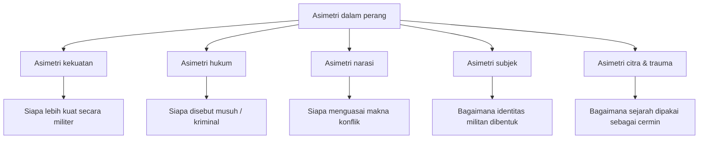
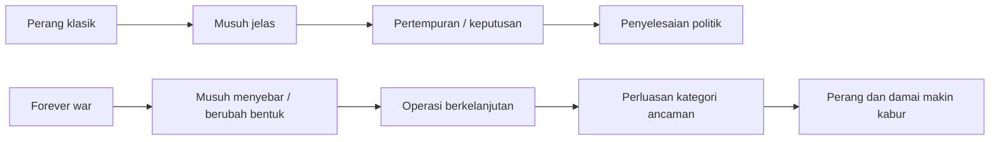

## 🎯 Pendahuluan: Perang Asimetris Tidak Hanya Terjadi di Medan Tempur, tetapi Juga di Dalam Bahasa

Kalau panel pertama tentang *asymmetric warfare* atau **perang asimetris** banyak berbicara tentang strategi, hukum, etika, risiko, dan warga sipil, maka panel kedua bergerak ke lapisan yang lebih halus tetapi sama pentingnya: **budaya asimetri**. Ini bukan lagi sekadar pertanyaan tentang siapa punya tank lebih banyak, siapa punya drone lebih canggih, atau siapa menanggung korban lebih besar. Pertanyaan utamanya justru lebih filosofis dan lebih mengganggu:

- bagaimana musuh dibayangkan,
- bagaimana hukum mengklasifikasikan kekerasan,
- bagaimana perang meresap ke bahasa sehari-hari,
- bagaimana trauma dijadikan cermin,
- dan bagaimana subjek militan dibentuk, bukan hanya di medan perang, tetapi di dalam narasi, citra, hukum, dan simbol. 🧠

Di sinilah kata *culture* atau **budaya** menjadi sangat penting. Sebab perang asimetris bukan hanya masalah senjata, melainkan juga masalah bentuk. Ia membentuk cara kita membedakan antara perang dan damai, antara musuh dan kriminal, antara negara dan jaringan, antara pengorbanan dan pertunjukan, bahkan antara kedalaman identitas dan permukaan citra.

Tulisan ini berusaha menangkap kedalaman panel tersebut dengan bahasa Indonesia yang runtut dan jernih. Karena bahan dasarnya sangat teoritis, saya tidak akan menuliskannya sebagai rangkuman datar. Saya akan mengolahnya menjadi peta besar gagasan: **dari jaringan dan hierarki, dari Al-Qaeda ke ISIS, dari konsep “forever war” ke masalah hukum internasional, hingga pertanyaan kenapa analogi Holocaust begitu dominan dalam wacana konflik tertentu**. 📚

<Callout type="important" title="Tesis utama artikel ini">
Budaya asimetri menunjukkan bahwa perang modern tidak lagi cukup dipahami sebagai benturan kekuatan militer. Ia juga merupakan benturan cara melihat, cara mengklasifikasi, cara melegitimasi, dan cara membayangkan musuh. Dalam dunia seperti ini, bahasa bukan sekadar pelengkap perang; bahasa adalah bagian dari infrastruktur perang itu sendiri.
</Callout>

---

## 🧭 1. Dari Strategi ke Budaya: Mengapa Asimetri Harus Dibaca Lebih Luas?

Salah satu kekuatan besar panel ini adalah keberaniannya untuk tidak membatasi asimetri hanya pada ranah militer. Sejak awal, moderator menekankan bahwa yang penting bukan cuma isi argumen, tetapi juga **struktur argumen tentang asimetri**. Ini penting sekali. Sebab dalam banyak diskusi publik, asimetri dipakai seolah-olah ia hanya menunjuk pada ketidakseimbangan senjata atau kekuatan. Padahal panel ini mengajak kita melihat bahwa asimetri juga hidup dalam:

- skala penilaian,
- bahasa hukum,
- narasi media,
- logika perbandingan,
- pengukuran risiko,
- dan cara subjek politik dibentuk. ⚖️

Dengan kata lain, perang asimetris tidak hanya memunculkan ketimpangan kuantitatif — siapa lebih kuat, siapa lebih lemah — tetapi juga memunculkan **ketimpangan kategoris**: siapa disebut musuh, siapa disebut kriminal, siapa mendapat status hukum, siapa dianggap sekadar ancaman, siapa boleh dibunuh tanpa pengadilan, dan siapa harus diperlakukan sebagai pihak berperang yang sah.

Inilah titik yang sangat penting: **budaya asimetri adalah budaya pembedaan yang goyah**. Ia memperlihatkan bahwa kategori yang selama ini tampak stabil ternyata rapuh.

---

## 🕸️ 2. Hierarki vs Jaringan: Mengapa Negara Selalu Rentan Menyerap Lawannya?

Salah satu pembicara memulai dengan sebuah kontras yang sangat kuat: **hierarchy** versus **network** — **hierarki** versus **jaringan**. Ini cara yang sangat menarik untuk membaca konflik kontemporer.

Negara modern pada dasarnya dibayangkan sebagai hierarki:

- ada komando,
- ada institusi,
- ada rantai keputusan,
- ada legalitas formal,
- ada pembagian fungsi.

Sebaliknya, kelompok seperti Al-Qaeda sering dipahami sebagai jaringan:

- longgar,
- menyebar,
- tidak selalu teritorial,
- fleksibel,
- dan sulit dilumpuhkan karena tidak tergantung pada satu pusat. 🕸️

Pada pandangan pertama, hierarki tampak lebih kuat. Ia punya tentara, hukum, diplomasi, anggaran, dan teknologi. Tetapi justru argumen panel ini menarik karena menyatakan bahwa **hierarki hampir selalu pada akhirnya menyerap lawannya**. Artinya, jaringan tidak hanya dilawan dari luar, tetapi masuk ke dalam struktur negara itu sendiri.

Bagaimana caranya?

### a. Secara retoris
Figur seperti Osama bin Laden menunjukkan keakraban yang luar biasa dengan bahasa musuhnya. Ia tidak berbicara dari dunia yang sepenuhnya asing, melainkan dari dunia yang sudah sangat paham cara Barat berbicara tentang kekuasaan, korban sipil, pembalasan, dan legitimasi.

### b. Secara instrumental
Serangan 11 September tidak datang dari luar dalam bentuk invasi klasik. Ia menggunakan pesawat sipil, bandara sipil, dan infrastruktur Amerika sendiri. Jaringan memasuki tubuh lawan dari dalam.

### c. Secara institusional
Ini bagian yang paling mengguncang: negara yang melawan jaringan kadang mulai meniru logika jaringan. Misalnya ketika institusi militer atau keamanan melakukan tindakan yang secara moral dan organisatoris justru merusak logika hierarki mereka sendiri. Kasus seperti Abu Ghraib menjadi contoh bagaimana elemen-elemen “subversif” muncul di dalam institusi yang seharusnya tertib, disiplin, dan legalistik. 😶

Jadi pelajarannya sangat besar: **perang melawan jaringan sering kali membuat negara ikut menjadi lebih berjaringan, lebih abu-abu, dan lebih sulit dipisahkan dari lawannya secara moral maupun simbolik**.

---

## 🪞 3. Logika Cermin: Dari Al-Qaeda ke Politik “Kita Hanya Memantulkan Anda”

Panel ini lalu masuk ke satu ide yang sangat penting: logika **mirroring** — *pencerminan*. Dalam banyak pernyataan Al-Qaeda, argumen yang dipakai bukanlah “kami sepenuhnya berbeda dari kalian”, melainkan justru “kami adalah pantulan dari kalian”. 🪞

Bentuknya sangat sederhana:

- kalian membunuh warga sipil kami, maka kami membunuh warga sipil kalian,
- kalian menyiksa orang kami, maka kami menyiksa orang kalian,
- kalian menyerang kami dari kejauhan, maka kami akan menyerang pusat kehidupan kalian.

Secara retoris, logika ini sangat kuat karena ia memindahkan pusat justifikasi dari identitas sendiri ke tindakan lawan. Dengan kata lain, subjek militan tidak tampil sebagai subjek yang berdiri sepenuhnya di atas fondasi normatifnya sendiri, melainkan sebagai **cermin**.

Di titik inilah panel memberi pembacaan yang sangat tajam: logika cermin seperti ini justru membuat subjek Al-Qaeda menjadi tipis secara ontologis. *Ontological weight* — **bobot ontologis / kedalaman keberadaan sebagai subjek yang otonom** — menjadi berkurang. Kenapa? Karena jika semua yang saya lakukan hanya pantulan dari tindakan Anda, maka saya tidak lagi tampil sebagai subjek yang benar-benar menjelaskan dirinya dari dalam. Saya menjadi reaktif, bukan afirmatif.

Ini adalah gagasan yang dalam sekali. Al-Qaeda memang punya ikon penting berupa pengorbanan dan *suicide bombing* — **bom bunuh diri** — tetapi bahkan itu pun dibaca oleh panelis sebagai upaya merebut kembali kekhususan diri yang selalu terancam oleh logika pencerminan. Artinya, pengorbanan tubuh menjadi cara terakhir untuk berkata: “kami bukan hanya refleksi kalian.”

---

## 🧨 4. Dari Al-Qaeda ke ISIS: Dari Cermin ke Permukaan yang Brutal

Kalau Al-Qaeda masih banyak bergerak dalam logika cermin, panel ini membaca ISIS sebagai sesuatu yang berbeda. ISIS bukan sekadar jaringan yang meniru lawan, melainkan proyek yang ingin menghadirkan **keterlihatan total**: negara, hukum, kekerasan, hukuman, wilayah, dan simbol. 🏴

Ini penting sekali. Dalam pembacaan panel, ISIS tidak terutama menarik karena ideologinya dalam arti teologi tradisional, melainkan karena caranya **menolak kedalaman** dan **memuja permukaan**.

Apa maksudnya?

- ia obsesif pada tampilan visual,
- obsesif pada keterbukaan kekerasan,
- obsesif pada penampakan kedaulatan,
- obsesif pada transparansi brutal.

Kalau Al-Qaeda sering tampak seperti jaringan bayangan, ISIS justru ingin tampil terang-benderang. Ia ingin menunjukkan semuanya:

- pemenggalan,
- pembakaran,
- penghukuman,
- deklarasi kekhalifahan,
- simbol wilayah,
- administrasi,
- majalah propaganda,
- dan estetika kekerasan.

Yang sangat menarik, panel ini menolak membaca fenomena itu hanya sebagai teologi murni. Ia lebih melihatnya sebagai proyek pembentukan subjek yang sangat dangkal dalam arti tertentu: **subjek permukaan**.

<Callout type="info" title="Apa itu “subjek permukaan”?">
Ini bukan berarti dangkal dalam arti bodoh. Maksudnya adalah subjek yang tidak dibangun lewat kedalaman batin, refleksi panjang, atau tradisi intelektual yang utuh, melainkan lewat citra, tindakan langsung, performa hukum, dan kekerasan yang dipertontonkan.
</Callout>

---

## 📱 5. Radikalisasi Cepat, Konversi, dan Krisis “Kedalaman” Identitas

Panel ini memberi observasi yang sangat tajam tentang ISIS: salah satu cirinya adalah **rapidity of radicalization** — *radikalisasi yang sangat cepat*. Ini sangat penting. Kalau kita memakai model lama, kita sering membayangkan radikalisasi sebagai proses panjang:

- indoktrinasi bertahun-tahun,
- pembentukan ideologi yang dalam,
- disiplin organisasi yang ketat,
- isolasi sosial yang bertahap.

Tetapi fenomena ISIS justru menantang model itu. Banyak orang tampak bergerak menuju militansi dengan sangat cepat, bahkan kadang tanpa pengetahuan agama yang mendalam. Contoh yang disebut dalam panel sangat ironis sekaligus tragis: ada calon pejuang yang baru membeli buku “Islam for Dummies” atau “Quran for Dummies” sesaat sebelum berangkat. 📘

Ini mengubah cara kita berpikir. Mungkin masalahnya bukan semata ideologi yang dalam, tetapi justru **kekosongan subjek yang mencari bentuk lewat tindakan ekstrem**. Dalam kerangka ini, kekerasan menjadi semacam taruhan eksistensial. Bukan kepastian yang lahir dari keyakinan sempurna, tetapi justru langkah yang diambil untuk menghasilkan kepastian setelah tindakan itu dilakukan.

Artinya, aksi kekerasan bukan puncak dari keyakinan yang matang, tetapi bisa menjadi usaha untuk melahirkan keyakinan itu sendiri. Ini sangat menakutkan, karena membuat kekerasan tampak seperti alat pembentukan identitas.

---

## 🧾 6. Transparency, Hypocrisy, dan Penolakan terhadap “Kedalaman” Politik

Salah satu bagian paling cemerlang dari panel adalah pembacaan tentang kosakata ISIS: **hypocrisy** (*kemunafikan*), **sorcery** (*sihir / manipulasi ilusi*), **dissimulation** (*penyembunyian / penyamaran niat*). Kata-kata ini terus muncul dalam retorika mereka.

Apa maknanya? Panelis membaca ini sebagai tanda bahwa ISIS sangat mencurigai segala sesuatu yang tersembunyi. Mereka membenci ambiguitas. Mereka membenci ruang abu-abu. Mereka membenci politik sebagai seni negosiasi dan keterlambatan. Mereka ingin semua hal langsung terlihat: siapa musuh, siapa murtad, siapa pengkhianat, siapa sah, siapa batal. 🔥

Di sinilah muncul gagasan sangat menarik: ISIS tampak religius secara simbolik, tetapi sebenarnya bergerak dengan logika yang sangat **immanent** — *imanen / serba hadir di permukaan* — bukan *transcendent* — *transenden / melampaui, tak sepenuhnya bisa ditangkap*. Bahkan figur khalifah tidak tampil sebagai figur misterius yang berada di antara langit dan bumi, tetapi lebih seperti penguasa administratif yang ingin sepenuhnya hadir di dunia nyata.

Maka yang kita lihat bukan sekadar “fundamentalisme agama” dalam pengertian sederhana, melainkan **upaya membuat hukum tampak sepenuhnya hadir, tanpa sisa, tanpa ambiguitas, tanpa kedalaman**. Ini menjelaskan mengapa pertunjukan kekerasan begitu penting bagi mereka: kekerasan adalah cara menunjukkan bahwa hukum hadir secara total.

---

## 🏛️ 7. Sovereignty Tanpa Rahasia: Mengapa Ini Berbahaya?

Biasanya, *sovereignty* — **kedaulatan** — selalu memiliki hubungan rumit dengan apa yang berada di luar hukum. Penguasa berdaulat, dalam banyak teori politik, selalu berdiri di ambang antara hukum dan pengecualian. Ia bisa menangguhkan hukum, menafsir hukum, atau bertindak di area abu-abu demi menjaga tatanan. Ada rahasia, ada penyangkalan, ada lapisan. 🏛️

Tetapi panel ini membaca ISIS secara berbeda. Mereka tidak ingin rahasia. Mereka justru ingin semuanya tampil sebagai hukum:

- penghukuman yang brutal dipertontonkan,
- kekerasan dibanggakan,
- keputusan disajikan sebagai legal,
- dan pengecualian dipresentasikan sebagai norma.

Ini menciptakan sesuatu yang sangat mengerikan: hukum berubah menjadi mesin brutal yang tidak lagi memiliki ruang rem. Kalau dalam negara modern masih ada kemunafikan institusional — dalam arti ada hal yang dilakukan tapi tidak terang-terangan diakui — maka pada ISIS kemunafikan itu justru ditolak. Semua ingin dibuat terbuka. Dan keterbukaan total dalam konteks ini bukan kabar baik; ia adalah **keterbukaan kekerasan**.

---

## ⏳ 8. Forever War: Ketika Perang Kehilangan Akhirnya

Bagian lain yang sangat penting dari panel ini adalah pembahasan tentang **forever war** — *perang abadi / perang tanpa titik akhir yang jelas*. Ini salah satu konsep paling penting dalam memahami perang kontemporer. ⏳

Secara strategis, perang klasik biasanya dipahami sebagai alat untuk mencapai keputusan:

- ada lawan yang jelas,
- ada konflik yang jelas,
- ada kemenangan atau kekalahan,
- lalu ada penyelesaian politik.

Tetapi dalam *forever war*, logika itu patah. Konflik berjalan terus karena musuhnya tidak pernah benar-benar habis, identitas musuh selalu bisa diperluas, dan garis antara perang dan damai menjadi kabur.

Dalam konteks “war on terror”, perang tidak lagi dipahami sebagai benturan sementara yang diakhiri perjanjian damai, melainkan sebagai operasi berkelanjutan terhadap:

- organisasi,
- jaringan,
- simpatisan,
- afiliasi,
- bahkan perilaku atau tanda-tanda tertentu.

Akibatnya sangat besar. Kalau perang tidak punya akhir yang jelas, maka:

- kekuasaan eksekutif cenderung melebar,
- militerisasi kebijakan domestik meningkat,
- utang publik membesar,
- hak sipil tertekan,
- dan masyarakat mulai terbiasa hidup dalam keadaan darurat permanen.

Panel ini sangat kuat dalam menunjukkan bahwa *forever war* bukan hanya perang yang “lama”, tetapi perang yang secara konseptual memang kehilangan mekanisme akhir.

---

## ⚖️ 9. Musuh vs Kriminal: Dua Konsep yang Saling Bertabrakan

Salah satu pembicara panel membedah persoalan ini secara sangat tajam. Dalam hukum dan politik modern, ada dua konsep yang seharusnya berbeda:

### a. Enemy — musuh
Musuh dibunuh atau dilawan sebagai bagian dari konflik perang. Ia tidak perlu dibuktikan bersalah secara pidana satu per satu.

### b. Criminal — kriminal
Kriminal harus diadili, dibuktikan kesalahannya, dan secara prinsip dianggap tidak bersalah sampai ada putusan hukum.

Masalahnya, *forever war* mencampur keduanya. Hasilnya adalah figur seperti tahanan Guantanamo: ditangkap seperti musuh, tetapi tidak sepenuhnya diperlakukan sebagai kombatan sah; juga tidak diadili sepenuhnya sebagai kriminal biasa. Mereka menggantung di ruang limbo hukum. ⚖️

Ini sangat penting, karena menunjukkan bahwa perang asimetris bukan hanya merusak medan tempur, tetapi juga **merusak arsitektur kategori hukum modern**.

---

## 🏺 10. Dari Roma Kuno ke Konflik Modern: Musuh yang Sah dan Musuh yang Tidak Sah

Panel ini lalu membawa kita pada genealogi yang sangat menarik, dari Roma kuno sampai hukum internasional modern. Di sana ada pembedaan antara musuh yang sah dan musuh yang tidak sah. Yang sah bisa diajak perang dan damai. Yang tidak sah lebih dekat ke pembajak, bandit, atau musuh peradaban — figur yang tidak mudah dimasukkan ke kerangka damai formal.

Ini relevan sekali untuk konflik modern. Ketika negara menyebut lawannya sebagai teroris global, pembajak, atau ancaman absolut, maka secara tidak langsung ia sedang menarik lawannya keluar dari kategori musuh politik biasa. Hasilnya: konflik menjadi lebih sulit ditutup, karena musuh seperti itu dianggap tidak layak diajak ke penyelesaian politik normal. 🏺

Di sinilah kita melihat akar konseptual dari *forever war*: jika lawan diposisikan sebagai ancaman permanen, bukan sekadar lawan politik temporer, maka perang menjadi rentan berubah menjadi kondisi struktural yang tak selesai-selesai.

---

## 🌍 11. Mengapa Konflik Modern Sulit Dikotakkan dengan Rapi?

Dalam sesi tanya jawab, muncul satu pertanyaan yang sangat relevan: apakah toolkit klasik hukum perang masih memadai untuk konflik hari ini? Pertanyaan ini sangat tepat. Sebab sekarang kita hidup di dunia di mana:

- negara berperang bersama kontraktor privat,
- milisi dan aktor non-negara bergerak lintas batas,
- perusahaan, keamanan privat, dan teknologi digital ikut membentuk arena konflik,
- protes sipil bisa segera dibingkai sebagai ancaman keamanan,
- dan garis antara perang, pengawasan, serta kontrol sosial menjadi kabur. 🌐

Ini berarti konflik modern tidak hanya mengganggu kategori perang klasik, tetapi juga mengganggu kategori kehidupan sipil. Maka pertanyaan besarnya bukan lagi hanya “hukum perang mana yang berlaku?”, melainkan juga “apakah kehidupan sipil sendiri sedang semakin dibaca dengan kacamata perang?”

Itu pertanyaan yang sangat serius. Karena kalau logika perang meresap ke mana-mana, maka damai bukan lagi keadaan normal, melainkan sekadar jeda administratif di antara dua mode pengendalian.

---

## 🕯️ 12. Holocaust sebagai Cermin: Mengapa Analogi Ini Begitu Dominan?

Bagian lain yang sangat menarik dari panel ini adalah pembahasan tentang penggunaan analogi **Holocaust** dalam diskursus konflik, terutama Israel-Palestina. Ini topik yang sangat sensitif, tetapi justru karena itu penting dibahas dengan hati-hati. 🕯️

Pertanyaan utamanya bukan sekadar “bolehkah” analogi itu dipakai, tetapi **mengapa analogi itu begitu sulit dihindari?**

Jawaban yang muncul sangat menarik. Salah satu alasannya adalah kekuatan ironi historis: ketika korban sejarah besar kemudian dipersepsikan menjadi penindas dalam situasi lain, daya retoris perbandingan itu menjadi sangat besar. Orang tergoda memakainya karena ia langsung menghasilkan efek moral dan emosional yang kuat.

Namun panel ini tidak berhenti di situ. Ia juga menunjukkan bahwa analogi tersebut tidak hanya dipakai secara agresif untuk menyerang lawan, tetapi juga kadang dipakai sebagai usaha pengakuan terhadap penderitaan pihak lain. Di sinilah persoalannya menjadi rumit. Sebab usaha melihat penderitaan orang lain lewat trauma diri sendiri bisa tampak empatik, tetapi sering berakhir kembali pada diri sendiri.

Dengan kata lain: saya mengakui penderitaanmu, tetapi melalui bahasa lukaku sendiri. Maka yang muncul bukan sungguh-sungguh pengakuan atas sejarahmu, melainkan pencarian **shared victimhood** — *korban bersama* — yang diam-diam tetap berpusat pada diri sendiri.

---

## 📚 13. Trauma, Perbandingan, dan Bahaya Meratakan Sejarah

Panel ini juga menyentuh hubungan antara kajian trauma dan Holocaust. Ini menarik, karena banyak perangkat teoretis untuk membaca trauma modern memang berkembang dari kajian Holocaust. Akibatnya, bahkan ketika pengalaman historis yang dibahas sangat berbeda, kerangka intelektual yang dipakai sering tetap memiliki jejak Holocaust di belakangnya. 📖

Ini memberi dua kemungkinan.

### Kemungkinan pertama: produktif
Ia memberi bahasa yang kuat untuk membicarakan luka, kehilangan, ingatan, dan kehancuran.

### Kemungkinan kedua: problematik
Ia bisa meratakan perbedaan sejarah dan mendorong semua penderitaan dibaca lewat satu model utama.

Panel ini tidak menolak perbandingan, tetapi memperingatkan agar kita sadar bahwa perbandingan selalu punya politiknya sendiri. Ia bisa membuka pengakuan, tetapi juga bisa menelan kekhasan sejarah pihak lain.

---

## 🧱 14. Dari Musuh ke Subjek: Pelajaran Terbesar Panel Ini

Kalau saya harus memilih satu kontribusi terbesar panel ini, jawabannya adalah: ia menggeser perhatian kita dari **perang sebagai peristiwa** ke **perang sebagai mesin pembentuk subjek**. 🧱

Apa artinya?

Bahwa yang dibentuk oleh perang bukan hanya peta, korban, atau institusi, tetapi juga:

- siapa yang dianggap sah sebagai subjek politik,
- siapa yang hidup dalam limbo hukum,
- siapa yang menjadi musuh permanen,
- siapa yang merasa harus mencari kepastian melalui kekerasan,
- dan siapa yang harus hidup dalam dunia yang tak lagi bisa membedakan damai dari perang dengan jelas.

Di sini kita melihat budaya asimetri bekerja penuh. Ia bukan lagi semata soal “siapa kuat”, tetapi soal **siapa diizinkan menjadi manusia politik yang utuh, dan siapa direduksi menjadi ancaman, cermin, atau permukaan**.

---

## 🇮🇩 15. Mengapa Diskusi Ini Penting untuk Pembaca Indonesia?

Bagi pembaca Indonesia, panel seperti ini sangat berharga karena membantu kita naik tingkat. Kita tidak berhenti pada konsumsi berita perang sebagai tontonan. Kita belajar membaca perang sebagai konstruksi makna. 🌏

Ini penting karena Indonesia juga hidup dalam dunia di mana:

- isu keamanan mudah bercampur dengan isu politik,
- ancaman sering didefinisikan secara longgar,
- hukum dapat diperluas melalui kategori keadaan darurat,
- dan media sering menyederhanakan musuh agar publik mudah menerima tindakan keras.

Memahami budaya asimetri membuat kita lebih waspada terhadap:

- bagaimana negara membingkai lawan,
- bagaimana istilah “teror”, “radikal”, atau “ancaman” dipakai,
- bagaimana hukum bisa melebar saat kategori kabur,
- dan bagaimana kekerasan sering didahului oleh kemenangan narasi.

Dalam konteks Indonesia, ini bukan pelajaran jauh dari Timur Tengah atau Barat saja. Ini pelajaran tentang bagaimana negara modern, media, dan masyarakat bisa sama-sama ikut memproduksi logika perang bahkan saat tidak ada deklarasi perang resmi.

---

## 📌 16. Kesimpulan: Asimetri Terbesar Mungkin Bukan pada Senjata, tetapi pada Kemampuan Menentukan Makna

Setelah membaca seluruh panel ini, saya sampai pada satu kesimpulan yang menurut saya sangat penting: **asimetri terbesar dalam perang modern mungkin bukan terletak pada senjata, tetapi pada kemampuan menentukan makna**. ✨

Siapa yang mampu menentukan:

- siapa musuh,
- siapa kriminal,
- siapa korban,
- siapa pembela diri,
- siapa ancaman permanen,
- dan apa yang disebut perang,

maka ia sudah memegang bagian paling penting dari kekuasaan.

Panel ini menunjukkan bahwa perang asimetris pada level budaya adalah perang atas klasifikasi, citra, bahasa, dan subjek. Dari Al-Qaeda ke ISIS, dari Guantanamo ke *forever war*, dari trauma Holocaust ke politik perbandingan, semuanya menunjukkan satu hal: **kekerasan modern selalu bekerja bersama sistem makna**.

Itulah sebabnya, memahami perang hari ini tidak cukup dengan membaca peta militer atau jumlah korban. Kita juga harus membaca kata-kata, kategori, dan citra yang membuat perang itu dapat dipikirkan, dibenarkan, dan diteruskan.

Dan mungkin di situlah tugas intelektual paling mendesak hari ini: **bukan hanya mengecam perang, tetapi membongkar bahasa yang membuat perang tampak wajar**.

---

## 🔖 Catatan Penutup

Artikel ini disusun dari transkrip panel akademik *Asymmetric Warfare: A Symposium | Panel 2: Cultures of Asymmetry* dan diolah ulang menjadi artikel analitis berbahasa Indonesia untuk pembaca BangunAI Blog.

## 📚 Sumber Dasar

- Transkrip panel: *Asymmetric Warfare: A Symposium | Panel 2: Cultures of Asymmetry*
- Sumber video: YouTube (`https://www.youtube.com/watch?v=1jIYxsm47r8`)
