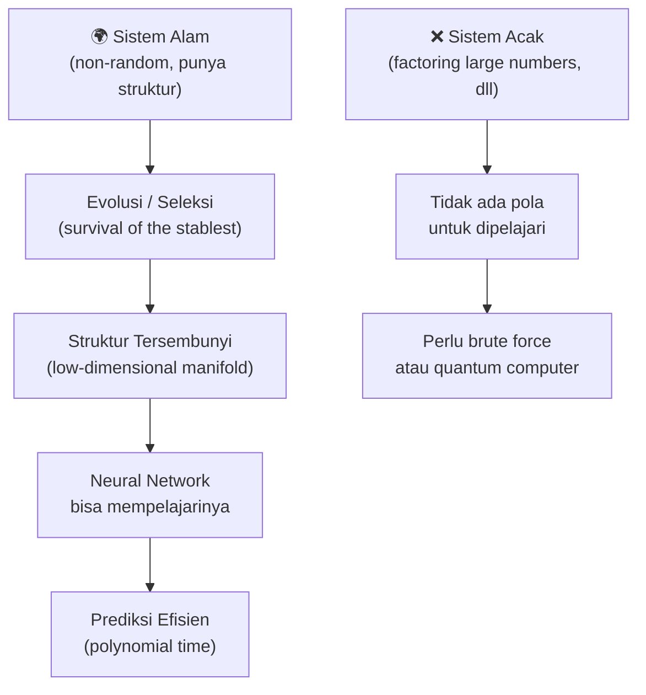
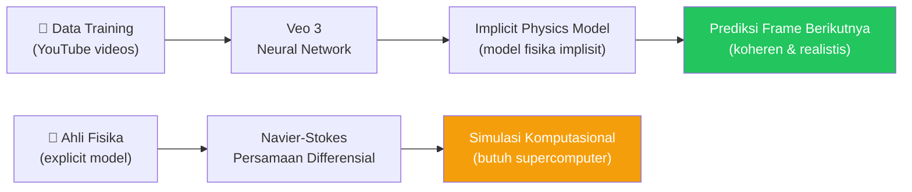
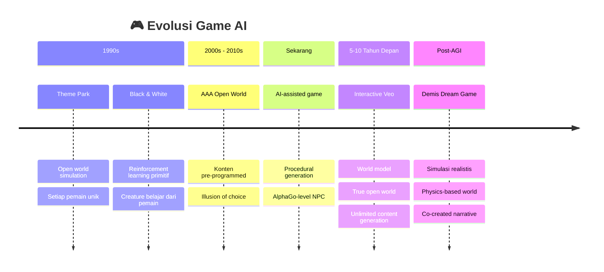
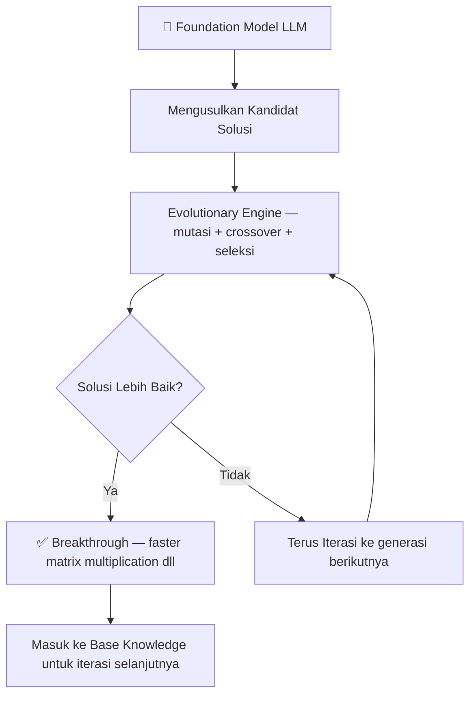
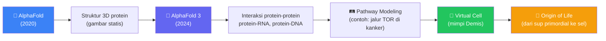
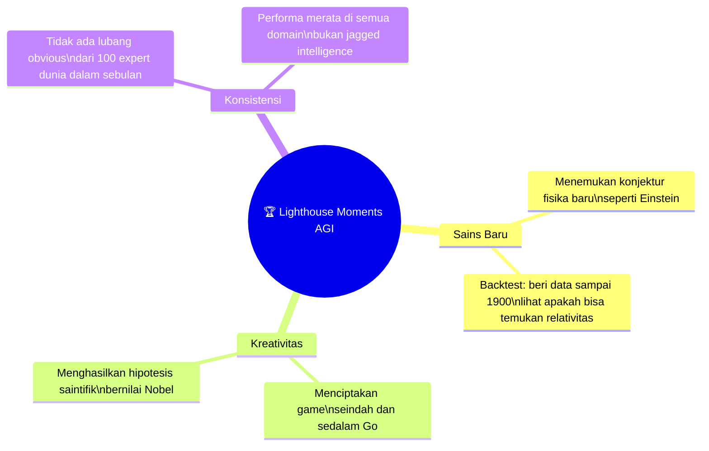
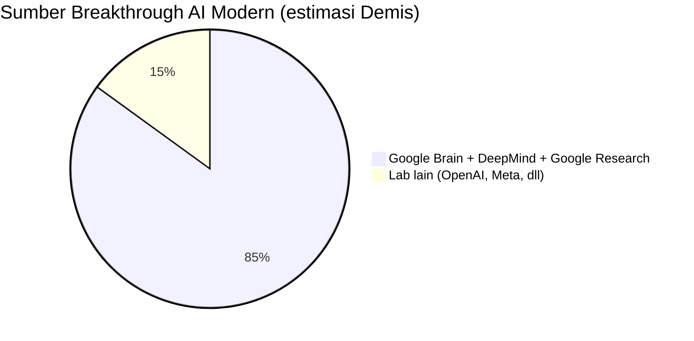
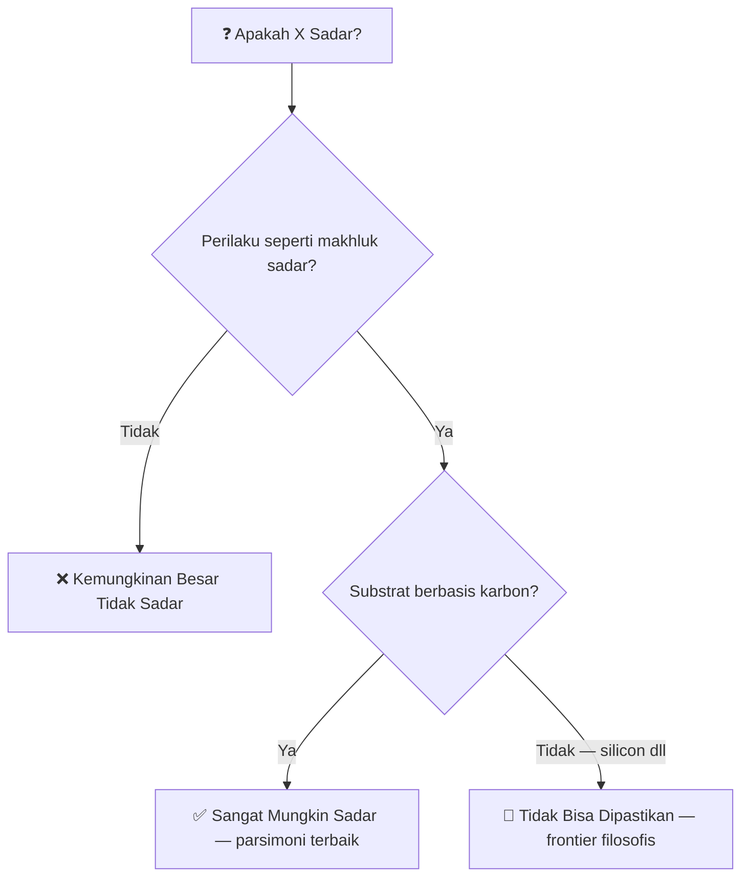
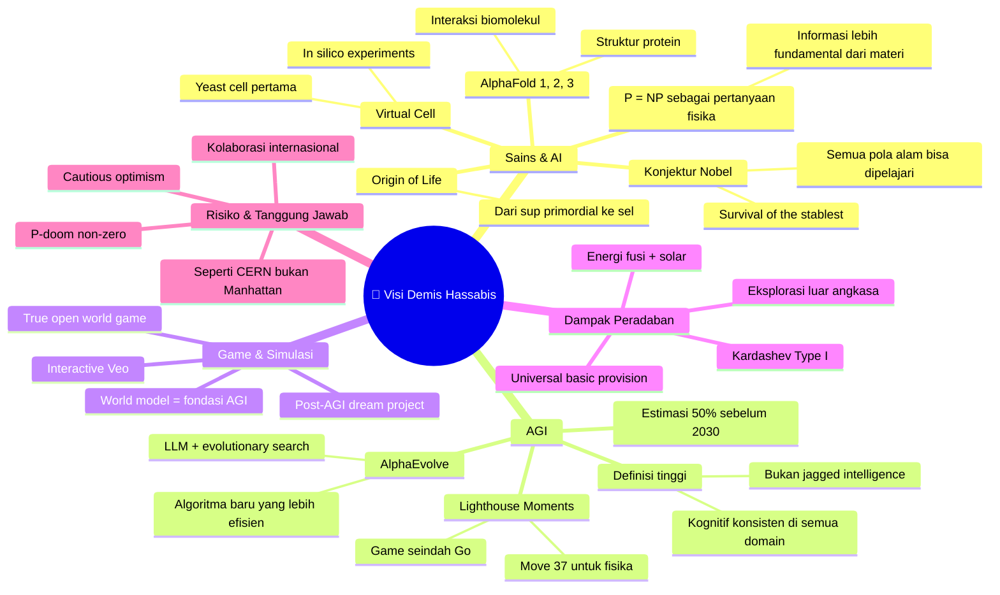

## 🧬 Pengantar: Seorang Nobel Laureate yang Memikirkan Alam Semesta

Ada satu pertanyaan yang terus menghantui Demis Hassabis sepanjang hidupnya:

> *"Apa yang sebenarnya sedang terjadi di sini?"*

Bukan dalam arti dangkal — melainkan dalam arti terdalam: **apa hakikat realita?** Apa itu kesadaran? Apa itu kehidupan? Bagaimana alam semesta bisa menghasilkan semua ini dari hukum-hukum fisika yang sederhana?

Pertanyaan-pertanyaan ini bukan sekadar filosofi. Bagi Demis, jawabannya langsung terhubung dengan proyek hidupnya: membangun **kecerdasan buatan umum** (*Artificial General Intelligence* — AGI), sistem yang bisa membantu manusia menjawab misteri-misteri terdalam tentang alam semesta.

Dalam wawancara panjang bersama **Lex Fridman** di podcast #475, Demis — yang baru saja memenangkan **Nobel Prize** atas karyanya dengan AlphaFold bersama John Jumper — berbagi pemikirannya tentang arah masa depan AI, ilmu pengetahuan, dan peradaban manusia.

Artikel ini merangkum dan mengelaborasi semua insight penting dari percakapan luar biasa tersebut. 🎯

---

## 🌌 Konjektur Besar: Semua Pola Alam Bisa Dipelajari AI

### Provokasi Nobel

Dalam ceramah Nobel-nya, Demis mengajukan sebuah **konjektur** (*conjecture* — dugaan ilmiah yang belum terbukti) yang terdengar berani:

> *"Setiap pola yang bisa dihasilkan atau ditemukan di alam dapat secara efisien ditemukan dan dimodelkan oleh algoritma pembelajaran klasik."*

Artinya: **hampir semua fenomena alam** — biologi, kimia, fisika, kosmologi, neurosains — pada dasarnya bisa dipelajari oleh *neural network* (jaringan saraf tiruan) yang berjalan di atas komputer biasa.

<Callout type="info" title="🎓 Mengapa 'Provokasi' di Ceramah Nobel?">
Demis sengaja mengikuti tradisi Nobel: memberikan pernyataan yang **sedikit provokatif** untuk memancing diskusi ilmiah. Konjektur ini memang belum terbukti secara formal, tetapi diilhami oleh track record AlphaGo dan AlphaFold yang berhasil memecahkan masalah yang dianggap "mustahil" untuk komputer klasik.
</Callout>

### Mengapa Alam Memiliki Struktur yang Bisa Dipelajari?

Kuncinya adalah satu ide sederhana tapi revolusioner: **alam tidak acak**.

Setiap hal yang kita lihat di sekitar kita — bentuk gunung, orbit planet, struktur protein, bahkan unsur-unsur kimia yang stabil — semuanya adalah produk dari proses seleksi yang berlangsung selama miliaran tahun.

Demis menyebutnya *"survival of the stablest"* — bertahan yang paling stabil. Bukan hanya evolusi biologis, tetapi juga:
- 🏔️ **Proses geologis** — bentuk gunung yang dipahat cuaca selama ribuan tahun
- 🌍 **Orbit planet** — dibentuk gravitasi selama miliaran tahun
- 💧 **Struktur unsur** — atom-atom yang stabil secara kimiawi "bertahan", yang tidak stabil hancur

Karena semuanya punya **struktur yang bukan acak**, ada pola yang bisa dipelajari. Ada *manifold* (ruang berdimensi rendah) yang bisa dimodelkan oleh neural network.

### P = NP dan Fisika sebagai Sistem Informasi

Demis punya pandangan unik tentang salah satu masalah terbesar dalam ilmu komputer: **P = NP**.

Secara sederhana, pertanyaan ini menanyakan: apakah semua masalah yang solusinya mudah diverifikasi, juga mudah untuk diselesaikan?

Bagi Demis, jika kita melihat alam semesta sebagai **sistem informasional** (*informational system*), maka P = NP bukan sekadar pertanyaan matematika — ini adalah **pertanyaan fisika**. Informasi, menurutnya, lebih fundamental dari energi dan materi.

<Callout type="tip" title="💡 Informasi: Fondasi Alam Semesta?">
Pandangan bahwa informasi lebih fundamental dari materi dan energi bukan ide baru — fisikawan John Archibald Wheeler pernah menyebutnya *"It from Bit"* (segalanya berasal dari bit informasi). Demis mengambil pandangan ini lebih jauh: jika benar, maka kemampuan neural network untuk "mempelajari" alam semesta berbicara langsung tentang sifat komputasional realita itu sendiri.
</Callout>

---

## 🎮 Veo 3 dan Fisika Intuitif: AI yang "Memahami" Dunia

### Lebih dari Sekadar Video Cantik

Banyak orang kagum pada Veo 3 — model generasi video terbaru Google DeepMind — karena kemampuannya membuat video ultra-realistis dengan komedi, ekspresi manusia yang meyakinkan, dan audio native.

Tapi Demis dan Lex sama-sama tertarik pada hal yang berbeda: **fisika**.

Veo 3 bisa memodelkan:
- 💧 Cairan yang mengalir dan ditekan melalui *hydraulic press* (alat pres hidraulik)
- ✨ *Specular lighting* (cahaya spekuler) — bagaimana cahaya memantul di permukaan berbeda
- 🪨 Perilaku material yang berbeda-beda

Ini mengejutkan karena secara tradisional, mensimulasikan **Navier-Stokes equations** (persamaan untuk dinamika fluida) membutuhkan superkomputer dengan kalkulasi berhari-hari.

Namun Veo 3 "belajar" fisika ini hanya dari menonton YouTube. 🤯

### Apa Artinya "Memahami"?

Pertanyaan filosofis yang muncul: apakah Veo 3 benar-benar *memahami* fisika?

Demis berhati-hati tapi jujur:

> *"Sejauh ia bisa memprediksi frame berikutnya secara koheren, itu adalah suatu bentuk pemahaman — bukan pemahaman filosofis yang mendalam, tapi sistem ini jelas telah memodelkan cukup banyak dinamika."*

Ini seperti *intuitive physics* (*fisika intuitif*) yang dimiliki anak kecil — mereka tahu gelas akan pecah jika jatuh, tanpa perlu tahu persamaan fisika di baliknya.

### Tantangan Terhadap "Embodied AI"

Ini juga menantang teori yang selama ini dominan di neurosains: bahwa untuk benar-benar memahami dunia fisik, AI perlu **embodied** (*terwujudkan*) — punya tubuh yang berinteraksi dengan dunia.

Veo 3 membuktikan bahwa **observasi pasif** (passive observation) ternyata cukup untuk membangun model fisika yang mengejutkan. Demis sendiri mengakui: 5-10 tahun lalu, ia pun tidak akan memprediksi hal ini.

---

## 🕹️ Video Game, World Model, dan Masa Depan Interaktivitas

### Game sebagai Cinta Pertama

Demis memulai karirnya sebagai game developer di era keemasan gaming (tahun 90-an). Ia menulis *physics engine* dan *graphics engine* — dan memahami betapa sulitnya memprogram perilaku material secara akurat.

Beberapa game penting dalam perjalanannya:
- 🏖️ **Theme Park** — simulasi taman bermain, setiap pemain memiliki pengalaman unik
- 🐣 **Black & White** — creature game dengan *reinforcement learning* awal: makhluk belajar dari cara kamu memperlakukannya
- 🏰 **Open world games** — simulasi dengan AI character yang beradaptasi

### Visi Game AI Masa Depan

Dengan AI generatif modern, Demis bermimpi tentang *ultimate open world game*:

> *"Bayangkan versi Veo yang interaktif — kamu bisa melangkah masuk dan bergerak di dalamnya. Dalam 5-10 tahun, seberapa bagus itu akan terlihat?"*

Bedanya dengan open world game saat ini:
- **Sekarang:** Pilihan semu (*illusion of choice*) — ada 2-3 pintu, tapi semua sudah diprogramkan
- **Masa depan:** Kebebasan sejati — AI menghasilkan konten secara dinamis mengikuti apapun yang kamu lakukan

### World Model: Fondasi AGI

Yang menarik: Demis menghubungkan game langsung ke AGI. Untuk membuat game open world yang sesungguhnya, AI butuh **world model** — model yang memahami fisika dunia, mekanikanya, dan semua objek di dalamnya.

Dan world model inilah yang dibutuhkan AGI sejati. Video game bukan sekadar hiburan — ini adalah *testing ground* (arena pengujian) untuk kecerdasan umum.

---

## 🧬 AlphaEvolve dan Evolusi Algoritma

### LLM + Evolutionary Computing = AlphaEvolve

**AlphaEvolve** adalah sistem Google DeepMind yang menggabungkan dua paradigma:

1. **LLM** (*Large Language Model*) — mengusulkan solusi-solusi kandidat
2. **Evolutionary Computing** (*komputasi evolusioner*) — mencari bagian-bagian baru dari *search space* (ruang pencarian)

Hasilnya: sistem yang bisa **menemukan algoritma baru** yang belum pernah dipikirkan manusia — seperti algoritma perkalian matriks yang lebih cepat.

### Keterbatasan Evolusi Tradisional

Sebelum era LLM, **evolutionary computing** sudah diteliti intensif di tahun 90an dan 2000an — tapi selalu gagal di satu hal: tidak bisa menghasilkan **properti baru yang emergent** (*sifat baru yang muncul dari kompleksitas*).

Kamu hanya bisa mendapatkan kombinasi dari apa yang sudah ada di sistem. Tidak ada evolusi sejati — tidak ada lompatan ke level baru seperti yang terjadi pada kehidupan nyata (dari bakteri ke sel multi-seluler).

Dengan LLM sebagai panduan, mungkin hambatan ini bisa diatasi.

<Callout type="example" title="🐟 Analogi: Tiktaalik dan Lompatan Evolusi">
Lex Fridman menyimpan tengkorak **Tiktaalik** di mejanya — organisme awal yang merangkak keluar dari air ke daratan. 

Evolusi bukan hanya seleksi natural bertahap — ada **lompatan** kombinatorial yang tiba-tiba memungkinkan kapabilitas baru yang belum pernah ada. AlphaEvolve mungkin bisa mereplikasi lompatan semacam ini dalam ruang program.
</Callout>

---

## 🔬 Virtual Cell: Mimpi 25 Tahun

### Membangun Sel di Komputer

Selama 25 tahun, Demis punya satu mimpi: **mensimulasikan sel hidup secara penuh** di komputer.

Bukan sekadar satu protein. Bukan sekadar dua protein yang berinteraksi. Melainkan **seluruh sistem internal sel** — semua pathway (jalur biokimia), semua interaksi, semua dinamika — sehingga kita bisa melakukan eksperimen *in silico* (di komputer) sebelum ke laboratorium basah.

Bayangkan: **100x lebih cepat** dalam riset medis. Temukan kandidat obat secara digital, baru validasi di lab.

### Blok Bangunan: AlphaFold → AlphaFold 3 → Sel

### Kandidat Terbaik: Sel Ragi (*Yeast Cell*)

Demis akan mulai dengan **sel ragi** — bukan karena sederhana (sel ragi adalah organisme utuh, bukan hanya "sel"), tapi karena:
- 🧫 Organisme uniseluler yang paling dipahami sains
- 📊 Data berlimpah
- ⚗️ Tempat riset Paul Nurse (mentor Demis, pemenang Nobel 2001)

### Tantangan Teknis: Skala Waktu

Salah satu tantangan terbesar: proses biologis terjadi di **skala waktu yang berbeda**:

| Proses | Skala Waktu |
|--------|-------------|
| Protein folding | Milidetik |
| Sinyal seluler | Detik - menit |
| Ekspresi gen | Menit - jam |
| Pembelahan sel | Jam |
| Diferensiasi | Hari - minggu |

Solusinya mungkin: **sistem hierarkis** yang bisa "zoom in/zoom out" antara skala temporal berbeda.

---

## 🤖 AGI di 2030: Apa Artinya dan Bagaimana Kita Tahu?

### Definisi Demis tentang AGI

Demis mengestimasi **50% kemungkinan** AGI tercapai sebelum 2030. Tapi ia punya definisi yang tinggi:

> *"Bisa mencocokkan fungsi-fungsi kognitif yang dimiliki otak manusia — konsisten di semua domain, bukan 'kecerdasan bergerigi' yang unggul di beberapa hal tapi parah di hal lain."*

AI saat ini adalah **jagged intelligence** (*kecerdasan bergerigi*):
- ✅ Luar biasa dalam coding, matematika, catur
- ❌ Masih bisa "halusinasi" fakta sederhana
- ❌ Belum punya *research taste* (selera penelitian) yang sejati
- ❌ Belum bisa menciptakan konjektur baru yang bernilai

### Lighthouse Moments: "Move 37" untuk AGI

Selain tes konsistensi massal (ribuan tugas kognitif), Demis mencari **momen mercusuar** (*lighthouse moments*) — kejadian yang tidak bisa disangkal bahwa kita telah mencapai sesuatu yang baru:

### Yang Masih Belum Bisa Dilakukan AI

Hal yang paling sulit ditiru menurut Demis: **research taste** — kemampuan untuk "mencium" arah yang benar.

> *"Lebih sulit menciptakan konjektur yang baik daripada memecahkannya. Kita mungkin akan segera punya sistem yang bisa memecahkan soal Math Olympiad tingkat sulit. Tapi bisakah sistem itu menciptakan soal yang layak dipelajari?"*

Ini adalah perbedaan antara **ilmuwan baik** dan **ilmuwan hebat**: semua ilmuwan profesional teknis secara kompeten. Tapi hanya segelintir yang punya kemampuan untuk memilih pertanyaan yang tepat, di waktu yang tepat, dengan teknologi yang tersedia.

---

## ⚡ Komputasi, Energi, dan Skala Besar

### Tiga Jenis Scaling yang Terjadi Bersamaan

Demis menjelaskan bahwa scaling AI sekarang terjadi di **tiga level sekaligus**:

1. **Pre-training compute** — melatih model dasar yang lebih besar
2. **Post-training compute** — RLHF, fine-tuning, berbagai teknik penyempurnaan
3. **Inference time compute** (*compute saat inferensi*) — semakin lama waktu berpikir, semakin cerdas model "*thinking systems*"

Dan seiring AI makin berguna, demand meledak di semua tiga level.

### Solusi Energi: Fusi dan Solar

Untuk menyuplai kebutuhan komputasi yang terus tumbuh, Demis mempertaruhkan masa depan pada dua sumber energi:

<Callout type="success" title="☀️ Solar + ⚛️ Fusi = Energi Masa Depan">
**Solar:** Reaktor fusi di langit. Tantangan utama: baterai dan transmisi. Dengan material solar yang lebih efisien (yang bisa ditemukan AI!), biayanya akan terus turun.

**Fusi nuklir:** Google DeepMind sudah bekerja sama dengan Commonwealth Fusion untuk AI-assisted plasma containment. Jika berhasil, energi hampir gratis, bersih, dan tak terbatas.

Bonus dari energi melimpah: desalinasi air laut jadi murah → krisis air selesai. Bahan bakar roket murah → era eksplorasi luar angkasa dimulai.
</Callout>

---

## 📊 Scaling Laws dan Kompetisi AI

### Apakah Scaling Masih Berjalan?

Demis: masih ada ruang besar, tapi jawabannya **50/50**:

- Mungkin scaling yang ada cukup untuk mencapai AGI
- Mungkin dibutuhkan 1-2 *breakthrough* baru seperti Transformers di 2017

Strateginya: push both — **setengah resources untuk blue sky research**, setengah untuk scaling maksimal kapabilitas yang ada.

### Mengapa DeepMind Yakin Diri?

Dalam 15 tahun terakhir, menurutnya **80-90% breakthrough** yang mendasari AI modern berasal dari Google Brain, Google Research, dan DeepMind:
- Transformers architecture
- AlphaGo / AlphaZero
- AlphaFold
- Dan masih banyak lagi

<Callout type="warning" title="⚠️ Catatan Perspektif">
Ini adalah estimasi Demis sendiri dan tentu saja bisa diperdebatkan. OpenAI, Meta, Anthropic, dan peneliti akademik juga berkontribusi signifikan. Tapi tidak bisa dipungkiri bahwa track record Google DeepMind dalam *fundamental research* sangat kuat.
</Callout>

---

## 🧠 Kesadaran, Substrat, dan Pertanyaan Penrose

### Roger Penrose vs. Demis Hassabis

**Roger Penrose** — matematikawan dan fisikawan legendaris — berargumen bahwa kesadaran (*consciousness*) tidak bisa dimodelkan oleh komputer klasik. Ia menduga ada proses **quantum mechanical** di dalam mikrotubulus otak yang menciptakan kesadaran.

Demis dengan hormat tidak setuju:

> *"Sejauh yang kita tahu, otak bekerja secara klasik. Itu menyiratkan semua fenomenanya bisa ditiru oleh komputer klasik. Tapi kita tetap tidak tahu apakah substrat silicon akan merasakan pengalaman yang sama seperti substrat karbon."*

### The Two-Part Test untuk Kesadaran

Demis pernah berdebat dengan mendiang **Daniel Dennett** tentang mengapa kita menganggap satu sama lain sadar. Ada dua alasan:

1. **Perilaku sama** — kamu menunjukkan perilaku yang sama dengan orang sadar
2. **Substrat sama** — kita sama-sama berbasis karbon, jadi paling logis mengasumsikan pengalaman yang sama

Untuk AI berbasis silicon, kita bisa (suatu hari nanti) memverifikasi alasan #1. Tapi alasan #2 tidak akan pernah sama. Ini masalah filosofis yang belum terpecahkan.

### Definisi Kesadaran yang Elegan

Salah satu definisi favorit Demis: **kesadaran adalah cara informasi terasa ketika diproses** (*consciousness is the way information feels when processed*).

Bukan penjelasan saintifik yang ketat, tapi intuitif: ada sesuatu tentang *subjektivitas* pengalaman — rasa sakit yang terasa sakit, merah yang terasa merah — yang mungkin bergantung pada substrat fisik pemrosesannya.

---

## 🌍 Dampak Sosial: Pekerjaan, Ekonomi, dan Peradaban

### AI dan Pekerjaan Programmer

Coding adalah salah satu domain pertama yang terdampak signifikan, karena dua alasan:
1. Mudah menghasilkan **synthetic data** yang terverifikasi
2. Semua orang (termasuk para pembuatnya) ingin otomasi ini

Demis memprediksi pola yang sama seperti setiap revolusi teknologi: ada yang hilang, ada yang baru tercipta, dan yang paling adaptif menjadi **10x lebih produktif**.

<Callout type="caution" title="⚠️ 100x Dampak, 10x Lebih Cepat">
Demis: *"Ini akan seperti Revolusi Industri dengan dampak 10x lebih besar, tapi 10x lebih cepat. Alih-alih 100 tahun, ini akan terjadi dalam 10 tahun. Itulah yang akan membuat masyarakat sulit beradaptasi."*

Solusi yang ia usulkan: **universal basic provision** — distribusi produktivitas yang meningkat secara merata ke seluruh masyarakat, bukan hanya mengalir ke segelintir pemilik teknologi.
</Callout>

### Skenario Kardashev Type I

Jika energi bisa diselesaikan, Demis tidak akan terkejut jika dalam 100 tahun manusia mencapai **peradaban Tipe I** (*Kardashev Type I Civilization* — peradaban yang memanfaatkan seluruh energi planet):

- Energi murah → desalinasi → krisis air selesai
- Energi murah → produksi hidrogen → bahan bakar roket murah
- Roket murah + self-landing rockets → "layanan bus ke luar angkasa"
- Kelimpahan sumber daya → dunia **non-zero-sum** (tidak lagi saling berebut)

---

## 🎯 Pelajaran Kepemimpinan: Dari "Kalah" ke "Menang" dalam Satu Tahun

### Kebangkitan Gemini

Setahun lalu (2025), banyak yang menganggap Google tertinggal dalam persaingan LLM dengan Gemini 1.5 di belakang. Kini dengan Gemini 2.5 Pro, Google memimpin di banyak benchmark.

Apa yang berubah?

Demis mengidentifikasi beberapa faktor:

1. **Menyatukan talenta terbaik** — Google Brain + DeepMind yang dulu terpisah
2. **Budaya startup dalam perusahaan besar** — "Kami masih bertindak seperti startup, tapi startup besar"
3. **Memotong birokrasi tanpa henti** — terus fight terhadap lapisan manajemen berlebih
4. **Relentless shipping** (*pengiriman tanpa henti*) — bukan hanya riset, tapi juga *deployment* nyata

### Desain Produk AI: Filosofi Steve Jobs

Demis percaya pada satu prinsip desain yang terinspirasi Jobs: **simplicity, beauty, elegance** — kesederhanaan, keindahan, keanggunan.

Interface AI yang ada sekarang? *"Kotak teks chat — kita akan melihat kembali ke masa ini dan merasa itu sangat kuno, mungkin hanya dalam beberapa tahun."*

Masa depan: interface yang **di-generate oleh AI itu sendiri** dan dipersonalisasi untuk setiap pengguna berdasarkan preferensi dan cara berpikir mereka.

---

## 🔮 Tanggung Jawab dan "P-Doom"

### Bukan Perlombaan untuk Dimenangkan

Ketika ditanya tentang "kemungkinan Google DeepMind menang", Demis menolak framing tersebut:

> *"Menang adalah cara pandang yang salah — ini bukan game atau kompetisi, mengingat betapa penting dan konsekuensialnya apa yang sedang kita bangun. Semua dari kami yang berada di garis terdepan punya tanggung jawab untuk mengawal teknologi luar biasa ini dengan aman ke dunia, demi kemanfaatan umat manusia."*

### P-Doom: Non-Zero, Non-Negligible

Demis tidak mau memberi angka *p-doom* (probabilitas kehancuran peradaban):

> *"Itu mengimplikasikan tingkat presisi yang tidak ada. Yang pasti: ini bukan nol dan mungkin tidak bisa diabaikan. Itu sendiri sudah cukup sobering."*

Kondisi ketidakpastian besar + taruhan sangat tinggi (di kedua arah — bisa sangat baik, bisa sangat buruk) → satu-satunya respons rasional: **cautious optimism** (*optimisme yang berhati-hati*).

Lebih mirip **CERN** daripada **Proyek Manhattan** — penelitian kolaboratif dan hati-hati, bukan perlombaan senjata.

---

## 🗺️ Peta Besar: Semua Terhubung

---

## 💭 Penutup: Rasa Ingin Tahu sebagai Kompas

Ada satu kutipan Feynman yang Demis sukai, yang juga menjadi semangat risetnya:

> *"What I cannot create, I do not understand."*
> — *Apa yang tidak bisa aku ciptakan, itu yang belum aku pahami.*

Dan inilah mengapa Demis membangun AI: bukan untuk menggantikan manusia, tapi untuk **menciptakan alat terbaik yang pernah ada** bagi sains — alat yang membantu kita akhirnya menjawab pertanyaan-pertanyaan terdalam:

- 🌱 Apa itu kehidupan?
- 🧠 Apa itu kesadaran?
- ⏰ Apa itu waktu?
- 🌌 Apa hakikat realita?

Seperti yang dikatakan Lex di akhir percakapan — dan sepadan untuk menutup artikel ini juga:

> *"Dari lubuk hati yang paling dalam, terima kasih atas kontribusimu yang mendorong usaha-usaha ilmiah dengan ketelitian, kesenangan, dan kerendahan hati."*

---

<Callout type="cite" title="📹 Sumber">
Artikel ini didasarkan pada wawancara **Demis Hassabis × Lex Fridman**, Lex Fridman Podcast #475.  
Tonton di YouTube: [https://www.youtube.com/watch?v=-HzgcbRXUK8](https://www.youtube.com/watch?v=-HzgcbRXUK8)
</Callout>
