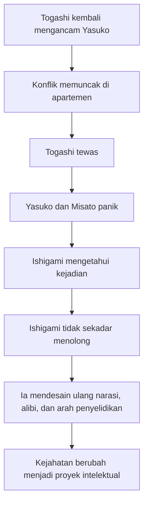
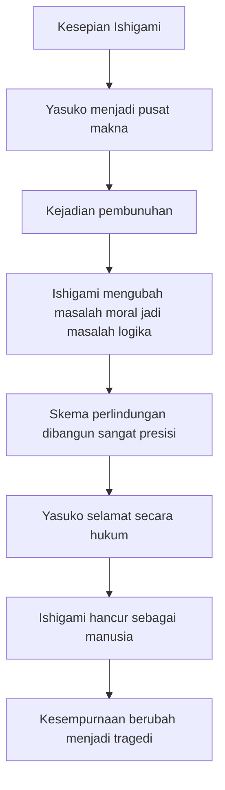
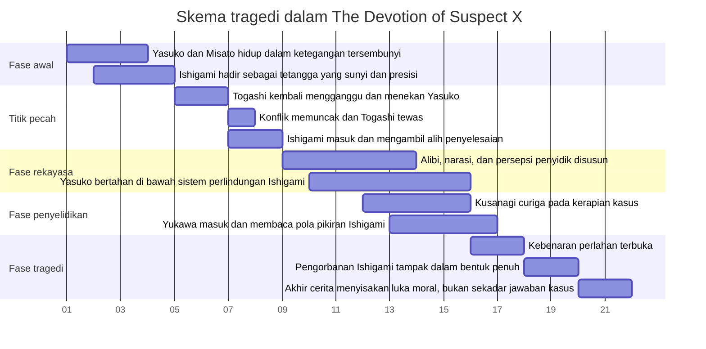

## 🧩 Pendahuluan: Ini Bukan Sekadar Misteri Pembunuhan, tetapi Tragedi tentang Cinta yang Berubah Menjadi Sistem Logika yang Mematikan

Ada banyak novel misteri yang membuat pembaca sibuk menebak pelaku. Ada juga thriller yang mengandalkan kejutan pada bab terakhir. Tetapi **The Devotion of Suspect X** karya **Keigo Higashino** berdiri di tempat yang berbeda. Ia tidak hanya bertanya *“siapa yang membunuh?”* atau *“bagaimana kejahatan itu dilakukan?”* Ia justru masuk ke wilayah yang jauh lebih mengganggu: **apa yang terjadi ketika kecerdasan luar biasa dipakai bukan untuk mencipta kehidupan, melainkan untuk menutupi dosa, menyelamatkan seseorang, dan menyusun pengorbanan secara hampir sempurna?** 🧩

Itulah sebabnya kisah ini sangat kuat. Di tangan penulis lain, cerita seperti ini mungkin hanya menjadi teka-teki kriminal yang rapi. Tetapi pada Higashino, ia berubah menjadi tragedi moral. Kita berhadapan dengan beberapa lapisan sekaligus:

- seorang perempuan yang terjebak oleh masa lalu,
- seorang anak yang ikut terseret dalam situasi yang tidak seharusnya ia tanggung,
- seorang pria jenius yang hidup sepi dan menemukan makna hidup pada sosok yang nyaris tidak benar-benar memilikinya,
- seorang detektif yang mencari struktur kebenaran,
- dan seorang ilmuwan atau intelektual yang bisa membaca pola di balik ilusi.

Kalau hanya dibaca sebagai *crime story* *(cerita kejahatan)*, novel ini sudah kuat. Tetapi kalau dibaca lebih dalam, ia menjadi perenungan tajam tentang:

- batas cinta,
- perbedaan antara kasih sayang dan obsesi,
- logika dan moralitas,
- keindahan intelektual yang berubah menjadi kekejaman,
- dan bentuk pengorbanan yang tampak mulia tetapi sebenarnya juga menyisakan kehancuran. 🌫️

Dalam transkrip yang menjadi bahan artikel ini, kisah tersebut diceritakan ulang dengan penekanan pada nuansa psikologis dan filosofis. Saya akan membangunnya kembali dalam bahasa Indonesia yang lebih runtut, lebih analitis, dan lebih mendalam, bukan sekadar memindahkan peristiwa dari satu paragraf ke paragraf lain.

Karena pertanyaan besar yang sebenarnya ada di jantung kisah ini adalah:

> **Seberapa jauh seseorang boleh melindungi orang yang ia cintai? Dan pada titik mana perlindungan itu berhenti menjadi kasih, lalu berubah menjadi bentuk dominasi, kontrol, atau penghapusan kemanusiaan?**

Kalau harus dirumuskan sebagai tesis utama, maka artikel ini berdiri di atas tesis berikut:

> **The Devotion of Suspect X adalah tragedi tentang seorang jenius yang tidak sekadar menutupi kejahatan, tetapi membangun sebuah “kesempurnaan logis” demi melindungi orang yang ia cintai; justru karena terlalu sempurna, pengorbanan itu menjadi mengerikan, sebab ia tidak hanya menghapus bukti, tetapi juga mengubah cinta menjadi sistem yang menelan pelakunya sendiri.**

Maka tulisan ini akan membahas secara detail:

- alur inti cerita dari awal sampai pengakuan,
- posisi Yasuko, Misato, Togashi, Ishigami, Kusanagi, dan Yukawa,
- bagaimana trik intelektual Ishigami bekerja secara moral dan naratif,
- mengapa novel ini begitu menyakitkan,
- serta apa yang dapat kita pahami tentang cinta, logika, pengorbanan, dan batas-batas kemanusiaan dari kisah ini. 🕯️

---

<Callout type="important" title="Tesis utama artikel ini">
Kekuatan The Devotion of Suspect X bukan terletak pada “siapa pelakunya” semata, tetapi pada kenyataan bahwa seorang pria jenius memakai seluruh ketajaman pikirannya untuk membangun pengorbanan yang sangat rapi demi orang yang ia cintai. Tragedinya muncul karena tindakan itu tampak agung sekaligus sangat mengerikan: ia melindungi, tetapi juga mengurung; ia menyelamatkan, tetapi juga memusnahkan dirinya sendiri.
</Callout>

---

## 🏙️ 1. Yasuko dan Misato: Hidup Kecil yang Tampak Tenang, tetapi Sebenarnya Berdiri di Atas Ketakutan yang Tak Pernah Tuntas

Cerita dimulai dalam suasana yang sangat biasa. Yasuko Hanaka hidup bersama putrinya, Misato, di apartemen sederhana. Ia bekerja, merawat anaknya, menjaga rutinitas, dan berusaha mempertahankan kehidupan yang setenang mungkin. Tetapi ketenangan itu bukan ketenangan yang lahir dari keamanan. Itu adalah ketenangan yang dibangun dari kewaspadaan. 🏙️

Yasuko bukan perempuan yang hidup bebas dari masa lalu. Ia adalah seseorang yang sedang berusaha **bertahan** dari masa lalu yang masih mungkin kembali kapan saja. Karena itu sejak awal, cerita ini sudah memberi sinyal penting: kehidupan sehari-harinya tampak kecil, biasa, dan domestik, tetapi di bawah permukaan ada rasa takut yang konstan.

Ini penting, sebab Higashino sangat cermat membangun tragedi bukan dari ledakan besar langsung, melainkan dari suasana rapuh. Yasuko bukan tokoh yang memasuki kisah sebagai kriminal. Ia masuk sebagai manusia yang rentan. Dan justru kerentanan inilah yang nantinya membuat semua hal menjadi begitu menyakitkan.

Sementara itu Misato, anaknya, hadir sebagai pengingat bahwa setiap tindakan orang dewasa dalam cerita ini selalu memiliki gema moral yang lebih luas. Kejahatan, perlindungan, kebohongan, dan pengorbanan tidak pernah berhenti pada dua orang. Anak yang melihat, meski tidak memahami seluruh struktur, tetap akan menanggung bekasnya. 👧

Dengan kata lain, sebelum pembunuhan terjadi pun, novel ini sudah menempatkan kita pada lanskap emosi yang sangat penting:

- ada ibu yang hidup dengan ketakutan,
- ada anak yang belajar membaca suasana tegang sebelum ia cukup dewasa untuk memahaminya,
- dan ada rumah yang tampak tenang tetapi sebenarnya tidak benar-benar aman.

---

## 📐 2. Ishigami: Sang Jenius Sunyi yang Tampak Biasa, tetapi Menyimpan Kedalaman yang Tidak Terlihat oleh Dunia

Di unit sebelah tinggal **Ishigami**, seorang guru matematika. Dari luar, ia tampak seperti pria biasa yang pendiam, disiplin, tertutup, dan nyaris tak menarik perhatian. Ia hidup dalam ritme yang sangat presisi, hampir mekanis. Ia bukan tokoh flamboyan. Ia tidak hadir dengan aura dramatis. Tetapi justru di situlah kekuatan karakternya. 📐

Ishigami adalah tipe tokoh yang dalam karya besar Jepang sering muncul sebagai sosok “senyap namun dalam”. Ia tidak banyak bicara, tidak memamerkan diri, dan tidak membuat orang segera merasa ia berbahaya. Namun dari awal, Higashino sudah memberi satu tanda: **ia adalah orang yang hidup melalui struktur, keteraturan, dan ketelitian.**

Itu sangat penting karena matematikanya bukan sekadar profesi. Ia adalah cara hidup.

Bagi Ishigami:
- dunia bisa dipikirkan sebagai masalah,
- masalah bisa disusun menjadi variabel,
- variabel bisa dikendalikan,
- dan jika semua cukup presisi, chaos *(kekacauan)* bisa dipaksa tunduk pada bentuk.

Masalahnya adalah: manusia bukan angka. Cinta bukan persamaan linier *(persamaan lurus yang sederhana)*. Penderitaan bukan sistem tertutup. Tetapi justru di titik inilah tragedi Ishigami bertumbuh. Ia terlalu cerdas untuk hidup secara biasa, dan terlalu sepi untuk membiarkan kecerdasannya tetap netral. 🌒

Saat ia melihat Yasuko, apa yang muncul bukan sekadar ketertarikan romantis sederhana. Yang muncul adalah sesuatu yang lebih dalam dan lebih berbahaya: **ia mulai menemukan alasan eksistensial untuk hidup di luar dirinya sendiri.**

Bagi sebagian orang, itu mungkin tampak indah. Tetapi bagi seseorang seperti Ishigami, hal itu juga mengandung potensi ekstrem. Karena jika seorang jenius yang sangat kesepian akhirnya menemukan satu pusat makna, maka pusat itu bisa menjadi lebih dari sekadar orang yang dicintai. Ia bisa menjadi semacam poros kosmis bagi seluruh batin sang jenius. Dan ketika itu terjadi, cinta mudah berubah menjadi pengabdian absolut. 🕯️

---

## ⚠️ 3. Togashi Kembali: Masa Lalu yang Tidak Selesai Selalu Datang Bukan sebagai Kenangan, tetapi sebagai Ancaman Nyata

Masuklah **Shinji Togashi**, mantan suami Yasuko. Kehadirannya adalah katalis tragedi. Ia bukan sekadar sosok dari masa lalu, melainkan representasi konkret dari semua hal yang ingin dilupakan Yasuko tetapi tidak pernah benar-benar selesai. ⚠️

Togashi datang dengan pola yang sangat khas dari kekerasan yang manipulatif:

- merasa masih punya hak untuk hadir,
- memakai bahasa keluarga dan kedekatan secara semu,
- menyamarkan ancaman dengan klaim ingin bicara,
- dan perlahan menekan ruang aman yang sudah dibangun dengan susah payah.

Di sini, Higashino sangat teliti. Ia tidak menjadikan Togashi sekadar penjahat kartun. Ia lebih realistis dan lebih mengganggu. Togashi adalah tipe orang yang membawa rasa bahaya bukan karena selalu berteriak, melainkan karena ia menolak batas. Ia masuk ke hidup orang lain seolah ia masih punya izin moral untuk melakukannya. Itulah yang membuatnya sangat menakutkan.

Dan di sinilah Yasuko terpojok. Ia bukan sedang berhadapan dengan ancaman abstrak, tetapi dengan seseorang yang tahu sejarah hidupnya, tahu titik lemahnya, dan bisa merusak stabilitas kecil yang selama ini ia bangun bersama Misato. 🥀

---

## 🩸 4. Pembunuhan yang Terjadi Bukan sebagai Rencana, tetapi sebagai Ledakan Panik dan Pertahanan Diri

Salah satu kekuatan cerita ini adalah bahwa inti kejahatannya tidak lahir dari rancangan kriminal dingin, melainkan dari situasi ekstrem. Togashi masuk, situasi memanas, ketakutan memuncak, dan akhirnya pembunuhan terjadi. Dalam penceritaan ini, pembunuhan itu tidak terasa seperti aksi perencanaan, tetapi sebagai ledakan dari keadaan yang sudah tidak tertahankan. 🩸

Ini penting secara moral. Karena novel ini tidak menempatkan Yasuko sebagai dalang jahat yang dengan tenang merancang pembunuhan. Tidak. Ia dan Misato terseret ke dalam titik tanpa jalan keluar. Dan dari titik itulah, seluruh cerita berubah dari kisah ancaman domestik menjadi tragedi kriminal dan moral.

Di sini, struktur emosi menjadi sangat penting:

- Yasuko ketakutan,
- Misato menyaksikan sesuatu yang tidak seharusnya dilihat seorang anak,
- tubuh Togashi menjadi fakta yang tidak bisa dibatalkan,
- dan dunia sehari-hari mereka runtuh dalam satu malam.

Yang menarik, di banyak cerita, momen seperti ini menjadi puncak. Tetapi pada **The Devotion of Suspect X**, ini justru baru permulaan. Karena tragedi sejati bukan hanya pada kematian Togashi. Tragedi sejati dimulai saat **Ishigami mengetahui apa yang terjadi**. 🌑

---

## ♟️ 5. Ketika Ishigami Masuk: Dari Insiden Kriminal Menjadi Desain Intelektual yang Mengerikan dan Nyaris Sempurna

Setelah mengetahui apa yang terjadi, Ishigami tidak bereaksi seperti orang biasa. Ia tidak panik secara kasar. Ia tidak larut dalam histeria. Ia langsung berpikir dalam pola yang bagi dirinya sangat natural: **masalah ini harus diselesaikan.** ♟️

Dan di sinilah kita masuk ke inti novel.

Ishigami tidak hanya membantu membuang jejak. Itu terlalu kecil sebagai deskripsi. Yang ia lakukan jauh lebih besar: ia membangun struktur realitas baru. Ia memahami bahwa agar Yasuko dan Misato selamat, tidak cukup hanya menyembunyikan tubuh atau membersihkan darah. Yang harus dikendalikan adalah:

- narasi,
- waktu,
- persepsi polisi,
- kebiasaan orang yang terlibat,
- pola jawaban mereka,
- dan bahkan kemungkinan arah penyelidikan.

Dengan kata lain, Ishigami tidak sekadar menutupi pembunuhan. Ia menulis ulang cara dunia akan memahami pembunuhan itu. 🧠

Ini sebabnya judulnya bukan sekadar tentang “suspect” *(tersangka)*, tetapi tentang **devotion** *(pengabdian, kesetiaan, dedikasi)*. Karena seluruh kecerdasan Ishigami dikerahkan bukan demi dirinya sendiri, melainkan demi orang lain. Namun, karena kecerdasan itu absolut dan terstruktur, pengabdiannya menjadi sangat menyeramkan.

---

## 🪞 6. Yasuko Diselamatkan, tetapi Juga Secara Perlahan Diambil Otonominya oleh Struktur yang Dibangun Ishigami

Di sinilah novel ini menjadi sangat kompleks. Secara lahiriah, Ishigami menyelamatkan Yasuko. Ia memberi instruksi, menyusun alibi, menenangkan panik, dan mengarahkan langkah-langkah konkret. Tanpa dirinya, kemungkinan Yasuko dan Misato akan segera hancur di bawah tekanan polisi dan rasa bersalah. 🪞

Tetapi justru di titik itu, muncul pertanyaan moral yang sangat dalam: **apakah menyelamatkan seseorang otomatis berarti menghormati kemanusiaannya?**

Tidak selalu.

Karena yang dilakukan Ishigami, meskipun penuh pengorbanan, juga memiliki sisi gelap:

- Yasuko tidak lagi sungguh menjadi subjek bebas,
- hidupnya bergerak menurut skrip yang dibuat orang lain,
- kata-katanya harus konsisten dengan struktur yang bukan ia ciptakan,
- dan eksistensinya sebagai manusia makin dikurung dalam sistem “perlindungan” yang tak sepenuhnya ia pahami.

Maka ada paradoks besar di sini:

> **Ishigami menyelamatkan Yasuko dari kehancuran hukum, tetapi ia juga membungkus hidupnya dalam penjara moral dan psikologis yang dibangun dari rasa utang, kebohongan, dan pengorbanan.**

Itu sebabnya pengorbanan Ishigami terasa agung sekaligus menakutkan. Ia tidak minta dibalas, tetapi ia membuat keselamatan Yasuko tak mungkin dipisahkan dari dirinya. Dan jika itu benar, maka cinta di sini bukan lagi hanya kasih. Ia sudah menjadi struktur. 🔒

---

## ☕ 7. Kusanagi dan Yukawa: Dua Cara Mencari Kebenaran—Insting Polisi dan Kecerdasan Teoretis

Novel ini menjadi jauh lebih kaya karena tidak berhenti di pihak pelaku dan yang dilindungi. Masuklah dua tokoh penting dari sisi penyelidikan: **Detektif Kusanagi** dan **Manabu Yukawa**. ☕

### Kusanagi
Kusanagi mewakili penyelidikan polisi yang konkret, praktis, dan berbasis detail empiris. Ia mencurigai ada yang janggal karena beberapa hal terasa terlalu rapi. Ia tidak selalu tahu jawabannya, tetapi ia punya insting bahwa realitas kriminal jarang sebersih itu.

### Yukawa
Yukawa, sahabat lama atau kenalan intelektual Ishigami, membawa dimensi lain. Ia bukan sekadar pemecah kasus. Ia adalah orang yang mampu **berpikir seperti Ishigami**, atau setidaknya cukup dekat untuk memahami bentuk kecerdasan macam apa yang bisa menghasilkan skema seperti ini. Ia penting bukan hanya sebagai penyidik tambahan, tetapi sebagai cermin.

Karena di tangan Yukawa, penyelidikan berubah menjadi duel antar pikiran:

- bukan hanya siapa tahu fakta apa,
- tetapi siapa memahami bentuk logika terdalam dari tindakan ini.

Dan justru karena Yukawa memahami keindahan intelektual, ia juga dapat melihat kengerian moral yang tersembunyi di balik keindahan itu. 🔍

---

## 🧠 8. Duel Ishigami vs Yukawa: Bukan Pertarungan Otot, Melainkan Pertarungan Bentuk Pikiran dan Pandangan tentang Dunia

Salah satu aspek paling cemerlang dari **The Devotion of Suspect X** adalah bahwa benturan utama dalam cerita bukan pada adegan aksi, melainkan pada benturan dua kecerdasan besar. 🧠

### Ishigami
- logis,
- total,
- tertutup,
- rela mengorbankan diri,
- dan menggunakan pikiran untuk membangun ilusi sempurna.

### Yukawa
- juga cerdas,
- juga analitis,
- tetapi lebih sadar bahwa kehidupan tidak pernah sepenuhnya tunduk pada kemurnian struktur.

Dengan demikian, pertarungan mereka bukan sekadar “siapa lebih pintar”, melainkan:

- apakah hidup bisa direduksi menjadi persoalan bentuk dan solusi,
- apakah kesempurnaan logis layak dihargai jika lahir dari penghapusan kemanusiaan,
- dan apakah cinta yang begitu total masih bisa disebut cinta jika ia menelan kebebasan semua pihak yang disentuhnya.

Yukawa perlahan menyadari bahwa kejahatan di hadapannya bukan sembarang cover-up *(operasi penutupan jejak)*. Ini adalah karya intelektual. Dan karena itu, ia menjadi lebih mengerikan. Sebab yang berhadapan dengan polisi bukan orang panik, tetapi orang yang sejak awal berpikir beberapa langkah lebih jauh daripada yang lain. ♟️

---

## 🕸️ 9. Trik Terbesar Ishigami: Menggeser Cara Orang Membaca Realitas, Bukan Sekadar Menghapus Bukti

Salah satu ide terkuat dalam semua retelling dan pembacaan **Suspect X** adalah bahwa trik Ishigami tidak semata menyembunyikan fakta, tetapi **mengubah bentuk pertanyaan yang akan diajukan penyidik**. 🕸️

Ini penting sekali.

Dalam banyak misteri, pelaku menyembunyikan jejak. Tetapi Ishigami melakukan sesuatu yang lebih canggih: ia membuat para penyidik melihat kenyataan dari sudut yang salah. Artinya:

- bukti tidak harus hilang total,
- cukup arah tafsirnya bergeser,
- sehingga semua orang sibuk memeriksa puzzle yang memang ia siapkan untuk mereka.

Secara intelektual, ini mengagumkan. Secara moral, ini sangat dingin. Karena Ishigami menunjukkan bahwa dengan kecerdasan yang cukup tinggi, seseorang tidak perlu mengalahkan realitas. Ia cukup **membengkokkan persepsi terhadap realitas**.

Di titik ini, novel seolah memberi peringatan besar tentang kecerdasan:

> **Intellect without moral humility can become terrifying.**
>
> *Kecerdasan tanpa kerendahan hati moral dapat menjadi sangat menakutkan.*

Karena kecerdasan seperti itu bukan hanya bisa menemukan jawaban, tetapi juga memanipulasi medan tempat orang lain mencari jawaban. 🧬

---

## ❤️ 10. Apakah Ishigami Benar-Benar Mencintai Yasuko? Atau Ia Sedang Menyembah Gagasan Tentang Yasuko?

Inilah pertanyaan paling menyakitkan sekaligus paling penting dalam cerita ini. Apakah Ishigami mencintai Yasuko sebagai manusia utuh? Ataukah ia mencintai semacam citra, kebutuhan, dan pusat makna yang ia proyeksikan ke dalam diri Yasuko? ❤️

Ini pertanyaan yang sulit, dan justru karena sulit maka menarik.

Di satu sisi, kita tidak bisa menyangkal bahwa perasaannya sungguh besar. Ia rela kehilangan segalanya. Ia tidak menuntut imbalan vulgar. Ia tidak meminta pengakuan publik. Ia tidak mengemis balasan cinta romantis secara langsung. Semua itu membuat pengorbanannya terasa nyaris suci.

Tetapi di sisi lain, ada sisi yang tak bisa diabaikan:

- ia mengambil alih realitas Yasuko,
- ia menentukan bentuk keselamatan yang harus ia jalani,
- ia membuat hidup Yasuko bergerak di dalam sistem yang ia desain,
- dan ia nyaris memosisikan dirinya sebagai fondasi tunggal keselamatan perempuan itu.

Kalau begitu, ini bukan cinta yang sepenuhnya bersifat dialogis *(saling berhadapan sebagai dua subjek bebas)*. Ada unsur pemujaan di sini. Dan pemujaan, betapapun halus, bisa merusak karena ia mengubah orang yang dicintai menjadi pusat sistem, bukan pribadi yang bebas. 💔

Maka jawaban paling jujur mungkin adalah ini:

> **Ishigami mencintai Yasuko, tetapi cintanya telah bercampur dengan kebutuhan eksistensial yang begitu besar sehingga cinta itu tidak lagi sepenuhnya sehat.**

Ia bukan semata orang yang ingin Yasuko bahagia. Ia juga orang yang menemukan alasan hidup melalui Yasuko. Dan ketika alasan hidup seseorang bertumpu terlalu absolut pada satu orang, pengorbanan bisa berubah menjadi bentuk ekstrem yang menelan semua batas.

---

## 🧱 11. Kesempurnaan sebagai Tragedi: Mengapa Hal yang Sangat Rapi Justru Menjadi Sangat Menyedihkan

Ada ironi besar di jantung cerita ini: semakin kita menyadari betapa cerdas dan rapinya skema Ishigami, semakin besar pula rasa duka yang muncul. 🧱

Kenapa?

Karena kalau skemanya ceroboh, kita bisa menolaknya dengan mudah. Kita bisa berkata: ini hanya tindakan kriminal putus asa. Tetapi karena skemanya indah, presisi, dan nyaris elegan, kita dipaksa melihat sesuatu yang lebih dalam:

- manusia bisa memakai bakat tertingginya untuk tujuan yang tragis,
- keindahan intelektual tidak selalu bersatu dengan kebaikan moral,
- dan kesempurnaan justru bisa menjadi bentuk kehilangan total.

Dalam konteks ini, **kesempurnaan** bukan kemenangan. Ia adalah tragedi. Sebab kesempurnaan skema Ishigami hanya mungkin lahir karena ia rela mengorbankan dirinya, kebenaran, dan batas-batas etis demi satu struktur perlindungan.

Maka yang kita saksikan bukan kejayaan rasio, melainkan **keruntuhan manusia yang begitu total sampai ia masih tampak indah dari luar.** 🌘

---

## 🧭 12. Yukawa Sebagai Nurani Intelektual: Orang yang Bisa Mengagumi Kejeniusan, Tetapi Menolak Menyembahnya

Peran Yukawa sangat penting karena ia tidak sekadar memecahkan misteri. Ia menjadi semacam **nurani intelektual** dalam cerita. 🧭

Ia mampu melihat:
- keindahan struktur yang dibuat Ishigami,
- kekuatan pikirannya,
- konsistensi logisnya,
- dan ketajaman desainnya.

Tetapi justru karena ia sungguh mengerti, ia juga tahu bahwa ada hal yang tidak boleh dirayakan begitu saja. Itulah perbedaan besar antara kekaguman intelektual dan penyerahan moral.

Yukawa mengajarkan satu hal penting bagi pembaca:

> **Kita boleh mengagumi kecerdasan, tetapi tidak boleh kehilangan kemampuan untuk bertanya: untuk apa kecerdasan itu dipakai?**

Pertanyaan ini sangat relevan bukan hanya untuk novel, tetapi juga untuk hidup modern secara umum. Karena di dunia hari ini, banyak hal yang canggih, efisien, dan indah secara teknis, tetapi belum tentu baik secara manusiawi. Ishigami adalah bentuk ekstrem dari dilema itu. 🌐

---

## 🪶 13. Yasuko Setelah Semua Itu: Keselamatan yang Datang dengan Harga Psikologis yang Sangat Mahal

Salah satu lapisan paling tragis dalam cerita ini adalah bahwa meskipun Yasuko “diselamatkan”, ia tidak benar-benar keluar dari tragedi sebagai orang merdeka. 🪶

Mengapa? Karena keselamatan itu datang dengan harga:

- rasa utang,
- rasa bersalah,
- trauma yang tidak selesai,
- dan kesadaran bahwa seseorang menghancurkan hidupnya sendiri demi dirinya.

Jadi, bahkan andai hukum tidak menghukumnya, kehidupan batinnya tetap akan memikul luka itu. Ia tidak bisa kembali polos. Ia tidak bisa berkata bahwa semuanya selesai. Justru keselamatan itulah yang membebaninya.

Maka pada level terdalam, **The Devotion of Suspect X** menunjukkan bahwa tidak semua penyelamatan benar-benar melepaskan. Ada penyelamatan yang justru meninggalkan beban eksistensial lebih berat daripada hukuman formal. Dan itulah salah satu alasan kisah ini begitu menghancurkan secara emosional. 🌧️

---

## 🔥 14. Cinta, Obsesi, dan Pengorbanan: Di Mana Garis Pemisahnya?

Mari kita tarik persoalan ini ke wilayah yang lebih universal. Apa bedanya cinta, obsesi, dan pengorbanan? 🔥

### Cinta
Cinta yang sehat biasanya tetap mengakui orang lain sebagai pribadi bebas. Ia ingin melindungi, tetapi tidak menghapus agensi *(daya bertindak)* orang yang dicintai.

### Obsesi
Obsesi muncul ketika orang lain menjadi pusat tunggal makna hidup kita. Akibatnya, kita mulai memikirkan dunia secara total dari sudut hubungan itu saja. Yang dicintai tidak lagi sekadar pribadi, tetapi semacam kebutuhan mutlak.

### Pengorbanan
Pengorbanan bisa mulia, tetapi bisa juga menjadi destruktif bila ia menolak batas. Pengorbanan yang benar tidak otomatis semua pengorbanan yang total. Ada pengorbanan yang begitu besar justru karena ia lahir dari struktur batin yang tidak sehat.

Dalam Ishigami, ketiganya bercampur:
- ada cinta yang tulus,
- ada obsesi yang sunyi,
- ada pengorbanan yang ekstrem.

Dan justru karena bercampur, tindakan Ishigami tidak bisa dibaca secara hitam-putih. Ia bukan monster dingin murni. Ia juga bukan santo. Ia adalah manusia tragis yang menggunakan seluruh kejeniusannya untuk menanggapi cinta dengan cara yang secara moral problematik, tetapi secara emosional bisa dipahami. Itu kombinasi yang membuatnya begitu kuat sebagai karakter. 🕯️

---

## 📚 15. Keigo Higashino dan Kejeniusan Strukturnya: Membuat Misteri yang Emosional sekaligus Filosofis

Kita juga perlu berhenti sejenak dan membahas mengapa cerita ini terasa begitu kuat secara sastra. **Keigo Higashino** punya kemampuan langka: ia dapat menulis cerita yang sangat rapi secara mekanika plot, tetapi tidak kehilangan kedalaman manusia. 📚

Dalam banyak misteri, plot dan emosi sering saling bersaing. Kalau plot terlalu dominan, tokoh jadi alat. Kalau emosi terlalu dominan, misteri jadi lemah. Pada **Devotion of Suspect X**, Higashino berhasil menjaga keduanya:

- misterinya tajam,
- pergerakan tokohnya meyakinkan,
- ketegangannya stabil,
- dan tema filosofisnya terus bekerja di bawah permukaan.

Ia juga memahami sesuatu yang sangat penting: pembaca tidak hanya ingin tahu apa yang terjadi, tetapi **ingin memahami mengapa sesuatu yang begitu tragis bisa terasa hampir indah**. Dan justru di situlah letak kengeriannya.

---

## 🕯️ 16. Mengapa Judulnya “Devotion”? Karena Kata Itulah yang Paling Mampu Menangkap Keindahan dan Kengerian Sekaligus

Kata **devotion** *(pengabdian, kesetiaan total, penyerahan diri dengan dedikasi mendalam)* dipilih dengan sangat tepat. 🕯️

Kalau judulnya hanya *The Genius of Suspect X*, kita akan fokus ke kecerdasan. Kalau judulnya *The Crime of Suspect X*, kita akan fokus ke kejahatan. Tetapi dengan kata **devotion**, kita dipaksa melihat wilayah yang lebih ambigu:

- pengabdian bisa mulia,
- tetapi bisa juga menghancurkan,
- bisa menyelamatkan,
- tetapi juga bisa menghapus batas moral,
- bisa lahir dari cinta,
- tetapi bisa tumbuh menjadi sesuatu yang tidak lagi dapat dikendalikan.

Jadi judul ini langsung menaruh kita pada pertanyaan moral, bukan sekadar kriminal. Dan itu cerdas sekali. Karena pada akhirnya, misteri terbesar novel ini bukan “bagaimana mayat dipindah” atau “siapa menipu siapa”, melainkan:

> **bentuk pengabdian macam apa yang masih bisa disebut manusiawi?**

---

## 🌒 17. Penutup Filosofis: Keindahan Rasio Tidak Bisa Menebus Kehilangan Belas Kasih

Pada akhirnya, **The Devotion of Suspect X** meninggalkan kita bukan dengan kemenangan penyelidikan semata, tetapi dengan rasa getir yang dalam. 🌒

Ishigami membuktikan bahwa:
- kecerdasan bisa sangat indah,
- logika bisa sangat kuat,
- struktur bisa sangat presisi,
- dan pengorbanan bisa sangat total.

Tetapi ia juga menunjukkan bahwa semua itu belum cukup untuk membuat sesuatu menjadi benar secara manusiawi.

Karena manusia tidak hidup hanya dari bentuk yang rapi. Kita juga hidup dari:
- belas kasih,
- kebebasan,
- pengakuan akan keterbatasan,
- dan kemampuan menerima bahwa tidak semua luka bisa diselesaikan lewat rekayasa sempurna.

Ishigami ingin menaklukkan chaos dengan akal. Dalam banyak hal, ia berhasil. Tetapi harga keberhasilannya terlalu besar. Ia tidak hanya menutupi kejahatan; ia memindahkan pusat tragedi ke dalam dirinya sendiri. Dan ketika itu terjadi, ia bukan lagi sekadar penolong atau dalang. Ia menjadi martir bagi sistem logika yang ia bangun sendiri. 🕳️

Maka barangkali pelajaran terbesar dari kisah ini adalah:

> **Cinta yang kehilangan kerendahan hati dapat berubah menjadi proyek penyelamatan yang tidak lagi menghormati manusia.**

Dan di sisi lain:

> **Kecerdasan yang tidak tunduk pada belas kasih dapat menjadi sangat elegan—dan sekaligus sangat mengerikan.**

Itulah sebabnya novel ini begitu melekat. Ia tidak memberi kepuasan sederhana. Ia memberi luka berpikir. Kita selesai membaca bukan dengan rasa “ah, kasusnya beres”, tetapi dengan rasa duka pada seorang manusia yang terlalu cerdas, terlalu sepi, dan terlalu total dalam mencintai. 💔

Kalau seluruh novel ini harus diringkas dalam satu kalimat, mungkin kalimat itu adalah ini:

> **Ishigami tidak gagal karena kurang cerdas; ia gagal karena mencoba menjadikan cinta sebagai persoalan yang bisa diselesaikan secara sempurna.**

Dan dari sana kita mengerti sesuatu yang sangat pahit:

Kadang tragedi terbesar bukan ketika seseorang melakukan kejahatan dalam kepanikan, tetapi ketika seseorang yang sangat cerdas mencoba membuat kejahatan itu menjadi indah, logis, dan layak ditanggung sendirian. Di titik itulah kemanusiaan retak paling sunyi. 🌨️

---

## Glosarium istilah asing + padanan Indonesia

| Istilah | Padanan / Penjelasan |
|---|---|
| devotion | pengabdian, dedikasi, kesetiaan yang sangat dalam |
| suspect | tersangka |
| thriller | cerita menegangkan / suspens psikologis |
| cover-up | penutupan jejak / upaya menutupi fakta |
| structure | struktur / susunan sistematis |
| symmetry | simetri / keseimbangan bentuk |
| optimization | optimasi / pencarian hasil paling efisien atau paling tepat |
| variable | variabel / unsur yang dapat berubah dalam suatu sistem |
| constant | konstanta / unsur yang dianggap tetap |
| approximation | pendekatan / nilai yang mendekati kebenaran tetapi tidak identik sepenuhnya |
| logic | logika / cara berpikir runtut berdasarkan alasan dan hubungan sebab akibat |
| morality | moralitas / pertimbangan benar-salah secara etis |
| agency | agensi / daya bertindak sebagai subjek yang punya pilihan |
| obsession | obsesi / keterikatan berlebihan yang mengambil alih kehidupan batin |
| theorem | teorema / pernyataan yang dibuktikan secara logis |

---

---

<Callout type="quote" title="Satu kalimat untuk mengingat seluruh artikel ini">
The Devotion of Suspect X adalah kisah tentang seorang jenius yang memakai seluruh kekuatan logikanya untuk melindungi orang yang ia cintai, lalu hancur justru karena ia terlalu percaya bahwa cinta bisa diselesaikan seperti matematika.
</Callout>

---

<YouTube url="https://www.youtube.com/watch?v=Pi8MzFg7TUA" title="A Brilliant Mind’s Ultimate Sacrifice - The Devotion of Suspect X by Keigo Higashino" />

---

<Callout type="cite" title="Referensi">
Sumber utama: transkrip video *A Brilliant Mind’s Ultimate Sacrifice - The Devotion of Suspect X by Keigo Higashino Audiobook* dari YouTube, ditulis ulang secara analitis dan reflektif dalam bahasa Indonesia.
</Callout>
