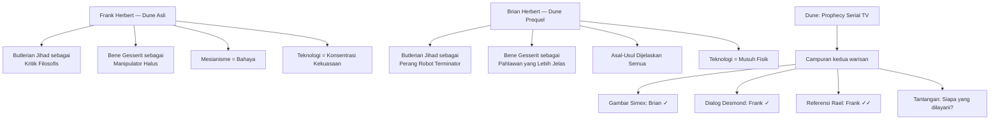
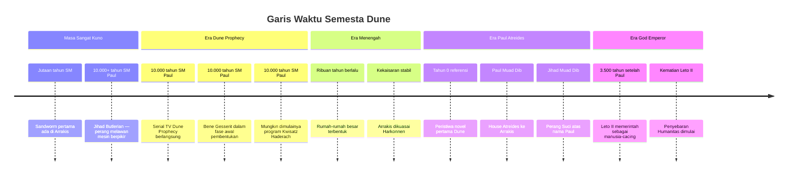

## 🌌 Pendahuluan: Dune Kembali ke Layar — Kali Ini 10.000 Tahun Lebih Awal

Setelah bertahun-tahun dalam limbo produksi, setelah berganti nama, berganti showrunner, dan melewati berbagai spekulasi yang hampir tiada ujungnya di antara penggemar berat, serial TV **Dune: Prophecy** akhirnya ditayangkan di HBO. 📺

Awalnya proyek ini diumumkan sebagai *Dune: The Sisterhood*, lalu berganti menjadi *Dune: Prophecy* — perubahan judul yang sendirinya sudah menuai banyak diskusi. Tetapi yang jauh lebih penting dari judul adalah pertanyaan besar yang sejak awal menghantui para penggemar serius Dune:

**Apakah serial TV ini akan mencerminkan kedalaman gagasan Frank Herbert yang sesungguhnya, atau akan mengikuti jejak novel-novel Brian Herbert yang banyak dinilai jauh dari roh asli semesta Dune?** 🤔

Artikel ini membahas secara sangat mendalam episode pertama *Dune: Prophecy* berdasarkan diskusi yang kaya antara beberapa analis dan penggemar Dune berpengalaman — termasuk **AltShiftX**, **Gom Jabbar Podcast**, dan **Nerdcookies** — yang melakukan *deep dive* lore segera setelah episode pertama tayang. Saya tidak sekadar meringkas diskusi itu. Saya menggunakan analisis mereka sebagai titik masuk untuk membahas:

- apa yang membuat episode pertama berhasil dan gagal,
- siapa **Desmond Hart** dan mengapa ia menjadi karakter paling menarik,
- apa itu **rael** dan mengapa referensi ke *God Emperor of Dune* itu sangat penting,
- bagaimana Bene Gesserit beroperasi dan mengapa sekolah perempuan kuno ini begitu sentral,
- **perbedaan fundamental** antara visi Frank Herbert dan novel-novel Brian Herbert,
- dan mengapa semua ini masih sangat relevan dengan dunia kita hari ini. 🧠

Kalau diringkas dalam satu kalimat:

> **Dune: Prophecy adalah upaya yang penuh potensi sekaligus penuh risiko: ia berambisi menghidupkan semesta yang sangat kaya filosofis, tetapi harus menavigasi antara kedalaman ide Frank Herbert dan warisan Brian Herbert yang kontroversial.**

---

## 📛 Mengapa Judul Berubah: Dari "The Sisterhood" ke "Prophecy"

Detail pertama yang menarik untuk dikupas adalah perubahan nama. Proyek ini semula diumumkan sebagai *Dune: The Sisterhood*, yang langsung mengacu ke **novel *Sisterhood of Dune* karya Brian Herbert dan Kevin J. Anderson**. Lalu berganti menjadi *Dune: Prophecy*. 📛

Ada beberapa kemungkinan mengapa pergantian ini terjadi:

1. **Distansiasi dari Brian Herbert** — Showrunner Allison Schroeder dalam beberapa wawancara menegaskan bahwa ini bukan adaptasi langsung dari *Sisterhood of Dune*, melainkan sebuah karya orisinal yang "terinspirasi" oleh semesta tersebut. Pergantian nama memperkuat posisi ini.

2. **Fokus cerita yang lebih luas** — Showrunner juga menyatakan bahwa *Prophecy* mengacu pada lebih dari sekadar Bene Gesserit; ia juga tentang politik Imperium dan karakter seperti Desmond Hart yang berkaitan dengan konsep "burning truth" *(kebenaran yang membakar)*.

3. **Aksesibilitas audiens umum** — Nama "The Sisterhood" mungkin terasa terlalu tertutup bagi penonton baru pasca-film Villeneuve yang tidak akrab dengan novel-novel Brian Herbert.

4. **Koneksi ke film Villeneuve** — Serial ini secara eksplisit menyatakan berlangsung "10.000 tahun sebelum Paul Atreides", menyambungkan dirinya ke peristiwa yang kini lebih dikenal audiens mainstream.

Perubahan judul ini kecil tapi bermakna: ia menunjukkan bahwa para kreator ingin memisahkan diri sebisa mungkin dari reputasi campuran novel-novel Brian Herbert, sambil tetap beroperasi dalam batasan kontrak yang melibatkan estate Herbert.

---

## 🔥 Bagian 1: Desmond Hart — Karakter Paling Menarik dan Paling Misterius

Tanpa diragukan, salah satu elemen paling kuat dari episode pertama adalah kehadiran **Desmond Hart**, diperankan oleh **Travis Fimmel** *(dikenal dari serial Vikings)*. 🔥

Desmond adalah prajurit veteran yang entah bagaimana selamat dari serangan cacing pasir di Arrakis — yang dalam logika semesta Dune hampir tidak mungkin tanpa penjelasan yang sangat luar biasa. Ia juga tampaknya memiliki kemampuan misterius untuk membakar orang dari dalam, atau setidaknya mengaktifkan proses pembakaran yang mengerikan.

Apa yang membuat Desmond begitu menarik bukan sekadar kekuatannya, tetapi **ambiguitas moralnya**. Ia mengatakan hal-hal yang benar. Ia menyatakan bahwa Bene Gesserit sedang memanipulasi Imperium dan bahwa manusia hanya "mengganti mesin yang mengontrol mereka dengan penyihir yang mengontrol mereka". Ini bukan pernyataan jahat. Ini adalah **kritik yang sangat sahih secara Dune-ian** terhadap sistem yang Bene Gesserit jalankan. 

Dan itu persis seperti yang Frank Herbert lakukan dalam novel-novelnya: membuat karakter yang berbuat kejam tetapi berkata benar. Itulah mengapa Desmond menjadi magnetis. Kita ingin ia salah, tetapi kita tidak bisa sepenuhnya menolak argumennya.

### Kekuatan Desmond: Teknologi atau Kekuatan Psikis?

Ada dua teori utama tentang asal kekuatan Desmond:

**Teori 1: Teknologi Ixian** *(dari planet Ix yang spesialis teknologi canggih dan sering memainkan batas aturan Jihad Butlerian)*
- Ini didukung oleh fakta bahwa Desmond berbicara soal "apakah manusia terlalu tergesa-gesa membuang mesin berpikir"
- Koneksi ke *rael* — sejenis mesin atau zat yang disebutkan dalam *God Emperor of Dune* dan dikaitkan dengan kemampuan melihat masa depan — memperkuat kemungkinan ini
- Sebuah implant Ixian yang berfungsi seperti amplifier *(penguat)* kekuatan pembakaran lebih konsisten dengan logika semesta Frank Herbert

**Teori 2: Kekuatan Psikis Bawaan**
- Beberapa analis menyebut kemungkinan ia keturunan dari **sorceresses of Rossak** *(penyihir dari planet Rossak yang punya kemampuan psikis bawaan, disebutkan dalam novel Brian Herbert)*
- Jika ini benar, ini membawa arah yang lebih "Brian Herbert" dan kurang disukai penggemar Frank Herbert murni
- Ada kecemasan bahwa kekuatan psikis semacam ini tidak konsisten dengan filosofi Dune karya Frank yang menekankan **latihan, disiplin, dan kesadaran** — bukan kekuatan supernatural bawaan

**Yang Paling Menarik:** Fakta bahwa Desmond menyentuh kepalanya saat menggunakan kekuatannya — seolah merasakan sakit atau tekanan — lebih menunjuk ke teknologi implant ketimbang kekuatan murni.

### Teori Ghola: Apakah Desmond Reborn?

Desmond sendiri menyebutkan kata **"reborn"** *(terlahir kembali)* saat menceritakan pengalamannya selamat dari serangan cacing pasir. Para analis langsung menangkap kata kunci itu karena dalam semesta Dune, **ghola** *(atau goola)* adalah istilah untuk klon manusia yang dibuat dari jaringan orang mati. 🧬

Jika Desmond adalah ghola, itu menjelaskan bagaimana ia "selamat" dari cacing pasir: tubuh aslinya mati, lalu direkonstruksi. Tetapi ada masalah: pada era 10.000 tahun sebelum Paul Atreides, teknologi ghola semestinya belum berkembang sepenuhnya, dan ghola awal tidak memiliki memori orang aslinya. Jadi jika ia ghola, bagaimana ia tahu dirinya adalah Desmond Hart?

Kecuali — dan ini teori yang sangat menarik — ia adalah **eksperimen awal yang tidak sempurna**, sebuah proto-ghola yang memori rekonstruksinya tidak stabil atau parsial.

### Desmond sebagai Mesias Palsu

Salah satu paralel yang sangat penting adalah kesamaan antara Desmond dan figur **Manford Torondo** dalam novel Brian Herbert — seorang fanatik yang meledak-ledak dengan keyakinan keras dan tidak segan menggunakan kekerasan. Tetapi berbeda dari Manford yang secara datar anti-teknologi, Desmond lebih kompleks. 

Ia tampak **religius**, berbicara tentang "kekuatan di luar manusia dan mesin", dan ada nuansa bahwa ia merasakan dirinya sebagai alat Tuhan. Ini menjadikannya sangat *Dune*-ian dalam pengertian terbaik: seseorang yang secara objektif melakukan kejahatan *(membakar anak)*, tetapi memiliki sistem kepercayaan yang konsisten dari sudut pandangnya sendiri.

<Callout type="warning" title="Tentang Kekuatan Desmond Hart">
Apapun penjelasan asal kekuatannya — Ixian, psikis, atau ghola — yang terpenting secara tematik adalah bahwa Desmond berfungsi sebagai perwakilan dari ancaman yang tidak bisa dikontrol oleh Bene Gesserit. Ia adalah "wild card" — kartu liar yang tidak masuk dalam kalkulasi mereka. Dan itu sangat sesuai dengan tema besar Dune tentang keterbatasan rencana jangka panjang.
</Callout>

---

## 🕯️ Bagian 2: Rael dan Referensi God Emperor — Deep Cut yang Mengejutkan

Salah satu momen yang paling mengejutkan dan paling dihargai penggemar berat dalam episode pertama adalah penyebutan kata **rael** *(atau "a-rael")* dalam dialog. 🕯️

Ini adalah referensi yang sangat dalam ke *God Emperor of Dune* — buku keempat dari seri Frank Herbert. Dalam novel itu, dengan nafas terakhirnya sang Tiran Leto II berkata kepada para murid-muridnya:

> *"Do not fear the Ixians. They can make the machines but they can no longer make the rael."*
> *"Jangan takuti orang-orang Ixian. Mereka bisa membuat mesin, tetapi mereka tidak lagi bisa membuat rael."*

Apa itu rael? Frank Herbert sendiri tidak pernah menjelaskan sepenuhnya. Dan itu disengaja. Ia adalah salah satu dari sekian banyak "jurang misterius" dalam semesta Dune — sesuatu yang disebutkan tapi tidak dihabiskan penjelasannya, sehingga imajinasi pembaca tetap aktif.

Yang diketahui: rael tampaknya terkait dengan kemampuan melihat masa depan, dan Ixian pernah bisa membuatnya tetapi kemudian tidak lagi. Artinya rael bisa jadi semacam **artefak atau teknologi yang memperkuat presensi** *(kemampuan melihat masa depan)*. 

Referensi ini penting karena beberapa alasan:
1. Ini menunjukkan bahwa setidaknya sebagian penulis dan kreator serial ini **benar-benar membaca dan memahami buku-buku Frank Herbert yang dalam**, termasuk buku keempat yang tidak semua penggemar baca.
2. Ini bisa menjadi jembatan antara misteri Desmond Hart dan lore Ixian yang lebih besar.
3. Ini bisa menjadi "love letter" kepada penggemar hardcore Frank Herbert, semacam sinyal: *"kami tahu kami harus memasukkan elemen Brian Herbert, tetapi kami juga tahu apa yang penting bagi kalian."*

---

## 👁️ Bagian 3: Bene Gesserit — Bukan Sekadar Biarawati, Tetapi Mesin Politik Bayangan yang Sangat Tua

Inti dari *Dune: Prophecy* adalah Bene Gesserit. Episode pertama ini memperlihatkan ordo itu dalam fase yang lebih muda dan kurang matang dibanding yang kita lihat di film Villeneuve. Mereka baru saja melewati era pasca-Jihad Butlerian, baru saja membangun fondasi, dan belum lagi menjadi kekuatan bayangan yang sempurna. 👁️

Dua karakter sentral dari Bene Gesserit di serial ini adalah:
- **Valya Harkonnen** *(Valia)* — seorang Reverend Mother *(Ibu Terhormat)* yang ambisius, dingin, dan mau melakukan apa saja untuk misi Bene Gesserit
- **Tula Harkonnen** — saudara Valya yang lebih pragmatis

Salah satu hal menarik: keduanya adalah keturunan dari klan **Harkonnen** yang di era Paul Atreides dikenal sebagai musuh bebuyutan keluarga Atreides. Ini menambah lapisan ironis dalam narasi jangka panjang Dune: musuh besar yang datang 10.000 tahun setelah kisah ini justru lahir dari ordo yang di awal semua ini sedang mencoba memperbaiki nama keluarga mereka.

Episode pertama menampilkan beberapa momen yang sangat Bene Gesserit:
- Adegan di mana dua Truthsayer *(pendeteksi kebenaran)* dari dua kubu berbeda saling berbicara rahasia di belakang punggung tuannya
- Dialog tentang program pemuliaan genetik yang masih samar
- Konflik internal antara fraksi Valya dan fraksi Doratha yang berbeda pandangan tentang cara Bene Gesserit harus beroperasi

Yang paling menarik bagi penggemar Frank Herbert adalah **paradoks Bene Gesserit**: mereka mengatakan tidak religius, tetapi semua yang mereka lakukan sarat dengan ritual, simbolisme, dan semacam devosi. Dalam novel-novel Frank, ordo ini punya baris yang sangat terkenal: *"Thou shalt not disfigure the soul."* — yang dapat diterjemahkan sebagai "Janganlah engkau memutilasi jiwa" — suatu prinsip hidup yang sangat dalam tentang menjaga kemanusiaan di tengah pencarian kekuasaan.

---

## 🏛️ Bagian 4: Kaisar Javicco, Putri Ynez, dan Dinamika Istana yang Lebih Kuat dari Novel

Salah satu poin yang disepakati hampir semua analis adalah bahwa karakter-karakter dari Dinasti Corrino di serial ini **jauh lebih menarik dibanding versi novel Brian Herbert**. 🏛️

**Kaisar Javicco Corrino**, diperankan oleh **Mark Strong**, digambarkan sebagai pemimpin yang sangat bergantung pada Truthsayernya — dulu bergantung pada Kasha, kini tergantung pada pengaruh Desmond Hart. Ia bukan pemimpin yang kuat atau bijak. Ia adalah pemimpin yang cukup sadar bahwa kekuasaannya butuh penopang, tetapi tidak selalu bisa memilih penopang yang tepat. Ini sangat Dune-ian: kekuasaan tertinggi sering kali justru digenggam oleh orang yang paling tidak mandiri.

**Putri Ynez** adalah kejutan menyenangkan. Berbeda dari karakter analog-nya di novel Brian Herbert yang datar dan tanpa daya, Ynez di serial ini terlihat **jauh lebih berdaya dan punya kalkulasi tersendiri**. Ada momen di mana ia secara halus menunjukkan bahwa ia tidak hanya menjadi objek perkawinan politik, tetapi juga memiliki agenda sendiri. Ia juga punya momen ekspresi ketegasan yang tidak terduga — memperingatkan seorang pangeran dengan sangat jelas bahwa ia tidak akan diancam. Ini membuat ia jauh lebih menarik sebagai karakter.

**Empress Natalya** juga hadir sebagai figur yang memiliki pengalaman, menyimpan waspada, dan tahu bagaimana dunia istana bekerja — tetapi putrinya yang muda mulai menunjukkan bahwa ia sudah belajar lebih banyak dari yang diperkirakan.

---

## ⚔️ Bagian 5: Frank Herbert vs. Brian Herbert — Perbedaan yang Sangat Fundamental

Ini mungkin adalah diskusi paling penting dan paling berulang dalam komunitas penggemar Dune ketika membahas serial TV ini. 🧠

### Versi Frank Herbert tentang Jihad Butlerian

Dalam novel-novel Frank Herbert, **Jihad Butlerian** *(Perang Suci Butlerian)* bukan tentang robot jahat ala Terminator yang memberontak dan membantai manusia. Alih-alih, Frank menggambarkannya sebagai situasi yang lebih subtil dan lebih mengerikan secara filosofis:

> **Manusia menyerahkan kemampuan berpikirnya ke mesin. Dan mesin-mesin itu kemudian dipakai oleh manusia-manusia lain untuk mengendalikan manusia lainnya.**

Artinya, bahayanya bukan pada mesin yang otonom menjadi jahat, tetapi pada **konsentrasi kekuasaan yang terjadi ketika manusia berhenti berpikir sendiri**. Ini adalah peringatan yang sangat relevan bahkan hari ini, di era AI generatif. Yang dilarang bukan teknologi per se, melainkan "mesin yang menyerupai pikiran manusia" — karena menyerahkan pikiran ke mesin berarti menyerahkan kebebasan ke siapa pun yang mengendalikan mesin itu.

### Versi Brian Herbert tentang Jihad Butlerian

Dalam novel-novel Brian Herbert *(Machine Trilogy, Sisterhood of Dune, dll.)*, Jihad Butlerian digambarkan sebagai perang Terminator: robot AI bernama **Omnius** dan **Erasmus** memimpin pemberontakan mesin berskala galaktik yang membantai miliaran manusia. Ini adalah kisah pertempuran militer epik yang jauh lebih konvensional dan lebih mudah divisualisasikan, tetapi menurut banyak penggemar Frank Herbert, ia kehilangan kedalaman filosofis yang menjadi inti gagasan aslinya.

### Mengapa Perbedaan Ini Penting untuk Serial TV?

Episode pertama *Dune: Prophecy* **membuka dengan gambar simex** — robot perang raksasa bergaya Terminator dari imajinasi Brian Herbert — yang langsung memposisikan serial ini dalam kanon Brian. Tetapi kemudian, dalam dialog Desmond Hart dengan Kaisar, ada kalimat yang jauh lebih sesuai dengan Frank:

> *"Kita tidak membuang mesin karena mereka jahat. Kita membuang mereka karena kita telah menggantinya dengan mekanisme kontrol yang baru — yaitu Bene Gesserit."*

Ini adalah **pertanyaan Frank Herbert yang sesungguhnya**: apakah mungkin kita hanya mengganti satu bentuk kontrol dengan bentuk kontrol lain? Apakah membuang mesin tetapi mengikuti ordo perempuan misterius yang memanipulasi reproduksi dan kekuasaan sejatinya berbeda?

Dan di sinilah serial ini berada di persimpangan yang sangat menarik dan sangat riskan.

<Callout type="info" title="Tentang Frank dan Brian Herbert">
Frank Herbert meninggal pada 1986 sebelum menyelesaikan buku ketujuhnya. Brian Herbert, putranya, kemudian menyelesaikan buku-buku tersebut bersama Kevin J. Anderson berdasarkan catatan Frank. Mereka juga menulis serangkaian prequel dan novel pendamping. Komunitas penggemar terbagi: sebagian menikmati perluasan ini, sebagian lainnya menilai novel-novel Brian tidak menangkap kedalaman tematik Frank.
</Callout>

---

---

## 🌿 Bagian 6: Konflik Internal Bene Gesserit — Valia vs. Doratha

Salah satu elemen yang paling berpotensi secara tematik adalah **konflik internal** di dalam Bene Gesserit sendiri antara Valya dan kelompok Doratha. 🌿

Dalam novel Brian Herbert, konflik ini sangat disederhanakan: Doratha adalah kelompok "komputer itu jahat", sementara Valya adalah kelompok "komputer itu berguna diam-diam". Serial TV tampaknya ingin memberi kedalaman lebih pada konflik ini.

Dalam *Heretics of Dune* dan *Chapter House: Dune* karya Frank Herbert, ada konflik serupa di dalam Bene Gesserit antara kelompok "zealot" *(fanatik)* dan "heretic" *(bidah)* — mereka yang mau mempertahankan cara lama versus yang mau beradaptasi. Dan justru konflik internal ini adalah salah satu hal paling menarik tentang ordo tersebut: organisasi yang bertahan ribuan tahun bukan karena monolitik, tetapi karena mampu bertengkar secara internal sambil tetap mempertahankan misi.

Referensi ke "Chapter House" sangat tepat karena secara tonal, *Dune: Prophecy* terasa lebih dekat ke buku-buku Frank yang belakangan dibanding ke novel Brian Herbert: ada ancaman eksistensial yang tidak bisa dikendalikan, ada Reverend Mother yang mencoba menavigasi jalan sempit antara kehancuran dan keselamatan, ada perpecahan yang harus disembuhkan, dan ada pertanyaan besar tentang apakah rencana jangka panjang mereka justru adalah akar masalahnya.

---

## ⏰ Bagian 7: Masalah Timeline 10.000 Tahun yang Tidak Terasa 10.000 Tahun

Salah satu kritik yang paling konsisten dari penonton — baik penggemar Dune maupun penonton umum — adalah bahwa meski berlangsung 10.000 tahun sebelum Paul Atreides, semesta visual dan politik yang digambarkan terasa hampir **identik** dengan era film Villeneuve. ⏰

Kapal terlihat sama. Perisai energi terlihat sama. Struktur kekuasaan terlihat sangat mirip. Bahkan Bene Gesserit sudah tampak seperti versi lengkap dari ordo yang kita lihat di film, padahal secara logika naratif mereka seharusnya masih dalam fase sangat awal.

Ada dua perspektif untuk ini:

### Perspektif kritis
Kalau tujuannya adalah prequel yang menjelaskan bagaimana semesta terbentuk, maka perbedaan yang sangat minimal secara visual dan struktural antara "10.000 tahun yang lalu" dan "masa kini Paul Atreides" membuat kita bertanya: apa poin dari perjalanan waktu sejauh ini kalau tidak ada yang berubah?

### Perspektif in-universe
Di dalam logika semesta Dune, stagnasi memang disengaja. **Jihad Butlerian** menghancurkan infrastruktur teknologi dan memaksa manusia membangun ulang dengan sangat lambat. Lato II dalam *God Emperor of Dune* justru mendedikasikan 3.500 tahun pemerintahannya untuk memaksa stagnasi tersebut — agar umat manusia yang akhirnya menyebar setelah kematiannya tidak bisa dikendalikan oleh satu entitas mana pun. Jadi stagnasi teknologi adalah fitur, bukan bug.

Tetapi tetap saja, bagi audiens umum yang tidak membaca novel, melihat teknologi yang sama persis di dua era yang katanya berjarak 10.000 tahun terasa janggal. Dan ini adalah salah satu tantangan inheren dari prequel yang ditetapkan terlalu jauh ke belakang.

---

## 🎭 Bagian 8: Pilot Episode — Berhasil di Mana dan Gagal di Mana?

Tidak ada yang bisa jujur membahas *Dune: Prophecy* tanpa mengakui bahwa episode pertamanya **terasa tidak rata**. Ada bagian-bagian yang sangat kuat dan ada bagian-bagian yang tidak terasa seperti dunia Dune sama sekali. 🎭

### Yang Berhasil

- **Desmond Hart dan Kaisar Javicco** — interaksi antara keduanya adalah puncak episodik yang paling tajam dan paling *Dune*-ian
- **Kematian Kasha** — Reverend Mother yang membakar, dan dalam detik-detik terakhirnya berusaha menyampaikan informasi terakhir kepada Valia, adalah momen penuh emosi yang tepat menggambarkan dedikasi anggota Bene Gesserit
- **Adegan dua Truthsayer yang berbicara rahasia satu sama lain** — momen klasik manipulasi Bene Gesserit yang membuat kita senyum kecut
- **Referensi deep lore** seperti rael dan nuansa God Emperor

### Yang Kurang Berhasil

- **Adegan klub malam** — terasa tidak Dune sama sekali; terlalu generik dystopian sci-fi, terlalu mirip adegan CW atau cyberpunk murah
- **Romansa antara Ynez dan Kieran Atreides** — dialog di sekitar ini terasa terlalu YA *(Young Adult / Romance Remaja)* dibanding kedalaman tematik Dune
- **Eksposisi pembuka yang panjang** — 15 menit pertama dipenuhi narasi voiceover dan title card yang terlalu banyak menjelaskan, padahal metode Frank Herbert justru adalah "melempar pembaca ke dalam dan biarkan ia belajar sambil berlayar"
- **Terlalu banyak karakter diperkenalkan sekaligus** — bahkan penonton yang sudah membaca semua enam novel Frank Herbert pun bisa kewalahan

Perbandingan yang sering muncul adalah dengan **pilot Game of Thrones** yang sangat berbeda pendekatannya. Game of Thrones episode satu memperkenalkan dunia lewat karakter yang segera kita sukai atau kagumi — Ned Stark, Tyrion Lannister, Jon Snow. Kita peduli pada mereka lebih dulu, dunia mereka belakangan. Dune: Prophecy pilot melakukan sebaliknya: ia menunjukkan dunianya terlebih dahulu dan membiarkan kita bertanya-tanya siapa yang harus kita pedulikan.

---

## 🌊 Bagian 9: Kwisatz Haderach, Visi Biru, dan Pertanyaan Apakah Itu Leto II

Salah satu tema rekuren dalam diskusi mendalam tentang episode ini adalah pertanyaan tentang **visi mata biru** yang muncul beberapa kali — di penglihatan Kasha, di penglihatan Valia. Siapakah sosok biru itu? 🌊

Beberapa teori:
1. **Paul Atreides** — referensi ke pemimpin yang akan lahir 10.000 tahun kemudian
2. **Leto II, God Emperor** — sang Tiran yang akan hidup ribuan tahun dalam bentuk manusia-cacing, dengan mata biru
3. **Sebuah mesin atau AI** — karena mata biru menyala dengan suara mesin, ada yang membaca ini sebagai omnius atau pendahulu AI

Para analis cenderung percaya bahwa ini disengaja untuk **ambigu** — membuat penonton bisa membaca itu sebagai Paul atau Leto tergantung selera dan pengetahuan mereka. Dan itu adalah cara bermain yang cerdas.

Yang lebih penting secara tematik: episode ini sangat menekankan bahwa keputusan Bene Gesserit untuk memulai **program Kwisatz Haderach** *(penciptaan supermanusia melalui rekayasa garis keturunan)* belum terjadi di sini. Baru akan terjadi. Dan mungkin itulah salah satu busur narasi besar serial ini: **apa yang memicu Bene Gesserit untuk memutuskan bahwa mereka perlu menciptakan mesias mereka sendiri?**

Desmond Hart bisa saja jawabannya. Jika Desmond adalah figur yang tidak bisa dikendalikan atau diprediksi oleh Bene Gesserit, mungkin kegagalan mereka menghadapinya adalah pelajaran pertama bahwa mereka membutuhkan seseorang yang bahkan lebih luar biasa — seseorang yang bisa melihat apa yang mereka tidak bisa lihat.

---

---

## 🧠 Bagian 10: Mengapa Frank Herbert Lebih Relevan dari Sebelumnya

Salah satu momen paling jujur dan paling penting dalam diskusi antara para analis adalah ketika dikatakan bahwa **tema-tema Frank Herbert lebih relevan sekarang di tahun 2024-2026 dibanding saat novel itu ditulis di tahun 1960-an**. 🧠

Dalam *Dune*, Jihad Butlerian adalah reaksi terhadap masyarakat yang menyerahkan kemampuan berpikir kepada mesin. Hari ini, kita menyaksikan korporasi-korporasi terbesar di dunia — Google, Apple, Microsoft, Meta, dan banyak lainnya — menginvestasikan miliaran dolar untuk mempromosikan AI generatif yang akan:
- menulis untuk kita,
- membuat keputusan untuk kita,
- berkomunikasi atas nama kita.

Frank Herbert menulis tentang bahaya ini puluhan tahun lalu. Bukan bahwa mesin menjadi jahat. Tetapi bahwa ketika manusia membiarkan mesin berpikir untuk mereka, kekuasaan terkonsentrasi ke tangan mereka yang mengendalikan mesin tersebut.

Ini adalah kekhawatiran yang jauh lebih halus dan lebih berbahaya daripada narasi robot jahat ala Terminator. Dan itulah mengapa banyak penggemar hardcore Dune khawatir jika serial TV ini terlalu menekankan elemen Brian Herbert tentang perang robot: ia menyederhanakan peringatan Frank menjadi sesuatu yang mudah dicerna tetapi kehilangan bagian terpentingnya.

---

## 📊 Ringkasan: Kekuatan dan Kelemahan Dune: Prophecy Episode Pertama

| Aspek | Nilai | Catatan |
| :--- | :--- | :--- |
| **Desmond Hart** | ⭐⭐⭐⭐⭐ | Karakter terkuat dan paling menarik |
| **Bene Gesserit political maneuvering** | ⭐⭐⭐⭐ | Adegan dua Truthsayer sangat Dune-ian |
| **Kaisar Javicco dan istana** | ⭐⭐⭐⭐ | Jauh lebih menarik dari novel Brian |
| **Kematian Kasha** | ⭐⭐⭐⭐ | Emosional dan bermakna |
| **Referensi rael / God Emperor** | ⭐⭐⭐⭐⭐ | Deep cut yang sangat dihargai |
| **Adegan klub malam** | ⭐ | Tidak terasa Dune sama sekali |
| **Romansa Ynez-Kieran** | ⭐⭐ | Terlalu YA, dialog terasa generik |
| **Eksposisi pembuka** | ⭐⭐ | Terlalu padat dan terlalu cepat |
| **Konsistensi tone** | ⭐⭐ | Terasa ditulis oleh tim berbeda |
| **Aksesibilitas audiens umum** | ⭐⭐ | Terlalu berat untuk non-penggemar |
| **Potensi ke depan** | ⭐⭐⭐⭐ | Banyak tanda positif jika fokus pada kekuatannya |

---

## 🔮 Bagian 11: Prediksi dan Harapan untuk Serial ke Depan

Berdasarkan diskusi mendalam, ada beberapa harapan dan prediksi yang layak dicermati. 🔮

### Prediksi yang masuk akal
- **Desmond Hart tidak bertahan sampai akhir musim satu** — ia kemungkinan adalah "big bad" musim ini yang mati dramatis dan berkesan
- **Ada adegan ghola atau spice agony** yang akan menjelaskan atau mengonfirmasi sesuatu tentang Desmond
- **Kita akan ke Arrakis** — sudah disebutkan berkali-kali dan ada karakter dengan mata biru di klub malam
- **Konflik Valia vs. ancaman Desmond** akan menjadi busur utama musim satu
- **Akan ada revelation tentang program breeding Bene Gesserit** — momen di mana mereka memutuskan untuk memulai proyek Kwisatz Haderach

### Yang diharapkan terjadi
- Lebih banyak adegan yang menggali **kedalaman filosofis Frank Herbert** — tentang kesadaran, pilihan sadar, bahaya rencana jangka panjang
- **Kurangi adegan klub malam** dan elemen cyberpunk generik yang tidak terasa Dune
- Pengembangan lebih jauh pada **paradoks Bene Gesserit**: mereka bilang tidak religius tapi semua yang mereka lakukan adalah ritual dan devosi
- Momen yang membuat kita **ragu dan bimbang antara Bene Gesserit dan Desmond** — tidak ada "good guys" dan "bad guys" yang jelas

### Yang dikhawatirkan
- Serial terlalu cepat dibatalkan karena rating tidak memenuhi ekspektasi HBO
- Elemen Brian Herbert *(robot, teknologi Ixian yang terlalu eksplisit)* mendominasi dan menggeser kedalaman tematik
- Lima episode tersisa tidak cukup untuk membangun kedalaman yang diperlukan

---

## 🪶 Bagian 12: Dune dan AI — Peringatan yang Terlambat Didengar

Sebelum menutup, ada satu refleksi besar yang tidak bisa dilewatkan. 🪶

Frank Herbert menulis *Dune* di awal 1960-an, di tengah kegembiraan era komputer awal dan munculnya penelitian ESP *(extrasensory perception / persepsi indera tambahan)*. Ia menyaksikan optimisme teknologi yang belum melihat batas-batasnya. Dan justru di saat itulah ia mulai memperingatkan: bahwa ketergantungan manusia pada mesin untuk berpikir bisa menjadi bentuk baru perbudakan.

Hari ini, kita hidup dalam dunia di mana peringatan itu semakin relevan. Bukan karena mesin menjadi jahat, tetapi karena:
- AI dipakai untuk membuat konten yang memengaruhi pilihan politik,
- algoritma memutuskan apa yang kita lihat dan percaya,
- perusahaan teknologi mengumpulkan data untuk memprediksi dan memengaruhi perilaku manusia.

Ini bukan *Terminator*. Ini jauh lebih halus dan jauh lebih Frank Herbert.

Itulah mengapa *Dune: Prophecy* punya potensi untuk menjadi sesuatu yang sangat penting — bukan hanya hiburan, tetapi percakapan tentang pertanyaan-pertanyaan yang paling mendasar di era kita:

- Kepada siapa kita menyerahkan kemampuan berpikir kita?
- Apakah kita percaya pada sistem yang tidak kita pilih?
- Dan apakah "penyelamat" yang kita harapkan tidak justru membawa bentuk pengendalian yang baru?

---

<Callout type="important" title="Mengapa Serial Ini Penting?">
Dune: Prophecy bukan hanya tentang Bene Gesserit dan cacing pasir. Ia berpotensi menjadi percakapan serius tentang kekuasaan, teknologi, agama, dan bahaya menyerahkan nasib kepada sistem yang tidak transparan — tema yang sangat relevan dengan dunia 2024-2026.
</Callout>

---

## 📖 Kesimpulan: Potensi Besar, Risiko Nyata, Harapan Tetap Ada

*Dune: Prophecy* episode pertama adalah sebuah **awal yang tidak merata, tetapi penuh potensi**. Ia menunjukkan tanda-tanda bahwa para kreatornya memahami kedalaman semesta Frank Herbert — referensi ke rael, dialog Desmond Hart yang berbunyi seperti kritik Frank terhadap kekuasaan, dan beberapa momen Bene Gesserit yang sungguh-sungguh terasa seperti dunia novel aslinya.

Pada saat yang sama, ia juga menunjukkan beberapa kompromi yang tidak bisa dihindari: elemen visual Brian Herbert, adegan-adegan yang terasa seperti ditulis untuk audiens berbeda, dan terlalu banyak karakter yang diperkenalkan terlalu cepat.

Tetapi yang paling penting adalah ini: serial ini memiliki **karakter yang benar-benar menarik dalam Desmond Hart**, sebuah **pertanyaan sentral yang sangat Dune-ian** tentang apakah Bene Gesserit adalah penyelamat atau bentuk kontrol baru, dan **latar yang kaya** untuk mengeksplorasi ide-ide yang paling relevan dengan zaman kita.

Kita belum tahu apakah serial ini akan berkembang menjadi sesuatu yang benar-benar besar dan bermakna, atau apakah ia akan terbebani oleh kompromi lore dan tekanan produksi. Tetapi satu hal yang jelas: selama Desmond Hart ada di layar, dan selama dialognya berbunyi seperti Frank Herbert, ada alasan untuk terus menonton. 🌟

> **"Kebenaran yang membakar bukan kebenaran yang menyakitkan. Ia adalah kebenaran yang tidak bisa lagi kamu abaikan setelah kamu melihatnya."**

---

<Callout type="cite" title="Referensi Sumber">
- Podcast transkrip: *Dune Prophecy Deep Dive with AltShiftX, Gom Jabbar Podcast & Nerdcookies*
- Sumber video: [YouTube](https://www.youtube.com/watch?v=8fffUCb1Nhc)
- Novel referensi utama: *Dune* (1965), *God Emperor of Dune* (1981), *Heretics of Dune* (1984), *Chapter House: Dune* (1985), *Sisterhood of Dune* (2012) — karya Frank Herbert dan Brian Herbert
- Serial: *Dune: Prophecy* Episode 1, HBO Max (2024)
</Callout>
