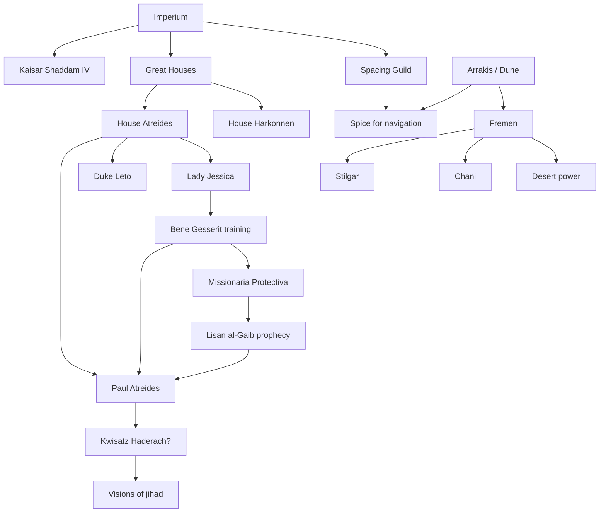
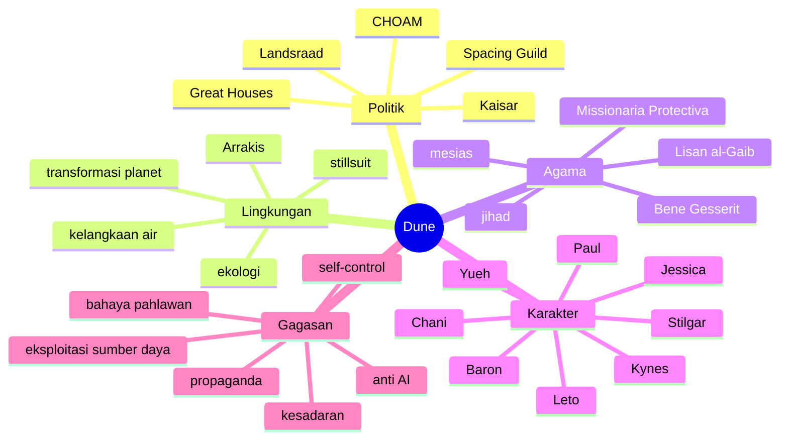

## 🌌 Pendahuluan: Dune Bukan Sekadar Film Gurun, Cacing Raksasa, dan Takdir Anak Muda Terpilih

Bagi banyak penonton, *Dune* pertama kali datang sebagai pengalaman yang indah sekaligus membingungkan. Kita melihat gurun yang sangat luas, kapal antariksa yang terasa seperti katedral besi, cacing pasir raksasa, perempuan-perempuan misterius dengan kekuatan suara, politik antarklan, rempah bernama *spice*, dan seorang anak muda bernama **Paul Atreides** yang terus-menerus dihantui penglihatan tentang masa depan. Secara visual, semuanya terasa megah. Tetapi secara naratif, banyak hal justru dibiarkan setengah terbuka. 🌌

Itulah sebabnya *Dune* sering membuat penonton awam merasakan dua emosi sekaligus: kagum dan bingung. Filmnya tampak seperti sesuatu yang sangat penting sedang terjadi, tetapi sering kali kita belum benar-benar tahu kenapa itu penting. Mengapa semua orang berebut Arrakis? Mengapa *spice* begitu sentral? Kenapa di masa depan tidak ada komputer? Siapa sebenarnya **Bene Gesserit**? Apakah Paul benar-benar pahlawan, atau justru benih bencana? Dan mengapa cerita ini terasa jauh lebih berat daripada sekadar petualangan fiksi ilmiah biasa? 🤔

Jawabannya sederhana tetapi luas: *Dune* memang bukan sekadar kisah petualangan luar angkasa. Ia adalah novel yang sangat padat secara gagasan. Karya **Frank Herbert** ini memadukan:
- politik feodal,
- teori kekuasaan,
- agama sebagai alat mobilisasi,
- ekologi dan hubungan manusia dengan lingkungan,
- kritik terhadap kolonialisme dan eksploitasi sumber daya,
- eksperimen terhadap kesadaran,
- dan kecurigaan mendalam terhadap figur “penyelamat” atau *messiah* *(mesias / tokoh juru selamat)*. 🧠

Karena itulah *Dune* sering disebut “unfilmable” *(sulit difilmkan)*. Bukan karena ceritanya mustahil divisualisasikan, tetapi karena jantung novel ini justru ada pada **lapisan batin, intrik tersembunyi, motivasi yang tidak diucapkan, dan gagasan-gagasan besar** yang bekerja di balik peristiwa. Film 2021 karya Denis Villeneuve berhasil menangkap atmosfer dan skala dunianya dengan sangat baik. Tetapi seperti dibahas dalam video sumber, film itu tetap menyederhanakan banyak hal. Ia menghilangkan beberapa plot penting, menghaluskan sisi gelap beberapa tokoh, dan dalam beberapa tempat membuat kisahnya terasa lebih heroik daripada novel aslinya. 🎬

Maka kalau kita ingin memahami *Dune* secara lebih utuh, kita harus masuk ke “Dune yang sebenarnya”: 
- dunia politiknya,
- struktur sosialnya,
- filsafat manusianya,
- ekologi Arrakis,
- peran *spice* sebagai komoditas sekaligus wahyu,
- dan terutama kritik Herbert terhadap agama, kekuasaan, serta bahaya menyerahkan nasib manusia pada figur besar. 

Artikel ini akan membedah *Dune* secara **sangat detail, mendalam, dan lengkap** berdasarkan pembacaan dunia novelnya serta perbandingan penting dengan film. Saya tidak akan berhenti pada “apa yang terjadi”, tetapi juga akan masuk ke “mengapa itu penting” dan “apa makna gagasannya”. 

Kalau diringkas dalam satu kalimat:

> **Dune adalah kisah tentang bagaimana kekuasaan, agama, lingkungan, dan imajinasi masa depan bertemu untuk menciptakan dunia yang sangat indah, sangat cerdas, dan sangat berbahaya.** 🏜️

---

## 🧭 Tesis Utama: Dune Adalah Kritik terhadap Mesias, Kekuasaan, dan Ilusi Bahwa Manusia Bisa Mengendalikan Segalanya

Tesis utama yang paling tepat untuk membaca *Dune* adalah ini:

> **Dune bukan sekadar kisah naiknya seorang pahlawan, melainkan peringatan tentang bahaya mesianisme, manipulasi agama, politik aristokratik, eksploitasi sumber daya, dan keyakinan manusia bahwa ia bisa mengendalikan masa depan dengan sepenuhnya.**

Banyak pembaca atau penonton baru mengira *Dune* adalah cerita “anak terpilih” biasa: seorang bangsawan muda kehilangan ayahnya, selamat dari pengkhianatan, lalu bergabung dengan kaum lokal gurun dan pelan-pelan menjadi pemimpin mereka. Kalau dibaca di permukaan, memang tampak begitu. Tetapi Frank Herbert justru sedang menyusun jebakan intelektual. Ia memberi kita bentuk luar kisah kepahlawanan, lalu pelan-pelan membaliknya dari dalam. 🪤

Paul memang luar biasa.
Ia memang punya visi.
Ia memang terlatih.
Ia memang berada di pusat sejarah.
Tetapi semua itu tidak otomatis berarti ia adalah keselamatan.

Justru salah satu pesan terbesar *Dune* adalah bahwa orang-orang yang dianggap penyelamat sering membawa bentuk kehancuran yang jauh lebih besar karena mereka didukung oleh keyakinan massa, legitimasi agama, dan struktur politik yang membuat semua kritik seolah tidak sah lagi. 

Maka *Dune* harus dibaca bukan sebagai glorifikasi pahlawan, tetapi sebagai studi tentang:
- bagaimana pahlawan diciptakan,
- bagaimana mitos ditanam,
- bagaimana masyarakat ingin percaya,
- dan bagaimana lingkungan serta sumber daya membentuk konflik politik yang tampak seperti takdir. 🧩

---

## 👑 Bagian 1: Struktur Dunia Dune — Kekaisaran Antargalaksi yang Feodal, Tidak Modern, dan Sangat Tidak Setara

Salah satu hal paling penting untuk dipahami sejak awal adalah bahwa *Dune* bukan masa depan yang “modern” dalam arti biasa. Ini bukan dunia di mana demokrasi liberal, teknologi merata, dan kemajuan ilmiah membebaskan semua orang. Justru sebaliknya: *Dune* adalah **masa depan yang kembali feodal**. 👑

Di puncak struktur politik ada **Padishah Emperor** *(Kaisar)*, yaitu **Shaddam IV**. Di bawahnya ada **Great Houses** *(Klan-keluarga besar bangsawan)* seperti House Atreides dan House Harkonnen. Masing-masing House menguasai planet, punya tentara, kekayaan, dan pengaruh politik sendiri. Antara mereka ada kongres bernama **Landsraad**, yang berfungsi sebagai penyeimbang terhadap kekuasaan Kaisar. Di sisi lain, ada kekuatan super penting bernama **Spacing Guild**, organisasi yang mengendalikan penerbangan antarbintang. 

Artinya, semesta *Dune* tidak diatur oleh satu pusat mutlak, tetapi oleh **keseimbangan tegang** antara tiga pilar:
- Kaisar,
- para House bangsawan,
- dan Guild.

Keseimbangan ini tampak stabil, tetapi sebenarnya rapuh. Karena masing-masing pihak saling membutuhkan sekaligus saling curiga. Dan seperti dalam semua struktur feodal, yang hidup di bawahnya adalah dunia yang sangat timpang: ada bangsawan, ada pelayan, ada pekerja, ada rakyat biasa, ada budak, ada eksploitasi, ada kekerasan yang dilegalkan. 🌑

Jadi sejak awal kita harus sadar: *Dune* bukan utopia masa depan. Ia adalah masa depan yang megah, tetapi penuh ketidakadilan struktural.

---

## 💰 CHOAM, Arrakis, dan Politik Komoditas: Mengapa Semua Orang Memperebutkan Gurun?

Jika kita ingin memahami inti politik *Dune*, maka pertanyaan kuncinya sederhana: **mengapa Arrakis begitu penting?** 💰

Jawabannya adalah **spice**.

*Spice melange* adalah substansi paling berharga di alam semesta *Dune*. Ia:
- membuat perjalanan antarbintang menjadi mungkin,
- memperpanjang umur,
- memperluas kesadaran,
- memberi kemampuan visi atau prakognisi *(penglihatan terhadap masa depan)*,
- dan membuat banyak orang menjadi tergantung.

Dengan kata lain, *spice* bukan sekadar komoditas. Ia adalah:
- bahan bakar ekonomi,
- alat politik,
- teknologi kesadaran,
- komoditas strategis,
- dan hampir semacam sakramen peradaban. ✨

Masalahnya, *spice* hanya ada di satu tempat: **Arrakis**, planet gurun yang juga disebut **Dune**.

Karena hanya ada satu sumber, Arrakis menjadi pusat gravitasi politik semesta. Siapa yang menguasainya, menguasai aliran kekayaan dan transportasi. Itu sebabnya konflik di Arrakis sangat mudah dibandingkan dengan:
- perebutan minyak di Timur Tengah,
- kolonialisme atas wilayah kaya sumber daya,
- monopoli komoditas vital,
- dan bentuk-bentuk imperialisme yang selalu berbicara soal “pengelolaan” sambil sebenarnya mengejar ekstraksi. 🛢️

Sistem ekonomi besar di dunia *Dune* diwakili oleh **CHOAM** *(Combine Honnete Ober Advancer Mercantiles)*, perusahaan perdagangan raksasa yang menghubungkan House-House bangsawan ke arus kekayaan galaksi. Dalam video sumber, CHOAM dengan lucu dibandingkan seperti gabungan perusahaan kolonial lama dan Amazon versi luar angkasa. Itu analogi yang cukup tepat: ia menunjukkan bahwa politik, perdagangan, dan kekuasaan korporat menyatu erat.

Jadi Arrakis bukan sekadar latar. Ia adalah pusat konflik karena di sanalah ekonomi, agama, lingkungan, dan kekuasaan bertabrakan. 🏜️

---

## 🚫 Bagian 2: Mengapa Dune Tidak Punya Komputer, Robot, atau AI?

Salah satu aspek paling menarik dari *Dune* adalah dunia futuristiknya justru tampak seperti masa depan yang **menolak teknologi tertentu**. Ada kapal antariksa raksasa, pelindung energi, senjata canggih, dan rekayasa biologis — tetapi tidak ada komputer seperti yang kita bayangkan. Tidak ada AI yang mengatur semuanya. Tidak ada robot cerdas sebagai tulang punggung peradaban. 🚫

Ini terjadi karena dalam sejarah *Dune* pernah ada peristiwa besar bernama **Butlerian Jihad**. Ini adalah perang atau *crusade* *(perang suci / perang ideologis)* melawan **thinking machines** *(mesin berpikir)*. Inti ajarannya dirangkum dalam kalimat terkenal:

> *“Thou shalt not make a machine in the likeness of a man’s mind.”*  
> *“Janganlah engkau membuat mesin yang menyerupai pikiran manusia.”*

Ini sangat menarik karena membuat *Dune* terasa sangat relevan dengan zaman kita. Frank Herbert sudah membayangkan kemungkinan bahwa ketergantungan manusia pada mesin berpikir bisa merusak kebebasan, kesadaran, dan tanggung jawab manusia itu sendiri. 🧠

Dalam dunia *Dune*, akibat pelarangan itu, manusia justru dipaksa mengembangkan potensi dirinya sendiri. Maka lahirlah berbagai “sekolah” pengembangan manusia:
- **Mentat** sebagai “komputer manusia” yang berpikir sangat logis,
- **Spacing Guild Navigator** yang mampu mengarungi ruang dengan kesadaran berubah,
- **Bene Gesserit** yang melatih tubuh, pikiran, persepsi, dan suara hingga ekstrem.

Herbert seolah mengatakan: kalau manusia menolak menyerahkan pikirannya ke mesin, maka ia harus menanggung beban menjadi manusia sepenuhnya. Ini indah sekaligus menakutkan, karena berarti *Dune* adalah dunia di mana **manusia sendiri menjadi teknologi utama**. 🔥

---

## 🧠 Mentat, Guild, dan Bene Gesserit — Tiga Bentuk “Manusia yang Ditingkatkan”

Dalam ketiadaan komputer dan AI, dunia *Dune* mengembangkan kelas-kelas manusia khusus yang melampaui kapasitas biasa. Ini penting karena memperlihatkan bahwa Herbert tidak anti-kecerdasan atau anti-peningkatan; ia justru tertarik pada bagaimana manusia bisa diubah jika disiplin, latihan, dan lingkungan didorong sampai ekstrem. 🧠

### **Mentat**
Mentat adalah “komputer manusia”. Mereka dilatih untuk memproses data, membuat kalkulasi, membaca motif, dan membangun prediksi logis. Tokoh seperti **Thufir Hawat** adalah contoh Mentat yang bekerja sebagai penasihat strategi House Atreides.

### **Spacing Guild Navigators**
Navigators menggunakan *spice* untuk memperluas kesadaran dan melihat jalur aman melintasi ruang. Mereka memungkinkan perjalanan antarbintang. Karena itu Guild memegang monopoli vital. Semua orang membenci sekaligus membutuhkan mereka. 

### **Bene Gesserit**
Inilah salah satu elemen paling ikonik dalam *Dune*. Bene Gesserit adalah ordo perempuan kuno yang melatih tubuh dan pikiran sampai nyaris supramanusia. Mereka bisa:
- mengendalikan otot dan saraf dengan presisi ekstrem,
- membaca emosi lewat bahasa tubuh dan intonasi,
- menggunakan **Voice** untuk memengaruhi orang,
- mengendalikan reproduksi,
- dan pada level tertentu mengakses memori leluhur perempuan.

Video sumber menyebut mereka seperti “ninja nuns” *(biarawati ninja)*, dan itu deskripsi yang lucu tetapi cukup efektif. Namun Bene Gesserit bukan sekadar mistikus. Mereka juga organisasi politik bayangan. Mereka mengaku “melayani”, tetapi sebenarnya punya agenda jangka sangat panjang untuk membentuk masa depan umat manusia. 👁️

---

## 🧬 Bagian 3: Bene Gesserit, Eugenika, dan Rencana Besar Menciptakan Kwisatz Haderach

Salah satu gagasan paling gelap dan paling penting dalam *Dune* adalah bahwa selama berabad-abad Bene Gesserit menjalankan **program breeding** *(pemuliaan / rekayasa garis keturunan manusia)* untuk menciptakan sosok supermanusia bernama **Kwisatz Haderach**. 🧬

Mereka memanipulasi perkawinan antar keluarga bangsawan, mengatur garis keturunan, dan memanfaatkan anggota ordo mereka untuk menghasilkan kombinasi genetik tertentu. Tujuannya adalah melahirkan figur laki-laki yang dapat:
- melihat masa lalu dan masa depan dengan kekuatan luar biasa,
- mengakses seluruh memori leluhur,
- dan menjadi pemimpin kesadaran umat manusia.

Ini mengerikan karena membawa unsur **eugenics** *(gagasan memperbaiki manusia lewat kontrol reproduksi)* ke jantung cerita. Paul bukan “anak ajaib” dalam arti dongeng biasa. Ia adalah hasil dari proyek sosial-biologis yang sangat lama dan manipulatif. Karena itu, dalam novel, Paul tidak merasa bangga ketika mengetahui kemungkinan dirinya sebagai “yang terpilih”. Ia justru merasa jijik dan tersinggung. Ia merasa dirinya adalah produk dari rencana orang lain. 😖

Di sini Herbert sedang memukul mitos “chosen one” *(tokoh terpilih)* dari dalam. Ia menunjukkan bahwa di balik narasi “penyelamat” bisa saja ada:
- eksperimen elit,
- manipulasi reproduksi,
- dan proyek politik jangka panjang yang tidak pernah diminta oleh orang yang dijadikan alatnya.

---

## 🏛️ Bagian 4: House Atreides vs House Harkonnen — Pahlawan dan Monster? Atau Dua Bentuk Kekuasaan yang Sama-sama Bermasalah?

Film *Dune* cenderung membuat **House Atreides** terasa seperti pihak baik yang jelas, sementara **House Harkonnen** menjadi kubu jahat yang mudah dibenci. Untuk kebutuhan sinema, penyederhanaan ini bisa dimengerti. Tetapi novel jauh lebih tajam dan lebih licik. 🏛️

### House Harkonnen
Harkonnen memang brutal. Mereka eksploitatif, rakus, penuh kekerasan, suka memperbudak, dan memandang manusia lain sebagai alat. **Baron Vladimir Harkonnen** adalah figur nafsu dan manipulasi. Ia menggunakan orang, memeras kelemahan mereka, dan melihat semua relasi sebagai sarana dominasi. 

### House Atreides
Sebaliknya, Atreides punya reputasi kehormatan. Mereka melindungi orang, menginspirasi loyalitas, dan tampak lebih bermoral. Tetapi Herbert tidak membiarkan kita terlalu nyaman memuja mereka. Dalam novel, Atreides juga melakukan:
- propaganda,
- manipulasi citra,
- pemakaian pembunuh dan jaringan rahasia,
- pengambilalihan properti,
- serta rencana untuk mengeksploitasi Fremen demi kepentingan militer mereka.

Ini penting sekali. Karena Herbert sedang menunjukkan bahwa perbedaan antara “penguasa yang relatif lebih baik” dan “penguasa yang brutal” **tidak otomatis menghapus struktur penindasan itu sendiri**. 

Atreides lebih baik dari Harkonnen, ya.
Tetapi mereka tetap bagian dari tatanan aristokratik yang mendasarkan kekuasaan pada dominasi, militer, dan ekstraksi. 

<Callout type="important" title="Mengapa Ini Penting?">
Salah satu kritik besar Dune adalah bahwa politik sering membuat kita terlalu cepat memilih “penguasa yang tampak lebih manusiawi”, lalu lupa bahwa sistemnya sendiri mungkin tetap tidak adil. Herbert mengagumi Atreides, tetapi tidak menyanjung mereka secara naif.
</Callout>

---

## 🐂 Kepala Banteng, Gom Jabbar, dan Arrakis sebagai Ujian

Simbol-simbol dalam *Dune* tidak pernah muncul sia-sia. Salah satu yang penting adalah **kepala banteng** milik keluarga Atreides. Ayah Duke Leto tewas dalam adu banteng. Kepala banteng yang darahnya masih melekat menjadi simbol bahwa keluarga ini selalu hidup di dekat bahaya. 🐂

Simbol ini dipantulkan dalam beberapa ujian besar:
- Duke Leto yang masuk ke Arrakis meski tahu itu jebakan,
- Paul yang diuji dengan **gom jabbar** oleh Reverend Mother Gaius Helen Mohiam,
- hingga seluruh pengalaman Arrakis sebagai “api” yang akan menempa atau membakar.

**Gom jabbar** sangat penting karena mewakili filsafat Bene Gesserit: manusia sejati adalah dia yang mampu menahan naluri, rasa sakit, dan ketakutan demi tujuan yang lebih sadar. Dalam tes ini Paul dipaksa menahan rasa sakit ekstrem tanpa menarik tangannya. Jika ia gagal, ia akan dibunuh.

Tes ini menyimpan ide besar Herbert: **apa yang membedakan manusia dari binatang adalah kemampuan untuk memilih secara sadar, bukan hanya bereaksi secara naluriah.**

Tetapi sekali lagi, Herbert tidak menyajikannya secara polos. Karena kekuatan semacam ini juga bisa menciptakan elit-elit manipulatif yang justru makin berbahaya. 🔥

---

## 🏜️ Bagian 5: Arrakis — Planet sebagai Karakter, Bukan Sekadar Latar

Salah satu ide terpenting dalam *Dune* adalah bahwa **planet itu sendiri adalah karakter**. Arrakis bukan cuma panggung kejadian, tetapi kekuatan aktif yang membentuk budaya, tubuh, ekonomi, agama, dan politik. 🏜️

Frank Herbert sangat tertarik pada **ecology** *(ekologi)* — hubungan timbal balik antara lingkungan dan organisme. Di Arrakis, hampir semua hal dibentuk oleh kenyataan dasar bahwa air sangat langka. Akibatnya:
- stillsuit menjadi teknologi hidup,
- ludah bisa menjadi tanda penghormatan,
- air menjadi aset politik,
- kematian diolah lewat pengambilan kembali air tubuh,
- dan seluruh budaya Fremen dibangun di atas disiplin ekologis.

Yang luar biasa dari Herbert adalah ia tidak memperlakukan ekologi sebagai “tema tambahan”. Dalam *Dune*, ekologi adalah pusat narasi. Kekuasaan muncul dari kemampuan mengelola lingkungan. Agama tumbuh dari pengalaman hidup di lingkungan ekstrem. Teknologi lahir dari keterpaksaan. Bahkan karakter manusia dibentuk oleh kondisi ekologis. 🌱

Duke Leto paham satu hal penting: orang-orang yang dibentuk oleh lingkungan keras bisa menjadi sangat kuat — sebagaimana **Sardaukar** dibentuk oleh planet penjara **Salusa Secundus**, dan Fremen dibentuk oleh Arrakis. Maka Leto melihat “desert power” sebagai kemungkinan politik. Tetapi lagi-lagi, inilah titik ambigunya: ia juga ingin **mengeksploitasi** desert power itu demi kekuasaan Atreides.

---

## 🧕 Bagian 6: Fremen — Penduduk Gurun, Korban Imperium, dan Potensi Revolusi

Fremen adalah salah satu elemen paling kuat dalam *Dune*. Mereka sering dibaca sebagai analogi terhadap masyarakat Arab, Bedouin, Muslim, dan berbagai kelompok lokal gurun yang hidup di bawah bayang-bayang kekaisaran. Namun Herbert tidak membuat mereka sekadar simbol satu banding satu. Fremen adalah sintesis dari banyak inspirasi budaya: Arab, Islam, Zen, masyarakat gurun, hingga kelompok-kelompok tertindas yang bertahan lewat disiplin lingkungan dan solidaritas keras. 🧕

Mereka dianggap “barbar” oleh penguasa luar. Mereka diremehkan oleh Harkonnen dan Kaisar. Mereka diperkirakan jumlahnya kecil. Padahal justru di situlah kebutaan imperium. Karena para penguasa melihat Fremen dengan lensa kolonial: penduduk lokal dianggap tidak penting sampai suatu hari ternyata merekalah kekuatan yang paling menentukan. 

Fremen punya:
- pengetahuan ekologis mendalam,
- disiplin hidup ekstrem,
- budaya militer kuat,
- teknologi adaptif,
- dan visi jangka panjang untuk mengubah Arrakis.

Mereka bukan sekadar korban. Mereka juga agen sejarah. Dan ini penting karena *Dune* bukan kisah “orang luar datang menyelamatkan penduduk lokal” dalam bentuk sesederhana itu. Justru ada ketegangan besar: 
- apakah Atreides menggunakan Fremen?
- apakah Bene Gesserit menggunakan Fremen lewat mitos?
- atau justru Fremen sedang menggunakan Paul untuk tujuan mereka sendiri?

Herbert sengaja membuat semuanya tidak bersih. 🪶

---

## 🕋 Missionaria Protectiva dan Lisan al-Gaib — Agama sebagai Alat Kekuasaan

Salah satu ide paling subversif dalam *Dune* adalah bahwa banyak elemen agama lokal di planet-planet tertentu ternyata ditanam oleh Bene Gesserit melalui sistem bernama **Missionaria Protectiva**. Ini adalah program penyebaran mitos, simbol, dan nubuat agar suatu saat jika ada anggota Bene Gesserit datang ke tempat itu, ia bisa “memenuhi” nubuat tersebut dan memperoleh pengaruh. 🕋

Di Arrakis, hasil dari program ini adalah mitos **Lisan al-Gaib** — suara dari dunia luar, figur yang akan datang memimpin kebebasan. Ketika Jessica dan Paul tiba, banyak Fremen melihat mereka melalui kacamata nubuat itu.

Yang sangat penting di sini adalah: **nubuat itu, setidaknya sebagian, adalah konstruksi politik.**

Ini luar biasa tajam. Herbert sedang menunjukkan bahwa agama bisa:
- memberi harapan,
- mempersatukan yang tertindas,
- menciptakan makna,
- tetapi juga dapat dipakai secara sinis sebagai alat kontrol.

Jessica sendiri, dalam novel, sadar bahwa ia sedang “mengakali” keyakinan Fremen. Kadang ia hanya menyebut sesuatu yang pernah ia baca di peta, lalu terdengar seperti wahyu. Ini sangat mengganggu secara moral. Tetapi Herbert sengaja mengganggu kita. Ia ingin kita melihat bagaimana **mitos bisa diciptakan, dibesarkan, dan dipakai**. 👁️

---

## 🧪 Bagian 7: Liet-Kynes, Ekologi, dan Mimpi Menghijaukan Arrakis

Tokoh **Liet-Kynes** adalah salah satu pusat filosofis *Dune*. Ia planetolog *(ahli planet / ekologi planet)* yang bekerja untuk Kekaisaran, tetapi secara identitas juga sangat terhubung dengan Fremen. Dalam novel ia laki-laki; dalam film diubah menjadi perempuan. Yang lebih penting dari gendernya adalah fungsinya: ia menjadi penghubung antara **sains, kepemimpinan, dan ekologi**. 🧪

Ayah Kynes, Pardot Kynes, mengajarkan ide besar bahwa Arrakis bisa diubah perlahan menjadi planet yang lebih hijau. Fremen lalu menjalankan proyek ekologis besar secara rahasia, mengumpulkan air, menanam vegetasi, membangun oase masa depan.

Ini menambah lapisan baru pada konflik Arrakis. Planet ini bukan sekadar ladang *spice*. Ia juga tanah yang sedang diimpikan ulang oleh penduduk aslinya. Jadi ketika para penguasa luar datang, mereka tidak hanya membawa kolonialisme ekonomi, tetapi juga ancaman terhadap proyek ekologis dan peradaban lokal. 🌿

Kematian Kynes dalam novel sangat penting. Berbeda dari film, di buku ia mati sendirian di gurun, dihantam realitas lingkungan yang tidak bisa ia kuasai. Herbert memakai momen ini untuk menegaskan bahwa sains tidak berarti manusia jadi penguasa mutlak alam. Alam tetap lebih besar. Tidak ada teori yang sepenuhnya bisa menaklukkan kompleksitas planet. 

Ini sangat kuat: *Dune* menghormati sains, tetapi tidak memutlakkannya. Herbert tidak romantik anti-ilmu, tetapi juga tidak naif bahwa ilmu otomatis berarti kontrol total. 🌪️

---

## 🕵️ Bagian 8: Pengkhianatan Dr. Yueh — Sejarah Akan Mengutuk, Tapi Apakah Sejarah Mengerti?

Salah satu subplot yang paling kaya dalam novel tetapi tidak cukup dalam di film adalah kisah **Dr. Yueh**. Ia dokter keluarga Atreides, seorang Suk doctor yang seharusnya secara kondisioning nyaris mustahil untuk mengkhianati tuannya. Tetapi Harkonnen berhasil mematahkan kondisioning itu dengan cara brutal: mereka menyiksa istrinya, **Wanna**, dan memakai penderitaan itu untuk memeras Yueh. 🕵️

Secara sejarah, nama Yueh akan dikenang hitam sebagai pengkhianat. Tetapi Herbert dan video sumber menegaskan bahwa kisahnya jauh lebih rumit. Yueh tidak mengkhianati karena keserakahan. Ia mengkhianati karena cintanya, rasa putus asa, dan harapan kecil untuk membebaskan istrinya — atau setidaknya memastikan penderitaannya berakhir.

Ini sangat penting. Karena *Dune* memperlihatkan bahwa sejarah sering menyederhanakan manusia. Nanti orang hanya ingat “Yueh sang pengkhianat”. Tetapi pembaca tahu bahwa di balik tindakan itu ada tragedi yang jauh lebih lapis:
- cinta,
- penyiksaan,
- rasa bersalah,
- dan usaha putus asa untuk membalas Harkonnen dari dalam.

Yueh bahkan membantu Paul dan Jessica lolos, serta memberi Duke Leto gigi racun untuk mencoba membunuh Baron. Ia mengkhianati sekaligus berusaha menyelamatkan. Ini menjadikannya salah satu karakter paling tragis di *Dune*. 💔

---

## 🍽️ Bagian 9: Jamuan Makan yang Hilang dari Film — Politik, Air, dan Panggung Kepalsuan Kekuasaan

Salah satu adegan penting dari novel yang hilang di film adalah **jamuan makan** di Arrakeen. Kehilangan adegan ini cukup besar, karena justru di sinilah Herbert menunjukkan politik *Dune* dalam bentuk paling subtil. 🍽️

Jamuan makan itu bukan sekadar pertemuan sosial. Ia adalah panggung:
- tempat para elite saling membaca,
- tempat air menjadi simbol kelas,
- tempat propaganda Atreides dipentaskan,
- dan tempat kita melihat bahwa kekuasaan selalu dibalut formalitas sambil diam-diam dikelilingi ancaman racun, alat mata-mata, dan sinyal tangan militer.

Di sana juga terlihat bahwa Atreides memang lebih hormat dibanding Harkonnen, tetapi perubahan mereka di Arrakis tetap terbatas. Mereka menghentikan beberapa ritual kejam, memberi air kepada pengemis, dan tampak lebih baik. Tetapi mereka tidak membongkar struktur feodal. Mereka tetap aristokrat. Mereka tetap ingin kuasa. Mereka tetap ingin *spice*. 

Ini sangat penting, karena tanpa adegan semacam ini, penonton film lebih mudah mengira Atreides itu “good guys murni”. Padahal Herbert lebih cerdas dari itu. 🧷

---

## 🗡️ Bagian 10: Shield Fighting, Self-Control, dan Mengapa Perkelahian di Dune Lebih Mirip Catur daripada Baku Hantam

Banyak orang tertarik pada pertarungan di *Dune* karena aneh: di masa depan, mengapa orang justru bertarung dengan pisau dan pedang? Jawabannya ada pada teknologi **shield** — medan pelindung yang menghentikan objek yang bergerak cepat, tetapi bisa ditembus oleh serangan lambat. 🗡️

Akibatnya, pertarungan menjadi sangat strategis. Anda tidak bisa sekadar menghantam cepat. Anda harus:
- mengelabui,
- memancing,
- mengatur ritme,
- dan masuk perlahan di saat tepat.

Ini menarik karena sangat sesuai dengan filsafat *Dune*. Bahkan perkelahian pun bukan tentang ledakan emosi murni, tetapi **pengendalian tubuh, pikiran, waktu, dan niat**. Sama seperti gom jabbar, sama seperti politik antarrumah bangsawan, sama seperti hidup di Arrakis. Semua menuntut disiplin sadar.

---

## 🌠 Bagian 11: Kesadaran Paul Meluas — Hadiah atau Kutukan?

Salah satu bagian terpenting setelah tragedi Atreides adalah ketika kesadaran Paul meledak terbuka di dalam *stilltent*. Dipengaruhi spice, latihan Bene Gesserit, kemampuan Mentat, trauma kematian ayahnya, dan posisinya dalam rencana Bene Gesserit, Paul mulai melihat masa depan dalam bentuk banyak cabang kemungkinan. 🌠

Di sinilah penting sekali memahami bahwa visi Paul **bukan** berarti kepastian tunggal. Ia melihat kemungkinan, arus, percabangan, nexus waktu. Ini lebih rumit daripada ramalan sederhana. 

Namun yang lebih penting lagi: Paul tidak menikmati ini secara polos. Dalam novel, ia justru ngeri. Ia melihat kemungkinan **jihad** atas namanya — perang suci kosmik, legiun fanatik, kekerasan yang membentang melintasi semesta. Ia merasa ada “terrible purpose” *(tujuan mengerikan)* yang tumbuh di dalam dirinya. 

Ini poin yang sangat sering disalahpahami. Paul bukan sekadar menerima “destinynya” dengan bangga. Ia juga takut pada apa arti semua itu. Dan di sinilah *Dune* makin jelas sebagai anti-kisah-mesias yang sederhana. ⚠️

---

## 🐭 Muad’Dib, Jamis, dan Pelajaran Paling Penting tentang Kemungkinan

Pertemuan Paul dengan **Jamis** sangat penting. Di film, Jamis muncul lebih singkat dan terfokus sebagai lawan duel. Tetapi dalam novel dan dalam analisis video, Jamis mewakili gagasan besar bahwa **visi masa depan bukan nasib final, melainkan kemungkinan**. 🐭

Paul sempat melihat Jamis sebagai sosok yang bisa menjadi teman dan guru. Tetapi pada jalur kenyataan yang terjadi, Jamis justru menjadi lawan yang harus dibunuh. Namun secara paradoksal, melalui kematiannya Jamis memang tetap “mengajarkan” Paul sesuatu: bahwa membunuh punya harga, bahwa visi tidak selalu datang dalam bentuk literal, dan bahwa kemungkinan yang hilang pun meninggalkan makna.

Ini sangat indah sekaligus tragis. Herbert seolah berkata: masa depan bukan garis. Ia adalah jaringan kemungkinan yang selalu dibentuk oleh pilihan, konteks, dan kebetulan. 

---

## 🧿 Bagian 12: Fremen, Air, dan Sakralitas Tangisan

Salah satu momen paling kuat di akhir bagian pertama novel adalah ketika Paul menangisi Jamis. Dalam budaya Fremen, air begitu berharga sehingga air mata menjadi tindakan yang sangat sakral. Di dunia yang miskin air, menangis bukan sekadar ekspresi emosi; ia adalah pemberian diri. 🧿

Ini indah karena memperlihatkan bagaimana lingkungan membentuk nilai. Di tempat yang kaya air, tangisan mungkin dianggap biasa. Di Arrakis, tangisan menjadi hampir suci. Dengan demikian, Herbert sekali lagi mengaitkan psikologi, budaya, dan ekologi dalam satu simpul.

Paul tidak sekadar menangis. Ia mulai diterima sebagai seseorang yang mengerti harga hidup di padang pasir. Ini bukan hanya soal emosi, tetapi juga soal *translation of value* — penerjemahan nilai dari satu dunia ke dunia lain.

---

## 🧠 Bagian 13: Filsafat Dune — Bukan Iman Buta, tetapi Kesadaran dan Pilihan

Video sumber sangat tepat ketika menekankan bahwa *Dune* bukan kisah tentang iman buta. Herbert berulang kali mengangkat satu tema besar: **kesadaran, pilihan, dan kewaspadaan terhadap sistem yang membuat manusia berhenti berpikir sendiri.** 🧠

Ini tampak di banyak tempat:
- larangan atas thinking machines,
- gom jabbar sebagai ujian kesadaran terhadap naluri,
- kritik terhadap nubuat dan agama manipulatif,
- kecurigaan terhadap mesias,
- dan bahaya jika manusia terlalu tergoda pada satu visi masa depan.

Dengan kata lain, Herbert tidak sekadar menciptakan semesta besar. Ia sedang memperingatkan pembaca:
- jangan gampang percaya pada penyelamat,
- jangan serahkan pikiran pada mesin,
- jangan menyerahkan nasib pada agama yang dipakai sebagai alat politik,
- dan jangan berpikir bahwa satu teori, satu rencana, atau satu nubuat bisa menguasai kompleksitas realitas. 

Ini membuat *Dune* terasa sangat filosofis, tetapi juga sangat politis. 🌍

---

---

## 📊 Ringkasan Tokoh dan Makna Besarnya

| Tokoh | Peran | Makna Tematik |
| :--- | :--- | :--- |
| **Paul Atreides** | Pewaris Atreides, calon pemimpin | Bahaya mesias, kesadaran, beban takdir |
| **Lady Jessica** | Ibu Paul, Bene Gesserit | Cinta vs tugas, manipulasi, disiplin batin |
| **Duke Leto** | Kepala House Atreides | Kepemimpinan, propaganda, ambiguitas moral |
| **Baron Harkonnen** | Penguasa Harkonnen | Nafsu, dehumanisasi, kekuasaan predatorik |
| **Dr. Yueh** | Dokter Atreides yang berkhianat | Tragedi cinta, pengkhianatan yang kompleks |
| **Liet-Kynes** | Planetolog dan tokoh Fremen | Ekologi, identitas ganda, keterbatasan kontrol manusia |
| **Stilgar** | Pemimpin Fremen | Kepemimpinan gurun, disiplin kolektif |
| **Chani** | Fremen muda, visi masa depan Paul | Jembatan antara nubuat, cinta, dan realitas gurun |
| **Thufir Hawat** | Mentat Atreides | Rasionalitas yang tetap bisa bias |
| **Gurney Halleck** | Guru perang dan penyair | Disiplin, strategi, luka balas dendam |
| **Duncan Idaho** | Pejuang setia Atreides | Loyalitas, keberanian, figur kakak bagi Paul |
| **Gaius Helen Mohiam** | Reverend Mother Bene Gesserit | Otoritas bayangan, seleksi, manipulasi garis keturunan |

---

## 🧾 Glosarium Istilah Penting dalam Dune

- **Arrakis / Dune:** Planet gurun, satu-satunya sumber *spice*.
- **Spice / Melange:** Zat paling berharga di semesta Dune; memperpanjang umur, memperluas kesadaran, dan memungkinkan navigasi antarbintang.
- **Bene Gesserit:** Ordo perempuan dengan latihan tubuh-pikiran ekstrem dan agenda politik jangka panjang.
- **Mentat:** “Komputer manusia”, ahli logika dan analisis tanpa mesin.
- **Spacing Guild:** Organisasi yang memonopoli perjalanan antarbintang.
- **Kwisatz Haderach:** Figur supermanusia yang dicari Bene Gesserit melalui program pemuliaan garis keturunan.
- **Missionaria Protectiva:** Sistem penanaman mitos dan nubuat oleh Bene Gesserit di berbagai budaya.
- **Lisan al-Gaib:** Figur nubuat Fremen, “suara dari dunia luar”.
- **Fremen:** Penduduk gurun Arrakis, keras, adaptif, dan sangat terhubung dengan lingkungan.
- **Sietch:** Permukiman gua Fremen di gurun.
- **Stillsuit:** Baju khusus yang mendaur ulang kelembapan tubuh menjadi air minum.
- **Gom Jabbar:** Ujian rasa sakit dan pengendalian diri dari Bene Gesserit.
- **Butlerian Jihad:** Perang suci kuno melawan mesin berpikir yang kemudian melarang AI/komputer menyerupai pikiran manusia.
- **Sardaukar:** Pasukan elite Kaisar, dibentuk oleh lingkungan keras planet penjara Salusa Secundus.
- **CHOAM:** Struktur perdagangan raksasa yang menguasai ekonomi galaksi.

---

## 🔍 Perbedaan Penting Film dan Novel

### Yang dibuat film dengan sangat baik
- skala dunia dan atmosfer Arrakis,
- aura ritual Bene Gesserit,
- rasa berat politik dan takdir,
- visual cacing pasir, ornithopter, dan Harkonnen,
- kesan Paul sebagai figur yang dihantui masa depan.

### Yang dikurangi atau diubah film
- subplot makan malam politik di Arrakeen,
- kompleksitas pengkhianatan Yueh,
- konflik internal Jessica vs Thufir,
- sisi lebih manipulatif dan lebih aristokratik dari Atreides,
- lapisan Arab-Islam yang lebih eksplisit pada Fremen,
- ketajaman anti-mesianisme yang lebih terasa di novel,
- nuansa bahwa visi Paul adalah medan bahaya, bukan sekadar keistimewaan. 

Film membuat Atreides terasa lebih hangat dan manusiawi. Novel membuat mereka terasa lebih dingin, formal, dan lebih sadar kekuasaan. Film membuat Paul lebih mudah dibaca sebagai protagonis. Novel membuat kita lebih curiga pada apa yang sedang tumbuh di dalam dirinya. 🎭

---

---

## 🌟 Kesimpulan: Dune Adalah Peringatan, Bukan Sekadar Epos

Semakin lama kita membaca *Dune*, semakin jelas bahwa Frank Herbert tidak sedang menulis kisah kemenangan sederhana. Ia sedang menyusun **peringatan besar**. Peringatan tentang:
- bahaya menyerahkan diri pada pemimpin karismatik,
- bahaya agama yang dipakai sebagai alat mobilisasi politik,
- bahaya elit yang merasa tahu arah masa depan umat manusia,
- bahaya eksploitasi sumber daya atas nama peradaban,
- dan bahaya keyakinan bahwa manusia bisa mengendalikan dunia hanya dengan satu rencana besar. 🌟

*Dune* memang punya cacing pasir, pedang, gurun, kapal antariksa, dan mysticism *(mistisisme)* yang memesona. Tetapi itu semua hanya pintu masuk. Inti terdalamnya justru ada pada pertanyaan-pertanyaan yang sangat serius:
- siapa yang berhak memimpin?
- bagaimana mitos dibuat?
- apa harga dari kekuasaan?
- bagaimana lingkungan membentuk budaya?
- apakah “yang terpilih” benar-benar keselamatan?
- dan apakah manusia justru paling berbahaya saat ia merasa sudah melihat masa depan dengan terlalu jelas?

Paul Atreides adalah pusat dari semua pertanyaan itu. Ia tidak hanya sedang menjadi pahlawan. Ia sedang bergerak menjadi sesuatu yang lebih besar, lebih gelap, dan lebih ambivalen. Dan itulah yang membuat *Dune* begitu kuat. Ia tidak memuaskan kita dengan jawaban gampang. Ia memaksa kita tinggal lebih lama di wilayah yang tidak nyaman. 

Kalau harus diringkas dalam satu kebijaksanaan terakhir, mungkin ini:

> **Dune mengajarkan bahwa kekuasaan paling berbahaya bukan selalu kekuasaan yang tampak jahat, tetapi kekuasaan yang datang dibungkus nubuat, harapan, heroisme, dan keyakinan bahwa semua ini demi masa depan yang lebih baik.**

Itu sebabnya *Dune* tetap relevan. Karena dunia kita sendiri pun terus dipenuhi tokoh, institusi, ideologi, dan teknologi yang meminta hal yang sama dari kita: percaya, ikut, jangan terlalu banyak bertanya. Herbert menolak itu. Ia meminta kita tetap sadar. Tetap curiga. Tetap berpikir. Dan justru di situlah *Dune* menjadi bukan cuma cerita fiksi ilmiah, melainkan latihan intelektual untuk hidup di dunia yang nyata. 🕯️

---

<Callout type="important" title="Mengapa Dune Tetap Penting?">
Karena Dune tidak hanya berbicara tentang masa depan. Ia berbicara tentang politik, sumber daya, agama, propaganda, dan manusia — yaitu hal-hal yang terus mengatur dunia kita hari ini.
</Callout>

<Callout type="cite" title="Referensi Sumber">
- Video: *The real Dune*
- Sumber transkrip: [YouTube — The real Dune](https://www.youtube.com/watch?v=R0krUthYxF4)
- Basis analisis: novel *Dune* karya Frank Herbert dan perbandingannya dengan film *Dune* (2021).
</Callout>
