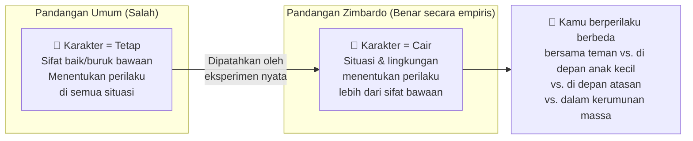
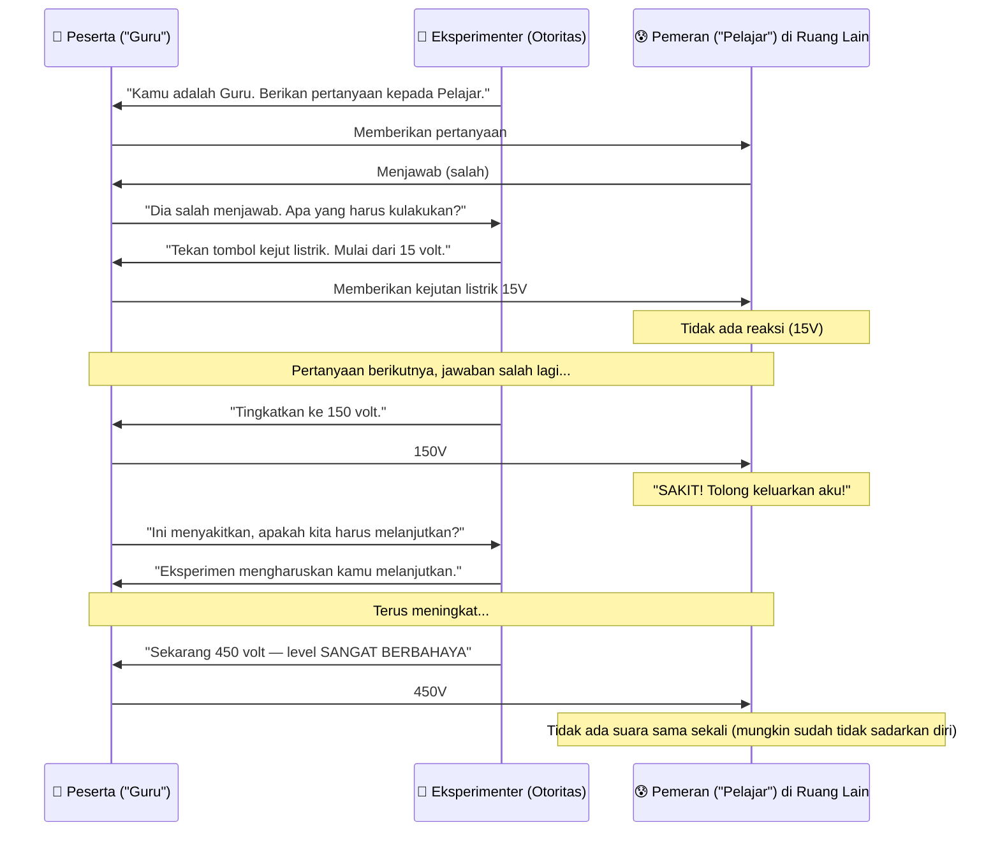
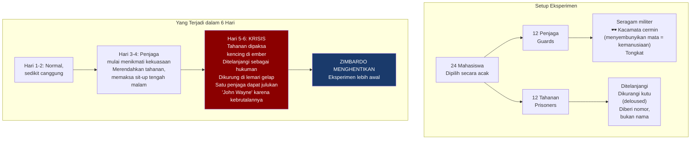
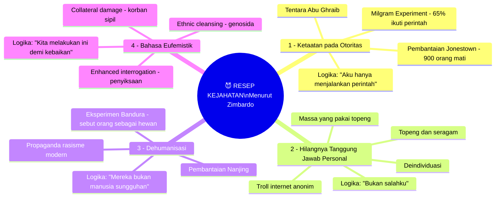
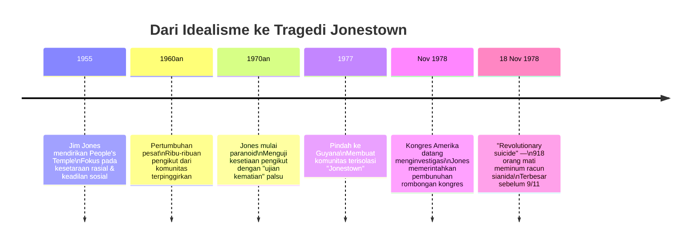
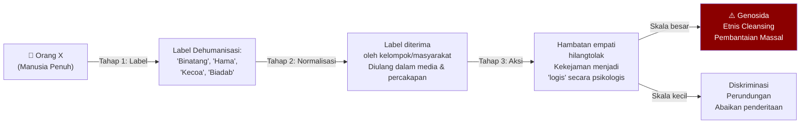
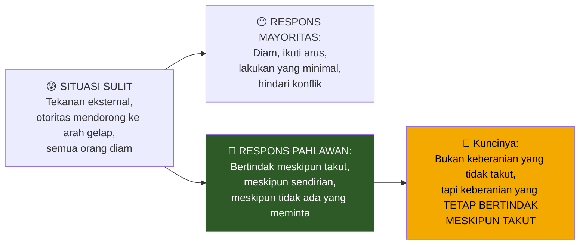
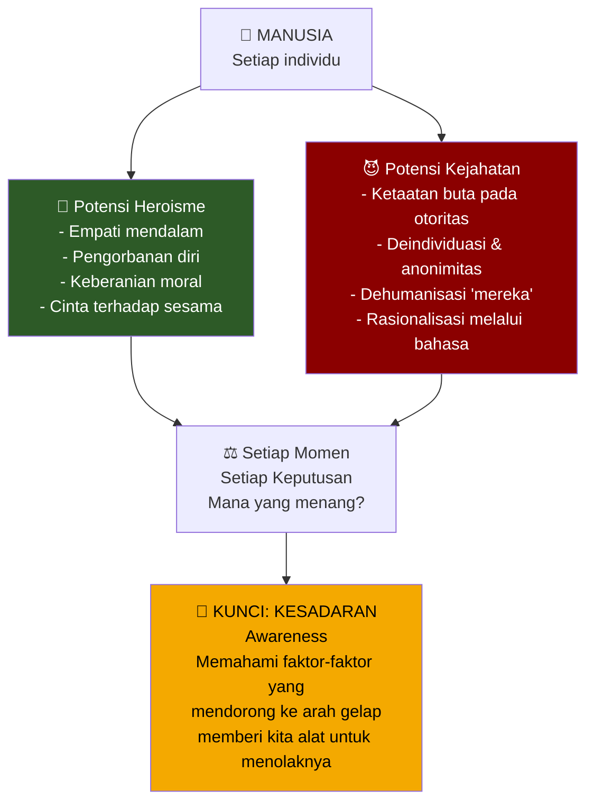
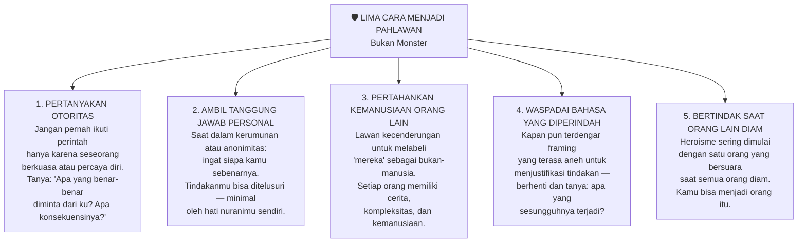

## 😈 Pembuka: Seberapa Jauh Kamu dari Tepi Jurang Moral?

Bayangkan kamu sedang duduk di mejamu, menjalani hari-hari yang biasa-biasa saja.

Lalu, tiba-tiba, kamu menemukan dirimu dalam situasi di mana **aturan-aturan kebaikan tidak lagi berlaku**.

Apakah kamu masih menjadi orang yang kamu kira kamu itu? Atau akankah kamu jatuh ke dalam jurang itu — mencakar dan meraung saat kamu tenggelam?

Pertanyaan ini bukan hipotetis filosofis yang nyaman untuk dipikirkan sambil minum kopi di pagi hari. Ini adalah pertanyaan yang telah dijawab secara empiris oleh salah satu psikolog paling berani dan paling kontroversial dalam sejarah: **Philip Zimbardo**.

Dan jawabannya?

**Kamu tidak sejauh yang kamu kira dari menjadi monster.**

---

## 📚 Bagian I: "The Lucifer Effect" — Buku yang Menampar Kenyamanan

### Siapa Philip Zimbardo?

**Philip George Zimbardo** adalah profesor psikologi emeritus dari **Stanford University** — salah satu peneliti psikologi sosial paling berpengaruh abad ke-20. Kariernya mencakup lebih dari 50 tahun penelitian tentang perilaku manusia, konformitas sosial, dan dinamika kekuasaan.

Tapi satu eksperimen — yang ia rancang dan jalankan sendiri pada tahun 1971 — mengubah cara dunia memahami **sifat dasar manusia**. Eksperimen itu juga menghantui Zimbardo sendiri selama puluhan tahun, mendorongnya untuk akhirnya menulis:

**The Lucifer Effect: Understanding How Good People Turn Evil** (2007)

*"Efek Lucifer: Memahami Bagaimana Orang Baik Menjadi Jahat"*

Judul ini mengacu pada **Lucifer** — malaikat paling cantik dan paling dicintai Tuhan, yang kemudian menjadi Setan. Transformasi paling dramatis dari kebaikan ke kejahatan dalam sejarah teologi Barat. Dan Zimbardo menggunakannya sebagai metafora untuk argumen sentralnya:

> *"Kejahatan bukan milik monster-monster yang jauh dari sana. Kejahatan adalah potensi yang ada dalam diri kita semua — dan yang mewujudkannya adalah situasi, bukan karakter."*

---

## 🧬 Bagian II: Mitos Karakter Tetap — Ilusi yang Nyaman

### "Aku Orang Baik" — Benarkah?

Sebelum kita masuk ke eksperimen-eksperimen yang menggemparkan itu, ada satu ilusi fundamental yang perlu kita hancurkan terlebih dahulu.

Sebagian besar dari kita percaya bahwa kita adalah orang baik. Kita mengembalikan dompet yang ditemukan. Kita menjadi sukarelawan di tempat penampungan hewan. Kita tidak menyakiti orang lain.

Tapi Zimbardo mengajukan pertanyaan yang lebih tajam:

*Pernahkah kamu mengambil sesuatu yang bukan milikmu — hanya karena kamu tahu tidak akan tertangkap? Pulpen kantor? Akses Wi-Fi tetangga?*

Bukan tentang besar kecilnya pelanggaran. Ini tentang prinsip yang jauh lebih dalam: **kejahatan dimulai dari pelanggaran kecil yang tampak sepele**.

Dan kepercayaan kita bahwa "kepribadian kita tetap" — bahwa kita adalah orang yang sama di semua situasi — adalah **fiksi yang sangat nyaman**.

### Pendekatan Situasional — Kebenaran yang Membebaskan Sekaligus Mengerikan

Zimbardo memperkenalkan apa yang ia sebut **situational approach** (*pendekatan situasional*): gagasan bahwa **siapa kita bukan terukir di batu, melainkan tertulis di pasir** — terus bergeser mengikuti pasang-surut lingkungan kita.

Ini terdengar membebaskan: *"Bukan salahku, itu situasinya."*

Tapi ini juga mengerikan: *"Situasi yang tepat bisa mengubah siapa saja — termasuk aku."*

---

## ⚡ Bagian III: Eksperimen Milgram — Ketika Orang Biasa Menyetrum Orang Lain

### Latar Belakang: Mengapa Milgram Merancang Eksperimen Ini?

**Stanley Milgram**, psikolog dari Yale, melakukan eksperimen ikonik ini pada awal 1960-an — tidak lama setelah persidangan **Adolf Eichmann**, salah satu arsitek Holocaust. Eichmann membela diri dengan argumen yang kemudian terkenal: *"Aku hanya menjalankan perintah."*

Milgram ingin tahu: **apakah ini hanya taktik pembelaan diri, atau apakah ketaatan terhadap otoritas memang bisa mendorong orang biasa untuk melakukan kekejaman?**

Jawabannya menggemparkan dunia.

### Bagaimana Eksperimen Milgram Bekerja

**Kenyataan yang mengejutkan:** Pelajar adalah *aktor* — tidak benar-benar disetrum. Tapi peserta tidak tahu itu. Dan hasilnya:

> **65% peserta — orang biasa, bukan sadis — memberikan voltase maksimum 450 volt, bahkan ketika pelajar sudah tidak merespons sama sekali.**

Mereka bukan monster. Mereka hanya **mengikuti perintah seseorang yang memakai jas laboratorium**.

<Callout type="danger" title="⚡ Angka yang Menggemparkan">
Sebelum eksperimen dilakukan, Milgram bertanya kepada psikiater, mahasiswa, dan orang awam: berapa persen peserta yang akan mencapai 450 volt?

Perkiraan rata-rata: **1-2%** — hanya orang-orang dengan kecenderungan sadistik.

Kenyataan: **65%**.

Kesalahan perkiraan sebesar 30-65 kali lipat ini adalah salah satu temuan paling mengejutkan dalam sejarah psikologi.
</Callout>

---

## 🏛️ Bagian IV: Stanford Prison Experiment — Enam Hari yang Mengubah Segalanya

### Rancangan Eksperimen

Pada Agustus 1971, Zimbardo merancang **Stanford Prison Experiment** (*Eksperimen Penjara Stanford*) — sebuah studi tentang efek psikologis dari situasi penjara.

Ia merekrut **24 mahasiswa** yang dipilih secara ketat:
- Semua laki-laki, sehat mental secara psikologis
- Semua dari kelas menengah, stabil
- Tidak ada riwayat kriminal atau kekerasan

Mereka dilempar ke penjara buatan di bawah gedung psikologi Stanford:

### Mengapa Ini Begitu Menggemparkan?

**6 hari.** Hanya butuh enam hari untuk mengubah mahasiswa-mahasiswa normal dari universitas terbaik Amerika menjadi penyiksa dan korban yang meyakini peran mereka sepenuhnya.

Dan Zimbardo sendiri? Ia menjadi **kepala penjara** dalam eksperimen itu — dan ia pun terseret ke dalam dinamikanya. Ia mulai berpikir seperti pengelola penjara sungguhan, bukan peneliti. Butuh dorongan dari kekasihnya, **Christina Maslach** (yang kemudian menjadi istrinya), untuk menyadarkannya bahwa apa yang terjadi adalah **kekejaman nyata**, bukan penelitian.

*"Apa yang kamu lakukan kepada orang-orang itu?"* — kata Christina. Dan perkataan itu menghentikan segalanya.

<Callout type="warning" title="⚠️ Zimbardo Sang Peneliti Terserap ke dalam Eksperimennya Sendiri">
Salah satu temuan paling mencengangkan dari Stanford Prison Experiment adalah bahwa **Zimbardo sendiri, sang peneliti** yang seharusnya objektif, ikut terpengaruh oleh situasi.

Ia mulai menganggap dirinya sebagai "superintendent" (kepala penjara) dan membuat keputusan dari perspektif itu — bukan dari perspektif ilmuwan.

Ini adalah bukti paling telanjang bahwa situasi dapat mengalahkan bahkan orang yang **mengetahui sepenuhnya bahwa ia sedang dalam eksperimen psikologi**.
</Callout>

---

## 🔑 Bagian V: Empat Mekanisme Psikologis yang Mengubah Orang Baik Menjadi Monster

Zimbardo mengidentifikasi **empat "bahan" utama** dalam resep kejahatan — empat mekanisme psikologis yang, ketika hadir bersama-sama, bisa mengubah siapa pun menjadi pelaku kekejaman:

### 🎖️ Mekanisme 1: Ketaatan pada Otoritas (*Obedience to Authority*)

Ini adalah faktor yang paling banyak dipelajari oleh Milgram. Otoritas — baik berupa seseorang, institusi, atau seperangkat aturan — dapat memaksa bahkan orang paling bermoral sekalipun untuk melakukan hal-hal yang tidak terpikirkan sebelumnya.

**Mengapa ini bekerja?**

Ketika kita tunduk pada otoritas, kita tidak sepenuhnya menghentikan pertimbangan moral kita. Yang terjadi adalah kita **memindahkan tanggung jawab**: *"Jika ada yang salah, otoritaslah yang bertanggung jawab, bukan aku."*

Ini menciptakan kondisi di mana orang dapat melakukan kekejaman sambil **tetap merasa bahwa diri mereka adalah orang baik** yang hanya menjalankan tugas.

**Kasus Jonestown (1978):**

**Jim Jones** adalah pemimpin karismatik yang awalnya memperjuangkan idealisme utopis — kesetaraan rasial, komunitas yang penuh kasih, perlawanan terhadap kapitalisme. Tapi secara bertahap ia berubah menjadi **tiran paranoid**.

Para pengikutnya tidak melihat transformasi itu datang. Mereka mempercayainya. Mereka mematuhinya. Dan pada 18 November 1978, ketika Jim Jones membagikan minuman yang dicampur **sianida** sambil menyebutnya sebagai "tindakan revolusioner terakhir" — **lebih dari 900 orang meminumnya**.

Bukan karena mereka ingin mati. Bukan karena mereka tidak sayang nyawa. **Tapi karena mereka sudah begitu terbiasa mematuhi, mereka tidak lagi mempertanyakan.**

### 🎭 Mekanisme 2: Hilangnya Tanggung Jawab Personal — Deindividuasi

**Deindividuasi** (*de-individualization* — hilangnya identitas individual) adalah kondisi psikologis di mana seseorang merasa bahwa tindakannya tidak bisa ditelusuri kembali ke dirinya sebagai individu — sehingga hambatan moral melemah secara drastis.

**Eksperimen Lapangan Zimbardo:**

Zimbardo meninggalkan **satu mobil tak bertuan** di dua lokasi berbeda:

| Lokasi | Karakteristik | Hasil dalam Beberapa Jam |
|---|---|---|
| 🏙️ **The Bronx, New York** | Lingkungan padat, anonim, orang tidak saling kenal | Mobil **dilucuti habis**, dirusak, dihancurkan |
| 🌳 **Palo Alto, California** | Komunitas suburban, orang saling mengenal | Mobil **tidak disentuh sama sekali** |

Perbedaannya bukan pada "kejahatan" penduduk Bronx vs Palo Alto. Perbedaannya adalah **anonimitas** (*anonymity*) — ketika orang tidak bisa dikenali, hambatan moral melemah.

**Manifestasi Modern:**

Ini menjelaskan begitu banyak fenomena yang kita lihat di era digital:

- 💬 **Perundungan siber** (*cyberbullying*) — orang mengatakan hal-hal yang tidak akan pernah mereka ucapkan langsung
- 🎭 **Troll internet** — anonimitas memungkinkan kekejaman tanpa konsekuensi
- 👥 **Mob mentality** — dalam kerumunan, individu merasa "hilang" dan tidak bertanggung jawab secara personal
- 🪖 **Seragam militer** — menghapus identitas individual menciptakan kondisi untuk mematuhi perintah tanpa pertanyaan

<Callout type="important" title="🪞 Cermin Digital">
Berapa kali kamu mengatakan atau melakukan sesuatu secara online yang tidak akan pernah kamu lakukan di kehidupan nyata?

Layar yang memisahkan kamu dari dunia adalah **topeng digital** — dan topeng itu bekerja persis seperti topeng yang dipakai massa dalam tragedi berdarah sepanjang sejarah.
</Callout>

### 😈 Mekanisme 3: Dehumanisasi — Menghapus Kemanusiaan Seseorang

**Dehumanisasi** (*dehumanization*) adalah proses psikologis di mana seseorang atau kelompok **berhenti dipandang sebagai manusia seutuhnya**. Begitu seseorang dipandang sebagai bukan-manusia — sebagai hewan, hama, ancaman — hambatan moral untuk menyakiti mereka hampir menghilang sepenuhnya.

**Eksperimen Albert Bandura (Stanford):**

Psikolog **Albert Bandura** merancang studi di mana peserta diminta mengevaluasi keputusan kelompok lain dan memberikan "hukuman" (dalam bentuk intensitas kejutan listrik).

Sebelum mengevaluasi, sebagian peserta "tidak sengaja" mendengar percakapan yang mendeskripsikan kelompok lain sebagai **"binatang"** dan **"biadab"** (*animals*, *savages*). Sebagian peserta lain mendengar deskripsi positif: *"perceptive and understanding"* (perseptif dan pengertian).

Hasilnya? Kelompok yang mendengar deskripsi dehumanisasi memberikan **hukuman jauh lebih keras** kepada "kelompok biadab" tersebut.

**Kasus Historis — Pemerkosaan Nanjing (1937):**

Dalam Pembantaian Nanjing (*Nanjing Massacre*), tentara Jepang melakukan kekejaman yang tidak terbayangkan terhadap warga sipil Tiongkok — membunuh antara 100.000-300.000 orang dalam beberapa minggu.

Bagaimana tentara biasa bisa melakukan ini? Karena selama bertahun-tahun, propaganda militer Jepang **mendehumanisasi** orang-orang Tiongkok — mereka bukan manusia, mereka adalah hambatan, musuh yang perlu ditangani.

Begitu dehumanisasi berhasil, kekejaman menjadi *bukan* pelanggaran moral. Ia menjadi tugas.

**Dan ini terjadi hari ini, di sekitar kita:**

Berapa sering kamu mendengar orang-orang dideskripsikan sebagai "binatang", "sampah", "hama"? Berapa sering label-label itu membuat kita lebih mudah mengabaikan penderitaan mereka — atau bahkan menjustifikasi kekerasan?

> *"Saat kamu berhenti melihat seseorang sebagai manusia seutuhnya adalah saat kamu membuka pintu menuju potensi gelap dalam dirimu sendiri."*

### 📝 Mekanisme 4: Bahasa Eufemistik — Mengemas Kekejaman dalam Kata-Kata Indah

**Bahasa eufemistik** (*euphemistic language*) adalah teknik linguistik di mana tindakan-tindakan jahat dikemas dalam kata-kata yang terdengar netral, teknis, atau bahkan mulia — sehingga pelaku bisa terus melakukan kekejaman tanpa merasa diri mereka jahat.

Ini adalah **manipulasi bahasa sebagai senjata moral**:

| Realita | Bahasa Eufemistik |
|---|---|
| 🔥 Penyiksaan (*Torture*) | "Interogasi yang ditingkatkan" (*Enhanced interrogation*) |
| ☠️ Genosida (*Genocide*) | "Pembersihan etnis" (*Ethnic cleansing*) |
| 💀 Korban sipil (*Civilian casualties*) | "Kerusakan kolateral" (*Collateral damage*) |
| 🏚️ Pengusiran paksa | "Relokasi" |
| 💣 Serangan udara yang membunuh warga | "Operasi bedah presisi" |
| ⛓️ Pemenjaraan tanpa pengadilan | "Penahanan pencegahan" (*Preventive detention*) |

**Kasus Abu Ghraib:**

Ketika foto-foto penyiksaan tahanan di penjara Abu Ghraib, Irak, bocor ke publik pada 2004, Amerika Serikat tidak menyebutnya sebagai "penyiksaan". Pemerintah menggunakan framing: ini adalah **"tindakan esensial dalam perang melawan terorisme"** — *necessary evils to protect national security* (kejahatan yang diperlukan untuk melindungi keamanan nasional).

Para tentara yang melakukannya, termasuk **Ivan Frederick** — yang sebelumnya adalah warga Amerika biasa yang normal, mencintai baseball dan hidupnya di negara asal — percaya bahwa mereka adalah pihak yang baik (*the good guys*). Mereka melakukan tugas yang diperlukan. Ideologi ("perang melawan terorisme") memberikan mereka **cover story** — narasi yang membenarkan tindakan yang di konteks lain jelas tidak dapat dibenarkan.

<Callout type="danger" title="🗣️ Peringatan untuk Diri Sendiri">
Kapan pun kamu mendengar seseorang **memperindah bahasa** untuk menggambarkan sesuatu yang terasa salah secara naluriah — **berhenti dan bertanya**:

*Apa yang sesungguhnya terjadi di balik kata-kata yang dipoles itu?*

Karena sepanjang sejarah, bahasa yang diperindah adalah instrumen yang digunakan untuk mendapatkan persetujuan orang baik atas tindakan-tindakan jahat.
</Callout>

---

## 🏆 Bagian VI: Dari Monster ke Pahlawan — Pilihan yang Selalu Ada

### Kabar Baiknya

Setelah semua yang kita bahas, mungkin kamu merasa sedikit tertekan. *"Jika situasi bisa mengubah siapa pun menjadi monster, apa gunanya berusaha?"*

Zimbardo tidak meninggalkan kita di sana. **The Lucifer Effect** bukan hanya buku tentang sisi gelap manusia — ini adalah **panggilan untuk bertindak**.

Karena jika situasi bisa mendorong orang menuju kejahatan, situasi juga bisa — dan harus — mendorong mereka menuju **kepahlawanan**.

### Apa yang Memisahkan Pahlawan dari Monster?

Bukan kekuatan fisik. Bukan IQ yang lebih tinggi. Bukan kepribadian yang lebih baik.

Yang memisahkan pahlawan dari monster adalah satu hal: **pilihan untuk bertindak** — bahkan ketika semua orang di sekitarnya tidak bertindak.

### Kisah Wesley Autrey — Pahlawan Subway New York 🚇

Pada Januari 2007, **Wesley Autrey** — seorang pekerja konstruksi berusia 50 tahun — sedang menunggu kereta MTA di stasiun subway Manhattan bersama dua putrinya.

Seorang pria bernama Cameron Hollopeter mengalami kejang (*seizure*) dan jatuh ke rel kereta.

Kereta sudah terlihat mendekat. Orang-orang di sekitar **membeku dalam kepanikan**.

Autrey tidak berpikir panjang. Ia **melompat ke bawah**, menindih Hollopeter di parit sempit antara dua rel, dan **menahan tubuhnya rata dengan tanah** saat kereta melintas di atas mereka — dengan jarak hanya beberapa sentimeter dari kepalanya.

Kedua pria itu selamat.

Autrey kemudian ditanya mengapa ia melakukan itu. Jawabannya sederhana:

> *"Aku melihat seseorang yang butuh bantuan. Aku melakukan apa yang kurasa harus kulakukan."*

Ia bukan tentara terlatih. Bukan superhero. Ia adalah seorang pekerja biasa dengan dua anak yang menunggu di peron — yang **memilih untuk bertindak** ketika semua orang lain membeku.

*Inilah esensi heroisme* — bukan tindakan besar di medan perang, tapi keputusan **sederhana dan cepat** untuk melakukan yang benar ketika itu paling sulit. 🌟

---

## 🧠 Bagian VII: Dualitas dalam Diri Kita — Mengakui Potensi Gelap untuk Mengontrolnya

### Kita Semua adalah Kontradiksi Berjalan

Zimbardo menyimpulkan dengan pernyataan yang paling penting dari seluruh karya hidupnya:

> *"Kamu, aku, semua dari kita — kita membawa dalam diri kita benih-benih kebaikan sekaligus kejahatan. Kita adalah kontradiksi yang berjalan — mampu melakukan tindakan kepahlawanan yang menakjubkan dan juga kedalaman kekejaman yang mengejutkan."*

Pilihan antara dua ekstrem ini bukan peristiwa tunggal. Ini adalah **perjuangan konstan — pertempuran sehari-hari**.

### Mengapa Mengakui Potensi Gelap Justru Membebaskan?

Ada paradoks yang indah di sini: **dengan mengakui bahwa kita memiliki kapasitas untuk kejahatan, kita justru menjadi lebih mampu untuk menghindarinya**.

Sebaliknya, orang yang yakin bahwa mereka adalah "orang baik" yang tidak mungkin melakukan hal-hal buruk justru **paling rentan** terhadap mekanisme psikologis yang Zimbardo gambarkan — karena mereka tidak waspada.

Ini bukan panggilan untuk berputus asa. Ini adalah **panggilan untuk kewaspadaan** (*vigilance*).

Dengan memahami:
- Bagaimana otoritas dapat memanipulasi kita
- Bagaimana anonimitas melemahkan hambatan moral
- Bagaimana dehumanisasi mempersiapkan kekejaman
- Bagaimana bahasa bisa menyamarkan kejahatan

...kita mendapatkan **alat untuk menolak** semua itu.

---

## 🛡️ Bagian VIII: Lima Cara untuk Menjadi Pahlawan, Bukan Monster

Berbekal pemahaman Zimbardo, ada lima praktik konkret yang bisa membantu kita memilih kebaikan secara aktif:

---

## 🔍 Bagian IX: Relevansi untuk Indonesia dan Dunia Hari Ini

### Bukan Hanya Sejarah — Ini Terjadi Sekarang

Mungkin kamu berpikir bahwa Abu Ghraib, Holocaust, Jonestown adalah tragedi masa lalu yang jauh dari kehidupanmu. Tapi mekanisme-mekanisme psikologis yang sama bekerja **setiap hari, di sekitar kita**:

**Di media sosial:**
- Mob online yang mengeroyok satu orang tanpa mendengar sisi cerita lain
- Dehumanisasi kelompok yang berbeda keyakinan atau politik
- Anonimitas yang memungkinkan serangan verbal tanpa konsekuensi

**Di tempat kerja:**
- Mengikuti perintah atasan yang terasa salah karena takut kehilangan pekerjaan
- Berdiam diri saat menyaksikan ketidakadilan karena "bukan urusanku"
- Menggunakan framing yang membenarkan tindakan-tindakan yang sebenarnya merugikan orang lain

**Di politik:**
- Narasi yang dehumanisasi kelompok tertentu (imigran, minoritas, "musuh negara")
- Retorika yang memperindah tindakan-tindakan represif sebagai "demi keamanan nasional"
- Ketaatan kolektif pada pemimpin karismatik tanpa pertanyaan kritis

Zimbardo tidak menulis *The Lucifer Effect* sebagai sejarah. Ia menulisnya sebagai **peringatan** — dan instruksi — untuk masa kini.

---

## ✨ Epilog: Setiap Hari adalah Pilihan

### Cerita Hidupmu Ditulis oleh Responmu, Bukan Situasimu

Zimbardo menutup *The Lucifer Effect* dengan kalimat yang paling penting:

> *"Cerita hidupmu tidak ditulis oleh situasi-situasi yang kamu temukan dirimu di dalamnya. Ia ditulis oleh bagaimana kamu memilih untuk meresponsnya."*

Garis antara baik dan jahat **bisa bergeser**. Bisa kabur. Tergantung pada pilihan-pilihan yang kita buat — dan situasi-situasi yang kita temukan diri kita di dalamnya.

Tapi *mengetahui* ini — *memahami* ini — berarti kamu memiliki satu kekuatan yang tidak dimiliki oleh mereka yang tidak sadar:

**Kamu bisa melihat mekanisme itu datang. Dan kamu bisa memilih untuk melawan.**

Setiap hari adalah rangkaian keputusan kecil. Setiap keputusan kecil membentuk siapa kamu.

Dan itu bukan hal yang lofty atau romantis. Itu adalah **keharusan** — di dunia di mana garis-garis moralitas terus-menerus diuji, di mana otoritas dan tekanan sosial terus mendorong kita ke arah yang lebih mudah, yang lebih nyaman, yang lebih gelap.

**Jadilah pahlawan dalam ceritamu sendiri.** Bukan karena kamu lebih kuat atau lebih baik dari orang lain. Tapi karena kamu **memilih untuk bertindak** — momen demi momen, situasi demi situasi.

Dan itu adalah perbedaan yang membuat segalanya berbeda. 🌟

---

## 📚 Glosarium Lengkap

| Istilah | Bahasa Indonesia | Penjelasan |
|---|---|---|
| **The Lucifer Effect** | Efek Lucifer | Buku Philip Zimbardo (2007) tentang bagaimana orang baik bisa menjadi jahat karena situasi |
| **Philip Zimbardo** | Philip Zimbardo | Profesor psikologi Stanford; perancang Stanford Prison Experiment |
| **Stanley Milgram** | Stanley Milgram | Psikolog Yale; perancang eksperimen ketaatan pada otoritas (1960an) |
| **Situational Approach** | Pendekatan Situasional | Perspektif bahwa perilaku lebih ditentukan oleh situasi daripada karakter bawaan |
| **Stanford Prison Experiment** | Eksperimen Penjara Stanford | Eksperimen 1971 di mana mahasiswa normal berubah menjadi penyiksa/korban dalam 6 hari |
| **Milgram Experiment** | Eksperimen Milgram | Studi ketaatan di mana 65% peserta bersedia memberikan kejutan listrik mematikan atas perintah |
| **Obedience to Authority** | Ketaatan pada Otoritas | Mekanisme psikologis pertama yang mendorong kejahatan; mengikuti perintah tanpa pertanyaan |
| **Deindividuation** | Deindividuasi | Hilangnya identitas personal dalam kelompok atau anonimitas; melemahkan hambatan moral |
| **Dehumanization** | Dehumanisasi | Proses memandang seseorang sebagai bukan-manusia; memungkinkan kekejaman terhadapnya |
| **Euphemistic Language** | Bahasa Eufemistik | Penggunaan kata-kata yang diperindah untuk menyamarkan tindakan jahat |
| **Abu Ghraib** | Abu Ghraib | Penjara di Irak tempat tentara AS melakukan penyiksaan tahanan; contoh efek Lucifer nyata |
| **Ivan Frederick** | Ivan Frederick | Tentara AS normal yang menjadi penyiksa di Abu Ghraib; subjek studi Zimbardo |
| **Jonestown Massacre** | Pembantaian Jonestown | 1978: 918 pengikut Jim Jones mati minum racun sianida karena ketaatan buta |
| **Jim Jones** | Jim Jones | Pemimpin karismatik People's Temple; berubah dari idealis menjadi tiran |
| **Albert Bandura** | Albert Bandura | Psikolog Stanford; penelitian tentang dehumanisasi dan peningkatan hukuman |
| **Anonymity** | Anonimitas | Kondisi tidak dikenali; melemahkan hambatan moral secara drastis |
| **Cover Story** | Narasi Pembenar | Cerita atau ideologi yang digunakan untuk menjustifikasi tindakan jahat |
| **Mob Mentality** | Mentalitas Massa | Perilaku individu dalam kerumunan yang kehilangan identitas personal |
| **Wesley Autrey** | Wesley Autrey | "Subway Hero" New York 2007; melompat ke rel kereta untuk menyelamatkan orang asing |
| **Vigilance** | Kewaspadaan | Kesadaran aktif terhadap faktor-faktor yang bisa mendorong seseorang menuju kejahatan |
| **Personal Accountability** | Tanggung Jawab Personal | Mengambil kepemilikan atas keputusan sendiri meski situasi memudahkan untuk menghindar |
| **Moral Cliff** | Tebing Moral | Metafora Zimbardo: titik di mana seseorang "jatuh" dari kebaikan ke kejahatan |
| **Heroism** | Heroisme | Pilihan untuk bertindak demi kebaikan orang lain, meski berbahaya atau tidak nyaman |
| **Pembantaian Nanjing** | Pembantaian Nanjing | 1937: Tentara Jepang membantai 100.000-300.000 warga sipil Tiongkok; contoh dehumanisasi massal |
| **Holocaust** | Holocaust | Genosida 6 juta orang Yahudi oleh Nazi Jerman; latar belakang eksperimen Milgram |
| **Adolf Eichmann** | Adolf Eichmann | Arsitek Holocaust yang berargumen "hanya menjalankan perintah" di persidangan |
| **Enhanced Interrogation** | Interogasi yang Ditingkatkan | Eufemisme pemerintah AS untuk penyiksaan pasca-9/11 |
| **Ethnic Cleansing** | Pembersihan Etnis | Eufemisme untuk genosida dan pengusiran etnis secara paksa |
| **Collateral Damage** | Kerusakan Kolateral | Eufemisme untuk korban sipil dalam operasi militer |

---

*Sumber video: [Why Good People Become Monsters](https://www.youtube.com/watch?v=RrEIm-z5Ixc)*  
*Berdasarkan: The Lucifer Effect oleh Philip Zimbardo (2007)*
