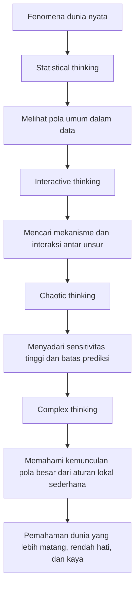
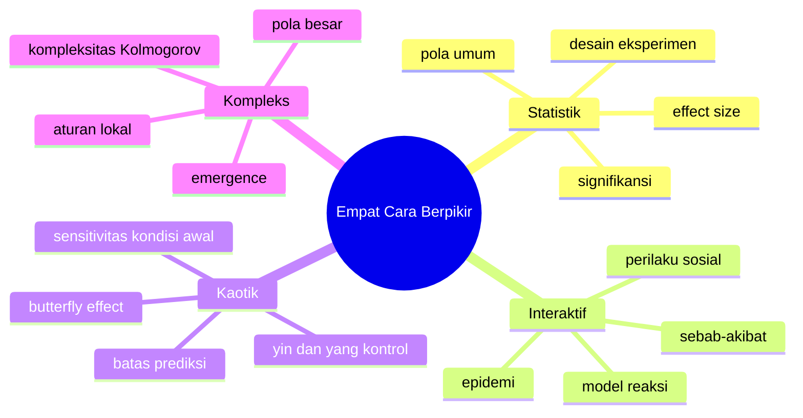

## 🧠 Pendahuluan: Matematika Bukan Sekadar Hitung-Hitungan, tetapi Cara Melihat Dunia

Banyak orang tumbuh dengan anggapan bahwa matematika adalah soal rumus, angka, ujian, dan latihan tanpa akhir. Dalam bayangan umum, matematika sering terlihat seperti aktivitas yang kering: menghitung, menyederhanakan persamaan, atau mencari jawaban yang benar dari soal yang sudah ditentukan. Tetapi dalam pemaparan **David Sumpter**, matematika justru tampil dalam bentuk yang jauh lebih hidup. Ia bukan hanya alat hitung, melainkan **cara berpikir untuk memahami realitas**. 🧠

Ini titik berangkat yang sangat penting. Sumpter tidak menempatkan matematika sebagai tujuan akhir. Ia tidak memulai dari “ayo kita menghitung”, melainkan dari pertanyaan yang lebih manusiawi dan lebih filosofis: 

> **Bagaimana kita memahami dunia di sekitar kita?**

Dari situ, matematika menjadi semacam *toolkit* *(kotak peralatan berpikir)* yang membantu kita memetakan pola, mengenali sebab-akibat, memahami ketidakpastian, dan menangkap struktur tersembunyi dalam fenomena yang tampaknya acak. 

Dalam ceramah ini, Sumpter membagi cara berpikir matematis itu ke dalam **empat mode utama**:
- **statistical thinking** *(cara berpikir statistik)*,
- **interactive thinking** *(cara berpikir interaktif)*,
- **chaotic thinking** *(cara berpikir kaotik / peka terhadap kekacauan)*,
- **complex thinking** *(cara berpikir kompleks)*.

Empat cara berpikir ini bukan sekadar kategori akademik. Masing-masing adalah lensa. Masing-masing membantu kita melihat jenis masalah tertentu dengan lebih jernih. Dan yang paling menarik, Sumpter tidak hanya mengambil contoh dari laboratorium atau teori ilmiah, tetapi juga dari:
- sepak bola ⚽,
- perilaku sosial manusia 🤝,
- kehidupan rumah tangga 🏠,
- eksperimen sederhana,
- hingga sejarah sains dan tokoh-tokoh matematika yang membentuk cara kita berpikir hari ini.

Artikel ini akan menguraikan empat cara berpikir tersebut secara **detail, runtut, dan mendalam**. Kita tidak hanya akan merangkum isi ceramah, tetapi juga membedah logikanya:
- apa inti dari setiap cara berpikir,
- kapan ia berguna,
- apa kelemahannya,
- dan mengapa keempatnya bersama-sama memberi kita cara yang jauh lebih matang untuk membaca dunia.

Kalau harus diringkas dalam satu kalimat, gagasan besar Sumpter adalah ini:

> **Untuk memahami dunia, kita tidak cukup hanya mengumpulkan angka. Kita juga perlu memahami interaksi, menerima ketidakpastian, dan belajar melihat bagaimana pola besar bisa lahir dari aturan yang sangat sederhana.** ✨

---

## 🧭 Tesis Utama: Dunia Tidak Bisa Dipahami dengan Satu Jenis Kecerdasan Saja

Tesis sentral dari pembahasan David Sumpter bisa dirumuskan seperti ini:

> **Dunia terlalu kaya, terlalu dinamis, dan terlalu berlapis untuk dipahami hanya dengan satu jenis metode. Karena itu, kita membutuhkan beberapa cara berpikir matematis yang saling melengkapi.**

Statistika membantu kita melihat pola umum. Model interaktif membantu kita memahami mekanisme sebab-akibat antar unsur. Teori chaos *(kekacauan)* mengingatkan bahwa sistem yang sangat teratur pun bisa sangat sensitif terhadap perubahan kecil. Dan pemikiran kompleks membantu kita memahami bagaimana struktur besar dan menakjubkan dapat muncul dari aturan lokal yang sederhana. 🌌

Keempat pendekatan ini membentuk semacam tangga intelektual:
- dari **mengukur pola**,
- ke **memodelkan interaksi**,
- lalu ke **menyadari keterbatasan prediksi**,
- dan akhirnya ke **memahami kemunculan pola kompleks dari aturan sederhana**.

Ini penting sekali, karena sering kali orang terjebak pada satu ekstrem. Ada yang terlalu percaya pada angka statistik. Ada yang terlalu yakin bahwa semua hal bisa dimodelkan secara mekanis. Ada juga yang, setelah sadar dunia penuh ketidakpastian, malah menjadi fatalistis dan merasa semua hal acak saja. Sumpter mengambil jalan yang lebih matang: **setiap pendekatan punya kekuatan, tetapi juga punya batas.**

---

## 📊 Bagian 1: Statistical Thinking — Melihat Pola dalam Data

Cara berpikir pertama adalah **statistical thinking**, atau cara berpikir statistik. Ini mungkin bentuk matematika terapan yang paling familiar dalam kehidupan modern. Kita menggunakannya saat membaca survei, menilai efektivitas obat, memahami data olahraga, melihat tren ekonomi, atau membandingkan performa seseorang terhadap kelompok lain. 📊

Sumpter memulai bagian ini dengan tokoh penting dalam sejarah statistika, yaitu **Ronald Fisher**. Fisher adalah figur besar dalam perkembangan desain eksperimen *(experimental design)* dan inferensi statistik modern. Ia juga contoh menarik tentang bagaimana kecerdasan luar biasa bisa menghasilkan kontribusi ilmiah besar sekaligus memiliki sisi moral dan intelektual yang sangat problematis.

Tetapi sebelum masuk ke sisi gelap Fisher, Sumpter menyorot satu kisah klasik yang sangat terkenal: **eksperimen teh dan susu**. 

---

## 🍵 Eksperimen Teh-Susu: Mengapa Cara Mendesain Tes Itu Penting?

Kisah ini bermula ketika seorang ilmuwan, **Dr. Muriel Bristol**, mengatakan bahwa ia bisa membedakan teh yang dituangi susu lebih dulu dengan teh yang dituangi teh lebih dulu baru kemudian susu. Bagi Fisher, klaim ini terdengar meragukan. Dalam gaya yang khas — keras, arogan, dan ingin membuktikan segalanya — ia tidak puas hanya dengan opini. Ia ingin mengujinya. 🍵

Di sinilah kekuatan statistical thinking terlihat: bukan hanya pada kemampuan menghitung hasil, tetapi pada **kemampuan merancang eksperimen yang baik**.

Secara intuitif, kita mungkin berpikir semua tes yang tampak mirip ya sama saja. Tetapi Fisher menunjukkan bahwa **desain eksperimen memengaruhi kekuatan bukti**. Dalam cerita ini, Sumpter membandingkan dua metode:
- memberikan pasangan cangkir satu per satu,
- atau menyajikan beberapa cangkir sekaligus di atas nampan dan meminta subjek mengidentifikasi mana yang susu duluan.

Secara matematis, metode kedua lebih kuat. Mengapa? Karena jika subjek hanya menebak, peluang untuk benar seluruhnya jauh lebih kecil pada desain itu. Artinya, jika ia tetap benar, kita punya alasan lebih kuat untuk percaya bahwa kemampuannya memang nyata, bukan hasil keberuntungan belaka. 🎯

Ini pelajaran pertama dari statistical thinking:

> **Data yang baik tidak lahir hanya dari pengukuran, tetapi dari desain pertanyaan yang tepat.**

Jadi statistika bukan sekadar menghitung setelah fakta terkumpul. Ia juga tentang bagaimana sejak awal kita menyusun situasi agar bukti yang keluar benar-benar bermakna.

---

## 🧪 Mengapa Fisher Penting? Karena Ia Mengubah Statistik Menjadi Alat Eksperimen Modern

Kontribusi besar Fisher bukan hanya pada eksperimen teh. Ia membangun fondasi bagaimana ilmuwan merancang eksperimen secara sistematis: randomisasi *(pengacakan)*, kontrol, pengujian hipotesis, dan cara membedakan sinyal dari kebetulan. 🧪

Di titik ini, statistical thinking tampak sangat kuat. Ia memberi kita cara untuk:
- tidak tertipu intuisi mentah,
- memisahkan dugaan dari bukti,
- mengukur apakah pola yang kita lihat mungkin hanya hasil kebetulan,
- dan membangun bahasa umum untuk membahas ketidakpastian.

Dalam banyak bidang, ini revolusioner. Sains modern, kedokteran, ekonomi, psikologi, hingga ilmu olahraga sangat bergantung pada warisan ini.

Tetapi Sumpter cerdas karena ia tidak berhenti pada pemujaan terhadap statistik. Justru setelah menunjukkan kekuatannya, ia mulai memperlihatkan batas-batasnya.

---

## ⚽ Statistik dalam Sepak Bola: Bisakah “Mentalitas” Diukur?

Salah satu contoh paling menarik dari ceramah ini adalah saat Sumpter berbicara tentang sepak bola. Ia menyebut percakapannya dengan **Gary Neville**, mantan pesepak bola dan komentator terkenal. Neville menyatakan sesuatu yang sering kita dengar dari praktisi lapangan saat berhadapan dengan data:

> “Angka bisa memberi tahu beberapa hal, tapi tidak semua. Misalnya sikap pemain saat tim tertinggal tidak bisa diukur.”

Respons Sumpter menarik: justru aspek itu **bisa diukur sampai tingkat tertentu**. ⚽

Ia menunjukkan analisis tentang bagaimana performa pemain berubah setelah timnya kebobolan gol. Misalnya, jika performa seorang pemain justru meningkat setelah tertinggal, itu bisa menjadi indikasi bahwa ia punya respons mental tertentu — lebih aktif, lebih terlibat, lebih banyak menciptakan peluang. Dalam konteks ini, statistik dipakai untuk menangkap sesuatu yang sebelumnya dianggap “tidak terlihat”.

Di sini kita belajar satu hal penting:

> **Banyak hal yang tampak tak terukur sebenarnya bisa didekati secara kuantitatif, asalkan kita mendefinisikannya dengan tepat.**

Tetapi Sumpter tidak jatuh ke jebakan positivisme berlebihan *(keyakinan bahwa semua hal bisa direduksi jadi angka)*. Ia segera menambahkan bahwa mengukur satu aspek bukan berarti kita menangkap seluruh realitasnya.

Misalnya:
- pemain bisa lebih aktif setelah tim tertinggal,
- tetapi itu tidak otomatis membuat timnya bermain lebih baik,
- dan tidak otomatis membuktikan bahwa ia benar-benar punya “mental juara” dalam segala konteks.

Jadi statistik membuka jendela, tetapi bukan seluruh rumah. 🪟

---

## 🌲 Jangan Salah Membaca Statistik: Bedakan Hutan dan Pohon

Salah satu penjelasan paling bagus dalam ceramah ini muncul saat Sumpter membahas konsep **grit** dari Angela Duckworth. Grit biasanya dipahami sebagai ketekunan, kegigihan, atau daya tahan untuk terus menyelesaikan sesuatu. Dalam TED Talk yang sangat populer, grit disebut sebagai prediktor kesuksesan yang sangat penting. 🌲

Sekilas ini terdengar meyakinkan. Tetapi Sumpter mengajak kita membaca datanya lebih hati-hati. Ia menunjukkan bahwa dalam penelitian itu, grit hanya menjelaskan sekitar **empat persen variasi** antarindividu.

Empat persen bukan nol. Artinya grit memang punya hubungan dengan keberhasilan. Tetapi juga bukan segalanya. Masalahnya, publik sering mendengar “ada hubungan signifikan” lalu menganggap hubungan itu besar, menentukan, bahkan dominan. Padahal belum tentu. 

Di sinilah Sumpter memberi analogi yang sangat bagus: 

> **Jangan bingung antara hutan dan pohon.**

Secara statistik, mungkin ada tren umum pada populasi. Itu “hutannya”. Tetapi sebagai individu, Anda adalah “pohon”. Dan sebagai pohon, hidup Anda bisa sangat berbeda dari garis tren umum. 🌳

Artinya:
- ada orang sangat gigih tapi tidak terlalu berhasil,
- ada orang kurang gigih tapi berhasil lewat jalan lain,
- dan kehidupan manusia terlalu kompleks untuk direduksi ke satu variabel psikologis saja.

Pelajaran pentingnya adalah ini:

> **Signifikan secara statistik tidak selalu berarti besar secara praktis.**

Dan ini sangat relevan di zaman sekarang, saat begitu banyak grafik, infografik, studi populer, dan konten motivasi menggunakan statistik untuk menyampaikan klaim yang terdengar jauh lebih besar daripada bukti aslinya.

---

## ⚠️ Batas Statistical Thinking: Angka Bisa Menipu Jika Kita Terlalu Percaya Diri

Setelah menunjukkan kekuatan statistika, Sumpter lalu menyinggung sisi gelap Ronald Fisher. Ini bagian penting karena menunjukkan bahwa statistik bukan alat suci. Ia bisa dipakai untuk mencari kebenaran, tetapi juga bisa dipakai untuk membela kesalahan. ⚠️

Fisher, misalnya, punya keterlibatan dengan ide-ide **eugenika** *(gagasan bahwa manusia bisa “diperbaiki” melalui rekayasa reproduksi dan seleksi, yang secara moral dan ilmiah sangat bermasalah)*. Ia juga lama menolak hubungan merokok dengan kanker. Dalam kedua kasus ini, ia memakai reputasi statistiknya untuk menegaskan posisi yang ternyata keliru dan merusak.

Apa pelajarannya?

### Statistical thinking punya beberapa keterbatasan besar:

#### 1. Statistik tidak otomatis memberi kebijaksanaan
Orang sangat pintar secara statistik tetap bisa salah secara moral maupun konseptual.

#### 2. Signifikansi bukan segalanya
Efek kecil bisa tetap signifikan jika sampel besar.

#### 3. Konteks selalu penting
Angka tanpa konteks mudah disalahartikan.

#### 4. Korelasi bukan kausalitas
Dua hal yang bergerak bersama belum tentu salah satunya menyebabkan yang lain.

#### 5. Kuantifikasi bisa berlebihan
Tidak semua yang penting harus selalu diukur dengan obsesif.

Dengan kata lain, statistical thinking sangat berguna untuk melihat pola. Tetapi jika kita ingin memahami **mengapa** pola itu terjadi, kita harus bergerak ke tingkat berikutnya.

---

## 🔄 Bagian 2: Interactive Thinking — Memahami Dunia sebagai Jaringan Sebab-Akibat

Cara berpikir kedua adalah **interactive thinking**, atau cara berpikir interaktif. Kalau statistika lebih banyak berbicara tentang pola umum dalam data, maka pendekatan ini lebih tertarik pada **mekanisme**. Ia ingin tahu: unsur mana memengaruhi unsur mana? Bagaimana perubahan satu elemen menimbulkan reaksi pada elemen lain? 🔄

Sumpter mengaitkan pendekatan ini dengan tokoh **Alfred J. Lotka**, seorang ilmuwan yang tertarik pada bagaimana kehidupan bisa dimodelkan melalui interaksi. Lotka melihat sesuatu yang menarik: kimia biasa tampak membosankan dan stabil, tetapi kehidupan justru penuh gerak, pola, perubahan, dan organisasi. Dari sini ia mulai memikirkan model reaksi yang tidak sekadar menuju keseimbangan diam, melainkan menghasilkan dinamika. 

Hasilnya adalah salah satu model paling terkenal dalam matematika terapan: **model predator-prey** *(pemangsa-mangsa)*, yang sering dijelaskan dengan contoh **rubah dan kelinci**.

---

## 🦊🐇 Model Rubah dan Kelinci: Ketika Interaksi Menciptakan Siklus

Dalam model ini, jumlah kelinci naik karena mereka berkembang biak. Tetapi semakin banyak kelinci, semakin banyak makanan bagi rubah. Akibatnya, populasi rubah ikut naik. Lalu karena rubah makin banyak, kelinci makin banyak dimakan dan jumlahnya turun. Ketika kelinci turun terlalu jauh, rubah kehilangan sumber makanan sehingga populasinya ikut turun. Setelah rubah berkurang, kelinci bisa berkembang lagi. Dan siklus pun berulang. 🦊🐇

Ini sangat indah secara intelektual karena memperlihatkan bahwa pola naik-turun bukan harus dijelaskan sebagai kebetulan, tetapi bisa dipahami sebagai hasil dari **interaksi sederhana antar komponen sistem**.

Di sini kita mulai melihat pergeseran penting dari statistical thinking ke interactive thinking:
- statistika bertanya: *apa pola umumnya?*
- model interaktif bertanya: *apa mekanisme yang bisa melahirkan pola itu?*

Ini adalah langkah menuju kausalitas *(sebab-akibat)*. Bukan sekadar tahu bahwa dua hal berhubungan, tetapi mencoba menuliskan struktur relasinya.

---

## 📈 Mengapa Model Interaktif Sangat Kuat?

Keunggulan utama pendekatan ini adalah ia memberi kita **cerita mekanistik**. Ia mencoba menjelaskan bagaimana fenomena muncul, bukan hanya menunjukkan bahwa fenomena itu ada. 📈

Sumpter menunjukkan bahwa pendekatan seperti ini dipakai dalam banyak bidang:
- ekologi,
- epidemiologi *(penyebaran penyakit)*,
- perilaku ikan,
- sepak bola,
- bahkan interaksi sosial manusia.

Misalnya dalam epidemi, model sederhana bisa berbunyi:
- satu orang rentan bertemu satu orang terinfeksi,
- hasilnya menjadi dua orang terinfeksi.

Secara struktur, ini sangat mirip dengan model reaksi. Dan dari model seperti itu kita bisa mulai memahami kecepatan penyebaran, titik ledakan kasus, atau bagaimana intervensi bisa mengubah arah sistem.

Jadi interactive thinking memberi kita kekuatan besar:

> **Ia mengubah dunia dari sekadar kumpulan angka menjadi sistem yang komponennya saling memengaruhi.**

---

## 👏 Epidemi Tepuk Tangan: Ketika Perilaku Sosial Menular

Salah satu contoh paling menyenangkan dalam ceramah ini adalah eksperimen tentang **tepuk tangan**. Sumpter dan timnya memperhatikan bahwa tepuk tangan di sebuah audiens bisa dipahami seperti epidemi sosial. 👏

Ketika satu orang mulai bertepuk tangan, orang lain mendengar dan ikut mulai. Lalu menyebar. Tetapi yang menarik, penghentian tepuk tangan juga menyebar. Saat beberapa orang berhenti, yang lain menangkap sinyal sosial itu dan ikut berhenti. 

Jadi kita tidak hanya punya “penularan” untuk memulai perilaku, tetapi juga “penularan pemulihan” untuk mengakhiri perilaku. 

Ini sangat menarik karena memperlihatkan bahwa:
- banyak perilaku sosial tidak lahir dari keputusan individual yang sepenuhnya mandiri,
- tetapi dari respons halus terhadap orang lain di sekitar kita.

Dengan kata lain, kita sering bertindak bukan semata-mata karena kehendak murni pribadi, tetapi karena **interaksi lokal**. Kita menangkap isyarat, mengikuti suasana, membaca ritme kelompok. 🫂

---

## 🙂 Interaksi dalam Kehidupan Sehari-hari: Senyum, Kebiasaan, dan Tipping Point

Sumpter lalu membawa ide ini ke kehidupan sehari-hari. Ini bagian yang bagus karena menunjukkan bahwa matematika tidak harus tinggal di laboratorium. Ia bisa membantu kita memikirkan masalah sosial yang sangat biasa. 🙂

Misalnya soal **senyum**. Jika satu orang tersenyum kepada orang yang murung, belum tentu orang murung itu ikut tersenyum. Tetapi jika dua orang tersenyum, peluangnya lebih besar. Ini seperti reaksi sosial dengan ambang tertentu.

Contoh lain: mengubah kebiasaan kelompok. Jika satu orang dalam lingkaran pertemanan ingin hidup lebih sehat, itu sering tidak cukup. Tetapi jika dua atau tiga orang mulai konsisten mendorong pola baru, maka kelompok bisa bergeser. 

Di sini Sumpter memperkenalkan gagasan penting yang sangat berguna:

> **Perubahan sosial sering membutuhkan ambang interaksi, bukan sekadar satu niat baik.**

Artinya, banyak perubahan tidak terjadi karena satu individu “benar”, tetapi karena cukup banyak unsur dalam sistem mulai saling memperkuat. Itulah sebabnya kebiasaan baru, norma baru, atau gerakan baru sering tampak lambat pada awalnya lalu tiba-tiba melesat. 🚀

---

## ⚽ Interactive Thinking dalam Sepak Bola: Nilai Gerakan yang Bahkan Tidak Mendapat Bola

Contoh sepak bola lain yang sangat menarik adalah ketika Sumpter membahas bagaimana model interaktif bisa dipakai untuk menilai **lari tanpa bola**. ⚽

Ini penting karena dalam sepak bola, tidak semua kontribusi pemain terlihat di statistik permukaan seperti gol atau assist. Ada pemain yang membuat lari sangat bernilai, membuka ruang, atau menciptakan opsi umpan, tetapi tidak pernah menerima bola. Kalau kita hanya melihat hasil akhir, kontribusinya hilang.

Dengan model interaktif dan fisika gerak, Sumpter menunjukkan bahwa kita bisa memperkirakan:
- wilayah yang dikontrol pemain,
- nilai ruang yang ia buka,
- dan potensi peluang yang diciptakannya bahkan dalam skenario kontrafaktual *(situasi “andaikan umpan itu diberikan”)*.

Di sinilah interactive thinking terasa sangat modern dan sangat kuat. Ia tidak puas pada data permukaan. Ia ingin memetakan **relasi antar elemen dalam sistem dinamis**. 

---

## 🧱 Batas Interactive Thinking: Tidak Semua Hal Bisa Direduksi ke Mekanisme Sederhana

Namun seperti statistik, pendekatan interaktif juga punya batas. Lotka sendiri, menurut Sumpter, pada akhirnya terlalu jauh membayangkan bahwa model-model interaksi bisa menjelaskan hampir semuanya: kesadaran, masyarakat, kehidupan secara total. Dan di sinilah kita perlu berhati-hati. 🧱

Model interaktif sangat bermanfaat, tetapi tetap model. Ia menyederhanakan. Ia memilih variabel tertentu dan mengabaikan yang lain. Itu bukan kelemahan mutlak, karena memang semua model harus menyederhanakan. Tetapi jika kita lupa bahwa model adalah penyederhanaan, kita mulai memperlakukan kenyataan seolah sama dengan model.

Masalahnya, kehidupan nyata sering punya:
- terlalu banyak variabel,
- umpan balik tak terduga,
- sensitivitas tinggi terhadap kondisi awal,
- dan dinamika yang melampaui mekanisme sederhana.

Di sinilah Sumpter membawa kita ke cara berpikir ketiga.

---

## 🌀 Bagian 3: Chaotic Thinking — Ketika Aturan Sederhana Tetap Membuat Masa Depan Sulit Diprediksi

Cara berpikir ketiga adalah **chaotic thinking**, atau cara berpikir yang peka terhadap chaos *(kekacauan dinamis)*. Ini bukan “chaos” dalam arti berantakan tanpa aturan. Justru dalam teori chaos, sistem bisa punya aturan yang sangat jelas, tetapi hasil jangka panjangnya tetap sulit diprediksi karena **sangat sensitif terhadap kondisi awal**. 🌀

Tokoh penting di bagian ini adalah **Margaret Hamilton** dan **Edward Lorenz**. Hamilton, yang kemudian terkenal karena perannya dalam perangkat lunak misi Apollo NASA, bekerja pada simulasi cuaca di laboratorium Lorenz. Dari sana muncul salah satu penemuan paling penting dalam sejarah ilmu sistem dinamis: kesadaran bahwa **perbedaan yang sangat kecil dalam input bisa menghasilkan keluaran yang sangat berbeda di masa depan**.

Ini yang kemudian populer sebagai **butterfly effect** *(efek kupu-kupu)* — gagasan bahwa kepakan sayap kecil di satu tempat secara metaforis dapat berkontribusi pada perubahan besar di tempat lain, karena sistem sangat sensitif pada kondisi awal.

---

## 🦋 Pelajaran Besar dari Chaos: Ketidakpastian Bukan Selalu Karena Kita Bodoh, Kadang Memang Melekat pada Sistem

Ini gagasan yang sangat penting secara filosofis. Banyak orang mengira jika kita punya cukup data dan cukup persamaan, maka masa depan bisa diprediksi sepenuhnya. Teori chaos mengguncang keyakinan ini. 🦋

Ia menunjukkan bahwa dalam beberapa sistem:
- kita bisa tahu aturannya,
- kita bisa mengerti struktur mekanismenya,
- bahkan kita bisa mensimulasikannya,
- tetapi kita tetap tidak bisa membuat prediksi jangka panjang secara presisi karena perbedaan kecil terus membesar.

Artinya, ada batas mendasar terhadap kontrol dan prediksi. Dan ini bukan selalu karena ilmuwan malas atau data kurang banyak, melainkan karena sifat sistemnya memang seperti itu.

Bagi cara berpikir manusia, ini sangat sehat. Ia membuat kita lebih rendah hati. Kita jadi sadar bahwa:
- kontrol total sering ilusi,
- prediksi panjang sering rapuh,
- dan kepastian absolut jarang tersedia dalam dunia nyata.

---

## 🔢 Eksperimen Angka Sederhana: Bagaimana Dua Titik yang Dekat Bisa Menjauh Cepat

Dalam ceramah, Sumpter mengajak audiens melakukan eksperimen angka sederhana: pilih angka, terapkan aturan tertentu berulang-ulang, lalu lihat bagaimana angka-angka yang awalnya berdekatan dapat menempuh jalur yang sangat berbeda. 🔢

Nilai pedagogis dari eksperimen ini sangat besar. Ia menunjukkan bahwa kita tidak butuh sistem fisika rumit untuk memahami chaos. Bahkan aturan yang sangat sederhana pun bisa menghasilkan divergensi *(penyimpangan jalur)* yang cepat. 

Ini membantu kita memahami sesuatu yang sering membingungkan:
- sistem bisa sepenuhnya deterministik *(ditentukan oleh aturan)*,
- tetapi tetap terasa acak dari perspektif praktis.

Dengan kata lain, chaos bukan lawan dari hukum. Chaos justru bisa muncul **dari hukum yang sangat ketat**. Yang hilang bukan keteraturan, melainkan kemampuan kita mempertahankan prediksi jauh ke depan.

---

## 🌗 Yin dan Yang dari Kekacauan: Kapan Harus Mengontrol, Kapan Harus Menerima

Salah satu bagian paling reflektif dari ceramah ini adalah ketika Sumpter membahas chaos bukan hanya sebagai teori ilmiah, tetapi sebagai pelajaran hidup. Ia menyebut semacam prinsip **yin dan yang** antara keteraturan dan ketidakteraturan. 🌗

Pesannya kurang lebih begini:
- ada hal-hal yang sangat penting dan harus dikontrol dengan disiplin tinggi,
- tetapi ada juga banyak hal dalam hidup yang pada akhirnya harus kita lepaskan kepada ketidakpastian.

Ia mencontohkan Margaret Hamilton, yang setelah menyadari bahaya kesalahan kecil dalam sistem sensitif, justru menjadi sangat disiplin dalam perangkat lunak misi bulan. Itu masuk akal. Pada konteks seperti pendaratan Apollo, kesalahan kecil bisa berakibat bencana. Maka kontrol sangat penting. 🚀

Tetapi dalam hidup sehari-hari, tidak semua hal perlu diperlakukan seperti misi ke bulan. Justru masalah besar manusia sering muncul ketika kita berusaha mengontrol terlalu banyak hal yang sebenarnya tak bisa atau tak perlu dikontrol sampai detail terakhir.

Saya kira ini salah satu kebijaksanaan paling indah dari pembahasan Sumpter:

> **Belajarlah membedakan mana yang benar-benar perlu dikontrol seperti pendaratan di bulan, dan mana yang boleh dibiarkan mengikuti arus chaos.**

Ia bahkan membawanya ke kehidupan rumah tangga: ada hal-hal yang penting untuk dijaga bersama, misalnya makan malam bersama, tetapi ada hal lain yang bisa dibiarkan fleksibel. Bukan karena kita ceroboh, tetapi karena energi hidup terbatas. 🏠

---

## ⚽ Chaos dalam Sepak Bola: Kenapa Kita Tidak Bisa Meramalkan Semua Hal?

Sepak bola adalah contoh bagus untuk memahami chaos dan randomnes *(keacakan)*. Kita bisa menganalisis pola, ruang, lari, kualitas pemain, strategi, dan peluang. Tetapi hasil pertandingan 90 menit tetap mengandung unsur acak yang besar. ⚽

Ada banyak “kupu-kupu kecil” dalam pertandingan:
- bola memantul sedikit berbeda,
- pemain terpeleset,
- keputusan wasit tipis,
- bek salah antisipasi sepersekian detik,
- tembakan membentur tiang lalu masuk atau keluar.

Sumpter ingin menekankan bahwa model bagus tidak menghapus ketidakpastian. Model hanya membantu kita memahami struktur. Tetapi pada horizon tertentu, unpredictability *(ketakterdugaan)* tetap ada. 

Ini pelajaran penting juga untuk kehidupan profesional, bisnis, organisasi, bahkan relasi. Kita bisa merancang dengan baik, tetapi tidak bisa menutup seluruh kemungkinan tak terduga. 

---

## 🧬 Bagian 4: Complex Thinking — Ketika Pola Besar Lahir dari Aturan Lokal yang Sederhana

Cara berpikir keempat adalah **complex thinking**, atau cara berpikir kompleks. Ini mungkin yang paling abstrak, tetapi juga paling mempesona. Jika statistik melihat pola populasi, model interaktif melihat mekanisme relasi, dan chaos mengajarkan batas prediksi, maka complex thinking bertanya:

> **Bagaimana struktur besar, kaya, dan tampak cerdas bisa muncul dari aturan lokal yang sederhana?** 🧬

Sumpter menggunakan contoh **cellular automata** *(otomata seluler)* — sistem kisi atau grid tempat setiap sel mengikuti aturan sederhana berdasarkan tetangganya. Meski aturannya sederhana, pola yang muncul bisa terlihat sangat rumit, hidup, bahkan indah.

Di sini kita masuk ke ranah **emergence** *(kemunculan sifat besar dari interaksi kecil)*. Ini salah satu konsep terpenting dalam ilmu kompleksitas. 

Misalnya:
- koloni semut tidak punya pusat komando tunggal, tetapi bisa membangun perilaku kolektif yang canggih,
- otak manusia tersusun dari neuron-neuron yang relatif sederhana, tetapi menghasilkan kesadaran dan pemikiran,
- pasar, kota, tren sosial, dan budaya juga sering terbentuk dari jutaan keputusan lokal yang tidak sepenuhnya dirancang dari pusat.

---

## 🧩 Kompleksitas Bukan Sekadar Rumit, tetapi Kaya Struktur

Penting untuk membedakan **rumit** dengan **kompleks**. 
- Sesuatu yang rumit mungkin hanya banyak bagiannya.
- Sesuatu yang kompleks punya banyak bagian **dan** interaksi yang menghasilkan pola baru yang tidak mudah ditebak hanya dari melihat satu bagian saja. 🧩

Sumpter menyinggung gagasan **Kolmogorov complexity** *(kompleksitas Kolmogorov)*, yaitu bahwa sebuah pola dapat dipahami melalui panjang deskripsi terpendek yang bisa menghasilkan pola itu. Ini ide yang sangat elegan. 

Kalau sebuah struktur tampak sangat kaya, tetapi ternyata bisa dibangkitkan dari aturan singkat yang tepat, maka kita mulai melihat bahwa kompleksitas tidak selalu berarti kita butuh penjelasan panjang tak berujung. Kadang justru tantangannya adalah menemukan **deskripsi sederhana yang tidak kehilangan nuansa penting**.

Di sini sains dan seni berpikir bertemu. Karena kerja ilmiah terbaik sering bukan menumpuk detail sebanyak mungkin, melainkan menemukan bentuk penjelasan yang:
- cukup ringkas,
- cukup akurat,
- dan cukup kaya untuk tidak merusak realitas yang hendak dijelaskan. ✨

---

## 🌐 Empat Cara Berpikir Ini Saling Melengkapi, Bukan Saling Menggantikan

Yang sangat penting dari ceramah ini adalah Sumpter tidak mengatakan salah satu cara berpikir harus menggantikan yang lain. Justru kekuatan sebenarnya muncul ketika kita tahu **kapan memakai lensa yang mana**. 🌐

### Ringkasnya:

- **Statistical thinking** berguna saat kita ingin melihat pola umum dalam data.
- **Interactive thinking** berguna saat kita ingin memahami mekanisme dan sebab-akibat antar unsur.
- **Chaotic thinking** berguna saat kita perlu sadar bahwa prediksi bisa rapuh karena sensitivitas tinggi.
- **Complex thinking** berguna saat kita ingin memahami bagaimana struktur besar bisa muncul dari aturan lokal sederhana.

Ini bukan empat ide yang berdiri sendiri. Ini seperti empat tingkat kedewasaan dalam memahami sistem. Kalau hanya berhenti di statistika, kita tahu pola tetapi belum tahu mekanisme. Kalau hanya berhenti di model interaktif, kita mungkin terlalu percaya diri bahwa semuanya bisa diprediksi. Kalau hanya belajar chaos, kita bisa jatuh ke sikap “ya sudah semua acak”. Dan kalau langsung bicara kompleksitas tanpa fondasi, kita bisa terdengar puitis tapi tidak operasional. 

Sumpter mengajak kita menyusun semuanya menjadi cara pandang yang lebih matang. 🧠

---

---

## 🗂️ Tabel Ringkas Empat Cara Berpikir

| Cara berpikir | Fokus utama | Pertanyaan kunci | Kekuatan | Keterbatasan |
| :--- | :--- | :--- | :--- | :--- |
| **Statistik** | Pola dalam data | “Apa tren umumnya?” | Bisa mengukur, membandingkan, dan menguji dugaan | Bisa salah dibaca, konteks hilang, korelasi bukan sebab |
| **Interaktif** | Mekanisme antar unsur | “Siapa memengaruhi siapa?” | Menjelaskan dinamika sebab-akibat | Model bisa terlalu sederhana |
| **Kaotik** | Sensitivitas kondisi awal | “Seberapa jauh masa depan bisa diprediksi?” | Mengajarkan batas kontrol dan prediksi | Bisa disalahpahami sebagai “semua acak” |
| **Kompleks** | Kemunculan pola besar | “Bagaimana aturan sederhana menghasilkan struktur rumit?” | Menangkap emergence dan organisasi kolektif | Sulit diringkas tanpa kehilangan detail |

---

## 🔍 Pembacaan Filosofis: Apa yang Sebenarnya Ingin Diajarkan Sumpter?

Kalau dibaca secara lebih filosofis, ceramah ini sebenarnya tidak sekadar tentang matematika. Ia tentang **kerendahan hati intelektual**. 🔍

Sumpter menunjukkan bahwa:
- dunia bisa diukur, tetapi tidak habis oleh pengukuran,
- dunia bisa dimodelkan, tetapi tidak seluruhnya tunduk pada model,
- dunia bisa diprediksi dalam batas tertentu, tetapi tidak sepenuhnya dikendalikan,
- dan dunia bisa sangat kompleks, tetapi tetap mungkin dipahami melalui struktur yang elegan.

Ini posisi yang sangat sehat. Ia tidak anti-matematika, justru sangat pro-matematika. Tetapi ia pro-matematika yang dewasa — matematika sebagai alat memahami realitas, bukan sebagai senjata untuk merasa paling tahu. 

Dan ini terasa sebagai kritik halus terhadap dua kecenderungan ekstrem:

### Ekstrem pertama: kuantifikasi berlebihan
Segala hal ingin diubah jadi metrik, skor, ranking, indeks, dan grafik, seolah angka otomatis lebih bijaksana daripada pengalaman hidup.

### Ekstrem kedua: anti-data romantik
Karena angka punya keterbatasan, lalu orang menolak angka sepenuhnya dan kembali pada intuisi belaka.

Sumpter menolak keduanya. Ia menunjukkan bahwa angka perlu, model perlu, teori perlu — tetapi semua itu harus dipakai dengan kesadaran bahwa realitas lebih besar daripada alat yang kita gunakan untuk membacanya. 🕯️

---

## 🏠 Relevansi untuk Kehidupan Sehari-hari

Salah satu kelebihan ceramah ini adalah ia tidak berhenti pada dunia ilmiah. Ia juga sangat relevan untuk kehidupan biasa. 🏠

### Dalam relasi
Tidak semua konflik bisa diselesaikan dengan “siapa benar siapa salah”. Kadang yang dibutuhkan adalah melihat pola interaksi, umpan balik, dan sensitivitas kecil yang lama-lama membesar.

### Dalam pekerjaan
Data bisa membantu, tetapi data tanpa konteks bisa menyesatkan. Kita harus tahu kapan membaca tren, kapan menggali mekanisme, dan kapan menerima bahwa masa depan tak bisa dikunci rapat.

### Dalam pengasuhan atau pendidikan
Hasil anak atau siswa tidak bisa direduksi ke satu skor atau satu sifat seperti grit. Ada banyak faktor yang saling berinteraksi.

### Dalam pengambilan keputusan pribadi
Ada hal-hal yang layak dikontrol serius. Tetapi ada juga yang lebih sehat jika kita lepaskan. Tidak semua harus diperlakukan seperti proyek berisiko tinggi.

### Dalam memahami masyarakat
Perubahan sosial, kepanikan, tren, fanatisme, bahkan optimisme kolektif sering menyebar lewat mekanisme interaksi dan kompleksitas, bukan hanya lewat keputusan individual semata.

Dengan kata lain, empat cara berpikir ini bisa menjadi alat refleksi hidup, bukan hanya alat akademik. 🌱

---

---

## 🧾 Glosarium Istilah Penting

- **Applied mathematics / matematika terapan:** Penggunaan matematika untuk memahami dan menyelesaikan masalah nyata di dunia.
- **Statistical thinking / cara berpikir statistik:** Pendekatan yang fokus pada pola umum, variasi, probabilitas, dan bukti berbasis data.
- **Experimental design / desain eksperimen:** Cara menyusun eksperimen agar hasilnya bisa ditafsirkan secara valid.
- **Effect size / ukuran efek:** Besarnya pengaruh nyata suatu variabel, bukan sekadar apakah ia signifikan secara statistik.
- **Correlation / korelasi:** Hubungan antarvariabel.
- **Causation / kausalitas:** Hubungan sebab-akibat, ketika satu hal benar-benar memengaruhi hal lain.
- **Interactive thinking / cara berpikir interaktif:** Cara berpikir yang memodelkan interaksi antar bagian sistem.
- **Differential equations / persamaan diferensial:** Persamaan yang menggambarkan bagaimana sesuatu berubah seiring waktu.
- **Chaos / chaos theory / teori kekacauan:** Kajian tentang sistem yang sangat sensitif terhadap kondisi awal.
- **Butterfly effect / efek kupu-kupu:** Gagasan bahwa perubahan kecil pada awal dapat menghasilkan perbedaan besar di kemudian hari.
- **Complexity / kompleksitas:** Sifat sistem yang menghasilkan pola kaya dan sulit dipahami hanya dari melihat bagian-bagian terpisah.
- **Emergence / kemunculan:** Munculnya sifat atau pola besar dari interaksi unsur-unsur kecil.
- **Cellular automata / otomata seluler:** Model grid sederhana dengan aturan lokal yang dapat menghasilkan pola kompleks.
- **Kolmogorov complexity / kompleksitas Kolmogorov:** Ukuran kompleksitas berdasarkan panjang deskripsi terpendek yang dapat menghasilkan suatu pola.

---

## 🌟 Kesimpulan: Matematika yang Baik Membuat Kita Lebih Tajam, tetapi Juga Lebih Rendah Hati

Kalau saya harus merumuskan inti kebijaksanaan dari ceramah David Sumpter, saya akan mengatakan begini:

> **Matematika yang baik tidak membuat kita merasa menguasai dunia sepenuhnya; ia justru membuat kita lebih tajam dalam melihat pola, lebih cermat memahami sebab-akibat, lebih rendah hati terhadap ketidakpastian, dan lebih kagum pada kompleksitas kehidupan.** 🌟

Statistik mengajari kita untuk tidak tertipu kesan permukaan. Model interaktif mengajari kita bahwa banyak hal terjadi karena relasi antar unsur, bukan karena satu faktor tunggal. Chaos mengajari kita bahwa bahkan sistem yang patuh pada aturan bisa tetap sulit diprediksi. Dan kompleksitas mengajari kita bahwa dunia besar yang tampak rumit sering tumbuh dari aturan kecil yang saling berinteraksi terus-menerus.

Ceramah ini juga diam-diam memberi pelajaran etis. Bahwa ilmuwan, analis, komentator, pemimpin, bahkan orang biasa dalam hidup sehari-hari, harus berhati-hati saat memakai angka dan model. Jangan terlalu cepat merasa telah menangkap keseluruhan realitas. Jangan menganggap grafik adalah kebenaran total. Jangan pula menolak model hanya karena dunia ternyata tidak bisa diprediksi seratus persen. 

Jalan yang lebih dewasa adalah ini:
- gunakan statistik untuk membaca pola,
- gunakan model untuk memahami mekanisme,
- gunakan teori chaos untuk mengingat batas kendali,
- dan gunakan pemikiran kompleks untuk tetap menghormati kekayaan dunia nyata.

Pada akhirnya, empat cara berpikir ini bukan hanya alat ilmuwan. Ia bisa menjadi latihan mental untuk siapa pun yang ingin hidup lebih jernih. Karena hidup memang tidak sesederhana satu rumus. Tetapi justru itulah mengapa kita membutuhkan banyak cara berpikir yang saling melengkapi. 🕯️

---

<Callout type="important" title="Inti Gagasan David Sumpter">
Matematika paling berguna bukan ketika ia dipakai untuk pamer kecerdasan, tetapi ketika ia membantu kita memahami realitas dengan lebih tajam sekaligus lebih rendah hati.
</Callout>

<Callout type="cite" title="Referensi Sumber">
- Video: *Four Ways of Thinking: Statistical, Interactive, Chaotic and Complex — David Sumpter*
- Sumber transkrip: [YouTube — Four Ways of Thinking: Statistical, Interactive, Chaotic and Complex](https://www.youtube.com/watch?v=PPCfDe8TfJQ)
- Tokoh yang dibahas dalam ceramah: Ronald Fisher, Alfred J. Lotka, Margaret Hamilton, Edward Lorenz, dan Andrey Kolmogorov.
</Callout>
