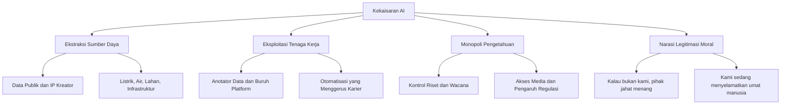
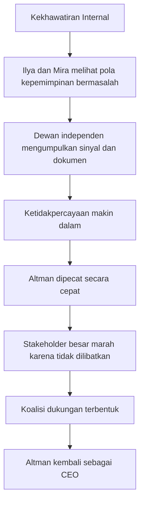
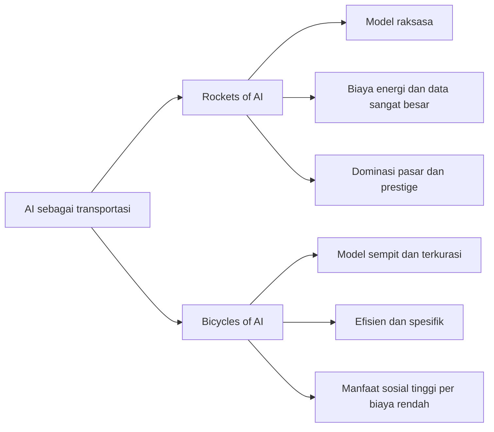

## 🚨 Pendahuluan: Masalah Terbesar AI Mungkin Bukan Teknologinya, Melainkan Kekuasaan di Baliknya

Selama beberapa tahun terakhir, publik dibanjiri oleh satu narasi yang terdengar memukau sekaligus menenangkan: *artificial intelligence* — **kecerdasan buatan** — akan membantu manusia menyembuhkan kanker, mempercepat penemuan obat, memecahkan krisis iklim, meningkatkan produktivitas, dan pada akhirnya membawa dunia menuju kelimpahan baru. Dalam versi paling optimistis, AI tampil seperti mesin keajaiban. Dalam versi yang lebih dramatis, ia digambarkan sebagai teknologi maha-kuat yang begitu berbahaya sehingga hanya segelintir perusahaan tertentu yang pantas mengendalikannya. Dua narasi ini tampak berbeda di permukaan, tetapi menurut Karen Hao, keduanya justru berasal dari sumber yang sama. 🧠⚠️

Dalam wawancara panjang yang menjadi dasar artikel ini, Karen Hao — jurnalis investigatif yang selama bertahun-tahun meliput industri teknologi dan menulis buku *Empire of AI* — menyampaikan tesis yang sangat tajam: persoalan utama industri AI hari ini bukan hanya apakah modelnya hebat atau tidak, melainkan **siapa yang membangun, siapa yang diuntungkan, siapa yang dikorbankan, dan narasi apa yang sengaja dibentuk untuk membuat publik menerima semua itu**.

Bagi Karen, industri AI tidak bisa dipahami hanya sebagai arena inovasi. Ia harus dipahami sebagai **struktur kekuasaan**. Ketika perusahaan-perusahaan AI mengambil data manusia tanpa izin yang benar-benar bermakna, menggunakan properti intelektual kreator sebagai bahan bakar model, menyedot energi dan air dalam skala raksasa, mendorong otomatisasi kerja tanpa perlindungan sosial memadai, lalu pada saat yang sama mengklaim bahwa semua ini dilakukan demi keselamatan umat manusia — di titik itulah kita harus berhenti dan bertanya: apakah ini masih sekadar bisnis teknologi, atau sudah menyerupai bentuk baru dari kekaisaran digital?

Karen Hao memilih kata **empire** — *kekaisaran* — bukan untuk sensasi retoris, tetapi karena menurutnya hanya metafora itulah yang cukup besar untuk menjelaskan cara kerja industri ini. Seperti kekaisaran lama, kekaisaran AI merampas sumber daya, mengendalikan pengetahuan, mengeksploitasi tenaga kerja, membangun legitimasi moral bagi dirinya sendiri, dan terus mengulang pesan bahwa dominasi mereka diperlukan demi mencegah dominasi pihak lain yang dianggap lebih jahat. Jadi kita tidak hanya sedang melihat perlombaan model. Kita sedang melihat **perjuangan untuk menguasai definisi masa depan**. 🏛️

Artikel ini akan membedah wawancara tersebut secara runtut, detail, dan menyeluruh. Kita akan melihat bagaimana istilah seperti AGI dipakai secara elastis sesuai kepentingan, bagaimana Sam Altman dipotret sebagai figur yang sangat persuasif sekaligus sangat memecah belah, bagaimana konflik internal OpenAI membuka tabir struktur kepemimpinan yang rapuh, bagaimana para pekerja anotasi data mengalami dehumanisasi yang nyaris tak terlihat publik, bagaimana data center dan superkomputer menciptakan biaya sosial-lingkungan yang nyata, serta mengapa perdebatan tentang AI pada akhirnya selalu kembali ke satu pertanyaan purba: **siapa yang memegang kuasa, dan untuk kepentingan siapa kuasa itu dijalankan?**

<Callout type="important" title="Tesis utama artikel ini">
Karen Hao tidak mengatakan bahwa AI tidak berguna. Ia mengatakan bahwa cara AI diproduksi hari ini sangat sering dibungkus mitos, digerakkan logika kekuasaan, dan dibayar mahal oleh kelompok yang justru paling sedikit mendapat manfaat.
</Callout>

---

## 🏛️ 1. Mengapa Karen Hao Menyebut Industri Ini Sebagai “Kekaisaran AI”?

Salah satu kontribusi paling kuat dari Karen Hao adalah keberaniannya memberi nama yang tepat pada pola yang selama ini terasa kabur. Banyak kritik terhadap AI terjebak di dua kutub. Kutub pertama terlalu teknis: membahas bias model, *hallucination* — **halusinasi model**, atau efisiensi GPU seolah semua persoalan dapat direduksi menjadi persoalan engineering. Kutub kedua terlalu moralistis namun dangkal: mengutuk perusahaan AI sebagai rakus, tetapi tanpa menjelaskan struktur ekonomi dan politik yang membuat kerakusan itu sistematis. Karen mencoba melampaui keduanya.

Menurut Karen, istilah **empire** — *kekaisaran* — adalah metafora yang paling akurat karena perusahaan AI besar memperlihatkan pola-pola klasik kekaisaran lama. Ada beberapa ciri yang ia soroti.

Pertama, mereka **mengklaim sumber daya yang bukan milik mereka**. Dalam konteks lama, kekaisaran merampas tanah, tambang, hasil bumi, dan jalur perdagangan. Dalam konteks AI, yang dirampas adalah data, teks, gambar, suara, video, pengetahuan kolektif internet, dan properti intelektual para kreator. Semua itu dijadikan bahan baku untuk melatih model, sering kali tanpa persetujuan yang sungguh-sungguh adil.

Kedua, mereka **mengeksploitasi tenaga kerja dalam skala masif**. Ini tidak selalu terlihat di permukaan, karena publik lebih sering melihat wajah AI dalam bentuk antarmuka yang bersih dan futuristis: chatbot yang ramah, generator gambar yang memesona, atau asisten otomatis yang terlihat canggih. Namun di balik itu ada ratusan ribu pekerja manusia yang melabeli data, mengevaluasi respons model, membersihkan output, menandai konten berbahaya, dan melakukan pekerjaan repetitif yang sering dibayar murah. Mereka bukan tokoh utama dalam narasi besar AI, padahal tanpa mereka banyak sistem ini tidak akan berfungsi.

Ketiga, mereka **memonopoli produksi pengetahuan**. Ini poin yang sangat penting. Perusahaan AI besar terus membentuk kesan bahwa mereka adalah satu-satunya pihak yang benar-benar memahami teknologi ini. Jika publik gelisah, publik dianggap tidak paham. Jika pembuat kebijakan kritis, mereka dianggap tertinggal secara teknis. Jika peneliti independen menemukan masalah, hasil penelitian itu bisa ditekan, didiskreditkan, atau diredam. Kekuasaan epistemik — *epistemic power*, yaitu kuasa untuk menentukan apa yang dianggap pengetahuan sah — menjadi bagian dari strategi dominasi.

Keempat, kekaisaran selalu membangun **narasi legitimasi moral**. Mereka tidak pernah berkata, “Kami ingin berkuasa karena kami ingin berkuasa.” Mereka berkata, “Kami harus berkuasa agar dunia selamat.” Dalam sejarah lama, kekaisaran membawa klaim peradaban, modernitas, pembangunan, atau misi suci. Dalam konteks AI, narasinya berbunyi: “Kalau kami tidak membangun ini secepat mungkin, pihak jahat akan melakukannya lebih dulu.” Jadi dominasi dibungkus sebagai tanggung jawab moral. 🧩

Dengan bingkai ini, kita mulai bisa melihat bahwa apa yang terjadi di industri AI bukan sekadar kompetisi produk. Ia adalah perebutan bahan baku, tenaga kerja, legitimasi politik, dan arah peradaban teknologi.

---

## 🧠 2. Masalah Dasar Sejak Awal: Kita Bahkan Tidak Sepakat Apa Itu “Kecerdasan”

Salah satu bagian paling penting dari penjelasan Karen Hao adalah ketika ia mengajak kita mundur jauh ke belakang, ke masa awal lahirnya bidang AI sebagai disiplin ilmiah. Ia mengingatkan bahwa sejak awal, istilah **artificial intelligence** sudah memuat beban filosofis yang sangat besar. Nama itu tidak netral.

Ketika John McCarthy dan kawan-kawan merintis bidang ini di Dartmouth pada pertengahan abad ke-20, pilihan kata “artificial intelligence” segera mengarahkan seluruh disiplin ke satu ambisi: menciptakan sesuatu yang menyerupai atau menyamai kecerdasan manusia. Masalahnya, sampai hari ini pun manusia belum punya kesepakatan ilmiah yang benar-benar utuh mengenai apa itu kecerdasan manusia. Psikologi, neurosains, biologi, filsafat pikiran, hingga ilmu kognitif masih memperdebatkannya.

Ini punya konsekuensi yang sangat besar. Jika tujuan akhirnya kabur, maka siapa pun bisa memindahkan garis finish sesuai kepentingan. Dan itulah yang, menurut Karen, sedang dilakukan oleh perusahaan AI besar. Mereka berbicara tentang **AGI** — *artificial general intelligence*, atau **kecerdasan buatan umum** — seolah itu adalah tujuan teknis yang konkret, padahal definisinya terus berubah tergantung dengan siapa mereka bicara dan kepentingan apa yang sedang mereka kejar.

Di sinilah kita melihat sesuatu yang halus tetapi sangat berbahaya: **ketidakjelasan konseptual berubah menjadi alat kekuasaan**. Jika publik tidak tahu pasti apa yang dimaksud dengan AGI, maka perusahaan bisa menjual mimpi besar tanpa harus tunduk pada standar verifikasi yang jelas. Mereka bisa mengatakan AGI hampir tiba, atau masih jauh, atau sangat berbahaya, atau sangat bermanfaat — semuanya tergantung konteks komunikasi yang mereka butuhkan saat itu.

Karen dengan tepat menunjukkan bahwa sejak awal industri ini dibangun di atas satu ambisi yang definisinya kabur. Ketika suatu bidang tidak punya definisi tujuan yang kokoh, maka politik narasi akan selalu lebih dominan daripada kepastian ilmiah. 🎯

---

## 🎭 3. AGI sebagai Istilah Bunglon: Satu Kata, Banyak Fungsi Politik

Karen Hao memberi contoh yang sangat kuat tentang bagaimana **Sam Altman** dan OpenAI menggunakan istilah AGI secara elastis. Ini bukan sekadar inkonsistensi verbal biasa. Ini adalah strategi komunikasi yang menunjukkan bahwa AGI berfungsi sekaligus sebagai mimpi, ancaman, produk, dan alat negosiasi.

Ketika bicara kepada Kongres atau publik yang lebih luas, AGI bisa dihadirkan sebagai teknologi yang akan menyembuhkan kanker, mengatasi perubahan iklim, dan mengangkat kesejahteraan manusia. Di sini AGI tampil sebagai janji peradaban. Ketika bicara kepada konsumen, AGI dibingkai sebagai asisten digital luar biasa yang akan membuat hidup lebih mudah. Di sini AGI menjadi produk aspiratif. Ketika bicara kepada investor atau mitra bisnis seperti Microsoft, definisinya bergeser menjadi sesuatu yang terkait dengan skala pendapatan, nilai ekonomi, dan penguasaan pasar. Di sini AGI menjadi instrumen finansial. Ketika bicara soal regulasi, AGI bisa dibingkai sebagai sesuatu yang begitu berbahaya sehingga hanya perusahaan tertentu yang cukup bertanggung jawab untuk menanganinya. Di sini AGI menjadi senjata politik.

Yang menarik, semua definisi ini tidak sepenuhnya identik satu sama lain. Bahkan dalam beberapa titik, mereka saling bertentangan. Tetapi justru di situlah kekuatan retorisnya. Istilah yang kabur bisa dipakai dalam banyak arena sekaligus. Ia tidak perlu konsisten secara filosofis selama efektif secara strategis.

Karen melihat pola ini bukan sebagai kecelakaan. Ia melihatnya sebagai gejala dari industri yang terus-menerus membentuk emosi publik: kadang membangkitkan rasa kagum, kadang memicu rasa takut, kadang menjanjikan kelimpahan, kadang meminta kelonggaran regulasi. Semua ini berputar di sekitar satu istilah yang dipertahankan tetap elastis. 🌀

<Callout type="tip" title="Mengapa istilah kabur bisa sangat kuat?">
Istilah yang terlalu jelas mudah diuji. Istilah yang cukup kabur justru lebih mudah dipakai untuk menghimpun modal, dukungan politik, rasa takut, dan rasa kagum sekaligus.
</Callout>

---

## 🚪 4. Sam Altman, Elon Musk, dan Awal Mula Politik Persuasi di OpenAI

Salah satu bagian wawancara yang paling dramatis adalah penjelasan Karen Hao tentang bagaimana bahasa, pengaruh, dan persuasi bekerja di fase awal OpenAI. Karen menjelaskan bahwa pada tahun-tahun awal, Sam Altman menulis dan berbicara tentang AI dengan bahasa yang sangat selaras dengan ketakutan Elon Musk tentang risiko eksistensial. Ini penting, karena Musk saat itu adalah figur yang sangat vokal soal bahaya AI dan sangat sensitif terhadap gagasan bahwa teknologi ini bisa mengancam keberlangsungan umat manusia.

Karen menilai bahwa bahasa tersebut tidak berdiri di ruang hampa. Ia punya audiens spesifik. Dalam hal ini, salah satu audiens terpentingnya adalah Musk sendiri. Dengan kata lain, komunikasi publik ternyata juga merupakan komunikasi strategis kepada tokoh-tokoh yang ingin dihimpun ke dalam proyek.

Apakah ini berarti Altman sekadar memanipulasi Musk? Karen berhati-hati, tetapi ia menunjukkan bahwa dari perspektif Musk, perasaan dimanipulasi itu sangat nyata. Apalagi ketika konflik internal berkembang dan kemudian muncul dokumen-dokumen hukum yang memperlihatkan bagaimana perebutan pengaruh dan posisi berlangsung di dalam OpenAI. Karen menggambarkan bahwa di satu fase, Musk bukan sekadar keluar karena beda visi, tetapi juga merasa “dipinggirkan” dalam struktur kekuasaan yang berkembang.

Yang menarik di sini bukan sekadar drama personalnya. Yang lebih penting adalah pelajarannya: **di industri AI, narasi tentang masa depan bukan hanya alat pemasaran untuk publik, tetapi juga alat untuk membentuk koalisi elite**. Bahasa tentang keselamatan, ancaman, dan misi kemanusiaan bisa bekerja sekaligus sebagai instrumen rekrutmen, pengumpulan modal, dan konsolidasi kekuasaan.

---

## ⚔️ 5. Mengapa Sam Altman Begitu Memecah: Visioner, Manipulator, atau Keduanya?

Ketika ditanya apa pendapatnya tentang Sam Altman, Karen Hao memberikan jeda yang sangat menarik. Jeda itu sendiri terasa bermakna. Ia akhirnya menjelaskan bahwa hampir semua orang yang ia wawancarai tampak sangat terpolarisasi soal Altman. Sangat sedikit yang punya perasaan netral.

Di satu sisi, ada orang-orang yang menganggap Altman sebagai pemimpin teknologi generasional: sangat persuasif, sangat piawai menggerakkan modal, sangat jago menarik talenta terbaik, dan sangat efektif mendorong momentum. Dalam bacaan ini, Altman adalah pembangun koalisi yang langka. Seseorang yang mampu membuat masa depan tertentu terasa mungkin.

Di sisi lain, ada mereka yang melihatnya sebagai figur yang manipulatif, penuh permainan politik, tidak konsisten, dan menciptakan lingkungan kerja yang membuat orang merasa dipakai untuk tujuan yang pada akhirnya bukan tujuan mereka sendiri. Di titik inilah Karen memberi analisis yang menurut saya sangat tajam: penilaian orang terhadap Altman sering kali bergantung pada apakah mereka merasa sejalan dengan visi masa depan yang ia dorong. Kalau Anda percaya pada masa depan yang sama, ia terlihat seperti jenius strategis. Kalau Anda tidak percaya, ia bisa terasa seperti manipulator yang mendorong Anda secara halus ke arah yang tidak Anda pilih secara sadar. 🎭

Karen juga mengaitkan ini dengan kasus **Dario Amodei**, yang kemudian memimpin Anthropic. Menurutnya, Dario awalnya merasa sejalan dengan OpenAI, tetapi lama-lama menyadari bahwa arah nyata perusahaan dan cara Altman menggunakan kecakapan orang-orang di sekitarnya tidak benar-benar cocok dengan visi yang ia pegang. Dari sini lahirlah rasa dikhianati, atau setidaknya rasa bahwa energi dan kecerdasan seseorang telah diarahkan untuk membangun masa depan yang sebenarnya ia tolak.

Ini membuat konflik di industri AI tampak bukan sekadar soal produk. Ia juga soal benturan atas **gambaran masa depan yang hendak diwujudkan**, serta siapa yang punya hak moral untuk mengorkestrasi orang lain demi gambaran itu.

---

## 🧨 6. Pemecatan Altman: Di Balik Kekacauan, Ketidakpercayaan, dan Ketakutan pada AGI

Salah satu bagian paling mendalam dari wawancara adalah ketika Karen menceritakan proses yang mengarah pada pemecatan Sam Altman dari OpenAI. Banyak orang hanya melihat peristiwa itu sebagai drama korporat singkat: CEO dipecat, karyawan marah, investor bereaksi, lalu CEO kembali. Namun menurut Karen, kejadian itu jauh lebih serius dari sekadar krisis komunikasi.

Ia menjelaskan bahwa **Ilya Sutskever** dan **Mira Murati** punya kekhawatiran yang makin dalam tentang cara Altman memimpin. Kekhawatiran itu bukan hanya soal kerasnya ritme startup atau keputusan yang kontroversial. Mereka melihat pola yang dianggap lebih mendasar: Altman memecah tim, menciptakan lingkungan yang sulit dipercaya, dan menyampaikan hal yang berbeda kepada pihak-pihak berbeda. Dalam organisasi yang merasa dirinya sedang membangun teknologi yang bisa mengubah sejarah umat manusia, ketidakstabilan seperti ini dianggap sangat berbahaya.

Karen juga mengangkat aspek yang sangat menarik: dewan independen OpenAI menilai bahwa jika ini perusahaan biasa, mungkin perilaku seperti itu belum tentu cukup untuk memecat CEO. Tetapi OpenAI bukan dipandang sebagai perusahaan biasa oleh orang-orang di dalamnya. Mereka sendiri sungguh percaya bahwa yang sedang dibangun adalah teknologi dengan konsekuensi sangat besar bagi dunia. Dalam kerangka itu, pertanyaan “apakah Sam orang yang tepat memegang tombol AGI?” menjadi pertanyaan yang benar-benar eksistensial, bukan metafora kosong.

Masalah lain yang memperparah ketidakpercayaan adalah urusan **OpenAI Startup Fund**. Karen menjelaskan bahwa sejumlah anggota dewan menyadari bahwa apa yang mereka kira merupakan kendaraan investasi milik OpenAI ternyata, secara struktur, sangat terkait dengan Altman secara pribadi. Ini memperkuat kesan bahwa ada ketidaksesuaian antara bagaimana sesuatu dipresentasikan dan bagaimana sesuatu sebenarnya dijalankan.

Yang tragis, ketika pemecatan akhirnya dilakukan, ia dilakukan sangat cepat dan nyaris tanpa persiapan terhadap para pemangku kepentingan utama. Microsoft hanya diberi tahu sesaat sebelum keputusan diumumkan. Akibatnya, banyak pihak yang mungkin sebenarnya bisa diajak berdiskusi justru merasa dipinggirkan, sehingga energi politik berbalik untuk mengembalikan Altman. Ini menunjukkan satu ironi besar: meskipun ada kekhawatiran serius terhadap kepemimpinannya, **kemampuan persuasi dan jaringan kekuasaan Altman ternyata begitu kuat sehingga sistem yang mencoba membatasi dirinya justru runtuh lebih dulu**. 💥

---

## 🧪 7. Ilya Sutskever dan Hipotesis “Otak adalah Mesin Statistik”

Untuk memahami mengapa sebagian tokoh AI begitu yakin pada arah yang mereka tempuh, Karen Hao mengajak kita masuk ke lapisan yang lebih filosofis sekaligus ilmiah. Ia menjelaskan bahwa tokoh seperti **Ilya Sutskever** dan mentornya, Geoffrey Hinton, bekerja dengan hipotesis bahwa otak manusia pada dasarnya dapat dipahami sebagai **mesin statistik raksasa**. Jika itu benar, maka membangun model statistik yang semakin besar, semakin kaya data, dan semakin padat parameter dapat menjadi jalan menuju bentuk kecerdasan yang menyerupai atau bahkan melampaui manusia.

Di sini letak titik balik perdebatan. Bagi banyak tokoh AI, ini bukan hanya strategi teknis, tetapi **hipotesis ilmiah yang menjadi kompas seluruh industri**. Jika Anda percaya bahwa otak pada dasarnya adalah mesin prediksi statistik, maka *scaling* — memperbesar model, data, dan komputasi — tampak seperti jalan yang masuk akal. Tetapi jika Anda menolak hipotesis itu, maka seluruh perlombaan ini bisa tampak seperti eksperimen raksasa yang dibangun di atas asumsi yang belum terbukti.

Karen sangat menekankan bahwa hipotesis ini **bukan konsensus ilmiah universal**. Di luar dunia AI, banyak ahli saraf, psikolog, dan filsuf pikiran yang tidak setuju dengan penyederhanaan semacam itu. Namun industri AI modern cenderung bertindak seolah-olah hipotesis itu sudah cukup benar untuk membenarkan investasi raksasa, konsumsi energi kolosal, dan ekstraksi data dalam skala global.

Inilah salah satu titik paling kritis dalam seluruh percakapan. Dunia sedang mengalami dampak nyata dari keputusan-keputusan yang lahir dari hipotesis yang masih diperdebatkan. Jadi ketika perusahaan AI berbicara seolah arah mereka adalah keniscayaan ilmiah, Karen mengingatkan bahwa yang kita lihat sesungguhnya adalah **satu visi ilmiah tertentu yang sudah naik kelas menjadi agenda industri global**. 🔬

---

## 🤖 8. Mengapa Karen Menolak Argumen “Kalau Bukan Kita, China yang Menang”

Salah satu bagian paling kuat dari wawancara terjadi ketika sang pewawancara memainkan posisi *devil’s advocate* — **pengacara setan**, atau orang yang sengaja mengambil posisi lawan untuk menguji argumen. Pertanyaannya klasik: kalau Amerika atau perusahaan-perusahaan besar di Barat tidak mempercepat AI, bukankah China akan melakukannya lebih dulu, lalu menjadi peradaban dominan secara ilmiah dan militer?

Karen menolak argumen ini secara tegas. Bukan karena ia menganggap kompetisi geopolitik tidak nyata, tetapi karena menurutnya argumen tersebut dipenuhi asumsi yang belum tentu benar. Misalnya, ia mempertanyakan asumsi bahwa model bahasa besar yang terus diskalakan otomatis akan melahirkan kecerdasan umum yang relevan untuk dominasi militer atau geopolitik. Ia juga menolak gagasan bahwa semua jenis kemampuan berkembang secara serempak hanya karena model diperbesar.

Karen menekankan bahwa perusahaan sebenarnya memilih kemampuan apa yang ingin mereka percepat. Mereka mengumpulkan data tertentu, melatih model untuk domain tertentu, dan mengejar pasar yang bisa membayar paling tinggi. Jadi kalau model menjadi sangat kuat di bidang hukum, keuangan, layanan pelanggan, atau administrasi, itu bukan bukti bahwa “kecerdasan umum” sedang bangkit secara netral. Itu menunjukkan adanya **pilihan ekonomi** tentang ke mana kapasitas model diarahkan.

Lebih jauh lagi, Karen menilai narasi “kalau bukan kita, mereka” sangat berguna secara politik karena ia menciptakan kondisi psikologis di mana publik diminta menyerahkan sumber daya dan keleluasaan kepada perusahaan AI tanpa terlalu banyak pertanyaan. Ini pola klasik kekaisaran: ancaman eksternal dipakai untuk membenarkan konsentrasi kekuasaan internal.

Dengan kata lain, menurut Karen, narasi persaingan geopolitik sering kali tidak murni deskriptif. Ia juga sangat performatif: ia **menciptakan ketakutan yang kemudian dipakai untuk meluaskan legitimasi industri**. 🌍

---

## 👷 9. Horor yang Tak Terlihat: Buruh Anotasi Data dan Dehumanisasi Kerja

Kalau ada satu bagian dari wawancara ini yang paling memilukan sekaligus paling penting secara moral, menurut saya itu adalah pembahasan tentang **data annotation** — *anotasi data*, yaitu pekerjaan manusia yang memberi label, contoh, dan koreksi agar model AI dapat belajar. Banyak orang menggunakan ChatGPT, Claude, atau model lain tanpa pernah membayangkan bahwa di balik respons yang tampak lancar itu ada tenaga manusia dalam jumlah besar yang bekerja dalam kondisi sangat tidak ideal.

Karen menekankan bahwa kemampuan model untuk “mengobrol” bukan muncul secara ajaib dari tumpukan data internet semata. Agar model menjadi antarmuka dialog yang berguna, perlu ada proses panjang di mana manusia menunjukkan contoh respons yang baik, menilai keluaran, memperbaiki gaya, melabeli pelanggaran, dan mengerjakan tugas repetitif lainnya. Dengan kata lain, AI yang tampak otomatis itu pada dasarnya dibangun di atas **kerja manusia yang disamarkan**.

Yang membuatnya lebih pahit, banyak orang yang masuk ke industri anotasi data justru adalah mereka yang terdampak oleh restrukturisasi ekonomi akibat AI dan otomatisasi. Karen menyebut contoh orang-orang berpendidikan tinggi — lulusan universitas, profesional, bahkan pekerja kreatif kelas atas — yang kesulitan mendapat pekerjaan stabil dan akhirnya bekerja sebagai anotator data untuk melatih model pada bidang yang sangat dekat dengan pekerjaan yang dulu mereka lakukan.

Ini menciptakan lingkaran yang sangat ironis dan sangat kejam: seseorang bisa kehilangan pekerjaan, lalu demi bertahan hidup ia membantu melatih sistem yang mungkin akan menggantikan semakin banyak orang dalam pekerjaan serupa. Di sini kita melihat bukan hanya masalah ekonomi, tetapi masalah eksistensial tentang martabat kerja.

Karen mengutip kisah seorang ibu yang begitu cemas menunggu proyek anotasi data datang sehingga ketika anaknya pulang sekolah dan mencoba bicara, ia justru marah besar karena takut kehilangan jendela kerja yang mungkin hanya sebentar. Ia kemudian merasa dirinya berubah menjadi “monster”. Kisah ini menghantam tepat ke jantung persoalan. AI sering dijual sebagai alat pembebas manusia dari kerja mekanis, tetapi bagi banyak pekerja di lapis bawah rantai pasoknya, AI justru **mengubah hidup mereka menjadi lebih mekanis dari sebelumnya**. 💔

<Callout type="warning" title="Paradoks besar otomasi AI">
Sebagian orang menjadi lebih produktif dan lebih bebas karena AI. Tetapi sebagian yang lain justru kehilangan pekerjaan, kehilangan ritme hidup yang manusiawi, lalu masuk ke kerja platform yang sangat menguras martabat demi membuat AI itu sendiri semakin berguna.
</Callout>

---

## 📉 10. AI dan Runtuhnya Tangga Karier: Mengapa Entry-Level Work Sangat Rentan

Salah satu hal yang sangat ditekankan Karen Hao adalah bahwa ancaman AI terhadap pekerjaan tidak boleh dibahas dengan logika hitam-putih. Bukan berarti semua pekerjaan akan hilang. Bukan pula berarti semua kekhawatiran itu berlebihan. Realitasnya lebih rumit, dan justru karena itu lebih berbahaya.

Menurut Karen, yang sedang kita lihat bukan sekadar otomatisasi penuh atas semua profesi, melainkan **erosi terhadap lapisan-lapisan awal tangga karier**. Banyak pekerjaan *entry-level* — **tingkat pemula** — dan *mid-tier* — **tingkat menengah** — mulai tertekan. Ini sangat penting, karena karier profesional dibangun melalui akumulasi pengalaman bertahap. Kalau lapisan bawahnya digerus, maka lapisan atas di masa depan juga akan kosong.

Misalnya, dalam banyak bidang seperti administrasi, keuangan, layanan pelanggan, legal review, produksi konten, dan pekerjaan pengetahuan lain yang cukup terstruktur, AI tidak harus sempurna untuk memengaruhi keputusan perusahaan. Cukup “lumayan baik” dan jauh lebih murah, maka sebagian eksekutif akan tergoda mengurangi perekrutan atau bahkan memangkas tim. Ini berarti masalahnya bukan sekadar apakah AI benar-benar mampu menggantikan manusia secara penuh. Masalahnya adalah **bagaimana manajemen memanfaatkan persepsi kemampuan AI untuk membentuk kebijakan tenaga kerja**.

Karen juga menyoroti bagaimana laporan-laporan industri, termasuk pengamatan dari Anthropic, menunjukkan bahwa gangguan terbesar memang cenderung menumpuk pada pekerjaan kerah putih yang rutin dan terstruktur. Sementara itu, pekerjaan yang sangat fisik, sangat interpersonal, atau sangat berbasis kehadiran nyata sering kali lebih lambat terganggu. Hasil akhirnya bisa menjadi polarisasi: segelintir peran ahli tingkat tinggi makin bernilai, banyak peran dasar menghilang atau menyusut, lalu lapisan manusia yang tersisa harus berebut ruang yang makin sempit.

Kalau ini terjadi terus, kita menghadapi masalah yang lebih besar dari sekadar efisiensi. Kita menghadapi **krisis reproduksi profesional**: bagaimana seseorang menjadi ahli senior kalau jalur untuk menjadi junior yang bertumbuh perlahan makin sempit? 🪜

---

## ☣️ 11. Dari Data ke Tanah, Listrik, dan Air: Biaya Material dari “Kecerdasan”

Sering kali AI dibayangkan sebagai sesuatu yang nyaris tak berbobot: model, kode, cloud, token, antarmuka. Karen Hao dengan sangat kuat membongkar ilusi ini. Menurutnya, AI modern adalah industri yang sangat material. Ia butuh lahan, bangunan, pasokan listrik besar, sistem pendinginan, air tawar, jaringan transmisi, dan seluruh infrastruktur fisik yang tidak bisa disulap dari udara.

Di sinilah metafora kekaisaran menjadi sangat kuat. Kekaisaran AI tidak hanya mengekstrak data dari ruang digital. Ia juga melakukan *land grab* — **perebutan lahan**, dan *resource extraction* — **ekstraksi sumber daya** di dunia nyata. Ketika pusat data dan superkomputer dibangun dalam skala raksasa, mereka tidak hadir sebagai fenomena abstrak. Mereka hadir sebagai beban nyata pada lingkungan sekitar.

Karen membahas proyek-proyek seperti fasilitas besar OpenAI dan infrastruktur komputasi raksasa yang mengonsumsi daya setara persentase signifikan dari kota besar. Ia menekankan bahwa kebutuhan komputasi ini bukan hanya persoalan teknis perusahaan, tetapi persoalan distribusi beban sosial. Jika pusat data mengambil listrik dalam jumlah luar biasa, siapa yang akhirnya membayar kenaikan biaya grid? Jika pusat data memakai air dalam skala besar untuk pendinginan, siapa yang akhirnya berebut sumber air? Jika fasilitas dibangun di daerah rentan, siapa yang menghirup dampak polusinya?

Kita terbiasa membicarakan “biaya komputasi” seolah hanya soal capex perusahaan dan harga GPU. Karen memaksa kita melihat bahwa ada **biaya lingkungan dan sosial yang disubsidi oleh publik**. Dan sering kali publik yang menanggungnya justru adalah kelompok yang paling jauh dari lingkaran keuntungan industri AI.

---

## 🌫️ 12. Memphis dan Environmental Racism: Ketika Superkomputer Menggerus Hak Hidup Sehat

Salah satu contoh paling menyengat yang dibawa Karen adalah kasus di **Memphis, Tennessee**, terkait proyek komputasi besar milik Elon Musk. Menurut penjelasannya, fasilitas superkomputer yang dibangun di sana ditopang oleh puluhan turbin gas metana. Yang membuat kasus ini sangat serius bukan hanya besarnya energi yang dipakai, tetapi lokasi sosial-politiknya.

Komunitas yang terdampak adalah komunitas pekerja, banyak di antaranya masyarakat kulit hitam dan kelompok yang sejak lama sudah menanggung beban lingkungan secara tidak proporsional. Karen menggambarkan bagaimana warga baru menyadari kehadiran infrastruktur itu ketika mereka mencium bau yang menyerupai kebocoran gas dan mulai mengalami kecemasan akan kualitas udara.

Ia mengaitkan ini dengan konsep **environmental racism** — *rasisme lingkungan*, yaitu pola di mana kelompok rasial atau ekonomi tertentu menanggung paparan polusi, limbah, atau infrastruktur berbahaya secara tidak proporsional dibanding kelompok lain. Dalam kasus ini, kecanggihan AI yang dipuji dunia ternyata berdiri di atas kenyataan bahwa sebagian komunitas harus hidup dengan udara yang makin tercemar dan risiko kesehatan yang makin berat.

Ini penting karena diskursus AI sering membicarakan “masa depan umat manusia” dengan bahasa yang sangat abstrak. Karen memaksa kita turun ke tanah: masa depan itu dibangun di suatu tempat, di samping rumah seseorang, di atas grid listrik tertentu, di sekitar sumber air tertentu, dan di dekat paru-paru anak-anak tertentu. Jadi tidak cukup berkata bahwa AI akan membawa manfaat global jika cara membangunnya justru **mengonsentrasikan kerusakan pada komunitas yang paling rentan**. 🌫️🏚️

---

## 🚀 13. “Rockets of AI” vs “Bicycles of AI”: Kritik Karen terhadap Obsesi Skala Raksasa

Untuk menjelaskan bahwa ia tidak anti-teknologi, Karen Hao menggunakan analogi yang sangat cerdas: AI itu seperti **transportation** — *transportasi*. Dalam transportasi, kita tahu bahwa tidak semua masalah harus diselesaikan dengan roket. Ada sepeda, kereta, bus, mobil, kapal, dan pesawat. Masing-masing punya konteks, biaya, dan rasionalitasnya sendiri.

Menurut Karen, model-model raksasa seperti LLM generasi mutakhir lebih mirip **rockets of AI** — *roket AI*. Mereka butuh sumber daya luar biasa besar, konsumsi energi sangat tinggi, data dalam jumlah masif, dan tenaga kerja laten dalam skala besar. Mereka bisa sangat berguna untuk sejumlah hal, tetapi biaya sosial-materialnya juga sangat besar.

Sebaliknya, ada sistem AI yang lebih sempit, lebih terkurasi, dan sangat efektif untuk problem tertentu. Karen menyebut contoh seperti **AlphaFold**, sistem yang memprediksi pelipatan protein dan sangat berguna bagi riset biologi serta penemuan obat. Ini ia sebut sebagai **bicycles of AI** — *sepeda AI*: lebih hemat sumber daya, lebih spesifik, dan memberi manfaat besar tanpa harus menelan setengah infrastruktur energi suatu wilayah.

Argumen Karen di sini sangat penting. Ia tidak berkata bahwa AI harus dihentikan total. Ia berkata bahwa kita perlu bertanya **AI macam apa yang sedang dibangun, untuk tujuan apa, dengan biaya apa, dan siapa yang menanggung biaya itu**. Kalau industri hanya mengejar “roket” karena roket memberi prestige, kekuasaan, dan dominasi pasar, maka itu bukan semata pilihan teknis. Itu adalah pilihan politik-ekonomi.

---

## 🧵 14. Mengapa Narasi Industri AI Sangat Mirip Mitos dalam Dune

Salah satu analogi budaya paling menarik yang digunakan Karen adalah dunia **Dune**. Ia menyebut bahwa industri AI bekerja dengan pola mitologi yang mirip dengan kisah dalam novel tersebut: ada elite yang menanam mitos, lalu memanfaatkan mitos itu untuk menggerakkan massa dan melegitimasi kepemimpinan.

Dalam analogi Karen, para eksekutif AI tidak hanya membangun produk. Mereka juga membangun **mythmaking** — *penciptaan mitos*. Mereka menciptakan narasi bahwa akan datang masa depan dahsyat, ada ancaman besar di depan, dan hanya aktor tertentu yang cukup visioner sekaligus cukup bertanggung jawab untuk menuntun umat manusia melewati masa kritis itu.

Yang membuatnya semakin kuat, menurut Karen, adalah bahwa para pemimpin ini sering kali bukan sekadar memasarkan mitos kepada publik. Mereka juga perlahan **mempercayai mitos yang mereka bangun sendiri**. Seiring waktu, batas antara komunikasi strategis dan keyakinan personal mulai kabur. Seseorang yang awalnya mengucapkan sesuatu demi menggerakkan modal dan dukungan, lama-kelamaan bisa sungguh merasa dirinya memang sedang memanggul misi sejarah.

Ini menjelaskan kenapa di industri AI kita sering melihat campuran aneh antara kalkulasi bisnis yang sangat dingin dan retorika yang nyaris mesianik. Bukan karena salah satunya palsu total, melainkan karena keduanya sudah saling menempel. Para pemimpin itu hidup di dalam narasi yang mereka ciptakan. Dan justru karena itulah narasi itu menjadi semakin kuat dan semakin sulit ditantang dari luar. ✨

---

## 🧾 15. Kontrol atas Pengetahuan: Peneliti, Jurnalis, dan Politik Akses

Bagian lain yang sangat penting dari wawancara ini adalah pembahasan tentang bagaimana perusahaan AI besar mengendalikan aliran informasi. Karen Hao menegaskan bahwa bentuk kekuasaan mereka bukan hanya pada model dan infrastruktur, tetapi juga pada **akses**.

Di dunia jurnalisme teknologi, akses sering menjadi mata uang yang sangat mahal. Siapa yang diberi wawancara eksklusif, siapa yang boleh masuk kantor, siapa yang mendapat *briefing*, siapa yang diizinkan mewawancarai eksekutif penting, dan siapa yang dibiarkan di luar — semua itu membentuk struktur insentif yang kuat. Jurnalis yang terlalu kritis berisiko kehilangan akses, sementara media yang menjaga hubungan baik sering punya keuntungan lebih besar dalam mendapatkan cerita.

Karen menceritakan pengalamannya sendiri dengan OpenAI: setelah menulis profil yang tidak disukai perusahaan, pintu komunikasi praktis tertutup baginya untuk waktu lama. Ini memberi kita gambaran jelas bahwa perusahaan teknologi sangat sadar bagaimana menggunakan akses sebagai alat untuk mengatur citra mereka di ruang publik.

Bukan hanya jurnalis. Karen juga menyebut peneliti seperti **Timnit Gebru** dan **Margaret Mitchell** di Google sebagai contoh bagaimana riset yang tidak nyaman bagi agenda perusahaan bisa ditekan. Jadi kontrol pengetahuan berlangsung di banyak level: dari riset internal, relasi media, sampai intimidasi terhadap pengkritik. Ketika industri menguasai bukan hanya teknologi, tetapi juga syarat-syarat pembicaraan tentang teknologi, maka demokrasi pengetahuan mulai terancam. 📰

---

## 🪤 16. Subsidisasi Ketakutan: Mengapa Narasi “AI Bisa Menghancurkan Dunia” Juga Menguntungkan Industri

Salah satu tesis Karen yang paling menarik adalah bahwa narasi AI sebagai ancaman eksistensial bukan selalu lawan dari narasi AI sebagai penyelamat. Keduanya justru bisa saling menopang. Jika publik percaya bahwa AI bisa menghancurkan dunia, maka publik juga lebih mudah menerima klaim bahwa hanya perusahaan tertentu yang pantas memegang kendali penuh untuk memastikan skenario buruk itu tidak terjadi.

Ini berarti ketakutan juga bisa menjadi aset. Bukan berarti semua orang yang bicara soal risiko AI pasti sinis atau manipulatif. Karen tidak sesederhana itu. Tetapi ia menunjukkan bahwa secara struktural, **industri diuntungkan ketika ketakutan itu dibingkai sedemikian rupa sehingga solusi yang muncul selalu bermuara pada konsentrasi kekuasaan yang lebih besar di tangan mereka**.

Jadi, ucapan-ucapan seperti “jika kita tidak hati-hati, semuanya bisa gelap bagi umat manusia” bisa berfungsi ganda. Di satu sisi, ia terdengar seperti peringatan moral. Di sisi lain, ia juga bisa menjadi argumen agar publik, investor, dan negara terus memasok uang, listrik, sumber daya, dan legitimasi politik kepada segelintir perusahaan. Ini bentuk yang sangat halus dari apa yang oleh Karen disebut *gaslighting*: publik dibuat takut sekaligus dibuat bergantung pada aktor yang memproduksi ketakutan itu sendiri. 😶‍🌫️

---

## 👥 17. Apakah Semua CEO AI Sama? Karen Memilih Mengkritik Struktur, Bukan Kepribadian Saja

Menariknya, ketika ditanya apakah beberapa pemimpin AI mungkin lebih bermoral daripada yang lain, Karen justru menolak menjadikan pertanyaan itu pusat pembahasan. Ia tidak mengatakan kepribadian tidak penting. Tetapi ia menilai bahwa fokus berlebihan pada apakah satu CEO lebih baik, lebih lembut, atau lebih berhati-hati daripada CEO lain akan membuat kita kehilangan persoalan struktural yang jauh lebih besar.

Menurut Karen, bahkan jika Anda mengganti semua CEO perusahaan AI besar dengan orang-orang yang secara personal lebih baik, masalah dasarnya tetap tidak hilang jika struktur kekuasaan dan tata kelolanya tetap sama. Mengapa? Karena persoalannya bukan hanya apakah orang di puncak itu baik atau buruk, melainkan **mengapa segelintir orang itu memiliki wewenang luar biasa besar untuk membuat keputusan yang memengaruhi miliaran manusia tanpa partisipasi demokratis yang memadai**.

Ini kritik yang sangat penting. Kita hidup di era yang sangat suka mempersonalisasi persoalan: menyalahkan satu tokoh, memuji satu tokoh, berharap satu tokoh akan menyelamatkan atau merusak segalanya. Karen mengajak kita naik satu level. Yang harus diteliti bukan hanya niat aktor, tetapi **arsitektur kekuasaan** yang memungkinkan dampak sebesar itu terkonsentrasi pada tangan yang sangat sedikit.

Dalam perspektif ini, perdebatan tentang apakah Dario Amodei lebih berhati-hati dari Sam Altman, atau apakah pemimpin tertentu lebih bermoral dari yang lain, menjadi sekunder. Pertanyaan utamanya berubah menjadi: **mengapa masyarakat global membiarkan infrastruktur yang sangat menentukan masa depan dibangun melalui model tata kelola yang begitu sempit dan anti-partisipatif?**

---

## 🧭 18. Jadi, Apa yang Harus Dilakukan? Bukan Menghancurkan AI, tetapi Mematahkan Bentuk Kekaisarannya

Di ujung wawancara, Karen Hao sangat jelas: ia tidak sedang menyerukan penghentian semua AI. Ia juga tidak sedang mengajak publik menjadi anti-teknologi. Yang ia minta adalah sesuatu yang lebih sulit tetapi lebih masuk akal: **mematahkan bentuk kekaisaran dari industri AI dan membangun alternatif yang lebih adil, lebih transparan, dan lebih demokratis**.

Apa artinya secara praktis?

Pertama, ia menekankan pentingnya **regulasi**. Bukan regulasi kosmetik yang hanya menenangkan publik, tetapi aturan nyata yang menyentuh hak cipta, keselamatan anak, tenaga kerja, emisi, konsumsi air, penggunaan energi, akuntabilitas sistem, dan transparansi model bisnis. Fakta bahwa mayoritas besar masyarakat menginginkan regulasi menunjukkan ada landasan sosial untuk itu.

Kedua, ia mendorong masyarakat melihat di mana hidup mereka beririsan dengan kebutuhan industri AI. Data pribadi, lingkungan sekitar, sekolah, kantor, komunitas lokal, dan proses adopsi teknologi di institusi semuanya adalah titik intervensi. Jika industri membutuhkan pelaksanaan sempurna di semua lini agar model bisnis mereka terus melesat, maka penolakan, perlambatan, dan tuntutan akuntabilitas di berbagai titik dapat menjadi rem yang signifikan.

Ketiga, Karen menekankan perlunya **membangun alternatif**. Ini mungkin bagian paling penting. Kritik yang hanya berhenti pada penolakan sering cepat kehabisan napas. Tetapi kritik yang disertai visi alternatif — model yang lebih spesifik, lebih hemat sumber daya, lebih berorientasi kebutuhan nyata, lebih menghormati pekerja, dan lebih terbuka pada pengawasan publik — punya kemungkinan lebih besar mengubah arah.

Keempat, ia mengingatkan bahwa masih ada ruang besar untuk **solidaritas sosial**. Gugatan para kreator, protes warga terhadap data center, keluarga korban yang menuntut platform AI karena dampak pada anak-anak, peneliti yang terus bicara, jurnalis yang menolak tunduk pada politik akses — semua ini adalah bagian dari perjuangan agar AI tidak sepenuhnya ditentukan oleh logika ekstraksi dan dominasi.

<Callout type="success" title="Arah yang ditawarkan Karen Hao">
Tujuan akhirnya bukan dunia tanpa AI. Tujuan akhirnya adalah dunia di mana AI dibangun sebagai teknologi publik yang masuk akal, bukan sebagai mesin kekaisaran yang mengekstrak nilai sebanyak mungkin sambil menyuruh semua orang percaya bahwa itu demi keselamatan mereka.
</Callout>

---

## 📚 Glosarium Ringkas Istilah Penting

Agar pembahasan ini tetap mudah diikuti, berikut beberapa istilah kunci dari wawancara beserta penjelasan Indonesianya:

- **Gaslighting**: manipulasi psikologis yang membuat orang meragukan realitas atau penilaiannya sendiri.
- **Whistleblower**: pengungkap pelanggaran; orang yang membuka praktik buruk di dalam institusi demi kepentingan publik.
- **AGI (Artificial General Intelligence)**: kecerdasan buatan umum; istilah untuk AI yang diklaim mampu melakukan banyak jenis tugas intelektual setara atau melampaui manusia.
- **Data Annotation**: anotasi data; proses memberi label atau contoh pada data agar model AI dapat belajar.
- **Environmental Racism**: rasisme lingkungan; situasi ketika beban pencemaran atau risiko lingkungan lebih banyak ditanggung kelompok rasial atau ekonomi tertentu.
- **Install Base**: basis pengguna terpasang; jumlah sistem/perangkat yang sudah menggunakan suatu platform.
- **Devil’s Advocate**: pengacara setan; pihak yang sengaja mengambil posisi lawan untuk menguji argumen.
- **Synthetic Data**: data sintetis; data yang dihasilkan atau diperluas secara buatan, bukan hanya diambil langsung dari observasi mentah dunia nyata.

---

## 🧩 Kesimpulan: Pertanyaan Terpenting tentang AI Bukan “Seberapa Pintar?”, tetapi “Seberapa Adil?”

Kalau kita membaca wawancara Karen Hao dengan tenang, ada satu hal yang terasa sangat jelas: perdebatan tentang AI selama ini terlalu sering tersesat di antara dua pesona. Pesona pertama adalah pesona kecanggihan. Kita terpesona oleh kemampuan model menulis, merangkum, memprogram, berbicara, dan meniru berbagai fungsi pengetahuan manusia. Pesona kedua adalah pesona apokaliptik. Kita terpesona oleh cerita bahwa teknologi ini bisa menyelamatkan atau menghancurkan dunia. Karen mencoba merobek kedua kabut itu.

Ia mengingatkan bahwa di balik semua narasi besar, ada struktur yang sangat konkret: siapa yang mengumpulkan data, siapa yang mendapat kontrak energi, siapa yang kehilangan pekerjaan, siapa yang menghirup polusi, siapa yang dapat akses media, siapa yang dipaksa melatih sistem dengan upah rendah, siapa yang membuat keputusan, dan siapa yang sama sekali tidak diajak menentukan arah. Setelah semua lapisan mitos disingkap, pertanyaan utamanya tidak lagi terdengar seperti teka-teki futuristik. Ia kembali menjadi pertanyaan politik yang sangat tua dan sangat manusiawi: **siapa memperoleh keuntungan, siapa membayar harga, dan siapa yang diberi hak bicara?**

Karen tidak mengajak kita membenci teknologi. Ia justru mengajak kita lebih dewasa dalam menilai teknologi. Bahwa kegunaan nyata AI bisa diakui, sambil tetap mengkritik keras struktur industri yang membangunnya. Bahwa inovasi bisa dihargai, sambil menolak eksploitasi yang dibungkus sebagai misi kemanusiaan. Bahwa masa depan tidak harus dipilih antara penolakan total dan kepasrahan total. Ada ruang untuk menuntut bentuk AI yang berbeda: lebih hemat, lebih spesifik, lebih akuntabel, lebih manusiawi, dan lebih terbuka pada kontrol demokratis.

Mungkin di situlah kekuatan terbesar dari wawancara ini. Ia tidak hanya membongkar sisi gelap industri AI, tetapi juga mengembalikan kita pada satu jenis kejernihan yang sering hilang dalam euforia teknologi: **bahwa yang harus kita lindungi pada akhirnya bukan mitos tentang mesin, melainkan martabat manusia yang hidup di bawah bayang-bayang mesin itu**. 🌍

<Callout type="cite" title="Sumber utama artikel">
Artikel ini disusun berdasarkan transkrip wawancara YouTube berjudul *AI Whistleblower: We Are Being Gaslit By The AI Companies! They’re Hiding The Truth About AI!* yang menampilkan Karen Hao membahas buku *Empire of AI* dan kritiknya terhadap industri AI modern.
</Callout>
