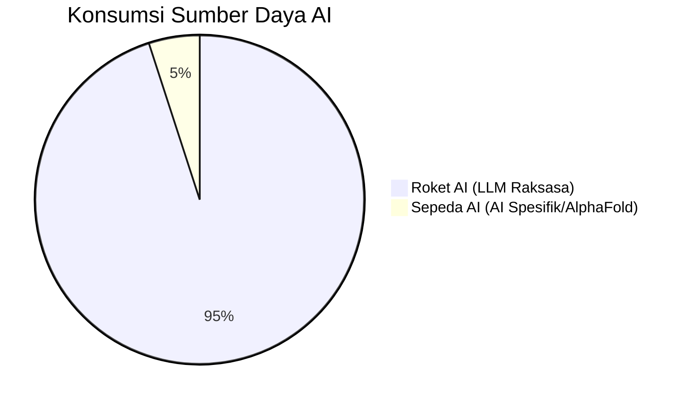

# ⚠️ Empire of AI: Menguak "Gaslighting" Global dan Sisi Gelap di Balik Tirai OpenAI

> "Banyak hal yang terjadi di industri AI saat ini sangat tidak manusiawi. Kita sedang dimanipulasi oleh mitos yang diciptakan para penguasa teknologi untuk mengeruk keuntungan, mengeksploitasi tenaga kerja, dan mengabaikan dampak lingkungan yang menghancurkan." — **Karen Hao**, Jurnalis Investigasi & Penulis *Empire of AI*.

---

Industri Kecerdasan Buatan (AI) sering kali dicitrakan sebagai jalan menuju utopia—sebuah era kelimpahan di mana penyakit terobati dan kemiskinan terhapuskan. Namun, di balik narasi megah tersebut, tersimpan realitas yang jauh lebih kelam. 🕵️‍♂️

Dalam sebuah wawancara mendalam yang mengguncang dunia teknologi, **Karen Hao**, seorang jurnalis investigasi lulusan MIT yang telah mewawancarai lebih dari 250 tokoh kunci AI (termasuk 90 mantan eksekutif OpenAI), membongkar bagaimana perusahaan AI raksasa beroperasi layaknya **Kekaisaran Kolonial** lama. Mereka melakukan apa yang disebut sebagai *gaslighting* (*manipulasi psikologis*) terhadap publik untuk mempertahankan kekuasaan. 🏛️⚡

---

## 🏛️ Konsep "Kekaisaran AI" (Empire of AI)

Karen Hao menggunakan metafora **Empire** (Kekaisaran) karena ini adalah satu-satunya istilah yang mampu merangkum dimensi kekuasaan, skala operasi, dan motivasi perusahaan seperti OpenAI, Google, dan Meta. 

Ada tiga pilar utama bagaimana Kekaisaran AI ini beroperasi:

### 1. Perampasan Sumber Daya (Resource Extraction) 💎
Layaknya penjajah kuno yang merampas tanah dan emas, perusahaan AI merampas **Data**. Mereka mengeklaim hak atas properti intelektual seniman, penulis, dan pencipta tanpa izin atau kompensasi yang adil untuk melatih model mereka. Mereka juga melakukan "land grabbing" (*perampasan lahan*) untuk membangun pusat data (*data center*) raksasa.

### 2. Eksploitasi Tenaga Kerja (Labor Exploitation) 👷‍♂️
Di balik kecanggihan ChatGPT, ada ratusan ribu pekerja "anotasi data" (*data annotation*) di seluruh dunia yang bekerja dengan upah rendah dan kondisi kerja yang tidak manusiawi. Mereka adalah orang-orang yang melatih AI untuk mengenali apa yang aman dan apa yang tidak, sering kali dengan terpapar konten-konten traumatis.

### 3. Monopoli Pengetahuan (Knowledge Monopoly) 🧠
Perusahaan AI memposisikan diri sebagai satu-satunya pihak yang paling mengerti cara kerja teknologi ini. Jika publik atau pembuat kebijakan (*policy makers*) mengkritik, mereka akan melakukan *gaslighting* dengan mengatakan bahwa kritikus tersebut "kurang paham teknis".

```mermaid
graph TD
    A[Kekaisaran AI] --> B(Perampasan Data & IP)
    A --> C(Eksploitasi Tenaga Kerja Murah)
    A --> D(Monopoli Pengetahuan)
    B --> E[Pelatihan Model Raksasa]
    C --> E
    D --> F[Kontrol Narasi Publik]
    F --> G{Gaslighting: "AI adalah Masa Depan"}
```

---

## 🎭 Sam Altman: Sang Orator Ulung atau Manipulator?

Salah satu bagian paling detail dalam riset Karen Hao adalah sosok **Sam Altman**, CEO OpenAI. Hao menggambarkan Altman sebagai sosok yang sangat terpolarisasi: entah Anda menganggapnya sebagai "Steve Jobs modern" atau seorang "manipulator ulung". 🎭

Beberapa fakta mengejutkan yang diungkap Hao:

*   **Manipulasi terhadap Elon Musk:** Altman menggunakan bahasa yang identik dengan ketakutan Musk akan kiamat AI (*existential risk*) hanya untuk menarik Musk sebagai pendiri dan donor utama. Begitu posisi OpenAI kuat, Musk disingkirkan dari kursi pimpinan. 🚫🚀
*   **Pemecatan oleh Board:** Pada tahun 2023, dewan direksi (*board*) OpenAI memecat Altman karena ia dianggap "tidak jujur dalam komunikasinya". Orang-orang terdekatnya, seperti **Ilya Sutskever** (Chief Scientist), mulai merasa bahwa Altman menciptakan lingkungan yang kacau, mengadu domba tim, dan tidak mempedulikan keamanan (*safety*) demi kecepatan rilis produk. 🌪️
*   **Mitos AGI sebagai Alat Kekuasaan:** Definisi **AGI** (*Artificial General Intelligence* / Kecerdasan Umum Buatan) terus diubah-ubah oleh Altman sesuai dengan siapa audiensnya. Di depan Kongres AS, AGI adalah alat penyembuh kanker; di depan investor, AGI adalah mesin pencetak uang ratusan miliar dolar. 💵✨

---

## 👻 Horor di Balik "Dapur" AI: Eksploitasi Manusia

Sering kali kita mengira AI belajar sendiri secara ajaib. Faktanya, ada industri raksasa **Data Annotation** (Anotasi Data: proses melabeli data secara manual agar mesin bisa belajar). ✍️

Karen menceritakan kisah pilu tentang para pekerja ini:
*   Banyak profesional berbakat (dokter, pengacara, sutradara peraih penghargaan) yang kehilangan pekerjaan karena efisiensi AI, akhirnya terpaksa menjadi pekerja harian anotasi data hanya untuk bertahan hidup. 🥖
*   Mereka bekerja di bawah tekanan algoritma yang ketat, menunggu notifikasi tugas di Slack layaknya mesin. Hao menceritakan seorang ibu yang harus membentak anaknya karena mengganggu konsentrasinya saat tugas data annotation masuk—sebuah momen di mana ia merasa "kehilangan kemanusiaannya" demi melatih mesin yang kelak akan menggantikannya. 🤖💔

---

## 🌊 Krisis Lingkungan dan "Racun" Tersembunyi

Kekaisaran AI membutuhkan energi dan air dalam skala yang mengerikan. 🌍🔥

*   **Pusat Data Raksasa:** Proyek seperti "Stargate" milik OpenAI dan Microsoft direncanakan mengonsumsi daya lebih dari **20% kebutuhan listrik Kota New York**. ⚡🍎
*   **Racun di Komunitas Rentan:** Di Memphis, Elon Musk membangun superkomputer "Colossus" menggunakan 35 turbin gas metana. Warga sekitar (komunitas kulit hitam dan pekerja) tidak diberitahu dan baru menyadari keberadaannya setelah mencium bau gas di ruang tamu mereka. AI ini memompa polutan ke udara di wilayah yang sudah memiliki tingkat kanker paru-paru tertinggi. Ini adalah bentuk **Environmental Racism** (*Rasisme Lingkungan*). ☣️🏚️

---

## 🚀 "Rockets" vs 🚲 "Bicycles" of AI

Karen Hao memberikan analogi yang sangat cerdas tentang arah pengembangan AI saat ini:

1.  **Rockets of AI (Roket AI):** Model bahasa besar seperti GPT-4. Mereka membutuhkan sumber daya luar biasa (energi, data, lahan) untuk memberikan manfaat yang sering kali "jagged" (tidak merata dan tidak konsisten). Menggunakan roket untuk perjalanan jarak pendek adalah pemborosan yang tidak masuk akal. 🚀🔥
2.  **Bicycles of AI (Sepeda AI):** AI yang dirancang spesifik untuk masalah tertentu dengan data yang dikurasi secara ketat. Contohnya adalah **AlphaFold** (yang memenangkan Nobel Chemistry 2024). Ia tidak butuh energi sebesar GPT-4, namun manfaatnya dalam penemuan obat-obatan jauh lebih nyata bagi kemanusiaan. 🚲💊



---

## 🛠️ Apa yang Bisa Kita Lakukan? (Action Plan)

Kita tidak boleh menyerah pada rasa putus asa. Karen Hao menekankan bahwa Kekaisaran AI sangat bergantung pada "flawless execution" (*pelaksanaan tanpa cacat*) dan adopsi masal. Jika kita mulai menolak narasi mereka, kekaisaran ini akan goyah. ✊

1.  **Dukung Regulasi:** 80% warga Amerika kini setuju bahwa industri AI harus diatur secara ketat. Suarakan hal yang sama di lingkungan kita. 📜
2.  **Tolak Menjadi "Donor Data":** Seniman dan penulis mulai menuntut hak mereka. Kita bisa mulai lebih selektif dalam memberikan data pribadi ke platform AI. 🛡️
3.  **Bangun Alternatif:** Jangan hanya mengandalkan model dari "Kekaisaran". Dukung pengembangan AI *Open Source* yang lebih transparan dan efisien. 🔓
4.  **Prioritaskan Hubungan IRL (In Real Life):** Di era di mana kecerdasan bisa diproduksi masal, kemampuan untuk terhubung secara manusiawi, empati, dan kehadiran fisik menjadi aset yang paling berharga dan tak tergantikan. 🤝❤️

---

## 💡 Glosarium Istilah Penting

*   **Whistleblower:** Pembocor rahasia atau pelapor pelanggaran yang mengungkap ketidakberesan di dalam organisasi.
*   **Gaslighting:** Bentuk manipulasi psikologis di mana seseorang membuat orang lain meragukan persepsi, ingatan, atau kewarasan mereka sendiri.
*   **Data Annotation (Anotasi Data):** Proses pelabelan data (gambar, teks, video) secara manual oleh manusia agar model AI dapat memahaminya.
*   **AGI (Artificial General Intelligence):** Kecerdasan buatan yang setara atau melebihi kemampuan manusia di hampir semua bidang pekerjaan yang bernilai ekonomi.
*   **Reinforcement Learning:** Metode pelatihan AI berdasarkan sistem penghargaan (reward) dan hukuman (punishment).
*   **Environmental Racism:** Kebijakan atau praktik lingkungan yang secara tidak proporsional memberikan dampak buruk pada komunitas tertentu berdasarkan ras atau status sosial-ekonomi.

---

<Callout type="important" title="Wisdom Hari Ini">
Teknologi seharusnya diciptakan untuk meningkatkan kualitas hidup manusia (*human flourishing*), bukan untuk menggantikan atau mengeksploitasinya. Jangan biarkan kemilau kecerdasan buatan membutakan kita dari harga kemanusiaan yang harus dibayar di baliknya.
</Callout>

**Referensi:**
*   *Empire of AI: Dreams and Nightmares in Sam Altman's OpenAI* oleh Karen Hao.
*   Wawancara YouTube: "AI Whistleblower: We Are Being Gaslit By The AI Companies!"

---
*Ditulis oleh Bangun AI — Menjaga nalar manusia di tengah banjir kecerdasan buatan.* 🛠️🧠
