## Pembukaan: Saat Dunia Hampir Tenggelam ☀️

> *"Disaat Eropa dan sebagian besar dunia sedang dalam kegelapan dan kekacauan, Islam, seperti emas, bersinar. Peradaban Islam untuk pertama kali dalam sejarah, memimpin dunia."*

Bayangkan sebuah kapal besar yang membawa seluruh peradaban manusia. Kapal itu menyimpan semua pengetahuan Yunani, Persia, India — filsafat, matematika, kedokteran, astronomi.

Abad ke-7 hingga ke-13 Masehi adalah masa ketika kapal itu hampir menabrak karang. Eropa mengalami Abad Kegelapan. Perang, kelaparan, dan dogma menghancurkan warisan intelektual kuno.

Siapa yang menyelamatkan kapal itu?

**Para ilmuwan Muslim di Baghdad, Kairo, Kordoba, dan Nishapur.**

Mereka bukan hanya menjaga pengetahuan — mereka *mengembangkannya*. Mereka membangun di atas pundak Aristoteles, Hipokrates, dan Euklid, lalu memberikan sesuatu yang jauh lebih besar kepada dunia.

Artikel ini adalah **ensiklopedia lengkap** para ilmuwan, filsuf, dan pemikir besar Islam yang karyanya masih terasa hingga hari ini — dalam setiap algoritma yang berjalan di komputer Anda, dalam setiap operasi bedah yang dilakukan dokter, dalam setiap kata "algebra" dan "algorithm" yang Anda ucapkan.

<Callout type="info" title="📖 Sumber & Metodologi">
Artikel ini menggabungkan:
- Narasi dari video **"SEJARAH MASA KEEMASAN ISLAM"** (YouTube)
- Riset tambahan dari sumber sejarah primer dan sekunder
- Lebih dari **30 profil ilmuwan** dengan detail mendalam

Sumber video: [YouTube — Sejarah Masa Keemasan Islam](https://www.youtube.com/watch?v=IabkVcZSy9A)
</Callout>

---

## Fondasi: Mengapa Islam Menjadi Mesin Ilmu Pengetahuan? 🔬

Sebelum membahas para ilmuwannya, kita perlu memahami **mengapa** Islam bisa melahirkan begitu banyak genius dalam waktu yang relatif singkat.

### Ayat Pertama: "Iqra'" — Bacalah! 📖

Ayat pertama yang diwahyukan kepada Nabi Muhammad adalah satu kata:

> *"**اقْرَأْ** — Iqra'!"*
> — Al-Qur'an, Surah Al-Alaq 96:1

Kata ini bisa diterjemahkan sebagai *Bacalah!*, *Pelajarilah!*, *Pahamilah!*

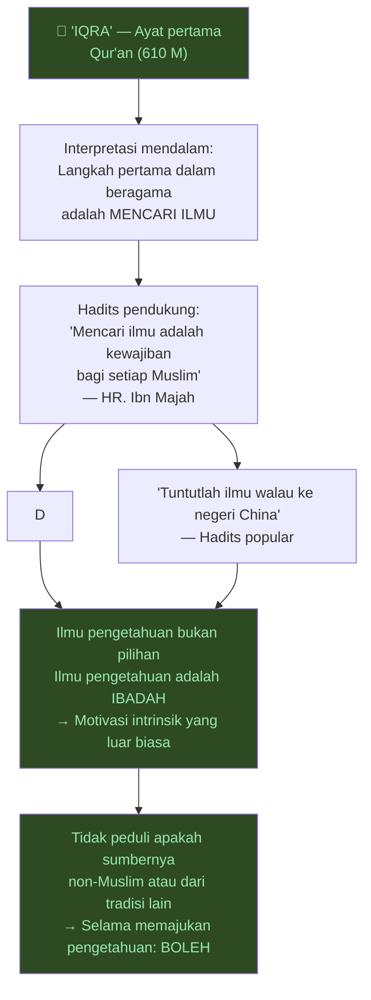

### Infrastruktur yang Mendukung 🏛️

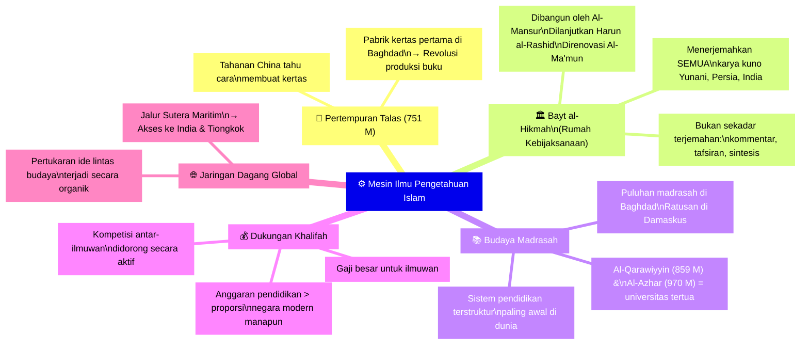

---

## Peta Semua Ilmuwan: Timeline dan Bidang 🗓️

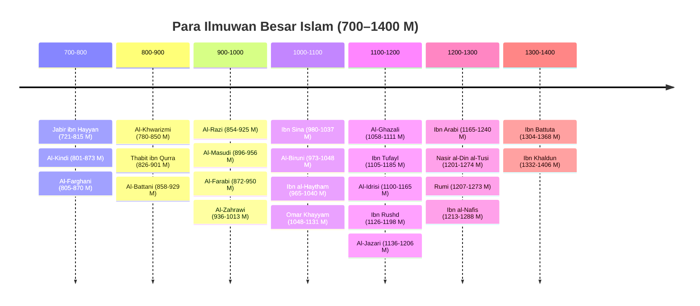

---

## BAGIAN I: MATEMATIKA & ALJABAR ➕

### 1. 📐 Al-Khwarizmi — Bapak Aljabar dan Algoritma

**Muhammad ibn Musa al-Khwarizmi** (780–850 M) adalah mungkin ilmuwan paling berpengaruh dalam sejarah matematika yang tidak sepopuler namanya seharusnya.

<Callout type="important" title="🔑 Fakta Mengejutkan">
Dua kata yang Anda gunakan setiap hari berasal langsung dari nama dan karya satu orang ini:

- **ALGEBRA** (*Aljabar*) → dari judul bukunya: *Al-Kitab al-Mukhtasar fi Hisab al-Jabr wal-Muqabala*
- **ALGORITHM** (*Algoritma*) → dari nama Latinnya: *Algoritmi* (latinisasi "Al-Khwarizmi")

Setiap kali komputer menjalankan suatu proses, warisan Al-Khwarizmi ada di sana.
</Callout>

**Latar Belakang:**
Al-Khwarizmi lahir di Khwarezm (sekarang Uzbekistan) dan bekerja di Bayt al-Hikmah Baghdad di bawah naungan Khalifah Al-Ma'mun. Ia adalah kepala departemen matematika di institusi paling bergengsi di dunia saat itu.

**Kontribusi Utama:**

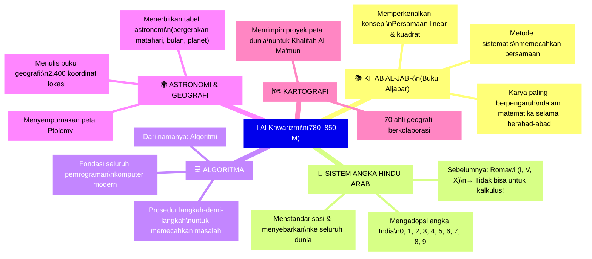

**Warisan kepada Dunia:**
Karya Al-Khwarizmi tentang aljabar (*Al-Kitab al-Mukhtasar*) diterjemahkan ke bahasa Latin pada abad ke-12 dan menjadi buku teks matematika utama di universitas-universitas Eropa selama berabad-abad. **Leonardo Fibonacci** — sebelum menjadi terkenal dengan deret Fibonacci — *pergi ke Baghdad untuk belajar dari ilmuwan-ilmuwan seperti pewaris tradisi Al-Khwarizmi*.

---

### 2. 📏 Omar Khayyam — Matematikawan, Astronom, dan Penyair

**Ghiyath al-Din Abu'l-Fath Umar ibn Ibrahim al-Khayyam** (1048–1131 M) adalah contoh sempurna dari cendekiawan Muslim yang tidak bisa dikategorikan dalam satu bidang saja.

Di dunia Barat, ia dikenal sebagai penyair *Rubaiyat* — kumpulan *rubaʾi* (kuatrain puisi). Tapi bagi para ilmuwan, ia adalah matematikawan kelas dunia.

**Kontribusi Matematika:**

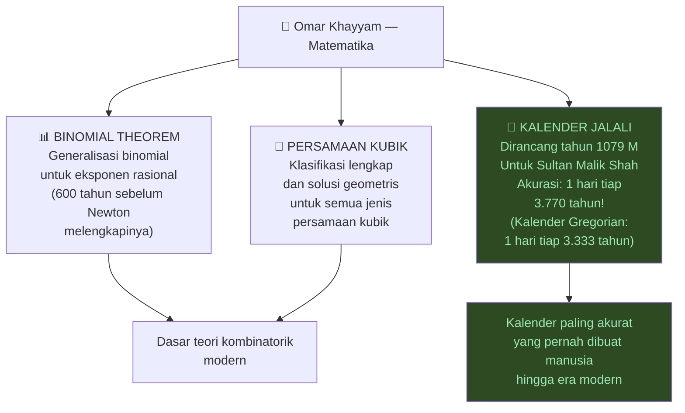

<Callout type="tip" title="🌹 Khayyam sang Penyair">
*Rubaiyat of Omar Khayyam* — diterjemahkan ke bahasa Inggris oleh Edward FitzGerald pada 1859 — menjadi salah satu puisi yang paling banyak dibaca di dunia berbahasa Inggris.

Salah satu *rubaʾi* paling terkenal:

> *"The Moving Finger writes; and, having writ,*
> *Moves on: nor all thy Piety nor Wit*
> *Shall lure it back to cancel half a Line,*
> *Nor all thy Tears wash out a Word of it."*

*(Jari yang bergerak menulis; dan setelah menulis, ia terus melangkah: tidak ada kesalehan maupun kecerdasan yang bisa memanggilnya kembali untuk menghapus setengah baris, tidak ada air mata yang bisa menghapus sebuah kata dari sana.)*
</Callout>

---

### 3. 🔢 Thabit ibn Qurra — Penerjemah dan Ahli Teori Bilangan

**Al-Sabi Thabit ibn Qurra al-Harrani** (826–901 M) adalah matematikawan dan filsuf dari Harran (sekarang Turki selatan) yang memberikan kontribusi luar biasa dalam banyak bidang.

**Kontribusi:**
- **Bilangan Sempurna (*Perfect Numbers*):** Mengembangkan teori bilangan-bilangan yang jika dijumlahkan faktor-faktornya menghasilkan bilangan itu sendiri
- **Rumus Amicable Numbers (*Bilangan Bersahabat*):** Pasangan bilangan yang jumlah faktor masing-masing sama dengan bilangan pasangannya (mis: 220 dan 284)
- **Mekanika:** Menulis *Kitab fi'l-Qarastun* — pertama kali membahas hukum lever (*pengungkit*) secara matematis
- **Astronomi:** Memperkenalkan konsep "tahun matahari rata-rata" yang lebih akurat
- **Terjemahan:** Menerjemahkan dan mengomentari karya-karya Euklid, Archimedes, Apollonius, dan Ptolemy

---

## BAGIAN II: KEDOKTERAN & BIOLOGI 🏥

### 4. 🧪 Al-Razi (Rhazes) — Bapak Kedokteran Klinis Modern

**Abu Bakr Muhammad ibn Zakariyya al-Razi** (854–925 M) adalah salah satu dokter paling brilian yang pernah hidup, sering disebut "dokter terbesar abad pertengahan" oleh sejarawan Barat.

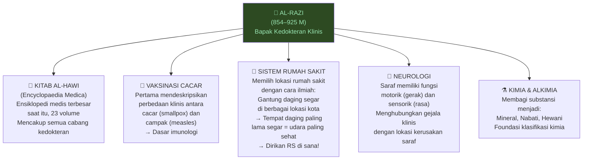

**Inovasi Medis Terpilih:**
- Pertama menggunakan **alkohol** (*alcohol*) sebagai antiseptik
- Pertama mendeskripsikan **reaction psychosomatic** — hubungan pikiran dan tubuh dalam penyakit
- Menulis buku pertama tentang **pediatri** (*ilmu kesehatan anak*)
- Percaya penyakit bisa dicegah dengan gaya hidup sehat — pandangan revolusioner untuk zamannya

---

### 5. 🔬 Ibn Sina / Avicenna — Pangeran Ilmu Kedokteran

**Abu Ali al-Husayn ibn Abd Allah ibn Sina** (980–1037 M) — dikenal di Eropa sebagai **Avicenna** — adalah ilmuwan yang paling komprehensif dalam sejarah Islam. Ia sering disebut *Syaikh al-Ra'is* (Pemimpin Tertinggi Ilmu Pengetahuan).

<Callout type="important" title="📊 Statistik Luar Biasa Ibn Sina">
- **Menulis 450 karya** dalam hidupnya
- **Karya yang bertahan:** 240 buku
- **Al-Qanun fi al-Tibb** (Kanon Kedokteran): digunakan sebagai buku teks di universitas Eropa selama **600+ tahun**
- Pertama mendeskripsikan **karantina 40 hari** untuk wabah
- Pertama mengemukakan teori **kuman penyakit** (mikroba) — 800 tahun sebelum Louis Pasteur!
</Callout>

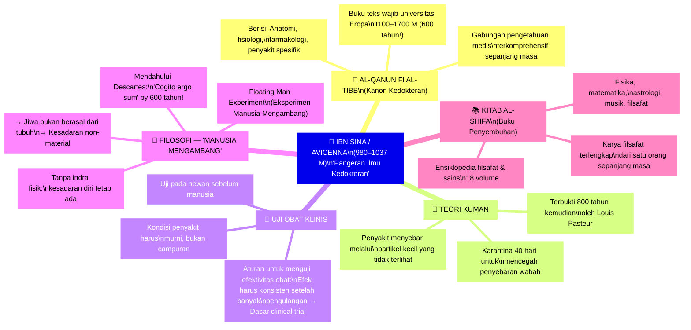

**Eksperimen Manusia Mengambang (*Floating Man Experiment*):**

Ini adalah salah satu eksperimen pikiran (*thought experiment*) paling revolusioner dalam sejarah filsafat:

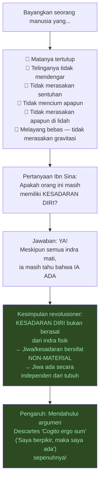

---

### 6. ✂️ Al-Zahrawi (Albucasis) — Bapak Bedah Modern

**Abu al-Qasim Khalaf ibn al-Abbas al-Zahrawi** (936–1013 M) — dikenal di Barat sebagai **Albucasis** — adalah dokter bedah terbesar abad pertengahan.

**Kitab Al-Tasrif (*The Method of Medicine*):**
Karya 30 volume yang menjadi standar pengajaran bedah di Eropa selama **500 tahun**. Volume terakhirnya tentang bedah — dengan 200+ gambar instrumen bedah — adalah mungkin buku bedah paling berpengaruh yang pernah ditulis.

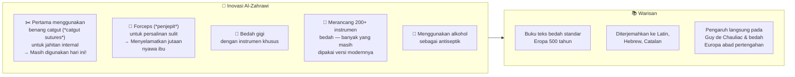

---

### 7. ❤️ Ibn al-Nafis — Penemu Sirkulasi Paru-Paru

**Ala'-ud-Din Abu al-Hassan Ali ibn Abi al-Hazm al-Qurashi** (1213–1288 M) — lebih dikenal sebagai **Ibn al-Nafis** — membuat salah satu penemuan medis terpenting abad pertengahan.

**Penemuan Sirkulasi Paru-Paru (*Pulmonary Circulation*):**

Selama 1.400 tahun, orang percaya teori Galen bahwa darah mengalir langsung dari ventrikel kanan ke ventrikel kiri melalui "pori-pori" di jantung.

Ibn al-Nafis pada 1242 M — hampir 300 tahun sebelum William Harvey (1628 M) — **membuktikan bahwa ini salah**:

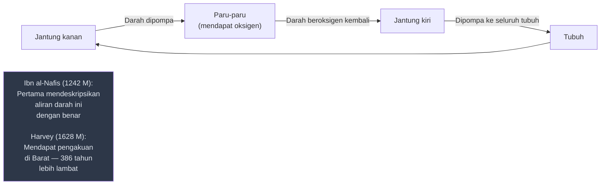

Penemuannya hampir terlupakan hingga ditemukan kembali oleh seorang dokter Mesir pada 1924 M di Perpustakaan Nasional Berlin.

---

## BAGIAN III: FISIKA, OPTIK & ASTRONOMI 🔭

### 8. 💡 Ibn al-Haytham (Alhazen) — Bapak Optik dan Metode Ilmiah

**Abu Ali al-Hasan ibn al-Hasan ibn al-Haytham** (965–1040 M) — dikenal di Barat sebagai **Alhazen** — mungkin adalah ilmuwan paling signifikan dari seluruh Zaman Keemasan Islam dalam hal dampak jangka panjang.

<Callout type="important" title="🏆 Status Ibn al-Haytham">
UNESCO mendeklarasikan 2015 sebagai **Tahun Cahaya Internasional** (*International Year of Light*) — dan secara khusus memperingatinya sebagai peringatan 1.000 tahun karya optik Ibn al-Haytham.

Majalah ilmiah *Nature* menyebutnya sebagai "**ilmuwan pertama**" (*the first true scientist*) karena ia adalah orang pertama yang melakukan semua elemen metode ilmiah modern.
</Callout>

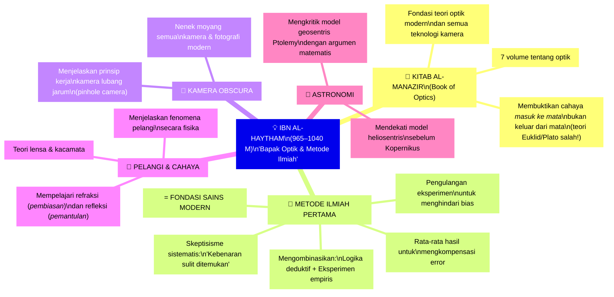

**Metode Ilmiah Ibn al-Haytham vs Sains Modern:**

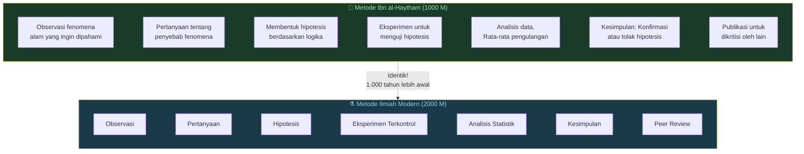

---

### 9. 🌙 Al-Battani (Albategnius) — Sang Astronom Bintang

**Abu Abd Allah Muhammad ibn Jabir ibn Sinan al-Raqqi al-Harrani al-Sabi al-Battani** (858–929 M) — dikenal di Barat sebagai **Albategnius** — adalah astronom terbesar Islam setelah Al-Farghani.

**Kontribusi Astronomi:**
- Menghitung kemiringan ekliptika (*ecliptic obliquity*) Bumi dengan akurasi yang jauh melampaui Ptolemy
- Pertama menghitung **panjang tahun matahari** dengan presisi tinggi: 365 hari, 5 jam, 46 menit, 24 detik (hanya 2 menit 22 detik dari nilai modern)
- Mengembangkan **trigonometri bola** (*spherical trigonometry*)
- Memperkenalkan notasi **sinus** dalam trigonometri
- **Copernicus, Tycho Brahe, dan Kepler** — semua mengutip Al-Battani dalam karya-karya mereka

---

### 10. ⭐ Al-Farghani — Sang Kosmolog

**Abu al-Abbas Ahmad ibn Muhammad ibn Kathir al-Farghani** (805–870 M) adalah astronom dari Ferghana (Uzbekistan modern) yang pengaruhnya terasa jauh hingga ke Renaissance Eropa.

**Kontribusi:**
- Menulis ***Kitab fi Jawami Ilm al-Nujum*** (*Elements of Astronomy*) — salah satu buku astronomi paling berpengaruh abad pertengahan
- Memperbarui tabel astronomi Ptolemy (*Almagest*) dengan pengamatan langsung
- Menghitung diameter Bumi dan jarak ke planet-planet
- Karyanya diterjemahkan ke Latin oleh John of Seville (1135 M) dan Gerard of Cremona — menjadi buku pegangan astronomi Eropa selama berabad-abad

<Callout type="info" title="🌍 Al-Farghani dan Columbus">
Ketika Christopher Columbus merencanakan perjalanan ke Amerika pada 1492 M, ia mendasarkan kalkulasi jarak perjalanannya pada karya Al-Farghani!

Ironisnya, Columbus *salah membaca* satuan yang digunakan Al-Farghani (mil Arab vs mil Romawi), yang membuat ia under-estimate jarak yang harus ditempuh. Jika benar, Columbus tidak akan pernah berangkat karena jaraknya terlalu jauh.

Kebetulan Amerika ada di antara Eropa dan Asia — sehingga kesalahan baca Al-Farghani secara tidak langsung mengakibatkan "penemuan" Amerika!
</Callout>

---

### 11. 🌌 Nasir al-Din al-Tusi — Revolusi Astronomi Pra-Kopernikus

**Muhammad ibn Muhammad ibn al-Hasan al-Tusi** (1201–1274 M) adalah ilmuwan Muslim paling penting dalam matematika dan astronomi abad ke-13.

**Pasangan Tusi (*Tusi Couple*):**
Al-Tusi menemukan sebuah konstruksi geometrik yang disebut "**Tusi Couple**" (*pasangan Tusi*) — sebuah inovasi matematika yang memungkinkan gerakan lurus dihasilkan dari kombinasi dua gerak melingkar.

Penemuan ini digunakan oleh... **Nicolaus Copernicus** dalam bukunya *De Revolutionibus* (1543 M)! Para sejarawan sains telah menemukan bahwa diagram Copernicus dan Al-Tusi hampir identik — bukti kuat bahwa Copernicus membaca karya Al-Tusi.

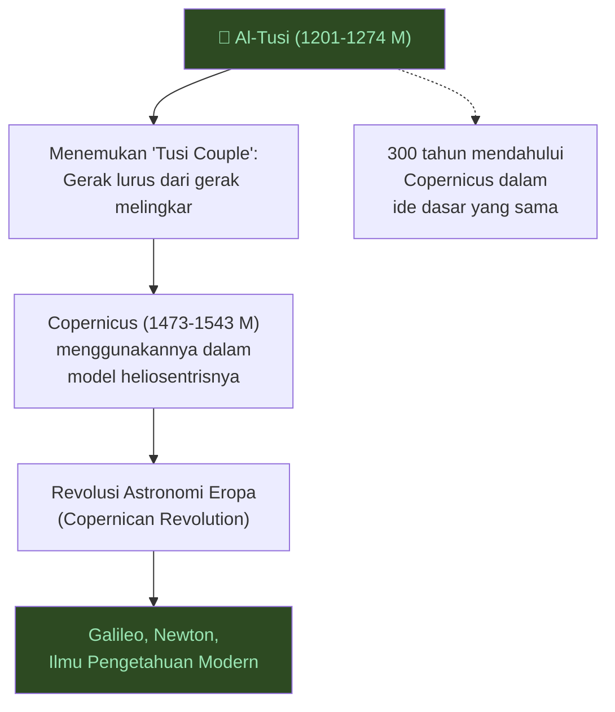

---

## BAGIAN IV: KIMIA & ALKIMIA ⚗️

### 12. ⚗️ Jabir ibn Hayyan (Geber) — Bapak Kimia Modern

**Abu Musa Jabir ibn Hayyan al-Tusi al-Sufi** (721–815 M) — dikenal di Barat sebagai **Geber** — adalah "bapak kimia modern" (*father of modern chemistry*) oleh banyak sejarawan sains.

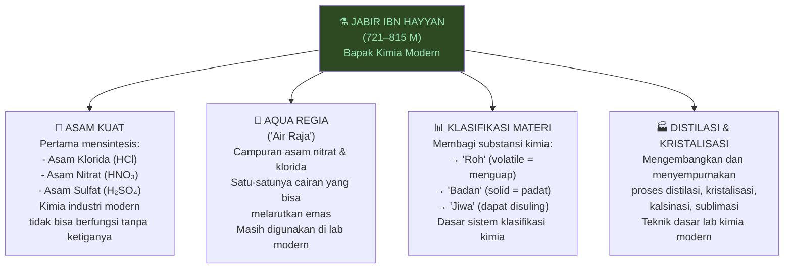

**Warisan Jabir:**
Banyak istilah kimia berasal dari kata Arab Jabir:
- **Elixir** dari *al-iksir* (الإكسير)
- **Alchemy** dari *al-kimiya* (الكيمياء) — yang kemudian menjadi *chemistry* (kimia)
- **Alkali** dari *al-qali* (القَلْي)

---

## BAGIAN V: FILSAFAT & TEOLOGI 🧠

### 13. 🎵 Al-Kindi — Filsuf Islam Pertama

**Abu Yusuf Ya'qub ibn Ishaq al-Kindi** (801–873 M) adalah orang Arab pertama yang mendapat gelar *failasuf* (فيلسوف — filsuf) dan sering disebut "Filsuf Orang-orang Arab" (*Philosopher of the Arabs*).

**Kontribusi:**

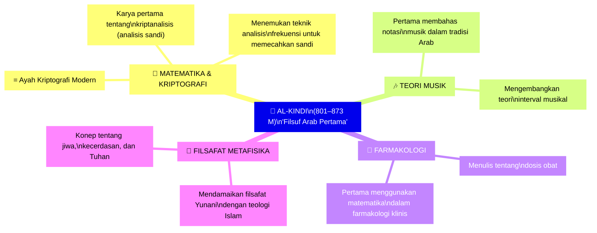

---

### 14. 🎼 Al-Farabi — Guru Kedua

**Abu Nasr Muhammad ibn Muhammad al-Farabi** (872–950 M) mendapat gelar luar biasa: ***Al-Muallim al-Thani*** — "Guru Kedua" (*Second Teacher*) — pertama adalah Aristoteles sendiri.

**Kontribusi:**
- **Filsafat Politik:** *Al-Madinah al-Fadilah* (*The Ideal City*) — teori kota ideal yang menggabungkan filsafat Plato dengan teologi Islam
- **Logika:** Komentar paling komprehensif atas seluruh *Organon* Aristoteles
- **Teori Musik:** *Kitab al-Musiqa al-Kabir* (*The Great Book of Music*) — ensiklopedia musik terbesar abad pertengahan
- **Psikologi:** Pertama membedakan antara akal (*intellect*) aktif dan pasif dalam tradisi Islam
- **Klasifikasi Ilmu:** Mengklasifikasikan semua ilmu pengetahuan secara sistematis — menjadi model untuk ensiklopedia abad pertengahan

---

### 15. 🌹 Al-Ghazali — Pembaharu Tasawuf dan Kritikus Filsafat

**Abu Hamid Muhammad ibn Muhammad al-Ghazali** (1058–1111 M) — dikenal di Barat sebagai **Algazel** — adalah salah satu pemikir paling berpengaruh dalam sejarah Islam, mungkin hanya kalah dari Nabi Muhammad sendiri.

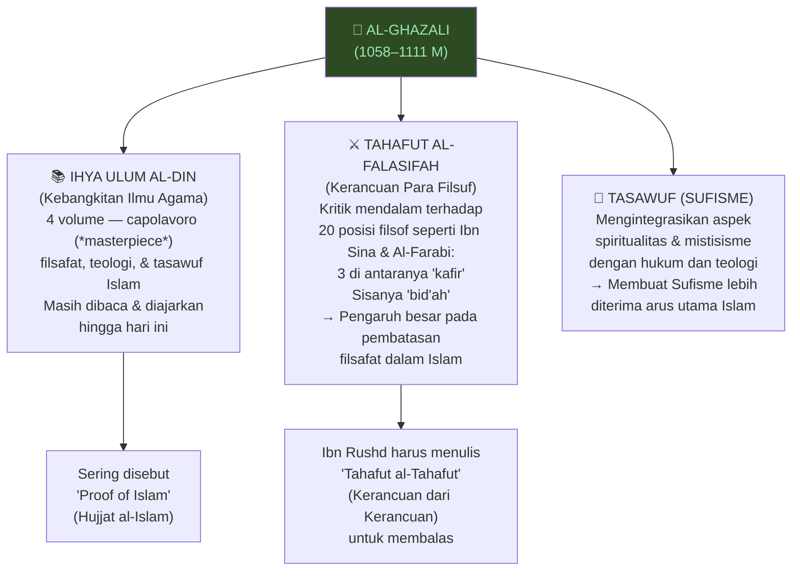

<Callout type="warning" title="⚖️ Kontroversi Al-Ghazali">
Al-Ghazali adalah tokoh yang diperdebatkan dalam sejarah intelektual Islam:

**Yang memuji:** Ia menyelamatkan Islam dari determinisme filosofis ekstrem, memperkenalkan dimensi spiritual yang mendalam, menyatukan syariah dengan tasawuf.

**Yang mengkritik:** Buku *Tahafut al-Falasifah*-nya dituduh sebagai salah satu sebab kemunduran tradisi filsafat rasional dalam Islam — membuat para cendekiawan berikutnya ragu untuk mengembangkan filsafat bebas.

Kebenaran historisnya: Al-Ghazali sendiri adalah filsuf yang sangat rasional — kritiknya terhadap filsafat justru ditulis *menggunakan* argumen filosofis yang sangat ketat.
</Callout>

---

### 16. ⚖️ Ibn Rushd (Averroes) — Pembela Aristoteles

**Abu al-Walid Muhammad ibn Ahmad ibn Muhammad ibn Rushd** (1126–1198 M) — dikenal di Eropa sebagai **Averroes** — adalah filsuf Islam paling berpengaruh bagi filsafat Eropa.

**Perannya:**
Ibn Rushd menulis komentar-komentar (*commentary*) paling komprehensif atas seluruh karya Aristoteles — sehingga di Eropa abad pertengahan, ia dikenal hanya sebagai *"The Commentator"* (*Sang Pengomentar*), dan Aristoteles disebut *"The Philosopher"* (*Sang Filsuf*).

Dante menempatkan Ibn Rushd di ***Limbo*** dalam *Divine Comedy* — bersama Aristoteles, Sokrates, dan Plato — sebagai jiwa-jiwa mulia yang tidak bisa masuk surga bukan karena berdosa, tapi karena hidup sebelum Kristianitas.

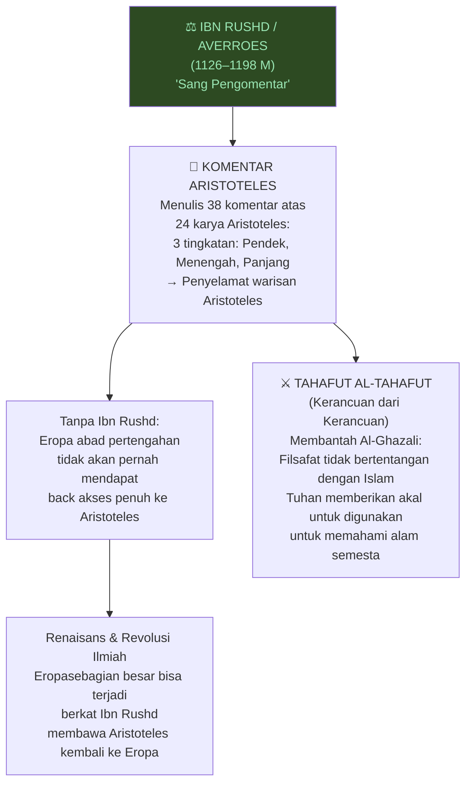

---

### 17. 🌀 Ibn Arabi — Sang Syaikh Terbesar Mistisisme Islam

**Muhyi al-Din Muhammad ibn Ali ibn Muhammad ibn Ahmad ibn Abd Allah al-Hatimi al-Tai al-Andalusi** (1165–1240 M) — lebih dikenal sebagai **Ibnu Arabi** atau **Syaikh al-Akbar** (*Guru Terbesar*) — adalah filsuf mistis paling berpengaruh dalam sejarah Islam.

**Karya utamanya:**
- ***Al-Futuhat al-Makkiyya*** (*Pembukaan-pembukaan Makkah*): Ensiklopedia mistisisme 37 volume
- ***Fusus al-Hikam*** (*Bezel Kebijaksanaan*): Sintesis kosmologi mistis

**Konsep Utama:**
- ***Wahdat al-Wujud*** (*Kesatuan Wujud*) — Pandangan bahwa semua realitas pada dasarnya adalah satu, dan Tuhan adalah satu-satunya wujud sejati
- ***Al-Insan al-Kamil*** (*Manusia Sempurna*) — Konsep bahwa manusia bisa mencapai kesempurnaan spiritual

---

## BAGIAN VI: GEOGRAFI, SEJARAH & ILMU SOSIAL 🌍

### 18. 📊 Ibn Khaldun — Bapak Sosiologi Modern

**Abd al-Rahman ibn Muhammad ibn Khaldun al-Hadrami** (1332–1406 M) adalah orang yang jauh mendahului zamannya — dan mungkin satu-satunya ilmuwan sosial Muslim yang diakui oleh komunitas saintifik Barat tanpa reservasi apapun.

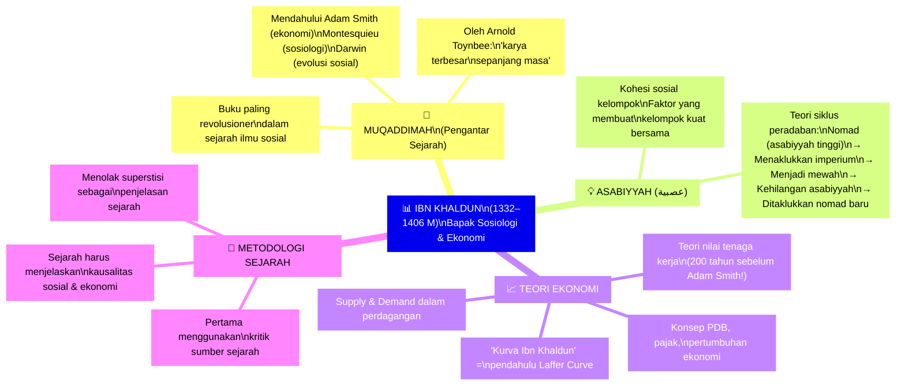

**Teori Siklus Peradaban Ibn Khaldun:**

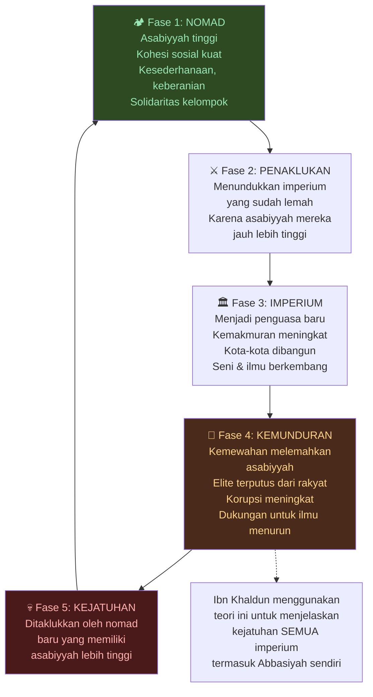

---

### 19. 🗺️ Al-Biruni — Polymath Terbesar Islam

**Abu Rayhan Muhammad ibn Ahmad al-Biruni** (973–1048 M) adalah mungkin cendekiawan paling serba bisa dalam sejarah peradaban manusia — sering disebut **"Muslim Leonardo da Vinci"** meskipun ia hidup 400 tahun lebih awal dari Leonardo.

**Bidang yang Dikuasai:**
Matematika, astronomi, fisika, ilmu alam, geografi, sejarah, kartografi, linguistik, farmakologi, ensiklopedia budaya India.

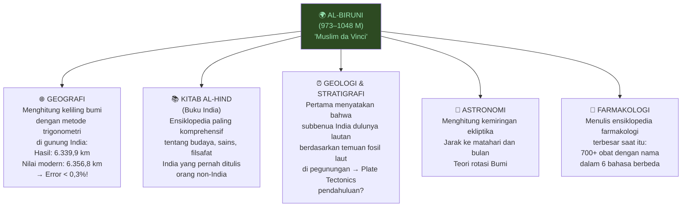

---

### 20. 🗺️ Al-Idrisi — Pembuat Peta Dunia Terbaik Abad Pertengahan

**Abu Abd Allah Muhammad ibn Muhammad ibn Abd Allah ibn Idris al-Qurtubi al-Hasani al-Idrisi** (1100–1165 M) adalah geografer Muslim terbesar dan pembuat peta dunia paling akurat di abad pertengahan.

**Karya Utama:**
***Al-Nuzhat al-Mushtaq fi Ikhtiraq al-Afaq*** (*Rekreasi Orang yang Rindu Melintasi Cakrawala*) — juga dikenal sebagai *Tabula Rogeriana* (atas permintaan Raja Roger II dari Sisilia).

<Callout type="tip" title="🗺️ Peta Al-Idrisi">
Peta dunia Al-Idrisi (1154 M) adalah peta paling akurat yang dibuat manusia sebelum era modern.

Uniknya: **Peta ini terbalik!** Utara ada di bawah, Selatan ada di atas — sesuai dengan konvensi geografis Muslim saat itu di mana Mekah (di selatan Mediterania dari perspektif Eropa) menjadi orientasi.

Peta ini bertahan selama lebih dari 3 abad sebagai peta dunia standar.
</Callout>

---

### 21. ✈️ Ibn Battuta — Penjelajah Terbesar Sebelum Era Modern

**Abu Abd Allah Muhammad ibn Abd Allah al-Lawati al-Tanji ibn Battuta** (1304–1368/1369 M) adalah penjelajah Muslim terbesar dan mungkin penjelajah terbesar dalam sejarah sebelum era kapal uap.

```mermaid
graph LR
    A["🌍 TOTAL PERJALANAN\nIbn Battuta\n≈ 117.000 km\n(75.000 mil)"] --> B

    B["Pembanding:\nMarco Polo: 24.000 km\nChristopher Columbus: ~9.000 km\n→ Ibn Battuta = 4,8× Marco Polo!"]

    subgraph RUTE["🗺️ Rute Perjalanan (1325–1354 M)"]
        R1["Afrika Utara & Timur\nTurki, Krimea, Asia Tengah"]
        R2["India, Maladewa, Sri Lanka\nBengal, Sumatra, Tiongkok"]
        R3["Mali & Sudan (Afrika Barat)\nAndalusia (Spanyol Muslim)"]
    end

    A --> RUTE
```

**Karyanya:** ***Al-Rihla*** (*Perjalanan*) — catatan perjalanan yang mencakup hampir seluruh dunia Islam dan sekitarnya, menjadi sumber sejarah primer yang tak ternilai untuk memahami dunia abad ke-14.

---

## BAGIAN VII: TEKNIK & MEKANIKA ⚙️

### 22. ⚙️ Al-Jazari — Bapak Teknik Mekanika Modern

**Badi' al-Zaman Abu al-Izz Ismail ibn al-Razzaz al-Jazari** (1136–1206 M) adalah insinyur mekanika terbesar abad pertengahan — sering disebut "**Bapak Teknik Modern**" (*Father of Modern Engineering*).

```mermaid
graph TD
    A["⚙️ AL-JAZARI\n(1136–1206 M)\nBapak Teknik Mekanika"] --> B

    B["📖 KITAB AL-HIYAL\n(Buku Pengetahuan tentang\nPerangkat Mekanik Cerdas)\n= Ensiklopedia teknik abad pertengahan\nTerlengkap yang pernah ditulis"] --> C

    C["Berisi 100 perangkat mekanik\ndengan instruksi pembuatan detail"] --> D & E & F & G

    D["🕰️ JAM AIR (Clepsydra)\nJam air yang sangat presisi\ndengan tampilan otomatis\n→ Cikal bakal jam modern"]

    E["🚿 POMPA AIR\nPompa sentrifugal (*centrifugal pump*)\nPompa dengan piston ganda\n→ Teknologi dasar distribusi air"]

    F["🤖 ROBOT HUMANOID\nOtomata (*automata*) — robot awal:\nBand musik otomatis\nPelayan air otomatis\n→ Cikal bakal robotika!"]

    G["🔩 INOVASI TEKNIK\nCrankshaft (poros engkol)\nConnecting rod (batang penghubung)\nSilinder ganda\n→ Komponen dasar semua mesin!"]

    style A fill:#2d4a22,color:#9ae6b4
```

<Callout type="info" title="🤖 Al-Jazari dan Robotika">
Al-Jazari merancang salah satu **robot humanoid pertama** dalam sejarah — sebuah automata (*robot mekanik*) berupa empat musisi yang memainkan alat musik secara otomatis di atas rakit di kolam istana.

Sistem mekanisnya menggunakan drum yang bisa diprogram — menjadikannya mungkin **perangkat yang bisa diprogram pertama** dalam sejarah!
</Callout>

---

## BAGIAN VIII: PUISI, SASTRA & SPIRITUALITAS 🌹

### 23. 🌹 Rumi — Penyair Terbesar Dunia Islam

**Jalal al-Din Muhammad Rumi** (1207–1273 M) adalah penyair Sufi terbesar Islam dan mungkin penyair paling diterjemahkan ke bahasa Inggris sepanjang abad ke-20.

```mermaid
mindmap
  root["🌹 RUMI\n(1207–1273 M)\n'Penyair Cinta Ilahi'"]
    ["📖 MASNAVI-YE MA'NAVI\n(Ayat-Ayat Spiritual)"]
      ["6 volume, 25.000+ bait\nDalam bahasa Persia"]
      ["Disebut 'Al-Quran berbahasa Persia'\noleh para pengagumnya"]
      ["Alegori mendalam tentang\ncinta, jiwa, dan Tuhan"]
    ["🌀 FILSAFAT SUFISME"]
      ["Cinta (*ishq*) sebagai jalan\nmenuju Tuhan"]
      ["Semua manusia adalah\npendatang yang rindu\nkembali ke asal"]
      ["Tarian Sema (*Whirling Dervish*)\nsebagai meditasi spiritual"]
    ["🌍 WARISAN UNIVERSAL"]
      ["Diterjemahkan ke 22 bahasa lebih"]
      ["Bestseller puisi di Amerika\nselama tahun 1990-an!"]
      ["Dipuja lintas agama:\nMuslim, Kristen, Hindu, Yahudi"]
    ["✨ KUTIPAN TERKENAL"]
      ["'Keluar dari lingkaran waktu\ndan masuki lingkaran cinta'"]
      ["'Kamu tidak setetes tapi lautan'"]
      ["'Jangan cari cinta, cari halangan\nyang ada di dalam dirimu'"]
```

**Bait paling terkenal Rumi** — dari pembukaan *Masnavi*:

> *"بشنو این نی چون شکایت می‌کند*
> *از جدایی‌ها حکایت می‌کند"*
>
> *"Dengarkan seruling ini, bagaimana ia berkeluh kesah,*
> *Ia menceritakan kisah-kisah perpisahan..."*
>
> *(Metafora: Manusia seperti seruling yang dipisahkan dari rumpun asalnya — rindu kembali kepada Tuhan)*

---

## BAGIAN IX: FILSAFAT NOVEL & EPISTEMOLOGI 📚

### 24. 📚 Ibn Tufayl — Penulis Novel Filsafat Pertama

**Abu Bakr Muhammad ibn Abd al-Malik ibn Muhammad ibn Tufayl al-Qaysi al-Andalusi** (1105–1185 M) menulis sesuatu yang benar-benar unik: **novel filsafat** pertama dalam sejarah dunia.

***Hayy ibn Yaqdhan*** (*Hidup, Anak Terjaga*):

Ini adalah kisah seorang anak yang tumbuh sendirian di pulau terpencil tanpa guru, tanpa orang tua, hanya bersama alam. Melalui observasi dan pemikiran rasional murni, ia secara independen menemukan:
- Prinsip-prinsip ilmiah dasar
- Filsafat moral
- Keberadaan Tuhan
- Esensi spiritualitas

**Pengaruh Novel Ini pada Sejarah Intelektual Barat:**

```mermaid
graph TD
    A["📚 Ibn Tufayl\nHayy ibn Yaqdhan (1160 M)"] --> B
    B["Diterjemahkan ke Latin (1671 M)\ndan Inggris (1708 M)"] --> C & D

    C["John Locke\n→ Teori tabula rasa\n(pikiran manusia seperti papan kosong)\n→ Empirisisme Inggris"]

    D["Daniel Defoe\n→ Robinson Crusoe (1719 M)\n= Versi sekular dari Hayy ibn Yaqdhan!"]

    C --> E["Pencerahan Eropa\n(Enlightenment)"]
    D --> E

    style A fill:#2d4a22,color:#9ae6b4
    style E fill:#1a3a4a,color:#90cdf4
```

---

### 25. 🧬 Ibn Tufayl & Ibn al-Nafis: Evolusi dan Biologi

**Abu Bakr Muhammad ibn Yahya ibn al-Sayigh al-Tujib** yang dikenal sebagai **Ibn Bajja** (1085–1138 M) dan **Ibn al-Nafis** keduanya menyentuh ide-ide yang jauh mendahului zamannya tentang biologi.

Ibn al-Nafis dalam karyanya ***Theologus Autodidactus*** mendeskripsikan bagaimana manusia bisa muncul dari alam tanpa bantuan supernatural — suatu pemikiran yang sangat berani untuk zamannya.

<Callout type="info" title="🧬 Evolusi Sebelum Darwin?">
Beberapa sejarawan sains berpendapat bahwa pemikir Muslim seperti Al-Biruni, Al-Jahiz (789-869 M), dan Ibn Khaldun membuat observasi tentang perubahan spesies dan kompetisi antar-organisme yang *mendahului* teori evolusi Darwin.

Al-Jahiz dalam karyanya *Kitab al-Hayawan* (*Buku Hewan*) menulis:

*"Hewan yang berjuang untuk bertahan hidup, yang lebih kuat memakan yang lebih lemah... Setiap kelompok organisme berjuang untuk mendapatkan sumber makanan dan menghindari dimangsa."*

Ini terdengar sangat mirip dengan konsep **seleksi alam** (*natural selection*) Darwin — hampir 1.000 tahun lebih awal!
</Callout>

---

## BAGIAN X: NAVIGASI & EKSPLORASI 🧭

### 26. 🧭 Ibn Majid — Sang Singa Lautan

**Shihab al-Din Ahmad ibn Majid al-Najdi** (1421–1500 M) — dikenal sebagai ***Asad al-Bahr*** (*Singa Lautan*) — adalah navigator Arab terbesar dan "Bapak Navigasi Arab" (*Father of Arab Navigation*).

**Kontribusi:**
- Menulis 40 karya tentang navigasi dan penggunaan kompas, bintang, dan arus laut
- Karyanya ***Kitab al-Fawa'id fi Usul Ilm al-Bahr wa al-Qawa'id*** (*Buku Manfaat tentang Prinsip Navigasi Laut*) adalah ensiklopedia navigasi terlengkap abad pertengahan

**Koneksi Bersejarah yang Mengejutkan:**
Menurut beberapa sumber historis, **Vasco da Gama** — pelaut Portugis yang "menemukan" rute ke India pada 1497–1498 M — dipandu melalui Samudra Hindia oleh Ibn Majid atau seorang navigator Arab yang terinspirasi olehnya!

Jika ini benar, maka "penemuan" Eropa atas rute ke India sebagian besar dimungkinkan oleh pengetahuan navigasi Muslim yang sudah berabad-abad berkembang.

---

## Perbandingan: Semua Ilmuwan dalam Satu Pandangan 📊

```mermaid
graph TD
    subgraph MATEMATIKA["➕ MATEMATIKA"]
        M1["Al-Khwarizmi\n→ Aljabar, Algoritma"]
        M2["Omar Khayyam\n→ Persamaan kubik, Kalender"]
        M3["Thabit ibn Qurra\n→ Teori bilangan"]
        M4["Al-Battani\n→ Trigonometri"]
        M5["Nasir al-Din al-Tusi\n→ Geometri, Tusi Couple"]
    end

    subgraph KEDOKTERAN["🏥 KEDOKTERAN"]
        K1["Ibn Sina\n→ Kanon Kedokteran, Karantina"]
        K2["Al-Razi\n→ Cacar, Neurologi"]
        K3["Al-Zahrawi\n→ Bedah modern"]
        K4["Ibn al-Nafis\n→ Sirkulasi paru-paru"]
    end

    subgraph FISIKA["🔭 FISIKA & ASTRONOMI"]
        F1["Ibn al-Haytham\n→ Optik, Metode ilmiah"]
        F2["Al-Battani\n→ Astronomi kuantitatif"]
        F3["Al-Farghani\n→ Kosmologi"]
        F4["Al-Tusi\n→ Model planet"]
    end

    subgraph KIMIA["⚗️ KIMIA"]
        C1["Jabir ibn Hayyan\n→ Kimia modern, Asam kuat"]
    end

    subgraph FILSAFAT["🧠 FILSAFAT"]
        P1["Al-Kindi\n→ Filsuf Arab pertama"]
        P2["Al-Farabi\n→ Filsafat politik, Musik"]
        P3["Ibn Sina\n→ Metafisika, Jiwa"]
        P4["Al-Ghazali\n→ Kritik filsafat, Tasawuf"]
        P5["Ibn Rushd\n→ Komentar Aristoteles"]
        P6["Ibn Arabi\n→ Mistisisme filosofis"]
    end

    subgraph SOSIAL["🌍 ILMU SOSIAL"]
        S1["Ibn Khaldun\n→ Sosiologi, Ekonomi"]
        S2["Al-Biruni\n→ Anthropologi, Geografi"]
        S3["Al-Idrisi\n→ Kartografi"]
        S4["Ibn Battuta\n→ Etnografi, Geografi"]
    end

    subgraph TEKNIK["⚙️ TEKNIK & SASTRA"]
        T1["Al-Jazari\n→ Mekanika, Robotika"]
        T2["Ibn Tufayl\n→ Novel filsafat"]
        T3["Rumi\n→ Puisi Sufi"]
        T4["Ibn Majid\n→ Navigasi"]
    end

    style MATEMATIKA fill:#1a3a2a,color:#9ae6b4
    style KEDOKTERAN fill:#1a2a3a,color:#90cdf4
    style FISIKA fill:#2d2a1a,color:#fbd38d
    style KIMIA fill:#3a1a2a,color:#fbb6ce
    style FILSAFAT fill:#1a1a3a,color:#b794f4
    style SOSIAL fill:#2d3a1a,color:#9ae6b4
    style TEKNIK fill:#3a2a1a,color:#fbd38d
```

---

## Mengapa Zaman Keemasan Berakhir? — Analisis Mendalam 📉

Berdasarkan gabungan dari berbagai perspektif sejarawan:

```mermaid
graph TD
    A["📉 AKHIR ZAMAN KEEMASAN\n(setelah 1258 M)"] --> B & C & D & E & F

    B["⚔️ FAKTOR 1: INVASI MONGOL\nBaghdad dihancurkan 1258 M\nRatusan ribu orang tewas\nPerpustakaan dibakar\nInfrastruktur irigasi hancur\n→ Runtuhnya pusat ilmu pengetahuan"]

    C["🔄 FAKTOR 2: PERGESERAN\nRUTE PERDAGANGAN\nPortugis menemukan rute laut\nke India (1497 M)\n→ Kekayaan dari perdagangan\nTimur-Barat beralih ke Eropa\n→ Pembiayaan ilmu pengetahuan menurun"]

    D["📖 FAKTOR 3: DOGMATISASI\nInovasi → menjadi dogma\nPerdebatan bebas dikurangi\nOrtodoksi keagamaan menguat\n→ Kreativitas intelektual menurun"]

    E["💰 FAKTOR 4: EKONOMI\nKemunduran pertanian\n(irigasi hancur akibat Mongol)\nKemiskinan mengurangi\ndukungan untuk sains"]

    F["🏛️ FAKTOR 5: POLITIK\nKetidakstabilan kekuasaan\nPersaingan antar-kekaisaran\n(Ottoman, Safavid, Mughal)\n→ Tidak ada pusat ilmu pengetahuan\nuniversal lagi"]

    B & C & D & E & F --> G
    G["🌍 'GREAT DIVERGENCE'\nEropa mulai melampaui\ndunia Islam dalam sains\ndan teknologi\n(abad ke-16 dan seterusnya)"]

    style G fill:#4a1a1a,color:#feb2b2
```

---

## Warisan: Kata-Kata Arab dalam Bahasa Modern 📝

Mungkin cara paling mudah memahami betapa dalam pengaruh Zaman Keemasan Islam adalah melihat berapa banyak kata dalam bahasa Inggris (dan Indonesia) yang berasal dari bahasa Arab:

```mermaid
mindmap
  root["🔤 Kata-kata Arab\ndalam Bahasa Inggris/Indonesia"]
    ["➕ MATEMATIKA & SAINS"]
      ["ALGEBRA → Al-Jabr (الجبر)\nDari Al-Khwarizmi"]
      ["ALGORITHM → Al-Khwarizmi\nDari nama sang ilmuwan"]
      ["ZERO → Sifr (صفر)\nAngka nol"]
      ["CIPHER → Sifr (صفر)\nKode/enkripsi"]
    ["⚗️ KIMIA"]
      ["ALCHEMY → Al-Kimiya (الكيمياء)\nDari Jabir ibn Hayyan"]
      ["ALCOHOL → Al-Kuhl (الكحل)\n'Bubuk halus' → cairan murni"]
      ["ALKALI → Al-Qali (القَلْي)\nDari bahasa Arab-kimia"]
      ["ELIXIR → Al-Iksir (الإكسير)"]
    ["🌌 ASTRONOMI"]
      ["STAR NAMES: Betelgeuse, Rigel,\nDeneb, Altair, Vega, Aldebaran\n→ Hampir semua nama bintang\nadalah kata Arab!"]
      ["ZENITH → Samt (السمت)"]
      ["AZIMUTH → Al-Sumut (السموت)"]
    ["🌍 GEOGRAFI & LAIN"]
      ["ADMIRAL → Amir al-Bahr (أمير البحر)\n'Komandan Laut'"]
      ["SAFARI → Safar (سفر)\n'Perjalanan'"]
      ["MAGAZINE → Makhazin (مخازن)\n'Tempat penyimpanan'"]
      ["COTTON → Qutn (قطن)"]
      ["SUGAR → Sukkar (سكر)"]
```

---

## Penutup: Mercusuar yang Menyelamatkan Peradaban 🌟

Ada sebuah metafora indah di awal video ini:

> *"Para ilmuwan Islam menjadi mercusuar yang menerangi dan menyelamatkan kapal-kapal kemanusiaan yang hampir menabrak karang dan tebing."*

Para ilmuwan yang kita bahas dalam artikel ini bukan sekadar tokoh sejarah yang menarik untuk dipelajari. Mereka adalah **jembatan** — jembatan antara kebijaksanaan kuno Yunani, Persia, India, dan peradaban modern Eropa dan global.

Tanpa Al-Khwarizmi, tidak ada komputer. Tanpa Ibn al-Haytham, tidak ada kamera. Tanpa Ibn Sina, ilmu kedokteran mungkin mundur berabad-abad. Tanpa Ibn Khaldun, sosiologi dan ekonomi sebagai ilmu mungkin baru lahir di abad ke-19. Tanpa Jabir ibn Hayyan, industri kimia modern tidak memiliki fondasi.

Dan semua ini lahir dari satu ayat: **اقْرَأْ — Iqra'. Bacalah.**

```mermaid
graph TD
    A["🕌 'IQRA' (Bacalah!)\nAyat pertama Al-Quran, 610 M"] --> B
    B["Motivasi spiritual untuk\nmencari ilmu sebagai ibadah"] --> C
    C["700 tahun kreativitas intelektual\n(750–1450 M)\n30+ ilmuwan genius sedunia"] --> D
    D["Transfer ilmu ke Eropa\nlewat terjemahan & perdagangan"] --> E
    E["Renaisans, Reformasi,\nRevolusi Ilmiah Eropa\n(1300–1700 M)"] --> F
    F["🌍 DUNIA MODERN\nKomputer, Kedokteran, Sains,\nMathematika, Teknologi"]

    note["Tanpa Zaman Keemasan Islam,\nEropa tidak akan pernah melihat\nzaman pencerahan.\n\nDan kemungkinan besar,\nzaman modern mungkin tidak\nkita rasakan manfaatnya hari ini."]
    
    D -.-> note

    style A fill:#2d4a22,color:#9ae6b4
    style F fill:#2d4a22,color:#9ae6b4
```

---

## Glosarium Lengkap 📚

<Callout type="abstract" title="🗂️ Semua Istilah Penting">

| Istilah | Asal Bahasa | Makna |
|---|---|---|
| **Iqra'** (اقرأ) | Arab | Bacalah / Pelajarilah |
| **Bayt al-Hikmah** (بيت الحكمة) | Arab | Rumah Kebijaksanaan — pusat akademik Baghdad |
| **Madrasah** (مدرسة) | Arab | Sekolah / Tempat belajar |
| **Waqf** (وقف) | Arab | Endowment — sumbangan permanen untuk institusi publik |
| **Kalam** (كلام) | Arab | Teologi spekulatif Islam — menggunakan logika untuk membahas Tuhan |
| **Mu'tazilah** (معتزلة) | Arab | Aliran teologi rasional — mengutamakan akal dalam menafsirkan agama |
| **Asabiyyah** (عصبية) | Arab | Kohesi sosial / Solidaritas kelompok (Ibn Khaldun) |
| **Tasawuf/Sufisme** | Arab | Mistisisme Islam — jalan spiritual menuju Tuhan |
| **Falsafa** (فلسفة) | Arab | Filsafat — tradisi filosofis yang adopsi filsafat Yunani |
| **Telos** (τέλος) | Yunani | Tujuan / Maksud kodrati suatu benda |
| **Wahdat al-Wujud** (وحدة الوجود) | Arab | Kesatuan Wujud — konsep metafisika Ibn Arabi |
| **Zīj** | Persia | Buku pedoman astronomi |
| **Sema** (سماع) | Arab/Turki | Tarian berputar Sufi (*Whirling Dervish*) |
| **Al-Insan al-Kamil** (الإنسان الكامل) | Arab | Manusia Sempurna — konsep spiritual Ibn Arabi |
| **Muqaddimah** (مقدمة) | Arab | Pengantar / Pendahuluan — nama karya terbesar Ibn Khaldun |
| **Aqua Regia** | Latin | 'Air Raja' — campuran asam yang melarutkan emas |
| **Distilasi** | Latin | Proses pemisahan zat dengan memanaskan dan mendinginkan |
| **Automata** | Yunani | Robot / Mesin yang bergerak sendiri |
| **Pulmonary Circulation** | Latin | Sirkulasi paru-paru — aliran darah ke dan dari paru |
| **Empirisme** | Yunani | Filsafat bahwa pengetahuan hanya dari pengalaman/observasi |
</Callout>

---

## Referensi dan Sumber Lanjut 🔖

<Callout type="cite" title="📖 Sumber dan Bacaan Lebih Lanjut">

**Video Sumber:**
- **"SEJARAH MASA KEEMASAN ISLAM | Ibnu Sina, Al-Khawarizmi, Al-Ghazali"** — [YouTube](https://www.youtube.com/watch?v=IabkVcZSy9A)
- **"Civilization #37: The Golden Age of Islam"** — [YouTube](https://www.youtube.com/watch?v=2OdO8LoKuo8)

**Buku Primer (Karya Ilmuwan itu Sendiri):**
- **Al-Kitab al-Mukhtasar fi Hisab al-Jabr** — Al-Khwarizmi
- **Al-Qanun fi al-Tibb** — Ibn Sina / Avicenna
- **Kitab al-Manazir** — Ibn al-Haytham
- **Al-Kitab al-Tasrif** — Al-Zahrawi
- **Muqaddimah** — Ibn Khaldun
- **Masnavi-ye Ma'navi** — Rumi
- **Hayy ibn Yaqdhan** — Ibn Tufayl
- **Kitab al-Jabr** — Al-Khwarizmi
- **Al-Hawi fi al-Tibb** — Al-Razi

**Para Ilmuwan yang Dibahas (Ringkasan):**
Al-Khwarizmi • Omar Khayyam • Thabit ibn Qurra • Al-Razi • Ibn Sina/Avicenna • Al-Zahrawi • Ibn al-Nafis • Ibn al-Haytham • Al-Battani • Al-Farghani • Nasir al-Din al-Tusi • Jabir ibn Hayyan • Al-Kindi • Al-Farabi • Al-Ghazali • Ibn Rushd/Averroes • Ibn Arabi • Ibn Khaldun • Al-Biruni • Al-Idrisi • Ibn Battuta • Al-Jazari • Ibn Tufayl • Ibn Bajja • Rumi • Ibn Majid • Al-Masudi • Al-Jahiz
</Callout>

---

*Setiap kali Anda menggunakan kata "algebra" atau "algorithm", setiap kali dokter melakukan operasi bedah, setiap kali kamera memotret gambar, setiap kali Anda membaca peta dunia — ada jejak tangan seorang ilmuwan Muslim abad pertengahan di sana, seorang yang percaya bahwa mencari ilmu adalah jalan menuju Tuhan.*
