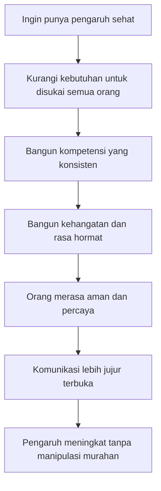
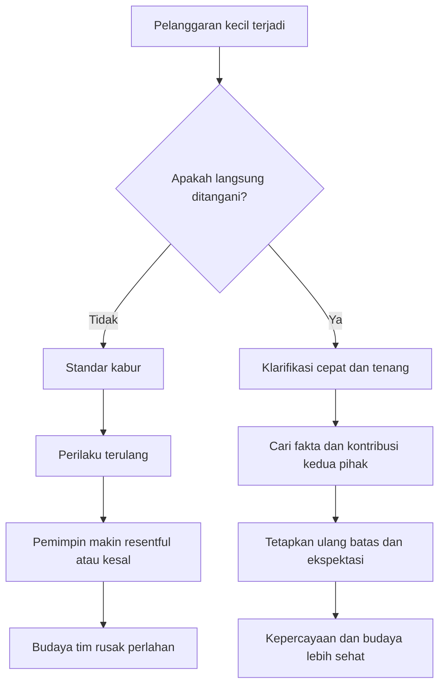
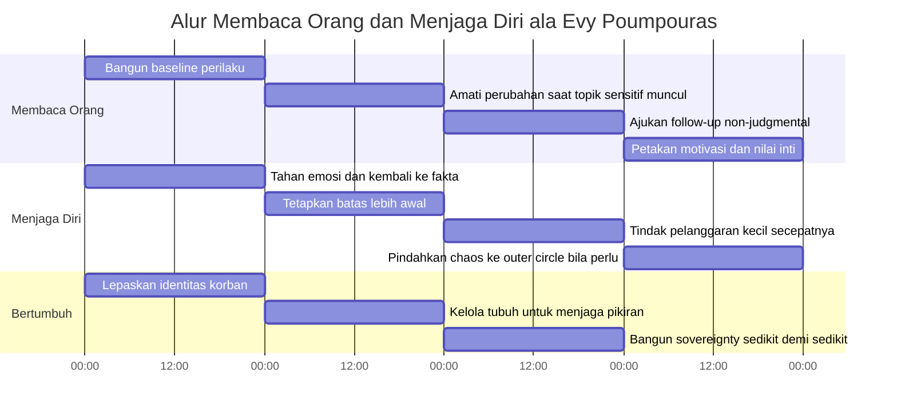

## 🛡️ Pendahuluan: Wawancara Ini Bukan Sekadar tentang “Cara Menangkap Pembohong”, tetapi tentang Cara Menjadi Manusia yang Lebih Tangguh, Lebih Jernih, dan Lebih Sulit Digoyang

Kalau seseorang melihat judul seperti *“How to Detect a Lie Instantly”* *(cara mendeteksi kebohongan seketika)*, sangat mudah mengira bahwa isi pembahasannya akan penuh trik instan: lihat ke kiri berarti bohong, menyentuh wajah berarti gugup, terlalu banyak bicara berarti menyembunyikan sesuatu. Tetapi dalam wawancara dengan **Evy Poumpouras**, mantan **US Secret Service Special Agent** *(agen khusus Secret Service Amerika Serikat)*, yang muncul justru sesuatu yang jauh lebih serius dan jauh lebih bernilai. 🛡️

Evy memang bicara tentang:

- **body language** *(bahasa tubuh)*,
- **verbal cues** *(isyarat verbal)*,
- **written statements** *(pernyataan tertulis)*,
- **baseline** *(patokan perilaku dasar)*,
- dan **lie detection** *(deteksi kebohongan)*.

Namun yang membuat pembahasan ini kuat bukan teknik-teknik permukaannya, melainkan fondasi mental di belakangnya. Evy tidak mengajarkan kita menjadi pemburu kebohongan yang paranoid. Ia mengajarkan sesuatu yang lebih mendasar:

- bagaimana memahami apa yang memotivasi orang,
- bagaimana membangun wibawa tanpa harus memaksa,
- bagaimana tetap hangat tanpa menjadi lemah,
- bagaimana menghadapi konflik tanpa larut emosi,
- bagaimana mengenali ketika ego sedang mengambil alih,
- dan bagaimana menjaga diri dari dunia yang kacau tanpa berubah menjadi pahit. ⚖️

Ini penting sekali. Karena dalam kehidupan nyata, kebohongan jarang hadir sendirian. Ia datang bersama:

- rasa takut,
- kebutuhan untuk terlihat baik,
- kepentingan pribadi,
- identitas yang rapuh,
- trauma yang belum selesai,
- dan dinamika kuasa.

Kalau kita hanya mencari “tanda bohong”, kita akan sering salah. Tapi kalau kita belajar membaca manusia secara lebih utuh—cara ia menjawab, cara ia bergeser dari baseline-nya, cara ia melindungi identitasnya, cara ia bereaksi terhadap rasa malu, dan cara ia mengelola tanggung jawab—maka kita akan jauh lebih akurat dan jauh lebih bijak.

Kalau harus dirumuskan dalam satu tesis utama, maka tesis artikel ini adalah:

> **Pelajaran terbesar dari Evy Poumpouras bukanlah cara menjadi mesin pendeteksi bohong, melainkan cara menjadi pribadi yang objektif, berdaulat, disiplin, dan peka terhadap manusia—sehingga kita bisa membaca situasi dengan jernih, menjaga batas dengan tegas, dan bergerak efektif tanpa dikendalikan ego atau emosi sesaat.**

Artikel ini akan membedah wawancara tersebut secara sangat mendalam. Kita akan bahas:

- mengapa orang berbicara terlalu banyak justru sering kehilangan kuasa,
- bagaimana membaca *motivational mindset* *(pola pikir motivasional)* seseorang,
- bagaimana mendeteksi kebohongan lewat perubahan baseline,
- apa arti kompetensi, warmth *(kehangatan)*, dan boundaries *(batas)* dalam membangun wibawa,
- mengapa banyak pemimpin gagal karena takut konflik,
- bagaimana trauma bisa berubah menjadi identitas,
- mengapa Evy begitu keras soal kedaulatan diri (*sovereignty*),
- dan bagaimana menjadi *bulletproof* *(tangguh / tidak mudah ditembus)* tanpa kehilangan belas kasih.

Ini bukan artikel ringan. Tetapi justru karena itulah ia penting. Karena dunia modern penuh nasihat dangkal tentang percaya diri, komunikasi, dan batas personal. Sementara Evy berbicara dari tempat yang jauh lebih mahal: ruang interogasi, perlindungan presiden, ancaman nyata, operasi penyamaran, dan keputusan yang bisa mematikan atau menyelamatkan nyawa. 🔍

---

<Callout type="important" title="Tesis utama artikel ini">
Evy Poumpouras menunjukkan bahwa kemampuan membaca kebohongan, mempengaruhi orang, mengelola konflik, dan memimpin diri sendiri semuanya bertumpu pada fondasi yang sama: **objektivitas, disiplin, kemampuan mendengar, penguasaan emosi, dan keberanian untuk tidak hidup sebagai korban keadaan**.
</Callout>

---

## 🧠 1. Orang yang Paling Banyak Bicara Sering Merasa Berkuasa—Padahal Justru Sedang Membocorkan Dirinya

Salah satu pernyataan paling tajam dari Evy datang sangat awal, ketika ia bicara tentang persuasi dan interaksi manusia. Ia mengatakan bahwa kesalahan besar orang adalah **terlalu banyak bicara**. Ini terdengar sederhana, tetapi implikasinya sangat besar. 🧠

### Logika yang dipakai Evy
Kalau saya bicara terus dan Anda mendengarkan, maka yang terjadi adalah:

- Anda belajar tentang saya,
- Anda tahu nilai saya,
- Anda tahu apa yang saya inginkan,
- Anda tahu cara saya berpikir,
- Anda tahu di mana kelemahan saya,
- sementara saya hampir tidak tahu apa-apa tentang Anda.

Dengan kata lain, orang yang banyak bicara sering merasa memegang kendali karena dia “menguasai percakapan”. Padahal secara informasi, justru lawan bicaranya yang sedang mengumpulkan data.

### Ini penting dalam banyak konteks
- negosiasi,
- penjualan,
- wawancara,
- perekrutan,
- interogasi,
- konflik personal,
- bahkan kencan pertama.

Kita sering menyamakan dominasi bicara dengan dominasi situasi. Evy membongkar ilusi itu. Dalam banyak kasus, **orang yang sabar mendengar justru lebih berkuasa**, karena dia mendapatkan peta motivasi, ketakutan, dan keinginan orang lain.

### Pelajaran praktisnya
Kalau kita ingin mempengaruhi atau memahami orang, tujuan pertama kita bukan membuat mereka tahu siapa kita. Tujuan pertama kita adalah:

> **membiarkan mereka mengungkap siapa mereka sebenarnya.**

Dan untuk itu, diam yang tepat kadang jauh lebih berguna daripada pidato yang rapi. 🤫

---

## 🎯 2. Kalau Ingin Menggerakkan Orang, Pahami Dulu *Motivational Mindset* Mereka

Evy memakai istilah yang sangat penting: **motivational mindset** *(pola pikir yang digerakkan oleh motivasi tertentu)*.

Intinya begini: setiap orang digerakkan oleh hal yang berbeda. Tidak semua orang termotivasi oleh uang. Tidak semua orang digerakkan oleh status. Tidak semua orang haus validasi. Tidak semua orang mengejar misi. Kalau kita keliru membaca motivasi utama seseorang, cara kita mendekati dia akan meleset. 🎯

### Contoh dari wawancara
Evy menceritakan operasi undercover terhadap seorang pelaku fraud asal Rusia. Strategi yang dipakai untuk memancingnya bukan ideologi tinggi atau persuasi halus, tetapi **greed** *(keserakahan / dorongan akan uang)*. Mereka tahu bahwa lelaki itu ingin lebih banyak uang, maka umpan yang diberikan adalah peluang menghasilkan lebih banyak uang di Amerika.

### Tetapi Evy memberi penyeimbang penting
Ia sendiri menegaskan bahwa ia bukan tipe orang yang termotivasi oleh uang. Saat masuk NYPD atau Secret Service, ia bahkan tidak bertanya soal gaji. Ia lebih digerakkan oleh **mission** *(misi)* dan **purpose** *(tujuan / makna)*.

Ini sangat penting, karena menunjukkan bahwa:

- satu pendekatan tidak cocok untuk semua orang,
- bahasa yang memotivasi kita belum tentu memotivasi orang lain,
- dan seni mempengaruhi orang selalu dimulai dari observasi, bukan asumsi.

### Bagaimana mengetahui motivasi seseorang?
Menurut Evy, salah satu caranya justru sederhana:

- dengar apa yang sering ia ulang,
- lihat apa yang ia tanyakan,
- lihat apa yang membuatnya hidup,
- lihat apa yang membuatnya takut kehilangan,
- dan lihat hal apa yang paling ia lindungi.

Orang sering tidak menyatakan motivasinya secara akademis. Tetapi mereka memperlihatkannya lewat pola. 💡

---

## 👂 3. Mendengar dengan Sungguh-Sungguh adalah Keunggulan Taktis, Bukan Sekadar Sikap Sopan

Evy menegaskan bahwa kalau kita memberi orang cukup ruang, mereka akan mengungkap diri mereka sendiri. Ini terdengar sederhana, tetapi sebenarnya sangat dalam. Sebab mendengar di sini bukan sekadar diam menunggu giliran bicara. Ini adalah:

- mendengar untuk memetakan,
- mendengar untuk memahami struktur nilai,
- mendengar untuk menangkap blind spot *(titik buta)*,
- dan mendengar untuk melihat arah emosi serta kebutuhan seseorang.

### Mengapa ini begitu kuat?
Karena banyak orang sangat jarang benar-benar didengar. Mereka biasa:

- dipotong,
- dibantah terlalu cepat,
- dihakimi,
- atau didengarkan sambil lawan bicara sibuk menyiapkan respons.

Saat seseorang merasa benar-benar didengar, dua hal terjadi sekaligus:

1. ia cenderung lebih terbuka,
2. dan kita mendapat data yang jauh lebih akurat tentang siapa dia.

### Ini juga menjelaskan mengapa orang sering lebih suka orang yang mendengarkan
Tetapi Evy memberi peringatan penting: jangan jadikan “disukai” sebagai tujuan utama. Karena kalau fokus kita adalah *I need you to like me* *(saya butuh Anda menyukai saya)*, kita akan mudah kehilangan objektivitas.

Ia menawarkan standar yang lebih sehat:

- **be competent** *(jadilah kompeten)*,
- **be warm** *(jadilah hangat)*,
- **be respectful** *(jadilah penuh hormat)*,
- tetapi jangan menjadi orang yang kehilangan arah hanya demi disukai.

Ini pembeda yang sangat dewasa. 🌿

---

## 🤝 4. Jangan Kejar “Disukai”; Kejar Kompetensi, Kehangatan, dan Respek

Salah satu bagian paling kuat dari wawancara ini adalah saat Evy menolak obsesi banyak orang untuk “membuat semua orang suka.” Menurutnya, itu jebakan.

### Kenapa jebakan?
Karena kalau fokus kita adalah disukai, maka:

- kita mulai mengaburkan tujuan,
- kita menjadi terlalu people-pleasing *(terlalu ingin menyenangkan orang)*,
- kita takut menetapkan batas,
- kita takut konflik,
- dan kita mulai mencampuradukkan profesionalisme dengan kebutuhan afeksi.

Padahal dalam dunia nyata, kita bisa melakukan semuanya dengan benar dan tetap ada orang yang tidak suka. Jadi, “disukai semua orang” bukan target yang stabil.

### Apa gantinya?
Evy menekankan dua pilar:

#### 1. **Competence** *(kompetensi)*
- kalau bilang bisa, benar-benar bisa,
- kalau bilang datang jam 9, datang jam 08:55,
- kalau janji follow up, ya follow up,
- kalau kerja, hasilnya rapi.

#### 2. **Warmth** *(kehangatan)*
- terbuka,
- approachable *(mudah didekati)*,
- tidak menghakimi,
- menghormati orang,
- dan menunjukkan bahwa kita hadir sebagai manusia.

### Mengapa kombinasi ini penting?
Karena kompetensi tanpa kehangatan bisa terasa dingin dan mengancam. Kehangatan tanpa kompetensi bisa terasa manis tapi rapuh. Yang paling kuat justru ketika orang merasa:

> “Saya bisa mempercayai Anda, dan saya juga merasa aman di sekitar Anda.”

Itulah fondasi wibawa yang sehat. 🧱

---

---

## 🔍 5. Cara Mendeteksi Kebohongan Menurut Evy: Jangan Cari Tanda Aneh, Cari **Perubahan dari Baseline**

Ini mungkin bagian yang paling langsung relevan dengan judul wawancaranya. Tetapi lagi-lagi, Evy tidak menjual teori murahan. Ia tidak berkata bahwa satu tanda tertentu otomatis berarti bohong. Ia berbicara tentang sesuatu yang jauh lebih masuk akal, yaitu **baseline** *(patokan perilaku dasar)*. 🔍

### Apa itu baseline?
Baseline adalah pola normal seseorang ketika:

- ia nyaman,
- ia berada di ritme biasa,
- dan belum terguncang oleh topik tertentu.

Contohnya, Evy bahkan memberi contoh langsung pada host:

- bagaimana cara ia biasanya duduk,
- bagaimana gerakan tangannya,
- bagaimana kontak matanya,
- bagaimana ritme responsnya.

Setelah baseline itu terbentuk, baru perubahan menjadi bermakna.

### Kenapa perubahan penting?
Karena orang berbeda-beda.

- Ada yang memang sering menghindari tatapan.
- Ada yang memang banyak gerak tangan.
- Ada yang memang lambat bicara.
- Ada yang memang tampak gelisah meskipun jujur.

Kalau kita memaksakan satu aturan ke semua orang, kita akan salah terus.

Tetapi kalau seseorang yang biasanya stabil tiba-tiba:

- menunduk saat pertanyaan tertentu muncul,
- mengubah postur,
- mulai menjawab lebih berputar,
- atau memberi sinyal yang tidak sesuai dengan baseline,

maka itulah titik rasa ingin tahu kita harus naik.

### Kata kunci dari Evy: bukan vonis, tetapi **curiosity** *(rasa ingin tahu)*
Ini penting sekali. Tujuan perubahan perilaku bukan untuk langsung berkata “Anda bohong,” melainkan untuk memberi sinyal:

> **“Ada sesuatu di sini. Saya perlu bertanya lebih baik.”**

Dan di situlah keahlian yang sesungguhnya dimulai. 🧩

---

## ❓ 6. Follow-up Question adalah Senjata Sebenarnya: Banyak Orang Melihat Sinyal, tetapi Tidak Pernah Menindaklanjutinya

Salah satu observasi paling cerdas dari Evy adalah ini: banyak orang sebenarnya **merasakan** ketika ada sesuatu yang aneh dalam respons lawan bicara. Masalahnya, mereka membiarkan momen itu lewat.

Padahal yang membedakan pembaca manusia yang baik dengan pembaca manusia yang buruk sering kali bukan sensitivitas awalnya, tetapi **apa yang dilakukan setelah sensitivitas itu muncul**.

### Formula Evy sangat jelas
1. Amati baseline.
2. Lihat perubahan.
3. Jangan langsung menuduh.
4. Ajukan pertanyaan lanjutan.
5. Lalu pertanyaan lanjutan lagi.
6. Tetap non-judgmental.

### Kenapa follow-up ini penting?
Karena satu jawaban saja jarang cukup. Tapi jika seseorang diminta menjelaskan dengan rinci, kronologis, dan konsisten, banyak hal akan mulai terlihat:

- apakah ceritanya stabil,
- apakah detailnya wajar,
- apakah ia makin defensif,
- apakah ia menjelaskan atau justru mengaburkan,
- apakah ia menghindari titik tertentu.

Kebanyakan kebohongan runtuh bukan karena satu pertanyaan hebat, tetapi karena **beberapa pertanyaan sederhana yang konsisten, sabar, dan tidak emosional**.

---

## 🧿 7. Red Flag yang Menarik: Ketika Orang Terlalu Keras Memanggil Tuhan untuk Membela Diri

Evy memberi contoh sangat konkret dari ruang interogasi. Ia menceritakan bahwa salah satu pola yang sering ia lihat pada orang bersalah adalah kebutuhan untuk terlalu keras menarik *divine intervention* *(campur tangan ilahi)* ke dalam pembelaan mereka.

Contoh:
- “I swear to God.”
- “God is my witness.”
- datang dengan Bible atau rosary beads,
- sangat keras menampilkan simbol religiusitas ketika diperiksa.

### Apakah ini berarti semua orang religius yang bicara begitu pasti bohong?
Tidak. Tentu tidak.

Tetapi bagi Evy, ini bisa menjadi **red flag** *(tanda bahaya / sinyal awal)* ketika muncul sebagai bentuk usaha berlebihan untuk menempelkan kredibilitas pada diri sendiri.

### Kenapa mencurigakan?
Karena pertanyaannya menjadi:

> kalau cerita Anda kuat, mengapa Anda perlu meminjam otoritas moral dari Tuhan agar saya percaya?

Sekali lagi, ini bukan bukti. Ini hanya sinyal. Tetapi sinyal seperti ini sangat berharga ketika digabungkan dengan baseline, konteks, dan respons-respons lain.

---

## 👁️ 8. Kontak Mata: Bukan Sekadar Tanda Kejujuran, tetapi Cara Menyatakan “Saya Berhak Ada di Sini”

Pembahasan Evy tentang **eye contact** *(kontak mata)* sangat menarik karena tidak dangkal. Ia tidak sekadar bilang, “tatap mata orang biar terlihat percaya diri.” Ia memberikan makna yang lebih dalam.

Menurutnya, ketika kita melakukan kontak mata yang sehat, kita menyampaikan beberapa hal sekaligus:

- saya percaya diri,
- saya tidak perlu bersembunyi,
- saya relevan,
- saya layak ada dalam percakapan ini,
- dan Anda juga cukup penting bagi saya untuk saya hadir sepenuhnya. 👁️

### Dua sisi kontak mata
Kontak mata yang baik memberi dua pesan:

#### Ke diri sendiri:
- saya punya tempat di sini,
- saya tidak lebih rendah,
- saya tidak perlu menciut.

#### Ke orang lain:
- saya mendengar Anda,
- saya melihat Anda,
- saya hadir,
- Anda penting.

### Tapi apakah bisa dipalsukan?
Host podcast mengangkat pertanyaan yang bagus: apakah orang bisa memalsukan semua bahasa tubuh percaya diri? Evy tidak menyangkal bahwa postur, tatapan, dan perilaku bisa dilatih. Tetapi ia juga sepakat bahwa perubahan yang paling kuat biasanya datang dari dalam secara bertahap.

Artinya, bahasa tubuh bisa dilatih sebagai *entry point* *(titik masuk)*, tetapi jika inti diri kita masih rapuh, tubuh akan terus membocorkan ketidakselarasan itu dalam banyak bentuk kecil lain.

Jadi, ya—latihan membantu. Tetapi inti perubahan tetap lebih dalam dari sekadar teknik pose. 🧍

---

## 🧱 9. Kedaulatan Diri (*Sovereignty*): Saat Kita Berhenti Mengejar Persetujuan dan Mulai Berdiri Tegak dalam Diri Sendiri

Salah satu konsep yang paling kuat dari Evy adalah **sovereignty** *(kedaulatan diri / otonomi batin yang utuh)*.

Ia menjelaskan ini lewat pengalaman hidupnya sendiri: ada titik ketika seseorang berhenti:

- mengejar validasi,
- mengejar persetujuan,
- mengejar penyelamatan dari luar,
- dan berhenti berharap ada orang lain yang akan “melengkapi” dirinya.

Di titik itu, orang menjadi magnetis. Bukan karena ia berusaha terlihat hebat, tetapi karena ia tidak lagi bocor oleh kebutuhan terus-menerus untuk disetujui.

### Apa ciri orang yang mulai sovereign?
- tidak terlalu mengejar,
- tidak terlalu people-pleasing,
- tidak mengambil inventaris dari semua opini luar,
- tahu bahwa hubungan itu indah, tetapi tidak menjadikan hubungan sebagai sumber identitas tunggal,
- dan berani berkata, “Saya cukup.”

### Mengapa ini penting untuk relasi dan kepemimpinan?
Karena orang yang terlalu haus validasi akan:

- mudah dibelokkan,
- mudah dimanfaatkan,
- mudah bingung,
- dan sulit menetapkan batas.

Sebaliknya, orang yang lebih sovereign bisa lebih hangat justru karena ia tidak sedang meminta orang lain mengisi lubang di dalam dirinya.

Itu salah satu bentuk kekuatan paling tenang. 🌿

---

## ⚔️ 10. Konflik Tidak Harus Jelek: Pemimpin yang Baik Justru Mampu Menghadapi Gesekan Tanpa Menghinakan Orang

Dalam pembahasan tentang pimpinan, tim, dan batas, Evy menyentuh problem yang sangat umum: banyak pemimpin takut konflik. Mereka takut menegur, takut mengoreksi, takut menahan orang yang menyeberang batas, lalu semuanya dibiarkan sampai jadi bom waktu.

### Evy sangat jelas di sini
Kalau ada pelanggaran kecil dan kita tidak menanganinya, kita sedang mengajarkan standar baru. Artinya, kita ikut bertanggung jawab terhadap budaya yang terbentuk.

### Dua pelajaran penting

#### 1. **Periksa dulu kontribusi kita terhadap masalah**
Evy selalu balik dulu ke diri sendiri:
- standar apa yang saya ciptakan,
- sinyal apa yang saya berikan,
- apakah saya terlalu longgar,
- apakah saya membiarkan ini sebelumnya.

Ini sangat dewasa, karena menghindarkan kita dari reaksi ego yang langsung menyalahkan orang lain.

#### 2. **Tegur cepat, tenang, jelas**
Jangan menunggu sampai kebencian menumpuk. Konflik yang baik bukan teriakan. Konflik yang baik adalah:

- “Ini yang terjadi.”
- “Tolong jelaskan.”
- “Apa yang sedang kamu pikirkan waktu itu?”
- “Apa yang kita perlu ubah supaya ini tidak terulang?”

Lihat bedanya. Fokusnya bukan mempermalukan, tetapi memperjelas.

### Ini sangat penting dalam kepemimpinan modern
Karena banyak tim rusak bukan oleh konflik besar, tetapi oleh konflik kecil yang tidak pernah ditangani. 😶

---

---

## 🏛️ 11. Pelajaran dari Presiden: Pemimpin Besar Tidak Mudah Dibajak Emosi

Bagian wawancara ketika Evy bicara tentang presiden-presiden yang ia lindungi sangat berharga. Ia mengatakan bahwa yang paling mengesankan adalah **resilience** *(daya lenting / ketahanan psikologis)* mereka. 🏛️

Bayangkan ini: Anda mendengar komentar publik yang menghina, mencemooh, bahkan merendahkan Anda, lalu beberapa menit setelah itu Anda harus berjalan ke panggung dan tetap tampil utuh.

### Pelajaran dari pengamatannya
Pemimpin besar tidak selalu:
- paling ramah,
- paling ekspresif,
- atau paling sempurna.

Tetapi mereka sering punya kemampuan:

- memisahkan emosi dari tugas,
- menarik diri dari impuls defensif,
- kembali ke fakta,
- dan tetap menjalankan peran mereka meski diserang secara personal.

### Pengambilan keputusan tingkat tinggi
Evy menekankan bahwa dalam ruang keputusan penting, yang ia lihat bukanlah ledakan emosi, tetapi:

- pertimbangan pro dan kontra,
- perdebatan rasional,
- kompetisi ide,
- dan kemampuan menahan ego agar tidak mengganggu keputusan.

Ini adalah pelajaran yang sangat relevan buat siapa pun yang memimpin:

> **Jangan menjadi emotional decision maker** *(pengambil keputusan yang dikuasai emosi sesaat)*.

Bukan berarti emosi tidak ada. Tetapi emosi tidak boleh memegang kemudi. 🚦

---

## 🧨 12. Batas, Energi, dan Lingkaran Dalam: Tidak Semua Orang Harus Tetap di Pusat Hidup Kita

Salah satu bagian paling praktis dan paling keras dari Evy adalah ketika ia bicara soal orang-orang yang membawa kekacauan terus-menerus ke hidup kita. Ia sangat jelas:

- kalau seseorang terus membawa chaos *(kekacauan)*,
- volatilitas *(ketidakstabilan)*,
- drama,
- dan kita membiarkan itu terus masuk,

maka pada titik tertentu kita juga ikut bertanggung jawab atas apa yang merusak kestabilan kita.

### Evy tidak selalu menyuruh putus total
Terkadang, katanya, orang yang kita cintai atau sayangi tidak harus dibuang. Tetapi mereka bisa dipindahkan ke **outer circle** *(lingkar luar)*.

Itu artinya:
- tetap peduli,
- tetap sayang,
- tetapi tidak memberi akses penuh ke pusat stabilitas hidup kita.

### Ini sangat penting
Karena banyak orang hidup dengan asumsi biner:
- kalau saya sayang, saya harus selalu tersedia penuh,
- kalau saya batasi, berarti saya jahat.

Padahal tidak. Kadang membatasi akses orang terhadap energi kita justru adalah bentuk tanggung jawab kepada diri sendiri.

> Tidak semua orang yang kita kasihi layak berada di pusat orbit hidup kita setiap saat. 🪐

---

## 🧾 13. Identitas Korban dan Trauma: Saat Luka Tidak Lagi Menjadi Pengalaman, tetapi Menjadi Seluruh Diri

Bagian ini sangat sensitif, tetapi juga sangat penting. Evy membahas orang-orang yang menjadikan trauma sebagai identitas tetap. Ia membedakan dengan tegas antara:

- **sesuatu yang terjadi pada saya**, dan
- **siapa saya**.

### Contoh yang ia berikan sangat keras
Ia selamat dari 9/11, tetapi menolak menjadikan itu identitas totalnya. Ia berkata, kurang lebih:

> “Saya bukan ‘survivor 9/11’. Saya Evy. Itu hanya satu peristiwa di hidup saya.”

Ini cara berpikir yang sangat kuat.

### Apa bahayanya kalau trauma menjadi identitas total?
- masa lalu mengunci masa depan,
- orang berhenti berkembang,
- hidup terus berputar pada peristiwa lama,
- rasa sakit terus dipelihara sebagai sumber makna,
- dan semua keputusan mulai diambil dari titik luka, bukan dari titik hidup.

### Mengapa ini bisa begitu lengket?
Karena trauma memberi:
- cerita,
- komunitas,
- penjelasan atas penderitaan,
- bahkan kadang status moral atau perhatian.

Evy sangat peka pada jebakan ini. Ia tidak menolak bahwa trauma nyata. Ia menolak memberi trauma hak untuk mengambil alih seluruh identitas manusia. 🕯️

---

## 🧬 14. Identity Language: Tanda-Tanda Orang Sedang Terlalu Melekat pada Narasi Luka

Evy menyebut satu sinyal bahasa yang menarik: orang yang terlalu *identity-based* *(berbasis identitas luka atau ego)* sering memakai “I, I, I” *(saya, saya, saya)* secara berlebihan. Mereka:

- sangat self-focused,
- sangat emosional,
- sering kembali pada narasi diri,
- dan terus memposisikan pengalaman pribadi sebagai pusat dari segalanya.

### Apakah ini selalu buruk?
Tidak. Semua orang bisa singgah di “identity land” dari waktu ke waktu, terutama saat sedang terluka atau tertekan.

Tetapi kalau itu menjadi cara hidup permanen, risikonya besar:
- depresi makin menebal,
- kecemasan jadi identitas,
- konflik jadi candu,
- drama jadi sumber rasa hidup,
- dan orang sulit keluar karena sekarang sistem sosialnya ikut dibangun di atas narasi itu.

### Poin besar yang diangkat Evy
Ada orang yang tidak hanya menderita karena trauma, tetapi juga mulai **mendapat sesuatu** dari terus tinggal di sana:
- perhatian,
- komunitas,
- validasi,
- adrenalin,
- bahkan makna eksistensial.

Di titik itu, bantuan menjadi sulit, karena orang tersebut tidak hanya terluka—ia juga mulai terikat pada lukanya. 🕸️

---

## ✈️ 15. “Kill Fear While It’s Still Small”: Mengapa Evy Memilih Naik Pesawat Tiga Minggu Setelah 9/11

Ini mungkin salah satu momen paling kuat dalam wawancara. Setelah mengalami 9/11, Evy justru dengan sengaja naik pesawat tiga minggu kemudian. Kenapa? Karena ia tidak ingin membiarkan rasa takut tumbuh menjadi monster.

### Logika di balik keputusan itu sangat kuat
Ketakutan yang dibiarkan mengeras akan:
- memperkecil hidup,
- membatasi gerak,
- membangun dunia yang makin sempit,
- dan diam-diam mengambil kebebasan kita sedikit demi sedikit.

Evy memilih memotong proses itu sejak kecil. Dalam bahasanya:

> **kill fear while it’s still small** *(bunuh rasa takut selagi masih kecil)*.

### Ini penting bukan hanya untuk trauma ekstrem
Dalam hidup biasa pun prinsip ini berlaku:
- takut telepon penting,
- takut bicara di depan orang,
- takut melamar,
- takut memulai bisnis,
- takut olahraga lagi,
- takut kembali berkendara,
- takut membuka diri.

Kalau semua itu dibiarkan terus, hidup kita akan didefinisikan oleh pola menghindar.

Bukan berarti kita harus brutal pada diri sendiri. Tetapi ada kebijaksanaan besar dalam kalimat Evy: jangan biarkan rasa takut mendapatkan terlalu banyak real estate *(ruang tinggal)* di kepala kita. 🔥

---

## 🧵 16. Mengapa Imposter Syndrome Ditolak Evy? Karena Baginya, Ia Tidak Menyusup—Ia Memang Mengusahakan Tempatnya

Evy punya sikap yang sangat tegas terhadap istilah **imposter syndrome**. Ia tidak suka istilah itu, terutama karena menurutnya istilah itu kerap memaksa orang—khususnya perempuan—untuk meragukan tempat yang sebenarnya sudah mereka perjuangkan dengan keras.

### Posisi Evy sederhana tapi keras
- saya bukan penyusup,
- saya tidak nyelonong,
- saya tidak diberi cuma-cuma,
- saya bekerja keras untuk sampai ke sini.

### Mengapa ini penting?
Karena terlalu sering narasi imposter syndrome membuat orang fokus pada:
- “apa saya pantas?”

padahal pertanyaan yang lebih sehat sering kali adalah:
- “apa saya bekerja untuk ini?”
- “apa saya berkembang untuk ini?”
- “apa saya bisa terus belajar di sini?”

Evy tidak naif. Ia tahu diskriminasi ada. Ia tahu bias ada. Tetapi ia menolak menjadikan itu alasan untuk merampas otoritas dirinya sendiri.

Ini bukan berarti semua orang harus menekan keraguannya. Tetapi ada keberanian besar dalam posisi Evy:

> **Jangan biarkan bahasa psikologis modern mencuri penghargaan yang seharusnya kamu berikan pada kerja kerasmu sendiri.**

---

## 🌍 17. Diskriminasi Itu Nyata, tapi Tidak Harus Menjadi Pusat Hidup: Pelajaran Sulit tentang Energi dan Fokus

Evy tidak pernah bilang bahwa diskriminasi itu tidak ada. Justru ia berkali-kali mengakui:

- bias itu nyata,
- prasangka itu nyata,
- perlakuan berbeda itu nyata,
- dan ia sendiri mengalaminya.

Tetapi yang ia tolak adalah memberi semua itu hak untuk menjadi pusat hidupnya.

### Kenapa?
Karena energi manusia terbatas. Kalau semua energi dipakai untuk:
- membuktikan sesuatu pada semua orang,
- mengoreksi semua kebodohan,
- melawan setiap buffoon *(orang bodoh / pelaku kekonyolan)*,

maka kita tidak akan punya cukup tenaga untuk membangun hidup kita sendiri.

### Ini bukan pasrah
Ini lebih seperti strategi:
- pilih perang yang layak,
- pilih konteks yang bisa diubah,
- dan jangan jadikan semua kebodohan orang lain sebagai proyek pribadi.

Ini bentuk lain dari *sovereignty* tadi. 🌍

---

## 🏃 18. Tubuh dan Pikiran Itu Menikah: Mengapa Olahraga, Makan, dan Gerak Menjadi Inti Ketahanan Mental Menurut Evy

Bagian akhir wawancara juga sangat kuat ketika Evy bicara tentang tubuh. Ia menolak pemisahan yang terlalu kaku antara:

- *mind work* *(kerja mental)*,
- dan *body work* *(kerja tubuh)*.

Menurutnya, tubuh dan pikiran itu menikah. Kalau tubuh kita:
- tak bergerak,
- diisi sampah,
- tidak dipelihara,
- dan dibiarkan pasif,

maka jangan heran kalau mental ikut ambruk.

### Kenapa ini penting?
Karena banyak orang ingin:
- jernih,
- stabil,
- kuat,
- dan tahan tekanan,

sementara tubuhnya diperlakukan seperti tempat sampah atau mesin yang tak pernah dirawat.

Evy sangat tegas di sini:

> **we treat our bodies like garbage, then wonder why we feel terrible** *(kita memperlakukan tubuh seperti sampah, lalu heran kenapa rasanya buruk).* 

### Aktivitas fisik sebagai pelepasan
Ia bicara tentang lari di malam hari sebagai cara membuang stres, melepaskan tekanan, dan mengembalikan diri ke pusat. Ini penting karena menunjukkan bahwa penguasaan emosi bukan selalu lewat berpikir. Kadang emosi harus dialirkan lewat tubuh.

Tubuh yang bergerak membantu pikiran kembali jernih. Dan ini salah satu pelajaran paling sederhana sekaligus paling sering diabaikan. 🏃

---

## 🔚 Kesimpulan: Menjadi *Bulletproof* Bukan Berarti Tidak Terluka, tetapi Tidak Menyerahkan Kemudi Hidup pada Rasa Takut, Ego, atau Masa Lalu

Kalau semua gagasan Evy Poumpouras dalam wawancara ini kita padatkan, maka yang kita dapat sebenarnya bukan manual “trik agen rahasia” dalam arti dangkal. Yang kita dapat adalah peta untuk menjadi manusia yang lebih stabil dan lebih sulit digoyang.

Evy mengajarkan bahwa:

- kebohongan dibaca dari perubahan, bukan mitos tanda tunggal,
- pengaruh dimulai dari memahami motivasi orang lain,
- wibawa dibangun dari kompetensi dan kehangatan, bukan haus disukai,
- konflik harus dikelola cepat dan jernih,
- trauma tidak boleh dibiarkan menjadi seluruh identitas,
- rasa takut harus ditangani sebelum tumbuh besar,
- dan kedaulatan diri harus dijaga dari kekacauan luar maupun dari kelemahan ego sendiri.

Kalau harus ditutup dalam satu kalimat yang paling penting, maka mungkin ini:

> **Menjadi bulletproof bukan berarti kebal dari rasa sakit, tetapi mampu tetap berpikir, tetap memilih, dan tetap berdiri tegak meski hidup memberi tekanan, ketidakadilan, penolakan, dan ketakutan.**

Dan di zaman yang penuh kebisingan, drama, identitas rapuh, dan reaksi impulsif seperti sekarang, itu mungkin salah satu keterampilan paling berharga yang bisa dimiliki siapa pun. 🛡️

---

## Glosarium istilah asing + padanan Indonesia

| Istilah Asing | Padanan / Penjelasan Indonesia |
|---|---|
| body language | bahasa tubuh |
| verbal cues | isyarat verbal |
| written statements | pernyataan tertulis |
| lie detection | deteksi kebohongan |
| baseline | patokan dasar perilaku |
| motivational mindset | pola pikir motivasional / dorongan utama seseorang |
| competence | kompetensi |
| warmth | kehangatan |
| boundaries | batas / batas personal |
| people-pleasing | terlalu ingin menyenangkan orang |
| emotional decision maker | pengambil keputusan yang dikuasai emosi |
| resilience | daya lenting / ketahanan psikologis |
| sovereignty | kedaulatan diri / otonomi batin |
| red flag | tanda bahaya / sinyal awal |
| outer circle | lingkar luar dalam relasi |
| identity-based | berpusat pada identitas tertentu |
| imposter syndrome | sindrom merasa diri penyusup / tidak pantas |
| hardwired | tertanam secara naluriah |
| buffoon | orang bodoh / sosok yang bertindak sembrono |

---

---

<Callout type="quote" title="Inti artikel ini dalam satu kalimat">
Keahlian terbesar Evy Poumpouras bukan hanya membaca kapan orang berbohong, tetapi membaca kapan kita sendiri sedang digerakkan oleh ego, ketakutan, trauma, atau kebutuhan untuk disukai—lalu memilih untuk tetap objektif dan berdaulat.
</Callout>

---

**Sumber:** `https://www.youtube.com/watch?v=iz_SJ5TpLJ0`
