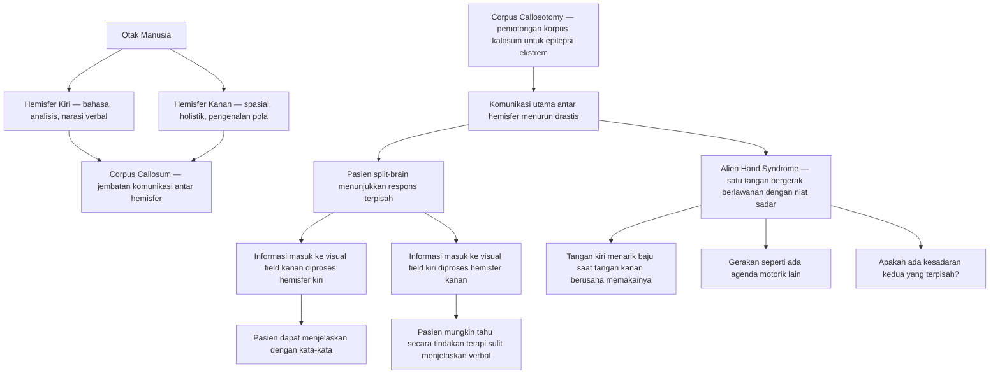
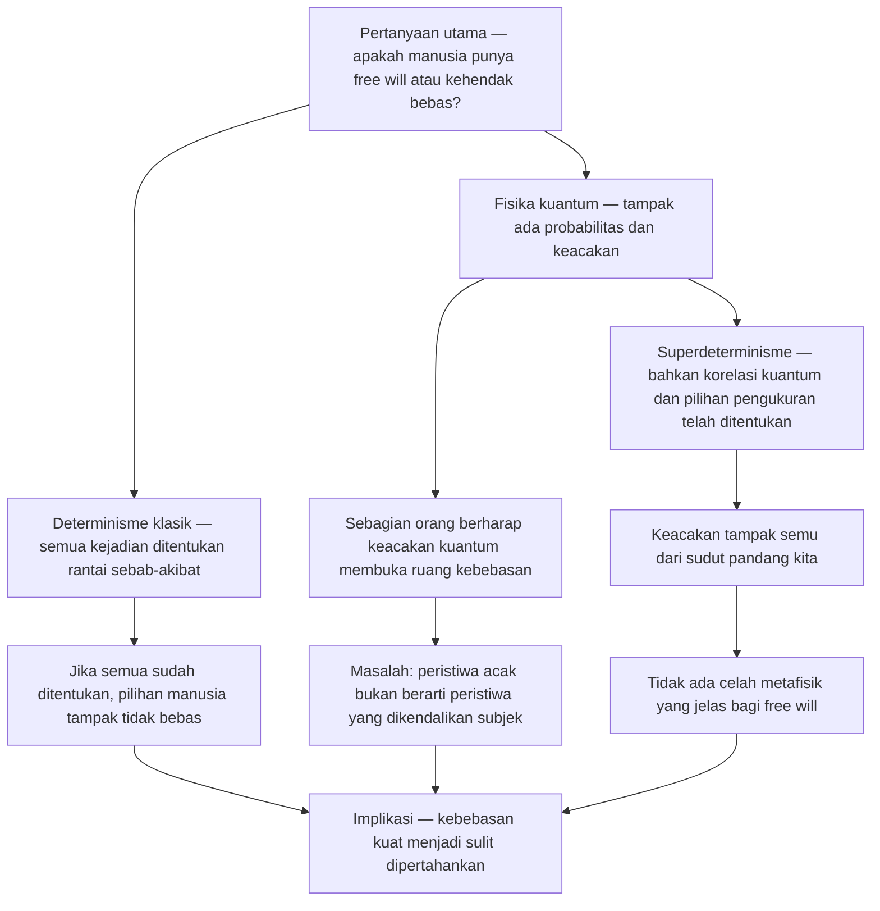
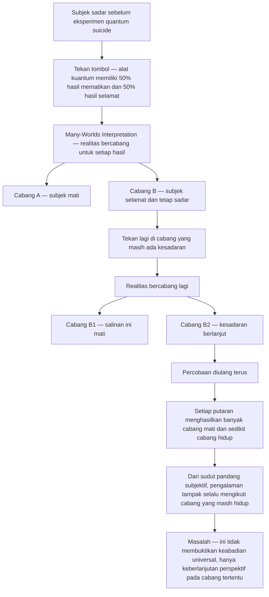

## Pengantar — Apa itu *Existential Crisis Iceberg* (*Gunung Es Krisis Eksistensial*)? 🧊

Di internet, terutama dalam budaya visual seperti TikTok dan komunitas *iceberg charts* (bagan gunung es) di Reddit, sebuah ide sering dibuat lebih mudah dipahami melalui metafora gunung es 😊. Bagian yang tampak di permukaan mewakili konsep yang relatif populer, sering dibicarakan, dan masih cukup “aman” untuk direnungkan. Sementara itu, bagian yang tenggelam jauh di bawah air mewakili gagasan-gagasan yang lebih gelap, lebih rumit, lebih teknis, dan lebih mengganggu fondasi cara kita memandang realitas.

*Existential Crisis Iceberg* (*Gunung Es Krisis Eksistensial*) adalah salah satu contoh terbaik dari format itu. Ia viral di TikTok dengan angka yang sering dikutip mencapai sekitar 5 juta tayangan dan 500 ribu *likes* (suka), lalu diperdalam lagi oleh komunitas Reddit seperti r/icebergcharts 😶. Daya tariknya sederhana tetapi kuat: manusia ternyata suka memetakan ketakutannya. Kita ingin melihat seberapa dalam lubang pertanyaan yang bisa dibuka hanya dengan satu pikiran sederhana seperti, “Mengapa aku ada?” atau “Apa jadinya kalau semua ini tidak nyata?”

Yang menarik, *iceberg* (gunung es) ini bukan sekadar daftar hal-hal menyeramkan. Ia adalah peta perkembangan kesadaran intelektual. Di permukaan, kamu mulai dengan rasa asing yang puitis ketika sadar bahwa orang lain punya hidup yang sama kompleks dengan hidupmu. Lalu sedikit demi sedikit, kamu turun ke pertanyaan tentang kematian, makna, simulasi, alien, nihilisme, dualitas kesadaran, hakikat waktu, sampai kemungkinan bahwa dirimu hanyalah otak kebetulan yang muncul dari fluktuasi acak kosmik 😵.

<Callout type="info" title="Mengapa Metafora Gunung Es Sangat Tepat?">
Bagian atas gunung es terlihat kecil, tetapi massa terbesarnya justru tersembunyi di bawah air. Begitu juga dengan krisis eksistensial 😌. Pertanyaan yang tampak sederhana sering menyimpan lapisan metafisik (*metaphysical* = berkaitan dengan hakikat terdalam realitas), epistemologis (*epistemological* = berkaitan dengan pengetahuan), dan psikologis yang jauh lebih mengganggu daripada dugaan awal kita.
</Callout>

Krisis eksistensial sendiri sering dipahami secara negatif. Ia dianggap tanda kelemahan, overthinking (*berpikir berlebihan*), atau bahkan gangguan yang perlu segera “dibungkam”. Padahal, dalam sejarah filsafat, justru sebaliknya. Krisis eksistensial kerap menjadi tanda bahwa seseorang mulai dewasa secara intelektual 🤔. Ia bukan berarti kamu rusak; ia berarti kamu berhenti hidup secara otomatis. Kamu mulai bertanya bukan hanya bagaimana bertahan hidup, tetapi juga apa arti hidup itu sendiri.

Bila seorang anak kecil hidup dari horizon pendek — makan siang, main sore, libur akhir pekan — maka orang dewasa mulai hidup dengan horizon panjang: karier, cicilan, penuaan, kematian orang tua, makna kerja, kemungkinan kegagalan total, dan nasib jiwanya sendiri. Ketika horizon itu membuka, krisis eksistensial menjadi nyaris tak terhindarkan. Maka artikel ini tidak akan memperlakukan *iceberg* ini sebagai hiburan kosong, melainkan sebagai peta pemikiran manusia modern.

Dalam panduan ini, kita akan membedah **20 lapisan** lengkap dari permukaan hingga bawah es. Saya tidak akan meringkasnya secara dangkal. Kita akan menelusuri akar filsafatnya, versi internetnya, implikasi psikologisnya, dan mengapa konsep-konsep itu terasa begitu menghantam bila direnungkan terlalu lama 😅.

## Peta Besar *Existential Crisis Iceberg* 🧭

Sebelum turun satu per satu, lihat dulu keseluruhan petanya.

```mermaid
flowchart TD
    Surface["Permukaan Air — pertanyaan yang mulai mengusik tetapi masih umum"]
    L1["Lapisan 1 — Sonder"]
    L2["Lapisan 2 — Khawatir tentang Masa Depan"]
    L3["Lapisan 3 — Teori Simulasi"]
    L4["Lapisan 4 — Mengapa Ada Sesuatu?"]
    L5["Lapisan 5 — Mengakui Kematian"]

    Mid["Lapisan Menengah — pertanyaan mulai merusak rasa aman metafisik"]
    L6["Lapisan 6 — Simpati Lahir dari Kasihan Diri"]
    L7["Lapisan 7 — Last Thursdayism"]
    L8["Lapisan 8 — Kamu Sendirian dalam Otakmu"]
    L9["Lapisan 9 — Kita Tidak Sendirian"]
    L10["Lapisan 10 — Skeptisisme Akhirat"]
    L11["Lapisan 11 — Nihilisme"]

    Deep["Lapisan Dalam — realitas, pikiran, dan kesadaran mulai retak"]
    L12["Lapisan 12 — Teori Kesadaran Ganda"]
    L13["Lapisan 13 — Observasi Menciptakan Alam Semesta"]
    L14["Lapisan 14 — Misteri Kesadaran"]

    Abyss["Bawah Es — waktu, kosmos, identitas, dan probabilitas menjadi horor intelektual"]
    L15["Lapisan 15 — Masa Lalu dan Masa Depan Ada Bersamaan"]
    L16["Lapisan 16 — Superdeterminisme"]
    L17["Lapisan 17 — Kehidupan Manusia adalah Anomali Semesta"]
    L18["Lapisan 18 — Otak Menciptakan Aliran Waktu"]
    L19["Lapisan 19 — Boltzmann Brain"]
    L20["Lapisan 20 — Quantum Immortality"]

    Surface --> L1 --> L2 --> L3 --> L4 --> L5 --> Mid --> L6 --> L7 --> L8 --> L9 --> L10 --> L11 --> Deep --> L12 --> L13 --> L14 --> Abyss --> L15 --> L16 --> L17 --> L18 --> L19 --> L20
```

<Callout type="important" title="Cara Membaca Artikel Ini">
Jangan baca daftar ini seperti daftar mitos horor 😄. Bacalah sebagai tangga penurunan intelektual. Masing-masing lapisan bukan hanya ide berdiri sendiri, melainkan pintu menuju pertanyaan yang lebih dalam. Sering kali, lapisan di bawahnya lahir karena jawaban di lapisan atas ternyata belum memuaskan.
</Callout>

## Tabel Lapisan *Iceberg* Lengkap 📚

| Lapisan | Nama Konsep | Tokoh/Filsuf Terkait | Level Krisis (1-10) |
|---|---|---|---:|
| 1 | Sonder | John Koenig | 2 |
| 2 | Khawatir tentang Masa Depan | Kierkegaard, psikologi perkembangan | 3 |
| 3 | Teori Simulasi | René Descartes, Nick Bostrom | 5 |
| 4 | Mengapa Ada Sesuatu? | Leibniz, Aquinas, filsafat kosmologis | 6 |
| 5 | Mengakui Kematian | Stoik, Heidegger | 6 |
| 6 | Simpati Lahir dari Kasihan Diri | Hobbes, etika evolusioner | 6 |
| 7 | Last Thursdayism | Skeptisisme radikal, Philip Gosse | 7 |
| 8 | Kamu Sendirian dalam Otakmu | Materialisme, neurofilsafat | 7 |
| 9 | Kita Tidak Sendirian | Enrico Fermi, astrobiologi | 6 |
| 10 | Skeptisisme Akhirat | teologi, ateisme, eksistensialisme | 8 |
| 11 | Nihilisme | Nietzsche, Sartre, Camus | 8 |
| 12 | Teori Kesadaran Ganda | Sperry, Gazzaniga, Ian McGilchrist | 8 |
| 13 | Observasi Menciptakan Alam Semesta | George Berkeley, interpretasi Copenhagen | 8 |
| 14 | Misteri Kesadaran | David Chalmers, Thomas Nagel | 9 |
| 15 | Masa Lalu dan Masa Depan Ada Bersamaan | McTaggart, eternalisme | 9 |
| 16 | Superdeterminisme | Bell, ’t Hooft, filsafat kebebasan | 9 |
| 17 | Kehidupan Manusia adalah Anomali Semesta | kosmologi modern, pesimisme kosmik | 8 |
| 18 | Otak Menciptakan Aliran Waktu | neurologi waktu, block universe | 9 |
| 19 | Boltzmann Brain | Ludwig Boltzmann, kosmologi statistik | 10 |
| 20 | Quantum Immortality | Hugh Everett, many-worlds | 10 |

## Lapisan Permukaan (*Surface Level*) 🌊

### Lapisan 1 — *Sonder* 😊

*Sonder* adalah salah satu istilah internet paling puitis sekaligus paling menusuk. Kata ini dipopulerkan oleh John Koenig melalui *The Dictionary of Obscure Sorrows* (*Kamus Kesedihan-Kesedihan Samar*), dan artinya kurang lebih adalah kesadaran mendadak bahwa setiap orang yang berpapasan denganmu memiliki kehidupan yang sama kompleks, sama kaya, sama penuh drama, sama dipenuhi ketakutan, dan sama besarnya dengan hidupmu sendiri.

Kita biasanya hidup seolah-olah kita adalah tokoh utama. Dari sudut pandang pengalaman, itu wajar. Semua rasa sakit, semua memori, semua cita-cita, semua kecemasan hadir dari pusat perspektif kita sendiri 😌. Dunia terasa seperti latar dari cerita pribadi kita. Orang yang lewat di jalan adalah “orang lain”, *background character* (tokoh latar), atau bahkan seperti *NPC* (*non-player character* = karakter bukan pemain dalam permainan video). Tetapi *sonder* memukul asumsi itu. Tiba-tiba kamu sadar bahwa sopir ojek online, kasir minimarket, guru lamamu, orang yang duduk diam di halte, semua membawa semesta batin yang tidak kalah padat dari milikmu.

Di titik ini, krisis eksistensial belum terlalu gelap. Ia masih cenderung melankolis dan indah. Namun justru di sinilah benihnya tumbuh. Sebab bila dunia penuh dengan pengalaman sadar (*conscious experience* = pengalaman yang dirasakan dari dalam oleh subjek) yang tak akan pernah bisa kamu akses, maka realitas ternyata jauh lebih luas daripada yang bisa ditanggung egomu. Kamu bukan pusat objektif jagat raya. Kamu hanya satu pusat subjektif di antara miliaran pusat subjektif lain 🌍.

Kesadaran ini bisa terasa merendahkan, tetapi juga membebaskan. Merendahkan, karena ia meruntuhkan delusi bahwa hidupmu adalah panggung utama kosmos. Membebaskan, karena ia juga mengurangi beban narsistik bahwa semua hal berputar di sekelilingmu. Di sinilah *sonder* sering menjadi gerbang pertama menuju kedewasaan moral: kamu mulai mengakui bahwa orang lain bukan dekorasi, melainkan dunia.

<Callout type="quote" title="Intuisi Besar di Balik Sonder">
Setiap wajah yang kamu lupakan lima detik kemudian mungkin sedang memikul tragedi, harapan, hutang, cinta, rasa malu, dan doa yang sama beratnya dengan milikmu sendiri 😶.
</Callout>

### Lapisan 2 — Khawatir tentang Masa Depan (*Worry About the Future* = Kekhawatiran terhadap Masa Depan) 😬

Kekhawatiran tentang masa depan tampaknya terlalu biasa untuk dianggap filosofis. Semua orang khawatir. Anak sekolah khawatir ujian. Mahasiswa khawatir skripsi. Orang dewasa khawatir pekerjaan, cicilan rumah, inflasi, kesehatan orang tua, biaya pendidikan anak, dan apakah hidup yang dijalaninya diam-diam salah arah. Namun di balik kekhawatiran praktis itu, ada lapisan yang lebih dalam: masa depan adalah wilayah kosong yang harus diisi dengan keputusan, sementara kita hampir tak pernah memiliki kepastian penuh.

Transisi dari dunia anak-anak ke dunia dewasa sangat penting di sini. Anak-anak cenderung hidup dalam jarak pendek. Mereka bertanya: nanti makan apa, habis sekolah main apa, besok libur atau tidak 😄. Orang dewasa hidup dalam jarak panjang. Mereka harus memikirkan lima, sepuluh, dua puluh tahun ke depan. Mereka sadar bahwa satu keputusan salah — jurusan kuliah, pasangan hidup, pilihan karier, utang, kesehatan, kebiasaan — bisa memengaruhi seluruh struktur hidup.

Kecemasan masa depan menjadi eksistensial ketika ia berhenti menjadi soal agenda, lalu berubah menjadi soal identitas. Bukan lagi “apa yang akan terjadi?”, melainkan “siapa aku kalau semua rencana gagal?” atau “bagaimana kalau ternyata hidup ini tidak menuju ke mana-mana?” Dalam pengertian ini, kekhawatiran bukan sekadar rasa takut terhadap peristiwa, melainkan rasa takut terhadap ketidakpastian makna.

Søren Kierkegaard menyebut kecemasan sebagai semacam pusing kebebasan (*dizziness of freedom* = rasa limbung karena terlalu banyak kemungkinan) 😵. Kita cemas bukan hanya karena bahaya aktual, tetapi karena masa depan terbuka. Dan keterbukaan itu menakutkan. Dalam hidup yang sangat ditentukan, kita bisa mengeluh tetapi tidak perlu memilih. Dalam hidup yang terbuka, kita bisa bermimpi tetapi juga harus menanggung tanggung jawab gagal.

Maka lapisan ini berada dekat permukaan karena hampir semua orang mengalaminya. Tetapi ia penting sebab dari sinilah banyak orang mulai masuk ke pertanyaan yang lebih radikal: jika masa depan begitu rapuh, apakah ada tujuan objektif yang menopang hidup? Atau kita hanya sedang mengelola kecemasan dari satu tenggat ke tenggat lain? 😮

### Lapisan 3 — Teori Simulasi (*Simulation Theory* = Teori Bahwa Realitas Adalah Simulasi) 🖥️

Inilah salah satu lapisan paling populer di internet, karena ia terdengar modern, teknologis, dan langsung merusak rasa yakin terhadap dunia. Namun akar ide ini jauh lebih tua dari komputer. Salah satu akar filosofisnya dapat ditemukan pada René Descartes melalui *Evil Demon Hypothesis* (*Hipotesis Iblis Jahat*) dalam karya tahun 1641. Descartes membayangkan kemungkinan bahwa ada makhluk sangat kuat dan sangat licik yang terus-menerus menipu seluruh persepsinya. Jika itu mungkin, maka bagaimana kita bisa yakin bahwa dunia luar sungguh ada? 🤯

Bentuk modern dari pertanyaan itu datang melalui Nick Bostrom dengan *Simulation Argument* (*Argumen Simulasi*). Secara kasar, argumennya begini: jika peradaban cerdas pada suatu saat mampu membangun simulasi realitas yang sangat detail — lengkap dengan makhluk sadar di dalamnya — maka kemungkinan besar mereka akan menjalankan banyak simulasi seperti itu. Lalu simulasi-simulasi tersebut, jika teknologinya cukup maju, juga mungkin membuat simulasi baru. Dari sini muncul rantai bertingkat: dunia nyata membuat simulasi, simulasi membuat simulasi, simulasi tingkat kedua membuat simulasi tingkat ketiga, dan seterusnya.

Kalau jumlah realitas yang disimulasikan jauh lebih banyak daripada realitas dasar (*base reality* = realitas paling fundamental yang bukan simulasi), maka secara probabilistik tampaknya lebih mungkin bahwa kita hidup di salah satu simulasi daripada di realitas dasar 😶. Secara intuitif ini mirip dengan berkata: bila ada satu rumah asli dan jutaan replika sempurna, peluangmu tinggal di replika jauh lebih besar daripada di rumah asli.

Masalahnya bukan cuma soal teknologi, tetapi juga soal *radical skepticism* (*skeptisisme radikal* = keraguan menyeluruh terhadap kemampuan kita membuktikan keyakinan paling dasar). Bila semua pengalaman sensorik kita hanyalah input ke otak — atau ke sistem kesadaran kita — maka apa bedanya antara realitas “langsung” dan realitas yang dimediasi mesin? Jika pengalaman kita konsisten, apakah konsistensi saja cukup untuk membuktikan keaslian?

Descartes sendiri akhirnya mencari satu kepastian minimal: *Cogito ergo sum* (*Aku berpikir, maka aku ada*). Bahkan bila semua hal lain palsu, tindakan meragukan tetap membuktikan adanya subjek yang meragukan 😌. Tetapi perhatikan betapa tipis kepastian itu. Dari seluruh dunia, tubuh, sejarah, orang lain, ruang, waktu, dan benda-benda, yang tersisa hanya satu kepastian rapuh: “Ada sesuatu yang sedang berpikir.” Itu bukan landasan yang menenangkan. Itu justru sangat dingin.

#### Rantai Simulasi Bostrom 🔁

```mermaid
flowchart LR
    R1["Dunia Nyata 1 — peradaban biologis atau pascabiologis mencapai komputasi supermaju"] --> C1["Membangun simulasi sadar dengan sejarah, fisika, dan agen cerdas"]
    C1 --> S1["Simulasi Tingkat 1 — penghuni mengira dunia mereka nyata"]
    S1 --> T1["Teknologi berkembang di dalam simulasi"]
    T1 --> C2["Membangun simulasi baru dari dalam simulasi"]
    C2 --> S2["Simulasi Tingkat 2 — dunia turunan"]
    S2 --> T2["Peradaban di level ini juga dapat mensimulasikan dunia lain"]
    T2 --> C3["Membangun simulasi baru lagi"]
    C3 --> S3["Simulasi Tingkat 3"]
    S3 --> DOT["... rantai dapat berlanjut secara konseptual"]

    P1["Jika jumlah simulasi sadar jauh lebih banyak daripada realitas dasar"] --> P2["Maka probabilitas menjadi penghuni simulasi meningkat"]
    P2 --> P3["Kesimpulan probabilistik: kita mungkin berada di simulasi"]

    S1 -.-> P1
    S2 -.-> P1
    S3 -.-> P1
```

<Callout type="warning" title="Apa yang Sebenarnya Menakutkan dari Teori Simulasi?">
Yang menakutkan bukan sekadar ide bahwa kita hidup dalam komputer 😅. Yang lebih menakutkan adalah bahwa **kita mungkin tidak punya alat epistemik yang cukup untuk membedakan realitas asli dari realitas yang konsisten tetapi palsu**.
</Callout>

### Lapisan 4 — Mengapa Ada Sesuatu? (*Why Does Anything Exist?* = Mengapa Ada Apa Pun Sama Sekali?) 🌌

Ini mungkin pertanyaan paling polos, paling kekanak-kanakan, tetapi juga paling menghancurkan. “Mengapa ada sesuatu, bukan tidak ada apa-apa?” Pertanyaan ini sering terdengar terlalu abstrak, sampai kamu benar-benar memikirkannya. Lalu ia menjadi hampir tak tertahankan 😶.

Sebagian besar pertanyaan hidup bisa dijawab dengan menunjuk sebab tertentu. Mengapa hujan turun? Karena proses atmosfer. Mengapa lampu menyala? Karena ada arus listrik. Mengapa saya lahir? Karena orang tua saya bertemu, menikah, dan memiliki saya. Tetapi pertanyaan “mengapa ada sesuatu?” tidak puas dengan sebab internal di dalam dunia. Ia bertanya tentang dunia itu sendiri. Mengapa ada dunia, hukum fisika, energi, ruang, waktu, kemungkinan, dan bukannya ketiadaan mutlak?

Di sini muncul dua jenis jawaban yang sama-sama mengganggu. Jawaban pertama: **tidak ada alasan**. Alam semesta mungkin hanyalah fakta telanjang (*brute fact* = fakta yang tidak punya penjelasan lebih lanjut). Ia ada begitu saja. Ini memunculkan agnostisisme yang mencemaskan, karena rasio kita dipaksa berhenti di tepi jurang tanpa jembatan. Jawaban kedua: **ada alasan**, misalnya Tuhan menciptakan. Tetapi jawaban ini juga tidak otomatis menenangkan. Bila ada alasan eksternal, maka hidupmu mungkin memiliki tujuan yang tidak kamu pilih sendiri — sebuah *teleology* (*teleologi* = pemahaman bahwa sesuatu diarahkan pada tujuan tertentu) yang dipaksakan dari luar 😮.

Dalam sejarah filsafat, pertanyaan ini dekat dengan *cosmological argument* (*argumen kosmologis* = argumen yang menurunkan keberadaan Tuhan dari keberadaan alam semesta atau rantai sebab-akibat). Leibniz, misalnya, terkenal dengan *principle of sufficient reason* (*prinsip alasan yang memadai*), yaitu gagasan bahwa segala sesuatu harus memiliki alasan mengapa ia demikian dan bukan sebaliknya. Namun prinsip ini sendiri menciptakan tekanan lebih lanjut: jika segala sesuatu butuh alasan, apakah Tuhan juga butuh alasan? Jika tidak, mengapa alam semesta tidak bisa menjadi pengecualian yang sama?

Karena itu, lapisan ini memulai peralihan dari pertanyaan psikologis ke pertanyaan metafisik murni. Bukan lagi “apa tujuan hidupku?”, tetapi “mengapa bahkan ada panggung tempat pertanyaan itu bisa muncul?” Dan begitu kamu mulai merenungkannya, banyak asumsi keseharian mendadak terasa sangat rapuh 😵.

### Lapisan 5 — Mengakui Kematian (*Acknowledgment of Death* = Pengakuan Mendalam atas Kematian) 💀

Banyak orang “tahu” bahwa mereka akan mati, tetapi hampir tidak ada yang benar-benar memikirkannya secara penuh. Pengetahuan tentang kematian biasanya hanya berada di latar. Ia seperti teks kecil di sudut layar: hadir, tetapi diabaikan. Kita pergi bekerja, ngobrol, makan, menonton serial, merencanakan liburan, dan tetap berfungsi karena kematian tidak kita biarkan menempati pusat kesadaran. Namun *Acknowledgment of Death* mengharuskan kita melakukan kebalikannya.

Bayangkan duduk diam selama 20 menit, tanpa distraksi, lalu memikirkan dengan sungguh-sungguh bahwa suatu hari kamu tidak akan ada lagi. Bukan hanya tubuhmu mati, tetapi seluruh aliran pengalamanmu berakhir. Tidak ada lagi pagi, tidak ada lagi kopi, tidak ada lagi percakapan, tidak ada lagi penyesalan, tidak ada lagi revisi, tidak ada lagi “nanti” 😶. Banyak orang justru berhenti di titik ini karena rasanya terlalu berat.

Namun secara paradoks, justru kematianlah yang memberi bentuk pada hidup. Bila hidup tak terbatas, setiap hari kehilangan bobotnya. Satu dolar tidak berarti dalam rekening tak terbatas. Tetapi satu dolar bisa berarti besar bila rekeningmu hanya seratus dolar 💸. Begitu juga dengan waktu. Justru karena hidup terbatas, pilihan menjadi berarti. Karena tak semua hal bisa dilakukan, maka yang kamu lakukan benar-benar punya harga.

Tradisi Stoik (*Stoicism* = filsafat kuno yang menekankan kebajikan, rasionalitas, dan pengendalian diri) memiliki semboyan *memento mori* (*ingatlah bahwa kamu akan mati*). Ini bukan slogan muram, melainkan alat penjernih hidup. Martin Heidegger kemudian memperdalam hal ini melalui gagasan *Being-toward-death* (*keberadaan-menuju-kematian*), yaitu ide bahwa manusia otentik adalah manusia yang sungguh menyadari keterbatasan dan kefanaannya. Bagi Heidegger, kematian bukan peristiwa biologis yang datang di akhir, melainkan horizon eksistensial yang membentuk seluruh hidup sejak sekarang.

<Callout type="important" title="Mengapa Lapisan Ini Penting?">
Selama kematian hanya diketahui secara teoritis, hidup masih bisa dijalani secara otomatis. Tetapi ketika kematian sungguh diakui, semua keputusan hidup berubah warna 😶‍🌫️. Pekerjaan, relasi, ambisi, bahkan kebiasaan kecil mendadak harus dibenarkan di bawah bayang-bayang akhir.
</Callout>

## Lapisan Menengah (*Mid Level*) 🌫️

### Lapisan 6 — Simpati Lahir dari Kasihan Diri (*Sympathy is Created by Self-Pity* = Simpati Mungkin Berasal dari Kepentingan Diri) 🧬

Lapisan ini mengganggu karena ia menyerang moralitas dari dalam. Kita biasanya merasa belas kasih, simpati, cinta keluarga, dan altruisme (*altruism* = tindakan mendahulukan kepentingan orang lain) adalah bukti bahwa manusia mampu melampaui ego. Tetapi teori yang lebih sinis bertanya: bagaimana kalau semua itu hanyalah strategi evolusioner? Bagaimana kalau kamu peduli kepada orang lain bukan karena kebaikan murni, melainkan karena otakmu dibentuk untuk menjaga kerja sama, melindungi gen, dan memaksimalkan kelangsungan hidup? 😬

Dalam etika evolusioner (*evolutionary ethics* = pendekatan yang membaca moralitas sebagai hasil evolusi biologis dan sosial), perilaku prososial bisa dipahami sebagai adaptasi. Menolong sesama meningkatkan peluang kelompok bertahan hidup. Menjaga anak dan keluarga melindungi penyebaran materi genetik. Merasakan sakit orang lain mungkin membantu kohesi sosial. Semua ini terdengar masuk akal secara ilmiah, tetapi juga menghasilkan rasa hampa tertentu. Jika cinta dan kepedulian dapat dijelaskan sebagai *wiring* (*pengabelan bawaan*) biologis, apakah itu mengurangi nilainya?

Di sini kita bertemu tegangan antara penjelasan dan makna. Bahwa suatu emosi bisa dijelaskan secara evolusioner tidak otomatis membuktikan bahwa emosi itu palsu 😌. Rasa lapar juga bisa dijelaskan secara biologis, tetapi itu tidak membuat makan menjadi ilusi. Namun krisis eksistensial lahir ketika seseorang merasa bahwa penjelasan kausal telah “membongkar” kemuliaan moral menjadi sekadar mekanisme.

Ini dekat dengan *rational egoism* (*egoisme rasional*), yang melihat kepentingan diri sebagai fondasi tindakan. Thomas Hobbes, misalnya, punya pandangan yang cukup suram tentang manusia: kita cenderung bertindak untuk diri sendiri, dan tatanan moral dibentuk untuk mengendalikan benturan kepentingan itu. Bila perspektif ini didorong terlalu jauh, maka kasih sayang pun tampak seperti topeng elegan dari egoisme yang lebih halus 😶.

Tentu pandangan ini bisa ditolak. Banyak filsuf berargumen bahwa menjelaskan asal-usul suatu kemampuan tidak sama dengan meniadakan validitas normatifnya. Bahwa moralitas punya sejarah evolusioner bukan berarti ia tidak punya kebenaran. Tetapi justru karena tidak ada jawaban final yang mutlak, lapisan ini menekan batin: apakah aku sungguh mencintai, atau hanya menjalankan program yang menguntungkan spesiesku? 🫠

### Lapisan 7 — *Last Thursdayism* (*Paham Bahwa Semesta Diciptakan Kamis Lalu*) 🗓️

*Last Thursdayism* terdengar seperti meme, dan memang sering dipakai sebagai lelucon filosofis 😂. Premisnya: bagaimana kalau alam semesta, lengkap dengan semua ingatan, foto lama, fosil, cahaya bintang jauh, dan catatan sejarah, baru saja diciptakan Kamis kemarin? Dengan kata lain, seluruh masa lalu hanya “ditanamkan” sebagai ilusi yang konsisten.

Masalahnya, hampir tidak ada cara empiris untuk membuktikan bahwa ide itu salah. Semua bukti yang kita punya — ingatan, dokumen, geologi, astronomi — justru sudah termasuk bagian dari paket dunia yang “baru dibuat”. Di sinilah *Last Thursdayism* bekerja sebagai latihan *radical skepticism* (skeptisisme radikal). Ia menunjukkan bahwa bukti bisa konsisten tanpa harus menjamin bahwa sejarah sungguh terjadi.

Di sisi lain, konsep ini juga sering dipahami sebagai parodi terhadap *Young Earth Creationism* (*Kreasi Bumi Muda*), yaitu keyakinan bahwa bumi berusia sekitar enam ribu tahun berdasarkan pembacaan literal tertentu atas kitab suci. Masalahnya, data geologi, paleontologi, dan kosmologi menunjukkan usia bumi dan alam semesta jauh lebih tua. Untuk menjelaskan ini, muncul *Omphalos Hypothesis* (*Hipotesis Omphalos*), dinamai dari kata Yunani untuk “pusar”, yang kurang lebih mengatakan bahwa Tuhan menciptakan dunia dengan penampilan tua. Adam, misalnya, bila diciptakan sebagai dewasa, mungkin akan tampak seolah punya masa kecil meski tidak pernah mengalaminya.

Secara filosofis, lapisan ini mengganggu karena ia menunjukkan betapa rapuhnya ingatan sebagai fondasi realitas. Kita sangat bergantung pada masa lalu untuk mendefinisikan diri: siapa orang tua kita, pengalaman apa yang membentuk kita, luka mana yang kita bawa, keberhasilan apa yang kita banggakan. Tetapi bila masa lalu itu sendiri secara prinsip tidak bisa dijamin mutlak, identitas personal pun ikut bergetar 😵.

<Callout type="tip" title="Mengapa Last Thursdayism Tetap Penting Walau Tampak Konyol?">
Karena ia memaksa kita melihat bahwa banyak keyakinan dasar kita berdiri di atas **kepercayaan terhadap kontinuitas memori dan bukti**. Begitu fondasi itu dipertanyakan, seluruh bangunan identitas dan sejarah ikut goyah.
</Callout>

### Lapisan 8 — Kamu Sendirian dalam Otakmu (*You Are Alone in Your Brain*) 🧠

Lapisan ini terasa sangat intim sekaligus sangat dingin. Dalam pandangan materialisme (*materialism* = pandangan bahwa realitas pada dasarnya bersifat fisik/material), dirimu tidak lebih dari aktivitas otak. Dan otak itu sendiri terkunci rapat di dalam tengkorak. Artinya, secara harfiah, kamu tidak pernah langsung menyentuh dunia luar. Semua yang kamu alami adalah hasil penerjemahan sinyal 😶.

Mata tidak “melihat” dunia secara langsung; cahaya masuk, mengenai retina, diubah menjadi impuls elektrik, lalu diproses oleh otak. Telinga tidak “mendengar” suara secara langsung; ia hanya menangkap getaran udara dan menerjemahkannya menjadi pola saraf. Sentuhan, rasa, bau, suhu, keseimbangan, semuanya adalah bentuk interpretasi. Kamu hidup seperti operator di ruang kontrol yang hanya punya monitor, speaker, dan panel indikator. Dunia luar selalu datang dalam bentuk representasi.

Analogi ini menakutkan karena menyingkap keterpisahan struktural antara subjek dan dunia. Kita biasanya merasa “ada di dunia”, padahal dari sudut pandang neurofilsafat, kita lebih tepat disebut “menerima model otak tentang dunia” 🤯. Maka pertanyaan berikutnya muncul: bila semua layar itu padam, speaker itu mati, dan semua input berhenti, apa yang tersisa? Apakah ada “aku” murni yang duduk sendirian dalam kegelapan total?

Lapisan ini berkaitan erat dengan masalah *qualia* (*kualitas subjektif pengalaman*, misalnya seperti apa rasanya melihat warna merah dari dalam). Jika seluruh pengalaman adalah hasil pemetaan saraf, kita masih belum menjawab mengapa pengalaman itu terasa seperti sesuatu dari sudut pandang pertama. Di sini, neurosains menjelaskan mekanisme, tetapi belum memuaskan rasa ngeri ontologis yang muncul dari kesadaran bahwa kamu tak pernah benar-benar keluar dari kepalamu sendiri.

### Lapisan 9 — Kita Tidak Sendirian (*We Are Not Alone* = Kehidupan Alien Mungkin Ada) 👽

Sekilas, keberadaan alien tampak seperti topik sains populer, bukan krisis eksistensial. Tetapi bila direnungkan, implikasinya sangat besar. Jika kehidupan cerdas lain ada di alam semesta, maka manusia bukan pusat unik ciptaan. Sejarah agama, filsafat, dan konsep identitas spesies akan dipaksa berubah besar-besaran 😮.

Bagi sebagian tradisi religius, pertanyaan ini memunculkan problem baru: apakah wahyu juga berlaku bagi makhluk nonmanusia? Apakah mereka punya dosa, keselamatan, atau konsep moral sendiri? Bagi filsafat, alien berarti kesadaran mungkin bukan anomali tunggal bumi, melainkan salah satu pola yang dapat muncul berulang dari materi. Itu akan memengaruhi cara kita memahami pikiran, nilai, dan arti “personhood” (*kepribadian moral*).

Tetapi di sinilah *Fermi Paradox* (*Paradoks Fermi*) masuk. Jika kehidupan cerdas relatif mudah muncul, di mana semua orang? *Where is everybody?* (*di mana semuanya?*) tanya Enrico Fermi. Alam semesta begitu tua dan begitu luas. Secara statistik, semestinya banyak peradaban sudah muncul, menyebar, atau setidaknya meninggalkan jejak. Mengapa kita tidak melihat apa-apa? 🤔

Paradoks ini membuka dua arah kecemasan yang sama-sama aneh. Arah pertama: mungkin kehidupan cerdas sangat umum, tetapi kita terisolasi atau belum mampu mendeteksinya. Arah kedua: mungkin ada penyaring besar (*great filter* = hambatan yang membuat sebagian besar kehidupan gagal menjadi peradaban lanjut), sehingga hampir semua kehidupan hancur sebelum mencapai tahap kosmik. Bila begitu, entah kita istimewa atau kita sedang menuju kehancuran yang juga menunggu kita.

Menariknya, argumen teleologis juga bisa dipakai terbalik di sini. Bila ternyata hanya bumi yang memiliki kehidupan sadar, sebagian orang melihat itu sebagai dukungan bagi theisme (*pandangan yang menegaskan adanya Tuhan*), karena kehidupan tampak terlalu spesial untuk muncul sekali saja. Tetapi bila kehidupan ada di banyak tempat, sebagian orang justru menganggap itu mendukung naturalisme, karena kesadaran tampak sebagai keluaran berulang dari hukum alam. Jadi, baik kesendirian kosmik maupun keramaian kosmik sama-sama bisa mengguncang fondasi keyakinan kita 😅.

### Lapisan 10 — Skeptisisme Akhirat (*Afterlife Skepticism* = Keraguan terhadap Kehidupan Setelah Mati) 🕯️

Kematian saja sudah berat. Tetapi keraguan tentang akhirat jauh lebih spesifik dan karenanya lebih tajam. Bila ada kehidupan setelah mati, maka banyak luka manusia memperoleh ruang penghiburan: kehilangan orang tercinta tidak final, keadilan moral tidak selesai di dunia ini, dan mati bukan pemadaman mutlak. Tetapi bila akhirat tidak ada, maka banyak struktur pengharapan manusia tampak seperti mekanisme psikologis untuk menenangkan diri 😔.

Lapisan ini berada lebih dalam daripada sekadar “mengakui kematian” karena di sini yang dipertanyakan bukan lagi fakta mati, melainkan apa yang mengikuti sesudahnya. Seseorang bisa menerima bahwa ia akan mati, tetapi tetap memegang keyakinan bahwa kematian adalah transisi. Namun bila transisi itu sendiri diragukan, maka seluruh pengalaman hidup mendapat tekanan lain. Apakah cinta yang terpotong maut benar-benar selesai? Apakah kejahatan yang tidak dihukum di dunia akan tetap lolos selamanya? Apakah kerinduan manusia pada keabadian hanyalah fantasi yang dirancang oleh ketakutan? 😶

Banyak kritik modern terhadap agama melihat ide akhirat sebagai bentuk *wish fulfillment* (*pemenuhan hasrat*), yaitu keyakinan yang dipercaya bukan karena benar, tetapi karena menenangkan. Namun kritik itu sendiri belum otomatis membuktikan bahwa akhirat tidak ada. Sesuatu bisa menenangkan dan tetap benar. Maka skeptisisme akhirat selalu menggantung di antara dua kutub: kecurigaan rasional dan kerinduan eksistensial.

Inilah yang membuatnya sangat personal. Di balik argumen, sering ada pengalaman kehilangan. Banyak orang tidak mulai memikirkan akhirat di ruang kuliah filsafat, melainkan di rumah duka, kamar rumah sakit, atau saat menatap foto orang yang sudah tak ada lagi. Pada saat seperti itu, pertanyaan “apakah kita akan bertemu lagi?” berhenti menjadi abstraksi. Ia menjadi tusukan nyata 💔.

### Lapisan 11 — Nihilisme (*Nihilism* = Pandangan bahwa Tidak Ada Makna Objektif) 🕳️

Nihilisme sering dipahami salah seolah-olah ia adalah sebab krisis eksistensial. Padahal sering kali ia adalah hasilnya. Ketika lapisan demi lapisan fondasi makna dipertanyakan — Tuhan, tujuan kosmik, moral objektif, kepastian pengetahuan, keutuhan identitas — seseorang bisa sampai pada kesimpulan pahit: mungkin pada akhirnya tidak ada yang benar-benar berarti 😶‍🌫️.

*Nihilism* berasal dari kata Latin *nihil* yang berarti “tidak ada”. Tetapi “tidak ada” di sini bisa punya banyak bentuk. **Nihilisme epistemologis** meragukan bahwa kita bisa mengetahui apa pun secara pasti. **Nihilisme moral** menyangkal adanya nilai moral objektif. **Nihilisme eksistensial** menyatakan bahwa hidup tidak memiliki makna inheren. **Nihilisme kosmik** memandang semesta sebagai ruang acuh tak acuh yang tidak peduli pada manusia. Semua bentuk ini tidak selalu datang sekaligus, tetapi saling memperkuat.

Banyak orang berhenti di sini dan merasa ini adalah titik akhir. Namun sejarah filsafat menunjukkan respons yang lebih kompleks. Friedrich Nietzsche, misalnya, mendiagnosis nihilisme sebagai kondisi besar peradaban setelah “kematian Tuhan” — yaitu setelah fondasi nilai lama kehilangan daya meyakinkan. Tetapi Nietzsche tidak berhenti pada keputusasaan. Ia bertanya apakah manusia mampu menciptakan nilai baru. Jean-Paul Sartre kemudian merumuskan kalimat terkenal: *existence precedes essence* (*eksistensi mendahului esensi*), artinya manusia pertama-tama ada, lalu harus membentuk dirinya melalui pilihan. Tidak ada kodrat final yang sudah jadi sebelumnya 😌.

Albert Camus mengambil jalur lain melalui absurdisme (*absurdism* = pandangan bahwa manusia merindukan makna, tetapi dunia tidak memberi jawaban yang sepadan). Bagi Camus, ketegangan antara hasrat akan makna dan diamnya alam semesta justru kondisi dasar manusia. Responsnya bukan menyerah, melainkan pemberontakan sadar — terus hidup, terus mencipta, terus mencintai, meski tanpa jaminan kosmik.

<Callout type="danger" title="Bahaya Nihilisme yang Disalahpahami">
Nihilisme tidak selalu berakhir pada kebebasan 🤨. Bila dipahami secara dangkal, ia bisa berubah menjadi apatisme, sinisme, atau pembenaran bahwa karena tidak ada makna objektif, maka semua hal setara. Padahal justru di titik nihilisme, pertanyaan tentang **bagaimana hidup** menjadi makin mendesak.
</Callout>

## Lapisan Dalam (*Deep Level*) 🌌

### Lapisan 12 — Teori Kesadaran Ganda (*Dual Consciousness Theory* = Teori Bahwa Dalam Satu Otak Bisa Ada Dua Pusat Kesadaran) 🧠🧠

Lapisan ini mulai benar-benar merusak intuisi sehari-hari tentang diri. Kita cenderung menganggap “aku” itu satu, utuh, terpusat, dan mengendalikan tubuh secara konsisten. Tetapi penelitian terhadap pasien *split-brain* (*otak terbelah*) mengguncang asumsi itu.

Dalam kasus epilepsi ekstrem, dokter kadang melakukan *corpus callosotomy* (*pemotongan korpus kalosum*), yaitu memutus *corpus callosum* (*berkas serabut saraf* yang menghubungkan belahan otak kiri dan kanan). Tujuannya medis: mencegah gelombang kejang menyebar. Namun efek samping filosofisnya sangat besar. Setelah koneksi utama antara dua hemisfer terputus, beberapa pasien menunjukkan perilaku seolah-olah masing-masing belahan memiliki agenda sendiri 😳.

Eksperimen klasik Roger Sperry dan Michael Gazzaniga menunjukkan bahwa informasi yang masuk ke satu belahan dapat diproses tanpa diketahui secara verbal oleh belahan lain. Karena pusat bahasa biasanya dominan di hemisfer kiri, tangan kiri yang dikendalikan hemisfer kanan dapat “tahu” sesuatu yang tidak bisa dijelaskan secara lisan oleh pasien. Seolah-olah ada pengetahuan yang dimiliki satu bagian diri tetapi tidak tersedia bagi narator resmi di kepala.

Dari sini muncul kasus-kasus seperti *Alien Hand Syndrome* (*Sindrom Tangan Asing*), ketika satu tangan bergerak berlawanan dengan niat sadar pemiliknya 😨. Ada laporan terkenal sejak awal abad ke-20 tentang tangan kiri yang mencubit, mendorong, atau bahkan “menyerang” pemiliknya sendiri. Dalam beberapa kasus modern, satu tangan berusaha memakai baju sementara tangan lain justru melepaskannya. Tingkah ini bukan sekadar lucu atau aneh; ia mengandung pertanyaan mengerikan: apakah ada pusat kesadaran kedua yang terperangkap, tidak bisa berbicara, tetapi tetap hidup sebagai semacam subjek tersembunyi?

Ian McGilchrist, dalam *The Master and His Emissary* (*Sang Tuan dan Sang Utusan*), memperluas diskusi ini dengan menunjukkan bahwa hemisfer kiri dan kanan cenderung memiliki gaya perhatian yang berbeda terhadap dunia. Bukan berarti ada dua orang kecil literal di dalam kepala, tetapi jelas bahwa kesatuan diri mungkin jauh lebih rapuh dan hasil konstruksi daripada yang biasa kita bayangkan.

#### Diagram *Split Brain* & *Alien Hand Syndrome* 🧩

### Lapisan 13 — Observasi Menciptakan Alam Semesta (*Observation Creates the Universe*) 👁️

Lapisan ini sering disalahpahami secara populer, terutama ketika ide-ide kuantum dicampur dengan spiritualitas instan 😅. Tetapi dalam bentuk filosofisnya, ia sungguh serius. Salah satu sumber utamanya adalah George Berkeley dengan idealisme (*idealism* = pandangan bahwa realitas pada dasarnya bersifat mental, bukan material). Berkeley terkenal dengan semboyan *esse est percipi* (*ada berarti dipersepsi*). Menurutnya, benda tidak punya keberadaan material independen seperti yang dibayangkan akal sehat; yang ada hanyalah ide-ide dalam pikiran.

Kalau begitu, bagaimana meja tetap ada saat kamu keluar ruangan? Bagaimana lilin terus meleleh bila tak seorang pun melihatnya? Berkeley menjawab: dunia tetap ada karena selalu dipersepsi oleh Tuhan sebagai *Ultimate Observer* (*Pengamat Tertinggi*) 😮. Jadi keberlangsungan realitas tidak bergantung pada persepsi manusia tertentu, melainkan pada persepsi ilahi yang tidak pernah putus.

Pada era modern, ide ini sering dibandingkan secara longgar dengan interpretasi Copenhagen dalam mekanika kuantum (*quantum mechanics* = cabang fisika yang mempelajari perilaku materi dan energi pada skala sangat kecil). Dalam beberapa pembacaan populer, sistem kuantum dikatakan berada dalam superposisi sampai diobservasi, lalu fungsi gelombangnya “kolaps” menjadi hasil tertentu. Dari sini banyak orang tergoda menyimpulkan bahwa “kesadaran manusia menciptakan realitas”. Padahal itu penyederhanaan besar. Dalam fisika, “observasi” lebih tepat dipahami sebagai interaksi pengukuran, tidak harus pengamatan sadar manusia.

Namun lapisan eksistensialnya tetap mengusik. Jika realitas di level terdalam ternyata tidak sesederhana benda-benda yang diam di luar sana, melainkan tergantung pada hubungan, pengukuran, atau struktur informasi, maka intuisi materialisme sehari-hari mulai retak. Kita tidak lagi berdiri di atas dunia benda padat yang sepenuhnya independen dari pikiran. Setidaknya, itu yang dirasakan banyak orang saat pertama kali mendengar topik ini 😵.

### Lapisan 14 — Misteri Kesadaran (*Mystery of Consciousness* = Misteri Mengapa Pengalaman Subjektif Ada) ✨

Bila seluruh lapisan sebelumnya mengguncang dunia luar, lapisan ini menyerang pusat terdalam pengalaman: kesadaran itu sendiri. Kita menggunakan kesadaran untuk mengetahui apa pun, tetapi kesadaran sendiri belum kita pahami dengan baik. Inilah yang membuatnya begitu memusingkan. Ia adalah satu-satunya jendela yang kita punya untuk mengalami realitas, tetapi jendela itu sendiri gelap bagi penjelasan kita 😶.

David Chalmers membedakan *easy problems of consciousness* (*masalah-masalah mudah kesadaran*) dari *hard problem of consciousness* (*masalah sulit kesadaran*). Masalah mudah mencakup hal-hal seperti bagaimana otak memproses informasi, membedakan stimulus, mengintegrasikan data sensorik, atau menghasilkan perilaku. Semua itu sulit secara teknis, tetapi setidaknya kita tahu bentuk penjelasan yang dicari. Yang sulit adalah pertanyaan ini: **mengapa semua proses itu terasa seperti sesuatu dari dalam?** Mengapa ada pengalaman subjektif sama sekali?

Mengapa melihat warna merah bukan sekadar diskriminasi panjang gelombang, tetapi juga punya rasa “merah”? Mengapa sakit bukan sekadar sinyal saraf, tetapi juga terasa menyakitkan? Mengapa ada *what it is like* (*bagaimana rasanya dari dalam*) menjadi makhluk sadar? Thomas Nagel mengajukan pertanyaan terkenal: *What is it like to be a bat?* (*bagaimana rasanya menjadi seekor kelelawar?*) — bukan secara biologis, tetapi secara fenomenologis (*berkaitan dengan tampilan pengalaman dari sudut pandang pertama*).

Selama kita tak bisa menjembatani proses fisik dan pengalaman subjektif, kesadaran tetap menjadi misteri terbesar. Bisa jadi ia muncul dari kompleksitas materi. Bisa jadi ia aspek fundamental alam. Bisa jadi kategori berpikir kita sekarang memang belum cukup. Apa pun jawabannya, lapisan ini membuat manusia sadar bahwa bahkan keberadaannya yang paling intim masih terselubung kabut 🌫️.

<Callout type="cite" title="Inti Hard Problem menurut David Chalmers">
Persoalannya bukan hanya bagaimana otak bekerja, melainkan mengapa kerja otak itu **disertai pengalaman** sama sekali. Tanpa jawaban atas hal ini, penjelasan kita tentang manusia masih terasa belum menyentuh inti.
</Callout>

## Lapisan Terdalam (*Deepest Level / Bawah Es*) 🕳️

### Lapisan 15 — Masa Lalu dan Masa Depan Ada Bersamaan (*Past and Future Exist Simultaneously*) ⏳

Kita cenderung hidup dalam intuisi bahwa hanya saat ini yang benar-benar ada. Masa lalu sudah hilang, masa depan belum ada, dan waktu mengalir seperti sungai. Pandangan seperti ini sering disebut *A-Theory of Time* (*Teori A tentang waktu*). Namun ada pandangan lain yang jauh lebih dingin: *B-Theory of Time* (*Teori B tentang waktu*), atau *Block Universe* (*Semesta Blok*) / *Eternalism* (*Eternalisme*), yang menyatakan bahwa masa lalu, masa kini, dan masa depan sama-sama eksis dalam struktur empat dimensi 😶.

Dalam model ini, waktu tidak “mengalir” secara objektif. Yang ada hanyalah relasi sebelum-sesudah, seperti titik-titik dalam ruang. Kamu bukan sekadar makhluk tiga dimensi yang berpindah dari satu momen ke momen berikutnya, melainkan makhluk empat dimensi yang terbentang sepanjang garis hidupmu. Bayi dirimu, dirimu sekarang, dan dirimu di hari tua semuanya sama-sama “ada” dalam blok waktu, meski pada koordinat temporal berbeda.

Ini terasa sangat aneh karena bertabrakan dengan pengalaman langsung. Kita merasa masa depan terbuka. Kita merasa pilihan sekarang menciptakan sesuatu yang belum ada. Tetapi bila masa depan sudah sama nyatanya dengan masa lalu, maka *free will* (*kehendak bebas*) tampak terancam 😵. Apakah aku sungguh memilih, atau hanya “menempati” bagian tertentu dari struktur waktu yang sudah lengkap?

#### Tabel Perbandingan Teori Waktu 🕰️

| Aspek | A-Theory of Time (Teori A) | B-Theory of Time (Teori B / Block Universe) |
|---|---|---|
| Definisi dasar | Hanya masa kini yang benar-benar ada; waktu mengalir | Masa lalu, kini, dan masa depan sama-sama eksis |
| Status masa lalu | Sudah tidak ada | Masih ada sebagai bagian blok waktu |
| Status masa depan | Belum ada | Sudah ada pada koordinat temporal berbeda |
| Pengalaman waktu | Sesuai intuisi sehari-hari | Waktu terasa mengalir karena perspektif subjek |
| Implikasi free will | Lebih mudah mempertahankan masa depan terbuka | Kebebasan tampak tertekan oleh struktur waktu tetap |
| Tokoh terkait | Presentisme, A.N. Prior | J.M.E. McTaggart, eternalisme, pembacaan relativitas |
| Kedekatan dengan relativitas | Lebih sulit diselaraskan | Sering dianggap lebih kompatibel |

### Lapisan 16 — Superdeterminisme (*Super Determinism* = Determinisme Menyeluruh Sampai Level Kuantum) ⚙️

Banyak orang mengira bahwa bila determinisme klasik benar, maka kebebasan manusia hancur; tetapi bila fisika kuantum menunjukkan keacakan, maka kebebasan bisa “diselamatkan”. Lapisan ini menghancurkan jalan keluar itu. *Superdeterminism* (*superdeterminisme*) mengatakan: bagaimana kalau bahkan keacakan kuantum pun sebenarnya tidak bebas dari determinasi? 😳

Determinisme biasa menyatakan bahwa setiap kejadian ditentukan oleh keadaan sebelumnya sesuai hukum alam. Dalam dunia seperti itu, pilihanmu hari ini adalah hasil tak terputus dari kondisi sebelumnya: gen, lingkungan, keadaan otak, sejarah, dan seterusnya. Lalu datang fisika kuantum, yang tampak memperkenalkan probabilitas fundamental. Elektron tidak selalu berada di satu posisi pasti; ia digambarkan dengan *probability cloud* (*awan probabilitas*). Sebagian orang lalu berharap: mungkin di sinilah kebebasan masuk.

Masalahnya, keacakan tidak sama dengan kehendak bebas. Jika keputusanmu ditentukan oleh undian kuantum, itu tetap bukan sesuatu yang kamu kendalikan 😅. Nah, *superdeterminism* melangkah lebih jauh lagi. Ia menyatakan bahwa korelasi-korelasi kuantum yang tampak acak mungkin sebenarnya telah ditentukan sejak awal bersama kondisi pengukuran itu sendiri. Artinya, bukan hanya partikel yang ditentukan, tetapi juga pilihan eksperimen pengamat.

Implikasinya sangat brutal. Bila benar, maka tidak hanya alam makro, tetapi juga alam mikro tunduk pada jejaring sebab-akibat yang sepenuhnya tertutup. Tidak ada “ruang bebas” yang tersisa. Dan bahkan bila superdeterminisme salah, argumen penting tetap berdiri: keacakan pun tidak secara otomatis menyelamatkan kebebasan. Karena pilihan yang acak bukan pilihan yang otonom.

#### Diagram *Free Will* vs Determinisme vs Superdeterminisme 🔧

### Lapisan 17 — Kehidupan Manusia adalah Anomali Semesta (*Human Life is a Momentary Universal Anomaly*) 🌠

Di sini manusia dipaksa melihat dirinya dalam skala kosmik. Alam semesta berusia sekitar 13,8 miliar tahun. Bumi baru muncul jauh belakangan. Kehidupan sadar lebih belakangan lagi. Peradaban manusia yang punya tulisan, kota, filsafat, ilmu, dan internet hanyalah percikan sangat tipis di ujung garis waktu. Dalam konteks ini, kehidupan sadar tampak seperti kedipan yang nyaris tak berarti 😶.

Itulah mengapa beberapa karya budaya pop yang gelap, seperti *True Detective*, mampu menghantam banyak orang. Kalimat yang sering dikaitkan dengan tokoh Rust Cohle — bahwa kesadaran manusia adalah kecelakaan kosmik yang menyedihkan — terasa kuat karena ia mengekspresikan intuisi pesimisme kosmik (*cosmic pessimism* = pandangan bahwa manusia terlalu kecil dan terlalu kebetulan untuk punya arti dalam skala alam semesta). Bila manusia punah, bintang tetap menyala, galaksi tetap bertabrakan, latar belakang gelombang mikro kosmik tetap mendingin, dan ruang hampa tidak akan merasakan kehilangan apa pun.

Yang mengganggu bukan hanya kecilnya kita, tetapi juga ketidaksesuaian antara intensitas pengalaman manusia dan ketidakpedulian alam semesta. Kita jatuh cinta, menulis puisi, menangis di pemakaman, mengorbankan diri demi anak, membangun kota, meluncurkan satelit — tetapi kosmos tidak memberi tanda bahwa itu penting. Tidak ada tepuk tangan metafisik 😅.

Namun lapisan ini juga bisa dibaca dari sudut sebaliknya. Justru karena kehidupan sadar begitu langka dan sementara, ia bisa dilihat sebagai peristiwa amat berharga. Nilainya bukan datang dari ukuran kosmik, melainkan dari kerapuhan dan kelangkaannya. Ini tidak membatalkan krisis, tetapi memberi jalan berbeda: manusia mungkin kecil, tetapi bukan berarti nihil.

### Lapisan 18 — Otak Menciptakan Aliran Waktu (*The Brain Creates the Flow of Time*) 🌀

Bila *B-Theory of Time* benar dan masa lalu-masa depan sama-sama ada, mengapa kita merasa waktu mengalir? Mengapa ada pengalaman “sekarang” yang bergerak? Salah satu jawaban spekulatifnya: mungkin aliran waktu adalah konstruksi otak 😮.

Otak tidak menerima realitas sebagai blok utuh. Ia mengurutkan memori, memprediksi masa depan, menggabungkan input sensorik dalam jendela temporal pendek, lalu menciptakan pengalaman kontinuitas. Dalam neurologi, persepsi tentang durasi, urutan, dan simultanitas ternyata bisa dimanipulasi atau terganggu. Ini menunjukkan bahwa rasa waktu sangat terkait dengan kerja sistem saraf.

Jika demikian, maka “aliran” mungkin bukan properti objektif dunia, melainkan antarmuka pengalaman. Sama seperti warna bukan sifat mutlak yang berdiri sendiri tetapi hasil interaksi cahaya, objek, dan sistem visual, mungkin juga aliran waktu adalah hasil interaksi dunia empat dimensi dengan otak yang memprosesnya secara berurutan 😵.

Ini membawa implikasi eksistensial aneh. Bila otaklah yang menciptakan sensasi bergerak dari masa lalu ke masa depan, maka kehidupan kita mungkin lebih mirip menelusuri struktur yang sudah ada daripada menciptakannya secara spontan. Tentu ini masih spekulatif, tetapi cukup untuk membuat seseorang menatap jam dan merasa sedikit asing terhadap hidupnya sendiri.

### Lapisan 19 — *Boltzmann Brain* (*Otak Boltzmann*) 🫥

Ini salah satu ide paling mengerikan dalam kosmologi filosofis modern. Ludwig Boltzmann, tokoh penting dalam fisika statistik, membantu kita memahami entropi (*entropy* = ukuran ketidakteraturan atau banyaknya konfigurasi mikro yang mungkin) dan Hukum Termodinamika Kedua (*Second Law of Thermodynamics* = entropi total dalam sistem tertutup cenderung meningkat). Dalam alam semesta yang sangat besar atau tak terbatas, peristiwa yang sangat tidak mungkin tetap akan terjadi bila waktu dan ruang yang tersedia cukup besar.

Dari sini lahir gagasan *Boltzmann Brain*: sebuah otak yang terbentuk secara spontan dari fluktuasi acak materi, lengkap dengan konfigurasi saraf yang meniru ingatan, identitas, dan pengalaman 😱. Otak itu “bangun” sesaat, merasa punya masa lalu, punya tubuh, punya sejarah, mungkin sedang membaca artikel ini — padahal semua itu palsu. Lalu ia lenyap.

Mengapa ini relevan? Karena dalam semesta tak terbatas, membentuk satu otak lengkap dengan memori palsu jauh lebih “murah” secara probabilistik daripada membentuk seluruh galaksi, bintang, planet, evolusi biologis, budaya, dan sejarah panjang yang menghasilkan manusia biasa. Jadi, bila kondisi kosmologis tertentu benar, justru lebih mungkin kamu adalah *Boltzmann Brain* daripada organisme biasa yang lahir melalui sejarah kosmik panjang 😨.

Ini jelas mengerikan. Semua bukti yang kamu punya tentang masa lalu bisa menjadi ilusi yang muncul sekaligus bersama otakmu. Bahkan lapisan-lapisan skeptisisme sebelumnya terasa belum sekejam ini, karena di sini bukan hanya dunia yang mungkin palsu, tetapi dirimu sendiri mungkin ledakan sementara tanpa kontinuitas nyata.

Untungnya, ada bantahan penting. Banyak model kosmologi modern menyiratkan bahwa alam semesta kita tidak abadi ke belakang dan mungkin tidak menyediakan kondisi yang tepat bagi dominasi *Boltzmann Brain*. Fakta bahwa semesta tampak dimulai sekitar 13,8 miliar tahun lalu membatasi penerapan skenario ini. Namun secara filosofis, ide ini tetap berharga justru karena ia memaksa kita menguji apa yang kita anggap bukti bagi kewajaran realitas.

### Lapisan 20 — *Quantum Immortality* (*Imortalitas Kuantum*) ♾️

Inilah salah satu dasar terdalam dalam *iceberg* ini, karena ia menyentuh dua hal yang paling sensitif bagi manusia: kematian dan kelangsungan kesadaran. Gagasan ini biasanya dikaitkan dengan *Many-Worlds Interpretation* (*Interpretasi Banyak Dunia*) dari Hugh Everett. Dalam tafsir ini, ketika peristiwa kuantum memiliki banyak hasil mungkin, alam semesta tidak memilih satu hasil tunggal. Sebaliknya, realitas bercabang, dan setiap kemungkinan terwujud dalam cabang berbeda 🌳.

Dari sini lahir eksperimen pikiran *Quantum Suicide* (*bunuh diri kuantum*). Bayangkan ada alat yang pada setiap percobaan punya peluang 50% membunuhmu dan 50% membiarkanmu hidup. Dalam kerangka *many-worlds*, setiap kali tombol ditekan, realitas bercabang: di satu cabang kamu mati, di cabang lain kamu selamat. Karena kesadaranmu hanya dapat berlanjut di cabang tempat kamu masih hidup, maka dari sudut pandang subjektif, kamu tampak “selalu” selamat. Ulangi cukup banyak kali, dan pengalamanmu sendiri mungkin seolah membenarkan imortalitas 😳.

Tapi tentu ada masalah besar. Pertama, banyak salinan dirimu di cabang lain mati. Jadi ini bukan keabadian universal, melainkan keberlanjutan perspektif di cabang yang masih menyisakan pengamat. Kedua, bahkan bila skenario ini terasa meyakinkan dari dalam, ia hampir mustahil difalsifikasi (*dibuktikan salah secara eksperimen*). Untuk membuktikan bahwa ia gagal, kamu harus mengalami kematian yang justru tak lagi bisa kamu laporkan.

Karena itu, *quantum immortality* sering lebih berguna sebagai alat untuk menunjukkan betapa anehnya hubungan antara identitas personal, probabilitas, dan kelangsungan kesadaran dalam tafsir *many-worlds*. Ia bukan teori mapan tentang kehidupan setelah mati. Tetapi sebagai eksperimen pikiran, ia memang cukup untuk membuat siapa pun merinding 😵‍💫.

#### Diagram *Quantum Immortality* & *Many-Worlds* 🌲

## Apa yang Sebenarnya Dilakukan *Iceberg* Ini pada Pikiran Kita? 🧭

Kalau diperhatikan, 20 lapisan di atas tidak bergerak secara acak. Ada pola penurunan yang jelas. Mula-mula kamu diguncang dalam hubungan dengan **orang lain** melalui *sonder*. Lalu kamu diguncang oleh **masa depan**. Setelah itu, kamu diguncang oleh **realitas itu sendiri** melalui simulasi dan skeptisisme. Kemudian oleh **keberadaan** dan **kematian**. Setelah itu, fondasi **moralitas** mulai dibedah. Lalu **identitas diri**, **kesadaran**, **waktu**, dan akhirnya **probabilitas kosmik** 😶.

Dengan kata lain, *Existential Crisis Iceberg* adalah peta pembongkaran bertahap atas lima ilusi besar manusia:

1. ilusi bahwa kita pusat dunia,
2. ilusi bahwa masa depan bisa dikendalikan,
3. ilusi bahwa realitas itu langsung dan transparan,
4. ilusi bahwa diri itu satu dan stabil,
5. ilusi bahwa waktu dan makna bekerja sesuai intuisi sehari-hari.

Namun penting sekali untuk menekankan bahwa pembongkaran ilusi tidak selalu berakhir pada kehancuran. Kadang ia justru melahirkan kematangan. Orang yang sungguh menatap kematian bisa menjadi lebih hidup. Orang yang sungguh menatap nihilisme bisa menjadi lebih bertanggung jawab dalam mencipta nilai. Orang yang menyadari keterbatasan pengetahuan bisa menjadi lebih rendah hati. Dan orang yang sadar betapa kecilnya manusia dalam kosmos justru bisa mencintai sesama manusia dengan intensitas lebih jernih ❤️.

<Callout type="success" title="Krisis Eksistensial Bukan Selalu Musuh">
Kadang krisis eksistensial adalah tanda bahwa struktur kesadaranmu sedang diperluas 😌. Memang menyakitkan, tetapi rasa sakit itu sering datang karena dunia yang lebih besar sedang memaksa masuk ke dalam kerangka lama yang terlalu sempit.
</Callout>

## Bagaimana Merespons Krisis Eksistensial Tanpa Tenggelam? 🛟

Setelah menelusuri seluruh *iceberg*, pertanyaan praktis muncul: lalu apa yang harus dilakukan? Jawabannya tentu tidak tunggal, tetapi ada beberapa jalur respons yang cukup sehat.

Pertama, bedakan antara **pertanyaan yang produktif** dan **ruminasi yang melumpuhkan**. Tidak semua pemikiran mendalam itu sehat. Merenung bisa memperluas hidup, tetapi mengulang ketakutan yang sama tanpa gerak bisa menjadi jebakan. Filsafat perlu dipadukan dengan ritme tubuh, relasi, tidur cukup, kerja konkret, dan pengalaman estetis 😊.

Kedua, jangan terburu-buru menutup pertanyaan besar hanya demi kenyamanan psikologis. Banyak orang menenangkan diri dengan slogan, bukan jawaban. Itu sah sebagai pertolongan sementara, tetapi tidak selalu menyembuhkan. Kadang kamu perlu duduk bersama pertanyaan itu lebih lama sampai ia berubah bentuk.

Ketiga, ingat bahwa makna tidak harus menunggu kepastian metafisik total. Bahkan bila banyak hal tentang realitas tetap misterius, manusia masih bisa mengasihi, membangun, memaafkan, berpikir jujur, dan mencipta. Keterbatasan kosmik tidak otomatis membatalkan nilai etis sehari-hari 😌.

Keempat, bila krisis eksistensial berubah menjadi kecemasan berat, depresi, atau dorongan menyakiti diri, maka itu bukan lagi sekadar problem intelektual. Di titik itu, bantuan psikologis dan relasional sangat penting. Filsafat bisa membuka jurang, tetapi manusia tidak seharusnya menatap jurang sendirian.

## Glosarium Istilah Penting 📖

1. **Absurdism (Absurdisme)** — pandangan bahwa manusia mencari makna, tetapi alam semesta tidak memberi jawaban yang memadai.
2. **Agnostisisme** — sikap bahwa kebenaran tertentu, terutama soal metafisika atau Tuhan, tidak diketahui atau sulit diketahui.
3. **Alien Hand Syndrome (Sindrom Tangan Asing)** — kondisi neurologis ketika satu tangan bergerak seolah memiliki agenda sendiri.
4. **Altruism (Altruisme)** — tindakan mendahulukan kepentingan orang lain.
5. **A-Theory of Time (Teori A tentang Waktu)** — pandangan bahwa hanya masa kini yang sungguh ada.
6. **B-Theory of Time (Teori B tentang Waktu)** — pandangan bahwa masa lalu, kini, dan masa depan sama-sama eksis.
7. **Base Reality (Realitas Dasar)** — realitas fundamental yang bukan simulasi turunan.
8. **Being-toward-death (Keberadaan-menuju-kematian)** — konsep Heidegger bahwa manusia dibentuk oleh kesadaran atas kematiannya.
9. **Block Universe (Semesta Blok)** — model waktu empat dimensi di mana semua momen sama-sama ada.
10. **Boltzmann Brain (Otak Boltzmann)** — otak hipotetis yang muncul spontan dari fluktuasi acak materi dengan memori palsu.
11. **Cogito ergo sum** — “Aku berpikir, maka aku ada.”
12. **Conscious Experience (Pengalaman Sadar)** — pengalaman yang dirasakan secara subjektif dari dalam.
13. **Corpus Callosotomy (Pemotongan Korpus Kalosum)** — prosedur medis memutus penghubung utama antar hemisfer otak.
14. **Corpus Callosum (Korpus Kalosum)** — jembatan serabut saraf yang menghubungkan belahan otak kiri dan kanan.
15. **Cosmological Argument (Argumen Kosmologis)** — argumen bagi keberadaan Tuhan dari fakta keberadaan alam semesta.
16. **Cosmic Pessimism (Pesimisme Kosmik)** — pandangan bahwa manusia terlalu kecil untuk memiliki makna dalam skala kosmos.
17. **Determinisme** — pandangan bahwa semua kejadian ditentukan oleh keadaan sebelumnya dan hukum alam.
18. **Dual Consciousness (Kesadaran Ganda)** — hipotesis bahwa satu otak dapat memuat lebih dari satu pusat pengalaman sadar.
19. **Entropi** — ukuran ketidakteraturan atau banyaknya kemungkinan susunan mikro suatu sistem.
20. **Epistemologi** — cabang filsafat tentang pengetahuan.
21. **Esse est percipi** — “Ada berarti dipersepsi.”
22. **Eternalism (Eternalisme)** — pandangan bahwa semua momen waktu sama-sama nyata.
23. **Evolutionary Ethics (Etika Evolusioner)** — pendekatan yang membaca moralitas sebagai hasil evolusi.
24. **Evil Demon Hypothesis (Hipotesis Iblis Jahat)** — skenario Descartes tentang makhluk penipu total atas persepsi kita.
25. **Existentialism (Eksistensialisme)** — tradisi filsafat yang menekankan kebebasan, pilihan, dan tanggung jawab manusia.
26. **Free Will (Kehendak Bebas)** — gagasan bahwa manusia sungguh dapat memilih secara otonom.
27. **Great Filter (Penyaring Besar)** — hambatan besar yang mungkin membuat peradaban jarang bertahan hingga tahap lanjut.
28. **Hard Problem of Consciousness** — pertanyaan mengapa proses fisik disertai pengalaman subjektif.
29. **Idealism (Idealisme)** — pandangan bahwa realitas pada dasarnya bersifat mental.
30. **Last Thursdayism** — gagasan bahwa semesta mungkin baru diciptakan “Kamis lalu” lengkap dengan memori palsu.
31. **Many-Worlds Interpretation (Interpretasi Banyak Dunia)** — tafsir kuantum bahwa semua hasil mungkin terjadi di cabang realitas berbeda.
32. **Materialism (Materialisme)** — pandangan bahwa realitas pada dasarnya bersifat fisik/material.
33. **Memento mori** — “Ingatlah bahwa kamu akan mati.”
34. **Metafisika** — cabang filsafat tentang hakikat terdalam realitas.
35. **Nihilism (Nihilisme)** — pandangan bahwa tidak ada makna atau nilai objektif.
36. **Omphalos Hypothesis (Hipotesis Omphalos)** — gagasan bahwa dunia diciptakan dengan penampilan tua.
37. **Phenomenology (Fenomenologi)** — studi tentang struktur pengalaman dari sudut pandang pertama.
38. **Probability Cloud (Awan Probabilitas)** — gambaran kemungkinan posisi/keadaan partikel dalam fisika kuantum.
39. **Qualia** — kualitas subjektif pengalaman, seperti “merah”-nya merah.
40. **Quantum Immortality (Imortalitas Kuantum)** — eksperimen pikiran bahwa kesadaran selalu mengikuti cabang realitas tempat ia tetap hidup.
41. **Quantum Suicide** — eksperimen pikiran yang dipakai untuk mengilustrasikan quantum immortality.
42. **Radical Skepticism (Skeptisisme Radikal)** — keraguan ekstrem terhadap kepastian pengetahuan.
43. **Rational Egoism (Egoisme Rasional)** — pandangan bahwa tindakan rasional bertumpu pada kepentingan diri.
44. **Simulation Argument (Argumen Simulasi)** — argumen bahwa kita mungkin hidup dalam simulasi.
45. **Sonder** — kesadaran bahwa setiap orang lain memiliki hidup yang sama kompleks dengan hidupmu.
46. **Stoicism (Stoisisme)** — filsafat yang menekankan kebajikan, ketabahan, dan rasionalitas.
47. **Superdeterminism (Superdeterminisme)** — pandangan bahwa bahkan peristiwa kuantum dan pilihan pengukuran ditentukan.
48. **Teleology (Teleologi)** — gagasan bahwa sesuatu memiliki tujuan inheren atau tujuan yang ditetapkan.
49. **Theism (Theisme)** — keyakinan akan keberadaan Tuhan.
50. **Ultimate Observer (Pengamat Tertinggi)** — istilah untuk Tuhan sebagai pengamat yang menopang keberadaan dunia dalam idealisme Berkeley.

## Penutup — Mengapa Kita Tetap Perlu Menatap Gunung Es Ini? 🧊

Pada akhirnya, *Existential Crisis Iceberg* tidak penting karena ia viral. Ia penting karena ia memetakan sesuatu yang sangat manusiawi: kemampuan kita untuk melampaui rutinitas lalu bertanya, kadang terlalu jauh, tentang apa yang sebenarnya sedang terjadi 😌.

Sebagian orang akan melihat daftar ini lalu tertawa, menganggapnya hanya hiburan internet. Sebagian lain akan membacanya dan merasa sedikit pusing, sedikit kecil, mungkin sedikit takut. Keduanya wajar. Tetapi bagi siapa pun yang sungguh berhenti di tiap lapisan, *iceberg* ini mengajarkan satu hal penting: kesadaran manusia tidak puas hanya dengan hidup; ia juga ingin memahami hidup. Dan keinginan memahami itu kadang membawa kita ke tempat-tempat yang tidak nyaman.

Namun justru di situlah martabat intelektual manusia berada. Bukan pada kemampuan menutup pertanyaan sulit dengan cepat, melainkan pada keberanian menatapnya tanpa kehilangan kemanusiaan 💙. Kita boleh tidak punya jawaban final tentang simulasi, akhirat, waktu, Boltzmann Brain, atau quantum immortality. Tetapi selama kita masih bisa berpikir jujur, mencintai dengan serius, dan hidup dengan kesadaran bahwa hidup ini terbatas, maka krisis eksistensial tidak harus menjadi lubang gelap. Ia bisa menjadi pintu.

<Callout type="quote" title="Kalimat Terakhir untuk Dibawa Pulang">
Krisis eksistensial bukan selalu tanda bahwa hidupmu kehilangan makna. Kadang ia justru tanda bahwa jiwamu menolak puas dengan makna yang dangkal 🙂.
</Callout>
