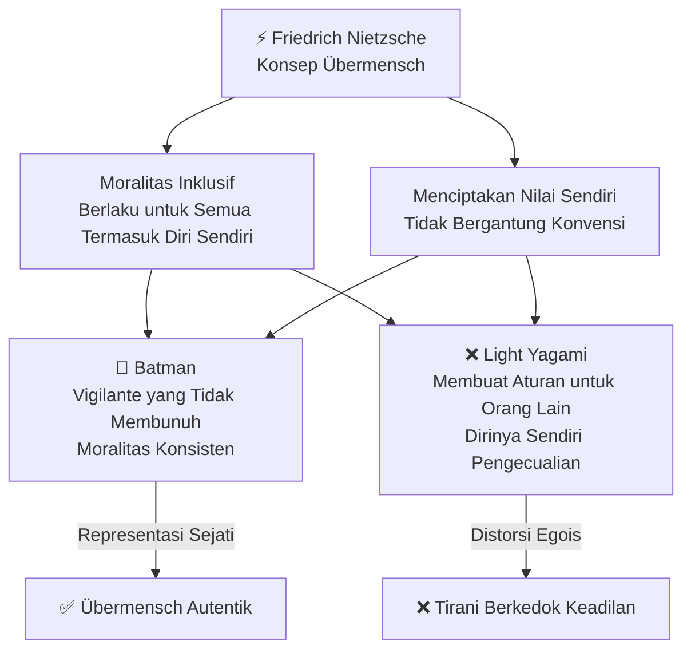
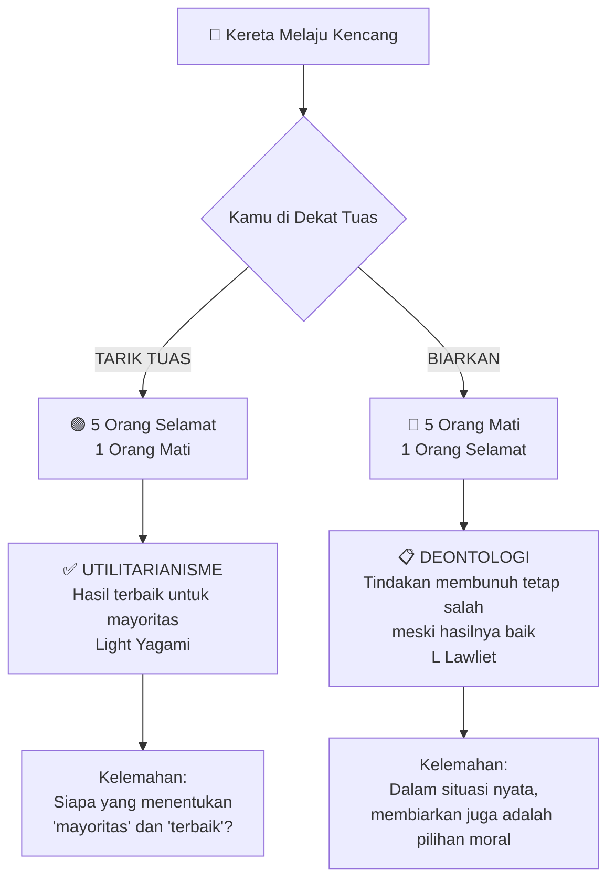
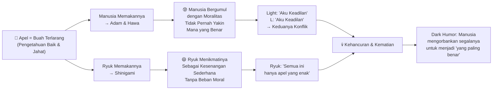
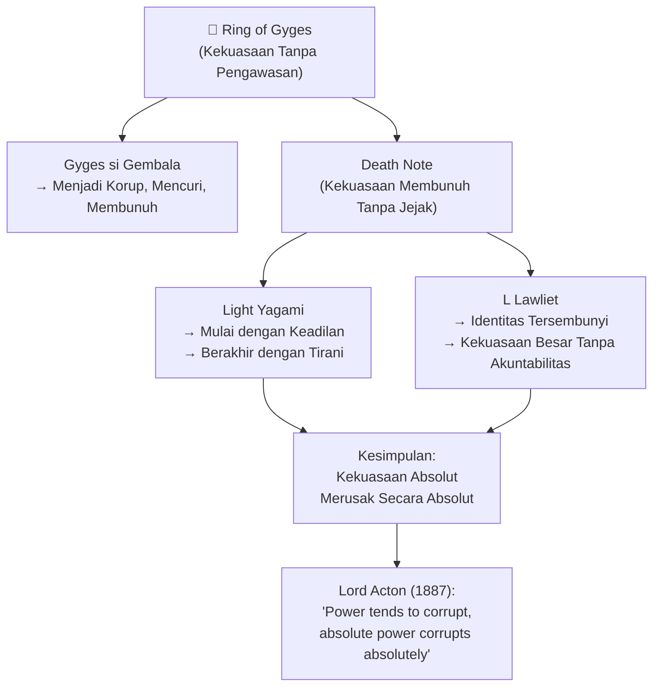
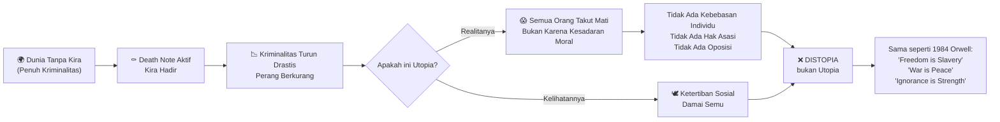
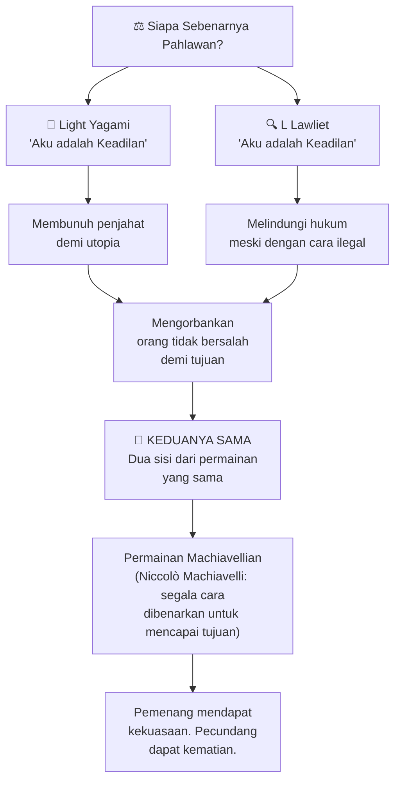
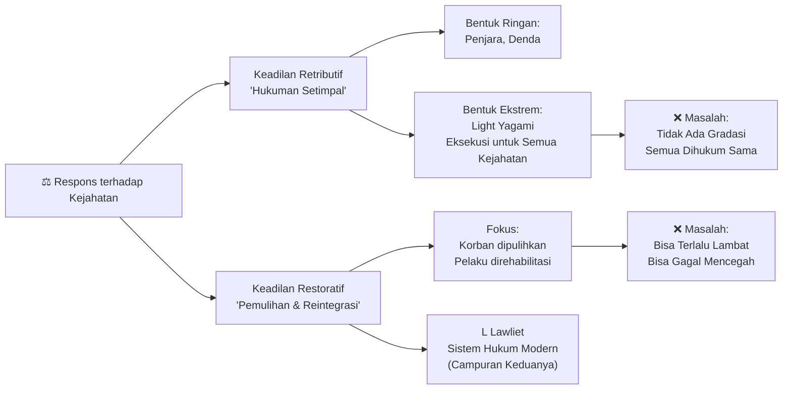
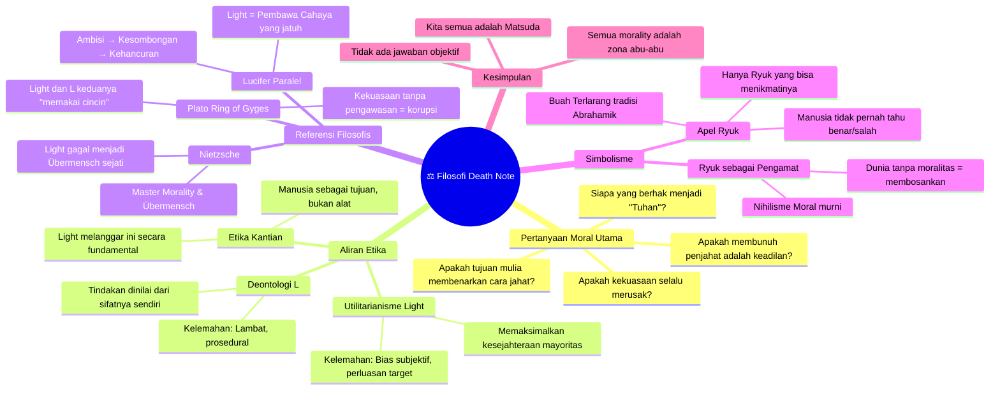

## ⚖️ Pendahuluan: Sebuah Buku yang Jatuh dari Langit

**Death Note** bukan sekadar anime atau manga (*manga* = komik bergaya Jepang) tentang siswa jenius yang menemukan buku supranatural. Ia adalah sebuah **eksperimen filsafat moral** yang dikemas dalam narasi thriller psikologis — salah satu yang terbaik yang pernah diciptakan dalam medium animasi.

Pertanyaan yang diajukannya bukan mudah:

- Apakah boleh membunuh penjahat demi menciptakan dunia yang lebih baik? 🗡️
- Siapa yang berhak mendefinisikan "keadilan"?
- Apakah tujuan yang mulia membenarkan cara yang jahat?
- Dan yang paling mendasar: **siapa sebenarnya yang baik, dan siapa yang jahat?**

Dalam artikel ini, kita tidak sekadar membahas kepribadian Light Yagami atau L. Kita akan membedah lapisan demi lapisan **tema filosofis** yang dirancang dengan sangat cermat oleh penulis Tsugumi Ohba dan ilustrator Takeshi Obata — mulai dari Trolley Problem (*masalah kereta*) hingga Nietzsche, dari Plato hingga nihilisme moral Ryuk. 🍎

---

## 📖 Landasan Cerita: Death Note dan Aturannya

Narasi dimulai dengan **Light Yagami** — siswa tercerdas di Jepang yang hidup dalam kebosanan eksistensial (*existential boredom* = perasaan hampa dan tidak bermakna yang mendalam). Pada suatu hari, sebuah buku hitam jatuh dari langit tepat di hadapannya.

Buku itu adalah **Death Note** — milik **Ryuk**, seorang *Shinigami* (神様死 = Dewa Kematian dalam mitologi Jepang). Aturan utamanya:

<Callout type="warning" title="Aturan Death Note">
**Orang yang namanya ditulis dalam Death Note ini akan mati.** Penulis harus membayangkan wajah orang tersebut saat menulis namanya, agar tidak mengenai orang lain dengan nama yang sama. Jika penyebab kematian tidak ditulis dalam 40 detik setelah nama, orang tersebut akan mati serangan jantung.
</Callout>

Aturan-aturan ini bukan hanya mekanisme cerita — mereka adalah **landasan dilema etika** (*ethical dilemma* = situasi di mana tidak ada pilihan yang sepenuhnya benar secara moral) yang akan terus-menerus dipertanyakan sepanjang series. 📋

Light pertama kali mencobanya secara tidak sengaja dari berita televisi. Lalu ia mengujinya lagi pada seorang pria yang sedang mengganggu perempuan di jalan. Pria itu mati persis seperti yang ditulis. Dan di sinilah **pertanyaan pertama lahir**:

> *Apakah boleh membunuh untuk menghapuskan pembunuh? Apakah boleh melakukan kejahatan terhadap pelaku kejahatan?*

---

## 🧠 Psikologi Light Yagami: Dari Altruisme ke Megalomanía

### Rasionalisasi Cepat — Tanda Bahaya Pertama

Light bergumul dengan pertanyaan moral itu — tapi hanya sebentar. Ia **merasionalisasinya** (*rationalize* = mencari pembenaran logis untuk sesuatu yang sebenarnya lebih didorong emosi atau keinginan pribadi) dengan sangat cepat:

> "Dunia adalah tempat yang busuk. Orang-orang busuk yang bertanggung jawab atas kebusukan dunia harus dihapuskan."

Kecepatannya dalam merasionalisasi ini adalah **tanda bahaya pertama** dalam narasi. Karena seorang yang benar-benar bermotivasi keadilan murni akan terus bergumul dengan pertanyaan moral — bukan langsung mencapai jawaban. Kecepatan rasionalisasi Light mencerminkan sesuatu yang lebih gelap: **keinginan akan kekuasaan yang sudah ada sebelum Death Note datang**. 😈

### Moralitas Tuan: Nietzsche dan Ubermensch

Filsafat moral Light di awal cerita sangat mirip dengan konsep **Moralitas Tuan** (*Master Morality*) yang dikembangkan Friedrich Nietzsche dalam bukunya *On the Genealogy of Morality* (Tentang Genealogi Moralitas, 1887).

**Moralitas Tuan** adalah sistem nilai yang diciptakan oleh individu yang berkuasa, yang menilai kekuatan, keberanian, dan keunggulan sebagai nilai tertinggi — berlawanan dengan **Moralitas Budak** (*Slave Morality*) yang berbasis pada kelemahan, penderitaan, dan resentmen (*resentment* = kebencian yang ditekan).

Light memandang dirinya sebagai figur superior (*superior figure* = tokoh unggul) dengan hak untuk menentukan nasib orang lain. Ia menciptakan nilai-nilainya sendiri yang berbeda dari nilai tradisional masyarakat.

Namun, Nietzsche juga mengembangkan konsep **Übermensch** (Übermensch = bahasa Jerman, secara harfiah "Manusia Atas" atau "Manusia Super" — individu yang melampaui moralitas konvensional dan menciptakan nilainya sendiri secara inklusif). Dan di sinilah Light **gagal** menjadi Übermensch sejati.

<Callout type="info" title="Perbedaan Light vs Batman: Inklusif vs Eksklusif">
**Batman** adalah representasi Übermensch yang lebih autentik menurut kerangka Nietzsche. Meskipun sama-sama *vigilante* (vigilante = individu yang mengambil hukum ke tangan sendiri tanpa otoritas resmi), Batman memiliki **moralitas inklusif** — ia tidak akan membunuh, dan ia memegang prinsip itu tanpa pengecualian untuk dirinya sendiri.

Light sebaliknya: ia menciptakan sistem keadilan **hanya untuk orang lain**, dan menjadikan dirinya sendiri sebagai pengecualian. Ini bukan Übermensch — ini adalah **tirani** (*tyranny* = kekuasaan sewenang-wenang yang menempatkan diri di atas hukum).
</Callout>

### Godfather Baru Dunia: "Aku adalah Tuhan"

Seiring berjalannya cerita, Light bertransformasi total. Ia tidak lagi melihat dirinya sebagai manusia yang membersihkan dunia — ia melihat dirinya sebagai **Tuhan dunia baru**:

> *"Aku adalah Tuhan dunia baru yang akan kuciptakan."*

Inilah momen di mana masker altruisme (*altruism* = tindakan untuk kepentingan orang lain tanpa pamrih) runtuh sepenuhnya. Yang tersisa adalah **God Complex** (*God Complex* = keyakinan irasional bahwa seseorang memiliki kemampuan dan hak seperti Tuhan) dan **megalomania** (*megalomania* = obsesi untuk memiliki kekuasaan yang sangat besar).

Perbandingan yang paling tepat? **Lucifer**.

Nama "Light" sendiri secara tidak sengaja — atau sangat sengaja — mereplikasi etimologi nama Lucifer: dalam bahasa Latin, *Lucifer* berarti **"Pembawa Cahaya"** (*Light-bearer*). Lucifer percaya bahwa ia bisa memimpin lebih baik dari Tuhan, memiliki hak untuk menciptakan dunia baru. Hasilnya: ia diusir dari surga dan jatuh ke neraka. ☄️

Light percaya hal yang sama. Dan hasilnya identik.

---

## 🔍 L: Sang Detektif Tanpa Wajah

### Profil Psikologis L

**L** — yang tidak pernah diketahui nama lengkapnya — adalah antitesis (*antithesis* = lawan yang bertolak belakang secara sempurna) Light dalam hampir semua hal. Ia beroperasi dalam anonimitas (*anonymity* = kondisi di mana identitas seseorang tidak diketahui), tidak pernah menampilkan wajahnya di publik, dan hanya berkomunikasi melalui perantara.

Secara kepribadian, L mirip dengan **Sherlock Holmes** — dan ini bukan kebetulan, karena sangat mungkin L terinspirasi dari detektif konsultan Baker Street itu. Keduanya:

- Membutuhkan stimulasi mental yang luar biasa 🧩
- Memilih kasus berdasarkan seberapa menarik kasus tersebut
- Tidak terlalu peduli pada konvensi sosial
- Bergantung pada kebiasaan aneh (L: duduk jongkok, makan manis-manisan berlebihan)

### Deontologi L: Prosedur adalah Segalanya

Meskipun L tidak pernah secara eksplisit menyatakan posisi filosofisnya, kita bisa menyimpulkan bahwa ia beroperasi dalam kerangka **Deontologi** (*Deontology* = aliran etika yang menilai moralitas suatu tindakan berdasarkan tindakan itu sendiri, bukan hasilnya — dari bahasa Yunani *deon* yang berarti "kewajiban").

L secara konsisten **menghormati prosedur dan protokol hukum** (*legal protocol* = aturan tata cara yang harus diikuti dalam proses hukum). Meskipun ia sudah tahu dari awal bahwa Light adalah Kira, ia tetap mencari bukti — karena **tanpa bukti, hukuman tidak bisa dijatuhkan secara sah**.

Ini adalah kebalikan sempurna dari Light yang bertindak berdasarkan keyakinan pribadi tanpa prosedur apapun.

### Kelemahan L: Permainan, Bukan Keadilan

Namun cerita ini tidak berhenti di situ. L — seperti Light — ternyata **juga tidak benar-benar peduli pada keadilan**.

Yang L pedulikan adalah **stimulasi otak**. Ia memilih kasus Kira bukan karena ingin menyelamatkan dunia, melainkan karena kasus ini memberikan **tantangan yang belum pernah ada sebelumnya** — sebuah misteri yang menarik. Rasionalisasi tentang keadilan hanyalah justifikasi atas kesenangan intelektualnya sendiri.

L juga melakukan hal-hal yang tidak bisa dikategorikan "baik":
- Menangkap dan menyiksa (*torture* = menyakiti seseorang secara fisik atau psikologis untuk mendapat informasi) Misa Amane
- Mengurung Light tanpa bukti memadai
- Menggunakan tipu daya dan manipulasi secara ekstensif
- Lebih mementingkan kemenangan dalam "permainan" daripada keselamatan orang lain

<Callout type="quote" title="L tentang Kira">
*"Psikologi dari Kira sudah mencapai tingkat yang mulia — The Divine Level. Seseorang yang akan melakukan apapun untuk mencapai tujuannya, apapun yang harus dikorbankan."*

Ironisnya, L mungkin sudah mencapai level yang sama untuk dirinya sendiri.
</Callout>

---

## ⚖️ Utilitarianisme vs Deontologi: Dua Cara Memandang Moralitas

### Trolley Problem: Alegori Sempurna

Untuk memahami pertentangan filosofis antara Light dan L, kita perlu memahami dua aliran etika terbesar: **Utilitarianisme** dan **Deontologi**. Dan cara terbaik menjelaskannya adalah melalui **Trolley Problem** (Masalah Kereta — alegori filsafat yang diciptakan oleh Philippa Foot pada 1967).

Sebuah kereta melaju kencang. Di depannya, **lima orang terikat** di rel. Kamu berdiri di dekat tuas yang bisa membelokkan kereta ke jalur lain — tapi di jalur itu ada **satu orang terikat**.

**Apakah kamu menarik tuas — membunuh satu orang demi menyelamatkan lima?**

| Aliran | Prinsip Utama | Representasi dalam Death Note | Kelemahan |
|:---|:---|:---|:---|
| **Utilitarianisme** | Tindakan benar jika memaksimalkan kesejahteraan mayoritas | Light Yagami — membunuh penjahat untuk kebaikan masyarakat | Siapa yang berwenang mendefinisikan "kesejahteraan"? |
| **Deontologi** | Tindakan benar/salah berdasarkan sifat tindakan itu sendiri, bukan hasilnya | L — mengikuti prosedur hukum meski hasilnya lambat | Bagaimana jika prosedur gagal melindungi yang tidak bersalah? |
| **Etika Kantian** | Manusia adalah tujuan, bukan alat | Kritik terhadap Light — manusia tidak boleh diperlakukan sebagai sarana | Terlalu kaku dalam situasi ekstrem |

### Light sebagai Utilitarian yang Rusak

Light percaya bahwa untuk menciptakan dunia yang lebih baik — bebas dari kejahatan — ia harus membunuh semua yang bertanggung jawab atas kejahatan itu. Ini adalah logika utilitarian (*utilitarian logic* = kalkulasi bahwa kebaikan terbesar bagi jumlah terbesar adalah standar moral tertinggi) yang murni.

Namun, utilitarianisme Light mengandung **kelemahan kritis**:

1. **Bias Subjektif**: Siapa yang menentukan siapa yang "jahat"? Light sendiri — yang berarti standar keadilan sepenuhnya subjektif.

2. **Perluasan Target yang Tidak Terbatas**: Light mulai membunuh para kriminal. Lalu ia membunuh orang-orang yang menghalangi jalannya. Lalu siapapun yang menentangnya. **Di mana batasnya?**

3. **Kontradiksi Internal**: Light menginginkan dunia yang diisi oleh orang-orang jujur dan pekerja keras — seperti ayahnya sendiri. Namun ia dengan mudah mengorbankan ayahnya sendiri demi ambisinya. Ia mengkotradiksi nilai-nilai yang ia klaim diperjuangkan.

<Callout type="danger" title="Kelemahan Fatal Utilitarianisme Light">
Kebanyakan penjahat di dunia nyata tidak melakukan kejahatan karena mereka jahat secara inheren (*inherently evil* = jahat secara bawaan). Mereka tertekan oleh **faktor eksternal**: ketidakstabilan ekonomi, lingkungan kekerasan, trauma masa lalu, kurangnya akses pendidikan.

Menghukum semua orang dengan kejahatan yang berbeda-beda, motif berbeda-beda, dengan hukuman yang **sama** — kematian — tidak hanya tidak adil. Ia adalah **kekejaman yang lebih besar** dari kejahatan yang coba dihapuskannya.
</Callout>

---

## 🍎 Simbolisme Apel: Buah Terlarang dan Nihilisme Ryuk

### Apel dalam Tradisi Abrahamik

Penggunaan apel dalam Death Note **bukan kebetulan**. Dalam tradisi Abrahamik (*Abrahamic tradition* = tradisi tiga agama yang berakar pada Nabi Ibrahim: Yahudi, Kristen, Islam), apel dipercayai sebagai **Buah Terlarang** dari Pohon Pengetahuan Kebaikan dan Kejahatan di Taman Eden.

Ketika Adam dan Hawa memakannya, mereka mendapatkan pengetahuan tentang apa yang baik dan apa yang jahat — dan bersama pengetahuan itu datang **penderitaan**, karena manusia tidak siap menanggung beban moral absolut tersebut.

### Ryuk: Nihilisme Moral yang Murni

**Ryuk** adalah karakter paling filosofis dalam Death Note, justru karena ia **tidak berfilsafat sama sekali**. Ia tidak memihak siapapun. Ia tidak membantu Light, tidak memandu, tidak menghakimi. Ia hanya **mengamati** — dengan rasa penasaran dan hiburan.

Ryuk adalah representasi **Nihilisme Moral** (*Moral Nihilism* = pandangan bahwa tidak ada nilai moral yang objektif — tidak ada yang benar-benar baik atau benar-benar jahat secara universal):

- Di dunia Shinigami, tidak ada baik dan jahat
- Tidak ada hukum, tidak ada drama
- Semua itu membuat segalanya sangat **membosankan**
- Apel di dunia Shinigami tidak ada rasanya — karena tanpa moralitas, tidak ada aroma, tidak ada rasa, tidak ada warna

Maka ketika Death Note jatuh ke tangan manusia — seorang **megalomania** (*megalomania* = obsesi patologis terhadap kekuasaan yang sangat besar) yang kebetulan juga berlawanan dengan **detektif terhebat di dunia** — Ryuk mendapatkan hiburan terbaik yang pernah ada. Apelnya kembali terasa lezat. 🍎

<Callout type="quote" title="Makna Simbolis Ryuk">
Fakta bahwa **hanya Ryuk** yang bisa menikmati apel di dunia manusia menunjukkan bahwa hanya entitas yang **terlepas dari moralitas manusia** yang bisa bergumul dengan kompleksitas itu secara netral.

Manusia — Light dan L — terlalu terlibat, terlalu egois, terlalu terdorong oleh keinginan menang untuk bisa melihat moralitas secara objektif.
</Callout>

---

## 🏛️ Ring of Gyges: Kekuasaan Tanpa Pengawasan

### Alegori Plato

**Ring of Gyges** (Cincin Gyges) adalah alegori (*allegory* = cerita yang mengandung makna tersembunyi yang lebih dalam dari makna literalnya) yang dikembangkan oleh Plato dalam karyanya *The Republic* (sekitar 380 SM).

Dalam cerita itu, seorang gembala bernama Gyges menemukan cincin yang membuatnya bisa **menghilang** sesuai keinginan. Dengan kekuatan itu, ia menjadi korup: mencuri, memanipulasi, membunuh, dan akhirnya merebut tahta kerajaan. Pertanyaan yang diajukan Plato:

> **Apakah manusia akan tetap bermoral jika ia tahu tindakannya tidak bisa dihukum?**

Light adalah Gyges modern. Death Note memberinya kekuatan untuk membunuh siapapun tanpa meninggalkan bukti fisik. Dan seperti Gyges, ia menjadi korup.

Yang sangat tragis adalah **Light sendiri pernah menyadari ini**. Ia pernah berkata bahwa orang yang tidak bisa melepaskan kekuasaan setelah mendapatkannya adalah orang yang paling mudah dikorupsi. Dan itulah yang terjadi padanya — ia tidak bisa melepaskannya.

### L dan Cincin Anonimitasnya

L juga memiliki "Ring of Gyges" versinya: **anonimitas total**. Tidak ada yang tahu siapa dia, di mana dia, bagaimana wajahnya. Kekuasaan ini membuatnya bisa mengambil kasus apapun tanpa akuntabilitas (*accountability* = kewajiban untuk mempertanggungjawabkan tindakan kepada pihak lain).

Dan seperti Gyges, L tidak sepenuhnya menggunakan kekuasaan itu untuk kebaikan murni. Ia menggunakannya untuk kesenangan — stimulasi intelektual yang tidak bisa ia dapatkan dari kasus-kasus biasa.

---

## 🌓 Utopia atau Distopia? Dunia Baru Kira

### Karakteristik Utopia yang Sejati

Jika kita mendefinisikan **Utopia** (*Utopia* = dari bahasa Yunani *ou-topos*, "tempat yang tidak ada" — masyarakat ideal yang sempurna) secara umum, ia memiliki karakteristik:

- Damai dan harmonis, bebas dari penderitaan dan konflik 🕊️
- Memiliki kesetaraan dan keadilan sejati
- Menghormati hak dan kebebasan individu
- Memiliki standar etika yang tinggi

Dunia Kira memang berhasil **mengurangi kriminalitas dan perang secara drastis**. Tapi apakah itu benar-benar utopia?

<Callout type="danger" title="Utopia Kira adalah Distopia">
Kriminalitas berkurang di dunia Kira bukan karena orang-orang *menjadi lebih baik*. Mereka berkurang karena semua orang **takut mati**.

Sebuah masyarakat yang tertib karena ketakutan bukanlah utopia — ia adalah **distopia** (*dystopia* = masyarakat yang tampak sempurna dari luar namun menindas di dalamnya). Tidak berbeda dengan rezim totaliter (*totalitarian regime* = sistem pemerintahan di mana negara memiliki kendali absolut atas semua aspek kehidupan) yang mengklaim kebebasan sembari menghapus kebebasan itu sendiri.

*George Orwell* dalam *1984* menggambarkan hal yang identik: masyarakat yang "damai" melalui **doublethink** (*doublethink* = kemampuan menerima dua kepercayaan yang bertentangan secara bersamaan sebagai kebenaran) dan penghapusan sejarah.
</Callout>

### Pertanyaan yang Paling Berat

Namun ada satu kemungkinan yang sangat mengganggu yang diajukan oleh **Matsuda** — satu-satunya karakter yang berani melihat keduanya secara jujur:

> *"Mungkin saja yang dilakukan Light itu benar dan yang dilakukan oleh sistem hukum selama ini salah... mungkin saja, kalau dia tetap berpegang teguh pada moralitasnya, kalau dia tidak menginginkan ego sebesar itu, tidak menginginkan orang-orang menyembahnya... bisa saja, utopia yang ingin dia ciptakan akan menjadi kenyataan."*

Ini adalah momen paling tragis dalam seluruh series. Karena **kemungkinan itu ada**. Dan itu yang membuat Matsuda — yang akhirnya menembak Light — menembak dengan air mata. Bukan karena ia yakin Light salah. Tapi karena ia sadar bahwa jawabannya tidak pernah benar-benar jelas. 💔

---

## 🎭 Dua Sisi Koin yang Sama: Light dan L

### Paralel yang Mencengangkan

Sepanjang series, kita diarahkan untuk melihat Light sebagai penjahat dan L sebagai pahlawan. Tapi cerita ini pada akhirnya mengungkapkan bahwa **keduanya adalah dua sisi dari koin yang sama**:

| Aspek | Light Yagami (Kira) | L Lawliet |
|:---|:---|:---|
| **Motivasi Sejati** | Stimulasi kekuasaan, bukan keadilan murni | Stimulasi intelektual, bukan keadilan murni |
| **Metode** | Pembunuhan massal | Tipu daya, manipulasi, pelanggaran hak privasi |
| **Ego** | Menyebut diri Tuhan | Hanya memilih kasus yang "menarik" untuknya |
| **Korban Tak Bersalah** | Membunuh orang yang menghalangi jalannya | Memenjarakan dan menyiksa Misa tanpa bukti memadai |
| **Pandangan tentang Keadilan** | Keadilan = dirinya menang | Keadilan = kasusnya selesai |
| **"Ring of Gyges"** | Death Note (kekuasaan membunuh) | Anonimitas total (kekuasaan tanpa akuntabilitas) |

### Permainan Machiavellian

**Niccolò Machiavelli** (1469-1527) dalam karyanya *The Prince* (Sang Pangeran, 1532) berargumen bahwa dalam politik, **tujuan membenarkan cara** (*the ends justify the means*). Seorang pemimpin harus bersedia melakukan tindakan yang secara moral dipertanyakan demi mencapai stabilitas dan kekuasaan.

Light dan L keduanya bermain dalam kerangka Machiavellian ini. Mereka menggunakan manipulasi, penipuan, dan strategi licik (*cunning strategy*) tidak demi keadilan yang mereka klaim — tapi demi **kemenangan**. Ini adalah **zero-sum game** (*zero-sum game* = permainan di mana keuntungan satu pihak sama persis dengan kerugian pihak lain) yang mereka mainkan sejak episode kedua.

---

## 🔄 Keadilan Retributif vs Restoratif

Dalam ranah hukum, terdapat dua pendekatan utama dalam menjawab kejahatan:

**Keadilan Retributif** (*Retributive Justice* = keadilan yang berfokus pada hukuman setimpal bagi pelanggar) — hukuman harus sebanding dengan pelanggaran. Ini adalah prinsip *lex talionis* (hukum balas dendam): mata ganti mata, nyawa ganti nyawa.

**Keadilan Restoratif** (*Restorative Justice* = keadilan yang berfokus pada pemulihan, bukan hukuman) — fokus pada pemulihan korban, pertanggungjawaban pelaku, dan reintegrasi (*reintegration* = proses memulangkan seseorang ke dalam masyarakat) pelaku ke masyarakat.

Light mengambil bentuk paling ekstrem dari keadilan retributif: **eksekusi** (*execution* = hukuman mati) untuk semua kejahatan. L mempertahankan sistem yang lebih condong ke keadilan restoratif secara progresif.

---

## 🌑 Zona Abu-abu: Tidak Ada Hitam dan Putih

### Kompleksitas Moral yang Sengaja Diciptakan

Salah satu pencapaian terbesar Death Note sebagai karya sastra (*literary work*) adalah keberaniannya untuk **tidak memberikan jawaban** tentang siapa yang benar dan siapa yang salah.

Kebaikan, kejahatan, moralitas, keadilan — semuanya **blur** (*blur* = kabur, tidak jelas batasnya) dalam cerita ini. Tidak ada hitam dan putih. Semuanya abu-abu.

Relativisme moral (*moral relativism* = pandangan bahwa standar moral berbeda-beda tergantung individu, budaya, atau konteks) masing-masing karakter menekankan bahwa objektivitas moral — kemampuan untuk menilai suatu tindakan sebagai benar atau salah secara mutlak — adalah ilusi.

### Matsuda: Representasi Kita Semua

Matsuda adalah karakter yang paling merepresentasikan **penonton**. Ia seorang penegak hukum yang memahami prosedur, tapi ia juga melihat efektivitas tindakan Kira. Ia berada di tengah — tidak yakin siapa yang benar.

Dan ketika ia akhirnya menembak Light, ia melakukannya bukan dengan keyakinan penuh bahwa Light salah. Ia melakukannya dengan **air mata** — karena ia tahu bahwa mungkin ada kemungkinan kecil bahwa Light benar, tapi kenyataan yang sudah terlanjur terjadi terlalu mengerikan untuk dibiarkan berlanjut.

Kita, sebagai penonton, merasakan hal yang sama. 😢

---

## 📊 Rangkuman Filosofis: Semua Pertanyaan yang Tidak Dijawab

---

## 🏆 Kesimpulan: Pertanyaan yang Terus Hidup

Death Note tidak memberikan jawaban. Itulah yang membuatnya agung. 🌟

Ia mengajukan pertanyaan-pertanyaan yang telah bergema selama ribuan tahun dalam filsafat manusia:

1. **Apakah tujuan membenarkan cara?** — Machiavelli akan berkata ya. Kant akan berkata tidak pernah. Dan kita masih tidak tahu. 🤔

2. **Apakah ada orang yang benar-benar layak mendefinisikan "keadilan"?** — Setiap orang yang mengklaim dirinya keadilan absolut — dari Light hingga L, dari penguasa hingga hakim — adalah manusia biasa dengan bias, ego, dan kepentingan pribadi.

3. **Apa yang terjadi ketika kekuasaan diberikan tanpa pengawasan?** — Ring of Gyges Plato berusia 2.400 tahun, dan Death Note menjawabnya dengan cara yang sama: manusia menjadi korup.

4. **Apakah moralitas itu objektif?** — Ryuk, yang memandang semua drama ini seperti apel yang lezat, memberi jawaban yang paling jujur: mungkin tidak.

Dan yang paling mengganggu dari semuanya — **pertanyaan Matsuda**:

> *"Mungkin saja... kalau dia tidak terlalu egois... mungkin saja utopia itu bisa jadi nyatanya."*

Kita tidak akan pernah tahu. Dan ketidaktahuan itulah yang membuat Death Note menjadi salah satu karya paling filosofis dalam sejarah medium animasi. 🍎

<Callout type="tip" title="Untuk Direnungkan">
Kamu adalah siapa dalam cerita ini?

- **Light**: Percaya bahwa tujuanmu cukup mulia untuk membenarkan cara apapun?
- **L**: Percaya bahwa prosedur dan aturan adalah yang terpenting, meski hasilnya lambat?
- **Matsuda**: Melihat keduanya, tidak yakin mana yang benar, tapi tetap bertindak?
- **Ryuk**: Mengamati semua drama manusia dengan detasemen (*detachment* = keterlepasan emosional)?

Atau... apakah kamu sudah menyadari bahwa dalam kehidupan nyata, kita bergantian menjadi semua dari mereka?
</Callout>

---

## 🧩 Glosarium Lengkap

| Istilah | Penjelasan |
|:---|:---|
| **Manga** | Komik bergaya Jepang, dibaca dari kanan ke kiri |
| **Shinigami** | 死神 — Dewa Kematian dalam mitologi Jepang |
| **Ethical Dilemma** | Dilema etika — situasi di mana tidak ada pilihan yang sepenuhnya benar secara moral |
| **Rationalize** | Merasionalisasikan — mencari pembenaran logis untuk sesuatu yang sebenarnya lebih didorong keinginan pribadi |
| **Altruism** | Altruisme — tindakan untuk kepentingan orang lain tanpa pamrih |
| **Megalomanía** | Obsesi patologis terhadap kekuasaan yang sangat besar |
| **God Complex** | Keyakinan irasional bahwa seseorang memiliki kemampuan dan hak seperti Tuhan |
| **Übermensch** | Bahasa Jerman — "Manusia Atas/Super" — konsep Nietzsche tentang individu yang melampaui moralitas konvensional |
| **Master Morality** | Moralitas Tuan (Nietzsche) — sistem nilai yang diciptakan oleh individu berkuasa |
| **Vigilante** | Individu yang mengambil hukum ke tangan sendiri tanpa otoritas resmi |
| **Utilitarianisme** | Aliran etika yang menilai kebenaran tindakan dari hasilnya — tindakan baik jika memaksimalkan kesejahteraan mayoritas |
| **Deontologi** | Aliran etika yang menilai tindakan dari sifatnya sendiri, bukan hasilnya — dari bahasa Yunani *deon* (kewajiban) |
| **Trolley Problem** | Alegori filsafat: pilih membunuh 1 orang untuk menyelamatkan 5, atau biarkan 5 mati |
| **Ring of Gyges** | Alegori Plato tentang cincin ajaib yang membuat pemakainya tidak terlihat — simbol kekuasaan tanpa pengawasan |
| **Utopia** | Dari bahasa Yunani *ou-topos* = "tempat yang tidak ada" — masyarakat ideal sempurna |
| **Dystopia** | Masyarakat yang tampak sempurna dari luar namun menindas di dalamnya |
| **Doublethink** | Konsep Orwell dalam *1984* — kemampuan menerima dua kepercayaan bertentangan sebagai kebenaran |
| **Moral Nihilism** | Nihilisme Moral — pandangan bahwa tidak ada nilai moral yang objektif |
| **Moral Relativism** | Relativisme Moral — standar moral berbeda-beda tergantung individu dan konteks |
| **Retributive Justice** | Keadilan Retributif — berfokus pada hukuman setimpal |
| **Restorative Justice** | Keadilan Restoratif — berfokus pada pemulihan korban dan rehabilitasi pelaku |
| **Machiavellian** | Strategi yang menghalalkan segala cara untuk mencapai tujuan (dari Niccolò Machiavelli) |
| **Zero-sum game** | Permainan di mana keuntungan satu pihak = kerugian pihak lain |
| **Atavism** | Kemunculan kembali sifat leluhur primitif dalam individu modern |
| **Detachment** | Keterlepasan emosional dari situasi |
| **Anonymity** | Kondisi di mana identitas seseorang tidak diketahui |
| **Accountability** | Kewajiban untuk mempertanggungjawabkan tindakan kepada pihak lain |
| **Reintegration** | Proses memulangkan seseorang ke dalam masyarakat setelah masa hukuman |

---

*Artikel ini berdasarkan analisis mendalam terhadap transkrip video filosofi Death Note komprehensif. Death Note diciptakan oleh Tsugumi Ohba (penulis) dan Takeshi Obata (ilustrator), diterbitkan di Shonen Jump (2003-2006).* 🛠️
